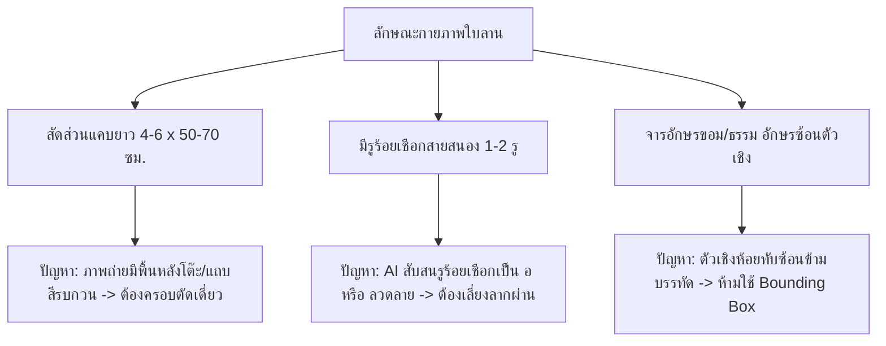
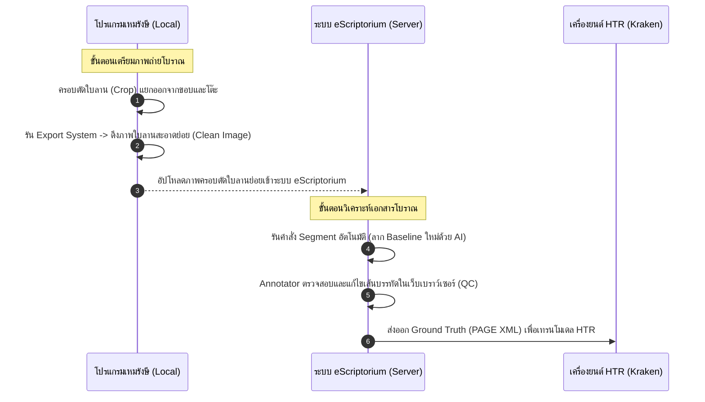

# คู่มือการเตรียมเอกสารโบราณด้วยโปรแกรมเหมรังษี: การครอบตัดภาพและการกำหนดเส้นพื้นฐาน (Baseline)

> **ประเภทเอกสาร:** คู่มือปฏิบัติการ (Software User Guide)  
> **เวอร์ชันระบบ:** 3.5.1-alpha (Electron + React + OpenSeadragon + SQLite)  
> **อัปเดตล่าสุด:** มิถุนายน 2026  
> **เวลาอ่าน:** ~25 นาที  

---

## 1. บทนำและสถาปัตยกรรมพื้นฐานของโปรแกรมเหมรังษี (Introduction & Architecture)

**โปรแกรมเหมรังษี (Hemrangsri)** เป็นซอฟต์แวร์ประยุกต์ภายใน (Internal Tool) ที่พัฒนาขึ้นโดยใช้เทคโนโลยีเดสก์ท็อปไฮบริด **Electron + React + TypeScript + Tailwind CSS** ร่วมกับคลังรูปภาพความละเอียดสูงแบบ **OpenSeadragon (OSD)** และระบบฐานข้อมูลท้องถิ่น **SQLite** มีวัตถุประสงค์หลักเพื่อช่วยให้นักวิจัยและนักเอกสารโบราณสามารถเตรียมข้อมูลชุดเรียนรู้ (Dataset) และถอดความเอกสารโบราณภาษาไทย (โดยเฉพาะอักษรขอมไทย อักษรธรรมล้านนา และอักษรไทยย่อ) ได้อย่างแม่นยำ สะดวกรวดเร็ว ก่อนที่จะนำไปฝึกสอนโมเดลปัญญาประดิษฐ์ในระบบ HTR (Handwritten Text Recognition)

ด้วยการประสานโมดูลหลัก 2 ส่วนคือ **โมดูลครอบตัดและจัดโครงสร้างภาพ (Crop & Image System)** และ **โมดูลบรรณวิภัช (Bannwiphat Module)** โปรแกรมเหมรังษีทำหน้าที่เป็นสะพานเชื่อมระหว่างกายภาพของภาพถ่ายต้นฉบับโบราณและการทำนายของคอมพิวเตอร์ผ่านกระบวนการปฏิสัมพันธ์ที่มีมนุษย์ควบคุม (Human-in-the-loop)

### โครงสร้างพิกัดภาพ (Coordinate Systems) ของ OpenSeadragon ในโปรแกรม
ในการใช้งานผู้ใช้จำเป็นต้องเข้าใจการแปลงระดับพิกัดที่เหมรังษีจัดการอยู่เบื้องหลัง เพื่อให้การตีกรอบแม่นยำตามสัจจะกายภาพของภาพ:
1. **Screen Coordinates (พิกัดหน้าจอ):** พิกัดในหน่วยพิกเซลบนหน้าจอแสดงผลจริงของคอมพิวเตอร์ ซึ่งจะแปรเปลี่ยนตามขนาดหน้าต่างเบราว์เซอร์และการซูมของระบบปฏิบัติการ
2. **Viewport Coordinates (พิกัดวิวพอร์ต):** พิกัดอ้างอิงของ OpenSeadragon ที่มีค่าตั้งแต่ `0` ถึง `1` บนแกนกว้าง ซึ่งเป็นอิสระจากความละเอียดของภาพถ่ายต้นฉบับ
3. **Image Coordinates (พิกัดพิกเซลภาพจริง):** พิกัดจริงบนไฟล์ภาพถ่ายดิจิทัลความละเอียดสูง (เช่น ภาพขนาด 13,861 × 3,029 พิกเซล) การบันทึกพิกัดครอบตัด (Crop) และเส้นพื้นฐาน (Baseline) ของเหมรังษีจะใช้ระบบนี้เป็นหลักเพื่อความ deterministic ของข้อมูล

---

## 2. ลักษณะกายภาพของคัมภีร์ใบลานไทยและความท้าทายต่อ HTR (Physical Characteristics & HTR Challenges)

คัมภีร์ใบลานไทยทำจากใบของต้นลาน (*Corypha umbraculifera*) มีความกว้างประมาณ 4-6 เซนติเมตร และยาวประมาณ 50-70 เซนติเมตร โดยปกติจะมีบรรทัดประมาณ 4-6 บรรทัดต่อหน้า มีรูเจาะ (◯ หรือ `<hole/>`) 1-2 รู สำหรับร้อยเชือกผูกมัดรวมเป็นคัมภีร์



### ทำไมระบบ HTR ของอักษรโบราณไทยจึงห้ามใช้ Bounding Box?
In ระบบ OCR แบบเก่า จะใช้วิธีตีกรอบสี่เหลี่ยม (Bounding Box) รอบบรรทัดหรือรอบตัวอักษร ทว่า อักษรขอมไทยและอักษรธรรมล้านนามีลักษณะเด่นคือเป็น **อักษรแบบสระซ้อนและพยัญชนะซ้อนเชิง (Subscript Consonants)** ที่มีการห้อยตัวเชิงลงมาใต้บรรทัดหลัก และลอยสระบนขึ้นไปเหนือบรรทัดหลักอย่างเป็นเอกเทศ 

หากใช้ Bounding Box กรอบสี่เหลี่ยมของบรรทัดบนจะเกิดการ **ทับซ้อนทางกายภาพ (Spatial Overlap)** กับกรอบของบรรทัดล่าง ส่งผลให้พิกเซลของสระบนและตัวเชิงปะปนกัน ระบบประมวลผล HTR (เช่น Kraken) จะสับสนและทำนายข้อความผิดพลาดอย่างรุนแรง

ดังนั้น โปรแกรมเหมรังษีจึงนำสถาปัตยกรรม **Baseline (เส้นพื้นฐาน) ร่วมกับ Polygon (หลายเหลี่ยมล้อมรอบ)** มาใช้ โดยที่:
* **Baseline** จะลากผ่านเฉพาะรอยต่อใต้ฐานของพยัญชนะหลัก (ห้ามตัดผ่านตัวเชิงและสระล่าง)
* **Polygon** จะล้อมรอบพื้นที่ขอบเขตของบรรทัดนั้นๆ อย่างยืดหยุ่นตามส่วนโค้งเว้าของสระและตัวเชิง โดยไม่ทับซ้อนกัน

---

## 3. การใช้งานเครื่องมือครอบตัดภาพ (Crop Tool) ของเหมรังษี

เครื่องมือครอบตัดภาพ (Crop Tool) ในระบบเหมรังษี ถูกออกแบบมาเพื่อคัดแยกส่วนที่เป็นหน้าเอกสารจริง (เช่น ครอปเอาใบลานเดี่ยวๆ ออกมาจากภาพถ่ายดิบที่มีพื้นหลังโต๊ะไม้ หรือตัดหน้าสมุดไทยซ้าย-ขวาออกจากรอยพับตรงกลาง) 

### 3.1 คุณสมบัติเด่นของอินเทอร์เฟซระบบภาพ
* **Per-Slot Control:** หน้าจอ Viewer ของเหมรังษีสามารถเปิดโหมด Split View (แสดงผลสองภาพขนานกัน) ได้ โดยแต่ละส่วนจะมี `slotId` กู้คืนการทำงานเฉพาะตัว เช่น `slotId='0-0'` หรือ `slotId='0-1'`
* **isPassive Mode:** เมื่อเปิดใช้งานมุมมองแบ่งส่วน Slot ที่ไม่ได้ถูกเลือกทำงาน (Active) จะเข้าสู่โหมด passive เพื่อแสดงตำแหน่งกรอบทับซ้อน (Overlay) ให้เห็น แต่ป้องกันไม่ให้คีย์บอร์ดหรือเมาส์ไปขยับเขยื้อนพิกัดโดยไม่ตั้งใจ
* **Single-Shot Crop Mode:** เพื่ออำนวยความสะดวกให้ผู้ใช้งาน เมื่อเปิดใช้งานโหมดนี้และลากเส้นครอบตัดเสร็จสิ้น 1 กรอบ เครื่องมือวาดจะทำการปลดอาวุธตัวเอง (Disarm) กลับไปสู่โหมดดูภาพปกติ (Idle) ทันที ช่วยลดข้อผิดพลาดจากการที่เมาส์ลากโดนจอภาพแล้วเกิดกรอบครอบตัดซ้อนเรี่ยราด
* **Pan Lock System (Requester-Based):** เพื่อแก้ปัญหาขณะที่ผู้ใช้พยายามวาดกรอบสี่เหลี่ยมหรือโพลีกอน แล้วเอนจินซูมภาพ OpenSeadragon จับทิศทางผิดและกลายเป็นการลากย้ายตำแหน่งจอ (Panning) เหมรังษีได้ใช้ระบบนับชื่อผู้ขอสั่งล็อก (Lock Requesters) โดยเมื่อเข้าสู่โหมดลากกรอบ ฟังก์ชัน `useCropDrawing` จะส่งคำร้องขอไปขัดขวางการ Pan ของหน้าจอ และจะปล่อยคืนการควบคุมเมื่อกดบันทึกหรือยกเลิกเรียบร้อยแล้วเท่านั้น

### 3.2 ขั้นตอนปฏิบัติการครอบตัดภาพ (Step-by-Step Cropping Guide)

```
[ขั้นตอนการครอบตัดภาพใบลานเดี่ยวออกจากภาพดิบ]
1. เลือกภาพถ่ายดิบ -> 2. กดปุ่ม "Crop Tool" (หรือคีย์ลัด C) -> 3. เลือกโหมด Rect (สี่เหลี่ยม) หรือ Polygon (หลายเหลี่ยม)
-> 4. ลากเมาส์ครอบเฉพาะเนื้อใบลาน -> 5. ตรวจสอบป้ายชื่ออักขระใน Inspector -> 6. กด Confirm เพื่อบันทึกลงโปรเจกต์
```

1. **การเข้าสู่โหมดครอบตัด:** ดับเบิลคลิกเปิดโปรเจกต์ `.hemr` เลือกหน้าใบลานที่ต้องการประมวลผล จากนั้นคลิกไอคอนเครื่องมือ **"ครอบตัด (Crop Tool)"** บริเวณแถบเมนูด้านข้าง หรือกดแป้นพิมพ์ลัด `C`
2. **การวาดกรอบขอบเขต:**
   * **โหมดสี่เหลี่ยม (Rectangular Crop):** คลิกเมาส์ซ้ายค้างที่มุมบนซ้ายของใบลาน ลากเมาส์เป็นกรอบสี่เหลี่ยมผืนผ้าจนครอบคลุมขอบใบลานทั้งหมดแล้วปล่อยเมาส์
   * **โหมดโพลีกอน (Polygon Crop):** ใช้ในกรณีใบลานบิดเบี้ยวหรือเอียงคดเคี้ยว ให้คลิกจุดมุมที่ 1, 2, 3 และ 4 ไล่ไปตามสรีระโค้งมนของขอบลาน จากนั้นดับเบิลคลิกที่จุดสุดท้ายเพื่อปิดล้อมกรอบ
3. **การทำงานร่วมกับ CloudCapture (แถบข้าง):** เมื่อวาดเสร็จ ภาพย่อ (Thumbnail) ของพื้นที่ที่ครอบตัดจะถูกเจนเนอเรตและแสดงผลที่แถบด้านขวา (CloudCapture Panel) ทันที ผู้ใช้สามารถคลิกขยายภาพย่อ ปรับจำนวนคอลัมน์การแสดงผล หรือพิมพ์ Tag Metadata เพื่อคัดกรองประเภทส่วนภาพ (เช่น กรองเฉพาะ "รูปภาพลายภาพวาด", "อักขระกำกับหน้า")
4. **ข้อเสนอแนะในการทำความสะอาดขอบภาพ:** 
   * ควรกำหนดกรอบให้เว้นห่างจากพิกเซลขอบนอกที่เป็นเงาดำหรือพื้นที่โต๊ะถ่ายภาพเล็กน้อย เพื่อหลีกเลี่ยงการนำพิกเซลสิ่งรบกวนเข้าไปสกัดหมึกดำ (Binarization)
   * หากมีรอยแตกแหว่งฉีกขาดบริเวณขอบลาน ให้ครอบขอบเท่าที่เนื้อลานคงอยู่จริง

---

## 4. การกำหนดเส้นพื้นฐาน (Baseline Detection) ด้วยระบบบรรณวิภัช (Bannwiphat)

โมดูล **บรรณวิภัช (Bannwiphat)** เป็นแกนหลักในการวิเคราะห์โครงสร้างเลย์เอาต์ (Layout Analysis) และการจับคู่ตำแหน่งพิกัดข้อความบนใบลานจริงเข้ากับตัวบทปริวรรต

### 4.1 เครื่องมือวาดเส้นบรรทัดแบบ 2 จุด (2-Point Baseline Tool)
โปรแกรมเหมรังษีล้มเลิกการตรวจจับโครงสร้างอัตโนมัติด้วย AI ในระดับเตรียมไฟล์ เพราะเอกสารไทยมีความผุกร่อนและจางสูงจน AI ลากมั่ว และเปลี่ยนมาใช้นวัตกรรม **เครื่องมือลากเส้นบรรทัด 2 จุดประเมินโพลีกอนอัตโนมัติ** ซึ่งทำงานดังนี้:

```
[หลักการลาก Baseline 2 จุดของระบบบรรณวิภัช]
จุดเริ่มต้น (คลิกครั้งที่ 1) --------------------------> จุดสิ้นสุด (คลิกครั้งที่ 2)
      │                                                     │
      ▼                                                     ▼
  [คำนวณ Slope มุมเอียง] ---------------------------> [ขยายขอบเขตบน-ล่างตาม Line Height]
                                                            │
                                                            ▼
                                                [สร้าง Polygon 4 จุดล้อมกรอบ]
```

1. **การทำงานเบื้องหลัง:** ผู้ใช้วาดเส้นบรรทัดเพียงแค่ **คลิกจุดเริ่มต้น (หัวบรรทัด)** และ **คลิกจุดสุดท้าย (ท้ายบรรทัด)** ระบบจะคำนวณหาค่าความชัน (Slope) และปรับแนวให้ระนาบตรง จากนั้นระบบจะใช้ค่า **ความสูงบรรทัดอ้างอิง (Line Height)** เพื่อสร้างแนวเขตสี่เหลี่ยมด้านขนาน (Polygon 4 จุด) ล้อมกรอบครอบคลุมตัวอักษรในบรรทัดนั้นให้โดยอัตโนมัติ
2. **คุณสมบัติ Shift-Lock:** ในกรณีที่ภาพถ่ายตรงและผู้ใช้ต้องการลากบรรทัดในแนวระนาบราบขนาน 100% ให้ **กดปุ่ม `Shift` ค้างไว้** ขณะลากเมาส์ ระบบจะทำการล็อกมุมระดับองศาไว้ที่ (0°, 90°, 180°, 270°) ป้องกันไม่ให้มือสั่นแล้วบรรทัดเอียงเบี้ยว
3. **Auto-Parenting & Auto-Fill:** เมื่อวาดเสร็จ ระบบเหมรังษีจะใช้หลักสถิติเชิงพื้นที่ (Spatial Intersection Ratio) คำนวณทันทีว่าบรรทัดที่ลากนี้วางตัวอยู่ภายในกรอบหน้า (Page) ใด จากนั้นจะจัดทำความสัมพันธ์เป็นโครงสร้าง แม่-ลูก (Parent-Child Relationship) ในฐานข้อมูล และป๊อปอัปหน้าต่าง **Bannwiphat Inspector** พร้อมคาดเดากรอกตัวเลขหน้าและลำดับบรรทัดถัดไป (Auto-Increment) ให้ผู้ใช้กด Enter ยืนยันได้ทันทีโดยไม่ต้องเอื้อมมือไปจับคีย์บอร์ดพิมพ์ใหม่

### 4.2 ตารางถอดความร่วมกับภาพครอปย่อย (Visual Table Mode & Bidirectional Navigation)
เมื่อผู้ใช้วาด Baseline ครบถ้วนแล้ว การพิมพ์ถอดความจะเป็นไปอย่างมีประสิทธิภาพผ่านหน้าต่าง **Visual Table Mode**:
* **Line Snippets Display:** ตารางจะดึงภาพข้อความระดับบรรทัดที่ลากเส้นไว้ (Crop line) โดยใช้ Sharp สกัดภาพขึ้นมาแสดงผลเป็นแถบยาวคู่ขนานกับช่องป้อนข้อความ (Text Input) ทำให้นักวิจัยสามารถโฟกัสสายตาอ่านอักษรและพิมพ์ตัวสะกดได้รวดเร็วขึ้น
* **Bidirectional Navigation (การเชื่อมโยงสองทิศทาง):**
  * เมื่อคลิกเมาส์ที่แถวของตารางถอดความ หน้าจอแผนที่ภาพ OSD Viewer จะซูมและเลื่อนไปยังบรรทัดนั้นโดยอัตโนมัติ พร้อมทั้งส่องแสงสว่างสีเหลืองทอง (**Golden Glow Highlighting**) เพื่อบ่งชี้สถานะบรรทัดที่เลือก
  * ในทางกลับกัน หากคลิกเลือกเส้น Baseline บนตัวภาพถ่ายใบลาน ระบบจะทำการเลื่อนหน้าจอตาราง (Auto-Scroll) และไฮไลต์ช่องกรอกข้อความที่ตรงกันในตารางให้อัตโนมัติ

---

## 5. ข้อจำกัดของโปรแกรมในปัจจุบัน (Current Limitations)

แม้ว่าโปรแกรมเหมรังษีจะมีจุดเด่นในเรื่องการเตรียมภาพและการทำ Annotation คัดแยกข้อมูลที่ละเอียดยืดหยุ่น แต่โปรแกรมยังมีข้อจำกัดทางเทคนิคที่ผู้ปฏิบัติงานต้องตระหนักถึงในเวอร์ชัน 3.5.1-alpha นี้:

1. **ไม่สามารถส่งออกไฟล์มาตรฐาน PAGE XML หรือ ALTO XML ได้โดยตรง:** 
   ในโครงสร้างโปรแกรมปัจจุบัน ยังไม่มีฟังก์ชันคอมไพเลอร์ที่ใช้แปลงโครงสร้างข้อมูลพิกัด Baseline และเนื้อหาถอดความภายในระบบออกเป็นรูปแบบไฟล์เปิดทางวิชาการ HTR เช่น `.xml` (PAGE/ALTO) ได้ผ่าน UI
2. **สถาปัตยกรรมการเก็บข้อมูลแบบเฉพาะตัวในโปรเจกต์ SQLite (.hemr):**
   ข้อมูลทั้งหมด เช่น พิกัดจุดครอบตัด ข้อมูลเส้นบรรทัด ลำดับชั้น Parent-Child แท็กอักขระอ้างอิง และตัวบทที่ผ่านการถอดความ จะถูกบันทึกรวบรวมลงในโครงสร้างฐานข้อมูล SQLite แบบฝังตัวภายในระบบเท่านั้น โดยทำงานด้วยกลไก **Unified Save (บันทึกส่วนเพิ่ม debounced ทุกๆ 500 มิลลิวินาที)** ซึ่งมีความเสถียรสูงข้อมูลไม่สูญหายหากไฟดับ แต่ไม่สามารถเปิดอ่านหรือนำเข้า (Import) เข้าไปในซอฟต์แวร์ HTR ภายนอกอื่นๆ ได้ทันทีโดยปราศจากการแปลงสภาพข้อมูล

---

## 6. ขั้นตอนการส่งผ่านข้อมูลไปใช้งานใน eScriptorium (Transfer to eScriptorium Workflow)

เพื่อแก้ปัญหาข้อจำกัดเรื่องการส่งออก XML ทางทีมพัฒนาจึงกำหนดท่อส่งข้ามข้อมูลเชิงปฏิบัติการ (Data Transfer Pipeline) โดยนำเครื่องมือและข้อมูลจากเหมรังษีไปรันงานต่อบน eScriptorium เพื่อรันการฝึกสอนโมเดล HTR (Kraken) ดังแผนผังและขั้นตอนต่อไปนี้:



### ขั้นตอนที่ 1: การกรองและส่งออกภาพย่อยจากเหมรังษี (Image Export)
1. เปิดโปรเจกต์ในเหมรังษี ไปที่เมนู **ส่งออก (Export System)**
2. เลือกรหัสกรอบครอบตัดใบลานที่เป็นภาพสะอาดล้างขอบนอกแล้ว
3. ระบบจะเรียกใช้ฟังก์ชันหลังบ้าน `cropFromDziTiles` ผ่านไลบรารี Sharp เพื่อทำการรวมภาพย่อยและขลิบขนาดตามระนาบพิกเซลจริง ส่งออกเป็นไฟล์ภาพสกุล `.png` หรือ `.jpeg` ในสัดส่วน 1 ไฟล์ต่อ 1 ใบอย่างคมชัดและราบตรง (Deskewed) ลงในโฟลเดอร์ปลายทาง
4. ดำเนินการส่งออกเป็นแบบกลุ่ม (Batch Export) ทั้งคัมภีร์

### ขั้นตอนที่ 2: การนำเข้าภาพและลากเส้นบรรทัดใน eScriptorium
1. ล็อกอินเข้าสู่หน้าเว็บระบบ eScriptorium ที่โครงการตั้งค่าไว้ผ่าน Docker
2. สร้างโครงการใหม่ (New Project) และทำการอัปโหลดไฟล์ภาพใบลานย่อยที่ได้สกัดครอบตัดส่งมาจากโปรแกรมเหมรังษีเข้าสู่คลังเอกสาร
3. ไปที่แถบ **"Segment"** บน eScriptorium เลือกโมเดลตรวจจับเลย์เอาต์เริ่มต้น (Default Segmentation Model) แล้วกด **"Start"** ระบบเซิร์ฟเวอร์จะช่วยรันคำสั่งหาทิศทางบรรทัดข้อความอัตโนมัติบนภาพถ่ายใบลานย่อยนั้นๆ
4. รอระบบประมวลผลประมาณ 30-60 วินาทีต่อหน้า

### ขั้นตอนที่ 3: การแก้ไขและทำความสะอาด Baseline ใน eScriptorium (QC Checklist)
เนื่องจากระบบไม่สามารถส่งออกเส้น Baseline จากเหมรังษีเข้า eScriptorium ได้โดยตรง ผู้เตรียมข้อมูล (Annotator) จึงจำเป็นต้องเปิดเครื่องมือ Editor บนเว็บ eScriptorium เพื่อตรวจสอบความแม่นยำของเส้นพิกัดที่ AI ลากให้อีกครั้ง โดยปฏิบัติตามกฎเกณฑ์การตรวจสอบคุณภาพ (QC Checklist) อย่างเคร่งครัดดังนี้:

| ส่วนประกอบพิกัด | สิ่งที่ต้องทำ (✅ Pass) | สิ่งที่ต้องหลีกเลี่ยง (❌ Fail) |
| :--- | :--- | :--- |
| **ตำแหน่งของเส้น (Alignment)** | * ลากผ่านแนวฐานอักษรหลัก (ขอบล่างของพยัญชนะต้น)<br>* วางแนวโค้งขนานเรียบลื่นตามรอยจารอักษร | * ลากตัดผ่ากึ่งกลางคำหรือลอยเหนือหัวอักษร<br>* ลากสับแนวเฉียงข้ามตัวเชิงด้านล่าง |
| **ขอบเขตเส้น (Span)** | * คลุมตั้งแต่อักษรตัวแรกสุดถึงตัวสุดท้ายในแถว<br>* ลากโค้งต่อกันหากข้อความเป็นแนวเดียวกัน | * เส้นขาดตอนเป็นช่วงสั้นๆ หรือหดสั้นกว่าขอบเขตข้อความจริง<br>* ลาก Baseline เส้นเดียวยาวคลุมข้อความ 2 บรรทัด |
| **องค์ประกอบรบกวน (Noise)** | * ลบจุดตัดหรือลบเส้นบรรทัดที่ AI เผลอลากทับสิ่งรบกวน | * ปล่อยให้มีเส้น Baseline ลากผ่านลวดลายประดับ ขอบใบลานแตก<br>* ปล่อยให้ลากผ่านรูเจาะร้อยเชือกสายสนองคัมภีร์ |

### ขั้นตอนที่ 4: การพิมพ์ข้อความถอดความเข้าสู่ eScriptorium
หลังการจัดระเบียบเส้นพื้นฐานบรรทัดทั้งหมดเรียบร้อย ให้ดำเนินการคัดลอกตัวบทสะกดโบราณคดีที่เคยจดบันทึกไว้ในโมดูลตารางถอดความของเหมรังษี มาป้อนลงในช่อง Transcription ระดับบรรทัดของ eScriptorium เพื่อผลิตคู่ข้อมูลเฉลย (**Ground Truth**) สำหรับใช้ในการสั่งเทรนโมเดลผ่านคำสั่ง `ketos train` ต่อไป

> 💡 **ทิศทางการพัฒนาในอนาคต:**  
> ทีมวิศวกรระบบข้อมูลกำลังจัดทำสคริปต์เสริมสำหรับอ่านฐานข้อมูล SQLite ของเหมรังษี เพื่อแปลงพิกัดและตัวบทถอดความออกมาเป็นโครงสร้างมาตรฐาน PAGE XML โดยตรง ซึ่งจะช่วยให้ในเวอร์ชันถัดไป ผู้ใช้สามารถส่งออกไฟล์ XML เพื่อนำเข้า (Import) ใน eScriptorium ได้ทันทีโดยไม่ต้องรัน Segment ใหม่หรือคัดลอกข้อความซ้ำซ้อน

---

## ➡️ บทความอ้างอิงและคู่มือถัดไป
* **คู่มือการถอดอักษรขอมและระบบตัวเชิง:** [03_อักษร_ขอม_ธรรม](../05_Transcription_Rules/5.1_กฎการปริวรรตอักษรขอมโบราณและการใช้Unicode_Virama.md)
* **เกณฑ์การสะกดอักษรซ้อน Unicode:** [5_data_preparation_guideline](../05_Transcription_Rules/5.1_กฎการปริวรรตอักษรขอมโบราณและการใช้Unicode_Virama.md)
* **การติดตั้งและจัดการเซิร์ฟเวอร์บอร์ด HTR:** [02_ติดตั้ง_eScriptorium](4.2_การติดตั้งและตั้งค่าeScriptoriumผ่านDocker.md)
