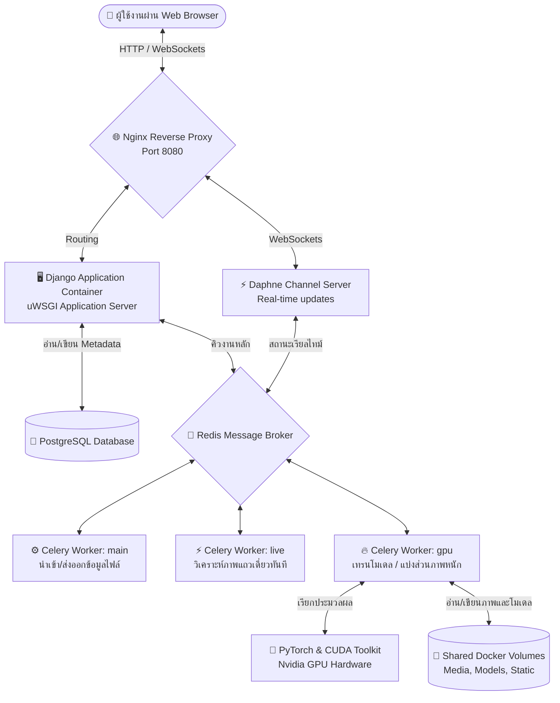

# 4.2 การติดตั้งและตั้งค่า eScriptorium ผ่าน Docker (Windows WSL 2 และ Linux)

> **ระดับความเชี่ยวชาญ:** ปฏิบัติการ / ผู้ดูแลระบบ (SysAdmin)  
> **เวลาที่ใช้ในการติดตั้ง:** ~45-90 นาที  
> **สิ่งที่ต้องมีก่อน:** ระบบปฏิบัติการ Windows (ที่มี WSL 2) หรือ Linux (Ubuntu 22.04 LTS ขึ้นไป), การ์ดจอ NVIDIA ที่รองรับ CUDA และสิทธิ์การใช้งาน Administrator/Root  
> **เอกสารคู่ขนาน:** [4.1 การติดตั้ง Kraken และสภาพแวดล้อมระบบสั่งการ](../06_Kraken_Training/6.1_การติดตั้งKrakenแบบLocalและผ่านCLI.md) | [2.4 โมเดลสถาปัตยกรรม Kraken และการทำงานภายใน](../02_HTR_Theory_and_XML/2.1_ทฤษฎีการอ่านข้อความด้วยAIและกลไกCTC.md)

---

## 1. บทนำ (Introduction)

**eScriptorium** เป็นแพลตฟอร์มเว็บแอปพลิเคชันโอเพนซอร์ส (Open-source Web Platform) ที่พัฒนาขึ้นโดยทีมสถาบันวิจัยชั้นนำของฝรั่งเศส (เช่น EPHE, PSL, และ INRIA) เพื่อเป็นอินเทอร์เฟซแบบกราฟิก (Web UI) ให้กับเอนจินการรู้จำข้อความเอกสารโบราณ **Kraken** ระบบนี้ทำงานภายใต้แนวคิด **Human-in-the-Loop** ซึ่งรวมระบบการแบ่งบรรทัดอัตโนมัติ (Layout Segmentation), การถอดรหัสข้อความ (HTR Transcription) และหน้าจอแก้ไขข้อความ (Ground Truth Editor) ไว้ในที่เดียว ช่วยให้นักอักษรศาสตร์และนักวิจัยสามารถตรวจแก้ข้อความ สรุปโครงสร้างจัดวางพิกเซล และส่งข้อมูลกลับไปฝึกฝนโมเดล (Fine-tuning) ได้แบบเรียลไทม์

การติดตั้ง eScriptorium ผ่านเทคโนโลยีตู้คอนเทนเนอร์ (**Docker**) เป็นวิธีที่ได้รับการแนะนำสูงสุดในระดับสากล เนื่องจากป้องกันปัญหาความไม่เข้ากันของไลบรารีระบบปฏิบัติการ (Dependency Hell) โดยเฉพาะไลบรารี PyTorch, CUDA, และแพลตฟอร์ม Python เวอร์ชันต่าง ๆ 

### 1.1 โครงสร้างสถาปัตยกรรมเชิงคอนเทนเนอร์ (System Architecture)

เพื่อรองรับการประมวลผลข้อมูลปริมาณมาก ระบบ eScriptorium ถูกแบ่งออกเป็นบริการย่อย (Microservices) ที่เชื่อมต่อและทำงานประสานกันผ่านเครือข่ายจำลองของ Docker ดังแผนผังต่อไปนี้:



*แผนภาพที่ 1: สถาปัตยกรรมการรับส่งข้อมูลเบื้องหลังและการกระจายงานคิวของ eScriptorium ร่วมกับ Kraken*

**รายละเอียดบทบาทหน้าที่ของแต่ละคอนเทนเนอร์:**
1. **`db` (PostgreSQL):** จัดเก็บข้อมูลดิบ เมทาดาตา บัญชีผู้ใช้ ตลอดจนพิกเซลพิกัดเส้นฐาน (Baselines) และเส้นขอบพื้นที่โพลีกอน (Polygons) ในรูปแบบพิกัด JSON
2. **`redis`:** ทำหน้าที่เป็น Message Broker สำหรับคิวงาน Celery และรับส่งข้อมูล WebSocket ของ Daphne
3. **`app`:** เซิร์ฟเวอร์หลักรันแอปพลิเคชัน Django ด้วย uWSGI เพื่อประมวลผลตรรกะทางธุรกิจของเว็บ
4. **`celery-main`:** ทำงานเบื้องหลังในการแปลงประเภทเอกสาร นำเข้าภาพปริมาณมาก (Bulk Ingestion) และส่งออกข้อมูลรูปแบบ PAGE XML หรือ ALTO XML
5. **`celery-live`:** จัดการงานประมวลผลขนาดสั้น เช่น การเรียกใช้โมเดลแบ่งแถวข้อความ (Segmenter) บนรูปภาพที่นักวิจัยกดเลือกทีละแผ่นแบบตอบสนองทันที
6. **`celery-gpu` (จุดหลักของคู่มือนี้):** รันคิวงานคณิตศาสตร์ที่ต้องใช้ GPU ในการประมวลผลสูง ได้แก่ การฝึกฝนโมเดลด้วยเครื่องมือ `ketos` และการตรวจจับโครงสร้างหน้าจัดวางภาพหนาแน่น (Dense layout analysis)
7. **`web` (Nginx):** ทำหน้าที่เป็นเว็บเซิร์ฟเวอร์ด่านหน้า จัดการส่งมอบ static assets (CSS, JS) และผันการจราจรเครือข่ายไปยัง uWSGI หรือ Daphne

---

## 2. ความต้องการขั้นต่ำของระบบ (System Requirements)

การรันระบบ AI สำหรับสแกนเอกสารโบราณ โดยเฉพาะเอกสารไทย/ขอมที่มีความหนาแน่นและซับซ้อน จำเป็นต้องใช้ฮาร์ดแวร์ที่ตอบสนองต่อการคำนวณกราฟพิกเซลได้ดี:

| อุปกรณ์ฮาร์ดแวร์ | ข้อกำหนดขั้นต่ำ (Minimum) | ข้อแนะนำสำหรับงานวิจัยเชิงลึก (Recommended) |
| :--- | :--- | :--- |
| **หน่วยประมวลผล (CPU)** | Intel Core i5 / AMD Ryzen 5 (6 Cores) | Intel Core i7, i9 / AMD Ryzen 9 (12 Coresขึ้นไป) |
| **หน่วยความจำ (RAM)** | 16 GB | 32 GB ถึง 64 GB (สำคัญมากสำหรับ Windows WSL 2) |
| **หน่วยประมวลผลกราฟิก (GPU)** | NVIDIA GTX 1660 / RTX 2060 (6GB VRAM) | NVIDIA RTX 3090, 4090 หรือ RTX A6000 (16-24GB VRAM) |
| **โครงสร้างสถาปัตยกรรม GPU** | Pascal (Compute Capability 6.1) | Ampere (Compute 8.6) หรือ Ada Lovelace (Compute 8.9) ขึ้นไป |
| **พื้นที่จัดเก็บข้อมูล (Storage)** | 100 GB SSD (SATA) | 1 TB ถึง 2 TB NVMe M.2 SSD (ความเร็วอ่านเขียนสูง) |

---

## 3. ขั้นตอนที่ 1: การตั้งค่าระบบปฏิบัติการและการส่งผ่านการทำงานของ GPU (GPU Passthrough)

ก่อนรันตู้คอนเทนเนอร์ Docker ต้องเตรียมการส่งต่อคำสั่งของการ์ดจอ NVIDIA จากระบบปฏิบัติการหลัก (Host OS) ไปยังระบบย่อยภายใน Docker ให้เรียบร้อย

### 3.1 สำหรับระบบปฏิบัติการ Windows (ผ่าน WSL 2)

บน Windows 10 (Build 19044 ขึ้นไป) หรือ Windows 11 การส่งต่อการ์ดจอทำได้ง่ายขึ้นโดยไม่จำเป็นต้องติดตั้งไดรเวอร์การ์ดจอภายใน Linux ซ้ำอีกรอบ

#### ขั้นตอนที่ 1.1: เปิดระบบ Virtualization ในระดับ BIOS/UEFI
- เปิดคอมพิวเตอร์ของคุณ เข้าไปที่หน้าการตั้งค่า BIOS/UEFI (มักกดปุ่ม `F2`, `F12` หรือ `Del` ตอนเปิดเครื่อง)
- ค้นหาฟังก์ชัน **Intel Virtualization Technology (VT-x)** หรือ **AMD-V / SVM Mode** แล้วตั้งค่าเป็น **Enabled**
- บันทึกการตั้งค่าแล้วบูตเข้าสู่ Windows

#### ขั้นตอนที่ 1.2: ติดตั้งและปรับแต่ง WSL 2
เปิด PowerShell ด้วยสิทธิ์ผู้ดูแลระบบ (Run as Administrator) แล้วพิมพ์คำสั่ง:
```powershell
# ติดตั้งระบบย่อย Linux สำหรับ Windows (WSL 2)
wsl --install -d Ubuntu

# กรณีที่มี WSL ติดตั้งอยู่แล้ว ให้ทำการอัปเดตแกนเคอร์เนลให้เป็นรุ่นล่าสุด
wsl --update
```
รีสตาร์ทเครื่องคอมพิวเตอร์หนึ่งครั้งหากระบบร้องขอ จากนั้นตั้งค่าไฟล์โครงสร้างหน่วยความจำของ WSL เพื่อป้องกันเครื่องค้างขณะประมวลผลโมเดล โดยสร้างไฟล์ชื่อ `.wslconfig` ไว้ที่ไดเรกทอรีผู้ใช้ของ Windows (ปกติอยู่ที่ `C:\Users\<Your-Username>\.wslconfig`) และใส่ข้อความดังนี้:

```ini
[wsl2]
# จำกัดจำนวนแรมไม่ให้ WSL ดึงไปจนหมดเครื่อง และเพิ่ม Swap space เพื่อรองรับ Dataset ใหญ่
memory=24GB
processors=8
swap=16GB
localhostForwarding=true
```

#### ขั้นตอนที่ 1.3: ติดตั้งไดรเวอร์การ์ดจอของ NVIDIA บน Windows Host
- ดาวน์โหลดไดรเวอร์ NVIDIA ตัวล่าสุดที่ตรงรุ่นการ์ดจอของคุณ (แนะนำไดรเวอร์ประเภท **Studio Driver**) จาก [เว็บไซต์อย่างเป็นทางการของ NVIDIA](https://www.nvidia.com/Download/index.aspx)
- ทำการติดตั้งให้เสร็จสิ้นบนระบบปฏิบัติการ Windows (ย้ำอีกครั้ง: *ห้ามติดตั้งไดรเวอร์ NVIDIA ลงใน WSL Ubuntu เด็ดขาด* เนื่องจาก Windows Driver ที่รองรับ WSL 2 จะทำการแชร์ระดับฮาร์ดแวร์เข้าสู่เคอร์เนลของ Linux โดยอัตโนมัติ)

#### ขั้นตอนที่ 1.4: ติดตั้ง Docker Desktop
- ดาวน์โหลดตัวติดตั้ง **Docker Desktop** จาก [docker.com](https://www.docker.com/products/docker-desktop/)
- ดับเบิลคลิกตัวติดตั้ง และให้แน่ใจว่าได้เลือกช่องทำเครื่องหมาย **"Use the WSL 2 based engine"** ในขั้นตอนการติดตั้ง
- เมื่อเสร็จสิ้น ให้เปิดโปรแกรม Docker Desktop เข้าไปที่ **Settings (เฟืองมุมขวาบน) > General** และตรวจสอบว่ามีเครื่องหมายถูกที่ *Use the WSL 2 based engine* จากนั้นไปที่ **Resources > WSL Integration** และเลือกเปิดใช้การเชื่อมโยงระบบ (Enable integration) สำหรับระบบปฏิบัติการย่อย `Ubuntu`

---

### 3.2 สำหรับระบบปฏิบัติการ Linux (Ubuntu 22.04 LTS / 24.04 LTS)

หากรันเซิร์ฟเวอร์วิจัยด้วยระบบปฏิบัติการ Linux โดยตรง มีขั้นตอนการตั้งค่าดังนี้:

#### ขั้นตอนที่ 2.1: ติดตั้ง Docker Engine และ Docker Compose
รันชุดคำสั่งเพื่อลงทะเบียนแพ็กเกจทางการของ Docker:
```bash
sudo apt-get update
sudo apt-get install -y ca-certificates curl gnupg

# เพิ่ม GPG Key ของ Docker
sudo install -m 0755 -d /etc/apt/keyrings
curl -fsSL https://download.docker.com/linux/ubuntu/gpg | sudo gpg --dearmor -o /etc/apt/keyrings/docker.gpg
sudo chmod a+r /etc/apt/keyrings/docker.gpg

# เพิ่ม Repository ของ Docker ในรายการซอร์ส
echo \
  "deb [arch=$(dpkg --print-architecture) signed-by=/etc/apt/keyrings/docker.gpg] https://download.docker.com/linux/ubuntu \
  $(. /etc/os-release && echo "$VERSION_CODENAME") stable" | \
  sudo tee /etc/apt/sources.list.d/docker.list > /dev/null

sudo apt-get update
sudo apt-get install -y docker-ce docker-ce-cli containerd.io docker-buildx-plugin docker-compose-plugin
```

#### ขั้นตอนที่ 2.2: ติดตั้งไดรเวอร์การ์ดจอ NVIDIA บน Linux
```bash
# ค้นหาไดรเวอร์ที่แนะนำสำหรับเครื่อง
sudo ubuntu-drivers devices

# ติดตั้งไดรเวอร์รุ่นแนะนำ (เช่น รุ่น 535)
sudo apt install -y nvidia-driver-535
```
หลังจากคำสั่งสิ้นสุด ให้รันคำสั่ง `sudo reboot` เพื่อเริ่มระบบใหม่

#### ขั้นตอนที่ 2.3: ติดตั้ง NVIDIA Container Toolkit เพื่อเปิดความสามารถ GPU ใน Docker
ชุดโปรแกรมนี้ทำให้คอนเทนเนอร์ของ Docker สามารถมองเห็นสถาปัตยกรรมทางคณิตศาสตร์และคำสั่ง CUDA บนการ์ดจอจริงได้:
```bash
# เพิ่ม GPG Key และ Repository ของ NVIDIA Container Toolkit
curl -fsSL https://nvidia.github.io/libnvidia-container/gpgkey | sudo gpg --dearmor -o /usr/share/keyrings/nvidia-container-toolkit-keyring.gpg \
  && curl -s -L https://nvidia.github.io/libnvidia-container/stable/deb/nvidia-container-toolkit.list | \
     sed 's#deb https://#deb [signed-by=/usr/share/keyrings/nvidia-container-toolkit-keyring.gpg] https://#g' | \
     sudo tee /etc/apt/sources.list.d/nvidia-container-toolkit.list

# ติดตั้งโปรแกรมเครื่องมือ
sudo apt-get update
sudo apt-get install -y nvidia-container-toolkit

# ตั้งค่า Docker daemon ให้รับรู้ runtime ของ nvidia
sudo nvidia-ctk runtime configure --runtime=docker

# รีสตาร์ทการทำงานของระบบ Docker daemon
sudo systemctl restart docker
```

---

### 3.3 การตรวจสอบความพร้อมการทำงานร่วมกันของ Docker และ GPU
ไม่ว่าคุณจะใช้ Windows WSL 2 หรือ Linux ให้รันคำสั่งตรวจสอบต่อไปนี้ในเทอร์มินัลเพื่อยืนยันว่าการ์ดจอสามารถเชื่อมโยงเข้าไปในระบบจำลองได้จริง:

```bash
docker run --rm --gpus all nvidia/cuda:12.0.0-base-ubuntu22.04 nvidia-smi
```

**ผลลัพธ์ที่ถูกต้อง:** ระบบจะดาวน์โหลดอิมเมจฐานของ CUDA ขนาดเล็ก และจำลองระบบขึ้นมารายงานค่าตารางสถานะของ GPU (NVIDIA System Management Interface) ดังตัวอย่างด้านล่างนี้:

```text
+-----------------------------------------------------------------------------------------+
| NVIDIA-SMI 535.129.03             Driver Version: 535.129.03   CUDA Version: 12.2       |
|-----------------------------------------+----------------------+------------------------+
|   0  NVIDIA GeForce RTX 4090        Wddm| 00000000:01:00.0  On |                    N/A |
| 31%  55C    P0            95W / 450W    |   1025MiB / 24564MiB |      0%      Default |
|-----------------------------------------+----------------------+------------------------+
```
> [!IMPORTANT]  
> หากมีข้อความแสดงความผิดพลาด เช่น `docker: Error response from daemon: could not select device driver` แปลว่าการติดตั้ง NVIDIA Container Toolkit หรือการเชื่อมระบบย่อยของ WSL ยังไม่สมบูรณ์ โปรดศึกษาวิธีการแก้ไขได้ที่หัวข้อ **"การวินิจฉัยปัญหาและแก้ไขข้อผิดพลาด"** ด้านล่างสุดของเอกสารฉบับนี้

---

## 4. ขั้นตอนที่ 2: โครงสร้างไดเรกทอรีระบบจัดเก็บข้อมูลปลายทาง

ดาวน์โหลดโค้ดชุดการติดตั้งของ eScriptorium โดยการโคลนจากคลังซอร์สโค้ดหลัก จากนั้นเตรียมสร้างโฟลเดอร์สำหรับเก็บรักษาข้อมูลของฐานข้อมูลและภาพถอดตัวหนังสือเพื่อป้องกันการสูญหายเมื่อหยุดคอนเทนเนอร์:

```bash
# โคลนคลังการตั้งค่าคอนเทนเนอร์ Docker อย่างเป็นทางการ
git clone https://gitlab.com/scripta/escriptorium-docker.git
cd escriptorium-docker

# สร้างโฟลเดอร์สำหรับการเชื่อมโยงข้อมูลนอกตู้คอนเทนเนอร์ (Persistent Volumes)
mkdir -p data/db data/media data/models data/static data/redis
```

ผังโครงสร้างของโปรเจกต์ของคุณหลังจากเตรียมโฟลเดอร์ ควรมีลักษณะดังนี้:

```text
escriptorium-docker/
├── data/                       # โฟลเดอร์เก็บข้อมูลถาวร (Persistent Storage)
│   ├── db/                     # เก็บข้อมูลดิบของ PostgreSQL Database
│   ├── media/                  # เก็บรูปภาพจดหมายเหตุโบราณที่ผู้ใช้อัปโหลดเข้าระบบ
│   ├── models/                 # เก็บไฟล์โมเดลสำเร็จรูป (.ml) ที่เทรนเสร็จแล้ว
│   ├── redis/                  # เก็บแคชและสถานะของ Redis
│   └── static/                 # เก็บ static files (CSS, JS) ที่สกัดออกมา
├── .env.example                # ตัวอย่างการกำหนดค่า Environment
├── .env                        # แฟ้มกำหนดค่าความปลอดภัยจริง (จะสร้างในขั้นตอนถัดไป)
├── docker-compose.yml          # ไฟล์จัดแจงการตั้งค่าบริการคอนเทนเนอร์
└── README.md
```

---

## 5. ขั้นตอนที่ 3: แฟ้มประมวลการรันระบบระบบและไฟล์กำหนดตัวแปรอย่างละเอียด

เพื่อประสิทธิภาพการทำงานขั้นสูงสุด โดยเฉพาะการแยกคิวประมวลผลงานทั่วไปออกจากส่วนงานถอดรหัสภาพวิทัศน์ HTR ด้วยการ์ดจอ เราจำเป็นต้องกำหนดรายละเอียดในไฟล์โครงสร้างสถาปัตยกรรมดังนี้

### 5.1 โค้ดไฟล์ `docker-compose.yml` (ฉบับสมบูรณ์พร้อมคำอธิบายภาษาไทย)

แทนที่เนื้อหาไฟล์ `docker-compose.yml` ในเครื่องของคุณด้วยการกำหนดค่าระดับสูงต่อไปนี้:

```yaml
version: '3.8'

services:

  # 1. บริการระบบฐานข้อมูล (PostgreSQL Database)
  db:
    image: postgres:15-alpine
    container_name: escriptorium-db
    restart: always
    volumes:
      - ./data/db:/var/lib/postgresql/data
    environment:
      POSTGRES_DB: ${POSTGRES_DB}
      POSTGRES_USER: ${POSTGRES_USER}
      POSTGRES_PASSWORD: ${POSTGRES_PASSWORD}
    healthcheck:
      test: ["CMD-SHELL", "pg_isready -U ${POSTGRES_USER} -d ${POSTGRES_DB}"]
      interval: 10s
      timeout: 5s
      retries: 5

  # 2. บริการจัดส่งสารและคิวการทำแคชชิง (Redis Message Broker)
  redis:
    image: redis:7-alpine
    container_name: escriptorium-redis
    restart: always
    volumes:
      - ./data/redis:/data
    healthcheck:
      test: ["CMD", "redis-cli", "ping"]
      interval: 10s
      timeout: 5s
      retries: 5

  # 3. บริการแอปพลิเคชันเว็บหลังบ้าน (Django Application Web Server - uWSGI)
  app:
    image: registry.gitlab.com/scripta/escriptorium/app:latest
    container_name: escriptorium-app
    restart: always
    command: uwsgi --ini /usr/src/app/uwsgi.ini
    volumes:
      - ./data/media:/usr/src/app/media
      - ./data/static:/usr/src/app/static
      - ./data/models:/usr/src/app/models
    environment:
      - SECRET_KEY=${SECRET_KEY}
      - DEBUG=${DEBUG}
      - ALLOWED_HOSTS=${ALLOWED_HOSTS}
      - CSRF_TRUSTED_ORIGINS=${CSRF_TRUSTED_ORIGINS}
      - SQL_ENGINE=django.db.backends.postgresql
      - SQL_DATABASE=${POSTGRES_DB}
      - SQL_USER=${POSTGRES_USER}
      - SQL_PASSWORD=${POSTGRES_PASSWORD}
      - SQL_HOST=db
      - SQL_PORT=5432
      - REDIS_HOST=redis
      - REDIS_PORT=6379
      - DJANGO_SU_NAME=${DJANGO_SU_NAME}
      - DJANGO_SU_PASSWORD=${DJANGO_SU_PASSWORD}
      - DJANGO_SU_EMAIL=${DJANGO_SU_EMAIL}
      - EXPORT_DOWNLOAD_KRAKEN_MODELS=True
    depends_on:
      db:
        condition: service_healthy
      redis:
        condition: service_healthy

  # 4. บริการ Daphne Channel Server สำหรับรองรับ Real-time WebSockets Updates
  channelserver:
    image: registry.gitlab.com/scripta/escriptorium/app:latest
    container_name: escriptorium-channelserver
    restart: always
    command: daphne -b 0.0.0.0 -p 5000 escriptorium.asgi:application
    volumes:
      - ./data/media:/usr/src/app/media
      - ./data/static:/usr/src/app/static
      - ./data/models:/usr/src/app/models
    environment:
      - SECRET_KEY=${SECRET_KEY}
      - DEBUG=${DEBUG}
      - ALLOWED_HOSTS=${ALLOWED_HOSTS}
      - SQL_ENGINE=django.db.backends.postgresql
      - SQL_DATABASE=${POSTGRES_DB}
      - SQL_USER=${POSTGRES_USER}
      - SQL_PASSWORD=${POSTGRES_PASSWORD}
      - SQL_HOST=db
      - SQL_PORT=5432
      - REDIS_HOST=redis
      - REDIS_PORT=6379
    depends_on:
      db:
        condition: service_healthy
      redis:
        condition: service_healthy

  # 5. บริการ Celery Main Worker สำหรับควบคุมงานนำเข้า ส่งออก และจัดการเบื้องหลังทั่วไป
  celery-main:
    image: registry.gitlab.com/scripta/escriptorium/app:latest
    container_name: escriptorium-celery-main
    restart: always
    command: celery -A escriptorium worker -l INFO -Q main -c 2
    volumes:
      - ./data/media:/usr/src/app/media
      - ./data/static:/usr/src/app/static
      - ./data/models:/usr/src/app/models
    environment:
      - SECRET_KEY=${SECRET_KEY}
      - DEBUG=${DEBUG}
      - ALLOWED_HOSTS=${ALLOWED_HOSTS}
      - SQL_ENGINE=django.db.backends.postgresql
      - SQL_DATABASE=${POSTGRES_DB}
      - SQL_USER=${POSTGRES_USER}
      - SQL_PASSWORD=${POSTGRES_PASSWORD}
      - SQL_HOST=db
      - SQL_PORT=5432
      - REDIS_HOST=redis
      - REDIS_PORT=6379
    depends_on:
      db:
        condition: service_healthy
      redis:
        condition: service_healthy

  # 6. บริการ Celery Live Worker สำหรับประมวลผลคำขอฉับพลันจากเบราว์เซอร์
  celery-live:
    image: registry.gitlab.com/scripta/escriptorium/app:latest
    container_name: escriptorium-celery-live
    restart: always
    command: celery -A escriptorium worker -l INFO -Q live -c 4
    volumes:
      - ./data/media:/usr/src/app/media
      - ./data/static:/usr/src/app/static
      - ./data/models:/usr/src/app/models
    environment:
      - SECRET_KEY=${SECRET_KEY}
      - DEBUG=${DEBUG}
      - ALLOWED_HOSTS=${ALLOWED_HOSTS}
      - SQL_ENGINE=django.db.backends.postgresql
      - SQL_DATABASE=${POSTGRES_DB}
      - SQL_USER=${POSTGRES_USER}
      - SQL_PASSWORD=${POSTGRES_PASSWORD}
      - SQL_HOST=db
      - SQL_PORT=5432
      - REDIS_HOST=redis
      - REDIS_PORT=6379
    depends_on:
      db:
        condition: service_healthy
      redis:
        condition: service_healthy

  # 7. บริการ Celery GPU Worker สำหรับงานหนักที่ใช้สมองกล AI โดยเฉพาะ (Segmenting, Recognition, Training)
  # บริการนี้ถูกผูกเข้ากับ NVIDIA GPU เพื่อเพิ่มความเร็วในการรันคำสั่ง Kraken อย่างมหาศาล
  celery-gpu:
    image: registry.gitlab.com/scripta/escriptorium/app:latest
    container_name: escriptorium-celery-gpu
    restart: always
    command: celery -A escriptorium worker -l INFO -Q gpu -c 1
    volumes:
      - ./data/media:/usr/src/app/media
      - ./data/static:/usr/src/app/static
      - ./data/models:/usr/src/app/models
    environment:
      - SECRET_KEY=${SECRET_KEY}
      - DEBUG=${DEBUG}
      - ALLOWED_HOSTS=${ALLOWED_HOSTS}
      - SQL_ENGINE=django.db.backends.postgresql
      - SQL_DATABASE=${POSTGRES_DB}
      - SQL_USER=${POSTGRES_USER}
      - SQL_PASSWORD=${POSTGRES_PASSWORD}
      - SQL_HOST=db
      - SQL_PORT=5432
      - REDIS_HOST=redis
      - REDIS_PORT=6379
      # ตัวแปรระบบแชร์ CUDA ให้กับ PyTorch ภายใน Docker
      - CUDA_VISIBLE_DEVICES=0
    # บล็อกกำหนดทรัพยากรการส่งเข้า GPU (Nvidia Container Runtime Passthrough)
    deploy:
      resources:
        reservations:
          devices:
            - driver: nvidia
              count: all # ตั้งค่าเป็น 1 หากคุณมีการ์ดจอตัวเดียว หรือระบุการ์ดจอเจาะจง
              capabilities: [gpu]
    depends_on:
      db:
        condition: service_healthy
      redis:
        condition: service_healthy

  # 8. เซิร์ฟเวอร์เว็บด่านหน้า (Nginx Web Server Reverse Proxy)
  web:
    image: registry.gitlab.com/scripta/escriptorium/nginx:latest
    container_name: escriptorium-nginx
    restart: always
    ports:
      - "8080:80" # เปิดช่องพอร์ต 8080 ของเครื่องโฮสต์เพื่อเข้าเว็บ
    volumes:
      - ./data/static:/usr/src/app/static
      - ./data/media:/usr/src/app/media
    depends_on:
      - app
      - channelserver
```

---

### 5.2 การสร้างและกำหนดค่าในไฟล์สภาพแวดล้อม `.env`

สร้างไฟล์ใหม่ขึ้นมาชื่อ `.env` ในไดเรกทอรี `escriptorium-docker/` จากนั้นระบุค่าตัวแปรของคุณ (ห้ามปล่อยว่าง และควรหลีกเลี่ยงรหัสผ่านที่เป็นตัวอย่างในเชิงปฏิบัติการจริง):

```env
# 1. ความปลอดภัยพื้นฐานและการกำหนดความปลอดภัยเว็บ Django
SECRET_KEY=ChangeThisToASuperSecureRandomString12345!
DEBUG=False
ALLOWED_HOSTS=localhost,127.0.0.1,192.168.1.100
CSRF_TRUSTED_ORIGINS=http://localhost:8080,http://127.0.0.1:8080,http://192.168.1.100:8080

# 2. การกำหนดค่าฐานข้อมูลภายใน PostgreSQL
POSTGRES_DB=escriptorium
POSTGRES_USER=escriptorium_user
POSTGRES_PASSWORD=WriteADifferentSecurePasswordHere

# 3. กำหนดค่าบัญชีผู้ใช้ระดับผู้ดูแลระบบเริ่มต้น (สร้างอัตโนมัติเมื่อรันครั้งแรก)
DJANGO_SU_NAME=admin_htr
DJANGO_SU_PASSWORD=AdminP@ssw0rdForThaiHistoricalManuscripts
DJANGO_SU_EMAIL=htr_admin@example.com
```

---

## 6. ขั้นตอนที่ 4: ลำดับคำสั่งในการเปิดทำงานและเริ่มต้นระบบ (Deploy Command Sequence)

เมื่อตั้งค่าไฟล์ทั้งหมดเสร็จสิ้นแล้ว ให้ดำเนินตามลำดับคำสั่งต่อไปนี้เพื่อสร้างและสตาร์ทตู้คอนเทนเนอร์ทั้งหมดขึ้นมาทำงาน:

```bash
# 1. ตรวจสอบให้แน่ใจว่า Docker Desktop หรือ Docker Engine ทำงานอยู่เบื้องหลัง
# 2. ดึงภาพอิมเมจ (Pull images) เวอร์ชันล่าสุดจาก GitLab Registry
docker compose pull

# 3. สั่งรันบริการทั้งหมดในโหมดทำงานเบื้องหลัง (Background Detached Mode)
docker compose up -d
```

ในขั้นตอนนี้ Docker จะใช้เวลาดาวน์โหลดและตั้งค่าฐานข้อมูลประมาณ 3 ถึง 5 นาที ขึ้นอยู่กับความเร็วอินเทอร์เน็ต สามารถติดตามสถานะการเปิดใช้งานได้ด้วยคำสั่ง:

```bash
# ตรวจสอบสถานะการรันคอนเทนเนอร์
docker compose ps
```

*ตารางแสดงความถูกต้องของสถานะระบบ:*
- คอนเทนเนอร์ `escriptorium-db` และ `escriptorium-redis` ควรรายงานสถานะเป็น `running (healthy)`
- คอนเทนเนอร์อื่น ๆ ควรรายงานสถานะเป็น `running` หรือ `up`

หากต้องการให้แน่ใจว่าระบบฐานข้อมูลได้รับการจัดสร้างตารางเชิงโครงสร้างเรียบร้อย และแอปพลิเคชันไม่มีสิ่งขัดข้อง ให้รันคำสั่ง Migration และดึงไฟล์ Static สำหรับการตกแต่งเว็บดังนี้:

```bash
# ทำการรวบรวมไฟล์ตกแต่งทางสถาปัตยกรรม (CSS/JavaScript) ของระบบเว็บ
docker compose exec app python manage.py collectstatic --no-input

# สั่งอัปเดตตารางฐานข้อมูลและติดตั้งความสัมพันธ์ข้อมูล
docker compose exec app python manage.py migrate
```

หากไฟล์ระบบไม่สามารถสร้างบัญชีผู้ดูแลระบบได้อัตโนมัติตามไฟล์ `.env` สามารถรันสร้างบัญชีด้วยตนเองผ่าน CLI ดังนี้:
```bash
docker compose exec app python manage.py createsuperuser
```
*(กรอกชื่อบัญชี อีเมล และรหัสผ่านที่หน้าจอเทอร์มินัล)*

---

## 7. ขั้นตอนที่ 5: การประยุกต์ใช้งานและตั้งค่าเชิงลึกสำหรับคัมภีร์ใบลานและสมุดไทย

เมื่อติดตั้งโครงสร้างเสร็จสิ้น เปิดเบราว์เซอร์ไปที่ลิงก์ [http://localhost:8080](http://localhost:8080) ทำการเข้าสู่ระบบด้วยชื่อบัญชีแอดมินที่จัดสร้างขึ้น เพื่อเพิ่มขีดความสามารถการทำโมเดลอักษรไทย-ขอมโบราณ ให้ตั้งค่าตามหลักวิศวกรรมข้อมูลดังต่อไปนี้:

### 7.1 การตั้งค่ามิติสัดส่วนความสูงบรรทัดสำหรับอักษรซ้อน (Vertical Vowel Stacking)
อักษรไทยโบราณ เช่น อักษรขอมไทย อักษรธรรมล้านนา หรือแม้แต่อักษรไทยโบราณในสมุดไทย มีกายภาพตัวเขียนที่ซับซ้อนกว่าอักษรละตินตะวันตกอย่างเด่นชัด โดยมี **อักขระซ้อนแนวดิ่งขึ้นไปด้านบนและล่างได้สูงสุดถึง 4 ชั้น** (สระล่าง/ตัวพยัญชนะซ้อนตัวล่าง $\rightarrow$ เส้นฐานพยัญชนะแกนกลาง $\rightarrow$ สระบน $\rightarrow$ วรรณยุกต์/เครื่องหมายทัณฑฆาต)

```text
       (ระดับ 4)  [วรรณยุกต์]          เช่น   ์  หรือ  ้
       (ระดับ 3)  [สระบน]              เช่น   ิ  หรือ  ี
       (ระดับ 2)  [พยัญชนะแกนกลาง]     เช่น  ก, ข, ค, ส
       (ระดับ 1)  [พยัญชนะซ้อน/สระล่าง] เช่น   ุ  หรือ  ู หรือตัวพยัญชนะสะกดหางยาวใต้เส้น
```

*ปัญหากรณีค่าเริ่มต้น:* หากเราใช้โมเดลแบ่งแถวทั่วไปที่ตั้งความสูงภาพไว้เพียง `48` พิกเซล (Height = 48px) ตัวอักษรสระล่างและเครื่องหมายบนสุดจะถูกอัลกอริทึมย่นย่อบีบอัดจนสูญเสียโครงสร้างพิกเซล กลายเป็นจุดเบลอ ทำให้อ่านค่าผิดพลาด (เกิดค่า Character Error Rate - CER สูงอย่างเลี่ยงไม่ได้)

*ทางเลือกเพื่อความถูกต้องในการเทรน:*
1. เมื่อทำการสร้างโมเดลตัวแบ่งส่วน (BLLA Segmenter) และการถอดข้อความ (Recognition Model) ให้แก้ไขสถาปัตยกรรม VGSL (Variable-size Graph Specification Language) ให้อินพุตรับค่ามิติความสูงภาพแถวเพิ่มขึ้นเป็น **`80` หรือ `128` พิกเซล** เช่น:
   ```bash
   # สถาปัตยกรรมระดับก้าวหน้าสำหรับอักษรขอม/ไทยโบราณ (ปรับค่าความสูงอินพุตตัวแรกเป็น 128)
   [1,128,0,1 Cr3,3,32 Mp2,2 Cr3,3,64 Mp2,2 S1(1x12)1,3 Lbx200 Do O1c103]
   ```
2. โครงการขนาดใหญ่อย่าง **DHARMA Project** ซึ่งศึกษารอยจารึกอักษรตระกูลอินเดียใต้และเอเชียตะวันออกเฉียงใต้ (จามโบราณ, เขมรโบราณ, กวิ) ได้กำหนดขนาดความละเอียดความสูงเส้นบรรทัดไว้คงที่ที่ **128 พิกเซล (H=128px)** เพื่อรับประกันว่าส่วนโค้งของอักขระและสระล่างจะไม่หลุดกรอบการมองเห็นของสมองกล CNN

### 7.2 แนวทาง SegmOnto สำหรับจัดเขตสมุดไทย (Folding Books Layout)
สมุดไทยหรือสมุดข่อยโบราณ มักจัดวางเนื้อหาที่ไม่เหมือนหนังสือทั่วไป คือมีการแทรกภาพวาดเทวดา/สัตว์หิมพานต์ขนาดใหญ่กลางหน้าสมุด (Illustration) มีแถบพับ หรือมีภาพยันต์ลายเส้นลงสี (Diagram) ล้อมรอบด้วยตัวเขียน 

เพื่อป้องกันไม่ให้ AI พยายามลากเส้นบรรทัดพาตัดผ่านหน้าภาพวาดหรือยันต์จนเกิดข้อผิดพลาดรุนแรง ต้องใช้โครงสร้างการกำหนดเขตข้อมูลมาตรฐาน **SegmOnto** ในหน้าจัดการระบบของ eScriptorium โดยแบ่งประเภทพื้นที่ใช้งานจริงดังนี้:
- **`MainTextZone`:** สำหรับพื้นที่เก็บตัวอักษรจดจารเขียนตามยาวหลัก
- **`IllustrationZone`:** ครอบพื้นที่ส่วนที่เป็นภาพจิตรกรรมลายเส้นลงสี (ให้ระบบ Segmenter ข้ามการลากเส้นตรงนี้)
- **`DiagramZone`:** กำหนดพื้นที่ส่วนที่เป็นอักขระยันต์ เพื่อใช้โมเดลเฉพาะทางในการถอดรหัส
- **`MarginaliaZone`:** สำหรับข้อความเขียนแทรกเล็ก ๆ บริเวณขอบพับสมุดไทย

---

### 7.3 การคอมไพล์แปลงข้อมูลเป็นไฟล์เดี่ยว `.arrow` ด้วย GPU Container
การส่งไฟล์ภาพสับย่อยหลายหมื่นภาพเข้าสู่ GPU ขณะเทรนจะก่อให้เกิดปัญหาคอขวดอ่านเขียนข้อมูล (I/O Bottleneck) บนตัวจัดเก็บข้อมูลจนระบบหยุดชะงักบ่อยครั้ง เราจึงควรเปลี่ยนรูปชุดข้อมูล Ground Truth ที่ลากพิกเซลเสร็จแล้วให้อยู่ในรูปไฟล์แพ็กเกจไบนารีเดียวเดี่ยว **Apache Arrow (`.arrow`)** 

ในการทำเช่นนี้ ให้เรียกใช้งานโปรแกรมคำสั่งภายในคอนเทนเนอร์ `celery-gpu` ดังนี้:

```bash
# คอมไพล์ข้อมูลรูปภาพและเอกสาร XML ทั้งหมดให้กลายเป็นไฟล์เดี่ยว .arrow
docker compose exec celery-gpu ketos compile -f xml -o /usr/src/app/models/thai_palmleaf_dataset.arrow /usr/src/app/media/documents/*.xml
```
*การเปลี่ยนมาอ่านไฟล์ Arrow ตัวเดียวบนหน่วยความจำของ GPU ช่วยเร่งความเร็วการเทรน Fine-tuning ได้มากขึ้นถึงร้อยละ 30 เมื่อเทียบกับการส่งผ่านภาพแมนวลทีละแผ่น*

---

## 8. การวินิจฉัยปัญหาและแก้ไขข้อผิดพลาด (Troubleshooting & Recovery)

ในการติดตั้งและทดลองรันใช้งานจริงบนเครื่องที่มีข้อจำกัดทางสภาพแวดล้อม อาจเกิดข้อผิดพลาดทางเทคนิคที่สามารถตรวจพบและแก้ไขได้ดังนี้:

### 8.1 ปัญหาฐานข้อมูลปฏิเสธการเชื่อมต่อ (Database Connection Failure)
*อาการ:* หน้าเว็บโหลดไม่ขึ้น หรือล็อกไฟล์ของคอนเทนเนอร์ `app` แสดงข้อความตื่นตระหนก:
`django.db.utils.OperationalError: could not connect to server: Connection refused`

```mermaid
+-------------------------------------------------------+
|          ตรวจพบ Error: Connection Refused             |
+-------------------------------------------------------+
                           |
                           v
              /=========================\
             /     วิเคราะห์สาเหตุ       \
             \=========================/
               /          |          \
              /           |           \
             v            v            v
  [DB Container เปิดช้า] [ตัวแปร .env ไม่ตรง] [ฐานข้อมูลเสียหาย]
             |            |            |
             v            v            v
      [รอ 1-2 นาที และ   [เช็กค่า SQL_HOST  [ดูประวัติล็อกเชิงลึก:
        restart app]       เป็นชื่อ 'db']    logs db]
```

*ขั้นตอนแก้ไขเพิ่มเติม:*
- เปิดดูสภาพแวดล้อมที่ตั้งค่าไว้ว่าสอดคล้องกันหรือไม่ พาสเวิร์ดของ `POSTGRES_PASSWORD` ใน `.env` และการส่งผ่านตัวแปรในคอนเทนเนอร์ จำเป็นต้องเหมือนกันทั้งหมด

---

### 8.2 ปัญหาพอร์ตชนหรือขัดแย้งระบบภายนอก (Port Conflict: 8080 Already in Use)
*อาการ:* รันคำสั่งเปิดเครื่องไม่ได้ และเกิดข้อยกเว้นระบุพอร์ตถูกล็อก:
`Error starting userland proxy: listen tcp4 0.0.0.0:8080: bind: address already in use`

*การวิเคราะห์สาเหตุ:* มีบริการเว็บอื่น (เช่น Apache, Nginx ภายนอก หรือ Docker Container ตัวอื่น) กำลังใช้งานพอร์ต `8080` บนคอมพิวเตอร์ของคุณ

*ขั้นตอนแก้ไข:*
1. เปิดไฟล์ `docker-compose.yml` ค้นหาบริการเซิร์ฟเวอร์ `web`
2. ปรับเปลี่ยนพอร์ตส่งต่อตัวเลขด้านซ้าย (โฮสต์) ไปเป็นเลขอื่น เช่น เปลี่ยนจาก `8080:80` ไปเป็น `8085:80` หรือ `9000:80` ดังโครงสร้างนี้:
   ```yaml
   web:
     image: registry.gitlab.com/scripta/escriptorium/nginx:latest
     ports:
       - "8085:80"  # เปลี่ยนเลขพอร์ตด่านหน้าเป็น 8085
   ```
3. บันทึกไฟล์ และสั่งรันระบบใหม่อีกครั้ง: `docker compose up -d`
4. เข้าหน้าเว็บโดยการเปลี่ยน URL เป็น `http://localhost:8085`

---

### 8.3 ปัญหาไม่พบการ์ดจอ CUDA ในส่วนรัน AI (CUDA Not Found / GPU Not Available)
*อาการ:* เมื่อคลิกสั่งการ Segment ภาพหรือฝึกฝนตัวอักษร ระบบประมวลผลช้ามากอย่างผิดสังเกต หรือในระบบล็อกรายงานการหล่นลงไปคำนวณที่ CPU (Fallback to CPU):
`UserWarning: CUDA initialization: Found no NVIDIA driver on your system.`

```mermaid
+-------------------------------------------------------+
|         ตรวจหาปัญหากล่อง GPU ใน Docker                |
+-------------------------------------------------------+
                           |
                           v
            /=============================\
           / รันคำสั่งเช็กสถานะการ์ดภายใน  \
           \   docker compose exec gpu   /
            \======== nvidia-smi ========/
                           |
               +-----------+-----------+
               |                       |
               v                       v
      [Error: Driver error]   [Command not found]
               |                       |
               v                       v
      [ติดตั้ง Toolkit บนโฮสต์  [ตรวจบล็อก deploy ใน
       และเช็ก Studio Driver]   docker-compose.yml]
```

*ขั้นตอนแก้ไขเพิ่มเติมสำหรับ WSL 2:*
- หากใช้ Windows WSL 2 ให้ปิดโปรแกรม Docker Desktop เข้าไปที่เทอร์มินัลแล้วปิดการรันลีนุกซ์ทั้งหมดด้วยคำสั่ง:
  ```powershell
  wsl --shutdown
  ```
- จากนั้นเปิด Docker Desktop ขึ้นมาใหม่ สั่งรันคำสั่งสตาร์ท `docker compose up -d` เพื่อเริ่มระบบอีกครั้ง

---

### 8.4 ปัญหาหน้าเว็บไม่แสดงผลสไตล์หรือรูปแบบธีม (Static Files 404 Not Found)
*อาการ:* เปิดหน้าเว็บ eScriptorium ได้สำเร็จ แต่ไอคอนปุ่ม หน้าเว็บตัวเลือก และสไตล์ความงามของเว็บ (CSS) หลุดหายไปหมด แสดงผลเป็นเพียงข้อความตัวหนังสือสีดำชิดซ้ายเปลือยเปล่า

*การวิเคราะห์สาเหตุ:* ตัวเซิร์ฟเวอร์ Nginx ไม่สามารถดึงหาตำแหน่งไฟล์ Static assets ของ Django ได้ เนื่องจากยังไม่ได้สั่งรันคอมไพล์สกัดไฟล์ในตู้คอนเทนเนอร์ หรือพาร์ทแชร์วอลลูมไม่ตรงกัน

*ขั้นตอนแก้ไข:*
รันคำสั่งบังคับให้ Django คัดลอกและเขียนที่อยู่ไฟล์สไตล์สกินลงสู่ไดเรกทอรีแชร์วอลลูมโดยตรง:
```bash
docker compose exec app python manage.py collectstatic --no-input
```
เปิดบราวเซอร์เคลียร์แคชชิง (กด `Ctrl + F5`) เพื่อโหลดหน้าแสดงผลใหม่อีกครั้ง

---

### 8.5 ปัญหาภาพต้นฉบับเสียหายเนื่องจากโมเดลต่างรุ่น (KrakenInvalidModelException)
*อาการ:* ในหน้าคิวบันทึกการเรียนรู้ส่งออกข้อผิดพลาด หรือแจ้งเตือนความล้มเหลวแบบทันควันเมื่อเรียกโมเดลเก่า:
`kraken.lib.exceptions.KrakenInvalidModelException: Model is incompatible with this version of kraken.`

*การวิเคราะห์สาเหตุ:* เกิดจากน้ำหนักตัวแปรโครงข่ายประสาทสำเร็จรูป (Model weight) ที่คุณอัปโหลดเข้าระบบ เคยได้รับการฝึกฝนมาด้วยซอฟต์แวร์ Kraken เวอร์ชันเก่า (เช่น 3.x ในโครงแบบตระกูลไฟล์เก่า `.clstm`) แต่คอนเทนเนอร์ตัวรับใหม่รันบนไลบรารีรุ่นสูงกว่า (เช่น 4.x/5.x) ทำให้ชุดข้อมูลโครงสร้างไพธอนไม่ตรงกัน

*ขั้นตอนแก้ไข:*
1. หากมีไฟล์ข้อมูล Ground Truth เดิมสะสมไว้ ให้ดำเนินการสร้างไฟล์ Arrow รวบรวมข้อมูลด้วยคำสั่ง `ketos compile` อีกครั้งภายในตู้คอนเทนเนอร์ปัจจุบัน
2. ทำการตั้งค่าการฝึกฝนแบบ Fine-tuning เพื่อให้เอนจินเขียนและเซฟโมเดลเวอร์ชันใหม่ล่าสุด
3. หากจำเป็นต้องใช้โมเดลเดิมจริง ให้รันสคริปต์แปลงเวอร์ชันของโมเดลผ่าน CLI ของ Kraken:
   ```bash
   docker compose exec celery-gpu kraken -i old_model.ml upgrade -o new_model.ml
   ```

---

### 8.6 ปัญหาหน้ากระดาษเอียงบิดเบี้ยวและการชนตำแหน่งพิกเซล (Polygonizer Error)
*อาการ:* ในหน้าแก้ไข Baseline แถบสีพิกเซลโพลีกอนบิดเบี้ยว ทะแยงพาดขวางไปทั่วหน้ากระดาษ หรือ Celery GPU ทำงานล้มเหลวโดยรายงานข้อผิดพลาด:
`ValueError: Side location conflict in baseline...`

*การวิเคราะห์สาเหตุ:* ลายสลักใบลานหรือขอบสมุดไทยมีพิกัดเอียงลาดเอียงมาก หรือมีคราบความชื้น รอยไหม้สีดำปะปนขอบกระดาษ ทำให้ AI เข้าใจผิดลากพิกเซลต่อกันจนเกิดเส้นชนขอบชนกัน

*ขั้นตอนแก้ไข:*
- ให้ดำเนินการเตรียมตกแต่งภาพต้นฉบับ (**Pre-processing**) ก่อนการอัปโหลดเข้าหน้าเว็บ โดยใช้ฟิลเตอร์การปรับแต่งระดับสีเทา ทำทวิภาคภาพด้วยอัลกอริทึม **Sauvola (Sauvola Binarization)** ปรับตั้งความเอียงให้ขนานระนาบตรง 
- หากพบบรรทัดที่มีปัญหาชนกันในหน้าแก้ไข ให้ลบเส้น Baseline ที่สับสนนั้นออกชั่วคราวแล้วลากขึ้นมาใหม่ด้วยเครื่องมือดินสอแมนวลในหน้าเว็บ eScriptorium เพื่อป้องกันการแจ้ง Error ในขั้นตอนส่งโมเดลไปวิเคราะห์บรรทัดถัดไป

---

### 8.7 ปัญหาตู้คอนเทนเนอร์ค้างและดับไปเนื่องจากแรมเต็ม (Container Exit Code 137 / OOM)
*อาการ:* คอนเทนเนอร์ `celery-gpu` หรือ `app` เกิดการดับการทำงานลงเฉลี่ยกลางคันโดยไม่รายงานข้อผิดพลาด และเมื่อเช็กกระบวนการจะแสดงคำว่า `Exit Code 137`

*การวิเคราะห์สาเหตุ:* เกิดปัญหาเครื่องทำงานไม่ทันเนื่องจากแรมไม่พอ (Out of Memory - OOM) โดยเฉพาะในสภาพแวดล้อม Windows WSL 2 ซึ่งหากเราไม่ได้ระบุจำกัดขนาดไว้ในไฟล์ `.wslconfig` ระบบย่อย Linux จะดึงข้อมูลจนชนเพดานของ Windows และจะถูก Windows Kill Process ทันทีเพื่อความปลอดภัยของระบบโฮสต์

*ขั้นตอนแก้ไข:*
1. ดำเนินการแก้ไขไฟล์ `.wslconfig` เพื่ออัปเกรดการจัดสรรแรมและพื้นที่ Swap (ตามคำแนะนำใน **ขั้นตอนที่ 1.1**)
2. บังคับปิดการจำลองระบบ WSL ด้วยคำสั่ง `wsl --shutdown` ใน PowerShell เพื่อคืนหน่วยความจำ และเปิดการทำงานขึ้นใหม่อีกครั้ง
3. หากรันใน Linux โฮสต์ที่มีแรมน้อย ให้หลีกเลี่ยงการเปิดทำ Segmentation พร้อมกันหลายหน้า ให้แบ่งรูปสแกนอัปโหลดเข้าสู่ระบบทีละ 10–20 หน้าต่อชุด แทนการอัปโหลดไฟล์ขนาดใหญ่ทั้งจดหมายเหตุร้อยหน้าในคราวเดียว

---

## 9. แนวปฏิบัติเพื่อความปลอดภัยและการร่วมมือกันของทีมงาน (Collaborative Best Practices)

หากคุณติดตั้ง eScriptorium บนเซิร์ฟเวอร์ส่วนกลางของคณะทำงานเพื่อช่วยกันลากเส้นและถอดความเอกสารโบราณหลายคน:

1. **เปลี่ยนรหัสผ่านผู้ดูแลระบบ (Django Superuser):** อย่าใช้ชื่อบัญชีและพาสเวิร์ดเริ่มต้นที่ระบุในไฟล์แนะนำ ให้ใช้รหัสผ่านความปลอดภัยสูงและกำหนดสิทธิ์ผู้เข้าใช้งานแบบจำกัด
2. **การแชร์พื้นที่โมเดล:** ไดเรกทอรี `data/models/` สามารถใช้แชร์โมเดลสำเร็จรูปให้กับทีมงานเพื่อช่วยดึงไปทดลองวิเคราะห์หน้าหนังสือใหม่ ๆ ได้ทันที
3. **ระบบการสำรองข้อมูล (Database Backup):** ป้องกันข้อมูลการลากเส้นที่ทีมงานทำมาหลายเดือนสูญหาย โดยรันคำสั่งสำรองข้อมูล PostgreSQL ทุกสัปดาห์:
   ```bash
   # สำรองข้อมูลฐานข้อมูลเชิงวิชาการเก็บไว้เป็นไฟล์ SQL ปลอดภัย
   docker compose exec db pg_dump -U escriptorium_user -d escriptorium > backup_htr_date.sql
   ```

---

*อ้างอิงเนื้อหารายละเอียดวิเคราะห์เชิงลึกจากรายงานฉบับที่ F04 (Kraken & eScriptorium Deep Dive) และรายงานประเมินผลจารึกโบราณ DHARMA-ERC (Report 038)*
