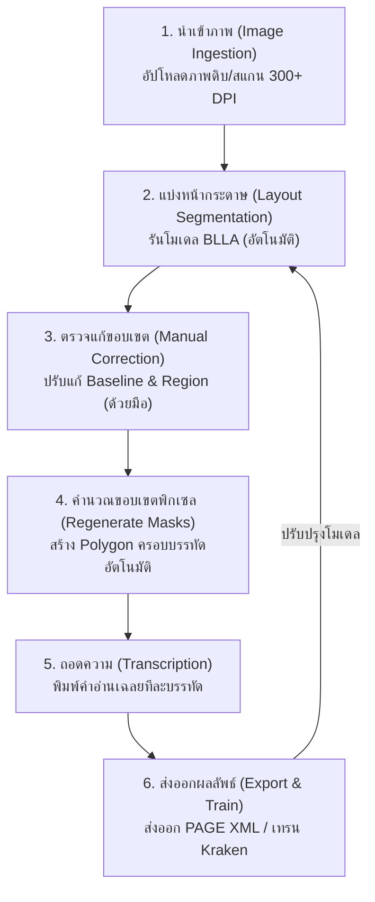

# คู่มือปฏิบัติการทำ Annotation บน eScriptorium และการตรวจแก้ Baseline

> **ระดับ:** ปฏิบัติการ / ผู้ควบคุมข้อมูล (Annotator & Coordinator)  
> **เวลาอ่าน:** ~25 นาที  
> **สิ่งที่ต้องมีก่อน:** ระบบ eScriptorium ที่ได้รับการติดตั้งแล้ว (ดู [4.2_การติดตั้งและตั้งค่า_eScriptorium](4.2_การติดตั้งและตั้งค่าeScriptoriumผ่านDocker.md))  
> **อ่านก่อน:** [3.1_การถ่ายภาพและการสแกนภาพใบลาน](../03_Image_Preprocessing/3.1_คู่มือการถ่ายภาพและสแกนใบลานกับสมุดพับ.md)  
> **ถัดไป:** [4.4_การสร้างGroundTruthและการถอดอักษร](../05_Transcription_Rules/5.1_กฎการปริวรรตอักษรขอมโบราณและการใช้Unicode_Virama.md)

---

## 1. บทนำ (Introduction)

ในกระบวนการพัฒนาระบบการรู้จำลายมือเขียน (Handwritten Text Recognition - HTR) สำหรับเอกสารโบราณ เช่น คัมภีร์ใบลาน (Palm Leaf Manuscripts) และสมุดไทย/สมุดพับ (Folding Books) ขั้นตอนที่มีความสำคัญสูงสุดและใช้เวลามากที่สุดคือ **การทำข้อมูลกำกับ (Annotation)** เพื่อสร้างข้อมูลเฉลยหรือ **Ground Truth (GT)** ที่มีคุณภาพสูง

**eScriptorium** ทำหน้าที่เป็นอินเตอร์เฟสเว็บ (Web UI) ที่ครอบเอนจิน **Kraken** (HTR Engine) โดยมอบเครื่องมือแบบ **Human-in-the-Loop** ที่ช่วยให้ผู้เชี่ยวชาญด้านภาษาศาสตร์และนักจารึกวิทยาทำงานร่วมกันในการขีดเส้นบรรทัด ตรวจแก้ และถอดความข้อความได้โดยตรงผ่านเว็บเบราว์เซอร์ 

หัวใจหลักของ eScriptorium คือการนำทฤษฎี **Baseline Layout Analysis (BLLA)** มาใช้ระบุพิกัดบรรทัดข้อความ แทนการใช้กรอบสี่เหลี่ยม (Bounding Box) แบบเดิม ซึ่งเหมาะสมอย่างยิ่งกับอักขรวิธีเขียนของไทยโบราณและอักษรขอมที่มีความซับซ้อนสูง คู่มือฉบับนี้จะอธิบายขั้นตอนการทำงานตั้งแต่เริ่มต้นจนถึงการส่งออกข้อมูลที่พร้อมสำหรับการฝึกสอนโมเดล (Model Training)

---

## 2. โครงสร้างและวงจรชีวิตการทำ Annotation (Annotation Lifecycle)

การทำ Annotation บน eScriptorium ประกอบด้วยขั้นตอนที่เป็นลูปต่อเนื่อง เพื่อช่วยให้โมเดลได้รับการปรับปรุงความแม่นยำแบบก้าวหน้า (Iterative Fine-Tuning) ดังแผนภูมิด้านล่างนี้:



---

## 3. การนำเข้าภาพและการจัดการเอกสาร (Document Ingestion & Image Upload)

ก่อนเข้าสู่การลากเส้น Baseline ผู้ใช้งานต้องนำเข้าข้อมูลภาพเข้าสู่ระบบ eScriptorium โดยมีรายละเอียดการปฏิบัติงานดังนี้:

### 3.1 การสร้างโครงการและเอกสาร (Project & Document Creation)
1. **สร้างโครงการ (New Project):** 
   - เมื่อล็อกอินเข้าสู่ eScriptorium ให้คลิกที่ **"My Projects"** ที่แถบเมนูด้านบน
   - คลิกปุ่ม **"Create New Project"** ตั้งชื่อโครงการให้สื่อความหมาย (เช่น `คัมภีร์ใบลานขอมไทย_วัดบวรนิเวศ_ชุดที่_1`) จากนั้นกด **"Create"**
2. **สร้างเอกสาร (New Document):**
   - ภายใต้โครงการที่สร้างขึ้น ให้คลิก **"Create New Document"**
   - **ตั้งชื่อเอกสาร (Name):** ระบุชื่อเฉพาะของคัมภีร์หรือผูกรหัสเอกสาร (เช่น `มหาเวสสันดรชาดก_กัณฑ์ทศพร_มส_001`)
   - **กำหนดตัวเลือกสำคัญ (Metadata & Configuration):**
     - **Main Script:** เลือกภาษาหลักของเอกสาร (เช่น `Thai` หรือ `Khmer` สำหรับอักษรขอม)
     - **Read Direction:** เลือกทิศทางการอ่าน (สำหรับเอกสารไทย/ขอมทั่วไป เลือก `Horizontal l2r` หรือแนวนอนซ้ายไปขวา)
     - **Line Write Direction:** เลือกทิศทางการเขียนบรรทัด (ปกติเป็น `Top to bottom` หรือบนลงล่าง)

### 3.2 ข้อกำหนดและเงื่อนไขของรูปภาพที่เหมาะสม
เพื่อให้เอนจินของ Kraken ประมวลผลได้อย่างมีประสิทธิภาพสูงสุด ภาพที่จะนำเข้าสู่ระบบต้องเป็นไปตามเงื่อนไขต่อไปนี้:

* **ความละเอียด (Resolution):** แนะนำที่ **300 DPI ขึ้นไป** (หากเป็นภาพสแกนจากใบลานจารลึกที่มีเส้นจารขนาดเล็กและจาง แนะนำที่ **600 DPI**) เพื่อรักษาคุณภาพพิกเซลของตัวเชิงและสระบน-ล่าง
* **ชนิดไฟล์ (File Format):** รองรับไฟล์นามสกุล `JPEG`, `PNG`, และ `TIFF` (ไม่แนะนำไฟล์ที่มีการบีบอัดสูงเกินไปจนเกิด Artifacts)
* **การจัดการสี (Color Space):** แนะนำให้อัปโหลดภาพสีกระจายแสงสม่ำเสมอ (RGB) หรือภาพสเกลสีเทา (Grayscale) 
  > [!NOTE]
  > หลีกเลี่ยงการทำทวิภาคภาพ (Binarization) เป็นภาพขาวดำ 1-bit ด้วยตนเองก่อนอัปโหลดหากระบบซอฟต์แวร์แต่งภาพภายนอกไม่แม่นยำพอ eScriptorium มีเครื่องมือประมวลผล Binarization อัตโนมัติ (เช่น อัลกอริทึม Sauvola) ทำงานอยู่เบื้องหลัง ซึ่งให้ผลลัพธ์ที่ปรับค่าแสงได้ละเอียดกว่า

### 3.3 ขั้นตอนการอัปโหลดผ่านเว็บอินเตอร์เฟส
1. เปิดหน้าเอกสารที่ต้องการ แล้วเลือกแท็บ **"Images"**
2. ลากไฟล์ภาพทั้งหมดมาวางในพื้นที่หน้าต่างเบราว์เซอร์ หรือคลิกปุ่ม **"Drop files here to upload"** เพื่อเลือกไฟล์จากคอมพิวเตอร์ของคุณ
3. ระบบจะทยอยอัปโหลดภาพขึ้นสู่ Shared Volume หลังบ้าน
4. งานประมวลผลขนาดใหญ่ (เช่น การสร้างภาพพรีวิวและการเตรียม metadata) จะถูกส่งเข้าคิวงาน Celery `celery-main` ซึ่งผู้ใช้สามารถติดตามสถานะการอัปโหลดได้จากการ์ดสถานะของภาพแต่ละหน้า (หน้าจอสถิติความก้าวหน้าจะเปลี่ยนเป็นสัญลักษณ์สีเขียวเมื่อพร้อมใช้งาน)

---

## 4. ทำไมต้องใช้เส้น Baseline และโพลีกอน (Polygon Masks) แทนกรอบสี่เหลี่ยม (Rectangles)?

ในการรู้จำอักษรทั่วไป (Standard OCR) มักใช้กรอบสี่เหลี่ยม (Bounding Box) ล้อมรอบข้อความทีละบรรทัด แต่สำหรับ **คัมภีร์ใบลานอักษรขอม อักษรธรรมล้านนา และสมุดไทย** การใช้กรอบสี่เหลี่ยมเป็นแนวทางที่ไม่สามารถทำงานได้จริงเนื่องจากอักขรวิธีที่มีความซับซ้อนสูง

### 4.1 ข้อจำกัดของกรอบสี่เหลี่ยม (Rectangular Bounding Box Limitations)
อักษรโบราณในภูมิภาคอุษาคเนย์เป็นอักษรตระกูลอินเดีย (Abugida) มีโครงสร้างการเขียนที่อักขระสามารถซ้อนกันในแนวตั้งได้สูงสุดถึง 4 ระดับ ได้แก่:
1. **ระดับบนสุด:** สระบน (◌ิ, ◌ี, ◌ึ, ◌ื, ◌ั) และเครื่องหมายวรรณยุกต์หรือทัณฑฆาต (◌่, ◌้, ◌์)
2. **ระดับแกนหลัก:** พยัญชนะหลัก (ก-ฮ)
3. **ระดับล่างที่ 1:** สระล่าง (◌ุ, ◌ู)
4. **ระดับล่างที่ 2:** พยัญชนะเชิง หรือ "ตัวซ้อน" ในอักษรขอมและอักษรธรรมล้านนา (เช่น ฺร, ฺม, ฺส, ฺห)

หากวางกรอบสี่เหลี่ยมรอบบรรทัดที่ 1 และบรรทัดที่ 2 จะเกิดปัญหา **พิกัดกรอบซ้อนทับกันอย่างรุนแรง (Overlapping Area Conflict)** ดังแสดงในแผนภาพด้านล่าง:

```
บรรทัดที่ 1 (กรอบ 1) ┌───────────────────────────────────────────────┐
                     │  พ ยั ญ ช น ะ ห ลั ก  +  สระบน (ลอยสูงมาก)    │
                     └──────────────────┬────────────────────────────┘
                                        │ ❌ พื้นที่ทับซ้อนกัน!
บรรทัดที่ 2 (กรอบ 2) ┌──────────────────▼────────────────────────────┐
                     │  ตัวเชิงห้อยยาว  +  พ ยั ญ ช น ะ ห ลั ก          │
                     └───────────────────────────────────────────────┘
```

จากปัญหาข้างต้น:
* กรอบสี่เหลี่ยมของบรรทัดที่ 2 จะตัดเอาพิกเซลที่เป็น "สระบน" หรือหางของตัวอักษรบรรทัดที่ 1 เข้ามาด้วย
* กรอบสี่เหลี่ยมของบรรทัดที่ 1 จะไปดึงเอาพิกเซล "ตัวเชิง" หรือสระล่างของบรรทัดที่ 2 เข้ามาปะปน
* เมื่อตัดภาพบรรทัด (Line Slices) ป้อนให้โมเดลปัญญาประดิษฐ์ (เช่น CRNN หรือ Transformer) ตัวแปลงรหัสพิกเซลจะเห็นสัญญาณรบกวนหรือ "ตัวอักษรผี" (Ghost Characters) ส่งผลให้เกิดความล้มเหลวในการอ่าน และทำให้ค่า **Character Error Rate (CER) สูงขึ้นอย่างมีนัยสำคัญ**

### 4.2 ข้อดีของแนวทาง Baseline + Polygon Mask
ระบบ eScriptorium และ Kraken แก้ไขข้อจำกัดนี้ด้วยสถาปัตยกรรม **Baseline Layout Analysis (BLLA)** โดยแยกโครงสร้างพิกัดออกเป็นสองส่วนหลัก:

1. **Baseline (เส้นบรรทัดสมมติ):** เป็นเส้นเปิด (Open path) ลากผ่านฐานแนวระดับของพยัญชนะหลัก เปรียบเสมือนเส้นบรรทัดในสมุดเขียน เพื่อให้โมเดลเข้าใจทิศทางและการไหลของข้อความ (Text flow direction)
2. **Polygon Mask (หน้ากากโพลีกอน):** เป็นเส้นปิดรอบบรรทัด (Closed boundary) ที่มีรูปทรงไม่แน่นอนตามลักษณะของอักขระจริง ซึ่งระบบจะคำนวณโดยอิงจากระยะพิกัดพิกเซลข้อความและเส้น Baseline

```
บรรทัดที่ 1 (Polygon 1): ~~~~~~~~~~~~~~~~~~~~~~~~~~~~~~~~~~~~~~~~~~~~~~~~~~
                         (โอบล้อมพยัญชนะหลัก สระบน และสระล่างของบรรทัดตนเอง)
                         
                         (เว้นช่องให้ตัวเชิงของบรรทัดที่ 1 ยื่นหลบเข้าหาบรรทัด 2)
บรรทัดที่ 2 (Polygon 2): ~~~~~~~~~~~~~~~~~~~~~~~~~~~~~~~~~~~~~~~~~~~~~~~~~~
```

> [!IMPORTANT]
> **การปกป้องพิกเซล (Pixel Isolation):**  
> เมื่อระบบส่งต่อข้อมูลภาพบรรทัดไปยังโมเดล HTR เพื่อเข้าสู่กระบวนการเรียนรู้ (Training Loop) ตัวประมวลผลของ Kraken จะใช้ Polygon Mask ในการ **"ครอบตัดหน้ากากพิกเซล" (Masking out)** โดยคงเหลือเฉพาะพิกเซลที่อยู่ภายในพื้นที่โพลีกอนบรรทัดนั้น ๆ และเปลี่ยนพิกเซลภายนอกโพลีกอนทั้งหมดให้เป็นสีขาว (Background) ส่งผลให้ตัวเชิงและสระบนของบรรทัดข้างเคียงถูกลบออกไปโดยสมบูรณ์ ทำให้โมเดลเห็นข้อมูลตัวอักษรที่สะอาด ปราศจากสัญญาณรบกวน 

รายงานวิจัยจาก **SleukRith-Set (Report_009)** ชี้ให้เห็นว่า การกำกับข้อมูลในลักษณะเส้นขอบโพลีกอน (Polygon Boundary) ช่วยให้อัลกอริทึมการประมวลผลภาพแบบลำดับชั้น (Hierarchical Image Segmentation) และสถาปัตยกรรมรู้จำแบบลำดับ (Sequence-to-Sequence) เช่น **TrOCR** สามารถแยกแยะอักขระหลักออกจากพยัญชนะเชิงได้อย่างเป็นอิสระ ส่งผลให้สามารถคงความถูกต้องระดับอักขรวิธีโบราณไว้ได้ และลดอัตราความผิดพลาดของ CER ลงได้ถึง 80% เมื่อเทียบกับการใช้กรอบสี่เหลี่ยมทั่วไป

---

## 5. การแบ่งส่วนบรรทัดอัตโนมัติ (Automatic Baseline Segmentation)

ก่อนที่จะเริ่มทำงานแมนนวลด้วยมือ eScriptorium รองรับการทำงานแบบกึ่งอัตโนมัติเพื่อทุ่นแรงผู้ใช้งานอย่างมหาศาล โดยการใช้โมเดลโครงข่ายประสาทวิเคราะห์เค้าโครงหน้า (Layout Analysis Model) เพื่อจับคู่และลากเส้น Baseline และตั้งกลุ่ม Region อัตโนมัติ

### 5.1 ขั้นตอนการรันระบบอัตโนมัติ
1. เปิดเอกสารของคุณ ไปที่แท็บ **"Images"**
2. คลิกเลือกภาพทั้งหมด หรือติ๊กเลือกเฉพาะภาพที่ต้องการประมวลผล
3. คลิกปุ่ม **"Segment"** ที่แถบเมนูคำสั่งหลัก
4. หน้าต่างย่อยการตั้งค่าจะปรากฏขึ้น ให้เลือกคุณสมบัติต่อไปนี้:
   - **Model:**
     - เลือก **`default`** (โมเดลการแบ่งส่วนทั่วไปที่ติดตั้งมากับ Kraken) หากเป็นช่วงเริ่มต้นโครงการและยังไม่มีโมเดลที่ฝึกขึ้นมาเอง
     - เลือกโมเดลที่ได้รับการเทรนเฉพาะ (เช่น `khom_palmleaf_segmentation.mlmodel`) หากโครงการได้สร้างแบบจำลองการวิเคราะห์บรรทัดเฉพาะทางไว้แล้ว
   - **Steps:** เลือกดำเนินการ **"Lines"** (เพื่อระบุเฉพาะตำแหน่ง Baseline) หรือเลือกดำเนินการ **"Both"** (เพื่อวิเคราะห์ทั้งเขต Region ของหน้ากระดาษ และขีดเส้นบรรทัด Baseline พร้อมกัน)
   - **Text Direction:** เลือก `Horizontal l2r` (สำหรับทิศทางการเขียนของเอกสารไทย/ขอมทั่วไป)
5. คลิกปุ่ม **"Start"** เพื่อเริ่มส่งงาน

### 5.2 การทำงานเบื้องหลังระบบ (Background Celery Worker Process)
* งานวิเคราะห์ภาพจะถูกส่งไปยังโบรกเกอร์ (Message Broker) ได้แก่ **Redis**
* Redis จะกระจายงานประมวลผลพิกัดภาพความหนาแน่นสูงไปที่ **`celery-gpu` (หรือ celery-live)** ซึ่งเปิดให้คอนเทนเนอร์ Kraken ใช้ตัวประมวลผลกราฟิก (GPU) ร่วมกับไลบรารี PyTorch ในการลากเส้นบรรทัด
* ผู้ใช้ไม่จำเป็นต้องเปิดหน้านั้นค้างไว้ โดยสามารถไปจัดทำหน้าอื่นหรือปิดเบราว์เซอร์ได้ทันที ระบบจะทำการอัปเดตผลลัพธ์ผ่านโปรโตคอล WebSocket (จัดการโดย Daphne Server) และการ์ดหน้าภาพจะแสดงแถบความก้าวหน้า (ProgressBar) แบบเรียลไทม์

---

## 6. การตรวจและการแก้ไขเส้น Baseline ด้วยตนเอง (Manual Baseline & Polygon Correction)

โมเดลการวิเคราะห์อัตโนมัติของ AI อาจเกิดความผิดพลาดได้โดยเฉพาะกับคัมภีร์ใบลานที่มีคราบราดำ รอยไหม้ หรือสมุดไทยที่มีภาพวาดประกอบ ผู้ใช้งานจะต้องสวมบทบาทเป็น **ผู้ตรวจสอบ (Annotator)** เพื่อทำการปรับปรุงพิกัดเส้นให้มีความถูกต้อง 100%

### 6.1 โครงสร้างหน้าต่าง Editor ใน eScriptorium
เมื่อคลิกที่รูปภาพหน้าใดหน้าหนึ่ง ระบบจะนำเข้าสู่โหมด **Editor** ซึ่งแบ่งมุมมองการแก้ไขออกเป็น 3 แถบหลักที่แถบเครื่องมือด้านซ้ายล่าง:

1. **Region Mode:** สำหรับกำหนดพื้นที่ใช้สอยบนหน้ากระดาษ (เช่น แยกส่วนเนื้อหาหลัก, ส่วนภาพวาด, ส่วนเลขหน้า)
2. **Baseline Mode (คีย์ลัด `L`):** เป็นโหมดการลากเส้น Baseline และกำหนดทิศทางบรรทัดข้อความ (เป็นโหมดที่ใช้งานบ่อยที่สุด)
3. **Mask/Polygon Mode (คีย์ลัด `M`):** สำหรับปรับแต่งโพลีกอนรอบนอกบรรทัด

---

### 6.2 ตารางคู่มือคีย์ลัดและควบคุมการปรับแก้ (Keyboard Shortcuts & Control Actions)

เพื่อการทำงานที่รวดเร็วและเป็นมืออาชีพ ผู้ใช้งานควรจำและใช้คีย์ลัดในการแก้ไขปัญหาต่าง ๆ ดังนี้:

| การดำเนินการ | ปุ่มควบคุม / คีย์ลัด | คำแนะนำเชิงปฏิบัติการและการประยุกต์ใช้ |
| :--- | :--- | :--- |
| **สลับเข้าโหมดลากเส้น (Baseline Mode)** | กดปุ่ม **`L`** (Lines) | เปลี่ยนหน้าจอเป็นโหมดเพิ่ม/ปรับตำแหน่งเส้น Baseline (จุดพิกัดสีฟ้าจะปรากฏขึ้น) |
| **สลับเข้าโหมดจัดการพื้นที่ (Region Mode)** | กดปุ่ม **`R`** (Regions) | สลับไปจัดการขอบเขตพื้นที่ในมาตรฐาน SegmOnto |
| **สลับเข้าโหมดหน้ากาก (Mask Mode)** | กดปุ่ม **`M`** (Masks) | ใช้สำหรับดูรูปทรงและปรับจุดโพลีกอนที่ควบคุมขอบเขตพิกเซลบรรทัด |
| **สร้างเส้น Baseline ใหม่** | กดค้าง **`Ctrl` + ลากเมาส์คลิกซ้าย** | ลากเมาส์ลากเส้นไปตามแนวฐานอักษรจากซ้ายไปขวา (จุดเริ่มและสิ้นสุดต้องชัดเจน) |
| **เพิ่มจุดควบคุม (Add Node)** | **ดับเบิลคลิกซ้าย** บนเส้น Baseline | ดับเบิลคลิกที่จุดใดก็ได้บนเส้นที่ลากไว้แล้วเพื่อเพิ่มจุดควบคุม (Node) สำหรับการดัดเส้นให้โค้งงอ |
| **ลบจุดควบคุม หรือลบเส้นบรรทัด** | เลือกจุด/เส้น แล้วกด **`Delete`** หรือ **`Backspace`** | ลบ Node เดียว หรือลบเส้น Baseline ที่เลือกไว้ทิ้งไปทั้งหมดหากเป็นเส้นที่หลอนขึ้นมา |
| **ย้ายจุดควบคุม (Move Node)** | **คลิกซ้ายค้างที่จุด Node + ลาก** | ดึงลากจุดควบคุมเพื่อยกเส้นหลบสิ่งกีดขวางหรือจัดวางเส้นให้แนบสนิทกับตัวอักษร |
| **แยกเส้นบรรทัด (Split Baseline)** | เลือกจุด แล้วกดปุ่ม **`C`** (Cut) | ทำการตัดเส้นบรรทัดที่ลากต่อกันยาวเกินไปหรือเส้นที่ AI ลากเชื่อมกัน 2 คอลัมน์ให้ขาดออกจากกัน |
| **รวมเส้นบรรทัด (Join Baselines)** | เลือกเส้นบรรทัดตั้งแต่ 2 เส้นขึ้นไป แล้วกด **`J`** | เชื่อมเส้นบรรทัดย่อยให้กลายเป็นบรรทัดข้อความเดียวยาวสม่ำเสมอ |
| **กลับทิศทางเส้นบรรทัด (Reverse Line)** | เลือกเส้น แล้วกดปุ่ม **`Y`** (หรือคลิกขวาที่เส้นเลือก Reverse) | กลับลูกศรทิศทางการอ่านข้อความ (หัวลูกศรต้องชี้จากซ้ายไปขวาเสมอ) |
| **เชื่อมต่อ Line เข้ากับ Region** | เลือกเส้นบรรทัด + ดึงเข้าเขตพื้นที่สีเทา | มอบหมายสิทธิ์ให้ Baseline เป็นส่วนหนึ่งของเขตข้อมูล (Region) นั้น ๆ |
| **บันทึกข้อมูล (Save)** | ระบบบันทึกอัตโนมัติ (Autosave) | มีการบันทึกสถานะลงฐานข้อมูล PostgreSQL ทุกครั้งที่มีการขยับจุดพิกเซล |

---

### 6.3 ขั้นตอนปฏิบัติในการตรวจแก้ Baseline (Step-by-Step Walkthrough)

#### ขั้นตอนที่ 1: ตรวจสอบและแก้ไขทิศทางของ Baseline
* เส้น Baseline ทุกเส้นในหน้ากระดาษจะมีลูกศรกำกับทิศทางการอ่านสีเขียวและสีแดงปรากฏขึ้น
* **ข้อกำหนด:** ทิศทางของลูกศรจะต้องชี้จาก **ซ้ายไปขวา (Left-to-Right)** เสมอ
* **วิธีแก้ไข:** หากพบเส้นที่ลูกศรชี้กลับด้าน (ขวาไปซ้าย) ให้คลิกที่เส้นนั้นแล้วกดปุ่ม **`Y`** เพื่อทำการกลับทิศทางของเส้นบรรทัด หากไม่กลับทิศทางให้ถูกต้อง โมเดล HTR จะนำภาพพิกเซลไปอ่านสลับหลังจากท้ายประโยคมาหน้าประโยค ซึ่งจะส่งผลเสียต่อการเรียนรู้คำและทำให้โมเดลอ่านจับทิศทางไม่ถูกต้อง

#### ขั้นตอนที่ 2: ดัดเส้นตามลักษณะโค้งของเอกสารโบราณ
* เอกสารคัมภีร์ใบลานมักมีการโก่งงอตามธรรมชาติของใบไม้ หรือการสแกนภาพที่เบี้ยวเอียง
* **วิธีปฏิบัติ:** 
  1. ให้ซูมภาพเข้าไปใกล้ ๆ บรรทัดที่ต้องการแก้ไข
  2. กดเลือกเส้น Baseline 
  3. ดับเบิลคลิกเพื่อสร้างจุดควบคุม (Node) ในบริเวณที่ข้อความเริ่มบิดโค้ง
  4. คลิกเมาส์ค้างที่ Node แล้วปรับระดับเลื่อนขึ้นลง เพื่อให้เส้น Baseline ขนานแนบชิดไปกับฐานพยัญชนะหลักตลอดความยาวของประโยค

```
❌ ผิด (ลากทแยงผ่านตรงกลางตัวอักษร):
    น  ม  อ  พ  ร  ะ  ธ  ร  ร  ม  จ  ั  ก  ร
  ─────────────────────────────────────── (Baseline ตัดผ่านกลางพยัญชนะ)
  
✅ ถูก (แนบไปกับใต้ฐานพยัญชนะหลัก):
    น  ม  อ  พ  ร  ะ  ธ  ร  ร  ม  จ  ั  ก  ร
  ~~~~~~~~~~~~~~~~~~~~~~~~~~~~~~~~~~~~~~~ (Baseline วางอยู่ใต้ฐาน)
```

#### ขั้นตอนที่ 3: การประมวลผลสร้างหน้ากากโพลีกอนใหม่ (Regenerate Masks)
หลังจากผู้ใช้แก้ไขเส้น Baseline เสร็จสิ้นแล้ว ขอบเขตโพลีกอน (Polygon Mask) จะยังไม่อัปเดตโดยอัตโนมัติในทุกรายละเอียด ผู้ใช้งานต้องทำการประมวลผลซ้ำเพื่อแปลงความก้าวหน้าของเส้น Baseline สู่รูปพิกัดพิกเซลโพลีกอน:
1. คลิกเครื่องมือ **"Regenerate Masks"** (สัญลักษณ์รูปโพลีกอนฟันเฟืองที่เมนูด้านซ้าย)
2. ระบบจะวิเคราะห์ระยะระหว่างบรรทัดและทำการขยายโพลีกอนให้ล้อมรอบเส้น Baseline ใหม่โดยอิงตามค่าความลึกของวัตถุพิกเซลในหน้าภาพจริง
3. ตรวจดูในโหมด **`M`** ว่าโพลีกอนที่สร้างขึ้นครอบคลุมสระบนและตัวเชิงล่างครบถ้วนดีแล้ว และไม่มีขอบใดทับซ้อนกัน

---

## 7. ปัญหาทางกายภาพในเอกสารโบราณที่พบบ่อยและวิธีแก้ไข

คัมภีร์ใบลานและสมุดไทยส่วนใหญ่มักมีความบกพร่องทางกายภาพ ซึ่งสร้างความสับสนให้แก่ AI ผู้ใช้งานต้องจัดการกับปัญหาต่าง ๆ ตามแนวทางปฏิบัติดังตารางต่อไปนี้:

| ลักษณะปัญหา | สาเหตุเชิงโครงสร้างภาพ | แนวทางปฏิบัติและวิธีการแก้ไขด้วยตนเอง |
| :--- | :--- | :--- |
| **AI ลากเส้นตัดผ่านรูร้อยเชือก** | คัมภีร์ใบลานส่วนใหญ่จะมีรูเจาะ (Cord Holes/Eyelets) ไว้ร้อยสายสนองคัมภีร์ รูเจาะมีสีดำสนิททำให้ AI เข้าใจผิดว่าเป็นอักขระตัวเขียน | 1. เลือกเส้น Baseline ที่ลากข้ามรูร้อยเชือก<br>2. ใช้ปุ่ม **`C`** (Cut) เพื่อแบ่งตัดเส้นตรงบริเวณก่อนถึงรูเจาะและจุดหลังรูเจาะ<br>3. ลบเศษเส้นที่ทอดผ่านกลางช่องรูเจาะออกไป<br>4. จัดตำแหน่ง Baseline ให้โอบอ้อมขอบรูโดยไม่ลากพาดผ่านตรงกลาง |
| **เส้นบรรทัดหลอมรวมกันระหว่างคอลัมน์** | ในสมุดไทยหรือใบลานบาลีที่จัดหน้าเป็นตารางหรือหลายคอลัมน์ AI อาจลากเส้น Baseline เส้นเดียวยาวข้ามคอลัมน์ | 1. ใช้เครื่องมือ **Region Mode (`R`)** ล้อมขอบเขตคอลัมน์แยกออกจากกันเป็นสองพื้นที่ก่อนตาม SegmOnto<br>2. ในแต่ละพื้นที่ ให้ทำหน้าที่ลากเส้นบรรทัดจำกัดเฉพาะขอบเขตของตนเอง<br>3. กดลบเส้นเดี่ยวยาวทิ้ง แล้วใช้ปุ่ม **`C`** ตัดแบ่งเส้นในจุดตัดเพื่อแยกบรรทัด |
| **Baseline ขาดหายไปบางบรรทัด** | คราบราดำ ฝุ่นดิน หรือรอยไหม้ของขอบใบไม้บดบังภาพข้อความจนทำให้เครื่องตรวจจับเข้าใจว่าพื้นที่ตรงนั้นเป็นพื้นหลังว่างเปล่า | 1. สลับหน้าต่างเข้าโหมด Baseline (`L`) แล้วซูมภาพเข้าหาบรรทัดที่หายไป<br>2. กด **`Ctrl` + คลิกขวาค้างลากเมาส์** วาดเส้นบรรทัดแมนนวลขึ้นมาใหม่ด้วยตนเอง<br>3. ดัดตำแหน่งจุดให้ตรงตามแนวฐานอักษรที่ยังหลงเหลือร่องรอยเส้นจารสีจาง |
| **โพลีกอนทับซ้อนบริเวณอักษรซ้อนขอม** | ระยะความห่างบรรทัดของใบลานมีจำกัด ทำให้ตัวเชิงของบรรทัดบนตัดลึกเข้าไปหาพื้นที่พยัญชนะหลักของบรรทัดล่าง | 1. สลับมุมมองเข้าโหมดหน้ากากโพลีกอน **`M`** (Masks)<br>2. ดึงขยับจุดควบคุมของมุมโพลีกอนหลบหนีออกจากอักขระของบรรทัดข้างเคียง<br>3. ดัดแนวโพลีกอนในพิกัดลึกให้เป็นลักษณะซิกแซกสลับฟันปลาเพื่อรักษารูปภาพตัวเชิงไว้ให้อยู่ในกรอบบรรทัดที่ถูกต้อง |
| **AI ขีดเส้นผ่านลายเส้นลวดลายประกอบ** | สมุดภาพโบราณหรือใบลานฉบับหลวงมักประดับลวดลายทอง ลายสลัก หรือภาพวาดพระพุทธรูปประกอบ ซึ่ง AI อาจสับสนและลากเส้น Baseline ทับ | 1. ในโหมด Region (`R`) วาดพื้นที่กรอบสีเทาล้อมลวดลายประกอบเหล่านั้น<br>2. ติดแท็กพื้นที่ดังกล่าวเป็น `IllustrationZone` ในระบบ SegmOnto เพื่อเป็นการสั่งการให้ระบบ HTR เพิกเฉยพิกเซลภายในเขตพื้นที่นี้<br>3. ลบเส้น Baseline ทั้งหมดที่ AI ลากผ่านภาพประกอบเหล่านั้นออกไปให้หมดสิ้น |

---

## 8. รายการตรวจสอบและควบคุมคุณภาพ (QC Checklist)

ผู้ควบคุมข้อมูล (Coordinator) หรือ Reviewer ต้องทำการตรวจสอบคุณภาพงานของ Annotator ในทุกหน้าภาพเอกสารอย่างเคร่งครัดตามแบบฟอร์มตรวจสอบก่อนประทับตราอนุมัติเพื่อไปสู่กระบวนการถอดอักษรต่อไป:

* [ ] **ความครบถ้วนของบรรทัด:** ทุกบรรทัดข้อความที่สายตามนุษย์อ่านได้ต้องมีเส้น Baseline กำกับครบถ้วน 100% ไม่มีบรรทัดใดถูกละเลย
* [ ] **ความแม่นยำของตำแหน่ง Baseline:** เส้น Baseline ต้องวางอยู่ในพิกัดใต้ฐานของพยัญชนะตัวหลักของบรรทัดนั้น ๆ เสมอ ไม่ใช่ลากพาดผ่านกึ่งกลางลำตัวอักษร และไม่ใช่ลากผ่านใต้พยัญชนะเชิง
* [ ] **ทิศทางการอ่านข้อความถูกต้อง:** หัวลูกศรบอกทิศทางบนเส้น Baseline ทุกเส้นชี้จากซ้ายไปขวา (Left-to-Right) และอยู่ในแนวระนาบแนวเขียนจริง
* [ ] **ขอบเขตครอบคลุมอักขระตัวแรกและตัวสุดท้าย:** เส้น Baseline ต้องเริ่มลากจากตำแหน่งหน้าอักษรตัวแรกสุด และลากยาวแนบชิดไปจนสิ้นสุดที่หางของตัวอักษรตัวสุดท้ายในบรรทัดนั้น ๆ โดยไม่ขาดตกหล่น
* [ ] **ความสอดคล้องของ Region:** ในกรณีของเอกสารหลายคอลัมน์หรือเอกสารที่มีภาพวาดประกอบ ได้มีการสร้างกล่องขอบเขต (Regions) ตามมาตรฐาน SegmOnto แยกเนื้อหาออกจากกันอย่างชัดเจน และเชื่อมโยง Baseline เข้าหา Region ที่ถูกต้อง
* [ ] **โพลีกอนหน้ากากสะอาด (Clean Polygon Masks):** โพลีกอนไม่มีจุดทับซ้อนหรือตัดแบ่งทับตัวเชิงและสระของบรรทัดข้างเคียง เพื่อรับประกันว่าเมื่อสกัด Line slice จะได้เฉพาะภาพอักขระที่สะอาดปราศจาก "ตัวอักษรผี" 
* [ ] **ไม่ลากเส้นผ่านพื้นที่ว่างปะปนรบกวน:** ไม่มีเส้น Baseline ที่หลอนหรือเกิดขึ้นบนลวดลาย พื้นที่ผุพัง รูเจาะ หรือรอยเปื้อนที่ไม่มีข้อความจริงเขียนอยู่

---

## 9. บทสรุปและขั้นตอนถัดไป (Conclusion & Next Steps)

การสร้างและตรวจแก้ Baseline บน eScriptorium เป็นขั้นตอนพื้นฐานที่มีอิทธิพลต่อผลสัมฤทธิ์ของโมเดล HTR อย่างลึกซึ้ง หาก Baseline และ Polygon Mask ได้รับการจัดทำขึ้นอย่างแม่นยำ สะอาด และสอดคล้องตามแนวทางที่กำหนดแล้ว จะช่วยส่งเสริมให้การทำงานของอัลกอริทึมวิเคราะห์ลำดับข้อมูลของ Kraken สามารถประมวลผลและเรียนรู้ลักษณะอักษรขอม อักษรธรรมล้านนา และอักษรไทยโบราณได้อย่างรวดเร็ว

หลังจากเสร็จสิ้นการตรวจสอบ Baseline ตามเกณฑ์ QC เรียบร้อยแล้ว ให้เริ่มดำเนินการดังต่อไปนี้:
1. เลือกแท็บ **"Transcription"** เพื่อเข้าสู่กระบวนการถอดตัวสะกดคำอ่านเฉลยเป็นรายบรรทัด (ดูรายละเอียดในคู่มือ [4.4_การสร้างGroundTruthและการถอดอักษร](../05_Transcription_Rules/5.1_กฎการปริวรรตอักษรขอมโบราณและการใช้Unicode_Virama.md))
2. เมื่อทำข้อมูลเฉลย (Ground Truth) ครบจำนวนตามระยะเป้าหมายของโครงการ (PoC เริ่มต้นที่ 50 หน้า หรือประมาณ 1,000 บรรทัด) ให้ทำการรวบรวมไฟล์และเข้าสู่กระบวนการสั่งเทรนโมเดลผ่านคำสั่ง `ketos train` ต่อไป (ดูรายละเอียดในคู่มือ [6.1_การจัดเตรียมข้อมูลสำหรับฝึกสอนโมเดล](../06_Kraken_Training/6.1_การติดตั้งKrakenแบบLocalและผ่านCLI.md))
