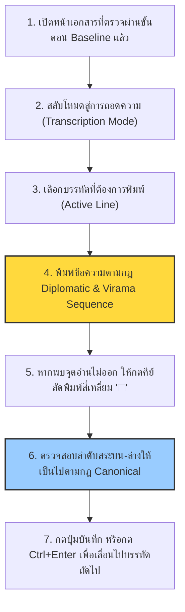

# 5.1 กฎการปริวรรตอักษรขอมโบราณและการใช้ Unicode Virama

คู่มือฉบับนี้จัดทำขึ้นสำหรับผู้ทำงานกำกับข้อมูล (Annotator) และผู้ตรวจสอบข้อมูล (Reviewer) ในโครงการรู้จำข้อความลายมือเขียนโบราณ (Handwritten Text Recognition หรือ HTR) สำหรับเอกสารใบลานและสมุดพับไทยโบราณที่เขียนด้วย **อักษรขอม** (Khom Script) เพื่อให้การแปลงข้อมูลภาพเป็นข้อความดิจิทัลเฉลย (Ground Truth) มีมาตรฐานเดียวกัน ซึ่งมีความสำคัญยิ่งต่อการประเมินและการฝึกสอนโมเดลปัญญาประดิษฐ์ให้ได้ค่าอัตราความผิดพลาดระดับอักขระ (Character Error Rate: CER) ต่ำสุด

---

## 1. บทนำและความสำคัญของคู่มือปริวรรตอักษรขอมโบราณ
การแปลงคัมภีร์ใบลานอักษรขอมโบราณให้อยู่ในรูปแบบดิจิทัลต้องเผชิญกับอุปสรรคสำคัญด้านอักขรวิธี เนื่องจากอักษรขอมจัดอยู่ในระบบ **อักษรสระประกอบ (Abugida)** ซึ่งได้รับอิทธิพลมาจากอักษรปัลลวะในอินเดียใต้ผ่านอักษรเขมรโบราณ มีโครงสร้างการซ้อนอักขระในแนวดิ่ง (Vertical Stacking) หรือที่เรียกกันว่า **ตัวเชิง (Subscript Consonants)** ที่ห้อยตัวอักษรควบกล้ำหรือตัวสะกดไว้ด้านล่างพยัญชนะหลัก รวมถึงมีสระล้อมรอบทั้ง 4 ทิศทาง (สระบน สระล่าง สระหน้า และสระหลัง)

ลักษณะดังกล่าวมีความใกล้เคียงกับความท้าทายในโครงการระดับสากล เช่น:
*   **โครงการ SleukRith Set (เขมรโบราณ):** ซึ่งพบปัญหาการทับซ้อนของ Bounding Box ของตัวอักษรระหว่างบรรทัดและสระประกอบรอบทิศทาง จึงเปลี่ยนมาใช้สถาปัตยกรรมการลากเส้นแนวฐาน (Baseline) ร่วมกับการตรวจจับโพลีกอน (Polygon Boundary) ระดับอักขระ
*   **โครงการ TibSchol (ทิเบตโบราณ):** ที่ใช้วิธีถอดความอักขระแนวตั้งเป็นลำดับตัวอักษร (Stacked-Grapheme Vocabulary Mapping) ร่วมกับโครงข่ายประสาทแบบ CRNN เพื่อให้สอดคล้องกับมาตรฐานทางภาษาศาสตร์

เพื่อให้ระบบจดจำข้อความของ Kraken และ eScriptorium เรียนรู้ความสัมพันธ์เชิงแสง (Optical Features) กับลำดับตัวอักษรได้อย่างถูกต้อง โครงการนี้จึงกำหนดมาตรฐานการใช้ **Unicode Virama/Phinthu (◌ฺ U+0E3A)** ในการถอดความตัวเชิง และบังคับใช้กฎการถอดความอย่างเคร่งครัดดังต่อไปนี้

---

## 2. หลักการปริวรรตอักษรแบบรักษาต้นฉบับ (Diplomatic Transcription)

ในการจัดทำ Ground Truth สำหรับระบบ HTR กฎเหล็กที่สำคัญที่สุดคือการใช้ **"การปริวรรตอักษรแบบรักษาต้นฉบับ" (Diplomatic Transcription)** 

> [!IMPORTANT]
> **หลักการสำคัญ:** "พิมพ์ข้อความตามที่ตาเห็นในภาพเท่านั้น ห้ามแก้ไข ห้ามสะกดใหม่ และห้ามปรับเป็นคำศัพท์ปัจจุบัน"

### 2.1 ทำไมต้องใช้ Diplomatic Transcription ในงาน HTR?
โมเดลดีปเลิร์นนิงของ HTR (เช่น CRNN หรือ Vision Transformer) เรียนรู้จากการจับคู่พิกเซลภาพบรรทัดกับข้อความเป้าหมาย หากภาพต้นฉบับสะกดผิดหรือมีลักษณะทางอักขรวิธีโบราณ แต่ผู้ป้อนข้อมูลเข้าไปแก้ไขให้ถูกต้องตามหลักภาษาศาสตร์ปัจจุบัน โมเดลปัญญาประดิษฐ์จะเกิดความสับสนอย่างรุนแรง เนื่องจากพิกเซลภาพอักขระที่ป้อนเข้า (Input) ไม่ตรงกับข้อความเฉลย (Label) ส่งผลให้ค่า Loss ในการฝึกโมเดลไม่ลดลง และโมเดลไม่สามารถจดจำรูปแบบอักษรที่ถูกต้องได้

### 2.2 ข้อกำหนดและแนวทางปฏิบัติ
1.  **สะกดผิดต้องยอมรับ:** หากเอกสารเขียนสะกดผิด เช่น พิมพ์คำว่า "สพฺพ" เป็น "สพฺป" หรือสะกดคำผิดไวยากรณ์บาลี ให้ถอดความตามรูปอักษรที่เห็นจริง ห้ามทำการแก้ไขสะกดคำให้ถูกต้อง
2.  **อักขรวิธีโบราณ:** อักษรขอมไทยมักมีการใช้รูปแบบสระและพยัญชนะโบราณ เช่น สระโอเปลี่ยนรูป หรือการสลับที่ของสระหน้า-หลัง ให้พิมพ์ตามอักขรวิธีตามลำดับการอ่านจริงที่ตกลงกันไว้
3.  **วรรณยุกต์และเครื่องหมาย:** หากพบลักษณะการเขียนวรรณยุกต์ (ซึ่งมักไม่พบในภาษาบาลี แต่อาจพบในภาษาไทยที่เขียนด้วยอักษรขอม) ให้ใส่ตามจริงทุกประการ แม้ว่าตำแหน่งจะเยื้องจากความเป็นจริงก็ตาม

| ตัวอย่างข้อความในภาพ | สิ่งที่เห็นในต้นฉบับ | การถอดความแบบ Diplomatic (ถูกต้อง) | การถอดความแบบ Normalized (ผิดสำหรับ HTR) |
|:---|:---|:---|:---|
| ธรรม (ภาษาไทย) | ธมฺม (เขียนบาลีซ้อนเชิง) | **ธมฺม** | ธรรม / ธัมมะ |
| สังฆะ | สงฺฆ | **สงฺฆ** | สังฆ / สังฆะ |
| สัพพะ | สพฺพ | **สพฺพ** | สรรพ / สัพพะ |

---

## 3. การจัดการตัวเชิงด้วย Unicode Virama (U+0E3A ◌ฺ)

เนื่องจากอักษรขอมโบราณไม่มีการแยกช่องคีย์บอร์ดเฉพาะสำหรับ "ตัวเชิง" ของพยัญชนะแต่ละตัว ทางโครงการจึงใช้รหัส **Unicode Phinthu/Virama (◌ฺ U+0E3A - พินทุภาษาไทย)** ในการทำหน้าที่เป็นตัวควบคุม (Control Character) เพื่อระบุว่าพยัญชนะตัวถัดไปจะถูกเรนเดอร์หรือเขียนให้เป็นตัวเชิงอยู่ใต้พยัญชนะตัวหลัก

### 3.1 รูปแบบและโครงสร้างการป้อนข้อมูล (Encoding Sequence)
การสะกดตัวเชิงในระบบคอมพิวเตอร์จะใช้โครงสร้างดังนี้:
$$\text{[พยัญชนะตัวหลัก]} + \text{Unicode Virama (U+0E3A)} + \text{[พยัญชนะที่จะเป็นตัวเชิง]}$$

เมื่อนำโครงสร้างนี้มาเทรนระบบ HTR ตัวประสานสัญญาณถอดรหัส (CTC Loss หรือ Attention Decoder) จะรับรู้ว่าตัวพินทุ (U+0E3A) เป็นการเปลี่ยนตำแหน่งการแสดงผล of อักขระถัดไปให้อยู่ด้านล่าง ทำให้ AI สามารถเรียนรู้รูปแบบการกระจายพิกเซลตามแนวดิ่งได้อย่างเป็นระบบ

### 3.2 ตัวอย่างการถอดความเชิงลึก

1.  **ตัวอย่างที่ 1: คำว่า "กฺร" (ก + เชิง ร)**
    *   **พยัญชนะตัวหลัก:** `ก` (U+0E01)
    *   **ตัวเชิง:** `ร` (U+0E23)
    *   **ลำดับป้อนข้อมูล:** `ก` + `◌ฺ` (U+0E3A) + `ร` $\rightarrow$ **กฺร**
 
2.  **ตัวอย่างที่ 2: คำว่า "ธมฺม" (ธ + ม + เชิง ม)**
    *   **พยัญชนะหลักตัวแรก:** `ม` (U+0E21)
    *   **พยัญชนะหลักตัวที่สอง:** `ม` (U+0E21)
    *   **ตัวเชิงของ ม:** `ม` (U+0E21)
    *   **ลำดับป้อนข้อมูล:** `ธ` + `ม` + `◌ฺ` (U+0E3A) + `ม` $\rightarrow$ **ธมฺม**
 
3.  **ตัวอย่างที่ 3: คำว่า "พุทฺธ" (พ + สระอุ + ท + เชิง ธ)**
    *   **พยัญชนะหลัก:** `พ` (U+0E1E), `ท` (U+0E17)
    *   **สระล่าง:** `◌ุ` (U+0E38)
    *   **ตัวเชิงของ ท:** `ธ` (U+0E18)
    *   **ลำดับป้อนข้อมูล:** `พ` + `◌ุ` + `ท` + `◌ฺ` (U+0E3A) + `ธ` $\rightarrow$ **พุทฺธ**
 
4.  **ตัวอย่างที่ 4: คำว่า "สงฺฆ" (ส + ง + เชิง ฆ)**
    *   **พยัญชนะหลัก:** `ส` (U+0E2A), `ง` (U+0E07)
    *   **ตัวเชิงของ ง:** `ฆ` (U+0E00)
    *   **ลำดับป้อนข้อมูล:** `ส` + `ง` + `◌ฺ` (U+0E3A) + `ฆ` $\rightarrow$ **สงฺฆ**

> [!WARNING]
> **ระวังข้อผิดพลาดในการพิมพ์:**
> ห้ามสลับลำดับการคีย์เด็ดขาด ตัวพินทุ (U+0E3A) จะต้องอยู่ **หลังพยัญชนะตัวสะกดหลัก** และ **ก่อนหน้าพยัญชนะตัวเชิง** เสมอ เช่น `ม` + `◌ฺ` + `ม` ไม่ใช่ `◌ฺ` + `ม` + `ม`

---

## 4. ลำดับการคีย์ข้อมูลและการเรียงซ้อนของอักขระ (Character Input Ordering Rules)

ปัญหาที่พบบ่อยในฐานข้อมูล Ground Truth ของอักษรขอมและอักษรธรรม คือความไม่สม่ำเสมอในการพิมพ์ลำดับของสระและพยัญชนะ ซึ่งส่งผลให้เกิดตัวสะกดแฝงในไฟล์ Text (แม้ตาจะมองเห็นรูปผลลัพธ์เหมือนกันก็ตาม) จึงได้กำหนดกฎเกณฑ์มาตรฐานการคีย์ข้อมูลแบบเรียงลำดับจากซ้ายไปขวา และล่างขึ้นบน ดังนี้:

### 4.1 กฎการเรียงลำดับเชิงโครงสร้างอักขระเดี่ยว (Canonical Ordering)
สำหรับพยัญชนะใดๆ ที่มีเครื่องหมายประกอบ ให้เรียงลำดับคีย์อินพุตตามกฎต่อไปนี้:
1.  **พยัญชนะหลัก (Base Consonant):** เช่น ก, ข, ค, ธ...
2.  **ตัวเชิง (Subscript Consonant):** Virama (U+0E3A) + พยัญชนะตัวเชิง
3.  **สระล่าง (Subscript Vowel):** เช่น ◌ุ (U+0E38) หรือ ◌ู (U+0E39)
4.  **สระบน (Superscript Vowel):** เช่น ◌ิ (U+0E34), ◌ี (U+0E35), ◌ึ (U+0E36), ◌ื (U+0E37)
5.  **นิคหิต (Anusvara):** ◌ํ (U+0E4D)
6.  **วรรณยุกต์ (Tone Mark) (ถ้ามี):** ◌่ (U+0E48), ◌้ (U+0E49)...

### 4.2 การจัดการสระประกอบรอบทิศทาง
*   **สระเอีย (เ + พยัญชนะ + สระอี + ย):** ให้พิมพ์ตามลำดับภาพจากซ้ายไปขวา ได้แก่ `เ` $\rightarrow$ `พยัญชนะหลัก` $\rightarrow$ `สระอี` $\rightarrow$ `ย`
*   **สระลอย (Independent Vowels):** อักษรขอมมีสระลอย เช่น อะ (อะลอย), อา (อาลอย), อิ (อิลอย), อี (อีลอย), อุ (อุลอย), อู (อูลอย) ให้ใช้รหัส Unicode ที่กำหนดไว้เฉพาะตาม Character Map ของโครงการ ห้ามพิมพ์โดยผสมสระประกอบเองเด็ดขาด

---

## 5. การจัดการระยะห่าง เครื่องหมายพิเศษ และตัวเลขโบราณ

### 5.1 การจัดการระยะห่าง (Spacing)
อักษรขอมที่บันทึกบนใบลานส่วนใหญ่เขียนต่อกันเป็นประโยคยาวโดยไม่มีการเว้นวรรค (Scriptura Continua)
*   **ห้ามใส่วรรคเอง:** ในช่องพิมพ์เฉลยห้ามเคาะเว้นวรรคสุ่มสี่สุ่มห้าเด็ดขาด
*   **พิมพ์วรรคเฉพาะเมื่อมีช่องว่างจริง:** จะพิมพ์เว้นวรรค 1 เคาะ (Space) ก็ต่อเมื่อในรูปภาพใบลานมีการเว้นวรรคขนาดใหญ่เพื่อแยกตอน แยกวรรค หรือแบ่งบทอย่างชัดเจนเชิงทัศนศาสตร์เท่านั้น
*   **ระยะเว้นขอบใบ:** ระยะห่างรูกลางใบลานสำหรับร้อยด้าย (รูกลาง) ไม่ต้องนำมานับเป็นวรรค ให้พิมพ์ข้อความต่อเนื่องกันไปเลยหากตัวอักษรจารข้ามรูนั้นเขียนต่อประโยคกัน

### 5.2 การถอดความเครื่องหมายพิเศษ (Special Marks & Punctuation)
ในเอกสารโบราณจะมีเครื่องหมายโบราณปรากฏบ่อยครั้ง ให้ใช้ตัวอักษรคีย์บอร์ดตามมาตรฐานต่อไปนี้:
*   **อังคั่นเดี่ยว (ฯ):** สิ้นสุดประโยคย่อย พิมพ์ `ฯ` (U+0E2F)
*   **อังคั่นคู่ (๚):** สิ้นสุดย่อหน้าหรือสิ้นสุดคาถา พิมพ์ `๚` (U+0E5A)
*   **โคมูตร (๛):** เครื่องหมายสิ้นสุดเรื่องหรือคัมภีร์ พิมพ์ `๛` (U+0E5B)
*   **ฟองมันหรือตาไก่ (๏):** เครื่องหมายขึ้นต้นบรรทัดหรือบทใหม่ พิมพ์ `๏` (U+0E50)

---

## 6. การจัดการอักขระที่อ่านไม่ออกหรือสูญหาย (Handling Unreadable Characters)

ปัญหาคลาสสิกของเอกสารใบลานโบราณคือการเสื่อมสภาพทางกายภาพ เช่น เชื้อราขึ้น รอยแมลงแทะ ขอบใบแตก หรือหมึกเลือนจางจนไม่สามารถระบุตัวอักษรได้ด้วยสายตาของผู้เชี่ยวชาญ

### 6.1 การใช้สัญลักษณ์แทนตัวอักษรสูญหาย
หากพบอักขระที่ชำรุดเสียหายจนอ่านไม่ออก ให้ปฏิบัติตังนี้:
*   ใช้สัญลักษณ์สี่เหลี่ยม **`☐` (Unicode U+2610 - Ballot Box)** หรืออาจใช้ **`□` (Unicode U+25A1 - White Square)** ตามที่กำหนดในโปรเจกต์
*   **กฎการนับจำนวน:** ให้ใส่ `☐` 1 ตัว ต่อ 1 อักขระเดี่ยวที่คาดว่าสูญหายไป เช่น หากคำว่า "นะโมตัสสะ" เลือนหายไปตรงกลาง 2 ตัวอักษรจนอ่านได้ว่า "นะโม...สะ" ให้พิมพ์ถอดความว่า **"นะโม☐☐สะ"**

```
ภาพใบลานชำรุด: [ นะ โม ░ ░ สะ ]
ถอดความเฉลย:    "นะโม☐☐สะ"
```

### 6.2 ทำไมต้องรักษาจำนวนอักขระที่อ่านไม่ออก?
ฟังก์ชันสูญเสีย Connectionist Temporal Classification (CTC) ที่ใช้ในการเทรนโมเดล HTR อาศัยการบีบอัดและจัดเรียงเวลาของเวกเตอร์ลักษณะเฉพาะเชิงแสง หากเราเว้นพื้นที่ว่างไปดื้อๆ หรือข้ามตัวอักษรที่ชำรุดไป โมเดลจะสับสนและพยายามนำลักษณะพิกเซลสีดำที่เป็นรอยชำรุดไปจับคู่กับอักษร "สะ" ทำให้ความแม่นยำในการจดจำอักษรตัวอื่นรอบข้างเสียหายไปด้วย การใช้ `☐` จะช่วยบอกโมเดลว่า "พื้นที่มืดตรงนี้เป็นขยะหรือสิ่งเจือปนที่ไม่มีการถอดความ" ซึ่งช่วยปกป้องความแม่นยำของโมเดลอักษรดีในภาพรวม

---

## 7. ขั้นตอนปฏิบัติงานถอดความในระบบ eScriptorium (Step-by-Step UI Guide)

สำหรับผู้กำกับข้อมูลที่ใช้งานแพลตฟอร์ม **eScriptorium** ให้ปฏิบัติตามลำดับขั้นตอนดังนี้:



### 7.1 การใช้แผงแป้นพิมพ์เสมือน (Virtual Keyboard)
เนื่องจากการพิมพ์ Virama (U+0E3A) บนคีย์บอร์ดปกติอาจทำได้ยากหรือต้องสลับภาษาไปมา แนะนำให้ตั้งค่าแป้นพิมพ์ลัดใน eScriptorium หรือประยุกต์ใช้ Virtual Keyboard Map ที่กำหนดปุ่มเฉพาะสำหรับตัวพินทุ `◌ฺ` สัญลักษณ์ `☐` และสระลอยต่างๆ เพื่อประหยัดเวลาการพิมพ์และป้องกันการพิมพ์ลำดับอักขระผิดพลาด

---

## 8. สคริปต์ Python สำหรับตรวจสอบและทำความสะอาดข้อมูล (Validation Script)

เพื่อรับประกันว่าไฟล์ข้อความเฉลย (Ground Truth) ในชุดข้อมูลไม่มีการพิมพ์ลำดับอักษรผิดพลาดหรือการใช้สัญลักษณ์ผิดประเภทก่อนนำเข้าสู่กระบวนการ Train โมเดล นักพัฒนาสามารถรันสคริปต์ตรวจสอบชุดข้อมูล (Validation Script) ด้านล่างนี้เพื่อคัดกรองบรรทัดที่มีข้อผิดพลาดทางอักขรวิธีได้โดยอัตโนมัติ

```python
import os
import re

# การกำหนดกฎข้อบังคับ (Validation Rules) สำหรับอักษรขอมไทยด้วย Virama (U+0E3A)
THAI_CONSONANTS = r"[ก-ฮ]"  # ครอบคลุมพยัญชนะไทยหลักที่ใช้แทนรูปอักษรขอม
VIRAMA = "\u0e3a"         # พินทุ/วิรามะ (◌ฺ)
VOWELS_BELOW = r"[\u0e38\u0e39]" # สระอุ, สระอู
VOWELS_ABOVE = r"[\u0e31\u0e34-\u0e37]" # สระอะเปลี่ยนรูป, สระอิ, สระอี, สระอึ, สระอือ
ANUSVARA = "\u0e4d"       # นิคหิต (◌ํ)

def validate_khom_transcription(text, line_number=0):
    """
    ตรวจสอบความถูกต้องของโครงสร้างอักขระขอมตามข้อกำหนดของโครงการ
    """
    errors = []
    
    # กฎข้อที่ 1: ตรวจสอบการใช้ Virama ที่ไม่มีพยัญชนะประกบหน้าหลัง
    # ตัวเชิงจะต้องเริ่มด้วย พยัญชนะ + Virama + พยัญชนะ
    virama_indices = [m.start() for m in re.finditer(VIRAMA, text)]
    for idx in virama_indices:
        if idx == 0 or idx == len(text) - 1:
            errors.append(f"พบ Virama อยู่ที่ขอบสุดของข้อความ (ตำแหน่งพิกเซลผิดพลาด)")
            continue
        
        char_before = text[idx-1]
        char_after = text[idx+1]
        
        # ตรวจสอบว่าพยัญชนะหลักและเชิงต้องถูกต้อง
        if not re.match(THAI_CONSONANTS, char_before):
            errors.append(f"ตำแหน่ง {idx}: อักขระหน้า Virama ไม่ใช่พยัญชนะหลัก ('{char_before}')")
        if not re.match(THAI_CONSONANTS, char_after):
            errors.append(f"ตำแหน่ง {idx}: อักขระหลัง Virama ไม่ใช่พยัญชนะเชิง ('{char_after}')")

    # กฎข้อที่ 2: ตรวจจับพยัญชนะเชิงซ้อนทับซ้อนที่ห้ามใช้เครื่องหมายสระผิดลำดับ
    # เช่น พิมพ์สระล่างก่อนตัวเชิง (ผิด) ต้องพิมพ์ตัวเชิงเสร็จก่อนจึงตามด้วยสระล่าง
    # ลำดับที่ผิด: พยัญชนะ + สระล่าง + Virama + พยัญชนะ
    invalid_subscript_seq = re.search(rf"{THAI_CONSONANTS}{VOWELS_BELOW}{VIRAMA}{THAI_CONSONANTS}", text)
    if invalid_subscript_seq:
        errors.append(f"พิมพ์ลำดับผิด: พิมพ์สระล่างก่อนตัวเชิงสะกด '{invalid_subscript_seq.group()}'")
        
    # กฎข้อที่ 3: ตรวจสอบการซ้อนกันของสระบนและนิคหิต
    # ลำดับที่ถูกตามโครงสร้าง Unicode: พยัญชนะ + สระบน + นิคหิต
    # ลำดับที่ผิด: พยัญชนะ + นิคหิต + สระบน
    invalid_anusvara_seq = re.search(rf"{THAI_CONSONANTS}{ANUSVARA}{VOWELS_ABOVE}", text)
    if invalid_anusvara_seq:
        errors.append(f"พิมพ์ลำดับผิด: พิมพ์นิคหิตก่อนสระบน '{invalid_anusvara_seq.group()}'")

    # กฎข้อที่ 4: ตรวจสอบสัญลักษณ์ทดแทน
    # ต้องใช้ ☐ (U+2610) หรือ □ (U+25A1) เท่านั้น ห้ามใช้จุดไข่ปลาหรืออักขระอื่น
    invalid_unreadable = re.search(r"(\.{3,}|\?{2,}|X{2,})", text)
    if invalid_unreadable:
        errors.append(f"พบการใช้สัญลักษณ์ระบุจุดอ่านไม่ออกไม่ตรงมาตรฐาน: '{invalid_unreadable.group()}' (ให้เปลี่ยนเป็น ☐)")

    return errors

# การทดสอบการทำงานของฟังก์ชันวิเคราะห์ระบบ
if __name__ == "__main__":
    test_cases = [
        "ธมฺมจะรัง",       # ถูกต้อง (ธ + ม + ฺ + ม)
        "สฺพพ",          # ถูกต้อง (ส + ฺ + พ)
        "พฺุทธ",          # ผิดลำดับ (สระล่างมาก่อนวิรามะ)
        "สํิฆ",           # ผิดลำดับ (นิคหิตมาก่อนสระอิ)
        "นะโม...สะ",     # ผิด (ใช้จุดไข่ปลาแทนที่จะใช้ ☐)
        "นะโม☐☐สะ",      # ถูกต้องตามมาตรฐาน
        "ฺกร",            # ผิด (วิรามะขึ้นต้นประโยค)
    ]
    
    print("=== เริ่มการตรวจสอบข้อความทดลองปริวรรตอักษรขอม ===")
    for i, case in enumerate(test_cases, 1):
        errs = validate_khom_transcription(case, i)
        if errs:
            print(f"\n[ERROR] เคสที่ {i}: '{case}' พบจุดบกพร่อง:")
            for err in errs:
                print(f"  - {err}")
        else:
            print(f"[PASS] เคสที่ {i}: '{case}' ผ่านการตรวจสอบโครงสร้าง")
    print("\n=== การตรวจสอบเสร็จสิ้น ===")
```

---

## 9. สรุปแนวทางสำหรับผู้ดูแลระบบ (Administrator Guideline)

เพื่อควบคุมคุณภาพการสร้าง Ground Truth ให้มีความสม่ำเสมอ แนะนำให้ดำเนินการดังนี้:
1.  **การฝึกอบรม (Training):** จัดการฝึกอบรมการพิมพ์ตัวเชิงโดยใช้ Unicode Virama ให้แก่เจ้าหน้าที่ถอดความทุกคนเป็นเวลาอย่างน้อย 1-2 วันก่อนเริ่มงานจริง
2.  **การวัดความสอดคล้องระหว่างผู้บันทึก (Inter-Annotator Agreement - IAA):** ให้เจ้าหน้าที่อย่างน้อย 2 คน ทดลองถอดความหน้าเดียวกันปริมาณ 10 หน้า แล้วนำข้อความมาวิเคราะห์หาค่า CER ร่วมกัน หากค่าความสอดคล้องต่ำกว่า 95% จะต้องทำการปรับปรุงและชี้แจงความเข้าใจเกี่ยวกับคู่มือฉบับนี้เพิ่มเติม
3.  **การสแกนอัตโนมัติ (Automated QC):** รันสคริปต์ตรวจความถูกต้องแบบเดียวกับสคริปต์ในหัวข้อที่ 8 ทุกสัปดาห์ เพื่อกรองหาความผิดปกติของตัวเชิงในคลังข้อมูลที่กำลังสร้างใหม่
