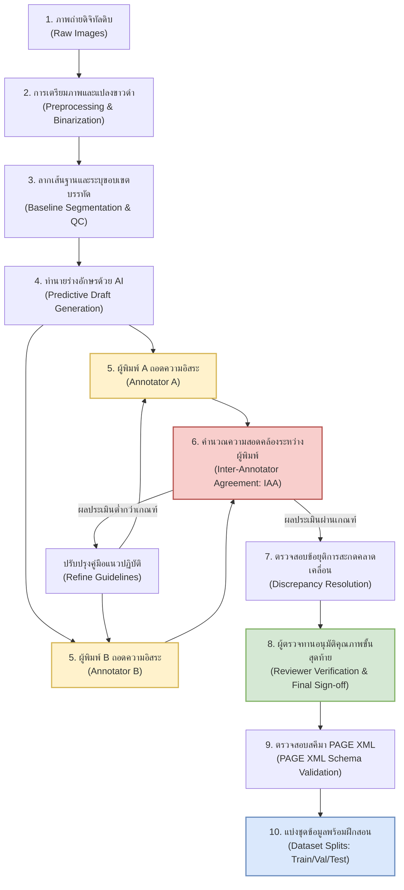

# 5.2 แนวปฏิบัติในการควบคุมคุณภาพข้อมูลและการประเมินความสอดคล้องระหว่างผู้พิมพ์
(Data Quality Control Guidelines and Inter-Annotator Agreement Evaluation)

> **ระดับ:** ปฏิบัติการและบริหารจัดการโครงการ  
> **เวลาอ่าน:** ~35 นาที  
> **ไฟล์ที่เกี่ยวข้อง:** [F02_Annotation_Workflow_and_GT_Formats](5.1_กฎการปริวรรตอักษรขอมโบราณและการใช้Unicode_Virama.md), [06_สร้าง_Ground_Truth](5.1_กฎการปริวรรตอักษรขอมโบราณและการใช้Unicode_Virama.md)

---

การสร้างคลังข้อมูล **Ground Truth (GT)** ที่มีคุณภาพสูง ถือเป็นปัจจัยที่ชี้ขาดความสำเร็จหรือความล้มเหลวในการฝึกสอนแบบจำลองการรู้จำข้อความลายมือเขียนโบราณ (Handwritten Text Recognition: HTR) หากข้อมูลเฉลยมีข้อผิดพลาด มีการสะกดคำที่ไม่สม่ำเสมอ หรือมีข้อบกพร่องในการลากเส้นฐานบรรทัด (Baseline) แบบจำลองปัญญาประดิษฐ์จะเรียนรู้รูปแบบที่ผิดพลาดเหล่านั้น ส่งผลให้อัตราความผิดพลาดระดับอักขระ (Character Error Rate: CER) ในขั้นตอนทดสอบจริงสูงขึ้นอย่างหลีกเลี่ยงไม่ได้ 

แนวปฏิบัติฉบับนี้จัดทำขึ้นเพื่อกำหนดกรอบการควบคุมคุณภาพข้อมูล (Data Quality Control Workflow) บทบาทหน้าที่ของบุคลากร และตัวชี้วัดความสอดคล้องระหว่างผู้ถอดความ (Inter-Annotator Agreement: IAA) สำหรับเอกสารโบราณประเภทใบลานและสมุดไทย โดยประยุกต์ใช้ระเบียบวิธีวิจัยสากลจากโครงการระดับสากล เช่น โครงการ **Muharaf (NeurIPS 2024)** และเครื่องมือมาตรฐานระบบ HTR

---

## 1. แผนผังและขั้นตอนการควบคุมคุณภาพข้อมูล (Data Quality Control Workflows)

กระบวนการควบคุมคุณภาพข้อมูล Ground Truth ออกแบบตามหลักการประสานงานแบบปกปิดข้อมูลสองทาง (Double-Blind Annotation) และการตรวจทานแบบบูรณาการ โดยมีเวิร์กโฟลว์การทำงานตั้งแต่ภาพดิบจนถึงคลังข้อมูลที่พร้อมเทรนแบบจำลองดังแผนภูมิ:

### รายละเอียดขั้นตอนการดำเนินงาน (Step-by-Step Pipeline)

#### ขั้นตอนที่ 1-2: การเตรียมภาพดิจิทัล (Digitization and Image Preprocessing)
นำเข้าภาพถ่ายสีความละเอียดสูง (แนะนำขั้นต่ำ 600 DPI) ผ่านกระบวนการลบเงาและปรับแต่งภาพ (Contrast Jittering) จากนั้นใช้อัลกอริทึมแปลงเป็นภาพขาวดำจำเพาะพื้นที่ (Otsu's Adaptive Binarization) เพื่อขจัดสิ่งรบกวนทางกายภาพ เช่น คราบสิ่งสกปรก คราบกาว หรือรอยด่างดำบนใบลานและสมุดไทย

#### ขั้นตอนที่ 3: การระบุขอบเขตและลากเส้นฐานบรรทัด (Precise Baseline Segmentation)
ผู้ควบคุมงานหรือ AI ทำการลากเส้นฐานบรรทัด (Baseline) ใต้พยัญชนะหลักอย่างแม่นยำ พร้อมล้อมกรอบโพลีกอน (Polygon Boundary) คลุมเขตอักขระของบรรทัดนั้น ๆ 

> [!IMPORTANT]
> สำหรับอักษรไทย อักษรขอม และอักษรธรรมล้านนา เส้น Baseline จะต้องลากขนานไปตามแนวเขียนใต้พยัญชนะตัวหลัก โดยห้ามลัดตัดผ่านสระล่าง (เช่น สระอุ สระอู) หรือตัวเชิง (Subscript Consonant) เพื่อไม่ให้โมเดล AI สับสนขอบเขตพิกเซลแนวดิ่ง

#### ขั้นตอนที่ 4: การสร้างแบบร่างนำทางด้วย AI (Predictive Draft Generation)
น้อมนำกลยุทธ์ **"แก้ไข ดีกว่าสร้างใหม่" (Correct, Don't Create)** จากโปรเจกต์อักษรโบราณชั้นนำ (เช่น OpenITI และ Finnish Court Records) โดยการนำภาพบรรทัดที่ผ่านการแบ่งส่วน (Segmentation) มารันผ่านโมเดล HTR ตั้งต้น (Pre-trained Model) เพื่อสร้างแบบร่างข้อความทำนายล่วงหน้า (Predictive Draft) ส่งต่อให้ผู้พิมพ์ทำการตรวจแก้ แทนการให้พิมพ์ใหม่ตั้งแต่แรก ซึ่งจะช่วยเพิ่มอัตราความเร็วการทำ Ground Truth จากปกติ 1–2 หน้าต่อชั่วโมง เป็น 6–10 หน้าต่อชั่วโมง (ประสิทธิภาพเพิ่มขึ้นกว่า 60%)

#### ขั้นตอนที่ 5: การถอดความอิสระแบบปกปิดข้อมูลสองทาง (Double-Blind Transcription)
จัดสรรภาพเอกสารชุดเดียวกันจำนวนร้อยละ 10–15 ให้ผู้ถอดความ (Annotators) อย่างน้อย 2 คน ดำเนินการแก้ไขหรือพิมพ์ข้อความถอดความโดยอิสระ โดยไม่ให้มองเห็นผลลัพธ์ของกันและกัน เพื่อใช้เป็นข้อมูลในการคำนวณค่าวัดความสอดคล้องของทีม

#### ขั้นตอนที่ 6: การประเมินค่า Inter-Annotator Agreement (IAA)
ผู้ตรวจทานคำนวณค่าวัดความสอดคล้องทางสถิติ (Cohen's Kappa, Krippendorff's Alpha หรือ CER-based Agreement) เพื่อดูว่าแนวทางการสะกดและการพิมพ์ถอดความของทีมสอดคล้องกันเพียงใด หากค่าสถิติต่ำกว่าเกณฑ์ที่กำหนด จะต้องระงับการทำงานเพื่อปรับปรุงกติกา (Transcription Guidelines) ใหม่

#### ขั้นตอนที่ 7-8: การหาข้อยุติและการอนุมัติขั้นสุดท้าย (Discrepancy Resolution & Verification)
จุดที่ผู้พิมพ์สองคนถอดความต่างกัน (Discrepancies) จะต้องถูกส่งต่อให้ผู้ประสานงาน/ผู้ตรวจทาน (Reviewer/Coordinator) ตรวจสอบและเลือกคำถอดความที่ถูกต้องที่สุดตามบริบทประวัติศาสตร์วิเคราะห์ จากนั้นจึงบันทึกผลเป็นเวอร์ชันมาตรฐานทองคำ (Gold Standard)

#### ขั้นตอนที่ 9-10: การทวนสอบโครงสร้าง XML และแบ่งกลุ่มข้อมูล (Validation & Split)
ระบบจะทำการแปลงและตรวจสอบความถูกต้องของสคีมาเอกสาร PAGE XML และจัดแบ่งกลุ่มข้อมูลออกเป็นสัดส่วน Train 70% / Validation 15% / Test 15% โดยแยกเอกสารเป็นเล่มหรือหน้าอย่างชัดเจนไม่ให้เกิดการปะปนกัน (Data Leakage)

---

## 2. บทบาทและหน้าที่ความรับผิดชอบของทีมงาน (Roles and Responsibilities)

ความสำเร็จในการสร้างชุดข้อมูล Ground Truth ที่สม่ำเสมอต้องการการประสานงานของทีมงานที่มีการแบ่งบทบาทหน้าที่อย่างชัดเจน:

### 2.1 ผู้ประสานงานและผู้ตรวจทานคัดกรอง (Coordinator / Reviewer)
ผู้ตรวจทานทำหน้าที่เป็นผู้พิทักษ์คุณภาพของคลังข้อมูล (Quality Gatekeeper) โดยมีความรับผิดชอบหลักดังนี้:
* **การกำหนดแนวปฏิบัติ (Guidelines Enforcement):** จัดทำ ปรับปรุง และควบคุมการปฏิบัติตามคู่มือการสะกดอักขระและการถอดความอักษรโบราณ (Transcription Guidelines) 
* **การตัดสินข้อพิพาทข้อความ (Discrepancy Resolution):** วิเคราะห์และหาข้อสรุปเมื่อผู้ถอดความถอดข้อความไม่ตรงกัน โดยใช้ความรู้ด้านจารึกวิทยาและหลักภาษาศาสตร์โบราณ
* **การประเมินสถิติคุณภาพ (Quality Metric Audit):** คำนวณค่าสหสัมพันธ์ระหว่างผู้พิมพ์ (IAA) ในทุก ๆ สัปดาห์ และสุ่มตรวจความถูกต้องของรูปเลย์เอาต์ (Layout Validation)
* **การตรวจสอบสคีมาข้อมูล (Metadata & Schema Verification):** ตรวจทานความถูกต้องของไฟล์โครงสร้าง PAGE XML และความสอดคล้องของชื่อภาพกับข้อมูลพิกัดเชิงตำแหน่ง

### 2.2 ผู้กำกับข้อมูลและพิมพ์ถอดความ (Annotators / Transcribers)
ผู้ถอดความทำหน้าที่แปลงภาพตัวอักษรโบราณให้เป็นข้อความดิจิทัล โดยมีความรับผิดชอบหลักดังนี้:
* **การถอดความระดับอักขระละเอียด (Facsimile / Diplomatic Level Transcription):** ทำการพิมพ์ถอดความอักษรโบราณตามที่ปรากฏจริงในภาพโดยตรง ไม่แก้ไขคำสะกดผิดของอาลักษณ์ดั้งเดิม ไม่ดัดแปลงรูปแบบตัวอักษรเป็นคำปัจจุบัน
* **การจัดการอักขระซ้อนและตัวเชิง (Subscript Consonants):** พิมพ์ป้อนข้อมูลอักขระซ้อนของอักษรขอมหรืออักษรธรรมล้านนาด้วยความระมัดระวัง โดยพิมพ์พยัญชนะต้นตามด้วยสัญลักษณ์พินทุ/วิรามะ (Unicode Virama: `U+0E3A` ◌ฺ) และตามด้วยพยัญชนะตัวเชิงอย่างเป็นระบบ เช่น:
  $$\text{ตัวหลัก "ก" } + \text{ เครื่องหมายวิรามะ } (\text{ฺ}) + \text{ ตัวเชิง "ร" } = \text{ "กฺร"}$$
* **การบันทึกอักขระชำรุดเสียหาย (Lacunae / Damage Markup):** การใช้สัญลักษณ์กำกับเฉพาะที่โครงการกำหนดไว้ เช่น พิมพ์สัญลักษณ์ `[...]` สำหรับอักษรที่สูญหายเนื่องจากรอยฉีกขาดหรือคราบหมึกเลอะเลือน และพิมพ์อักขระพิเศษ `☐` เมื่อปรากฏตัวอักษรแต่ไม่สามารถระบุตัวสะกดได้แน่ชัด
* **การแจ้งเตือนปัญหาโครงสร้างเลย์เอาต์:** แจ้งเตือนผู้ตรวจทานเมื่อพบปัญหาเส้น Baseline คลาดเคลื่อน, เส้นตัดผ่านข้อความที่เสียหาย, หรือบริเวณภาพที่ไม่ควรนำมาประมวลผล (เช่น รูร้อยเชือกใบลาน, ลายยันต์ประดับ)

---

## 3. ตัวชี้วัดความสอดคล้องระหว่างผู้พิมพ์ (Inter-Annotator Agreement: IAA)

เพื่อรับประกันว่าผู้พิมพ์ทุกคนมีความเข้าใจตรงกันในคู่มือแนวปฏิบัติการพิมพ์ถอดความ จะต้องมีการวัดค่าความสอดคล้องระหว่างผู้พิมพ์เป็นระยะด้วยตัวชี้วัด 3 ชนิด:

### 3.1 Cohen’s Kappa ($\kappa$)
ใช้สำหรับวัดความสอดคล้องในการเลือกตัวอักษรพิมพ์ระหว่างผู้ถอดความ 2 คน เพื่อหักล้างปัจจัยความบังเอิญในการกดปุ่มแป้นพิมพ์สะกด มีสูตรคำนวณคือ:

$$\kappa = \frac{p_o - p_e}{1 - p_e}$$

* โดยที่ $p_o$ คือ อัตราส่วนของอักขระที่ผู้ถอดความทั้งสองท่านพิมพ์ตรงกันจริงจากชุดตัวอย่างทดสอบ
* และ $p_e$ คือ อัตราส่วนของอักขระที่คาดว่าจะตรงกันโดยความบังเอิญทางสถิติ

### 3.2 Krippendorff’s Alpha ($\alpha$)
ใช้ประเมินความสอดคล้องเมื่อโครงการมีผู้ถอดความมากกว่า 2 คน หรือในกรณีที่ผู้ถอดความบางรายไม่ได้พิมพ์เอกสารครบทุกหน้า (Missing Data Alignment) ค่าวัดนี้จะคำนวณจากอัตราความผันแปรภายในหน่วยข้อมูล (Observed Disagreement) เทียบกับความผันแปรที่เกิดจากความบังเอิญ (Expected Disagreement) มีความยืดหยุ่นสูงและเป็นมาตรฐานสากลในงานวิจัยดิจิทัลมานุษยวิทยา

### 3.3 CER-based Agreement
เป็นการประเมินความต่างระหว่างข้อความถอดความของผู้พิมพ์สองคนโดยตรงผ่านแนวคิดของระยะห่าง Levenshtein Distance (คำนวณจำนวนการแทนที่, การลบ และการแทรกอักขระ) โดยกำหนดให้ผลงานของผู้พิมพ์คนที่ 1 เป็นข้อมูลอ้างอิง (Reference) และผู้พิมพ์คนที่ 2 เป็นข้อมูลทดสอบ (Hypothesis) มีสูตรการคำนวณดังนี้:

$$\text{Agreement CER} = \left(\frac{S + D + I}{N}\right) \times 100\%$$

$$\text{IAA Percentage} = 100\% - \text{Agreement CER}$$

* $S$ = จำนวนอักขระที่มีการพิมพ์แทนที่กัน (Substitutions)
* $D$ = จำนวนอักขระที่หายไป (Deletions)
* $I$ = จำนวนอักขระที่เกินมา (Insertions)
* $N$ = จำนวนอักขระทั้งหมดในชุดอ้างอิง

#### ตัวอย่างการคำนวณเชิงรูปธรรม:
สมมติให้หน้าใบลานอักษรขอมคำหนึ่ง:
* **ผู้พิมพ์คนที่ 1 (Reference):** พิมพ์สะกดแบบจารึกโบราณอักษรซ้อน `ธมฺม` (ธ + ม + ฺ + ม = อักขระ $N = 4$ ตัว)
* **ผู้พิมพ์คนที่ 2 (Hypothesis):** พิมพ์สะกดแบบแปลงคำปัจจุบัน `ธรรม` (ธ + ร + ร + ม = อักขระ $N = 4$ ตัว)

การเปรียบเทียบ Levenshtein Distance ระหว่างผู้พิมพ์ทั้งสองราย:
1. `ธ` $\rightarrow$ `ธ` (ตรงกัน - Match)
2. `ม` $\rightarrow$ `ร` (แทนที่ - Substitution: 1)
3. `ฺ` (วิรามะ) $\rightarrow$ `ร` (แทนที่ - Substitution: 2)
4. `ม` $\rightarrow$ `ม` (ตรงกัน - Match)

ผลรวมความต่างระดับอักขระ $S = 2, D = 0, I = 0$
$$\text{Agreement CER} = \left(\frac{2 + 0 + 0}{4}\right) \times 100\% = 50.0\%$$
$$\text{IAA Percentage} = 100\% - 50.0\% = 50.0\%$$

*บทวิเคราะห์:* ค่าความสอดคล้องกันเพียง 50.0% ชี้ให้เห็นถึงความไม่สอดคล้องอย่างรุนแรงในการสะกดคำ (ผู้พิมพ์รายหนึ่งถอดคำแบบ Facsimile ขณะที่อีกรายทำแบบ Normalized) แสดงว่าต้องมีการปรับปรุงไกด์ไลน์ด่วน

---

### เกณฑ์มาตรฐานและการดำเนินการควบคุมคุณภาพ (Quality Thresholds & Actions)

ผู้ประสานงานโครงการต้องคำนวณค่าเฉลี่ยความสอดคล้องรายสัปดาห์และเปรียบเทียบกับเกณฑ์มาตรฐานเพื่อสั่งการดังตารางนี้:

| ช่วงค่าตัวชี้วัด (IAA / CER-based Agreement) | ระดับคุณภาพ (Status) | การดำเนินการของทีมงาน (Action Required) |
| :--- | :--- | :--- |
| **IAA > 98%** (Agreement CER < 2%) Cohen's Kappa > 0.85 | **ผ่านเกณฑ์ดีเยี่ยม (Excellent)** | ข้อมูลมีความสอดคล้องสูงมาก สามารถนำเข้าสู่คลัง Ground Truth เพื่อเตรียมการฝึกสอนโมเดลได้ทันที |
| **IAA 95% - 98%** (Agreement CER 2% - 5%) Cohen's Kappa 0.70 - 0.85 | **ผ่านเกณฑ์ขั้นต่ำ (Acceptable)** | สามารถทำงานถอดความต่อได้ แต่ผู้ตรวจทานต้องรวบรวมคำสะกดที่มีความต่างมาเปิดประชุมสรุปสั้นรายสัปดาห์ และบันทึกคำที่พบบ่อยลงในคู่มือเพิ่มเติม |
| **IAA < 95%** (Agreement CER > 5%) Cohen's Kappa < 0.70 | **ต้องปรับปรุงเร่งด่วน (Unacceptable)** | **ต้องสั่งหยุดการทำงานพิมพ์ถอดความทันที** นำภาพที่มีปัญหาเข้าสู่กระบวนการ Consensus Meeting เพื่อจัดระเบียบความคิดของทีมใหม่ และทบทวนแก้ไขคู่มือการสะกดอักษรโบราณก่อนเริ่มพิมพ์ต่อ |

---

## 4. รายการตรวจสอบ 10 ข้อในการทวนสอบข้อมูล Ground Truth ก่อนการฝึกสอนโมเดล
(10-Point Pre-training Validation Checklist)

ก่อนที่จะส่งไฟล์ข้อมูลภาพและไฟล์โครงสร้าง PAGE XML เข้าสู่การประมวลผลบนการ์ดจอ (GPU CUDA Cluster) เพื่อฝึกสอนแบบจำลอง Kraken HTR คณะทำงานต้องทำการตรวจสอบความถูกต้องของข้อมูลผ่านเช็กลิสต์ 10 ข้อดังต่อไปนี้ เพื่อป้องกันความล้มเหลวในการเรียนรู้ (Training Divergence) หรือโมเดลจดจำรูปแบบคลาดเคลื่อน:

### [ ] 1. การตรวจสอบความถูกต้องของสคีมาไฟล์ PAGE XML (PAGE XML Schema Validation)
* **ข้อกำหนด:** ไฟล์คำกำกับพิกัดทั้งหมดต้องเป็นไปตามมาตรฐานโครงสร้าง XML Schema ของ PRIMA Research (เวอร์ชันปี 2013 หรือ 2019)
* **วิธีทวนสอบ:** รันสคริปต์ตรวจสอบความถูกต้องของโครงสร้างแท็ก (เช่น การปิดแท็ก `<Page>`, `<TextRegion>`, `<TextLine>`, `<Baseline>`, และ `<TextEquiv>` ครบถ้วน) ปราศจากตัวอักษรแปลกปลอมนอกโครงสร้างเอกสาร หรือรันผ่านคำสั่งตรวจสอบโครงสร้าง XML Parser ในภาษา Python

### [ ] 2. การจับคู่ทิศทางและตำแหน่งของเส้นฐานบรรทัด (Baseline Coordinate Alignment Check)
* **ข้อกำหนด:** จุดพิกัดของเส้นฐานบรรทัด (Baseline) ในไฟล์ XML ต้องลากขนานทับบริเวณลายนิ้วเขียนจริงบนภาพ โดยเริ่มต้นจากจุดซ้ายสุดของตัวอักษรตัวแรกและสิ้นสุดที่ท้ายอักขระตัวสุดท้ายของบรรทัดนั้น ๆ เสมอ
* **วิธีทวนสอบ:** ใช้โปรแกรมตรวจสอบสร้างภาพจำลองขอบเขตพิกเซล (Coordinate Visualizer) วาดทับภาพดิบเพื่อตรวจหาเส้นฐานที่ "ลอยเดี่ยว" (Floating Baseline) เส้นที่ไม่มีเส้นอักษรรองรับ หรือเส้นฐานบรรทัดที่สั้นหรือยาวเกินขอบเขตภาพจริง

### [ ] 3. การตรวจสอบขอบเขตพหุเหลี่ยมปิดของเขตข้อความ (Text Region Polygon Boundary Check)
* **ข้อกำหนด:** โพลีกอนครอบบรรทัด (TextLine Coordinates) จะต้องไม่ลากทับซ้อนคล่อมระหว่างสองบรรทัด และไม่รวมเอาสิ่งรบกวนภายนอก เช่น ขอบไม้ใบลาน รูร้อยสายสนอง คราบความชื้น หรือรอยขาดของกระดาษสมุดไทยเข้ามาในเขตคำนวณอักขระ
* **วิธีทวนสอบ:** ตรวจสอบความถูกต้องของอาณาเขตโพลีกอนโดยตรวจค่าพิกัด `Points` ในแท็ก `<Coords points="..." />` ว่าประกอบด้วยพิกัดรูปพหุเหลี่ยมปิดที่ล้อมรอบบรรทัดได้อย่างคลุมรอบตัวสระบนและสระล่างอย่างครบถ้วน

### [ ] 4. การสะกดคำอักษรซ้อนและตัวเชิงอักษรขอม/ธรรม (Subscript Consonant & Virama Consistency)
* **ข้อกำหนด:** พยัญชนะซ้อนหรือตัวเชิงทั้งหมด ต้องได้รับการพิมพ์อย่างสม่ำเสมอ โดยต้องคั่นกลางด้วยรหัสสัญญะเดียวกัน (เช่น การใช้เครื่องหมายวิรามะ `U+0E3A` หรือตาม Character Map เฉพาะที่โครงการตกลงร่วมกัน) ห้ามไม่ให้ผู้พิมพ์บางคนใช้เครื่องหมายพินทุไทยปกติ (`U+0E38` สระอุ) หรือการเคาะเว้นวรรคแทนตัวเชิง
* **วิธีทวนสอบ:** รันสคริปต์ Regex ค้นหาโครงสร้างตัวสะกดในคลังข้อมูลเพื่อดึงคำแปลกปลอม (เช่น ค้นหาพยัญชนะที่ตามด้วยตัวเชิงโดยไม่มีตัวสะกด หรือคำที่สะกดผิดโครงสร้างอักขรวิธีล้านนา/ขอม)

### [ ] 5. การทำความสะอาดรหัสอักขระควบคุมและช่องว่างที่ไม่มีพิกเซล (Zero-Width Space & Control Characters Check)
* **ข้อกำหนด:** ต้องไม่มีรหัสควบคุมซ่อนเร้นที่ไม่สามารถมองเห็นได้ด้วยตาเปล่าปะปนอยู่ในข้อความถอดความ เช่น Zero-Width Space (`U+200B`), Zero-Width Joiner (`U+200D`), หรือช่องว่างท้ายบรรทัด (Trailing Spaces) ซึ่งจะรบกวนการประมวลผลลำดับขั้นของ CTC Loss
* **วิธีทวนสอบ:** เขียนสคริปต์กวาดล้างรหัสอักขระในชุดข้อความเฉลยทั้งหมด (Data Cleaning Script) เพื่อตัดอักขระที่ไม่มีในพจนานุกรมอักขระ (Alphabet/Vocabulary) ของโมเดลออกไปก่อนทำการบรรจุไฟล์

### [ ] 6. การทวนสอบการใช้สัญญะและเครื่องหมายกำกับความชำรุด (Damage & Special Character Markup Verification)
* **ข้อกำหนด:** ข้อความที่อ่านไม่ออกหรือเสียหาย จะต้องถอดรหัสเป็นสัญลักษณ์มาตรฐานตามที่กำหนดไว้ใน Transcription Guidelines เท่านั้น เช่น `[...]` หรือ `☐` ห้ามใช้เครื่องหมายสะกดตามใจชอบของผู้ถอดความ (เช่น `???`, `ยับเยิน`, `เว้นว่าง`)
* **วิธีทวนสอบ:** ค้นหาคำในแท็ก `<Unicode>` ที่มีเครื่องหมายแปลกปลอมหรือมีจำนวนตัวอักษรและวงเล็บที่ไม่สัมพันธ์กับมาตรฐานแนวปฏิบัติของโครงการ

### [ ] 7. การตรวจสอบการแบ่งส่วนชุดข้อมูลอย่างเด็ดขาด (Dataset Split & Leakage Check)
* **ข้อกำหนด:** ข้อมูลในกลุ่มฝึกสอน (Train Set), กลุ่มปรับจูน (Validation Set) และกลุ่มประเมินผล (Test Set) ต้องไม่มีการปะปนรั่วไหลของภาพหน้าเดียวกันหรือเอกสารย่อยที่อยู่บนแผ่นจารึกเล่มเดียวกัน
* **วิธีทวนสอบ:** ตรวจทานดัชนีระบุชื่อไฟล์ภาพในแฟ้มดัชนีแบ่งชุดข้อมูล (เช่น `train.csv`, `val.csv`, `test.csv`) ว่าคีย์หลักของภาพไม่มีความซ้ำซ้อนกัน และต้องแบ่งกลุ่มในระดับของเอกสาร/เล่ม (Book-level) เพื่อป้องกันไม่ให้โมเดลจำรูปแบบลายมือของหน้าถัดไปในชุดทดสอบ

### [ ] 8. การตรวจหาหน้าและบรรทัดว่างหรือข้อมูลสูญหาย (Empty Transcription & Null Line Validation)
* **ข้อกำหนด:** ทุกบรรทัดที่ได้รับการลากเส้น Baseline ในระบบ PAGE XML จะต้องมีข้อมูลข้อความถอดความกำกับอยู่ในแอตทริบิวต์เสมอ และห้ามไม่ให้มีแท็ก `<Unicode></Unicode>` ที่ว่างเปล่าโดยไม่มีเหตุผลอันสมควร
* **วิธีทวนสอบ:** รันสคริปต์สแกนตรวจหาค่า `Null` หรือค่าว่างในฟิลด์ข้อความถอดความของไฟล์ XML ทั้งหมด หากพบต้องระบุสาเหตุว่าเป็นการชำรุดของใบลานที่ไม่มีข้อความเหลืออยู่จริง หรือเกิดจากการหลงลืมพิมพ์ของผู้ถอดความ

### [ ] 9. การวิเคราะห์อักขระนอกกลุ่มคำศัพท์และการพิมพ์สลับตัวสะกด (Out-of-Vocabulary & Character Distribution Analysis)
* **ข้อกำหนด:** จำนวนอักขระหรือคู่สระที่พบในเอกสารจะต้องไม่ต่ำเกินไปจนผิดปกติ เช่น อักขระบางตัวปรากฏเพียง 1 ครั้งในคลังข้อมูลหลายพันบรรทัด ซึ่งมักบ่งชี้ว่าเกิดจากนิ้วพิมพ์สัมผัสพลาด (Typo) สลับปุ่มบนคีย์บอร์ด
* **วิธีทวนสอบ:** คำนวณความถี่อักขระ (Character Frequency Distribution) ของตัวอักษรทั้งหมดในข้อความเฉลย และทำการแจ้งเตือนบัญชีคำที่มีความถี่ต่ำกว่า 5 ครั้งให้ผู้ตรวจทานตรวจสอบความถูกต้องเป็นรายตัว

### [ ] 10. การตรวจสอบสิทธิ์และการจับคู่ชื่อไฟล์ภาพกับข้อมูลพิกัด (File Naming & Path Mapping Consistency)
* **ข้อกำหนด:** ชื่อไฟล์ภาพที่ระบุในคุณลักษณะ `imageFilename` ภายในแท็กหลัก `<Page>` ของ PAGE XML ต้องตรงกับชื่อไฟล์ภาพทางกายภาพในโฟลเดอร์ภาพดิบตัวสะกดพิมพ์เล็ก-พิมพ์ใหญ่ทุกประการ (Case-sensitive)
* **วิธีทวนสอบ:** รันคำสั่งตรวจสอบเส้นทางไฟล์สะกดเพื่อเทียบชื่อไฟล์จริงในไดเรกทอรีจัดเก็บภาพกับสตริงชื่อที่เขียนอยู่ในสารบบ XML เพื่อยืนยันว่าโปรแกรมฝึกสอนจะค้นพบตำแหน่งภาพและไม่เกิดข้อผิดพลาดในการโหลด (File Load Error) เมื่อเริ่มต้นรันโมเดล

---

## 5. สรุปแนวทางปฏิบัติสำหรับโครงการ HTR อักษรไทยและอักษรขอมโบราณ

เพื่อให้การบริหารโครงการคลังข้อมูลเอกสารโบราณลุล่วงได้อย่างมีเสถียรภาพ คณะทำงานควรนำแนวทางปฏิบัติในเอกสารฉบับนี้ไปติดตั้งเป็นมาตรฐานการทำงานประจำวัน โดยนำโปรแกรมตรวจสอบอัตโนมัติ (Automated Validation Script) รันประเมินความสอดคล้องของผู้พิมพ์และตรวจสอบความสมบูรณ์ของโครงสร้างข้อมูลก่อนส่งมอบทุกครั้ง

> [!TIP]
> **การวางระบบตรวจสอบย้อนกลับ (Traceability):**  
> ในฐานข้อมูลกลางของโครงการ ควรกำหนดฟิลด์แสดงที่มาของข้อมูล (Data Provenance) เช่น ระบุชื่อผู้พิมพ์ (Annotator ID), ชื่อผู้ตรวจทาน (Reviewer ID), ค่าความเชื่อมั่นของโมเดลร่างแรก (AI Draft Confidence Score), และสถานะประเมินคุณภาพ (QC Status) กำกับไว้ในทุกหน้ากระดาษและทุกบรรทัด เพื่อความสะดวกในการวิเคราะห์ปรับแก้แบบจำลองในระยะยาว
