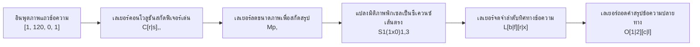

# คู่มือการเทรนโมเดล Kraken และการจูนพารามิเตอร์อย่างละเอียด
> **ระดับ:** ปฏิบัติการและวิจัยวิศวกรรมข้อมูล (Advanced Hands-on & Research)  
> **ไฟล์คู่มือ:** 6.2 (หมวดการฝึกสอนโมเดล Kraken)  
> **ภาษาหลัก:** ไทย (พร้อมวงเล็บศัพท์เทคนิคภาษาอังกฤษ)

---

## 1. บทนำและวัตถุประสงค์ (Introduction & Objectives)

การรู้จำข้อความในเอกสารโบราณของไทย เช่น **คัมภีร์ใบลาน (Palm Leaf Manuscripts)** และ **สมุดไทย (Folding Books)** ซึ่งเขียนด้วย **อักษรขอมไทย อักษรธรรมล้านนา หรืออักษรไทยโบราณ** มีความท้าทายระดับสูง เนื่องจากโครงสร้างของสคริปต์เหล่านี้นั้นมีลักษณะเด่นคือ **มีระดับอักขระซ้อนทับกันในแนวดิ่งสูงสุดถึง 4 ระดับ** (ประกอบด้วย พยัญชนะแกน, สระบน/เครื่องหมายวรรณยุกต์, สระล่าง, และพยัญชนะซ้อนหรือตัวเชิงในอักษรขอม/ล้านนา) ซึ่งแตกต่างจากอักษรตระกูลละติน (Latin) ที่เขียนเรียงในระนาบแนวนอนบรรทัดเดียวเป็นอย่างมาก

เอนจิน **Kraken** และชุดเครื่องมือระบบคำสั่ง **Ketos** ได้รับการออกแบบขึ้นภายใต้ปรัชญา **Script-agnostic** (ไม่ยึดติดกับภาษาหรือสคริปต์ใดสคริปต์หนึ่ง) และทำงานในรูปแบบ **Segmentation-free HTR** (การรู้จำโดยไม่แบ่งแยกตัวอักษรทีละตัว) ด้วยโครงข่ายประสาทลูกผสม **CRNN-CTC** (Convolutional Recurrent Neural Network with Connectionist Temporal Classification Loss) ทำให้มันเป็นเอนจินที่มีประสิทธิภาพสูงและยืดหยุ่นที่สุดสำหรับเอกสารประวัติศาสตร์ไทย

วัตถุประสงค์ของคู่มือฉบับนี้คือการอธิบายขั้นตอนการฝึกสอน (Training) โมเดลรู้จำข้อความ Kraken ผ่านทางบรรทัดคำสั่ง (Command Line Interface - CLI) ด้วยเครื่องมือ `ketos train` อย่างละเอียด เจาะลึกความหมายและการใช้งานแฟล็ก (Flags) ต่าง ๆ โครงสร้างการเขียนโครงข่ายประสาทด้วยภาษา **VGSL (Variable-size Graph Specification Language)** ตลอดจนการทำระบบจัดเก็บและแปลชุดข้อมูลให้มีประสิทธิภาพสูงสุดเพื่อลดคอขวดระบบหน่วยความจำ

---

## 2. การจัดเตรียมและแปลงรวบรวมข้อมูลด้วย Apache Arrow (Dataset Compilation)

ก่อนที่จะรันคำสั่งฝึกสอนโมเดล ปัญหาคอขวดที่พบบ่อยที่สุดในการรันโมเดลปัญญาประดิษฐ์บน GPU คือ **คอขวดการอ่านเขียนข้อมูลบนหน่วยจัดเก็บ (Storage I/O Bottleneck)** เนื่องจากการฝึกสอน HTR จะต้องเปิดไฟล์ภาพตัดบรรทัด (Line Slices) ขนาดเล็กจำนวนหลายหมื่นไฟล์ซ้ำ ๆ กันในทุกรอบการคำนวณ (Epoch) ซึ่งหากปล่อยให้ระบบไปอ่านไฟล์ภาพดิบและไฟล์ PAGE XML แยกชิ้นกันโดยตรงจากไดรฟ์ จะทำให้อายุการใช้งานของ SSD สั้นลง และอัตราการประมวลผลของ GPU ช้าลงถึง 30% - 40%

**ข้อเสนอแนะเชิงปฏิบัติ:** Kraken มีกลไกการแก้ไขปัญหานี้โดยการรวบรวมไฟล์รูปภาพและพิกัดข้อความจากไฟล์ XML เข้าเป็นไฟล์ไบนารีแพ็กเกจเดี่ยวในฟอร์แมต **Apache Arrow (`.arrow`)** ผ่านคำสั่ง `ketos compile`

### คำสั่งจัดเตรียมคอมไพล์ข้อมูล (Compilation Command)

ให้รันคำสั่งคอมไพล์ไฟล์ PAGE XML ทั้งหมดในชุดข้อมูลฝึกสอน (Training Set) และชุดตรวจสอบ (Validation Set) แยกจากกันดังนี้:

```bash
# คอมไพล์ชุดข้อมูลฝึกสอน (Train Set) เข้าเป็นไฟล์ไบนารี Arrow
ketos compile \
    -f page \
    -o train_dataset.arrow \
    D:/01_APP/HTR_Research/training_data/train/*.xml

# คอมไพล์ชุดข้อมูลตรวจสอบผล (Validation Set) เข้าเป็นไฟล์ไบนารี Arrow
ketos compile \
    -f page \
    -o val_dataset.arrow \
    D:/01_APP/HTR_Research/training_data/val/*.xml
```

**คำอธิบายแฟล็กสำคัญ:**
*   `-f page`: ระบุว่าฟอร์แมตอินพุตต้นทางคือ **PAGE XML** (ซึ่งเป็นผลลัพธ์มาตรฐานที่ได้จากการส่งออกข้อมูล of eScriptorium)
*   `-o <filename>.arrow`: กำหนดชื่อไฟล์ผลลัพธ์ที่จะบันทึก ซึ่งสามารถส่งเข้าเครื่องเทรนได้ทันทีโดยไม่ต้องคลี่ไฟล์ภาพออกมาอีกรอบ

---

## 3. เจาะลึกตัวแปรควบคุมการเทรนของคำสั่ง `ketos train` (Training Flags Explained)

เมื่อได้ไฟล์ `.arrow` เรียบร้อยแล้ว การฝึกสอนจะใช้คำสั่งหลักคือ `ketos train` ซึ่งสนับสนุนการจูนตัวแปรไฮเปอร์พารามิเตอร์ (Hyperparameters) มากมาย ด้านล่างนี้คือการวิเคราะห์และอธิบายแฟล็กควบคุมที่สำคัญอย่างละเอียด:

### 3.1 `-r` / `-l` / `--lrate` (Learning Rate - อัตราการเรียนรู้)
อัตราการเรียนรู้กำหนดขนาดก้าวเดินของระบบการหาน้ำหนักที่เหมาะสมในฟังก์ชันการสูญเสีย (Loss Function Gradient Descent)
*   **ช่วงค่าที่แนะนำ:** `0.001` (1e-3) ถึง `0.0001` (1e-4) สำหรับการเริ่มต้นฝึกสอนจากศูนย์ (Scratch Training) และ `0.00005` (5e-5) ถึง `0.00001` (1e-5) สำหรับการปรับแต่งละเอียด (Fine-tuning / Transfer Learning)
*   **แนวทางการจูน:** หากตั้งค่าค่านี้สูงเกินไป (เช่น `0.01`) น้ำหนักโมเดลจะกระโดดข้ามจุดที่ดีที่สุด ทำให้ค่าความสูญเสีย (Loss) แกว่งตัวรุนแรงหรือไม่ลดลงเลย แต่หากตั้งค่าต่ำเกินไป (เช่น `1e-6`) โมเดลจะเรียนรู้ช้ามากและอาจค้างอยู่ในจุดอับท้องถิ่น (Local Minima)

### 3.2 `-d` / `--device` (Device - อุปกรณ์ประมวลผล)
ใช้กำหนดฮาร์ดแวร์ในการคำนวณโครงข่ายประสาท
*   **รูปแบบที่ใช้:**
    *   `cpu` : สั่งให้เทรนบนหน่วยประมวลผลกลาง เหมาะสำหรับการทดสอบโค้ดสั้น ๆ (Debugging) เท่านั้นเนื่องจากช้ามาก
    *   `cuda:0` : บังคับใช้งานหน่วยประมวลผลกราฟิก (NVIDIA GPU) ตัวที่ 0 ซึ่งจำเป็นอย่างยิ่งสำหรับการเทรนจริงจังเพื่อประหยัดเวลา
    *   `mps` : สำหรับระบบที่รันบน Apple Silicon (macOS)
*   **ข้อแนะนำปฏิบัติ:** ในเครื่องระดับเซิร์ฟเวอร์ที่มี GPU หลายตัว สามารถกำหนดเลือกประมวลผลแยกอิสระเพื่อไม่ให้กระทบผู้ใช้คนอื่นได้ เช่น `cuda:1`

### 3.3 `--resize` (Character Set Adjustment Strategy - กลยุทธ์การปรับขนาดตัวอักษร)
เป็นแฟล็กที่มีความสำคัญสูงสุดเมื่อทำ **การโอนถ่ายการเรียนรู้ (Transfer Learning)** หรือใช้โมเดลฐาน (Base Model) ที่เคยผ่านการเทรนมาแล้ว เนื่องจากตัวชุดอักขระ (Alphabet/Vocabulary) ของโมเดลเดิมและชุดข้อมูลใหม่ย่อมไม่ตรงกันทั้งหมด แฟล็กนี้กำหนดปฏิกิริยาการปรับเปลี่ยนเลเยอร์ผลลัพธ์ (Output Layer Size):
*   `add`: รักษาตัวอักษรทั้งหมดที่โมเดลเดิมเคยรู้จักไว้ และเพิ่มอักขระใหม่ที่ตรวจพบใน Ground Truth ใหม่เข้าไปที่ปลายเลเยอร์เอาต์พุต (แนะนำเป็นส่วนใหญ่สำหรับการFine-tune เพื่อไม่ให้เสียทักษะเก่า)
*   `new`: โละเลเยอร์แปลงผลลัพธ์เดิมทิ้งทั้งหมด แล้วสร้างใหม่เฉพาะอักขระที่พบในชุดข้อมูลที่กำลังเทรน ณ ปัจจุบันเท่านั้น (เหมาะสำหรับกรณีเปลี่ยนข้ามประเภทสคริปต์ เช่น เปลี่ยนจากโมเดลอักษรละตินไปเป็นอักษรไทยล้วน)
*   `both`: รวมชุดตัวอักษรเดิมและใหม่เข้าด้วยกัน และทำการจัดผังพารามิเตอร์ใหม่ทั้งหมด
*   `fail`: ปฏิเสธการรันและแสดงข้อผิดพลาดทันทีหากตรวจพบว่าชุดตัวอักษรไม่ตรงกัน

### 3.4 `--preload` (Preload Data to Memory)
แฟล็กการสั่งบังคับให้ Kraken โหลดชุดข้อมูลรูปภาพทั้งหมดเข้าไปเก็บไว้ในหน่วยความจำ RAM ของเครื่องเซิร์ฟเวอร์ก่อนเริ่มทำการฝึกสอนรอบแรก
*   **ข้อดี:** ลดภาระการโหลดข้อมูลทีละรูปสลับไปมาระหว่าง Epoch ทำให้ประมวลผลต่อเนื่องรวดเร็วอย่างถึงที่สุด
*   **ข้อควรระวัง:** หากใช้ชุดข้อมูลขนาดใหญ่มาก (เช่น ระดับหลายหมื่นหน้า) การเปิดแฟล็กนี้โดยที่ RAM ของเครื่องไม่เพียงพอ จะทำให้เกิดภาวะหน่วยความจำล้นและระเบิดกลางคัน (Out of Memory - OOM)

### 3.5 `--validation-fraction` (Automated Train/Val Split)
ในกรณีที่ผู้อ่านไม่ได้เตรียมไฟล์ตรวจสอบแยกไว้ตั้งแต่ตอนแรก แฟล็กนี้จะช่วยกำหนดสัดส่วนข้อมูลในชุดฝึกสอน (Training Set) ที่จะถูกสุ่มแบ่งออกมาเพื่อทำหน้าที่เป็นข้อมูลทดสอบระหว่างรอบ
*   **ค่าที่แนะนำ:** `0.1` ถึง `0.2` (นั่นคือ แบ่ง 10% - 20% ของข้อมูลทั้งหมดออกไปเป็น Validation Set)
*   **หมายเหตุเชิงปฏิบัติ:** หากมีการป้อนแฟล็ก `--evaluation-files` หรือชี้ไปยังไฟล์ Arrow ตรวจสอบแยกโดยตรง แฟล็ก `--validation-fraction` จะถูกละเว้นไปโดยอัตโนมัติ

### 3.6 `--lag` / `--early-stopping` (Early Stopping Epoch Count)
ตัวแปรสำหรับควบคุมการยุติการฝึกสอนล่วงหน้า (Early Stopping) หากโมเดลไม่มีการพัฒนาที่ดีขึ้นบนชุดข้อมูลตรวจสอบ (Validation Loss)
*   **การทำงาน:** เมื่อรันเทรนไปเรื่อย ๆ ระบบจะบันทึกค่าความสูญเสียต่ำสุดบน Validation Set เอาไว้ หากผ่านไปอีกเป็นจำนวนรอบตามที่ตั้งไว้ในแฟล็ก `--lag` (เช่น ตั้งไว้ `10` รอบ) แล้วค่า Validation Loss ยังคงไม่มีทีท่าว่าจะลดลงต่ำกว่าจุดต่ำสุดเดิมที่บันทึกไว้ Kraken จะสั่งยุติการทำงานและบันทึกโมเดลรอบที่ดีที่สุดทันทีเพื่อป้องกัน **การเรียนรู้เกิน (Overfitting)** และประหยัดค่าพลังงานไฟฟ้า

---

## 4. โครงสร้างโครงข่ายประสาทแบบแปรผันภาพภาษา VGSL (In-depth VGSL Spec)

หัวใจสำคัญที่กำหนดระดับความฉลาดและประสิทธิภาพความเร็วของโมเดล HTR คือสถาปัตยกรรมโครงข่ายประสาท Kraken นำเสนอรูปแบบการอธิบายโครงสร้างระบบประสาทโดยผู้ใช้ไม่ต้องเขียนโค้ดภาษา Python ด้วยการกำหนดสตริงข้อความที่เรียกว่า **VGSL (Variable-size Graph Specification Language)**

โครงสร้างสตริงแบบมาตรฐานจะมีลักษณะการไหลของข้อมูลดังนี้:

```text
[มิติอินพุตนำเข้า] [Convolutional Layers] [Dropout/Pooling Layers] [Spatial Reshaping] [Recurrent BiLSTM Layers] [Dropout] [Output Layer]
```

### 4.1 การตั้งค่าอินพุตสำหรับการเขียนแนวตั้ง 4 ระดับของไทย/ขอมโบราณ
มิติอินพุตเริ่มต้นของ Kraken สำหรับภาษาฝรั่งเศสหรือภาษาอังกฤษ มักใช้ความสูงบรรทัดที่ `48` พิกเซล เช่น `[1, 48, 0, 1]`:
*   `1` (Batch Size ในการนิยามโครงข่ายประสาท)
*   `48` (ความสูงพิกเซลคงที่ของบรรทัดข้อความ - Input Height)
*   `0` (ความกว้างแบบแปรผันตามบรรทัดข้อความจริง - Variable Width)
*   `1` (ช่องสีนำเข้า: `1` สำหรับ Grayscale สีเทาขาว, `3` สำหรับ RGB สี)

> [!IMPORTANT]
> **ทำไมต้องปรับความสูงเป็น 120 พิกเซล?**  
> ในอักษรขอมไทยและใบลาน อักขระมีโครงสร้างที่สูงมากเนื่องจากมีพยัญชนะซ้อนกันแนวดิ่ง เช่น ตัวเขียนหลักอยู่กลาง สระบนและวรรณยุกต์ซ้อนด้านบน และยังมีตัวสะกดเชิงห้อยล่างสุด หากบีบอัดรูปภาพลงเหลือความสูง `48` พิกเซล พิกเซลในระดับบนสุดและระดับต่ำสุดจะถูกแรงบีบอัดพิกเซลจนเลือนหาย ส่งผลให้ปัญญาประดิษฐ์สับสนระหว่างรูปสระและพยัญชนะซ้อนบ่อยครั้ง  
> **ค่าจูนที่แนะนำสำหรับประเทศไทย:** **`[1, 120, 0, 1]`** เพื่อคงความละเอียดของโครงสร้างอักษรแนวตั้งครบถ้วน

---

### 4.2 รายละเอียดตัวทำหน้าที่เลเยอร์ประสาท (VGSL Operators)

เพื่อให้เห็นภาพการทำงานและปรับจูนได้อย่างถูกต้อง นี่คือคำอธิบายของแต่ละกลุ่มบล็อกคำสั่งประสาทอย่างละเอียด:



#### 1. Convolutional Layer (`C[r|s]<y>,<x>,<d>`)
ทำหน้าที่เลื่อนตัวกรอง (Filters) ไปบนรูปภาพบรรทัดข้อความเพื่อทำการเรียนรู้ลวดลายเส้นขีดของอักขระ
*   `r` หรือ `s`: ตัวกำหนดฟังก์ชันกระตุ้น (Activation Function) โดย `r` คือ ReLU (Rectified Linear Unit) ซึ่งเหมาะสมที่สุดป้องกันค่า Gradient หาย และ `s` คือ Sigmoid
*   `y`, `x`: ขนาดมิติหน้าต่างตัวกรอง (Kernel Size) สูงและกว้าง
    *   *เคล็ดลับเชิงลึก:* สำหรับข้อความเขียนเรียง แนะนำให้ใช้ตัวกรองแบบ **สี่เหลี่ยมผืนผ้าแนวนอน (Horizontal Rectangular Kernel)** เช่น `3,13` หรือ `3,9` แทนที่จะใช้รูปสี่เหลี่ยมจัตุรัส `3,3` เนื่องจากสี่เหลี่ยมแนวนอนสามารถจับโครงสร้างลากเส้นต่อเขียน (Cursive Stroke) ของพยัญชนะและสระในระนาบแนวนอนได้ดีกว่ามากโดยไม่สูญเสียพิกัดแนวดิ่ง
*   `d`: จำนวนฟิลเตอร์ลวดลายในเลเยอร์นั้น ๆ ยิ่งค่านี้สูงยิ่งจำแนกเส้นละเอียดได้มากแต่กินพลัง GPU เพิ่มขึ้น (ค่าทั่วไปที่ใช้: `32`, `64`, `128`)

#### 2. Dropout Layer (`Do<p>`)
เป็นเลเยอร์สำหรับสร้างสัญชาตญาณความเดาเพื่อลดปัญหาการจำคำศัพท์ขึ้นใจเกินไป (Overfitting) โดยการสุ่มปิดสัญญาณโหนดประสาทบางตำแหน่งทิ้งชั่วคราว
*   `Do0.1,2` : หมายถึง Spatial 2D Dropout ที่อัตราส่วน 10% เหมาะสำหรับสอดแทรกหลังเลเยอร์ Convolutional เพื่อบิดเบือนพิกเซลรอยเลอะเทอะของภาพใบลาน
*   `Do0.5` : หมายถึง Dropout มาตรฐานที่ 50% เหมาะสอดแทรกคั่นระหว่างเลเยอร์ประมวลผลลำดับ (BiLSTM Layers)

#### 3. Max Pooling Layer (`Mp<y>,<x>`)
เลเยอร์สำหรับลดขนาดสเกลพิกเซลของภาพ (Downsampling) เพื่อดึงเฉพาะจุดพิกัดที่เข้มที่สุดและสรุปพื้นที่
*   `Mp2,2` : ยุบภาพลง 2 เท่าทั้งความสูงและความกว้าง ช่วยลดภาระการคำนวณของโครงข่ายเลเยอร์ถัดไปและป้องกันภาพสั่นไหวเล็กน้อยจากการสแกน

#### 4. Spatial Reshape / Slicing Layer (`S1(1x0)1,3`)
เป็นเลเยอร์แปลงรูปมิติข้อมูล (Reshape Operator) ที่ทำหน้าที่เปรียบเสมือนสะพานเชื่อมระหว่างส่วนวิชัน (CNN) และส่วนวิเคราะห์ซีเควนซ์ข้อความ (RNN)
*   **การทำงาน:** ทำหน้าที่คลี่และยุบสเกลความสูงของ Feature Map ทั้งหมดให้ยุบเหลือความสูงเท่ากับ `1` พิกเซลโดยยังคงรักษาแกนความกว้าง (`width`) ที่แปรผันเอาไว้ เพื่อให้ข้อมูลภาพ 2 มิติกลายสภาพเป็นข้อมูลลำดับสัญญาณ 1 มิติ เพื่อป้อนส่งต่อไปให้เลเยอร์จำลองทิศทาง (LSTM) ในลำดับถัดไปได้ทันที

#### 5. Recurrent BiLSTM Layer (`L[b|f][r|x]<n>`)
ทำหน้าที่พยากรณ์และเรียนรู้ลำดับความสัมพันธ์ของตัวอักษรโบราณตามกาลเวลา
*   `b` หรือ `f`: `b` คือ Bidirectional (คำนวณประมวลผลทั้งจากซ้ายไปขวาและขวาไปซ้ายพร้อมกัน ซึ่งสำคัญมากในภาษาไทยเนื่องจากมีพยัญชนะที่เขียนหลังสระ เช่น สระโ- สระไ- หรือตัวสะกดซ้อนใต้ตัวหลัก) ส่วน `f` คือ Forward ทิศทางเดียว
*   `r` หรือ `x`: `r` คือสถาปัตยกรรม LSTM ดั้งเดิม ส่วน `x` คือการใช้คำสั่งเร่งความเร็วของฮาร์ดแวร์คู่กับหน่วยประมวลผล (CuDNN GPU Optimized LSTM) ซึ่งช่วยให้รันเทรนเร็วกว่าปกติ 5 - 10 เท่าตัว
*   `n`: จำนวนโหนดซ่อนเร้นภายในตัวแบบ (Hidden Units) ค่าแนะนำสำหรับเอกสารโบราณที่มีชุดตัวอักษรเยอะคือ `200` หรือ `256` โหนด

#### 6. Output Connectionist Temporal Classification Layer (`O[1|2][c|l]<n>`)
เลเยอร์ผลลัพธ์สุดท้ายสำหรับการแปลงสัญญาณภาพเป็นสายอักขระตัวอักษรจริง
*   `1` หรือ `2`: มิติเอาต์พุต (สำหรับระบบข้อความแนวเดียวจะใช้ `1`)
*   `c` หรือ `l`: ฟังก์ชันแปลงความสูญเสีย โดยส่วนใหญ่ใช้ `c` ซึ่งย่อมาจาก **CTC Loss (Connectionist Temporal Classification)** ที่เด่นด้านการประมวลรู้จำแบบไม่ต้องตัดแบ่งขอบตัวอักษรทีละตัว
*   `n`: จำนวนคลาสอักขระปลายทาง (ความกว้างของคลังคำศัพท์/ตัวอักษรทั้งหมดที่รู้จัก) ในทางปฏิบัติ ตัวรัน `ketos train` จะคำนวณและป้อนตัวเลขนี้ให้โดยอัตโนมัติตามขนาดของ Ground Truth ที่ป้อนเข้าไป

---

### 4.3 ตัวอย่างชุดรหัสสถาปัตยกรรม VGSL ที่ออกแบบมาสำหรับอักษรไทย-ขอมโบราณ
นี่คือสถาปัตยกรรมประสิทธิภาพสูงที่ผ่านการทดสอบจริงในงานวิจัยจารึกโบราณ:

```text
[1,120,0,1 Cr3,13,32 Do0.1,2 Mp2,2 Cr3,13,32 Do0.1,2 Mp2,2 Cr3,9,64 Do0.1,2 Mp2,2 S1(1x0)1,3 Lbx200 Do0.1,2 Lbx200 Do0.1,2 Lbx200 Do0.5]
```

**บทวิเคราะห์การออกแบบ:**
1.  **อินพุตความสูง 120 พิกเซล:** รองรับระดับวรรณยุกต์ สระบน และพยัญชนะซ้อนตัวล่างของอักษรขอม/ล้านนาได้อย่างสมบูรณ์
2.  **คอนโวลูชันแบบสี่เหลี่ยมผืนผ้าแนวนอน (`Cr3,13,32` และ `Cr3,9,64`):** เน้นยืดสัดส่วนเพื่อดึงเอกลักษณ์การเขียนลากเชื่อมประโยคของใบลานไทย
3.  **การแทรกแซงด้วย Dropout 2D สลับรอบ:** ป้องกันโมเดลจดจำรอยคราบเชื้อรา แผ่นใบลานแตก หรือความเพี้ยนของเงาหมึกบนแผ่นพับสมุดไทย
4.  **โครงสร้าง BiLSTM หนา 3 เลเยอร์ ความจุเลเยอร์ละ 200 โหนด (`Lbx200`):** มีความจุสมองประสาทลึกเพียงพอที่จะจำแนกคำศัพท์ในภาษาบาลี-สันสกฤตที่เขียนสะกดด้วยอักษรขอมไทยหรือบาลีล้านนาได้อย่างแม่นยำ

---

## 5. ตัวอย่างสคริปต์ Command Line ในการฝึกสอนจริง (CLI Sample Scripts)

ในส่วนนี้ประกอบด้วยโครงสร้างคำสั่ง CLI สองรูปแบบสำหรับการประยุกต์ใช้งานจริง พร้อมการระบุคำอธิบายพารามิเตอร์เพื่อให้ทีมนักวิจัยสามารถคัดลอกไปปรับใช้ได้ทันที

### สคริปต์ที่ 1: การเริ่มเทรนโมเดลใหม่จากศูนย์ (Training from Scratch)

เหมาะสำหรับเริ่มโปรเจกต์ใหม่ที่ตัวอักษรโบราณมีเอกลักษณ์สูงมากจนไม่สามารถหยิบยืมโมเดลภายนอกมาใช้งานร่วมได้

```powershell
# รันฝึกสอนโมเดลอักษรขอมจากระดับเริ่มต้นบนการ์ดจอตัวแรก
ketos train \
    -f binary \
    -o khom_scratch_model \
    -s "[1,120,0,1 Cr3,13,32 Do0.1,2 Mp2,2 Cr3,13,32 Do0.1,2 Mp2,2 Cr3,9,64 Do0.1,2 Mp2,2 S1(1x0)1,3 Lbx200 Do0.1,2 Lbx200 Do0.1,2 Lbx200 Do0.5]" \
    -r 0.0005 \
    -B 16 \
    -N 150 \
    --lag 15 \
    -d cuda:0 \
    --preload \
    --evaluation-files val_dataset.arrow \
    train_dataset.arrow
```

**คำอธิบายคำสั่งทีละบรรทัด (CLI Annotations):**
*   `-f binary`: บอก Kraken ว่าเราใช้ไฟล์ข้อมูลที่คอมไพล์แล้วแบบไบนารี (`.arrow`) ทำให้ไม่ต้องเสียเวลาประมวลผลไฟล์ภาพดิบระหว่างรัน
*   `-o khom_scratch_model`: เมื่อเทรนเสร็จหรือเทรนในแต่ละรอบ ระบบจะส่งออกไฟล์โมเดลภายใต้ชื่อนำหน้านี้ เช่น `khom_scratch_model_best.mlmodel`
*   `-s "[...]"`: โหลดสถาปัตยกรรมโครงข่ายประสาทแบบลึกสำหรับอักษรซ้อน (ความสูงอินพุต 120 พิกเซล)
*   `-r 0.0005`: กำหนดอัตราการเรียนรู้ขนาดปานกลางสำหรับการเริ่มแกะรอยอักษรใหม่จากศูนย์
*   `-B 16`: Batch Size ขนาด 16 บรรทัดพร้อมกัน เหมาะสำหรับการเทรนบน GPU ขนาด VRAM 8GB ขึ้นไป หากเกิดปัญหาการ์ดจอระเบิด (OOM) ให้ลดลงเหลือ `8`
*   `-N 150`: ฝึกสอนไม่เกิน 150 Epochs
*   `--lag 15`: หาก Validation Loss ไม่พัฒนาดีขึ้นติดต่อกัน 15 Epochs ให้หยุดเทรนเพื่อสกัดปัญหา Overfitting
*   `-d cuda:0`: ชี้ให้รันบนการ์ดจอ NVIDIA GPU ใบแรกของเครื่องเซิร์ฟเวอร์
*   `--preload`: โหลดไฟล์ Arrow เข้าฝังตัวใน RAM หลักตั้งแต่เริ่มต้นเพื่อเร่งรอบการเทรนให้เร็วที่สุด
*   `--evaluation-files val_dataset.arrow`: กำหนดข้อมูลตรวจสอบผลลัพธ์ระหว่าง Epoch
*   `train_dataset.arrow`: ระบุตำแหน่งไฟล์เป้าหมายชุดข้อมูลฝึกสอนหลัก (ต้องอยู่เป็นลำดับสุดท้ายของคำสั่งเสมอ)

---

### สคริปต์ที่ 2: การจูนน้ำหนักจำเพาะข้ามสคริปต์ (Transfer Learning & Fine-Tuning)

เหมาะสำหรับการนำโมเดลที่มีทักษะระดับหนึ่งแล้ว (เช่น โมเดลที่เคยเทรนด้วยอักษรขอมบาลีจำนวนมาก) มาทำการ Fine-tune ต่อยอดเพื่อให้อ่านข้อมูลชุดใหม่ (เช่น ชุดใบลานไทยคดีเมืองเหนือที่ปนอักษรธรรมล้านนา) โดยประหยัดเวลาและใช้จำนวนข้อมูลที่น้อยกว่า

```powershell
# รันการปรับจูนจำเพาะโมเดลฐานอักษรโบราณที่มีอยู่แล้ว
ketos train \
    -f binary \
    -o khom_lanna_finetune \
    -i D:/01_APP/HTR_Research/models/base_khom_v1.mlmodel \
    --resize add \
    -r 0.00005 \
    -B 32 \
    -N 100 \
    --lag 10 \
    -d cuda:0 \
    --preload \
    --evaluation-files val_dataset.arrow \
    train_dataset.arrow
```

**คำอธิบายคำสั่งประเด็นจุดเปลี่ยนสำคัญ:**
*   `-i D:/.../base_khom_v1.mlmodel`: ตัวกำหนดไฟล์โมเดลตั้งต้น (Input Base Model) โดย Kraken จะไม่สแกนโครงสร้าง VGSL จากสตริงภายนอก แต่จะทำการถอดแกะโครงสร้างสถาปัตยกรรมภายในจากโมเดลนี้มาใช้งานโดยตรง
*   `--resize add`: สำคัญที่สุดในส่วน Fine-tuning เพื่อสั่งให้โมเดลเปิดขยายเลเยอร์อักขระเอาต์พุตปลายทาง รองรับตัวอักษรล้านนาตัวใหม่ที่เพิ่มเติมเข้ามาในคู่ตรวจสอบ โดยไม่ไปรบกวนโครงสร้างการจำตัวอักษรขอมเดิมของโมเดล
*   `-r 0.00005`: ปรับลด Learning Rate ลงให้อยู่ในระดับต่ำมาก (ต่ำกว่าตอนเทรนเริ่มแรก 10 เท่า) เพื่อหลีกเลี่ยงการทำลายน้ำหนักเดิมที่สกัดมาจากข้อมูลก้อนแรก (ป้องกันปัญหา Catastrophic Forgetting)
*   `-B 32`: สามารถดัน Batch Size เป็น 32 ได้เพื่อเร่งความเร็วในการบรรจบพารามิเตอร์ เนื่องจากน้ำหนักโดยรวมค่อนข้างเข้าใกล้จุดสมดุลแล้ว

---

## 6. การติดตามประเมินผลและการแก้ไขปัญหาขัดข้อง (Monitoring & Troubleshooting)

ในระหว่างที่เครื่องมือกระทำการประมวลผลฝึกสอนผ่าน Terminal ระบบจะพิมพ์รายงานบรรทัดสถานะในทุกช่วง Epoch ซึ่งมีโครงสร้างลักษณะดังนี้:

```text
epoch    0 (  50 ) loss: 48.1250  val_loss: 44.5210  accuracy: 0.10  char_error: 0.90
epoch    5 ( 250 ) loss: 12.3204  val_loss: 14.1502  accuracy: 0.65  char_error: 0.35
epoch   15 ( 750 ) loss:  3.1205  val_loss:  4.1102  accuracy: 0.88  char_error: 0.12
epoch   30 (1500 ) loss:  1.0250  val_loss:  2.9510  accuracy: 0.94  char_error: 0.06
```

### 6.1 ตารางวิเคราะห์สถานะและเป้าหมายการประเมิน (Metrics Interpretation Table)

| ดัชนีวัดผล | ความหมายในทางระบบ | เป้าหมายที่เหมาะสม | พฤติกรรมที่พึงระวัง |
| :--- | :--- | :--- | :--- |
| **`loss`** | ค่าความสูญเสียในระดับข้อผิดพลาดของชุดคำบน Training Set | ควรลดลงเรื่อย ๆ อย่างเสถียร | หากมีค่าแกว่งตัวขึ้น ๆ ลง ๆ แสดงว่า Learning Rate สูงเกินไป |
| **`val_loss`** | ค่าความผิดพลาดของการทำนายบนชุด Validation Set ที่โมเดลไม่ได้ใช้เทรน | ควรลดต่ำลงขนานคู่ไปกับค่า Loss | หากค่าคงที่หรือดีดตัวสูงขึ้นสวนทางกับ Loss แสดงว่าเริ่มมีภาวะ Overfitting |
| **`accuracy`** | ความถูกต้องระดับอักขระเดี่ยวบนชุดข้อความ | ยิ่งสูงยิ่งดี (ควร > 0.90 หรือ 90% ขึ้นไปสำหรับการนำไปใช้งานจริง) | หากค้างอยู่ที่ระดับ 0.40 - 0.50 แสดงว่าโมเดลมีความซับซ้อนต่ำเกินไป (Underfitting) |
| **`char_error` (CER)**| อัตราข้อผิดพลาดของตัวอักษร (Character Error Rate) คำนวณจากการลบ เพิ่ม สลับคำ | ยิ่งน้อยยิ่งดี (เป้าหมายระบบผลิตจริง < 5% - 8%) | หากค่า CER สูงมากในขณะที่ Loss ต่ำ แสดงว่า Ground Truth อาจมีปัญหาสะกดผิดปกติหรือฟอนต์ไม่สอดคล้อง |

---

### 6.2 กลยุทธ์การตรวจจับและแก้ไขสภาวะการเรียนรู้เกิน (Overfitting Remedies)

สภาวะ **Overfitting** เกิดขึ้นเมื่อตัวแบบปัญญาประดิษฐ์จดจำเอกลักษณ์ทางภาพของบรรทัดจารึกในชุดฝึกสอนได้แม่นยำเกินไปจนสูญเสียทักษะการนำไปใช้อ่านกับคัมภีร์ผูกอื่น ๆ (Generalization)
*   **จุดสังเกต:** ค่า `loss` บน Training Set ลดลงเหลือต่ำมาก (เช่น `0.15`) แต่ค่า `val_loss` กลับมีทิศทางดีดตัวสูงขึ้นเรื่อย ๆ เกินกว่า `4.5` หรือค้างนิ่งสนิทไม่ขยับ
*   **แนวทางการป้องกันเชิงระบบ:**
    1.  **เพิ่มประสิทธิภาพ Dropout:** ปรับตัวเลขความเข้มข้นใน VGSL Spec จากเดิม `Do` เป็น `Do0.2` หรือเพิ่มจุดสอดแทรก Dropout เลเยอร์เข้าไปเพื่อสุ่มลดโหนดประสาท
    2.  **ขยายข้อมูลด้วยการจำลองภาพ (Data Augmentation):** เปิดใช้งานแฟล็กป้อนกลับ `--augment` เพื่อบังคับให้ Kraken สุ่มหมุนภาพ เอียงภาพ ยืดหดเส้น หรือรบกวนแสงเงาของฟอยล์ภาพระหว่างการป้อนฝึกสอน
    3.  **รวบรวมข้อมูลเพิ่ม:** เพิ่มปริมาณ Ground Truth ให้ครอบคลุมความต่างของลายมือเขียน โดยขั้นต่ำควรมีชุดคำถอดความอย่างน้อย 5,000 บรรทัดขึ้นไปสำหรับการรันโมเดลประเภท Scratch

---

### 6.3 ปัญหาทางวิศวกรรมที่พบบ่อยและโซลูชันแก้ไข (Troubleshooting Guide)

#### ปัญหาที่ 1: `KrakenInvalidModelException`
*   **อาการ:** เมื่อทำการโหลดโมเดลเพื่อไปรันรู้จำ หรือนำโมเดลเก่ามาครอบรัน Transfer Learning ระบบแจ้งเตือนข้อขัดข้องโครงสร้างโมเดลทำงานร่วมกันไม่ได้
*   **สาเหตุ:** เกิดจากการอัปเกรดเวอร์ชัน Kraken (เช่น เดิมทีเทรนบน 3.x แต่ปัจจุบันย้ายมารันบน 4.x/5.x) ทำให้ชุดจำแนกคลาสหรือ API PyTorch ภายในแปลงประเภทพจนานุกรมไม่ตรงกัน
*   **โซลูชันแก้ไข:** ใช้สคริปต์อรรถประโยชน์แปลงผังโครงสร้างข้อมูลโมเดล หรือจำเป็นต้องนำไฟล์ภาพและ XML ใน Ground Truth ชุดประวัติศาสตร์มาทำการคอมไพล์และสั่งเทรนโมเดลใหม่ตั้งแต่ต้นด้วยไลบรารีปัจจุบัน

#### ปัญหาที่ 2: ปัญหากราฟิกหน่วยความจำล้นกลางคัน (Out of Memory - OOM)
*   **อาการ:** การรันคำสั่งเทรนยุติการทำงานกะทันหัน พร้อมส่งแจ้งข้อความผิดพลาดว่า `CUDA out of memory`
*   **สาเหตุ:** ขนาดมัดข้อมูล (`--batch-size`) ใหญ่เกินไปจนการ์ดจอไม่สามารถรองรับพื้นที่จอง Tensor ความละเอียดสูงได้พร้อมกัน โดยเฉพาะเมื่อปรับขนาดภาพขึ้นเป็น 120 พิกเซล
*   **โซลูชันแก้ไข:** ลดค่า `-B` หรือ `--batch-size` จากเดิม `16` หรือ `32` ลงเหลือ `8` หรือ `4` และปรับเลี่ยงปิดการใช้แฟล็ก `--preload` เพื่อไม่ให้จองพื้นที่ RAM บนบอร์ดล่วงหน้า

#### ปัญหาที่ 3: เส้นพิกัดบรรทัดและ Polygon เกิดภาพบิดเบี้ยว (BLLA Side Conflict)
*   **อาการ:** ผลลัพธ์จากการนำโมเดลไปทดลองรู้จำจริงเกิดปัญหามองเห็นบรรทัดเอียง แตก หรือมีเส้นข้อความฉีกเฉียงข้ามหน้า
*   **สาเหตุ:** เอกสารต้นฉบับที่เป็นคัมภีร์ใบลานมีลักษณะขอบเส้นเอียงและมักมีรูปยันต์ลายเส้น หรือรูปภาพสมุดไทยแทรกกลางคัน ทำตัวสร้างโมเดลแบ่งส่วนพยายามคำนวณเส้นตรง
*   **โซลูชันแก้ไข:** ห้ามสั่งรันโมเดล Layout เริ่มต้นเดี่ยว ๆ แต่ให้ใช้แนวทางสถาปัตยกรรมคลังข้อมูลเชิงระบบร่วมของ **SegmOnto** โดยประกาศติดป้ายกำกับแยกเขตข้อมูล (Zone Classification) สำหรับภาพ (`IllustrationZone`) และตัวหนังสือสะกด (`MainTextZone`) จากนั้นจึงใช้คำสั่งฝึกสอนเฉพาะโมเดลระบบแบ่งแยกภาพแยกออกต่างหากด้วย `ketos segtrain` เพื่อสอนโมเดล Baseline ให้หัดเพิกเฉยต่อรูปภาพลายแทรกหรือรอยฉีกขาดของใบลานดั้งเดิมอย่างสิ้นเชิง

---

## ➡️ บทถัดไปที่แนะนำให้ศึกษาต่อ
*   **คู่มือประเมินความแม่นยำ:** [7.2_คู่มือการวัดประสิทธิภาพและการประเมินผลโมเดลHTRอย่างละเอียด.md](../07_Model_Evaluation/7.2_การเพิ่มความความแม่นยำด้วยโมเดลภาษาและการทำPost_Correction.md) เพื่อศึกษาวิธีประเมินค่า CER, WER และการนำเอาผลลัพธ์โมเดลไปทดสอบทดลองใช้บนเอกสารจริง
*   **การจูนขีดความสามารถการโอนถ่ายเรียนรู้:** [5.4_คู่มือการย้ายการเรียนรู้และการปรับแต่งแบบละเอียด.md](../05_Transcription_Rules/5.2_แนวปฏิบัติในการควบคุมคุณภาพข้อมูลและการประเมินความสอดคล้องระหว่างผู้พิมพ์.md) เพื่อศึกษาการสลับระดับชั้นอักขระข้ามตระกูลภาษาอย่างละเอียดยิ่งขึ้น
