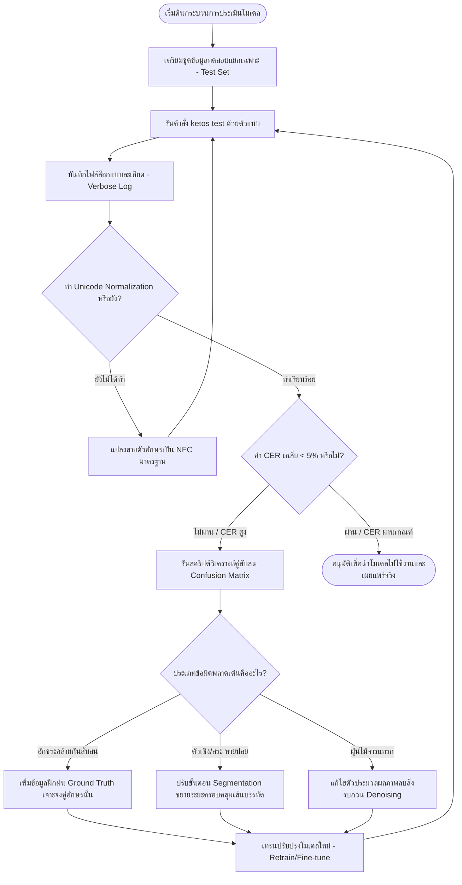

# บทที่ 7.1: การประเมินความแม่นยำของโมเดลด้วยค่า CER และ WER (Model Accuracy Evaluation using CER and WER)

> **ประเภทเอกสาร:** คู่มือปฏิบัติการและการอ้างอิงเชิงทฤษฎี  
> **ระดับเนื้อหา:** ขั้นสูง (Advanced)  
> **ภาษาหลัก:** ไทย (พร้อมคำศัพท์เทคนิคภาษาอังกฤษในวงเล็บ)  
> **ระบบเปิดเผยข้อมูล:** สำหรับทีมวิจัยและพัฒนา HTR เอกสารโบราณ (ไทย-ขอม)  

---

## 1. บทนำและความสำคัญของการประเมินผลตัวแบบ HTR
ในกระบวนการพัฒนาตัวแบบการรู้จำข้อความลายมือเขียนโบราณ (Handwritten Text Recognition: HTR) สำหรับเอกสารสมุดไทยและคัมภีร์ใบลาน **การประเมินผลเชิงปริมาณ (Quantitative Evaluation)** ถือเป็นขั้นตอนวิกฤตที่ใช้ชี้วัดความคืบหน้า ประสิทธิภาพ และความพร้อมของตัวแบบก่อนนำไปใช้งานจริง (Production) การประเมินผลด้วยสายตาหรือความรู้สึก (Subjective Evaluation) มีข้อจำกัดสูงเนื่องจากความเอนเอียงของผู้ตรวจวัด (Evaluator Bias) และไม่สามารถนำมาใช้เปรียบเทียบประสิทธิภาพระหว่างการทดลองในเชิงวิทยาศาสตร์ได้

การประเมินผลตัวแบบ HTR แบ่งออกเป็น 2 ส่วนหลักที่ทำงานประสานกัน:
1. **การประเมินส่วนแบ่งหน้าและเส้นฐาน (Layout & Baseline Evaluation):** เช่น การวัดค่าความสอดคล้องพิกเซลและเส้นฐานผ่านค่า F-measure (cBAD Evaluation)
2. **การประเมินส่วนรู้จำข้อความ (Text Recognition Evaluation):** วัดความแม่นยำในการแปลงภาพตัวอักษรเป็นข้อความดิจิทัล ซึ่งตัวชี้วัดที่เป็นมาตรฐานสากลคือ **Character Error Rate (CER)** และ **Word Error Rate (WER)** โดยคำนวณผ่านแนวคิด **Levenshtein Distance**

คัมภีร์ใบลานและสมุดไทยอักษรขอม/ไทยโบราณมีความท้าทายเฉพาะตัวสูงมาก เช่น การเขียนคำสะกดแบบโบราณที่ไม่มีมาตรฐานตายตัว การเขียนพยัญชนะซ้อนหรือ "ตัวเชิง" (Subscript/Subjoined characters) การใช้สระบน-ล่างหลายระดับ และการเขียนข้อความติดกันเป็นพืดโดยไม่มีการเว้นวรรคระหว่างคำ (Continuous Script) ส่งผลให้การเลือกตัวชี้วัดและการวิเคราะห์ข้อผิดพลาดต้องมีความละเอียดและระมัดระวังเป็นพิเศษ

---

## 2. ทฤษฎีและคำจำกัดความทางคณิตศาสตร์ของตัวชี้วัด

### 2.1 ระยะห่างแก้ไขต่ำสุด (Levenshtein Distance / Edit Distance)
รากฐานของการคำนวณ CER และ WER มาจาก **ระยะห่างเลเวนชเตน (Levenshtein Distance)** หรือระยะห่างแก้ไข (Edit Distance) ซึ่งระบุจำนวนครั้งขั้นต่ำสุดของการดำเนินงานระดับอักขระ (Character-level operations) ที่ต้องทำเพื่อแปลง **ข้อความที่ทำนายจากโมเดล (Hypothesis: $H$)** ให้ตรงกับ **ข้อความอ้างอิงที่ถูกต้อง (Ground Truth: $R$)** 

การดำเนินงาน (Operations) แบ่งออกเป็น 3 ประเภทหลัก:
1. **การแทนที่ (Substitutions: $S$):** การเปลี่ยนอักขระที่ทำนายผิดให้เป็นอักขระที่ถูกต้อง เช่น โมเดลทำนายเป็น `ต` แต่ Ground Truth คือ `ด` (ต้องเปลี่ยน `ต` $\rightarrow$ `ด`)
2. **การลบออก/การขาดหาย (Deletions: $D$):** การตัดอักขระที่โมเดลข้ามไป (ทำนายตกหล่น) เพื่อให้สอดคล้องกับ Ground Truth เช่น Ground Truth มีอักขระ `ฺ` (พินทุ) แต่โมเดลไม่อ่านค่าออกมา (ต้องลบพื้นที่ว่างแล้วใส่ `ฺ` กลับเข้าไป)
3. **การแทรก/การเกินมา (Insertions: $I$):** การลบอักขระที่โมเดลทำนายเกินเข้ามาโดยไม่มีอยู่ใน Ground Truth เช่น โมเดลพิมพ์สระ `ะ` แทรกเข้ามาในจุดที่ไม่มีตัวอักษรจริง

---

### 2.2 Character Error Rate (CER)
**CER** คืออัตราความผิดพลาดระดับอักขระ ซึ่งเป็นตัวชี้วัดหลัก (Primary Metric) ที่สำคัญที่สุดในการพัฒนา HTR ภาษาไทยและขอมโบราณ คำนวณโดยนำจำนวนการแทนที่ ($S$) การลบ ($D$) และการแทรก ($I$) มารวมกัน แล้วหารด้วยจำนวนอักขระทั้งหมดใน Ground Truth ($N$)

#### สูตรคำนวณ:
$$\text{CER} = \frac{S + D + I}{N} \times 100\%$$

โดยที่:
*   $S$ = จำนวนอักขระที่ถูกแทนที่ (Substitutions)
*   $D$ = จำนวนอักขระที่ขาดหายไป (Deletions)
*   $I$ = จำนวนอักขระที่เกินมา (Insertions)
*   $N$ = จำนวนอักขระทั้งหมดใน Ground Truth (Total Characters in Reference)

> [!IMPORTANT]
> สังเกตว่าค่า CER สามารถ **เกิน 100% ได้** ในกรณีที่ตัวแบบทำนายอักษรเกินมา (Insertions) เป็นจำนวนมหาศาลเมื่อเทียบกับความยาวของ Ground Truth จริง

#### ตัวอย่างการคำนวณที่ 1: ภาษาไทยทั่วไป
*   **Ground Truth ($R$):** `สวัสดี` (ประกอบด้วยอักขระ 5 ตัว: `ส`, `ว`, `ส`, `ด`, `ี` $\rightarrow N = 5$)
*   **Hypothesis ($H$):** `สวัสตี` (ประกอบด้วยอักขระ 5 ตัว: `ส`, `ว`, `ส`, `ต`, `ี`)
*   **วิเคราะห์คู่การจัดตำแหน่ง (Alignment Analysis):**
    ```
    Ground Truth: ส  ว  ส  ด  ี
    Hypothesis:   ส  ว  ส  ต  ี
    Operation:    =  =  =  S  =
    ```
    *   เกิดการแทนที่ (Substitution): `ด` ถูกแทนเป็น `ต` จำนวน 1 ครั้ง ($S = 1$)
    *   ไม่มีการลบหรือแทรก ($D = 0, I = 0$)
*   **คำนวณค่า CER:**
    $$\text{CER} = \frac{1 + 0 + 0}{5} \times 100\% = 20.00\%$$

#### ตัวอย่างการคำนวณที่ 2: อักษรขอมไทย/บาลี (ถอดเสียงสะกด)
*   **Ground Truth ($R$):** `พุทฺธสาสน` (ประกอบด้วยอักขระ 9 ตัว: `พ`, `ุ`, `ท`, `ฺ`, `ธ`, `ส`, `า`, `ส`, `น` $\rightarrow N = 9$)
*   **Hypothesis ($H$):** `พุทธสาสน` (ประกอบด้วยอักขระ 8 ตัว: `พ`, `ุ`, `ท`, `ธ`, `ส`, `า`, `ส`, `น`)
*   **วิเคราะห์คู่การจัดตำแหน่ง (Alignment Analysis):**
    ```
    Ground Truth: พ  ุ  ท  ฺ  ธ  ส  า  ส  น
    Hypothesis:   พ  ุ  ท  *  ธ  ส  า  ส  น
    Operation:    =  =  =  D  =  =  =  =  =
    ```
    *   เกิดการลบออก (Deletion): เครื่องหมายพินทุใต้ตัวสะกด `ฺ` ขาดหายไป 1 ครั้ง ($D = 1$)
    *   ไม่มีการแทนที่หรือแทรก ($S = 0, I = 0$)
*   **คำนวณค่า CER:**
    $$\text{CER} = \frac{0 + 1 + 0}{9} \times 100\% \approx 11.11\%$$

---

### 2.3 Word Error Rate (WER)
**WER** คืออัตราความผิดพลาดในระดับคำ โดยประยุกต์ใช้หลักการ Levenshtein Distance เช่นเดียวกับ CER แต่เปลี่ยนหน่วยวิเคราะห์จากอักขระทีละตัว (Character token) เป็นคำเดี่ยว (Word token)

#### สูตรคำนวณ:
$$\text{WER} = \frac{S_w + D_w + I_w}{N_w} \times 100\%$$

โดยที่:
*   $S_w$ = จำนวนคำที่ถูกแทนที่ (Word Substitutions)
*   $D_w$ = จำนวนคำที่ขาดหายไป (Word Deletions)
*   $I_w$ = จำนวนคำที่เกินมา (Word Insertions)
*   $N_w$ = จำนวนคำทั้งหมดใน Ground Truth (Total Words in Reference)

#### ตัวอย่างการคำนวณ:
*   **Ground Truth ($R$):** `นโม ตสฺส ภควโต` (แยกคำด้วยวรรค $\rightarrow N_w = 3$ คำ ได้แก่ "นโม", "ตสฺส", "ภควโต")
*   **Hypothesis ($H$):** `นะโม ตสฺส ภคโต` (แยกคำด้วยวรรค $\rightarrow$ "นะโม", "ตสฺส", "ภคโต")
*   **วิเคราะห์คู่การจัดตำแหน่ง (Alignment Analysis):**
    ```
    Ground Truth: นโม  ตสฺส  ภควโต
    Hypothesis:   นะโม  ตสฺส  ภคโต
    Operation:    S     =     S
    ```
    *   "นโม" ถูกแทนที่ด้วย "นะโม" ($S_w = 1$)
    *   "ภควโต" ถูกแทนที่ด้วย "ภคโต" ($S_w = 1$)
    *   รวมมีคำผิดพลาด 2 คำ ($S_w = 2$) จากคำทั้งหมด 3 คำ
*   **คำนวณค่า WER:**
    $$\text{WER} = \frac{2 + 0 + 0}{3} \times 100\% = 66.67\%$$

---

### 2.4 ปัญหาขอบเขตคำในเอกสารไทยและขอมโบราณ (Word Boundary Problem)
ในการทำวิจัย HTR ภาษาตะวันตก (เช่น ละติน หรือ อังกฤษ) การวัดค่า WER ทำได้ง่ายและสะท้อนความเป็นจริงได้ดีเนื่องจากตัวเขียนมีวรรคตอนแบ่งคำที่ชัดเจน (Explicit word boundary) แต่สำหรับภาษาไทย ขอม หรือล้านนา โครงสร้างหลักคือเขียนอักษรต่อเนื่องยาวเป็นสาย (Continuous text string) 

เมื่อต้องนำมาวัดค่า WER ระบบจึงจำเป็นต้องใช้ซอฟต์แวร์แยกคำ (Word Segmenter/Tokenizer) ในการจัดกลุ่มคำก่อนคำนวณ ซึ่งก่อให้เกิดปัญหาสำคัญดังนี้:
1.  **ความไม่เสถียรของเครื่องมือแยกคำ (Segmenter Instability):** หากตัวแบบ HTR ทำนายตัวสะกดผิดเพียงอักขระเดียว (เช่น `สวัสดี` ทำนายเป็น `สวัสตี`) อาจส่งผลให้อัลกอริทึมแยกคำวิเคราะห์ส่วนผสมคำข้างหลังผิดพลาดไปทั้งแถบ เกิดปรากฏการณ์ความผิดพลาดลุกลาม (Error Propagation) ส่งผลให้ค่า WER พุ่งสูงเกินจริง ทั้งที่พยัญชนะรอบข้างถูกต้องเกือบทั้งหมด
2.  **อักษรขอมบาลีไม่มีขอบเขตคำมาตรฐาน:** คัมภีร์ใบลานอักษรขอมบาลีมักจารึกคำสนธิและคำสมาสติดกันยาว การนิยามขอบเขตของ "คำ" (Word) จึงขึ้นอยู่กับดุลยพินิจของนักภาษาศาสตร์แต่ละท่าน ทำให้การเปรียบเทียบโมเดลทางสถิติไม่เป็นมาตรฐานเดียวกัน

> [!IMPORTANT]
> ด้วยเหตุดังกล่าว **โครงการพัฒนา HTR เอกสารโบราณไทยและขอม จึงกำหนดให้ยกเว้นการใช้ WER เป็นตัวชี้วัดหลัก** และให้ตกลงใช้ **CER ระดับอักขระเดี่ยวเป็นดัชนีมาตรฐานกลางในการประเมินประสิทธิภาพตัวแบบการรู้จำภาพข้อความ**

หากจำเป็นต้องประเมินประสิทธิภาพในเชิงการสืบค้นคำ (Search Engine / Keyword Spotting) ทางโครงการแนะนำให้ใช้วิธี **Bag of Words WER (bWER)** ซึ่งจะนำคำทั้งหมดในหน้าเอกสารของทั้ง Ground Truth และผลลัพธ์มาเปรียบเทียบในลักษณะของเซต (Set Comparison) โดยตัดปัจจัยเรื่องลำดับการอ่าน (Reading Order) และขอบเขตการวรรคตอนออกไป

---

## 3. ขั้นตอนการประเมินผลโมเดลด้วย Kraken CLI (`ketos test`)

Kraken มีโมดูลเครื่องมือสำเร็จรูปชื่อ `ketos` สำหรับรันงานประเมินผลประสิทธิภาพของโมเดลที่เทรนเสร็จแล้ว โดยเปรียบเทียบผลลัพธ์ของภาพที่ถอดความจากโมเดลกับไฟล์ XML ที่เป็น Ground Truth (ในรูปแบบ PageXML หรือ ALTO)

### 3.1 โครงสร้างคำสั่งและพารามิเตอร์ของ `ketos test`
ไวยากรณ์พื้นฐานในการใช้งานมีดังนี้:

```powershell
ketos test [OPTIONS] -m <model_path> <test_files_pattern>
```

#### พารามิเตอร์ที่สำคัญ:
*   `-m` หรือ `--model` *(สตริง)*: ระบุพาธของไฟล์โมเดลที่ต้องการทดสอบ (นามสกุล `.mlmodel`)
*   `-f` หรือ `--format` *(ตัวเลือก)*: รูปแบบไฟล์จัดหน้าของชุดข้อมูลทดสอบ ได้แก่ `page` (PageXML), `alto` (ALTO XML) หรือ `txt` (ข้อความดิบ) แนะนำให้ใช้ `page` สำหรับคัมภีร์ใบลาน/สมุดไทย
*   `-v` หรือ `--verbose`: สั่งให้แสดงรายละเอียดการเปรียบเทียบ (Alignment) ของทุกบรรทัด พร้อมระบุความผิดพลาด (Insertions, Deletions, Substitutions) ออกมาบนหน้าจอคอนโซล
*   `-p` หรือ `--pad` *(ตัวเลข)*: กำหนดการขยายขอบเขตภาพเส้นบรรทัดเพิ่มเติม (Padding) เพื่อป้องกันสระแถวบนและตัวเชิงแถวล่างขาดหายจากการแบ่งพื้นที่เส้นบรรทัด (แนะนำค่าเริ่มต้น `10` ถึง `20` พิกเซล)
*   `--reorder` / `--no-reorder`: เปิดหรือปิดการจัดเรียงลำดับการอ่านข้อความแบบลอจิคัล (Logical Reading Order)

---

### 3.2 ตัวอย่างคำสั่งรันการทดสอบจริง (Step-by-step Execution)

#### ขั้นตอนที่ 1: ตรวจสอบความพร้อมของข้อมูล
ตรวจสอบให้มั่นใจว่าไฟล์ข้อมูลรูปภาพ (`.jpg`, `.png`) และไฟล์ XML ผลเฉลย (`.xml`) ของชุดทดสอบ (Test Set) ถูกแยกโฟลเดอร์ออกจากชุดฝึกเทรน (Training Set) ชัดเจน เพื่อป้องกันปัญหาข้อมูลรั่วไหล (Data Leakage) เช่น เก็บไว้ที่ `D:\01_APP\HTR_Research\data\test_set\`

#### ขั้นตอนที่ 2: รันการวัดผลแบบมาตรฐาน
เปิด Terminal หรือ PowerShell แล้วรันคำสั่งเปรียบเทียบเพื่อหาค่า CER เฉลี่ยของทั้งชุดทดสอบ:

```powershell
# รันการทดสอบโมเดล Khom Balian เวอร์ชัน 2.0 กับโฟลเดอร์ชุดทดสอบ
ketos test `
    -f page `
    -m D:\01_APP\HTR_Research\models\khom_balian_v2.mlmodel `
    D:\01_APP\HTR_Research\data\test_set\*.xml
```

*คำอธิบายคำสั่ง: ค้นหาไฟล์ XML ในรูป PageXML ทั้งหมดในโฟลเดอร์ test_set และส่งผ่านภาพบรรทัดเข้าไปที่โมเดลเพื่อคำนวณหาความถูกต้องเทียบกับข้อความที่ระบุอยู่ในไฟล์ XML*

#### ผลลัพธ์ที่ปรากฏบนหน้าจอ (Standard Output):
```text
=== Test Results ===
Characters:    14,352
Errors:          468
CER:            3.26%
Accuracy:      96.74%
```
*คำอธิบายผลลัพธ์: ชุดทดสอบมีอักขระในเฉลยทั้งหมด 14,352 ตัวอักษร โมเดลทำงานผิดพลาด (แทนที่+ลบ+แทรก) รวมกัน 468 ตัวอักษร คิดเป็นอัตราความผิดพลาด (CER) 3.26% (ความแม่นยำทางอักขระ 96.74%)*

#### ขั้นตอนที่ 3: รันการวัดผลอย่างละเอียด (Verbose Mode) และบันทึกลงไฟล์ล็อก
เพื่อทำการวิเคราะห์หาสาเหตุของคำสะกดที่ผิดพลาด รายบรรทัด ให้เพิ่มพารามิเตอร์ `-v` และส่งออกผลลัพธ์ไปยังไฟล์ข้อความ `.txt`:

```powershell
ketos test `
    -f page `
    -m D:\01_APP\HTR_Research\models\khom_balian_v2.mlmodel `
    -v `
    D:\01_APP\HTR_Research\data\test_set\*.xml > D:\01_APP\HTR_Research\logs\evaluation_v2_verbose.txt
```

---

## 4. การวิเคราะห์บันทึกข้อผิดพลาด (Error Log Analysis)

การทำความเข้าใจข้อมูลในไฟล์ล็อกที่ได้จากโหมด `--verbose` จะช่วยให้ทีมปรับปรุงข้อมูลและจูนสถาปัตยกรรมของโมเดลได้ตรงจุด 

### 4.1 รูปแบบล็อกความละเอียดของ Kraken
ภายในไฟล์ล็อก `evaluation_v2_verbose.txt` จะแสดงรายละเอียดการทดสอบทีละบรรทัด ในรูปแบบดังต่อไปนี้:

```text
D:\01_APP\HTR_Research\data\test_set\KB_Page_004.xml
--------------------------------------------------
[GT]  นโม ตสฺส ภควโต อรหโต สมฺมาสมฺพุทฺธสฺส
[OUT] นะโม ตสฺส ภคโต อรหโต สมฺมาสมฺพุทฺธสฺ
[ERR] S: น -> นะ | D: ว | D: ส

[GT]  อากาสฏฺฐา จ ภุมฺมฏฺฐา เทวา นาคา มหิทฺธิกา
[OUT] อากาสฏฺฐา จ ภุมฺมฏฺฐา เทวา นาคา มหิทฺธิกา
[ERR] (Correct)
```

*   `[GT]` (Ground Truth) หมายถึง สตริงข้อความที่มนุษย์ถอดความและจัดเตรียมไว้เป็นเฉลยที่ถูกต้อง
*   `[OUT]` (Output) หมายถึง สตริงข้อความที่ตัวแบบทำนายออกมาจากแถบภาพนั้นๆ
*   `[ERR]` (Errors) หมายถึง ตัวระบุรูปแบบของการแก้ไข (Edit operations) ที่จำแนกเป็นตัวอักขระและประเภทการกระทำ

---

### 4.2 การจำแนกประเภทข้อผิดพลาดหลักในอักษรขอมและไทย

จากการประเมินตัวแบบร่วมกับคัมภีร์ใบลาน สามารถจัดกลุ่มความผิดพลาดออกเป็น 4 รูปแบบหลัก พร้อมสาเหตุและแนวทางแก้ไขดังนี้:

| ประเภทข้อผิดพลาด | ตัวอย่างความผิดพลาดที่ตรวจพบ | สาเหตุทางกายภาพ/อัลกอริทึม | วิธีการแก้ไขเชิงระบบ |
|---|---|---|---|
| **การแทนที่อักขระรูปร่างคล้ายกัน** *(Substitution)* | *   `ก` $\rightarrow$ `ถ` หรือ `ภ`<br>*   `บ` $\rightarrow$ `ป`<br>*   `ต` $\rightarrow$ `ตฺ` (ตัวเชิง)<br>*   `ย` $\rightarrow$ `ส` (ในอักษรขอมโบราณ) | *   ภาพตัวอักษรจารมีน้ำหนักเส้นทึบ/บางไม่สม่ำเสมอ<br>*   สถาปัตยกรรมโมเดลไม่คุ้นเคยกับอักขระเฉพาะถิ่นที่มีหัวและหยักคล้ายกัน | *   เพิ่มตัวอย่างพยัญชนะคู่สับสนเหล่านี้ในชุดข้อมูลฝึกเทรน<br>*   เพิ่มปริมาณ Data Augmentation ประเภทการเบลอหรือยืดภาพ |
| **การขาดหายของอักขระระดับบน-ล่าง** *(Deletion)* | *   `พุทฺธ` $\rightarrow$ `พุทธ` (เครื่องหมายพินทุหาย)<br>*   `สมฺมา` $\rightarrow$ `สมา` (ตัวเชิง ม หาย)<br>*   สระอุ (`ุ`), สระอู (`ู`) ขาดหาย | *   เส้นฐาน (Baseline) ถูกตรวจจับชิดตัวอักษรเกินไป ทำให้ตัดภาพสระและตัวเชิงส่วนล่างทิ้ง<br>*   ตัวเชิงในใบลานจารบางมากจนโมเดลตีความว่าเป็นสิ่งเจือปน (Noise) | *   ปรับความกว้างพิกเซลเส้นบรรทัดในการทำ Segmentation<br>*   เพิ่มการจูนโมเดลด้วย `ketos train` โดยป้อน Ground Truth ที่มีสัดส่วนตัวเชิงสูง |
| **การแทรกอักษรส่วนเกินจากมลทิน** *(Insertion)* | *   `นโม` $\rightarrow$ `นะโม` (แทรกสระ `ะ`)<br>*   มีจุดพินทุ `ฺ` ปรากฏขึ้นมาระหว่างคำที่ไม่มีสะกด | *   ใบลานมีคราบฝุ่น รอยไม้ประดู่ขึ้นลาย รอยเจาะของแมลง หรือรอยขูดขีดบนสมุดข่อย<br>*   ระบบประมวลผลก่อนภาพ (Pre-processing) แปลงภาพไบนารีแรงเกินไป | *   ทบทวนและพัฒนาขั้นตอนการลดสัญญาณรบกวน (Denoising)<br>*   เปลี่ยนมาใช้โมเดลสีเทา (Grayscale/Normalized images) แทนการแปลงขาวดำแบบสุดโต่ง (Binarization) |
| **ข้อผิดพลาดจากบรรทัดการอ่าน** *(Segmentation Faults)* | *   ข้อความท้ายบรรทัดหายไป 3-4 คำ<br>*   ตัวหนังสือสลับบรรทัดซ้ายขวา | *   การลากเส้นฐานขาดช่วงหรือเฉออกนอกกรอบบรรทัด<br>*   ไม่ได้ระบุลำดับทิศทางการอ่านในไฟล์จัดหน้าอย่างถูกต้อง | *   เทรนตัวแบบแบ่งเส้นบรรทัด (Kraken Segmenter Model) ใหม่ด้วยการจูนพารามิเตอร์เส้นแนวเอียง (Skewed lines)<br>*   จัดทำลำดับการจดจำบรรทัดใน eScriptorium ให้ถูกต้อง |

---

## 5. การสร้างและวิเคราะห์เมทริกซ์ความสับสน (Confusion Matrix)

การสร้าง **เมทริกซ์ความสับสน (Confusion Matrix)** ในระดับอักขระ เป็นเครื่องมือที่มีประสิทธิภาพสูงที่สุดในการชี้วัดว่าโมเดลมีจุดอ่อนตรงอักขระตัวใด และมักสะกดสับสนสลับคู่กันอย่างไร

### 5.1 สคริปต์ Python สำหรับสกัดข้อผิดพลาดและวิเคราะห์ความสับสน
ทีมงานสามารถใช้งานสคริปต์ Python ด้านล่างนี้เพื่อเปิดอ่านไฟล์ล็อกการทดสอบของ Kraken ในโหมด verbose และแสดงผลคู่อักษรที่โมเดลตอบผิดบ่อยที่สุด 10 อันดับแรก โดยรันการทำงานผ่าน Standard Library โดยไม่ต้องลงไลบรารีภายนอกเพิ่มเติม:

```python
import re
import sys
from collections import Counter

def parse_kraken_log(log_path):
    """
    ฟังก์ชันสำหรับเปิดอ่านไฟล์ล็อกการทดสอบของ Kraken ในโหมด verbose
    เพื่อสกัดคู่คำ/อักขระที่โมเดลจำแนกผิดพลาด
    """
    substitutions = []
    deletions = []
    insertions = []
    
    current_gt = None
    current_out = None
    
    print(f"กำลังวิเคราะห์ไฟล์ล็อก: {log_path}")
    
    with open(log_path, 'r', encoding='utf-8') as f:
        for line in f:
            line = line.strip()
            if line.startswith('[GT]'):
                current_gt = line[4:].strip()
            elif line.startswith('[OUT]'):
                current_out = line[5:].strip()
            elif line.startswith('[ERR]') and current_gt and current_out:
                err_content = line[5:].strip()
                # วิเคราะห์รายการข้อผิดพลาดในบรรทัดนั้นๆ
                # ตัวอย่าง: S: น -> นะ | D: ว
                parts = err_content.split('|')
                for part in parts:
                    part = part.strip()
                    if part.startswith('S:'):
                        # รูปแบบ Substitution เช่น S: น -> นะ หรือ S: ก -> ถ
                        match = re.search(r'S:\s*(.+)\s*->\s*(.+)', part)
                        if match:
                            ref_char = match.group(1).strip()
                            hyp_char = match.group(2).strip()
                            substitutions.append((ref_char, hyp_char))
                    elif part.startswith('D:'):
                        # รูปแบบ Deletion เช่น D: ฺ
                        del_char = part[2:].strip()
                        deletions.append(del_char)
                    elif part.startswith('I:'):
                        # รูปแบบ Insertion เช่น I: ะ
                        ins_char = part[2:].strip()
                        insertions.append(ins_char)
                
                # ล้างตัวแปรบรรทัด
                current_gt = None
                current_out = None
                
    # รายงานสถิติภาพรวม
    print("\n" + "="*50)
    print(" รายงานวิเคราะห์ข้อผิดพลาดระดับอักขระ (Error Report)")
    print("="*50)
    
    print(f"จำนวนข้อผิดพลาดแบบแทนที่ (Substitutions) ทั้งหมด: {len(substitutions)} ครั้ง")
    print(f"จำนวนข้อผิดพลาดแบบตกหล่น (Deletions) ทั้งหมด: {len(deletions)} ครั้ง")
    print(f"จำนวนข้อผิดพลาดแบบเกินมา (Insertions) ทั้งหมด: {len(insertions)} ครั้ง")
    
    print("\n--- คู่อักขระสับสนที่พบบ่อยที่สุด 10 อันดับแรก (Top 10 Substitutions) ---")
    sub_counter = Counter(substitutions)
    for (ref, hyp), count in sub_counter.most_common(10):
        print(f"  อ้างอิงจริง: '{ref}'  == ถูกแทนด้วย ==>  ทำนายผิด: '{hyp}'  |  พบ {count} ครั้ง")
        
    print("\n--- อักขระที่ตกหล่นบ่อยที่สุด 5 อันดับแรก (Top 5 Deletions) ---")
    del_counter = Counter(deletions)
    for char, count in del_counter.most_common(5):
        print(f"  อักขระ: '{char}' ตกหล่นหายไป  |  พบ {count} ครั้ง")
        
    print("\n--- อักขระที่เกินมาบ่อยที่สุด 5 อันดับแรก (Top 5 Insertions) ---")
    ins_counter = Counter(insertions)
    for char, count in ins_counter.most_common(5):
        print(f"  อักขระ: '{char}' เกินเข้ามา  |  พบ {count} ครั้ง")

if __name__ == "__main__":
    # สามารถกำหนดพาธไฟล์ล็อกได้จากตรงนี้
    default_log = r"D:\01_APP\HTR_Research\logs\evaluation_v2_verbose.txt"
    try:
        parse_kraken_log(default_log)
    except FileNotFoundError:
        print(f"ไม่พบไฟล์ล็อกที่ {default_log} กรุณาตรวจสอบรันคำสั่งเซฟล็อกล่วงหน้า")
```

---

## 5.2 การแปลผลและการนำไปใช้แก้ปัญหา (Actionable Interpretation)
เมื่อเรียกใช้สคริปต์วิเคราะห์และได้รายงานออกมา ทีมพัฒนานักจารและนักคอมพิวเตอร์ต้องร่วมมือกันวิเคราะห์เพื่อแก้ปัญหาตามกรณีศึกษาตัวอย่างด้านล่างนี้:

*   **กรณีศึกษาที่ 1: พบข้อผิดพลาด `จริง: 'ตฺ' -> ผิด: 'ต' สูงมาก (เช่น พบ 45 ครั้ง)`**
    *   *การแปลความหมาย:* โมเดลสูญเสียรายละเอียดพิกเซลขนาดเล็กของอักขระจุดพินทุใต้พยัญชนะ อาจเกิดจากความละเอียดภาพบรรทัด (Image resolution) ต่ำเกินไป หรือภาพจุดพินทุเลือนลาง
    *   *แนวทางแก้ไข:* เพิ่มจำนวนภาพเขียนที่มีตัวเชิงและเครื่องหมายพินทุในขั้นตอน Training หรือแก้ไขซอร์สไฟล์รูปภาพให้ไม่มีการแปลงภาพที่ทอนรายละเอียดจุดขนาดเล็ก (เช่น รักษารายละเอียดระดับสีเทา - Grayscale)
*   **กรณีศึกษาที่ 2: พบข้อผิดพลาด `จริง: 'ย' -> ผิด: 'ส' บ่อยครั้ง (ในเอกสารใบลานอักษรขอม)`**
    *   *การแปลความหมาย:* สัญวิทยา (Orthography) ของอักษรขอมโบราณบางแบบ ตัว `ย` และ `ส` มีลักษณเส้นหยักคอดคล้ายกันมาก โมเดลขาดบริบทความหมายทางภาษาที่จะแยกสองตัวนี้ออกจากกัน
    *   *แนวทางแก้ไข:* เพิ่มสัดส่วนคำศัพท์ทางพุทธศาสนาที่เป็นบริบทของพระไตรปิฎกที่มีคำกลุ่มนี้เพื่อช่วยเรื่องการคาดคะเนลำดับถัดไปของอักขระ หรือรันฟังก์ชันปรับแต่งโมเดลเสริม (Language Modeling/N-grams)

---

## 6. แนวปฏิบัติที่เป็นเลิศในการเพิ่มความแม่นยำ (Best Practices)

### 6.1 กฎเหล็กว่าด้วยการทำ Unicode Normalization (NFC / NFKC)
อุปสรรคสำคัญที่ทำให้นักวิจัย HTR ภาษาไทยและภาษาใกล้เคียงพบค่า CER สูงอย่างไม่สมเหตุสมผล ทั้งที่สายตาคนมองว่าโมเดลทำนายได้ถูกต้อง เกิดจาก **ความขัดแย้งของโครงสร้างการเข้ารหัสยูนิโค้ด (Unicode Coding Inconsistencies)** 

ตัวอย่างเด่นชัดที่สุดในระบบอักษรไทยคือสระอำ (`ำ`) ซึ่งสามารถเขียนบันทึกรหัสได้ 2 วิธีการ:
1.  **รหัสตรงเดี่ยว (NFC):** ใช้ตัวสระอำโดยตรง คือ `U+0E33` (`ำ`)
2.  **รหัสประกอบคู่ (Decomposed):** ใช้เครื่องหมายนิคหิต `U+0E4D` (`ํ`) รวมกับสระอา `U+0E35` (`า`) เพื่อประกอบกันเป็นรูปภาพ `ำ`

หากชุดข้อมูล Ground Truth ที่ผู้เชี่ยวชาญพิมพ์ป้อนเข้าระบบบันทึกไว้ในรูปแบบรหัสประกอบคู่ แต่โมเดลทำนายและส่งข้อความออกมาในรูปแบบรหัสตรงเดี่ยว ฟังก์ชันคำนวณ Levenshtein Distance ของ Kraken จะประมวลผลว่าบรรทัดดังกล่าวมีข้อผิดพลาด (เกิดการแทนที่สระอา และมีการแทรกนิคหิต) ทันที ส่งผลให้ค่า CER สูงขึ้นจากความจริงโดยไม่มีความหมายเชิงอรรถศาสตร์

#### วิธีป้องกัน:
ทีมงาน **ต้องทำการแปลงรูปแบบข้อมูลตัวอักษรทั้งหมดให้เป็นมาตรฐานเดียวกันก่อนการประเมิน (Unicode Normalization Form C - NFC)** เสมอ โดยการเพิ่มสคริปต์ตรวจความสอดคล้องหรือแปลงข้อความใน Ground Truth และเอาต์พุตของตัวแบบก่อนทำการคำนวณเปรียบเทียบ

```python
import re
import unicodedata

def normalize_thai_khom_script(text):
    """
    จัดเรียงสระและวรรณยุกต์ซ้อน (Diacritic Stacking) ให้เป็นลำดับที่ถูกต้อง 
    และแปลงรูปแบบข้อความตามมาตรฐาน NFC (Unicode Normalization Form C)
    """
    if not text:
        return ""
    text = unicodedata.normalize('NFC', text)
    
    # รหัสสระบนและวรรณยุกต์ไทย/ขอมตามลำดับมาตรฐาน Unicode
    thai_upper_vowels = r'[\u0E31\u0E34-\u0E37\u0E47]'
    thai_tones = r'[\u0E48-\u0E4B]'
    
    # สลับตำแหน่งวรรณยุกต์ที่ป้อนก่อนสระบน ให้เป็นสระบนมาก่อนวรรณยุกต์
    text = re.sub(f'({thai_tones})({thai_upper_vowels})', r'\2\1', text)
    
    text = re.sub(r'\s+', ' ', text).strip()
    return text
```

---

### 6.2 การเก็บบันทึกประวัติการทดลองประเมินผล (Experiment Logging Template)
การทำงานพัฒนาต้องทำซ้ำและเป็นระบบ เพื่อให้สามารถพิสูจน์ได้ว่าการพัฒนาในเวอร์ชันหลังมีความก้าวหน้าอย่างชัดเจนเชิงสถิติ (Statistical Significance) ทีมวิจัยต้องเก็บบันทึกประวัติเวอร์ชันและการตั้งค่าการประเมินลงในบันทึกโครงการ (Project Journal) ทุกครั้ง

#### ตารางมาตรฐานการเก็บบันทึกผลลัพธ์ (HTR Evaluation Log):

| เวอร์ชันโมเดล | วันที่ประเมิน | จำนวน GT (หน้า) | จำนวนอักขระทดสอบ (N) | ตัวแบบตั้งต้น (Base Model) | ค่า CER (%) | เทคนิคปรับปรุงที่ใช้เพิ่มเติม |
| :---: | :---: | :---: | :---: | :---: | :---: | :--- |
| **v1.0** | 2026-06-10 | 50 หน้า | 12,504 ตัว | ไม่มี (เทรนจากศูนย์) | **18.42%** | ถือเป็นผลลัพธ์ฐานแรกเพื่อวิจัยความเป็นไปได้ (Baseline Run) |
| **v1.5** | 2026-06-18 | 50 หน้า | 12,504 ตัว | v1.0 | **11.20%** | ทำ Data Augmentation (เติม Noise และเบลอภาพ 30%) |
| **v2.0** | 2026-07-02 | 100 หน้า | 24,110 ตัว | Lanna_Base_Model | **6.15%** | ทำ Transfer Learning จากต้นแบบล้านนา และเพิ่มข้อมูลอีก 50 หน้า |
| **v2.5** | 2026-07-20 | 150 หน้า | 36,450 ตัว | v2.0 | **3.85%** | ปรับปรุงโมเดลสกัดเส้นบรรทัด ป้องกันขอบภาพและสระล่างหลุด |
| **v3.0** | 2026-08-10 | 250 หน้า | 61,200 ตัว | v2.5 | **1.94%** | โมเดลเข้าสู่ระดับดีเยี่ยม นำไปประยุกต์ใช้งานเชิงพาณิชย์ได้ |

---

### 6.3 แผนผังขั้นตอนการประเมินและการปรับปรุงความแม่นยำของโมเดล (HTR Evaluation & Optimization Loop)



---

## 7. การประเมินผลลำดับการอ่านข้อความ (Reading Order Evaluation Metrics)

ในกรณีที่หน้าเอกสารโบราณมีโครงสร้างซับซ้อน เช่น สมุดไทยที่มีการแบ่งเป็นหลายย่อหน้า หรือการเขียนข้อความแทรกริมขอบ การจัดเรียงลำดับการอ่าน (Reading Order) ที่ถูกต้องมีความสำคัญอย่างยิ่ง ตัวชี้วัดที่ใช้ประเมินความแม่นยำในการจัดเรียงลำดับการอ่านของระบบตรวจจับโครงสร้างมีดังนี้:

### 7.1 bWER (Bag-of-Words Word Error Rate)
bWER คือการนำอักขระหรือคำทั้งหมดในหน้าเอกสารของทั้ง Ground Truth และผลลัพธ์การทำนายของโมเดลมาเปรียบเทียบกันในรูปแบบของเซตข้อมูล (Set Comparison) โดยตัดปัจจัยเรื่องลำดับการจัดเรียงบรรทัดและการวรรคตอนออกไปทั้งหมด
*   **เป้าหมาย:** ชี้วัดประสิทธิภาพการแปลงข้อความเฉพาะส่วน (Text recognition quality) โดยไม่นำความผิดพลาดของการเรียงลำดับบรรทัดมาคิดคำนวณร่วมด้วย ช่วยแยกแยะได้ว่าโมเดลอ่านอักษรผิดหรือระบบจัดลำดับบรรทัดสับสน

### 7.2 NSFD (Normalized Sequence Flow Distance)
NSFD คือตัวชี้วัดระยะห่างความสอดคล้องของกระแสการอ่านข้อความ โดยเปรียบเทียบ "คู่ลำดับการเชื่อมโยงบรรทัด" (Sequence Flows) ระหว่างกล่องข้อความที่ AI วิเคราะห์เปรียบเทียบกับเอกสารเฉลยจริง
*   **สูตรการประเมิน:** ค่า NSFD จะอยู่ระหว่าง `0` (ลำดับสับสนอย่างสิ้นเชิง) ถึง `1` (ลำดับการอ่านถูกต้องสมบูรณ์แบบตรงตามเฉลย 100%) ช่วยประเมินคุณภาพของโมเดลจัดกลุ่มพื้นที่ข้อความ (Layout parser) ในการลำดับเนื้อความให้ผู้อ่านเข้าใจได้ถูกต้องตามต้นฉบับ

---

## 8. การทดสอบความสอดคล้องและมีนัยสำคัญทางสถิติ (Statistical Significance Testing)

เมื่อเราทำการเปรียบเทียบโมเดล HTR สองเวอร์ชัน (เช่น โมเดลเดิม v1.0 และโมเดลปรับปรุง v1.5) แล้วพบว่าค่า CER ลดลง (เช่น ลดลงจาก 3.26% เป็น 2.94%) เราจำเป็นต้องทดสอบว่าการลดลงนี้เป็นผลมาจากความสามารถของโมเดลที่แท้จริง หรือเกิดขึ้นจากความบังเอิญของชุดข้อมูลทดสอบตัวอย่าง (Sample Variance)

ทางโครงการกำหนดให้ใช้วิธีทดสอบทางสถิติ 2 รูปแบบที่เป็นมาตรฐานสากล:

### 8.1 Paired Bootstrap Resampling
วิธีนี้ใช้หลักการสุ่มซ้ำซ้อน (Resampling) จากชุดข้อมูลทดสอบเดิมจำนวนหลายพันครั้ง (เช่น $B = 1,000$ หรือ $10,000$ รอบ) เพื่อสร้างการกระจายตัวของค่า CER และคำนวณช่วงความเชื่อมั่น (Confidence Interval: CI) ของแต่ละโมเดล
*   **ขั้นตอนการปฏิบัติ:**
    1. สุ่มตัวอย่างหน้าเอกสารจาก Test Set ขึ้นมาทีละหน้าแบบใส่คืน (Sampling with replacement) จนได้ขนาดชุดข้อมูลเท่าเดิม
    2. คำนวณค่า CER ของโมเดล A และโมเดล B บนชุดข้อมูลสุ่มนั้น
    3. ทำซ้ำขั้นตอนที่ 1-2 เป็นจำนวน $B$ รอบ
    4. คำนวณหาช่วงความเชื่อมั่นที่ระดับ 95% ของความแตกต่างค่า CER ($\text{CER}_B - \text{CER}_A$)
*   **การตีความ:** หากช่วงความเชื่อมั่นที่ระดับ 95% ของส่วนต่างประสิทธิภาพ **ไม่ครอบคลุมค่า 0** แสดงว่าโมเดลทั้งสองมีประสิทธิภาพการทำงานที่แตกต่างกันอย่างมีนัยสำคัญทางสถิติอย่างแท้จริง

### 8.2 McNemar's Test
การทดสอบ McNemar's Test เป็นการทดสอบสถิติแบบนอนพารามิเตอร์ (Non-parametric test) ที่เหมาะสมสำหรับการวิเคราะห์ข้อมูลจำแนกประเภทแบบจับคู่ (Paired nominal data) เช่น การตอบถูกหรือผิดระดับตัวอักษรของโมเดลสองตัวบนข้อมูลตัวเดียวกัน

เราจะจัดทำ **ตารางไขว้แบบ 2x2 (2x2 Contingency Table)** ของผลการทำนายระดับอักขระดังนี้:

| | โมเดล B ทำนายถูกต้อง | โมเดล B ทำนายผิดพลาด |
|---|:---:|:---:|
| **โมเดล A ทำนายถูกต้อง** | $a$ (ถูกทั้งคู่) | $b$ (A ถูก, B ผิด) |
| **โมเดล A ทำนายผิดพลาด** | $c$ (A ผิด, B ถูก) | $d$ (ผิดทั้งคู่) |

*   **สูตรคำนวณค่าสถิติ Chi-squared ($\chi^2$):**
    $$\chi^2 = \frac{(|b - c| - 1)^2}{b + c}$$
    *(มีการหักค่า 1 ออกเพื่อปรับปรุงความต่อเนื่องตามหลัก Edwards' correction)*

*   **การแปลผล:**
    - นำค่า $\chi^2$ ที่คำนวณได้ไปเปิดตารางการกระจายตัวแบบ Chi-squared ที่องศาอิสระ (Degrees of Freedom: $df = 1$)
    - หากค่า $\chi^2$ ที่คำนวณได้ **มากกว่า 3.84** (หรือเทียบเท่าระดับนัยสำคัญ $p < 0.05$) จะสามารถปฏิเสธสมมติฐานหลัก ($H_0$) และสรุปได้ว่าประสิทธิภาพในการทำนายข้อความของโมเดลทั้งสองมีความแตกต่างกันอย่างมีนัยสำคัญทางสถิติ

---

## ➡️ ลิงก์เชื่อมโยงเนื้อหาภายในคู่มือปฏิบัติการ
*   **ขั้นตอนก่อนหน้า:** [การติดตั้ง Kraken แบบ Local และผ่าน CLI](../06_Kraken_Training/6.1_การติดตั้งKrakenแบบLocalและผ่านCLI.md)  
*   **ขั้นตอนถัดไป:** [กรณีศึกษาการทำ HTR เอกสารโบราณในภูมิภาคเอเชียและยุโรป](../08_Case_Studies_and_Datasets/8.1_กรณีศึกษาการทำHTRเอกสารโบราณในภูมิภาคเอเชียและยุโรป.md)
