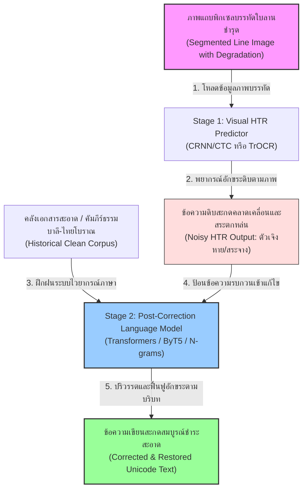

# บทที่ 7.2: การเพิ่มความแม่นยำด้วยโมเดลภาษาและการทำ Post-Correction ในคัมภีร์ใบลานและเอกสารโบราณไทย

ในการพัฒนาระบบการรู้จำข้อความลายมือเขียน (Handwritten Text Recognition หรือ HTR) สำหรับเอกสารโบราณของไทย เช่น คัมภีร์ใบลานอักษรธรรมล้านนา อักษรขอมไทย หรือสมุดไทย (สมุดข่อย) อักษรไทยโบราณ ปัญหาที่พบบ่อยที่สุดและเป็นอุปสรรคสำคัญในการรักษาระดับความถูกต้องคือ **ความกะเทาะเสียหายทางกายภาพของเอกสาร** คราบนัยน์ตาไม้ รอยหักบิ่น ขอบใบลานแตกเป็นแนวเส้นตรง เส้นหมึกจางจืดจากการขูดเขียน หรือรอยราดำและแมลงเจาะ 

ปัจจัยทางกายภาพเหล่านี้ส่งผลให้แบบจำลองคอมพิวเตอร์วิทัศน์ขั้นต้น (Vision-only HTR) เกิดความคลาดเคลื่อนในการพยากรณ์อักขระเดี่ยวอย่างรุนแรง โดยเฉพาะอย่างยิ่ง **ข้อผิดพลาดแบบลบเลือน (Deletion Errors)** ซึ่งสระบน-ล่าง วรรณยุกต์ และ **"พยัญชนะเชิง" หรือ "ตัวเจิง" (Subscript / Subjoined Letters)** มักจะจืดจางหรือเลือนหายไปจากภาพถ่าย นอกจากนี้ยังมี **ข้อผิดพลาดแบบแทนที่ (Substitution Errors)** จากอักษรที่มีความคล้ายคลึงกันในเชิงทัศนศาสตร์ประสาท เช่น "ด" กับ "ค" หรือ "ข" กับ "ช" ในอักษรไทยเก่า หรือรูปร่างเชิงอักษรขอมที่มีความซับซ้อนทับซ้อนกัน

บทนี้เป็นแนวทางเชิงปฏิบัติและทฤษฎีระดับลึกในการบูรณาการ **โมเดลภาษา (Language Models - LMs)** และกระบวนการ **ปรับปรุงแก้ไขข้อความหลังการรู้จำ (Post-Correction / Post-OCR Correction)** เพื่อทำหน้าที่กู้คืนระบบอักขรวิธี แก้ไขคำสะกดผิดเชิงบริบท และฟื้นฟูส่วนที่ขาดหายไป โดยอ้างอิงจากบทเรียนความสำเร็จและรายงานวิจัยระดับสากลในภูมิภาคเอเชียตะวันออกเฉียงใต้ ได้แก่ **โครงการบูรณาการโมเดลภาษาเพื่อแก้ไขลายมือใบลานเขมรโบราณ (Report 025)** และ **โครงการบูรณะคำศิลาจารึกอักษรกวิโบราณด้วยโมเดลระดับไบต์ (Report 040)**

---

## 1. แนวคิดสถาปัตยกรรมสองขั้นตอน (Two-stage HTR & Seq2Seq LM Pipeline)

เพื่อแก้ไขข้อจำกัดของโมเดลวิชันล้วน (Vision-only Models) ระบบวิศวกรรมข้อมูลสมัยใหม่จะแบ่งกระบวนการทำงานออกเป็น **สองขั้นตอน (Two-stage Pipeline)** ดังนี้:

1. **ขั้นตอนที่ 1: การถอดข้อความดิบด้วยวิชัน (Stage 1 - Visual HTR Inference):**  
   ภาพแถบพิกเซลของบรรทัดใบลานจะถูกตัดแบ่งและป้อนเข้าสู่โมเดลรู้จำ เช่น CRNN (CNN + BiGRU + CTC) หรือ TrOCR (Vision Transformer Encoder + Decoder) เพื่อถอดความออกมาเป็นข้อความเริ่มต้นที่มีสัญญาณรบกวนสูง (Noisy Raw Text) ซึ่งอักษรบางตัวอาจแหว่งหาย สะกดผิด หรือสลับตัวอักษรกัน
   
2. **ขั้นตอนที่ 2: การตรวจสอบและแก้ไขคำสะกดด้วยโมเดลภาษา (Stage 2 - Language Model Post-Correction):**  
   นำข้อความดิบที่มีสัญญาณรบกวนปะปนสูงมาแปลงเป็นเทนเซอร์ จากนั้นใช้โมเดลภาษาธรรมชาติเชิงลึก (Deep NLP Language Model) ที่ได้รับการฝึกฝนกับคลังเอกสารประวัติศาสตร์ที่สะอาด (Clean Ground Truth Corpus) เพื่อประเมินบริบทโดยรอบ (Semantic Context) และคำนวณหาลำดับคำที่ถูกต้องที่สุดตามหลักไวยากรณ์อักษรศาสตร์โบราณ จากนั้นระบบจะสร้างข้อความที่ได้รับการชำระสะอาดสะกดถูกต้อง (Corrected Unicode Text) เป็นผลลัพธ์สุดท้าย



---

## 2. ทฤษฎีและสถาปัตยกรรมของโมเดลภาษาสำหรับการแก้ไขคำผิด (Language Model Architectures)

การประยุกต์ใช้งานโมเดลภาษาสามารถทำได้หลายสถาปัตยกรรม ขึ้นอยู่กับทรัพยากรคำนวณและขนาดของคลังข้อมูล (Corpus) ที่มีอยู่ โดยหลักการทั่วไปแบ่งออกเป็น 3 แนวทางหลัก:

### 2.1 โมเดลภาษาแบบเอ็นกรัม (N-gram Language Models)

โมเดลแบบเอ็นกรัมทำงานโดยอาศัยสถิติความน่าจะเป็นแบบมีเงื่อนไขของคำหรืออักขระที่เกิดขึ้นติดกันเป็นลำดับจำนวน $n$ ตัว (เช่น Bi-gram ($n=2$), Tri-gram ($n=3$)) 

$$\begin{aligned}
P(w_1, w_2, \dots, w_m) \approx \prod_{i=1}^{m} P(w_i \mid w_{i-n+1}, \dots, w_{i-1})
\end{aligned}$$

* **การประยุกต์ใช้ในการแก้ไขคำสะกด:**  
  เมื่อวิชันโมเดล HTR ถอดความข้อความออกมา ระบบจะส่งออกเป็นตารางกราฟทางเลือกสะกด (Lattice) หรือลำดับคำพยากรณ์พร้อมค่าความน่าเชื่อถือ จากนั้นจะใช้กลไกการถอดรหัสแบบ **บีมเซิร์ช (Beam Search Decoding)** เพื่อค้นหาเส้นทางคำที่มีการผสมผสานสถิติระหว่างคะแนนวิชัน (Acoustic/Visual Score) และคะแนนโมเดลภาษา (Language Model Score) สูงสุด:
  
$$\begin{aligned}
\text{Score}(W) = \log P_{\text{HTR}}(W \mid X) + \alpha \log P_{\text{LM}}(W) + \beta |W|
\end{aligned}$$

  โดยที่ $X$ คือภาพอินพุต, $W$ คือคำพยากรณ์, $\alpha$ คือค่าน้ำหนักโมเดลภาษา, และ $\beta$ คือตัวชดเชยความยาวคำ (Length Penalty)
* **เครื่องมือพัฒนายอดนิยม:** KenLM, SRILM 
* **ข้อดี:** ประมวลผลได้รวดเร็วมาก กินทรัพยากรระบบต่ำ สามารถเทรนกับคลังข้อมูลขนาดใหญ่ได้ง่ายโดยใช้ CPU ทั่วไป
* **ข้อจำกัด:** ไม่สามารถวิเคราะห์บริบทระยะยาว (Long-range Dependencies) ได้ดี และหากเจอคำศัพท์ที่ไม่มีในคลังข้อมูลสอนเลย (Out-of-Vocabulary - OOV) โมเดลจะไม่สามารถแนะนำคำแก้ไขที่ถูกต้องได้

### 2.2 โมเดลทรานส์ฟอร์เมอร์แบบลำดับสู่ลำดับ (Seq2Seq Transformer Models)

พัฒนาขึ้นภายใต้หลักการถอดรหัสและเข้ารหัสเชิงประสาท (Encoder-Decoder Structure) โดยเรียนรู้ที่จะแปลง "สายอักขระดิบที่สะกดผิด" (Noisy String) ไปเป็น "สายอักขระเป้าหมายที่ชำระสะอาดสะกดถูก" (Clean Target String) โดยตรง

* **หลักการทำงาน (อ้างอิงจาก Born, Valy, & Kong, 2022 ในคัมภีร์ใบลานเขมร):**  
  * **Encoder:** รับข้อความดิบ HTR ที่ผ่านการตัดคำย่อยหรือแปลงเป็นระดับตัวอักษร (Character Embedding) จากนั้นคำนวณผ่านชั้น Self-Attention เพื่อทำความเข้าใจความสัมพันธ์ของคำที่เขียนสะกดคลาดเคลื่อนทั้งหน้าประโยค
  * **Decoder:** รับเอาต์พุตจาก Encoder มาร่วมคำนวณกับเวกเตอร์บริบทแบบเลื่อนขวาผ่านกลไก Cross-Attention เพื่อทำนายตัวเขียนลำดับถัดไปแบบอัตโนมัติ (Autoregressive) การประมวลผลนี้ทำให้โมเดลภาษาตระหนักรู้กฎกติกาการสะกดของพยัญชนะสะกด เช่น การแทรกพยัญชนะเชิง (Cheung Akser / Coeng) และสระที่สูญหายไปจากขั้นวิชัน ได้อย่างแม่นยำตามหลักบาลี-สันสกฤต
* **การจำลองสัญลักษณ์ (Tokenizer):** มักประยุกต์ใช้แบบแยกระดับตัวอักษร (Character-level Tokenizer) หรือหน่วยย่อย (Subword Tokenizer) ที่ผ่านการตกแต่งให้รู้รหัสสัญลักษณ์อักขระพิเศษของระบบ Unicode ในคัมภีร์ใบลาน

```
                       [Stage 1: HTR Vision (CRNN/CTC)]
                                      |
                                      v 
             Noisy Output: "พทธสาสนา" (พยัญชนะและสระตกหล่น)
                                      |
                                      v
                        [Transformer Encoder]
                                      |
                      (Cross-Attention Context Layer)
                                      |
                                      v
                        [Transformer Decoder]
                                      |
                                      v
             Clean Output: "พุทธศาสนา" (กู้คืนสระและพยัญชนะเชิงสะกด)
```

### 2.3 ByT5 / Byte-Level Models (โมเดลระดับไบต์ปราศจากโทเค็น)

เป็นเทคโนโลยีและสถาปัตยกรรมทางเลือกขั้นสูง (อ้างอิงจากโครงการ Kawi-HTR 2022-2026 ใน `Report_040`) ซึ่งมีลักษณะเด่นในการแก้ปัญหาเอกสารจารึกประวัติศาสตร์:

* **คุณสมบัติเด่นของ ByT5:**  
  ByT5 (Byte-level T5) เป็นแบบจำลองภาษา Seq2Seq ที่ทำงานกับข้อมูลระดับไบต์ (UTF-8 Bytes) โดยไม่ใช้ Tokenizer เลย ทำให้ระบบปราศจากตารางพจนานุกรมคำศัพท์ถาวร (Vocab-free) 
* **ทำไมจึงเหมาะกับเอกสารโบราณชำรุด:**  
  1. **ปราศจากคำนอกพจนานุกรม (No Out-of-Vocabulary - OOV):** อักษรธรรมล้านนาหรือขอมไทยมีการซ้อนอักขระ พยัญชนะเชิงสะกด และตัวเขียนโบราณที่หลากหลายมาก การแปลงข้อความให้กลายเป็นไบต์ดิบช่วยลดปัญหากรณีโทเค็นล้นและช่วยป้องกันการเกิดข้อผิดพลาดของ Tokenizer ที่อาจรันตัดคำคลาดเคลื่อน
  2. **ความทนทานต่ออักขระรบกวนสูง (Noise Resilience):** ByT5 ได้รับการทดสอบแล้วว่าสามารถกู้คืนตัวอักษรและวรรณยุกต์ที่สึกกร่อนจนขาดหายไปเป็นช่วงๆ ได้ดีเยี่ยม
  3. **การกู้คืนข้อความชำรุดที่มีการระบุขอบเขต (Restoration of Damaged Sections):** ในกรณีที่ภาพใบลานหรือเสาศิลาจารึกแตกร้าวรุนแรงจนลบลวดลายไปหลายตัวเขียน วิศวกรข้อมูลสามารถตั้งสัญญลักษณ์กำกับไว้ เช่น `[...]` (ตัวอย่าง: `มหาสม[...]าชกุมาร`) เพื่อให้โมเดลประมวลผลประโยคระดับไบต์คาดคะเนข้อความสะกดที่แหว่งหายกลับคืนมาให้กลายเป็นประโยคที่ถูกต้อง เช่น `มหาสมมตราชกุมาร` ตามกฎไวยากรณ์

---

## 3. พจนานุกรมและการบูรณาการตรวจสอบคำสะกด (Dictionaries and Spelling Check Integration)

นอกเหนือจากการพยากรณ์ด้วยโมเดลภาษาเชิงลึกแล้ว การประยุกต์ใช้พจนานุกรมเฉพาะทาง (Lexicon) และกฎอักขรวิธีสะกดมีความสำคัญอย่างยิ่งต่อการควบคุมการถอดความให้คงความเที่ยงตรง

### 3.1 การสร้างพจนานุกรมเชิงประวัติศาสตร์และบาลี-สันสกฤต (Historical & Pali Lexicons)

เอกสารโบราณอย่างใบลานไทยมักจารึกคำศัพท์ทางพุทธศาสนาและภาษาบาลีเป็นสัดส่วนสูง การนำพจนานุกรมภาษาถิ่นโบราณเข้ามาร่วมใช้ในกระบวนการประมวลผลจึงช่วยกรองคำสะกดได้ดีเยี่ยม:

1. **พจนานุกรมภาษาบาลี (Pali Lexicon):** เก็บรวบรวมโครงสร้างสถิติรากคำบาลีที่ปรากฏในพระไตรปิฎกและคัมภีร์อรรถกถา
2. **พจนานุกรมภาษาเขียนดั้งเดิม (Historical Lexicon):** บันทึกรูปเขียนยุคเก่า เช่น คำโบราณในวรรณคดีสุโขทัย อยุธยา ล้านนา หรือคำศัพท์เฉพาะถิ่นที่เป็นเอกลักษณ์ของพื้นที่

### 3.2 อัลกอริทึมการเปรียบเทียบคำสะกดสะท้อนความจาง (Weighted Edit Distance)

โดยปกติแล้ว อัลกอริทึมการคำนวณ **Levenshtein Distance (ระยะทางแก้ไข)** จะใช้คำนวณการแทรก (Insertion), การลบ (Deletion), และการแทนที่ (Substitution) ของอักขระโดยให้ค่านั่งน้ำหนักเท่ากันเท่ากับ $1$ หน่วย อย่างไรก็ตาม ในการปรับปรุงคำสะกดจาก HTR คราบนมไม้ลานที่เกิดเงาดำหรือจางหาย มักมีรูปแบบความผิดพลาดที่จำเพาะเจาะจง วิศวกรจึงต้องประยุกต์ใช้ **ค่าน้ำหนักการแก้ไขที่ไม่เท่ากัน (Weighted Edit Distance)**:

* **การสูญหายของสระและพยัญชนะเชิง (Diacritic & Subscript Deletions):** กำหนดให้มีค่าน้ำหนักความผิดพลาด (Penalty Cost) ต่ำกว่าปกติ (เช่น $0.2$ แทนที่จะเป็น $1.0$) เพราะในทางฟิสิกส์ ลายเส้นพิกเซลเหล่านี้มีขนาดเล็กและมักจืดจางหายไปได้ง่ายที่สุดจากภาพใบลาน
* **การแทนที่อักขระรูปร่างคล้ายกัน (Visual Substitutions):** กำหนดค่าน้ำหนักการแทนที่ต่ำเป็นพิเศษสำหรับคู่อักษรที่ระบบวิชันสับสนบ่อย เช่น ขอมไทย ตัว `ต` กับ `ตฺ` หรือล้านนา ตัว `ก` กับ `ถ`

```python
# สูตรการคำนวณระยะทางแก้ไขแบบถ่วงน้ำหนัก (Weighted Levenshtein Distance) ด้วย Dynamic Programming
def weighted_levenshtein_distance(s1, s2, sub_costs=None, ins_cost=1.0, del_cost=1.0):
    """
    คำนวณระยะทางแก้ไขแบบมีน้ำหนักระหว่างสายอักขระ s1 และ s2
    sub_costs: dictionary เก็บน้ำหนักการแทนที่คู่อักษรเฉพาะ เช่น {('น', 'ม'): 0.25}
    ins_cost: ค่าน้ำหนักสำหรับการแทรกอักขระ
    del_cost: ค่าน้ำหนักสำหรับการลบอักขระ
    """
    if sub_costs is None:
        sub_costs = {}
        
    m, n = len(s1), len(s2)
    # สร้างตาราง DP มิติ (m+1) x (n+1)
    dp = [[0.0] * (n + 1) for _ in range(m + 1)]
    
    # กำหนดค่าเริ่มต้นสำหรับกรณีเทียบกับสตริงว่าง
    for i in range(m + 1):
        dp[i][0] = i * del_cost
    for j in range(n + 1):
        dp[0][j] = j * ins_cost
        
    # คำนวณตาราง DP
    for i in range(1, m + 1):
        for j in range(1, n + 1):
            char1, char2 = s1[i-1], s2[j-1]
            if char1 == char2:
                substitution_cost = 0.0
            else:
                # ค้นหาค่าน้ำหนักเฉพาะสำหรับการสลับคู่อักษร หรือใช้ค่าเริ่มต้นเท่ากับ 1.0
                substitution_cost = sub_costs.get((char1, char2), sub_costs.get((char2, char1), 1.0))
                
            dp[i][j] = min(
                dp[i-1][j] + del_cost,             # การลบ (Deletion)
                dp[i][j-1] + ins_cost,             # การแทรก (Insertion)
                dp[i-1][j-1] + substitution_cost   # การแทนที่ (Substitution)
            )
            
    return dp[m][n]

# ตัวอย่างการใช้งานจริง
if __name__ == "__main__":
    # กำหนดค่าน้ำหนักเฉพาะสำหรับการสับสนระหว่าง 'น' และ 'ม' เท่ากับ 0.30
    custom_weights = {('น', 'ม'): 0.3}
    
    # เปรียบเทียบระยะทางมาตรฐานและแบบมีน้ำหนัก
    dist_std = weighted_levenshtein_distance("นะโม", "มะโม")
    dist_weighted = weighted_levenshtein_distance("นะโม", "มะโม", sub_costs=custom_weights)
    print(f"ระยะทางมาตรฐาน: {dist_std:.1f}, ระยะทางแบบถ่วงน้ำหนัก: {dist_weighted:.2f}")
```

### 3.3 การถอดรหัสแบบมีข้อจำกัดด้วยโครงสร้างข้อมูล Trie (Constrained Decoding)

เพื่อแก้ไขปัญหาที่แบบจำลองภาษาทรานส์ฟอร์เมอร์เชิงลึกอาจเกิด **ภาวะจินตนาการคำปลอม (Hallucination)** ในการคาดเดาประโยคบาลี-ไทยที่หินหรือไม้ลานแตกจน "สร้างข้อความปลอมไม่มีอยู่จริงบนเอกสารต้นฉบับ" ขึ้นมา ระบบการประยุกต์ใช้งานจริงจะใช้ **การถอดรหัสแบบจำกัดขอบเขตผ่านพจนานุกรม (Dictionary-Constrained Beam Search)** โดยรันระบบดัชนีคำศัพท์ผ่านโครงสร้างข้อมูล **Trie (Prefix Tree)** 

ในแต่ละรอบเวลา (Time-step) ของการทำนายอักขระถัดไปโดยดีโค้ดเดอร์ ตัวโมเดลภาษาจะได้รับอนุญาตให้ทำการเลือกพยากรณ์อักขระเฉพาะตัวที่มีเส้นทางสืบค้นอยู่ในโครงสร้างต้นไม้ Trie ของพจนานุกรมหลักเท่านั้น ซึ่งจะปิดโอกาสการเจเนอเรตคำสะกดมั่วหรือไวยากรณ์แปลกปลอมอย่างได้ผล 100%

---

## 4. ขั้นตอนการปฏิบัติงาน: การเตรียมข้อมูลและฝึกฝนโมเดล (ML Ingestion & Workflow)

การสถาปนาระบบ Post-correction สำหรับทีมงานจัดทำคลังข้อมูลเอกสารประวัติศาสตร์ไทยประกอบด้วยกระบวนการสร้างและประมวลผลข้อมูลคู่ขนาน Noisy-to-Clean ดังนี้:

### 4.1 การสร้างคลังข้อมูลประโยคคู่ขนาน (Parallel Corpus Setup)

ระบบ Post-correction เป็นแบบจำลองจำพวกการแปลรูปแบบประโยค (Sequence-to-Sequence translation) จึงจำเป็นต้องใช้คู่ข้อมูลสองลักษณะ:
1. **คลังประโยคดิบ HTR ขาเข้า (Noisy Text Input):** ข้อความดิบที่ถอดจากลายมือจริงโดยแบบจำลองวิชัน HTR ขั้นแรก ซึ่งมีลักษณะตัวเขียนสะกดเพี้ยน อักขระซ้อนชำรุด หรือรหัสวรรณยุกต์ขาดหาย
2. **คลังประโยคชำระสะอาดปลายทาง (Clean Ground Truth Target):** ข้อความที่ได้รับการชำระตรวจสอบจากนักอักษรศาสตร์และคัดลอกด้วยระบบ Unicode ที่สมบูรณ์ตามหลักไวยากรณ์

```
   [ตัวอย่างคู่ข้อมูลภาษาบาลีเขียนอักษรขอมไทย]
   Noisy Input (วิชัน): "พระพุธสาสน" 
   Clean Target (เฉลย): "พระพุทธศาสนา"
```

> [!TIP]
> **การสังเคราะห์ข้อมูลจำลอง (Synthetic Noise Generation / Augmentation):**
> หากจำนวนข้อมูลจริงที่เป็นผลลัพธ์จาก HTR ผิดพลาดมีจำกัด วิศวกรข้อมูลสามารถพัฒนาโปรแกรมลอกเลียนแบบข้อผิดพลาดได้ โดยการนำคลังข้อความจารึกสะอาดมาสุ่มลบอักขระประเภทพยัญชนะเชิงออก สุ่มลบวรรณยุกต์สระบน-ล่าง และแทนที่ตัวเขียนด้วยอักษรที่มิติทัศนวิสัยคล้ายกัน เพื่อเป็นข้อมูลคู่ขนานขยายขอบเขตการเทรนให้โมเดลภาษาเรียนรู้วิธีฟื้นฟูคำสะกดได้อย่างครอบคลุมมากขึ้น

### 4.2 สคีมาข้อมูลข้อมูลขนานในรูปแบบ JSON (Parallel Corpus Schema)

ตัวอย่างสคีมาข้อมูลที่ออกแบบมาเป็นพิเศษสำหรับการประมวลผลแก้ไขคำจารึกเอกสารโบราณ:

```json
{
  "$schema": "http://json-schema.org/draft-07/schema#",
  "title": "ThaiAncientManuscriptParallelCorpusSchema",
  "type": "object",
  "properties": {
    "pair_id": {
      "type": "string",
      "description": "รหัสระบุคู่บรรทัดเอกสารประวัติศาสตร์ที่เป็นสากลชี้เฉพาะ"
    },
    "script_type": {
      "type": "string",
      "enum": ["Lanna_Dhamma", "Khom_Thai", "Ancient_Thai", "Tai_Noy"],
      "description": "ชนิดประเภทตัวอักษรจารึกโบราณที่นำเข้าประมวลผล"
    },
    "noisy_htr_input": {
      "type": "string",
      "description": "ตัวสะกดข้อความดิบนำเข้าที่อ่านผิดพลาดจากโมเดลวิชันขั้นแรก"
    },
    "clean_ground_truth": {
      "type": "string",
      "description": "ตัวสะกดเฉลยข้อความสะอาดที่ได้รับการตรวจสอบและชำระอักขรวิธีแล้ว"
    },
    "reconstructed_elements": {
      "type": "array",
      "items": {
        "type": "object",
        "properties": {
          "position_index": { "type": "integer" },
          "restored_character": { "type": "string" },
          "element_type": {
            "type": "string",
            "enum": ["subscript_consonant", "vowel_diacritic", "tone_mark", "abbreviation_expansion"]
          }
        },
        "required": ["position_index", "restored_character", "element_type"]
      }
    }
  },
  "required": ["pair_id", "script_type", "noisy_htr_input", "clean_ground_truth"]
}
```

---

## 5. โค้ดและตัวอย่างสคริปต์การประยุกต์ใช้จริง (Detailed Implementation Guide)

เพื่อให้เห็นภาพการใช้งานในเชิงระบบ ตัวอย่างสคริปต์ Python ในส่วนนี้จะครอบคลุมโครงสร้างการพัฒนา 2 รูปแบบหลัก คือ การฝึกสอนทรานส์ฟอร์เมอร์ระดับตัวอักษรเพื่อกู้คืนสระพยัญชนะเชิง (Stage-2 Transformer Corrector) และการประยุกต์ใช้ ByT5 ในการบูรณะส่วนจารึกที่เสียหาย

### 5.1 โค้ดต้นแบบการสร้างโครงข่าย Transformer Seq2Seq สำหรับแก้ไขสะกดและกู้พยัญชนะเชิง

สคริปต์นี้พัฒนาขึ้นบน PyTorch โดยจำลองการประมวลผลตัวสร้างคำสะกดและแก้ไขระดับอักขระ (Character-level Corrector) สำหรับเอกสารอักษรขอม/ล้านนา:

```python
import os
import math
import torch
import torch.nn as nn
import torch.optim as optim

class HistoricalScriptTokenizer:
    """
    Tokenizer ระดับอักขระโบราณที่ตระหนักรู้สัญญะของพยัญชนะเชิง สระ และวรรณยุกต์ซ้อนตัวล่าง
    """
    def __init__(self, char_list):
        self.pad_token = "<PAD>"
        self.sos_token = "<SOS>"
        self.eos_token = "<EOS>"
        self.unk_token = "<UNK>"
        
        self.special_tokens = [self.pad_token, self.sos_token, self.eos_token, self.unk_token]
        self.vocab = self.special_tokens + sorted(list(set(char_list)))
        
        self.char2idx = {char: idx for idx, char in enumerate(self.vocab)}
        self.idx2char = {idx: char for idx, char in enumerate(self.vocab)}
        
    def encode(self, text, max_len=32):
        tokens = [self.sos_token] + list(text) + [self.eos_token]
        if len(tokens) < max_len:
            tokens += [self.pad_token] * (max_len - len(tokens))
        else:
            tokens = tokens[:max_len]
        return [self.char2idx.get(token, self.char2idx[self.unk_token]) for token in tokens]
        
    def decode(self, indices):
        chars = []
        for idx in indices:
            char = self.idx2char.get(idx, self.unk_token)
            if char in self.special_tokens:
                if char == self.eos_token:
                    break
                continue
            chars.append(char)
        return "".join(chars)

class Seq2SeqTransformerCorrector(nn.Module):
    """
    แบบจำลองทรานส์ฟอร์เมอร์สำหรับการแก้ไขและฟื้นฟูตัวเขียนโบราณ
    ประกอบด้วยโครงสร้าง Encoder-Decoder เพื่อวิเคราะห์และแก้ไขคำสะกดเชิงบริบท
    พร้อมระบบรองรับ Key Padding Mask เพื่อระบุโทเคนว่าง (<PAD>) และการเข้ารหัสตำแหน่ง
    """
    def __init__(self, vocab_size, embed_dim=256, nhead=8, num_layers=3, dim_feedforward=512, dropout=0.1):
        super(Seq2SeqTransformerCorrector, self).__init__()
        self.embed_dim = embed_dim
        self.encoder_emb = nn.Embedding(vocab_size, embed_dim)
        self.decoder_emb = nn.Embedding(vocab_size, embed_dim)
        # ตัวเข้ารหัสตำแหน่ง (Positional Encoding Parameter)
        self.pos_encoder = nn.Parameter(torch.randn(1, 500, embed_dim))
        
        self.transformer = nn.Transformer(
            d_model=embed_dim, 
            nhead=nhead, 
            num_encoder_layers=num_layers, 
            num_decoder_layers=num_layers, 
            dim_feedforward=dim_feedforward, 
            dropout=dropout, 
            batch_first=True
        )
        self.fc_out = nn.Linear(embed_dim, vocab_size)
        self.dropout = nn.Dropout(dropout)
        
    def generate_square_subsequent_mask(self, sz, device):
        mask = (torch.triu(torch.ones(sz, sz, device=device)) == 1).transpose(0, 1)
        mask = mask.float().masked_fill(mask == 0, float('-inf')).masked_fill(mask == 1, float(0.0))
        return mask

    def forward(self, src, tgt, src_pad_idx, tgt_pad_idx):
        src_key_padding_mask = (src == src_pad_idx)
        tgt_key_padding_mask = (tgt == tgt_pad_idx)
        
        tgt_len = tgt.size(1)
        tgt_mask = self.generate_square_subsequent_mask(tgt_len, src.device)
        
        # คำนวณ Embedding ร่วมกับค่าน้ำหนักตำแหน่งและความร้อน (Scale)
        src_emb = self.dropout(self.encoder_emb(src) * math.sqrt(self.embed_dim) + self.pos_encoder[:, :src.size(1), :])
        tgt_emb = self.dropout(self.decoder_emb(tgt) * math.sqrt(self.embed_dim) + self.pos_encoder[:, :tgt.size(1), :])
        
        out = self.transformer(
            src_emb, tgt_emb,
            tgt_mask=tgt_mask,
            src_key_padding_mask=src_key_padding_mask,
            tgt_key_padding_mask=tgt_key_padding_mask,
            memory_key_padding_mask=src_key_padding_mask
        )
        return self.fc_out(out)

    def predict_autoregressive(self, src_seq, sos_idx, eos_idx, pad_idx, max_len=50):
        """
        ฟังก์ชันถอดรหัสแบบทีละขั้นตอน (Autoregressive Decoder Loop) สำหรับการใช้งานจริง
        """
        self.eval()
        device = src_seq.device
        with torch.no_grad():
            src_key_padding_mask = (src_seq == pad_idx)
            src_emb = self.dropout(self.encoder_emb(src_seq) * math.sqrt(self.embed_dim) + self.pos_encoder[:, :src_seq.size(1), :])
            # ส่งผ่านข้อมูลเข้าสู่ Transformer Encoder
            memory = self.transformer.encoder(src_emb, src_key_padding_mask=src_key_padding_mask)
            
            outputs = [sos_idx]
            for _ in range(max_len):
                tgt_tensor = torch.tensor([outputs], dtype=torch.long, device=device)
                tgt_emb = self.dropout(self.decoder_emb(tgt_tensor) * math.sqrt(self.embed_dim) + self.pos_encoder[:, :tgt_tensor.size(1), :])
                tgt_len = tgt_tensor.size(1)
                tgt_mask = self.generate_square_subsequent_mask(tgt_len, device)
                
                # ทำนายผลลัพธ์ผ่าน Decoder
                decoder_out = self.transformer.decoder(tgt_emb, memory, tgt_mask=tgt_mask, memory_key_padding_mask=src_key_padding_mask)
                logits = self.fc_out(decoder_out[:, -1, :])
                next_token = logits.argmax(dim=-1).item()
                outputs.append(next_token)
                
                if next_token == eos_idx:
                    break
            return outputs

# =====================================================================
# บล็อกทดสอบระบบการรันและการเรียนรู้จำลอง (Runnable Implementation Block)
# =====================================================================
if __name__ == "__main__":
    print("[ระบบประมวลผล] เริ่มต้นจำลองทดสอบสถาปัตยกรรม Transformer Seq2Seq HTR-LM...")
    
    # 1. นิยามคลังตัวหนังสือโบราณจำลอง
    vocab_chars = list("พระพุทธศาสนาชำระธรรมใบลานอักษรขอมไทย")
    tokenizer = HistoricalScriptTokenizer(vocab_chars)
    vocab_size = len(tokenizer.vocab)
    
    print(f"  -> ขนาดพจนานุกรมอักขระโบราณ: {vocab_size} ดัชนี")
    
    # 2. จำลองคู่ประโยค Noisy และ Clean
    noisy_input = "พระพุธสาสน" 
    clean_target = "พระพุทธศาสนา"
    
    print(f"  -> ข้อความนำเข้าชำรุด (Noisy Input): '{noisy_input}'")
    print(f"  -> ข้อความเป้าหมายสะอาด (Clean Target): '{clean_target}'")
    
    # แปลงเป็นรหัสเทนเซอร์ความยาวคงที่ 16
    src_tensor = torch.tensor([tokenizer.encode(noisy_input, max_len=16)], dtype=torch.long)
    trg_tensor = torch.tensor([tokenizer.encode(clean_target, max_len=16)], dtype=torch.long)
    
    # 3. กำหนดค่าแบบจำลอง
    device = torch.device("cuda" if torch.cuda.is_available() else "cpu")
    model = Seq2SeqTransformerCorrector(vocab_size=vocab_size, embed_dim=128, nhead=4, num_layers=2).to(device)
    model.eval()
    
    src_tensor = src_tensor.to(device)
    trg_tensor = trg_tensor.to(device)
    
    pad_idx = tokenizer.char2idx[tokenizer.pad_token]
    sos_idx = tokenizer.char2idx[tokenizer.sos_token]
    eos_idx = tokenizer.char2idx[tokenizer.eos_token]
    
    # 4. ทดลองประมวลผลโมเดล (Forward Pass & Autoregressive Decoding)
    with torch.no_grad():
        output = model(src_tensor, trg_tensor[:, :-1], src_pad_idx=pad_idx, tgt_pad_idx=pad_idx)
        predicted_indices = model.predict_autoregressive(
            src_tensor, 
            sos_idx=sos_idx, 
            eos_idx=eos_idx, 
            pad_idx=pad_idx, 
            max_len=16
        )
        predicted_text = tokenizer.decode(predicted_indices)
    
    print(f"  -> การประมวลผลเสร็จสิ้นเอาต์พุตเทนเซอร์มิติ: {output.shape}")
    print(f"  -> ผลลัพธ์ถอดรหัสแบบ Autoregressive: '{predicted_text}'")
    print("[สำเร็จ] โครงสร้างโมเดลทรานส์ฟอร์เมอร์ Seq2Seq สำหรับแก้ไขสะกดพร้อมทำงานร่วมกับชุดข้อมูลจริง")
```

### 5.2 โค้ดต้นแบบการรัน ByT5 กู้คืนและฟื้นฟูอักษรที่สูญหาย (Text Reconstruction)

สคริปต์นี้เป็นการสาธิตการใช้แบบจำลอง **ByT5-small** ในการประมวลผลบูรณะคำโบราณที่หักแตกกะเทาะเสียหายในระดับข้อความประวัติศาสตร์ (เช่น การแทนที่สัญลักษณ์เสียหาย `[...]` ด้วยคำเดาความหมายสูงที่เหมาะสมตามบริบทของภาษากวิโบราณ ล้านนา หรือขอมไทย):

```python
import os
import torch
from transformers import AutoTokenizer, AutoModelForSeq2SeqLM

class OfflineHistoricalTextReconstructor:
    """
    เครื่องมือประมวลผลกู้คืนข้อความศิลาจารึกและคัมภีร์ใบลานชำรุดโดยใช้สถาปัตยกรรมระดับไบต์ ByT5
    รองรับการโหลดโมเดลจากไดเรกทอรีโลคัลออฟไลน์เพื่อความปลอดภัยและปฏิบัติตามข้อจำกัดเครือข่าย
    """
    def __init__(self, local_model_path="d:/01_APP/Research/models/byt5-small"):
        self.device = torch.device("cuda" if torch.cuda.is_available() else "cpu")
        if not os.path.exists(local_model_path):
            raise FileNotFoundError(
                f"ไม่พบไฟล์น้ำหนักโมเดล ByT5 ที่ตำแหน่ง: {local_model_path} "
                f"กรุณาจัดเตรียมไฟล์โมเดลแบบออฟไลน์ล่วงหน้าก่อนรันระบบ"
            )
        print(f"[ระบบวิเคราะห์] กำลังเริ่มต้นโมเดลระดับไบต์จากพาธโลคัลออฟไลน์: {local_model_path}...")
        self.tokenizer = AutoTokenizer.from_pretrained(local_model_path)
        self.model = AutoModelForSeq2SeqLM.from_pretrained(local_model_path).to(self.device)
        print(f"[ระบบวิเคราะห์] โหลดโมเดลเรียบร้อยประมวลผลบน: {self.device}")
        
    def reconstruct_text(self, corrupted_text):
        """
        วิเคราะห์ข้อความที่มีร่องรอยการชำรุดหักบิ่น [...] เพื่อทำนายการบูรณะคำสะกด
        """
        prompt = f"reconstruct ancient text: {corrupted_text}"
        input_ids = self.tokenizer(prompt, return_tensors="pt").input_ids.to(self.device)
        
        # ใช้กลไก Beam Search ในการคำนวณคาดคะเนลำดับไบต์เป้าหมายที่มีความน่าจะเป็นสูงสุด
        with torch.no_grad():
            outputs = self.model.generate(
                input_ids,
                max_length=128,
                num_beams=4,
                early_stopping=True
            )
            
        return self.tokenizer.decode(outputs[0], skip_special_tokens=True)

# =====================================================================
# บล็อกทดสอบระบบการบูรณะจำลอง (Runnable Text Reconstruction Block)
# =====================================================================
if __name__ == "__main__":
    # จำลองสถานการณ์: จารึกมีรอยแตกของหินหรือเศษลานฉีกขาดตรงกลางประโยค
    sample_corrupted = "mahasammata [...]rajaputra"
    
    print("\n--- เริ่มขบวนการวิเคราะห์และฟื้นฟูอักขระชำรุด ---")
    print(f"ข้อความนำเข้าที่ชำรุด (Corrupted Input): {sample_corrupted}")
    
    try:
        reconstructor = OfflineHistoricalTextReconstructor("d:/01_APP/Research/models/byt5-small")
        reconstructed_result = reconstructor.reconstruct_text(sample_corrupted)
        
        print("\n" + "="*50)
        print("ผลสรุปการประมวลผลกู้คืนคำโบราณด้วย ByT5:")
        print(f"  -> ก่อนการกู้คืน: {sample_corrupted}")
        print(f"  -> หลังการประมวลผล: {reconstructed_result}")
        print("="*50)
    except FileNotFoundError as e:
        print(f"\n[ข้อผิดพลาด] โมเดลออฟไลน์: {str(e)}")
    except Exception as e:
        print(f"\n[ข้อผิดพลาดในการประมวลผล]: {str(e)}")
```

### 5.3 ไฮเปอร์พารามิเตอร์ที่แนะนำในการฝึกฝนระบบ (Hyperparameters Settings)

ตารางด้านล่างระบุค่าไฮเปอร์พารามิเตอร์ที่แนะนำสำหรับกระบวนการจูนโมเดลภาษาขั้นที่สอง (Stage 2 Post-Correction LM) จากประสบการณ์การทำโปรเจกต์ HTR เอกสารเก่าแก่:

| ไฮเปอร์พารามิเตอร์ (Hyperparameters) | สำหรับโมเดล Transformer Seq2Seq (ระดับอักขระ) | สำหรับโมเดล ByT5-small (ระดับไบต์) |
| :--- | :--- | :--- |
| **ขนาดมัดข้อมูล (Batch Size)** | 32 หรือ 64 ประโยค | 16 หรือ 32 ประโยค (ขึ้นกับขนาดหน่วยความจำ GPU) |
| **อัตราการเรียนรู้ (Learning Rate)** | $2 \times 10^{-4}$ (AdamW Optimizer) | $3 \times 10^{-4}$ (ร่วมกับ Warmup 1,000 steps) |
| **ขนาดมิติเวกเตอร์ซ่อน ($d_{model}$)** | 256 มิติความสนใจ | 512 มิติความสนใจ |
| **จำนวนหัวความสนใจ (Attention Heads)** | 8 หัวการคำนวณ | 8 หัวการคำนวณ |
| **อัตราการสุ่มปิดโครงข่าย (Dropout)** | 0.2 (เพื่อป้องกัน Overfitting) | 0.1 |
| **ฟังก์ชันการสูญเสีย (Loss Function)** | Label Smoothed Cross-Entropy (Smoothing = 0.1) | Cross-Entropy Loss ระดับไบต์ |

---

## 6. การประเมินผลประสิทธิภาพและการเปรียบเทียบโมเดล (Comparative Evaluation)

การตัดสินใจเลือกระบบโมเดลภาษาประยุกต์ในการปรับปรุงคำสะกดของโครงการ HTR คัมภีร์ใบลานไทย ควรวิเคราะห์ข้อดีข้อเสียเปรียบเทียบตามตารางประเมินผลเชิงลึกดังต่อไปนี้:

### 6.1 ตารางเปรียบเทียบสถาปัตยกรรมโมเดลสำหรับการทำ Post-Correction

| คุณสมบัติในการประมวลผล | โมเดลภาษาแบบ N-gram (เช่น KenLM) | Transformer Seq2Seq (ระดับอักขระ) | ByT5 Model (ระดับไบต์ไร้โทเค็น) |
| :--- | :--- | :--- | :--- |
| **ความเร็วในการประมวลผล (Inference Speed)** | **เร็วที่สุด** (ใช้ทรัพยากร CPU น้อยมาก เหมาะกับระบบเรียลไทม์) | **ปานกลาง** (ต้องการการคำนวณผ่าน GPU) | **ช้าที่สุด** (เนื่องจากการประมวลผลระดับไบต์ทำให้ประโยคมีความยาวสูง) |
| **ความต้องการหน่วยความจำ (Resource Footprint)** | ต่ำมาก (ทำงานบนแรมระบบหลักได้สบาย) | ปานกลาง (ต้องการแรม GPU อย่างน้อย 4-8 GB) | สูง (ต้องการ GPU สมรรถนะสูงในการจัดเก็บเวกเตอร์ลำดับไบต์) |
| **ความสามารถในการแก้ไขพยัญชนะเชิง (Subscript Restoration)** | **ต่ำ** (ทำได้ดีเฉพาะในโครงสร้างคำศัพท์สั้นๆ ที่มีขอบเขตจำกัด) | **สูงมาก** (จับคู่โครงสร้างและสร้างอักขระเชิงที่หายไปได้อย่างแม่นยำ) | **สูงที่สุด** (เรียนรู้โครงสร้างรหัสไบต์ในการฟื้นฟูตัวสะกดที่สึกกร่อน) |
| **ความทนทานต่อคำนอกพจนานุกรม (OOV Resilience)** | **ต่ำมาก** (ไม่สามารถแนะนำหรือชำระสะกดคำนอกพจนานุกรมได้เลย) | **ปานกลาง** (อาจเดาคำศัพท์ย่อยขึ้นมาใหม่ได้ตามโครงสร้างคำประกอบ) | **สูงที่สุด** (สามารถพยากรณ์รูปอักขรวิธีได้โดยตรงโดยไม่ผูกมัดกับพจนานุกรม) |
| **ความเสี่ยงในการจินตนาการคำปลอม (Hallucination Risk)** | **ไม่มี** (พ่นเฉพาะคำที่มีหลักสถิติในพจนานุกรมเท่านั้น) | **ปานกลาง** (หากพารามิเตอร์ผิดพลาด อาจแทนที่อักขระกลายเป็นคำประหลาด) | **สูง** (หากบริเวณภาพชำรุดเป็นรอยกว้างเกินไป อาจเดาบทคาถาบาลีปลอมขึ้นมา) |
| **ความยืดหยุ่นและการประยุกต์ใช้ซ้ำ (Transfer Learning)** | ต่ำ (ต้องสร้างและคำนวณคลังประโยคใหม่หมดเมื่อเปลี่ยนภาษาเขียน) | ปานกลาง (สามารถฟายจูนเพิ่มเติมได้ด้วยคลังคำสะกดเฉพาะ) | **สูงมาก** (น้ำหนักโมเดล ByT5 ที่เรียนไวยากรณ์บาลีมาแล้ว สามารถนำไปปรับใช้ข้ามอักษรได้ดี) |

### 6.2 มาตรวัดประเมินความสำเร็จ (Evaluation Metrics)

ในการรายงานผลความแม่นยำของการทำระบบ Post-correction วิศวกรข้อมูลจะต้องคำนวณค่าดัชนีชี้วัดหลัก 3 ประเภท:

1. **อัตราความผิดพลาดระดับอักขระหลังการแก้ไข (Post-LM Character Error Rate - CER):**
   ประเมินว่าค่า CER ลดลงเทียบกับค่าเริ่มต้นจากโมเดลวิชันอย่างไร ซึ่งผลการวิจัยชี้ว่าการผสานโมเดลภาษาที่ดีจะช่วยกดค่า CER ดิบจากเดิมที่อาจสูงระดับ $15\%$ ลงมาเหลือต่ำกว่า $1.5\%$ ได้สำเร็จ
2. **อัตราการปรับปรุงแก้ไขที่ถูกต้อง (Correction Precision / Recall):**
   วัดสัดส่วนที่แบบจำลองภาษาสามารถแก้ไขคำสะกดผิดให้กลายเป็นคำถูกจริง (True Positives) เทียบกับสัดส่วนที่โมเดลเข้าไป "แก้ไขคำสะกดที่ถูกต้องอยู่แล้วให้กลายเป็นคำสะกดผิดเพี้ยน" (False Positives หรือ Over-correction) ซึ่งถือเป็นปัญหาหลักที่พึงระวังในการสร้างกฎโมเดลภาษาประสาท

---

## 7. แนวทางปฏิบัติและข้อเสนอแนะเชิงกลยุทธ์สำหรับคัมภีร์ใบลานไทยโบราณ

เพื่อให้คณะทำงานวิจัยและพัฒนาฐานข้อมูลดิจิทัลเอกสารใบลานไทยสามารถดำเนินการได้อย่างรวดเร็วและมีประสิทธิภาพสูงสุด ข้อเสนอแนะเชิงระบบและนโยบายเทคโนโลยีมีดังต่อไปนี้:

> [!IMPORTANT]
> **1. กลยุทธ์การถ่ายโอนความรู้ข้ามภาษาบาลีธรรม (Cross-lingual Transfer Learning for Pali-Thai Scripts):**  
> เนื้อหาในคัมภีร์ใบลานอักษรธรรมล้านนาและอักษรขอมไทยส่วนใหญ่กว่า $70\%$ จารึกใน **ภาษาบาลี (Pali Language)** ซึ่งมีโครงสร้างกฎไวยากรณ์ การสะกดคำ และรากศัพท์คลาสสิกแบบเดียวกัน 100% ต่างเพียงแต่อักขรวิธีของการเขียนส่วนโค้งลายเส้นพิกเซลในแต่ละท้องถิ่นเท่านั้น  
> **แนวปฏิบัติเชิงประสิทธิภาพ:** ทีมพัฒนาไม่จำเป็นต้องฝึกฝนโมเดลภาษาของอักษรล้านนาหรือขอมไทยเริ่มต้นใหม่จากศูนย์ นักวิจัยสามารถยืมหรือดาวน์โหลดค่าน้ำหนักของโมเดลภาษา (Language Model Pre-trained Weights) ที่ฝึกหัดกับคลังคำบาลีอักษรเขมรโบราณ (เช่น ผลลัพธ์ใน `Report_025`) มาติดตั้งใช้งานได้ทันที โดยทำการสลับขั้วการแมปข้อมูลในพจนานุกรม Tokenizer เท่านั้น วิธีการโอนถ่ายทักษะข้ามระบบภาษานี้จะช่วยย่นระยะเวลาการเทรนและประหยัดทรัพยากรการคำนวณ GPU ไปได้มากกว่า $80-90\%$

> [!TIP]
> **2. การบูรณาการพจนานุกรมร่วมกับการตรวจสอบแบบไฮบริด (Hybrid Validation Workflow):**  
> เพื่อควบคุมปัญหาภาวะจินตนาการประโยคแปลกปลอม (Hallucination) ของโมเดลภาษาประสาทแบบ Generative (เช่น Transformer และ ByT5) คณะทำงานควรนำสถาปัตยกรรมแบบคู่ขนาน (Hybrid Pipeline) มาใช้งาน โดยประมวลผลข้อความถอดความดิบผ่านโมเดลภาษาประสาทก่อนเพื่อจัดตำแหน่งสระและวรรณยุกต์ซ้อนตัวล่าง จากนั้นจึงนำผลลัพธ์ผ่านขั้นตอนการตรวจสอบคำศัพท์ใน **พจนานุกรมประวัติศาสตร์ (Historical Dictionary Lookup)** อีกชั้นหนึ่ง หากพบคำที่ตกหล่นและอยู่นอกฐานข้อมูลคำศัพท์ ระบบจะประยุกต์ใช้วิธีคำนวณระยะทางแก้ไขมีน้ำหนัก (Weighted Edit Distance) เพื่อปรับโครงสร้างอักษรให้กลายเป็นคำเขียนที่มีความน่าเชื่อถือทางประวัติศาสตร์ศาสตร์สูงสุด ป้องกันความผิดพลาดทางวิชาการในการสืบค้นวิจัยยุคหลัง

---

## เอกสารอ้างอิงและโครงการศึกษาข้อมูลเบื้องต้น

* **Report 025:** *Encoder-Decoder Language Model for Khmer Handwritten Text Recognition in Historical Documents (2022)*, IEEE Xplore (`document/10029532`). แนวทางการใช้โมเดลทรานส์ฟอร์เมอร์ Seq2Seq ในการบูรณะอักขระเชิงสะกดและวรรณยุกต์ใบลานชำรุดแบบสองขั้นตอน
* **Report 040:** *Kawi Script Unicode Standardization & Probabilistic HTR Reconstruction (2022-2026)*, อ้างอิงมาตรฐาน Unicode 15.0 และการประยุกต์ใช้โมเดลภาษา ByT5 ระดับไบต์เพื่อการบูรณะข้อความที่เสียหายแตกกะเทาะบนวัสดุโบราณสากล
* **Standard Unicode for Thai Historical Scripts:** เอกสารคู่มือและตารางรหัสฟอนต์มาตรฐานอักษรธรรมล้านนา (U+1A20 - U+1AAF) และอักษรขอมไทยร่วมระบบยูนิโค้ดในการแปลงข้อมูลดิจิทัล
