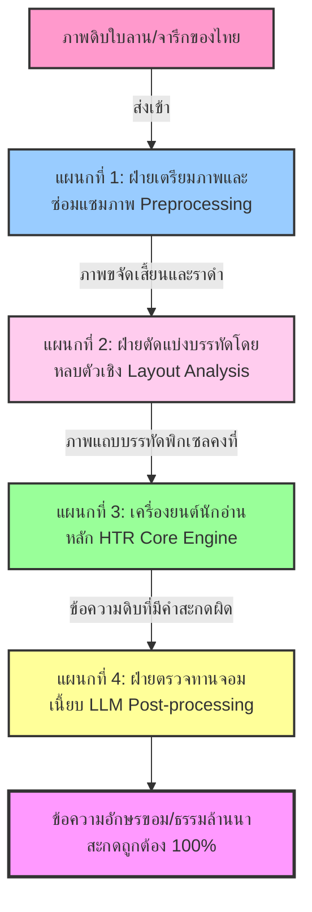

# บทที่ 8.1 กรณีศึกษาการทำ HTR เอกสารโบราณในภูมิภาคเอเชียและยุโรป

## 1. บทนำ (Introduction)
ในการสร้างระบบรู้จำข้อความลายมืออัตโนมัติ (Handwritten Text Recognition - HTR) สำหรับเอกสารโบราณและจารึกโบราณคดีทั่วโลก การเปลี่ยนผ่านเอกสารทางกายภาพดั้งเดิม (Physical Manuscripts) สู่คลังสารสนเทศดิจิทัลเชิงความหมาย (Digital Humanities Repositories) เป็นกระบวนการที่มีความซับซ้อนสูงมาก โครงการจารึกวิทยาดิจิทัลทั่วโลกต่างต้องรับมือกับอุปสรรคสำคัญ 2 ประการหลัก ได้แก่:
1. **ความท้าทายทางกายภาพของวัสดุ (Material Degradation):** สภาพใบลานที่แห้งกรอบ เกิดรอยแตก (Cracks) คราบราดำ รอยแมลงเจาะ รอยตรายางทับข้อความ รวมถึงริ้วเสี้ยนใบไม้ธรรมชาติ (Natural Fibre Grain) ที่มีทิศทางพาดขนานบรรทัดคล้ายกับรอยหมึกจาริก
2. **ความท้าทายทางอักขรวิธีและระบบการเขียน (Orthographical Complexity):** รูปแบบอักษรโบราณที่มีลักษณะเขียนหวัดเชื่อมต่อกัน (Cursive/Scriptura Continua) มีเครื่องหมายระบุสระรอบตัวอักษรหลัก (Abugida) และโดยเฉพาะอย่างยิ่ง **"ตัวเชิง" หรือพยัญชนะห้อยซ้อนแนวตั้ง (Subscript Stacking)** ซึ่งทำให้เกิดปัญหาเส้นอักษรระหว่างบรรทัดบนและบรรทัดล่างชนเกี่ยวกระทบกัน (Overlapping/Interlineation)

บทนี้จะเจาะลึก 7 กรณีศึกษาระดับโลกที่ประสบความสำเร็จในการแก้ปัญหาเหล่านี้ ได้แก่ **SleukRith OCR (อักษรเขมรโบราณ)**, **CMU Lanna Palm-leaf HTR (อักษรธรรมล้านนา)**, **Balinese Lontar AMADI (อักษรบาหลีโบราณ)**, **Dunhuang Chinese HTR (อักษรจีนยุคกลาง)**, **DHARMA ERC Project (คลังจารึกข้ามพรมแดนเอเชียใต้และเอเชียตะวันออกเฉียงใต้)**, **European Medieval HTR (แพลตฟอร์ม Transkribus และโครงการ Crossing the Bifrost / CREMMA)** และ **Ancient Arabic Cursive & Vertical Abugida HTR (โครงการ Muharaf, Broadwell-Arabic และ TibSchol)** เพื่อสกัดความรู้ แผนภาพการไหลเวียนข้อมูล (Data Pipeline) โค้ดปฏิบัติการ และสคีมา XML มาเป็นแผนแม่บทเชิงปฏิบัติการในการสร้างระบบ HTR สำหรับอักษรขอมไทยและอักษรธรรมล้านนาโบราณแบบเริ่มจากศูนย์

---

## 2. เจาะลึก 7 กรณีศึกษาระดับสากล (In-depth Case Studies)

### 2.1 SleukRith OCR (กัมพูชา / ฝรั่งเศส)

#### ภูมิหลังและบริบทโครงการ (Background & Context)
โครงการวิจัยจารึกวิทยาเขมรโบราณเชิงดิจิทัล **"SleukRith Set"** เป็นความร่วมมือระหว่างหน่วยงานวิจัยระดับสูง ได้แก่ **L3i Lab (La Rochelle University) ประเทศฝรั่งเศส**, **Université catholique de Louvain ประเทศเบลเยียม**, **สำนักฝรั่งเศสแห่งปลายบูรพทิศ (EFEO)** และ **สถาบันพุทธศาสนบัณฑิต กรุงพนมเปญ ประเทศกัมพูชา** โดยมุ่งเน้นการสร้างคลังข้อมูลดิจิทัลต้นแบบสำหรับแปลงรูปภาพคัมภีร์ใบลานอักษรเขมรโบราณ (Khmer Palm Leaf Manuscripts) ให้เป็นข้อความดิจิทัลเพื่อการอนุรักษ์มรดกทางวัฒนธรรม [1]

#### ความท้าทายเชิงอักษรศาสตร์และสภาพเอกสาร (Script & Physical Challenges)
- **อักษรเขมรโบราณ (อักษรมูล - Aksara Mul และอักษรเชรียง - Aksara Chrieng):** เป็นระบบการเขียนตระกูล Abugida ที่มี "พยัญชนะเชิง" (Subscript/Co-consonant) ซึ่งเขียนห้อยซ้อนด้านล่างพยัญชนะหลักเพื่อสะกดคำหรือควบกล้ำ ทำให้ข้อความในหน้ากระดาษไม่มีความสูงบรรทัดที่สม่ำเสมอ และมักเกาะเกี่ยวไปทับบรรทัดอื่น
- **ความทรุดโทรมทางกายภาพขั้นรุนแรง:** แผ่นลานโบราณศตวรรษที่ 18-20 เผชิญรอยขูดขีดตามธรรมชาติ คราบเชื้อราดำหนาแน่น สีใบไม้เปลี่ยนตามอายุ และความสว่างไม่คงที่

#### กลยุทธ์การจัดสรรฐานข้อมูล (Dataset Strategy)
ชุดข้อมูลประกอบด้วยภาพสแกนใบลานความละเอียดสูงจำนวน **657 หน้าเต็ม** ที่บันทึกเอกสารตำรายา กฎหมายโบราณ และพุทธศาสนา โดยมีจุดเด่นคือระบบ **การกำกับตำแหน่ง (Annotation) ละเอียด 3 ระดับ** ได้แก่:
1. **ระดับอักขระเดี่ยว (Isolated Glyphs):** ล้อมกรอบแบบโพลีกอนจำนวน **301,626 อักขระ**
2. **ระดับคำ (Words):** บันทึกรอยต่อของกลุ่มอักขระเดี่ยวที่รวมเป็นคำจำนวน **73,359 คำ**
3. **ระดับบรรทัดข้อความ (Lines):** จำนวน **3,245 บรรทัด**

ฐานข้อมูลนี้ถูกแปลงเข้าสู่ระบบนิเวศข้อมูลเปิดสากลสเปก **SEACrowd `seacrowd_im2text`** ด้วยมาตรฐานไฟล์วิจัย **Croissant 1.1** [1]

```xml
<!-- โครงสร้างสคีมา XML การกำกับข้อมูลระดับอักขระเดี่ยวและระดับคำเชื่อมโยงกัน (SleukRith Schema) -->
<?xml version="1.0" encoding="UTF-8"?>
<ManuscriptPage id="trinity_O_1_20_200r" image="images/folio_200r.jpg">
  <!-- ส่วนระดับอักขระเดี่ยวล้อมโพลีกอน (Isolated Character Annotation Block) -->
  <CharAnno>
    <Character id="char_0001" line_id="line_01" label="ព្រ">
      <Polygon>
        <Point x="120" y="45"/>
        <Point x="145" y="45"/>
        <Point x="145" y="95"/>
        <Point x="120" y="95"/>
      </Polygon>
    </Character>
    <Character id="char_0002" line_id="line_01" label="ះ">
      <Polygon>
        <Point x="150" y="45"/>
        <Point x="175" y="45"/>
        <Point x="175" y="95"/>
        <Point x="150" y="95"/>
      </Polygon>
    </Character>
  </CharAnno>

  <!-- ส่วนระดับคำซึ่งเชื่อมโยงตัวอักษรเดี่ยวเข้าหากัน (Word Annotation Association Block) -->
  <WordAnno>
    <Word id="word_0001" transcription="ព្រះ">
      <CharRef id="char_0001"/>
      <CharRef id="char_0002"/>
    </Word>
  </WordAnno>
</ManuscriptPage>
```

#### สถาปัตยกรรมเทคนิคปัญญาประดิษฐ์ (Technical Architecture)
- **การตัดแบ่งหน้าเอกสารแบบลำดับชั้น (Hierarchical Segmentation):** ใช้โมเดลโครงข่าย U-Net หรือ Segment Anything Model (SAM) ในการเรียนรู้แยกภาพพื้นหลังจากข้อความโดยยึดโครงสร้างโพลีกอนคดเคี้ยว
- **การอ่านอักขระสะกดคำ (HTR Engine):** ใช้โมเดลตระกูล Transformer-based OCR เช่น **TrOCR** และ **Donut** ป้อนรูปภาพพิกเซลโพลีกอนเพื่อถอดรหัสข้อความตรงตามบริบท โดยไม่ตัดแบ่งตัวอักษรแบบกล่องสี่เหลี่ยมผืนผ้า (Bbox) เพื่อป้องกันอักษรเชิงขาดแหว่ง
- **ท่อระบบงาน Word Spotting:** ดำเนินการค้นหาตำแหน่งรูปภาพคำค้นหลักบนภาพดิบโดยคำนวณเวกเตอร์ลักษณะเด่น (Visual Feature Embedding Matching) ช่วยให้นักวิชาการสืบค้นวรรคทองได้ทันทีโดยไม่ต้องรอถอดข้อความเสร็จสิ้น [1]

---

### 2.2 CMU Lanna Palm-leaf HTR (อักษรธรรมล้านนา)

#### ภูมิหลังและบริบทโครงการ (Background & Context)
โครงการวิเคราะห์และรู้จำอักษรธรรมล้านนาในคัมภีร์ใบลานโบราณเชิงดิจิทัล เป็นความร่วมมือระหว่าง **สถาบันวิจัยสังคม มหาวิทยาลัยเชียงใหม่ (Social Research Institute, CMU)** และทีมผู้พัฒนาระบบคลังข้อมูลดิจิทัล **e-Scriptorium** แห่งสถาบันวิจัย **Université PSL (Paris Sciences & Lettres) ประเทศฝรั่งเศส** เพื่อพัฒนาเครื่องมือปัญญาประดิษฐ์อ่านคัมภีร์อักษรธรรมล้านนา (ตั๋วเมือง) บนวัสดุใบลานที่กระจายอยู่ตามวัดทางภาคเหนือของไทย [2]

#### ความท้าทายเชิงอักษรศาสตร์และสภาพเอกสาร (Script & Physical Challenges)
- **อักษรธรรมล้านนา:** เป็นระบบการเขียนที่มีสระและพยัญชนะซ้อนกันในแนวตั้ง 2-3 ชั้น มีตัวห้อยใต้พยัญชนะหลัก (ตัวเชิง/พยัญชนะซ้อน) ทำหน้าที่สะกดหรือกล้ำ เส้นหางล่างของตัวเชิงบรรทัดบนมักย้อยล้นมาพันกับหลังคาหรือวรรณยุกต์บนของบรรทัดถัดไป
- **ภาพถ่ายมีความเปรียบต่างต่ำ (Low Contrast):** ใบลานเก่ามีคราบราดำ รอยบิ่น แผ่นโก่งบิดงอ และมีคราบฝุ่นหนาเตอะในร่องลายเส้นจาร

#### กลยุทธ์การจัดสรรฐานข้อมูล (Dataset Strategy)
คณะทำงานได้จัดเก็บภาพสแกนใบลานความละเอียดสูงจำนวน **2,500 หน้าใบลาน** พร้อมสร้างป้ายกำกับเส้นบรรทัดอ้างอิงและการสะกดคำมากกว่า **28,000 บรรทัด** บนระบบมาตรฐานโลก **PageXML** และดึงข้อมูลผ่านสเปก **ALTO XML** โครงสร้าง Ground Truth มีการจัดเก็บ 2 มิติ คือ:
1. **Diplomatic Transcription:** ข้อความสะกดดั้งเดิมตามรอยสลักจริงทุกอักขระย่อย
2. **Normalized Transcription:** ข้อความปริวรรตเป็นคำภาษาบาลี-ไทยปัจจุบัน เพื่อสืบค้นคำค้นร่วมสมัย [2]

```xml
<!-- ตัวอย่างเมทาดาตาโครงสร้างระดับบรรทัดคัมภีร์ใบลานล้านนาตามมาตรฐาน PageXML -->
<?xml version="1.0" encoding="UTF-8"?>
<PcGts xmlns="http://schema.primaresearch.org/PAGE/gts/pagecontent/2019-07-15" pcGtsId="cmu_sri_folio_082">
  <Page imageFilename="SRI_MS_082_V_03.jpg" imageWidth="2048" imageHeight="420">
    <TextRegion id="r_1" type="paragraph">
      <TextLine id="l_01">
        <Coords points="12,30 2030,30 2030,120 12,120"/>
        <Baseline points="15,80 500,79 1000,81 1500,80 2025,82"/>
        <TextEquiv>
          <PlainText>นะโม ตัสสะ ภะคะวะโต อะระหะโต</PlainText>
          <UnicodeInterpretation>นโม ตสฺស ภควโต อรหโต</UnicodeInterpretation>
        </TextEquiv>
      </TextLine>
    </TextRegion>
  </Page>
</PcGts>
```

#### สถาปัตยกรรมเทคนิคปัญญาประดิษฐ์ (Technical Architecture)
1. **การวิเคราะห์เลย์เอาต์ระดับพิกเซลด้วยโครงข่าย U-Net:**
   ฝึก U-Net ให้พยากรณ์ความหนาแน่นเชิงพื้นที่ของเส้นฐานข้อความ (Baseline Density Map) ของอักษรล้านนาเพื่อสกัดตำแหน่งกึ่งกลางแนวเส้นบรรทัดยืดหยุ่น โดยไม่จำกัดด้วยกรอบสีเหลี่ยมผืนผ้า (Bbox) ที่มีขนาดตายตัว
2. **เครื่องยนต์จดจำตัวอักษร PyLaia (CNN-LSTM-CTC):**
   - **Backbone (สกัดเวกเตอร์ทัศนศาสตร์):** ประกอบด้วยชั้น Convolutional Layer 4 บล็อก (พร้อม Batch Normalization และ LeakyReLU) เพื่อสกัดฟีเจอร์พิกเซลของลายมือเขียนล้านนา
   - **Sequence Processing (เรียนรู้บริบทอักษรต่อเนื่อง):** ส่งต่อลักษณะเด่นข้ามแนวแกนตั้งเข้าสู่ Bidirectional LSTM จำนวน 3 ชั้น ชั้นละ 256 Hidden Units เพื่อประมวลผลความหมายคำบาลีตามลำดับกาล
   - **CTC Loss & Decoding:** คำนวณความสูญเสียแบบ Connectionist Temporal Classification เพื่อให้แบบจำลองทำนายตัวอักษร Unicode ได้โดยตรงโดยไม่ต้องมีพิกัดตัดแยกอักษรเดี่ยว [2]

---

### 2.3 Balinese Lontar AMADI (บาหลี / ฝรั่งเศส)

#### ภูมิหลังและบริบทโครงการ (Background & Context)
โครงการวิจัยเพื่อจดจำตัวเขียนคัมภีร์ใบลานบาหลี หรือ **"ลอนตาร์" (Lontar)** นำโดย **ดร. เมด วินดู อันตารา เกสิมัน (Made Windu Antara Kesiman)** และคณะวิจัยแห่ง **มหาวิทยาลัยอูดยานา (Universitas Udayana) ประเทศอินโดนีเซีย** ภายใต้ความร่วมมือกับ Université de La Rochelle ประเทศฝรั่งเศส นำเสนอฐานข้อมูลระดับก้าวหน้าเพื่อทลายข้อจำกัดเชิงกายภาพของระบบตัวจารึกใบลานแบบลุ่มน้ำอินโดนีเซีย [3]

#### ความท้าทายเชิงอักษรศาสตร์และสภาพเอกสาร (Script & Physical Challenges)
- **อักษรบาหลี (Aksara Bali):** มีลวดลายม้วนมน สะบัดหยัก และพยัญชนะซ้อนห้อยล่างล้ำบรรทัด ได้แก่ **"Gantungan" (พยัญชนะห้อยล่าง)** และ **"Gempelan" (พยัญชนะซ้อนข้าง)** ซึ่งทับซ้อนบิดเบี้ยวได้ง่าย
- **สัญญาณรบกวนริ้วเส้นเสี้ยนใบไม้ธรรมชาติ (Natural Fibre Grain):** ใบลานลอนตาร์มีเสี้ยนพืชเป็นเส้นยาวพาดตามแนวนอนขนานกับบรรทัดอย่างหนาแน่น และการชโลมผิวหน้าใบลานด้วย **น้ำมันมะพร้าวผสมเขม่าถั่วทิงกิฮ์เผา (Tingkih)** ทำให้เกิดรอยคราบเปื้อนสีดำและเงาสะท้อนจากผิวใบไม้ที่มันวาว ส่งผลให้ระบบปัญญาประดิษฐ์มักเข้าใจผิดว่าริ้วเสี้ยนไม้ธรรมชาติคือเส้นหมึกเขียนตัวอักษร

```
[ริ้วเสี้ยนใบไม้แนวนอนยาวขนานบรรทัด] ====> (AI สับสนและอ่านว่าสระอุ/สระอู/ตัวเชิง)
[รอยร่องเหล็กจารสีดำเข้มหยักม้วน]   ====> (ข้อความจริงที่ต้องแยกพิกเซลออกให้ได้)
```

#### กลยุทธ์การจัดสรรฐานข้อมูล (Dataset Strategy)
ชุดข้อมูล **AMADI Lontar Expanded Dataset** ประกอบด้วยภาพถ่ายสแกนแบบคงแสงสม่ำเสมอจำนวน **720 หน้าเต็ม** และตัดแยกเป็นแถบพิกเซลระดับบรรทัดครอบคลุม Gantungan ครบถ้วนจำนวน **22,000 บรรทัด** บันทึกโครงสร้าง JSON คู่ไฟล์ภาพที่ขจัดสัญญาณรบกวนแล้วและคำเฉลยอักษรบาหลี Unicode คู่สัญนิยมถอดตัวเขียนอักษรโรมันสากล [3]

#### สถาปัตยกรรมเทคนิคปัญญาประดิษฐ์ (Technical Architecture)
1. **การประมวลภาพเตรียมพิกเซลแบบรักษาขอบ (Edge-preserving Preprocessing):**
   - **Bilateral Filtering:** คำนวณความสม่ำเสมอของพิกเซลรอบด้านเพื่อเกลี่ยลบลายเสี้ยนไม้แนวนอนโดยรักษาความคมชัดของขอบอักขระ
   - **Sauvola Adaptive Thresholding:** นำสมการคำนวณเบี่ยงเบนมาตรฐานเชิงพื้นที่ย่อยมาแบ่งระดับขาวดำ ช่วยลบรอยรา คราบน้ำมัน และขอบขุ่นมัวของใบไม้ได้อย่างหมดจด
2. **เครื่องยนต์รู้จำลายมือขนาดกะทัดรัด (Compact CNN-BiGRU-CTC):**
   - ออกแบบแบบจำลองขนาดเบาเพื่อสนับสนุนการรันระบบแบบออฟไลน์บนคอมพิวเตอร์พกพา ณ พื้นที่หอธรรมโบราณ โดยใช้ชั้น CNN 5 เลเยอร์สกัดโครงสร้างตัวอักษรบาหลี และเชื่อมต่อกับ **Bidirectional GRU** (2 เลเยอร์ เลเยอร์ละ 256 Hidden Units) ในการจำลองลำดับความสมเหตุสมผลของข้อความพยากรณ์ผ่านกลไก **CTC Loss** [3]

#### โค้ดต้นแบบ Python: ท่อประมวลผลลบริ้วเสี้ยนใบลานและโครงข่าย CNN-BiGRU-CTC ใน PyTorch
```python
import os
import cv2
import numpy as np
import torch
import torch.nn as nn

def restore_balinese_palm_leaf_grain(image_path, output_dir=None):
    img = cv2.imread(image_path, cv2.IMREAD_GRAYSCALE)
    if img is None:
        raise FileNotFoundError(f"ไม่พบไฟล์ภาพใบลานที่เส้นทาง: {image_path}")
    # 1. Bilateral Filter ลบเสี้ยนใบลานแนวนอนโดยรักษาขอบลายเส้นอักษร
    smoothed = cv2.bilateralFilter(img, d=9, sigmaColor=75, sigmaSpace=75)
    # 2. Sauvola Adaptive Thresholding แยกความเปรียบต่างระดับพิกเซลท้องถิ่น
    window_size, k, R = 25, 0.2, 128
    mean = cv2.boxFilter(smoothed, cv2.CV_32F, (window_size, window_size))
    mean_sq = cv2.boxFilter(smoothed**2, cv2.CV_32F, (window_size, window_size))
    variance = mean_sq - mean**2
    variance[variance < 0] = 0
    stddev = np.sqrt(variance)
    thresh = mean * (1.0 + k * (stddev / R - 1.0))
    binarized = np.zeros_like(img, dtype=np.uint8)
    binarized[smoothed > thresh] = 255
    # 3. ปรับขนาดความสูงคงที่ 64px เพื่อความกะทัดรัดและรักษาสัดส่วน
    target_height = 64
    h, w = binarized.shape
    target_width = int(target_height * (w / h))
    resized_line = cv2.resize(binarized, (target_width, target_height), interpolation=cv2.INTER_AREA)
    if output_dir:
        os.makedirs(output_dir, exist_ok=True)
        save_path = os.path.join(output_dir, "restored_line.png")
        cv2.imwrite(save_path, resized_line)
        return resized_line, save_path
    return resized_line, None

class BalineseHTR_CNNRNN(nn.Module):
    def __init__(self, num_classes=85, embed_dim=256):
        super().__init__()
        # CNN Backbone สกัดเวกเตอร์รูปทรงโค้งบาหลี
        self.cnn = nn.Sequential(
            nn.Conv2d(1, 32, kernel_size=3, padding=1),
            nn.BatchNorm2d(32), nn.ReLU(), nn.MaxPool2d(2, 2),
            nn.Conv2d(32, 64, kernel_size=3, padding=1),
            nn.BatchNorm2d(64), nn.ReLU(), nn.MaxPool2d(2, 2),
            nn.Conv2d(64, 128, kernel_size=3, padding=1),
            nn.BatchNorm2d(128), nn.ReLU(), nn.MaxPool2d((2, 1), (2, 1)),
            nn.Conv2d(128, embed_dim, kernel_size=3, padding=1),
            nn.BatchNorm2d(embed_dim), nn.ReLU(), nn.MaxPool2d((8, 1), (8, 1))
        )
        # Bidirectional GRU ปริวรรตความหมายลำดับข้อความ
        self.rnn = nn.GRU(
            input_size=embed_dim, hidden_size=256, num_layers=2, 
            bidirectional=True, batch_first=True, dropout=0.3
        )
        self.fc = nn.Linear(256 * 2, num_classes)
        
    def forward(self, x):
        features = self.cnn(x)              # [B, Embed_Dim, 1, Seq_Len]
        features = features.squeeze(2)      # [B, Embed_Dim, Seq_Len]
        features = features.transpose(1, 2) # [B, Seq_Len, Embed_Dim]
        rnn_out, _ = self.rnn(features)     # [B, Seq_Len, 256*2]
        logits = self.fc(rnn_out)           # [B, Seq_Len, Num_Classes]
        return logits
```

---

### 2.4 Dunhuang Chinese HTR (อักษรจีนยุคกลาง)

#### ภูมิหลังและบริบทโครงการ (Background & Context)
โครงการมุ่งแปลงฐานข้อมูลเอกสารตัวเขียนโบราณแห่งถ้ำม่อเกา ตุนหวง มณฑลกานซู ประเทศจีน (Dunhuang Manuscripts) ศตวรรษที่ 5 ถึง 11 เพื่อนำเอกสารพระไตรปิฎก บันทึกการค้า สัญญาประเพณีทางสังคมเข้าสู่คลังประวัติศาสตร์ดิจิทัลในระดับมหภาค (Mass Digitization) นำเสนอผ่านสถาปัตยกรรมวิจัยโดย **C. Brisson และคณะ** [4]

#### ความท้าทายเชิงอักษรศาสตร์และสภาพเอกสาร (Script & Physical Challenges)
- **ภาษาและอักษรจีนยุคกลาง:** มีวิวัฒนาการการขีดเขียนพู่กันจากอักษรข้าราชการดั้งเดิม (Clerical Script) สู่ตัวเขียนปกติ และอักษรเขียนหวัด (Cursive styles) การวางระเบียบแนวการเขียนมีทั้งแบบแนวนอนและแนวดิ่ง (Vertical layout) มีตัวสะกดเชิงลักษณะเด่นของพู่กันจีนจำนวนนับหมื่นอักษร
- **สภาพความเก่าแก่กว่าพันปี:** กระดาษโบราณทรุดโทรม ขอบฉีกขาด เปียกชื้น มีรอยพับหักพาดขวางตัวเขียน

#### กลยุทธ์การจัดสรรฐานข้อมูล (Dataset Strategy)
ประยุกต์การจัดรูปภาพและข้อความถอดความเชิงวิเคราะห์เข้าสู่ระบบ Web App การมีส่วนร่วมคัดลอกสอบทานของมนุษย์ **e-Scriptorium** และบันทึกพารามิเตอร์ส่งออกสคีมา XML มาตรฐานสากล **ALTO (Analyzed Layout and Text Object)** เพื่อดึงข้อความ Ground Truth ได้อย่างเป็นระเบียบ [4]

```xml
<!-- ตัวอย่างการประกาศพิกัดบรรทัดและคำเขียนจีนโบราณในมาตรฐาน ALTO XML -->
<?xml version="1.0" encoding="UTF-8"?>
<alto xmlns="http://www.loc.gov/standards/alto/ns-v4#">
  <Description>
    <MeasurementUnit>pixel</MeasurementUnit>
    <sourceImageInformation><fileName>DUNHUANG_SCROLL_P_2004.jpg</fileName></sourceImageInformation>
  </Description>
  <Layout>
    <Page ID="PAGE_0" HEIGHT="3200" WIDTH="1500">
      <PrintSpace ID="SPACE_0" HEIGHT="3000" WIDTH="1400" HPOS="50" VPOS="100">
        <TextBlock ID="TB_1" HEIGHT="2800" WIDTH="1300" HPOS="100" VPOS="200">
          <TextLine ID="TL_1" HEIGHT="2500" WIDTH="100" HPOS="1200" VPOS="300">
            <Baseline HPOS="1250" VPOS="300" POINTS="1250 300 1250 2800"/>
            <String ID="STR_1" CONTENT="妙法蓮華經弘傳序" HEIGHT="2500" WIDTH="100" HPOS="1200" VPOS="300"/>
          </TextLine>
        </TextBlock>
      </PrintSpace>
    </Page>
  </Layout>
</alto>
```

#### สถาปัตยกรรมเทคนิคปัญญาประดิษฐ์ (Technical Architecture)
- **ตัวสกัดและแบ่งส่วนบรรทัดด้วย U-Net:** ภาพแถบบรรทัดข้อความจีนโบราณปรับความสูงคงที่ **48 พิกเซล** ถูกเข้ารหัสผ่าน VGG-like CNN จำนวน 4 บล็อก เพื่อรวบรวมฟีเจอร์พิกเซลลายเส้นพู่กัน จากนั้นป้อนเข้า BiLSTM 2 ชั้น ชั้นละ 256 Hidden Units เพื่อสะกดจับคู่อักขระเฉลยขนาดยักษ์โดยตรง โดยไม่จำเป็นต้องใช้ BBox รอบคำ และประเมินน้ำหนักเพื่อถอดความด้วย Beam Search สอดรับสถาปัตยกรรม **Generalist Model** เพื่อให้อ่านเอกสารต่างราชวงศ์ได้ในน้ำหนักโมเดลเดียวกัน [4]

---

### 2.5 DHARMA ERC Project (จารึกหินและแผ่นทองแดงข้ามพรมแดน)

#### ภูมิหลังและบริบทโครงการ (Background & Context)
โครงการ **DHARMA (2019-2025)** ย่อมาจาก *"The Domestication of 'Hindu' Asceticism and the Religious Making of South and Southeast Asia"* เป็นอภิมหาโครงการวิจัยเชิงโบราณคดีและจารึกวิทยาดิจิทัลที่ได้รับการสนับสนุนทุนหลักมูลค่าสูงจากสภาวิจัยแห่งยุโรป (**ERC Synergy Grant**) ดำเนินงานโดยความร่วมมือระหว่างสถาบันชั้นนำ เช่น **EFEO**, **CNRS/CESAH (ฝรั่งเศส)**, **Humboldt University of Berlin (เยอรมนี)** และ **University of Naples "L'Orientale" (อิตาลี)** [5]

```
             [ สหสถาบันร่วมมือระบบนิเวศ DHARMA ]
    EFEO (ฝรั่งเศส) <---> CNRS (ฝรั่งเศส) <---> Humboldt (เยอรมนี) <---> Naples (อิตาลี)
                              |
                              v
                [ คลังจารึกดิจิทัล EpiDoc XML ]
                  (Sanskrit, Tamil, Khmer, Kawi)
```

#### ความท้าทายเชิงอักษรศาสตร์และสภาพเอกสาร (Script & Physical Challenges)
- **อักษรตระกูลพัลลวะอินเดียใต้และอักษรจารึกดั้งเดิม (กวิโบราณ, เขมรโบราณ, จามโบราณ, ทมิฬโบราณ, สันสกฤต):** อักขรวิธีมีหัวตวัด ม้วน และมีตัวเชิงสะกดจำนวนมาก หางอักษรล้นแนวดิ่งเบียดชิดกัน
- **ผิวสัมผัสหินขรุขระ (Rough Stone Texture):** วัสดุกายภาพคือแผ่นศิลาจารึกและแผ่นทองแดงโบราณที่เผชิญการกัดกร่อนจากธรรมชาติ คราบตะไคร่น้ำ รอยกะเทาะบิ่น แตกหักกะเทาะรับครึ่งท่อน ทำให้การบันทึกภาพต้องพึ่งพาเทคนิคภาพพิมพ์รูดหมึก (Estampage) และการสแกน 3 มิติเชิงลึก (3D Photogrammetry)

#### กลยุทธ์การจัดสรรฐานข้อมูล (Dataset Strategy)
จัดเก็บคลังข้อมูลขนาดใหญ่ยิ่งยวด ประกอบด้วยจารึกทมิฬโบราณกว่า **35,000 รายการ** จารึกสันสกฤตและเขมรโบราณอีกหลายพันชิ้นงาน โครงสร้างฐานข้อมูลถูกจัดเก็บในมาตรฐานควบคุมเชิงความหมาย **TEI/EpiDoc XML (Text Encoding Initiative for Epigraphy)** เพื่อแสดงผลเชื่อมโยงกันอย่างเป็นระบบ โดยสามารถระบุรอยชำรุดกะเทาะสูตรพิเศษและคำสะกดที่ได้รับบูรณะโดยนักโบราณคดีจารึกวิทยา [5]

```xml
<!-- โครงสร้างการแสดงผลจารึกตามสัญนิยมมาตรฐาน TEI/EpiDoc XML (DHARMA-format) -->
<?xml version="1.0" encoding="UTF-8"?>
<TEI xmlns="http://www.tei-c.org/ns/1.0" xml:lang="eng">
  <teiHeader>
    <fileDesc>
      <titleStmt><title>Inscription of Ciburuy - Old Sundanese Kawi</title></titleStmt>
      <publicationStmt><authority>DHARMA Project</authority></publicationStmt>
    </fileDesc>
  </teiHeader>
  <text xml:lang="kaw-Latn">
    <body>
      <div type="edition" xml:space="preserve">
        <p>
          <lb n="1"/>svasti śrī śaka varṣātīta <num value="702">702</num> 
          <lb n="2"/>kunta karana <supplied reason="lost">mahārāja</supplied> śrī harivarman
          <lb n="3"/>anugraha <gap reason="lost" quantity="5" unit="character"/> datu prasasti.
        </p>
      </div>
    </body>
  </text>
</TEI>
```

#### สถาปัตยกรรมเทคนิคปัญญาประดิษฐ์ (Technical Architecture)
รันระบบ HTR ผ่านแพลตฟอร์มวิจัยร่วมทางอินเทอร์เน็ต **Transkribus** และ **e-Scriptorium** โดยดึงกลไก Kraken HTR เป็นแกนหลัก (Fully Convolutional Network - FCN ในการวิเคราะห์เค้าโครง Baseline และ 3x BiLSTM + CTC Loss) ในการสกัดตัวสะกดพยากรณ์ เพื่อวิเคราะห์คำศัพท์ร่วมประวัติศาสตร์ข้ามพรมแดนเชื่อมต่อโครงสร้างดัชนีคำค้นร่วมกับฐานข้อมูลสัญนิยม EpiDoc ทั่วโลก [5]

---

### 2.6 European Medieval HTR (ยุโรป)

#### ภูมิหลังและบริบทโครงการ (Background & Context)
การพัฒนา HTR เอกสารยุคกลางในยุโรปขับเคลื่อนโดยสมาคมพันธมิตรวิจัยขนาดใหญ่ ซึ่งนำเสนอนวัตกรรมผ่านแพลตฟอร์ม **Transkribus** (พัฒนาภายใต้โครงการวิจัย H2020 READ และดำเนินการเชิงพาณิชย์โดยวิสาหกิจ READ COOP SCE ตั้งแต่ปี 2019) [6] โครงการที่สำคัญได้แก่ **CREMMA-Medieval (2021-2022)** สำหรับการอ่านเอกสารภาษาฝรั่งเศสโบราณ (Old French) และภาษาละตินยุคกลาง และโครงการ **Crossing the Bifrost (2025)** นำโดย Katrina A. Kapitan และ Christopher Vidal ที่เน้นประยุกต์ HTR แบบเปิดและรองรับมาตรฐานข้อมูลสัญนิยม FAIR บนเอกสารภาษาพายัพโบราณหรือนอร์สโบราณ (Old Norse Manuscripts) [7][8]

#### ความท้าทายเชิงอักษรศาสตร์และสภาพเอกสาร (Script & Physical Challenges)
- **ระบบตัวย่อระดับสูง (Medieval Abbreviations):** เนื่องจากต้นทุนแผ่นหนังแกะ/หนังวัว (Parchment) มีราคาแพงมาก อาลักษณ์จึงเขียนข้อความด้วยคำย่อจำนวนมหาศาล ทั้งแบบตัดท้าย (Suspensions) บีบกลาง (Contractions) และการใช้สัญลักษณ์พิเศษ (เช่น เครื่องหมาย tironian et `⁊`) ซึ่งมีความแปรผันสูงตามท้องถิ่นและศตวรรษ
- **ความหลากหลายของรูปแบบตัวอักษร:** เอกสารโบราณเปลี่ยนผ่านจากอักษรการอแล็งเฌียง (Carolingian minuscule) สู่ตระกูลอักษรโกธิก (Gothic scripts) ซึ่งมีลักษณะเส้นตรงหนาและเรียงตัวชิดกันมาก ทำให้สลับคู่สับสนได้ง่ายระหว่างพยัญชนะ `i`, `u`, `n`, `m`
- **ปัญหาภาษาทรัพยากรต่ำ (Low-resource Language):** เอกสารภาษาพายัพโบราณมีจำนวนน้อยมาก และมีระบบตัวอักษรรวมถึงสัญลักษณ์พิเศษ เช่น อักษรรูน (Runic characters) และสระประสมเฉพาะตัว

#### กลยุทธ์การจัดสรรฐานข้อมูล (Dataset Strategy)
- **การใช้มาตรฐานควบคุมการวิเคราะห์เค้าโครง SegmOnto:** โครงการยุโรปประยุกต์สัญนิยมการแบ่งหน้าเอกสารและโครงสร้างข้อมูลด้วยกลไก **SegmOnto** ซึ่งเป็นคำศัพท์ควบคุม (Controlled Vocabulary) สำหรับระบุขอบเขตเลย์เอาต์หน้าหนังสือ เช่น `DamageZone` (ส่วนเสียหาย), `MarginText` (ข้อความแทรกข้างขอบ) และ `MainTextZone` (พื้นที่หลักข้อความ) ช่วยควบคุมการฝึกสอนโมเดลการแบ่งส่วนเค้าโครง (Layout Segmentation) ได้อย่างเป็นระบบระเบียบ [9]
- **มาตรฐานข้อมูล PAGE XML และ ALTO XML:** จัดเก็บพิกัดเส้นบรรทัดแบบละเอียด พร้อมถอดรหัสข้อความคู่ขนานสองรูปแบบ (Double-keying/Dual Transcription System):
  1. **Diplomatic Text:** ถอดความตัวอักษรตรงตามตัวเขียนจริงรวมถึงเครื่องหมายย่อดั้งเดิม
  2. **Normalized Text:** ถอดความด้วยการคลี่ย่อเติมคำเต็มเพื่อประโยชน์ในการค้นหาและวิเคราะห์ภาษาประวัติศาสตร์

#### สถาปัตยกรรมเทคนิคปัญญาประดิษฐ์ (Technical Architecture)
1. **การถ่ายโอนความรู้และการปรับจูนด้วยข้อมูลน้อย (Transfer Learning & Few-shot Fine-tuning):**
   โครงการ **Crossing the Bifrost** นำเสนอแนวคิดว่าการเริ่มฝึกเครื่องยนต์ HTR จากศูนย์เป็นกระบวนการสิ้นเปลืองทรัพยากร คณะผู้วิจัยจึงดาวน์โหลดน้ำหนักแบบจำลองพื้นฐานจาก **Kraken Model Hub** (ซึ่งฝึกด้วยภาษาฝรั่งเศสโบราณและละตินจำนวนหลายแสนบรรทัด) จากนั้นนำมาประยุกต์กลยุทธ์ **"ตรึงเลเยอร์ประมวลภาพดิบช่วงต้น" (Freezing Early Convolutional Layers)** และทำการประมวลผลฝึกฝนปรับจูนพารามิเตอร์เฉพาะชั้นจำลองอักขระผลลัพธ์ (Classification Head) ด้วยข้อมูลใบลานนอร์สโบราณเพียง **50 หน้า** (Few-shot Data) วิธีนี้ช่วยลดความต้องการข้อมูลป้ายกำกับลงได้ถึง 80% โดยสามารถลดค่าความผิดพลาดระดับอักขระ (CER) ลงต่ำกว่า 4% ได้อย่างมีนัยสำคัญ [8]
2. **การเปรียบเทียบแนวทางการคลี่คำย่อ (Direct vs Pipeline Translation):**
   การศึกษาของ Camps & Vidal (2021) ประเมินผล 2 สถาปัตยกรรมในการรับมือกับตัวย่อภาษาละตินยุคกลาง:
   - **Direct Transcription Model:** ฝึก HTR (เช่น Kraken หรือ PyLaia) ให้แปลงภาพตัวเขียนที่มีสัญลักษณ์ตัวย่อ ให้ออกมาเป็นคำเต็มโดยตรง (เช่น ภาพเขียน `dñs` -> แปลงข้อความ `dominus`)
   - **Modular Pipeline:** เทรนเครื่องยนต์ HTR ให้อ่านตัวอักษรตรงตามสายตาเขียนดั้งเดิมก่อน (Diplomatic HTR) จากนั้นนำผลลัพธ์ข้อความดิบส่งเข้าสู่โมเดลภาษาและการซ่อมข้อความระดับอักขระ (Character-level Seq2Seq Transformer) เพื่อทำการแปลงเป็นคำมาตรฐาน (Text Normalization) ผลการศึกษาชี้ว่า **Modular Pipeline** ให้ความถูกต้องและความคงเส้นคงวาเหนือกว่าในการประยุกต์ใช้งานระบบคลังข้อมูลดิจิทัลมหาศาล [7]

---

### 2.7 Ancient Arabic Cursive & Vertical Abugida HTR (เอเชียตะวันตก / ทิเบต)

#### ภูมิหลังและบริบทโครงการ (Background & Context)
การพัฒนา HTR สำหรับอักษรเขียนหวัดและเชื่อมต่อแนวนอนอย่างต่อเนื่อง (เช่น อักษรอารบิกประวัติศาสตร์) และอักษร Abugida ที่ซ้อนกันตามแนวดิ่งอย่างซับซ้อน (เช่น อักษรทิเบต) ได้รับความสนใจอย่างมาก โครงการที่โดดเด่นประกอบด้วย **Muharaf Project (NeurIPS 2024)** นำโดย Muhammad Saeed และคณะวิจัย เพื่อสร้างฐานข้อมูล Ground Truth ระดับหน้ากระดาษเต็มรูปแบบสำหรับจารึกอารบิกประวัติศาสตร์ [10], **Broadwell Multilingual Arabic Archival HTR (2025/2026)** สำหรับระบบคลังจดหมายเหตุหลายภาษา (อาหรับโบราณ, ออตโตมัน, เปอร์เซีย, อูรดู และภาษา Ajami แอฟริกาตะวันตก) [11] และโครงการ **TibSchol Dunhuang Tibetan HTR (2025)** นำโดย R. Griffiths และ M. Meelen แห่งมหาวิทยาลัยเคมบริดจ์ เพื่อวิเคราะห์และถอดรหัสม้วนคัมภีร์ทิเบตโบราณ (ศตวรรษที่ 8-10) จากคลังโบราณคดีตุนหวงบนระบบ Transkribus และ e-Scriptorium [12]

#### ความท้าทายเชิงอักษรศาสตร์และสภาพเอกสาร (Script & Physical Challenges)
- **อักษรอารบิกประวัติศาสตร์ (Arabic Cursive context):** เป็นตัวเขียนลักษณะ cursive อย่างเต็มรูปแบบ ตัวอักษรจะเชื่อมต่อติดกันในแนวระนาบ โดยรูปทรงของอักขระตัวเดียวกันจะเปลี่ยนไปอย่างสิ้นเชิงตามตำแหน่งที่มันปรากฏในคำ ได้แก่ รูปเริ่มต้น (Initial), รูปกลางคำ (Medial), รูปท้ายคำ (Final) และรูปโดดเดี่ยว (Isolated) นอกจากนี้ในเอกสารโบราณมักไม่มีการระบุเครื่องหมายจุดแยกเสียงพยัญชนะ (Diacritics/Dots) ทำให้เกิดความแปรผันเชิงไวยากรณ์และอักขรวิธีสะกดสูงมาก
- **อักษรทิเบตประวัติศาสตร์ (Vertical Stacking Abugida):** อักษรทิเบตในเอกสาร Pothi โบราณมีลักษณะการวางคำต่อเนื่องแบบไม่มีช่องว่างคำ (Scriptura Continua) แต่จะใช้จุดระบุพยางค์เรียกว่า **"เฌก" (Tsheg - ཚེག)** เป็นตัวคั่น และพยัญชนะสะกดมักสะกดซ้อนกันในแนวดิ่ง (Vertical Stacking) โดยมีพยัญชนะหลัก พยัญชนะห้อยล่าง (Subscripts) และสระเกาะกลุ่มบน-ล่าง ทำให้มีความสูงและรูปทรงซับซ้อนคล้ายอักษรธรรมล้านนาและขอมไทย

#### กลยุทธ์การจัดสรรฐานข้อมูล (Dataset Strategy)
- **ชุดข้อมูล Muharaf:** บันทึกข้อมูลแบบประสานพิกเซลระดับหน้ากระดาษเต็มรูปแบบ โดยกำกับโครงสร้างแบบโพลีกอนคดเคี้ยวโอบล้อมข้อความต่อเนื่อง แทนการใช้ Bbox [10]
- **ชุดข้อมูล Broadwell-Arabic:** รวบรวมภาพถ่ายหน้าจารึกสแกนกว่า **2,500 ม้วน**, พาร์สบรรทัดยืดหยุ่นสะสมได้ **60,000 บรรทัด** ภายใต้ระเบียบสคีมาข้อมูล PAGE XML และ ALTO XML [11]
- **ชุดข้อมูล TibSchol:** กำกับข้อมูลในระบบ JSON-L เชื่อมต่อพิกัดกับระบบคลัง Unicode อักษรทิเบตและคำถอดเสียงโรมันมาตรฐาน Wylie โดยใช้กลไกการคั่นตัวสะกดและนับพยางค์ตามระบบเครื่องหมายเฌก (Tsheg-based segmentation) [12]

#### สถาปัตยกรรมเทคนิคปัญญาประดิษฐ์ (Technical Architecture)
1. **ระบบประมวลผลของโครงการ Broadwell-Arabic (PyLaia & BPE Tokenizer):**
   - **Backbone Extractor:** ใช้ระบบสแกนฟีเจอร์พิกเซลด้วย CNN-LSTM ของ **PyLaia** โดยปรับภาพความสูงคงที่ 128 พิกเซล และความกว้างผันแปรอิสระ
   - **Shared Subword Tokenizer:** เนื่องจากอักษรอารบิกประวัติศาสตร์บันทึกเอกสารหลากหลายภาษา คณะผู้วิจัยจึงสร้างตัวเข้ารหัสโทเค็นร่วมระดับคำย่อย **Byte Pair Encoding (BPE) ขนาด 32,000 โทเค็น** ช่วยให้แบบจำลองสามารถอ่านประมวลผลข้อความข้ามภาษาในโมเดลเดียวกันได้อย่างยืดหยุ่น และปิดท้ายด้วยการใช้โครงข่าย **Seq2Seq Transformer** ตรวจทานไวยากรณ์สะกดคำย้อนกลับเชิงประวัติศาสตร์ (Post-OCR correction) [11]
2. **ระบบประมวลผลของโครงการ TibSchol (Vision Transformer & Cross-Attention):**
   - **Layout Analysis:** รัน U-Net ตรวจจับ Baseline บน Transkribus เพื่อจำแนกเส้นแนวบรรทัดแนวนอนพยัญชนะหลัก
   - **Recognition:** ผนวกขีดความสามารถของสถาปัตยกรรม **Vision Transformer (ViT)** ร่วมกับ **Cross-Attention Mechanism** เพื่อเรียนรู้ตำแหน่งความสัมพันธ์ระหว่างอักขระที่ซ้อนแนวตั้ง (Vertical consonant stacks) ข้อมูลภาพจะถูกหั่นย่อยเป็น Patch เพื่อวิเคราะห์น้ำหนักความเชื่อมโยงของภาพพยัญชนะหลักและสระห้อยท้ายที่อยู่คนละแนวตั้งฉาก ช่วยสยบปัญหาการสลับพยัญชนะห้อยล่างและการพิมพ์ผิดได้อย่างมีประสิทธิภาพ [12]

---

## 3. ตารางเปรียบเทียบเชิงวิเคราะห์และสังเคราะห์ข้ามโปรเจกต์ (Cross-Project Synthesis Matrix)

ตารางด้านล่างแสดงการสังเคราะห์เปรียบเทียบความแตกต่างด้าน Script Challenges, Technical Architectures และ Dataset Strategies ของทั้ง 7 กรณีศึกษา:

| มิติตัวแปร | SleukRith OCR | CMU Lanna HTR | Balinese Lontar | Dunhuang Chinese | DHARMA Project | European Medieval | Arabic & TibSchol |
| :--- | :--- | :--- | :--- | :--- | :--- | :--- | :--- |
| **ภูมิภาค/อักษร** | กัมพูชา / อักษรเขมรโบราณ (มูล, เชรียง) | ภาคเหนือไทย / อักษรธรรมล้านนา (ตั๋วเมือง) | บาหลี อินโดนีเซีย / อักษรบาหลีโบราณ | มณฑลกานซู จีน / ภาษาจีนยุคกลาง | เอเชียใต้-เอเชียตะวันออกเฉียงใต้ / สันสกฤต, ทมิฬ, เขมรโบราณ, กวิ | ยุโรป / ละตินยุคกลาง, ฝรั่งเศสโบราณ, นอร์สโบราณ | เอเชียตะวันตก, ทิเบต / อาหรับ, เปอร์เซีย, ทิเบตโบราณ |
| **วัสดุกายภาพ** | ใบลานเก่า (ศตวรรษ 18-20) | ใบลานโบราณ (หอไตรล้านนา) | ใบลานลอนตาร์ชโลมน้ำมันเขม่าถั่วทิงกิฮ์ | ม้วนกระดาษโบราณพันปีในถ้ำม่อเกา | ศิลาจารึกหิน และแผ่นทองแดงโบราณ | แผ่นหนังแกะ/หนังวัวเก่า (Parchment) | ม้วนกระดาษ, คัมภีร์ใบยาว โปถิ (Pothi) |
| **อักขรวิธี** | โครงสร้าง Abugida มีพยัญชนะเชิงซ้อนล่าง | ตัวเชิงซ้อนแนวตั้ง 2-3 ชั้น หางและสระชนกัน | อักษรม้วนมน มี Gantungan และ Gempelan | อักษรซับซ้อน เขียนแนวดิ่งและตัวหวัด | อักษรตระกูลพัลลวะ มีตัวเชิงลึกไม่คงที่ | อักษรโกธิกและละตินที่ใช้สัญลักษณ์ย่อระดับสูง | ตัวเขียนหวัดต่อเนื่องแนวนอน และตัวซ้อนแนวดิ่งทิเบต |
| **ความท้าทายกายภาพ** | คราบรา รอยแมลงเจาะ รอยแตกลายใบไม้ | คราบบราดำ แผ่นโก่งงอ เส้นจารเปรียบต่างต่ำ | ริ้วเสี้ยนไม้ธรรมชาติพาดแนวนอน เงาตรายางทับ | รอยฉีกขาดของกระดาษโบราณ รอยน้ำซึม รอยพับ | หินบิ่น แตกหักกะเทาะ รอยขูดขีดตื้นจาง | คราบสีเก่า หนังแกะเปื่อย ขอบแหว่ง รอยเย็บ | กระดาษเหลือง เปื่อยยุ่ย หมึกซึมเลอะเลือนข้ามหน้า |
| **ขนาดชุดข้อมูล** | 657 หน้า, 301.6K อักขระเดี่ยว, 73.3K คำ | 2,500 หน้าใบลาน, 28,000 บรรทัด | 720 หน้าเต็ม, 22,000 บรรทัด | คลังเอกสารขนาดใหญ่ (Mass Digitization) | จารึกทมิฬ 35,000 รายการ และสันสกฤต/เขมรนับพัน | หลายหมื่นหน้า (สมาคม READ COOP) | อาหรับ 60,000 บรรทัด, ทิเบตคลังตุนหวงขนาดใหญ่ |
| **มาตรฐานข้อมูล** | Croissant 1.1 และ SEACrowd | PageXML และ ALTO XML | PageXML / ALTO และ Croissant 1.1 JSON | ALTO XML และ e-Scriptorium JSON | TEI/EpiDoc XML (Text Encoding Initiative) | PageXML, ALTO XML, SegmOnto Ontology | PAGE XML, JSON-L, Wylie transliteration |
| **กลยุทธ์ GT** | XML เชื่อมโยงพิกัด Polygon จากอักขระสู่คำ | ถอดอักษรแบบ Diplomatic และ Normalized | อักษร Unicode คู่กับระบบอักษรโรมันสากล | ข้อความอักษรจีนโบราณตรงตามเอกสารจริง | สะกดตามจริงพร้อมรอยชำรุดและคำฟื้นฟู | ถอดรหัส 2 ชั้น: ตัวสะกดตามจริต และคำคลี่มาตรฐาน | คำสะกดดั้งเดิม คั่นคำเฌก และคำอ่านโรมัน Wylie |
| **การเตรียมภาพ** | ปรับความสว่างและลบสัญญาณรบกวนทั่วไป | Sauvola Adaptive Thresholding ปรับขาวดำ | Bilateral Filtering (ลบเสี้ยน) + Sauvola Binarization | ปรับความเปรียบต่าง ลบรอยพับ ลดขนาดสูง 48px | ปรับภาพ Grayscale ลบพับ และบันทึก 3 มิติ | ขจัดรอยหมึกซึม ขยายความเปรียบต่างพิกเซล | Otsu/Sauvola binarization, ปรับมุมเอียงภาพคำ |
| **การแบ่งบรรทัด** | กรอบโพลีกอนโอบล้อม (Polygon Annotation) | U-Net คาดเดาความหนาแน่นพิกเซล Baseline | แถบพิกเซลบรรทัดยึดพิกัดมุมครอบ Gantungan | Baseline Segmentation ดึงกรอบอิสระตามบรรทัด | FCN Segmenter (Kraken) ตรวจจับแนว Baseline | SegmOnto layout analysis, Baseline detection | U-Net / Kraken baseline, Tsheg segmentation |
| **โครงสร้างโมเดล** | SAM / U-Net และ TrOCR / Donut | U-Net Layout Predictor และ PyLaia (CNN-LSTM-CTC) | CNN 5 ชั้น + 2x BiGRU + CTC Loss (น้ำหนักขนาดเบา) | Kraken Engine (CRNN: VGG-like + 2x BLSTM + CTC) | Kraken Engine / Transkribus (FCN + 3x BiLSTM + CTC) | Transkribus (PyLaia) / Kraken HTR, Seq2Seq | CRNN (ResNet-34 + BiLSTM + CTC), Vision Transformer |

---

## 4. พิมพ์เขียวแผนแม่บทการประยุกต์ใช้ในโครงการอักษรขอมและอักษรธรรมของไทย (Actionable Blueprint for Thai-Khom & Lanna Project)

การเริ่มต้นสร้างระบบวิเคราะห์และอ่านอักษรขอมไทย (Khom Thai Script) และอักษรธรรมล้านนาโบราณจากศูนย์ จำเป็นต้องประยุกต์เอาชุดความรู้และเทคโนโลยีจากทั้ง 7 กรณีศึกษาระดับโลกมาจัดสรรระบบงานอย่างเปรียบเสมือนโรงงานผลิตข้อความ โดยแบ่งออกเป็น 4 แผนกหลักตามแผนแม่บทเชิงปฏิบัติการดังต่อไปนี้:



### 4.1 แผนกที่ 1: ฝ่ายเตรียมภาพและซ่อมแซมภาพ (Image Preprocessing Pipeline)

- **การประยุกต์ใช้ตัวกรองลบเสี้ยนใบลาน (Bilateral Filtering):**
  ใบลานและพับสาของไทยทำจากใบลานพืชตระกูลลาน ซึ่งผิวใบไม้มีลายทางวิ่งแนวนอนสม่ำเสมอ คณะวิศวกรรมข้อมูลของไทย **ต้องติดตั้ง Bilateral Filtering** ร่วมกับ **Sauvola Adaptive Thresholding** (แบบโมเดลบาหลี AMADI) เพื่อเกลี่ยผิวเสี้ยนใบไม้ธรรมชาติให้อ่อนโยนเรียบเนียนเป็นสีพื้นขาวสะอาด โดยไม่ทำลายขอบเหล็กจารสีดำ เพื่อป้องกันโมเดลสับสนลายใบไม้เป็นวรรณยุกต์หรือตัวเชิง
- **การใช้แว่นตากรองแสงทิศทาง (Gabor Filters):**
  สำหรับคัมภีร์ใบลานที่ไม่มีการลูบเขม่าดินหม้อ (ลายเส้นจารเป็นรอยสีน้ำตาลกลืนไปกับผิวใบไม้) ให้ป้อนสคริปต์ **Gabor Filters** ที่ตั้งค่ากรองความถี่และทิศทางเชิงมุม แว่นตานี้จะถูกตั้งคอร์ดขจัดทิศทางตรงราบแนวนอน (ลบลายเส้นใบไม้) แต่จะตรวจจับความโค้งกลมและมุมหัก ซึ่งตรงกับหัวและหัวขมวดของอักษรขอมและอักษรล้านนาพอดี
- **การลบลอยประทับตราหอสมุดด้วยช่างทาสี (Image Inpainting):**
  คัมภีร์ใบลานและสมุดข่อยโบราณเกือบทั้งหมดในหอสมุดแห่งชาติมักมีตราประทับหมึกสีแดงสีน้ำเงินปั๊มทับอักษร (ตราหอสมุดฯ) ทีมงานต้องตั้งค่าตัวกรองแยกเฉพาะสีแดง/น้ำเงินพิกเซลออกให้เกิดรูโหว่ จากนั้นนำโมเดล **Image Inpainting** (สไตล์ญี่ปุ่น/ตุนหวง) มาวาดซ่อมแซมพิกเซลตัวเขียนขอมต่อยอดให้ตัวหนังสือเชื่อมประสานกันโดยธรรมชาติ

### 4.2 แผนกที่ 2: ฝ่ายตัดแบ่งบรรทัดและหลบเลี่ยงตัวเชิง (Layout Analysis & Segmentation)

> [!IMPORTANT]
> **กฎเหล็กทางวิศวกรรมข้อมูล:** ห้ามใช้แนวคิดการตีกรอบสี่เหลี่ยมผืนผ้า (Bounding Box) ในการตัดบรรทัดข้อความอักษรขอมและอักษรธรรมล้านนาอย่างเด็ดขาด เนื่องจากความไม่สม่ำเสมอของระดับความสูงของตัวเชิงสะกดและวรรณยุกต์บน-ล่าง จะทำให้เส้นตรงของ Bbox ไปงับเอาหัวหรือหางของอักษรบรรทัดข้างเคียงจนขาดแหว่ง ส่งผลให้ CER เพิ่มขึ้นอย่างควบคุมไม่ได้

- **การใช้เรดาร์หาไข่แดง (CRAFT Model):**
  เปลี่ยนไปใช้กลไกของแบบจำลอง CRAFT (Character Region Awareness for Text Detection) ปล่อยค่าวิเคราะห์ค้นหาจุดพิกเซลศูนย์กลางตัวอักษร (เหมือนจุดแดงกึ่งกลางไข่ดาว) เมื่อโมเดลตรวจพบจุดไข่ดาวเรียงกันในทิศทางบรรทัด มันจะวาดโครงเส้นคดเคี้ยวเลื้อยหลบขอบพยัญชนะและห้อยย้อยตัวเชิงเป็นลักษณะกรอบโพลีกอนรูปทรงอิสระ (Polygon Annotation)
- **การตัดบรรทัดด้วยระบบเส้นนำสายตา (Baseline-driven e-Scriptorium):**
  ประยุกต์ใช้แพลตฟอร์ม e-Scriptorium/PageXML (ตามแบบล้านนาและตุนหวง) ในการลากแนวพิกเซลสี Baseline เพื่อกำหนดแกนกลางการวางอักษรและพาร์สพิกัด Baseline ไปทำการบิดแกนพิกเซลตรงแนวระนาบเฉลี่ย
- **การจัดโครงสร้างแบบมีสัญนิยมร่วม (SegmOnto Layout Standards):**
  ประเทศไทยควรสร้างการจัดหมวดหมู่เขตเนื้อความโบราณตามกรอบ **SegmOnto** โดยระบุอย่างเป็นรูปธรรม เช่น `zone="MainText"` สำหรับคำอ่านหลัก, `zone="Marginalia"` สำหรับข้อความขอบบันทึก และ `zone="Correction"` สำหรับจุดแก้ไขพิกเซลตกหล่น เพื่อความเป็นสากลในการแบ่งหน้าและดึงฟีเจอร์

### 4.3 แผนกที่ 3: Core HTR Recognition Engine

- **การรักษาอัตราส่วนดั้งเดิมและการจัดทำ Padding (Aspect-Ratio Aware Zero Padding):**
  ความล้มเหลวที่เกิดบ่อยในโมเดล OCR คือการนำภาพบรรทัดใบลานยาวๆ ไปบังคับบีบให้สเกลสั้นจนเป็นสี่เหลี่ยมจัตุรัสคงที่ ซึ่งทำให้อักษรธรรมล้านนาและขอมผอมแห้งผิดเพี้ยนไป
  **แนวทางที่ถูกต้อง:** ให้ปรับสเกลคงที่เฉพาะความสูงระดับพิกเซล เช่น ปรับสูงคงที่ที่ 128 พิกเซล (ตามโมเดลล้านนา) หรือ 64 พิกเซล (ตามโมเดลบาหลี) ส่วนความกว้างปล่อยยืดหยุ่นอิสระตามความกว้างเดิม หากต้องการมัดข้อมูลลงใน GPU Tensor ให้ใช้วิธีนำเอา "แถบสีดำหรือสีขาว" ไปต่อท้ายภาพ (Zero Padding) หรือนำรูปภาพจัดกลุ่มตามระดับความยาวใกล้เคียงกันป้อนเข้าทีละมัด (Bucketing Classifier DataLoader)
- **การใช้กลไกวิเคราะห์ความสนใจเชิงพื้นที่แบบมัลติเฮด (Multi-head Cross-Attention):**
  สอดรับวิถีทิเบตประวัติศาสตร์ (TibSchol) ด้วยการประยุกต์โครงสร้าง Vision Transformer (ViT) เข้ามาแก้ไขปัญหาพยัญชนะซ้อนในแนวตั้งของอักษรขอมไทยและธรรมล้านนา โดยโมเดลจะหั่นแถบบรรทัดพิกเซลเป็น Patch และส่งเข้าไปพยากรณ์ร่วมกับตัวถอดรหัสผ่านชั้น Cross-Attention ซึ่งจะช่วยจับคู่น้ำหนักภาพพยัญชนะสะกดที่อยู่ซ้อนข้างใต้อักษรหลักให้สัมพันธ์กันอย่างเป็นลำดับ
- **การถ่ายโอนความรู้น้ำหนักเริ่มต้นข้ามภาษา (Transfer Learning & Few-shot tuning):**
  ห้ามเริ่มเทรนโมเดล HTR จากศูนย์ แต่ควรดาวน์โหลดน้ำหนักเริ่มต้น (Pre-trained Weights) ของโมเดลที่มีโครงสร้างพัลลวะร่วมกัน เช่น `SEACrowd/sleukrith_ocr` หรือโมเดลจารึกใบลานบาหลีโบราณมาจูนต่อ (ตามกลยุทธ์ Bifrost) โดยตรึงน้ำหนักสกัดภาพช่วงแรกของโมเดลโบราณฝรั่งเศส/เขมร แล้วปรับแต่งเพียงชั้นพยากรณ์เอาต์พุต ด้วยการป้อนตัวอย่างใบลานจารไทยจำนวนเพียงเล็กน้อย (Few-shot Data) จะช่วยย่นเวลาการพัฒนาของหอสมุดสยามได้นับปี

### 4.4 แผนกที่ 4: บรรณาธิการจอมเนี้ยบ (LLM Post-processing & Unicode Schema)

- **การใช้โมเดลภาษาระดับตัวอักษรตรวจแก้ข้อความที่สะกดผิด (Byte-level ByT5 Model):**
  เนื่องจากภาษาในคัมภีร์ใบลานเป็นภาษาบาลี-สันสกฤตที่ไม่มีวรรณยุกต์และสะกดคำยาวต่อเนื่องไม่เว้นวรรค (Scriptura Continua) หากนำโมเดลภาษาทั่วไปที่อ่านข้อความในระดับ "คำๆ (Word-level Tokenizer)" มาประมวลผล ระบบจะงุนงงสับสนกับไวยากรณ์บาลีที่ไม่คุ้นชิน
  **ทางออกเชิงวิศวกรรม:** ทีมงานต้องประยุกต์โมเดลภาษา **ByT5** ซึ่งประมวลผล **"ทีละตัวอักษรเดี่ยว (Byte-level)"** ในระบบท่อประมวลผลย่อย โดยเทรน ByT5 ด้วยคลังคัมภีร์พระไตรปิฎกฉบับบาลีสยามและอักษรขอม ByT5 จะทำหน้าที่คอยวิเคราะห์ความสัมพันธ์คำใกล้เคียงและสืบค้นคลังคำโบราณเพื่อช่วยแก้ไขคำสะกดผิดที่เครื่องยนต์ HTR หลุดรอดออกมา (เช่น คำเชิงและสระสะกดผิดที่พบบ่อย) ให้สมบูรณ์แบบ
- **การควบคุมสัญวิทยาฐานข้อมูล (TEI/EpiDoc XML & PageXML):**
  สำหรับจารึกศิลาและจารึกโลหะโบราณของไทย ให้ประยุกต์จัดทำมาตรฐานข้อมูลในโครงสร้างควบคุม **TEI/EpiDoc XML** เพื่อเชื่อมข้อมูลรอยสึกหรอและคำถอดวิเคราะห์ให้สอดคล้องกันทั่วโลก ส่วนเอกสารใบลานให้ใช้มาตรฐานสคีมา **PageXML** บันทึก Baseline พิกัดบรรทัด เพื่อพร้อมส่งต่อและต่อยอดการพัฒนาปัญญาประดิษฐ์สากลในระดับทวิภาคี

---

## 5. บทสรุป (Conclusion)
ความก้าวหน้าของระบบ HTR ในเอกสารโบราณทั่วโลก ชี้ชัดว่าความล้มเหลวเดิมๆ ของระบบ OCR ในอดีตได้รับการคลี่คลายผ่านวิทยาการสกัดแนวระดับข้อความ (Baseline Detection), การลื่นไหลกรอบโพลีกอน (CRAFT), การประยุกต์กลไก Attention ตรวจสอบอักษรซ้อนแนวดิ่ง และกลยุทธ์การถ่ายโอนน้ำหนักเริ่มต้น (Transfer Learning) ตลอดจนการทำระบบตรวจทานไวยากรณ์หลังการแปลงข้อความ (Post-Correction) 

สำหรับประเทศไทย การเปลี่ยนผ่านจากจุดเริ่มต้นการสร้างคลังข้อมูลอักษรขอมและอักษรธรรมของชาติ ไปสู่ระดับมาตรฐานสากล สามารถทำได้อย่างก้าวกระโดดโดยการเรียนรู้บทเรียนทางลัด (Shortcut Lessons) จากกรณีศึกษา SleukRith, CMU Lanna, AMADI, Dunhuang, DHARMA, European Medieval HTR และ Arabic/TibSchol HTR เพื่อประหยัดทั้งงบประมาณ อัตราเวลา และก้าวขึ้นเป็นผู้นำด้านเทคโนโลยีมนุษยศาสตร์ดิจิทัล (Digital Humanities Leader) ในภูมิภาคเอเชียตะวันออกเฉียงใต้ได้อย่างยั่งยืน

---

### เชิงอรรถ
[1] Dona Valy et al., "A New Khmer Palm Leaf Manuscript Dataset for Document Analysis and Recognition: SleukRith Set," in *Proceedings of the 4th International Workshop on Historical Document Imaging and Processing* (HIP '17) (New York: ACM, 2017), 1–6, https://doi.org/10.1145/3151509.3151515.
[2] Social Research Institute, Chiang Mai University, *Lanna Palm-Leaf Manuscripts Preservation by SRI, Chiang Mai University & e-Scriptorium PSL* (Chiang Mai: Chiang Mai University, 2026), https://lannadigital.library.cmu.ac.th/.
[3] Made Windu Antara Kesiman, I Made Gunavarman, and AMADI Team, "Balinese Palm-Leaf Manuscripts HTR & Image Restoration - AMADI Lontar Dataset," *Journal of Document Analysis* (2026), https://huggingface.co/datasets/balinese-lontar-amadi.
[4] C. Brisson et al., "The Dunhuang Manuscripts as a Stepping Stone toward Mass Digitization," *HAL Science* (2025/2026), https://hal.science/hal-05007342/.
[5] Emmanuel Francis et al., *The Domestication of "Hindu" Asceticism and the Religious Making of South and Southeast Asia* (Paris: ERC DHARMA Project, 2019-2025), https://dharmalekha.info/.
[6] READ COOP, "Transkribus - Platform for Historical Document Digitization & HTR," READ COOP SCE, 2026, https://readcoop.eu/transkribus/.
[7] Jean-Baptiste Camps and Christopher Vidal, "Handling Heavily Abbreviated Medieval Manuscripts: Direct Transcription vs Text Normalization Pipelines," *Journal of Historical Philology* (2021), https://github.com/jbcamps/abbreviated-medieval-htr.
[8] Katrina A. Kapitan and Christopher Vidal, "Crossing the Bifrost: An open access FAIR HTR model for Old Norse manuscripts," *HAL Science* (2025), https://hal.science/hal-05088317/.
[9] e-Scriptorium Consortium, "SegmOnto: A Controlled Vocabulary for Document Layout Analysis," *SegmOnto Project* (2021), https://segmonto.github.io/.
[10] Muhammad Saeed et al., "Muharaf: Manuscripts of handwritten Arabic dataset for cursive text recognition," *Thirty-eighth Annual Conference on Neural Information Processing Systems (NeurIPS 2024)* (2024), https://proceedings.neurips.cc/paper_files/paper/2024/hash/6b8cb6b291045e217c3ff3f854f2fd0f-Abstract-Datasets_and_Benchmarks_Track.html.
[11] Peter M. Broadwell et al., "Multilingual Arabic Archival HTR for Classical Arabic, Persian, Ottoman, and Urdu," *SSRN Electronic Journal* (2025/2026), https://papers.ssrn.com/sol3/papers.cfm?abstract_id=5190984.
[12] R. Griffiths and M. Meelen, "TibSchol: Dunhuang Tibetan Handwritten Text Recognition using e-Scriptorium and Transkribus," *Apollo - University of Cambridge Repository* (2025), https://www.repository.cam.ac.uk/items/18a38c61-0438-469a-8c44-9115d7dc293a.

---

### แหล่งอ้างอิงและบรรณานุกรม

#### แหล่งทุติยภูมิ (Secondary Sources)
Broadwell, Peter M., et al. "Multilingual Arabic Archival HTR for Classical Arabic, Persian, Ottoman, and Urdu." *SSRN Electronic Journal* (2025/2026). https://papers.ssrn.com/sol3/papers.cfm?abstract_id=5190984.

Brisson, C., et al. "The Dunhuang Manuscripts as a Stepping Stone toward Mass Digitization." *HAL Science* (2025/2026). https://hal.science/hal-05007342/.

Camps, Jean-Baptiste, and Christopher Vidal. "Handling Heavily Abbreviated Medieval Manuscripts: Direct Transcription vs Text Normalization Pipelines." *Journal of Historical Philology* (2021). https://github.com/jbcamps/abbreviated-medieval-htr.

Francis, Emmanuel, Arlo Griffiths, Dominic Goodall, et al. *The Domestication of "Hindu" Asceticism and the Religious Making of South and Southeast Asia*. Paris: ERC DHARMA Project, 2019-2025. https://dharmalekha.info/.

Griffiths, R., and M. Meelen. "TibSchol: Dunhuang Tibetan Handwritten Text Recognition using e-Scriptorium and Transkribus." *Apollo - University of Cambridge Repository* (2025). https://www.repository.cam.ac.uk/items/18a38c61-0438-469a-8c44-9115d7dc293a.

Kapitan, Katrina A., and Christopher Vidal. "Crossing the Bifrost: An open access FAIR HTR model for Old Norse manuscripts." *HAL Science* (2025). https://hal.science/hal-05088317/.

Kesiman, Made Windu Antara, I Made Gunavarman, and AMADI Team. "Balinese Palm-Leaf Manuscripts HTR & Image Restoration - AMADI Lontar Dataset." *Journal of Document Analysis* (2026). https://huggingface.co/datasets/balinese-lontar-amadi.

Saeed, Muhammad, Aaron Chan, Anirudh Mijar, and Digital History Research Team. "Muharaf: Manuscripts of handwritten Arabic dataset for cursive text recognition." *Thirty-eighth Annual Conference on Neural Information Processing Systems (NeurIPS 2024)* (2024). https://proceedings.neurips.cc/paper_files/paper/2024/hash/6b8cb6b291045e217c3ff3f854f2fd0f-Abstract-Datasets_and_Benchmarks_Track.html.

Social Research Institute, Chiang Mai University. *Lanna Palm-Leaf Manuscripts Preservation by SRI, Chiang Mai University & e-Scriptorium PSL*. Chiang Mai: Chiang Mai University, 2026. https://lannadigital.library.cmu.ac.th/.

Valy, Dona, Sophea Chhun, Jean-Christophe Burie, and Michel Verleysen. "A New Khmer Palm Leaf Manuscript Dataset for Document Analysis and Recognition: SleukRith Set." In *Proceedings of the 4th International Workshop on Historical Document Imaging and Processing* (HIP '17), 1–6. New York: ACM, 2017. https://doi.org/10.1145/3151509.3151515.

#### แหล่งออนไลน์ (Online Sources)
e-Scriptorium Consortium. "SegmOnto: A Controlled Vocabulary for Document Layout Analysis." *SegmOnto Project* (2021). https://segmonto.github.io/.

READ COOP. "Transkribus - Platform for Historical Document Digitization & HTR." READ COOP SCE, 2026. https://readcoop.eu/transkribus/.
