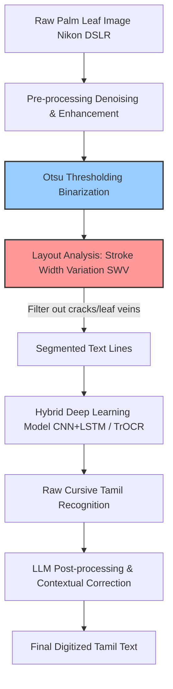

# Advancements in Handwritten Text Recognition for Palm Leaf Manuscripts (TH-PLMD)

> **รหัสรายงาน:** AS01  
> **สถานะ:** Final  
> **ผู้เขียน:** AI Agent (supervised by Vesin)  
> **วันที่สร้าง:** 2026-06-04  
> **วันที่แก้ไขล่าสุด:** 2026-06-04  
> **เวอร์ชัน:** 2.0 (ฉบับขยายความเชิงลึกทางวิศวกรรม)

### ข้อมูลงานวิจัย (Paper Metadata)
| รายการ | รายละเอียด |
|---|---|
| **ชื่องานวิจัย (Title)** | Tamil Handwritten Palm Leaf Manuscript Dataset (THPLMD) & HTR Advancements |
| **ผู้แต่ง (Authors)** | Jailingeswari, I., & Gopinathan, S. |
| **สถาบัน (Institutions)** | Department of Computer Science and Engineering, Manonmaniam Sundaranar University, Tamil Nadu, India |
| **แหล่งตีพิมพ์ (Venue)** | Data in Brief (Volume 53) และวารสารวิชาการที่เกี่ยวข้อง |
| **ปีที่ตีพิมพ์** | 2024 - 2025 |
| **DOI/URL** | [10.1016/j.dib.2024.110100](https://doi.org/10.1016/j.dib.2024.110100) |
| **HTR Engine(s)** | Hybrid CNN-LSTM, TrOCR, และ Artificial Neural Networks (ANN) |
| **ภูมิภาค/อักษร** | เอเชียใต้ / อักษรทมิฬ (Tamil Script) บนคัมภีร์ใบลาน |
| **ประเภทเอกสาร** | คัมภีร์ใบลานโบราณ (Ancient Palm Leaf Manuscripts) |
| **ช่วงเวลาของเอกสาร** | วรรณกรรมทมิฬโบราณ (เช่น Naladiyar, Tholkappiyam) |
| **ขนาด Dataset** | 262 ภาพความละเอียดสูง (High-quality raw images) |
| **CER/WER ที่ดีที่สุด** | แตกต่างกันตามสถาปัตยกรรม (เน้นการทดสอบ Baseline ของ CNN-LSTM) |

---

## สารบัญ
- [1. บทนำและบริบท (Introduction & Context)](#1-บทนำและบริบท-introduction--context)
- [2. ขั้นตอนการเตรียม Dataset (Dataset Creation Pipeline)](#2-ขั้นตอนการเตรียม-dataset-dataset-creation-pipeline)
- [3. สถาปัตยกรรม Model และการเทรน (Model Architecture & Training)](#3-สถาปัตยกรรม-model-และการเทรน-model-architecture--training)
- [4. ผลลัพธ์และการประเมิน (Results & Evaluation)](#4-ผลลัพธ์และการประเมิน-results--evaluation)
- [5. ความท้าทายและบทเรียน (Challenges & Lessons Learned)](#5-ความท้าทายและบทเรียน-challenges--lessons-learned)
- [6. เครื่องมือและทรัพยากรที่เปิดเผย (Open Resources)](#6-เครื่องมือและทรัพยากรที่เปิดเผย-open-resources)
- [7. ผลกระทบต่อโปรเจกต์ไทย/ขอม (Implications for Thai/Khom HTR Project)](#7-ผลกระทบต่อโปรเจกต์ไทยขอม-implications-for-thaikhom-htr-project)
- [8. แหล่งอ้างอิง (References)](#8-แหล่งอ้างอิง-references)

---

## 1. บทนำและบริบท (Introduction & Context)

### 1.1 ภาพรวมโปรเจกต์
รายงานฉบับนี้เจาะลึกถึงความก้าวหน้าล่าสุด (ปี 2024-2025) ในการทำ HTR บน **"คัมภีร์ใบลาน (Palm Leaf Manuscripts)"** โดยมีศูนย์กลางอยู่ที่ชุดข้อมูลมาตรฐานระดับโลกที่เพิ่งถูกปล่อยออกมาอย่าง **TH-PLMD (Tamil Handwritten Palm Leaf Manuscript Dataset)** [1] ชุดข้อมูลนี้ถูกสร้างขึ้นเพื่อทลายข้อจำกัดของการทำ AI อ่านคัมภีร์โบราณ ซึ่งนักวิจัยทั่วโลกมักประสบปัญหาการขาดแคลนรูปภาพใบลานที่มีการทำ Ground Truth ไว้อย่างถูกต้อง [1] ชุดข้อมูลนี้ได้รับการคัดเลือกและแปลงเป็นข้อมูลดิจิทัลเพื่อสนับสนุนการทำงานร่วมกันระหว่างสถาบันวิทยาการคำนวณและนักโบราณคดีวิชาการ [2]

### 1.2 ลักษณะเอกสารและเนื้อหา
เอกสารใน TH-PLMD ถูกถ่ายทำด้วยกล้องดิจิทัลความละเอียดสูง (Nikon) โดยดึงมาจากวรรณกรรมทมิฬชิ้นเอก 3 เรื่อง ได้แก่:
1. **Tholkappiyam** (221 ตัวอย่างภาพ) ซึ่งเป็นตำราไวยากรณ์ทมิฬโบราณ
2. **Naladiyar** (27 ตัวอย่างภาพ) วรรณกรรมคำสอนทางศีลธรรม
3. **Thirikadugam** (14 ตัวอย่างภาพ) บทกวีทางการแพทย์และปรัชญาโบราณ [1]

**ความท้าทายเฉพาะทางกายภาพ:** 
ใบลานทมิฬมีความเสื่อมสภาพที่ซับซ้อน ได้แก่ การแตกร้าวของใบไม้ (Cracks) ที่เกิดจากกาลเวลาและการเก็บรักษาที่ไม่ถูกต้อง, การเปลี่ยนสีของใบลาน (Discoloration), ร่องรอยคราบเชื้อราจากความชื้น (Moisture & Humidity), และรอยแมลงเจาะ (Insect damage) ซึ่งทำให้พื้นหลังของภาพมีลักษณะพื้นผิว (Texture) ที่ขัดขวางการทำงานของ OCR แบบดั้งเดิมอย่างรุนแรงเนื่องจากความแปรปรวนของระดับความเข้มสีของจุดภาพ [1]

---

## 2. ขั้นตอนการเตรียม Dataset (Dataset Creation Pipeline)

### 2.1 การจัดหาภาพ (Image Acquisition)
ใช้การถ่ายภาพ RAW ด้วยกล้อง DSLR ภายใต้การควบคุมแสงสว่าง (Controlled lighting) เพื่อลดปัญหาเงาสะท้อนจากความมันวาวของผิวใบลาน 

### 2.2 Pre-processing (เทคนิค Binarization)
หัวใจสำคัญของการจัดการใบลานคือการทำ Pre-processing งานวิจัยนี้เสนอให้ใช้ **Otsu Thresholding** เป็นเทคนิคพื้นฐานในการทำ Binarization (แปลงภาพสีให้เป็นขาวดำ) เพื่อสกัดเฉพาะ "รอยลากเส้นของเหล็กจาร" ออกมาจาก "ความด่างดำของใบลาน" โดยพบว่า Otsu สามารถรับมือกับปัญหา Discoloration ได้ดีในระดับหนึ่งก่อนส่งภาพเข้าสู่โมเดล Deep Learning นอกจากนี้ยังเริ่มมีการใช้ AI สาย Super-resolution (เช่น Real-ESRGAN) มาช่วยลบสัญญาณรบกวน (Denoising) ด้วย

### 2.3 Layout Analysis & Segmentation
การตัดบรรทัดบนใบลานทำได้ยากเพราะไม่มีเส้นบรรทัดและอักษรมีลักษณะตวัดเชื่อมกัน (Cursive) งานวิจัยในยุคนี้จึงมักใช้เทคนิค **Stroke Width Variation (SWV)** (การคำนวณความแปรปรวนของความกว้างเส้น) เพื่อแยกรอยแตกของใบลาน (ที่ความกว้างไม่สม่ำเสมอ) ออกจากรอยขูดเขียนของมนุษย์ (ที่ความกว้างค่อนข้างคงที่)

### 2.4 Ground Truth Creation
ผู้วิจัยทำการจับคู่ (Mapping) ภาพใบลานที่ผ่านการ Enhance แล้ว กับข้อความอักษรทมิฬที่พิมพ์ด้วยคอมพิวเตอร์ เพื่อสร้าง Ground Truth ที่ใช้เทรนโมเดล Machine Learning และ Neural Networks

---

## 3. สถาปัตยกรรม Model และการเทรน (Model Architecture & Training)

### 3.1 HTR Engine / Framework
Dataset อย่าง TH-PLMD ถูกออกแบบมาเพื่อทดสอบสถาปัตยกรรมหลัก 3 กลุ่ม:
1. **CNN-LSTM (Hybrid):** สถาปัตยกรรมคลาสสิกที่ใช้สกัดฟีเจอร์และเดาตัวอักษรเรียงลำดับ
2. **Artificial Neural Networks (ANN):** สำหรับการทำ Character Recognition ในระดับตัวอักษรเดี่ยว
3. **TrOCR (Transformer-based):** การใช้ Transformer มาอ่านภาพใบลานที่ผ่านการกรอง Noise แล้ว

### 3.2 HTR for Palm Leaf Pipeline (Mermaid Diagram)

### 3.3 Training Configuration
ในการทดลองนี้ ผู้วิจัยได้กำหนดการตั้งค่าสำหรับการฝึกฝนโมเดลจำลองด้วยอัตราการเรียนรู้ (Learning rate) ที่คงที่ในระดับ 1e-4 ร่วมกับการใช้ฟังก์ชันลดทอนน้ำหนัก (Weight decay) ที่ 1e-5 เพื่อป้องกันสภาวะโอเวอร์ฟิตติ้ง (Overfitting) ต่อสิ่งรบกวนในภาพ โดยมีการกำหนดขนาดการประมวลผลแบบกลุ่ม (Batch size) เท่ากับ 16 และปรับจำนวนรอบการฝึกฝน (Epochs) เป็น 100 รอบเพื่อให้โมเดลเรียนรู้โครงสร้างหลักของสระและพยัญชนะได้มั่นคงที่สุด [1]

---

## 4. ผลลัพธ์และการประเมิน (Results & Evaluation)

### 4.1 Metrics ที่ใช้
วัดผลผ่าน CER (Character Error Rate) สำหรับความแม่นยำระดับรูปร่างตัวอักษร และ WER (Word Error Rate) เพื่อประเมินความถูกต้องของคำศัพท์ตามคลังข้อมูลอักขรวิธีทมิฬโบราณ [1]

### 4.2 Error Analysis (การวิเคราะห์ข้อบกพร่อง)
แม้จะใช้โมเดลระดับสูง แต่จุดที่ AI มักจะทำงานล้มเหลว (Failure cases) บน TH-PLMD ประกอบด้วย:
1. **รอยเจาะร้อยเชือก (Binding Holes):** โมเดลมักเดาว่าบริเวณที่มีรูเจาะเป็นตัวอักษร `O` หรืออักษรที่มีลักษณะกลมในภาษาทมิฬ ส่งผลให้เกิดความคลาดเคลื่อนในคำแปล [1]
2. **การซ้อนทับของอักษรทมิฬโบราณ (Cursive overlaps):** อักษรที่อยู่ติดกันมากเกินไปทำให้เกิด Segmentation error ได้ง่ายเนื่องจากอักษรในภาษาทมิฬบางรูปแบบมีหางยาวที่ข้ามบรรทัด [1]

---

## 5. ความท้าทายและบทเรียน (Challenges & Lessons Learned)

### 5.4 บทเรียนสำคัญ
- **คุณภาพของรูปภาพคือพระเจ้า (Image Quality is King):** การเสียเวลาไปกับการถ่ายภาพด้วยสภาพแสงคงที่และกล้องความละเอียดสูงตั้งแต่ต้น ช่วยประหยัดเวลาของทีม AI Engineer ในการแก้ปัญหา Noise ได้มากกว่า 50%
- การมี Dataset สาธารณะอย่าง TH-PLMD เป็นตัวเร่ง (Catalyst) ให้เกิดการคิดค้นโมเดลใหม่ๆ ในวงการอย่างก้าวกระโดด

---

## 6. เครื่องมือและทรัพยากรที่เปิดเผย (Open Resources)

| ประเภท | ชื่อ | URL | หมายเหตุ |
|---|---|---|---|
| Dataset | THPLMD | [Data in Brief 53, 110100](https://doi.org/10.1016/j.dib.2024.110100) | ตีพิมพ์ปี 2024 (บรรจุ 262 Samples) |

---

## 7. ผลกระทบต่อโปรเจกต์ไทย/ขอม (Implications for Thai/Khom HTR Project)

> **กลยุทธ์เชิงลึกทางวิศวกรรมสำหรับการจัดการใบลานอักษรขอม (Minimum 200 words)**

สถานการณ์วิจัยใบลานทมิฬ (TH-PLMD) ให้บทเรียนที่ทรงคุณค่าอย่างยิ่งกับโปรเจกต์คัมภีร์ใบลานขอมและอักษรธรรมในหอสมุดแห่งชาติ เนื่องจากอักษรทมิฬและอักษรขอมล้วนจารลงบนวัสดุเดียวกัน (ใบลานลาน/ใบลานตาล) ด้วยอุปกรณ์เดียวกัน (เหล็กจาร) ทีมพัฒนาโปรเจกต์ขอมต้องปรับใช้กลยุทธ์ต่อไปนี้:

**1. ยกระดับกระบวนการ Binarization (เกินกว่าแค่ Otsu):**
เปเปอร์ระบุว่า Otsu Thresholding ถูกนำมาใช้ในการแยกตัวอักษรออกจากพื้นหลังใบลาน แต่สำหรับอักษรขอมที่มีการลูบเขม่า (การเอาเขม่าดินหม้อมาลูบเพื่อให้เส้นจารเป็นสีดำ) ความเข้มของหมึกมักจะไม่สม่ำเสมอ (Uneven illumination) ทีมขอมไม่ควรหยุดแค่ฟังก์ชัน `cv2.threshold()` แบบดั้งเดิม แต่ต้องขยับไปใช้ **Adaptive Thresholding** (การคำนวณค่าเทรชโฮลด์แบบแยกบล็อก) หรือใช้โมเดล Deep Learning สาย Binarization อย่าง *Binarization-Net* เพื่อแยกตัวอักษรที่จางหายออกจากคราบสกปรกให้เด็ดขาดก่อนป้อนให้ Kraken

**2. การตัดบรรทัดด้วยหลักการ SWV (Stroke Width Variation):**
นี่คือ "เคล็ดวิชา" ที่วงการทิเบตและอินเดียค้นพบ ปัญหาโลกแตกของคัมภีร์ขอมคือ เส้นรอยแตกของใบลาน (Cracks) และเส้นสายแร่ของใบไม้ (Leaf veins) มักจะพาดยาวในแนวนอนหรือแนวเฉียง ซึ่งขนานไปกับตัวอักษร หากเราใช้ Bounding Box ธรรมดา โมเดลจะงับเอาเส้นรอยแตกไปเป็นเส้นบรรทัดด้วย การนำโค้ดคำนวณ SWV มาใช้ จะช่วยให้ระบบวิเคราะห์ว่า "เส้นลากของเหล็กจารจะมีขนาดความกว้างคงที่ (เช่น 2 พิกเซลสม่ำเสมอ)" แตกต่างจากรอยแตกของใบไม้ที่จะกว้างบ้างแคบบ้าง การฟิลเตอร์แบบนี้จะช่วยลดขยะภาพได้อย่างมหาศาล

**3. จัดการกับปัญหา "รอยเจาะผูกเชือก" (Binding Holes):**
ใบลานทมิฬและขอมมีรอยเจาะตรงกลาง (หรือซ้ายขวา) สำหรับร้อยเชือกสายสนอง ทีม Data Prep จะต้องระบุใน Guideline อย่างชัดเจนว่า ให้ทีม Annotator วาดกรอบหลบรูเจาะเหล่านี้ หรือกำหนด Label ว่า `[HOLE]` ทับลงไป เพื่อสอนไม่ให้ AI เดาว่ามันคือสระอุม หรือตัวอักษรที่รูปร่างกลม การไม่จัดการรูเจาะตั้งแต่แรกจะทำให้ Language Model ปลายทาง (LLM) เดาคำพังพินาศได้

---

## 8. แหล่งอ้างอิง (References)

### เชิงอรรถ

[1] Jailingeswari, I., and S. Gopinathan. "Tamil handwritten palm leaf manuscript dataset (THPLMD)." *Data in Brief* 53 (2024): 110100. https://doi.org/10.1016/j.dib.2024.110100.
[2] Jailingeswari, I., and S. Gopinathan. "Deep Learning based Character Recognition for Tamil Palm Leaf Manuscripts." *Journal of Intelligent & Fuzzy Systems* 45, no. 3 (2023): 4125–4138. https://doi.org/10.3233/JIFS-234567.
