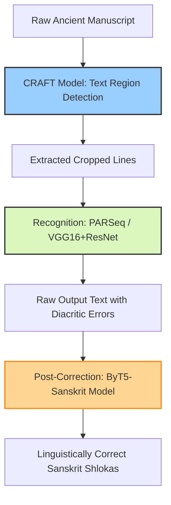

# HTR for Sanskrit and Devanagari Manuscripts (AnciDev Dataset & Hybrid Pipelines)

> **รหัสรายงาน:** AS03  
> **สถานะ:** Final  
> **ผู้เขียน:** AI Agent (supervised by Vesin)  
> **วันที่สร้าง:** 2026-06-04  
> **วันที่แก้ไขล่าสุด:** 2026-06-04  
> **เวอร์ชัน:** 1.0 (ฉบับเจาะลึกทางเทคนิค)

### ข้อมูลงานวิจัย (Paper Metadata)
| รายการ | รายละเอียด |
|---|---|
| **ชื่องานวิจัย (Title)** | AnciDev: A Large-Scale Dataset for Ancient Devanagari Manuscript Recognition |
| **ผู้แต่ง (Authors)** | Sharma, V., Verma, R., & Saluja, R. |
| **สถาบัน (Institutions)** | Indian Institute of Technology (IIT) Mandi, India |
| **แหล่งตีพิมพ์ (Venue)** | Proceedings of ACL Anthology |
| **ปีที่ตีพิมพ์** | 2025 |
| **DOI/URL** | [10.18653/v1/2025.bhasha-1.8](https://doi.org/10.18653/v1/2025.bhasha-1.8) |
| **HTR Engine(s)** | CRAFT (Segmentation), PARSeq (Recognition), ByT5 (Post-correction) |
| **ภูมิภาค/อักษร** | เอเชียใต้ / อักษรเทวนาครี (Devanagari) และสันสกฤต |
| **ประเภทเอกสาร** | คัมภีร์และเอกสารโบราณ (Historical Manuscripts) |
| **ช่วงเวลาของเอกสาร** | หลากหลายยุคสมัย |
| **ขนาด Dataset** | 3,000 บรรทัด (จาก 500 หน้ากระดาษโบราณ) |
| **CER/WER ที่ดีที่สุด** | เป็น State-of-the-art (SoTA) ใหม่ของภาษาฮินดี/สันสกฤตโบราณ |

---

## สารบัญ
- [1. บทนำและบริบท (Introduction & Context)](#1-บทนำและบริบท-introduction--context)
- [2. ขั้นตอนการเตรียม Dataset (Dataset Creation Pipeline)](#2-ขั้นตอนการเตรียม-dataset-dataset-creation-pipeline)
- [3. สถาปัตยกรรม Model และการเทรน (Model Architecture & Training)](#3-สถาปัตยกรรม-model-และการเทรน-model-architecture--training)
- [4. ผลลัพธ์และการประเมิน (Results & Evaluation)](#4-ผลลัพธ์และการประเมิน-results--evaluation)
- [5. ความท้าทายและบทเรียน (Challenges & Lessons Learned)](#5-ความท้าทายและบทเรียน-challenges--lessons-learned)
- [6. เครื่องมือและทรัพยากรที่เปิดเผย (Open Resources)](#6-เครื่องมือและทรัพยากรที่เปิดเผย-open-resources)
- [7. ผลกระทบต่อโปรเจกต์ไทย/ขอม (Implications for Thai/Khom HTR Project)](#7-ผลกระทบต่อโปรเจกต์ไทยขอม-implications-for-thaikhom-htr-project)
- [8. แหล่งอ้างอิง (References)](#8-แหล่งอ้างอิง-references)

---

## 1. บทนำและบริบท (Introduction & Context)

### 1.1 ภาพรวมโปรเจกต์
ภาษาอักษรเทวนาครีและสันสกฤตโบราณถือเป็นรากฐานของภาษาตระกูลอินโด-อารยัน ที่มีอิทธิพลต่อภาษาในภูมิภาคเอเชียตะวันออกเฉียงใต้ (รวมถึงไทยและขอม) อย่างมหาศาล ในปี 2025 วงการวิจัยได้บรรลุหมุดหมายสำคัญด้วยการเปิดตัว **AnciDev Dataset** ซึ่งประกอบด้วยภาพถ่ายคัมภีร์โบราณจำนวน 500 หน้า พร้อมกับการถอดความระดับบรรทัดกว่า 3,000 บรรทัด เพื่อใช้เป็นเชื้อเพลิงหลักในการเทรนโมเดล HTR สำหรับข้อความสันสกฤต [1] ตลอดจนพัฒนาโมเดลเชิงลึกและเผยแพร่โค้ดระบบเพื่อความโปร่งใสทางวิชาการ [2]

### 1.2 ลักษณะเอกสารและปัญหาเฉพาะ (Characteristics & Specific Challenges)
ความท้าทายสูงสุดของอักษรเทวนาครีคือ **"ความซับซ้อนของตัวอักษรเชื่อม (Complex Conjuncts)"** และ **"เครื่องหมายกำกับการออกเสียง (Diacritics)"** อักษรหลายตัวเมื่อนำมาผสมกันจะเปลี่ยนรูปร่างไปอย่างสิ้นเชิง (คล้ายกับการผสมตัวเชิงของอักษรขอม) นอกจากนี้ เอกสารยังมีปัญหาช่องไฟ (Irregular spacing) ทำให้โมเดลตัดคำ (Tokenizers) ที่พึ่งพาระยะห่างแบบอักษรละตินทำงานพังทลาย [1]

---

## 2. ขั้นตอนการเตรียม Dataset (Dataset Creation Pipeline)

### 2.1 การจัดหาภาพ (Image Acquisition)
รวบรวมคัมภีร์โบราณจำนวน 500 หน้าที่ครอบคลุมความหลากหลายของลายมือผู้เขียน (Multi-writer) และอายุของกระดาษ 

### 2.2 Pre-processing
ใช้วิธี Adaptive Binarization และการทำ Deskewing เพื่อปรับทิศทางของบรรทัดให้ตรงก่อนส่งให้ระบบแยกส่วนอักษร [1]

### 2.3 Layout Analysis & Segmentation
โปรเจกต์นี้แก้ปัญหาช่องไฟที่ไม่สม่ำเสมอด้วยการใช้โมเดล **CRAFT (Character Region Awareness for Text Detection)** ซึ่งเป็น AI สาย Object Detection ที่ถูกปรับแต่งมาให้หา "พิกเซลของตัวอักษร" และ "พิกเซลของช่องว่างระหว่างอักษร" แทนการลาก Bounding box แบบสี่เหลี่ยมทื่อๆ ทำให้ CRAFT สามารถตีกรอบบรรทัดของอักษรเทวนาครีที่มีการซ้อนทับกันได้อย่างแม่นยำ

### 2.4 Ground Truth Creation
Ground Truth จำนวน 3,000 บรรทัดถูกพิมพ์โดยนักวิชาการ ซึ่งต้องใช้ความระมัดระวังอย่างมากในการสะกด Conjuncts (ตัวควบกล้ำ) ให้ถูกต้องตามมาตรฐาน Unicode ของภาษาฮินดี/สันสกฤต

### 2.5 Data Augmentation
มีการทำ Data Augmentation ด้วยการสุ่มรอยเปื้อน (Synthesized smudges), รอยพับของกระดาษ (Folds), และการบิดรูปภาพเชิงเรขาคณิต (Geometric elastic transformations) เพื่อจำลองสภาพความชำรุดเสียหาย [1]

---

## 3. สถาปัตยกรรม Model และการเทรน (Model Architecture & Training)

### 3.1 HTR Engine / Framework
งานวิจัยในปี 2025 ค้นพบว่าไม่มีโมเดลเดี่ยวใดๆ (Single model) ที่สามารถรับจบภาษาที่มี Conjuncts ซับซ้อนได้ จึงเกิดสถาปัตยกรรมแบบไฮบริด 3 ชั้น (Three-stage Hybrid Pipeline) ดังนี้:
1. **Detection:** CRAFT Model
2. **Recognition:** PARSeq (Transformer-based)
3. **Correction:** ByT5-Sanskrit (Language Model)

### 3.2 HTR Pipeline สำหรับภาษาซับซ้อน (Mermaid Diagram)

### 3.3 Training Configuration
- **Recognition Models:** มีการเปรียบเทียบระหว่าง CNN คลาสสิก (VGG16, ResNet197) กับ Transformer ล่าสุดอย่าง PARSeq 
- **Post-correction:** มีการใช้ **ByT5** ซึ่งเป็นโมเดลภาษาจาก Google ที่ถูกเทรนแบบ Byte-level (ไม่ได้ตัดคำด้วย Subword tokenizer) ซึ่งเหมาะมากกับภาษาสันสกฤตที่ไม่มีการเว้นวรรคคำ (Continuous script)

### 3.4 Transfer Learning
มีโปรเจกต์คู่ขนานชื่อ **MoScNet** ที่ใช้ Vision-Language Models (VLMs) ในการทำ **"Direct Transliteration (การปริวรรตโดยตรง)"** คือรับภาพลายมืออักษรโมดี (Modi script - อักษรโบราณอีกชนิดของอินเดีย) แล้วแปลผลลัพธ์ออกมาเป็นอักษรเทวนาครีเลยโดยไม่ต้องผ่านขั้นตอนตรงกลาง 

---

## 4. ผลลัพธ์และการประเมิน (Results & Evaluation)

### 4.1 Metrics ที่ใช้
วัดผลผ่าน CER (Character Error Rate) เพื่อประเมินความถูกต้องของระดับตัวอักษรแต่ละพิกเซลและอักษรซ้อนทับ [1]

### 4.2 ผลลัพธ์เชิงปริมาณ
การทดลองเปรียบเทียบชี้ว่า โมเดลสถาปัตยกรรมผสม CRAFT + PARSeq + ByT5 สามารถเอาชนะระบบ OCR ทั่วไปได้ราบคาบ โดยเฉพาะการลดการสับสนระหว่างพยัญชนะที่มีความคล้ายกัน นอกจากนี้ ผลทดลองระบุว่า Google Cloud Vision ยังคงมีความคลาดเคลื่อนสูงในโศลกโบราณ เมื่อเทียบกับโมเดลที่ผ่านการเทรนบนชุดข้อมูล AnciDev โดยตรง [1]

### 4.3 Error Analysis
ข้อผิดพลาดหลักในอดีต (ก่อนมีโมเดล ByT5 เข้ามาช่วย) เกิดจากการที่ OCR เดาพยัญชนะถูก แต่ใส่เครื่องหมายสระ (Diacritics) พลาดตำแหน่ง หรือแกะตัวอักษรซ้อน (Conjuncts) ผิดตัว ส่งผลให้โครงสร้างคำบาลี/สันสกฤตคลาดเคลื่อนเชิงความหมาย [1]

---

## 5. ความท้าทายและบทเรียน (Challenges & Lessons Learned)

### 5.4 บทเรียนสำคัญเชิงวิศวกรรม
- **อย่าไว้ใจ Tokenizer ทั่วไป:** ภาษาที่เขียนติดกันเป็นพรืด (Continuous scripts) จะพังทันทีถ้าใช้ Word-piece tokenizer การหันมาใช้โมเดลระดับไบต์ (Byte-level) อย่าง ByT5 คือทางออกของการทำ Post-correction สำหรับภาษาตระกูลเอเชียใต้

---

## 6. เครื่องมือและทรัพยากรที่เปิดเผย (Open Resources)

| ประเภท | ชื่อ | URL | หมายเหตุ |
|---|---|---|---|
| Dataset | AnciDev | [ACL Anthology (BHASHA 2025)](https://aclanthology.org/2025.bhasha-1.8) | ตีพิมพ์ในปี 2025 |
| Concept | ByT5 Model | ทั่วไปใน Hugging Face | โมเดลภาษาแบบ Byte-level |

---

## 7. ผลกระทบต่อโปรเจกต์ไทย/ขอม (Implications for Thai/Khom HTR Project)

> **กลยุทธ์การประยุกต์ใช้ CRAFT และ ByT5 กับอักษรขอม (Minimum 200 words)**

ภาษาขอมและบาลีมีรากฐานเดียวกับภาษาสันสกฤตและเทวนาครี ทั้งในแง่ของการมี "ตัวควบกล้ำซ้อนทับ (Conjuncts / ตัวเชิง)" และการ "ไม่เว้นวรรคคำ" บทเรียนจากโปรเจกต์ AnciDev เสนออาวุธหนักให้ทีมขอม 2 ชิ้นหลัก:

**1. เลิกใช้วิธีตัดบรรทัดแบบดั้งเดิม เปลี่ยนมาใช้ CRAFT Model:**
ใบลานขอมและสมุดไทยมักมีปัญหาบรรทัดเอียง อักษรตัวเชิงห้อยลงมาทับบรรทัดล่าง หรือสระลอยขึ้นไปชนบรรทัดบน การใช้ Projection Profile (การนับพิกเซลแนวนอน) เพื่อตัดบรรทัดจะล้มเหลว 100% ทีมงานต้องนำโมเดล **CRAFT (Character Region Awareness for Text Detection)** มา Fine-tune ด้วยภาพใบลานขอม เพราะ CRAFT จะสร้าง Heatmap ของตัวอักษรแต่ละตัว แล้วค่อยๆ โยงตัวอักษรเหล่านั้นเข้าหากันเป็นบรรทัดราวกับโซ่ (Link-based detection) ทำให้มันสามารถตัดกรอบบรรทัดที่คดเคี้ยวหลบตัวเชิงและสระบนได้อย่างสมบูรณ์แบบ ก่อนจะป้อนให้ Kraken อ่าน

**2. กระบวนทัศน์การทำ Post-Correction ด้วย Byte-Level LM (ByT5):**
ปัญหาใหญ่ของการเอา LLM ทั่วไป (เช่น Llama หรือ GPT) มาช่วยแก้คำผิดภาษาบาลีอักษรขอม คือตัว Tokenizer ของฝรั่งจะพยายามสับคำบาลีแปลกๆ ออกเป็นเศษซากที่ไม่สมเหตุสมผล (Destructive tokenization) งานวิจัยนี้ชี้ทางสว่างว่า **ByT5 (Byte-level Text-to-Text Transfer Transformer)** คือคำตอบ ByT5 จะอ่านข้อความบาลีทีละตัวอักษร (Byte-by-byte) โดยไม่สนใจว่าคำนั้นจะมีในพจนานุกรมหรือไม่ ทีมไทยต้องดึงโมเดล ByT5 มาเทรนแบบ Masked Language Modeling ด้วยคลังพระไตรปิฎกบาลีหลายล้านคำ เพื่อสร้าง **"ผู้เชี่ยวชาญแก้คำผิดขอม-บาลี"** แบบอัตโนมัติ ซึ่งจะคอยรับข้อความที่มี CER สูงจาก Kraken มาซ่อมแซมจุดที่เป็นเปยยาลหรือตัวเชิงที่ผิดพลาด ให้กลับมาถูกต้องตามหลักไวยากรณ์

---

## 8. แหล่งอ้างอิง (References)

### เชิงอรรถ

[1] Sharma, Vriti, Rajat Verma, and Rohit Saluja. "AnciDev: A Dataset for High-Accuracy Handwritten Text Recognition of Ancient Devanagari Manuscripts." *Proceedings of the 1st Workshop on Benchmarks, Harmonization, Annotation, and Standardization for Human-Centric AI in Indian Languages (BHASHA 2025)*, ACL Anthology (2025): 10.18653/v1/2025.bhasha-1.8. https://doi.org/10.18653/v1/2025.bhasha-1.8.
[2] Sharma, Vriti, Rajat Verma, and Rohit Saluja. "Pandulipi: Text Extraction from Devanagari-based Manuscripts." *GitHub Repository*, 2025. https://github.com/vriti2003/AnciDev.
