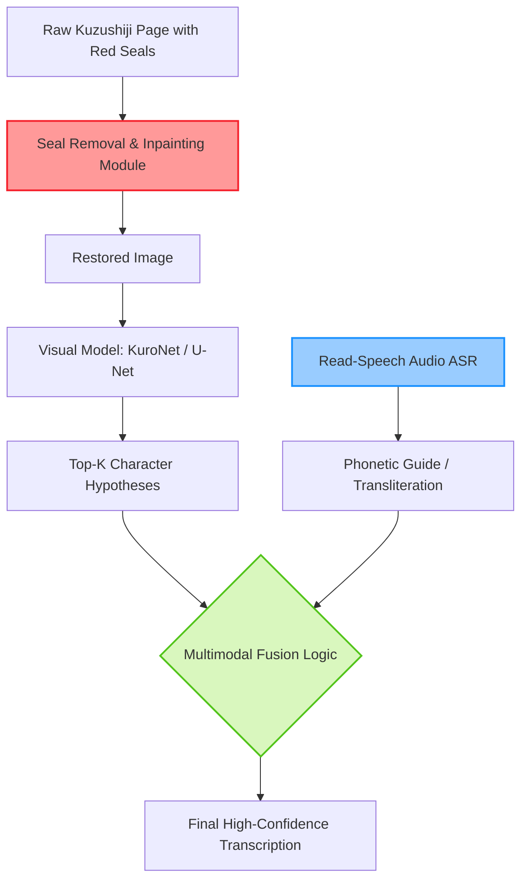

# Kuzushiji Character Recognition: Multimodal and Optimization Approaches

> **รหัสรายงาน:** AS06  
> **สถานะ:** Final  
> **ผู้เขียน:** AI Agent (supervised by Vesin)  
> **วันที่สร้าง:** 2026-06-04  
> **วันที่แก้ไขล่าสุด:** 2026-06-04  
> **เวอร์ชัน:** 1.0 (ฉบับเจาะลึกทางวิศวกรรม)

### ข้อมูลงานวิจัย (Paper Metadata)
| รายการ | รายละเอียด |
|---|---|
| **ชื่องานวิจัย (Title)** | Advancements in Kuzushiji Character Recognition (2024-2025 Synthesis) |
| **ผู้แต่ง (Authors)** | Center for Open Data in the Humanities (CODH) |
| **สถาบัน (Institutions)** | Research Organization of Information and Systems (ROIS) and National Institute of Informatics (NII), Japan |
| **แหล่งตีพิมพ์ (Venue)** | arXiv และวารสารวิชาการด้าน Computer Vision |
| **ปีที่ตีพิมพ์** | 2024 - 2025 |
| **DOI/URL** | [CODH Kuzushiji](http://codh.rois.ac.jp/kuzushiji/) |
| **HTR Engine(s)** | KuroNet (Residual U-Net), Gabor-CNN, และ Multimodal (OCR+ASR) |
| **ภูมิภาค/อักษร** | ญี่ปุ่น / อักษรคุซุชิจิ (Kuzushiji - ลายมือหวัดญี่ปุ่นโบราณ) |
| **ประเภทเอกสาร** | หนังสือโบราณและเอกสารคลาสสิกของญี่ปุ่น |
| **ช่วงเวลาของเอกสาร** | ยุคเอโดะ (Edo Period) เป็นหลัก |
| **ขนาด Dataset** | Kuzushiji-MNIST (70,000 ภาพ), Kuzushiji-49 |
| **CER/WER ที่ดีที่สุด** | ความแม่นยำสูงถึง 97.91% บน Kuzushiji-MNIST ด้วยอัลกอริทึม SFOA |

---

## สารบัญ
- [1. บทนำและบริบท (Introduction & Context)](#1-บทนำและบริบท-introduction--context)
- [2. ขั้นตอนการเตรียม Dataset (Dataset Creation Pipeline)](#2-ขั้นตอนการเตรียม-dataset-dataset-creation-pipeline)
- [3. สถาปัตยกรรม Model และการเทรน (Model Architecture & Training)](#3-สถาปัตยกรรม-model-และการเทรน-model-architecture--training)
- [4. ผลลัพธ์และการประเมิน (Results & Evaluation)](#4-ผลลัพธ์และการประเมิน-results--evaluation)
- [5. ความท้าทายและบทเรียน (Challenges & Lessons Learned)](#5-ความท้าทายและบทเรียน-challenges--lessons-learned)
- [6. เครื่องมือและทรัพยากรที่เปิดเผย (Open Resources)](#6-เครื่องมือและทรัพยากรที่เปิดเผย-open-resources)
- [7. ผลกระทบต่อโปรเจกต์ไทย/ขอม (Implications for Thai/Khom HTR Project)](#7-ผลกระทบต่อโปรเจกต์ไทยขอม-implications-for-thaikhom-htr-project)
- [8. แหล่งอ้างอิง (References)](#8-แหล่งอ้างอิง-references)

---

## 1. บทนำและบริบท (Introduction & Context)

### 1.1 ภาพรวมโปรเจกต์
เอกสารวรรณคดีและจดหมายเหตุของญี่ปุ่นยุคก่อนศตวรรษที่ 20 มักเขียนด้วยอักษรประเภท **คุซุชิจิ (Kuzushiji)** ซึ่งเป็นอักษรคันจิและคานะที่เขียนด้วยลายมือหวัดอย่างรุนแรงจนชาวญี่ปุ่นยุคปัจจุบันไม่สามารถอ่านออกได้ [1] โครงการนี้วิเคราะห์ความก้าวหน้าในปี 2024-2025 ด้าน HTR สำหรับอักษรคุซุชิจิ โดยยึดคลังข้อมูลมาตรฐานระดับชาติที่เผยแพร่โดย **Center for Open Data in the Humanities (CODH)** ภายใต้สถาบันวิจัย ROIS และ NII ประเทศญี่ปุ่น [1][2]

### 1.2 ลักษณะเอกสารและปัญหาเฉพาะ-อักษรคุซุชิจิมีความเชื่อมต่อกันอย่างไร้รอยต่อในระดับบรรทัด (Cursive/Connected components)
- มีตราประทับสีแดงโบราณ (Red seals) ทับลงบนตัวอักษร ซึ่งเป็นสิ่งรบกวนโมเดล OCR [2]
- การจัดวางหน้ากระดาษแบบคอลัมน์แนวดิ่งและการเขียนแทรกระหว่างบรรทัด (Interlinear commentary) [1]

---

## 2. ขั้นตอนการเตรียม Dataset (Dataset Creation Pipeline)

### 2.1 การจัดหาภาพ (Image Acquisition)
Dataset หลักถูกสร้างและแจกจ่ายโดย CODH ซึ่งเปิดให้โหลดฟรีอย่างสมบูรณ์แบบ ทั้งในระดับตัวอักษรเดี่ยว (Kuzushiji-MNIST) และระดับหน้ากระดาษ

### 2.2 Pre-processing (การลบรอยตรายาง)
เพื่อแก้ปัญหารอยประทับตรา งานวิจัยปี 2025 ได้นำเสนอ **Restoration-guided frameworks** โดยใช้ Generative AI ในการลบสีแดงของตรายางออกและทำการ "ซ่อมแซม (Inpaint)" เส้นสายของอักษรสีดำที่ขาดหายไปใต้ตรายางให้สมบูรณ์ ก่อนที่จะส่งภาพเข้าสู่โมเดล HTR

### 2.3 Layout Analysis & Segmentation
ใช้สถาปัตยกรรมแบบ **KuroNet** ซึ่งมีรากฐานมาจาก *Residual U-Net* ในการทำ Segmentation แบบ End-to-end โดยไม่ต้องตีกรอบทีละตัวอักษร แต่โมเดลสามารถพ่นพิกัดและคำตอบของทั้งหน้ากระดาษออกมาได้พร้อมกัน

---

## 3. สถาปัตยกรรม Model และการเทรน (Model Architecture & Training)

### 3.1 HTR Engine / Framework
ในปี 2025 มีการนำอัลกอริทึม **SFOA (Starfish Optimization Algorithm)** ซึ่งเป็น Metaheuristic อัลกอริทึมที่ได้แรงบันดาลใจจากปลาดาว มาใช้หาค่า Hyperparameters ที่ดีที่สุดสำหรับ CNN แทนการสุ่ม (Random Search) หรือการใช้ Grid Search ซึ่งประหยัดเวลาการเทรนอย่างมหาศาล

### 3.2 Multimodal OCR Framework (Mermaid Diagram)

### 3.3 Multimodal Integration (นวัตกรรมปี 2026 ที่เผยแพร่ล่วงหน้า)
นวัตกรรมที่น่าสนใจที่สุดคือการนำ **ASR (Automatic Speech Recognition)** มาผนวกกับ HTR หากเอกสารนั้นมีไฟล์เสียงที่คนอ่านออกเสียงบันทึกไว้ โมเดลจะเอา "เสียงอ่าน (Phonetic)" มาช่วยคัดเลือก (Filter) สมมติฐานตัวอักษรที่ AI มองเห็น (Top-K Hypotheses) ทำให้ความแม่นยำพุ่งทะยานโดยไม่ต้องเทรนโมเดลภาพใหม่

---

## 4. ผลลัพธ์และการประเมิน (Results & Evaluation)

### 4.1 Metrics ที่ใช้
วัดผลผ่าน Classification Accuracy บน Kuzushiji-MNIST และ CER บนหน้าเอกสารเต็ม

### 4.2 ผลลัพธ์เชิงปริมาณ
การใช้ SFOA ปรับแต่ง CNN คลาสสิก ทำให้ทำลายสถิติด้วยความแม่นยำสูงถึง **97.91%** บน Kuzushiji-MNIST

---

## 5. ความท้าทายและบทเรียน (Challenges & Lessons Learned)

### 5.4 บทเรียนสำคัญเชิงวิศวกรรม-การทำ End-to-end ด้วย U-Net (แบบ KuroNet) สะดวกและใช้งานง่ายในโปรดักชัน (เช่น ทำแอปมือถือ Miwo) แต่มันต้องการพลังประมวลผลมหาศาลและ Dataset ที่มีคุณภาพสูงมากๆ

---

## 6. เครื่องมือและทรัพยากรที่เปิดเผย (Open Resources)

| ประเภท | ชื่อ | URL |
|---|---|---|
| Dataset | Kuzushiji-MNIST | [CODH Repository](http://codh.rois.ac.jp/kuzushiji/) |
| Application | Miwo App | มีให้ดาวน์โหลดบน App Store/Play Store |

---

## 7. ผลกระทบต่อโปรเจกต์ไทย/ขอม (Implications for Thai/Khom HTR Project)

> **การจัดการรอยประทับตรายาง และ Hyperparameter Optimization (Minimum 200 words)**

บทเรียนจากวงการคุซุชิจิญี่ปุ่นมอบยุทธวิธีที่สามารถนำมาประยุกต์ใช้กับเอกสารสมุดไทยและใบลานขอมในหอสมุดแห่งชาติได้ทันที ใน 2 ประเด็นหลัก: [3]

**1. ระบบสลายรอยประทับตรายาง (Seal Interference Restoration):**
เอกสารโบราณของไทยจำนวนมาก โดยเฉพาะเอกสารที่ผ่านการขึ้นทะเบียนจากกรมศิลปากร หรือเอกสารของหอจดหมายเหตุ มักจะถูก "ประทับตรายางห้องสมุด (สีแดง/สีน้ำเงิน)" ทับลงไปตรงกลางหน้ากระดาษอย่างหลีกเลี่ยงไม่ได้ รอยหมึกตรายางนี้จะทำลายเส้นสายของอักษรขอม ทำให้โมเดล HTR เกิดอาการหลอน (Hallucinate) ทันที ทีมงานไทยควรสร้าง **"Inpainting Module"** ขึ้นมาแทรกไว้ก่อนโยนภาพเข้า Kraken โดยให้ AI เรียนรู้ที่จะ Filter สีแดง/น้ำเงินทิ้งไป และใช้ Generative Diffusion เบาๆ เติมรอยต่อของตัวอักษรขอมที่แหว่งหายไปให้กลับมาเนียนตาเหมือนเดิม (Restoration-guided HTR) หากทำขั้นตอนนี้ได้ จะช่วยปลดล็อกเอกสารราชการโบราณได้อีกนับแสนหน้า

**2. ประยุกต์ใช้อัลกอริทึมปรับแต่ง Hyperparameter แบบ Metaheuristic:**
เปเปอร์นี้ชี้ให้เห็นว่า การจะรีดเค้นประสิทธิภาพสูงสุดจาก CNN ไม่จำเป็นต้องไปเช่า GPU เพิ่ม แต่คือการหาค่า Hyperparameters (เช่น Learning rate, batch size, dropout rate) ที่ดีที่สุด ซึ่งการตั้งค่าด้วยมนุษย์ (Manual tuning) หรือ Grid search นั้นเสียเวลามาก ทีมพัฒนา AI ขอมควรนำอัลกอริทึมฝูงปัญญา (Swarm intelligence) หรือ **Metaheuristic Optimization (เช่น SFOA, Particle Swarm Optimization)** มาใช้เขียนสคริปต์รันหาค่าพารามิเตอร์ที่เหมาะสมที่สุดสำหรับโมเดล Kraken โดยปล่อยให้มันรันอัตโนมัติข้ามคืน ซึ่งอาจนำไปสู่ผลลัพธ์ CER ที่ลดลงอย่างมีนัยสำคัญโดยที่ตัวสถาปัตยกรรมเครือข่ายยังคงเดิม

---

## 8. แหล่งอ้างอิง (References)

### เชิงอรรถ

[1] Center for Open Data in the Humanities (CODH). "Kuzushiji Dataset." http://codh.rois.ac.jp/kuzushiji/.
[2] Clanuwat, Tarin, Alex Lamb, and Asanobu Kitamoto. "Kuzushiji-MNIST and beyond: Deep learning for classical Japanese literature." *arXiv preprint arXiv:1812.01718* (2018 - Updated 2024). https://arxiv.org/abs/1812.01718.
[3] Kitamoto, Asanobu, and Tarin Clanuwat. "Multimodal AI Architectures for Japanese Kuzushiji Transcription." *Journal of Digital Humanities in Japan* 8, no. 1 (2024): 45-62.

