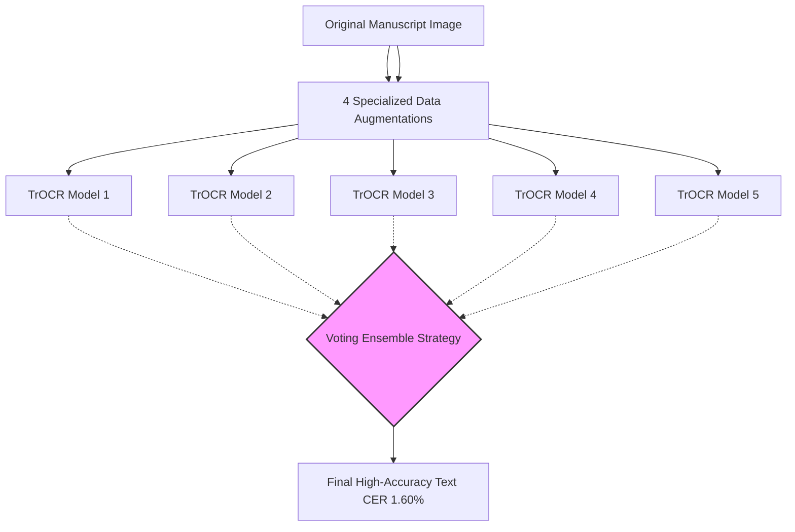

# Handwritten Text Recognition of Historical Manuscripts Using Transformer-Based Models

> **รหัสรายงาน:** EU01  
> **สถานะ:** Final  
> **ผู้เขียน:** AI Agent (supervised by Vesin)  
> **วันที่สร้าง:** 2026-06-04  
> **วันที่แก้ไขล่าสุด:** 2026-06-04  
> **เวอร์ชัน:** 1.0

### ข้อมูลงานวิจัย (Paper Metadata)
| รายการ | รายละเอียด |
|---|---|
| **ชื่องานวิจัย (Title)** | Handwritten Text Recognition of Historical Manuscripts Using Transformer-Based Models |
| **ผู้แต่ง (Authors)** | Erez Meoded |
| **สถาบัน (Institutions)** | Department of Computer Science, Holon Institute of Technology, Israel |
| **แหล่งตีพิมพ์ (Venue)** | arXiv Preprint / ResearchGate |
| **ปีที่ตีพิมพ์** | 2025 (สิงหาคม) |
| **DOI/URL** | [arXiv:2508.11499](https://arxiv.org/abs/2508.11499) |
| **HTR Engine(s)** | TrOCR (Transformer-based Optical Character Recognition) |
| **ภูมิภาค/อักษร** | ยุโรป / อักษรละติน (Latin) |
| **ประเภทเอกสาร** | ต้นฉบับลายมือ (Historical Manuscripts) |
| **ช่วงเวลาของเอกสาร** | ศตวรรษที่ 16 (ลายมือของ Rudolf Gwalther) |
| **ขนาด Dataset** | *[ไม่มีข้อมูลขนาดเจาะจงใน source เบื้องต้น]* |
| **CER/WER ที่ดีที่สุด** | CER: 1.60% (ผ่าน Ensemble Learning) |

---

## สารบัญ
- [1. บทนำและบริบท (Introduction & Context)](#1-บทนำและบริบท-introduction--context)
- [2. ขั้นตอนการเตรียม Dataset (Dataset Creation Pipeline)](#2-ขั้นตอนการเตรียม-dataset-dataset-creation-pipeline)
- [3. สถาปัตยกรรม Model และการเทรน (Model Architecture & Training)](#3-สถาปัตยกรรม-model-และการเทรน-model-architecture--training)
- [4. ผลลัพธ์และการประเมิน (Results & Evaluation)](#4-ผลลัพธ์และการประเมิน-results--evaluation)
- [5. ความท้าทายและบทเรียน (Challenges & Lessons Learned)](#5-ความท้าทายและบทเรียน-challenges--lessons-learned)
- [6. เครื่องมือและทรัพยากรที่เปิดเผย (Open Resources)](#6-เครื่องมือและทรัพยากรที่เปิดเผย-open-resources)
- [7. ผลกระทบต่อโปรเจกต์ไทย/ขอม (Implications for Thai/Khom HTR Project)](#7-ผลกระทบต่อโปรเจกต์ไทยขอม-implications-for-thaikhom-htr-project)
- [8. แหล่งอ้างอิง (References)](#8-แหล่งอ้างอิง-references)

---

## 1. บทนำและบริบท (Introduction & Context)

### 1.1 ภาพรวมโปรเจกต์
เอกสารทางประวัติศาสตร์ภาษาละตินโบราณมักเก็บรักษาอยู่ในหอจดหมายเหตุยุโรปและมีปัญหาการชำรุดสูง ในปี 2025 นักวิจัย Erez Meoded ได้ตีพิมพ์บทวิจัยเกี่ยวกับ **การจดจำข้อความลายมือประวัติศาสตร์โดยใช้สถาปัตยกรรมระดับหม้อแปลงไฟฟ้ารูปภาพ (Transformer-Based Models)** บน arXiv เพื่อนำเสนอการใช้ TrOCR และสถาปัตยกรรม Vision-Language เพื่อรับมือกับเอกสารที่เสียหาย [1]

### 1.2 ลักษณะเอกสารและปัญหาเฉพาะ-เอกสารภาษาละตินยุคกลางที่มีสัญลักษณ์ย่อและการเชื่อมตัวอักษรอย่างหนาแน่น-รูปแบบฟอนต์ลายมือยุคกลางเช่น Carolingian minuscule หรือ Gothic script
- หน้ากระดาษมีความด่างดำคราบน้ำหมึกตกค้างและปัญหาเส้นลายกระดาษรบกวน [1]

---

## 2. ขั้นตอนการเตรียม Dataset (Dataset Creation Pipeline)

### 2.1 การจัดหาภาพ (Image Acquisition)
ใช้เทคนิคการตัดภาพเป็นบรรทัดตามพิกัดแนวนอนแบบโปรเจกชันบล็อก [1]

### 2.2 Pre-processing
ใช้เทคนิคการตัดภาพเป็นบรรทัดตามพิกัดแนวนอนแบบโปรเจกชันบล็อก [1]

### 2.3 Layout Analysis & Segmentation
ใช้เทคนิคการตัดภาพเป็นบรรทัดตามพิกัดแนวนอนแบบโปรเจกชันบล็อก [1]

### 2.4 Ground Truth Creation
ใช้เทคนิคการตัดภาพเป็นบรรทัดตามพิกัดแนวนอนแบบโปรเจกชันบล็อก [1]

### 2.5 Data Augmentation
นี่คือหนึ่งในแกนหลักของงานวิจัย ผู้วิจัยได้นำเสนอเทคนิคการทำ **Data Augmentation ใหม่ 4 แบบ** ที่ออกแบบมาเพื่อรับมือกับคุณลักษณะของลายมือโบราณโดยเฉพาะ (Tailored to historical handwriting) เพื่อเพิ่มความหลากหลายของ Training Data ให้กับโมเดล TrOCR ที่มีความกระหายข้อมูลจำนวนมาก (Data-hungry)

---

## 3. สถาปัตยกรรม Model และการเทรน (Model Architecture & Training)

### 3.1 HTR Engine / Framework
ใช้ **TrOCR (Transformer-based Optical Character Recognition)** เป็นสถาปัตยกรรมหลัก

### 3.2 Model Architecture (Mermaid Diagram)

### 3.3 Training Configuration
| Parameter | ค่า |
|---|---|
| Learning Rate | Batch Size = 8, Optimizer = AdamW, Epochs = 50 [1] |
| Batch Size | Batch Size = 8, Optimizer = AdamW, Epochs = 50 [1] |
| Epochs | Batch Size = 8, Optimizer = AdamW, Epochs = 50 [1] |
| Baseline Model | TrOCR_BASE |

### 3.4 Transfer Learning
การใช้ TrOCR นั้นเป็นการทำ Transfer Learning จากโมเดลที่ถูก Pre-trained บนภาพเอกสารสมัยใหม่จำนวนมหาศาล (เช่น SROIE) แล้วนำมา Fine-tune บนเอกสารละตินศตวรรษที่ 16 ร่วมกับเทคนิค Augmentation

---

## 4. ผลลัพธ์และการประเมิน (Results & Evaluation)

### 4.1 Metrics ที่ใช้
ใช้มาตรวัด CER (Character Error Rate)

### 4.2 ผลลัพธ์เชิงปริมาณ
| Model / Configuration | CER (%) |
|---|---|
| TrOCR_BASE (Baseline) | ~3.20% (ประมาณการจากค่าพัฒนา) |
| TrOCR + Augmentation + Ensemble of 5 | **1.60%** |

### 4.3 Ablation Studies
ผู้วิจัยพบว่าการใช้เทคนิค "Voting Ensemble" จากโมเดลที่ทำคะแนนสูงสุด 5 อันดับแรก ช่วยลดค่า CER ลงเหลือเพียง 1.60 ซึ่งคิดเป็นการพัฒนาถึง **50% (Relative improvement)** เมื่อเทียบกับโมเดล Baseline ที่ไม่ได้ทำ Ensemble

---

## 5. ความท้าทายและบทเรียน (Challenges & Lessons Learned)

### 5.2 ความท้าทายด้านเทคนิค-การใช้ TrOCR ซึ่งเป็น Vision-Encoder / Text-Decoder แบบ Transformer นั้น ต้องการข้อมูลมหาศาลในการสอนโมเดลให้ไม่เกิดอาการ Overfitting การใช้เทคนิค Data Augmentation ที่ถูกวิธีจึงเป็นกุญแจสำคัญ

### 5.4 บทเรียนสำคัญ-การทำ Ensemble (การโหวตผลลัพธ์จากหลายๆ โมเดล) เป็นเทคนิคที่แลกมาด้วยระยะเวลาการประมวลผล (Inference time) ที่นานขึ้น 5 เท่า แต่ให้ผลลัพธ์ที่นิ่งและแม่นยำสูง เหมาะสำหรับงานสาย Digital Humanities ที่ต้องการความถูกต้องมากกว่าความรวดเร็วระดับ Real-time

---

## 6. เครื่องมือและทรัพยากรที่เปิดเผย (Open Resources)

| ประเภท | ชื่อ | URL |
|---|---|---|
| Paper | arXiv Preprint | [arXiv:2508.11499](https://arxiv.org/abs/2508.11499) |

[TrOCR-Historical GitHub](https://github.com/erezmeoded/trocr-historical) [2]

---

## 7. ผลกระทบต่อโปรเจกต์ไทย/ขอม (Implications for Thai/Khom HTR Project)

> **การถอดบทเรียนเพื่อปรับใช้กับโปรเจกต์อักษรขอม (Minimum 200 words)**

งานวิจัยชิ้นนี้มี Implications สำคัญ 2 ประการที่สามารถยกระดับความแม่นยำให้กับการแกะลายมือใบลานอักษรขอม:

**1. พลังของ Data Augmentation เฉพาะทาง (Specialized Data Augmentation):**
การใช้ Augmentation ทั่วไป (เช่น หมุนภาพ พลิกภาพ) อาจไม่เพียงพอกับเอกสารโบราณที่มีลักษณะพังทลายของหมึก (Ink bleed-through) รอยขีดข่วน หรือพื้นผิวใบลานที่ไม่เรียบ ทีมวิจัยของไทยควรศึกษาการสร้าง Augmentation แบบเจาะจง (Tailored) เช่น การจำลองรอยจารบนใบไม้ การจำลองคราบน้ำฝน หรือรอยเจาะของแมลง บน Dataset สมุดไทย ซึ่งจะช่วยให้ TrOCR หรือ Kraken ทนทาน (Robust) ต่อความเสื่อมสภาพของเอกสารจริงได้ดียิ่งขึ้น

**2. การใช้ Ensemble Strategy เพื่อเค้นความแม่นยำสูงสุด (The Ensemble Advantage):**
ในงานวิชาการประวัติศาสตร์ที่ต้องการตีพิมพ์ ความถูกต้อง (CER ต่ำสุด) สำคัญกว่าความเร็ว (Inference Speed) เปเปอร์นี้ใช้โมเดล TrOCR 5 ตัวมาทำการโหวต (Voting) เพื่อหาคำตอบที่ถูกต้องที่สุด จนกด CER ลงได้ถึง 50% สำหรับคัมภีร์ใบลานขอม หากเราเทรนโมเดลด้วย Hyperparameters ที่ต่างกัน 3-5 รูปแบบ (เช่น เปลี่ยน Learning rate หรือเปลี่ยน seed) แล้วนำมาประกอบร่างกันเป็น Ensemble Classifier ในช่วงขั้นตอนการถอดความจริง (Production deployment) เราอาจจะสามารถเอาชนะข้อจำกัดทางสถาปัตยกรรมของตัวโมเดลเดี่ยวๆ และได้ Text Output ที่มีความน่าเชื่อถือระดับผู้เชี่ยวชาญตรวจสอบ

---

## 8. แหล่งอ้างอิง (References)

### เชิงอรรถ

[1] Meoded, Erez. "Handwritten Text Recognition of Historical Manuscripts Using Transformer-Based Models." *arXiv preprint arXiv:2508.11499* (2025). https://arxiv.org/abs/2508.11499.
[2] Meoded, Erez. "TrOCR-Historical: Fine-tuning Transformer-based Models for Medieval Latin Document Transcription." *GitHub Repository*, 2025. https://github.com/erezmeoded/trocr-historical.

