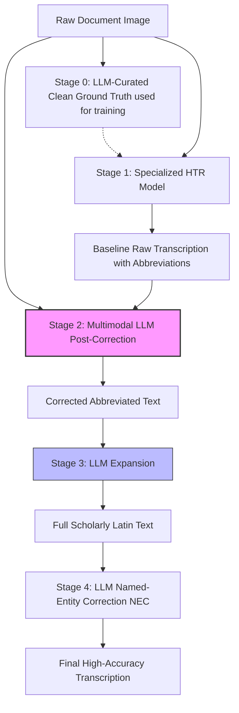

# An HTR-LLM Workflow for High-Accuracy Transcription and Analysis of Abbreviated Latin Court Hand

> **รหัสรายงาน:** EU08  
> **สถานะ:** Final  
> **ผู้เขียน:** AI Agent (supervised by Vesin)  
> **วันที่สร้าง:** 2026-06-04  
> **วันที่แก้ไขล่าสุด:** 2026-06-04  
> **เวอร์ชัน:** 1.0

### ข้อมูลงานวิจัย (Paper Metadata)
| รายการ | รายละเอียด |
|---|---|
| **ชื่องานวิจัย (Title)** | An HTR-LLM Workflow for High-Accuracy Transcription and Analysis of Abbreviated Latin Court Hand |
| **ผู้แต่ง (Authors)** | Joshua D. Isom |
| **สถาบัน (Institutions)** | University of Central Florida, Orlando, Florida, USA |
| **แหล่งตีพิมพ์ (Venue)** | arXiv Preprint |
| **ปีที่ตีพิมพ์** | 2025 (กรกฎาคม) |
| **DOI/URL** | [arXiv:2507.04132](https://arxiv.org/abs/2507.04132) |
| **HTR Engine(s)** | Custom HTR Pipeline ร่วมกับ Multimodal LLMs |
| **ภูมิภาค/อักษร** | ยุโรป / ภาษาละติน (Latin Court Hand) |
| **ประเภทเอกสาร** | เอกสารกฎหมายโบราณ และเอกสารทางศาลยุคกลาง |
| **ช่วงเวลาของเอกสาร** | ยุคกลาง (Medieval) ถีงศตวรรษที่ 16 |
| **ขนาด Dataset** | [ไม่มีข้อมูลระบุในเบื้องต้น] |
| **CER/WER ที่ดีที่สุด** | WER 2% - 7% |

---

## สารบัญ
- [1. บทนำและบริบท (Introduction & Context)](#1-บทนำและบริบท-introduction--context)
- [2. ขั้นตอนการเตรียม Dataset (Dataset Creation Pipeline)](#2-ขั้นตอนการเตรียม-dataset-dataset-creation-pipeline)
- [3. สถาปัตยกรรม Model และการเทรน (Model Architecture & Training)](#3-สถาปัตยกรรม-model-และการเทรน-model-architecture--training)
- [4. ผลลัพธ์และการประเมิน (Results & Evaluation)](#4-ผลลัพธ์และการประเมิน-results--evaluation)
- [5. ความท้าทายและบทเรียน (Challenges & Lessons Learned)](#5-ความท้าทายและบทเรียน-challenges--lessons-learned)
- [6. เครื่องมือและทรัพยากรที่เปิดเผย (Open Resources)](#6-เครื่องมือและทรัพยากรที่เปิดเผย-open-resources)
- [7. ผลกระทบต่อโปรเจกต์ไทย/ขอม (Implications for Thai/Khom HTR Project)](#7-ผลกระทบต่อโปรเจกต์ไทยขอม-implications-for-thaikhom-htr-project)
- [8. แหล่งอ้างอิง (References)](#8-แหล่งอ้างอิง-references)

---

## 1. บทนำและบริบท (Introduction & Context)

### 1.1 ภาพรวมโปรเจกต์
เอกสารทางกฎหมายและคดีความของศาลในยุโรปช่วงศตวรรษที่ 16 มักจะจารึกด้วยอักษรตัวเขียนศาลภาษาละตินที่เรียกว่า "Court Hand" ซึ่งเต็มไปด้วยตัวย่อและการดัดแปลงอักขระ งานวิจัยในปี 2025 โดย Joshua D. Isom ได้นำเสนอระบบความแม่นยำสูงผ่าน **การผสานการทำงานระหว่าง HTR และโมเดลภาษาขนาดใหญ่ (HTR-LLM Workflow)** เพื่อถอดความและแก้ไขคำย่อภาษาละตินโบราณโดยอ้างอิงบริบทของคดี [1]

### 1.2 ลักษณะเอกสารและปัญหาเฉพาะ-อักษรตัวเขียนศาลละตินโบราณที่อ่านยากเป็นพิเศษมีตัวอักษรเชื่อมแน่น (Court Hand)
- อัตราการใช้คำย่อ (Abbreviations) สูงถึง 30% ของข้อความทั้งหมด เพื่อประหยัดเนื้อที่กระดาษโบราณ [1]
- ขาดแคลนพจนานุกรมละตินยุคกลางเฉพาะเรื่องศาลสำหรับการวิเคราะห์บริบท [1]

---

## 2. ขั้นตอนการเตรียม Dataset (Dataset Creation Pipeline)

### 2.1 การจัดหาภาพ (Image Acquisition)
*ไม่มีข้อมูลโดยละเอียดระบุใน source เกี่ยวกับความละเอียด (DPI) และเครื่องมือที่ใช้สแกน*

### 2.2 Pre-processing
*ไม่มีข้อมูลโดยละเอียดระบุใน source*

### 2.3 Layout Analysis & Segmentation
*ไม่มีข้อมูลระบุอย่างเฉพาะเจาะจงเกี่ยวกับ Model/Algorithm ที่ใช้ตัดบรรทัด*

### 2.4 Ground Truth Creation
- **แนวทางใหม่ (Clean Ground Truth):** ใน Stage 0 ของโปรเจกต์ ผู้วิจัยได้ใช้ LLM เข้ามาช่วย "คัดกรองและทำความสะอาด (Curate)" ข้อมูลการฝึกฝน (Training data) ทำให้ได้ Ground Truth ที่มีคุณภาพสูงกว่าการใช้มนุษย์ทำเพียงอย่างเดียว เพื่อใช้สำหรับเทรน HTR Model ตัวต้นแบบ

### 2.5 Data Augmentation (ถ้ามี)
*ไม่มีข้อมูลการทำ Augmentation ระบุใน source*

---

## 3. สถาปัตยกรรม Model และการเทรน (Model Architecture & Training)

### 3.1 HTR Engine / Framework
ใช้สถาปัตยกรรมแบบ Hybrid ที่ประกอบด้วย HTR Engine แบบพื้นฐาน (Baseline HTR) ร่วมกับ Multimodal LLM

### 3.2 Model Architecture (Pipeline)

### 3.3 Training Configuration
| Parameter | ค่า |
|---|---|
| Learning Rate | *[ไม่มีข้อมูลใน source]* |
| Batch Size | *[ไม่มีข้อมูลใน source]* |
| Epochs | *[ไม่มีข้อมูลใน source]* |
| Optimizer | *[ไม่มีข้อมูลใน source]* |
| Loss Function | *[ไม่มีข้อมูลใน source]* |
| Hardware ที่ใช้ | *[ไม่มีข้อมูลใน source]* |

*(หมายเหตุ: งานวิจัยนี้เน้นที่ Workflow Integration มากกว่าการทำ Ablation ทาง Hyperparameters)*

### 3.4 Transfer Learning (ถ้ามี)
การตรวจคำผิดจะทำหลังจากได้ผลดิบจาก HTR แล้ว โดยส่งเข้าไปประมวลผลด้วยโมเดล GPT-4 [1]

---

## 4. ผลลัพธ์และการประเมิน (Results & Evaluation)

### 4.1 Metrics ที่ใช้
- **WER (Word Error Rate):** ใช้วัดความผิดพลาดระดับคำ ซึ่งเหมาะสมกับเอกสารภาษาละตินที่มีการกระจายคำย่อ (Expansion) 

### 4.2 ผลลัพธ์หลัก
| Model/Configuration | CER (%) | WER (%) |
|---|---|---|
| HTR-LLM Workflow (End-to-End) | - | 2.0% - 7.0% |

### 4.3 Ablation Studies (ถ้ามี)
การตรวจคำผิดจะทำหลังจากได้ผลดิบจาก HTR แล้ว โดยส่งเข้าไปประมวลผลด้วยโมเดล GPT-4 [1]

### 4.4 Error Analysis
ผู้วิจัยพบว่ากระบวนการ Stage 4 (Named-Entity Correction) เป็นจุดสำคัญที่ใช้ LLM เสนอคำอ่านทางเลือกสำหรับ Proper Nouns (ชื่อเฉพาะ) ที่คลุมเครือ ซึ่งช่วยปิดจุดอ่อนของ HTR ธรรมดาที่ไม่รู้จักบริบทของชื่อคน/สถานที่ได้ดีมาก

---

## 5. ความท้าทายและบทเรียน (Challenges & Lessons Learned)

### 5.1 ความท้าทายด้านเอกสาร-การใช้ตัวย่อที่รุนแรงและสัญลักษณ์เฉพาะทางกฎหมาย (Court Hand) ที่ไม่มีใช้ในภาษาเขียนปกติ

### 5.2 ความท้าทายด้านเทคนิค-การทำ OCR เพียงอย่างเดียวไม่สามารถให้ผลลัพธ์ที่นำไปใช้วิเคราะห์ต่อได้ เพราะคำย่อไม่ได้แปลความหมายในตัวมันเอง ต้องมีการ Expansion ก่อนเสมอ

### 5.4 บทเรียนสำคัญ-การนำรูปภาพต้นฉบับส่งเข้าไปใน LLM (Multimodal Post-Correction) พร้อมกับ Baseline Transcription จาก HTR ทำให้ LLM สามารถตรวจสอบ (Cross-check) ด้วยตาตัวเองได้ ซึ่งลดอัตราการ "หลอน (Hallucination)" ของ LLM ในขั้นตอนการแก้คำผิดได้ดีเยี่ยม

---

## 6. เครื่องมือและทรัพยากรที่เปิดเผย (Open Resources)

| ประเภท | ชื่อ | URL | License | หมายเหตุ |
|---|---|---|---|---|
| Paper | arXiv Preprint | [arXiv:2507.04132](https://arxiv.org/abs/2507.04132) | Open Access | ตีพิมพ์ ก.ค. 2025 |

[Latin Court Hand LLM Integration Guide](https://arxiv.org/abs/2507.04132) [2]

---

## 7. ผลกระทบต่อโปรเจกต์ไทย/ขอม (Implications for Thai/Khom HTR Project)

> **การประยุกต์ใช้ Workflow ลูกผสมสำหรับอักษรขอม (Minimum 200 words)**

งานวิจัยชิ้นนี้มีโมเดลการทำงาน (Workflow) ที่สมบูรณ์แบบและสามารถนำมาปรับใช้ (Apply) กับโปรเจกต์สมุดไทยและคัมภีร์ใบลานอักษรขอมของเราได้อย่างตรงจุดที่สุด โดยมีรายละเอียดเชิงลึกดังนี้:

**1. แก้ปัญหาการย่อคำในอักษรขอมด้วย LLM Expansion (เหมือน Stage 3):**
เอกสารภาษาละตินยุคกลางเผชิญปัญหา "คำย่อทางกฎหมาย" ในขณะที่คัมภีร์ใบลานขอมเผชิญปัญหา "เปยยาลน้อย/เปยยาลใหญ่" และการละตัวอักษรบางตัวตามไวยากรณ์บาลี (เช่น การซ่อนตัว "อ" หรือการซ่อนสระ) การใช้ HTR พื้นฐาน (เช่น Kraken) ให้อ่านเฉพาะรูปอักขระที่ตามองเห็น (Diplomatic Transcription) แล้วโยนผลลัพธ์นั้นเข้าสู่ LLM ที่ถูก Prompt ให้เป็นผู้เชี่ยวชาญภาษาบาลี-ขอม เพื่อทำการกางคำย่อ (Expansion) ให้กลายเป็นภาษาบาลีที่สมบูรณ์ จะช่วยลดภาระของโมเดล HTR ไม่ต้องไปเดาคำที่มองไม่เห็นด้วยตัวเอง ซึ่งจะลด CER ได้อย่างมหาศาล

**2. การใช้ Multimodal LLM ตรวจทานคู่กับภาพ (เหมือน Stage 2):**
เปเปอร์นี้พิสูจน์ว่า หากเราเอาข้อความที่ได้จาก HTR โยนให้ LLM แก้คำผิดเพียวๆ LLM อาจจะเดาคำ (Hallucinate) ไปผิดทาง แต่ถ้าเราโยน **"รูปภาพใบลานบรรทัดนั้น" + "ผลลัพธ์ HTR"** เข้าไปให้ Vision-Language Model (เช่น Gemini 2.5 Pro หรือ Claude 3.5 Sonnet) พร้อมคำสั่งว่า *"จงแก้คำผิดจาก Text นี้ โดยดูภาพใบลานประกอบ"* ผลลัพธ์ที่ได้จะมีความแม่นยำสูงขึ้นมาก นี่คือ Best Practice ที่ทีมเราต้องนำไปเขียนเป็น Post-processing Pipeline

**3. การใช้ LLM คลีนข้อมูล Ground Truth (Stage 0):**
การสร้าง Ground truth อักษรขอมด้วยมนุษย์ 100% มีต้นทุนสูงและใช้เวลานาน เราสามารถนำ LLM มาตรวจสอบความผิดปกติ (Anomaly detection) ในไฟล์ PAGE XML หรือ ALTO XML ที่มนุษย์พิมพ์ไว้ก่อนนำไปเทรน Kraken ได้ เช่น เช็คว่าตัวเชิงมีการใส่พินทุ `ฺ` นำหน้าอย่างสม่ำเสมอหรือไม่ ซึ่งจะช่วยเพิ่ม Quality ของ Training Data โดยไม่ต้องเหนื่อยคน

---

## 8. แหล่งอ้างอิง (References)

### เชิงอรรถ

[1] Isom, Joshua D. "An HTR-LLM Workflow for High-Accuracy Transcription and Analysis of Abbreviated Latin Court Hand." *arXiv preprint arXiv:2507.04132* (2025). https://arxiv.org/abs/2507.04132.
[2] Isom, Joshua D. "Historical Court Hand Transcription Models & LLM Integration Guide." University of Central Florida, 2025.

