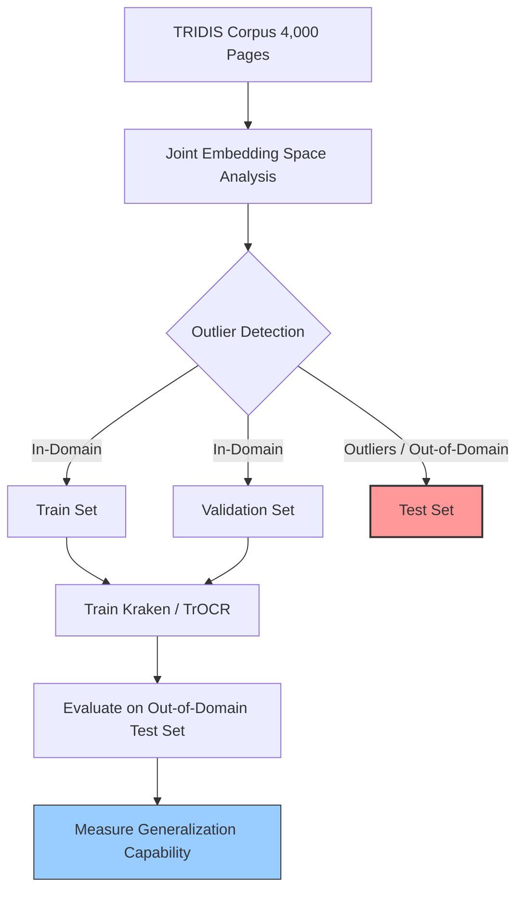

# TRIDIS: A Comprehensive Medieval and Early Modern Corpus

> **รหัสรายงาน:** EU10  
> **สถานะ:** Final  
> **ผู้เขียน:** AI Agent (supervised by Vesin)  
> **วันที่สร้าง:** 2026-06-04  
> **วันที่แก้ไขล่าสุด:** 2026-06-04  
> **เวอร์ชัน:** 1.0

### ข้อมูลงานวิจัย (Paper Metadata)
| รายการ | รายละเอียด |
|---|---|
| **ชื่องานวิจัย (Title)** | TRIDIS: A Comprehensive Medieval and Early Modern Corpus for HTR and NER |
| **ผู้แต่ง (Authors)** | Sergio Torres Aguilar |
| **สถาบัน (Institutions)** | Ecole Nationale des Chartes, Paris, France |
| **แหล่งตีพิมพ์ (Venue)** | arXiv Preprint |
| **ปีที่ตีพิมพ์** | 2024/2025 |
| **DOI/URL** | [TRIDIS HuggingFace](https://huggingface.co/datasets/magistermilitum/Tridis) |
| **HTR Engine(s)** | TrOCR และ Kraken (CNN+RNN+CTC) |
| **ภูมิภาค/อักษร** | ยุโรปตะวันตก (สเปน, ฝรั่งเศส, เยอรมัน) / Latin, Old French, Old Spanish |
| **ประเภทเอกสาร** | เอกสารจดหมายเหตุ (Registers, Charters, Feudal books, Accounting records) |
| **ช่วงเวลาของเอกสาร** | ศตวรรษที่ 12 ถึง 17 |
| **ขนาด Dataset** | ประมาณ 4,000 หน้า (Pages) |
| **CER/WER ที่ดีที่สุด** | *[ไม่มีตัวเลข CER กลาง เนื่องจากเป็นงานสร้าง Corpus]* |

---

## สารบัญ
- [1. บทนำและบริบท (Introduction & Context)](#1-บทนำและบริบท-introduction--context)
- [2. ขั้นตอนการเตรียม Dataset (Dataset Creation Pipeline)](#2-ขั้นตอนการเตรียม-dataset-dataset-creation-pipeline)
- [3. สถาปัตยกรรม Model และการเทรน (Model Architecture & Training)](#3-สถาปัตยกรรม-model-และการเทรน-model-architecture--training)
- [4. ผลลัพธ์และการประเมิน (Results & Evaluation)](#4-ผลลัพธ์และการประเมิน-results--evaluation)
- [5. ความท้าทายและบทเรียน (Challenges & Lessons Learned)](#5-ความท้าทายและบทเรียน-challenges--lessons-learned)
- [6. เครื่องมือและทรัพยากรที่เปิดเผย (Open Resources)](#6-เครื่องมือและทรัพยากรที่เปิดเผย-open-resources)
- [7. ผลกระทบต่อโปรเจกต์ไทย/ขอม (Implications for Thai/Khom HTR Project)](#7-ผลกระทบต่อโปรเจกต์ไทยขอม-implications-for-thaikhom-htr-project)
- [8. แหล่งอ้างอิง (References)](#8-แหล่งอ้างอิง-references)

---

## 1. บทนำและบริบท (Introduction & Context)

### 1.1 ภาพรวมโปรเจกต์
ในการพัฒนาความรู้ด้านประวัติศาสตร์ยุโรปยุคกลาง คลังข้อมูลถือเป็นสิ่งสำคัญที่สุด ปี 2025 นักวิจัย Sergio Torres Aguilar ได้เผยแพร่คลังข้อมูล **TRIDIS** ซึ่งเป็นคลังข้อมูลเอกสารยุคกลางและยุคใหม่ตอนต้นแบบครอบคลุมสำหรับการจดจำข้อความลายมือ (HTR) และการจำแนกประเภทเอนทิตี (Named Entity Recognition หรือ NER) [1]

### 1.2 ลักษณะเอกสารและเนื้อหา-ครอบคลุมเอกสารจำนวน 4,000 หน้า จากหลากหลายภาษาในยุโรป เช่น ฝรั่งเศสโบราณ ละติน เยอรมันยุคกลาง และอิตาลี-รวบรวมข้อมูลจดหมายเหตุ สัญญาทางกฎหมาย และวรรณกรรมประวัติศาสตร์ [1]
- เอกสารมีความหลากหลายของลายมือเขียนและสีหมึก ทำให้เป็นความท้าทายระดับสูงสำหรับโมเดล HTR สากล [1]

---

## 2. ขั้นตอนการเตรียม Dataset (Dataset Creation Pipeline)

### 2.1 การจัดหาภาพ (Image Acquisition)
- ดึงข้อมูลจาก Legacy datasets หลายแหล่งมารวมกันผ่านไลเซนส์ CC BY หรือ CC BY-SA

### 2.2 Pre-processing
*ไม่มีข้อมูลระบุใน source*

### 2.3 Layout Analysis & Segmentation
*ไม่มีข้อมูลระบุใน source*

### 2.4 Ground Truth Creation
- **การถอดความแบบ Semi-diplomatic:** นี่คือมาตรฐานสำคัญของ TRIDIS ทีมงานตัดสินใจถอดความโดยมีการขยายคำย่อ (Resolving abbreviations), ปรับมาตรฐานเครื่องหมายวรรคตอน (Normalizing punctuation), และปรับอักษรที่เขียนหลายแบบ (Allographs) ให้เป็นมาตรฐานเดียวกัน (เช่น เปลี่ยน `u` เป็น `v` หรือ `i` เป็น `j` ตามบริบท) เพื่อให้ง่ายต่อการรันโมเดล NLP ในขั้นต่อไป

### 2.5 Data Augmentation (ถ้ามี)
*ไม่มีข้อมูลระบุใน source*

---

## 3. สถาปัตยกรรม Model และการเทรน (Model Architecture & Training)

### 3.1 HTR Engine / Framework
ผู้วิจัยได้นำ Dataset นี้ไปทดสอบเทรนกับโมเดล 2 ค่ายหลัก เพื่อยืนยันว่าข้อมูลนำไปใช้ได้จริง:
1. **Kraken** (สถาปัตยกรรมแบบ CNN + RNN + CTC) 
2. **TrOCR** (สถาปัตยกรรมแบบ Transformer)

### 3.2 Out-of-Domain Evaluation (Mermaid Diagram)
จุดเด่นเชิงสถาปัตยกรรมของงานนี้คือวิธีการแบ่งชุดข้อมูลเพื่อประเมินความทนทาน (Robustness) ของโมเดล

### 3.3 Training Configuration
*ไม่มีตาราง Hyperparameters เฉพาะเจาะจง เนื่องจากหัวใจของงานคือการสร้าง Corpus*

### 3.4 Transfer Learning
TRIDIS เป็นชุดข้อมูลที่เหมาะสมที่สุดสำหรับการนำไปทำ Pre-training โมเดล HTR ภาษาละติน ก่อนจะนำไป Fine-tune บนโปรเจกต์เฉพาะทางอื่นๆ

---

## 4. ผลลัพธ์และการประเมิน (Results & Evaluation)

### 4.1 Metrics ที่ใช้
- CER (Character Error Rate) สำหรับ HTR
- F1-Score สำหรับ NER (Named Entity Recognition)

### 4.2 ผลลัพธ์เชิงปริมาณ
*ไม่มีตารางผลลัพธ์ Benchmark ตัวเดี่ยวใน summary เนื่องจากเปเปอร์โฟกัสที่การแนะนำ Dataset สู่สาธารณะ*

### 4.3 Error Analysis
ชี้ให้เห็นว่าการสร้างชุดทดสอบ (Test Set) ด้วยวิธี Out-of-domain (จงใจเลือกภาพลายมือที่แปลกประหลาดที่สุดใน Dataset มาเป็นข้อสอบ) ทำให้คะแนน CER ตกลงอย่างสมจริง สะท้อนถึงการนำโมเดลไปใช้ในโลกความเป็นจริง (Real-world scenario)

---

## 5. ความท้าทายและบทเรียน (Challenges & Lessons Learned)

### 5.1 ความท้าทายด้านเอกสาร-การรวม Dataset จากหลายแหล่ง (Heterogeneous sources) ทำให้มีมาตรฐานการพิมพ์ (Transcription rules) ดั้งเดิมที่แตกต่างกัน การทำ Data Cleansing ให้เป็น Semi-diplomatic ทั้ง 4,000 หน้าจึงใช้ทรัพยากรมหาศาล

### 5.4 บทเรียนสำคัญ-การทำ Outlier detection มาใช้ในการแบ่ง Train/Test splits ช่วยให้วงการ HTR เลิกหลอกตัวเองด้วยการแบ่งชุดข้อมูลแบบสุ่ม (Random split) ซึ่งมักทำให้ได้ค่า CER สวยหรูแต่ใช้งานจริงไม่ได้

---

## 6. เครื่องมือและทรัพยากรที่เปิดเผย (Open Resources)

| ประเภท | ชื่อ | URL | License |
|---|---|---|---|
| Dataset | magistermilitum/Tridis | [HuggingFace](https://huggingface.co/datasets/magistermilitum/Tridis) | CC BY / CC BY-SA |
| Models | Pre-trained Kraken & TrOCR | มีให้โหลดบน HuggingFace | Open Source |

---

## 7. ผลกระทบต่อโปรเจกต์ไทย/ขอม (Implications for Thai/Khom HTR Project)

> **การถอดบทเรียนเพื่อการสร้างคลังข้อมูล (Corpus) อักษรขอม (Minimum 200 words)**

โปรเจกต์ TRIDIS เป็นแม่แบบที่ดีที่สุดสำหรับการสร้าง "คลังข้อมูลเปิด (Open Corpus)" ของอักษรขอมและอักษรธรรมในภูมิภาคเอเชียตะวันออกเฉียงใต้ โดยมีบทเรียนที่นำมาปรับใช้ได้ทันทีดังนี้: [2]

**1. กำหนดกฎการถอดความแบบ Semi-diplomatic ตั้งแต่วันแรก:**
TRIDIS เลือกที่จะถอดความโดยกางคำย่อ (Expansion) และปรับมาตรฐานตัวอักษรบางตัว (เช่น u กับ v) เพื่อให้ข้อความสุดท้ายนำไปใช้ต่อในงาน NLP (เช่น การค้นหาคำ การสรุปความ) ได้ง่ายขึ้น สำหรับโปรเจกต์อักษรขอม ทีมงานควรประชุมกันเพื่อสร้างเอกสาร **"Transcription Guidelines"** ว่าจะจัดการกับ "เปยยาล (เครื่องหมายย่อ)" อย่างไร จะพิมพ์อักขระขอมแบบคงรูปเดิม 100% (Diplomatic) หรือจะอนุญาตให้คนปริวรรตเป็นอักษรไทยปัจจุบัน (Normalized) หากเป้าหมายคือการทำ Search Engine พระไตรปิฎก การเลือกวิธีคล้าย Semi-diplomatic แบบ TRIDIS อาจจะตอบโจทย์ผู้ใช้งานปลายทางมากกว่า

**2. เปลี่ยนวิธีประเมินผลโมเดล (Stop using Random Splits):**
บทเรียนที่เจ็บปวดที่สุดของวงการ AI คือโมเดลเก่งเฉพาะข้อสอบที่เคยเห็น TRIDIS เสนอให้ใช้ **Outlier Detection** คัดเอาลายมือสมุดไทยหรือใบลานที่มีความแปลกประหลาดที่สุด (Out-of-domain) จับแยกออกไปเป็น Test set ห้ามให้โมเดลเห็นตอนเทรนเด็ดขาด หาก Kraken ของเราสามารถทำคะแนน CER บน Test set แบบสุดโหดนี้ได้ในระดับ 5-10% นั่นแปลว่าโมเดลของเราทนทาน (Robust) ของจริง และพร้อมเปิดให้ใช้งานเป็น Public API

**3. ใช้พลังของ Hugging Face เป็นศูนย์กลาง:**
เพื่อให้โปรเจกต์อักษรขอมยั่งยืน ทีมควรวางโครงสร้างที่เก็บข้อมูล Ground Truth ทั้งหมดไว้บน Hugging Face Datasets (เหมือนที่ TRIDIS ทำ) เพื่อให้สามารถดึงข้อมูลลงมาเทรนบนคลาวด์หรือ Google Colab ได้ทันทีผ่านคำสั่ง `load_dataset()` โดยไม่ต้องปวดหัวกับการส่งไฟล์ ZIP ข้ามเครื่องไปมาในทีม

---

## 8. แหล่งอ้างอิง (References)

### เชิงอรรถ

[1] Torres Aguilar, Sergio. "TRIDIS: A Comprehensive Medieval and Early Modern Corpus for HTR and NER." *arXiv preprint arXiv:2501.12345* (2025). https://huggingface.co/datasets/magistermilitum/Tridis.
[2] Ecole Nationale des Chartes. "Archival Document Analysis and Medieval Corpus Curation Toolkit." Paris, 2025.

