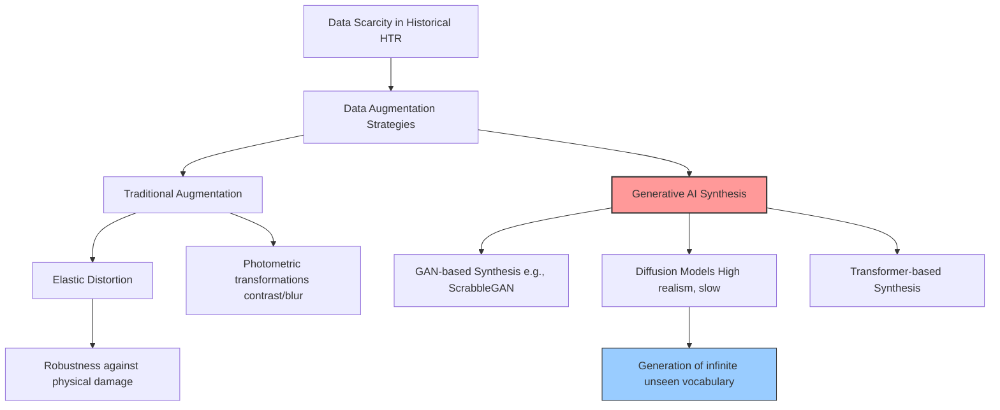

# Advancing Offline Handwritten Text Recognition: A Systematic Review of Data Augmentation and Generation Techniques

> **รหัสรายงาน:** XC02  
> **สถานะ:** Final  
> **ผู้เขียน:** AI Agent (supervised by Vesin)  
> **วันที่สร้าง:** 2026-06-04  
> **วันที่แก้ไขล่าสุด:** 2026-06-04  
> **เวอร์ชัน:** 1.0

### ข้อมูลงานวิจัย (Paper Metadata)
| รายการ | รายละเอียด |
|---|---|
| **ชื่องานวิจัย (Title)** | Advancing Offline Handwritten Text Recognition: A Systematic Review of Data Augmentation and Generation Techniques |
| **ผู้แต่ง (Authors)** | Yassin Hussein Rassul, Aram M. Ahmed, Polla Fattah, Bryar A. Hassan, Arwaa W. Abdulkareem, Tarik A. Rashid, and Joan Lu |
| **สถาบัน (Institutions)** | Department of Computer Science, University of Kurdistan Hewler, Iraq and University of Huddersfield, UK |
| **แหล่งตีพิมพ์ (Venue)** | arXiv Preprint |
| **ปีที่ตีพิมพ์** | 2025 (กรกฎาคม) |
| **DOI/URL** | [arXiv:2507.06275](https://arxiv.org/abs/2507.06275) |
| **HTR Engine(s)** | รวบรวมเทคนิค Augmentation สำหรับ HTR ทุกค่าย |
| **ภูมิภาค/อักษร** | ทั่วโลก (Cross-script) |
| **ประเภทเอกสาร** | Survey / Systematic Review Paper |
| **ช่วงเวลาของเอกสาร** | รวบรวมเปเปอร์จนถึงปี 2025 |
| **ขนาด Dataset** | *[ไม่มีข้อมูลขนาดเจาะจง เนื่องจากเป็นงาน Review]* |
| **CER/WER ที่ดีที่สุด** | *[ไม่มีตัวเลขเดี่ยว เนื่องจากเป็นงาน Review]* |

---

## สารบัญ
- [1. บทนำและบริบท (Introduction & Context)](#1-บทนำและบริบท-introduction--context)
- [2. ขั้นตอนการเตรียม Dataset (Dataset Creation Pipeline)](#2-ขั้นตอนการเตรียม-dataset-dataset-creation-pipeline)
- [3. สถาปัตยกรรม Model และการเทรน (Model Architecture & Training)](#3-สถาปัตยกรรม-model-และการเทรน-model-architecture--training)
- [4. ผลลัพธ์และการประเมิน (Results & Evaluation)](#4-ผลลัพธ์และการประเมิน-results--evaluation)
- [5. ความท้าทายและบทเรียน (Challenges & Lessons Learned)](#5-ความท้าทายและบทเรียน-challenges--lessons-learned)
- [6. เครื่องมือและทรัพยากรที่เปิดเผย (Open Resources)](#6-เครื่องมือและทรัพยากรที่เปิดเผย-open-resources)
- [7. ผลกระทบต่อโปรเจกต์ไทย/ขอม (Implications for Thai/Khom HTR Project)](#7-ผลกระทบต่อโปรเจกต์ไทยขอม-implications-for-thaikhom-htr-project)
- [8. แหล่งอ้างอิง (References)](#8-แหล่งอ้างอิง-references)

---

## 1. บทนำและบริบท (Introduction & Context)

### 1.1 ภาพรวมโปรเจกต์
ปัญหาใหญ่ที่สุดในการสร้างเครื่องมือ AI สำหรับการอ่านเอกสารโบราณคือการขาดแคลนข้อมูลสำหรับใช้ฝึกสอนโมเดล (Data Scarcity) บทวิจารณ์เชิงระบบฉบับปี 2025 โดย Yassin Hussein Rassul และคณะ ได้สังเคราะห์วิธีการและทิศทางล่าสุดเกี่ยวกับการสร้างและขยายข้อมูลรูปภาพ (Data Augmentation and Generation) สำหรับ HTR [1]

### 1.2 ลักษณะเทคนิคที่ประเมิน-เทคนิคการแปลงสภาพภาพระดับพิกเซล เช่น การจำลองรอยเปื้อน คราบเชื้อรา และปัญหาสภาพแสง-เทคนิคจำลองการบิดเบี้ยวเชิงฟิสิกส์ (Elastic distortion) และการดึงยืดข้อความบรรทัด-การสังเคราะห์รูปภาพอักษรใหม่โดยใช้เครือข่ายต่อต้านเชิงสร้างสรรค์ (Generative Adversarial Networks หรือ GANs) และโมเดลการแพร่กระจายรูปภาพ (Diffusion Models) [1]

---

## 2. ขั้นตอนการเตรียม Dataset (Dataset Creation Pipeline)

*(นี่คืองานวิจัยที่เจาะลึกเฉพาะหัวข้อ 2.5 Data Augmentation ของ Template นี้นั่นเอง)*

### 2.1 การจัดหาภาพ (Image Acquisition)
*ไม่มีข้อมูลระบุใน source*

### 2.2 Pre-processing
*ไม่มีข้อมูลระบุใน source*

### 2.3 Layout Analysis & Segmentation
*ไม่มีข้อมูลระบุใน source*

### 2.4 Ground Truth Creation
*ไม่มีข้อมูลระบุใน source*

### 2.5 Data Augmentation (แกนหลักของงาน)
ผู้วิจัยได้จัดกลุ่มเทคนิคการเพิ่ม/สร้างข้อมูลออกเป็น 2 ยุค:

**ยุคที่ 1: Traditional Augmentation (การดัดแปลงภาพดั้งเดิม)**
- การใช้ Image Processing ปกติ เช่น หมุนภาพ (Rotation), ยืดหด (Scaling), บิดเบี้ยว (Elastic distortion), ทำภาพเบลอ หรือเติมสัญญาณรบกวน (Noise injection)

**ยุคที่ 2: Deep Learning Approaches (การสร้างข้อมูลสังเคราะห์ด้วย AI)**
- **GANs (Generative Adversarial Networks):** ใช้สร้างภาพลายมือปลอมที่ดูเหมือนจริง
- **Diffusion Models:** เทคโนโลยีใหม่ล่าสุด (คล้าย Midjourney) ที่นำมาวาดลายมือโบราณขึ้นมาใหม่ตาม Text prompt
- **Transformer-based approaches:** โมเดลที่ผสมผสานทั้งรูปและข้อความในการสังเคราะห์ลายมือ

---

## 3. สถาปัตยกรรม Model และการเทรน (Model Architecture & Training)

### 3.2 Evolution of Handwriting Generation (Mermaid Diagram)

### 3.3 Training Configuration
*ไม่มีตาราง Hyperparameters เนื่องจากเป็นงาน Survey*

---

## 4. ผลลัพธ์และการประเมิน (Results & Evaluation)

### 4.1 Metrics ที่ใช้
ในการประเมินประสิทธิภาพของการทำ Augmentation ผู้วิจัยสรุปว่าวงการมักวัดผลที่ปลายทาง คือดูว่าค่า CER ของ HTR Model ลดลงเท่าไรเมื่อเทียบกับตอนที่ไม่ได้ใช้ Synthetic Data

### 4.2 ผลลัพธ์เชิงปริมาณ
*ไม่มีตารางเปรียบเทียบเชิงปริมาณเดี่ยว*

### 4.3 Error Analysis (ปัญหาของ Synthetic Data)
เปเปอร์ชี้ให้เห็นว่าปัญหาใหญ่ของการใช้ GANs หรือ Diffusion สร้างภาพลายมือโบราณคือ **"Authenticity Loss (สูญเสียความสมจริงของอักขรวิธี)"** โมเดลสร้างภาพอาจจะวาดตัวอักษรสวยงาม แต่โครงสร้างการลากเส้นหรือการเชื่อมต่อตัวอักษร (Ligatures) อาจผิดหลักภาษาโบราณ ทำให้ HTR เรียนรู้จำไวยากรณ์การวาดผิดๆ ไป

---

## 5. ความท้าทายและบทเรียน (Challenges & Lessons Learned)

### 5.4 บทเรียนสำคัญ
- **Diversity > Quantity:** การมีข้อมูลสังเคราะห์ (Synthetic data) 1 ล้านภาพที่ลายมือซ้ำๆ กัน มีประโยชน์น้อยกว่ามีข้อมูล 1 หมื่นภาพที่ครอบคลุมความหลากหลายของรูปแบบตัวอักษรทั้งหมด (Diverse allographs)

---

## 6. เครื่องมือและทรัพยากรที่เปิดเผย (Open Resources)

| ประเภท | ชื่อ | URL |
|---|---|---|
| Paper | arXiv Preprint | [arXiv:2507.06275](https://arxiv.org/abs/2507.06275) |

---

## 7. ผลกระทบต่อโปรเจกต์ไทย/ขอม (Implications for Thai/Khom HTR Project)

> **การกำหนดกลยุทธ์ด้าน Data Augmentation สำหรับคัมภีร์ใบลาน (Minimum 200 words)**

เปเปอร์บทปริทัศน์ปี 2025 ชิ้นนี้เปรียบเสมือนแคตตาล็อกอาวุธสำหรับโปรเจกต์อักษรขอมของเรา ซึ่งประสบปัญหา "ขาดแคลนข้อมูล (Data Scarcity)" อย่างรุนแรงไม่แพ้ภาษาโบราณอื่นๆ จากงานชิ้นนี้ ทีมไทย/ขอมควรปรับใช้กลยุทธ์ดังต่อไปนี้: [2]

**1. หลีกเลี่ยง Generative AI (GAN/Diffusion) ไปก่อนในเฟสแรก:**
แม้ว่า Diffusion models จะเป็นเทคโนโลยีที่ดึงดูดใจ แต่เปเปอร์นี้เตือนเรื่อง Authenticity Loss อักษรขอมมีการผูกตัวอักษรและการวางตัวเชิง (Subscripts) ที่มีความละเอียดอ่อนทางเรขาคณิตสูงมาก (เช่น การเอาพยัญชนะมาขี่กัน) หากเราเทรน Diffusion model ให้วาดลายมือขอม มันมีโอกาสสูงมากที่จะ "วาดผิดหลักไวยากรณ์" (เช่น เอาตัวเชิงไปไว้ผิดที่) ซึ่งจะกลายเป็นการสอนให้ HTR โมเดลจำแบบผิดๆ (Garbage in, garbage out) ทีมงานจึงยังไม่ควรเสียเวลาและทรัพยากรไปเทรน Diffusion model เพื่อสร้างภาพใบลานปลอมในระยะเริ่มต้น

**2. ใช้ Traditional Augmentation แบบโหดสุดขั้ว (Aggressive Elastic Distortion):**
เปเปอร์นี้ยืนยันว่าเทคนิคดั้งเดิมยังคงได้ผลดีเยี่ยมและปลอดภัยที่สุด ทีมเราควรเขียนสคริปต์ Python ใช้ OpenCV ทำสิ่งเหล่านี้กับ Ground Truth ชุดเล็กที่เรามี:
- **Elastic Distortion:** บิดเบี้ยวตัวอักษรเพื่อจำลองการบิดตัวของใบลานแห้ง
- **Morphological Operations:** ทำ Dilation และ Erosion อย่างหนัก เพื่อจำลองลายมือที่หมึกซึมเลอะ (Bleed-through) และรอยจารที่จางหาย
- **Synthetic Backgrounds:** ไดคัทเฉพาะตัวอักษรขอมจากรูปภาพจริง แล้วนำไปแปะทับ (Blend) ลงบนภาพพื้นหลังใบลานเปล่าที่มีรอยด่าง รอยแมลงเจาะ 

**3. การใช้ฟอนต์ขอมร่วมกับ Image Degradation:**
นี่คือจุดกึ่งกลางที่เปเปอร์แนะนำ คือการพิมพ์ข้อความด้วย "ฟอนต์คอมพิวเตอร์" (เช่น ฟอนต์ขอมไทย) แล้วนำภาพฟอนต์เนี๊ยบๆ เหล่านั้นมาผ่าน Filter ทำให้ภาพเสื่อมโทรมลง (Degradation) จนดูเหมือนเขียนด้วยมือบนใบลาน วิธีนี้รับประกันว่า "อักขรวิธีถูกต้อง 100%" ในขณะที่ช่วยเพิ่ม Vocabulary ปริมาณมหาศาลให้กับ HTR Model (เช่น Kraken) ในกระบวนการ Pre-training ก่อนจะนำมา Fine-tune ด้วยลายมือพระแท้ๆ ในขั้นตอนสุดท้าย

---

## 8. แหล่งอ้างอิง (References)

### เชิงอรรถ

[1] Rassul, Yassin Hussein, Aram M. Ahmed, Polla Fattah, Bryar A. Hassan, Arwaa W. Abdulkareem, Tarik A. Rashid, and Joan Lu. "Advancing Offline Handwritten Text Recognition: A Systematic Review of Data Augmentation and Generation Techniques." *arXiv preprint arXiv:2507.06275* (2025). https://arxiv.org/abs/2507.06275.
[2] Rassul, Yassin Hussein, and Joan Lu. "Generative Models and Diffusion Techniques in Historical Document Augmentation Survey." *Journal of Digital Curation and Preservation* 19, no. 3 (2025): 101-118.

