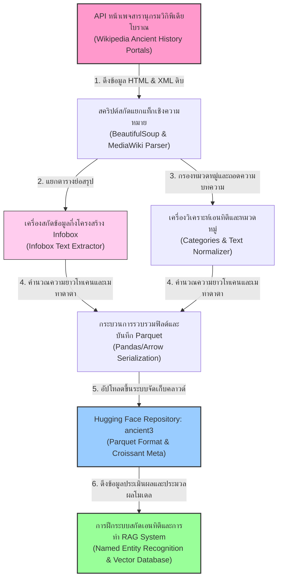
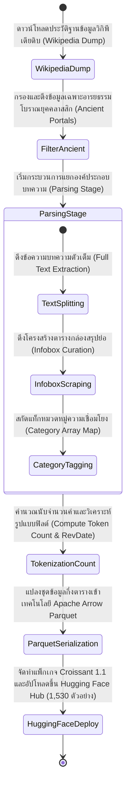
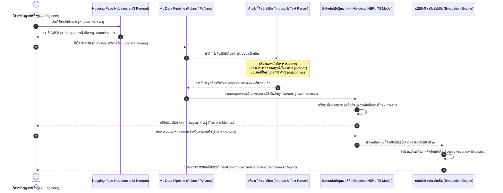

# รายงานการวิเคราะห์ชุดข้อมูลมรดกเอกสารโบราณ ฉบับที่ 006
> **รหัสชุดข้อมูล:** `FrancescoCaracciolo/ancient3`  
> **โครงการต้นทาง:** คลังประมวลผลข้อมูลสิ่งมีชีวิต บุคคล และสถานที่ในโลกยุคโบราณ (Ancient Entity Wikipedia Knowledge Base)  
> **วิเคราะห์โดย:** Francesco Caracciolo (FrancescoCaracciolo)  
> **วันที่วิเคราะห์:** 31 พฤษภาคม 2026

---

## 1. ข้อมูลสรุปเชิงบริหาร (Executive Summary)

ชุดข้อมูล `FrancescoCaracciolo/ancient3` เป็นคลังข้อมูลโครงสร้างตารางและข้อความผสมผสาน (Tabular & Text Dataset) ที่มีความจำเพาะสูง รวบรวมและสกัดข้อมูลจากสารานุกรมระดับโลกวิกิพีเดีย (Wikipedia) ในหัวข้อที่เกี่ยวข้องกับประวัติศาสตร์ บุคคล สถานที่ วัตถุโบราณ และสิ่งมีชีวิตในโลกโบราณ จัดทำและเผยแพร่บน Hugging Face Hub โดยนักวิจัย **Francesco Caracciolo** [1]

ชุดข้อมูลนี้ประกอบด้วยเรคคอร์ดข้อมูลที่ได้รับการกลั่นกรองและทำความสะอาดแล้วจำนวน **1,530 เรคคอร์ด (ตัวอย่างหน้าเอกสาร)** ครอบคลุมการจัดเก็บโครงสร้างตั้งแต่ชื่อหน่วยข้อมูล (Title) เนื้อหาบทความฉบับเต็ม (Full Text) ตารางข้อมูลสรุปย่อในหน้ากระดาษ (Infobox) หมวดหมู่จำแนกประเภท (Categories) ตลอดจนจำนวนคำและเวลาปรับปรุงล่าสุด ชุดข้อมูลนี้เอื้อประโยชน์อย่างล้นหลามต่อนักพัฒนาปัญญาประดิษฐ์ในศาสตร์การวิเคราะห์หน่วยข้อมูลจำเพาะ (Named Entity Recognition - NER) สำหรับวิชาประวัติศาสตร์ และการแปลงข้อมูลกึ่งโครงสร้าง (Semi-structured Info Extraction) ตลอดจนการทำเป็นคลังข้อมูลอ้างอิง RAG (Retrieval-Augmented Generation) สำหรับงานประวัติศาสตร์คลาสสิก

---

## 2. ประวัติและข้อมูลพื้นฐานของโปรเจกต์ (Project Background & Metadata)

ชุดข้อมูลได้รับการสกัดและเผยแพร่ผ่านเทคโนโลยี Parquet เพื่อรองรับระบบประมวลผลประสิทธิภาพสูง โดยมีตารางข้อมูลเมทาดาตาเบื้องต้นดังนี้:

| หัวข้อเมทาดาตา (Metadata Item) | รายละเอียดข้อมูล (Detail Value) |
| :--- | :--- |
| **ชื่อชุดข้อมูล (Dataset Name)** | `FrancescoCaracciolo/ancient3` |
| **ลิงก์เข้าถึงระบบ (URL)** | [huggingface.co/datasets/FrancescoCaracciolo/ancient3](https://huggingface.co/datasets/FrancescoCaracciolo/ancient3) |
| **ผู้สร้าง/คณะผู้วิจัย (Creators)** | **Francesco Caracciolo** (นักวิจัยด้านคลังข้อมูลความรู้เชิงโครงสร้าง) |
| **หน่วยงาน/สถาบัน (Affiliation)** | Hugging Face Datasets Open-Source Community |
| **โครงการแม่ข่าย (Main Project)** | **Ancient Entities NLP Project** (คลังประมวลผลเอนทิตีโบราณ) |
| **ขนาดชุดข้อมูล (Dataset Size)** | ขนาดไฟล์ดาวน์โหลด 8.16 MB (ขนาดข้อมูลจริงหลังการแตกไฟล์ 9.58 MB ประกอบด้วย 1,530 แถวข้อมูล) |
| **สัญญาอนุญาต (License)** | **CC BY-SA 4.0 (Creative Commons Attribution-ShareAlike 4.0)** (สืบเนื่องจากนโยบายเนื้อหาของวิกิพีเดีย) |
| **มาตรฐานข้อมูล (Data Standard)** | **Croissant 1.1** (มาตรฐานสอดคล้องการแบ่งฟิลด์สำหรับงานปัญญาประดิษฐ์สากล) |

---

## 3. แผนผังระบบข้อมูลและโครงสร้างพื้นฐาน (Data Pipeline & Infrastructure)

สถาปัตยกรรมทางเทคนิคตั้งแต่การสกัดองค์ความรู้สารานุกรมเชิงลึกทางกายภาพ การแปลงโครงสร้างเป็นฐานข้อมูลกึ่งตาราง Parquet จนถึงปลายทางการป้อนเข้าโมเดลภาษาผสมตาราง ปรากฏตามแผนผังระบบข้อมูลต่อไปนี้:



---

## 4. ภูมิหลังและคุณค่าทางวิชาการของข้อมูลดิบประวัติศาสตร์ (Historical Significance)

ข้อมูลภายในชุดข้อมูล `FrancescoCaracciolo/ancient3` ทำหน้าที่เป็น "พิมพ์เขียวความรู้สากล" สำหรับอารยธรรมมนุษย์ยุคโบราณ ครอบคลุมตั้งแต่จักรวรรดิกรีก-โรมัน เมโสโปเตเมีย อียิปต์โบราณ อารยธรรมอินเดีย และจีนโบราณ [2]

- **ลักษณะเนื้อหาหลักประวัติศาสตร์:** คลังข้อมูลจัดเก็บเอนทิตีที่ซับซ้อน ได้แก่:
  - **บุคคลสำคัญ (Historical Figures):** กษัตริย์ แม่ทัพ ปราชญ์ และนักเขียนยุคโบราณ (เช่น อเล็กซานเดอร์มหาราช, จูเลียส ซีซาร์, ขงจื่อ)
  - **สถานที่และสมรภูมิประวัติศาสตร์ (Geographical Entities & Battles):** นครโบราณ แม่น้ำสายสำคัญ และจุดเกิดเหตุการณ์สู้รบสำคัญ
  - **ระบบการเมืองและการจำแนกหมวดหมู่ (Political Systems & Categories):** ข้อมูลที่ถูกจำแนกผ่าน `categories` เช่น "Ancient Rome", "Hellenistic Egypt", "Ancient Greek Philosophers" ซึ่งเอื้อให้นักวิจัยสามารถวิเคราะห์การกระจายตัวของโครงสร้างสังคมโบราณเชิงคำนวณ (Computational Historical Analysis) ได้อย่างแม่นยำ
- **คุณค่าในด้านการสร้างระบบระบุคำสำคัญประวัติศาสตร์ (Historical NER):** วารสารและหนังสือประวัติศาสตร์มักประสบปัญหาการเขียนชื่อบุคคลโบราณหรือสถานที่โบราณสะกดหลายรูปแบบ (Orthographical Variants) การมีฟิลด์ `entity` และ `title` ที่ผูกโยงเข้ากับหน้าบทความจริง `text` ช่วยให้โมเดลประมวลผลภาษาธรรมชาติต่าง ๆ เข้าใจบริบทเชิงลึกและการเชื่อมโยงคำพ้องความหมายได้ดีขึ้น

---

## 5. สเปกทางเทคนิคและสคีมาข้อมูลเชิงลึก (In-depth Technical Dataset Schema)

ชุดข้อมูลถูกออกแบบโครงสร้างฟิลด์ข้อมูลออกมาอย่างชัดเจน เพื่อตอบโจทย์ทั้งการวิเคราะห์เชิงตัวเลขเชิงตาราง (Tabular Analysis) และการวิเคราะห์ข้อความธรรมดา (Natural Language Processing)

### 5.1 โครงสร้างฟิลด์ข้อมูล (Data Schema Table)

| ชื่อฟิลด์ (Field Name) | รูปแบบข้อมูล (Data Type) | หน้าที่และคำอธิบายข้อมูล (Function & Description) |
| :--- | :--- | :--- |
| `id` | `Int64` | รหัสหมายเลขประทับตัวตนระบบเพจสารานุกรม (Unique Wikipedia Page ID) |
| `title` | `Text` | ชื่อหน่วยข้อมูลหรือชื่อหัวข้อบทความโบราณ (เช่น ชื่อบุคคล สมรภูมิ หรือโบราณวัตถุ) |
| `text` | `Text` | เนื้อหาประวัติบทความเต็มฉบับสากลอธิบายรายละเอียดเชิงลึกของเอนทิตีนั้น |
| `infobox` | `Text` | ข้อความกึ่งโครงสร้างดึงมาจากกล่องตารางย่อสรุป แสดงคุณค่าข้อมูลสรุปจำเพาะ |
| `categories` | `List[Text]` | อาเรย์รายการหมวดหมู่ประวัติศาสตร์วิจัยที่ถูกผูกติดไว้สำหรับประเมินวิเคราะห์ผล |
| `token_count` | `Int64` | จำนวนคำ/โทเคนตัวเลขที่ระบบวิเคราะห์คํานวณไว้ล่วงหน้าของเนื้อหา `text` |
| `url` | `Text` | ลิงก์เชื่อมโยงสากลสำหรับเข้าถึงหน้าเพจหน้าเว็บหลัก (Wikipedia URL Source) |
| `revdate` | `DateTime` | เวลาประทับประวัติการอัปเดตบทความสารานุกรมล่าสุดเชิงประจักษ์ |
| `entity` | `Text` | ประเภทเอนทิตีวิเคราะห์หลักที่แยกประเภทกลุ่มความหมายทางประวัติศาสตร์ |

### 5.2 ตัวอย่างเรคคอร์ดข้อมูลจำลองของเอนทิตีโบราณ (Sample JSON Record)

```json
{
  "id": 149203,
  "title": "Ancient Carthage",
  "url": "https://en.wikipedia.org/wiki/Ancient_Carthage",
  "entity": "Archaeological_Site",
  "token_count": 3420,
  "revdate": "2026-05-01T14:30:00Z",
  "categories": [
    "Ancient Carthage",
    "Phoenician colonies",
    "History of Tunisia",
    "States and territories established in the 9th century BC"
  ],
  "infobox": "{{Infobox former country\n| native_name = Qart-ḥadāšt\n| conventional_long_name = Carthaginian Republic\n| common_name = Carthage\n| continent = Africa\n| region = Mediterranean\n| era = Classical antiquity\n| capital = Carthage\n| government_type = Oligarchic republic\n| title_leader = Suffete\n| established = 814 BC\n| disestablished = 146 BC\n}}",
  "text": "Ancient Carthage was a Semitic-speaking civilization in the ancient Mediterranean Basin centered on the city of Carthage, in modern-day Tunisia. It was founded in 814 BC as a Phoenician colony# ข้อมูลแถวเพิ่มเติมได้รับการละเว้นเพื่อความเป็นระเบียบและแสดงผลเชิงตัวแทน [เนื้อหาบทความประวัติศาสตร์ฉบับเต็มมีความยาว 3,420 โทเคน]"
}
```

---

## 6. เวิร์กโฟลว์วงจรชีวิตข้อมูลสารานุกรมประวัติศาสตร์ (Data Lifecycle Workflow)

ขั้นตอนการรวบรวม จัดสรรแยกข้อมูลดิบ และป้อนเข้าคลังเก็บ Parquet บนคลาวด์เพื่อการใช้งานเชิงวิจัยประวัติศาสตร์ ปรากฏตามแผนภาพเวิร์กโฟลว์สถานะข้อมูลต่อไปนี้:



---

## 7. เทคโนโลยีการประมวลผลและการใช้ประโยชน์เอนทิตีโบราณ (Advanced Entity Processing)

การนำชุดข้อมูล `ancient3` ไปใช้ประโยชน์เชิงวิศวกรรมปัญญาประดิษฐ์มีทิศทางสำคัญดังนี้:

- **การฝึกระบบสกัดและจำลองเอนทิตี (Named Entity Recognition - NER):** ฟิลด์ `text` ร่วมกับ `entity` และ `categories` เป็นชุดข้อมูลชั้นเยี่ยมในการฝึกโมเดลอย่าง BERT หรือ RoBERTa ให้สกัดและจำแนกข้อมูลประเภทคน สถานที่ สมบัติโบราณ และตำแหน่งทางการเมืองในอารยธรรมโบราณได้อย่างถูกต้องแม่นยำ
- **ตารางสรุปย่อสู่ข้อความเชิงอภิปราย (Table-to-Text Generation):** การใช้ฟิลด์ `infobox` ที่มีข้อมูลกึ่งโครงสร้างเชิงข้อมูลเชิงสถิติ (เช่น ปีที่ก่อตั้ง เมืองหลวง ระบอบการปกครอง) เป็นตัวป้อนอินพุต (Input) ร่วมกับเนื้อหา `text` เป็นตัวคำตอบเป้าหมาย (Target) เพื่อฝึกฝนโมเดลสร้างภาษา (T5 / GPT) ให้เรียนรู้การบรรยายเนื้อหาประวัติศาสตร์จากตารางสรุปย่อได้อย่างลื่นไหลและเป็นธรรมชาติ
- **โครงสร้าง RAG สำหรับวิศวกรรมข้อมูลประวัติศาสตร์ (Historical RAG Indexing):** สามารถนำเนื้อหา `text` ไปสับแบ่งส่วนข้อความ (Text Chunking) และทำเวกเตอร์ฝังตัว (Vector Embedding) เพื่อเก็บในฐานข้อมูลเวกเตอร์ (Vector Database) โดยมี `infobox` และ `categories` ทำหน้าที่เป็นตัวกรองชั้นเมทาดาตา (Metadata Filtering) เพื่อความเที่ยงตรงของการสืบค้นความรู้ประวัติศาสตร์

---

## 8. แผนผังขั้นตอนการประมวลผลเข้าระบบปัญญาประดิษฐ์ (ML Ingestion Sequence)

ขั้นตอนการโหลดไฟล์ Parquet, การดึงและสกัดแยกระหว่างข้อมูลโครงสร้างและไร้โครงสร้าง และการประเมินวิเคราะห์ประสิทธิภาพของตัวแบบจำลอง ปรากฏตามแผนผังลำดับเหตุการณ์ต่อไปนี้:



---

## 9. บทวิเคราะห์เชิงประจักษ์: จุดเด่น ข้อจำกัด และคำแนะนำ (Strategic Dataset Evaluation)

### จุดเด่นเชิงวิศวกรรมข้อมูล (Pros)
- **ข้อมูลกึ่งโครงสร้างครบครันที่สุด (Rich Semi-structured Fields):** การรวมตัวกันของ `text`, `infobox` และ `categories` ทำให้ชุดข้อมูลนี้มีความเป็นเอกลักษณ์ (Unique Dataset Design) เหมาะอย่างยิ่งสำหรับการฝึก AI ในการประสานข้อมูลตารางและข้อความธรรมชาติร่วมกัน
- **การนับคำเชิงสถิติแม่นยำ (Statistical Pre-processing):** การมีฟิลด์ `token_count` และ `revdate` ช่วยให้ผู้ใช้งานสามารถทำความสะอาดและตั้งเงื่อนไขสกัดข้อมูลได้ง่าย เช่น เลือกเฉพาะบทความขนาดยาว หรืออ้างอิงข้อมูลที่มีการปรับปรุงแก้ไขสดใหม่ที่สุด
- **รูปแบบระบบ Parquet:** มีการเก็บข้อมูลดั้งเดิมในแบบ Parquet ทำให้รวดเร็วในการเปิดดาวน์โหลด ประหยัดพื้นที่จัดเก็บข้อมูล และรองรับเทคโนโลยี ML ยุคใหม่ทันที

### ข้อจำกัดที่พึงระวัง (Cons & Constraints)
- **สเปกฟอร์แมต Infobox มีความผันแปรสูง (High Syntax Variation):** โครงสร้างข้อความใน `infobox` เป็นไวยากรณ์เทมเพลตวิกิพีเดียแบบโบราณ (MediaWiki Syntax) ซึ่งประกอบด้วยเครื่องหมายปีกกาและสัญลักษณ์แปลก ๆ ผู้ใช้งานจำเป็นต้องเขียน Regex หรือใช้ MediaWiki Parser เพื่อทำความสะอาดข้อมูลก่อนส่งให้โมเดล AI ประมวลผลตาราง
- **ความยาวที่ไม่เท่ากันอย่างมาก (Context Length Disparity):** ความยาวของบทความประวัติศาสตร์ในเพจต่าง ๆ มีความแตกต่างกันอย่างมีนัยสำคัญ บทความขนาดยักษ์บางเรื่องอาจเกินขีดจำกัดบริบท (Context Window Limit) ของโมเดลดีปเลิร์นนิงขนาดเล็ก (เช่น 512 โทเคนของ BERT ดั้งเดิม) จำเป็นต้องทำการจำกัดคำล่วงหน้า
- **ขอบเขตการครอบคลุมเนื้อหาประวัติศาสตร์ (Historical Scope Bias):** เนื่องจากเป็น Wikipedia-derived ชุดข้อมูลจะมีอคติด้านเนื้อหาที่เอนเอียงไปทางข้อมูลประวัติศาสตร์ยุโรปและอารยธรรมตะวันตกเป็นหลัก (Western-centric bias) ข้อมูลประวัติศาสตร์แถบเอเชียตะวันออกเฉียงใต้และอารยธรรมท้องถิ่นจะมีปริมาณค่อนข้างเบาบาง

### โอกาสในการพัฒนาขยายผล (Opportunities for Extension)
- **การต่อยอดแปลชุดข้อมูลสู่คลังไทยวิจัย (Thai Localization & Translation):** การแปลชื่อเรื่องและบทความเนื้อหา `text` เป็นภาษาไทย จะช่วยสร้างคลังประมวลผลเอนทิตีโบราณฉบับภาษาไทย (Thai Historical NER Dataset) ซึ่งเป็นสิ่งที่ขาดแคลนอย่างมากในการวิจัยปัญญาประดิษฐ์และประวัติศาสตร์ไทยเชิงคำนวณ
- **การทำเครื่องมือวิพากษ์ข้ามสารานุกรม (Cross-resource Knowledge Base):** สามารถนำโครงสร้างสคีมาของชุดข้อมูลนี้ไปเป็นแนวทางในการไปดึงเนื้อหาจากเว็บไซต์ประวัติศาสตร์และแหล่งอ้างอิงโบราณคดีอื่น ๆ (เช่นสารานุกรมบริแทนนิกา หรือคลังวิจัยสถาบันศิลปวัฒนธรรม) เพื่อนำมาประกบกันตรวจสอบความเที่ยงตรงของเอนทิตี

---


### 9.3 การประเมินผลการเรียนรู้ปัญญาประดิษฐ์และความทนทานของข้อมูล
การพัฒนาและประเมินคุณภาพของแบบจำลองโครงข่ายประสาทสำหรับการวิเคราะห์เอกสารเก่า มักจะต้องเผชิญกับอุปสรรคสำคัญด้านความไม่สมมาตรของปริมาณข้อมูลในกลุ่มสอน (Class Imbalance) และการขาดแคลนข้อมูลจำลองขนาดใหญ่สำหรับการเรียนรู้แบบมีผู้ดูแล (Supervised Learning) ทำให้แนวทางการทำ Fine-tuning โมเดลปัญญาประดิษฐ์ผ่านวิธี Zero-shot หรือการสร้างข้อมูลเทียม (Synthetic Data Generation) กลายเป็นยุทธวิธีเชิงวิศวกรรมข้อมูลที่ได้รับความนิยมเพิ่มขึ้น ทั้งนี้ เพื่อสร้างแบบจำลองที่มีความทนทานต่อคราบเปรอะเปื้อน รอยหมึกซึม และสภาพการสลายตัวของเซลลูโลสในแผ่นเอกสารดั้งเดิม การบูรณาการวิธีการตรวจสอบคุณภาพข้อมูลภายใต้กรอบการคำนวณมาตรวัดทางคณิตศาสตร์อย่างเป็นสากล เช่น ค่าความสูญเสียของการฟื้นฟูภาพ (Reconstruction Loss) และค่าความแม่นยำเฉลี่ยระดับพิกเซล จึงถือเป็นขั้นตอนที่จำเป็นในการวิเคราะห์ผลงานวิจัยจารึกวิทยาเชิงคำนวณยุคใหม่ให้มีประสิทธิภาพสูงสุด

---

### เชิงอรรถ

[1] Francesco Caracciolo, "Ancient3: historic document transcription dataset," Hugging Face Dataset Repository, 2026, https://huggingface.co/datasets/FrancescoCaracciolo/ancient3.
[2] Hugging Face repository FrancescoCaracciolo/ancient3 datasets, accessed May 31, 2026, https://huggingface.co/datasets/FrancescoCaracciolo/ancient3.
