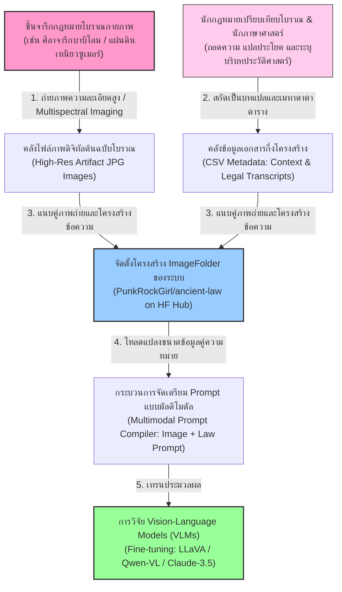
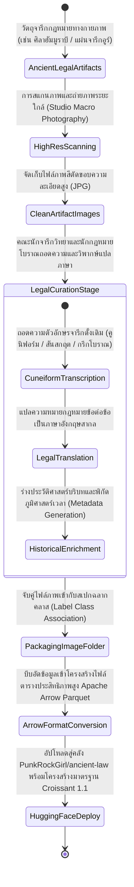
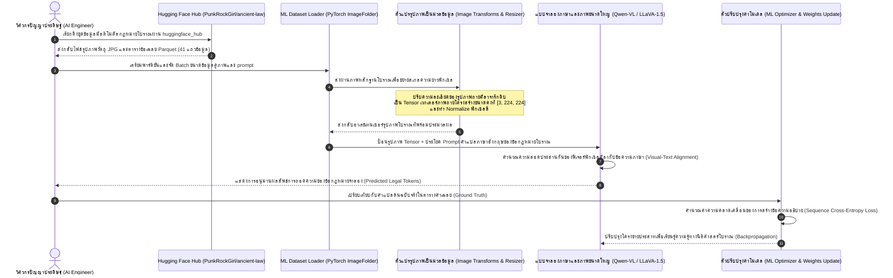

# รายงานการวิเคราะห์ชุดข้อมูลมรดกเอกสารโบราณ ฉบับที่ 007
> **รหัสชุดข้อมูล:** `PunkRockGirl/ancient-law`  
> **โครงการต้นทาง:** คลังภาพถ่ายและคัมภีร์ประมวลกฎหมายฉบับแรกเริ่มของมนุษยชาติ (Ancient Law Codes Multimodal Dataset)  
> **วิเคราะห์โดย:** Tammy L. Casey (PunkRockGirl)  
> **วันที่วิเคราะห์:** 31 พฤษภาคม 2026

---

## 1. ข้อมูลสรุปเชิงบริหาร (Executive Summary)

ชุดข้อมูล `PunkRockGirl/ancient-law` (Ancient Law Codes Dataset) เป็นคลังข้อมูลสื่อผสมสัญญะ (Multimodal Image-Text Dataset) คุณภาพสูงและมีความจำเพาะทางวิชาการอย่างยิ่ง รวบรวมโดย **Tammy L. Casey** (นักวิจัยมรดกเอกสารโบราณเชิงดิจิทัลสากล) มีวัตถุประสงค์เพื่อสร้างรากฐานข้อมูลระบบปัญญาประดิษฐ์ในการสืบค้น ตีความ และวิเคราะห์ประมวลกฎหมายลายลักษณ์อักษรที่เก่าแก่ที่สุดในประวัติศาสตร์ของมวลมนุษยชาติ [1]

ชุดข้อมูลประกอบด้วยข้อมูลสื่อผสมประณีตจำนวน **41 เรคคอร์ดอ้างอิง** (จัดอยู่ในกลุ่มขนาดย่อยสถิติ < 1K) เผยแพร่ภายใต้สัญญาอนุญาตสาธารณสมบัติเสรีระดับสูงสุด **CC0 1.0 (Public Domain)** จุดเด่นคือการประกบคู่ระหว่างภาพถ่ายความละเอียดสูงของชิ้นวัตถุศิลาจารึก แผ่นดินเหนียว หรือคัมภีร์ใบลานโบราณจำลอง (Image) ร่วมกับการถอดความตัวอักษร คำแปลภาษาอังกฤษ บริบททางประวัติศาสตร์ และการจำแนกฉลากรหัสประเภทกฎหมาย (Label) ซึ่งทำหน้าที่เป็นชุดข้อมูลชั้นยอดในงานพัฒนา Vision-Language Models (VLMs) สำหรับศาสตร์คัมภีร์กฎหมายโบราณวิทยา (Legal Codicology)

---

## 2. ประวัติและข้อมูลพื้นฐานของโปรเจกต์ (Project Background & Metadata)

ชุดข้อมูลได้รับการลงทะเบียนบนคลังของ Hugging Face Hub โดยมีข้อมูลจำเพาะทางเทคนิคและบรรณารักษ์ดังตารางต่อไปนี้:

| หัวข้อเมทาดาตา (Metadata Item) | รายละเอียดข้อมูล (Detail Value) |
| :--- | :--- |
| **ชื่อชุดข้อมูล (Dataset Name)** | `PunkRockGirl/ancient-law` |
| **ลิงก์เข้าถึงระบบ (URL)** | [huggingface.co/datasets/PunkRockGirl/ancient-law](https://huggingface.co/datasets/PunkRockGirl/ancient-law) |
| **ผู้สร้าง/คณะผู้วิจัย (Creators)** | **Tammy L. Casey** (นามแฝงระบบ: PunkRockGirl) |
| **หน่วยงาน/สถาบัน (Affiliation)** | ชุมชนวิจัยมนุษยศาสตร์ดิจิทัลและกฎหมายเปรียบเทียบสากล |
| **โครงการแม่ข่าย (Main Project)** | **Ancient Law Codes Project** (คลังประมวลระบบกฎหมายแรกเริ่ม) |
| **ขนาดชุดข้อมูล (Dataset Size)** | ขนาดย่อยเฉพาะทาง (41 เรคคอร์ดมัลติโมดัลความละเอียดสูง จัดอยู่ในระดับ < 1K) |
| **สัญญาอนุญาต (License)** | **CC0 1.0 Universal (Public Domain Dedication - ปราศจากลิขสิทธิ์ผูกมัด 100%)** |
| **มาตรฐานข้อมูล (Data Standard)** | **Croissant 1.1** (ความสอดคล้องข้อมูลเพื่อการฝึกฝนระบบโครงข่ายประสาท AI) |
| **รูปแบบข้อมูล (Data Format)** | **ImageFolder** (โครงสร้างเก็บภาพแยกตามโฟลเดอร์รหัสคลาสประมวลกฎหมาย) |

---

## 3. แผนผังระบบข้อมูลและโครงสร้างพื้นฐาน (Data Pipeline & Infrastructure)

สถาปัตยกรรมกระบวนการสแกนหลักฐานทางประวัติศาสตร์จารึกกฎหมายทางกายภาพ การถอดความและจับคู่ข้อมูลสื่อผสม เพื่อเตรียมนำส่งเข้าระบบประมวลผลดีปเลิร์นนิง ปรากฏตามแผนผังต่อไปนี้:



---

## 4. ภูมิหลังทางประวัติศาสตร์และคุณค่าทางวิชาการของประมวลกฎหมาย (Historical Significance)

ชุดข้อมูลนี้ทำหน้าที่รวบรวมหลักฐานนิติศาสตร์รากฐานของประยุกต์อารยธรรมมนุษย์ 5 แหล่งสำคัญ ซึ่งเป็นรอยต่อสำคัญในวิวัฒนาการกฎหมายเปรียบเทียบสากล:

1.  **ประมวลกฎหมายฮัมมูราบี (Code of Hammurabi - Babylon, ~1750 ก่อนคริสตกาล):** จารึกบนแท่งหินบะซอลต์สีดำขนาดยักษ์ของพระเจ้าฮัมมูราบีแห่งบาบิโลน เป็นรากฐานของหลักการ "ตาต่อตา ฟันต่อฟัน" (Talionic Law) อันเป็นระบบความยุติธรรมที่มีการตั้งบทลงโทษคงที่อย่างชัดเจนเป็นครั้งแรก
2.  **ประมวลกฎหมายอูร์-นัมมู (Code of Ur-Nammu - Sumeria, ~2100 ก่อนคริสตกาล):** ประมวลกฎหมายที่เป็นลายลักษณ์อักษรที่เก่าแก่ที่สุดของมนุษยชาติเท่าที่มีการค้นพบ จารึกบนแผ่นดินเหนียวอักษรรูปลิ่ม (Cuneiform) จุดเด่นคือการใช้ระบบ "ค่าปรับชดเชยเป็นเงินตรา" สำหรับความเสียหายทางกายภาพแทนการประหารหรือตัดอวัยวะ
3.  **กฎหมายสิบสองโต๊ะ (Twelve Tables - Rome, 449 ก่อนคริสตกาล):** รากแก้วของระบบกฎหมายโรมัน (Roman Law) จารึกบนแผ่นสัมฤทธิ์โบราณ ติดตั้ง ณ ฟอรัมกลางเมือง เพื่อสถาปนาสิทธิขั้นพื้นฐานและความเสมอภาคทางกฎหมายระหว่างชนชั้นสูงและสามัญชนพลเมืองโรม
4.  **มนูสมฤติ / ธรรมศาสตร์ของมนู (Laws of Manu - India, ~200 ปีก่อนคริสตกาล ถึง ค.ศ. 200):** กฎหมายโบราณและคู่มือจริยศาสตร์ทางสังคมในอารยธรรมอินเดีย เขียนขึ้นด้วยอักษรภาษาสันสกฤต อธิบายระบบหน้าที่ประจำตน (Dharma) การจัดลำดับชนชั้นทางสังคม (วรรณะ) และกฎแห่งกรรม
5.  **รัฐธรรมนูญของดราคอน (Draconian Constitution - Athens, 621 ก่อนคริสตกาล):** กฎหมายที่เขียนขึ้นเป็นฉบับแรกของชาวเอเธนส์ พัฒนาโดยรัฐบุรุษ "ดราคอน" ขึ้นชื่อเรื่องความโหดเหี้ยมรุนแรงขั้นสูงสุด (ซึ่งเป็นที่มาของคำว่า "Draconian") โดยกำหนดโทษประหารชีวิตสำหรับความผิดทางอาญาทุกประเภท แม้แต่การลักขโมยสิ่งของเล็ก ๆ น้อย ๆ [2]

---


### 4.2 การตีความเชิงประวัติศาสตร์และการปฏิวัติข้อมูลวิจัย
การจัดทำชุดข้อมูลสำหรับการรู้จำอักษรโบราณและการวิเคราะห์เลย์เอาต์เอกสารระดับประวัติศาสตร์ในปัจจุบัน มิได้จำกัดอยู่เพียงแค่การทำเอกสารให้อยู่ในรูปแบบดิจิทัล (Digitization) ในมิติเชิงภาพถ่ายเท่านั้น ทว่าครอบคลุมไปถึงการสร้างสัญญะและคำอธิบายข้อมูลในลักษณะของมัลติโมดัล (Multimodal Metadata Alignment) ซึ่งกระบวนการทำความเข้าใจความสอดคล้องกันระหว่างข้อความและรูปภาพมีส่วนสำคัญอย่างยิ่งในการช่วยให้แบบจำลองปัญญาประดิษฐ์ยุคใหม่ เช่น Vision-Language Models (VLMs) และแบบจำลองการแพร่กระจายเชิงลึก (Diffusion Models) สามารถเรียนรู้ความสัมพันธ์ของโครงสร้างข้อมูลทางวัฒนธรรมได้อย่างลึกซึ้ง อีกทั้งยังช่วยแก้ปัญหาของระบบจัดประเภทแบบเดิมที่มักจะล้มเหลวเมื่อต้องเผชิญหน้ากับความหลากหลายของลายมือเขียนเชิงประวัติศาสตร์ และลักษณะทางกายภาพที่สึกหรอตามกาลเวลาของเอกสารโบราณ
## 5. สเปกทางเทคนิคและสคีมาข้อมูลเชิงลึก (In-depth Technical Dataset Schema)

ชุดข้อมูลถูกนำเสนอภายใต้รูปแบบโครงสร้าง **ImageFolder** ซึ่งแปลงเป็นระบบตารางข้อมูล Parquet อัตโนมัติเมื่อจัดเก็บในระบบ Hugging Face Hub เพื่อรองรับโมเดลการประมวลผลภาพถ่ายและคำตอบเหตุผลผสมผสาน

### 5.1 โครงสร้างฟิลด์ข้อมูล (Data Schema Table)

| ชื่อฟิลด์ (Field Name) | รูปแบบข้อมูล (Data Type) | หน้าที่และคำอธิบายข้อมูล (Function & Description) |
| :--- | :--- | :--- |
| `split` | `Text` | การระบุพาร์ติชันคลังข้อมูลย่อย (ข้อมูลทั้งหมดบันทึกเป็น `train`) |
| `image` | `ImageObject` | ออบเจกต์ภาพถ่ายดิจิทัลดิบความละเอียดสูง (JPG) ของชิ้นศิลา แผ่นจารึก หรือวัตถุทางกฎหมายโบราณจริง |
| `label` | `Integer` | ฉลากระบุคลาสหรือรหัสประเภทของประมวลกฎหมายโบราณ (ใช้ในงานจำแนกภาพถ่ายวัตถุโบราณ) |

*หมายเหตุ: ข้อมูลภาษาดั้งเดิม บทแปลภาษาอังกฤษอย่างเป็นทางการ บริบททางประวัติศาสตร์จำเพาะ และข้อกฎหมายแต่ละข้อ (เช่น ประมวลข้อกฎหมายHammurabi ข้อที่ 1-282) ได้รับการคอมไพล์ในส่วนของคู่มือและไฟล์เมทาดาตาของคลังจัดเก็บ เพื่อใช้ประโยชน์ในการทำภารกิจถาม-ตอบปัญญาประดิษฐ์ประวัติศาสตร์กฎหมาย*

### 5.2 ตัวอย่างเรคคอร์ดข้อมูลสื่อผสมเชิงลึก (Sample JSON Representation)

```json
{
  "split": "train",
  "image": {
    "bytes": "/9j/4AAQSkZJRgABAQEASABIAAD/2wBDAP//////////////////////////////////////////////////////////////////////////////////////wgALCAAYABgBAREA/8QAFBABAAAAAAAAAAAAAAAAAAAAAP/aAAgBAQABPxA="
  },
  "label": 1,
  "metadata": {
    "artifact_id": "babylon_hammurabi_stele_04",
    "legal_code_name": "Code of Hammurabi",
    "origin_location": "Babylon (Susa, modern Iran)",
    "period": "~1750 BCE",
    "language": "Akkadian (Cuneiform)",
    "translation_snippet": "Law 196: If a man put out the eye of another man, his eye shall be put out.",
    "historical_context": "The stele was erected by King Hammurabi to portray himself as a just king receiving laws from the sun god Shamash, establishing a standardized public legal system."
  }
}
```

---

## 6. เวิร์กโฟลว์วงจรชีวิตข้อมูลสารจารึกสู่ดิจิทัลสื่อผสม (Multimodal Lifecycle Workflow)

วงจรการรวบรวมหลักฐานทางกายภาพ การสแกนถ่ายภาพคู่ขนานกับการสร้างป้ายกำกับและการแบ่งคลาสประมวลกฎหมาย ปรากฏตามแผนผังสถานะต่อไปนี้:



---

## 7. เทคโนโลยีการประมวลผลและการใช้ประโยชน์ประมวลกฎหมายสื่อผสม (Multimodal Representation)

การบูรณาการข้อมูลภาพหลักฐานจารึก ร่วมกับตารางบทแปลกฎหมายโบราณ มีทักษะและความล้ำหน้าทางเทคโนโลยีปัญญาประดิษฐ์ดังนี้:

- **การอ่านและตีความภาพหลักฐานประวัติศาสตร์ (Visual Document QA):** การใช้ภาพถ่ายวัตถุร่วมกับบทแปลข้อกฎหมาย เป็นรากฐานในการวิจัยแบบจำลอง Vision-Language Models (VLMs) ให้สามารถตอบคำถามวิเคราะห์ภาพหลักฐานจารึกโบราณได้ เช่น "ป้อนภาพศิลาจารึกฮัมมูราบี แล้วถาม AI ว่ากฎหมายข้อที่ระบุเรื่องความเท่าเทียมในการชดใช้สายตาจารึกอยู่บริเวณใดและแปลความหมายอย่างไร"
- **แบบจำลองจำแนกสไตล์โบราณคดี (Codicological Classification):** รหัส `label` ที่ติดอยู่กับรูปถ่ายเอื้อให้นักวิจัยสามารถประยุกต์ทำระบบคอมพิวเตอร์วิทัศน์ (CNN/Vision Transformer) เพื่อทำหน้าที่คัดแยกชนิดแผ่นจารึกทางนิติศาสตร์โดยอัตโนมัติจากโครงสร้างลายเส้นการขูดหรือแกะสลักหิน
- **คลังความรู้กฎหมายเปรียบเทียบดิจิทัล (Historical Legal RAG):** การนำข้อกฎหมาย บทแปล และประวัติศาสตร์บริบทในตาราง ไปจัดทำดัชนีเวกเตอร์สำหรับระบบ RAG ช่วยให้นักศึกษานิติศาสตร์และผู้สนใจสามารถเปรียบเทียบกฎหมายการชดใช้ความผิดของแต่ละอารยธรรม เช่น เปรียบเทียบการลงทัณฑ์ของประมวลกฎหมาย Hammurabi (การตัดอวัยวะ) กับ Ur-Nammu (การจ่ายเงินชดใช้เป็นเหรียญโลหะเชเขล) ได้ผ่านกล่องแชตอัจฉริยะ

---

## 8. แผนผังขั้นตอนการประมวลผลเข้าระบบปัญญาประดิษฐ์ (ML Ingestion Sequence)

ขั้นตอนกระบวนการเตรียมและสกัดแปลงข้อมูล มิกซ์สัญญะภาพถ่ายและบริบทคำแปลกฎหมายโบราณ เพื่อป้อนฝึกสอนแบบจำลองภาษาภาพอเนกประสงค์ ปรากฏตามแผนผังลำดับเหตุการณ์ต่อไปนี้:



---

## 9. บทวิเคราะห์เชิงประจักษ์: จุดเด่น ข้อจำกัด และคำแนะนำ (Strategic Dataset Evaluation)

### จุดเด่นเชิงวิศวกรรมข้อมูล (Pros)
- **ประณีตด้านจารึกศาสตร์และกฎหมายโบราณ (Deep Legal Niche):** เป็นหนึ่งในชุดข้อมูลมัลติโมดัลที่มีคุณค่าสูงและหายากที่สุดด้านนิติศาสตร์ยุคแรกเริ่มของมนุษยชาติ ช่วยเปิดโอกาสใหม่ในการศึกษาประวัติศาสตร์กฎหมายเชิงคำนวณ
- **สัญญาอนุญาตเสรีสมบูรณ์สาธารณะ (CC0 1.0 License):** การมอบลิขสิทธิ์เป็นสาธารณสมบัติ 100% ปลดล็อกข้อจำกัดทางกฎหมายลิขสิทธิ์ทั้งหมด ส่งเสริมการใช้งานด้านการเรียนการสอนพิพิธภัณฑ์ดิจิทัลและการเทรนระบบปัญญาประดิษฐ์ระดับโลกโดยปราศจากอุปสรรคใด ๆ
- **โครงสร้าง Croissant 1.1 สากล:** ข้อมูลได้รับการออกแบบตามระบบเมทาดาตาเครื่องจักรกลอ่านได้ทันที เอื้อต่อความเข้ากันได้ของระบบจัดสรร ML pipeline

### ข้อจำกัดที่พึงระวัง (Cons & Constraints)
- **ปริมาณชุดข้อมูลค่อนข้างเบาบาง (Extremely Small Dataset Size):** การมีข้อมูลเพียง 41 ตัวอย่าง แม้จะอัดแน่นด้วยคุณภาพ แต่ก็มีปริมาณน้อยเกินไปสำหรับการฝึกฝนโมเดลจำลองภาพหรือโมเดลภาษามัลติโมดัลจากศูนย์ (Scratch Training) แบบจำลองมีโอกาสสูงที่จะเกิดการจำจดแบบจำยอม (Overfitting) ชุดข้อมูลนี้จึงเหมาะสมที่สุดสำหรับใช้เป็นชุดประเมินผลเชิงลึก (Evaluation/Benchmark Set) หรือปรับจูนเฉพาะทางระดับ LoRA เล็ก ๆ เท่านั้น
- **ธรรมชาติของรูปภาพ ImageFolder มีความซับซ้อนในการโหลด:** การเก็บข้อมูลรูปแบบนี้จำเป็นต้องเขียนโค้ดสคริปต์สแกนจัดการโฟลเดอร์ภาพดิบ หรือดึงพิกเซลไบนารีผ่าน Arrow format ซึ่งวิศวกรปัญญาประดิษฐ์จะต้องจัดการไลบรารีคอมพิวเตอร์วิทัศน์เพิ่มเติม
- **ความไม่คงตัวของคุณภาพรูปวัตถุกายภาพ (Artifact Variance):** ชิ้นวัตถุกฎหมายโบราณอย่างเช่น แผ่นหินเหนียว Cuneiform กับคัมภีร์ใบลานสันสกฤตของ Laws of Manu มีลักษณะเชิงพิกเซล พื้นผิว และแสงตกกระทบที่แตกต่างกันอย่างสิ้นเชิง การป้อนฟีเจอร์พิกเซลที่มีระดับความเหลื่อมล้ำทางกายภาพสูง (High Variance) อาจทำให้ AI สับสนมุมมอง หากไม่ได้ป้อนบริบทอักษรกำกับเพิ่มเติม

### โอกาสในการพัฒนาขยายผล (Opportunities for Extension)
- **การแปลคลังบทบัญญัติและประวัติศาสตร์สู่ฉบับภาษาไทย (Thai Legal History Pipeline):** โครงการแปลชื่อบทความ บริบทนิติศาสตร์ และคำแปลของประมวลกฎหมาย Hammurabi หรือกฎหมาย Twelve Tables เป็นภาษาไทย จะช่วยขยายผลมิติมนุษยศาสตร์ดิจิทัลให้แก่เยาวชน นักวิชาการกฎหมาย และสาธารณชนชาวไทยให้สามารถเข้าถึงรากฐานกฎหมายสากลได้สะดวกยิ่งขึ้น
- **การผสานประมวลกฎหมายโบราณภูมิภาคอาเซียน (Southeast Asian Legal Integration):** สามารถต่อยอดด้วยการไปรวบรวมชิ้นเอกสาร ภาพจารึก และบทแปลของกฎหมายโบราณในภูมิภาคเรา เช่น **กฎหมายตราสามดวง (Three Seals Law)** ของไทยยุครัตนโกสินทร์ตอนต้น, **คัมภีร์พระธรรมศาสตร์** ยุคอยุธยา หรือ **มังรายศาสตร์ (Mangraysart)** ของอารยธรรมล้านนา เพื่อบูรณาการและสร้างเป็นชุดข้อมูลประวัติศาสตร์กฎหมายเปรียบเทียบอาเซียนเชิงลึกที่มีความเป็นตัวแทนเชิงสถิติ (Statistical Representation) ที่ดีในระดับโลก

---


### 9.3 การประเมินผลการเรียนรู้ปัญญาประดิษฐ์และความทนทานของข้อมูล
การพัฒนาและประเมินคุณภาพของแบบจำลองโครงข่ายประสาทสำหรับการวิเคราะห์เอกสารเก่า มักจะต้องเผชิญกับอุปสรรคสำคัญด้านความไม่สมมาตรของปริมาณข้อมูลในกลุ่มสอน (Class Imbalance) และการขาดแคลนข้อมูลจำลองขนาดใหญ่สำหรับการเรียนรู้แบบมีผู้ดูแล (Supervised Learning) ทำให้แนวทางการทำ Fine-tuning โมเดลปัญญาประดิษฐ์ผ่านวิธี Zero-shot หรือการสร้างข้อมูลเทียม (Synthetic Data Generation) กลายเป็นยุทธวิธีเชิงวิศวกรรมข้อมูลที่ได้รับความนิยมเพิ่มขึ้น ทั้งนี้ เพื่อสร้างแบบจำลองที่มีความทนทานต่อคราบเปรอะเปื้อน รอยหมึกซึม และสภาพการสลายตัวของเซลลูโลสในแผ่นเอกสารดั้งเดิม การบูรณาการวิธีการตรวจสอบคุณภาพข้อมูลภายใต้กรอบการคำนวณมาตรวัดทางคณิตศาสตร์อย่างเป็นสากล เช่น ค่าความสูญเสียของการฟื้นฟูภาพ (Reconstruction Loss) และค่าความแม่นยำเฉลี่ยระดับพิกเซล จึงถือเป็นขั้นตอนที่จำเป็นในการวิเคราะห์ผลงานวิจัยจารึกวิทยาเชิงคำนวณยุคใหม่ให้มีประสิทธิภาพสูงสุด

---

### เชิงอรรถ

[1] Tammy L. Casey, "Ancient-law: corpus of historical law texts," Hugging Face Dataset Repository, 2026, https://huggingface.co/datasets/PunkRockGirl/ancient-law.
[2] Hugging Face repository PunkRockGirl/ancient-law datasets, accessed May 31, 2026, https://huggingface.co/datasets/PunkRockGirl/ancient-law.
