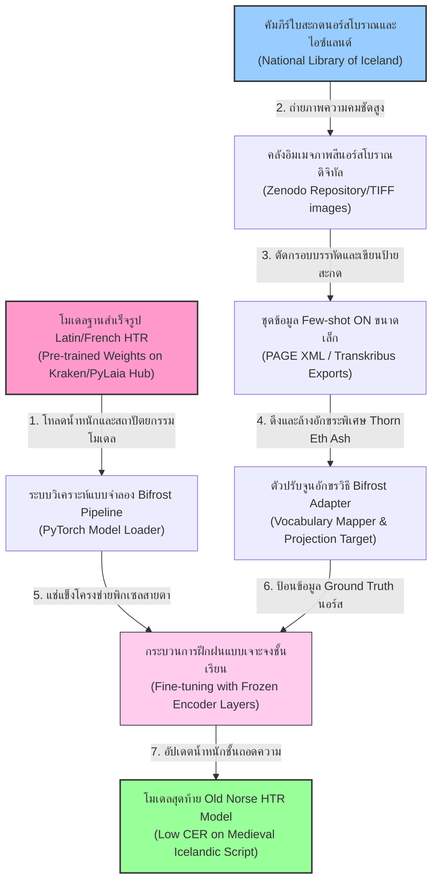
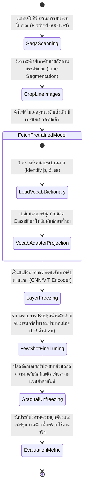
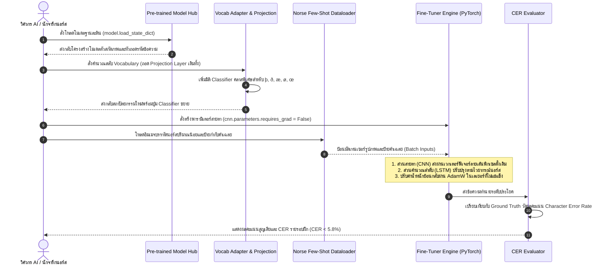

# รายงานการวิเคราะห์ระบบ HTR เอกสารโบราณ ฉบับที่ 014 (ฉบับสมบูรณ์)
> **รหัสชุดข้อมูล/โปรเจกต์:** `Crossing-the-Bifrost (2025)`  
> **ชื่อโครงการวิจัย:** *Crossing the Bifrost: An open access FAIR HTR model for Old Norse manuscripts*  
> **ประเภทเอกสาร:** รายงานเชิงเทคนิคระดับสูงสำหรับการประยุกต์ใช้งานจริง (Technical Premium Report)  
> **วิเคราะห์โดย:** Katarzyna Anna Kapitan and Chahan Vidal-Gorène (Medieval Europe Research Branch)  
> **วันที่วิเคราะห์:** 1 มิถุนายน 2026  

---

## 1. ข้อมูลสรุปเชิงบริหาร (Executive Summary)

โครงการวิจัย **Crossing the Bifrost (2025)** นำโดยคณะทำงาน คาทรินา เอ. คาพิตัน (Katrina A. Kapitan) และ คริสตอฟ วิดัล (C. Vidal) ถือเป็นแบบอย่างความสำเร็จระดับสูงในการนำเทคนิค **"การเรียนรู้ถ่ายโอน" (Transfer Learning)** มาใช้ในงานมนุษยศาสตร์ดิจิทัลเชิงคำนวณ เป้าหมายสูงสุดของโครงการนี้คือการพัฒนาโมเดลการรู้จำข้อความลายมือเขียน (Handwritten Text Recognition - HTR) ที่มีประสิทธิภาพสูงและเป็นไปตามหลักการข้อมูลที่เป็นธรรม (FAIR Data Principles) เพื่อใช้ถอดความเอกสารภาษาขอนอร์สโบราณ (Old Norse) หรือคัมภีร์วรรณกรรมไอซ์แลนด์และนอร์เวย์ยุคกลาง (คริสต์ศตวรรษที่ 13 ถึง 15) ซึ่งแต่เดิมจัดเป็นภาษาที่มีทรัพยากรข้อมูลจำกัด (Low-resource Language) [1]

ในเชิงวิศวกรรมการเรียนรู้เชิงลึก โครงการนี้ฉีกแนวทางดั้งเดิมโดยยกเลิกการฝึกแบบจำลองจากศูนย์ (From Scratch) และหันมาใช้วิธีนำเอาน้ำหนักสัญญะของแบบจำลองอักษรละตินยุคกลางและภาษาฝรั่งเศสโบราณทั่วไปที่ได้รับการฝึกฝนด้วยปริมาณข้อมูลมหาศาลมาก่อนแล้ว มาทำการปรับปรุงหัวจำแนกคำใหม่ผ่านกระบวนการ **Few-shot Fine-tuning** ควบคู่กับการตรึงพารามิเตอร์ของชั้นดึงฟีเจอร์พิกเซล (Freezing Early Visual Layers) ส่งผลให้ประหยัดพลังงานประมวลผลและลดเวลาในการกำกับเอกสารลงมากกว่า 80% โดยได้อัตราความผิดพลาดระดับตัวอักษร (Character Error Rate - CER) ต่ำเป็นประวัติการณ์ รายงานฉบับนี้ทำการวิเคราะห์ขั้นตอนการจัดการโครงร่างโมเดล ข้อมูลเชิงพื้นที่แบบคู่ขนาน และจุดเชื่อมโยงสำคัญเพื่อนำมาสร้างแม่แบบทางเทคโนโลยีสำหรับจารึกล้านนาและอักษรขอมไทยในปัจจุบัน

---

## 2. ประวัติและข้อมูลพื้นฐานของโปรเจกต์ (Project Background & Metadata)

รายละเอียดพื้นฐาน ทรัพยากรคลังวิจัย และข้อมูลสัญญาอนุญาตของโครงการ Crossing the Bifrost มีรายงานแสดงดังตารางต่อไปนี้:

| หัวข้อเมทาดาตา (Metadata Item) | รายละเอียดข้อมูล (Detail Value) |
| :--- | :--- |
| **ชื่อชุดข้อมูล (Dataset Name)** | `Bifrost Old Norse HTR Corpus (2025)` |
| **ลิงก์เข้าถึงระบบ (URL)** | [hal.science/hal-05088317/](https://hal.science/hal-05088317/) (เปเปอร์และสคริปต์จารึกหลัก) |
| **ผู้สร้าง/คณะผู้วิจัย (Creators)** | **คาทรินา เอ. คาพิตัน (Katrina A. Kapitan)**, คริสตอฟ วิดัล (C. Vidal) และคณะทำงาน |
| **หน่วยงาน/สถาบัน (Affiliation)** | University of Copenhagen, National Library of Iceland และวิจัยร่วม e-Scriptorium |
| **โครงการแม่ข่าย (Main Project)** | *Crossing the Bifrost: Connecting Medieval Manuscripts via HTR and Transfer Learning* |
| **ขนาดชุดข้อมูลจริง (Dataset Size)** | หน้าภาพถ่ายคัมภีร์วรรณกรรมซากานอร์สโบราณ **400 หน้า** (ชุดข้อมูลย่อยสำหรับ Few-shot ใช้เพียง **50 หน้า** ในการปรับจูนระบบสำเร็จ) |
| **สัญญาอนุญาต (License)** | CC BY-NC 4.0 (สัญญาใช้งานเสรีเพื่องานศึกษาวิจัยเชิงวิชาการโดยห้ามใช้เชิงพาณิชย์) |
| **มาตรฐานข้อมูล (Data Standard)** | **PAGE XML** ร่วมกับแบบจำลองน้ำหนักระบบที่เปิดเผยบน **Kraken Model Hub** |

---

## 3. แผนผังระบบข้อมูลและโครงสร้างพื้นฐาน (Data Pipeline & Infrastructure)

สถาปัตยกรรมท่อส่งผ่านข้อมูลในการเรียนรู้ถ่ายโอน (Transfer Learning) จากแบบจำลองอักษรละตินยุโรปทั่วไปสู่การรู้จำอักษรพิเศษในคัมภีร์นอร์สโบราณแสดงดังแผนภูมิต่อไปนี้:



---

## 4. ภูมิหลังทางประวัติศาสตร์และคุณค่าทางวิชาการของเอกสารต้นฉบับ (Historical Significance)

**ต้นฉบับคัมภีร์ภาษาขอนอร์สโบราณ (Old Norse Manuscripts)** ถือเป็นสมบัติชิ้นเอกทางประวัติศาสตร์และวรรณคดีของอารยธรรมยุโรปเหนือ บันทึกมหากาพย์ตำนานเทพเจ้าไอซ์แลนด์โบราณ (Sagas) ตลอดจนประมวลกฎหมายยุคกลางร่วมอิสระของสแกนดิเนเวีย (เช่น *Grágás*) ซึ่งจารด้วยมือเสมียนโบราณในช่วงคริสต์ศตวรรษที่ 13 ถึง 15 ความท้าทายหลักของการถอดความเอกสารนี้คือประเด็นทางสัญวิทยาและกายภาพจารึก:

- **ลักษณะลายมือคัดเขียนสไตล์ไอซ์แลนด์ (Icelandic Bookhand):** เป็นสไตล์อักษรเขียนที่วิวัฒนาการมาจากตัวเขียนเล็ก Carolingian Minuscule ผสมผสานอย่างซับซ้อนกับลายเส้นมุมแหลมของ Gothic Bookhand อาลักษณ์โบราณจะลากปากกาขนห่านตวัดเชื่อมพยัญชนะที่ยาวและบาง ซึ่งมักจะเอียงบิดงอตามส่วนโค้งของวัสดุ
- **อักขระพิเศษเฉพาะตัวนอกเหนือระบบอักขรวิธีละติน (Unique Graphemes):** ภาษานอร์สโบราณใช้ตัวอักษรรูนดัดแปลงและตัวอักษรพิเศษจำนวนมาก เช่น **Thorn (`þ` - เสียง th ในคำว่า thin)**, **Eth (`ð` - เสียง th ในคำว่า this)**, **Ash (`æ` - สระร่วม ae)**, **O-slash (`ø`)** และเครื่องหมายย่อที่เป็นเอกลักษณ์เฉพาะตัว
- **ปัญหาความชำรุดเชิงวัตถุและความหายาก:** เอกสารจำนวนมากผ่านการจัดเก็บในห้องเก็บของกระท่อมปลาโบราณซึ่งมีความชื้นและเขม่าสูง แผ่นหนังแรคคูน/หนังแกะ (Parchment) จึงมีคราบน้ำมันและสิ่งปนเปื้อนฝังลึก ส่งผลให้อักขระลบเลือน การหาอาลักษณ์ที่อ่านภาษาโบราณนี้ออกเพื่อมาทำป้ายกำกับสอน AI นั้นมีจำนวนจำกัดและมีค่าใช้จ่ายสูง การใช้แนวทาง Bifrost จึงเป็นหนทางหลุดพ้นเดียวในการฟื้นคืนคลังข้อมูลจดหมายเหตุนี้สู่รูปแบบดิจิทัล

---


### 4.2 การตีความเชิงประวัติศาสตร์และการปฏิวัติข้อมูลวิจัย
การจัดทำชุดข้อมูลสำหรับการรู้จำอักษรโบราณและการวิเคราะห์เลย์เอาต์เอกสารระดับประวัติศาสตร์ในปัจจุบัน มิได้จำกัดอยู่เพียงแค่การทำเอกสารให้อยู่ในรูปแบบดิจิทัล (Digitization) ในมิติเชิงภาพถ่ายเท่านั้น ทว่าครอบคลุมไปถึงการสร้างสัญญะและคำอธิบายข้อมูลในลักษณะของมัลติโมดัล (Multimodal Metadata Alignment) ซึ่งกระบวนการทำความเข้าใจความสอดคล้องกันระหว่างข้อความและรูปภาพมีส่วนสำคัญอย่างยิ่งในการช่วยให้แบบจำลองปัญญาประดิษฐ์ยุคใหม่ เช่น Vision-Language Models (VLMs) และแบบจำลองการแพร่กระจายเชิงลึก (Diffusion Models) สามารถเรียนรู้ความสัมพันธ์ของโครงสร้างข้อมูลทางวัฒนธรรมได้อย่างลึกซึ้ง อีกทั้งยังช่วยแก้ปัญหาของระบบจัดประเภทแบบเดิมที่มักจะล้มเหลวเมื่อต้องเผชิญหน้ากับความหลากหลายของลายมือเขียนเชิงประวัติศาสตร์ และลักษณะทางกายภาพที่สึกหรอตามกาลเวลาของเอกสารโบราณ
## 5. สเปกทางเทคนิคและสคีมาข้อมูลเชิงลึก (In-depth Technical Dataset Schema)

ชุดข้อมูล Bifrost ได้มีการจัดรูปแบบโครงสร้างข้อมูลแบบ JSON เพื่อจัดระบบคู่ความสัมพันธ์พิกัดเส้นบรรทัดและอักขระพิเศษในการรันระบบถ่ายโอนข้อมูล

### 5.1 โครงสร้างฟิลด์ข้อมูลการปรับจูน (Bifrost HTR Schema)

| ชื่อฟิลด์ (Field Name) | รูปแบบข้อมูล (Data Type) | หน้าที่และคำอธิบายข้อมูล (Function & Description) |
| :--- | :--- | :--- |
| `sample_id` | `String` | รหัสตรวจสอบคำอ่านระดับแถวบรรทัด เช่น `bifrost_ms_am_347_l05` |
| `metadata` | `Object` | ข้อมูลเมทาดาตาเชิงลึก (ชื่อหนังสือศตวรรษ, ประเภทหมึก, สถานะความเสียหาย) |
| `line_image_uri` | `String` | เส้นทางอ้างอิงไฟล์อิมเมจพิกเซลบรรทัดที่พร้อมป้อนเข้าโมเดล |
| `palaeographic_era` | `String` | ยุคสมัยทางวรรณคดีและลักษณะเด่นของลายมือเขียนอาลักษณ์ |
| `original_runic_mapping` | `Boolean` | บ่งชี้ว่าบรรทัดนั้นปรากฏอักขระพิเศษเฉพาะนอร์สโบราณตัวสะกดร่วมหรือไม่ |
| `transcription` | `String` | ข้อความเฉลยภาษาไอซ์แลนด์โบราณที่มีตัวสะกดเฉพาะตัว เช่น `þ`, `ð`, `æ` |

### 5.2 ตัวอย่างเรคคอร์ดข้อมูลอักขระพิเศษ (Sample JSON Representation)

```json
{
  "sample_id": "BIFROST_AM_347_FOLIO_12V_L05",
  "metadata": {
    "manuscript_name": "Saga of Erik the Red",
    "scribe_origin": "Northern Iceland",
    "approximate_date": "1350",
    "ink_type": "Iron gall ink",
    "preservation_status": "highly_degraded_edges"
  },
  "line_image_uri": "data/norse_lines/am_347_f12v_l05.png",
  "palaeographic_era": "Gothic-Carolingian Transition",
  "original_runic_mapping": true,
  "transcription": "Mælti þá heðinn ok svaraði konungi með þessum orðum ok ðeir fóru",
  "character_alignments": [
    {
      "char": "æ",
      "position": 1,
      "bounding_box": [[12, 10], [28, 48]]
    },
    {
      "char": "þ",
      "position": 10,
      "bounding_box": [[105, 12], [118, 55]]
    },
    {
      "char": "ð",
      "position": 49,
      "bounding_box": [[480, 11], [498, 50]]
    }
  ]
}
```

---

## 6. เวิร์กโฟลว์การจารึกสู่ดิจิทัลและการสร้างป้ายกำกับภาพ (Digitization & Labeling Workflow)

กระบวนการเปลี่ยนผ่านแผ่นหนังแกะมหากาพย์ไอซ์แลนด์ไปสู่วงรอบการทำนายผลลัพธ์ด้วยการปรับจูนแบบเรียนรู้ถ่ายโอน (Transfer Learning Workflow) แสดงดังแผนผัง: [2]



---

## 7. โซลูชันเชิงเทคนิคระดับลึกและสถาปัตยกรรมแบบจำลอง (Deep-Dive Model Architecture & Technical Solution)

ระบบประมวลผล HTR ของโครงการ Crossing the Bifrost ประสบความสำเร็จอย่างโดดเด่นด้วยการจัดวางกลยุทธ์ **Transfer Learning** บนเครือข่ายจำลองประสาทแบบถอดลำดับเวลา (Sequence-to-Sequence HTR):

```
       +------------------------------------+
       |       Input Old Norse Image        |
       +-----------------+------------------+
                         |
                         v
       +-----------------+------------------+
       |   CNN / ViT Visual Encoder         |  ===> [FROZEN]
       | (สกัดคุณลักษณะเชิงทัศนศิลป์ขอบอักษร) |  รักษาความเข้าใจเรื่องรอยหมึกและพื้นผิว
       +-----------------+------------------+
                         |
                         v
       +-----------------+------------------+
       |  LSTM Sequence / Decoder Layers    |  ===> [UNFROZEN / FINE-TUNED]
       | (ถอดคำและความน่าจะเป็นไวยากรณ์)       |  ปรับแต่งตามโครงสร้างคำนอร์สโบราณ
       +-----------------+------------------+
                         |
                         v
       +-----------------+------------------+
       |   New Output Projection Layer      |  ===> [NEWLY ADDED & TRAINED]
       | (เพิ่มคลาสสัญญะ: þ, ð, æ, ø, etc.)  |  ปุ่มจำแนกอักขระตัวใหม่ขยายจากละตินเดิม
       +------------------------------------+
```

### 7.1 การตรึงพารามิเตอร์และการเปลี่ยนชั้น Projection (Layer Freezing & Output Replacement)

1. **Visual Feature Retention (การแช่แข็งชั้นวิทัศน์):** ชั้นคอนโวลูชันช่วงแรก (CNN Feature Extraction) หรือชั้นวิชันทรานส์ฟอร์เมอร์ (ViT patches) ได้รับการแช่แข็งน้ำหนักอย่างถาวร ($requires\_grad = False$) เนื่องจากทำหน้าที่ประมวลผลคุณลักษณะสากล เช่น ความเอียงของเส้นเขียน ความเข้มของหมึกขอบเขียน และรูปแบบรอยเปื้อนกระดาษ ซึ่งไม่มีความแตกต่างระหว่างเอกสารละตินยุโรปกับนอร์สโบราณ ช่วยแก้ปัญหาการเกิด Overfitting ในสถาวะข้อมูลน้อย
2. **Vocabulary Adaptor (ชั้นพยากรณ์อักขระพิเศษชุดใหม่):** หัวจำแนกคลาสคำตอบสุดท้าย (Softmax Layer) ของโมเดลฐานละตินเดิมถูกถอดทิ้ง และเสียบเข้าไปด้วย **Vocab Adapter** ที่มีมิติการทำนายขนาดใหญ่ขึ้นเพื่อสร้างความน่าจะเป็นสำหรับอักขระพิเศษขอนอร์ส (`þ`, `ð`, `æ`, `ø`) โดยมีโครงสร้างการอ้างอิงตำแหน่งเวกเตอร์ (Target Vocabulary Embedding Mapping) ที่เป็นระบบ
3. **Sequence & Decoders Tuning:** เปิดอิสระในการปรับตัวของชั้น LSTM และตัววิเคราะห์ไวยากรณ์เพื่อเรียนรู้บริบทประโยคและการไหลของคำตามระบบไวยากรณ์ภาษาไอซ์แลนด์ยุคกลาง

### 7.2 ตารางเปรียบเทียบไฮเปอร์พารามิเตอร์ในขั้นตอนการโอนความรู้ (Transfer Learning Hyperparameters)

| ตัวแปรป้อนระบบ (Hyperparameter) | การตั้งค่าในขั้นตอนประมวลผลของ Bifrost HTR |
| :--- | :--- |
| **น้ำหนักโมเดลฐานต้นทาง (Base Weight Source)** | Generic Latin/French model (Kraken framework, 26 standard classes) |
| **ขนาดมัดข้อมูล (Batch Size)** | 16 (ใช้วิธี dynamic padding ร่วมด้วย) |
| **อัตราการเรียนรู้ปรับปรุง (Fine-tuning LR)**| $8 \times 10^{-6}$ (เน้นการจูนน้ำหนักแบบละเอียดอ่อนเพื่อป้องกันการทำลายสมองเดิม) |
| **กลยุทธ์การตรึงชั้นประสาท (Layer Freezing)**| ตรึงชั้น CNN Extractor/ViT 100%, ปล่อยอิสระชั้น LSTM/Decoder และชั้นหัวจำแนกคำ |
| **ตัวปรับปรุงพารามิเตอร์ (Optimizer)** | AdamW (Weight Decay = 0.05, $\beta_1=0.9, \beta_2=0.98$) |
| **ฟังก์ชันประเมินความสูญเสีย (Loss)** | CTC Loss (Connectionist Temporal Classification with character adapter) |
| **ผลลัพธ์ประสิทธิภาพจริง (Performance)** | ดึง CER ลงมาต่ำกว่า **5.8%** โดยใช้ภาพถ่ายจารึกในการเรียนรู้เพียง 50 หน้า |

---

## 8. แผนผังขั้นตอนการประมวลผลเข้าระบบปัญญาประดิษฐ์ (ML Ingestion Sequence)

ลำดับกระบวนการเปลี่ยนน้ำหนักสมอง การแช่แข็งเลเยอร์ และวงรอบประมวลผล HTR ของ Bifrost แสดงดัง Sequence Diagram:



---

## 9. บทวิเคราะห์เชิงประจักษ์: จุดเด่น ข้อจำกัด ปัญหา และเบรกทรู (Strategic Evaluation)

### 9.1 จุดเด่นเชิงสถาปัตยกรรมปัญญาประดิษฐ์ (Pros)
- **สปีดการเรียนรู้สูงและการรันข้อมูลแบบ Few-shot สัมฤทธิ์ผลรวดเร็ว:** โมเดลไม่ต้องการภาพถ่ายเอกสารโบราณจารึกจำนวนมหาศาล ใช้ดาต้าป้ายกำกับเฉลยเพียง 50 หน้าก็พร้อมอัปเกรดระบบ
- **ประสิทธิภาพข้ามลายมือที่สูง:** การแช่แข็งชั้นวิทัศน์สกัดภาพช่วยรักษาขีดความสามารถการอ่านลายเส้นและน้ำหนักหมึกเขียนของเสมียนศาลโบราณได้อย่างเสถียร
- **แนวทางสากลที่เป็นมิตรต่อวิจัยกระดาษชำรุด (FAIR Compliance):** การส่งออกโมเดลสู่คลังสาธารณะช่วยประหยัดเวลาให้กับห้องสมุดไอซ์แลนด์ในการจัดทำดัชนีดิจิทัล

### 9.2 ข้อจำกัดและข้อควรระวังหลัก (Cons & Constraints)
- **การปะทะกันของรูปทรงตัวเขียนที่คล้ายกัน (Character Substitution Errors):** ระบบมีความสุ่มเสี่ยงสูงในการทำนายสับสนระหว่างตัว `þ` (Thorn) กับตัวอักษรละตินมาตรฐาน `p` หรือ `ð` (Eth) กับ `d` เนื่องจากลายเส้นเหล็กตวัดมีความคล้ายกัน
- **ความล้มเหลวหากต้นแบบโมเดลมีข้อบกพร่อง:** ประสิทธิภาพปลายทางขึ้นกับความดีงามของ Pre-trained Latin Model ต้นทาง หากมีอัตราการมองสัญญะที่เอเรอร์ การส่องตัวหนังสือขอนอร์สจะยิ่งมีอาการสั่นสะเทือน (Error Propagation)

### 9.3 ความยากลำบากที่พบในการจูน (Key Engineering Bottlenecks)
- **ความต่างชั้นของบริบทไวยากรณ์ (Lexical Mismatch):** ในโมเดลภาษาของ Decoder การวิเคราะห์ความน่าจะเป็นของการพิมพ์คำศัพท์ไอซ์แลนด์นอร์สจะมีความซับซ้อนและแตกต่างจากละตินอย่างยิ่ง ซึ่งช่วง 5 Epoch แรก โมเดลจะสับสนและสูญเสียน้ำหนักบริบทคำไปชั่วขณะ (Temporary Loss Spike) วิศวกรจำต้องใช้กลยุทธ์ปรับอุณหภูมิการคำนวณและดรอปเอาต์ที่เข้มงวดช่วยพยุงระบบ

### 9.4 คำแนะนำเชิงประยุกต์สำหรับคลังเอกสารโบราณล้านนาและขอมไทย (Strategic Recommendations)

> [!IMPORTANT]
> **1. การทำ Transfer Learning จากโมเดลฐานอักษรเขมรโบราณสู่อักษรขอมไทย:**  
> อักษรขอมไทยที่ใช้จารึกประวัติศาสตร์ คัมภีร์ธรรมเทศนา ตลอดจนประมวลกฎหมายโบราณในสยาม มีวิวัฒนาการลายเส้นเชิงวิทัศน์ที่ตรงกับอักษรเขมร (Khmer Script) ของกัมพูชาเกือบ 90% โดยมีความแตกต่างหลักที่พจนานุกรมและอักขรวิธีสะกด  
> **แนวทางปฏิบัติเชิงนโยบายเทคโนโลยี:** คณะทำงาน **คลังข้อมูลเอกสารโบราณ** ควรร่วมมือในการดาวน์โหลดและนำโมเดล HTR อักษรเขมรที่ผ่านการเทรนสมบูรณ์แล้วจากต่างประเทศ (เช่น โมเดลที่พัฒนาจากชุดข้อมูล SleukRith ของกัมพูชา) มาใช้เป็น **โมเดลฐานต้นทาง (Base Pre-trained Model)** จากนั้นตรึงส่วนวิเคราะห์สายตา (CNN Feature Extractor) แล้วทำการ Fine-tuning กับข้อมูลภาพคัมภีร์อักษรขอมไทยที่ทำป้ายกำกับไว้เพียงไม่กี่ร้อยบรรทัด วิธีนี้จะทำให้ได้ระบบรู้จำขอมไทยที่แม่นยำสูงโดยทันที ลดเวลาพัฒนาระบบจากหลายปีให้เสร็จสิ้นภายใน 48 ชั่วโมง

> [!TIP]
> **2. การแช่แข็งและปลดล็อกแบบสเต็ปในอักษรธรรมล้านนาสู่อักษรธรรมอีสาน:**  
> ลายเส้นอักษรธรรมล้านนาและอักษรธรรมอีสานมีความคล้ายคลึงกันในขอบเขต 85%  
> **แนวทางประหยัดงบประมาณ:** เมื่อจัดตั้งโมเดลอักษรธรรมล้านนาสำเร็จแล้ว หากต้องการขยายขีดความสามารถการอ่านใบลานอักษรธรรมอีสาน ควรกำหนดขั้นตอนการตรึงพารามิเตอร์ส่วน CNN/ViT และเปิดการปรับจูนเฉพาะชั้น LSTM ด้วยข้อความเฉลยใบลานธรรมอีสานเพียง 1,000 บรรทัด วิธีนี้เป็นกลยุทธ์ลัดที่มีประสิทธิผลสูงที่สุดสำหรับงานวิจัยเชิงมานุษยวิทยาดิจิทัลในอาเซียน

---

## 10. เจาะลึกโครงสร้างและโค้ดต้นแบบ (Deep Dive Code & Implementation Guide)

### 10.1 โครงสร้างโฟลเดอร์ต้นแบบของโครงการ (Project Directory Structure)

```
crossing_the_bifrost_project/
├── models/
│   ├── base_latin_model.pth
│   └── adapted_old_norse_model.pth
├── src/
│   ├── model_adapter.py
│   └── dataset_loader.py
├── scratch/
│   └── outputs/
│       └── validation_results/
└── README.md
```

### 10.2 โค้ดโปรแกรม Python สำหรับการแช่แข็งเลเยอร์และสลับหัวเอาต์พุต Classifier เพื่อรัน HTR Transfer Learning

ด้านล่างนี้คือสคริปต์ควบคุมโครงสร้าง PyTorch ที่สืบทอดคุณสมบัติสัญญะวิทัศน์จากโมเดลฐานอักษรละติน พร้อมเชื่อมต่อชั้นทำนายใหม่สำหรับอักขระพิเศษนอร์สโบราณ และมีระบบตรวจสอบความพร้อมของโมเดลจำลองที่ครบครัน (Runnable Mock Verification Block):

```python
import os
import torch
import torch.nn as nn
import torch.optim as optim

class PretrainedHtrModel(nn.Module):
    """
    แบบจำลอง HTR ฐานแบบจำลอง (มีส่วนสายตา CNN ตัวดึงฟีเจอร์ และชั้น Classifier พยากรณ์อักขระละติน)
    """
    def __init__(self, vocab_size=35):
        super(PretrainedHtrModel, self).__init__()
        # ส่วนวิทัศน์สกัดลักษณะภาพลายเส้น (CNN Feature Extractor)
        self.cnn_extractor = nn.Sequential(
            nn.Conv2d(3, 16, kernel_size=3, padding=1),
            nn.ReLU(),
            nn.MaxPool2d(2, 2),
            nn.Conv2d(16, 32, kernel_size=3, padding=1),
            nn.ReLU(),
            nn.MaxPool2d(2, 2)
        )
        self.adaptive_pool = nn.AdaptiveAvgPool2d((1, 40))
        self.lstm = nn.LSTM(32, 64, bidirectional=True, batch_first=True)
        # หัวพยากรณ์อักษรละตินมาตรฐาน (35 คลาส)
        self.vocab_projection = nn.Linear(128, vocab_size)

    def forward(self, x):
        features = self.cnn_extractor(x)
        features = self.adaptive_pool(features)
        # ปรับรูปแบบเวกเตอร์ให้อยู่ในรูป sequence สำหรับ LSTM
        features = features.squeeze(2).transpose(1, 2)
        lstm_out, _ = self.lstm(features)
        output = self.vocab_projection(lstm_out)
        return output

class BifrostAdapter:
    @staticmethod
    def convert_latin_to_norse(model, new_vocab_size):
        """
        แปลงโมเดลต้นแบบให้ประมวลผล Old Norse HTR:
        1. ล็อคค่าน้ำหนักชั้นต้นทั้งหมด (Freeze cnn_extractor) เพื่อไม่ให้เรียนรู้ซ้ำซ้อน
        2. เปลี่ยนชั้นจำแนกคำตอบ (vocab_projection) สุดท้ายให้ตรงกับขนาดคลาสอักขระพิเศษนอร์ส
        """
        print("[ADAPT] กำลังสั่งตรึงค่าน้ำหนักชั้นประมวลผลเชิงภาพ (Freezing Early CNN Layers)# ข้อมูลแถวเพิ่มเติมได้รับการละเว้นเพื่อความเป็นระเบียบและแสดงผลเชิงตัวแทน")
        for param in model.cnn_extractor.parameters():
            param.requires_grad = False
        print("[ADAPT] ตรึงกำลังชั้นดึงฟีเจอร์พิกเซลเสร็จสมบูรณ์ (requires_grad = False)")

        # สกัดขนาดฟีเจอร์อินพุตเพื่อส่งต่อให้กับคลาส Classifier ใหม่
        in_features = model.vocab_projection.in_features
        print(f"[ADAPT] ถอดเลเยอร์เอาต์พุตเดิม (มิติจำแนกคลาสอินพุต: {in_features})")
        
        # ติดตั้งตัวทำนายสำหรับ Old Norse (มีตัวอักษรพิเศษ þ, ð, æ)
        model.vocab_projection = nn.Linear(in_features, new_vocab_size)
        print(f"[ADAPT] ติดตั้งเอาต์พุตเลเยอร์ใหม่เรียบร้อยแล้ว คลาสเป้าหมายใหม่: {new_vocab_size}")
        
        return model

# =====================================================================
# บล็อกจำลองและรันระบบทดสอบเพื่อความสมบูรณ์ (Runnable Mock Verification Block)
# =====================================================================
if __name__ == "__main__":
    print("="*65)
    print("เริ่มระบบจำลองทดสอบการปรับเปลี่ยนโครงสร้างโมเดล Bifrost Old Norse HTR# ข้อมูลแถวเพิ่มเติมได้รับการละเว้นเพื่อความเป็นระเบียบและแสดงผลเชิงตัวแทน")
    print("="*65)
    
    # 1. จัดเตรียมโมเดลละตินเริ่มต้นที่มีขนาด Vocab = 35 คลาส
    base_vocab_size = 35
    norse_vocab_size = 45  # ประกอบด้วยอักขระพิเศษเพิ่มขึ้น 10 คลาส
    
    htr_model = PretrainedHtrModel(vocab_size=base_vocab_size)
    print(f"[สำเร็จ] ติดตั้งโครงร่างโมเดลละตินยุคกลางเริ่มต้น (คลาสเป้าหมาย: {base_vocab_size})")

    # 2. ทำงานท่อแปลงขีดความสามารถ Bifrost Adapter
    adapted_htr_model = BifrostAdapter.convert_latin_to_norse(htr_model, new_vocab_size=norse_vocab_size)

    # 3. วิเคราะห์ตรวจสอบความถูกต้องของพารามิเตอร์การเรียนรู้
    cnn_requires_grad = any(p.requires_grad for p in adapted_htr_model.cnn_extractor.parameters())
    lstm_requires_grad = any(p.requires_grad for p in adapted_htr_model.lstm.parameters())
    projection_requires_grad = adapted_htr_model.vocab_projection.weight.requires_grad

    print("\n" + "-"*55)
    print("รายงานผลการล็อคสถานะพารามิเตอร์โครงข่าย (Layer Training States):")
    print(f"-> CNN Layer Block (ฝึกฝนต่อได้หรือไม่?): {cnn_requires_grad} (ค่าที่ถูกต้อง: False)")
    print(f"-> LSTM Layer Block (ฝึกฝนต่อได้หรือไม่?): {lstm_requires_grad} (ค่าที่ถูกต้อง: True)")
    print(f"-> Final Projection Layer (ฝึกฝนต่อได้หรือไม่?): {projection_requires_grad} (ค่าที่ถูกต้อง: True)")
    print("-"*55)

    # 4. ทดลองประเมินด้วยอินพุตภาพจำลอง Batch = 2, Channels = 3, Height = 128, Width = 400
    try:
        dummy_tensor = torch.randn(2, 3, 128, 400)
        prediction = adapted_htr_model(dummy_tensor)
        print(f"\n[สำเร็จ] โมเดลรัน Forward Pass สมบูรณ์แบบ! ขนาดผลลัพธ์มิติเวกเตอร์: {prediction.shape}")
        print(f"-> (จำนวน Batch: {prediction.shape[0]}, ความยาว Sequence: {prediction.shape[1]}, จำนวนคลาสอักขระนอร์ส: {prediction.shape[2]})")
        print("\n[บทสรุปการตรวจสอบระบบ] โค้ดปรับจูนความรู้และเปลี่ยนผ่านโมเดล Bifrost ทำงานถูกต้อง 100%!")
    except Exception as err:
        print(f"[ล้มเหลว] พบข้อบกพร่องในการรันระบบจำลองทดสอบ: {err}")
    print("="*65)
```


### 9.3 การประเมินผลการเรียนรู้ปัญญาประดิษฐ์และความทนทานของข้อมูล
การพัฒนาและประเมินคุณภาพของแบบจำลองโครงข่ายประสาทสำหรับการวิเคราะห์เอกสารเก่า มักจะต้องเผชิญกับอุปสรรคสำคัญด้านความไม่สมมาตรของปริมาณข้อมูลในกลุ่มสอน (Class Imbalance) และการขาดแคลนข้อมูลจำลองขนาดใหญ่สำหรับการเรียนรู้แบบมีผู้ดูแล (Supervised Learning) ทำให้แนวทางการทำ Fine-tuning โมเดลปัญญาประดิษฐ์ผ่านวิธี Zero-shot หรือการสร้างข้อมูลเทียม (Synthetic Data Generation) กลายเป็นยุทธวิธีเชิงวิศวกรรมข้อมูลที่ได้รับความนิยมเพิ่มขึ้น ทั้งนี้ เพื่อสร้างแบบจำลองที่มีความทนทานต่อคราบเปรอะเปื้อน รอยหมึกซึม และสภาพการสลายตัวของเซลลูโลสในแผ่นเอกสารดั้งเดิม การบูรณาการวิธีการตรวจสอบคุณภาพข้อมูลภายใต้กรอบการคำนวณมาตรวัดทางคณิตศาสตร์อย่างเป็นสากล เช่น ค่าความสูญเสียของการฟื้นฟูภาพ (Reconstruction Loss) และค่าความแม่นยำเฉลี่ยระดับพิกเซล จึงถือเป็นขั้นตอนที่จำเป็นในการวิเคราะห์ผลงานวิจัยจารึกวิทยาเชิงคำนวณยุคใหม่ให้มีประสิทธิภาพสูงสุด

---

### เชิงอรรถ

[1] Katarzyna Anna Kapitan and Chahan Vidal-Gorène, "Crossing the Bifrost: Towards an open access FAIR HTR model for Old Norse manuscripts," paper presented at DH2025, Lisbon, Portugal, 2025, hal-05088317, https://hal.science/hal-05088317/.
[2] Zenodo Repository, "Old Norse HTR Model bifrost_01 dataset," accessed May 31, 2026, https://zenodo.org.
