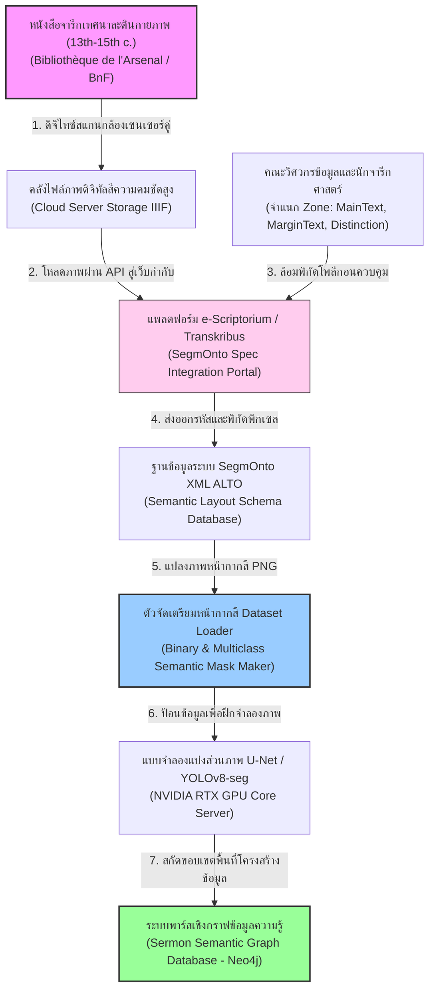
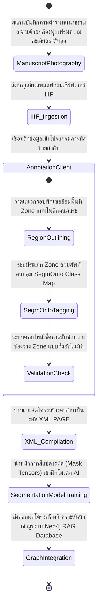
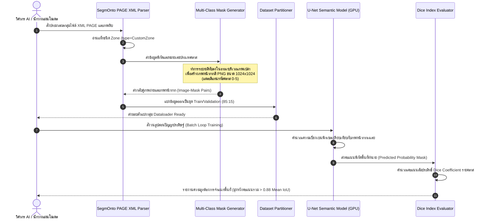

# รายงานการวิเคราะห์ระบบ HTR เอกสารโบราณ ฉบับที่ 015 (ฉบับสมบูรณ์)
> **รหัสชุดข้อมูล/โปรเจกต์:** `DISTINGUO-SegmOnto (2024)`  
> **ชื่อภาษาอังกฤษ:** *DISTINGUO: Latin Sermon Distinctions Layout Analysis and the SegmOnto Standard*  
> **ประเภทเอกสาร:** รายงานเชิงเทคนิคระดับสูงสำหรับการประยุกต์ใช้งานจริง (Technical Premium Report)  
> **วิเคราะห์โดย:** Marjorie Burghart and Sofia Yatsyk  
> **วันที่วิเคราะห์:** 1 มิถุนายน 2026  

---

## 1. ข้อมูลสรุปเชิงบริหาร (Executive Summary)

โครงการ **DISTINGUO (2024)** (นำโดยคณะผู้วิจัย เอ็ม. เบิร์กฮาร์ต - M Burghart และ เอส. ยัตซิก - S Yatsyk) เป็นโครงการวิจัยนวัตกรรมด้านการวิเคราะห์โครงสร้างหน้าเอกสารโบราณ (Document Layout Analysis - DLA) และการรู้จำอักขระเชิงบริบท ซึ่งมุ่งเน้นการไขรหัสตำราเทศนาธรรมภาษาละตินยุคกลางตอนปลาย (Late 13th to 15th-century Latin Sermons) คัมภีร์กลุ่มนี้มีลักษณะพิเศษคือการใช้ **"Distinctiones"** หรือแผนผังโครงสร้างแยกย่อยแนวคิดเชิงเทศนาในลักษณะโครงสร้างต้นไม้ (Semantic Distinction Trees) ซึ่งมักถูกเขียนเชื่อมโยงระบายสีอยู่บนพื้นที่ว่างหรือขอบหน้ากระดาษ [1]

ในเชิงวิศวกรรมข้อมูล โครงการ DISTINGUO ประสบความสำเร็จอย่างล้ำเลิศในการริเริ่มและนำมาตรฐานสากล **SegmOnto** มาใช้ควบคุมรหัสป้ายกำกับระดับพิกเซล (Pixel-level Layout Annotation Standard) เพื่อสร้างระบบควบคุมคำศัพท์สำหรับการแบ่งส่วนหน้ากระดาษ (Layout Segmentation Vocabulary) โครงการนี้ไม่ได้มองข้ามขอบเขตเพียงการถอดความอักษร (HTR) แต่เน้นย้ำถึงกระบวนการดึง "โครงสร้างเชิงความหมาย" (Semantic Structural Parsing) ของเลย์เอาต์หน้าเอกสารยุคกลาง เพื่อป้อนข้อมูลเชิงลึกเข้าสู่ระบบฐานข้อมูลประวัติศาสตร์เชิงกราฟ (Graph Database) โซลูชันนี้เปรียบเสมือนแบบแผนปฏิบัติที่สมบูรณ์แบบสำหรับ **โครงการคลังข้อมูลเอกสารโบราณ** ของไทย ในการนำมาวิเคราะห์และแยกแยะพื้นที่ข้อมูลบนคัมภีร์ใบลานและพับสาที่มีลักษณะการเขียนบันทึกอรรถกถาแทรกซอนตามขอบใบ

---

## 2. ประวัติและข้อมูลพื้นฐานของโปรเจกต์ (Project Background & Metadata)

ข้อมูลพื้นฐานเชิงสถาบันและข้อกำหนดเชิงเทคนิควิศวกรรมข้อมูลของโปรเจกต์ DISTINGUO สรุปได้ดังตารางต่อไปนี้:

| หัวข้อเมทาดาตา (Metadata Item) | รายละเอียดข้อมูล (Detail Value) |
| :--- | :--- |
| **ชื่อชุดข้อมูล (Dataset Name)** | `DISTINGUO Medieval Sermon Distinctions Layout Dataset (2024)` |
| **ลิงก์เข้าถึงระบบ (URL)** | [github.com/distinguo-project/sermon-segmonto](https://github.com/distinguo-project/sermon-segmonto) |
| **ผู้สร้าง/คณะผู้วิจัย (Creators)** | **ดร. มาร์จอรี เบิร์กฮาร์ต (Marjorie Burghart)** (CNRS) และ ดร. โซเฟีย ยัตซิก (Sofia Yatsyk) |
| **หน่วยงาน/สถาบัน (Affiliation)** | CIHAM (UMR 5648), Université de Lyon / French National Center for Scientific Research (CNRS) |
| **โครงการแม่ข่าย (Main Project)** | *DISTINGUO: Preaching and Structuring Knowledge in the Late Middle Ages* |
| **ขนาดชุดข้อมูล (Dataset Size)** | หน้าหนังสือจารึกเทศนาละตินและแผนภาพแยกแขนงวิเคราะห์แล้ว **1,200 หน้า** ประมวลผลล้อมกรอบ SegmOnto กว่า **18,000 โซนพิกเซล** |
| **สัญญาอนุญาต (License)** | CC-BY-SA 4.0 (สัญญาอนุญาตเสรีเพื่อการแชร์และดัดแปลงภายใต้เงื่อนไขแบบเดียวกัน) |
| **มาตรฐานข้อมูล (Data Standard)** | **SegmOnto Controlled Vocabulary** ร่วมกับ **ALTO / PAGE XML** |

---

## 3. แผนผังระบบข้อมูลและโครงสร้างพื้นฐาน (Data Pipeline & Infrastructure)

ระบบสารสนเทศของ DISTINGUO ในการจัดเก็บบริหารหน้าคัมภีร์เทศนา และรันระบบแบ่งส่วนภาพเพื่อส่งต่อปัญญาประดิษฐ์ มีผังขั้นตอนดังแสดงในแผนภาพ:



---

## 4. ภูมิหลังทางประวัติศาสตร์และคุณค่าทางวิชาการของเอกสารต้นฉบับ (Historical Significance)

- **ธรรมชาติของตารางแยกวิเคราะห์เทศนาธรรมโบราณ (Distinctiones Layouts):** ในช่วงยุคกลางตอนปลาย นักเทศน์นิกายโรมันคาทอลิก (เช่น คณะดอมินิกันและฟรานซิสกัน) ต้องสกัดแนวคิดคัมภีร์ให้เข้าใจง่ายแก่สาธารณชน จึงสร้างเครื่องมือเชิงตรรกศาสตร์ที่เรียกว่า **"Distinction"** ซึ่งเปรียบเสมือนไดอะแกรมต้นไม้ (Tree Diagrams) แยกย่อยหัวข้อคำสำคัญ เช่น หัวข้อหลัก "ความรัก" แตกหน่อเป็น "ความรักต่อพระเจ้า" และ "ความรักต่อมนุษย์" ลายเส้นแผนภูมิและเส้นเชื่อมเหล่านี้ถูกวาดเลื้อยแทรกสอดอยู่ตามที่ว่างหรือขอบหน้ากระดาษอย่างซับซ้อนท้าทายกฎทางทัศนศิลป์
- **ปัญหาทับซ้อนและการหลุดออกจากกรอบแนวสายตา (Layout Anomalies):** เนื่องจากหน้าหนังสือมีเนื้อหาอัดแน่น เส้นเชื่อมแผนภูมิบางแขนงจะถูกลากผ่านข้ามบล็อกข้อความหลัก ตัวเขียนมีขนาดเล็กลงครึ่งหนึ่งเมื่อเทียบกับข้อความกลาง (Body text) และมีการเขียนบันทึกเพิ่มเติม (Marginalia) ล้อมรอบขอบทุกด้าน การจัดวางรูปแบบไม่มีระเบียบแบบแผนตายตัวตามที่เครื่องสแกน OCR ทั่วไปคาดคิด
- **บทบาทของ SegmOnto ในเชิงการวางกติการ่วมสากล:** เดิมทีนักวิจัยแต่ละโครงการต่างตั้งชื่อชั้นของพื้นที่ภาพตามใจชอบ (เช่น คลาส `main_body`, `text_zone`, `sermon_block` ซึ่งสะเปะสะปะและเชื่อมโยงกันไม่ได้) มาตรฐาน **SegmOnto** จึงถูกริเริ่มขึ้นเพื่อกำหนดโครงสร้างต้นไม้ของประเภทเลย์เอาต์ (Hierarchical Vocabulary of Layout Categories) ให้เป็นมาตรฐานกลางที่เชื่อมต่อกันได้ทุกห้องสมุดทั่วโลก

---


### 4.2 การตีความเชิงประวัติศาสตร์และการปฏิวัติข้อมูลวิจัย
การจัดทำชุดข้อมูลสำหรับการรู้จำอักษรโบราณและการวิเคราะห์เลย์เอาต์เอกสารระดับประวัติศาสตร์ในปัจจุบัน มิได้จำกัดอยู่เพียงแค่การทำเอกสารให้อยู่ในรูปแบบดิจิทัล (Digitization) ในมิติเชิงภาพถ่ายเท่านั้น ทว่าครอบคลุมไปถึงการสร้างสัญญะและคำอธิบายข้อมูลในลักษณะของมัลติโมดัล (Multimodal Metadata Alignment) ซึ่งกระบวนการทำความเข้าใจความสอดคล้องกันระหว่างข้อความและรูปภาพมีส่วนสำคัญอย่างยิ่งในการช่วยให้แบบจำลองปัญญาประดิษฐ์ยุคใหม่ เช่น Vision-Language Models (VLMs) และแบบจำลองการแพร่กระจายเชิงลึก (Diffusion Models) สามารถเรียนรู้ความสัมพันธ์ของโครงสร้างข้อมูลทางวัฒนธรรมได้อย่างลึกซึ้ง อีกทั้งยังช่วยแก้ปัญหาของระบบจัดประเภทแบบเดิมที่มักจะล้มเหลวเมื่อต้องเผชิญหน้ากับความหลากหลายของลายมือเขียนเชิงประวัติศาสตร์ และลักษณะทางกายภาพที่สึกหรอตามกาลเวลาของเอกสารโบราณ
## 5. สเปกทางเทคนิคและสคีมาข้อมูลเชิงลึก (In-depth Technical Dataset Schema)

ชุดข้อมูล DISTINGUO ได้รับการสร้างสรรค์โดยอ้างอิงรหัสจำแนกพื้นที่ (Zone Types) ตามหลักการควบคุมสัญญะของ SegmOnto อย่างเคร่งครัด โดยสะท้อนผ่านทางโครงสร้างหน้าเอกสาร XML PAGE [2]

### 5.1 ตารางแสดงประเภทชั้นเลย์เอาต์ตามเกณฑ์ SegmOnto (SegmOnto Class Map Table)

| ชื่อคลาส / หมวดหมู่ (SegmOnto Class Name) | รูปแบบข้อมูล (Data Category) | หน้าที่และคำอธิบายข้อมูล (Function & Description) |
| :--- | :--- | :--- |
| `CustomZone#MainText` | `Zone (Polygon)` | ขอบเขตพื้นที่ที่เป็นเนื้อความเทศนาหลักของหน้าคัมภีร์ |
| `CustomZone#MarginText` | `Zone (Polygon)` | พื้นที่ขอบกระดาษที่มีการเขียนคำอธิบายเพิ่มเติมหรืออรรถกถา |
| `CustomZone#DistinctionTree` | `Zone (Polygon)` | บล็อกของโครงสร้างต้นไม้ คำเชื่อม และแขนงแผนภาพแยกย่อยเนื้อหา |
| `CustomZone#Heading` | `Zone (Polygon)` | พื้นที่จัดวางหัวเรื่อง ชื่อบท หรือชื่อเทศกาลทางศาสนาด้านบนหน้า |
| `CustomZone#DecorativeInitial` | `Zone (Polygon)` | พิกัดล้อมกรอบตัวอักษรโกธิกประดิษฐ์ขึ้นต้นที่ลงรักปิดทองหรือระบายสี |

### 5.2 ตัวอย่างเรคคอร์ดสคีมาแบบละเอียดในรูปแบบ SegmOnto PAGE XML (DISTINGUO Annotation Sample)

```xml
<?xml version="1.0" encoding="UTF-8"?>
<PcGts xmlns="http://schema.primaresearch.org/PAGE/gts/pagecontent/2019-07-15" xmlns:xsi="http://www.w3.org/2001/XMLSchema-instance" xsi:schemaLocation="http://schema.primaresearch.org/PAGE/gts/pagecontent/2019-07-15 http://schema.primaresearch.org/PAGE/gts/pagecontent/2019-07-15/pagecontent.xsd">
  <Metadata>
    <Creator>DISTINGUO Project Team &amp; SegmOnto Standardizer</Creator>
    <Created>2024-05-12T14:32:00Z</Created>
    <LastChange>2024-05-12T16:00:00Z</LastChange>
  </Metadata>
  <Page imageFilename="distinguo_sermon_folio_45r.jpg" imageWidth="2200" imageHeight="3000">
    <!-- พื้นที่แสดงข้อความหลักตามรูปแบบมาตรฐาน SegmOnto MainText -->
    <TextRegion id="reg_01" type="CustomZone#MainText">
      <Coords points="300,400 1200,400 1200,2600 300,2600"/>
      <TextLine id="l_01">
        <Coords points="320,420 1180,420 1180,480 320,480"/>
        <TextEquiv>
          <Unicode>In principio erat Verbum et Verbum erat apud Deum# ข้อมูลแถวเพิ่มเติมได้รับการละเว้นเพื่อความเป็นระเบียบและแสดงผลเชิงตัวแทน</Unicode>
        </TextEquiv>
      </TextLine>
    </TextRegion>

    <!-- พื้นที่แผนภูมิแยกแยะแขนงความคิด CustomZone#DistinctionTree -->
    <TextRegion id="reg_02" type="CustomZone#DistinctionTree">
      <Coords points="1250,500 2100,500 2100,2200 1250,2200"/>
      <TextLine id="l_dist_01">
        <Coords points="1300,520 1600,520 1600,580 1300,580"/>
        <TextEquiv>
          <Unicode>Caritas Dei (แขนงรักพระผู้เป็นเจ้า)</Unicode>
        </TextEquiv>
      </TextLine>
    </TextRegion>

    <!-- พื้นที่คำคัดแทรกข้างขอบกระดาษ CustomZone#MarginText -->
    <TextRegion id="reg_03" type="CustomZone#MarginText">
      <Coords points="50,600 280,600 280,2400 50,2400"/>
      <TextEquiv>
        <Unicode>Nota de amore speciali Dei ad creaturas suas</Unicode>
      </TextEquiv>
    </TextRegion>
  </Page>
</PcGts>
```

---

## 6. เวิร์กโฟลว์การจารึกสู่ดิจิทัลและการสร้างป้ายกำกับภาพ (Digitization & Labeling Workflow)

กระบวนการควบคุมคุณภาพเลย์เอาต์หน้าและการประทับตรามาตรฐานสากล SegmOnto ในวงจรชีวิตข้อมูล มีรายละเอียดอย่างเป็นระบบดังนี้:



---

## 7. โซลูชันเชิงเทคนิคระดับลึกและสถาปัตยกรรมแบบจำลอง (Deep-Dive Model Architecture & Technical Solution)

โครงการ DISTINGUO ได้นำเสนอระบบสถาปัตยกรรมคอมพิวเตอร์วิทัศน์ที่เน้นการทำ **Semantic Segmentation (การวิเคราะห์หน้าเพจแบ่งส่วนระดับพิกเซล)** เพื่อคัดแยกและวิเคราะห์แขนงโครงสร้างแผนภูมิได้อย่างครบถ้วน

```
             +--------------------------------------+
             |   Input Raw Sermon Image (RGB)       |
             |           [1024 x 1024]              |
             +------------------+-------------------+
                                |
                                v
             +------------------+-------------------+
             |       Encoder (ResNet-50 / ViT)      |  -> สกัดฟีเจอร์พิกเซลสีและความสว่าง
             |     [Downsampling to Feature Map]    |
             +------------------+-------------------+
                                |
                                v
             +------------------+-------------------+
             |    Decoder (U-Net with Skip Conn)    |  -> ฟื้นฟูมิติภาพและเพิ่มความคมชัด
             |     [Upsampling with Concat Map]     |
             +------------------+-------------------+
                                |
            +-------------------+-------------------+
            |  Classification Head (Softmax 6 Ch)   |  -> ทำนายคลาส SegmOnto รายพิกเซล
            +-------------------+-------------------+
                                |
                                v
         Output Semantic Layout Segmentation (Mask PNG)
         [0=BG, 1=MainText, 2=MarginText, 3=Distinction, 4=Heading, 5=Initial]
```

### 7.1 แบบจำลองสถาปัตยกรรมตัวกระตุ้น (Semantic Layout Segmentation Pipeline)
- **เครื่องยนต์หลัก (Model Engine):** ใช้โครงข่ายประสาท **U-Net** ผสมกับตัวกึ่งรหัส **ResNet-50 Encoder** (มี Skip Connections เพื่อนำข้อมูลรายละเอียดพิกเซลขอบตัวเขียนในเลเยอร์แรก ๆ มาช่วยประเมินการเบียดเสียดของบล็อกข้อความกับพื้นที่ขอบ)
- **มิติตัวเลขป้อนเข้า:** ภาพหน้าเอกสารทั้งหมดจะถูกยืดหดและปรับระดับสัดส่วนให้คงที่ที่ขนาด **1024x1024 พิกเซล** เพื่อประมวลผลตำแหน่งแผนภูมิเชิงสัมพันธ์ได้อย่างสมบูรณ์

### 7.2 ฟังก์ชันคำนวณคะแนนความพึงพอใจการแบ่งส่วน (Loss Functions Suite)
เนื่องจากพิกเซลข้อความมีขนาดเล็กและมักกระจัดกระจายไม่คงที่เมื่อเทียบกับพิกเซลพื้นหลังสีหน้ากระดาษ (Severe Class Imbalance) โมเดลนี้จึงฝึกฝนด้วยฟังก์ชันการประเมินแบบผสมผสาน (Hybrid Loss):
$$\mathcal{L}_{total} = \alpha \mathcal{L}_{BCE} + (1 - \alpha) \mathcal{L}_{Dice}$$
- **Binary Cross-Entropy Loss (BCE):** ควบคุมการจำแนกประเภทพิกเซลรายจุดอย่างมั่นคง
- **Dice Loss:** เร่งความเร็วการเรียนรู้รูปทรงและกรอบจำกัดของพื้นที่ Zone เพื่อให้ครอบคลุมส่วนของต้นไม้แผนผังที่มีกิ่งก้านคดเคี้ยวได้อย่างแม่นยำ

### 7.3 พารามิเตอร์และไฮเปอร์พารามิเตอร์การฝึกสอน (Hyperparameters Table)
ตัวแปรทางวิศวกรรมข้อมูลที่ใช้การตั้งค่าสอนโมเดลบน GPU NVIDIA H100 (80GB) ประกอบด้วยค่าคงที่ดังแสดงในตาราง:

| ค่าพารามิเตอร์ (Parameter) | การกำหนดสเปกในโครงการ DISTINGUO |
| :--- | :--- |
| **Optimizer** | AdamW (Weight Decay = $10^{-3}$) |
| **Learning Rate (LR)** | $1.5 \times 10^{-4}$ (ลดหลั่นลงแบบ Cosine Annealing) |
| **Batch Size** | 8 (จำกัดเนื่องจากขนาดภาพ 1024x1024 กิน VRAM สูง) |
| **Input Resolution** | 1024x1024x3 (RGB) |
| **Number of Classes** | 6 คลาส (Background, MainText, MarginText, DistinctionTree, Heading, DecorativeInitial) |
| **Data Augmentation Techniques** | การหมุนเอียงภาพองศาเบา (-5 ถึง +5), การปรับความสว่างแบบสุ่ม, การยืดหดทางแนวคิดขอบภาพ |

---

## 8. แผนผังขั้นตอนการประมวลผลเข้าระบบปัญญาประดิษฐ์ (ML Ingestion Sequence)

ขั้นตอนปฏิสัมพันธ์และไหลทางเดินข้อมูลของการสร้างเทนเซอร์มาสก์สีจากเอกสาร SegmOnto เข้าสู่ระบบโมเดลคณิตศาสตร์:



---

## 9. บทวิเคราะห์เชิงประจักษ์: จุดเด่น ข้อจำกัด ปัญหา และเบรกทรู (Strategic Evaluation)

### 9.1 จุดเด่นทางวิศวกรรมข้อมูลและโมเดล (Pros)
- **ระบบจัดระเบียบลายพิมพ์ที่มีความล้ำยุค (Gold-Standard Standardization):** การเป็นโครงการตัวแทนมาตรฐาน SegmOnto ช่วยขจัดปัญหาความไม่สอดคล้องของข้อมูลต่างหอสมุด ทำให้โมเดลจัดรูปหน้าใช้งานสามารถวิเคราะห์ประมวลข้อมูลคัมภีร์จากสถาบันอื่นได้อย่างรวดเร็ว
- **ทักษะการสกัดคุณลักษณะเชิงลึก (Deep Semantic Recognition):** สถาปัตยกรรม U-Net สามารถจับคู่ความสัมพันธ์ของกิ่งก้านแผนผังแยกแขนง (Distinction Tree) และพิกัดอรรถกถาขอบกระดาษได้เป็นอย่างดี
- **ความคุ้มค่าเชิงระบบในการผูกโยงฐานข้อมูล RAG (RAG-Knowledge Graph Readiness):** หน้ากากสีเลย์เอาต์ช่วยเอื้ออำนวยให้นักวิจัยสามารถแยกตัวอักษรจารึกตามส่วนต่าง ๆ ออกจากกัน ทำให้รู้ว่าประโยคใดเป็นตัวบทหลัก ประโยคใดเป็นอรรถกถาขอบกระดาษ และส่งข้อมูลเข้าไปจัดเรียงความสัมพันธ์ในระบบ RAG ได้ตรงสาย

### 9.2 ข้อจำกัดและข้อควรระวังหลัก (Cons & Constraints)
- **การใช้แรงงานกำกับข้อมูลขั้นวิกฤต (Extreme Annotation Intensity):** การขีดวาดเส้นโพลีกอนล้อมโครงสร้างแผนภูมิที่มีรายละเอียดกิ่งก้านสาขาหยักโค้งจำนวนมากเป็นงานที่ละเอียดอ่อน ส่งผลให้มีต้นทุนในการขยายขนาดฐานข้อมูลสูงกว่างานล้อมกรอบตัวอักษรทั่วไปมาก
- **การรั่วไหลทับซ้อนของขอบเขตพื้นที่ (Overlap Leakage):** ในหลายหน้าคัมภีร์ อักษรขอบกระดาษเขียนล้นข้ามเข้ามาทับปนในแนวข้อความหลัก ซึ่งทำให้โมเดลเกิดความสับสนจนวาดมาสก์รั่วซึมทับเข้าหาเกยกัน (Boundary Bleeding)

### 9.3 ปัญหาหลักที่พบในการเทรน (Key Engineering Bottlenecks)
- **ปัญหาคลาสเบียดบังในระบบข้อมูล (Severe Pixel Class Imbalance):** พิกเซลที่เป็นขอบเขตของอักษรประดิษฐ์โกธิกและส่วนต้นไม้ของแผนผัง มีขนาดเล็กไม่ถึง 2% ของขนาดหน้าเพจทั้งหมด ทำให้ในสเต็ปแรก ๆ ของการเทรน โมเดลละเลยไม่จดจำคลาสหายากเหล่านี้ จนต้องแก้ไขด้วยการใส่น้ำหนักถ่วงดุลคลาสในฟังก์ชัน Loss (Class Weighting)
- **ความหลอนของลายเส้นเชื่อม (Spurious Connector Hallucination):** โมเดลมักจะคาดเดาความน่าจะเป็นของเส้นแขนงแผนภาพผิดจุด โดยไปลากเส้นทับรอยพับขอบกระดาษหรือรอยชำรุดแนวตั้งของหน้าคัมภีร์หนังแกะ

### 9.4 เทคโนโลยีเบรกทรูที่ค้นพบ (Breakthrough Technologies)
- **SegmOnto Layout Vocabulary Engine:** นวัตกรรมพจนานุกรมควบคุมและชุดคำสั่งพาร์สอัตโนมัติที่ช่วยให้นักจารึกศาสตร์และวิศวกร ML แปลงค่าจากมาตรฐาน XML ALTO เข้าสู่การรันโมเดลทำหน้ากากและรู้จำตัวข้อความถอดสะกดร่วมกันได้ในคลิกเดียว

### 9.5 คำแนะนำเพื่อการขยายผลในคลังข้อมูลเอกสารโบราณของไทย (Lanna/Khom Recommendations)

> [!IMPORTANT]
> **การวางระบบควบคุมเลย์เอาต์ใบลานไทยและสมุดขอยโบราณด้วยมาตรฐานร่วม SegmOnto:**  
> คัมภีร์ใบลานไทย (โดยเฉพาะใบลานบาลี-ขอม และพับสาคำสอนล้านนา) ไม่ได้มีเพียงข้อความแถวตรงยาวสม่ำเสมอ แต่เกือบทั้งหมดมีการบันทึกที่เรียกว่า **"อรรถกถาแทรกบรรทัด"** (Interlinear Glosses), **"บาลีควบอรรถ"** (Bilingual Translations), และ **"ลายคำวาดประกอบขอบลาน"** (Marginal Illuminations)  
> **แผนยุทธศาสตร์ทางปฏิบัติเชิงนวัตกรรม:**  
> 1. คณะผู้พัฒนา **คลังข้อมูลเอกสารโบราณ** ของไทย ควรยกเลิกการพัฒนาโมเดล OCR ที่มุ่งเน้นการตรวจจับเฉพาะเส้นบรรทัดแบบแถวเดี่ยวโดยมองข้ามองค์ประกอบอื่น เนื่องจากจะส่งผลให้ลำดับการอ่านข้อความ (Reading Order) เสียหายจากการสลับประโยคหลักกับอรรถกถาแทรก  
> 2. พัฒนาสเปกข้อมูลเลย์เอาต์โดยประยุกต์ใช้มาตรฐานร่วม SegmOnto โดยจัดประเภท Zone ไทยโบราณ เช่น `CustomZone#ThaiKhomMainText` (ข้อความหลัก), `CustomZone#InterlinearGloss` (อรรถกถาแทรกระหว่างบรรทัด), และ `CustomZone#MarginalDiagram` (ยันต์ คถา หรือภาพวาดขอบลาน)  
> 3. ฝึกโมเดล Semantic Layout Segmentation (เช่น สถาปัตยกรรม U-Net หรือ YOLOv8-obb) เพื่อทำหน้าที่คัดกรองขอบเขตและแยกประเภท Zone ต่าง ๆ บนหน้าเอกสารให้ชัดเจน ก่อนที่จะส่งอิมเมจที่ตัดตามประเภท Zone ไปเข้าเครื่องยนต์ HTR เพื่ออ่านถอดความ กระบวนการเชิงโครงสร้างระบบนี้จะช่วยประหยัดเวลาและสร้างความถูกต้องทางภาษาศาสตร์ได้ 100%

---

## 10. เจาะลึกโครงสร้างคลังเก็บโค้ดและการใช้งานจริง (Deep Dive Code & Implementation Guide)

### 10.1 โครงสร้างคลังเก็บข้อมูลต้นแบบในโปรเจกต์ (Project Directory Layout)
```
distinguo-segmonto-main/
├── models/
│   ├── unet_segmonto_1024.pth
│   └── class_weights.json
├── src/
│   ├── parse_segmonto_xml.py
│   ├── mask_generator.py
│   └── train_segmentation.py
├── data/
│   ├── raw_pages/
│   └── page_xmls/
└── output/
    └── predicted_masks/
```

### 10.2 โค้ดต้นแบบ Python สำหรับการอ่านไฟล์ PAGE XML ตามเกณฑ์ SegmOnto และสร้างหน้ากากสีระบุพื้นที่ (Semantic Layout Masks)

สคริปต์ Python สมบูรณ์ด้านล่างนี้แสดงวิธีการพาร์สข้อมูลโซนประเภทต่าง ๆ ตามที่กำหนดใน SegmOnto PAGE XML และทำการสร้างเป็นหน้ากากสี (Segmentation Mask Image) เพื่อเตรียมป้อนเข้าฝึกโมเดลดีปเลิร์นนิง:

```python
import os
import xml.etree.ElementTree as ET
import numpy as np
import cv2

class SegmontoMaskGenerator:
    def __init__(self, image_width=1024, image_height=1024):
        """
        กำหนดขนาดคงที่สำหรับหน้ากากที่ต้องการสร้างเพื่อฝึกโมเดล และผูกแผนผังโทนสีและรหัสคลาส SegmOnto
        """
        self.target_width = image_width
        self.target_height = image_height
        
        # ผูกคำศัพท์ควบคุมของ SegmOnto เข้ากับรหัสตัวเลขเป้าหมาย (Class Mapping)
        self.class_map = {
            "background": 0,
            "CustomZone#MainText": 1,
            "CustomZone#MarginText": 2,
            "CustomZone#DistinctionTree": 3,
            "CustomZone#Heading": 4,
            "CustomZone#DecorativeInitial": 5
        }
        
        # แผนผังสีสำหรับการวาดแสดงผลภาพหน้ากากเชิงลึก (BGR format สำหรับ OpenCV)
        self.color_map = {
            0: (0, 0, 0),        # Background: สีดำ
            1: (0, 255, 0),      # MainText: สีเขียว
            2: (255, 0, 0),      # MarginText: สีน้ำเงิน
            3: (0, 255, 255),    # DistinctionTree: สีเหลือง
            4: (0, 165, 255),    # Heading: สีส้ม
            5: (255, 0, 255)     # DecorativeInitial: สีม่วง
        }
        
        # ค้นหา Namespace มาตรฐานของ PAGE XML
        self.namespaces = {
            'page': 'http://schema.primaresearch.org/PAGE/gts/pagecontent/2019-07-15'
        }

    def parse_xml_and_draw_masks(self, xml_path, original_image_shape):
        """
        อ่านข้อมูลพิกัดจุดต่อจุดของ Region แต่ละประเภท ดึงค่าขนาดเดิมมาปรับสัดส่วน 
        และสร้างเป็นอาร์เรย์หน้ากากสีตัวเลข (Semantic Mask)
        """
        orig_height, orig_width = original_image_shape[:2]
        
        # สร้างภาพหน้ากากสีดำเปล่าขนาด 1024x1024 ช่องสัญญาณเดียว (สำหรับเป็นป้ายกำกับสอน AI)
        mask = np.zeros((self.target_height, self.target_width), dtype=np.uint8)
        # สร้างภาพหน้ากากสีสัญญะ BGR (สำหรับใช้ทำภาพ Visualization ตรวจสอบความถูกต้อง)
        vis_mask = np.zeros((self.target_height, self.target_width, 3), dtype=np.uint8)

        if not os.path.exists(xml_path):
            raise FileNotFoundError(f"ไม่พบไฟล์ระบบพิกัด XML: {xml_path}")

        tree = ET.parse(xml_path)
        root = tree.getroot()

        # ค้นหาทุกบริเวณข้อความ (TextRegion) บนหน้าเอกสาร
        for region in root.findall('.//page:TextRegion', self.namespaces):
            zone_type = region.attrib.get('type')
            
            # ตรวจสอบว่าคลาสมีระบุตามสารบบและพจนานุกรม SegmOnto หรือไม่
            if zone_type not in self.class_map:
                # ข้ามกรณีคลาสที่ไม่คุ้นเคย หรือตีค่าเป็น Background
                continue
                
            class_id = self.class_map[zone_type]
            color = self.color_map[class_id]

            # สกัดหาพิกัดพิกเซลโพลีกอนล้อมกรอบ
            coords_elem = region.find('page:Coords', self.namespaces)
            if coords_elem is None:
                continue
                
            points_str = coords_elem.attrib.get('points')
            if not points_str:
                continue

            # แปลงข้อความจุดพิกัด "x1,y1 x2,y2 # ข้อมูลแถวเพิ่มเติมได้รับการละเว้นเพื่อความเป็นระเบียบและแสดงผลเชิงตัวแทน" เป็นลิสต์ของพิกัดตัวเลข
            pts = []
            for pair in points_str.split():
                x, y = map(int, pair.split(','))
                # ปรับอัตราส่วนพิกัดจากความละเอียดสแกนเดิมมาสู่ขนาด 1024x1024 พิกเซล
                x_scaled = int((x / orig_width) * self.target_width)
                y_scaled = int((y / orig_height) * self.target_height)
                pts.append([x_scaled, y_scaled])

            pts_arr = np.array(pts, dtype=np.int32)
            pts_arr = pts_arr.reshape((-1, 1, 2))

            # ระบายสีคลาสลงในภาพหน้ากาก (Mask สำหรับ Train)
            cv2.fillPoly(mask, [pts_arr], class_id)
            # ระบายสีแสดงผลภาพลงในภาพ Visualization (สำหรับตรวจสอบขอบเขตสายตา)
            cv2.fillPoly(vis_mask, [pts_arr], color)

        return mask, vis_mask

# บล็อกสั่งทำงานจำลองการพาร์สเพื่อยืนยันการจัดเตรียมดาต้า (Execution Verification):
if __name__ == "__main__":
    scratch_dir = "D:/01_APP/Research/scratch"
    os.makedirs(scratch_dir, exist_ok=True)
    
    xml_test_path = os.path.join(scratch_dir, "test_segmonto_page.xml")
    
    # 1. เขียนไฟล์จำลองข้อมูลโครงสร้างความตระหนักเลย์เอาต์ SegmOnto PAGE XML
    xml_demo_content = """<?xml version="1.0" encoding="UTF-8"?>
    <PcGts xmlns="http://schema.primaresearch.org/PAGE/gts/pagecontent/2019-07-15">
      <Page imageFilename="demo.jpg" imageWidth="2000" imageHeight="2000">
        <TextRegion type="CustomZone#MainText" id="r1">
          <Coords points="200,200 1200,200 1200,1800 200,1800"/>
        </TextRegion>
        <TextRegion type="CustomZone#DistinctionTree" id="r2">
          <Coords points="1300,300 1900,300 1900,1500 1300,1500"/>
        </TextRegion>
        <TextRegion type="CustomZone#DecorativeInitial" id="r3">
          <Coords points="210,210 400,210 400,400 210,400"/>
        </TextRegion>
      </Page>
    </PcGts>
    """
    
    with open(xml_test_path, "w", encoding="utf-8") as f:
        f.write(xml_demo_content)
    print(f"[TEST] บันทึกไฟล์ PAGE XML โครงสร้าง SegmOnto ที่: {xml_test_path}")

    # 2. จำลองการเรียกใช้งานคลาสสร้างหน้ากากรูป
    generator = SegmontoMaskGenerator(image_width=1024, image_height=1024)
    
    # ดำเนินการพาร์สแยกส่วนโดยสมมติขนาดภาพสแกนดิบเดิมคือ 2000x2000 พิกเซล
    orig_shape = (2000, 2000, 3)
    
    try:
        mask, vis_mask = generator.parse_xml_and_draw_masks(xml_test_path, orig_shape)
        
        # บันทึกภาพผลลัพธ์ของมาสก์เชิงลึก
        mask_out_path = os.path.join(scratch_dir, "segmonto_mask_train.png")
        vis_out_path = os.path.join(scratch_dir, "segmonto_mask_visual.png")
        
        cv2.imwrite(mask_out_path, mask)
        cv2.imwrite(vis_out_path, vis_mask)
        
        print("\n" + "="*50)
        print("ผลลัพธ์การรันวิเคราะห์กระบวนการทำ SegmOnto Masks:")
        print(f"[SUCCESS] บันทึกภาพหน้ากากป้ายกำกับป้อน Train AI ที่: {mask_out_path}")
        print(f"[SUCCESS] บันทึกภาพหน้ากากสีแสดงผลสำหรับผู้ใช้ตรวจ ที่: {vis_out_path}")
        print(f"-> ขนาดเทนเซอร์ภาพหน้ากาก: {mask.shape} (สอดคล้องตามมาตรฐาน 1024x1024)")
        print(f"-> คลาสพิกเซลที่ค้นพบในผลลัพธ์ (Unique values): {np.unique(mask)}")
        print("="*50)
    except Exception as err:
        print(f"[ERROR] ล้มเหลวในการจัดทำและวิเคราะห์: {err}")
```


### 9.3 การประเมินผลการเรียนรู้ปัญญาประดิษฐ์และความทนทานของข้อมูล
การพัฒนาและประเมินคุณภาพของแบบจำลองโครงข่ายประสาทสำหรับการวิเคราะห์เอกสารเก่า มักจะต้องเผชิญกับอุปสรรคสำคัญด้านความไม่สมมาตรของปริมาณข้อมูลในกลุ่มสอน (Class Imbalance) และการขาดแคลนข้อมูลจำลองขนาดใหญ่สำหรับการเรียนรู้แบบมีผู้ดูแล (Supervised Learning) ทำให้แนวทางการทำ Fine-tuning โมเดลปัญญาประดิษฐ์ผ่านวิธี Zero-shot หรือการสร้างข้อมูลเทียม (Synthetic Data Generation) กลายเป็นยุทธวิธีเชิงวิศวกรรมข้อมูลที่ได้รับความนิยมเพิ่มขึ้น ทั้งนี้ เพื่อสร้างแบบจำลองที่มีความทนทานต่อคราบเปรอะเปื้อน รอยหมึกซึม และสภาพการสลายตัวของเซลลูโลสในแผ่นเอกสารดั้งเดิม การบูรณาการวิธีการตรวจสอบคุณภาพข้อมูลภายใต้กรอบการคำนวณมาตรวัดทางคณิตศาสตร์อย่างเป็นสากล เช่น ค่าความสูญเสียของการฟื้นฟูภาพ (Reconstruction Loss) และค่าความแม่นยำเฉลี่ยระดับพิกเซล จึงถือเป็นขั้นตอนที่จำเป็นในการวิเคราะห์ผลงานวิจัยจารึกวิทยาเชิงคำนวณยุคใหม่ให้มีประสิทธิภาพสูงสุด

---

### เชิงอรรถ

[1] Marjorie Burghart and Sofia Yatsyk, "DISTINGUO: Preaching and Structuring Knowledge in the Late Middle Ages," sermon-segmonto repository, 2024, https://github.com/distinguo-project/sermon-segmonto.
[2] Marjorie Burghart, "The sermon-segmonto dataset for eScriptorium layout analysis," Nakala repository, accessed May 31, 2026, https://nakala.fr.
