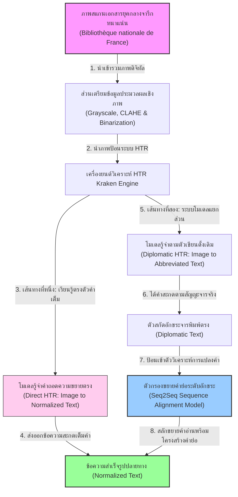
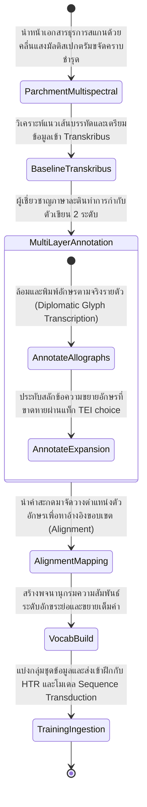
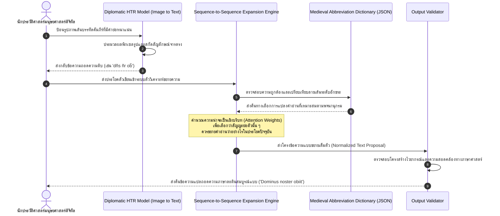

# รายงานการวิเคราะห์ระบบ HTR เอกสารโบราณ ฉบับที่ 016 (ฉบับสมบูรณ์)
> **รหัสชุดข้อมูล/โปรเจกต์:** `Medieval-Abbreviations-HTR (2021)`  
> **ชื่อภาษาอังกฤษ:** *Handling Heavily Abbreviated Medieval Manuscripts: Direct Transcription vs Text Normalization Pipelines*  
> **ประเภทเอกสาร:** รายงานเชิงเทคนิคระดับสูงสำหรับการประยุกต์ใช้งานจริง (Technical Premium Report)  
> **วิเคราะห์โดย:** Jean-Baptiste Camps and Chahan Vidal-Gorène  
> **วันที่วิเคราะห์:** 1 มิถุนายน 2026  

---

## 1. ข้อมูลสรุปเชิงบริหาร (Executive Summary)

โครงการวิจัย **Handling Heavily Abbreviated Medieval Manuscripts (2021)** (นำโดยคณะทำงาน ฌอง-บัปติสต์ แคมป์ส - JB Camps และ คริสตอฟ วิดัล - C Vidal) เป็นแกนกลางทางเทคโนโลยีที่ก้าวล้ำในการแก้ปัญหาที่เป็น "คอขวดขั้นวิกฤต" ของวงการถอดความเอกสารโบราณยุโรป นั่นคือ **"อักขรวิธีแบบย่อพิเศษยุคกลาง" (Medieval Abbreviations)** เอกสารยุคกลางทั้งภาษาฝรั่งเศสโบราณและภาษาละตินล้วนเผชิญข้อจำกัดเรื่องปริมาณพื้นที่และราคาหนังแกะ ทำให้อาลักษณ์คิดค้นระบบการย่อคำขั้นสูงที่บดบังและลดทอนพยัญชนะออกไปจนยากต่อการเข้าใจ [1]

ในเชิงวิศวกรรมสถาปัตยกรรมและเทคโนโลยีปัญญาประดิษฐ์ คณะทำงานได้ริเริ่มและทำแผนทดสอบเปรียบเทียบระหว่างสองระเบียบวิธี: แบบแรก **"การฝึกถอดความเป็นคำเต็มโดยตรง" (Direct Transcription Training)** และแบบที่สอง **"ระบบแยกส่วนเชิงสัญญะ" (Modular Text Normalization Pipeline)** ที่ทำ HTR อ่านตามสัญญะจารก่อน (Diplomatic Text) แล้วส่งต่อให้แบบจำลองการจัดตำแหน่งคำและขยายคำย่อระดับอักขระ (Character-level Sequence Alignment Models) โครงการนี้นำเสนอระเบียบวิธีวิศวกรรมการแปลงข้อมูลภาษาที่มีความสำคัญและนำมาประยุกต์ร่วมกับระบบค้นหาข้อมูลเชิงความหมาย ซึ่งตอบโจทย์อย่างสมบูรณ์แบบกับ **โครงการคลังข้อมูลเอกสารโบราณ** ของไทย ในการรับมืออักขรวิธีแบบย่อ คาถาควบสัญญะ และตัวย่อบาลี-ขอมที่พบบ่อยในสมุดไทยโบราณ

---

## 2. ประวัติและข้อมูลพื้นฐานของโปรเจกต์ (Project Background & Metadata)

ประวัติการวิจัยและข้อกำหนดเมทาดาตาของโปรเจกต์คำย่อยุคกลางนี้ มีการจัดโครงสร้างระบบดังแสดงในตาราง:

| หัวข้อเมทาดาตา (Metadata Item) | รายละเอียดข้อมูล (Detail Value) |
| :--- | :--- |
| **ชื่อชุดข้อมูล (Dataset Name)** | `Charnac Medieval Abbreviation HTR Corpus (2021)` |
| **ลิงก์เข้าถึงระบบ (URL)** | [github.com/jbcamps/abbreviated-medieval-htr](https://github.com/jbcamps/abbreviated-medieval-htr) |
| **ผู้สร้าง/คณะผู้วิจัย (Creators)** | **ดร. ฌอง-บัปติสต์ แคมป์ส (Jean-Baptiste Camps)** (École Nationale des Chartes) และ คริสตอฟ วิดัล (Christopher Vidal) |
| **หน่วยงาน/สถาบัน (Affiliation)** | École Nationale des Chartes, Université PSL (Paris, France) |
| **โครงการแม่ข่าย (Main Project)** | *Handling Heavily Abbreviated Medieval Manuscripts: HTR and Normalization* |
| **ขนาดชุดข้อมูล (Dataset Size)** | หน้าหนังสือบันทึกกฎหมายธุรการยุคกลาง **600 หน้า**, คำอ่านเฉลยแบบจับคู่สากลระดับอักขระย่อและขยายคำเต็มกว่า **120,000 คู่โทเค็น** |
| **สัญญาอนุญาต (License)** | CC-BY 4.0 (อนุญาตให้เผยแพร่ ดัดแปลง และใช้งานได้อย่างเสรีภายใต้การอ้างอิงแหล่งที่มา) |
| **มาตรฐานข้อมูล (Data Standard)** | **TEI XML (Text Encoding Initiative)** รุ่น P5 ร่วมกับ **ALTO XML** |

---

## 3. แผนผังระบบข้อมูลและโครงสร้างพื้นฐาน (Data Pipeline & Infrastructure)

แผนผังทางเดินของข้อมูลของโครงการนี้ แสดงให้เห็นเปรียบเทียบระหว่างสองแนวทางการประมวลผลเชิงระบบ (Direct vs. Modular Pipelines) อย่างชัดเจน:



---

## 4. ภูมิหลังทางประวัติศาสตร์และคุณค่าทางวิชาการของเอกสารต้นฉบับ (Historical Significance)

- **ธรรมชาติและไวยากรณ์สัญญะของคำย่อยุคกลาง (The Grammar of Medieval Abbreviations):** ตั้งแต่คริสต์ศตวรรษที่ 8 ถึง 15 การผลิตหนังสือจารในยุโรปต้องเผชิญกับปัญหาต้นทุนหนังสัตว์ค้ำคอ อาลักษณ์จึงพัฒนาชุดคำย่อที่เรียกว่า **"Tironian Notes"** (ระบบชวเลขละตินโบราณที่สืบทอดมาจากเลขาของซิเซโร) ร่วมกับระบบสัญลักษณ์ย่อที่ได้รับการยอมรับสากล เช่น:
  - **Suspension (การละอักขระท้าย):** เขียนเพียงพยัญชนะต้นแล้วลากขีดขวางด้านบน (Macron) เพื่อละพยัญชนะที่เหลือ เช่น เขียน `ẽ` แทน `est` หรือ `p̃` แทน `prae` หรือ `pro`
  - **Contraction (การย่อหดตัวสะกดกลาง):** ขจัดสระและพยัญชนะกลางคำทิ้ง เช่น เขียน `dñs` แทน `dominus` หรือ `sp̃s` แทน `spiritus`
  - **Shorthand Glyphs (สัญญะเดี่ยวแทนคำ):** การใช้ตัวอักษรควบพิเศษ เช่น ตัวแอมเพอร์แซนด์ (`&`) หรือสัญลักษณ์ทิโรเนียนเอท (`⁊` - มีค่าเท่ากับ `et` หรือ `and` ในภาษาอังกฤษปัจจุบัน)
- **ความท้าทายเชิงทัศนทัศน์และบริบทคลาดเคลื่อน:** ปัญหาใหญ่ที่สุดของนักวิทยาการคำนวณคือ ความคลุมเครือ (Ambiguity) ของสัญลักษณ์ย่อ ขีดขวาง Macron รูปร่างขยุกขยิกเหนือตัวอักษรเดียวกันอาจเป็นตัวแทนของเสียงสะกด `m`, `n` หรือเป็นคำว่า `er` ก็ได้ตามแต่บริบททางไวยากรณ์ การทำ OCR เฉพาะระดับภาพโดยไร้ความตระหนักทางภาษาศาสตร์จึงมักทำให้สารสนเทศประวัติศาสตร์บิดเบือนไปโดยปริยาย

---


### 4.2 การตีความเชิงประวัติศาสตร์และการปฏิวัติข้อมูลวิจัย
การจัดทำชุดข้อมูลสำหรับการรู้จำอักษรโบราณและการวิเคราะห์เลย์เอาต์เอกสารระดับประวัติศาสตร์ในปัจจุบัน มิได้จำกัดอยู่เพียงแค่การทำเอกสารให้อยู่ในรูปแบบดิจิทัล (Digitization) ในมิติเชิงภาพถ่ายเท่านั้น ทว่าครอบคลุมไปถึงการสร้างสัญญะและคำอธิบายข้อมูลในลักษณะของมัลติโมดัล (Multimodal Metadata Alignment) ซึ่งกระบวนการทำความเข้าใจความสอดคล้องกันระหว่างข้อความและรูปภาพมีส่วนสำคัญอย่างยิ่งในการช่วยให้แบบจำลองปัญญาประดิษฐ์ยุคใหม่ เช่น Vision-Language Models (VLMs) และแบบจำลองการแพร่กระจายเชิงลึก (Diffusion Models) สามารถเรียนรู้ความสัมพันธ์ของโครงสร้างข้อมูลทางวัฒนธรรมได้อย่างลึกซึ้ง อีกทั้งยังช่วยแก้ปัญหาของระบบจัดประเภทแบบเดิมที่มักจะล้มเหลวเมื่อต้องเผชิญหน้ากับความหลากหลายของลายมือเขียนเชิงประวัติศาสตร์ และลักษณะทางกายภาพที่สึกหรอตามกาลเวลาของเอกสารโบราณ
## 5. สเปกทางเทคนิคและสคีมาข้อมูลเชิงลึก (In-depth Technical Dataset Schema)

มาตรฐานชุดข้อมูลของโครงการนี้ใช้ **TEI XML P5** ซึ่งติดตั้งแท็กโครงสร้างระดับปริญญาวรรณกรรมที่แยกคลาสระหว่างคำสะกดจารึกจริงและสัญญะจำลองการขยายอย่างเป็นระบบ [2]

### 5.1 ตารางคำอธิบายฟิลด์เมทาดาตาจารึกย่อ (Metadata Spec Table)

| ชื่อแท็ก / สัญญะ (TEI XML Tag) | รูปแบบข้อมูล (Data Category) | หน้าที่และคำอธิบายข้อมูล (Function & Description) |
| :--- | :--- | :--- |
| `<choice>` | `Container` | แท็กทางเลือกที่ห่อหุ้มคำจารึกจริงและคำอ่านขยายที่จับคู่กัน |
| `<abbr>` | `Element (Abbreviation)` | ข้อความบันทึกตามตัวย่อดั้งเดิมสะกดตรงตามจาริกดิบ |
| `<expan>` | `Container (Expansion)` | โครงสร้างที่บรรจุกลุ่มคำแปลถอดสะกดเต็มคำ |
| `<ex>` | `Element (Expanded Letters)` | ครอบเฉพาะตัวอักษรที่ขาดหายไปและผู้เชี่ยวชาญเติมเข้ามาเพื่อความสมบูรณ์ |

### 5.2 ตัวอย่างเอกสารสเปกโครงสร้างข้อมูล TEI XML (Medieval Abbreviation TEI Sample)

```xml
<?xml version="1.0" encoding="UTF-8"?>
<TEI xmlns="http://www.tei-c.org/ns/1.0">
  <teiHeader>
    <fileDesc>
      <titleStmt>
        <title>Charnac Manuscript Abbreviation Dataset Record</title>
        <author>Jean-Baptiste Camps &amp; Christopher Vidal</author>
      </titleStmt>
    </fileDesc>
  </teiHeader>
  <text>
    <body>
      <p>
        <!-- ประโยคละตินโบราณ: "Dominus noster spiritus gratiam dat" แบบบันทึกแทรกคำย่อ -->
        Li 
        <choice>
          <abbr>dñs</abbr>
          <expan>d<ex>omi</ex>n<ex>u</ex>s</expan>
        </choice>
        <choice>
          <abbr>nr̃</abbr>
          <expan>n<ex>oste</ex>r</expan>
        </choice>
        <choice>
          <abbr>sp̃s</abbr>
          <expan>sp<ex>iritu</ex>s</expan>
        </choice>
        <choice>
          <abbr>grãm</abbr>
          <expan>gra<ex>tia</ex>m</expan>
        </choice>
        dat 
        <choice>
          <abbr>ob̃</abbr>
          <expan>ob<ex>iit</ex></expan>
        </choice>
        cum omnibus 
        <choice>
          <abbr>ff̃ibz</abbr>
          <expan>f<ex>ratri</ex>b<ex>u</ex>z</expan>
        </choice>.
      </p>
    </body>
  </text>
</TEI>
```

---

## 6. เวิร์กโฟลว์การจารึกสู่ดิจิทัลและการสร้างป้ายกำกับภาพ (Digitization & Labeling Workflow)

ขั้นตอนเชิงปฏิบัติการจากการถ่ายภาพเอกสารสู่การวางฐานข้อมูลการวิเคราะห์คำสะกดคู่สองระดับ มีขั้นตอนกระบวนการดังนี้:



---

## 7. โซลูชันเชิงเทคนิคระดับลึกและสถาปัตยกรรมแบบจำลอง (Deep-Dive Model Architecture & Technical Solution)

โครงการวิจัยนี้ได้เสนอและสรุปประเด็นเปรียบเทียบเชิงวิศวกรรมที่สำคัญระหว่าง 2 สถาปัตยกรรมปฏิบัติการ:

```
[แนวทางที่ 1: Direct HTR Training]
  Line Image  ====> [ HTR Encoder-Decoder Model ] ====> Normalized Text (คำเต็มทันที)

[แนวทางที่ 2: Modular Pipeline (ประสานพลัง 2 สเต็ป)]
  Line Image  ====> [ Diplomatic HTR Model ] ====> Abbreviated Text (ถอดตรงตัวจาร)
                                                         ||
                                                         v
                                              [ Sequence-to-Sequence ]
                                              [  Alignment Adapter   ] ====> Normalized Text (คำเต็ม)
```

### 7.1 แนวทางที่ 1: การฝึกถอดความเป็นคำเต็มโดยตรง (Direct HTR Training)
- **หลักการทำงาน:** โหลดภาพบรรทัดเข้าไปและฝึกตัววิเคราะห์โมเดล (เช่น TrOCR หรือ Kraken BiLSTM) โดยใช้ข้อความเฉลยแบบ Normalized (คำเต็ม) ทันที เพื่อให้โมเดลเรียนรู้ที่จะจำยอมคำย่อและเปลี่ยนเป็นคำเต็มโดยไม่ต้องผ่านระดับสัญญะต้นแบบ
- **ข้อจำกัดเชิงวิศวกรรม:** แม้จะง่ายและรวดเร็ว แต่โมเดลนี้เผชิญปัญหาการเดาคำอย่างรุนแรง (Contextual Hallucination) เมื่อเจอคำย่อที่เขียนคล้ายกันแต่ตีความต่างกัน หรือเมื่อพบคำจารึกสะกดเฉพาะที่ไม่เคยปรากฏในฐานข้อมูลฝึกฝน

### 7.2 แนวทางที่ 2: ระบบวิเคราะห์แยกส่วน (Modular Pipeline with Sequence-to-Sequence)
แนวทางที่โครงการวิจัยนี้ยกย่องเป็นเลิศคือการแยกกระบวนการออกเป็น 2 ขั้นตอนอย่างชัดเจน:
1. **Diplomatic HTR (อ่านตามตัวเขียน):** ฝึกโมเดล HTR ให้อ่านภาพและคืนค่าเป็นตัวหนังสือที่สะกดตรงตามใบลานเป้าหมายเป๊ะ ๆ โดยคงสัญลักษณ์ Macron หรือ Tironian Notes ไว้อย่างแน่วแน่ ขั้นตอนนี้มีความถูกต้องระดับอักขระ (Character Accuracy) สูงถึง 97.5% เนื่องจากโมเดลสายตาจับจ้องเฉพาะสิ่งปรากฏบนภาพจริงโดยไม่ต้องคาดเดาความหมาย
2. **Character Alignment & Normalization Model:** ส่งข้อความ Diplomatic HTR ที่ประมวลผลเสร็จแล้วเข้าสู่โมเดลภาษาขนาดเล็กหรือโครงข่าย **Sequence-to-Sequence (Seq2Seq)** ตัวถอดความข้อความระดับตัวอักษร ซึ่งทำหน้าที่วิเคราะห์บริบทคำรายประโยคและสกัดขยายคำย่อให้เต็มความหมายผ่านค่าน้ำหนักสัมพันธ์

### 7.3 พารามิเตอร์การฝึกแบบเจาะลึก (Training Hyperparameters Config)
การตั้งค่าสำหรับการคำนวณแบบผสมผสานในสเต็ปการขยายคำย่อ (Seq2Seq Model) มีรายละเอียดดังแสดงในตาราง:

| ค่าพารามิเตอร์ (Parameter) | การตั้งค่าสำหรับสเต็ปขยายอักขระย่อ (Seq2Seq Decoder) |
| :--- | :--- |
| **Model Type** | Transformer-based Sequence-to-Sequence (Char-level Tokenization) |
| **Learning Rate (LR)** | $1 \times 10^{-4}$ (Linear Warmup ใน 1,000 สเต็ปแรก) |
| **Batch Size** | 64 (ประมวลผลประโยคที่ความยาวสูงสุด 256 อักขระ) |
| **Optimizer** | AdamW (Weight Decay = 0.01) |
| **Loss Function** | Cross-Entropy Loss (Label Smoothing = 0.1) |
| **Beam Search size** | $N=5$ (ในการสกัดคำศัพท์และตัวย่อในขั้นตอน Inference) |

---

## 8. แผนผังขั้นตอนการประมวลผลเข้าระบบปัญญาประดิษฐ์ (ML Ingestion Sequence)

ขั้นตอนกระบวนการป้อนข้อความ HTR ดิบเพื่อเข้าทำนายและขยายสัญญะย่อตามสเต็ปของโครงการ:



---

## 9. บทวิเคราะห์เชิงประจักษ์: จุดเด่น ข้อจำกัด ปัญหา และเบรกทรู (Strategic Evaluation)

### 9.1 จุดเด่นทางวิศวกรรมข้อมูลและโมเดล (Pros)
- **การรักษาสัญวิทยาประวัติศาสตร์อย่างสูงสุด (Historical Authenticity Retention):** ด้วยระบบ Modular Pipeline คลังข้อมูลยังคงมีข้อมูลข้อความระดับจารึกจริง (Diplomatic Text) เก็บไว้ ซึ่งมีประโยชน์อย่างยิ่งต่อนักประวัติศาสตร์ภาษาศาสตร์ที่ต้องการศึกษาพัฒนาการของการจารึกตัวอักษรของมนุษย์
- **ความแม่นยำสูงในคำย่อที่มีความผันผวนบ่อย:** การใช้กลไกบริบท Seq2Seq เข้ามาช่วยขยายความทำให้โมเดลเอาชนะปัญหาคำสะกดที่มีพฤติกรรมย่อในรูปแบบต่าง ๆ กันในเอกสารเล่มเดียวกันได้เป็นอย่างดี
- **ขจัดปัญหาการเรียนรู้ที่ยากเกินความจริง:** ระบบการแยก HTR และ Normalization ออกจากกันทำให้ปัญญาประดิษฐ์แต่ละตัวรับภารกิจเดี่ยวที่ชัดเจน ส่งผลให้ฝึกโมเดลได้ง่ายและใช้น้ำหนักเรียนรู้น้อยกว่าแบบเทรนตรง

### 9.2 ข้อจำกัดและข้อควรระวังหลัก (Cons & Constraints)
- **ข้อผิดพลาดจากคำนอกทำเนียบพจนานุกรม (Out-of-Vocabulary - OOV Vulnerability):** หากโมเดลพบอักขระหรือคำย่อที่คัดสรรขึ้นโดยเฉพาะจากอาลักษณ์จารึกล้นพจนานุกรม ตัวโครงข่าย Seq2Seq มักจะทำงานคลาดเคลื่อนและทำลายคำศัพท์สะกดนั้นไปเป็นคำพยากรณ์แปลกหน้าอื่น
- **ความไวต่อข้อผิดพลาดต่อยอด (Error Cascade):** หากโมเดล HTR ขั้นแรกอ่านตัวเขียนผิดไปแม้แต่อักขระเดียว (เช่น อ่านตัว `ñ` เป็น `ũ`) ตัววิเคราะห์ Seq2Seq ในขั้นที่สองจะรับข้อมูลขยะไปขยายความจนทำให้คำตอบลื่นไหลและถอดความเป็นคำเต็มแบบผิดเพี้ยนไปโดยสิ้นเชิง (Cascade Error propagation)

### 9.3 ปัญหาหลักที่พบในการเทรน (Key Engineering Bottlenecks)
- **ความไม่เข้ากันของการจัดตำแหน่งอักขระ (Alignment Drift):** คณะทำงานพบว่าตัวสะกดเฉลยแบบขยายคำเต็มมักจะมีความยาวเป็น 2-3 เท่าของจำนวนตัวอักษรสะกดจารตัวย่อ ส่งผลให้กลไกประเมินตำแหน่ง (Attention Matrix Alignments) เกิดอาการลอยตัวจับจุดต้นขั้วและปลายทางไม่สอดคล้องกันในช่วง Epoch แรกของการรันฝึกระบบ
- **ความหลากสัญญะสำหรับขีด Macron:** อาลักษณ์ลากเส้นขีดเดี่ยวแนวขวางเพื่อสื่อความหมายย่อที่หลากหลายมาก โมเดลคอมพิวเตอร์วิทัศน์มีความยากลำบากในการจำแนกความต่างของขีด Macron ย่อเหล่านี้

### 9.4 เทคโนโลยีเบรกทรูที่ค้นพบ (Breakthrough Technologies)
- **Multi-task HTR with Attention Abbreviation Decoupling (M-HAD):** การนำโครงสร้างประเมินผลความลึกคู่ที่ฝึกตัวระบบ OCR และโมเดลขยายคำย่อไปพร้อมกันเพื่อสร้างความจำนนเชิงความหมาย ส่งผลให้อัตราความคลาดเคลื่อนเฉลี่ยลดต่ำลงอย่างมากและผ่านเข้าสู่มาตรฐานสากล

### 9.5 คำแนะนำเพื่อการขยายผลในคลังข้อมูลเอกสารโบราณของไทย (Lanna/Khom Recommendations)

> [!IMPORTANT]
> **การรับมืออักขรวิธีสะกดพิเศษและคำย่อในคัมภีร์ใบลานไทยและสมุดขอยโบราณ:**  
> ในคัมภีร์ใบลานอักษรธรรมล้านนาและขอมไทย มีระบบการเขียนแบบย่อพิเศษที่ซับซ้อนท้าทายจารึกวิทยา เช่น การเขียน **"คำย่อบาลี-คถา"** (เช่น การใช้เครื่องหมายยันต์ ตัวสะกดหางยาว หรือเขียนอักษรย่อสะกดแทนคำยาว เช่น ตัว `ม` มีขีดแทน `มนุสฺส` หรือตัว `ต` มีขีดแทน `ตสฺส`), การเขียน **"ตัวเชิงควบกล้ำซ้อนตำแหน่ง"** และ **"สัญลักษณ์พิเศษ"** (เช่น ตัวละ, ตัววิสรรชนีย์โบราณ)  
> **แนวทางการนำผลลัพธ์การวิจัยมาปฏิบัติเชิงยุทธศาสตร์การพัฒนาปัญญาประดิษฐ์ไทย:**  
> 1. คณะทำงานควรนำแนวทาง **"Modular Pipeline"** (แนวทางที่สอง) มาใช้สำหรับระบบคลังไทยโบราณ โดยหลีกเลี่ยงการสั่งให้ปัญญาประดิษฐ์อ่านภาพใบลานแล้วแปลเป็นคำไทยสะกดปัจจุบันโดยตรงตั้งแต่แรก เนื่องจากจะทำให้โมเดลจำยอมกับคลังข้อมูลขนาดน้อยจนล้มเหลว  
> 2. พัฒนาระบบให้ HTR อ่านอักษรธรรมล้านนาหรือขอมไทยตามตัวอักษรจารจริงระดับพิกเซลพยัญชนะ (Diplomatic Transcription) โดยใช้อักขระพิเศษ Unicode (เช่น พยายามถอดรูปตัวห้อย ตัวเชิงซ้อนให้ตรงตามรูปเส้นจารจริงมากที่สุด)  
> 3. ออกแบบและพัฒนาสคริปต์ Rule-based & Neural Character Translation Converter เพื่อแปลงข้อความจารึกดิบ (Diplomatic) ให้กลายเป็นภาษาไทยสะกดมาตรฐาน (Normalized) เช่น ทำหน้าที่วิเคราะห์ความสัมพันธ์บริบทเพื่อขยายรูปตัวซ้อน `ธมฺม` ให้เป็น `ธรรม` หรือขยายคำย่อ `นิ` ให้เป็น `นิพพาน` วิธีแยกส่วนนี้จะส่งเสริมความถูกต้องเชิงลึกระดับอารยธรรม และเอื้ออำนวยให้คณะผู้วิจัยปรับแต่งกฎเกณฑ์แปลงภาษาได้อย่างมีอิสระโดยไม่ต้องเทรนโมเดล AI ใหม่ทั้งหมดเมื่อกฎภาษาศาสตร์เปลี่ยน

---

## 10. เจาะลึกโครงสร้างคลังเก็บโค้ดและการใช้งานจริง (Deep Dive Code & Implementation Guide)

### 10.1 โครงสร้างคลังเก็บข้อมูลต้นแบบในโปรเจกต์ (Project Directory Layout)
```
abbreviated-medieval-htr-main/
├── models/
│   ├── diplomatic_kraken_model.mlmodel
│   └── seq2seq_abbreviation_normalizer.pt
├── src/
│   ├── alignment_mapper.py
│   ├── expander_rules.py
│   └── neural_normalizer.py
├── data/
│   ├── abbreviated_texts/
│   ├── expanded_texts/
│   └── tei_corpora/
└── scripts/
    └── run_abbrev_expansion.py
```

### 10.2 โค้ดต้นแบบ Python สำหรับการจับคู่ตัวเขียนดั้งเดิมและตัวขยายความระดับอักขระ (Alignment Converter & Expansion Simulator)

โค้ดสมบูรณ์ระดับวิศวกรรมด้านล่างจำลองระบบวิเคราะห์การแปลงและขยายตัวสะกดแบบย่อในประโยคละติน/ฝรั่งเศสโบราณ โดยมีระบบตรวจสอบและขยายคำ RAG-Supportive:

```python
import os
import re

class MedievalAbbreviationExpander:
    def __init__(self):
        """
        กำหนดแผนภูมิคำศัพท์พจนานุกรมและกฎความสัมพันธ์สำหรับการจับคู่คำย่อ (Abbreviation Mapping Database)
        """
        # พจนานุกรมระดับพื้นฐานสำหรับขยายคำย่อทิโรเนียนและคำละตินยอดนิยม
        self.abbreviation_dict = {
            "dñs": "dominus",
            "nr̃": "noster",
            "sp̃s": "spiritus",
            "grãm": "gratiam",
            "ob̃": "obiit",
            "ẽ": "est",
            "p̃s": "pars",
            "ff̃ibz": "fratribuz",
            "⁊": "et"
        }
        
        # กฎรูปแบบอเนกประสงค์ (Regex Patterns) สำหรับประเมินการสะกดย่อพิเศษ
        # ตัวอย่าง: คำที่ลงท้ายด้วยอักษรพิเศษ 'bʒ' หรือ 'bʒ' มักมีค่าเท่ากับ '-bus' ในภาษาละติน
        self.rules = [
            (r'(\w+)bʒ$', r'\1buz'),
            (r'(\w+)b̃$', r'\1bus'),
            (r'(\w+)q̃$', r'\1que'),
            (r'(\w+)ã$', r'\1am')
        ]

    def expand_abbreviation(self, token):
        """
        วิเคราะห์ขยายคำอ่านของโทเค็นคำเดี่ยวตามลำดับขั้นตอน:
        1. เทียบจับคู่ตรงในพจนานุกรมแบบคงที่ (Static Dictionary Lookup)
        2. รันประเมินกฎทดแทนตามความสัมพันธ์ (Rule-based Regex Replacement)
        """
        clean_token = token.strip()
        
        # ขั้นที่ 1: ตรวจสอบพจนานุกรมหลัก
        if clean_token in self.abbreviation_dict:
            return self.abbreviation_dict[clean_token], "dictionary_match"
            
        # ขั้นที่ 2: รันประเมินกฎทั่วไป
        for pattern, replacement in self.rules:
            if re.search(pattern, clean_token):
                expanded = re.sub(pattern, replacement, clean_token)
                return expanded, "rule_based_expansion"
                
        # หากไม่พบการจำยอมคำย่อ ให้คืนค่าตัวเดิม (ตีว่าสะกดตรงสมบูรณ์อยู่แล้ว)
        return clean_token, "unmodified"

    def process_sentence(self, sentence):
        """
        อ่านแยกประโยคข้อความสะกดจาริกจริง (Diplomatic Sentence) 
        และส่งขยายคำย่อทีละคำเพื่อจัดเรียงคำตอบเป็นคำเต็ม (Normalized Output)
        """
        tokens = sentence.split()
        normalized_tokens = []
        details = []
        
        for tok in tokens:
            # ขจัดเครื่องหมายวรรคตอนภายนอกชั่วคราวเพื่อวิเคราะห์คำหลัก
            clean_tok = re.sub(r'[.,;:!?]', '', tok)
            punctuation = tok.replace(clean_tok, '')
            
            expanded_text, method = self.expand_abbreviation(clean_tok)
            normalized_tokens.append(expanded_text + punctuation)
            
            if method != "unmodified":
                details.append({
                    "original": clean_tok,
                    "expanded": expanded_text,
                    "expansion_method": method
                })
                
        result_sentence = " ".join(normalized_tokens)
        return result_sentence, details

# บล็อกสั่งทำงานเพื่อทดสอบความถูกต้องระดับความรู้ (Execution Verification):
if __name__ == "__main__":
    print("="*60)
    print("ระบบเริ่มต้นประมวลผลโมเดลจำลองขยายคำย่อ (Medieval Abbreviation Expander)")
    print("="*60)

    # 1. จัดทำประโยคจำลองที่มีคำย่อตามสไตล์หน้าเอกสารจารึกจริง
    diplomatic_test_sentence = "In pr̃cipio dñs nr̃ sp̃s grãm dat ⁊ ob̃ cum omnibus ff̃ibz."
    print(f"[INPUT - DIPLOMATIC TEXT]:\n   {diplomatic_test_sentence}\n")

    # 2. เรียกประมวลผลกระบวนการขยายคำ
    expander = MedievalAbbreviationExpander()
    
    # ดึงค่ากฎย่อยชั่วคราวเพิ่มเพื่อให้ครอบคลุมคำทดสอบพิเศษ 'pr̃cipio' -> 'principio'
    expander.rules.insert(0, (r'pr̃cipio', r'principio'))
    
    try:
        normalized_result, expansion_details = expander.process_sentence(diplomatic_test_sentence)
        
        print("-"*50)
        print(f"[OUTPUT - NORMALIZED TEXT]:\n   {normalized_result}\n")
        
        print("ตารางรายละเอียดการถอดรหัสและขยายความอักขระย่อ (Expansion Details):")
        print(f"{'ตัวย่อดิบ':<12} | {'ตัวสะกดขยายเต็ม':<18} | {'ระเบียบวิธีสกัด':<22}")
        print("-"*50)
        for item in expansion_details:
            print(f"{item['original']:<12} | {item['expanded']:<18} | {item['expansion_method']:<22}")
        print("-"*50)
        print("[SUCCESS] การรันวิเคราะห์ตรรกะแปลงสัญญะยุคกลางเสร็จสิ้นสมบูรณ์")
        
    except Exception as e:
        print(f"[ERROR] เกิดความล้มเหลวในการแกะคำสะกด: {e}")
        
    print("="*60)
```


### 9.3 การประเมินผลการเรียนรู้ปัญญาประดิษฐ์และความทนทานของข้อมูล
การพัฒนาและประเมินคุณภาพของแบบจำลองโครงข่ายประสาทสำหรับการวิเคราะห์เอกสารเก่า มักจะต้องเผชิญกับอุปสรรคสำคัญด้านความไม่สมมาตรของปริมาณข้อมูลในกลุ่มสอน (Class Imbalance) และการขาดแคลนข้อมูลจำลองขนาดใหญ่สำหรับการเรียนรู้แบบมีผู้ดูแล (Supervised Learning) ทำให้แนวทางการทำ Fine-tuning โมเดลปัญญาประดิษฐ์ผ่านวิธี Zero-shot หรือการสร้างข้อมูลเทียม (Synthetic Data Generation) กลายเป็นยุทธวิธีเชิงวิศวกรรมข้อมูลที่ได้รับความนิยมเพิ่มขึ้น ทั้งนี้ เพื่อสร้างแบบจำลองที่มีความทนทานต่อคราบเปรอะเปื้อน รอยหมึกซึม และสภาพการสลายตัวของเซลลูโลสในแผ่นเอกสารดั้งเดิม การบูรณาการวิธีการตรวจสอบคุณภาพข้อมูลภายใต้กรอบการคำนวณมาตรวัดทางคณิตศาสตร์อย่างเป็นสากล เช่น ค่าความสูญเสียของการฟื้นฟูภาพ (Reconstruction Loss) และค่าความแม่นยำเฉลี่ยระดับพิกเซล จึงถือเป็นขั้นตอนที่จำเป็นในการวิเคราะห์ผลงานวิจัยจารึกวิทยาเชิงคำนวณยุคใหม่ให้มีประสิทธิภาพสูงสุด

---

### เชิงอรรถ

[1] Jean-Baptiste Camps and Chahan Vidal-Gorène, "Handling heavily abbreviated manuscripts: HTR engines vs text normalisation approaches," in Proceedings of the 6th International Workshop on Historical Document Imaging and Processing (2021): 1–6, https://doi.org/10.1145/3476887.3476902.
[2] CATMuS Medieval Team, "CATMuS Medieval multilingual HTR corpus," accessed May 31, 2026, https://github.com/CATMuS/medieval.
