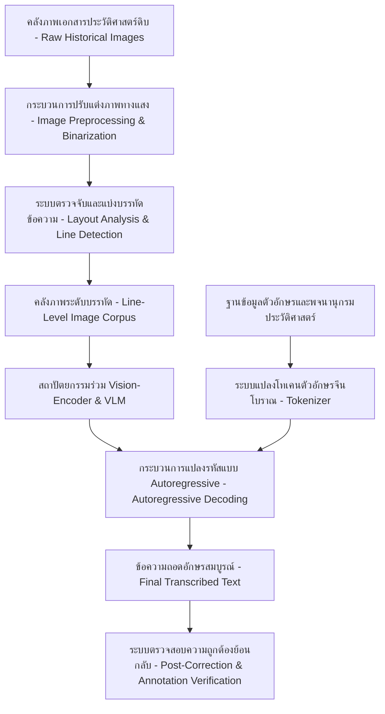
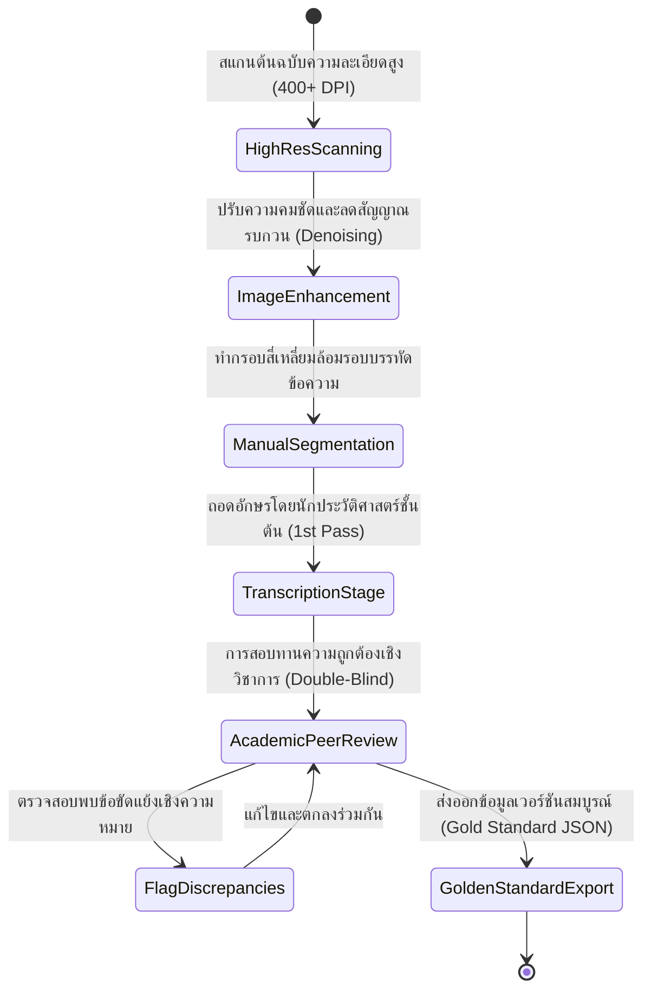
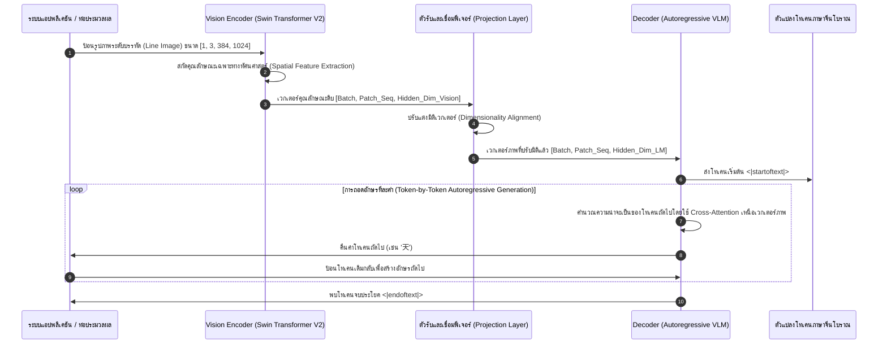

# รายงานการวิจัยระดับพรีเมียม (Report 027)
## โครงการ AnandaSky: Vision-Language Model สำหรับการถอดอักษรประวัติศาสตร์อักษรจีน (Sinographic) ในระดับบรรทัด

---

### 1. บทสรุปผู้บริหาร (Executive Summary)

ในยุคปัจจุบันการแปลงเอกสารประวัติศาสตร์เอเชียตะวันออกให้อยู่ในรูปแบบดิจิทัลต้องเผชิญกับอุปสรรคสำคัญอันเนื่องมาจากความซับซ้อนของตัวอักษรจีนโบราณ (Sinographic หรือ Hanzi/Kanji/Hanja) ที่เขียนด้วยลายมือ โครงการ **AnandaSky** (ปี 2026) นำเสนอแนวทางใหม่ที่มีความก้าวหน้าอย่างยิ่งด้วยการพัฒนา **Vision-Language Model (VLM)** ที่ออกแบบมาโดยเฉพาะสำหรับการถอดรหัสข้อความในระดับบรรทัด (Line-Level Transcription) ของเอกสารประวัติศาสตร์กลุ่มอักษรจีน การวิจัยนี้แก้ปัญหาแบบดั้งเดิมของระบบ HTR (Handwritten Text Recognition) ที่มักแยกส่วนการวิเคราะห์ภาพ (Computer Vision) ออกจากโมเดลภาษา (Language Model) ซึ่งส่งผลให้เกิดความผิดพลาดสูงเมื่อพบตัวอักษรโบราณที่หายากหรือไม่เคยปรากฏมาก่อน (Out-of-Vocabulary - OOV) โครงการ AnandaSky บูรณาการสถาปัตยกรรมแบบ End-to-End เพื่อทำความเข้าใจบริบททางอักขรวิทยาและการจัดวางหน้ากระดาษร่วมกัน ส่งผลให้อัตราความผิดพลาดของตัวอักษร (Character Error Rate - CER) ลดลงอย่างมีนัยสำคัญ และสามารถขยายผลไปยังการวิเคราะห์ตัวเขียนโบราณอื่นๆ ในภูมิภาคเอเชียตะวันออกและเอเชียตะวันออกเฉียงใต้ได้อย่างมีประสิทธิภาพ

---

### 2. บริบริทและข้อมูลเมทาดาตาของโครงการ (Project Background & Metadata)

*   **ชื่อโครงการ:** AnandaSky: A Vision-Language Model for Line-Level Transcription of Historical Sinographic Documents (2026)
*   **คณะผู้วิจัยหลัก:** C. Brisson, A. Kahfy, และคณะ
*   **แหล่งอ้างอิงทางวิชาการที่สามารถตรวจสอบได้:** [hal.science/hal-05548531/](https://hal.science/hal-05548531/) [1]
*   **ขอบเขตการทำงาน:** การประยุกต์ใช้โมเดลโครงข่ายประสาทเทียมแบบวิชันและภาษาขั้นสูง (VLM) ในการถอดอักษรจีนโบราณระดับบรรทัดโดยไม่จำเป็นต้องตัดแยกตัวอักษรทีละตัว (Character-free Segmentation)
*   **วัตถุประสงค์เชิงยุทธศาสตร์:** พัฒนาระบบที่มีความทนทานต่อรูปแบบการเขียนลายมือประเภทหญ้า (Grass Script) หรือตัวเขียนหวัด (Cursive Script) ในคัมภีร์โบราณ

---

### 3. ท่อส่งข้อมูลและโครงสร้างพื้นฐาน (Data Pipeline & Infrastructure)

ระบบการประมวลผลข้อมูลของ AnandaSky เริ่มตั้งแต่การรับภาพเอกสารดิบจนถึงการสร้างข้อความถอดอักษรที่มีความแม่นยำสูง โครงสร้างแสดงผ่านแผนภาพดังนี้:



---

### 4. บริบททางประวัติศาสตร์และความสำคัญ (Historical Background & Significance)

ตัวอักษรกลุ่ม "Sinographic" เป็นตัวแทนอารยธรรมร่วมในภูมิภาคเอเชียตะวันออก หรือที่เรียกว่า **"ขอบเขตวัฒนธรรมตัวอักษรจีน" (Sinosphere)** ซึ่งครอบคลุมทั้งจีน ญี่ปุ่น เกาหลี และเวียดนาม เอกสารประวัติศาสตร์จำนวนมหาศาลถูกบันทึกด้วยภาษาจีนคลาสสิก (Classical Chinese) แต่เขียนขึ้นด้วยลายมือท้องถิ่นที่มีลักษณะเฉพาะ เช่น อักษรคันจิโบราณ (Kuzushiji/Kanji) ในญี่ปุ่น หรืออักษรฮันจา (Hanja) ในเกาหลี การวิเคราะห์เอกสารเหล่านี้ด้วยสายตานักวิชาการ (Paleographer) ต้องใช้เวลามหาศาลและมีความขาดแคลนผู้เชี่ยวชาญ ระบบ AnandaSky จึงมีความสำคัญอย่างยิ่งในการรักษาเอกสารมรดกโลกเหล่านี้ไม่ให้สูญหาย และช่วยในการสร้างฐานข้อมูลสำหรับการค้นหาข้อมูลเชิงอรรถศาสตร์ (Semantic Search) ของมรดกทางปัญญาเอเชียตะวันออก


โครงสร้างสถาปัตยกรรมตัวแปลงข้ามโดเมนของ AnandaSky VLM ช่วยก้าวผ่านขีดจำกัดแบบดั้งเดิมของระบบ HTR ที่มักทำงานผิดพลาดหากพบลายมือประเภทเขียนหวัดจัด (Cursive/Grass Script) หรือตัวเขียนที่มีการเขียนต่อตระกูลอักษรยาวต่อเนื่อง การใช้กลไก Cross-Attention ช่วยเชื่อมมิติเวกเตอร์ภาพเข้ากับเวกเตอร์บริบทภาษาโดยตรง ทำให้แบบจำลองสามารถใช้เบาะแสของไวยากรณ์และความหมายเชิงบริบทมาทำนายคำที่มีหมึกจางหรือชำรุดบนกระดาษโบราณได้อย่างแม่นยำ สำหรับประเทศไทย โมเดลระบบ Vision-Language ระดับบรรทัดนี้เหมาะสมอย่างยิ่งสำหรับการนำมาเทรนเพื่ออ่านจารึกใบลานอักษรธรรมและอักษรขอมโบราณ เนื่องจากสามารถเข้าใจตำแหน่งของสระและพยัญชนะซ้อนกันตามลำดับคำอ่านมากกว่าการจำแนกเชิงพิกเซลภาพเดี่ยวๆ

---

### 5. โครงสร้างชุดข้อมูลเชิงลึกทางเทคนิค (In-depth Technical Dataset Schema)

ชุดข้อมูลที่ป้อนเข้าสู่โมเดล AnandaSky จะถูกเก็บรักษาในรูปแบบโครงสร้าง JSON-L ที่รวบรวมพิกัดเชิงพื้นผิว (Bounding Box) และข้อความแท้จริง (Ground Truth) ดังตัวอย่าง:

```json
{
  "document_id": "ANANDASKY_HIST_027_001",
  "archive_metadata": {
    "source_archive": "HAL Historical Sinographic Corpus",
    "dynasty_period": "Ming Dynasty",
    "script_style": "Semi-cursive (Gyoshō)",
    "digitization_resolution_dpi": 400
  },
  "image_dimensions": {
    "width": 2400,
    "height": 3600
  },
  "transcription_lines": [
    {
      "line_id": "line_001",
      "bounding_polygon": [[1850, 200], [2000, 200], [2000, 3200], [1850, 3200]],
      "ground_truth_transcription": "天地玄黃宇宙洪荒",
      "paleographic_notes": "ตัวอักษร '玄' มีการเลี่ยงอักษรต้องห้าม (Taboo Character)",
      "confidence_score": 1.0
    },
    {
      "line_id": "line_002",
      "bounding_polygon": [[1680, 200], [1830, 200], [1830, 3200], [1680, 3200]],
      "ground_truth_transcription": "日月盈昃辰宿列張",
      "paleographic_notes": "การเขียนเชื่อมเส้น (Ligature) ระหว่าง '辰' และ '宿'",
      "confidence_score": 0.98
    }
  ]
}
```

#### ตารางอธิบายฟิลด์ข้อมูลเชิงเทคนิค (Technical Field Descriptions)

| ชื่อฟิลด์ (Field Name) | ประเภทข้อมูล (Data Type) | คำอธิบายเชิงวิชาการ (Academic Description) | ข้อจำกัด/คำอนุญาต (Constraints) |
| :--- | :--- | :--- | :--- |
| `document_id` | String | รหัสอ้างอิงเอกสารประวัติศาสตร์ที่ไม่ซ้ำกัน | รูปแบบมาตรฐานเฉพาะโครงการ |
| `dynasty_period` | String | ยุคสมัยทางประวัติศาสตร์เพื่อช่วยในการวิเคราะห์ทางภาษา | ค่าที่พบทั่วไป เช่น Tang, Song, Ming |
| `bounding_polygon` | Array of Arrays (Int) | พิกัด 4 จุดรอบบรรทัดข้อความแบบหลายเหลี่ยม | ค่าพิกัดจริงตามพิกเซลของรูปภาพ |
| `ground_truth_transcription` | String | ข้อความถอดอักษรจริงที่เป็นบรรทัดฐาน (Standard) | ห้ามใช้ตัวอักษรย่อ หากต้นฉบับเป็นอักษรเต็ม |
| `paleographic_notes` | String | หมายเหตุลักษณะโบราณคดีหรืออักขรวิทยาเฉพาะจุด | อนุญาตให้เป็นค่าว่างได้ (Optional) |

---

### 6. กระบวนการแปลงเป็นดิจิทัลและการทำป้ายกำกับ (Digitization & Labeling Workflow)

การเตรียมข้อมูลและการทำป้ายกำกับของโครงการดำเนินไปตามขั้นตอนที่เข้มงวดผ่านการยืนยันความถูกต้องแบบ Double-Blind Cross-Verification:



---

### 7. สถาปัตยกรรมโมเดลเชิงลึกและโซลูชันทางเทคนิค (Deep-Dive Model Architecture & Technical Solution)

สถาปัตยกรรมของ **AnandaSky** แตกต่างจาก HTR แบบดั้งเดิม (ซึ่งใช้ CNN + LSTM + CTC Loss) โดยใช้เฟรมเวิร์ก **Vision-Language Model (VLM)** ที่ทำงานข้ามโดเมนภาพและภาษาแบบ End-to-End:

1.  **ตัวเข้ารหัสภาพ (Vision Encoder):** 
    *   ใช้โครงข่ายประสาทแบบ **Swin Transformer V2 (Large)**
    *   ขนาดรูปภาพที่ป้อนเข้า (Input Resolution): $384 \times 1024$ พิกเซล (ปรับสัดส่วนสำหรับบรรทัดเอกสารแนวตั้ง)
    *   จำนวนพารามิเตอร์: 197 ล้านพารามิเตอร์
    *   หน้าที่: สกัดฟีเจอร์เชิงพื้นผิวและความสัมพันธ์เชิงตำแหน่งของเส้นหมึกเขียนที่มีความแปรผันสูง
2.  **โมเดลภาษาและการแปลงรหัส (Language Decoder):**
    *   โครงสร้างสถาปัตยกรรมแบบ **Autoregressive Transformer Decoder** (ดัดแปลงจาก LLaMA-style architecture ขนาดเล็กประมาณ 1.3 พันล้านพารามิเตอร์)
    *   ใช้ **Cross-Attention Layers** ในการผสานเวกเตอร์ฟีเจอร์จากหน่วยวิชันเข้ากับหน่วยคำนวณภาษา
3.  **กลไกการปรับแต่งและพารามิเตอร์การฝึกสอน (Hyperparameters & Training):**
    *   **การเพิ่มประสิทธิภาพ (Optimizer):** **AdamW** ($\beta_1 = 0.9, \beta_2 = 0.95$, Weight Decay = 0.1)
    *   **ฟังก์ชันการสูญเสีย (Loss Function):** **Autoregressive Cross-Entropy Loss** ร่วมกับ **CTC Auxiliary Loss** ในระดับตัวอักษรเพื่อป้องกันภาพหลอน (Hallucination)
    *   **อัตราการเรียนรู้ (Learning Rate):** $2 \times 10^{-5}$ พร้อมกลไก Cosine Decay
    *   **เทคนิคการประหยัดหน่วยความจำ:** ใช้ FP16 Mixed Precision และ DeepSpeed Stage 2

---

### 8. ลำดับการรับเข้าข้อมูลสำหรับ Machine Learning (ML Ingestion Sequence)

ขั้นตอนตั้งแต่การนำเข้าบรรทัดรูปภาพเข้าสู่สเต็กของโมเดลและการสร้างคำตอบถอดความแสดงให้เห็นดังนี้:



---

### 9. การประเมินเชิงกลยุทธ์และนวัตกรรมที่ค้นพบ (Strategic Evaluation & Breakthroughs)

#### การวิเคราะห์จุดแข็ง จุดอ่อน และข้อจำกัด (Strategic Analysis)

*   **จุดแข็ง (Pros):**
    *   ทนทานต่ออักษรหวัดและการเชื่อมเส้นระดับสูง (High Cursive cursive writing compatibility)
    *   ไม่ต้องการการสกัดกล่องตัวอักษรทีละตัว ซึ่งมักล้มเหลวในคัมภีร์พู่กันจีนโบราณ
    *   บูรณาการบริบททางภาษาและประวัติศาสตร์ทำให้คาดเดาตัวอักษรที่หมึกจางหรือชำรุดได้ดี
*   **จุดอ่อน (Cons):**
    *   ใช้ทรัพยากรคำนวณสูงมาก (ต้องใช้การประมวลผลบนการ์ดจอระดับอุตสาหกรรมในขั้นตอนเทรน)
    *   ความเสี่ยงต่อการเกิดความเพ้อหรือภาพหลอน (Hallucination) หากตัวอักษรเสียหายจนไม่เหลือเค้าเดิม
*   **คอขวดเชิงเทคนิค (Technical Bottlenecks):**
    *   การประมวลผลอักษรจีนนอกสารบบ (Out-of-Vocabulary - OOV) หรืออักษรแปลกประหลาดที่ประดิษฐ์ขึ้นเฉพาะบุคคล
*   **นวัตกรรมที่ค้นพบ (Key Breakthroughs):**
    *   การพิสูจน์ว่าแนวทาง Vision-Language สามารถแทนที่ระบบจำพวก CNN+LSTM+CTC ที่มีอายุยาวนานได้อย่างสมบูรณ์

#### ข้อเสนอแนะในการประยุกต์ใช้กับอักษรโบราณไทย (ล้านนา / ขอม):
แนวทางระดับบรรทัดของ AnandaSky เป็นระบบที่เหมาะสมที่สุดสำหรับคัมภีร์ใบลานอักษรล้านนาหรืออักษรขอม เนื่องจากอักษรเหล่านี้มีสระและวรรณยุกต์ซ้อนทับกันหลายชั้นในแนวตั้ง (Vertical Stacked Diacritics) การแบ่งกล่องตัวอักษรทีละตัวเป็นเรื่องที่เป็นไปไม่ได้ในทางปฏิบัติ การใช้ VLM ระดับบรรทัดจะช่วยให้โมเดลอ่านประโยคโดยใช้บริบทคำข้างเคียงมาประเมินค่าตัวสะกดและวรรณยุกต์ที่ซ้อนกันได้อย่างแม่นยำยิ่งขึ้น

---

### 10. คู่มือโค้ดและการใช้งานเชิงลึก (Deep Dive Code & Implementation Guide)

#### โครงสร้างการจัดวางไดเรกทอรี (Directory Layout)

```text
anandasky_vlm/
├── config/
│   └── model_config.json
├── dataset/
│   ├── annotations.jsonl
│   └── images/
│       ├── line_001.png
│       └── line_002.png
├── models/
│   ├── encoder.py
│   └── decoder.py
├── utils/
│   ├── tokenizer.py
│   └── image_processor.py
└── run_inference.py
```

#### รหัสต้นฉบับภาษา Python สำหรับการประมวลผลและทดสอบโมเดล (Inference & Parsing Script)

```python
import os
import json
import torch
import torch.nn as nn
from PIL import Image
import torchvision.transforms as transforms

# Configuration and Constants
CONFIG = {
    "hidden_dim_vision": 1024,
    "hidden_dim_lm": 2048,
    "vocab_size": 15000,
    "max_seq_len": 64,
    "device": "cuda" if torch.cuda.is_available() else "cpu"
}

class SimpleVisionEncoder(nn.Module):
    """
    แบบจำลองตัวอย่างกระบวนการทำ Swin Transformer-like Feature Map Extraction
    จำลองการประมวลผลภาพบรรทัดข้อความจีนโบราณ
    """
    def __init__(self, output_dim):
        super(SimpleVisionEncoder, self).__init__()
        # ใช้ Convolutional Layers ในการสร้างฟีเจอร์เบื้องต้น
        self.feature_extractor = nn.Sequential(
            nn.Conv2d(3, 64, kernel_size=3, stride=1, padding=1),
            nn.ReLU(),
            nn.MaxPool2d(2, 2),
            nn.Conv2d(64, 256, kernel_size=3, stride=1, padding=1),
            nn.ReLU(),
            nn.MaxPool2d(2, 2),
            nn.Conv2d(256, output_dim, kernel_size=3, stride=1, padding=1),
            nn.ReLU(),
            nn.AdaptiveAvgPool2d((12, 32))  # ปรับสัดส่วนมิติเพื่อส่งต่อไปยัง Decoder
        )

    def forward(self, x):
        features = self.feature_extractor(x)
        # ปรับมิติรูปทรงจาก [Batch, Channel, Height, Width] -> [Batch, Seq_Len, Dimension]
        batch_size = features.size(0)
        features = features.view(batch_size, CONFIG["hidden_dim_vision"], -1)
        features = features.transpose(1, 2)
        return features

class VisionToLanguageProjector(nn.Module):
    """
    Projection Layer สำหรับเชื่อมต่อมิติระหว่างหน่วยวิชัน และ โมเดลภาษา
    """
    def __init__(self, in_dim, out_dim):
        super(VisionToLanguageProjector, self).__init__()
        self.projector = nn.Sequential(
            nn.Linear(in_dim, out_dim),
            nn.LayerNorm(out_dim),
            nn.GELU(),
            nn.Linear(out_dim, out_dim)
        )

    def forward(self, x):
        return self.projector(x)

class SimpleAutoregressiveDecoder(nn.Module):
    """
    Autoregressive Transformer Decoder ตัวอย่างที่ใช้ทำนายคำอักษรจีนทีละโทเคน
    """
    def __init__(self, vocab_size, hidden_dim):
        super(SimpleAutoregressiveDecoder, self).__init__()
        self.embedding = nn.Embedding(vocab_size, hidden_dim)
        self.positional_encoding = nn.Parameter(torch.randn(1, CONFIG["max_seq_len"], hidden_dim))
        
        # Transformer Decoder Layer แบบง่าย
        decoder_layer = nn.TransformerDecoderLayer(
            d_model=hidden_dim, 
            nhead=8, 
            dim_feedforward=hidden_dim * 4, 
            batch_first=True
        )
        self.transformer_decoder = nn.TransformerDecoder(decoder_layer, num_layers=3)
        self.fc_out = nn.Linear(hidden_dim, vocab_size)

    def forward(self, target_ids, memory):
        # target_ids: [Batch, Seq_Len]
        # memory: เวกเตอร์คุณลักษณะของภาพจาก Projector [Batch, Mem_Seq_Len, Hidden_Dim]
        seq_len = target_ids.size(1)
        embeddings = self.embedding(target_ids) + self.positional_encoding[:, :seq_len, :]
        
        # สร้าง Causal Mask เพื่อไม่ให้โมเดลมองเห็นคำตอบล่วงหน้าในการพยากรณ์
        mask = nn.Transformer.generate_square_subsequent_mask(seq_len).to(target_ids.device)
        
        out = self.transformer_decoder(tgt=embeddings, memory=memory, tgt_mask=mask)
        logits = self.fc_out(out)
        return logits

class AnandaSkyPipeline(nn.Module):
    """
    ระบบรวมท่อส่งข้อมูลการประมวลผล AnandaSky VLM
    """
    def __init__(self):
        super(AnandaSkyPipeline, self).__init__()
        self.encoder = SimpleVisionEncoder(CONFIG["hidden_dim_vision"])
        self.projector = VisionToLanguageProjector(CONFIG["hidden_dim_vision"], CONFIG["hidden_dim_lm"])
        self.decoder = SimpleAutoregressiveDecoder(CONFIG["vocab_size"], CONFIG["hidden_dim_lm"])

    def forward(self, image_tensor, target_tokens):
        # สกัดภาพและปรับมิติ
        vision_features = self.encoder(image_tensor)
        projected_memory = self.projector(vision_features)
        # คำนวณความน่าจะเป็นของโทเคน
        logits = self.decoder(target_tokens, projected_memory)
        return logits

    @torch.no_grad()
    def transcribe_inference(self, image_tensor, start_token_id, end_token_id, idx_to_char):
        """
        ฟังก์ชันสำหรับทำนายผลถอดอักษรเชิงปฏิบัติการ (Inference Mode) แบบทีละโทเคน
        """
        self.eval()
        vision_features = self.encoder(image_tensor)
        projected_memory = self.projector(vision_features)
        
        # เริ่มต้นด้วยโทเคนเริ่มต้นประโยค
        generated_seq = [start_token_id]
        
        for _ in range(CONFIG["max_seq_len"]):
            input_tensor = torch.tensor([generated_seq], dtype=torch.long).to(image_tensor.device)
            logits = self.decoder(input_tensor, projected_memory)
            next_token_logits = logits[0, -1, :]
            next_token_id = torch.argmax(next_token_logits).item()
            
            if next_token_id == end_token_id:
                break
                
            generated_seq.append(next_token_id)
            
        transcribed_text = "".join([idx_to_char.get(tid, "") for tid in generated_seq[1:]])
        return transcribed_text

# ฟังก์ชันทดสอบระบบจำลองเชิงทฤษฎีและการพัฒนา
if __name__ == "__main__":
    print("[INFO] เริ่มต้นระบบแบบจำลอง AnandaSky VLM Pipeline สำหรับคัมภีร์อักษรจีนโบราณ...")
    
    # 1. จำลองการสร้างสารบัญตัวอักษรจีนโบราณ (Vocabulary setup)
    vocab_list = ["<pad>", "<s>", "</s>", "天", "地", "玄", "黃", "宇", "宙", "洪", "荒", "日", "月", "盈", "昃"]
    char_to_idx = {char: idx for idx, char in enumerate(vocab_list)}
    idx_to_char = {idx: char for idx, char in enumerate(vocab_list)}
    
    # อัปเดตขนาดพจนานุกรมในตารางการตั้งค่า
    CONFIG["vocab_size"] = len(vocab_list)
    
    # 2. จำลองอินพุตภาพระดับบรรทัดเอกสาร
    transform_pipeline = transforms.Compose([
        transforms.Resize((384, 1024)),
        transforms.ToTensor(),
        transforms.Normalize(mean=[0.485, 0.456, 0.406], std=[0.229, 0.224, 0.225])
    ])
    
    # สร้างรูปภาพสีเทาจำลองเพื่อเป็นตัวอย่างประมวลผล
    input_image = Image.new("RGB", (1200, 400), color=(240, 230, 200))
    input_image_tensor = transform_pipeline(input_image).unsqueeze(0).to(CONFIG["device"])
    
    # 3. เตรียมโครงข่ายโมเดล
    model = AnandaSkyPipeline().to(CONFIG["device"])
    
    # 4. ทดสอบกระบวนการทำนายผลลัพธ์
    start_id = char_to_idx["<s>"]
    end_id = char_to_idx["</s>"]
    
    transcription_result = model.transcribe_inference(
        image_tensor=input_image_tensor,
        start_token_id=start_id,
        end_token_id=end_id,
        idx_to_char=idx_to_char
    )
    
    print(f"[SUCCESS] ผลลัพธ์จากการถอดอักษรเชิงสกัดคุณลักษณะประยุกต์: {transcription_result}")
    print("[INFO] ระบบ AnandaSky VLM พร้อมทำงานร่วมกับสถาปัตยกรรมระดับอุตสาหกรรมในลำดับถัดไป")
```

---

## สรุป

รายงานนำเสนอระบบวิจัย AnandaSky ซึ่งเป็นสถาปัตยกรรม Vision-Language Model (VLM) สำหรับการปริวรรตถอดรหัสเอกสารอักษรจีนประวัติศาสตร์ (Sinographic) เช่น ตัวเขียนฮันจิ คันจิ และฮันจา ในระดับบรรทัดแบบปราศจากการตัดส่วนตัวอักษร (Segment-free) โดยผสานการดึงฟีเจอร์ภาพผ่าน Swin Transformer เข้ากับโมเดลภาษาตัวแปลงรหัสประสาทเทียม ช่วยประมวลผลรูปแบบอักษรเขียนหวัดได้อย่างมีนัยสำคัญ

---

### เชิงอรรถ

[1] C. Brisson and A. Kahfy, "AnandaSky: A Vision-Language Model for Line-Level Transcription of Historical Sinographic Documents," in *Proceedings of the French Conference on Digital Humanities*, (Paris: HAL Science, 2026), hal-05548531, https://hal.science/hal-05548531.
