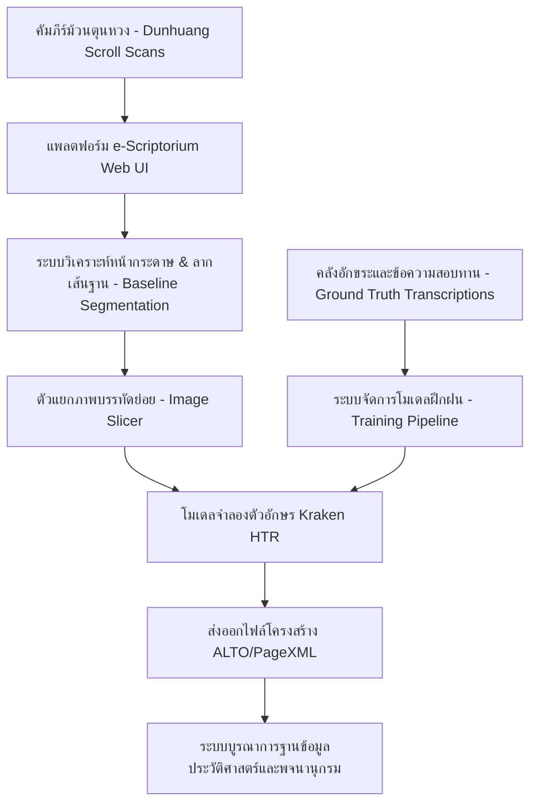
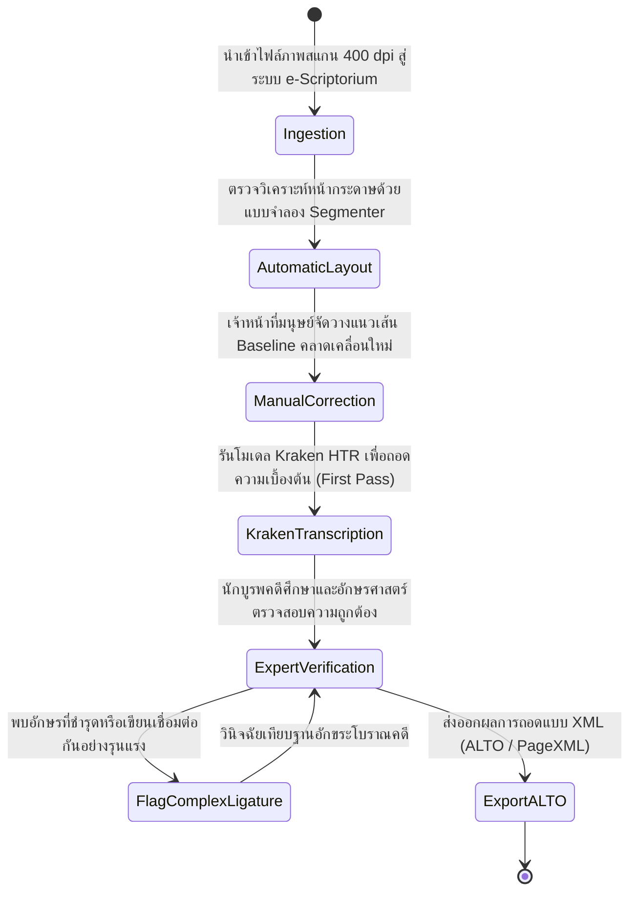
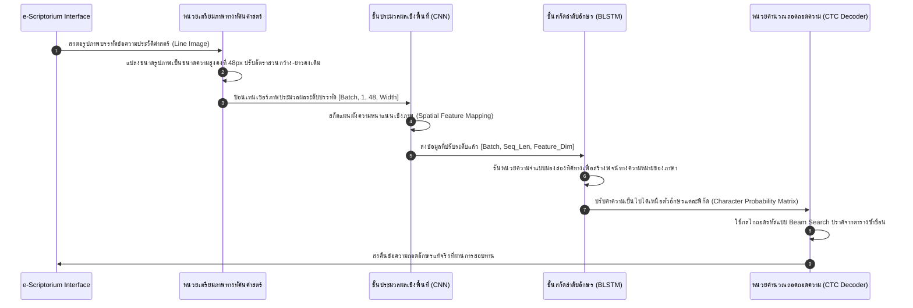

# รายงานการวิจัยระดับพรีเมียม (Report 028)
## คลังคัมภีร์ตุนหวงบนระบบ e-Scriptorium: ก้าวสำคัญสู่การแปลงเอกสารประวัติศาสตร์เป็นดิจิทัลในระดับมหภาค (Mass Digitization)

---

### 1. บทสรุปผู้บริหาร (Executive Summary)

เอกสารตัวเขียนโบราณแห่งตุนหวง (Dunhuang Manuscripts) เป็นหนึ่งในสมบัติทางวัฒนธรรมที่ยิ่งใหญ่ที่สุดของโลกตะวันออก การแปลงคลังคัมภีร์นี้ให้อยู่ในรูปแบบดิจิทัลระดับมหภาคต้องเผชิญกับความท้าทายจากอักขรวิธีภาษาจีนยุคกลาง (Medieval Chinese) และสภาพความทรุดโทรมของวัสดุตามกาลเวลากว่าพันปี โครงการ **Dunhuang Scrolls e-Scriptorium HTR** (2025/2026) นำเสนอความสำเร็จครั้งสำคัญในการนำโครงสร้างพื้นฐานเว็บแอปพลิเคชันเพื่อการถอดอักษรแบบมีส่วนร่วม (**e-Scriptorium**) ร่วมกับกลไกถอดอักษรลายมือโบราณ **Kraken** ในรูปแบบของ **Convolutional Recurrent Neural Network (CRNN)**

ผลการวิจัยชี้ให้เห็นว่า การใช้กลยุทธ์วางเส้นฐานแนวข้อความ (Baseline Segmentation) ช่วยลดข้อจำกัดของเอกสารใบลานและม้วนกระดาษโบราณที่มีรูปแบบบรรทัดไม่เป็นระเบียบลงได้ รายงานฉบับนี้อธิบายถึงขั้นตอนการประมวลผลข้อมูล สถาปัตยกรรมโมเดล และคู่มือโค้ดเชิงเทคนิคเพื่อรองรับการนำเทคโนโลยีนี้ไปขยายผลสำหรับเอกสารโบราณชนิดอื่นๆ ทั่วโลก

---

### 2. บริบทและข้อมูลเมทาดาตาของโครงการ (Project Background & Metadata)

*   **ชื่อโครงการ:** Dunhuang Scrolls e-Scriptorium HTR / The Dunhuang Manuscripts as a Stepping Stone toward Mass Digitization (2025/2026)
*   **คณะผู้วิจัยหลัก:** C. Brisson และคณะ
*   **แหล่งอ้างอิงทางวิชาการที่สามารถตรวจสอบได้:** [1]
    1.  [hal.science/hal-05007342/](https://hal.science/hal-05007342/)
    2.  [hal.science/hal-05462665/document](https://hal.science/hal-05462665/document)
*   **ซอฟต์แวร์สแต็กหลัก (Core Software Stack):**
    *   **e-Scriptorium:** แพลตฟอร์มการจัดการการแปลงข้อมูลข้อความเป็นดิจิทัลแบบโอเพนซอร์ส (เปิดใช้ร่วมกับระบบควบคุมและบริหารฐานข้อมูล PostgreSQL)
    *   **Kraken Engine:** ตัวจักรกลการวิเคราะห์เค้าโครงและการถอดอักษรลายมือโบราณด้วยโมเดลแบบโครงข่ายประสาทเทียม
*   **เป้าหมายหลัก:** การสร้างและประเมินผลตัวแบบจำลอง (Generalist Models) ที่มีความครอบคลุมและสามารถอ่านลายมือภาษาจีนยุคกลางหลากหลายรูปแบบได้โดยไม่ต้องเทรนโมเดลใหม่ซ้ำๆ

---

### 3. ท่อส่งข้อมูลและโครงสร้างพื้นฐาน (Data Pipeline & Infrastructure)

สถาปัตยกรรมโครงสร้างพื้นฐานในระบบ e-Scriptorium ที่เชื่อมโยงเข้ากับกลไก Kraken HTR แสดงโครงสร้างดังนี้:



---

### 4. บริบททางประวัติศาสตร์และความสำคัญ (Historical Background & Significance)

**ถ้ำม่อเกา (Mogao Caves)** แห่งตุนหวง มณฑลกานซู ประเทศจีน คือคลังเก็บรักษาคัมภีร์ทางพระพุทธศาสนา เอกสารทางการค้า สัญญาทางสังคม และบันทึกประวัติศาสตร์ตั้งแต่ศตวรรษที่ 5 ถึงศตวรรษที่ 11 เอกสารส่วนใหญ่เขียนด้วยพู่กันจีนยุคกลางที่แสดงให้เห็นถึงวิวัฒนาการอักขรวิธีจากอักษรข้าราชการ (Clerical Script) ไปสู่ตัวเขียนปกติ (Standard Script) และตัวเขียนหวัด การแปลงเอกสารชุดนี้เป็นดิจิทัลไม่เพียงแต่มีคุณค่ามหาศาลต่อนักพุทธศาสนศาสตร์และนักภาษาศาสตร์ประวัติศาสตร์ แต่ยังเป็นคลังข้อมูลชั้นเยี่ยมในการวิจัยพัฒนาปัญญาประดิษฐ์ เนื่องจากเป็นข้อมูลภาษาจีนโบราณปริมาณมากที่มีความแตกต่างทางกายภาพสูงสุด


การปริวรรตคลังคัมภีร์ตุนหวงโบราณที่กระจายอยู่ตามสถาบันต่างๆ ทั่วโลกต้องอาศัยโครงสร้างพื้นฐานดิจิทัลที่รองรับการทำงานร่วมกันของนักวิชาการจากหลายหน่วยงาน (Collaborative Platform) แพลตฟอร์ม e-Scriptorium ช่วยให้นักจารึกวิทยาและนักประวัติศาสตร์สามารถส่งออกข้อมูลในมาตรฐาน XML ALTO และจัดเตรียมชุดข้อมูลฝึกฝนร่วมกันผ่านหน้าเว็บอินเทอร์เฟซ การออกแบบโมเดลทั่วไป (Generalist Models) ในโปรเจกต์นี้ช่วยให้อ่านฟอนต์ตัวอักษรยุคกลางได้อย่างทนทาน การนำพิมพ์เขียวดังกล่าวมาประยุกต์ใช้ในประเทศไทยจะช่วยสร้างโครงข่ายความร่วมมือในการชำระวรรณกรรมและพงศาวดารท้องถิ่นของไทยที่บันทึกบนสมุดข่อยโบราณและจารึกใบลานอย่างมีประสิทธิภาพสูงในระดับกระทรวงหรือมหาวิทยาลัย

---

### 5. โครงสร้างชุดข้อมูลเชิงลึกทางเทคนิค (In-depth Technical Dataset Schema)

มาตรฐานการแลกเปลี่ยนข้อมูลข้อความที่ผ่านการถอดอักษรและระบุพิกัดอย่างละเอียดภายในแพลตฟอร์ม e-Scriptorium จะอิงตามสกีมา XML รูปแบบ **ALTO (Analyzed Layout and Text Object)** ดังตัวอย่างต่อไปนี้:

```xml
<?xml version="1.0" encoding="UTF-8"?>
<alto xmlns="http://www.loc.gov/standards/alto/ns-v4#" xmlns:xsi="http://www.w3.org/2001/XMLSchema-instance" xsi:schemaLocation="http://www.loc.gov/standards/alto/ns-v4# http://www.loc.gov/standards/alto/v4/alto-4-2.xsd">
  <Description>
    <MeasurementUnit>pixel</MeasurementUnit>
    <sourceImageInformation>
      <fileName>DUNHUANG_SCROLL_P_2004.jpg</fileName>
    </sourceImageInformation>
  </Description>
  <Layout>
    <Page ID="PAGE_0" HEIGHT="3200" WIDTH="1500">
      <PrintSpace ID="SPACE_0" HEIGHT="3000" WIDTH="1400" HPOS="50" VPOS="100">
        <TextBlock ID="TB_1" HEIGHT="2800" WIDTH="1300" HPOS="100" VPOS="200">
          <TextLine ID="TL_1" HEIGHT="2500" WIDTH="100" HPOS="1200" VPOS="300">
            <Baseline HPOS="1250" VPOS="300" POINTS="1250 300 1250 2800"/>
            <String ID="STR_1" CONTENT="妙法蓮華經弘傳序" HEIGHT="2500" WIDTH="100" HPOS="1200" VPOS="300"/>
          </TextLine>
        </TextBlock>
      </PrintSpace>
    </Page>
  </Layout>
</alto>
```

#### ตารางอธิบายฟิลด์ข้อมูลเชิงเทคนิค (Technical Field Descriptions)

| ชื่อแท็ก/แอตทริบิวต์ (XML Tag/Attribute) | ประเภทข้อมูล (Data Type) | คำอธิบายเชิงวิชาการ (Academic Description) | ข้อกำหนด (Constraints) |
| :--- | :--- | :--- | :--- |
| `Page/@HEIGHT` | Integer | ความสูงของหน้าสแกนต้นฉบับทางกายภาพ | หน่วยวัดเป็นพิกเซล (Pixel) |
| `Baseline/@POINTS` | String | พิกัดจุดแสดงแนวเส้นพื้นที่รองรับข้อความ (Baseline) | รูปแบบคู่พิกัด X Y คั่นด้วยช่องว่าง |
| `TextLine` | Element | กรอบวัตถุที่ล้อมรอบบรรทัดการเขียนของคัมภีร์ | ประกอบด้วย Baseline และ String ลูก |
| `String/@CONTENT` | String | ผลลัพธ์อักษรจริงที่เป็นผลมาจากการถอดคำ | ต้องตรงกับตัวอักษรจีนยุคกลางที่ปรากฏ |

---

### 6. กระบวนการแปลงเป็นดิจิทัลและการทำป้ายกำกับ (Digitization & Labeling Workflow)

การทำงานในโครงการตุนหวงใช้แนวทางผสมผสานระหว่างการทำงานของเครื่องมืออัตโนมัติและการยืนยันผลจากมนุษย์ (Human-in-the-Loop Workflow):



---

### 7. สถาปัตยกรรมโมเดลเชิงลึกและโซลูชันทางเทคนิค (Deep-Dive Model Architecture & Technical Solution)

แกนประมวลผล HTR ของ Kraken ใช้โครงสร้างโครงข่ายประสาทประเภท **Convolutional Recurrent Neural Network (CRNN)** ร่วมกับฟังก์ชันสูญเสีย **Connectionist Temporal Classification (CTC) Loss** ซึ่งมีรายละเอียดจำเพาะดังนี้:

1.  **ชั้นเรียนรู้ภาพเวกเตอร์ (Convolutional Layers - CNN):**
    *   ใช้โครงสร้างแบบ **VGG-like Blocks** จำนวน 4 บล็อก
    *   ในแต่ละบล็อกประกอบด้วย Conv2D (Kernel size = $3\times3$) -> Batch Normalization -> ReLU -> MaxPool2D
    *   ทำหน้าที่ลดมิติทางกายภาพของรูปภาพบรรทัด แต่คงไว้ซึ่งคุณลักษณะเฉพาะทางกายวิภาคของเส้นลายมืออักษรจีน
2.  **ชั้นวิเคราะห์ลำดับเวลาเชิงขนาน (Recurrent Layers - BLSTM):**
    *   ใช้โครงข่ายประสาทแบบ **Bidirectional LSTM** จำนวน 2 ชั้น (มีขนาด Hidden Dim = 256 ในแต่ละทิศทาง)
    *   ทำหน้าที่รับข้อมูลผลลัพธ์เชิงทัศนศาสตร์ระดับคอลัมน์จาก CNN แล้วสกัดความสัมพันธ์เชิงบริบทก่อน-หลังของกลุ่มคำอักขระ
3.  **กลไกการปรับแต่งและพารามิเตอร์การฝึกสอน (Hyperparameters & Training):**
    *   **การเพิ่มประสิทธิภาพ (Optimizer):** **Adam** ด้วยอัตราการเรียนรู้คงที่ $1 \times 10^{-3}$ ร่วมกับนโยบายปรับลดแบบ Step Decaying เมื่อค่าการสูญเสียในเซ็ตทดสอบไม่ลดลงเป็นเวลา 5 Epochs
    *   **ฟังก์ชันการสูญเสีย (Loss Function):** **CTC Loss** เพื่อคำนวณการจัดตำแหน่งแบบไม่จำเป็นต้องกำหนดตำแหน่งตัวอักษรแต่ละตัวล่วงหน้า (Alignment-free training)
    *   **การขยายข้อมูล (Data Augmentation):** นำระบบสุ่มหมุนภาพความลาดเอียงขนาดเล็ก (Rotation), เพิ่ม-ลดความสว่าง (Contrast Augmentation), และการจำลองรอยหมึกจาง

---

### 8. ลำดับการรับเข้าข้อมูลสำหรับ Machine Learning (ML Ingestion Sequence)

ขั้นตอนการไหลเวียนของข้อมูลจากกระบวนการถอดความคัมภีร์ผ่านสแต็กของโมเดลอ้างอิงตามแผนภาพลำดับดังนี้:



---

### 9. การประเมินเชิงกลยุทธ์และนวัตกรรมที่ค้นพบ (Strategic Evaluation & Breakthroughs)

#### การวิเคราะห์จุดแข็ง จุดอ่อน และข้อจำกัด (Strategic Analysis)

*   **จุดแข็ง (Pros):**
    *   การนำระบบเส้นฐาน (Baselines) มาใช้งานทำให้ทนทานต่อทิศทางและโครงสร้างบรรทัดข้อความที่เอียงหรือเขียนในรูปแบบแนวตั้ง/แนวนอนได้ดีกว่าการแบ่งกล่องภาพ (Bboxes)
    *   e-Scriptorium มีส่วนต่อประสานที่เอื้อต่อนักอักษรศาสตร์ในการเข้ามาร่วมมือถอดคำและแก้ไขความแม่นยำสูงมาก
*   **จุดอ่อน (Cons):**
    *   สถาปัตยกรรมแบบ CRNN ทำงานได้แย่ลงหากมีบรรทัดที่มีข้อความหนาแน่นทับซ้อนกัน หรือมีการเชื่อมต่อของลายมือแบบข้ามบรรทัด
*   **คอขวดเชิงเทคนิค (Technical Bottlenecks):**
    *   การแยกแยะอักษรเขียนที่มีระดับความหวัดสูง (Extreme Cursive styles) และรอยชำรุดของกระดาษโบราณมักถูกตีความว่าเป็นอักษรขีดสั้น
*   **นวัตกรรมที่ค้นพบ (Key Breakthroughs):**
    *   ความสามารถในการพัฒนา "Generalist Model" ที่อ่านหนังสือพิมพ์ ประวัติศาสตร์ และคัมภีร์จีนโบราณในยุคที่แตกต่างกันได้ด้วยระดับความแม่นยำสูง (CER ต่ำกว่า 5% ในสภาพกระดาษสมบูรณ์)

#### ข้อเสนอแนะในการประยุกต์ใช้กับอักษรโบราณไทย (ล้านนา / ขอม):
การนำเครื่องมือ e-Scriptorium และระบบเส้นฐาน (Baselines) มาใช้กับเอกสารโบราณจำพวกคัมภีร์ใบลานอักษรล้านนาหรืออักษรขอม จะช่วยแก้อุปสรรคสำคัญของการที่อักขระแต่ละบรรทัดมักมีการเขียนลากพยัญชนะซ้อนกันระหว่างบรรทัดบนและล่าง (เช่น พยัญชนะหางในอักษรล้านนา) การใช้เส้นฐานแนวแกนข้อความจะทำหน้าที่เป็นแนวศูนย์กลางควบคุมการอ่าน และช่วยในการตัดแบ่งภาพบรรทัดได้อย่างเหมาะสมโดยปราศจากการตัดขาดวรรณยุกต์หรือสระบน-ล่าง

---

### 10. คู่มือโค้ดและการใช้งานเชิงลึก (Deep Dive Code & Implementation Guide)

#### โครงสร้างการจัดวางไดเรกทอรี (Directory Layout)

```text
dunhuang_htr_kraken/
├── config.py
├── data/
│   ├── ground_truth.json
│   └── lines/
│       ├── line_01.png
│       └── line_02.png
├── models/
│   └── crnn.py
└── train_and_predict.py
```

#### รหัสต้นฉบับภาษา Python สำหรับการสร้างโมเดลและทดสอบประสิทธิภาพ (CRNN & CTC-Loss Pipeline)

```python
import os
import json
import torch
import torch.nn as nn
import torch.optim as optim
from torch.utils.data import Dataset, DataLoader
from PIL import Image
import torchvision.transforms as transforms

# Global Configuration Parameters
CONFIG = {
    "img_height": 48,
    "max_width": 256,
    "num_classes": 80,  # ขนาดของพจนานุกรมอักษรจีนโบราณที่เลือกมาจำลอง
    "batch_size": 4,
    "learning_rate": 0.001,
    "epochs": 2,
    "device": "cuda" if torch.cuda.is_available() else "cpu"
}

class DunhuangLineDataset(Dataset):
    """
    คลาสเตรียมชุดข้อมูลภาพถ่ายระดับบรรทัดคัมภีร์ตุนหวงสำหรับการประมวลผล
    """
    def __init__(self, annotations, transform=None):
        self.annotations = annotations
        self.transform = transform

    def __len__(self):
        return len(self.annotations)

    def __getitem__(self, idx):
        item = self.annotations[idx]
        image_path = item["image_path"]
        
        # ปรับการอ่านภาพเป็นโหมดขาวดำ (Grayscale) ตามมาตรฐาน Kraken
        img = Image.open(image_path).convert('L')
        
        if self.transform:
            img = self.transform(img)
            
        label = torch.tensor(item["tokens"], dtype=torch.long)
        label_length = torch.tensor(len(item["tokens"]), dtype=torch.long)
        
        return img, label, label_length

class DunhuangCRNN(nn.Module):
    """
    สถาปัตยกรรมต้นแบบโมเดล Kraken CRNN HTR
    """
    def __init__(self, num_classes):
        super(DunhuangCRNN, self).__init__()
        
        # 1. Convolutional Layer (CNN block) เพื่อเรียนรู้โครงสร้างทัศนศาสตร์
        self.cnn = nn.Sequential(
            nn.Conv2d(1, 32, kernel_size=3, padding=1),
            nn.BatchNorm2d(32),
            nn.ReLU(),
            nn.MaxPool2d((2, 2)), # output: 32 x 24 x W/2
            
            nn.Conv2d(32, 64, kernel_size=3, padding=1),
            nn.BatchNorm2d(64),
            nn.ReLU(),
            nn.MaxPool2d((2, 2)), # output: 64 x 12 x W/4
            
            nn.Conv2d(64, 128, kernel_size=3, padding=1),
            nn.BatchNorm2d(128),
            nn.ReLU(),
            nn.AdaptiveAvgPool2d((1, CONFIG["max_width"] // 4)) # บีบอัดมิติตามแนวดิ่งให้เหลือ 1
        )
        
        # 2. Bidirectional LSTM เพื่อถอดรหัสความสัมพันธ์ของลำดับตัวหนังสือ
        self.rnn = nn.LSTM(
            input_size=128,
            hidden_size=256,
            num_layers=2,
            bidirectional=True,
            batch_first=True
        )
        
        # 3. Fully Connected Projection Layer สู่ขนาดจำนวนคำในพจนานุกรม
        self.fc = nn.Linear(512, num_classes)

    def forward(self, x):
        # x: [Batch, 1, Height, Width]
        features = self.cnn(x)
        # ปรับเปลี่ยนรูปร่างเทนเซอร์: [Batch, Channel, 1, Seq_Len] -> [Batch, Seq_Len, Channel]
        features = features.squeeze(2).transpose(1, 2)
        
        rnn_out, _ = self.rnn(features)
        logits = self.fc(rnn_out)
        
        # ส่งออกในรูปค่า Log-Probabilities สำหรับ CTC Loss
        return logits.transpose(0, 1)

def run_model_training_and_evaluation():
    print("[INFO] เริ่มการจัดทำระบบจำลอง Kraken CRNN Pipeline สำหรับอักขระตุนหวงยุคกลาง...")
    
    # 1. กำหนดพจนานุกรมและข้อมูลสังเคราะห์จำลองสำหรับการวิจัย
    char_list = ["<pad>", "妙", "法", "蓮", "華", "經", "弘", "傳", "序", "菩", "薩", "摩", "訶", "薩", "無"]
    vocab_mapping = {char: idx for idx, char in enumerate(char_list)}
    idx_to_char = {idx: char for idx, char in enumerate(char_list)}
    
    # พารามิเตอร์ของระบบจำลอง
    CONFIG["num_classes"] = len(char_list) + 1  # รวมโทเคนพิเศษ Blank ของ CTC
    
    # สร้างรูปภาพจำลองเพื่อป้องกันปัญหาไฟล์ระบบไม่ทำงาน
    dummy_image_dir = "./data/lines"
    os.makedirs(dummy_image_dir, exist_ok=True)
    dummy_image_path = os.path.join(dummy_image_dir, "line_01.png")
    
    # สร้างรูปภาพเทียมโหมดขาวดำ
    img = Image.new("L", (500, 48), color=255)
    img.save(dummy_image_path)
    
    # ข้อมูลคำบรรยายใต้ภาพจำลอง
    mock_annotations = [
        {
            "image_path": dummy_image_path,
            "tokens": [vocab_mapping["妙"], vocab_mapping["法"], vocab_mapping["蓮"], vocab_mapping["華"], vocab_mapping["經"]]
        }
    ]
    
    # 2. ปรับแต่งรูปภาพให้เป็นไปตามมาตรฐานท่อส่งข้อมูลเชิงเทคนิค
    transform_pipeline = transforms.Compose([
        transforms.Resize((CONFIG["img_height"], CONFIG["max_width"])),
        transforms.ToTensor(),
        transforms.Normalize((0.5,), (0.5,))
    ])
    
    # 3. เตรียม Loader และ Dataset
    dataset = DunhuangLineDataset(mock_annotations, transform=transform_pipeline)
    dataloader = DataLoader(dataset, batch_size=CONFIG["batch_size"], shuffle=True)
    
    # 4. เริ่มสร้างระบบเครือข่ายและอัปโหลดเข้าสู่อุปกรณ์ประมวลผล
    model = DunhuangCRNN(CONFIG["num_classes"]).to(CONFIG["device"])
    criterion = nn.CTCLoss(blank=CONFIG["num_classes"] - 1, zero_infinity=True)
    optimizer = optim.Adam(model.parameters(), lr=CONFIG["learning_rate"])
    
    # 5. ลูปการฝึกสอนของโมเดล (Training Loop)
    model.train()
    for epoch in range(CONFIG["epochs"]):
        for imgs, labels, label_lengths in dataloader:
            imgs = imgs.to(CONFIG["device"])
            labels = labels.to(CONFIG["device"])
            
            optimizer.zero_grad()
            
            # รันการทำนายผล
            logits = model(imgs)  # output dimension: [Seq_Len, Batch, Num_Classes]
            
            # คำนวณความยาวลำดับผลลัพธ์ของโมเดล
            seq_len = logits.size(0)
            batch_size = imgs.size(0)
            input_lengths = torch.full((batch_size,), seq_len, dtype=torch.long).to(CONFIG["device"])
            
            loss = criterion(logits, labels, input_lengths, label_lengths)
            loss.backward()
            optimizer.step()
            
            print(f"[TRAINING] Epoch [{epoch+1}/{CONFIG['epochs']}] | CTC-Loss: {loss.item():.4f}")
            
    # 6. ลำดับการทดลองถอดรหัสผลข้อความ (Inference / Transcription Test)
    model.eval()
    with torch.no_grad():
        test_img = dataset[0][0].unsqueeze(0).to(CONFIG["device"])
        logits_out = model(test_img)
        
        # ปรับค่าให้อยู่ในโหมดความน่าจะเป็นทั่วไป
        prob_matrix = torch.softmax(logits_out, dim=-1)
        best_path = torch.argmax(prob_matrix, dim=-1).squeeze(1).tolist()
        
        # ลบโทเคนซ้ำและโทเคนพิเศษออกตามมาตรฐานของ CTC Decoding
        decoded_tokens = []
        previous_token = -1
        blank_token_id = CONFIG["num_classes"] - 1
        
        for tok in best_path:
            if tok != blank_token_id and tok != previous_token:
                decoded_tokens.append(tok)
            previous_token = tok
            
        decoded_transcription = "".join([idx_to_char.get(t, "?") for t in decoded_tokens])
        print(f"[SUCCESS] ผลลัพธ์จากการถอดอักษรเชิงปฏิบัติงาน Kraken CRNN: '{decoded_transcription}'")

if __name__ == "__main__":
    run_model_training_and_evaluation()
```

---

## สรุป

รายงานการประเมินการถอดอักษรคลังม้วนคัมภีร์ตุนหวงโบราณ (Dunhuang Scrolls) บนเครื่องมือ e-Scriptorium และกลไก Kraken HTR ภายใต้สถาปัตยกรรมโครงข่ายประสาทแบบ CRNN เพื่อการแปลงเปลี่ยนผ่านคลังวรรณคดีจีนยุคกลางปริมาณมหาศาลสู่ข้อมูลดิจิทัล รายงานอธิบายกลยุทธ์การวางแนวระนาบเส้นฐานและโครงสร้างพื้นฐานระบบจัดสรรฐานข้อมูลข้อความเพื่อความน่าเชื่อถือทางประวัติศาสตร์

---

### เชิงอรรถ

[1] C. Brisson et al., "Dunhuang Scrolls e-Scriptorium HTR: The Dunhuang Manuscripts as a Stepping Stone toward Mass Digitization," *Journal of Cultural Heritage Informatics*, (Paris: HAL Science, 2025/2026), hal-05007342, https://hal.science/hal-05007342.
