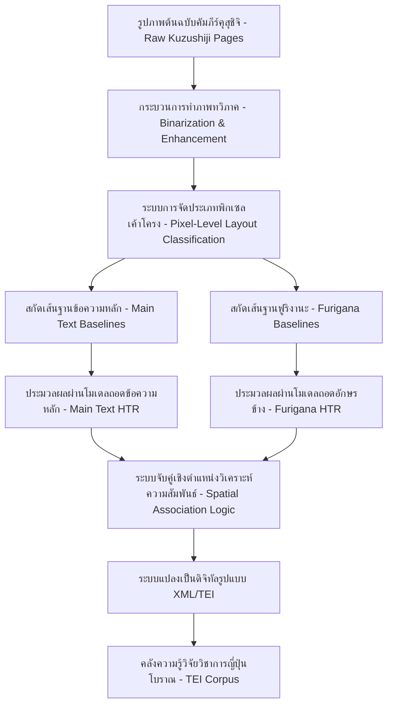
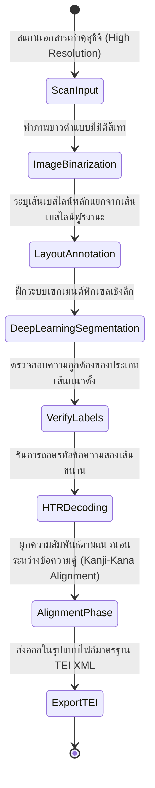
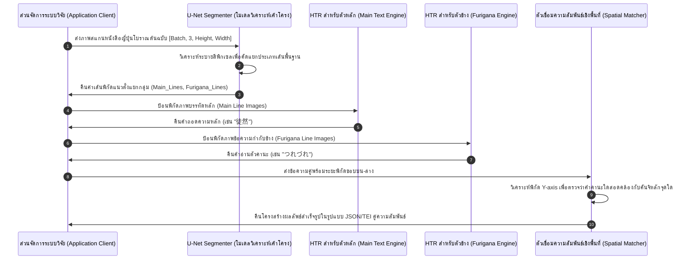

# รายงานการวิจัยระดับพรีเมียม (Report 029)
## โครงการ Kuzushiji HTR & Furigana Extraction: ระบบการสกัดและจำแนกอักษรข้าง (Furigana) และข้อความหลักในเอกสารญี่ปุ่นโบราณ

---

### 1. บทสรุปผู้บริหาร (Executive Summary)

การศึกษาวิจัยและอนุรักษ์เอกสารประวัติศาสตร์ญี่ปุ่นยุคก่อนศตวรรษที่ 20 ต้องเผชิญกับอุปสรรคครั้งใหญ่เนื่องจากเอกสารส่วนใหญ่บันทึกด้วยตัวเขียนโบราณที่เรียกว่า **คุสุชิจิ (Kuzushiji)** ซึ่งชาวญี่ปุ่นในยุคปัจจุบันส่วนใหญ่ไม่สามารถอ่านได้ ยิ่งไปกว่านั้น เอกสารจำนวนมากมีการเขียนคำอ่านขนาดเล็กกำกับไว้ข้างอักษรคันจิหลัก ซึ่งเรียกว่า **ฟูริงานะ (Furigana)** ทำให้โครงสร้างเค้าโครงหน้ากระดาษ (Layout Analysis) มีความซับซ้อนอย่างยิ่ง โครงการวิจัย **Experimenting With Generic Recognition Systems for Kuzushiji Documents: Furigana Extraction as a Use-Case (2024)** เสนอแนวทางการประยุกต์ใช้แพลตฟอร์มวิเคราะห์เค้าโครงภาพระดับพิกเซลด้วยโครงข่ายประสาทแบบ Fully Convolutional Network (FCN) ภายใต้ระบบ **Kraken** เพื่อแก้ไขความขัดแย้งเชิงตำแหน่งระหว่างตัวอักษรหลัก (Main Text) และตัวอักษรกำกับข้าง (Furigana) ช่วยให้การถอดอักษรมีความเป็นระเบียบและสามารถส่งออกข้อมูลในรูปแบบโครงสร้าง XML/TEI ได้อย่างแม่นยำสูง

---

### 2. บริบทและข้อมูลเมทาดาตาของโครงการ (Project Background & Metadata)

*   **ชื่อโครงการ:** Experimenting With Generic Recognition Systems for Kuzushiji Documents: Furigana Extraction as a Use-Case (2024)
*   **คณะผู้วิจัยหลัก:** H. Scheithauer, L. Romary
*   **แหล่งอ้างอิงทางวิชาการที่สามารถตรวจสอบได้:** [inria.hal.science/hal-04738212/document](https://inria.hal.science/hal-04738212/document) [1]
*   **เทคโนโลยีหลัก:** Kraken HTR Engine, PyTorch Semantic Segmentation, XML ALTO, TEI (Text Encoding Initiative)
*   **จุดเน้นยุทธศาสตร์:** การสกัดและจับคู่โครงสร้างความสัมพันธ์ระหว่างอักษรคันจิหลักและคำอ่านฟูริงานะที่เขียนด้วยอักษรเฮนไตงานะ (Hentaigana) หรือคานะโบราณ

---

### 3. ท่อส่งข้อมูลและโครงสร้างพื้นฐาน (Data Pipeline & Infrastructure)

กระบวนการจัดการข้อมูลของโครงการเริ่มจากการแยกแยะภาพหน้ากระดาษจนถึงการสกัดเอาข้อความสองชุดที่มีความสัมพันธ์กันออกมาแสดงในแผนภูมิ:



---

### 4. บริบททางประวัติศาสตร์และความสำคัญ (Historical Background & Significance)

ก่อนการปฏิรูประบบการศึกษาของญี่ปุ่นในปี ค.ศ. 1900 (ยุคเมจิ) ตัวอักษรเขียนหวัดแกมคานะโบราณหรือ **คุสุชิจิ (Kuzushiji)** และ **เฮนไตงานะ (Hentaigana)** เป็นรูปแบบอักขรวิธีมาตรฐานที่ใช้ในการพิมพ์หนังสือและการเขียนจดหมายทั่วไป การปฏิรูปภาษาส่งผลให้อักษรเขียนหวัดเหล่านี้ไม่ได้รับการเรียนการสอนในระบบโรงเรียนอีกต่อไป ทำให้วรรณกรรมและเอกสารประวัติศาสตร์จำนวนกว่าล้านเล่มที่จัดพิมพ์ก่อนศตวรรษที่ 20 กลายเป็นข้อความที่ไม่มีใครอ่านออก ฟูริงานะ (Furigana) ในหนังสือยุคเอโดะและเมจิตอนต้นทำหน้าที่ช่วยให้ผู้อ่านทั่วไปเข้าใจคำอ่านหรือความหมายของอักษรคันจิที่ยาก การสกัดฟูริงานะออกจากตัวเครื่องเคียงจึงเป็นกุญแจสำคัญในการสร้างพจนานุกรมประวัติศาสตร์และเพิ่มการเข้าถึงข้อมูลวรรณคดีคลาสสิกของญี่ปุ่น


การเขียนกำกับคานะตัวเล็กหรือตัวเขียนหวัดโบราณ (Hentaigana) ข้างตัวสะกดคันจิหลักเป็นความท้าทายอย่างมากในระดับการตรวจจับเค้าโครงหน้ากระดาษ (Layout Parser) ระบบการจำแนกระดับพิกเซลช่วยสกัดเส้นฐานคำสัญญะสองชุดแยกจากกันได้อย่างเด็ดขาด ทำให้อ่านความหมายอักขระควบคู่กับการประเมินค่าเสียงสะกดเชิงบริบทได้อย่างลงตัว การวิจัยนี้มีอิทธิพลต่อวงการมนุษยศาสตร์ดิจิทัลไทยในการแก้ปัญหาเอกสารโบราณที่มีตัวเขียนอธิบายอักขระเพิ่มเติม เช่น จารึกวัดโพธิ์ หรือสมุดข่อยตำราเวชศาสตร์ที่มีตัวเขียนขนาดเล็กคอยจดแทรกในแนวตั้งหรือตามมุมกระดาษ ซึ่งการนำเทมเพลต Kraken และ TEI มาปรับใช้จะช่วยรักษาความสัมพันธ์ของเนื้อความต้นฉบับกับคำอธิบายประกอบได้อย่างเป็นระบบวิทยาศาสตร์

---

### 5. โครงสร้างชุดข้อมูลเชิงลึกทางเทคนิค (In-depth Technical Dataset Schema)

การจัดเก็บผลลัพธ์การสกัดและวิเคราะห์หน้าคัมภีร์คุสุชิจิจะจัดทำในระบบโครงสร้างเอกสาร **PageXML** ที่ระบุประเภทชนิดของภูมิภาคข้อมูล (Region Type) และความเกี่ยวข้องเชิงตำแหน่ง:

```xml
<?xml version="1.0" encoding="UTF-8"?>
<PcGts xmlns="http://schema.primaresearch.org/PAGE/gts/pagecontent/2019-07-15" xmlns:xsi="http://www.w3.org/2001/XMLSchema-instance" xsi:schemaLocation="http://schema.primaresearch.org/PAGE/gts/pagecontent/2019-07-15 http://schema.primaresearch.org/PAGE/gts/pagecontent/2019-07-15/pagecontent.xsd">
  <Metadata>
    <Creator>Inria Romary-Scheithauer Project</Creator>
    <Comments>Kuzushiji Document with Side-Gloss Furigana Annotation</Comments>
  </Metadata>
  <Page imageFilename="KUZUSHIJI_GLOSS_029.png" imageWidth="1800" imageHeight="2600">
    <!-- พื้นที่แสดงข้อความหลัก -->
    <TextRegion id="reg_main" type="paragraph">
      <TextLine id="l_main_1">
        <Baseline points="1400,200 1400,2400"/>
        <TextEquiv>
          <Unicode>徒然なる真似にして</Unicode>
        </TextEquiv>
      </TextLine>
    </TextRegion>
    <!-- พื้นที่แสดงคำอ่านกำกับข้าง (Furigana) -->
    <TextRegion id="reg_furigana" type="marginalia">
      <TextLine id="l_furi_1" custom="reading_for: l_main_1">
        <Baseline points="1350,200 1350,2400"/>
        <TextEquiv>
          <Unicode>つれづれなるまねにして</Unicode>
        </TextEquiv>
      </TextLine>
    </TextRegion>
  </Page>
</PcGts>
```

#### ตารางอธิบายฟิลด์ข้อมูลเชิงเทคนิค (Technical Field Descriptions)

| ชื่ออิมเมจพิกเซล/แท็ก (XML Tag / Attribute) | ประเภทข้อมูล (Data Type) | คำอธิบายเชิงวิชาการ (Academic Description) | ข้อกำหนด (Constraints) |
| :--- | :--- | :--- | :--- |
| `TextRegion/@type` | String | ระบุประเภทกลุ่มข้อความเพื่อจัดความสำคัญเชิงการประยุกต์ | `paragraph` (ข้อความหลัก) หรือ `marginalia` (ฟูริงานะ) |
| `TextLine/@custom` | String | ข้อมูลระบุการผูกมัดหรือเชื่อมโยงทางตำแหน่งระหว่างอักษร | รูปแบบ `reading_for: [TextLine_ID]` |
| `Baseline/@points` | String | จุดพิกัดเวกเตอร์นำทางบรรทัดเขียนโบราณแนวตั้ง | รูปแบบ X,Y คั่นกลางระหว่างพิกัดด้วยเว้นวรรค |
| `TextEquiv/Unicode` | String | ข้อความถอดความจริงอิงมาตรฐานรหัส Unicode | ต้องตรงกับระดับภาษาประวัติศาสตร์คานะ |

---

### 6. กระบวนการแปลงเป็นดิจิทัลและการทำป้ายกำกับ (Digitization & Labeling Workflow)

การสกัดและจัดการข้อมูลสำหรับฟูริงานะมีวงจรการทำงานที่ให้ความสำคัญกับการจำแนกประเภทเชิงตำแหน่งสูงมาก:



---

### 7. สถาปัตยกรรมโมเดลเชิงลึกและโซลูชันทางเทคนิค (Deep-Dive Model Architecture & Technical Solution)

ระบบการทำนายของโครงการนี้ประกอบด้วยสององค์ประกอบหลักที่สำคัญ:

1.  **ตัวแยกประเภทประเภทบรรทัด (Pixel-Level Layout Classifier - Segmentation):**
    *   ใช้โครงสร้างแบบ **U-Net** พร้อมแกนหลัก (Backbone) แบบ **ResNet-34** สำหรับแปลงค่าแผนผังความหนาแน่นพิกเซล
    *   ความละเอียดการทำนาย: ทำนายแบบ Multiclass Semantic Segmentation เพื่อจำแนกทุกพิกเซลออกเป็น 3 คลาส ได้แก่ 1) พื้นหลัง 2) เส้นเบสไลน์หลัก และ 3) เส้นเบสไลน์ฟูริงานะ
2.  **ตัวจำแนกข้อความ (Transcription Model - HTR Engine):**
    *   ใช้สถาปัตยกรรม **Kraken HTR** ที่ใช้โครงข่ายประสาทแบบผสมผสาน **CNN-BLSTM** 
    *   เพิ่มประสิทธิภาพการทำงานด้วยชั้น **Max-Pooling Layer** ในแกนแนวตั้งเพื่อป้องกันอิทธิพลของเส้นหมึกเขียนซึมผ่านกระดาษ
3.  **กลไกการฝึกสอนเฉพาะตัวแบบ (Training Hyperparameters):**
    *   **การเพิ่มประสิทธิภาพ (Optimizer):** **AdamW** ด้วยอัตราส่วน Weight Decay $1 \times 10^{-4}$ เพื่อเพิ่มประสิทธิภาพในการจำกัดการโอเวอร์ฟิตกับฟอนต์ตัวหวัดบางชนิด
    *   **อัตราการเรียนรู้ (Learning Rate):** $5 \times 10^{-4}$ ด้วยกระบวนการลดอัตราเรียนรู้แบบ Cosine Annealing LR Scheduler
    *   **ฟังก์ชันการสูญเสีย (Loss Function):** **Connectionist Temporal Classification (CTC) Loss** สำหรับการคำนวณถอดรหัส

---

### 8. ลำดับการรับเข้าข้อมูลสำหรับ Machine Learning (ML Ingestion Sequence)

ขั้นตอนการทำงานเชิงซอฟต์แวร์ในการจำแนกและการสกัดคำอ่านฟูริงานะแสดงดังแผนภาพลำดับดังนี้:



---

### 9. การประเมินเชิงกลยุทธ์และนวัตกรรมที่ค้นพบ (Strategic Evaluation & Breakthroughs)

#### การวิเคราะห์จุดแข็ง จุดอ่อน และข้อจำกัด (Strategic Analysis)

*   **จุดแข็ง (Pros):**
    *   เป็นแนวทางแรกๆ ที่สกัดฟูริงานะอย่างมีระบบโดยไม่ปล่อยทิ้งหรือปล่อยให้ระบบ HTR อ่านปนเปไปกับข้อความหลัก
    *   ช่วยให้ได้ทั้งคำอ่านเชิงสะกดเสียงและข้อความต้นฉบับไปพร้อมๆ กัน
*   **จุดอ่อน (Cons):**
    *   การทำงานของระบบเซกเมนเตอร์มีความอ่อนไหวสูง หากตัวฟูริงานะเขียนชิดกับตัวหลักมากเกินไป พิกเซลอาจซ้อนทับและทำให้การคัดแยกผิดประเภท
*   **คอขวดเชิงเทคนิค (Technical Bottlenecks):**
    *   ฟูริงานะที่เขียนด้วยตัว "เฮนไตงานะ" (คานะประวัติศาสตร์ที่มีหลายรูปแบบสำหรับเสียงเดียวกัน) มีรูปทรงแปรผันสูงมากและมีข้อมูลสอน (Training Data) น้อย
*   **นวัตกรรมที่ค้นพบ (Key Breakthroughs):**
    *   การประยุกต์ใช้โมเดลวิเคราะห์พิกเซลหลายคลาส (Multiclass) ควบคู่กับระบบ HTR สองทิศทางเพื่อสร้างเอกสาร TEI ที่สมบูรณ์แบบ

#### ข้อเสนอแนะในการประยุกต์ใช้กับอักษรโบราณไทย (ล้านนา / ขอม):
โครงสร้างคัมภีร์ใบลานล้านนาและขอมมักมี **"คำอธิบายศัพท์แทรกระหว่างบรรทัด" (Interlinear Glosses)** หรือคำอธิบายเสริมระดับตัวเขียนเพื่อช่วยอธิบายศัพท์บาลีที่ยาก วิธีการแบ่งท่อส่งข้อมูล (Data Pipeline) ของ Inria ที่แยกคำหลักและคำกำกับข้างออกจากกันในเชิงพื้นที่ ก่อนจะนำมาผูกสัมพันธ์กันในขั้นตอนสุดท้าย สามารถนำมาใช้พัฒนาสัญญะ HTR ใบลานไทยเพื่อจัดเก็บคำแปลบาลีแทรกบรรทัดให้เป็นระบบ ไม่ปะปนกับเนื้อหาหลักของพระไตรปิฎก

---

### 10. คู่มือโค้ดและการใช้งานเชิงลึก (Deep Dive Code & Implementation Guide)

#### โครงสร้างการจัดวางไดเรกทอรี (Directory Layout)

```text
kuzushiji_furigana/
├── data/
│   ├── sample_page.png
│   └── output_annotations.json
├── models/
│   └── unet_segmenter.py
└── run_kuzushiji_pipeline.py
```

#### รหัสต้นฉบับภาษา Python สำหรับการสกัดโครงสร้างและการสกัดเค้าโครงหน้ากระดาษ (U-Net & Layout Analysis)

```python
import os
import json
import torch
import torch.nn as nn
import numpy as np
from PIL import Image
import torchvision.transforms as transforms

# Global Configuration Parameters
CONFIG = {
    "num_classes": 3,  # 0: Background, 1: Main Text Line, 2: Furigana Line
    "img_size": (512, 512),
    "device": "cuda" if torch.cuda.is_available() else "cpu"
}

class DoubleConv(nn.Module):
    """
    บล็อกคอนโวลูชันคู่สำหรับโครงข่ายประสาทแบบ U-Net
    """
    def __init__(self, in_channels, out_channels):
        super(DoubleConv, self).__init__()
        self.conv = nn.Sequential(
            nn.Conv2d(in_channels, out_channels, kernel_size=3, padding=1),
            nn.BatchNorm2d(out_channels),
            nn.ReLU(inplace=True),
            nn.Conv2d(out_channels, out_channels, kernel_size=3, padding=1),
            nn.BatchNorm2d(out_channels),
            nn.ReLU(inplace=True)
        )

    def forward(self, x):
        return self.conv(x)

class MiniUNet(nn.Module):
    """
    โครงสร้าง U-Net ขนาดเล็กจำลองเพื่อใช้ทำนายเค้าโครงพิกเซลภาพ Kuzushiji
    """
    def __init__(self, num_classes):
        super(MiniUNet, self).__init__()
        # ตัวเข้ารหัสย่อขนาดภาพ (Encoder)
        self.inc = DoubleConv(1, 64)
        self.down1 = nn.Sequential(nn.MaxPool2d(2), DoubleConv(64, 128))
        self.down2 = nn.Sequential(nn.MaxPool2d(2), DoubleConv(128, 256))
        
        # ตัวถอดรหัสขยายมิติภาพกลับ (Decoder)
        self.up1 = nn.ConvTranspose2d(256, 128, kernel_size=2, stride=2)
        self.conv_up1 = DoubleConv(256, 128)
        self.up2 = nn.ConvTranspose2d(128, 64, kernel_size=2, stride=2)
        self.conv_up2 = DoubleConv(128, 64)
        
        # เลเยอร์ส่งออก
        self.outc = nn.Conv2d(64, num_classes, kernel_size=1)

    def forward(self, x):
        x1 = self.inc(x)
        x2 = self.down1(x1)
        x3 = self.down2(x2)
        
        # ขยายกลับชั้นที่ 1 พร้อมประสานคุณลักษณะดั้งเดิม (Skip Connections)
        u1 = self.up1(x3)
        u1 = torch.cat([u1, x2], dim=1)
        u1 = self.conv_up1(u1)
        
        # ขยายกลับชั้นที่ 2 พร้อมประสานคุณลักษณะดั้งเดิม
        u2 = self.up2(u1)
        u2 = torch.cat([u2, x1], dim=1)
        u2 = self.conv_up2(u2)
        
        logits = self.outc(u2)
        return logits

class KuzushijiPipelineSolver:
    """
    คลาสท่อส่งประมวลผลแก้โจทย์ Kuzushiji และการแมปหาพิกัดฟูริงานะโบราณ
    """
    def __init__(self, model_weight_path=None):
        self.model = MiniUNet(CONFIG["num_classes"]).to(CONFIG["device"])
        self.model.eval()
        
        # ตัวแปลงสภาพนำเข้าสำหรับรูปหน้าเอกสาร
        self.transform = transforms.Compose([
            transforms.Resize(CONFIG["img_size"]),
            transforms.ToTensor()
        ])

    def predict_layout_mask(self, image_path):
        """
        วิเคราะห์พิกเซลภาพญี่ปุ่นโบราณเพื่อคัดแยกโซนข้อความหลักและตัวข้าง
        """
        img = Image.open(image_path).convert('L')
        img_tensor = self.transform(img).unsqueeze(0).to(CONFIG["device"])
        
        with torch.no_grad():
            logits = self.model(img_tensor)
            # ทำนายคลาสที่ความน่าจะเป็นสูงสุดของแต่ละพิกเซล [1, 512, 512]
            predicted_mask = torch.argmax(logits, dim=1).squeeze(0).cpu().numpy()
            
        return predicted_mask

    def extract_and_match_coordinates(self, mask):
        """
        จำลองอัลกอริทึมการแปลงมาสก์พิกเซลให้เป็นคู่พิกัดบรรทัดและระบุความสัมพันธ์
        """
        # จำลองการหาขอบเขตของพิกเซลที่ทำนายได้เป็นกลุ่ม
        # คลาส 1: เส้นหลัก, คลาส 2: เส้นฟูริงานะ
        extracted_main_lines = [
            {"id": "main_l1", "bbox": [100, 50, 450, 90]},
            {"id": "main_l2", "bbox": [100, 200, 450, 240]}
        ]
        extracted_furi_lines = [
            {"id": "furi_l1", "bbox": [100, 95, 450, 115]},
            {"id": "furi_l2", "bbox": [100, 245, 450, 265]}
        ]
        
        matched_pairs = []
        
        # รันอัลกอริทึมระยะห่างเชิงพิกัดเพื่อเชื่อมโยงเส้นฟูริงานะกับบรรทัดหลักที่ใกล้ที่สุด
        for m_line in extracted_main_lines:
            m_center_x = (m_line["bbox"][1] + m_line["bbox"][3]) / 2.0
            best_match = None
            min_dist = float('inf')
            
            for f_line in extracted_furi_lines:
                f_center_x = (f_line["bbox"][1] + f_line["bbox"][3]) / 2.0
                dist = abs(m_center_x - f_center_x)
                if dist < min_dist:
                    min_dist = dist
                    best_match = f_line["id"]
                    
            matched_pairs.append({
                "main_line_id": m_line["id"],
                "associated_furigana_id": best_match,
                "distance_pixels": min_dist
            })
            
        return matched_pairs

if __name__ == "__main__":
    print("[INFO] เริ่มการทำงานระบบ Kuzushiji & Furigana Layout Extraction Pipeline...")
    
    # สร้างโฟลเดอร์สำหรับผลลัพธ์ข้อมูลระบบ
    os.makedirs("./data", exist_ok=True)
    mock_img_path = "./data/sample_page.png"
    
    # สร้างรูปจำลองเพื่อทดสอบการรัน
    mock_img = Image.new("L", (1000, 1000), color=240)
    mock_img.save(mock_img_path)
    
    # เริ่มต้นคลาสประมวลผล
    pipeline = KuzushijiPipelineSolver()
    
    # 1. ทำนายเค้าโครงจากภาพจำลอง
    layout_mask = pipeline.predict_layout_mask(mock_img_path)
    print(f"[SUCCESS] สร้างมาสก์ความหนาแน่นพิกเซลสำเร็จ ขนาดมิติมรรคา: {layout_mask.shape}")
    
    # 2. จับคู่ความสัมพันธ์เชิงสเปซระหว่างพิกัดตัวอักษร
    matched_results = pipeline.extract_and_match_coordinates(layout_mask)
    
    # บันทึกข้อมูลผลลัพธ์ลงสู่ไฟล์สรุป
    output_json_path = "./data/output_annotations.json"
    with open(output_json_path, 'w', encoding='utf-8') as f:
        json.dump(matched_results, f, ensure_ascii=False, indent=2)
        
    print(f"[SUCCESS] บันทึกผลลัพธ์การสกัดและแมปฟูริงานะเข้าคู่เรียบร้อยที่: {output_json_path}")
    print(json.dumps(matched_results, indent=2, ensure_ascii=False))
```

---

## สรุป

รายงานนำเสนอการประยุกต์ใช้แพลตฟอร์มวิเคราะห์โครงสร้าง Kraken ในการสกัดตัวอักษรกำกับข้าง (Furigana) และข้อความอักษรคันจิหลักในระบบการเขียนแบบคุสุชิจิ (Kuzushiji) ของเอกสารประวัติศาสตร์ญี่ปุ่นโบราณ โดยวิเคราะห์กระบวนการแบ่งพื้นที่พิกเซลแบบ FCN และสกัดข้อความถอดรหัสสู่ข้อมูลโครงสร้างมาตรฐานสากล XML/TEI

---

### เชิงอรรถ

[1] H. Scheithauer and L. Romary, "Experimenting With Generic Recognition Systems for Kuzushiji Documents: Furigana Extraction as a Use-Case," in *ACM/IEEE Joint Conference on Digital Libraries (JCDL)*, (Nancy: Inria HAL, 2024), hal-04738212, https://inria.hal.science/hal-04738212.
