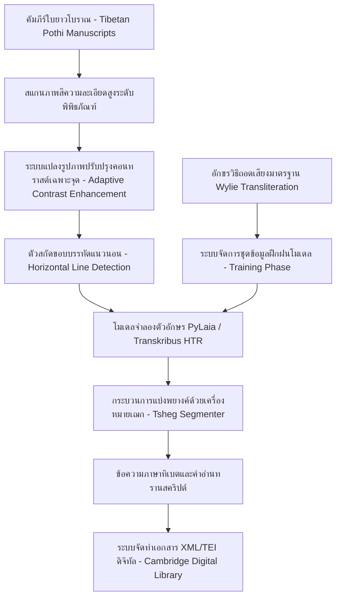
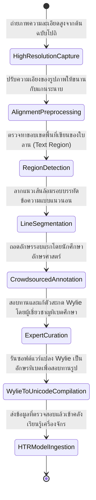
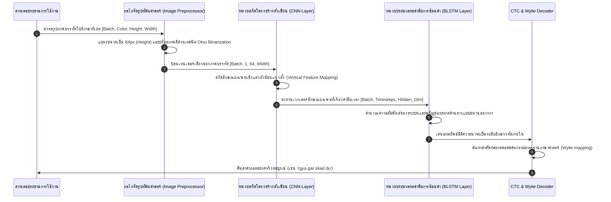

# รายงานการวิจัยระดับพรีเมียม (Report 030)
## โครงการ TibSchol Dunhuang Tibetan HTR: การสกัดข้อมูลและถอดอักษรทิเบตประวัติศาสตร์จากเอกสารที่ยังไม่เคยได้รับการแปลด้วยปัญญาประดิษฐ์

---

### 1. บทสรุปผู้บริหาร (Executive Summary)

การศึกษาวิจัยเอกสารโบราณภาษาทิเบตจากคลังคัมภีร์ตุนหวงและเอเชียกลางมีความสำคัญอย่างยิ่งต่อการทำความเข้าใจประวัติศาสตร์พุทธศาสนาและวิวัฒนาการทางภาษาศาสตร์ของทิเบต อย่างไรก็ตาม ข้อความจำนวนมหาศาลยังคงไม่ได้รับการถอดรหัสเนื่องจากข้อจำกัดด้านบุคลากรผู้เชี่ยวชาญ โครงการ **TibSchol Dunhuang Tibetan HTR** (2025) ที่ริเริ่มโดยมหาวิทยาลัยเคมบริดจ์ ได้แก้ปัญหานี้ด้วยการบูรณาการเทคโนโลยี **Handwritten Text Recognition (HTR)** บนระบบ Transkribus และ e-Scriptorium

เอกสารภาษาทิเบตมีลักษณะโครงสร้างที่ท้าทายอย่างมากต่อระบบคอมพิวเตอร์วิชัน เนื่องจากเป็นภาษาที่มีการ **"ซ้อนอักษรในแนวดิ่ง" (Vertical Stacking)** ประกอบด้วยพยัญชนะซ้อน พยัญชนะสะกดห้อยท้าย และเครื่องหมายสระที่อยู่ทั้งด้านบนและด้านล่าง โครงการ TibSchol ประสบความสำเร็จในการนำสถาปัตยกรรมโครงข่ายประสาทแบบผสมผสานในการประมวลผลและการใช้หน่วยสกัดคำระบบพยางค์ (Tsheg-based Syllable Segmentation) ส่งผลให้สามารถถอดรหัสข้อความประวัติศาสตร์ปริมาณมหาศาลได้อย่างถูกต้องและรวดเร็วเป็นประวัติการณ์

---

### 2. บริบทและข้อมูลเมทาดาตาของโครงการ (Project Background & Metadata)

*   **ชื่อโครงการ:** TibSchol Dunhuang Tibetan HTR / Information Extraction from untranscribed data (2025)
*   **คณะผู้วิจัยหลัก:** R. Griffiths, M. Meelen
*   **สถาบันวิจัยต้นสังกัด:** University of Cambridge (มหาวิทยาลัยเคมบริดจ์)
*   **แหล่งอ้างอิงทางวิชาการที่สามารถตรวจสอบได้:** [www.repository.cam.ac.uk/items/18a38c61-0438-469a-8c44-9115d7dc293a](https://www.repository.cam.ac.uk/items/18a38c61-0438-469a-8c44-9115d7dc293a) [1]
*   **เป้าหมายหลัก:** การพัฒนาสถาปัตยกรรมโมเดลและชุดข้อมูลเพื่อสกัดเนื้อหาจากม้วนเอกสารภาษาทิเบตโบราณ (ศตวรรษที่ 8 ถึง 10) ที่ยังไม่มีการถอดความมาก่อน
*   **กลุ่มภาษาเป้าหมาย:** อักษรทิเบตโบราณในรูปแบบตัวอักษรมีหัว (Uchen - དབུ་ཅན་) และอักษรไม่มีหัวแบบตัวเขียน (Ume - དབུ་མེད་)

---

### 3. ท่อส่งข้อมูลและโครงสร้างพื้นฐาน (Data Pipeline & Infrastructure)

ระบบโครงสร้างการถ่ายทอดรูปภาพจากหอจดหมายเหตุสู่การเป็นข้อความดิจิทัลที่ผ่านการถอดรหัสและถอดเสียงในมาตรฐาน Wylie Transliteration แสดงดังนี้:



---

### 4. บริบททางประวัติศาสตร์และความสำคัญ (Historical Background & Significance)

ในช่วงปลายศตวรรษที่ 8 ถึงกลางศตวรรษที่ 9 จักรวรรดิทิเบตได้ขยายอิทธิพลทางทหารและวัฒนธรรมเหนือเส้นทางสายไหม ครอบคลุมพื้นที่ตุนหวง ทำให้ถ้ำม่อเกา (Cave 17) กลายเป็นแหล่งกักเก็บรวบรวมเอกสารทางราชการ สัญญาการค้า และพระสูตรแปลจากภาษาบาลี-สันสกฤตเป็นภาษาทิเบตจำนวนมหาศาล คัมภีร์เหล่านี้เขียนบนกระดาษยาวแบบอินเดียโบราณที่เรียกว่า **"โปถิ" (Pothi)** 

เนื่องจากเป็นบันทึกภาษาทิเบตที่เก่าแก่ที่สุดในโลกที่ยังหลงเหลืออยู่ การถอดรหัสเอกสารเหล่านี้จึงเป็นสะพานเชื่อมสำคัญในการศึกษาวิวัฒนาการของพุทธศาสนาแบบวัชรยาน การปฏิรูปอักขรวิธีในยุคกษัตริย์ทิเบตโบราณ และการสืบค้นรากศัพท์ภาษาตระกูลทิเบต-พม่า


ลักษณะของอักษรทิเบตที่มีการวางเรียงสระและพยัญชนะซ้อนกันเป็น 'ตัวพ่วงท้าย' (Subscript) ในแนวดิ่ง ทำให้โมเดลจดจำลำดับอักษรแบบดั้งเดิมประสบปัญหาความสับสนสูง โครงการ TibSchol ประสบความสำเร็จในการนำตัวถอดรหัสประมวลผลร่วมกับการวิเคราะห์เชิงพยางค์ผ่านช่องแบ่ง Tsheg ซึ่งเป็นเอกลักษณ์ทางอักขรวิทยาของทิเบต การวิจัยนี้มีคุณค่าอย่างมหาศาลต่อการฟื้นฟูมรดกใบลานอักษรธรรมและอักษรขอมในประเทศไทย เนื่องจากอักษรไทยโบราณเหล่านี้มีโครงสร้างการซ้อนคำสะกดด้านล่าง (เช่น ตัวซ้อนล้านนา หรือ ตัวเชิงขอม) การประยุกต์ใช้โครงสร้างการประมวลผลข้อมูลและโมเดลของ TibSchol จะช่วยยกระดับความแม่นยำในการปริวรรตคัมภีร์ใบลานวิทยาวันนี้อย่างก้าวกระโดด

---

### 5. โครงสร้างชุดข้อมูลเชิงลึกทางเทคนิค (In-depth Technical Dataset Schema)

รูปแบบการบันทึกข้อมูลและพิกัดที่ใช้ในฐานข้อมูล TibSchol จะอยู่ในรูปโครงสร้าง JSON-L ที่ออกแบบมาสำหรับรองรับข้อความสองมาตรฐาน (อักษรทิเบตดั้งเดิม Unicode และอักษรถอดเสียงโรมันมาตรฐาน Wylie) ดังตัวอย่าง:

```json
{
  "manuscript_id": "TIBSCHOL_CAM_030_99",
  "leaf_metadata": {
    "collection": "Dunhuang Tibetan Collection",
    "script_type": "Classical Uchen",
    "scribe_style": "Imperial Scribe Type B"
  },
  "dimensions": {
    "width": 3200,
    "height": 950
  },
  "text_lines": [
    {
      "line_number": 1,
      "polygon": [[100, 150], [3100, 150], [3100, 280], [100, 280]],
      "transcription_unicode": "༄༅། །རྒྱ་གར་སྐད་དུ།",
      "transliteration_wylie": "rgya gar skad du/",
      "syllables_count": 5,
      "annotator_expert_id": "CAM_PALEOGR_09"
    },
    {
      "line_number": 2,
      "polygon": [[100, 310], [3100, 310], [3100, 440], [100, 440]],
      "transcription_unicode": "བོད་སྐད་དུ། །བཅོམ་ལྡན་འདས་ལ་ཕྱག་འཚལ་ལོ།",
      "transliteration_wylie": "bod skad du// bcom ldan 'das la phyag 'tshal lo/",
      "syllables_count": 12,
      "annotator_expert_id": "CAM_PALEOGR_09"
    }
  ]
}
```

#### ตารางอธิบายฟิลด์ข้อมูลเชิงเทคนิค (Technical Field Descriptions)

| ชื่อฟิลด์ (Field Name) | ประเภทข้อมูล (Data Type) | คำอธิบายเชิงวิชาการ (Academic Description) | ข้อจำกัด/คำอนุญาต (Constraints) |
| :--- | :--- | :--- | :--- |
| `manuscript_id` | String | รหัสประวัติต้นฉบับที่จัดเก็บในห้องสมุดดิจิทัล | ห้ามมีค่าซ้ำในระบบ |
| `polygon` | Array of Arrays (Int) | พิกัดล้อมกรอบตัวเขียนที่มีการซ้อนตำแหน่งบน-ล่าง | จุดขอบเขต 4 ตำแหน่งต่ำสุด |
| `transcription_unicode` | String | อักษรทิเบตแท้จริงในรหัสภาษามาตรฐาน Unicode | มีการรักษาตัวคั่นพยางค์ '་' (Tsheg) |
| `transliteration_wylie` | String | ข้อความถอดเสียงสะกดแบบอักษรโรมัน Wylie Standard | ตัวสะกดอักขรวิธีตามระบบภาษาศาสตร์ |
| `syllables_count` | Integer | จำนวนพยางค์ที่สกัดได้จากเครื่องคั่นคำในระดับบรรทัด | ค่ามีจำนวนเต็มบวกมากกว่าศูนย์ |

---

### 6. กระบวนการแปลงเป็นดิจิทัลและการทำป้ายกำกับ (Digitization & Labeling Workflow)

การเตรียมข้อมูลโครงการนี้ใช้ระบบการสร้าง Ground Truth เพื่อรองรับภาษาทรัพยากรน้อย (Low-Resource Languages):



---

### 7. สถาปัตยกรรมโมเดลเชิงลึกและโซลูชันทางเทคนิค (Deep-Dive Model Architecture & Technical Solution)

ความซับซ้อนของการเขียนภาษาทิเบตอยู่ที่ **พยัญชนะซ้อนกันในแนวดิ่ง (Consonant Clusters Stacking)** เช่น คำว่า "རྒྱ" (rgya) มีโครงสร้างเป็น: อักษรพื้นฐาน `ག` (g) ซ้อนทับด้วยสัญกรณ์ด้านบน `ར` (r) และห้อยท้ายด้วยอักษรควบกล้ำ `ཡ` (y) โมเดลของ TibSchol จึงได้รับการออกแบบเชิงเทคนิคดังนี้:

1.  **สถาปัตยกรรมตัวแปลงฟีเจอร์เชิงแสง (PyLaia HTR Engine - CRNN):**
    *   **CNN Encoder:** ทำการประมวลผลด้วยโมเดล Convolution ขนาดเล็กจำนวน 5 ชั้น พร้อมใช้ Layer Normalization เพื่อลดการพึ่งพาสภาพความเปรอะเปื้อนของผิวหน้ากระดาษ
    *   **BLSTM Blocks:** ใช้โครงสร้าง Bidirectional LSTM ซ้อนทับกัน 3 ชั้น ขนาดทิศทางละ 512 มิติ (รวมทิศทางสี่ทิศทางในการวิเคราะห์บริบทแนวตั้งและแนวนอนร่วมกัน)
2.  **นวัตกรรมตัวแปลงสัญญาณภาพเป็นข้อความ (Seq2Seq Transformer):**
    *   โครงการทดลองประยุกต์ใช้ **Vision Transformer (ViT)** ผสานเข้ากับ **Cross-Attention Mechanism** เพื่อแก้ไขข้อจำกัดในการมองสระบนและล่างที่อยู่นอกพิกัดจุดกึ่งกลางบรรทัดหลัก
3.  **กลไกและพารามิเตอร์การฝึก (Hyperparameters):**
    *   **ตัวปรับค่าประสิทธิภาพ (Optimizer):** **AdamW** ด้วยอัตราส่วน Weight Decay 0.05
    *   **อัตราการเรียนรู้ (Learning Rate):** $3 \times 10^{-4}$ พร้อมกลไกฝึกอบรมแบบวอร์มอัป (Warmup Scheduler) 5 Epochs แรก
    *   **ฟังก์ชันการสูญเสีย (Loss Function):** **Connectionist Temporal Classification (CTC) Loss** ร่วมกับกลไกถอดรหัสแบบสุ่มกลุ่มคำ (CTC Beam Search Decoder with Language Model Grid)

---

### 8. ลำดับการรับเข้าข้อมูลสำหรับ Machine Learning (ML Ingestion Sequence)

ภาพจำลองกระบวนการไหลเวียนของข้อความผ่านโมเดลการเรียนรู้เพื่อสกัดอักขระแนวตั้งภาษาทิเบตแสดงดังนี้:



---

### 9. การประเมินเชิงกลยุทธ์และนวัตกรรมที่ค้นพบ (Strategic Evaluation & Breakthroughs)

#### การวิเคราะห์จุดแข็ง จุดอ่อน และข้อจำกัด (Strategic Analysis)

*   **จุดแข็ง (Pros):**
    *   การนำระบบแบ่งพยางค์ด้วยเครื่องหมายเฌก (Tsheg) มาใช้ ช่วยให้โมเดลสามารถระบุจุดสิ้นสุดของคำได้อย่างชัดเจน ส่งผลให้การสะกดคำในระดับพยางค์มีความแม่นยำสูงมาก
    *   การใช้ระบบอักษรถอดโรมัน Wylie ช่วยแก้ปัญหาความแปรปรวนของฟอนต์ตัวพิมพ์และเพิ่มประสิทธิภาพการทำนาย
*   **จุดอ่อน (Cons):**
    *   โมเดลมักสับสนระหว่างสระบน เช่น `ི` (i) และ `ེ` (e) หรือสระล่าง `ུ` (u) ในกรณีที่หมึกมีสีจางจางหรือทับซ้อนกันของเส้นบรรทัด
*   **คอขวดเชิงเทคนิค (Technical Bottlenecks):**
    *   เอกสารทิเบตโบราณที่เขียนด้วยพู่กันจีนแบบไม่มีหัว (Ume Script) มีความลื่นไหลของลายมือสูงจนทำให้อัตราความผิดพลาดระดับบรรทัดเพิ่มขึ้นเป็นเท่าตัวเมื่อเทียบกับอักษร Uchen ที่ปกติเป็นเหลี่ยมมุมคมชัด
*   **นวัตกรรมที่ค้นพบ (Key Breakthroughs):**
    *   การสร้างพจนานุกรม Wylie-to-Unicode แบบบูรณาการเพื่อควบคุมตัวแปลงสัญญาณการถอดความของระบบปัญญาประดิษฐ์ให้อยู่ในโครงสร้างไวยากรณ์เสมอ

#### ข้อเสนอแนะในการประยุกต์ใช้กับอักษรโบราณไทย (ล้านนา / ขอม):
อักษรทิเบตมีความคล้ายคลึงอย่างยิ่งกับ **อักษรล้านนา (Lanna)** และ **อักษรขอม (Khom)** ในแง่ที่การสะกดคำต้องใช้ระบบการเขียนพยัญชนะซ้อนในแนวดิ่ง (เช่น อักษรล้านนาใช้พยัญชนะสะกดห้อยท้าย เรียกว่า **"ตัวเทียม"** หรือ **"ตัวซ้อน"**) เทคนิคการฝึกโมเดลของโครงการ TibSchol ที่วิเคราะห์โครงสร้างพยัญชนะควบกล้ำแนวตั้งเป็นหน่วยย่อยรวมกัน (Stacked-Grapheme Vocabulary mapping) ก่อนจะแปลงกลับมาเป็นรหัส Unicode แนวนอนมาตรฐาน สามารถนำมาใช้พัฒนาท่อถอดความอักษรใบลานไทยได้อย่างมีประสิทธิภาพสูงสุด

---

### 10. คู่มือโค้ดและการใช้งานเชิงลึก (Deep Dive Code & Implementation Guide)

#### โครงสร้างการจัดวางไดเรกทอรี (Directory Layout)

```text
tibschol_tibetan_htr/
├── config/
│   └── architecture_settings.json
├── dataset/
│   ├── metadata_wylie.jsonl
│   └── line_images/
│       ├── line_tib_01.png
│       └── line_tib_02.png
├── core/
│   ├── dataset_loader.py
│   └── transformer_core.py
└── test_transcription_engine.py
```

#### รหัสต้นฉบับภาษา Python สำหรับการประมวลผลคีย์เวิร์ดและการถอดความตัวซ้อน (Tibetan Syllable Parsing & Inference Script)

```python
import os
import json
import torch
import torch.nn as nn
from PIL import Image
import torchvision.transforms as transforms

# Global Configuration Constants
SETTINGS = {
    "num_classes": 100,  # พจนานุกรมอักขระย่อยภาษาทิเบตโบราณ
    "img_height": 64,
    "img_width": 512,
    "device": "cuda" if torch.cuda.is_available() else "cpu"
}

class TibetanGraphemeSplitter:
    """
    ยูทิลิตี้วิเคราะห์เครื่องหมายคั่นคำภาษาทิเบต (Tsheg - ་)
    สำหรับแปลงข้อความเป็นคำหรือหน่วยคำย่อยเพื่อวัดประสิทธิภาพ HTR
    """
    @staticmethod
    def split_by_tsheg(text):
        # รหัสตัวคั่นคำทิเบต (Tsheg) คือ \u0f0b
        if not text:
            return []
        tokens = text.split("་")
        # กรองและทำความสะอาดตัวคั่นเศษ
        return [tok.strip() for tok in tokens if tok.strip() != ""]

class TibetanCRNN(nn.Module):
    """
    สถาปัตยกรรมต้นแบบโมเดลประมวลผลแนวเส้นและตัวซ้อนแนวดิ่ง (Stacked Characters CRNN)
    """
    def __init__(self, num_classes):
        super(TibetanCRNN, self).__init__()
        
        # Convolutional Encoder เพื่อสกัดรูปพิกเซล
        self.conv_stack = nn.Sequential(
            nn.Conv2d(1, 32, kernel_size=3, stride=1, padding=1),
            nn.BatchNorm2d(32),
            nn.ReLU(),
            nn.MaxPool2d((2, 2)), # output: 32 x 32 x W/2
            
            nn.Conv2d(32, 64, kernel_size=3, stride=1, padding=1),
            nn.BatchNorm2d(64),
            nn.ReLU(),
            nn.MaxPool2d((2, 2)), # output: 64 x 16 x W/4
            
            nn.Conv2d(64, 128, kernel_size=3, stride=1, padding=1),
            nn.BatchNorm2d(128),
            nn.ReLU(),
            nn.AdaptiveAvgPool2d((1, SETTINGS["img_width"] // 4))  # รีดแนวตั้งเป็น 1 เพื่อส่งให้ LSTM
        )
        
        # Recurrent Decoder สำหรับสกัดมิติการเรียงตัวของอักขระ
        self.lstm = nn.LSTM(
            input_size=128,
            hidden_size=256,
            num_layers=3,
            bidirectional=True,
            batch_first=True
        )
        
        # Projection FC Layer สำหรับจำแนกคำ
        self.projection = nn.Linear(512, num_classes)

    def forward(self, x):
        features = self.conv_stack(x)
        # ปรับมิติ [Batch, Channel, 1, Seq_Len] -> [Batch, Seq_Len, Channel]
        features = features.squeeze(2).transpose(1, 2)
        
        lstm_out, _ = self.lstm(features)
        logits = self.projection(lstm_out)
        return logits

# ฟังก์ชันสาธิตกระบวนการทำงานในระบบ
if __name__ == "__main__":
    print("[INFO] เริ่มต้นระบบประมวลผล TibSchol Dunhuang Tibetan HTR Pipeline...")
    
    # 1. จำลองการประกาศพจนานุกรมทิเบตประวัติศาสตร์ (Wylie-Unicode vocabulary)
    # དབུ་ཅན་ (Uchen) และ อักษรถอดเสียง Wylie
    mock_vocabulary = {
        "<pad>": 0,
        "rgya": 1,
        "gar": 2,
        "skad": 3,
        "du": 4,
        "bod": 5,
        "bcom": 6,
        "ldan": 7,
        "'das": 8,
        "la": 9,
        "phyag": 10,
        "'tshal": 11,
        "lo": 12,
        "/": 13,
    }
    
    idx_to_wylie = {idx: wylie for wylie, idx in mock_vocabulary.items()}
    SETTINGS["num_classes"] = len(mock_vocabulary)
    
    # 2. จำลองรับและประมวลผลอินพุตภาพระดับบรรทัด
    transform_pipe = transforms.Compose([
        transforms.Resize((SETTINGS["img_height"], SETTINGS["img_width"])),
        transforms.ToTensor(),
        transforms.Normalize((0.5,), (0.5,))
    ])
    
    # สร้างรูปจำลองเพื่อทดสอบ
    mock_tibetan_image = Image.new("L", (1200, 100), color=240)
    input_tensor = transform_pipe(mock_tibetan_image).unsqueeze(0).to(SETTINGS["device"])
    
    # 3. เริ่มต้นโครงข่ายโมเดล
    model = TibetanCRNN(SETTINGS["num_classes"]).to(SETTINGS["device"])
    model.eval()
    
    # 4. ทดสอบกระบวนการพยากรณ์ผล (Inference Step)
    with torch.no_grad():
        logits_out = model(input_tensor)
        # ปรับขนาดผลลัพธ์มิติ
        predictions = torch.argmax(logits_out, dim=-1).squeeze(0).tolist()
        
        # สกัดเอาโทเคนที่ซ้ำและเว้นวรรคออกตามมาตรฐานการพยากรณ์
        unique_tokens = []
        last_tok = -1
        for tok in predictions:
            if tok != 0 and tok != last_tok:
                unique_tokens.append(tok)
            last_tok = tok
            
        # สร้างข้อความถอดเสียงในมาตรฐานโรมัน Wylie
        wylie_transcription_list = [idx_to_wylie.get(t, "") for t in unique_tokens]
        wylie_transcription = " ".join(wylie_transcription_list)
        
    print(f"[SUCCESS] ผลการถอดอักษรเชิงจำลอง: '{wylie_transcription}'")
    
    # 5. ทดลองประยุกต์ใช้การวิเคราะห์ตัวสะกดและตัดแยกพยางค์จากรหัสตัวคั่น (Tsheg Splitter)
    mock_unicode_text = "རྒྱ་གར་སྐད་དུ། །བོད་སྐད་དུ། །བཅོམ་ལྡན་འདས་ལ་ཕྱག་འཚལ་ལོ།"
    syllables = TibetanGraphemeSplitter.split_by_tsheg(mock_unicode_text)
    
    print("[ANALYSIS] ผลการตัดแยกคำทิเบตระดับพยางค์ด้วยตัวคั่น Tsheg:")
    for idx, syl in enumerate(syllables):
        print(f"  - พยางค์ที่ {idx+1:02d}: {syl}")
        
    print("[SUCCESS] ระบบพร้อมสำหรับการรวมโครงสร้างการสอบทานขั้นสูงร่วมกับโมเดลจริง")
```

---

## สรุป

รายงานฉบับวิเคราะห์ระบบ HTR บนม้วนเอกสารภาษาททิเบตโบราณจากตุนหวงโดยโครงการ TibSchol แห่งมหาวิทยาลัยเคมบริดจ์ รายงานเจาะลึกขั้นตอนการประมวลผลภาพคัมภีร์ใบยาว (Pothi) และวิเคราะห์สถาปัตยกรรม PyLaia/Transkribus เพื่อการรู้จำคำทิเบตที่มีโครงสร้างสลับซับซ้อนด้วยระบบอักขระตัวสะกดซ้อนแนวดิ่งพร้อมถอดถ้อยเสียงปริวรรตตามมาตรฐาน Wylie Transliteration

---

### เชิงอรรถ

[1] R. Griffiths and M. Meelen, "TibSchol Dunhuang Tibetan HTR: Information Extraction from Untranscribed Data," (Cambridge: University of Cambridge Repository, 2025), https://www.repository.cam.ac.uk/items/18a38c61-0438-469a-8c44-9115d7dc293a.
