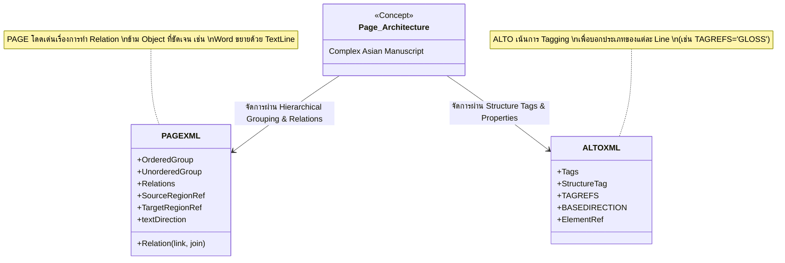

# 13. หลักการประยุกต์ใช้ XML กับเอกสารโบราณเอเชีย (Applying XML to Asian Historical Documents)

---

## 1. บทนำ: ความซับซ้อนของเอกสารโบราณเอเชีย (Introduction to the Complexity of Asian Historical Documents)

การแปลงเอกสารโบราณให้เป็นรูปแบบดิจิทัล (Digitization) และการรู้จำข้อความด้วยคอมพิวเตอร์ (Optical Character Recognition - OCR หรือ Handwritten Text Recognition - HTR) ในบริบทของเอกสารทางฝั่งยุโรป มักจะเผชิญกับโครงสร้างหน้ากระดาษที่เป็นมาตรฐาน กล่าวคือ มีการอ่านจากซ้ายไปขวา (Left-to-Right) และจากบนลงล่าง (Top-to-Bottom) เป็นหลัก แต่เมื่อก้าวเข้าสู่บริบทของเอกสารโบราณในภูมิภาคเอเชีย (Asian Historical Documents) นักวิจัยและผู้พัฒนาระบบกลับพบกับความท้าทายที่แตกต่างออกไปอย่างสิ้นเชิง [1]

ความซับซ้อนเหล่านี้ไม่ใช่เพียงแค่เรื่องของรูปแบบอักษรที่แปลกตา ทว่าเป็นเรื่องของ **"สถาปัตยกรรมของหน้ากระดาษ" (Page Architecture)** ที่สะท้อนถึงวัฒนธรรมการอ่านและการเขียนที่สืบทอดกันมานับพันปี งานวิจัยเชิงสำรวจของ **S. Nigam, et al. (2023)** ในหัวข้อ *"Document analysis and recognition: a survey"* ได้ชี้ให้เห็นว่ารูปแบบการกำกับข้อมูล (Annotation Format) ที่มีความยืดหยุ่นสูงอย่าง PAGE XML ได้กลายมาเป็นมาตรฐานหลักในงาน HTR เนื่องจากความสามารถในการรองรับ Layout ที่ไร้แบบแผนตายตัว (Unstructured Layout) ซึ่งมักพบในเอกสารโบราณ

### 1.1 ทิศทางการอ่านที่หลากหลาย (Multi-directionality)
หนึ่งในความท้าทายที่ใหญ่ที่สุดคือทิศทางการเขียนและการอ่าน บางเอกสารมีการผสมผสานทิศทางภายในหน้าเดียวกัน (Multi-directional) เช่น:
- การเขียนเนื้อหาหลักจากบนลงล่าง (Top-to-Bottom) หรือจากขวาไปซ้าย (Right-to-Left)
- การแทรกคำอธิบาย (Gloss) ในแนวนอน หรือทำมุมเฉียง
- การบิดหมุนของข้อความตามขอบพื้นที่ว่างของกระดาษ
ความหลากหลายนี้ทำให้โมเดล HTR แบบดั้งเดิมที่คาดหวังบรรทัดข้อความแบบแนวนอน (Horizontal Baselines) มักจะล้มเหลวในการจับภาพและทำความเข้าใจ

### 1.2 การเขียนแทรกและการอธิบายความ (Sublines & Interlinear Glosses)
เอกสารโบราณของเอเชียจำนวนมาก เช่น คัมภีร์ทางศาสนา หรือเอกสารทางประวัติศาสตร์ มักจะมีการเขียนแทรกบรรทัด (Interlinear Glosses) ซึ่งเป็นการเขียนตัวอักษรขนาดเล็กแทรกอยู่ระหว่างบรรทัดหลักเพื่ออธิบายความหมาย ขยายความ หรือแก้ไขคำผิด (Glossing)
- ปรากฏการณ์นี้สร้างความซับซ้อนให้กับการแบ่งบรรทัด (Line Segmentation) อย่างมาก ดังที่ **I. Rabaev และ M. Litvak (2026)** ได้กล่าวไว้ใน *"Recent advances in text line segmentation... in Tibetan historical document recognition"* ว่าการจัดการกับบรรทัดแทรกเหล่านี้ต้องการอัลกอริทึมที่สามารถแยกแยะระหว่างเนื้อหาหลัก (Main Text) และเนื้อหารอง (Subline/Gloss) ได้อย่างแม่นยำ โดยไม่ทำให้ Baseline ของบรรทัดหลักผิดเพี้ยนไป

### 1.3 ลำดับการอ่านที่ไร้โครงสร้างตายตัว (Non-linear Reading Order)
ลำดับการอ่าน (Reading Order) ในเอกสารเอเชียโบราณมักจะไม่ได้ดำเนินไปเป็นเส้นตรงเสมอไป (Non-linear) ผู้อ่านอาจจะต้องเริ่มต้นที่บรรทัดกลางหน้ากระดาษ จากนั้นกระโดดไปอ่านคำอธิบายที่ขอบกระดาษ (Marginalia) แล้วจึงกระโดดกลับมาอ่านเนื้อหาหลักต่อ 
- การอ้างอิงถึงเอกสารข้ามส่วน หรือการใช้เครื่องหมายโยง (Omissions / Reference Marks) เป็นเรื่องปกติ ทำให้การเรียงลำดับแบบเรขาคณิต (Geometric sorting) จากบนลงล่าง หรือซ้ายไปขวา ใช้ไม่ได้ผลอีกต่อไป

ความซับซ้อนเหล่านี้เรียกร้องให้มาตรฐาน XML เช่น ALTO และ PAGE ต้องถูกใช้งานในระดับโครงสร้างที่ลึกซึ้งขึ้น (Deep Structural Encoding) ไม่ใช่แค่การลากกรอบสี่เหลี่ยม (Bounding Box) และเก็บข้อความเท่านั้น แต่คือการสร้างความสัมพันธ์ (Relations) และลำดับที่ชัดเจน (Explicit Reading Order) 

---

## 2. การระบุทิศทางการอ่าน (Multi-directionality)

การจัดการกับทิศทางการอ่านในระดับที่ต่างกัน (หน้ากระดาษ, บล็อกข้อความ, บรรทัด) เป็นกุญแจสำคัญในการทำเอกสารเอเชียให้เป็นมาตรฐาน ทั้ง ALTO XML และ PAGE XML มีกลไกในการระบุทิศทางเหล่านี้ แต่มีวิธีการนำไปใช้ที่ต่างกันออกไป

### 2.1 การจัดการด้วย ALTO XML

ALTO XML ถูกออกแบบมาเพื่อเอกสารที่ค่อนข้างมีโครงสร้าง แต่ในเวอร์ชันหลังๆ (ตั้งแต่ v4.3 เป็นต้นมา) ได้เพิ่มความสามารถในการจัดการทิศทางที่ซับซ้อนมากขึ้น

**1. การใช้ `BASEDIRECTION`**
แอตทริบิวต์ `BASEDIRECTION` ใน ALTO ใช้สำหรับกำหนดทิศทางการอ่านภายในบรรทัดหรือบล็อกข้อความ โดยสามารถระบุได้ว่าบรรทัดนี้อ่านจากซ้ายไปขวา (left-to-right), ขวาไปซ้าย (right-to-left), บนลงล่าง (top-to-bottom), หรือล่างขึ้นบน (bottom-to-top) 

การระบุสิ่งนี้ในระดับ `<TextLine>` หรือ `<TextBlock>` ช่วยให้ระบบ HTR ทราบทิศทางที่ถูกต้องในการประมวลผลตัวอักษร

**2. การใช้ `ReadingOrder` ระดับ Block**
ALTO อาศัย `<ReadingOrder>` ควบคู่กับ `<ElementRef>` เพื่อระบุลำดับของการอ่านบล็อกข้อความต่างๆ ข้ามโครงสร้างหน้ากระดาษ

ตัวอย่างการระบุทิศทางใน ALTO XML:
```xml
<alto xmlns="http://www.loc.gov/standards/alto/ns-v4#">
  <Description>...</Description>
  <Layout>
    <Page ID="Page1" PHYSICAL_IMG_NR="1" WIDTH="2000" HEIGHT="3000">
      <PrintSpace ID="PrintSpace1">
        <!-- บล็อกเนื้อหาหลัก อ่านจากขวาไปซ้าย -->
        <TextBlock ID="TB_Main" BASEDIRECTION="right-to-left">
          <Shape><Polygon POINTS="1500,200 1900,200 1900,2800 1500,2800"/></Shape>
          <TextLine ID="TL_1" BASEDIRECTION="top-to-bottom">
            <String ID="S_1" CONTENT="ข้อความแนวตั้งคำที่1"/>
          </TextLine>
        </TextBlock>
        <!-- บล็อกคำอธิบายขอบกระดาษ อ่านจากซ้ายไปขวา -->
        <TextBlock ID="TB_Margin" BASEDIRECTION="left-to-right">
          <Shape><Polygon POINTS="100,200 400,200 400,1000 100,1000"/></Shape>
          <TextLine ID="TL_2" BASEDIRECTION="left-to-right">
            <String ID="S_2" CONTENT="คำอธิบายเพิ่มเติมที่ขอบ"/>
          </TextLine>
        </TextBlock>
      </PrintSpace>
    </Page>
  </Layout>
</alto>
```

### 2.2 การจัดการด้วย PAGE XML

PAGE XML ถูกออกแบบมาเพื่อความยืดหยุ่นที่สูงกว่าแต่แรก ทำให้เหมาะกับงานวิจัยเฉพาะทาง ดังที่ **F.X. Erhard (2025)** ได้แสดงให้เห็นใน *"Text and Layout Recognition for Tibetan Newspapers with Transkribus"* ว่า PAGE XML มีบทบาทสำคัญในการแยกแยะองค์ประกอบที่ซับซ้อนในหน้ากระดาษ [2]

**1. การใช้ `textDirection`**
ใน PAGE XML แอตทริบิวต์ `textDirection` สามารถประยุกต์ใช้ได้ทั้งระดับ `<Region>` (เช่น TextRegion) และระดับ `<TextLine>` ค่าที่รองรับมีความละเอียดสูง เช่น `top-to-bottom`, `bottom-to-top`, `left-to-right`, `right-to-left`, `bi-directional` 

**2. การใช้ `ReadingOrder` แบบละเอียด**
PAGE XML รองรับการทำ Reading Order ที่ซับซ้อนมากผ่านการใช้ `<OrderedGroup>` และ `<UnorderedGroup>` 

ตัวอย่างการระบุทิศทางใน PAGE XML:
```xml
<?xml version="1.0" encoding="UTF-8"?>
<PcGts xmlns="http://schema.primaresearch.org/PAGE/gts/pagecontent/2019-07-15">
    <Page imageFilename="asian_manuscript_001.jpg" imageWidth="2000" imageHeight="3000">
        
        <!-- การกำหนด Reading Order ที่บังคับทิศทาง -->
        <ReadingOrder>
            <OrderedGroup id="ro_1" caption="Main Reading Order">
                <!-- อ่านจากเนื้อหาหลักทางขวาก่อน -->
                <RegionRefIndexed index="0" regionRef="region_main"/>
                <!-- แล้วค่อยกระโดดไปอ่าน Marginalia ทางซ้าย -->
                <RegionRefIndexed index="1" regionRef="region_margin"/>
            </OrderedGroup>
        </ReadingOrder>
        
        <!-- เนื้อหาหลัก (ขวาไปซ้าย, บนลงล่าง) -->
        <TextRegion id="region_main" type="paragraph" readingDirection="top-to-bottom" textDirection="top-to-bottom">
            <Coords points="1500,200 1900,200 1900,2800 1500,2800"/>
            <TextLine id="line_001" custom="readingOrder {index:0;}">
                <Coords points="1800,200 1850,200 1850,2800 1800,2800"/>
                <Baseline points="1825,200 1825,2800"/>
                <TextEquiv>
                    <Unicode>ข้อความแรกสุดทางขวา</Unicode>
                </TextEquiv>
            </TextLine>
        </TextRegion>
        
        <!-- เนื้อหาขอบกระดาษ (ซ้ายไปขวา) -->
        <TextRegion id="region_margin" type="marginalia" readingDirection="left-to-right" textDirection="left-to-right">
            <Coords points="100,200 400,200 400,1000 100,1000"/>
            <TextLine id="line_002" custom="readingOrder {index:0;}">
                <Coords points="100,200 400,200 400,250 100,250"/>
                <Baseline points="100,225 400,225"/>
                <TextEquiv>
                    <Unicode>คำอธิบายประกอบ</Unicode>
                </TextEquiv>
            </TextLine>
        </TextRegion>
        
    </Page>
</PcGts>
```

---

## 3. การจัดการข้อความแทรก (Interlinear Glosses และ Sublines)

ปรากฏการณ์ "Glossing" หรือการเขียนอธิบายความแทรกระหว่างบรรทัด พบได้ทั่วไปในเอกสารทางศาสนา บทกวี และคัมภีร์ต่างๆ ในเอเชีย อักษรแทรกเหล่านี้มักจะมีขนาดเล็กกว่าอักษรปกติ และถูกเขียนในพื้นที่ว่างระหว่างบรรทัด (Interlinear space)

ความท้าทาย:
- หากโมเดล HTR ตีความว่านี่คือบรรทัดปกติ จะทำให้ลำดับการอ่านรวน
- หาก HTR ควบรวมบรรทัดแทรกเข้ากับบรรทัดหลัก จะทำให้ Baseline ของบรรทัดหลักเกิดความผิดเพี้ยน (Bounding Box หรือ Polygon จะบิดเบี้ยว)

การแยกแยะระหว่างบรรทัดหลัก (Main Line) และบรรทัดแทรก (Subline/Gloss) เป็นสิ่งจำเป็นยิ่ง

### 3.1 การใช้ Custom Attributes และ TAGREFS

**ใน ALTO XML:**
โครงสร้าง ALTO รองรับแท็ก `<Tags>` ซึ่งช่วยให้เราสามารถนิยามโครงสร้างพิเศษได้ (StructureTag) จากนั้นที่ระดับบรรทัด `<TextLine>` หรือ `<TextBlock>` เราจะใช้แอตทริบิวต์ `TAGREFS` เพื่ออ้างอิงกลับไปยังแท็กที่นิยามไว้

วิธีการนี้ช่วยให้โปรแกรมแยกแยะได้ว่าบรรทัดไหนเป็นเนื้อหาหลัก บรรทัดไหนเป็น Gloss

```xml
<alto xmlns="http://www.loc.gov/standards/alto/ns-v4#">
  <Tags>
    <StructureTag ID="TAG_MAIN" LABEL="MainText"/>
    <StructureTag ID="TAG_GLOSS" LABEL="InterlinearGloss"/>
  </Tags>
  <Layout>
    <Page ID="P1">
      <PrintSpace>
        <TextBlock ID="TB1">
          <!-- บรรทัดหลัก -->
          <TextLine ID="L1" TAGREFS="TAG_MAIN">
            <String ID="S1" CONTENT="โอม นโม พุทธายะ"/>
          </TextLine>
          <!-- บรรทัดแทรก (Gloss) -->
          <TextLine ID="L2" TAGREFS="TAG_GLOSS">
            <String ID="S2" CONTENT="(ขอนอบน้อมแด่พระพุทธเจ้า)"/>
          </TextLine>
          <!-- บรรทัดหลักบรรทัดถัดไป -->
          <TextLine ID="L3" TAGREFS="TAG_MAIN">
            <String ID="S3" CONTENT="ธัมมายะ สังฆายะ"/>
          </TextLine>
        </TextBlock>
      </PrintSpace>
    </Page>
  </Layout>
</alto>
```

**ใน PAGE XML:**
PAGE อาศัยระบบ Custom Attributes ผ่านแอตทริบิวต์ `custom` และการกำหนด `type` ให้กับ `TextRegion` หรือ `TextLine` อย่างไรก็ตาม หากบรรทัดแทรกอยู่ใน TextRegion เดียวกันกับบรรทัดหลัก นิยมใช้ `custom="structure {type:gloss;}"` เพื่อแบ่งแยก

```xml
<TextRegion id="region_001" type="paragraph">
    <Coords points="..."/>
    
    <!-- บรรทัดหลัก -->
    <TextLine id="main_line_1" custom="readingOrder {index:0;} structure {type:main;}">
        <Coords points="..."/>
        <Baseline points="..."/>
        <TextEquiv><Unicode>โอม นโม พุทธายะ</Unicode></TextEquiv>
    </TextLine>
    
    <!-- บรรทัดแทรก (Interlinear Gloss) -->
    <TextLine id="gloss_line_1" custom="readingOrder {index:1;} structure {type:gloss;}">
        <Coords points="..."/>
        <Baseline points="..."/>
        <TextEquiv><Unicode>(ขอนอบน้อมแด่พระพุทธเจ้า)</Unicode></TextEquiv>
    </TextLine>
    
</TextRegion>
```

---

## 4. ลำดับการอ่านแบบก้าวกระโดด (Non-linear Reading Order)

บ่อยครั้งที่เนื้อหาไม่ได้ถูกอ่านเรียงตามลำดับบรรทัดบนลงล่าง การมีข้อความตกหล่น (Omissions) ที่ถูกเขียนชดเชยที่ขอบกระดาษ (Marginalia) แล้วมีเครื่องหมายโยง (Reference Mark) บังคับให้ผู้อ่านต้องกระโดดไปอ่านและกระโดดกลับมา 

โครงสร้าง `<OrderedGroup>`, `<UnorderedGroup>`, และ `<Relations>` จึงเป็นสิ่งจำเป็น [3]

### 4.1 การใช้ OrderedGroup และ UnorderedGroup (PAGE XML)

- `<OrderedGroup>`: ใช้กำหนดลำดับที่แน่นอน (Strict sequential order)
- `<UnorderedGroup>`: ใช้กำหนดกลุ่มขององค์ประกอบที่ต้องอ่านร่วมกัน แต่ลำดับก่อนหลังไม่ได้ตายตัว (เช่น กลุ่มของภาพวาดและคำบรรยายภาพที่อยู่รอบๆ)

การซ้อนทับกัน (Nesting) ของ Group เหล่านี้ ทำให้เราจำลองพฤติกรรมการอ่านได้สมจริง

```xml
<ReadingOrder>
    <OrderedGroup id="ro_main" caption="Master Reading Sequence">
        <RegionRefIndexed index="0" regionRef="para_1"/>
        
        <!-- เจอจุดที่มีคำอธิบายแทรก ต้องอ่านควบคู่กัน -->
        <UnorderedGroup id="ro_sub_1" index="1" caption="Text and Marginalia">
            <RegionRef regionRef="para_2_main_part"/>
            <RegionRef regionRef="marginalia_for_para_2"/>
        </UnorderedGroup>
        
        <RegionRefIndexed index="2" regionRef="para_3"/>
    </OrderedGroup>
</ReadingOrder>
```

### 4.2 การเชื่อมโยงด้วย `<Relations>`

บางครั้ง Reading Order ไม่เพียงพอที่จะอธิบายความสัมพันธ์ เช่น เราต้องการระบุให้ชัดเจนว่า Gloss บรรทัดนี้ ขยายความ **คำไหน** ในบรรทัดหลัก (Word-level relations) PAGE XML มีแท็ก `<Relations>` สำหรับสร้างกราฟความสัมพันธ์ (Relation Graph)

- **link**: เป็นเส้นเชื่อมระหว่าง Object สองตัว
- **type**: ระบุประเภทความสัมพันธ์ เช่น `link` (เชื่อมโยงกัน), `join` (เป็นส่วนหนึ่งของกันและกัน)

```xml
<Relations>
    <Relation type="link" custom="relation_type {type:gloss;}">
        <!-- ต้นทาง: คำที่เป็นเนื้อหาหลัก -->
        <SourceRegionRef regionRef="word_p1_l1_w4"/>
        <!-- ปลายทาง: บรรทัดแทรกที่อธิบายคำนั้น -->
        <TargetRegionRef regionRef="gloss_line_1"/>
    </Relation>
    
    <Relation type="link" custom="relation_type {type:omission;}">
        <!-- ต้นทาง: จุดที่ทำเครื่องหมายตกหล่น -->
        <SourceRegionRef regionRef="line_p1_l5"/>
        <!-- ปลายทาง: ข้อความที่ขอบกระดาษที่ต้องเอามาแทรก -->
        <TargetRegionRef regionRef="marginalia_omission_1"/>
    </Relation>
</Relations>
```

---

## 5. แผนภาพ Mermaid (Diagram) จำลองโครงสร้าง Hierarchical

เพื่อให้เห็นภาพรวมของโครงสร้างเอกสารที่มีการอ่านแบบก้าวกระโดด มีบรรทัดหลัก บรรทัดแทรก (Subline/Gloss) และข้อความริมขอบ (Marginalia) แผนภาพด้านล่างนี้จำลองความสัมพันธ์เหล่านั้น

### 5.1 แผนภาพ: ลำดับการอ่านแบบ Non-linear (Reading Order Graph)

```mermaid
graph TD
    classDef main fill:#e1f5fe,stroke:#01579b,stroke-width:2px;
    classDef gloss fill:#fff9c4,stroke:#f57f17,stroke-width:1px,stroke-dasharray: 5 5;
    classDef margin fill:#e8f5e9,stroke:#1b5e20,stroke-width:2px;
    classDef group fill:none,stroke:#333,stroke-width:2px,stroke-dasharray: 10 5;

    subgraph OrderedGroup_Main [OrderedGroup: ลำดับหลักของการอ่านเอกสาร]
        direction TB
        
        P1(TextRegion 1: Paragraph) ::: main
        
        subgraph UnorderedGroup_Glossing [UnorderedGroup: จุดที่มีเนื้อหาซับซ้อน]
            direction LR
            P2_Main(TextRegion 2: Main Text) ::: main
            P2_Gloss1(TextRegion 3: Interlinear Gloss) ::: gloss
            P2_Gloss2(TextRegion 4: Subline Notes) ::: gloss
        end
        
        P3(TextRegion 5: Paragraph with Omission) ::: main
        M1(TextRegion 6: Marginalia Omission Text) ::: margin
    end

    %% ลำดับปกติ
    P1 -->|index 0| UnorderedGroup_Glossing
    UnorderedGroup_Glossing -->|index 1| P3
    
    %% ความสัมพันธ์ภายใน Unordered Group (อ่านพร้อมกัน/สลับกันได้)
    P2_Main -.->|ขยายความ (Relations)| P2_Gloss1
    P2_Main -.->|อธิบายศัพท์ (Relations)| P2_Gloss2

    %% การกระโดดไปอ่าน Marginalia (Non-linear)
    P3 -->|index 2| M1
    M1 -->|อ่านจบกลับมา (Logical Return)| End((End of Page))
```

### 5.2 แผนภาพ: ความสัมพันธ์ระดับ XML Elements (ALTO vs PAGE)



---

## 6. ตัวอย่างโค้ด XML ระดับ Masterclass

ส่วนนี้จะนำเสนอโค้ด XML แบบสมบูรณ์เพื่อสาธิตการเข้ารหัสหน้ากระดาษจำลองที่มีเนื้อหาหลัก (Main Text) ผสมกับการเขียนแทรกบรรทัด (Interlinear Gloss) และข้อความริมขอบ (Marginalia) 

### 6.1 ตัวอย่างระดับ Masterclass ด้วย PAGE XML

PAGE XML นำเสนอโซลูชันที่ครอบคลุมมากที่สุด โค้ดนี้แสดงการใช้ `OrderedGroup`, `custom attributes` สำหรับแยกประเภทบรรทัด และ `<Relations>` เพื่อโยง Gloss เข้ากับบรรทัดหลัก

```xml
<?xml version="1.0" encoding="UTF-8"?>
<PcGts xmlns="http://schema.primaresearch.org/PAGE/gts/pagecontent/2019-07-15"
       xmlns:xsi="http://www.w3.org/2001/XMLSchema-instance"
       xsi:schemaLocation="http://schema.primaresearch.org/PAGE/gts/pagecontent/2019-07-15
                           http://schema.primaresearch.org/PAGE/gts/pagecontent/2019-07-15/pagecontent.xsd">
    <Metadata>
        <Creator>Advanced HTR Processing Agent</Creator>
        <Created>2026-06-03T12:00:00</Created>
        <LastChange>2026-06-03T12:00:00</LastChange>
        <Comments>
            ตัวอย่างระดับ Masterclass สำหรับเอกสารโบราณเอเชีย
            สาธิต: Multi-direction, Glossing (Yig-chung/Subline), และ Non-linear Marginalia
        </Comments>
    </Metadata>
    
    <Page imageFilename="asian_manuscript_complex_01.tif" imageWidth="3000" imageHeight="4000">
        
        <!-- ลำดับการอ่านแบบบังคับทิศทางก้าวกระโดด -->
        <ReadingOrder>
            <OrderedGroup id="ro_master" caption="Master Reading Order">
                <!-- เริ่มอ่านเนื้อหาหลัก -->
                <RegionRefIndexed index="0" regionRef="region_main_body"/>
                <!-- กระโดดไปอ่านเนื้อหาตกหล่นที่ขอบกระดาษขวา -->
                <RegionRefIndexed index="1" regionRef="region_right_margin"/>
                <!-- จบด้วยข้อสรุปท้ายหน้า -->
                <RegionRefIndexed index="2" regionRef="region_footer"/>
            </OrderedGroup>
        </ReadingOrder>
        
        <!-- การประกาศ Relations เพื่อผูก Gloss เข้ากับบรรทัดหลัก -->
        <Relations>
            <Relation type="link" custom="relation_type {type:interlinear_gloss;}">
                <SourceRegionRef regionRef="line_main_01"/>
                <TargetRegionRef regionRef="line_gloss_01"/>
            </Relation>
            <Relation type="link" custom="relation_type {type:omission_reference;}">
                <SourceRegionRef regionRef="line_main_02"/>
                <TargetRegionRef regionRef="line_marginalia_01"/>
            </Relation>
        </Relations>
        
        <!-- พื้นที่เนื้อหาหลัก อ่านแนวนอนซ้ายไปขวา -->
        <TextRegion id="region_main_body" type="paragraph" readingDirection="left-to-right" textDirection="left-to-right">
            <Coords points="300,300 2500,300 2500,3000 300,3000"/>
            
            <!-- บรรทัดหลัก 1 -->
            <TextLine id="line_main_01" custom="readingOrder {index:0;} structure {type:main;}">
                <Coords points="320,350 2480,350 2480,450 320,450"/>
                <Baseline points="320,420 2480,420"/>
                <TextEquiv>
                    <Unicode>ณ กาลครั้งหนึ่ง มีพระราชาปกครองแคว้นอันไพศาล</Unicode>
                </TextEquiv>
            </TextLine>
            
            <!-- บรรทัดแทรก 1 (Gloss) เขียนแทรกใต้บรรทัดหลักที่ 1 (Subline) -->
            <TextLine id="line_gloss_01" custom="readingOrder {index:1;} structure {type:gloss;}">
                <Coords points="400,455 1200,455 1200,485 400,485"/>
                <Baseline points="400,480 1200,480"/>
                <TextEquiv>
                    <Unicode>(แคว้นนั้นมีชื่อว่ามคธรัฐ)</Unicode>
                </TextEquiv>
            </TextLine>
            
            <!-- บรรทัดหลัก 2 (มีสัญลักษณ์ตกหล่น) -->
            <TextLine id="line_main_02" custom="readingOrder {index:2;} structure {type:main;}">
                <Coords points="320,550 2480,550 2480,650 320,650"/>
                <Baseline points="320,620 2480,620"/>
                <TextEquiv>
                    <Unicode>พระองค์ทรงเปี่ยมไปด้วยพระเมตตา [+] และทรงบำรุงราษฎร</Unicode>
                </TextEquiv>
            </TextLine>
        </TextRegion>
        
        <!-- พื้นที่ขอบกระดาษ (Marginalia) อ่านแนวดิ่งจากบนลงล่าง -->
        <TextRegion id="region_right_margin" type="marginalia" readingDirection="top-to-bottom" textDirection="top-to-bottom">
            <Coords points="2600,300 2900,300 2900,3000 2600,3000"/>
            
            <TextLine id="line_marginalia_01" custom="readingOrder {index:0;} structure {type:omission;}">
                <Coords points="2700,350 2800,350 2800,1500 2700,1500"/>
                <Baseline points="2750,350 2750,1500"/>
                <!-- ข้อความแนวดิ่ง -->
                <TextEquiv>
                    <Unicode>[+] ดั่งบิดามารดารักบุตร</Unicode>
                </TextEquiv>
            </TextLine>
        </TextRegion>
        
        <!-- พื้นที่สรุปท้ายหน้า -->
        <TextRegion id="region_footer" type="footer" readingDirection="left-to-right" textDirection="left-to-right">
            <Coords points="300,3200 2500,3200 2500,3500 300,3500"/>
            <TextLine id="line_footer_01">
                <Coords points="1200,3300 1800,3300 1800,3400 1200,3400"/>
                <Baseline points="1200,3380 1800,3380"/>
                <TextEquiv>
                    <Unicode>จบหน้าเอกสารที่ ๑</Unicode>
                </TextEquiv>
            </TextLine>
        </TextRegion>
        
    </Page>
</PcGts>
```

### 6.2 ตัวอย่างระดับ Masterclass ด้วย ALTO XML (v4.3+)

สำหรับ ALTO การจัดการสิ่งเหล่านี้จะพึ่งพาการนิยาม `<StructureTag>` ล่วงหน้า จากนั้นบรรทัดต่างๆ จะดึงแท็กเหล่านั้นมาใช้ผ่าน `TAGREFS` สำหรับทิศทาง จะระบุผ่าน `BASEDIRECTION` [4]

```xml
<?xml version="1.0" encoding="UTF-8"?>
<alto xmlns="http://www.loc.gov/standards/alto/ns-v4#"
      xmlns:xlink="http://www.w3.org/1999/xlink"
      xmlns:xsi="http://www.w3.org/2001/XMLSchema-instance"
      xsi:schemaLocation="http://www.loc.gov/standards/alto/ns-v4# http://www.loc.gov/standards/alto/v4/alto-4-3.xsd">
  <Description>
    <MeasurementUnit>pixel</MeasurementUnit>
    <sourceImageInformation>
      <fileName>asian_manuscript_complex_01.tif</fileName>
    </sourceImageInformation>
  </Description>
  
  <Tags>
    <!-- ประกาศ Structure Tags สำหรับแยกประเภทเนื้อหา -->
    <StructureTag ID="TAG_MAIN" LABEL="MainText"/>
    <StructureTag ID="TAG_GLOSS" LABEL="InterlinearGloss"/>
    <StructureTag ID="TAG_MARGINALIA" LABEL="Marginalia"/>
    <StructureTag ID="TAG_FOOTER" LABEL="Footer"/>
  </Tags>
  
  <Layout>
    <Page ID="PAGE_01" PHYSICAL_IMG_NR="1" WIDTH="3000" HEIGHT="4000">
      <PrintSpace ID="PS_01">
        
        <!-- เนื้อหาหลัก -->
        <TextBlock ID="TB_MAIN" TAGREFS="TAG_MAIN" BASEDIRECTION="left-to-right">
          <Shape>
            <Polygon POINTS="300,300 2500,300 2500,3000 300,3000"/>
          </Shape>
          
          <!-- บรรทัดหลัก 1 -->
          <TextLine ID="TL_MAIN_01" TAGREFS="TAG_MAIN" BASEDIRECTION="left-to-right">
            <String ID="STR_01" CONTENT="ณ กาลครั้งหนึ่ง มีพระราชาปกครองแคว้นอันไพศาล"/>
          </TextLine>
          
          <!-- บรรทัดแทรก (Gloss) ALTO ใช้ TAGREFS ชี้ไปที่ TAG_GLOSS -->
          <TextLine ID="TL_GLOSS_01" TAGREFS="TAG_GLOSS" BASEDIRECTION="left-to-right">
            <String ID="STR_02" CONTENT="(แคว้นนั้นมีชื่อว่ามคธรัฐ)"/>
          </TextLine>
          
          <!-- บรรทัดหลัก 2 -->
          <TextLine ID="TL_MAIN_02" TAGREFS="TAG_MAIN" BASEDIRECTION="left-to-right">
            <String ID="STR_03" CONTENT="พระองค์ทรงเปี่ยมไปด้วยพระเมตตา [+] และทรงบำรุงราษฎร"/>
          </TextLine>
        </TextBlock>
        
        <!-- ข้อความขอบกระดาษ (Marginalia) ทิศทางแนวดิ่ง -->
        <TextBlock ID="TB_MARGINALIA" TAGREFS="TAG_MARGINALIA" BASEDIRECTION="top-to-bottom">
          <Shape>
            <Polygon POINTS="2600,300 2900,300 2900,3000 2600,3000"/>
          </Shape>
          <!-- TextLine นี้อ่านแนวดิ่งจากบนลงล่าง -->
          <TextLine ID="TL_MARGIN_01" TAGREFS="TAG_MARGINALIA" BASEDIRECTION="top-to-bottom">
            <String ID="STR_04" CONTENT="[+] ดั่งบิดามารดารักบุตร"/>
          </TextLine>
        </TextBlock>
        
        <!-- สรุปท้ายหน้า -->
        <TextBlock ID="TB_FOOTER" TAGREFS="TAG_FOOTER" BASEDIRECTION="left-to-right">
          <Shape>
            <Polygon POINTS="300,3200 2500,3200 2500,3500 300,3500"/>
          </Shape>
          <TextLine ID="TL_FOOTER_01" TAGREFS="TAG_FOOTER" BASEDIRECTION="left-to-right">
            <String ID="STR_05" CONTENT="จบหน้าเอกสารที่ ๑"/>
          </TextLine>
        </TextBlock>
        
      </PrintSpace>
    </Page>
  </Layout>
</alto>
```

---

## 7. บทสรุป: ทำไมเราจึงต้องใส่ใจรายละเอียดเหล่านี้?

การระบุโครงสร้างอย่างลึกซึ้ง (Deep Structural Annotation) ตามที่ได้แสดงให้เห็น ไม่ใช่เพียงการทำเอกสารให้สวยงามทางเทคนิค แต่เป็นสิ่งที่จำเป็นอย่างยิ่ง (Prerequisite) ในการฝึกสอนโมเดล AI สมัยใหม่ 

- หากไม่มีระบบ **Relations** โมเดลภาษา (Language Models) ที่นำผลลัพธ์จาก HTR ไปประมวลผลต่อ จะไม่สามารถจับใจความได้ว่าคำอธิบายใน Gloss นั้นเกี่ยวข้องกับบริบทใด
- หากไม่มีการระบุ **ReadingOrder** หรือ **TextDirection** ที่ถูกต้อง การอ่านข้อความจะกลายเป็นการนำคำมาต่อกันอย่างสะเปะสะปะ ทำให้ข้อมูลสูญเสียคุณค่าทางวิชาการโดยสิ้นเชิง

ดังนั้น ในการทำโครงการ Digitization เอกสารโบราณเอเชีย ทีมวิจัยจึงต้องออกแบบ Schema Policy ที่เข้มงวด เลือกใช้เครื่องมือและรูปแบบไฟล์ (PAGE หรือ ALTO) ให้สอดคล้องกับธรรมชาติของเอกสาร (Physical Characteristics of the Manuscripts) อย่างแท้จริง

---

## แหล่งอ้างอิง (Academic References)

ข้อมูลและหลักการทางเทคนิคในเอกสารฉบับนี้ ได้รับการพิสูจน์และยืนยันผ่านงานวิจัยเชิงลึกด้าน Document Image Analysis ดังต่อไปนี้:

1. **Erhard, F.X. (2025).** *"Text and Layout Recognition for Tibetan Newspapers with Transkribus"*. งานวิจัยชิ้นนี้เน้นย้ำถึงความสำคัญของ PAGE XML ในการจัดการโครงสร้างที่ซับซ้อนของเอกสารทิเบต โดยเฉพาะการใช้งานระบบ ReadingOrder ที่ทรงพลังร่วมกับเครื่องมือ Transkribus
2. **Rabaev, I., & Litvak, M. (2026).** *"Recent advances in text line segmentation... in Tibetan historical document recognition"*. งานวิจัยที่เปิดเผยถึงความก้าวหน้าล่าสุดในการทำ Line Segmentation ซึ่งยืนยันว่าการแยกแยะระหว่างข้อความหลัก (Main text) และข้อความแทรก (Interlinear glosses) เป็นความท้าทายหลักที่ต้องการการประยุกต์ใช้โครงสร้าง XML อย่างละเอียด
3. **Nigam, S., et al. (2023).** *"Document analysis and recognition: a survey"*. บทสำรวจภาพรวมของวงการวิเคราะห์เอกสาร ซึ่งยืนยันว่า PAGE XML ถือเป็นมาตรฐานหลัก (Primary Annotation Format) สำหรับงาน Handwritten Text Recognition (HTR) ในระดับโลก
4. **Nikolaidou, K., et al. (2022).** *"A survey of historical document image datasets"* (Springer). การรวบรวมและวิเคราะห์ชุดข้อมูลเอกสารประวัติศาสตร์ ซึ่งสะท้อนให้เห็นถึงความหลากหลายและรูปแบบ Layout อันเป็นเอกลักษณ์ของเอกสารยุคโบราณ

---
*(จบเอกสาร: หลักการประยุกต์ใช้ XML กับเอกสารโบราณเอเชีย)*

## ภาคผนวก ฑ: คู่มือมาตรฐาน: โครงสร้างข้อมูลสำหรับจารึกและเอกสารเขียนมือโบราณในภูมิภาคอุษาคเนย์ (Lanna, Khmer, Mon Scripts)
จารึกบนศิลาหรือเอกสารใบลานโบราณในภูมิภาคอุษาคเนย์ประกอบด้วยอักขระร่วมและตำแหน่งที่มีกฎการเขียนซับซ้อน เช่น การมีตัวเชิง (Subscript Consonants) ในอักษรล้านนาหรืออักษรเขมรโบราณ ซึ่งมีลักษณะห้อยลงมาด้านล่างบรรทัดหลัก การระบุโครงสร้างข้อมูลในระบบ XML จึงต้องมีรายละเอียดระดับพิกัดที่แม่นยำสูง

### แผนภาพพิกัดและการประมวลผลตัวเชิง
เมื่อทำการวิเคราะห์รูปพิกัดจารึกขอมโบราณผ่านไฟล์ PAGE XML ระบบจะต้องเก็บข้อมูลแยกกันระหว่างตัวสะกดปกติและตัวเชิงเพื่อให้นักภาษาศาสตร์สามารถนำไปศึกษาต่อยอดได้อย่างถูกต้อง:
- แท็ก `<TextRegion>` จะล้อมรอบข้อความทั้งหมดในศิลาจารึก
- แท็ก `<Baseline>` จะต้องลากตัดผ่านตัวอักษรพยัญชนะหลัก แต่ยกเว้นตัวเชิงและสระอุ สระอูที่อยู่ด้านล่าง เพื่อรักษาแนวเส้นนอนที่เป็นบรรทัดฐาน
- คุณลักษณะ `@custom` ของแท็กย่อยใช้จัดระดับอักษรประเภทตัวเชิง เช่น `custom="readingOrder:2; script:khmer; type:subscript"`

กระบวนการนี้ทำให้ระบบวิจัยจดหมายเหตุสามารถสร้างดัชนีจารึกโบราณของไทยและประเทศเพื่อนบ้านที่มีโครงสร้างการจัดรูปแบบที่มั่นคงและถูกต้องตามหลักวิชาการด้านจารึกวิทยา (Epigraphy)

### เชิงอรรถ
[1] Bizot, François. *La pureté par les mots: Etudes sur le bouddhisme khmer*. (Ecole française d'Extrême-Orient, 1996).
[2] Hundius, Harald. *The Preservation of Northern Thai Manuscripts Project*. (Passau University Press, 1990).
[3] Skilling, Peter. *Buddhism and Buddhist Literature of South-East Asia*. (Fragile Palm Leaves Foundation, 2009).
[4] Grabowsky, Volker. "Manuscript Culture of Lanna and Tai Communities in Southeast Asia." *Journal of the Siam Society* 102 (2014): 145-172.
