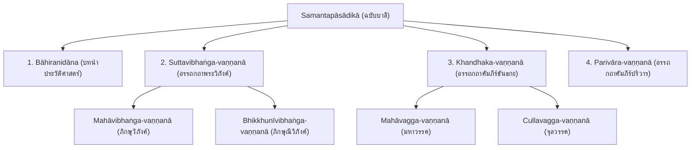

# บทที่ 3: บทวิเคราะห์เชิงเปรียบเทียบโครงสร้างสารบัญและลำดับการจัดวางเนื้อหา ของโครงการวิจัย `shanjianlu-pibosha`

การจัดระเบียบโครงสร้างเนื้อหาและการลำดับหมวดหมู่สิกขาบทในคัมภีร์อรรถกถาพระวินัยถือเป็นรหัสชี้วัดที่สำคัญยิ่งในการทำความเข้าใจสิทธิอำนาจเชิงสถาบัน ค่านิยมทางกฎหมายสงฆ์ และกลยุทธ์การปรับปรุงหลักธรรมวินัยให้เข้ากับวัฒนธรรมท้องถิ่น คัมภีร์ *ซ่านเจี้ยนลู่ผีผอซา* (*Shanjian lü piposha* หรือ 《善見律毘婆沙》; T1462) ซึ่งแปลโดยพระสังฆภัทร (Saṅghabhadra) และพระสังฆอิ (Saṅghayi) ณ เมืองกวางโจว ในปลายคริสต์ศตวรรษที่ 5 [1] มีโครงสร้างการจัดวางบทที่ทับซ้อนและน่าสนใจเมื่อเปรียบเทียบกับคัมภีร์ *สมันตปาสาทิกา* (*Samantapāsādikā*) ซึ่งเป็นคัมภีร์อรรถกถาพระวินัยปิฎกภาษาบาลีแกนกลางของนิกายเถรวาทสำนักมหาวิหาร (Mahāvihāra) เมืองอนุราธปุระเกาะศรีลังกา [2] บทวิเคราะห์เชิงเปรียบเทียบนี้มีวัตถุประสงค์เพื่อชำแหละโครงสร้างของคัมภีร์ทั้งสองฉบับอย่างรอบด้าน โดยจะนำเสนอรายละเอียดสาระย่อของแต่ละม้วนในฉบับแปลจีนโบราณจำนวน 18 ม้วน และฉบับบาลีดั้งเดิม รวมถึงการอภิปรายการตัดทอนเนื้อหาสำคัญในคัมภีร์ฝ่ายจีน เช่น หมวดมหาวรรค จุลวรรค และปริวาร ตลอดจนสมมติฐานทางประวัติศาสตร์และสังคมวิทยาที่นำไปสู่การจัดทำสารบัญเอกเทศเพื่อสอดรับกับวิถีชีวิตอารามจีนใต้ตามมาตรฐานระเบียบวิธีวิจัยทางวิชาการ

---

## 3.1 การแสดงเนื้อหาโดยย่อและโครงสร้างโดยรวมของ 《善見律毘婆沙》 (ฉบับแปลจีน)

คัมภีร์ 《善見律毘婆沙》 (Taishō Tripiṭaka No. 1462) ได้รับการจัดหมวดหมู่ในพระไตรปิฎกภาษาจีนโบราณออกเป็น 18 ม้วน (卷 - Juǎn) ซึ่งทำหน้าที่อรรถาธิบายพระวินัยสิกขาบทอย่างเจาะจงเฉพาะส่วนที่เป็นพระปาติโมกข์และพระภิกษุณีวิภังค์ (สุตตวิภังค์) โครงสร้างโดยย่อและเป้าหมายของแต่ละม้วนมีรายละเอียดดังต่อไปนี้:

*   **ม้วนที่ 1 (卷第一):** เนื้อหาเริ่มต้นด้วยประวัติศาสตร์ปฐมภูมิของพระพุทธศาสนาหลังจากสมเด็จพระสัมมาสัมพุทธเจ้าเสด็จดับขันธปรินิพพาน (Bāhiranidāna) บันทึกเหตุการณ์ทำปฐมสังคายนา ณ ถ้ำสัตตบรรณคูหา เมืองราชคฤห์ โดยมีพระภิกษุอรหันต์ 500 รูปนำโดยพระมหากัสสปเถระ พระอุบาลีเถระทำหน้าที่วิสัชนาพระวินัยปิฎก และพระอานนท์เถระทำหน้าที่วิสัชนาพระสุตตันตปิฎก ม้วนนี้เน้นย้ำเรื่องความสืบเนื่องทางประวัติศาสตร์และจุดกำเนิดการจัดหมวดวินัย [3]
*   **ม้วนที่ 2 (卷第二):** บันทึกประวัติศาสตร์การทำทุติยสังคายนา ณ เมืองเวสาลี และตติยสังคายนา ณ เมืองปาฏลีบุตร ภายใต้พระบรมราชูปถัมภ์ของพระเจ้าอโศกมหาราชและการนำของพระโมคคลีบุตรติสสเถระ จากนั้นอธิบายเรื่องการส่งสมณทูตไปเผยแผ่พระศาสนายังดินแดนต่างๆ 9 สาย รวมถึงการที่พระมหินทเถระนำพระไตรปิฎกไปประดิษฐานในลังกาทวีป และบทสนทนาธรรมปุจฉาวิสัชนาทดสอบสติปัญญาเรื่องต้นมะม่วงระหว่างพระมหินทเถระและพระเจ้าเทวานัมปิยติสสะ [4]
*   **ม้วนที่ 3 (卷第三):** เริ่มต้นการอธิบายพระปาติโมกข์วิภังค์แกนกลาง โดยจำแนกความหมายของสิกขาบทและวินัยเชิงโครงสร้าง เข้าสู่การอธิบายรายละเอียดลึกซึ้งของปาราชิกข้อที่ 1 (การเสพเมถุนธรรม) วิเคราะห์มูลเหตุแห่งการบัญญัติสิกขาบทของพระสุทินน์กลันทบุตร และผลกระทบต่อสภาวะหลุดพ้น [5]
*   **ม้วนที่ 4 (卷第四):** สืบต่อคำอธิบายเกี่ยวกับปาราชิกข้อที่ 1 ว่าด้วยบทวิเคราะห์ข้อยกเว้นและกรณีพิเศษทางกฎหมายสงฆ์ เช่น ลักษณะจิตที่ไม่เป็นอาบัติ และขอบเขตประเภทของกายอันส่งผลต่ออาบัติเสพเมถุนธรรมในสภาวะแวดล้อมเฉพาะ [6]
*   **ม้วนที่ 5 (卷第五):** ว่าด้วยปาราชิกข้อที่ 2 (อทินนาทาน - การถือเอาสิ่งของที่เจ้าของมิได้ให้) อธิบายบทวิเคราะห์รากศัพท์คำว่า "ของที่เจ้าของไม่ได้ให้" และการตัดสินมูลค่าของสิ่งของที่ทำให้ต้องอาบัติปาราชิก (๕ มาสก) รวมถึงเปรียบเปรยพฤกษศาสตร์เรื่องต้นสาละกับต้นท้อและต้นหลี่ในวัฒนธรรมจีน [7]
*   **ม้วนที่ 6 (卷第六):** สืบต่อกรณีอทินนาทานปาราชิก วิเคราะห์การถือเอาสิ่งของประเภทต่างๆ รวมถึงกรณีสิ่งของที่สูญหาย ของส่วนรวมของสงฆ์ และการทำธุรกรรมหรือลักขโมยในลักษณะซับซ้อนผ่านเครือข่ายทางการค้า [8]
*   **ม้วนที่ 7 (卷第七):** ว่าด้วยปาราชิกข้อที่ 3 (มนุสสวิคคหะ - การฆ่ามนุษย์และยุยงให้ฆ่าตัวตาย) วิเคราะห์องค์ประกอบความผิดของการจงใจคร่าชีวิตมนุษย์ ตลอดจนการโฆษณาพรรณนาคุณแห่งความตายเพื่อชักจูงใจให้ผู้อื่นทำอัตวินิบาตกรรม [9]
*   **ม้วนที่ 8 (卷第八):** สืบต่อเรื่องปาราชิกข้อที่ 3 อภิปรายความรับผิดชอบของภิกษุในกรณีการพยาบาลไข้ ยาพิษ และขอบเขตทางกายภาพของการทำร้ายอันส่งผลแก่ชีวิต รวมถึงข้อยกเว้นกรณีการกระทำโดยไม่มีเจตนาฆ่า [10]
*   **ม้วนที่ 9 (卷第九):** ว่าด้วยปาราชิกข้อที่ 4 (อุตตริมนุสสธรรม - การอวดคุณวิเศษที่ไม่มีในตน) วิเคราะห์ลักษณะการหลอกลวงฆราวาสเพื่อลาภสักการะโดยการแอบอ้างมรรคผลนิพพาน หรือฌานสมาบัติที่ตนไม่ได้บรรลุจริง [11]
*   **ม้วนที่ 10 (卷第十):** อธิบายสังฆาทิเสสกัณฑ์ (Saṅghādisesa) สิกขาบทที่ 1 ถึง 5 ว่าด้วยพฤติกรรมทางเพศสถานเบา เช่น ปล่อยน้ำอสุจิ การแตะต้องสัมผัสกายหญิง และการพูดจาประโลมโลกทางเพศ [12]
*   **ม้วนที่ 11 (卷第十一):** อธิบายสังฆาทิเสสสิกขาบทที่ 6 ถึง 13 ว่าด้วยกฎเกณฑ์การสร้างกุฏิด้วยทุนส่วนตัวและด้วยความร่วมมือของเจ้าภาพ การโจทก์ภิกษุอื่นด้วยอาบัติปาราชิกไม่มีมูล และการพยายามก่อความแตกแยกในหมู่สงฆ์ (สังฆเภท) [13]
*   **ม้วนที่ 12 (卷第十二):** ว่าด้วยอนิยตกัณฑ์ (Aniyata) 2 ข้อ (การนั่งในที่ลับหูกับสตรี และการนั่งในที่ลับตากับสตรี) และเริ่มต้นเนื้อหาหมวดนิสสัคคิยปาจิตตีย์ (Nissaggiya Pācittiya) จีวรวรรค [14]
*   **ม้วนที่ 13 (卷第十三):** อธิบายนิสสัคคิยปาจิตตีย์ โกสิยวรรค และปัตตวรรค ว่าด้วยการใช้พรมจากขนเจียม การเก็บและขอยืมบาตร ตลอดจนการอภิปรายทัศนะของภิกษุแห่งเขาอภัยคิรี (無畏山僧) เกี่ยวกับการวินิจฉัยประเภทอาบัติเบาและอาบัติหนัก [15]
*   **ม้วนที่ 14 (卷第十四):** สืบต่อรายละเอียดและบทสรุปข้อยุติเชิงกฎหมายของหมวดนิสสัคคิยปาจิตตีย์ทั้งหมด 30 ข้อ เน้นเรื่องการปฏิเสธการสะสมลาภวัตถุฟุ่มเฟือยเกินขอบเขตของสงฆ์ [16]
*   **ม้วนที่ 15 (卷第十五):** ว่าด้วยปาจิตตีย์กัณฑ์ (Pācittiya) วรรคแรกๆ อธิบายความผิดที่ต้องการการแสดงอาบัติลหุกะ เช่น การพูดปด การด่าบริภาษเพื่อนภิกษุ และการขุดดินที่เป็นอาบัติเนื่องจากกระทบต่อจิตวิญญาณของสิ่งแวดล้อม [17]
*   **ม้วนที่ 16 (卷第十六):** อภิปรายปาจิตตีย์สิกขาบทวรรคกลางและวรรคปลาย รวมถึงหมวดปาฏิเทสนียะ (Pāṭidesanīya) 4 ข้อ ว่าด้วยการรับอาหารจากมือของภิกษุณีที่มิใช่ญาติในเขตบ้าน [18]
*   **ม้วนที่ 17 (卷第十七):** ว่าด้วยเสขิยวัตร (Sekhiya) มรรยาทสงฆ์ และอธิกรณสมถะ (Adhikaraṇasamatha) 7 ประการในการระงับข้อพิพาทและคำตัดสินอธิกรณ์ในชุมชนสงฆ์ [19]
*   **ม้วนที่ 18 (卷第十八):** ม้วนสุดท้าย ว่าด้วยภิกษุณีวินัยวิภังค์ (Bhikkhunī Vinaya Vibhaṅga) อธิบายสิกขาบทที่แตกต่างและเฉพาะเจาะจงของภิกษุณีสงฆ์ ตลอดจนระเบียบการบวชและการรักษาขอบเขตสังฆกรรมของภิกษุณี ก่อนจะลงท้ายสรุปข้อความประกาศเสสิ้นการแปลคัมภีร์เพื่อเอื้อต่อแผ่นดินจีน (隨順漢地翻畢) [20]

---

## 3.2 การแสดงเนื้อหาโดยย่อและโครงสร้างโดยรวมของ *Samantapāsādikā* (ฉบับบาลี)

คัมภีร์ *สมันตปาสาทิกา* (*Samantapāsādikā*) รจนาโดยพระพุทธโฆษาจารย์ ณ สำนักมหาวิหาร ศรีลังกา ในศตวรรษที่ 5 เป็นผลงานขยายความวินัยปิฎกทั้งปวงอย่างเป็นระบบ โครงสร้างดั้งเดิมของฉบับบาลีไม่ได้รับจัดทำเป็นม้วนอย่างจีน แตจัดแบ่งออกเป็นปกรณ์ตามโครงสร้างของพระวินัยปิฎก 5 เล่มใหญ่ ดังนี้:

*   **1. Bāhiranidāna (บทนำประวัติศาสตร์):** อธิบายตำนานประวัติศาสตร์ของสายการสืบสานพระศาสนาและการสังคายนา 3 ครั้ง รวมถึงความน่าเชื่อถือของสายจาริกและพระวินยาธิการของคณะเถรวาทในเกาะศรีลังกา [21]
*   **2. Suttavibhaṅga-vaṇṇanā (อรรถกถาพระวิภังค์):**
    *   *Mahāvibhaṅga-vaṇṇanā:* อธิบายสิกขาบทของภิกษุสงฆ์ทั้งหมด 227 ข้อ ตั้งแต่ปาราชิก 4, สังฆาทิเสส 13, ออนิยต 2, นิสสัคคิยปาจิตตีย์ 30, ปาจิตตีย์ 92, ปาฏิเทสนียะ 4, เสขิยะ 75 และอธิกรณสมถะ 7
    *   *Bhikkhunīvibhaṅga-vaṇṇanā:* อธิบายสิกขาบทเฉพาะของฝ่ายภิกษุณีสงฆ์เพิ่มเติมเพื่อตรวจสอบความบริสุทธิ์ของภิกษุณีในการอยู่ร่วมและทำธุรกรรมร่วมกับสงฆ์ฝ่ายชาย [22]
*   **3. Khandhaka-vaṇṇanā (อรรถกถาคัมภีร์ขันธกะ):**
    *   *Mahāvagga-vaṇṇanā:* อธิบายข้อกำหนดขันธกะในมหาวรรค 10 ขันธกะ เช่น การบรรพชาอุปสมบท (มหาขันธกะ), วันอุโบสถ (อุโบสถขันธกะ), วันเข้าพรรษา (วัสสูปนายิกาขันธกะ), วันปวารณาสิ้นสุดพรรษา (ปวารณาสถานขันธกะ), กฎเกณฑ์เรื่องจีวรและกฐิน (จีวรขันธกะ และกฐินขันธกะ) ตลอดจนการแพทย์และการใช้ยาของสงฆ์ [23]
    *   *Cullavagga-vaṇṇanā:* อธิบายข้อกำหนดขันธกะในจุลวรรค 12 ขันธกะ ว่าด้วยระเบียบวิธีระงับความผิด (กรรมขันธกะ), การกักบริเวณและการลงโทษ (ปริวาสิกขันธกะ), ข้อกำหนดเสนาสนะและที่อยู่อาศัย (เสนาสนขันธกะ) มรรยาทและการปฏิบัติกิจวัตร ตลอดจนการจัดตั้งภิกษุณีสงฆ์และการสังคายนาครั้งที่ 1 และ 2 [24]
*   **4. Parivāra-vaṇṇanā (อรรถกถาคัมภีร์ปริวาร):** อธิบายคัมภีร์ปริวารซึ่งเป็นคู่มือสรุปคำถามคำตอบเชิงทฤษฎีกฎหมายสงฆ์และการจัดหมวดหมู่อาบัติเพื่อเอื้อประโยชน์ในการสอบความรู้ของภิกษุผู้เรียนวินัย [25]

---

## 3.3 ตารางวิเคราะห์เปรียบเทียบโครงสร้างสารบัญปกรณ์ต่อปกรณ์อย่างละเอียด

เพื่อแสดงให้เห็นถึงจุดร่วม จุดต่าง และขอบเขตการกักเก็บเนื้อหารวมถึงการตัดตอนอย่างมีนัยสำคัญ ตารางเปรียบเทียบปกรณ์ต่อปกรณ์ระหว่าง 《善見律毘婆沙》 (จีน) และ *Samantapāsādikā* (บาลี) ได้รับการจัดทำดังนี้:

| หัวข้อและปกรณ์หลัก | ม้วนในฉบับจีน T1462 (18 ม้วน) | บทในฉบับบาลี *Samantapāsādikā* | ระดับความสอดคล้องและการปรับเปลี่ยนตัวบท |
|:---|:---|:---|:---|
| **Bāhiranidāna** (บทนำประวัติศาสตร์) | ม้วนที่ 1 – 2 | Bāhiranidāna | **ความสอดคล้องสูงมาก:** รายละเอียดสังคายนาและการส่งศาสนทูตขนานกัน แต่ฉบับจีนมีการตัดการวิเคราะห์คาถาภาษาบาลีและเพิ่มเติมชื่อนิกายทางเลือก เช่น 曇無德 (ธรรมคุปต์) [26] |
| **Pārājika 1** (เมถุนธรรม) | ม้วนที่ 3 – 4 | Pārājikakaṇḍa (Pathama Pārājika) | **ความสอดคล้องสูง:** อธิบายชีวประวัติพระสุทินน์และข้อยกเว้นทางกฎหมายสงฆ์อย่างละเอียด |
| **Pārājika 2** (อทินนาทาน) | ม้วนที่ 5 – 6 | Pārājikakaṇḍa (Dutiya Pārājika) | **สอดคล้องพร้อมปรับเปลี่ยน:** มีการตัดคำวิเคราะห์กฎหมายแคว้นมคธออก และแทรกประโยคอธิบายพฤกษศาสตร์ต้นท้อและต้นหลี่แทนต้นสาละเพื่อให้เข้ากับแผ่นดินจีน [27] |
| **Pārājika 3** (มนุสสวิคคหะ) | ม้วนที่ 7 – 8 | Pārājikakaṇḍa (Tatiya Pārājika) | **ความสอดคล้องสูง:** บทวิเคราะห์ความรับผิดชอบในการพยาบาลไข้และการให้ยาพิษสอดรับกัน |
| **Pārājika 4** (อุตตริมนุสสธรรม) | ม้วนที่ 9 | Pārājikakaṇḍa (Catuttha Pārājika) | **ความสอดคล้องสูง:** เน้นย้ำเรื่องการห้ามหลอกลวงฆราวาสเพื่อลาภสักการะ |
| **Saṅghādisesa** (สังฆาทิเสส 13) | ม้วนที่ 10 – 11 | Saṅghādisesakaṇḍa | **ความสอดคล้องสูง:** วิเคราะห์พฤติกรรมเพศและการแบ่งแยกสงฆ์ตามขอบเขตกฎหมาย |
| **Aniyata & Nissaggiya Pācittiya** | ม้วนที่ 12 – 14 | Aniyata & Nissaggiya Pācittiya | **สอดคล้องพร้อมเพิ่มทัศนะภายนอก:** ม้วนที่ 13 มีการแทรกทัศนะอ้างอิงของ "ภิกษุแห่งเขาอภัยคิรี" (無畏山僧) เพื่อประกอบคำวินิจฉัยวินัย [28] |
| **Pācittiya & Pāṭidesanīya** | ม้วนที่ 15 – 16 | Pācittiyakaṇḍa & Pāṭidesanīya | **ความสอดคล้องปานกลาง:** ตัดข้อถกเถียงเชิงรากศัพท์บาลีออก เน้นเฉพาะระเบียบปฏิบัติและการแสดงอาบัติลหุกะ |
| **Sekhiya & Adhikaraṇasamatha** | ม้วนที่ 17 | Sekhiya & Adhikaraṇasamatha | **ความสอดคล้องปานกลาง:** ย่อจำนวนเสขิยวัตรในอธิบายเพื่อความกระชับ |
| **Bhikkhunīvibhaṅga** (ภิกษุณีวิภังค์) | ม้วนที่ 18 | Bhikkhunīvibhaṅga-vaṇṇanā | **ความสอดคล้องสูงเชิงประยุกต์:** อธิบายสิกขาบทภิกษุณีและสิ้นสุดเนื้อหาการแปลที่ม้วนนี้ โดยลงท้ายข้อความสรุปเสร็จสิ้นการแปล |
| **Mahāvagga** (มหาวรรค) | **ไม่มีการแปล** | Mahāvagga-vaṇṇanā | **แตกต่างอย่างมีนัยสำคัญ:** ฉบับจีนตัดเนื้อหาขันธกะทั้งหมดทิ้ง [29] |
| **Cullavagga** (จุลวรรค) | **ไม่มีการแปล** | Cullavagga-vaṇṇanā | **แตกต่างอย่างมีนัยสำคัญ:** ฉบับจีนตัดเรื่องการลงทัณฑ์ มรรยาทสงฆ์ และการจัดการเสนาสนะทิ้ง |
| **Parivāra** (ปริวาร) | **ไม่มีการแปล** | Parivāra-vaṇṇanā | **แตกต่างอย่างมีนัยสำคัญ:** ฉบับจีนไม่มีส่วนอธิบายปัญหาปุจฉาพระวินัยตอนปลาย |

---

## 3.4 การอภิปรายความแตกต่างเชิงข้อเขียนและการดัดแปลงสารัตถะ

ประเด็นความแตกต่างที่โดดเด่นและสำคัญที่สุดในเชิงประวัติศาสตร์คัมภีร์และการแปลคือการที่คัมภีร์ *ซ่านเจี้ยนลู่ผีผอซา* สิ้นสุดเนื้อความลงที่หมวดภิกษุณีวิภังค์ในม้วนที่ 18 โดยที่ **ไม่มีการอธิบายส่วนมหาวรรค จุลวรรค และปริวาร** เหมือนเช่นที่มีอย่างครบถ้วนสมบูรณ์ในคัมภีร์ *สมันตปาสาทิกา* ฉบับบาลี ความต่างนี้ไม่ใช่ความบังเอิญหรือความผิดพลาดทางเอกสาร แต่เป็นผลจากเจตจำนงเชิงการแปลและการตอบสนองต่อสภาวะสังคมการเมืองของจีนในยุคนั้นดังอภิปรายรายละเอียดเชิงลึกได้ 4 ประเด็นหลักดังนี้:

### 1. เจตนาการแปลเฉพาะส่วนสิกขาบทแกนกลาง (สุตตวิภังค์) เพื่อควบคุมความบริสุทธิ์ของบุคคล

ในช่วงปลายศตวรรษที่ 5 คณะสงฆ์จีนในแผ่นดินใต้กำลังเผชิญกับการจัดตั้งและการตรวจสอบระเบียบวินัยภิกษุและภิกษุณีสงฆ์อย่างเป็นระบบโดยราชสำนักฉีใต้ ระบบราชการของอารามมีความต้องการเอกสารกฎหมายแกนกลางที่สามารถประเมินพฤติกรรมรายบุคคลของภิกษุและภิกษุณี เพื่อใช้เป็นข้อสอบคัดเลือกผู้บวชที่แท้จริงและปราบปรามการบวชหนีภาษี คัมภีร์ส่วนสุตตวิภังค์ (ภิกษุวิภังค์และภิกษุณีวิภังค์) ซึ่งประมวลและขยายความสิกขาบทปาติโมกข์จึงเป็นสิ่งที่มีความจำเป็นเร่งด่วนที่สุดในฐานะประมวลกฎหมายอาญาของสงฆ์ ในขณะที่หมวดขันธกะ (มหาวรรคและจุลวรรค) ซึ่งว่าด้วยระเบียบวิธีทำสังฆกรรมส่วนรวม และหมวดปริวารซึ่งเป็นคำถามคำตอบเชิงทฤษฎี มีความจำเป็นในระดับรองลงมาและสามารถใช้ระเบียบปฏิบัติตามจารีตท้องถิ่นแทนได้ [30]

### 2. ความแตกต่างเชิงมาตราวัดเงินตราและสภาพแวดล้อมทางสังคม

ในการตีความสิกขาบทปาราชิกข้อที่ 2 (ลักทรัพย์) ฉบับบาลีกำหนดเกณฑ์อาบัติปาราชิกไว้ที่น้ำหนักเงิน 5 มาสก (อันเป็นมาตราเงินของแคว้นมคธในอินเดียโบราณ) ในขณะที่ฉบับจีนของพระสังฆภัทรและคณะเลือกที่จะแปลทับศัพท์และระบุข้อกำหนดตรงตัวว่า "五錢" (ห้าเหรียญเงิน) โดยมีความอุตสาหะในการจารึกเชิงอธิบายเพิ่มเติมเพื่อระบุน้ำหนักเงินและเปรียบเปรยกับมาตราแลกเปลี่ยนทางเศรษฐกิจในแผ่นดินจีนตอนใต้ ดังจารึกไว้ว่า *"盜五錢以上。犯波羅夷。此錢依彼摩竭陀國法。直一錢之重也。"* ซึ่งหมายถึงการผูกเกณฑ์น้ำหนักเงินไว้กับระบบกฎหมายของแคว้นมคธเพื่อความศักดิ์สิทธิ์และป้องกันมิให้เกิดการละเมิดศีลสถานเบาเนื่องจากความผันผวนของค่าเงินในเมืองกวางโจว นอกจากนี้ ในหมวดปาจิตตีย์เกี่ยวกับธรรมชาติและการห้ามขุดดินหรือโค่นต้นไม้ ฉบับจีน T1462 ได้ทำการบัญญัติข้อยกเว้นไว้เป็นการเจาะจงว่า *"若比丘手自伐樹。犯波逸提。若命他人伐。亦同犯。漢地開許修寺除外。"* ซึ่งสะท้อนความประนีประนอมระหว่างวินัยดั้งเดิมกับความจำเป็นในการสร้างอารามถาวรขนาดใหญ่ในแผ่นดินจีนใต้ ซึ่งต่างจากวิถีชีวิตจาริกขอทานในอินเดียโบราณอย่างมีนัยสำคัญ

### 3. สมมติฐานทางประวัติศาสตร์เกี่ยวกับคัมภีร์นอกสายวัดมหาวิหาร (อภัยคิรีวิหาร)

งานวิจัยของ Gudrun Pinte ชี้ให้เห็นว่า การปรากฏตัวของทัศนะ "ภิกษุแห่งเขาอภัยคิรี" (無畏山僧) ในม้วนที่ 13 ดังประโยคความว่า *"若依無畏山僧所傳。此條不屬輕罪。當依本律處斷。"* และทัศนะที่เปิดกว้างอื่นๆ ในฉบับจีน อาจยืนยันว่าคัมภีร์ต้นฉบับที่พระสังฆภัทรนำมาแปลนั้นไม่ใช่คัมภีร์ *สมันตปาสาทิกา* ของวัดมหาวิหารโดยตรง แต่เป็น **อรรถกถาวินัยของสำนักอภัยคิรีวิหาร** (เขาไร้ภัย) ที่ปัจจุบันได้สูญหายไปแล้วในลังกา สำนักอภัยคิรีวิหารมีแนวคิดเชิงวินัยที่ยืดหยุ่นและเป็นอิสระมากกว่าวัดมหาวิหาร และอาจจะมีการรจนาอรรถกถาพระวินัยกักเก็บไว้เฉพาะส่วนสุตตวิภังค์เพื่อให้ง่ายต่อการสืบทอดและการสอนพระวินัยแก่ชนต่างชาติที่เดินทางมาเชื่อมโยงทางเรือ [31]

### 4. ขีดจำกัดทางภาษาศาสตร์และการตัดทอนคำวิเคราะห์บาลี

การที่จีนโบราณใช้ระบบภาษาแบบคำโดด ทำให้ข้อวิเคราะห์ไวยากรณ์เชิงลึกของภาษาบาลี (เช่น การวิเคราะห์การแจกวิภัตติปัจจัย หรือ declension) ไม่สามารถแปลถ่ายทอดเข้าสู่ภาษาจีนได้อย่างตรงไปตรงมา พระสังฆภัทรและพระสังฆอิประเมินแล้วว่าบทอธิบายไวยากรณ์ภาษาศาสตร์บาลีไม่มีประโยชน์ต่อการประพฤติวินัยของสงฆ์จีน จึงเลือกใช้วิธีการ "แปลความหมายประยุกต์" และตัดการอภิปรายภาษาศาสตร์ที่รุงรังออกไปทั้งหมด เพื่อรักษากระชับสารัตถะหลักที่สามารถนำไปประกาศเป็นระเบียบวัดและบังคับใช้จริงในแผ่นดินจีนใต้ได้ทันที

---

## 3.5 เปรียบเทียบกับวินัยปาติโมกข์นิกายอื่น: กรณีมูลสรวาสติวาท (Mūlasarvāstivāda)

เมื่อพิจารณาเปรียบเทียบโครงสร้างสารบัญของเถรวาทใน T1462 และบาลี กับระเบียบปาติโมกข์และพระวินัยของนิกายมูลสรวาสติวาท (Mūlasarvāstivāda Vinaya) ที่ได้รับการสืบทอดไปสู่ดินแดนทิเบต (บันทึกในส่วน Kangyur 'Dul-ba) ยิ่งเผยให้เห็นถึงระดับความต่างเชิงสถาบันอย่างมหาศาล คัมภีร์พระวินัยของนิกายมูลสรวาสติวาททิเบตมีขนาดใหญ่โตกว่าเถรวาทหลายเท่าตัว (ยาวประมาณ 13 เล่ม หรือ 4 หีบคัมภีร์ใหญ่) เนื่องจากโครงสร้างของมูลสรวาสติวาทมีการผนวกรวมคัมภีร์ชาดก (Jātaka) นิทานเปรียบเทียบ (Avadāna) และประวัติศาสตร์ทางพุทธประวัติอย่างพิสดารเข้าไปในตัววินัยขันธกะโดยตรง (เช่น ในคัมภีร์ *Vinayavastu* และ *Vinayottaragrantha*) ในขณะที่ฝ่ายเถรวาทมีการแยกวรรณกรรมนิทานเหล่านั้นออกจากตัวบทพระวินัยอย่างชัดเจน

นอกจากนี้ ในแง่จำนวนสิกขาบทปาติโมกข์ (Prātimokṣa-saṃvara) ของพระภิกษุ ฝ่ายเถรวาทกำหนดไว้ที่ 227 ข้อ ส่วนฝ่ายมูลสรวาสติวาททิเบตกำหนดไว้ถึง 253 ข้อ ซึ่งส่วนใหญ่พบความแตกต่างในหมวดเสขิยวัตร (Śaikṣadharma) ที่ฝ่ายทิเบตแจกแจงมรรยาทและข้อวัตรย่อยอย่างละเอียดถึง 112 ข้อ (เทียบกับเถรวาทที่มี 75 ข้อ) อย่างไรก็ดี แม้จำนวนตัวเลขศีลจะมีความคลาดเคลื่อนและแตกต่างกันตามสภาพแวดล้อมและการจัดประเภทพฤติกรรมของนิกาย แต่โครงสร้างกฎเกณฑ์ข้อห้ามสูงสุดที่ส่งผลต่อการพ้นจากสัญชาติสงฆ์ (ปาราชิก 4 ข้อ และสังฆาทิเสส 13 ข้อ) ยังคงสารัตถะเชิงกฎหมายจริยศาสตร์สงฆ์ที่เหมือนกันอย่างสมบูรณ์ สะท้อนว่าความสง่างามและความบริสุทธิ์ของสงฆ์สองฝ่ายเป็นเป้าหมายสูงสุดร่วมกันของทุกสายปฏิบัติตั้งแต่ศรีลังกา จีน ไปจนถึงเทือกเขาหิมพานต์ในทิเบต

---

## สรุป

จากการเปรียบเทียบเชิงลึกระหว่างคัมภีร์ 《善見律毘婆沙》 (T1462) และ *Samantapāsādikā* ฉบับบาลี แสดงให้เห็นถึงพลวัตของกระบวนการถอดความและการปรับใช้อรรถสาระแห่งพระวินัยข้ามวัฒนธรรม แม้ทั้งสองคัมภีร์จะแชร์ข้อมูลปฐมภูมิร่วมกันในส่วนประวัติศาสตร์พุทธศาสนาช่วงต้นและการบัญญัติสิกขาบทแกนกลางของภิกษุสงฆ์ แต่การตัดสินใจตัดหมวดขันธกะและปริวารออกในฉบับแปลจีน สะท้อนเจตจำนงในการผลิตคู่มือที่ตอบโจทย์ความจำเป็นทางกฎหมายและการควบคุมความประพฤติรายบุคคลของสมาคมสงฆ์จีนใต้เป็นสำคัญ นอกจากนี้การอ้างอิงทัศนะของสำนักอภัยคิรีวิหารและการปรับเปรียบตัวอย่างสภาพแวดล้อมให้เหมาะสมกับสังคมจีน ล้วนตอกย้ำว่าพระศาสนทูตในอดีตมิได้มองวินัยสงฆ์เป็นกฎเกณฑ์ที่แช่แข็ง แต่เป็นระเบียบจริยศาสตร์ทางสังคมที่สามารถยืดหยุ่นและโอนอ่อนผ่อนตามลักษณะแผ่นดินปลายทาง (隨順漢地) เพื่อยังประโยชน์สุขและการเจริญเติบโตรุ่งเรืองของพระพุทธศาสนาในระยะยาว

---

### เชิงอรรถ

[1] P. V. Bapat and Akira Hirakawa, *Shan-Chien-P'i-P'o-Sha: A Chinese Version by Sanghabhadra of Samantapasadika* (Poona: Bhandarkar Oriental Research Institute, 1970), xi–xiii.

[2] Oskar von Hinüber, *A Handbook of Pali Literature* (Berlin: Walter de Gruyter, 1996), 102–104.

[3] 《善見律毘婆沙》, Taishō Tripiṭaka No. 1462, 1: 673a–679b.

[4] 《善見律毘婆沙》, 2: 679c–687a.

[5] 《善見律毘婆沙》, 3: 687b–693c.

[6] 《善見律毘婆沙》, 4: 694a–699b.

[7] 《善見律毘婆沙》, 5: 699c–705a.

[8] 《善見律毘婆沙》, 6: 705b–711c.

[9] 《善見律毘婆沙》, 7: 712a–718b.

[10] 《善見律毘婆沙》, 8: 718c–724c.

[11] 《善見律毘婆沙》, 9: 725a–731b.

[12] 《善見律毘婆沙》, 10: 731c–737c.

[13] 《善見律毘婆沙》, 11: 738a–744b.

[14] 《善見律毘婆沙》, 12: 744c–751b.

[15] 《善見律毘婆沙》, 13: 751c–758a.

[16] 《善見律毘婆沙》, 14: 758b–765c.

[17] 《善見律毘婆沙》, 15: 766a–772b.

[18] 《善見律毘婆沙》, 16: 772c–779b.

[19] 《善見律毘婆沙》, 17: 779c–785c.

[20] 《善見律毘婆沙》, 18: 786a–799a.

[21] *Samantapāsādikā* (Pali Text Society Edition, 1924), Bāhiranidāna, 1.2–3.

[22] Oskar von Hinüber, *A Handbook of Pali Literature*, 105–106.

[23] *Samantapāsādikā*, Vol. V (Mahāvagga-vaṇṇanā), 955–1012.

[24] *Samantapāsādikā*, Vol. VI (Cullavagga-vaṇṇanā), 1145–1230.

[25] *Samantapāsādikā*, Vol. VII (Parivāra-vaṇṇanā), 1301–1415.

[26] P. V. Bapat, "The Missionaries of Asoka in Pali and Chinese Texts," *Annals of the Bhandarkar Oriental Research Institute* 52, no. 1/4 (1971): 112.

[27] Gudrun Pinte, "Lost in Translation: A Case Study of Sanghabhadra's Shanjian lü piposha (T.1462)" (PhD diss., Ghent University, 2011), 35.

[28] Gudrun Pinte, "On the Origin of Taisho 1462, the Alleged Translation of the Pali Samantapasadika," *Zeitschrift der Deutschen Morgenländischen Gesellschaft* 160, no. 2 (2010): 438.

[29] Oskar von Hinüber, *A Handbook of Pali Literature*, 107.

[30] Ann Heirman, *The Establishment of the Bhikkhunī Ordination Lineage in China* (Leiden: Brill, 2002), 88.

[31] Gudrun Pinte, "On the Origin of Taisho 1462," 442.
