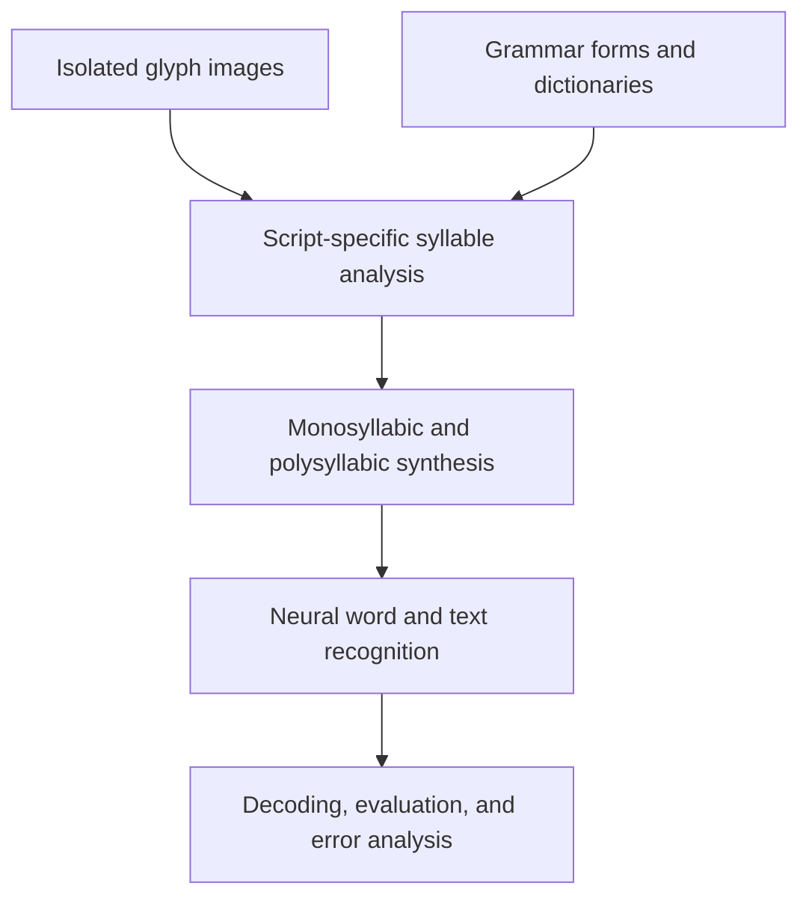

<h1 align="center">SADA</h1>

<p align="center">
  <strong>Syllable Analysis Data Augmentation for Ancient Palm-Leaf Manuscript Recognition</strong>
</p>

<p align="center">
  Grammar-aware data augmentation and neural text recognition for Khmer, Balinese, and Sundanese palm-leaf manuscripts.
</p>

<p align="center">
  <strong>Project led by Dr. Nimol Thuon</strong>
</p>

<p align="center">
  <a href="https://doi.org/10.23919/APSIPAASC55919.2022.9980217"></a>
  <a href="https://doi.org/10.1016/j.patrec.2025.04.031"></a>
  
  <a href="LICENSE"></a>
</p>

<p align="center">
  <a href="#overview">Overview</a> ·
  <a href="#research-lineage">Research lineage</a> ·
  <a href="#kh-sada">KH-SADA</a> ·
  <a href="#palm-sada">PALM-SADA</a> ·
  <a href="#getting-started">Getting started</a> ·
  <a href="#citation">Citation</a>
</p>

> [!IMPORTANT]
> This repository contains a **legacy research implementation** of KH-SADA together with grammar resources, figures, and links to external datasets and model weights. The published PALM-SADA paper is documented here; its complete implementation, extended datasets, and production OCR system are maintained for **internal research use only**.

> [!NOTE]
> **Baseline of our methods:** our research team achieved first place in both the **isolated glyph recognition** and **word/text recognition** tasks of the ICFHR 2018 palm-leaf manuscript competition.
## Overview

Palm-leaf manuscripts preserve centuries of linguistic, religious, literary, and cultural knowledge across Southeast Asia. Automatic recognition remains difficult because these manuscripts combine degraded writing surfaces, complex glyph shapes, stacked components, limited annotations, and script-specific grammatical structures.

**Syllable Analysis Data Augmentation (SADA)** addresses this low-resource setting by combining visual learning with linguistic constraints. Instead of joining isolated glyphs arbitrarily, SADA uses script-specific glyph dictionaries and grammar forms to generate plausible syllables, words, and text sequences for recognition training.

The repository supports two connected research projects:

| Project | Scope | Recognition approach | Publication |
|---|---|---|---|
| **KH-SADA** | Khmer palm-leaf manuscripts | Grammar-aware synthesis with a CNN/attention-based recurrent recognizer | [APSIPA ASC 2022](https://doi.org/10.23919/APSIPAASC55919.2022.9980217) |
| **PALM-SADA** | Khmer, Balinese, and Sundanese manuscripts | Monosyllabic and polysyllabic synthesis with a hybrid CNN–Transformer framework | [Pattern Recognition Letters 195 (2025), 8–15](https://doi.org/10.1016/j.patrec.2025.04.031) |

The public repository is intended for research, reproducibility studies, education, and the digital preservation of low-resource historical scripts. Production deployment resources are restricted to internal research use.

## Research lineage

| Year | Milestone | Contribution |
|---|---|---|
| 2018 | [ICFHR Competition on Southeast Asian palm-leaf manuscripts](https://doi.org/10.1109/ICFHR-2018.2018.00090) | Public benchmarks for binarization, text-line segmentation, glyph recognition, and word transliteration across Khmer, Balinese, and Sundanese manuscripts |
| 2022 | **KH-SADA** | Khmer syllable analysis, grammar-aware augmentation, glyph dictionaries, and word/text recognition |
| 2025 | **PALM-SADA** | Multi-script monosyllabic and polysyllabic augmentation, hybrid CNN–Transformer recognition, and structured error analysis |


## Method at a glance



The central idea is to introduce linguistic validity into visual data generation. This produces more useful training samples than unconstrained glyph concatenation and enables analysis at the syllable, word, and text levels.

## KH-SADA

### Khmer Syllable Analysis Data Augmentation

KH-SADA introduces a glyph dictionary and grammar-aware augmentation strategy for Khmer palm-leaf manuscript recognition. It represents Khmer writing through component classes and grammar forms such as `C`, `CV`, `VC`, `CC`, `VV`, `CCC`, `CVC`, and `VCV`, then uses these constraints to construct training samples with plausible syllabic structure.

### Core contributions

- Khmer glyph-class and transliteration dictionaries;
- explicit grammar structures for valid glyph composition;
- grammar-aware generation of synthetic word images;
- an attention-based neural recognition pipeline;
- beam-search decoding and WER/ExpRate evaluation; and
- reusable training captions, scripts, figures, model weights, and dataset links.

### Khmer writing structure

<table>
  <tr>
    <td align="center" width="50%">
      <br>
      <sub><strong>Figure 1.</strong> A complex Khmer word with stacked consonants and multiple diacritics.</sub>
    </td>
    <td align="center" width="50%">
      <br>
      <sub><strong>Figure 2.</strong> Khmer grammar structure and contextual glyph roles.</sub>
    </td>
  </tr>
</table>

<p align="center">
  
</p>
<p align="center"><sub><strong>Figure 3.</strong> Component breakdown of Khmer writing forms, including consonants and dependent vowels.</sub></p>

### Grammar-aware augmentation

<p align="center">
  
</p>
<p align="center"><sub><strong>Figure 4.</strong> Syllable-based augmentation using grammar-constrained glyph composition.</sub></p>

### Recognition and interpretation

<table>
  <tr>
    <td align="center" width="50%">
      <br>
      <sub><strong>Figure 5.</strong> KH-SADA attention-based recognition pipeline.</sub>
    </td>
    <td align="center" width="50%">
      <br>
      <sub><strong>Figure 6.</strong> Attention visualizations for Khmer palm-leaf manuscript recognition.</sub>
    </td>
  </tr>
</table>

### KH-SADA resources

| Resource | Location |
|---|---|
| Legacy training and decoding code | [`KH-SADA/`](KH-SADA/) |
| Grammar and glyph dictionaries | [`glyphs dictionary/`](glyphs%20dictionary/) |
| Pretrained model weights | [Google Drive](https://drive.google.com/file/d/15km1riGn19twubZQoGFhvfsXFphGJP1R/view?usp=sharing) |
| Dataset | [Google Drive](https://drive.google.com/drive/folders/16-mLPE8QSGB4-tKpUS2q7_V2L-VgjVhi?usp=sharing) |
| Published paper | [IEEE Xplore / DOI](https://doi.org/10.23919/APSIPAASC55919.2022.9980217) |

## PALM-SADA

### Multi-Low-Resource Languages in Palm-Leaf Manuscript Recognition

PALM-SADA extends the Khmer-focused work to **Khmer, Balinese, and Sundanese**. It combines grammar-aware generation with a hybrid CNN–Transformer encoder–decoder and an interactive post-processing mechanism for error detection and transcription refinement.

The work was published in *Pattern Recognition Letters* in 2025:

> **Nimol Thuon, Jun Du, Panhapin Theang, and Ranysakol Thuon.** “Multi-low resource languages in palm leaf manuscript recognition: Syllable-based augmentation and error analysis.” *Pattern Recognition Letters*, 195:8–15, 2025. [https://doi.org/10.1016/j.patrec.2025.04.031](https://doi.org/10.1016/j.patrec.2025.04.031)

### Main contributions

- a unified augmentation framework for multiple Southeast Asian scripts;
- monosyllabic synthesis from isolated glyphs and grammar forms;
- polysyllabic synthesis for longer word and text sequences;
- a hybrid CNN–Transformer recognition architecture;
- script- and structure-aware error analysis; and
- interactive grammar-based post-processing.

### Multi-script synthesis

<table>
  <tr>
    <td align="center" width="50%">
      <br>
      <sub><strong>Figure 7.</strong> Monosyllabic and polysyllabic word composition across the supported scripts.</sub>
    </td>
    <td align="center" width="50%">
      <br>
      <sub><strong>Figure 8.</strong> Naive glyph combination compared with grammar-aware, writing-conscious synthesis.</sub>
    </td>
  </tr>
</table>

> [!NOTE]
> The current repository includes public PALM-SADA documentation and figures. The complete PALM-SADA implementation and extended multi-script datasets are restricted to **internal research use only** and are not publicly distributed.

## Repository structure

```text
SADA-Ancient-Palm-Leaf-Manuscripts-Recognitions/
├── KH-SADA/
│   ├── train_nmt.py          # Model training entry point
│   ├── translate.py          # Beam-search decoding
│   ├── compute-wer.py        # WER and expression-rate evaluation
│   ├── nmt.py                # Legacy Theano recognition model
│   ├── data_iterator.py      # Image/label batching
│   ├── optimizers.py         # Training optimizers
│   ├── train.sh              # Training launcher
│   └── test.sh               # Evaluation launcher
├── PALM-SADA/
│   └── readme.md             # PALM-SADA release note
├── glyphs dictionary/
│   ├── caption_train.txt
│   ├── grammar_stucture.txt  # Historical filename retained
│   ├── khmer_class_types_dictionary.txt
│   └── translated_dictionary.txt
├── fig/                      # Research figures
├── LICENSE                   # CC0 1.0 Universal
└── README.md
```

## Getting started

### 1. Clone the repository

```bash
git clone https://github.com/back-kh/SADA-Ancient-Palm-Leaf-Manuscripts-Recognitions.git
cd SADA-Ancient-Palm-Leaf-Manuscripts-Recognitions
```

### 2. Download the external resources

Download the [KH-SADA dataset](https://drive.google.com/drive/folders/16-mLPE8QSGB4-tKpUS2q7_V2L-VgjVhi?usp=sharing) and [pretrained weights](https://drive.google.com/file/d/15km1riGn19twubZQoGFhvfsXFphGJP1R/view?usp=sharing). The legacy scripts expect a layout similar to:

```text
SADA-Ancient-Palm-Leaf-Manuscripts-Recognitions/
├── data/
│   ├── offline-train.pkl
│   ├── offline-test.pkl
│   ├── train_caption.txt
│   ├── test_caption.txt
│   └── dictionary.txt
└── KH-SADA/
    ├── models/
    └── result/
```

Confirm the downloaded filenames and update paths in `train_nmt.py` or `test.sh` if the package layout differs.

### 3. Prepare a compatible legacy environment

The KH-SADA implementation uses Python 2 syntax and legacy Theano GPU APIs. Reproduction requires a historically compatible environment with:

- Python 2.7;
- NumPy;
- Theano with `gpuarray`/cuDNN support; and
- matching CUDA and cuDNN versions.

Dependency versions were not pinned in the original release. A dedicated legacy environment or container is therefore recommended. The scripts may require porting before use with current Python, CUDA, or deep-learning libraries.

### 4. Train or evaluate

Review the dataset paths and `THEANO_FLAGS` before running:

```bash
cd KH-SADA
mkdir -p models result

# Train
bash train.sh

# Decode and evaluate with the expected pretrained filenames
bash test.sh
```

The standalone evaluation utility can be invoked as:

```bash
python compute-wer.py <recognition.txt> <ground-truth.txt> <metrics.txt>
```

## Release status and limitations

| Component | Status |
|---|---|
| KH-SADA research code | Included as a legacy Theano implementation |
| Khmer grammar and glyph dictionaries | Included |
| KH-SADA dataset and model weights | Hosted externally on Google Drive |
| PALM-SADA paper | Published in *Pattern Recognition Letters* (2025) |
| Full PALM-SADA code and extended datasets | Restricted to internal research use |
| Production-ready OCR application | Restricted to internal research use |

The repository is best treated as a research artifact and foundation for modern reimplementation. Results may depend on the original preprocessing, data splits, dictionary ordering, legacy dependencies, and hardware configuration.

## Citation

If this repository supports your work, cite the publication corresponding to the component you use.

### KH-SADA

```bibtex
@inproceedings{thuon2022sada,
  title     = {Syllable Analysis Data Augmentation for Khmer Ancient Palm Leaf Recognition},
  author    = {Thuon, Nimol and Du, Jun and Zhang, Jianshu},
  booktitle = {2022 Asia-Pacific Signal and Information Processing Association Annual Summit and Conference (APSIPA ASC)},
  pages     = {1855--1862},
  year      = {2022},
  publisher = {IEEE},
  doi       = {10.23919/APSIPAASC55919.2022.9980217},
  url       = {https://doi.org/10.23919/APSIPAASC55919.2022.9980217}
}
```

### PALM-SADA

```bibtex
@article{thuon2025palmsada,
  title   = {Multi-low resource languages in palm leaf manuscript recognition: Syllable-based augmentation and error analysis},
  author  = {Thuon, Nimol and Du, Jun and Theang, Panhapin and Thuon, Ranysakol},
  journal = {Pattern Recognition Letters},
  volume  = {195},
  pages   = {8--15},
  year    = {2025},
  doi     = {10.1016/j.patrec.2025.04.031},
  url     = {https://doi.org/10.1016/j.patrec.2025.04.031}
}
```

## License

Repository materials are released under the [CC0 1.0 Universal dedication](LICENSE). This dedication applies only to files publicly included in this repository; it does not apply to internal PALM-SADA code, extended datasets, or production systems. External datasets, pretrained weights, manuscript images, and third-party competition resources may have separate licenses or usage conditions; review their source terms before redistribution.

## Acknowledgements

This work forms part of the broader **PALM-SEA** research effort. Support has been provided by the World Academy of Sciences, the Chinese Academy of Sciences, the National Natural Science Foundation of China, and One-to-Many Research.

The authors also acknowledge the creators and organizers of the [ICFHR 2018 Competition on Document Image Analysis Tasks for Southeast Asian Palm Leaf Manuscripts](https://doi.org/10.1109/ICFHR-2018.2018.00090).

## Project lead

**Dr. Nimol Thuon**  
[GitHub](https://github.com/back-kh) · [ORCID](https://orcid.org/0000-0001-6672-1933)

<p align="center"><em>Supporting the recognition and digital preservation of Southeast Asia's palm-leaf manuscript heritage.</em></p>
