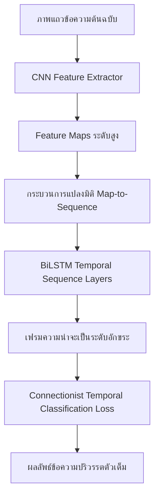

การวิเคราะห์และถอดรหัสเอกสารตัวเขียนทางประวัติศาสตร์ (Historical Handwritten Text Recognition: HTR) ประสบความก้าวหน้าอย่างก้าวกระโดดผ่านรอยต่อเทคโนโลยีที่สำคัญสองยุคสมัย นั่นคือ ยุคเปลี่ยนผ่านจากการประยุกต์ใช้แบบจำลองความน่าจะเป็นเชิงสถิติระดับอักขระเดี่ยวที่สกัดคุณลักษณะด้วยมือ (Hand-crafted Feature Extraction) ไปสู่ยุคสถาปัตยกรรมโครงข่ายประสาทเชิงลึกแบบไฮบริด (Hybrid Deep Learning) ซึ่งสามารถเรียนรู้การสกัดคุณลักษณะทางทัศน์ควบคู่กับการวิเคราะห์ลำดับข้อมูลอนุกรมเวลาในลักษณะต้นจนจบ (End-to-End Pipeline) กระบวนการนี้ไม่เพียงแต่เปลี่ยนกรอบความคิดในการออกแบบระบบรู้จำตัวอักษรจากเดิมที่เน้นการจำแนกรูปแบบเชิงสถิติแบบดั้งเดิม ทว่ายังทลายข้อจำกัดเชิงโครงสร้างทางทฤษฎีสารสนเทศที่เคยเป็นอุปสรรคสำคัญในการประมวลผลลายมือเขียนต่อเนื่อง (Cursive Script) มานานหลายทศวรรษ โดยเฉพาะอย่างยิ่งการนำเสนอสถาปัตยกรรมแบบจำลองลำดับอนุกรมเวลา (Sequence-to-Sequence Modeling) ที่ประสานการทำงานระหว่างโครงข่ายประสาทแบบคอนโวลูชัน (Convolutional Neural Networks: CNNs) โครงข่ายประสาทวนซ้ำแบบสองทิศทาง (Bidirectional Long Short-Term Memory: BiLSTM) และฟังก์ชันการสูญเสียแบบจัดหมวดหมู่เชิงเวลาแบบไร้ข้อจำกัดเชิงตำแหน่ง (Connectionist Temporal Classification: CTC Loss) ซึ่งกลายมาเป็นรากฐานและสถาปัตยกรรมมาตรฐานสำหรับระบบการเรียนรู้เครื่องในงาน HTR ยุคใหม่ บทเรียนนี้จะทำการวิเคราะห์รากฐานเชิงคณิตศาสตร์ โครงสร้างทางกายภาพ ตลอดจนข้อดีและข้อจำกัดเชิงประจักษ์ของแบบจำลองเหล่านี้ เพื่อสร้างความเข้าใจเชิงลึกเกี่ยวกับกลไกการแปลงรูปภาพลายมือเขียนโบราณที่มีความเสียหายทางพิกเซลสูงไปสู่ข้อความปริวรรตทางประวัติศาสตร์ที่ถูกต้องแม่นยำตามเกณฑ์มาตรฐานวิชาการระดับสากล

---

## 3.1 Hidden Markov Models (HMMs) และการถอดความลายมือโบราณแบบไร้คำศัพท์

ในช่วงทศวรรษที่ 1990 ถึงยุคเริ่มต้นของศตวรรษที่ 21 การประยุกต์ใช้แบบจำลองมาร์คอฟซ่อนเร้น (Hidden Markov Models: HMMs) ได้รับความนิยมอย่างแพร่หลายในฐานะเครื่องมือวิเคราะห์เชิงสถิติสำหรับจำลองลำดับความน่าจะเป็นของเส้นพิกเซลเขียนโบราณ โดยเป็นการถ่ายทอดองค์ความรู้และกลไกเชิงทฤษฎีสารสนเทศมาจากระบบการรู้จำเสียงพูด (Speech Recognition) เนื่องจากธรรมชาติของลายมือเขียนและเสียงพูดมีความคล้ายคลึงกันในเชิงทฤษฎี นั่นคือการเป็นข้อมูลลำดับอนุกรมเวลาเชิงเส้น (Linear Sequence) ในระบบ HMMs กระบวนการวิเคราะห์จะเริ่มต้นจากการใช้เทคนิคหน้าต่างสไลด์ (Sliding Window) ขนาดเล็กเคลื่อนผ่านบรรทัดอักษรจากทิศทางหนึ่งไปสู่อีกทิศทางหนึ่งตามระบบการเขียนของภาษานั้น ๆ โดยหน้าต่างสไลด์จะทำหน้าที่สกัดเวกเตอร์คุณลักษณะเชิงทัศน์ (Visual Feature Vectors) ในแต่ละเฟรมภาพ เช่น ความเข้มข้นของพิกเซลสีดำ ตำแหน่งจุดศูนย์ถ่วงของหมึก และทิศทางลาดเอียงของเส้นเขียน เพื่อนำมาสร้างเป็นลำดับของข้อมูลที่สังเกตได้ (Observation Sequence: $O = o_1, o_2, ..., o_T$) [1]

ตามโครงสร้างทางคณิตศาสตร์ แบบจำลองมาร์คอฟซ่อนเร้นกำหนดให้ตัวแปรสถานะที่แท้จริงซึ่งเป็นอักขระหรือหน่วยย่อยของตัวอักษรเป็นสถานะซ่อนเร้น (Hidden States: $Q = q_1, q_2, ..., q_T$) ที่ไม่สามารถสังเกตได้โดยตรงผ่านพิกเซลภาพ แต่สามารถประมาณค่าความน่าจะเป็นผ่านตัวแปรสองส่วนสำคัญ ได้แก่ เมทริกซ์การเปลี่ยนสถานะ (Transition Probability Matrix: $A$) ซึ่งกำหนดค่าความน่าจะเป็นในการเปลี่ยนผ่านจากสถานะอักขระหนึ่งไปสู่อีกอักขระหนึ่ง $a_{ij} = P(q_{t+1} = S_j \mid q_t = S_i)$ และเมทริกซ์การปล่อยผลสังเกต (Emission Probability Matrix: $B$) ซึ่งแสดงระดับความน่าจะเป็นที่สถานะซ่อนเร้นนั้นจะสร้างคุณลักษณะทางทัศน์ในพิกเซลภาพออกมาเป็นค่า $b_j(v_k) = P(o_t = v_k \mid q_t = S_j)$ โดยมีพารามิเตอร์เริ่มต้นสถานะ (Initial State Probabilities: $\pi$) ร่วมประกอบเป็นพารามิเตอร์ของแบบจำลอง $\lambda = (\pi, A, B)$ การหาเส้นทางการปริวรรตที่ดีที่สุดจากภาพบรรทัดอักษรจึงเป็นการค้นหาลำดับสถานะซ่อนเร้น $Q^*$ ที่ทำให้ค่าความน่าจะเป็นร่วมของแบบจำลองมีค่าสูงสุดเมื่อกำหนดข้อมูลสังเกต $O$ ให้ หรือในทางคณิตศาสตร์คือ:

$$Q^* = \arg\max_Q P(Q \mid O, \lambda)$$

การคำนวณเพื่อค้นหาเส้นทางที่เหมาะสมที่สุดดังกล่าวพึ่งพาขั้นตอนวิธีวีเทอร์บี (Viterbi Algorithm) ซึ่งเป็นอัลกอริทึมการโปรแกรมเชิงพลวัต (Dynamic Programming) ที่ทำงานบนโครงสร้างตารางโครงข่ายประสานการตัดสินใจ (Trellis Diagram) เพื่อคำนวณหาเส้นทางที่มีความน่าจะเป็นสะสมสูงสุดในแต่ละช่วงจังหวะเวลาอย่างมีประสิทธิภาพสูงสุด ป้องกันปัญหาการระเบิดเชิงการจัดหมู่ (Combinatorial Explosion) ที่เกิดขึ้นจากการคำนวณความเป็นไปได้ทั้งหมดของทุกสถานะอักขระเดี่ยว [2]

การนำแบบจำลอง HMMs ไปประยุกต์ใช้ในการจัดตำแหน่งข้อความปริวรรต (Transcription Alignment) ของคัมภีร์เขียนมือภาษาละตินยุคกลาง เช่น คอร์ปัสเอกสาร Carolingian minuscule ของมหาวิหารเซนต์กอล (Saint Gall Dataset) แสดงให้เห็นถึงการทำงานร่วมกันระหว่างการจำลองความสอดคล้องเชิงสถิติและการลดข้อจำกัดของทรัพยากรการสะกดคำโบราณ [2] Fischer และคณะ ได้สาธิตกระบวนการปรับทิศทางและตำแหน่งอักขระในภาพบรรทัดโดยใช้ HMMs ระดับอักขระเดี่ยว (Character HMMs) ซึ่งระบบจะสร้างตัวแทนสถิติสำหรับตัวอักษรละตินแต่ละตัวแยกจากกัน จากนั้นจึงนำตัวแทนแต่ละสถานะมาร้อยเรียงกันเป็นโครงข่ายตามลำดับคำในพจนานุกรม อัลกอริทึมวีเทอร์บีจะช่วยจัดแนวพิกเซลภาพเข้ากับอักขระข้อความปริวรรตได้อย่างละเอียด ส่งผลให้นักวิจัยสามารถจับคู่ภาพตัวเขียนโบราณกับข้อความถอดความได้อย่างประณีตโดยไม่ต้องพึ่งพิงกระบวนการตัดแบ่งตัวอักษรแบบแมนวล ซึ่งมักก่อให้เกิดความผิดพลาดเชิงโครงสร้างในจุดที่เส้นอักขระมีความก่ายเกยหรือเลอะเลือนทางเคมีของน้ำหมึก

อย่างไรก็ดี ข้อจำกัดที่ใหญ่ที่สุดของ HMMs ในยุคแรกเริ่มคือความจำเป็นในการใช้พจนานุกรมคำศัพท์ปิด (Closed Lexicon) เพื่อควบคุมทิศทางความเป็นไปได้ในการสะกดคำ ซึ่งข้อจำกัดนี้ขัดแย้งโดยตรงกับธรรมชาติของคลังจดหมายเหตุโบราณที่มักประกอบด้วยวิสามานยนาม ศัพท์เฉพาะถิ่น หรือคำย่อโบราณที่ไม่มีปรากฏในพจนานุกรมร่วมสมัย ทำให้นักวิทยาศาสตร์คอมพิวเตอร์ต้องพัฒนาแนวคิดการสืบค้นภาพคำด้วยวิธีไร้คำศัพท์คลัง (Lexicon-Free Word Spotting) [3] ภายใต้แนวทางนี้ Fischer และคณะ ได้สร้างสถาปัตยกรรมที่ไม่มีข้อจำกัดเรื่องพจนานุกรมล่วงหน้า โดยสร้างแบบจำลอง HMMs ระดับอักขระเดี่ยวขึ้นมาแยกเฉพาะ จากนั้นระบบจะอนุญาตให้แบบจำลองสถานะสามารถเปลี่ยนผ่านสู่อักขระใด ๆ ก็ได้ด้วยค่าความน่าจะเป็นที่ถูกปรับค่าอย่างเหมาะสมร่วมกับการรวมตัวกรองไบแกรม (Bigram Character Language Model) ที่ทำหน้าที่เรียนรู้ความน่าจะเป็นในการสะกดอักษรสองตัวติดกัน กลไกนี้นำไปสู่การเกิดพจนานุกรมไดนามิก (Dynamic Dictionary) ซึ่งยอมรับคำค้นหาใด ๆ (Queries) จากผู้ใช้และแปลงเป็นโครงสร้างแบบจำลอง HMMs ในทันทีเพื่อค้นหาตำแหน่งพิกเซลคำศัพท์ที่สอดคล้องบนเอกสารกอทิกยุคกลาง เช่น คอร์ปัสเอกสาร Parzival Dataset [3] ส่งผลให้อัตราความผิดพลาดระดับคำและอักขระลดลงอย่างมีนัยสำคัญแม้บนเอกสารที่มีการเขียนลายมือหวัดต่อเนื่องและใช้ระบบคำย่อละตินที่ซับซ้อนก็ตาม

ถึงกระนั้น แม้ว่าแบบจำลอง HMMs จะประสบความสำเร็จในระดับหนึ่ง แต่ข้อจำกัดในเชิงสถาปัตยกรรมที่ไม่สามารถแก้ไขได้คือ "สมมติฐานมาร์คอฟ" (Markov Assumption) ซึ่งกำหนดให้สถานะปัจจุบันขึ้นอยู่กับสถานะก่อนหน้าในจำนวนขั้นที่จำกัดเท่านั้น (โดยทั่วไปคือหนึ่งหรือสองสถานะก่อนหน้า) สมมติฐานนี้ทำให้ HMMs ขาดความสามารถในการจดจำและสร้างความสัมพันธ์เชิงโครงสร้างระยะไกล (Long-range Dependencies) ระหว่างตัวอักษรที่อยู่ห่างกันในแถวข้อความ ยิ่งไปกว่านั้น กระบวนการสกัดคุณลักษณะเชิงทัศน์ของ HMMs ยังคงอาศัยการคิดค้นคุณลักษณะด้วยวิศวกรมนุษย์ (Hand-crafted Features) ซึ่งมีความเปราะบางสูงต่อการเปลี่ยนแปลงขนาด เส้นความหนาบางของปากกาคัดลอก และความเสียหายของพื้นผิววัสดุธรรมชาติ เช่น คราบบนแผ่นหนังพาร์ชเมนต์หรือรอยพับของหน้ากระดาษประวัติศาสตร์ ส่งผลให้การปรับสภาพโมเดลเข้ากับเอกสารใหม่มีความยืดหยุ่นต่ำและต้องการการปรับแต่งค่าตัวแปรเฉพาะทางอย่างสิ้นเปลืองทรัพยากรบุคคล

---

## 3.2 สถาปัตยกรรม CNN-LSTM-CTC Loss (Hybrid HTR)

การก้าวเข้าสู่ยุคปัญญาประดิษฐ์เชิงลึก (Deep Learning Era) ได้ทลายข้อจำกัดการสกัดฟีเจอร์ด้วยมือและข้อสมมติฐานเชิงสถิติเดิมของ HMMs โดยสิ้นเชิงด้วยการนำเสนอสถาปัตยกรรมแบบไฮบริดที่ผสานรวมความสามารถของสามส่วนโครงข่ายประสาทเข้าด้วยกันอย่างลงตัว ได้แก่ โครงข่ายประสาทแบบคอนโวลูชัน (Convolutional Neural Networks: CNNs) โครงข่ายประสาทวนซ้ำสองทิศทาง (Bidirectional Long Short-Term Memory: BiLSTM) และเลเยอร์การจำแนกเชิงเวลา (Connectionist Temporal Classification: CTC) [1] โครงสร้างไฮบริดนี้นับเป็นตัวอย่างการประยุกต์ใช้ตัวสกัดคุณลักษณะเชิงพื้นที่เข้ากับตัวประมวลผลข้อมูลอนุกรมเวลาเพื่อแก้ปัญหาการปริวรรตเอกสารภาพบรรทัดโบราณอย่างทรงพลัง

ในขั้นแรกของการทำงาน ภาพแถวข้อความประวัติศาสตร์ซึ่งผ่านการปรับแก้ระนาบและตัดส่วนเฉพาะบรรทัดจะถูกส่งเข้าสู่ระบบโครงข่าย CNN ทำหน้าที่เปรียบเสมือนตัวแยกแยะคุณลักษณะทางทัศน์ (Visual Feature Extractor) โดยการใช้ตัวกรองคอนโวลูชัน (Convolutional Filters) ขนาดต่าง ๆ กวาดผ่านภาพเพื่อจับลักษณะเด่นระดับต่ำ เช่น เส้นขอบ ความลาดชัน ไปจนถึงคุณลักษณะระดับสูง เช่น รูปแบบทรงเหลี่ยม มุมหัก และการเชื่อมต่อของหัวอักษร ผลลัพธ์ที่ได้จากการผ่านเลเยอร์คอนโวลูชันและการลดขนาดภาพ (Pooling Layers) คือแผนภาพคุณลักษณะ (Feature Maps) ที่ระบุตำแหน่งและรูปร่างของอักขระในลักษณะที่เป็นสากลและมีความคงทนสูงต่อสัญญาณรบกวนทางกายภาพ หลังจากนั้น แผนภาพคุณลักษณะสองมิติจะถูกแปลงมิติผ่านกลไกสไลด์เวกเตอร์ Map-to-Sequence ให้กลายเป็นลำดับของเวกเตอร์เชิงทิศทางเดี่ยวในแกนเวลา (1D Temporal Sequence) เพื่อเตรียมป้อนเข้าสู่ระบบประมวลผลลำดับถัดไป

ในขั้นที่สอง ลำดับเวกเตอร์ดังกล่าวจะถูกส่งต่อเข้าสู่เลเยอร์ BiLSTM ซึ่งเป็นการประสานโครงข่ายประสาทวนซ้ำแบบประตูกักเก็บความจำระยะสั้นยาวสองตัวที่ทำงานขนานกัน ตัวหนึ่งประมวลผลลำดับภาพจากซ้ายไปขวา (Forward LSTM) และอีกตัวหนึ่งประมวลผลจากขวาไปซ้าย (Backward LSTM) [4] โครงสร้างของหน่วยความจำ LSTM ประกอบด้วยกลไกการไหลเวียนสารสนเทศภายในผ่านทางสถานะเซลล์ (Cell State) ร่วมกับประตูควบคุมสามส่วน ได้แก่ ประตูละทิ้งความจำเดิม (Forget Gate) ประตูป้อนความจำใหม่ (Input Gate) และประตูคัดกรองผลลัพธ์ (Output Gate) การประสานโครงสร้างดังกล่าวช่วยให้ BiLSTM สามารถแก้ปัญหาการจางหายของค่าเกรเดียนต์ (Vanishing Gradient Problem) และทำความเข้าใจบริบทการเขียนอักษรที่สอดคล้องต่อเนื่องกันในประโยคโบราณได้ยาวนาน ตัวอย่างเช่น การที่โมเดลสามารถพยากรณ์ตัวอักษรที่ขาดหายไปจากคราบหมึกเปื้อนโดยพิจารณาจากบริบทของอักขระรอบข้างทั้งทางด้านซ้ายและขวาย้อนหลังและไปข้างหน้าอย่างเป็นเอกภาพ

ขั้นตอนสำคัญที่สุดในการประสานโครงข่ายแบบไฮบริดนี้คือการผสานฟังก์ชันการสูญเสียแบบจัดหมวดหมู่เชิงเวลาแบบไร้ข้อยึดติดตำแหน่ง (Connectionist Temporal Classification: CTC Loss) ซึ่งนำเสนอโดย Alex Graves และคณะในปี 2006 [5] นวัตกรรมนี้เข้ามาแก้ปัญหาความย้อนแย้งของเซเยอร์ (Sayre's Paradox) [6] ที่ระบุว่าการรู้จำคำเขียนต่อเนื่องไม่สามารถทำได้หากไม่แบ่งส่วนตัวอักษร และไม่สามารถแบ่งส่วนตัวอักษรได้หากไม่รู้ว่าคำนั้นคือคำอะไร CTC Loss ช่วยให้กระบวนการฝึกสอนโมเดลเป็นแบบไม่ต้องจัดตำแหน่งพิกเซลระดับตัวอักษรล่วงหน้า (Alignment-free training) โดยโมเดลต้องการเพียงภาพถ่ายแถวบรรทัดอักษรและข้อความถอดเสียงเป้าหมาย (Ground Truth Transcript) เท่านั้น กลไกของ CTC ทำงานโดยการนำเข้าสถานะตัวว่างพิเศษ (Blank Label: `_` หรือ $\epsilon$) เข้าสู่เซตตัวอักษรเป้าหมาย $L$ เกิดเป็นเซตใหม่ $L' = L \cup \{\_\}$

สำหรับลำดับเฟรมความน่าจะเป็นที่ส่งออกมาจากเลเยอร์ BiLSTM ความยาว $T$ เฟรม CTC จะมองหาความเป็นไปได้ของทุกเส้นทาง (Path: $\pi$) ในปริภูมิสถานะ โดยกำหนดฟังก์ชันแผนผังยุบรวม (Collapsing Map: $\mathcal{B}: L'^T \to L^{\le T}$) ทำหน้าที่แปลงลำดับสถานะยาวที่มีอักขระซ้ำซ้อนหรือตัวว่าง ให้เหลือเพียงลำดับข้อความเป้าหมายสุดท้าย โดยกระบวนการยุบรวมนี้มีกฎเกณฑ์สองขั้นตอนย่อย คือ (1) ยุบรวมอักขระที่ทำนายซ้ำติดกันให้เหลือเพียงตัวเดียว และ (2) ลบเครื่องหมายตัวว่างออกทั้งหมด ตัวอย่างเช่น หากเส้นทางทำนายจากโมเดลระดับเฟรมคือ $\pi = (a, a, \_, \_, b, b, b)$ หรือ $\pi = (a, \_, a, \_, b, \_, b)$ ฟังก์ชันจะยุบรวมผลลัพธ์ได้ดังนี้:

$$\mathcal{B}(a, a, \_, \_, b, b, b) = a b$$

$$\mathcal{B}(a, \_, a, \_, b, \_, b) = a a b b$$

ความน่าจะเป็นในการเกิดข้อความเป้าหมาย $Y$ เมื่อกำหนดอินพุตภาพ $X$ จะคำนวณจากผลรวมความน่าจะเป็นของทุกเส้นทางที่เป็นไปได้ $\pi$ ที่ผ่านการยุบรวมแล้วได้ผลลัพธ์เท่ากับ $Y$ พอดี:

$$P(Y \mid X) = \sum_{\pi \in \mathcal{B}^{-1}(Y)} P(\pi \mid X)$$

โดยสมมติฐานว่าการพยากรณ์แต่ละเฟรมเวลาเป็นอิสระต่อกันเมื่อกำหนดสถานะซ่อนเร้นของ RNN ค่าความน่าจะเป็นของแต่ละเส้นทางเดี่ยว $\pi$ จะเท่ากับผลคูณความน่าจะเป็นของอักขระในแต่ละเฟรมเวลา $t$:

$$P(\pi \mid X) = \prod_{t=1}^T y_{\pi_t}^t$$

โดย $y_{\pi_t}^t$ คือความน่าจะเป็นของอักขระ $\pi_t$ ที่ตำแหน่งเฟรมเวลา $t$ จากการส่งผ่านฟังก์ชันซอฟต์แมกซ์ (Softmax) ของโมเดล ฟังก์ชันการสูญเสียของ CTC (CTC Loss) สำหรับการฝึกฝนโครงข่ายประสาทจะถูกนิยามเป็นค่าติดลบลอการิทึมความน่าจะเป็นของข้อความเป้าหมายที่ถูกต้อง ($Y^*$):

$$\mathcal{L}_{CTC} = -\ln P(Y^* \mid X)$$

การหาเกรเดียนต์และอนุพันธ์เพื่อปรับเปลี่ยนค่าน้ำหนักของโครงข่ายประสาทสามารถทำได้อย่างรวดเร็วผ่านกระบวนการส่งผ่านไปข้างหน้าและย้อนกลับของ CTC (CTC Forward-Backward Algorithm) ซึ่งอาศัยหลักการโปรแกรมเชิงพลวัตเช่นเดียวกับขั้นตอนวิธีวีเทอร์บี

การยืนยันความแข็งแกร่งเชิงประจักษ์ของสถาปัตยกรรม CNN-LSTM-CTC ปรากฏชัดในการแข่งขันทดสอบสมรรถภาพระดับสากล เช่น การแข่งขัน ICDAR 2015 HTRtS competition บนชุดข้อมูล tranScriptorium Dataset [7] เอกสารในชุดข้อมูลนี้ประกอบด้วยเอกสารประวัติศาสตร์ของสเปนและยุโรปช่วงคริสต์ศตวรรษที่ 17-18 ซึ่งเขียนด้วยระบบอักษรแบบต่อเนื่องและมีปัญหาการก่ายเกยของหมึกข้ามบรรทัดอย่างหนาแน่น ทีมวิจัยสามารถนำเสนอแบบจำลองแบบประสาน CNN-LSTM-CTC ปราศจากการตัดแบ่งส่วนตัวอักษร ซึ่งสามารถลดอัตราความผิดพลาดระดับอักขระ (CER) ลงมาอยู่ในระดับต่ำกว่า 10% เป็นครั้งแรกในวงการวิจัย HTR สร้างมาตรฐานใหม่ที่เหนือกว่าระบบสถิติเชิงเส้นและระบบจัดแนวพิกเซลแบบเดิมอย่างสิ้นเชิง นอกจากนี้ สถาปัตยกรรมไฮบริดดังกล่าวยังทำหน้าที่เป็นโครงสร้างหลักของคลังระบบรู้จำระดับโลก เช่น โมเดลรู้จำลายมือเขียนสากลที่เทรนด้วยชุดข้อมูล Bentham Dataset ซึ่งเป็นคลังเอกสารบันทึกความคิดทางปรัชญาและกฎหมายของ Jeremy Bentham ที่มีสภาพลายเส้นหักงอและการแก้ไขขีดฆ่าอย่างซับซ้อน [7] โครงสร้างของ CNN-LSTM-CTC สามารถรักษาความเป็นระเบียบและเสถียรภาพในการพยากรณ์ข้อความยาวได้อย่างเหนียวแน่น

---

## 3.3 การเรียนรู้เชิงลำดับและฟังก์ชันประเมินความสอดคล้องความยาวตัวอักษร

ในกระบวนการประเมินผลสัมฤทธิ์และทดสอบตัวแบบจำลอง (Inference Phase) หลังเสร็จสิ้นการเทรนด้วย CTC Loss ขั้นตอนวิธีในการสกัดข้อความเป้าหมายจากเฟรมความน่าจะเป็นจะใช้กระบวนการที่เรียกว่า การถอดรหัสข้อความ CTC (CTC Decoding) ซึ่งมีสองแนวทางหลักที่มีระดับความซับซ้อนและประสิทธิภาพต่างกัน แนวทางแรกคือ การสืบค้นแบบตะกละ (Greedy Decoding) ซึ่งมีกลไกที่เรียบง่ายและทำงานได้รวดเร็วที่สุด โดยการเลือกอักขระที่มีค่าความน่าจะเป็นสูงสุดในแต่ละเฟรมอิสระแยกจากกันโดยไม่สนใจบริบทความสัมพันธ์ของการเปลี่ยนผ่านอักขระ:

$$y_t^* = \arg\max_{c \in L'} P(c \mid x_t)$$

จากนั้นจึงส่งลำดับอักขระ $(y_1^*, y_2^*, ..., y_T^*)$ เข้าสู่ฟังก์ชันแผนผังยุบรวม $\mathcal{B}$ เพื่อถอดเป็นคำตอบปลายทาง ข้อจำกัดสำคัญของวิธี Greedy คือการตัดสินใจเลือกอักขระเดี่ยวในแต่ละเฟรมแยกขาดจากกัน อาจทำให้แบบจำลองมองข้ามลำดับอักขระร่วมที่มีความน่าจะเป็นสะสมในภาพรวมสูงกว่า หรือเกิดข้อผิดพลาดในการสะกดคำที่ขัดแย้งกับหลักไวยากรณ์

เพื่อแก้ไขข้อจำกัดนี้ นักวิจัยจึงนิยมเลือกใช้แนวทางที่สอง นั่นคือ การค้นหาแบบคานส่องสว่างเชิงลำดับ (Beam Search Decoding) ซึ่งทำงานโดยการเก็บรักษาชุดคำทำนายที่มีค่าความน่าจะเป็นสะสมสูงสุดไว้จำนวนหนึ่ง (เรียกว่าขนาดคาน หรือ Beam Width: $W$) ในแต่ละขั้นของเฟรมเวลา ระบบจะคำนวณและยุบรวมเส้นทางที่มีส่วนปลายร่วมกัน และจัดลำดับความน่าจะเป็นสะสมของทุกกิ่งทางเลือกใหม่เพื่อรักษาเฉพาะเส้นทางที่ดีที่สุดจำนวน $W$ เส้นทางไว้ กระบวนการนี้เปิดโอกาสให้สามารถผสานแบบจำลองภาษาร่วม (Language Model Integration) เข้ามาร่วมให้คะแนนสะสมเชิงบริบทได้ในระหว่างขั้นตอนการถอดรหัส โดยระบบจะนำค่าคะแนนความน่าจะเป็นเชิงภาษาจากตัวแบบจำลองภาษาภาษาโบราณ (Language Model Probability: $P_{LM}(Y)$) มารวมเข้ากับค่าความน่าจะเป็นจากระบบภาพ CTC ด้วยสูตรคำนวณปรับค่าน้ำหนัก:

$$Score(Y) = \ln P(Y \mid X) + \alpha \ln P_{LM}(Y) + \beta |Y|$$

โดย $\alpha$ คือค่าน้ำหนักที่กำหนดให้กับตัวแบบจำลองภาษาเพื่อช่วยจัดรูปประโยคให้ถูกต้องตามหลักไวยากรณ์ประวัติศาสตร์ และ $\beta$ คือค่าปรับความกว้างของข้อความ (Length Penalty) เพื่อป้องกันไม่ให้คำสั้นเกินไปได้รับการจัดระดับคะแนนที่สูงกว่าความเป็นจริงเนื่องจากค่าความน่าจะเป็นสะสม [1] กลไกผสานตัวกรองภาษานี้มีบทบาทอย่างยิ่งในการคัดกรองคำศัพท์โบราณที่เกิดจากการพยากรณ์ผิดพลาดอันเนื่องมาจากสภาพพิกเซลภาพเขียนที่ชำรุดทรุดโทรม

แม้ว่าโครงข่ายไฮบริดแบบประสานจะให้ผลลัพธ์ที่โดดเด่นในคลังข้อมูลอักขระขนาดใหญ่ แต่เมื่อพิจารณาในแง่ของสภาพการประยุกต์ใช้จริงบนเอกสารประวัติศาสตร์ที่มีรอยชำรุดหนาแน่น (Historical Degradations) เช่น แผ่นหนังขาดวิ่น รอยหนูกัดแทะ หรือหน้าสมุดข่อยมีคราบน้ำมันและเชื้อราเกาะสะสมหนาตา โมเดล Hybrid CNN-LSTM-CTC มักจะแสดงข้อจำกัดในการปรับตัว (Generalization Bottleneck) ข้อจำกัดนี้เกิดจากปัญหาที่เรียกว่า สมมติฐานความเป็นอิสระแบบมีเงื่อนไขของ CTC (CTC Conditional Independence Assumption) ซึ่งระบุว่าการทำนายอักขระในเฟรมปัจจุบันเป็นอิสระจากการทำนายในเฟรมอื่น ๆ เมื่อกำหนดข้อมูลอินพุตภาพไว้แล้ว ส่งผลให้การเชื่อมต่อข้อมูลภาพเข้ากับข้อความมีความเปราะบางสูงหากสภาพพิกเซลถูกบดบังหรือเสียหายจนตัวสกัดฟีเจอร์ CNN ไม่สามารถวิเคราะห์ลักษณะเด่นเชิงพื้นที่ได้ โมเดลอาจพยากรณ์ตัวว่างหรือข้ามอักษรไปโดยไม่สนใจบริบทคำทางภาษาศาสตร์หากปราศจากการเชื่อมต่อกับแบบจำลองภาษาภายนอกที่มีประสิทธิภาพสูง

ในมิติของการพัฒนารูปแบบสถาปัตยกรรมคอมพิวเตอร์วิทัศน์เชิงลำดับ การเปลี่ยนผ่านที่สำคัญเกิดขึ้นจากการนำเสนอสถาปัตยกรรม CRNN (Convolutional Recurrent Neural Network) โดย Baoguang Shi และคณะในปี 2015 [8] ซึ่งแสดงขั้นตอนการจัดระเบียบเลเยอร์โมเดลอย่างเป็นระบบด้วยการผสานเลเยอร์วิเคราะห์ความน่าจะเป็นร่วม และพัฒนามาสู่การอภิปรายเชิงเทคนิคที่สำคัญเกี่ยวกับโครงสร้างเลเยอร์การประมวลผลเชิงลำดับ โดยเฉพาะความจำเป็นในการใช้โครงข่ายวนซ้ำหลายมิติ (Multidimensional Recurrent Layers: MDLSTM) ของ Graves และ Schmidhuber [4] ที่เคยได้รับความนิยมอย่างสูงในงานเขียนระดับสากลเนื่องจากความสามารถในการกวาดฟีเจอร์เชิงลำดับจากทั้งมิติแนวตั้งและแนวนอนพร้อมกัน ทว่า MDLSTM มีจุดอ่อนร้ายแรงคือความซับซ้อนเชิงคำนวณที่สูงอย่างยิ่ง การทำงานของเลเยอร์เป็นแบบ sequential ซึ่งยากต่อการประมวลผลแบบขนาน (Parallelization) บนหน่วยประมวลผลกราฟิก (GPU) ส่งผลให้เวลาในการฝึกสอนโมเดลยาวนานเป็นแรมสัปดาห์หรือแรมเดือน

ปัญหานี้ได้รับการแก้ไขโดยข้อเสนอและการพิสูจน์เชิงประจักษ์ของ Joan Puigcerver ในปี 2017 [9] ในหัวข้อวิจัย "Are Multidimensional Recurrent Layers Really Necessary for Handwritten Text Recognition?" ซึ่งได้แสดงให้เห็นว่า โครงข่ายประสาทที่มีสถาปัตยกรรม CNN ลึกในระดับที่เหมาะสม (เช่น การใช้เลเยอร์คอนโวลูชันซ้อนกันหลายเลเยอร์ร่วมกับการดรอปเอาต์และการปรับเกณฑ์มาตรฐานปกติของแบทช์) ผสานเข้ากับเลเยอร์ Recurrent แนวแกนเวลาทิศทางเดียว (1D-LSTM) สามารถบรรลุระดับความแม่นยำในการถอดความอักษรโบราณในระดับที่เทียบเท่าหรือดีกว่าโมเดล MDLSTM 2D แบบเดิม โดยใช้เวลาในการประมวลผลและฝึกสอนสั้นกว่าเดิมหลายเท่าตัวเนื่องจาก 1D-LSTM รองรับการคำนวณแบบขนานบนสถาปัตยกรรม GPU สมัยใหม่ได้อย่างราบรื่น แนวคิดของ Puigcerver ได้เปลี่ยนทิศทางการออกแบบแบบจำลอง HTR ทั่วโลกให้หันมาใช้สถาปัตยกรรม CNN ลึกและ 1D-LSTM เป็นแกนหลัก

เพื่อเอาชนะปัญหาการขาดแคลนข้อมูลการเรียนรู้ (Data Scarcity) ซึ่งมักเกิดขึ้นกับระบบภาษาโบราณที่มักมีข้อมูลฝึกสอนจำนวนจำกัด นักวิจัยจึงจำเป็นต้องประยุกต์ใช้เทคนิคการเพิ่มข้อมูลภาพตัวแทน (Data Augmentation) ทั้งในการดัดแปรเชิงทัศน์และการปรับเปลี่ยนโครงสร้างพิกเซลเพื่อเพิ่มความทนทานให้แก่ตัวแบบจำลอง เทคนิคที่นิยมใช้ประกอบด้วย:
1. การทำสัญฐานบิดเบือนเชิงเรขาคณิต (Geometric/Affine Transformations): การหมุนเอียงภาพแถวเขียนในมุมต่าง ๆ (Rotation), การเฉือนพิกเซลแนวนอนเพื่อจำลองลายมือเขียนเอียงเฉพาะตัว (Shearing), และการยืดหดขยายภาพในแกนตั้งหรือแกนนอน (Scaling) เพื่อจำลองความหนาแน่นและช่องไฟการเขียนที่แตกต่างกันของอาลักษณ์
2. การสร้างความชำรุดจำลองเชิงกายภาพ (Synthetic Degradations): การสุ่มจำลองคราบน้ำหรือเชื้อราบนผิววัสดุ (Stains), การสุ่มสร้างหยดหมึกเปื้อนทับซ้อนข้อความ (Ink Bleed), การเพิ่มสัญญาณรบกวนแบบเกลือและพริกไทยเพื่อเลียนแบบความหยาบของผิวสัมผัสใบลานหรือเนื้อกระดาษ (Salt & Pepper Noise), และการเลียนแบบรอยขูดขีดและการซีดจางของน้ำหมึกตามกาลเวลา (Elastic Distortions) การเพิ่มความหลากหลายของรูปแบบข้อมูลเชิงภาพเช่นนี้ช่วยป้องกันปัญหาการเรียนรู้เกินจำกัด (Overfitting) ของโมเดล CNN-LSTM-CTC และทำให้โมเดลสามารถดึงสารสนเทศโครงร่างตัวเขียนออกมาใช้ได้อย่างมีประสิทธิภาพสูงสุดแม้เผชิญกับสภาพเอกสารชำรุดทรุดโทรมในหอจดหมายเหตุจริง

---

## สรุป

การปฏิวัติทางเทคโนโลยีจากระบบการประมาณสถานะเชิงลำดับบนแบบจำลองมาร์คอฟซ่อนเร้น (HMMs) มาสู่สถาปัตยกรรมประสานเชิงลึกอย่าง CNN-LSTM-CTC (Hybrid HTR) ถือเป็นรากฐานและจุดเปลี่ยนผ่านที่สำคัญที่สุดในการศึกษามนุษยศาสตร์ดิจิทัลและการปริวรรตเอกสารโบราณอย่างเป็นระบบ จากเดิมที่ระบบ HMMs ประสบปัญหาข้อจำกัดด้านการจดจำความสัมพันธ์ระยะไกลและต้องการคุณลักษณะที่สร้างด้วยมือมนุษย์ การนำเสนอสถาปัตยกรรมประสานคุณลักษณะทางทัศน์ของ CNN ร่วมกับการประมวลผลลำดับบริบทของ BiLSTM และการถอดรหัสแบบไร้การจัดแนวพิกเซลของ CTC Loss ช่วยให้คอมพิวเตอร์สามารถเรียนรู้สัณฐานอักษรและโครงสร้างประโยคโบราณได้โดยตรงจากรูปภาพบรรทัดอักษร นวัตกรรมนี้นอกจากจะสามารถลบล้างความย้อนแย้งของเซเยอร์ (Sayre's Paradox) ลงได้อย่างสมบูรณ์ ยังเป็นต้นแบบให้กับการพัฒนาระบบรู้จำตัวอักษรแบบโอเพนซอร์สที่ใช้กันอย่างแพร่หลายในปัจจุบัน เช่น Kraken และ PyLaia

อย่างไรก็ดี แม้ระบบ Hybrid HTR จะให้สมรรถนะในการรู้จำที่ยอดเยี่ยมและมีประสิทธิภาพการประมวลผลสูงบนสถาปัตยกรรมคอมพิวเตอร์ยุคปัจจุบัน แต่ข้อจำกัดในเรื่องสมมติฐานความเป็นอิสระแบบมีเงื่อนไขของ CTC และความยากลำบากในการสร้างความเชื่อมโยงระดับอักขระเมื่อเผชิญกับสภาพเอกสารประวัติศาสตร์ที่มีการชำรุดเสียหายหนาแน่น ยังคงเป็นประเด็นท้าทายทางวิชาการที่สำคัญ ข้อจำกัดเหล่านี้นำไปสู่การพัฒนาและเปลี่ยนผ่านทางสถาปัตยกรรมครั้งต่อไปในยุคปัจจุบัน นั่นคือการนำกลไกความสนใจแบบพึ่งพาตนเอง (Self-Attention Mechanisms) ในสถาปัตยกรรมทรานส์ฟอร์เมอร์ (Transformers) เช่น แบบจำลอง TrOCR หรือโมเดลภาษาภาพขนาดใหญ่ (Vision-Language Models) เข้ามาประยุกต์ใช้ในการประมวลผลข้อความลายมือโบราณ ซึ่งจะได้ทำการศึกษาและวิเคราะห์เชิงลึกอย่างละเอียดในบทที่ 4 ต่อไป

---

### เชิงอรรถ

[1] Carlos Garrido-Muñoz, Antonio Ríos-Vila, and Jorge Calvo-Zaragoza, "Handwritten Text Recognition: A Survey," *IEEE Transactions on Pattern Analysis and Machine Intelligence* 48, no. 4 (2026): 4367–4387, DOI:10.1109/TPAMI.2025.3646002.
[2] Andreas Fischer, Volker Frinken, Alicia Fornés, and Horst Bunke, "Transcription Alignment of Latin Manuscripts using Hidden Markov Models," in *Proceedings of the 11th International Conference on Document Analysis and Recognition (ICDAR)*, (IEEE, 2011), 452–456, DOI:10.1109/ICDAR.2011.98.
[3] Andreas Fischer, Andreas Keller, Volker Frinken, and Horst Bunke, "Lexicon-Free Handwritten Word Spotting Using Character HMMs," *Pattern Recognition Letters* 33, no. 7 (2012): 934–942, DOI:10.1016/j.patrec.2011.09.009.
[4] Alex Graves and Jürgen Schmidhuber, "Offline Handwriting Recognition with Multidimensional Recurrent Neural Networks," in *Advances in Neural Information Processing Systems* 21 (NIPS 2008): 545–552.
[5] Alex Graves, Santiago Fernández, Faustino Gomez, and Jürgen Schmidhuber, "Connectionist Temporal Classification: Labelling Unsegmented Sequence Data with Recurrent Neural Networks," in *Proceedings of the 23rd International Conference on Machine Learning (ICML)*, (ACM, 2006), 369–376, DOI:10.1145/1143844.1143891.
[6] Kenneth M. Sayre, "Machine recognition of handwritten words: A project report," *Pattern Recognition* 5, no. 3 (1973): 213–228, DOI:10.1016/0031-3203(73)90004-X.
[7] Joan Andreu Sánchez, Alejandro H. Toselli, Verónica Romero, and Enrique Vidal, "ICDAR 2015 competition HTRtS: Handwritten text recognition on the tranScriptorium dataset," in *Proceedings of the 13th International Conference on Document Analysis and Recognition (ICDAR)*, (IEEE, 2015), 1166–1170, DOI:10.1109/ICDAR.2015.7333944.
[8] Baoguang Shi, Xiang Bai, and Cong Yao, "An End-to-End Trainable Neural Network for Image-based Sequence Recognition and Its Application to Scene Text Recognition," *IEEE Transactions on Pattern Analysis and Machine Intelligence* 39, no. 11 (2017): 2298–2308, DOI:10.1109/TPAMI.2016.2646871.
[9] Joan Puigcerver, "Are Multidimensional Recurrent Layers Really Necessary for Handwritten Text Recognition?," in *Proceedings of the 14th International Conference on Document Analysis and Recognition (ICDAR)*, (IEEE, 2017), 1–6, DOI:10.1109/ICDAR.2017.11.
