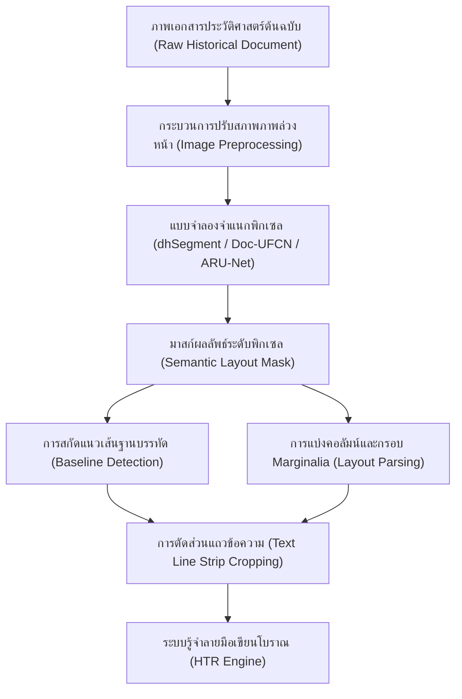

กระบวนการรู้จำข้อความลายมือเขียนโบราณหรือการถอดความเอกสารประวัติศาสตร์ด้วยระบบอัตโนมัติ (Historical Handwritten Text Recognition: HTR) นั้น มิได้เริ่มต้นที่การอ่านตัวเขียนระดับอักขระเป็นขั้นตอนแรก หากแต่ต้องอาศัยการเตรียมความพร้อมและการจัดโครงสร้างเชิงพื้นที่ของภาพถ่ายเอกสารเหล่านั้นอย่างเป็นระบบ ขั้นตอนสำคัญที่เป็นตัวกำหนดความสำเร็จหรือล้มเหลวของการอ่านข้อความคือ การวิเคราะห์โครงสร้างเอกสารประวัติศาสตร์ (Document Layout Analysis: DLA) ซึ่งทำหน้าที่ในการจำแนกแยกแยะพื้นที่ข้อมูลที่เป็นภาพประกอบ ตาราง ขอบหน้ากระดาษ และโดยเฉพาะอย่างยิ่งคือการตรวจจับแนวเส้นฐานบรรทัดเพื่อการสกัดภาพแถวตัวเขียน (Text Line Segmentation) ออกมาป้อนให้แก่ตัวแบบการรู้จำตัวอักษร หากปราศจากระบบวิเคราะห์เค้าโครงที่เปี่ยมประสิทธิภาพ การถอดความเอกสารโบราณย่อมไม่สามารถดำเนินไปได้เนื่องจากระบบเอไอจะไม่เข้าใจลำดับการอ่านและการจัดวางโครงร่างที่มีความหลากหลายของเอกสารประวัติศาสตร์

การวิเคราะห์โครงร่างนี้เชื่อมต่อโดยตรงกับกระบวนการบูรณะสภาพเอกสารและการจัดการสภาพภาพล่วงหน้าในบทที่ 6 หลังจากที่ตัวแบบปฏิปักษ์กำเนิด (GANs) หรือตัวแบบการแพร่กระจายเชิงน่าจะเป็น (Diffusion Models) ทำการบูรณะพิกเซลที่ชำรุดทรุดโทรมและฟื้นฟูสภาพหมึกเขียนที่จางหายให้กลับคืนมาคมชัดแล้ว ขั้นตอนการวิเคราะห์เค้าโครงจะรับช่วงต่อในการสแกนพื้นที่สองมิติของหน้าเอกสารเพื่อจำแนกพิกเซลเหล่านั้นออกตามหน้าที่การทำงาน

> [!WARNING]
> ในทางวิชาการ มนุษยศาสตร์ดิจิทัลต้องการกระบวนการวิเคราะห์โครงร่างที่มีความเที่ยงตรงสูงเพื่อป้องกันข้อผิดพลาดเชิงโครงสร้างสะสม (Error Propagation) ซึ่งมักเกิดขึ้นเมื่อข้อความที่มีเค้าโครงซับซ้อนถูกส่งเข้าไปอ่านโดยตรงโดยไม่มีการกำหนดขอบเขตระนาบที่ถูกต้อง

บทเรียนนี้จึงมุ่งอภิปรายสถาปัตยกรรมระดับลึกและแนวคิดทางวิทยาการคอมพิวเตอร์ที่ได้รับการออกแบบมาเฉพาะเพื่อแก้ไขปัญหาดังกล่าว โดยครอบคลุมถึงการทำความเข้าใจลักษณะทางอักษรวิทยาและเค้าโครงโบราณ แบบจำลองการแบ่งส่วนระดับพิกเซลด้วยโครงข่ายประสาทเชิงลึก ตลอดจนโมเดลมัลติโมดอลที่รวมความเข้าใจภาพและภาษาเข้าไว้ด้วยกันอย่างเป็นระบบ

---

## 7.1 การวิเคราะห์โครงสร้างเอกสารประวัติศาสตร์ (Document Layout Analysis: DLA)

การวิเคราะห์โครงสร้างเอกสารประวัติศาสตร์ (**Document Layout Analysis: DLA**) เป็นขั้นตอนวิธีที่มุ่งเน้นการตรวจจับและแบ่งส่วนเชิงพื้นที่ภายในหน้าเอกสารเพื่อแยกแยะระหว่างส่วนที่เป็นพิกเซลข้อความและส่วนที่ไม่ใช่ข้อความ ตลอดจนจัดกลุ่มเนื้อหาตามหน้าที่เชิงโครงสร้าง เช่น คอลัมน์ บันทึกย่อ และขอบเขตหน้ากระดาษ ในขณะที่เอกสารพิมพ์ในยุคปัจจุบันมีโครงสร้างที่เป็นระเบียบเรียบร้อยและมีลักษณะการจัดพิมพ์ที่คงเส้นคงวา เอกสารประวัติศาสตร์และจดหมายเหตุโบราณกลับเต็มไปด้วยปัญหาเฉพาะตัวที่เป็นความท้าทายอย่างยิ่งต่อนักวิจัยระบบการมองเห็นของคอมพิวเตอร์ (**Computer Vision**)

ปัญหาแรกที่เป็นอุปสรรคสำคัญในการวิเคราะห์เค้าโครงคือ การเขียนบันทึกแทรกขอบกระดาษ หรือที่เรียกในทางวิชาการว่า บันทึกขอบกระดาษ (*Marginalia*) ซึ่งปรากฏอยู่อย่างแพร่หลายในคัมภีร์ใบลาน สมุดไทยดำ สมุดข่อย หรือบันทึกจดหมายเหตุยุคกลางของตะวันตก บันทึกขอบกระดาษเหล่านี้มักเขียนขึ้นภายหลังโดยผู้อ่านหรือผู้คัดลอกรายอื่น มีลักษณะลายมือเขียนที่มีขนาดเล็กกว่าเนื้อหาหลักอย่างชัดเจน และส่วนใหญ่มักถูกเขียนในทิศทางเอียง ทแยงมุม หรือแม้กระทั่งเขียนในแนวตั้งฉากกับบรรทัดปกติ เพื่อใช้สอยพื้นที่ขอบกระดาษอันจำกัด การเขียนแทรกในหลายมิตินี้ทำให้อัลกอริทึมแบ่งขอบเขตบรรทัดแบบดั้งเดิมที่พึ่งพาการสแกนแนวระนาบ (*Projection Profiles*) ล้มเหลวโดยสิ้นเชิง เนื่องจากแนวเส้นฉายแสงของข้อความหลักจะถูกตัดขวางและรบกวนโดยพิกเซลของบันทึกขอบกระดาษดังกล่าว ตัวเขียนเหล่านี้บางครั้งถูกเขียนด้วยน้ำหมึกคนละชนิดหรือมีทิศทางการลากเส้นเอียงทำมุมต่างไปจากโครงสร้างบรรทัดหลัก ซึ่งต้องการระบบตรวจจับที่สามารถแยกแยะขอบเขตลายมือเขียนได้หลายแนวการวางตัวในคราวเดียว

นอกจากนี้ เอกสารโบราณมักประดับตกแต่งด้วยอักษรประดับวิจิตรเริ่มต้นตอน (*Drop Caps* หรือ *Initial Letters*) ซึ่งเป็นสัญลักษณ์อักษรขนาดใหญ่ที่มีความสวยงาม มักปรากฏที่จุดเริ่มต้นของบทเรียนหรือตอนใหม่ เส้นสายลายแปรงของอักษรประดับเหล่านี้มักถูกเขียนให้เกยทับลายเส้นเขียนอื่นที่อยู่แวดล้อม หรือมีรายละเอียดของภาพวาดประกอบจำพวกพืชพรรณ สัตว์ หรือเทวดา พันเกี่ยวเข้ากับพิกเซลของตัวอักษรถัดไป ปัญหาการเกยทับลายเส้นเขียน (*Overlapping Strokes*) นี้ส่งผลให้ตัวแบบรู้จำสับสนระหว่างขอบเขตของอักษรประดับวิจิตรกับตัวหนังสือปกติ ทำให้อัลกอริทึมการแบ่งส่วนบรรทัดตัดคาบเกี่ยวเอาเศษเสี้ยวของอักษรประดับไปรวมกับบรรทัดแรก หรือเกิดข้อผิดพลาดในการรู้จำตัวเขียนเนื่องจากข้อมูลโครงสร้างของเส้นอักขระปะปนกัน อีกทั้งสไตล์อักษรวิจิตรที่มีความหลากหลายอย่างยิ่งตามตระกูลช่างศิลป์ประวัติศาสตร์ ยังทำให้แบบจำลองการจำแนกพิกเซลภาพที่ไม่ได้ผ่านการฝึกสอนด้วยข้อมูลอักษรประดับวิจิตรเกิดความเข้าใจคลาดเคลื่อนและระบุพื้นที่ดังกล่าวเป็นเพียงภาพประกอบไร้ความหมาย แทนที่จะรู้ว่าเป็นพิกเซลของอักขระเริ่มต้นคำเขียน

ในแง่ของโครงสร้างเค้าโครงเอกสาร จดหมายเหตุทางประวัติศาสตร์หลายฉบับ เช่น ทะเบียนสำมะโนประชากร รายงานการบัญชีการค้า หรือบันทึกการพิจารณาคดีความ มักมีการจัดวางเนื้อหาในลักษณะหลายคอลัมน์กึ่งตารางโดยปราศจากเส้นแบ่งตารางที่ชัดเจน (*Ruling Lines*) การกำหนดพื้นที่พิกเซลสำหรับข้อมูลกึ่งตารางนี้ต้องอาศัยกลไกการเรียนรู้ที่สามารถจดจำการเว้นระยะห่างเชิงพื้นที่ (*Whitespace*) และความต่อเนื่องเชิงความหมายของคอลัมน์ได้เองโดยธรรมชาติ หากโมเดลแบ่งแถวข้อมูลผิดพลาดข้ามคอลลัมน์ จะส่งผลให้ข้อความสองคอลัมน์ที่อยู่ขนานกันถูกอ่านรวมกันเป็นบรรทัดเดียวในแนวนอน ซึ่งจะทำลายโครงสร้างความหมายดั้งเดิมของเอกสารลงอย่างสิ้นเชิง ความสลับซับซ้อนนี้ยังทวีความท้าทายมากขึ้นในเอกสารที่เป็นรายงานการค้าโบราณของระบบจดหมายเหตุฝรั่งเศส (HIMANIS) หรือจดหมายเหตุโปรตุเกส (iForal) ซึ่งแต่ละหน้ามีโครงร่างคอลัมน์ผันแปรไปตลอดเล่มโดยขึ้นอยู่กับประเภทข้อมูลที่บันทึกในวันนั้น ๆ

ความเสื่อมสภาพเชิงกายภาพและความผิดเพี้ยนเชิงทัศน์ก็เป็นปัญหาสำคัญที่ไม่อาจหลีกเลี่ยงได้ เอกสารโบราณมักผ่านการเก็บรักษาในสภาพแวดล้อมที่ไม่เหมาะสมเป็นเวลานาน ทำให้ตัววัสดุมีความโค้งงอ ย่น หรือหดตัว ส่งผลให้เกิดความลาดเอียงและความโค้งงอของแนวบรรทัดตัวเขียน (*Skewness and warping*) เมื่อนำมาถ่ายภาพดิจิทัล การจัดตำแหน่งของกล้องหรือความหนาของสมุดปกแข็งที่กางออกได้ยากยังเป็นปัจจัยกระตุ้นให้เส้นบรรทัดในภาพถ่ายบิดเบี้ยวและมีความโค้งเป็นเส้นซายน์ (*Sinusoidal warping*) การแบ่งส่วนบรรทัดด้วยกรอบสี่เหลี่ยมผืนผ้า (*Bounding Box Segmentation*) บนภาพที่มีลักษณะไร้ความเป็นเส้นตรงเชิงระนาบนี้ จะทำให้เกิดการตัดภาพบรรทัดที่ขาดส่วนต้นหรือส่วนปลาย หรือตัดคาบเอาข้อมูลจากบรรทัดบนและล่างปะปนเข้ามาในแถบภาพเดียวกัน [1](#fn-ch7-1) การโค้งงอของหน้าเอกสารยังก่อให้เกิดเงาและระดับสีผิวของวัสดุที่เปลี่ยนแปลงไปทั่วพื้นผิวหน้ากระดาษ ซึ่งไปปิดบังเส้น *Baseline* และทำให้ขอบแนวข้อความหลักจางหายไปในระดับทัศน์สายตาของคอมพิวเตอร์

ผลกระทบของการจัดวางเค้าโครงที่ผิดพลาดนี้ส่งผลเสียโดยตรงและรุนแรงต่อระบบ HTR ในลำดับถัดไป เนื่องจากโมเดลถอดความประเภทลำดับสู่ลำดับ (*Sequence-to-Sequence Models*) เช่น โครงข่ายแบบทรานส์ฟอร์เมอร์หรือหน่วยความจำจดจำระยะสั้นยาว (*LSTM*) ได้รับการฝึกสอนให้อ่านภาพแถบข้อความทีละแถวตามลำดับการเขียน เมื่อแถบภาพที่ป้อนเข้าไปมีชิ้นส่วนอักขระจากบรรทัดอื่นปะปนเข้ามา โมเดลจะพยายามแปลผลพิกเซลแปลกปลอมเหล่านั้นให้ออกมาเป็นคำ ส่งผลให้อัตราความผิดพลาดระดับอักขระ (*Character Error Rate: CER*) และอัตราความผิดพลาดระดับคำ (*Word Error Rate: WER*) สูงขึ้นอย่างรวดเร็ว แม้ว่าโมเดล HTR นั้นจะมีความสามารถในการอ่านลายมือเขียนที่ยอดเยี่ยมเพียงใดก็ตาม การจัดการขั้นเตรียมการ DLA จึงเปรียบเสมือนรากฐานสำคัญของการวางแนวระบบวิเคราะห์ลายมือเขียนประวัติศาสตร์

---

## 7.2 สถาปัตยกรรมเพื่อการจำแนกพิกเซลและการตัดแบ่งหน้า (Page and Line Segmentation)

เมื่อปัญหาของเอกสารประวัติศาสตร์มีความซับซ้อนเกินกว่าที่อัลกอริทึมประมวลผลภาพขั้นพื้นฐานจะจัดการได้ นักวิจัยในแวดวงวิทยาการคอมพิวเตอร์จึงหันมาใช้แบบจำลองเชิงลึกเพื่อระบุจำแนกประเภทพิกเซลในระดับความหมาย (**Semantic Segmentation**) สถาปัตยกรรมระดับแนวหน้าที่ได้รับการออกแบบมาเพื่อแก้ปัญหานี้และได้รับการยอมรับอย่างกว้างขวางในฐานะโมเดลอเนกประสงค์สำหรับวิจัยด้านมนุษยศาสตร์ดิจิทัลคือ **dhSegment** [2](#fn-ch7-2)

**dhSegment** ถูกออกแบบขึ้นมาภายใต้สมมติฐานที่ว่า ปัญหาต่าง ๆ ในการวิเคราะห์โครงสร้างเอกสารประวัติศาสตร์สามารถแปลงให้อยู่ในรูปของการจำแนกประเภทพิกเซลระดับภาพได้ (Pixel-level Classification Task) สถาปัตยกรรมของ **dhSegment** พึ่งพาโครงสร้างแบบ **U-Net** ซึ่งเป็นโครงข่ายประสาทเทียมแบบเข้ารหัสและถอดรหัส (**Encoder-Decoder**) ร่วมกับตัวเข้ารหัสกระดูกสันหลัง (Backbone Encoder) ที่ใช้ **ResNet50** ซึ่งผ่านการฝึกฝนล่วงหน้าบนชุดข้อมูลรูปภาพขนาดใหญ่ (**ImageNet**) โครงสร้าง **U-Net** ทำหน้าที่หลักในการผสานฟีเจอร์ระดับต่ำ (Low-level features) เช่น ทิศทางและขอบของเส้นเขียนเข้ากับฟีเจอร์ระดับสูง (High-level semantic features) เพื่อการพยากรณ์ที่แม่นยำในระดับพิกเซลผ่านการเชื่อมต่อข้ามฝั่ง (**Skip Connections**)

การทำงานของตัวเข้ารหัส **ResNet50** ใน **dhSegment** จะทำการย่อขนาดภาพแบบลดระดับพิกเซล (Downsampling) เพื่อดึงฟีเจอร์เชิงโครงสร้างในมุมกว้าง จากนั้นในส่วนตัวถอดรหัส **U-Net** จะทำหน้าที่ขยายขนาดภาพกลับคืน (Upsampling) ขึ้นมาทีละขั้น โดยการเชื่อมต่อข้ามฝั่ง (**Skip Connections**) จะนำข้อมูลที่มีความคมชัดสูงจากชั้นเริ่มต้นของการสกัดลักษณะป้อนมาสมทบโดยตรง เพื่อรักษารายละเอียดเชิงพิกเซลที่บอบบาง เช่น ความกว้างและพิกัดที่ละเอียดของเส้นบรรทัด ไม่ให้เลือนหายไปในระหว่างขั้นตอนวิเคราะห์เชิงลึก นอกจากนี้ ในขั้นตอนการฝึกสอนระบบจำแนกพิกเซลที่มีระดับพิกเซลเป้าหมายไม่สมดุล (*Class Imbalance*) ตัวอย่างเช่น พิกเซลเส้น Baseline ที่เป็นเพียงเส้นขีดขนาดเล็กท่ามกลางพิกเซลพื้นหลังกระดาษสีขาวขนาดใหญ่ **dhSegment** ได้ประยุกต์ใช้ฟังก์ชันการสูญเสียร่วม (Joint Loss Function) ที่ผสานระหว่าง `Cross-Entropy Loss` และ `Dice Loss` เข้าด้วยกัน เพื่อบังคับให้ตัวแบบให้ความสำคัญกับการปรับน้ำหนักการเรียนรู้ที่พิกเซลเป้าหมายขนาดเล็กอย่างเที่ยงตรง

กระบวนการทำนายผลของ **dhSegment** จะสร้างหน้ากากพิกเซล (Probability Maps) สามช่องสัญญาณหลักเพื่อใช้ในการวิเคราะห์หน้าเอกสาร:
1.  **ช่องสัญญาณขอบเขต (Boundary Detection):** ใช้ระบุแนวขอบกระดาษ ขอบคอลัมน์ หรือแนวกรอบข้อความ
2.  **ช่องสัญญาณข้อความหลัก (Text Area Detection):** ทำหน้าที่ตีกรอบบริเวณที่มีอักษรหนาแน่นเพื่อกันพื้นที่ว่าง
3.  **ช่องสัญญาณแนวเส้นฐานบรรทัด (Baseline Detection):** เป็นหัวใจสำคัญของโมเดล โดยจะพยากรณ์พิกเซลที่เป็นจุดรองรับใต้แนวเขียนของอักษรแต่ละบรรทัด (Baselines)

> [!NOTE]
> การเลือกจับคู่แนวบรรทัดที่จุดใต้ฐานอักษร (Baseline) แทนการใช้กรอบสี่เหลี่ยมผืนผ้า (Bounding Box) ช่วยให้ระบบมีความทนทานสูงต่อความบิดเบี้ยวโค้งงอและความแปรผันของความสูงของตัวอักษรแต่ละตัวในเอกสารโบราณ

นอกเหนือจาก **dhSegment** แล้ว ยังมีแบบจำลองเชิงลึกอื่น ๆ ที่ได้รับการพัฒนาขึ้นเพื่อเพิ่มประสิทธิภาพและความคงทนในการสกัดแนวเส้นบรรทัดเอกสารประวัติศาสตร์ ได้แก่ **Doc-UFCN** และ **ARU-Net** แบบจำลองเหล่านี้ถูกนำมาศึกษาเปรียบเทียบในแง่ของประสิทธิภาพเชิงโครงสร้างและการโอนถ่ายเรียนรู้ข้ามภาษาโบราณ (Generalization Capacity) โดยมีรายละเอียดทางเทคนิคที่แตกต่างกันดังนี้:

*   **Doc-UFCN** (*Fully Convolutional Network for Document Analysis*): พัฒนาขึ้นโดยเน้นการลดขนาดของพารามิเตอร์และการใช้พลังการประมวลผลที่ประหยัดขึ้นเมื่อเทียบกับ **U-Net** ทั่วไป แบบจำลองนี้ใช้โครงข่ายประสาทคอนโวลูชันแบบเต็มรูปแบบ (Fully Convolutional Network) ที่สกัดฟีเจอร์อย่างรวดเร็วและใช้ตัวถอดรหัสที่เรียบง่ายเพื่อลดระยะเวลาในการประมวลผลภาพเอกสารขนาดใหญ่ ผลการศึกษาของบอยเลต์ (Boillet) และคณะ ชี้ให้เห็นว่า **Doc-UFCN** สามารถวิเคราะห์โครงร่างได้อย่างรวดเร็วและมีความเสถียรสูง เหมาะสำหรับการใช้งานกับคลังเอกสารประวัติศาสตร์ขนาดล้านหน้ากระดาษที่มีรูปแบบโครงสร้างใกล้เคียงกัน [3](#fn-ch7-3)
*   **ARU-Net** (*Attention Regularized U-Net*): เป็นสถาปัตยกรรมที่นำเอากลไกความสนใจ (*Attention Gates*) มาร่วมผสานเข้ากับโครงข่าย **U-Net** แบบดั้งเดิม พร้อมกับการเพิ่มโมดูลกำหนดสเกลและปรับสมดุล (*Regularization*) เพื่อป้องกันไม่ให้ข้อมูลสูญหายในระหว่างการส่งผ่านโครงข่ายประสาทที่ลึกขึ้น จุดเด่นของ **ARU-Net** คือความสามารถในการแยกแยะแนวเส้นบรรทัดที่เขียนเบียดเสียดกันอย่างหนาแน่นและรอยหมึกหยดเปื้อนที่อาจพาดผ่านระหว่างบรรทัด กลไก Attention จะคอยกรองพิกเซลแปลกปลอมและเน้นย้ำน้ำหนักการเรียนรู้ไปที่เส้นทางเชื่อมโยงทางเรขาคณิตของอักษรเขียน ส่งผลให้ได้เส้นฐานบรรทัดที่ต่อเนื่องและปราศจากการขาดตอนของข้อมูลพิกเซล [4](#fn-ch7-4)

การเปรียบเทียบเชิงลึกแสดงให้เห็นว่า ในกรณีการโอนถ่ายการเรียนรู้ (**Transfer Learning**) จากชุดข้อมูลเอกสารตะวันตกไปยังชุดข้อมูลอักขระที่ไม่ใช่ละติน (เช่น คัมภีร์ใบลานอักษรขอมหรืออักษรธรรมล้านนา) แบบจำลองที่ผสานข้อมูลหลายสเกลและการจำกัดกรอบความสนใจอย่าง **ARU-Net** จะให้ผลลัพธ์เชิงบวกและเกิดข้อผิดพลาดในการคาดการณ์ตำแหน่งบรรทัดน้อยกว่า เนื่องจากตัวแบบมีความทนทานต่อรูปแบบการลากหางอักษรขึ้นลงตามแนวดิ่ง (*Ascenders and Descenders*) ที่มีความยาวมากเป็นพิเศษในระบบเขียนเอเชียใต้และเอเชียตะวันออกเฉียงใต้ ซึ่งเป็นปัจจัยหลักที่มักดึงดูดให้เส้น Baseline ของ **dhSegment** บิดเบี้ยวผิดรูป [5](#fn-ch7-5)

เมื่อแบบจำลองเหล่านี้วิเคราะห์ภาพและทำนายผลลัพธ์ออกมาเป็นแผนผังมาสก์พิกเซลแล้ว ขั้นตอนถัดมาคือการสกัดเอาแนวเส้น Baseline ออกมาเป็นข้อมูลคณิตศาสตร์เพื่อตัดหน้ากระดาษออกเป็นแถบภาพย่อย ๆ กระบวนการนี้เริ่มต้นจากการหาโครงร่างพิกเซล (*Skeletonization*) ผ่านกระบวนการทางคณิตศาสตร์สัณฐานวิทยา (*Mathematical Morphology*) เพื่อบีบพิกเซล Baseline ที่มีความหนาให้กลายเป็นเส้นที่มีความกว้างเพียงพิกเซลเดียว จากนั้นจึงใช้อัลกอริทึมการค้นหาและการจัดกลุ่มเส้นทาง (เช่น อัลกอริทึม `A*` search หรือการตรวจจับจุดยอดเชิงพิกเซลสูงสุดเฉพาะส่วน หรือ *Local Maxima Detection*) เพื่อเชื่อมต่อพิกเซลที่กระจัดกระจายให้กลายเป็นเส้นต่อเนื่องที่ระบุพิกัด $(x, y)$ ตลอดแนวบรรทัด เมื่อได้เส้นประชิดเหล่านั้นมาแล้ว ระบบจะประเมินความสูงของบรรทัดโดยรอบเพื่อสร้างโพลีกอนคลุมรอบตัวอักษร (*Polygonal Line Strip*) แล้วทำการดึงภาพภายในพื้นที่โพลีกอนนั้นออกมาแผ่ออกเป็นแนวตรง (*Dewarping* and *Cropping*) วิธีการตัดแถบภาพตามแนว Baseline โค้งนี้ช่วยปกป้องความสมบูรณ์ของโครงสร้างสัณฐานอักขระ ส่งผลให้ตัวแบบ HTR ในกระบวนการถัดไปสามารถอ่านและแปลรหัสอักษรได้อย่างเต็มประสิทธิภาพสูงสุด

---

## 7.3 สถาปัตยกรรมผสานภาพและการจัดวางด้วย LayoutLM

แม้ว่าแบบจำลองจำแนกพิกเซลภาพ เช่น **dhSegment** หรือ **U-Net** จะมีความยอดเยี่ยมในการวิเคราะห์ทางกายภาพและแยกแยะตำแหน่งบรรทัดบนหน้าเอกสารประวัติศาสตร์ แต่ขีดจำกัดสูงสุดของแบบจำลองเหล่านี้คือการมองเห็นเพียงข้อมูลเชิงภาพพิกเซล (**Visual Features**) โดยปราศจากความเข้าใจด้านภาษาศาสตร์และความสัมพันธ์เชิงความหมายของคำในพื้นที่เอกสาร (**Spatial-Semantic Relations**) สำหรับเอกสารประวัติศาสตร์ที่มีการระบุข้อมูลในลักษณะกึ่งตาราง บันทึกการเงินจดหมายเหตุ ทะเบียนหลวง หรือทะเบียนคุมราษฎร ซึ่งข้อมูลในแต่ละหน้ามีความสัมพันธ์กันทั้งในแนวดิ่งและแนวราบ การสกัดตัวอักษรแยกออกมาทีละบรรทัดด้วยระบบ OCR-HTR ทั่วไป มักทำลายความสัมพันธ์เชิงโครงสร้างของข้อมูลและสูญเสียมิติด้านบริบทดั้งเดิมไป

เพื่อเชื่อมช่องว่างระหว่างการสกัดข้อความและการทำความเข้าใจข้อมูลเชิงโครงสร้าง นักวิจัยของไมโครซอฟท์จึงได้เสนอสถาปัตยกรรม **LayoutLM** [6](#fn-ch7-6) ซึ่งเป็นตัวแบบที่ผ่านการฝึกฝนล่วงหน้า (*Pre-trained Model*) เพื่อจำลองการเข้าใจภาพและโครงสร้างเอกสารโดยการหลอมรวมข้อมูลสามมิติเข้าด้วยกันในโครงข่ายทรานส์ฟอร์เมอร์แบบหลายหัวข้อความสนใจ (*Multi-Head Self-Attention*) ข้อมูลหลักสามมิติที่หลอมรวมประกอบด้วย:

1.  **ข้อมูลข้อความ (Text Embedding):** โทเคนคำที่ได้จากการอ่านด้วยตัวแบบ HTR-OCR ขั้นพื้นฐาน เพื่อให้แบบจำลองรู้จำบริบททางภาษาศาสตร์และความหมายของคำในประโยค
2.  **ข้อมูลตำแหน่งเชิงพื้นที่แบบ 2 มิติ (2D Position Embedding):** พิกัดกล่องขอบเขต $(x_{min}, y_{min}, x_{max}, y_{max})$ ของโทเคนคำนั้น ๆ บนหน้ากระดาษ โดยพิกัดจะถูกปรับสเกล (Normalization) ให้อยู่ในช่วงจำนวนเต็มระหว่าง 0 ถึง 1000 เพื่อให้คงเส้นคงวาไม่ว่าจะใช้ภาพความละเอียดเท่าใด การป้อนพิกัดนี้ทำให้โมเดลสามารถเรียนรู้ระยะห่างและตำแหน่งการจัดวางระหว่างคำ เช่น คำว่า "ชื่อ" และคำว่า "นามสกุล" ที่ควรจะตั้งอยู่ชิดกันหรืออยู่บนแนวพิกัดระนาบเดียวกันในแนวตั้ง การคำนวณเวกเตอร์ตำแหน่งจะใช้ตารางฝังตัวเฉพาะแกน X และ Y (X-axis and Y-axis Embedding Lookup Tables) ซึ่งทำให้แบบจำลองสามารถรับรู้ทัศนคติเชิงพื้นที่และการจัดแนวแนวราบแนวดิ่งได้อย่างแม่นยำ
3.  **ข้อมูลลักษณะเชิงทัศน์พิกเซล (Visual Embedding):** ลักษณะฟีเจอร์เด่นของบริเวณพื้นที่รอบตัวอักษรที่สกัดมาจากโมเดลตรวจจับวัตถุ (เช่น โครงข่าย Faster R-CNN หรือ Vision Transformer) ข้อมูลภาพพิกเซลนี้จะช่วยระบุโครงสร้างทางกายภาพ เช่น รูปแบบฟอนต์ ลายเส้นเขียนที่หนาบาง หรือการมีอยู่ของสัญลักษณ์กรอบตารางที่ล้อมรอบคำนั้น ๆ

วิวัฒนาการของ LayoutLM ได้ก้าวผ่านระดับโครงสร้างการผสานฟีเจอร์อย่างต่อเนื่องเพื่อให้ตอบสนองต่อปัญหาเอกสารประวัติศาสตร์ที่มีระดับความยากสูง:

*   **LayoutLM v1 (2020):** ริเริ่มการนำโครงสร้าง **2D Position Embedding** มาใช้งานร่วมกับ **Text Embedding** โดยมีข้อมูลภาพเชิงทัศน์ (**Visual Embedding**) เข้ามาผสานร่วมในกระบวนการประเมินรอบสุดท้าย (*Late Fusion*) เพื่อทำนายผลลัพธ์ของลักษณะเอกสาร [7](#fn-ch7-7)
*   **LayoutLM v2 (2021):** พัฒนาขึ้นโดยการผสานการเรียนรู้ร่วมระหว่างบริบทภาพและบริบทข้อความตั้งแต่ช่วงฝึกสอนโมเดลล่วงหน้า (*Early Fusion*) ผ่านกลไกความสนใจร่วมกันหลายสื่อ (*Multimodal Self-Attention*) ช่วยให้โมเดลเข้าใจความสัมพันธ์ของคำและตำแหน่งภาพตั้งแต่โครงข่ายระดับแรกเริ่ม
*   **LayoutLM v3 (2022):** ละทิ้งโครงสร้างดึงข้อมูลภาพแบบ **Faster R-CNN** ที่มีปัญหาสิ้นเปลืองพลังคำนวณและขั้นตอนประมวลผลที่เชื่องช้า โดยหันมาประยุกต์ใช้ **Linear Projection** ของแพทช์ภาพ (*Visual Patches*) แบบเดียวกับที่ปรากฏใน **Vision Transformer** (**ViT**) ทำให้โมเดลรองรับการประมวลผลที่เบาและเร็วกว่าเดิม เหมาะสมเป็นอย่างยิ่งกับระบบวิจัยประวัติศาสตร์ที่ต้องการประยุกต์ใช้งานบนทรัพยากรคำนวณระดับสถานศึกษาหรืออุปกรณ์ระดับกลาง

การประมวลผลเชิงบูรณาการข้อมูลสามมิตินี้แสดงให้เห็นถึงพัฒนาการที่สำคัญเหนือกว่าอัลกอริทึมจำแนกพิกเซลภาพเพียงอย่างเดียวในงานทำความเข้าใจเอกสาร:

| คุณลักษณะเปรียบเทียบ | อัลกอริทึมวิเคราะห์พิกเซลภาพ (**dhSegment** / **U-Net**) | สถาปัตยกรรมผสานภาพและการจัดวาง (**LayoutLM**) |
|:---|:---|:---|
| **ประเภทของข้อมูลที่รับเข้า** | ข้อมูลระดับพิกเซลของภาพถ่ายเอกสารเท่านั้น | ข้อมูลพิกเซลภาพ + ข้อความถอดความ + พิกัดเชิงพื้นที่ 2 มิติ |
| **ขอบเขตการรับรู้ (Domain)** | ระดับวิสัยทัศน์ทางคอมพิวเตอร์ (Computer Vision) | สหวิทยาการระหว่างภาพ ภาษา และเรขาคณิต (Multimodal NLP) |
| **ความเข้าใจเชิงโครงสร้าง** | แยกแยะขอบเขตทางกายภาพได้ดี (เช่น กรอบ เส้น บรรทัด) | เข้าใจความสัมพันธ์เชิงหน้าที่ (เช่น คีย์-คู่ค่าข้อมูล, ประเภทเอกสาร) |
| **การประยุกต์ใช้ตาราง/แบบฟอร์ม** | ตัดกล่องตารางได้ แต่อ่านความสัมพันธ์ระหว่างเซลล์ไม่ได้ | เชื่อมโยงข้อมูลในแนวนอนและแนวดิ่งตามความสัมพันธ์ตารางได้แม่นยำ |
| **ความยืดหยุ่นต่อความเสื่อมสภาพ** | อาจระบุตำแหน่งผิดพลาดหากขอบเขตเส้นของเอกสารจางหาย | ใช้ข้อมูลบริบททางภาษาแวดล้อมมาช่วยชดเชยตรรกะตำแหน่งข้อมูลได้ |

ในการประยุกต์ใช้งานจริงกับจดหมายเหตุราชการหรือทะเบียนประชากรประวัติศาสตร์ **LayoutLM** ช่วยให้ระบบประมวลผลข้อความสามารถจดจำหน้าที่ความสำคัญของข้อมูลได้ทันที เช่น เมื่อเจอกรอกค่าตัวเลขที่ตำแหน่งพิกัดหนึ่ง ตัวแบบจะเชื่อมโยงความรู้เชิงพื้นที่เพื่อระบุว่า ตัวเลขดังกล่าวคือพิกัดของ "จำนวนเงินภาษี" หรือ "ปีคริสต์ศักราช" โดยคำนวณจากความสัมพันธ์เชิงตรรกะร่วมกับหัวตารางที่อยู่ห่างออกไปในแนวดิ่ง การฝึกสอน **LayoutLM** สำหรับเอกสารโบราณมักอาศัยกระบวนการเรียนรู้ล่วงหน้าแบบควบคุมตนเอง (*Self-Supervised Pre-training Tasks*) สองส่วนหลักคือ:
1.  **Masked Visual-Language Modeling** (**MVLM**): การบดบังโทเคนคำบางส่วนแล้วให้แบบจำลองทำนายคำเหล่านั้นโดยใช้บริบททางตรรกะภาษาและขอบเขตพื้นที่เชิงตำแหน่งที่เหลืออยู่
2.  **Text-Image Alignment** (**TIA**): การวิเคราะห์ความเข้ากันได้ระหว่างชิ้นส่วนรูปภาพอักขระและคำศัพท์ เพื่อให้โมเดลเข้าใจว่าสัณฐานเส้นอักษรกับคำทางภาษาศาสตร์ในตำแหน่งนั้น ๆ มีความเที่ยงตรงไม่คลาดเคลื่อน

การนำสถาปัตยกรรมมัลติโมดอล **LayoutLM** มาประกบใช้งานร่วมกับสถาปัตยกรรมการแบ่งส่วนพิกเซลแบบ **dhSegment** หรือ **Doc-UFCN** ช่วยให้นักวิจัยสามารถสร้างกระบวนการวิเคราะห์ประวัติศาสตร์ที่ราบรื่น โดยใช้โมเดลแบ่งส่วนหาตำแหน่งแถวบรรทัดเพื่อดึงภาพมาให้อ่านเป็นข้อความ จากนั้นจึงนำเอาข้อความที่อ่านได้พร้อมพิกัด **Bounding Box** ดั้งเดิมส่งต่อให้แก่ **LayoutLM** เพื่อจำแนกความหมายแยกแยะประเภทข้อมูลและสร้างไฟล์ตารางข้อมูลเชิงโครงสร้างดิจิทัล (**Digital Structured Databases**) ได้โดยอัตโนมัติ ซึ่งมีประสิทธิภาพในการป้องกันการคลาดเคลื่อนทางประวัติศาสตร์สูงกว่าการวิเคราะห์ระบบเดี่ยวแบบในอดีตอย่างชัดเจน

---

## สรุป

กระบวนการจำแนกและวิเคราะห์โครงร่างเอกสาร (**Document Layout Analysis**) ถือเป็นด่านแรกและปัจจัยชี้วัดความคงทนของระบบเอไอถอดความตัวเขียนโบราณ ความท้าทายทางกายภาพของจดหมายเหตุทางประวัติศาสตร์ ไม่ว่าจะเป็นบันทึกย่อแทรกข้างกระดาษ อักษรประดับตกแต่งวิจิตรที่ทับซ้อนเส้นบรรทัด ตลอดจนความบิดเบี้ยวโค้งงอของหน้าหนังสือ ล้วนเป็นเงื่อนไขที่บีบบังคับให้นักวิจัยคอมพิวเตอร์ต้องพัฒนาแนวทางแก้ปัญหาเชิงลึกที่มีความยืดหยุ่นสูง สถาปัตยกรรมจำแนกพิกเซลอย่าง **dhSegment**, **Doc-UFCN** และ **ARU-Net** แสดงให้เห็นถึงประสิทธิภาพของการประยุกต์ใช้โครงข่าย **U-Net** ร่วมกับกระดูกสันหลังที่ผ่านการฝึกฝนมาอย่างดีในการแบ่งส่วนแบบแผนเส้นบรรทัดและระบุตำแหน่ง **Baseline** แม้ในเอกสารที่มีความชำรุดทรุดโทรมสูง ขณะที่การก้าวผ่านไปสู่ระบบสถาปัตยกรรมมัลติโมดอลอย่าง **LayoutLM** ช่วยยกระดับจากการจดจำพิกเซลกายภาพไปสู่การทำความเข้าใจความสัมพันธ์ของข้อมูลเชิงภาษาและมิติเชิงพื้นที่ ซึ่งเป็นกุญแจสำคัญในการแปลงเอกสารตารางทะเบียนประวัติศาสตร์ไปสู่ฐานข้อมูลวิชาการที่มีคุณภาพสูง

ความรู้ความเข้าใจเกี่ยวกับการวิเคราะห์โครงร่างเอกสารในบทนี้ จะสร้างความคุ้นเคยกับกระบวนการทำงานระดับรากฐานที่สำคัญและนำไปสู่การเชื่อมต่อโครงสร้างระบบ HTR เข้ากับซอฟต์แวร์ประยุกต์ใช้งานในทางปฏิบัติ ในบทที่ 8 ถัดไป เราจะอภิปรายและสาธิตการทำงานของแพลตฟอร์มการถอดความเอกสารโบราณที่นำระบบ DLA และ HTR เหล่านี้มารวมเข้าด้วยกันจนเป็นเครื่องมือหลักของนักวิชาการมนุษยศาสตร์ดิจิทัลในระดับสากล ได้แก่ แพลตฟอร์ม Transkribus และ eScriptorium ซึ่งจะอธิบายโครงสร้างระบบและกระบวนการฝึกฝนโมเดลผ่านเวิร์กโฟลว์การทำงานจริงในระดับผู้ใช้งาน การศึกษาวิจัยและการพัฒนาปรับปรุงสถาปัตยกรรมเหล่านี้จึงถือเป็นรากฐานสำคัญที่ไม่สามารถละเลยได้ในการเปลี่ยนผ่านระบบจดหมายเหตุทางประวัติศาสตร์ไปสู่ยุคดิจิทัลเพื่อการใช้งานที่กว้างขวางและยั่งยืนยิ่งขึ้นในภายภาคหน้า

---

### เชิงอรรถ

[1] Sofia Oliveira, Guillaume Seguin, and Frédéric Kaplan, "dhSegment: A generic deep-learning approach for document segmentation," *arXiv preprint arXiv:1804.10371* (2018).

[2] Oliveira, Seguin, and Kaplan, "dhSegment," 2.

[3] Mélodie Boillet, Christopher Kermorvant, and Thierry Paquet, "Robust Text Line Detection in Historical Documents: Learning and Evaluation Methods," *arXiv preprint arXiv:2203.12346* (2022).

[4] Boillet, Kermorvant, and Paquet, "Robust Text Line Detection," 2.

[5] Boillet, Kermorvant, and Paquet, "Robust Text Line Detection," 3.

[6] Yiheng Xu, Minghao Li, Lei Cui, Shaohan Huang, Furu Wei, and Ming Zhou, "LayoutLM: Pre-training of Text and Layout for Document Image Understanding," in *Proceedings of the 26th ACM SIGKDD International Conference on Knowledge Discovery & Data Mining*, (ACM, 2020), 1192-1200, DOI:10.1145/3394486.3403172.

[7] Xu et al., "LayoutLM," 1192.

