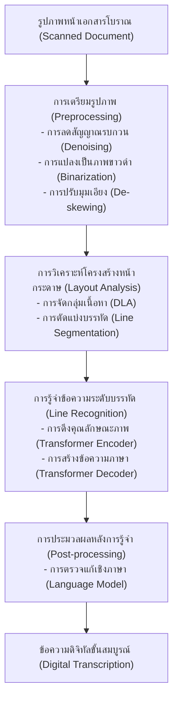
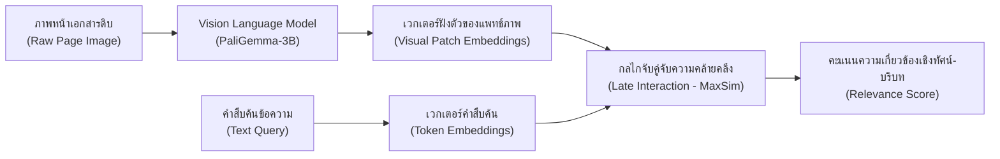

**โปรเจกต์:** Khmer-Thai HTR Handbook  
**ผู้เขียน:** นักวิจัยอาวุโส  
**วันที่:** 7 มิถุนายน 2569  

---

### บทนำ

วิทยาการการแปลงเอกสารประวัติศาสตร์ให้อยู่ในรูปแบบดิจิทัล (Digitalization of Historical Documents) ถือเป็นกุญแจสำคัญในการอนุรักษ์และสืบทอดมรดกทางปัญญาของมนุษยชาติ ทว่าความพยายามในการถอดความและเข้าถึงเนื้อหาภายในเอกสารโบราณมักประสบอุปสรรคสำคัญจากขีดจำกัดของเทคโนโลยีการประมวลผลภาพและการรู้จำอักษรแบบดั้งเดิม ในอดีตระบบการรู้จำอักษรด้วยแสง (Optical Character Recognition: OCR) มุ่งเน้นการแก้ปัญหาการแปลงเอกสารประเภทตัวพิมพ์มาตรฐานที่มีโครงสร้างแบบแผนชัดเจน แต่เมื่อต้องเผชิญกับเอกสารประเภทลายมือเขียน (Handwritten Documents) หรือจารึกบนวัสดุธรรมชาติที่มีความเสื่อมสภาพทางกายภาพสูง เทคโนโลยีดังกล่าวกลับไม่สามารถให้ผลลัพธ์ที่มีความแม่นยำเพียงพอได้ ข้อจำกัดนี้ส่งผลให้เกิดการพัฒนาแนวคิดการรู้จำข้อความลายมือเขียน (Handwritten Text Recognition: HTR) ซึ่งถือเป็นการบูรณาการระดับสูงระหว่างวิทยาการคอมพิวเตอร์ทัศน์ (Computer Vision) และการประมวลผลภาษาธรรมชาติ (Natural Language Processing) เพื่อปฏิวัติกระบวนการแปลงภาพข้อความลายมือเขียนให้กลายเป็นลำดับภาษาเชิงโครงสร้างที่มีความหมาย

การประยุกต์ใช้เทคโนโลยี HTR ในภูมิภาคเอเชียตะวันออกเฉียงใต้ โดยเฉพาะอย่างยิ่งการศึกษาเอกสารโบราณอย่าง "อักษรขอมบนใบลาน" (Palm Leaf Manuscripts) และ "อักษรไทยโบราณบนสมุดข่อย" (Samut Khoi Folding Books) ถือเป็นกรณีศึกษาที่มีความท้าทายทั้งในมิติทางกายภาพและอักขรวิทยา อักขระโบราณเหล่านี้ไม่ได้จัดเรียงตัวตามแนวราบแบบซ้ายไปขวาที่เรียบง่าย แต่มีโครงสร้างอักขรวิธีที่มีความซับซ้อนในเชิงมิติ เช่น การซ้อนทับของพยัญชนะในแนวตั้ง (Vertical Stacking) และการเขียนแบบต่อเนื่องโดยไม่มีการแบ่งวรรคตอนระหว่างคำ (*Scriptio Continua*) คู่มือเล่มนี้จัดทำขึ้นเพื่อนำเสนอแนวคิดทางทฤษฎีและแนวทางปฏิบัติในการสร้างแบบจำลอง HTR สำหรับอักษรโบราณดังกล่าว โดยในบทแรกนี้จะมุ่งเน้นการปูพื้นฐานแนวคิดที่สำคัญ ตั้งแต่วิวัฒนาการของเทคโนโลยี OCR สู่ HTR การวิเคราะห์ปัญหาเฉพาะตัวของเอกสารใบลานขอมและสมุดข่อยไทย ตลอดจนการทำความเข้าใจกระบวนการทำงานสากลของระบบ HTR และแนวโน้มระดับเปลี่ยนผ่านของสถาปัตยกรรมปัญญาประดิษฐ์ในปัจจุบัน เพื่อปูทางสู่การปฏิบัติงานวิจัยและการพัฒนาเชิงลึกในบทถัดๆ ไป

---

## 1.1 จาก OCR สู่ HTR

การทำความเข้าใจความแตกต่างเชิงแนวคิดและสถาปัตยกรรมระหว่าง OCR และ HTR ถือเป็นรากฐานสำคัญในการออกแบบระบบการรู้จำเอกสารโบราณอย่างมีประสิทธิภาพ เทคโนโลยี OCR ยุคแรกเริ่มถูกออกแบบมาเพื่อจัดการกับตัวพิมพ์ (Printed Text) ซึ่งมีคุณลักษณะที่เรียกว่า "การจัดเรียงตามแกนพิกัด" (Grid-aligned) กล่าวคือ อักขระแต่ละตัวในหน้าเอกสารจะถูกจัดพิมพ์ตามตำแหน่งช่องไฟที่แน่นอน มีระยะห่างระหว่างตัวอักษรที่สม่ำเสมอ และมีโครงสร้างรูปแบบฟอนต์ (Font Face) ที่จำกัดและคงเส้นคงวา ระบบ OCR แบบดั้งเดิมจึงสามารถทำงานได้โดยใช้ทฤษฎีการแบ่งส่วนตัวอักษร (Character Segmentation) เป็นรายอักขระเดี่ยว จากนั้นจึงป้อนพิกเซลรูปภาพของอักขระเดี่ยวนั้นเข้าสู่แบบจำลองการจำแนกประเภท (Classification Model) เช่น Convolutional Neural Network (CNN) เพื่อจับคู่กับดัชนีตัวอักษรในระบบคอมพิวเตอร์ วิธีการนี้มีความแม่นยำสูงมากกับเอกสารตัวพิมพ์ยุคปัจจุบัน แต่จะล้มเหลวโดยสิ้นเชิงเมื่อนำมาประยุกต์ใช้กับลายมือเขียน

ในทางตรงกันข้าม ลายมือเขียนของมนุษย์มีคุณลักษณะที่เป็นเอกลักษณ์คือมีความต่อเนื่องและลากเชื่อมโยงกัน (Cursive or Continuous) รูปภาพตัวเขียนลายมือมักจะไม่มีเส้นขอบเขตทางกายภาพที่ชัดเจนระหว่างตัวอักษร ตัวอักษรหนึ่งอาจลากหางไปทับซ้อนหรือเชื่อมต่อกับตัวอักษรถัดไป นอกจากนี้ยังมีข้อจำกัดเรื่องความผันแปรของสัณฐานตัวเขียน ซึ่งเกิดจากความแตกต่างระหว่างบุคคลผู้เขียน (Inter-writer Variation) เช่น ขนาด ความเอียง และน้ำหนักของเส้นเขียน หรือแม้กระทั่งความผันแปรของลายมือคนคนเดียวกันในแต่ละช่วงเวลา (Intra-writer Variation) การพยายามแบ่งส่วนพิกเซลรูปภาพลายมือเขียนออกเป็นตัวอักษรเดี่ยวๆ ก่อนนำไปรู้จำจึงเป็นสิ่งที่เป็นไปไม่ได้ในทางปฏิบัติ เทคโนโลยี HTR จึงต้องพัฒนาขึ้นเพื่อก้าวข้ามขีดจำกัดดังกล่าว โดยปรับเปลี่ยนกรอบความคิดจากการทำ Character-level Segmentation ไปสู่การแปลงภาพบรรทัดข้อความ (Text Line Image) ให้กลายเป็นลำดับของโทเค็นภาษาโดยตรงในลักษณะของการแปลงรูปภาพเป็นลำดับภาษา (Sequence-to-Sequence Image-to-Text Mapping)

สถาปัตยกรรมระบบ HTR ยุคแรกประยุกต์ใช้การทำางานร่วมกันระหว่าง CNN สำหรับสกัดฟีเจอร์เชิงทัศน์ของภาพข้อความ และ Recurrent Neural Network (RNN) โดยเฉพาะ Long Short-Term Memory (LSTM) เพื่อวิเคราะห์ความสัมพันธ์เชิงลำดับตามแนวนอนของแถบภาพ ควบคู่กับการใช้ฟังก์ชันสูญเสีย Connectionist Temporal Classification (CTC) เพื่อทำนายลำดับตัวอักษรโดยไม่ต้องมีการจับคู่ตำแหน่งพิกเซลแบบพรีเมียม อย่างไรก็ดี การปฏิวัติทางเทคโนโลยีในระยะหลังได้นำสถาปัตยกรรมแบบ Transformer เข้ามาแทนที่โครงข่ายประสาทแบบดั้งเดิม โดยแบบจำลองที่เป็นหมุดหมายสำคัญคือ **TrOCR (Transformer-based Optical Character Recognition)** ที่พัฒนาโดย Minghao Li และคณะ (2021) [1] 

TrOCR ก้าวข้ามข้อจำกัดของโครงข่ายประสาทแบบผสมด้วยการใช้สถาปัตยกรรม Transformer บริสุทธิ์แบบ Encoder-Decoder โดยไม่มีส่วนประกอบของ Convolutional Layers หรือ RNNs เลย แบบจำลองนี้แบ่งการทำงานออกเป็นสองส่วนหลัก: ส่วนแรกคือ Image Transformer Encoder ซึ่งประยุกต์ใช้แนวคิด Vision Transformer (ViT) โดยการนำรูปภาพบรรทัดข้อความมาหั่นแบ่งเป็นชิ้นภาพขนาดเล็ก (Image Patches) ที่ไม่ทับซ้อนกัน จากนั้นแปลงพิกเซลของแต่ละชิ้นภาพเป็นเวกเตอร์ฝังตัว (Embeddings) ควบคู่กับการเพิ่ม Position Embeddings เพื่อรักษาตำแหน่งเชิงพื้นที่เชิงทัศน์ ก่อนส่งผ่านโครงข่าย Self-Attention เพื่อเรียนรู้ความเชื่อมโยงเชิงสัณฐานของภาพข้อความทั้งหมด ส่วนที่สองคือ Text Transformer Decoder ซึ่งทำหน้าที่เป็นตัวถอดรหัสแบบสร้างอักขระทีละตัว (Autoregressive Text Generation) โดยรับค่าฟีเจอร์เวกเตอร์จากตัวเข้ารหัสมาประมวลผลผ่านกลไก Cross-Attention ร่วมกับประวัติของโทเค็นอักษรที่สร้างขึ้นก่อนหน้า เพื่อทำนายความน่าจะเป็นของตัวอักษรถัดไปตามบริบททางภาษา แบบจำลองนี้ได้รับการเทรนบนคลังข้อมูลสังเคราะห์ขนาดใหญ่ก่อนจะนำมาปรับจูน (Fine-tuning) กับชุดข้อมูลเฉพาะทาง ทำให้มีความสามารถในการทำความเข้าใจทั้งด้านทัศนศิลป์และบริบททางภาษาไปพร้อมกัน ส่งผลให้ได้ความแม่นยำในการรู้จำลายมือเขียนที่เหนือกว่าแบบจำลองในอดีตอย่างมีนัยสำคัญ

การสร้างแบบจำลอง HTR สำหรับอักษรลายมือเขียนหรือเอกสารโบราณที่มีลักษณะเฉพาะ ย่อมต้องการชุดข้อมูล Ground Truth ที่ผ่านการถอดความอย่างถูกต้องเพื่อใช้ในการฝึกฝนตัวแบบจำลอง ซึ่งการรวบรวมและจัดเตรียมชุดข้อมูลเหล่านี้ต้องการการลงทุนในแง่เวลาและบุคลากรทางภาษาศาสตร์อย่างมาก ดังนั้น มาตรฐานและคลังข้อมูลแบบเปิดจึงมีบทบาทสำคัญในการเร่งรัดงานวิจัย โครงการริเริ่มอย่าง **HTR-United** [2] ถือเป็นแพลตฟอร์มบัญชีรายการข้อมูลร่วมแบบเปิด (Open Collaborative Catalog) สำหรับชุดข้อมูล HTR และ OCR ที่มุ่งเน้นการปฏิบัติตามหลักการ FAIR (Findable, Accessible, Interoperable, and Reusable) โครงการนี้ได้กำหนด Schema รายละเอียดเมทาดาตาของชุดข้อมูลที่เป็นมาตรฐานร่วมกัน เช่น ชนิดอักษร ภาษา ยุคสมัยทางประวัติศาสตร์ และรูปแบบการจัดเก็บ Ground Truth (อาศัยรูปแบบที่เป็นสากล เช่น ALTO XML หรือ PAGE XML) ซึ่งช่วยให้นักวิจัยสามารถแบ่งปันชุดข้อมูลลายมือเขียน ค้นหาข้อมูลที่ตรงตามความต้องการเพื่อนำไปพัฒนาต่อยอด หรือใช้ทำ Transfer Learning เพื่อสร้างโมเดลเริ่มต้นสำหรับอักษรโบราณที่มีชุดข้อมูลขนาดเล็ก ส่งผลให้เกิดระบบนิเวศน์ทางวิชาการที่เกื้อหนุนการพัฒนา HTR ในระดับสากล

---

## 1.2 ความท้าทายหลักทางอักษรวิทยาและกายภาพ

ในการวิจัยพัฒนาแบบจำลอง HTR สำหรับเอกสารโบราณของไทยและกัมพูชา นักวิจัยต้องเผชิญกับอุปสรรคที่มีความจำเพาะเจาะจงสูง ซึ่งสามารถจำแนกออกได้เป็นมิติทางกายภาพของวัสดุที่ใช้บันทึก และมิติทางอักขรวิทยาของตัวอักษร โดยมีรายละเอียดข้อวิเคราะห์ดังต่อไปนี้

### อักษรขอมบนใบลาน (Palm Leaf Manuscripts / Sleuk Rith)

เอกสารใบลานอักษรขอมหรือที่เรียกในภาษากัมพูชาว่า "เสลือกฤทธิ์" (Sleuk Rith) ถือเป็นแหล่งปฐมภูมิที่บันทึกคำสอนทางพระพุทธศาสนาและวรรณกรรมโบราณในภูมิภาคนี้ การออกแบบระบบ HTR เพื่ออ่านใบลานต้องฝ่าฟันอุปสรรคสำคัญดังนี้

**1. ความท้าทายทางกายภาพและการบันทึก:**  
ใบลานเป็นวัสดุอินทรีย์ที่ผลิตจากใบของต้นลาน ซึ่งมีความอ่อนไหวต่อปัจจัยแวดล้อมอย่างยิ่ง เมื่อเวลาผ่านไปหลายร้อยปี ใบลานมักจะแห้งกรอบ เกิดรอยแตกหักตามแนวยาวของเส้นใย พื้นผิวใบลานเปลี่ยนสีเป็นสีน้ำตาลเข้มเนื่องจากปฏิกิริยาออกซิเดชัน เกิดคราบสกปรก เชื้อราจุดดำ และรอยชำรุดจากการกัดแทะของแมลง นอกจากนี้ กระบวนการจารอักษรลงบนใบลานจะใช้เหล็กจาร (Stylus) ขูดลึกลงไปบนเนื้อลานให้เกิดรอยร่อง จากนั้นจึงใช้เขม่าไฟผสมน้ำมันยางทาชโลมลงบนใบเพื่อให้เขม่าจับตามรอยขูดขีดเป็นเส้นอักษรดำ ความเข้มของเส้นอักษรจึงแปรผันอย่างมากตามแรงกดของผู้อารักษ์จารและระดับการสึกหรอของเขม่า สัญญาณรบกวนที่สำคัญที่สุดคือ "เส้นใยธรรมชาติของใบลาน" (Natural Fiber Texture) ซึ่งมีลักษณะเป็นลายเส้นขนานในแนวนอนพาดผ่านใบ ลายเส้นธรรมชาตินี้มักจะมีความเข้มของแสงใกล้เคียงกับเส้นอักษรที่จาร ทำให้ขั้นตอนการปรับปรุงภาพและการทำ Binarization ด้วยวิธีสากลเกิดข้อผิดพลาด โดยโมเดลมักจะรับรู้เส้นใยใบลานเป็นส่วนหนึ่งของตัวอักษร ส่งผลให้โครงสร้างอักษรที่สกัดได้ผิดเพี้ยนไป

**2. ความท้าทายทางอักขรวิธี (Orthographical Complexity):**  
อักษรขอมมีพัฒนาการมาจากอักษรปัลลวะในอินเดียใต้ โครงสร้างทางอักขรวิธีมีความซับซ้อนในมิติแนวตั้งเป็นอย่างมาก เนื่องจากมีระบบ **"เชิงอักษร" หรือ พยัญชนะซ้อนในแนวตั้ง (Vertical Stacking of Subscripts)** เมื่อมีคำที่มีพยัญชนะควบกล้ำหรือเป็นตัวสะกด พยัญชนะตัวที่สองจะถูกเขียนเป็นรูปย่อที่เรียกว่าเชิงอักษรไว้ใต้พยัญชนะตัวแรก ตัวอย่างเช่น คำว่า "จิตฺต" (จิต) พยัญชนะ "ต" ตัวสะกดจะอยู่บนเส้นบรรทัดปกติ ส่วน "ต" ตัวตามที่เป็นเชิงอักษรจะถูกห้อยลงมาด้านใต้ การจัดเรียงอักษรจึงไม่เป็นเส้นตรงแนวราบแบบตะวันตก (Non-linear layout) นอกจากนี้ อักษรขอมยังมีระบบสระจมและสระลอยที่ต้องเขียนประกบทั้งด้านหน้า ด้านหลัง ด้านบน หรือด้านล่างของพยัญชนะหลัก ยิ่งไปกว่านั้น เชิงอักษรของบรรทัดบนมักจะมีความยาวที่ยื่นย้อยล้ำลงมาเบียดหรือทับซ้อนกับพระสระบนหรือเครื่องหมายนิคหิตของบรรทัดล่าง (Touching Line Characters) ส่งผลให้ขั้นตอนการตัดแบ่งบรรทัดข้อความ (Line Segmentation) ประสบปัญหาล้มเหลว เนื่องจากระยะห่างระหว่างบรรทัด (Inter-line Spacing) ถูกรบกวนโดยโครงสร้างอักษรแนวตั้ง การประยุกต์ใช้วิธี Projection Profile แบบปกติจึงไม่สามารถแยกบรรทัดได้อย่างสมบูรณ์ นักวิจัยจำเป็นต้องพัฒนาอัลกอริทึมค้นหาเส้นทางที่ปรับตัวได้ เช่น การใช้ Stroke Width Transform และ A* Path Planning เพื่อสร้างแนวแบ่งบรรทัดที่ไม่เป็นเส้นตรงเพื่อหลบเลี่ยงการผ่าตัดตัวอักษร

### อักษรไทยโบราณบนสมุดข่อย (Ancient Thai script on Samut Khoi)

สมุดข่อยหรือสมุดไทยดำ/ขาว เป็นอีกหนึ่งสื่อบันทึกหลักของอารยธรรมไทยโบราณ ซึ่งมีความท้าทายจำเพาะดังต่อไปนี้

**1. ความท้าทายทางกายภาพและการกระจายหมึก:**  
สมุดข่อยผลิตจากเปลือกของต้นข่อย นำมาผ่านกระบวนการต้มและทุบเยื่อจนละเอียด แล้วหล่อเป็นแผ่นกระดาษหนาพับทบไปมาคล้ายหีบเพลง (Concertina style) สมุดไทยดำจะถูกเคลือบผิวด้วยถ่านผสมน้ำแป้งเพื่อให้ผิวหน้าเป็นสีดำสนิท เขียนข้อความด้วยดินสอสอหินขาวหรือน้ำยาหรดาล (ซัลไฟด์ของสารหนูที่มีสีเหลืองทอง) ส่วนสมุดไทยขาวจะมีผิวสีครีมธรรมชาติ เขียนด้วยหมึกเขม่าดำ ปัญหาทางกายภาพที่พบบ่อยคือ สีของวัสดุเขียนซีดจางลงตามเวลา เกิดคราบไขมันจากการหยิบจับ และเกิดรอยพับหักชำรุดตามรอยต่อพับของหน้าสมุด ยิ่งกว่านั้น การเขียนบนสมุดข่อยจะใช้ปากกาหัวแบน (ทำจากไม้ไผ่หรือโลหะ) หรือพู่กัน ทำให้เส้นอักษรมีลักษณะผันแปรตามมุมเอียงของการเขียน เส้นอักษรลายมือบนสมุดข่อยมักมีความหนาบางที่ไม่สม่ำเสมอ ซึ่งเพิ่มความยุ่งยากในการสกัดโครงร่างกระดูกงู (Skeletonization) ของเส้นอักษรเพื่อส่งเข้ากระบวนการรู้จำ

**2. ความท้าทายทางอักขรวิธีและการเขียนต่อเนื่อง:**  
อักษรไทยโบราณที่ปรากฏในสมุดข่อยส่วนใหญ่เขียนด้วยระบบ **"การเขียนแบบต่อเนื่อง" (*Scriptio Continua*)** กล่าวคือ จะเขียนตัวอักษรเชื่อมต่อกันไปเรื่อยๆ โดยไม่มีการเว้นช่องไฟเพื่อแยกคำ การเว้นวรรคจะมีขึ้นเพื่อแสดงการจบประโยคหลักหรือส่วนเนื้อหาเท่านั้น โครงสร้างอักขรวิธีภาษาไทยประกอบด้วยพยัญชนะ สระ และวรรณยุกต์ ซึ่งมีการจัดวางในระดับชั้นที่ทับซ้อนกัน โดยวรรณยุกต์และสระบางตัวจะลอยอยู่เหนือเส้นบรรทัดหลัก (Floating Marks) และบางตัวจะห้อยอยู่ใต้เส้นบรรทัด ในการเขียนลายมือเขียนจริง อาสามักจะเขียนเครื่องหมายลอยเหล่านี้อย่างหวัดและเบี่ยงเบนตำแหน่งไปจากพิกัดกึ่งกลางของพยัญชนะต้น เพื่อหลบหลีกการชนกันของอักษร หรือเขียนเยื้องไปด้านหน้าตามทิศทางการลากเส้นที่คุ้นเคย การกระจัดกระจายเชิงตำแหน่งของสระและวรรณยุกต์ลอยนี้ ทำให้โมเดล HTR แบบดั้งเดิมที่ประมวลผลตามแกนนอนวิเคราะห์ได้ยาก เนื่องจากโทเค็นของเครื่องหมายลอยอาจถูกประมวลผลก่อนหรือหลังพยัญชนะที่มันควรจะกำกับ ส่งผลให้ระบบถอดรหัสคำอ่านคลาดเคลื่อน นอกจากนี้ การไม่มีการแบ่งขอบเขตคำอย่างชัดเจนทำให้แบบจำลองต้องพึ่งพากลไกการถอดรหัสเชิงภาษาอย่างลึกซึ้งเพื่อค้นหาขอบเขตคำที่สมเหตุสมผลในบริบทแวดล้อม

| ประเด็นความเปรียบเทียบ | อักษรขอมบนใบลาน (เสลือกฤทธิ์) | อักษรไทยโบราณบนสมุดข่อย |
|:---|:---|:---|
| **วัสดุรองรับการบันทึก** | ใบลานแห้ง (วัสดุธรรมชาติมีเส้นใยตามแกนนอนขนาน) | กระดาษเปลือกข่อย (พับทบแนวตั้งแบบหีบเพลง มีทั้งสมุดดำและสมุดขาว) |
| **เครื่องมือที่ใช้เขียน** | เหล็กจารขูดเนื้อใบ แล้วชโลมด้วยเขม่าผสมน้ำมันยาง | ดินสอหินขาว หรดาลทอง หรือพู่กันจุ่มหมึกเขม่าดำ |
| **โครงสร้างมิติแนวตั้ง** | ซับซ้อนสูงมาก มีเชิงอักษรห้อยใต้พยัญชนะหลัก (Vertical Subscripts) | มีสระและวรรณยุกต์ลอย (Floating Marks) ซ้อนทับเหนือบรรทัดสูงสุด 3 ระดับ |
| **ระบบการแบ่งขอบเขตคำ** | ไม่มีวรรคระหว่างคำ เขียนต่อเนื่องกันเป็นประโยค | ไม่มีวรรคระหว่างคำ (*Scriptio Continua*) และใช้ลายมือตัวเขียนหวัดลากเชื่อมกัน |
| **ปัญหาการแยกบรรทัด** | เชิงอักษรของบรรทัดบน มักเบียดชิดหรือชนสระบนของบรรทัดล่าง | เครื่องหมายลอยเอียงเยื้องหลบขอบพิกัด หรือลากหางชนขอบบรรทัดข้างเคียง |

---

## 1.3 กระบวนการทำงานสากลของระบบ HTR

เพื่อที่จะจัดการกับข้อจำกัดทางกายภาพและอักขรวิธีของเอกสารโบราณ ระบบ HTR สากลจึงถูกออกแบบขึ้นเป็นท่อส่งข้อมูลการประมวลผล (Processing Pipeline) ที่เชื่อมต่อการทำงานของโมดูลย่อยๆ เข้าด้วยกันอย่างเป็นระบบ ดังแสดงรายละเอียดแต่ละขั้นตอนดังต่อไปนี้:

### 1. Preprocessing (การเตรียมรูปภาพอินพุต)
เป้าหมายหลักของขั้นตอนนี้คือการแปลงสภาพรูปภาพดิบจากการสแกนให้อยู่ในรูปแบบที่โมเดลการเรียนรู้เชิงลึกสามารถสกัดฟีเจอร์เด่นของอักขระได้ง่ายที่สุด ประกอบด้วยกระบวนการย่อยได้แก่:
*   **การขจัดสัญญาณรบกวน (Denoising):** การใช้ตัวกรองแบบปรับสภาพตามขอบ (Edge-preserving filters) เช่น Bilateral Filter หรือ Anisotropic Diffusion เพื่อลบลายเส้นใยธรรมชาติของใบลานหรือคราบเปรอะเปื้อนบนสมุดข่อยโดยไม่ทำให้ความคมชัดของขอบเส้นตัวอักษรลดลง
*   **การแปลงภาพเป็นขาวดำ (Binarization):** เนื่องจากความแปรผันของความคมชัดแสงและคราบความเปรียบต่างต่ำ วิธีการกำหนดค่าเกณฑ์คงที่แบบโกลบอล (Global Thresholding) จะทำให้ข้อมูลอักษรสูญหาย นักวิจัยจึงนิยมเลือกใช้ขั้นตอนวิธีแบบปรับตัวตามพื้นที่ (Adaptive Thresholding) เช่น วิธี Sauvola หรือวิธี NICK ซึ่งพัฒนาขึ้นสำหรับเอกสารประวัติศาสตร์โดยเฉพาะ โดยคำนวณค่าเกณฑ์จากค่าเฉลี่ยและส่วนเบี่ยงเบนมาตรฐานของพิกเซลในหน้าต่างย่อยรอบจุดพิกเซลเป้าหมาย
*   **การปรับแก้ความเอียง (De-skewing):** การคำนวณมุมเอียงของแนวบรรทัดข้อความโดยใช้เทคนิค Hough Transform หรือ Radon Transform แล้วทำการหมุนภาพกลับให้แนวบรรทัดขนานกับแกนนอนอย่างสมบูรณ์ ซึ่งมีความสำคัญต่อความแม่นยำในการวิเคราะห์โครงสร้างหน้าถัดไป

### 2. Layout Analysis / Document Layout Analysis (DLA)
ขั้นตอน DLA มุ่งเน้นการทำความเข้าใจโครงสร้างเชิงพื้นที่ในระดับหน้ากระดาษ โดยแบ่งออกเป็นสองภารกิจย่อย:
*   **การจำแนกพื้นที่เชิงแสง (Region Classification):** การแยกแยะขอบเขตที่เป็นตัวเขียนข้อความหลัก (Text Regions) ออกจากพื้นที่ประกอบภาพวาด ภาพลายเส้นยันต์ หรือส่วนตกแต่งขอบ เพื่อป้องกันไม่ให้ฟีเจอร์ที่ไม่ใช่ตัวอักษรปะปนเข้าไปรบกวนแบบจำลองการรู้จำ
*   **การแบ่งบรรทัดข้อความ (Text Line Segmentation):** การสกัดแถบภาพบรรทัดข้อความเดี่ยวออกมาจากบล็อกข้อความหลัก ในกรณีเอกสารใบลานอักษรขอมที่มีลักษณะเชิงอักษรห้อยระย้า วิธีแบ่งขอบเขตแบบลากเส้นตรงแนวนอนไม่สามารถประยุกต์ใช้ได้ นักวิจัยต้องอาศัยระเบียบวิธีที่ยืดหยุ่น เช่น Stroke Width Transform สำหรับหากลุ่มพิกเซลเส้นอักษร (Connected Components) จากนั้นใช้แบบจำลองทางคณิตศาสตร์อย่าง A* Path Planning ในการหาเส้นทางที่มีค่าใช้จ่ายต่ำสุด (Least-cost path) เพื่อลากเส้นผ่าช่องว่างบรรทัดโดยไม่ตัดผ่านเนื้อหาเชิงอักษรและสระที่ยื่นล้ำเข้ามา หรือในปัจจุบันมีการใช้โมเดล Deep Learning เช่น โครงข่ายประสาทแบบ Fully Convolutional Networks (FCNs) หรือ Mask R-CNN เพื่อทำนายหน้ากากพิกเซลบรรทัดข้อความ (Line Masking) โดยตรง

### 3. Line Recognition (การรู้จำข้อความระดับบรรทัด)
เป็นแกนกลางหลักของระบบ HTR ทำหน้าที่รับแถบภาพข้อความเดี่ยวที่ผ่านการเซกเมนต์มาเป็นอินพุต แล้วเปลี่ยนผ่านสภาพข้อมูลภาพให้กลายเป็นลำดับของอักขระตัวพิมพ์ สถาปัตยกรรมยุคใหม่ที่ได้รับความนิยมสูงได้แก่แบบจำลองจำพวก Encoder-Decoder ที่ใช้ Transformer ซึ่งช่วยขจัดความต้องการในการจัดตำแหน่งตำแหน่งอักษรเชิงพิกเซล ตัวอย่างเช่น สถาปัตยกรรม **TrOCR** [1] ที่ใช้ Vision Transformer (ViT) ทำการแปลงแถบภาพข้อความเป็นโทเค็นเชิงทัศน์ แล้วส่งผ่านโครงข่ายประสาทเพื่อทำนายข้อความออกมาทีละตัวอักษรแบบ Autoregressive ซึ่งโครงข่ายประสาทจะทำความเข้าใจโครงสร้างสัณฐานของลายมือที่บิดเบี้ยวได้ดีกว่า เนื่องจากกลไก Self-Attention สามารถวิเคราะห์ความเชื่อมโยงเชิงพื้นที่ระยะไกล (Long-range spatial dependencies) บนภาพข้อความได้ครอบคลุมกว้างขวาง

### 4. Language Model Post-processing (การประมวลผลหลังการรู้จำ)
การสืบค้นแปลงภาพเป็นตัวอักษรอาจมีความกำกวม เช่น อักษรขอมตัว "ต" และตัว "ตฺ" (มีเชิง) หรืออักษรไทยตัว "ข" และ "ช" ที่มีลายเส้นลายมือที่คล้ายคลึงกันในภาพที่ชำรุด การทำงานของตัวรู้จำระดับบรรทัดเพียงลำดับเดียวอาจก่อให้เกิดคำผิดเพี้ยนที่ไม่มีความหมายในภาษานั้นๆ จึงต้องใช้ขั้นตอนสุดท้ายคือการประยุกต์ใช้แบบจำลองภาษา (Language Model: LM) เพื่อทำการเลือกคำที่เหมาะสมที่สุดตามหลักไวยากรณ์และบริบท แบบจำลองภาษานี้อาจอยู่ในรูปของ n-gram คลาสสิก หรือตัวแบบภาษาโครงข่ายประสาทแบบ Transformer (เช่น BERT หรือ GPT ที่ได้รับการฝึกฝนเพิ่มเติมกับคลังคัมภีร์ใบลานและเอกสารไทยโบราณเฉพาะเรื่อง) เพื่อช่วยคำนวณและปรับแก้คะแนนความน่าจะเป็นเชิงภาษา (Contextual Decoding) ช่วยลดค่าอัตราข้อผิดพลาดระดับอักขระ (Character Error Rate: CER) และอัตราข้อผิดพลาดระดับคำ (Word Error Rate: WER) ลงได้อย่างชัดเจน

---

### จุดเปลี่ยนผ่านทางเทคโนโลยีสู่วิสัยทัศน์การสืบค้นโดยตรง (Paradigm Shift to ColPali)

แม้กระบวนการ HTR Pipeline แบบดั้งเดิมที่ประกอบด้วย 4 ขั้นตอนข้างต้นจะเป็นมาตรฐานที่ได้รับการยอมรับและใช้งานอย่างกว้างขวาง ทว่าในทางปฏิบัติ แนวทางนี้มีข้อจำกัดที่เปราะบางเชิงสถาปัตยกรรมที่เรียกว่า "การสะสมข้อผิดพลาดแบบทับถม" (Cascaded Errors) กล่าวคือ หากเกิดข้อผิดพลาดในขั้นตอนแรกๆ เช่น การทำ Binarization ที่ทำให้เส้นอักษรขาดหาย หรือการแบ่งบรรทัด (Line Segmentation) ที่เฉือนตัดเชิงอักษรขาดออกไป ความคลาดเคลื่อนเหล่านี้จะสะท้อนต่อไปยังส่วนการรู้จำและการแก้ไขเชิงบริบท ส่งผลให้ผลลัพธ์การถอดความล้มเหลวโดยสมบูรณ์ นอกจากนี้ กระบวนการแปลงข้อความเพื่อสืบค้นมักทำให้คุณลักษณะเชิงแสงเชิงพื้นที่ดั้งเดิม เช่น การจัดเรียงบล็อกข้อความ การประกอบรูปภาพศักดิ์สิทธิ์ และโครงสร้างการเขียนสูญหายไป

เพื่อแก้ไขข้อจำกัดเชิงโครงสร้างนี้ งานวิจัยระดับเปลี่ยนผ่านในปัจจุบันได้นำเสนอแนวคิดใหม่ที่เรียกว่า **ColPali (ColBERT-style PaliGemma)** พัฒนาโดย Manuel Faysse และคณะ (2024) [3] ซึ่งสร้างสถาปัตยกรรมระบบการสืบค้นเอกสารเชิงทัศน์โดยตรง (Visual Document Retrieval) โดยข้ามขั้นตอนการทำ HTR/OCR แบบดั้งเดิมไปทั้งหมด

ColPali นำเอาโมเดลภาษาเชิงภาพขนาดใหญ่ (Vision Language Model: VLM) เช่น PaliGemma-3B มาปรับใช้เป็นตัวเข้ารหัสเอกสาร (Document Encoder) โดยป้อนภาพถ่ายของหน้าเอกสารโบราณเต็มหน้า (โดยไม่ต้องตัดเป็นบรรทัดหรือปรับปรุงภาพเชิงลึก) เข้าสู่โมเดล ตัวแบบจะตัดภาพหน้ากระดาษออกเป็นชิ้นย่อย (Image Patches) แล้วประมวลผลผ่าน Vision Transformer เพื่อแปลงหน้าเพจเอกสารให้กลายเป็นเวกเตอร์ฝังตัวหลายมิติแบบ Multi-vector Embeddings ที่บันทึกคุณลักษณะทั้งข้อความและโครงสร้างภาพไปพร้อมกัน ในขณะสืบค้น เมื่อผู้ใช้ป้อนคำค้นหาที่เป็นข้อความ (Text Query) คำค้นหานั้นจะถูกแปลงเป็นเวกเตอร์ฝังตัวของคำค้นหา (Token Embeddings) จากนั้นระบบจะใช้กลไกการคำนวณแบบ "ปฏิสัมพันธ์ล่าช้า" (Late Interaction) หรือ MaxSim operator ในการจับคู่เทียบเคียงความคล้ายคลึงระหว่างเวกเตอร์ของคำค้นหาและเวกเตอร์ของแพทช์ภาพทุกจุดบนหน้าเอกสารโดยตรง

แนวคิดของ ColPali มอบข้อดีที่สำคัญต่องานวิจัยเอกสารโบราณ 3 ประการดังนี้:
1.  **ขจัดความเปราะบางของ Pipeline:** การสืบค้นสามารถดำเนินไปได้โดยตรงจากภาพหน้าเอกสาร ช่วยหลีกเลี่ยงความล้มเหลวที่เกิดจากการทำ Line Segmentation หรือ Binarization ที่บกพร่อง
2.  **รักษารูปแบบดั้งเดิมอย่างครบถ้วน:** แบบจำลองจะเรียนรู้ความสัมพันธ์ของคำค้นหากับพิกัดพิกเซลภาพหน้าเอกสาร ทำให้รักษารูปแบบดั้งเดิมของอักษร ภาพวาด cosmological และโครงสร้างการจัดวางหน้าสมุดข่อยหรือจารึกใบลานดั้งเดิมไว้ได้โดยไม่สูญเสียบริบทเชิงพื้นที่
3.  **ความเร็วและประสิทธิภาพสูง:** การข้ามผ่านขั้นตอน HTR ระดับบรรทัดและการถอดความเชิงภาษาที่ยาวนาน ช่วยให้นักวิเคราะห์สามารถสแกนและสืบค้นเชิงลึกในคลังเอกสารประวัติศาสตร์ขนาดมหึมาได้ทันทีผ่านคุณลักษณะเชิงแสงเชิงทัศน์ นับเป็นทิศทางใหม่ของการบูรณาการเทคโนโลยีเพื่อการศึกษาเอกสารประวัติศาสตร์

---

## สรุป

กรอบแนวคิดพื้นฐานของ HTR ในฐานะการแปลงรูปภาพเป็นลำดับภาษา ถือเป็นจุดเปลี่ยนสำคัญจากระบบ OCR สำหรับตัวพิมพ์มาตรฐานไปสู่ระบบปัญญาประดิษฐ์ที่รองรับโครงสร้างการเขียนที่ซับซ้อนและเปราะบาง การเปลี่ยนผ่านกรอบแนวคิดนี้ช่วยให้นักวิจัยสามารถเผชิญหน้ากับความท้าทายอันยิ่งใหญ่ในการอนุรักษ์เอกสารโบราณอย่างอักษรขอมบนใบลานและอักษรไทยโบราณบนสมุดข่อย ซึ่งเต็มไปด้วยปัจจัยบดบังเชิงกายภาพ เช่น การเสื่อมสภาพของผิวใบไม้ เส้นใยตามแกนขนาน หรือการซีดจางของหรดาลและเขม่าคราบ ตลอดจนอุปสรรคทางอักขรวิทยาอย่างเชิงอักษรแนวตั้งที่ซ้อนทับกันแบบไม่เป็นเส้นตรงและการเขียนข้อความแบบต่อเนื่องโดยไม่แบ่งวรรค (*scriptio continua*)

การออกแบบระบบ HTR ที่ประสบความสำเร็จจึงต้องอาศัยท่อส่งข้อมูลการประมวลผล (Pipeline) ที่ผ่านการไตร่ตรองและปรับปรุงให้เหมาะสมกับธรรมชาติของอักษรเป้าหมาย ตั้งแต่กระบวนการเตรียมรูปภาพขั้นสูงเพื่อขจัดสัญญาณรบกวน การวิเคราะห์โครงสร้างหน้ากระดาษที่ยืดหยุ่น การรู้จำข้อความระดับบรรทัดด้วยสถาปัตยกรรมระดับแนวหน้าอย่าง TrOCR [1] และการใช้แบบจำลองภาษาเพื่อตรวจแก้ไขคำอ่านให้ถูกต้องตามไวยากรณ์ ควบคู่ไปกับการศึกษาและนำทิศทางวิทยาการสมัยใหม่อย่างแนวคิด Visual Document Retrieval ของ ColPali [3] ที่อาศัยโมเดล VLM ประมวลผลจากภาพหน้ากระดาษโดยตรงเข้ามาร่วมสืบค้น ในบทถัดไปของคู่มือเล่มนี้ จะได้อภิปรายอย่างเจาะลึกถึงขั้นตอนปฏิบัติการจัดเตรียมสภาพแวดล้อมระบบ การสร้างชุดข้อมูล Ground Truth ที่เป็นระบบตามมาตรฐาน FAIR และแนวทางปฏิบัติจริงในการเตรียมตัวอย่างข้อมูลภาพของอักษรทั้งสองประเภทนี้เพื่อพัฒนาตัวแบบจำลองที่มั่นคงและยั่งยืนสืบไป

---

### เชิงอรรถ

[1] Minghao Li et al., "TrOCR: Transformer-based Optical Character Recognition with Pre-trained Models," *arXiv preprint arXiv:2109.10282* (2021).  
[2] HTR-United, "HTR-United: An Open Catalog for HTR/OCR Datasets," https://htr-united.github.io/ (accessed June 7, 2026).  
[3] Manuel Faysse et al., "ColPali: Efficient Document Retrieval with Vision Language Models," *arXiv preprint arXiv:2407.01449* (2024).  
