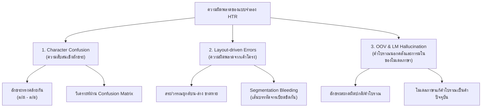

---
title: "บทที่ 8: การวัดผลทางสถิติและการจำแนกความผิดพลาดของโมเดล (Evaluation & Error Analysis)"
project: "Khmer-Thai HTR Handbook"
author: "Senior Research Agent"
status: "Draft"
date: "2026-06-07"
---


**ประเภทเนื้อหา:** คู่มือการวิเคราะห์และการปฏิบัติการ (Technical Guide)  
**สถานะ:** ร่างเนื้อหา (Draft)  
**ระดับความรู้นำเข้า:** คณิตศาสตร์สถิติเบื้องต้นและการวิเคราะห์แบบจำลอง HTR  

---

## บทนำ

ในการพัฒนาเทคโนโลยีการรู้จำอักขระลายมือเขียนโบราณ (Handwritten Text Recognition หรือ HTR) สำหรับเอกสารประวัติศาสตร์ เช่น คัมภีร์ใบลานอักษรขอม และสมุดไทยโบราณอักษรไทย การบรรลุเป้าหมายการประมวลผลที่มีความแม่นยำสูงนั้น มิได้อาศัยเพียงแค่การออกแบบสถาปัตยกรรมโครงข่ายประสาทเทียมระดับลึกที่มีความซับซ้อน หรือการรวบรวมคลังข้อมูลป้อนเข้าจำนวนมหาศาลเท่านั้น หากแต่จำเป็นต้องมีระบบการวัดผลประสิทธิภาพเชิงสถิติที่เที่ยงตรง แม่นยำ และสะท้อนความเป็นจริงในทางอักษรศาสตร์ดิจิทัล (Digital Paleography) ตัวเลขความแม่นยำหรืออัตราความคลาดเคลื่อนที่รายงานโดยระบบคอมพิวเตอร์มักเผชิญข้อจำกัดเมื่อนำมาตีความในมิติประวัติศาสตร์ เนื่องจากความคลาดเคลื่อนระดับอักขระเพียงตัวเดียวอาจส่งผลกระทบต่อความหมายของข้อความและคุณค่าทางประวัติศาสตร์อย่างมหาศาล ดังนั้น การประเมินผลประสิทธิภาพของแบบจำลองจึงมิอาจพึ่งพาเพียงตัวชี้วัดเชิงปริมาณระดับเดี่ยวได้ แต่ต้องอาศัยกรอบการจำแนกประเภทความผิดพลาด (Error Taxonomy) และการมีส่วนร่วมประเมินผลจากผู้เชี่ยวชาญด้านเอกสารโบราณวิทยาอย่างเป็นระบบ

จุดประสงค์หลักของบทนี้คือการปูพื้นฐานทางคณิตศาสตร์และทฤษฎีสถิติที่ใช้ในระบบการทดสอบและประเมินผลโมเดล HTR โดยครอบคลุมการวิเคราะห์อัตราความผิดพลาดระดับอักขระ (Character Error Rate: CER) และอัตราความผิดพลาดระดับคำ (Word Error Rate: WER) ซึ่งคำนวณโดยอิงจากระยะทางเลเวนชเตน (Levenshtein Distance) พร้อมการอภิปรายเหตุผลเชิงลึกว่าเหตุใดระบบประเมินผลระดับคำ (WER) จึงไม่มีเสถียรภาพและให้ค่าความผิดพลาดที่สูงเกินจริงเมื่อนำมาใช้กับกลุ่มภาษาที่เขียนแบบต่อเนื่องโดยไม่เว้นวรรคคำ (Scriptio Continua) เช่น ภาษาไทยและภาษาเขมรโบราณ นอกจากนี้ บทนี้ยังนำเสนอระเบียบวิธีจำแนกชนิดของความผิดพลาดออกเป็นสามกลุ่มหลัก ได้แก่ ความผิดพลาดเชิงการสับสนอักขระ (Character Confusion) ความผิดพลาดที่เกิดจากปัญหาการจัดการเลย์เอาต์ (Layout-driven Errors) และความผิดพลาดเชิงคลังคำประวัติศาสตร์นอกเหนือคลังข้อมูลฝึกฝน (Out-of-Vocabulary: OOV) พร้อมทั้งอภิปรายกรอบการทำงานแบบผสมผสานเพื่อหาความเห็นพ้องร่วมกันของผู้เชี่ยวชาญ (Expert Consensus) ซึ่งเป็นการบูรณาการมาตรวัดทางคณิตศาสตร์เข้ากับดุลยพินิจเชิงอักษรศาสตร์ เพื่อยกระดับมาตรฐานความน่าเชื่อถือของแบบจำลอง HTR ในงานระดับจดหมายเหตุของสถาบันวิจัยวิชาการและห้องสมุดดิจิทัลในยุคปัจจุบัน

---

## 8.1 ทฤษฎีและคณิตศาสตร์ของการคำนวณ CER และ WER

การประเมินคุณภาพผลลัพธ์ของแบบจำลอง HTR จำเป็นต้องเปรียบเทียบความแตกต่างระหว่างข้อความที่แบบจำลองคาดการณ์ได้ (Hypothesis Text) กับข้อความความจริงเชิงประจักษ์ที่ได้รับการถอดความอย่างถูกต้องสมบูรณ์โดยผู้เชี่ยวชาญ (Reference Text หรือ Ground Truth) มาตรวัดหลักที่เป็นมาตรฐานสากลในงานวิจัยระบบการรู้จำข้อความคือ อัตราความผิดพลาดระดับอักขระ (Character Error Rate หรือ CER) และอัตราความผิดพลาดระดับคำ (Word Error Rate หรือ WER) ซึ่งมีรากฐานคำนวณมาจากแนวคิดระยะทางเลเวนชเตน (Levenshtein Distance)

### 8.1.1 นิยามและคณิตศาสตร์ระยะทางเลเวนชเตน (Levenshtein Distance)

ระยะทางเลเวนชเตน (Levenshtein Distance) ระหว่างสายอักขระสองชุด คือจำนวนขั้นต่ำสุดของการดำเนินงานแก้ไขอักขระ (Character Editing Operations) ซึ่งประกอบด้วยการแทนที่ (Substitution) การลบ (Deletion) และการแทรก (Insertion) เพื่อที่จะแปลงสายอักขระหนึ่งให้กลายเป็นอีกสายอักขระหนึ่ง หากเรากำหนดให้ $d(S_1, S_2)$ แทนระยะทางเลเวนชเตนระหว่างข้อความทำนายและข้อความจริง การคำนวณจะอิงกับการดำเนินงานพื้นฐาน 3 ชนิด ดังนี้:

1.  **การแทนที่ (Substitutions: $S$):** กรณีที่แบบจำลองทำนายอักขระผิดตัวไปจากความเป็นจริง เช่น ภาพจารระบุตัวอักษร "ข" แต่ตัวจำลองรู้จำจำแนกพิกเซลออกมาเป็น "บ" หรือจารอักษรเขมร "ត" (ta) แต่โมเดลทำนายเป็น "គ" (ka) การกระทำนี้คิดเป็น 1 ความคลาดเคลื่อน
2.  **การลบ (Deletions: $D$):** กรณีที่ตัวอักษรที่ปรากฏในภาพเอกสารโบราณหายไปจากการทำนายของแบบจำลอง เช่น ข้อความ Ground Truth สะกดว่า "มหา" แต่แบบจำลองพยากรณ์ผลลัพธ์ได้เพียง "มห" (สระอาขาดหายไป) การกระทำนี้คิดเป็น 1 ความคลาดเคลื่อน
3.  **การแทรก (Insertions: $I$):** กรณีที่มีตัวอักษรส่วนเกินปรากฏขึ้นในการทำนายโดยไม่มีสัญญาณพิกเซลนั้นปรากฏจริงในภาพ หรือมีจุดสัญญาณรบกวนที่ทำให้โมเดลเข้าใจผิดว่าเป็นตัวอักษร เช่น ความจริงสะกดคำว่า "ศร" แต่โมเดลประมวลผลออกมาได้เป็น "ศรย" (มีตัวอักษร "ย" เกินเข้ามา) การกระทำนี้คิดเป็น 1 ความคลาดเคลื่อน

เมื่อพิจารณารายการการคำนวณคลาดเคลื่อนระดับอักขระ อัตราความผิดพลาดระดับอักขระ (Character Error Rate หรือ CER) สามารถเขียนในรูปสมการทางคณิตศาสตร์ได้ดังนี้:

$$\text{CER} = \frac{S + D + I}{N} \times 100\%$$

โดยที่:
*   $S$ คือจำนวนอักขระที่เกิดความผิดพลาดในลักษณะของการแทนที่ (Substitutions) ทั้งหมดในชุดข้อมูลทดสอบ
*   $D$ คือจำนวนอักขระที่เกิดความผิดพลาดในลักษณะของการลบ (Deletions) ทั้งหมดในชุดข้อมูลทดสอบ
*   $I$ คือจำนวนอักขระที่เกิดความผิดพลาดในลักษณะของการแทรก (Insertions) ทั้งหมดในชุดข้อมูลทดสอบ
*   $N$ คือจำนวนอักขระทั้งหมดที่มีอยู่จริงในเอกสารอ้างอิงความจริงเชิงประจักษ์ (Ground Truth / Reference Text)

ในทางปฏิบัติ การหาระยะทางเลเวนชเตนและจำนวนดำเนินการแก้ไขจะคำนวณผ่านอัลกอริทึมการเขียนโปรแกรมเชิงพลวัต (Dynamic Programming) โดยสร้างตารางเมตรอนุมัติขนาด $(|Hypothesis| + 1) \times (|Reference| + 1)$ เพื่อหาเส้นทางการแปลงที่มีต้นทุนต่ำที่สุด (Minimum Edit Distance) [1]

**ตัวอย่างการคำนวณ CER:**
กำหนดให้ข้อความอ้างอิงความจริงเชิงประจักษ์ (Reference) คือ: `"โอมฺสิริวิชัย"` (มีจำนวนอักขระ $N = 12$ ตัวอักษร)
ข้อความที่แบบจำลอง HTR คาดการณ์ได้ (Hypothesis) คือ: `"โอมสิรีวิชัยย"`
เมื่อจัดระเบียบแนวร่วม (Alignment) เพื่อเปรียบเทียบทีละตำแหน่ง:
*   ตำแหน่งที่ 4: `"ฺ"` (เครื่องหมายพินทุใต้ ม) หายไปใน Hypothesis $\rightarrow$ **Deletion ($D = 1$)**
*   ตำแหน่งที่ 8: `"ิ"` (สระอิ) ใน Reference กลายเป็น `"ี"` (สระอี) ใน Hypothesis $\rightarrow$ **Substitution ($S = 1$)**
*   ตำแหน่งท้ายสุด: มีตัวอักษร `"ย"` เพิ่มเข้ามาเกิน $\rightarrow$ **Insertion ($I = 1$)**
*   ตำแหน่งอื่น ๆ สะกดถูกต้องตรงกัน

ผลรวมความคลาดเคลื่อนสะสม $S + D + I = 1 + 1 + 1 = 3$  
แทนค่าในสมการ:

$$\text{CER} = \frac{3}{12} \times 100\% = 25.00\%$$

ค่าตัวชี้วัด CER นี้ทำหน้าที่เป็นเกณฑ์ประเมินที่เที่ยงตรงที่สุดสำหรับการวัดผลประสิทธิภาพทางกายภาพของแบบจำลองรู้จำลายมือเขียน (Handwriting Recognition Engine) ไม่ว่าจะเป็นโครงข่ายคลาสสิกหรือสถาปัตยกรรมระดับแนวหน้าประเภทหมุนเวียนถอดรหัสอย่าง DTrOCR [2] เนื่องจากระดับอักขระสอดคล้องกับพิกเซลในภาพถ่ายต้นฉบับโดยตรง

### 8.1.2 Word Error Rate (WER) และข้อจำกัดในภาษาเขียนแบบไม่เว้นวรรค (Scriptio Continua)

ในวงการรู้จำเสียงพูด (Speech Recognition) และการรู้จำอักษรพิมพ์ตะวันตก (Western OCR) มาตรวัดหลักที่นิยมใช้งานอย่างแพร่หลายอีกตัวหนึ่งคือ อัตราความผิดพลาดระดับคำ (Word Error Rate หรือ WER) ซึ่งมีสมการคำนวณในลักษณะเดียวกันกับ CER แต่เปลี่ยนขอบเขตของการพิจารณาจากระดับอักขระรายตัวมาเป็นระดับคำเดี่ยว:

$$\text{WER} = \frac{S_w + D_w + I_w}{N_w} \times 100\%$$

โดยที่:
*   $S_w$ คือจำนวนคำที่มีความคลาดเคลื่อนเชิงแทนที่ (Word Substitutions)
*   $D_w$ คือจำนวนคำที่มีความคลาดเคลื่อนเชิงลบ (Word Deletions)
*   $I_w$ คือจำนวนคำที่มีความคลาดเคลื่อนเชิงแทรก (Word Insertions)
*   $N_w$ คือจำนวนคำทั้งหมดที่มีอยู่จริงในเอกสารอ้างอิงความจริงเชิงประจักษ์ (Ground Truth)

แม้ว่า WER จะให้ข้อมูลที่เป็นประโยชน์อย่างยิ่งในการประเมินประสิทธิภาพในระดับความเข้าใจเชิงภาษาศาสตร์ของข้อความ แต่สำหรับอักษรประวัติศาสตร์ในเอเชียตะวันออกเฉียงใต้ เช่น อักษรไทยและอักษรเขมรโบราณ การใช้งาน WER เผชิญกับปัญหาข้อจำกัดเชิงโครงสร้างของภาษาอย่างรุนแรงจนส่งผลให้การรายงานตัวเลขเชิงสถิตินี้ขาดเสถียรภาพและสูงเกินความเป็นจริงอย่างมาก ด้วยเหตุผลสำคัญสามประการดังนี้:

#### 1) ปัญหาภาษาเขียนแบบคำติดกันต่อเนื่อง (Scriptio Continua)
ภาษาไทยและภาษาเขมรมีคุณลักษณะทางอักขรวิธีที่เป็นเอกลักษณ์คือ เขียนตัวอักษรเรียงตัวติดต่อกันไปโดยไม่มีการเว้นวรรคช่องไฟระหว่างคำเดี่ยว ช่องว่าง (Spaces) จะถูกนำมาใช้เฉพาะเมื่อต้องการสิ้นสุดวลี สิ้นสุดประโยค หรือแบ่งหัวข้อความสำคัญเท่านั้น แตกต่างจากภาษาอังกฤษหรือกลุ่มภาษาละตินซึ่งใช้ช่องว่างเป็นขีดคั่นขอบเขตคำ (Word Boundary) ที่ชัดเจนในระดับระบบการเขียน เมื่อแบบจำลอง HTR คาดการณ์สายอักขระยาวของข้อความภาษาไทยหรือภาษาเขมร ระบบจะไม่สามารถระบุได้ว่าจุดใดคือคำเริ่มต้นและจุดใดคือคำสิ้นสุด การจะหาค่า $N_w$ หรือคำนวณ $S_w$, $D_w$, $I_w$ จึงจำเป็นต้องผ่านขั้นตอน "การตัดคำด้วยคอมพิวเตอร์" (Automated Word Segmentation) ก่อนเสมอ

การนำเครื่องมือตัดแบ่งคำ (Word Tokenizer) เช่น PyThaiNLP สำหรับภาษาไทย หรือเครื่องมือประมวลผลคำเขมร มาใช้ประมวลผลข้อความ Ground Truth และข้อความที่แบบจำลองทำนายออกมาได้ จะสร้างความเสี่ยงที่ก่อให้เกิดความคลาดเคลื่อนเชิงระบบ (Systemic Error) ดังนี้:
*   **ความไม่คงเส้นคงวาของเครื่องมือตัดคำ:** เครื่องมือตัดคำภาษาไทยทำงานโดยอาศัยคลังพจนานุกรม (Dictionary-based) หรือแบบจำลองความน่าจะเป็นระดับคำ (เช่น CRF หรือสถาปัตยกรรม Deep Learning) หากในข้อความทำนาย HTR มีอักษรผิดเพี้ยนไปแม้แต่ตัวเดียว ตัวตัดคำอาจจะทำนายขอบเขตคำผิดเพี้ยนไปโดยสิ้นเชิง ตัวอย่างเช่น ข้อความจริง `"กมลเขียนหนังสือ"` ตัดแบ่งได้เป็น `["กมล", "เขียน", "หนังสือ"]` ($N_w = 3$) หากแบบจำลอง HTR จำรูปเขียนอักษรแรกผิดเพี้ยนไปเป็น `"ถมลเขียนหนังสือ"` ตัวตัดคำอาจจะมองคำว่า `"ถมล"` เป็นคำใหม่หรือทำการรวมคำกับคำถัดไปเป็น `["ถมลเขียน", "หนังสือ"]` ($N_w = 2$) การเปลี่ยนโครงสร้างตัดคำทำให้แนวร่วม (Alignment) ของคำทั้งหมดในประโยคคลาดเคลื่อน เกิดความคลาดเคลื่อนของจำนวนคำเกินจริงอย่างมหาศาล ทั้งที่ความเป็นจริงมีอักขระผิดเพี้ยนไปเพียงตัวเดียวเท่านั้น
*   **ปัญหากลุ่มคำประวัติศาสตร์:** เอกสารโบราณมักใช้คำโบราณ ไวยากรณ์เก่า หรือคำศัพท์เฉพาะถิ่นที่ไม่มีบันทึกอยู่ในระบบพจนานุกรมของซอฟต์แวร์ตัดคำยุคปัจจุบัน ส่งผลให้ตัวตัดคำทำการตัดแบ่งคำในรูปประโยคแบบสุ่มตัวอย่าง (Arbitrary Segmentation) ทำให้ค่า $N_w$ ของประโยคเดียวกันมีความแปรปรวนสูงมากตามชนิดและโครงสร้างของตัวตัดคำที่นักวิจัยเลือกใช้

#### 2) ปัญหาอัตราการบวมตัวของค่าความผิดพลาดอย่างรุนแรง (Error Inflation)
เนื่องจากสมการ WER คำนวณความถูกต้องในขอบเขตของคำเดี่ยว หากมีตัวอักษรใดตัวอักษรหนึ่งในคำสะกดผิดเพี้ยนไปแม้แต่ระดับพิกเซลสระเดียว จะถือว่าคำนั้นทั้งคำเกิดความคลาดเคลื่อน 100% ตัวอย่างเช่น คำว่า `"พระพุทธเจ้า"` มีอักขระ $N = 10$ ตัวอักษร หากแบบจำลองจดจำพลาดไปเป็น `"พระพุทธ์เจ้า"` (สับสนตำแหน่งไม้ทัณฑฆาตและตัวสะกด) ค่าสถิติแสดงผลดังนี้:
*   ความคลาดเคลื่อนระดับอักขระ (CER): ผิดพลาด 1 จุดจาก 10 จุด $\text{CER} = 10.00\%$
*   ความคลาดเคลื่อนระดับคำ (WER): ผิดพลาด 1 คำจาก 1 คำ $\text{WER} = 100.00\%$

หากพิจารณาประโยคยาวที่มีโครงสร้างคำสั้นสลับคำยาวอย่างต่อเนื่อง หากแบบจำลองเกิดความคลาดเคลื่อนระดับอักขระกระจายตัวอยู่คำละ 1 อักขระในทุก ๆ คำ แม้ว่าโมเดลจะอ่านอักขระส่วนใหญ่ถูกต้องถึง 90% (CER = 10.00%) แต่อัตราความผิดพลาดระดับคำอาจพุ่งขึ้นไปสูงถึง WER = 100.00% ได้อย่างง่ายดาย ตัวเลขที่บวมตัวนี้ไม่สะท้อนความเป็นจริงเชิงปริมาณเชิงทัศน์ของความสามารถของแบบจำลอง และสร้างผลกระทบต่อการตัดสินใจเชิงวิศวกรรมในการจูนปรับค่าพารามิเตอร์ของระบบ

#### 3) ความไม่เหมาะสมกับความต้องการเชิงอักษรศาสตร์โบราณ
ในกระบวนการปริวรรตจารึกและคัมภีร์ใบลาน เป้าหมายหลักสูงสุดของนักประวัติศาสตร์และนักภาษาศาสตร์โบราณคือการระบุตัวตนของอักขระแต่ละตัวในแผ่นวัสดุให้ตรงกับความเป็นจริงมากที่สุดเพื่อตรวจสอบความแปรปรวนของภาษา การอ่านผิดเพี้ยนไปเพียงหนึ่งอักขระแม้จะไม่ทำให้ความเข้าใจเชิงประโยคสูญเสียไปทั้งหมด แต่อาจเปิดช่องทางให้เกิดการตีความคำศัพท์เฉพาะตัวนั้นเปลี่ยนรูปไปอย่างมีนัยสำคัญ ดังนั้น การตรวจสอบประสิทธิภาพจึงต้องเน้นย้ำความแม่นยำระดับหน่วยอักขระ (Character-level precision) เป็นหลักการพื้นฐาน

ด้วยข้อจำกัดทางกายภาพและระบบภาษาดังกล่าว ในการพัฒนาแบบจำลองระบบ HTR สำหรับอักษรไทยโบราณและขอมใบลาน วงการวิจัยดิจิทัลฮิวแมนนิตีส์สากลจึงกำหนดให้ใช้ **ค่าอัตราความผิดพลาดระดับอักขระ (CER) เป็นเกณฑ์ชี้วัดมาตรฐานอุตสาหกรรม (Industry Standard)** ในการวัดและเปรียบเทียบขีดความสามารถของแบบจำลองอย่างเป็นทางการ ส่วนมาตรวัด WER จะถูกนำมาใช้เพียงเป็นข้อมูลเสริมเฉพาะในขั้นตอนการประยุกต์ใช้งานร่วมกับตัวถอดรหัสเชิงภาษา (Language Model Decoders) เพื่อประเมินความลื่นไหลเชิงวากยสัมพันธ์เท่านั้น โดยไม่นำมาเป็นตัวชี้วัดหลักในการสรุปประสิทธิภาพความถูกต้องของแบบจำลอง

---

## 8.2 ระเบียบวิธีจำแนกชนิดของความผิดพลาด (Error Taxonomy)

การตรวจสอบขีดความสามารถของแบบจำลอง HTR โดยอาศัยเพียงรายงานตัวเลข CER สรุปรวมท้ายการทดสอบ ไม่สามารถช่วยให้นักวิจัยมองเห็นสาเหตุทางกายภาพหรือความบกพร่องเชิงโครงสร้างปัญญาประดิษฐ์ได้อย่างกระจ่างชัด เพื่อพัฒนาแบบจำลองให้มีประสิทธิภาพเข้าสู่ระบบการวิจัยระดับสูง จึงต้องจัดตั้งระเบียบวิธีจำแนกประเภทความผิดพลาด (Error Taxonomy) ออกเป็นระบบย่อย เพื่อวิเคราะห์สาเหตุและหาแนวทางแก้ไขเฉพาะจุด โดยจำแนกความผิดพลาดออกเป็น 3 รูปแบบหลัก ดังนี้:



### 8.2.1 ความผิดพลาดเชิงการสับสนอักขระ (Character Confusion)

ความสับสนอักขระเป็นปัญหาหลักในกระบวนการเรียนรู้ระดับทัศน์ (Visual recognition errors) เกิดขึ้นเมื่อแบบจำลองไม่สามารถแยกแยะความแตกต่างเชิงแสงและรูปร่างของพิกเซลระหว่างอักขระสองตัวที่มีโครงสร้างลายเส้นและการลากเส้น (Stroke sequence) คล้ายคลึงกัน โดยเฉพาะอย่างยิ่งบนเอกสารโบราณที่เส้นจารใบลานอาจมีคราบฝุ่นเกาะ หรือน้ำหมึกบนกระดาษข่อยซึมจนทำให้รายละเอียดเส้นขยักเลือนหายไป

#### 1) การวิเคราะห์ผ่านเมทริกซ์ความสับสน (Confusion Matrix)
เพื่อสกัดลักษณะการจำแนกผิดพลาดประเภทนี้ นักวิจัยจะสร้างตารางเมทริกซ์ความสับสนระดับอักขระ (Character-level Confusion Matrix) ขึ้นมา โดยมีแกนแนวตั้งแสดงอักขระ Ground Truth (Target) และแกนแนวนอนแสดงอักขระที่แบบจำลองทำนายจริง (Prediction) ในตารางนี้ค่าบนแนวเส้นทแยงมุมจะแสดงจำนวนอักขระที่ทำนายได้อย่างถูกต้อง ส่วนค่าที่อยู่นอกแนวเส้นทแยงมุมจะแสดงจุดวิกฤตที่โมเดลเกิดความสับสน ตัวอย่างเช่น:

| อักขระจริง | ทำนายเป็น ข | ทำนายเป็น ช | ทำนายเป็น บ | ทำนายเป็น ล | ทำนายเป็น ส |
| :---: | :---: | :---: | :---: | :---: | :---: |
| **ข** | **92** | 5 | 3 | 0 | 0 |
| **ช** | 7 | **88** | 1 | 4 | 0 |
| **บ** | 4 | 0 | **95** | 1 | 0 |
| **ล** | 0 | 2 | 0 | **90** | 8 |
| **ส** | 0 | 0 | 0 | 6 | **94** |

จากตารางตัวอย่างข้างต้น จะพบค่าวิกฤตเชิงวิเคราะห์ที่เด่นชัดสองคู่หลัก ได้แก่ คู่ระหว่าง `"ข"` และ `"ช"` (สับสนสลับกันรวม 12 ครั้ง) และคู่ระหว่าง `"ล"` และ `"ส"` (สับสนสลับกันรวม 14 ครั้ง) ซึ่งชี้ให้เห็นว่าสถาปัตยกรรมสกัดฟีเจอร์เชิงทัศน์ของโมเดลยังไม่สามารถแยกความแตกต่างของรอยหยักของหัวหรือการหางลากยาวได้อย่างมีประสิทธิภาพเพียงพอ

#### 2) คู่ตัวเขียนโบราณที่มีความสับสนสูงในอักษรขอมและอักษรไทย
ในสภาพความเป็นจริงของการจารคัมภีร์ใบลานและเอกสารเขียนมือไทย คู่ตัวอักษรโบราณต่อไปนี้คือจุดวิกฤตที่สร้างค่าความผิดพลาดสะสมสูงสุด:

*   **กลุ่มอักษรขอมโบราณ (ใบลาน):**
    *   **ត (ta) และ គ (ka):** สองอักขระนี้มีโครงสร้างเส้นฐานและหัวโค้งคล้ายคลึงกันอย่างยิ่ง ความแตกต่างของรอยขยักกลางและขีดบนมักสูญเสียสภาพไปเมื่อแผ่นใบลานแห้งและกรอบหรือเขม่าดำฝังลึกไม่สม่ำเสมอ
    *   **ប (ba) และ ហ (ha):** โครงสร้างด้านซ้ายและขวาของอักษรทั้งสองตัวมีความขนานกันสูง หากการจารเส้นฐานไม่ลึกพอ โมเดลจะสับสนสลับตัวพยัญชนะทันที
    *   **ន (na) และ ធ (tha):** ตัวอักษรเหล่านี้มีความคล้ายคลึงกันในจารึกใบลานส่วนใหญ่ การบิดเบี้ยวของลายเส้นเขียนทำให้โมเดลมักมองข้ามความโค้งมนเฉพาะตัวของ ន
*   **กลุ่มอักษรไทยโบราณ (สมุดไทย/สมุดข่อย):**
    *   **ข และ ช / ด และ ต / ค และ ศ:** รอยหยักบนส่วนหัว (เช่น ข และ ช) หรือความกว้างของปากอักขระ (ด และ ต) เป็นลักษณะที่มักหายไปเมื่อเขียนด้วยดินสอหรดาลหรือน้ำหมึกจีนที่เปียกและแผ่กระจายตัวบนเนื้อกระดาษข่อย
    *   **พ, ฟ และ ฬ / น และ ม:** เส้นลากหางสูง (พ และ ฟ) มักชนเข้ากับสระลอยบนของบรรทัด ทำให้โมเดลประมวลผลปลายหางคลาดเคลื่อน ส่วน น และ ม มักมีโครงสร้างม้วนหัวล่างที่เขียนหวัดจนแยกความแตกต่างได้ยากในสภาพแสงน้อย
    *   **ข และ บ / ล และ ส / ย และ พ:** ในสกุลอักษรโบราณ เช่น อักษรสุโขทัย หรืออักษรขอมไทย ตัวอักษร ข และ บ เขียนเป็นรูปสี่เหลี่ยมคล้ายกันมาก โดยต่างกันเพียงตำแหน่งขยักปลาย เช่นเดียวกับ ล และ ส ที่ต่างกันเพียงหางแหลมชี้ขึ้นด้านบน

**แนวทางแก้ไข:** การประยุกต์ใช้เทคนิคการเพิ่มข้อมูลสังเคราะห์เฉพาะจุด (Targeted Data Augmentation) โดยการนำอักขระในคู่ที่สับสนเหล่านี้มาสร้างภาพบิดเบี้ยวสังเคราะห์ (Synthetic distortion) เพิ่มขึ้นในชุดข้อมูลฝึกฝน หรือการเพิ่มค่าน้ำหนักฟังก์ชันสูญเสีย (Focal Loss) ให้แก่กลุ่มอักขระที่ทำนายผิดพลาดบ่อยครั้งในตาราง Confusion Matrix

### 8.2.2 ความผิดพลาดเชิงเลย์เอาต์และการตัดเย็บพิกเซล (Layout-driven Errors)

ความผิดพลาดชนิดนี้เกิดจากขั้นตอนการแยกวิเคราะห์เค้าโครงหน้ากระดาษ (Layout Analysis / Line Segmentation) ที่ไม่มีประสิทธิภาพเพียงพอ (ดังที่อภิปรายรายละเอียดเชิงทฤษฎีใน [บทที่ 4: การวิเคราะห์เค้าโครงเอกสารและการตรวจหาเส้นบรรทัดฐาน](file:///d:/01_APP/Research/output/khmer-thai-htr-handbook/drafts/04-บทที่4.md)) และส่งผลกระทบต่อเนื่องทางลบ (Cascade effect) มายังขั้นตอนการรู้จำตัวอักษร โดยมีสาเหตุมาจากโครงสร้างทางกายภาพของอักขระไทยและเขมรที่จัดเรียงตัวอยู่ในแนวราบแบบมีระดับชั้นซ้อนกันในแนวตั้ง (Vertical stacking layers)

#### 1) ปัญหาการชนกันของปลายหางพยัญชนะและสระ (Segmentation Bleeding)
ระบบการเขียนทั้งภาษาไทยและภาษาเขมรโบราณ มีตำแหน่งการเขียนแบ่งเป็น 4 ระดับแนวตั้งดังนี้:
*   ระดับที่ 1: ระดับพยัญชนะหรือสระเชิงบรรทัดฐานล่างสุด (สระอุ, สระอู, เชิงพยัญชนะ หรือជើងអក្សរในอักษรเขมร)
*   ระดับที่ 2: ระดับฐานพยัญชนะหลัก (ก, ข, ค, ต, គ, ប, ហ)
*   ระดับที่ 3: ระดับสระลอยบน (สระอิ, สระอี, สระอึ, สระอุสะลอย, สระเออ)
*   ระดับที่ 4: ระดับวรรณยุกต์และเครื่องหมายด้านบนสุด (ไม้เอก, ไม้โท, ไม้ตรี, ไม้จัตวา, นฤคหิต, ไม้ทัณฑฆาต)

```
[ระดับที่ 4]  ์   ้   ่   ํ   (วรรณยุกต์/เครื่องหมายลอยฟ้า)
[ระดับที่ 3]  ิ   ี   ึ   ื   (สระลอยบน)
[ระดับที่ 2]  พ   ร   ะ   พ   ุ   ท   ธ   เ   จ   ้   า   (พยัญชนะ/สระหลัก)
[ระดับที่ 1]  ุ   ู   ฺ   (เชิงอักษร/สระลอยล่าง/พินทุ)
```

ในเอกสารประวัติศาสตร์ลายมือเขียนโบราณ อาลักษณ์มักเขียนบรรทัดเบียดชิดกันเพื่อประหยัดเนื้อที่วัสดุเขียน ส่งผลให้เกิดปรากฏการณ์ **"การคาบเกี่ยวพิกเซลระหว่างบรรทัด" (Inter-line strokes overlapping)** ปลายเชิงอักษรล่างของบรรทัดบนจะยื่นลงมาชนหรือสัมผัสเข้ากับยอดวรรณยุกต์หรือสระลอยบนสุดของบรรทัดล่าง เมื่อโมเดลทำหน้าที่จำแนกพิกเซลเพื่อแบ่งแนวเส้นบรรทัด (เช่น โมเดลวิเคราะห์เค้าโครงสำเร็จรูป `blla.mlmodel` ของ Kraken หรือแบบจำลอง ARU-Net ใน Transkribus [1] ดังที่แสดงวิธีปฏิบัติใน [บทที่ 6: แนวทางปฏิบัติแบบไร้โค้ด](file:///d:/01_APP/Research/output/khmer-thai-htr-handbook/drafts/06-บทที่6.md) และ [บทที่ 7: แนวทางปฏิบัติแบบเขียนโค้ด](file:///d:/01_APP/Research/output/khmer-thai-htr-handbook/drafts/07-บทที่7.md)) ระบบจะเกิดความสับสนและแบ่งเส้นจำแนกพิกัดด้วยวิธีเฉือนผ่านพิกเซลกลางอักขระ (Clipping) หรือลากครอบเอาอักขระชั้นบนสุดของบรรทัดล่างให้หลุดเข้าไปเป็นส่วนหนึ่งของรูปภาพย่อยบรรทัดบน

#### 2) ผลลัพธ์ความผิดพลาด
*   **การสูญหายของข้อมูล (Deletions):** เมื่อสระลอยบนหรือวรรณยุกต์ถูกเฉือนขาดออกไปจากการตัดบรรทัด ภาพภาพนั้นจะเหลือเพียงพิกเซลเศษซากเล็ก ๆ ทำให้โมเดล HTR ระดับบรรทัดมองไม่เห็นสระหรือวรรณยุกต์ตัวนั้น ส่งผลให้คำว่า `"น้ำ"` ทำนายออกมาเป็น `"นา"`
*   **การแทรกอักขระแปลกปลอม (Insertions):** เชิงอักษรของบรรทัดบนที่ติดห้อยเข้ามาในบรรทัดล่างจะถูกโมเดล HTR ของบรรทัดล่างพยายามจำแนกให้ออกมาเป็นอักขระตัวใดตัวหนึ่ง ส่งผลให้เกิดอักขระแทรกแปลกปลอมกลางคำ ซึ่งส่งผลให้ค่า CER เสื่อมถอยลงอย่างรวดเร็ว

**แนวทางแก้ไข:** การเปลี่ยนจากการลากพื้นที่บรรทัดด้วยกรอบกล่องสี่เหลี่ยมธรรมดา มาเป็นการวิเคราะห์หาพิกัดรูปหลายเหลี่ยมโอบล้อมอักษร (Polygonal Masks) ที่โค้งงอตามรูปร่างจริงของตัวสะกด และการตั้งค่าโมเดลสกัดเบสไลน์ให้ทำงานที่ค่าความละเอียดพิกเซลสูงขึ้นเพื่อตรวจจำแนกแนวเส้นชนกันได้อย่างแม่นยำ

### 8.2.3 ความผิดพลาดเชิงคลังคำและคำโบราณเฉพาะถิ่น (Out-of-Vocabulary - OOV Errors & Language Model Hallucination)

ความผิดพลาดประเภทนี้เกิดขึ้นในระดับของการประมวลผลเชิงภาษาศาสตร์และการถอดรหัสลัพธ์ (Decoding Phase) โดยเฉพาะอย่างยิ่งเมื่อระบบ HTR มีการบูรณาการโมเดลภาษา (Language Model: LM) เช่น n-gram หรือโมเดลภาษาเชิงประสาทวิทยา (Neural LM) เข้ามาเพื่อทำการเกลาและจัดระเบียบตัวสะกดให้ถูกต้องตามหลักภาษาศาสตร์สากล

#### 1) ปัญหาคลังคำโบราณนอกสารบบ (Out-of-Vocabulary)
แบบจำลองภาษาดั้งเดิมส่วนใหญ่ได้รับการฝึกฝนบนคอร์ปัสภาษาเขียนยุคปัจจุบัน (Modern Corpus) เป็นสำคัญ เมื่อแบบจำลอง HTR ประมวลผลภาพถ่ายเอกสารโบราณที่บรรจุคำศัพท์ที่เลิกใช้งานแล้ว รูปสะกดโบราณ หรือคำบาลี-สันสกฤตเฉพาะทาง ระบบ HTR ระดับสายตา (Visual Model) อาจทำนายตัวอักษรออกมาได้ถูกต้องตามรูปทรงพิกเซลสะกดจริง แต่ระบบโมเดลภาษาจะวิเคราะห์ว่าสายอักขระสะกดโบราณนั้นมีความน่าจะเป็นเชิงสถิติต่ำมาก (Low transition probability) หรือไม่มีอยู่ในคำศัพท์พจนานุกรมเลย (Out-of-Vocabulary)

#### 2) ปรากฏการณ์การมโนอักขระของโมเดลภาษา (Language Model Hallucination)
เมื่อระบบพิจารณาว่าสายอักขระสะกดจริงมีความน่าจะเป็นต่ำ ระบบคำนวณถอดรหัสของโมเดลภาษาจะทำการ "แทรกแซงและบังคับแก้ไขข้อมูลตัวอักษร" (Overriding prediction) โดยเปลี่ยนอักขระเหล่านั้นให้กลายเป็นคำศัพท์สมัยใหม่ที่สะกดใกล้เคียงและมีความน่าจะเป็นเชิงสถิติของคอร์ปัสปัจจุบันสูงกว่า ตัวอย่างความคลาดเคลื่อนเชิงโครงสร้างที่พบบ่อย:

*   **เอกสารโบราณจารคำว่า:** `"จึ่งมีพระราชโองการ"` (คำว่า "จึ่ง" สะกดถูกต้องตามรูปสมัยโบราณ)
    *   *Visual Model (HTR เทรนมาดี):* อ่านพิกเซลลายเส้นตรงตัวได้ $\rightarrow$ `"จึ่งมีพระราชโองการ"`
    *   *Decoder + Modern LM (มีอำนาจตัดสินใจสูง):* คำว่า `"จึ่ง"` ไม่มีในคอร์ปัสสมัยใหม่ จึงคำนวณและปรับเปลี่ยนรูปคำเป็นคำที่พบบ่อยกว่าในประวัติปัจจุบัน $\rightarrow$ **ผลลัพธ์มโน:** `"จึงมีพระราชโองการ"`
*   **คัมภีร์ใบลานบันทึกคาถาบาลีอักษรขอม:** `"ตสฺไมทฺทาตวฺยเมว"`
    *   *Visual Model (HTR เทรนมาดี):* อ่านพิกเซลสกัดอักขระควบคุมพินทุตรงตัว $\rightarrow$ `"ตสฺไมทฺทาตวฺยเมว"`
    *   *Decoder + Modern LM:* มองสัญลักษณ์พินทุ `ฺ` และตัวสะกดอักษรขอมเป็นสิ่งรบกวนทางภาษา และปรับแปลงเป็นภาษาปัจจุบันที่ใกล้เคียง $\rightarrow$ **ผลลัพธ์มโน:** `"ตสไมททาตวยเมว"` หรือแปลงเป็นภาษาไทยปนบาลีปัจจุบัน `"ตัสไมทาตาวยะเม"`

การแทรกแซงในลักษณะมโนภาพข้อความของโมเดลภาษาสมัยใหม่นี้ทำลายหลักวิชาอักษรวิทยาทางประวัติศาสตร์อย่างร้ายแรง เนื่องจากปิดบังรูปสะกดดั้งเดิมของเอกสารต้นฉบับ ทำให้นักวิชาการไม่สามารถเข้าศึกษาพัฒนาการเชิงประวัติศาสตร์ของการสะกดคำได้

**แนวทางแก้ไข:** การใช้วิธีลดน้ำหนักอิทธิพลของโมเดลภาษา (Weight reduction of Language Model coefficient) ในขั้นตอนถอดรหัสแบบ Beam Search หรือการตั้งใจรวบรวมคอร์ปัสประวัติศาสตร์โบราณ จดหมายเหตุแห่งชาติ และพจนานุกรมคัมภีร์ปฐมภูมิขึ้นมาเพื่อใช้เทรนโครงข่ายโมเดลภาษาเฉพาะกิจ (Historical Language Model) แทนการพึ่งพาโมเดลภาษาไทยร่วมสมัย

---

## 8.3 ระบบตรวจประเมินแบบผสมผสานร่วมกับความเห็นพ้องของผู้เชี่ยวชาญ (Expert Consensus)

เมื่อเราประเมินผลระบบ HTR ในกรอบงานอักษรศาสตร์และจดหมายเหตุดิจิทัล การรายงานอัตรา CER ต่ำ ๆ จากระบบอัตโนมัติอาจไม่ได้หมายความว่ารายงานวิจัยหรือเล่มหนังสือจารึกฉบับที่จำลองขึ้นจะพร้อมสำหรับจุดประสงค์ทางประวัติศาสตร์ เพราะในความเป็นจริง ข้อผิดพลาดแต่ละตำแหน่งมีระดับความเสียหายต่อองค์ความรู้และสัญศาสตร์วิทยาไม่เท่ากัน ตัวอย่างเช่น การที่โมเดลอ่านคำสะกดผิดเพี้ยนไป 1 อักขระในคำทั่วไป กับการสะกดผิดเพี้ยน 1 อักขระในพระนามกษัตริย์ ปีมหาศักราช หรือคำหลักคำสอนทางพระพุทธศาสนา แม้สถิติ CER จะบันทึกเป็นค่าความผิดพลาดเท่ากับ 1 หน่วยเท่ากัน แต่ความเสียหายเชิงวิชาการประวัติศาสตร์และการวิจัยในสองกรณีนี้นับว่าห่างไกลกันอย่างมหาศาล ด้วยเหตุนี้ จึงเกิดความพยายามออกแบบ **ระบบตรวจประเมินแบบผสมผสานร่วมกับความเห็นพ้องของผู้เชี่ยวชาญ (Expert Consensus Framework)** เพื่อผสานการตรวจสอบเชิงปริมาณ (Quantitative CER) เข้ากับดุลยพินิจเชิงคุณภาพ (Qualitative Paleography Evaluation) โดยต่อยอดจากระเบียบวิธีการบันทึกข้อมูลและแนวทางถอดอักขรวิธีใน [บทที่ 5: การจัดทำคลังข้อมูลความจริงเชิงประจักษ์](file:///d:/01_APP/Research/output/khmer-thai-htr-handbook/drafts/05-บทที่5.md)

### 8.3.1 ขีดจำกัดของ CER แบบดั้งเดิมในทางวิชาการประวัติศาสตร์
สถิติ CER ทำหน้าที่แบบเสมอกันทางคณิตศาสตร์ (Unweighted evaluation) โดยมองตัวอักษรทุกตัวในหน้าคัมภีร์มีค่าน้ำหนักและความสำคัญเท่าเทียมกันหมด ขีดจำกัดตรงนี้แสดงผลต่อการประเมินเชิงลึกในสองกรณีสำคัญดังนี้:

#### 1) ข้อผิดพลาดที่ไม่เป็นสาระสำคัญ (Trivial Orthographic Variations)
ในประวัติศาสตร์ การเขียนสะกดคำภาษาไทยโบราณและภาษาเขมรไม่มีหลักเกณฑ์ควบคุมแบบราชบัณฑิตยสภา คำเดียวกันอาจเขียนสะกดได้หลายรูปแบบขึ้นอยู่กับความนิยมในยุคสมัยและพื้นที่ เช่น คำว่า `"ศรี"` อาลักษณ์อาจจารึกเป็น `"สรี"`, `"ศิริ"`, `"ศฺรี"` หรือคำว่า `"กษัตริย์"` อาจเขียนเป็น `"กษัตรี"` หรือ `"กษัตร"` ในความจริงเชิงอักษรศาสตร์ การอ่านประมวลออกมาได้รูปแบบสะกดใดก็ตามในกลุ่มนี้ถือว่ายอมรับได้และสะท้อนความจริงในวัสดุเขียน แต่ระบบคำนวณ CER อัตโนมัติจะบันทึกว่าการสะกดเหล่านี้คือความผิดพลาดเชิงแทนที่ (Substitutions) ส่งผลให้แบบจำลองได้รับโทษคะแนน CER เกินความเป็นจริง ทั้งที่ภาพพิกเซลจารตรงกับตัวอักษรสะกดโบราณตัวนั้นอย่างถูกต้อง

#### 2) ข้อผิดพลาดร้ายแรงทางสารัตถะ (Critical/Catastrophic Errors)
ความผิดพลาดเพียงเล็กน้อยในตำแหน่งสำคัญสามารถเปลี่ยนทิศทางการวิเคราะห์ข้อมูลประวัติศาสตร์ไปโดยสิ้นเชิง:
*   **พระนามและชื่อเฉพาะ (Proper Nouns):** การสับสนสลับอักขระในพระนามของกษัตริย์หรือชื่อสถานที่สำคัญ เช่น จากพระนามปฐมกษัตริย์ `"ศรีอินทราทิตย์"` กลายเป็น `"ศรีอินทราทิพย์"` แม้คำนวณ CER จะผิดพลาดเพียง 1 อักขระ แต่สร้างความเข้าใจผิดทางประวัติศาสตร์อย่างมหาศาล
*   **ตัวเลขวันเวลาและศักราช (Chronological Data):** ภาพจารเลขหลักปีโบราณ เช่น จารปีศักราช `"๑๒๓๔"` (1234) หากโมเดลอ่านผิดพลาดเนื่องจากรอยคราบบนหน้ากระดาษจางลงไปกลายเป็นปี `"๑๒๘๔"` (1284) ข้อคลาดเคลื่อน 1 อักขระนี้จะเปลี่ยนระยะเวลาประวัติศาสตร์เคลื่อนออกไปถึงครึ่งศตวรรษ (50 ปี) ทำลายทฤษฎีประวัติศาสตร์ด้านยุคสมัยและการจัดกลุ่มราชวงศ์ลงไปโดยสิ้นเชิง
*   **หลักธรรมคำสอนและศัพท์เชิงเทคนิคศาสนา (Theological/Philosophical Terms):** ในคัมภีร์ใบลานภาษาบาลี การพิมพ์ผิดพลาดของตัวพินทุหรือตัวสะกดเชิงอักษรขอมสามารถเปลี่ยนรูปไวยากรณ์บาลี (วิภัตติปัจจัย) จากนามกิตก์เป็นอขยาต หรือสลับความหมายของปรมัตถธรรมที่ขัดต่อพระไตรปิฎกอย่างร้ายแรง

### 8.3.2 กรอบระเบียบวิธีประเมินแบบผสมผสาน (Expert-in-the-Loop Consensus)
เพื่อปรับปรุงมาตรฐานการประเมินประสิทธิภาพในโลกการศึกษาจริง แผนภาพวงจรกระบวนการประเมินผลแบบมีผู้เชี่ยวชาญร่วมตรวจสอบ (Expert-in-the-Loop Consensus Architecture) ได้รับการออกแบบดังแสดงในรายละเอียดขั้นตอนต่อไปนี้:

```
[โมเดล HTR ทำนายผล] 
       │
       ▼
[คำนวณ Standard CER อัตโนมัติ] ──> คัดกรองบรรทัดที่มีค่าผิดพลาด
       │
       ▼
[กระบวนการแบ่งหมวดหมู่ข้อผิดพลาด (Error Categorization Classifier)]
  ├── หมวดหมู่ A: ข้อแตกต่างอักขรวิธีโบราณ (Orthographic variations)
  └── หมวดหมู่ B: ข้อผิดพลาดจุดวิกฤต (Critical names, dates, numbers)
       │
       ▼
[การประชุมร่วมระหว่างนักอักษรวิทยาและวิศวกรคอมพิวเตอร์ (Expert Panel Review)]
  ├── ยืนยันการแก้ไขข้อมูลความจริงเชิงประจักษ์แบบทางเลือกร่วม (Alternative GT)
  └── ปรับค่าน้ำหนักตัวแปรใน Weighted CER (WCER)
       │
       ▼
[จัดเก็บบันทึกผลและนำข้อมูลสะท้อนกลับไปปรับปรุงแบบจำลองเชิงทัศน์]
```

กระบวนการข้างต้นประกอบด้วยองค์ประกอบและขั้นตอนปฏิบัติ 4 ส่วนหลัก:

#### 1) การคำนวณมาตรวัด CER แบบถ่วงน้ำหนัก (Weighted Character Error Rate: WCER)
นักวิจัยคอมพิวเตอร์จะร่วมมือกับนักอักษรศาสตร์ในการจัดหมวดหมู่กลุ่มคำสำคัญ (Semantic Entity Tagging) และกำหนดค่าสัมประสิทธิ์โทษคะแนน (Penalty Coefficient) ที่แตกต่างกันให้แก่อักขระตามความสำคัญในประวัติศาสตร์:
*   **อักขระทั่วไปในคำศัพท์สามัญ:** กำหนดค่าสัมประสิทธิ์การลงโทษ $w_{\text{gen}} = 1.0$
*   **อักขระสระ/พยัญชนะสะกดในชื่อเฉพาะ ปีศักราช และตัวเลข:** กำหนดค่าสัมประสิทธิ์การลงโทษที่สูงเป็นพิเศษ $w_{\text{crit}} = 5.0$ ถึง $w_{\text{crit}} = 10.0$ เพื่อเน้นย้ำความจริงเชิงปริวรรตที่ต้องปราศจากความคลาดเคลื่อนเด็ดขาด
*   **อักขระที่เป็นรูปสะกดทางเลือกที่ยอมรับได้ในพงศาวดาร:** กำหนดค่าสัมประสิทธิ์การลงโทษขั้นต่ำ $w_{\text{alt}} = 0.1$ หรือให้ค่าความผิดพลาดเป็น $0$ หากได้รับการยืนยันเชิงทฤษฎีอักษรศาสตร์

สูตรคำนวณสถิติถ่วงน้ำหนักเขียนแสดงได้ดังนี้:

$$\text{WCER} = \frac{\sum (w_S \cdot S) + \sum (w_D \cdot D) + \sum (w_I \cdot I)}{N_{\text{weighted}}} \times 100\%$$

#### 2) ระบบตรวจทานและหาข้อยุติความขัดแย้งของข้อมูลความจริงเชิงประจักษ์ (Ground Truth Multi-alignment)
เนื่องจากการตีความเส้นจารโบราณของอาลักษณ์อาจสร้างความเห็นต่างในหมู่นักอักษรศาสตร์ (Inter-annotator disagreement) เช่น ผู้เชี่ยวชาญท่านแรกอ่านบรรทัดนี้ได้คำว่า `"อภิเษก"` อีกท่านอ่านพิกเซลเส้นหวัดเดียวกันว่า `"อภิเสก"` ระบบประเมินจึงอนุญาตให้จัดทำไฟล์ความจริงเชิงประจักษ์แบบหลายแนวร่วม (Multi-Ground Truth Alignment) เพื่อรวบรวมรูปแบบแปลปริวรรตที่ถูกต้องตามเกณฑ์วิชาการทั้งหมดเข้าสู่ระบบฐานข้อมูลเป้าหมาย หากแบบจำลองทำนายออกมาตรงกับทางเลือกใดทางเลือกหนึ่งในไฟล์ Multi-GT จะถือว่ามีความถูกต้องในขอบเขตการทำงาน

#### 3) ขั้นตอนทดสอบเปรียบเทียบในแง่ของประโยชน์ใช้งาน (Downstream Task Evaluation)
นอกเหนือจากการใช้สถิติตัวอักษร ระบบผสมผสานจะสุ่มเลือกตัวอย่างเนื้อความที่จำลองสำเร็จไปรันประมวลผลบนการวิเคราะห์เชิงประยุกต์เป้าหมายจริง (Downstream Application) เช่น การรันระบบสืบค้นข้อมูลพงศาวดาร (Historical Information Retrieval) และเปรียบเทียบค่าความแม่นยำ (Precision) และความครอบคลุม (Recall) ของการค้นหาคำสำคัญทางประวัติศาสตร์ หากระบบสามารถค้นหาเหตุการณ์สำคัญทางประวัติศาสตร์ได้ครบถ้วนแม้ข้อความจะมีสระตกหล่นบ้าง ก็จะสะท้อนว่าขีดความสามารถของแบบจำลองนั้นผ่านเกณฑ์มาตรฐานเชิงวิชาการ

การบูรณาการระบบตรวจประเมินแบบมีผู้เชี่ยวชาญร่วมพิจารณานี้ จึงไม่เพียงแค่ช่วยเพิ่มความเที่ยงตรงให้แก่อัตราความแม่นยำของระบบปัญญาประดิษฐ์ แต่ยังช่วยรับประกันว่าคลังเอกสารประวัติศาสตร์ดิจิทัลที่ผ่านการถอดความด้วยเทคโนโลยี HTR จะมีคุณค่าทางวิชาการ มีความน่าเชื่อถือในมาตรฐานระดับเดียวกับการปริวรรตดัดแปลงด้วยมือของนักวิชาการในอดีต

---

## สรุป

การวัดประสิทธิภาพและการจำแนกประเภทความผิดพลาดอย่างมีระบบเป็นปัจจัยชี้ชะตาความสำเร็จในการประยุกต์เทคโนโลยี HTR กับโครงการอนุรักษ์เอกสารโบราณอย่างยั่งยืน การทำความเข้าใจพื้นฐานทางคณิตศาสตร์สถิติของระยะทางเลเวนชเตนทำให้สามารถประเมินผลแบบจำลองระดับอักขระ (CER) ได้อย่างเที่ยงตรงและเป็นวิทยาศาสตร์ และช่วยให้นักพัฒนาตระหนักถึงเหตุผลความไม่มีเสถียรภาพและค่าผิดพลาดที่บวมตัวของระบบระดับคำ (WER) ซึ่งเกิดขึ้นจากคุณลักษณะเฉพาะที่เป็นภาษาเขียนแบบคำติดกันต่อเนื่องไม่มีการเว้นวรรค (Scriptio Continua) ของอักษรในภาษาไทยและภาษาเขมรโบราณ

อย่างไรก็ตาม ตัวเลขสถิติจำนวนเดี่ยวมิอาจช่วยแก้ไขจุดบกพร่องที่เกิดขึ้นในสถาปัตยกรรมระดับลึกได้ นักวิจัยจึงต้องนำระเบียบวิธีจำแนกประเภทความผิดพลาด (Error Taxonomy) เข้ามาประยุกต์ใช้งานในการชี้เฉพาะประเด็นความล้มเหลว ไม่ว่าจะเป็นความผิดพลาดระดับทัศน์จากความสับสนเชิงอักขระรูปคล้าย (Character Confusion) ปัญหาทางเลขาคณิตที่เกิดจากปลายเส้นจารหรือสระบน-ล่างชนคาบเกี่ยวกันจนตัดเส้นฐานคลาดเคลื่อน (Layout-driven Errors) ตลอดจนการแก้ไขข้อความอักษรโบราณผิดรูปที่เกิดขึ้นจากการทำงานที่เก่งเกินไปจนมโนข้อความของตัวถอดรหัสและโมเดลภาษายุคปัจจุบัน (LM Hallucination) ท้ายที่สุด กระบวนการวิเคราะห์ความคลาดเคลื่อนจะต้องปิดวงจรด้วยระบบผสมผสานร่วมกับความเห็นพ้องของนักอักษรศาสตร์และผู้เชี่ยวชาญเอกสารโบราณ เพื่อกำหนดน้ำหนักความสำคัญเชิงเนื้อหาในสมการคณิตศาสตร์ ปลดล็อกเกณฑ์การทดสอบแบบถ่วงน้ำหนัก และเปลี่ยนผ่านมุมมองการประเมินปัญญาประดิษฐ์จากมิติวิศวกรรมคอมพิวเตอร์สู่มิติมนุษยศาสตร์ดิจิทัลที่มีเกณฑ์วิเคราะห์เชิงประวัติศาสตร์อย่างลึกซึ้งและครบถ้วนสมบูรณ์ ซึ่งจะเป็นตัวนำทางวิทยาศาตร์การทดสอบนี้ไปสู่พรมแดนใหม่ของระบบประมวลผลเอกสารประวัติศาสตร์แบบไร้ขอบเขตใน [บทที่ 9: พรมแดนใหม่ 2026 และโครงสร้างพื้นฐานวิจัยแบบเปิด](file:///d:/01_APP/Research/output/khmer-thai-htr-handbook/drafts/09-บทที่9.md) ในบทถัดไป

---

### เชิงอรรถ

[1] Joan Puigcerver, "Are Multidimensional Recurrent Layers Really Necessary for Handwritten Text Recognition?" in *Proceedings of the 14th International Conference on Document Analysis and Recognition (ICDAR)* (Kyoto: IEEE, 2017), 494–499, https://doi.org/10.1109/ICDAR.2017.87.

[2] Masato Fujitake, "DTrOCR: Decoder-only Transformer for Optical Character Recognition," in *Proceedings of the IEEE/CVF Winter Conference on Applications of Computer Vision (WACV)* (Waikoloa: IEEE, 2024), 8031–8040, https://doi.org/10.1109/WACV57701.2024.00784.
