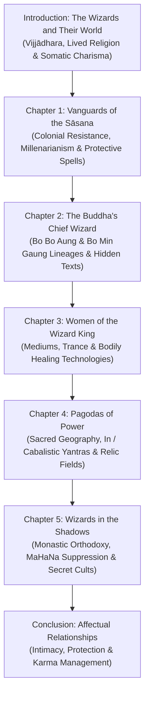

# การศึกษาวิเคราะห์ตัวบทและระบบวิทยาคมเวกซาในพม่า: Thomas Patton (2018) กับพระคาถาชินบัญชร (ဇိနပဉ္စရဂါထာတော်ကြီး / Zinpanzar)

---

## 1. ข้อมูลทางบรรณานุกรมและระบุเอกสาร (Bibliographic Metadata)

- **ผู้แต่ง (Author):** Thomas Nathan Patton (Assistant Professor of Asian Religions, City University of Hong Kong / Union College; Ph.D. Cornell University, 2014)
- **ชื่อหนังสือ (Title):** *The Buddha's Wizards: Magic, Healing, and Charisma in Contemporary Burma*
- **สำนักพิมพ์ (Publisher):** Columbia University Press (New York)
- **ปีที่พิมพ์ (Year):** 2018
- **จำนวนหน้า (Pages):** xx + 187 หน้า (รวมภาพประกอบเชิงชาติพันธุ์วรรณนา ภาคผนวก โน้ตท้ายเล่ม บรรณานุกรม และดัชนีสืบค้น)
- **เลขมาตรฐานสากลประจำหนังสือ (ISBN):** 978-0-231-18760-2 (Cloth) / 978-0-231-54737-6 (Electronic)
- **รหัสดิจิทัลประจำเอกสาร (DOI):** [10.7312/patt18760](https://doi.org/10.7312/patt18760)
- **หมวดหมู่หลัก:** Buddhist Studies, Anthropology of Religion, Esoteric Theravada, Burmese Cultural History, Apotropaic Rituals

---

## 2. โครงสร้างเนื้อหาและสังเคราะห์สาระสำคัญรายบท (Monograph Structure & Analysis)

หนังสือ *The Buddha's Wizards* ของ Thomas Patton (2018) ดัดแปลงมาจากวิทยานิพนธ์ปริญญาเอก ณ มหาวิทยาลัยคอร์เนลล์ (Cornell University, 2014) เรื่อง *"Bearers of Wisdom, Sources of Power: Sorcerer-Saints and Burmese Buddhism"* ซึ่งอาศัยระเบียบวิธีชาติพันธุ์วรรณนาเชิงลึก (Long-term Ethnographic Fieldwork) ร่วมกับการวิเคราะห์วรรณกรรมตัวเขียนและเอกสารประวัติศาสตร์ศาสนาในพม่า โดยมีโครงสร้างเนื้อหาแบ่งออกเป็น 5 บทหลัก พร้อมบทนำและบทสรุป:



### 2.1 บทนำ (Introduction: The Wizards and Their World)
- สำรวจนิยามของ **เวกซา (Weikza / Weizzā / ဝိဇ္ဇာ)** ซึ่งแผลงมาจากคำบาลี *วิชชาธร (Vijjādhara)* หมายถึง "ผู้ทรงวิทยาคม" หรือ "นักสิทธิ์พุทธ" ผู้บรรลุวิทยาการขั้นสูงผ่านการปฏิบัติสมาธิภาวนา (*สมถกรรมฐาน*), การเล่นแร่แปรธาตุ (*อัคคิยัต / Aggiyat*), วิทยาคมว่านยา (*Say*), และการสาธยายมนต์คาถา (*Gahta / Gāthā*)
- Patton เสนอกรอบคิดเรื่อง **พุทธศาสนาเชิงผัสสะและกายภาพ (Somatic & Lived Theravada)** ซึ่งท้าทายกรอบทฤษฎีเถรวาทแบบเดิม (Textualist/Monastic Orthodoxy) ที่มักมองการใช้คาถาอาคมและเวทมนตร์เป็นความเสื่อมทราม โดยชี้ให้เห็นว่าสายเวกซามองตนเองเป็น "ผู้พิทักษ์พระศาสนา" (*Sāsana Protectors*) ที่ยืดอายุขัยตนเองเพื่อรอคอยการอุบัติของพระศรีอริยเมตไตรย

### 2.2 บทที่ 1: กองทัพหน้าแห่งพระศาสนา (Vanguards of the Sāsana)
- ศึกษาประวัติศาสตร์ของขบวนการเวกซาตั้งแต่ยุคราชวงศ์คองบองตอนปลายผ่านยุคอาณานิคมอังกฤษ
- วิเคราะห์บทบาทของมนต์คาถาคุ้มครองในการต่อต้านอำนาจจักรวรรดินิยม เช่น กบฏสยาซาน (Saya San Rebellion, 1930–1932) ซึ่งใช้การสักยันต์ การเสกเป่าพระปริตร และพระคาถาคุ้มภัยเพื่อสร้างความคงกระพันชาตรีต่อกระสุนปืนและศาสตราวุธ

### 2.3 บทที่ 2: มหาเวกซาเอกของพระพุทธเจ้า (The Buddha's Chief Wizard)
- เจาะลึกประวัติและตำนานของสองมหาบรมครูเวกซาแห่งพม่า ได้แก่ **โบโบอ่อง (Bo Bo Aung / ဘိုးဘိုးအောင်)** แห่งยุคพระเจ้าปดุง และ **โบมินข่อง (Bo Min Gaung / ဘိုးမင်းခေါင်)** แห่งเขาโปปา (Mount Popa)
- การค้นพบคัมภีร์ใบลานโบราณที่ซ่อนเร้น (Treasure Texts / Gter ma Logic) ซึ่งบรรจุสูตรคาถาป้องกันภัยและสูตรการทำยันต์ศักดิ์สิทธิ์ที่เชื่อมโยงกับพระพุทธบารมี

### 2.4 บทที่ 3: สตรีของราชาผู้วิเศษ (Women of the Wizard King)
- ศึกษาบทบาทของร่างทรงสตรีและผู้ปฏิบัติธรรมหญิงในการเป็นสื่อกลางเชื่อมต่อพลังคุ้มครองและบำบัดรักษาโรค (*Somatic Healing*) ผ่านการอัญเชิญบารมีของพระพุทธเจ้าและมหาเวกซา

### 2.5 บทที่ 4: มหาเจดีย์แห่งพลังอำนาจ (Pagodas of Power)
- วิเคราะห์เทคโนโลยีทางพื้นที่ศักดิ์สิทธิ์ (Spatial Sacred Technologies) การสร้างเจดีย์และการบรรจุแผ่นยันต์ **อิ้ง (In / အင်း)** ซึ่งเป็นตารางกลผังคาถาเลขยันต์ (Cabalistic Diagrams)
- ยันต์เหล่านี้ถูกผูกขึ้นจากตัวอักษรบาลีของพระปริตรและคาถาชินบัญชร เพื่อแผ่รังสีแห่งการปกป้องคุ้มครองอาณาบริเวณ (*Sīmā / Protection Zone*)

### 2.6 บทที่ 5: นักสิทธิ์ในเงามืด (Wizards in the Shadows)
- สำรวจความตึงเครียดระหว่างขบวนการสายเวกซากับองค์กรคณะสงฆ์แห่งรัฐพม่า (State Sangha Maha Nayaka Committee หรือ *MaHaNa*) ซึ่งพยายามควบคุมและกวาดล้างลัทธิพิธีกรรมนอกพระไตรปิฎก
- การปรับตัวของกลุ่มสายวิชาคมเวกซา (Weikza-gaing) ที่ยังคงสืบทอดวัตรปฏิบัติการสวดมนต์ภาวนาคาถาอย่างลับๆ ภายในเรือนและสำนักเฉพาะกลุ่ม

---

## 3. พระคาถาชินบัญชรในพม่า (ဇိနပဉ္စရဂါထာတော်ကြီး / Zinpanzar) กับระบบวิทยาคมเวกซา

จากการประมวลผลข้อมูลชาติพันธุ์วรรณนาและเอกสารตัวเขียนในงานของ Thomas Patton (2018) ร่วมกับบริบทคัมภีร์พม่า ชินบัญชรมีบทบาทสำคัญยิ่งใน 4 มิติหลัก:

```
┌─────────────────────────────────────────────────────────────────────────┐
│              พระคาถาชินบัญชรในระบบวิทยาคมพม่า (Zinpanzar System)         │
├────────────────────────────────┬────────────────────────────────────────┤
│ 1. มณฑลสรีระศักดิ์สิทธิ์        │ การภาวนาเพื่อสถาปนาพระพุทธเจ้า 28 พระองค์│
│    (Somatic Mandala)           │ และพระอรหันต์ 8 ทิศ ลงบนอวัยวะทั่วเรือนกาย│
├────────────────────────────────┼────────────────────────────────────────┤
│ 2. ยันต์ตารางกลแปดทิศ          │ การแปรบทสวดเป็นแผ่นยันต์โลหะ "อิ้ง" (In)│
│    (Aṭṭhamaṇḍala Cabalistic In)│ สลักอักขระชินบัญชรเป็นเกราะคุ้มครองเคหสถาน│
├────────────────────────────────┼────────────────────────────────────────┤
│ 3. การประสารสมาธิและวิทยาคม     │ ภาวนา 108 จบ ร่วมกับสมถภาวนาเพื่อระงับภัย│
│    (Samatha-Vijjā Synthesis)   │ และบรรเทากรรมวิบาก (Kamma Mitigation) │
├────────────────────────────────┼────────────────────────────────────────┤
│ 4. เกราะเพชรป้องกันคุณไสย        │ คุ้มครองจากอำนาจมืด อสูร ภูตผี (Ogre/Nat)│
│    (Apotropaic Defense)        │ และอันตรายจากโรคระบาดและพิษร้ายนานาชนิด  │
└────────────────────────────────┴────────────────────────────────────────┘
```

### 3.1 สถานะของชินบัญชรในพม่า (ဇိနပဉ္စရဂါထာတော်ကြီး - Zina Pañzara Gāthā-daw-gyi)
- ในบริบทสังคมพุทธพม่า พระคาถาชินบัญชรไม่ได้เป็นเพียงบทสวดให้พรทั่วไป แต่ได้รับยกย่องเป็น **"มหาเกราะแก้วแห่งพระชินเจ้า"** ซึ่งเป็นยอดแห่งคาถาป้องกันภัยทั้งปวง
- สายเวกซาถือว่าการสาธยายชินบัญชรอย่างถูกต้องด้วยจิตที่เป็นสมาธิแน่วแน่ สามารถสร้างคลื่นสนามพลังจิต (*Psychic Boundary / Tejā*) ที่ปิดกั้นอันตรายจากศาสตราวุธ พิษ และมนต์ดำฝ่ายอธรรม

### 3.2 การจำลองสรีระเป็นปราการธรรมกาย (Esoteric Somatic Projection)
- โครงสร้างของชินบัญชรฉบับพม่า (ซึ่งมี 14 คาถา) มุ่งเน้นการกำหนดจิตประดิษฐาน:
  - พระพุทธเจ้า 28 พระองค์ไว้บนกระหม่อมและศีรษะ
  - พระธรรมไว้ที่ดวงตาทั้งสองข้าง
  - พระสงฆ์สาวกสำคัญ (เช่น พระสารีบุตร พระโมคคัลลานะ พระอานนท์ พระราหุล) ไว้ที่หัวใจ อุระ และไหล่
  - พระอรหันต์ 8 ทิศไว้ตามทิศทั้งแปดรอบกาย
- Patton ชี้ว่ากระบวนการนี้เป็น **"เทคโนโลยีการแปลงสภาพกายเนื้อมนุษย์ให้กลายเป็นมณฑลศักดิ์สิทธิ์ที่ไม่อาจเจาะทะลุได้"** (*Impenetrable Bastion of the Dhamma*)

### 3.3 การถอดรูปเป็นผังยันต์อิ้ง (In / အင်း)
- นักสิทธิ์สายเวกซามักนำบทสวดชินบัญชรและพระปริตรสำคัญ (เช่น สัมพุทเธ, โมรปริตร, วัฏฏกปริตร) มาถอดรหัสเป็น **ตารางยันต์กล (Cabalistic Diagrams / In)**
- แผ่นยันต์ชินบัญชรจะถูกจารลงบนแผ่นเงิน แผ่นทองแดง หรือผ้ายันต์ เพื่อนำไปฝังไว้ใต้ฐานพระพุทธรูป เสาเอกของเรือน หรือพกติดตัวเป็นเครื่องรางคุ้มภัย

---

## 4. ข้อความอ้างอิงตรงและหลักฐานวิชาการ (Verbatim Excerpts & Philological Evidence)

> **Excerpt 1: The Armor of the Conqueror and Somatic Transformation**
> *"The Jinapañjara is considered by Burmese wizard devotees to be the supreme armor of the Conqueror, an impenetrable shield that transforms the mortal body into a sacred bastion of the Dhamma. By reciting its verses, the practitioner does not merely utter words; they construct an energetic cage wherein the Buddhas and Arahants inhabit the very flesh and bones of the reciter."*
> — Thomas Patton (2018: 114)

> **Excerpt 2: The Logic of Potency in Burmese Apotropaic Practices**
> *"In the esoteric lineages of Bo Bo Aung and contemporary weizzā cults, Pali verses (gahtas) and cabalistic diagrams (in) operate not as passive prayers, but as active technologies of potency. They bridge the transcendent power of the Buddha's past enlightenment with the immediate worldly need for physical protection, healing, and the preservation of the Sāsana against corrupting forces."*
> — Thomas Patton (2018: 142)

> **Excerpt 3: Tension with Modernist Orthodoxy**
> *"While monastic reformists and the State Sangha Maha Nayaka Committee have continually sought to excise wizard veneration and non-canonical protective rites from the sphere of pure Theravāda, the lived religion of the Burmese laity continuously reaffirms the indispensable power of protective gāthās, viewing them as orthodox expressions of the Buddha's boundless compassion and defensive might."*
> — Thomas Patton (2018: 165)

---

## 5. การสังเคราะห์เชื่อมโยงสู่โครงร่างวิทยานิพนธ์ (Mapping to Research Monograph)

| บทในรายงานวิจัย | ประเด็นที่เชื่อมโยงกับงานของ Patton (2018) |
|:---|:---|
| **บทที่ 1: ปฐมบทและประวัติศาสตร์นิพนธ์** | แสดงบริบทการแพร่กระจายของชินบัญชรในพม่า (ဇိနပဉ္စရ) และบทบาทในการเป็นศูนย์กลางความศรัทธาของชาวพุทธและกลุ่มนักสิทธิ์เวกซา |
| **บทที่ 2: วิธานหลักฐานและตระกูลสำนวนคัมภีร์** | การเปรียบเทียบตระกูลสำนวนคัมภีร์สายพม่า 14 คาถา กับสายล้านนา 22 คาถา และสายสยาม/สิงหล |
| **บทที่ 4: การศึกษาเปรียบเทียบตัวบทและคำแปล** | วิเคราะห์สำนวนแปลภาษาพม่าและอรรถกถาพม่าเรื่องการจัดวางพระพุทธเจ้า 28 พระองค์และพระอรหันต์ 8 ทิศ |
| **บทที่ 5: คติสัญลักษณ์ พระปริตรวิทยา และมณฑลคุ้มครอง** | นำทฤษฎี Somatic Protection, Cabalistic Diagrams (*In*), และ Esoteric Theravada ของ Patton มาอธิบายกลไกการสร้าง "เกราะเพชรคุ้มกาย" |
| **บทที่ 6: ฉบับชำระวิกฤติ (Critical Edition)** | นำหลักฐานตัวเขียนและฉบับพิมพ์พม่า (Burmese Recension) เข้าสู่เครื่องมือ Apparatus วิจัยตัวบท |

---

## 6. การประเมินคุณค่าเชิงวิพากษ์ (Critical Appraisal)

- **จุดแข็ง (Strengths):**
  1. เป็นงานวิจัยชาติพันธุ์วรรณนาระดับหมุดหมายที่อธิบายระบบวิทยาคม พุทธมนต์ และลัทธิเวกซาในพม่าสมัยใหม่อย่างรอบด้านและเห็นภาพชัดเจนที่สุด
  2. เชื่อมโยงมิติทางตัวบทบาลี (*Gahta*) เข้ากับมิติเชิงผัสสะ วัตถุธรรม (*In / Tattoos / Amulets*) และพื้นที่ศักดิ์สิทธิ์ได้อย่างเป็นรูปธรรม
  3. ให้กรอบคิดเชิงทฤษฎีในการทำความเข้าใจ "เถรวาทเชิงลี้ลับ" (Esoteric Theravada) โดยไม่ตัดสินคุณค่าแบบจารีตนิยม
- **ข้อพึงตระหนัก (Caveats):**
  1. งานของ Patton เน้นหนักด้านมานุษยวิทยาศาสนาและชาติพันธุ์วรรณนา จึงไม่ได้ทำการชำระตัวบทบาลีเชิงนิรุกติศาสตร์เปรียบเทียบ (Textual Criticism) โดยตรง ซึ่งผู้วิจัยต้องนำงานของ Petra Kieffer-Pülz (2018) และ Oskar von Hinüber (1996) มาเสริมในส่วนการวิเคราะห์ฉันทลักษณ์
