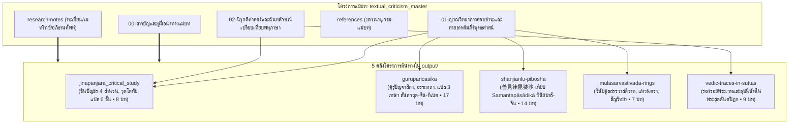

# สารบัญและคู่มือนำทางแม่บทการสอบชำระคัมภีร์พุทธศาสน์ (Master TOC & Navigation Guide)

> **โครงการแม่บท:** `textual_criticism_master`  
> **ฐานข้อมูลปฏิบัติการ:** `d:\01_APP\Research\output\2026-09-03_แม่บทการสอบชำระคัมภีร์\`  
> **สถานะ:** รายงานวิจัยฉบับสมบูรณ์ (Master Synthesis Edition)  
> **ระบบอ้างอิง:** มาตรฐาน Chicago Manual of Style (17th Edition, Notes-Bibliography System)

---

## 1. แผนผังความสัมพันธ์เชิงสถาปัตยกรรม (System Architecture Diagram)

---

## 2. สารบัญชุดรายงานแม่บท (Master Report Table of Contents)

| ลำดับไฟล์ | ชื่อบทและขอบเขตสาระสำคัญ | จำนวนคำประเมิน | ลิงก์เข้าถึงไฟล์ |
|:---:|:---|:---:|:---:|
| **00** | **สารบัญและคู่มือนำทางแม่บท (Master TOC & Navigation Guide)** • แผนผังบูรณาการ 5 โครงการต้นทาง • ระเบียบวิธีสอบเทียบและคู่มือนำทางนักวิจัย | ~4,500 | [`00-สารบัญและคู่มือนำทางแม่บท.md`](00-สารบัญและคู่มือนำทางแม่บท.md) |
| **01** | **ญาณวิทยาการสอบชำระและสายธารคัมภีร์พุทธศาสน์ (Canonical Transmission & Recensions)** • สายธารพระไตรปิฎกข้ามภาษา: บาลี สันสกฤต จีน ทิเบต • กรณีศึกษาการสอบเทียบ 《善見律毘婆沙》 กับ Samantapāsādikā • มหากาพย์คุรุปัญจาสิกาและการสังเคราะห์ไตรภาษา | ~15,000 | [`01-ญาณวิทยาการสอบชำระและสายธารคัมภีร์พุทธศาสน์.md`](01-ญาณวิทยาการสอบชำระและสายธารคัมภีร์พุทธศาสน์.md) |
| **02** | **นิรุกติศาสตร์และฉันทลักษณ์เปรียบเทียบพหุภาษา (Metrics, Philology & Hermeneutics)** • ฉันทลักษณ์ศาสตร์ตามคัมภีร์วุตโตทัยและการวิเคราะห์พระคาถาชินบัญชร • การแปลและนิรุกติศาสตร์ 6 ชั้น (Literal ถึง Esoteric) • การรื้อถอนและนิยามใหม่ของศัพท์พระเวทในพระสุตตันตปิฎก | ~14,200 | [`02-นิรุกติศาสตร์และฉันทลักษณ์เปรียบเทียบพหุภาษา.md`](02-นิรุกติศาสตร์และฉันทลักษณ์เปรียบเทียบพหุภาษา.md) |
| **Ref** | **บรรณานุกรมแม่บทแบบบูรณาการ (Integrated Master Bibliography)** • ประมวลรายการอ้างอิงคัมภีร์ปฐมภูมิ พจนานุกรม และงานวิชาการสากล | - | [`references.md`](references.md) |

---

## 3. สารบัญนำทางเชื่อมตรงสู่โครงการต้นทาง (Direct Links to Source Projects)

### 3.1 คาถาชินบัญชรและการสอบชำระ 4 สำนวน
- [`output/2026-08-31_ชำระพระคาถาชินบัญชร/final/00-สารบัญ.md`](file:///d:/01_APP/Research/output/2026-08-31_ชำระพระคาถาชินบัญชร/final/00-สารบัญ.md)
- [`01-บทนำ_ภูมิหลังประวัติศาสตร์.md`](file:///d:/01_APP/Research/output/2026-08-31_ชำระพระคาถาชินบัญชร/final/01-บทนำ_ภูมิหลังประวัติศาสตร์.md)
- [`02-สายธารตัวเขียน_การสอบเทียบ4สำนวน.md`](file:///d:/01_APP/Research/output/2026-08-31_ชำระพระคาถาชินบัญชร/final/02-สายธารตัวเขียน_การสอบเทียบ4สำนวน.md)
- [`03-การวิเคราะห์ฉันทลักษณ์วุตโตทัย.md`](file:///d:/01_APP/Research/output/2026-08-31_ชำระพระคาถาชินบัญชร/final/03-การวิเคราะห์ฉันทลักษณ์วุตโตทัย.md)
- [`04-นิรุกติศาสตร์และการแปล6ชั้น.md`](file:///d:/01_APP/Research/output/2026-08-31_ชำระพระคาถาชินบัญชร/final/04-นิรุกติศาสตร์และการแปล6ชั้น.md)

### 3.2 คัมภีร์คุรุปัญจาสิกาและการแปลเทียบ 3 ภาษา
- [`output/2026-08-25_คัมภีร์คุรุปัญจาสิกา/final/00-สารบัญ.md`](file:///d:/01_APP/Research/output/2026-08-25_คัมภีร์คุรุปัญจาสิกา/final/00-สารบัญ.md)
- [`output/2026-08-26_รายงานคัมภีร์คุรุปัญจาสิกา/final/00-สารบัญ.md`](file:///d:/01_APP/Research/output/2026-08-26_รายงานคัมภีร์คุรุปัญจาสิกา/final/00-สารบัญ.md)
- [`01-บทนำ.md`](file:///d:/01_APP/Research/output/2026-08-25_คัมภีร์คุรุปัญจาสิกา/final/01-บทนำ.md)
- [`02-ตัวบทและโครงสร้าง.md`](file:///d:/01_APP/Research/output/2026-08-25_คัมภีร์คุรุปัญจาสิกา/final/02-ตัวบทและโครงสร้าง.md)
- [`A1-บทแปลฉบับสันสกฤต.md`](file:///d:/01_APP/Research/output/2026-08-25_คัมภีร์คุรุปัญจาสิกา/final/A1-บทแปลฉบับสันสกฤต.md)
- [`A2-บทแปลฉบับจีน.md`](file:///d:/01_APP/Research/output/2026-08-25_คัมภีร์คุรุปัญจาสิกา/final/A2-บทแปลฉบับจีน.md)
- [`A3-บทแปลฉบับทิเบต.md`](file:///d:/01_APP/Research/output/2026-08-25_คัมภีร์คุรุปัญจาสิกา/final/A3-บทแปลฉบับทิเบต.md)

### 3.3 การสอบเทียบวินัยปิฎกบาลี-จีน (善見律毘婆沙)
- [`output/2026-07-13_วิจัยช่านเจี้ยนลี่ผีผัวซา/final/00-สารบัญ.md`](file:///d:/01_APP/Research/output/2026-07-13_วิจัยช่านเจี้ยนลี่ผีผัวซา/final/00-สารบัญ.md)
- [`01-บทนำและประวัติความเป็นมา.md`](file:///d:/01_APP/Research/output/2026-07-13_วิจัยช่านเจี้ยนลี่ผีผัวซา/final/01-บทนำและประวัติความเป็นมา.md)
- [`02-ปูมหลังประวัติศาสตร์การแปล.md`](file:///d:/01_APP/Research/output/2026-07-13_วิจัยช่านเจี้ยนลี่ผีผัวซา/final/02-ปูมหลังประวัติศาสตร์การแปล.md)
- [`03-บทวิเคราะห์เชิงเปรียบเทียบโครงสร้าง.md`](file:///d:/01_APP/Research/output/2026-07-13_วิจัยช่านเจี้ยนลี่ผีผัวซา/final/03-บทวิเคราะห์เชิงเปรียบเทียบโครงสร้าง.md)

### 3.4 พระวินัยมูลสรรวาสติวาทและร่องรอยพระเวท
- [`output/2026-07-12_วินัยมูลสรรวาสติวาทตราประทับ/final/00-สารบัญ.md`](file:///d:/01_APP/Research/output/2026-07-12_วินัยมูลสรรวาสติวาทตราประทับ/final/00-สารบัญ.md)
- [`output/2026-06-05_ร่องรอยพระเวทในพระสูตร/final/00-สารบัญ.md`](file:///d:/01_APP/Research/output/2026-06-05_ร่องรอยพระเวทในพระสูตร/final/00-สารบัญ.md)
- [`02-บริบทศาสนาพระเวทและอุปนิษัท.md`](file:///d:/01_APP/Research/output/2026-06-05_ร่องรอยพระเวทในพระสูตร/final/02-บริบทศาสนาพระเวทและอุปนิษัท.md)
- [`03-การวิพากษ์และล้อเลียนแนวคิดอภิปรัชญา.md`](file:///d:/01_APP/Research/output/2026-06-05_ร่องรอยพระเวทในพระสูตร/final/03-การวิพากษ์และล้อเลียนแนวคิดอภิปรัชญา.md)
