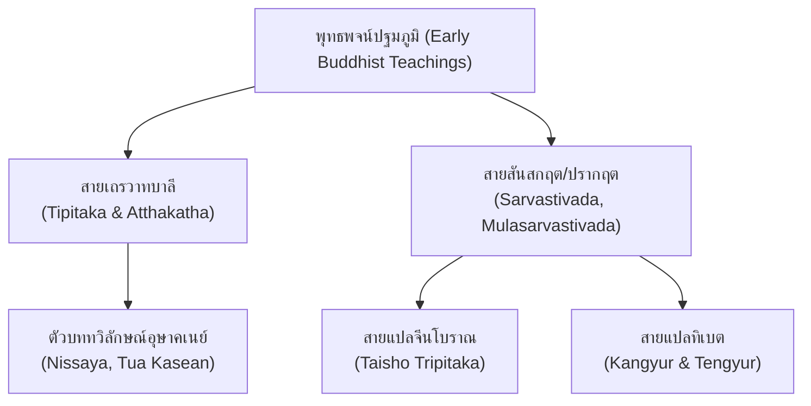

# บทที่ 1: ญาณวิทยาการสอบชำระและสายธารคัมภีร์พุทธศาสน์ (Canonical Transmission & Multi-lingual Recensions)

## 1. สายธารพระไตรปิฎกข้ามมณฑลภาษา: บาลี สันสกฤต จีน ทิเบต

การศึกษาวรรณกรรมพุทธศาสน์ระดับลึกไม่อาจจำกัดอยู่เพียงภาษาใดภาษาหนึ่ง หากแต่ต้องอาศัย "นิรุกติศาสตร์ข้ามภาษาเปรียบเทียบ" (Comparative Multi-lingual Philology) การสืบทอดพระธรรมวินัยได้แยกสายออกเป็นหลายสายธารหลักตามภูมิศาสตร์และนิกายสงฆ์โบราณ[^1]:

1. **สายธารเถรวาทภาษาบาลี (Southern Transmission):** รักษาพระไตรปิฎกภาษาบาลีในศรีลังกา พม่า ไทย ลาว และกัมพูชา ซึ่งมีความเป็นอนุรักษนิยมสูง แต่ก็มีธรรมเนียมการแทรกแก้คำ (Conjectural Emendation) ของอาลักษณ์ท้องถิ่น
2. **สายธารมหายาน-สารวาสติวาทภาษาจีน (Northern/Eastern Transmission):** ผ่านเส้นทางสายไหมสู่จีน มีการแปลพระไตรปิฎกและอรรถกถาอย่างเป็นระบบตั้งแต่ศตวรรษที่ 2 ถึง 11 ดังปรากฏในคลังมหาปิฎกต้าเจิ้งจ้าง (Taishō Tripiṭaka) ซึ่งรักษาต้นฉบับวินัยของหลายนิกายที่ฉบับอินเดียสูญหายไป
3. **สายธารวัชรยานภาษาทิเบต (Himalayan Transmission):** มีความโดดเด่นในการแปลอย่างซื่อตรงคำต่อคำ (Verbum e verbo) ภายใต้การกำกับของราชสำนักทิเบตโบราณและพจนานุกรมมหาวยุตปัตติ (Mahāvyutpatti) ทำให้สามารถสืบสร้างคำศัพท์ภาษาสันสกฤตเดิมได้อย่างแม่นยำ

---

## 2. กรณีศึกษาการสอบเทียบ 《善見律毘婆沙》 กับ Samantapāsādikā

หนึ่งในตัวอย่างที่ทรงคุณค่าที่สุดของการสอบชำระคัมภีร์ข้ามสายธาร คือความสัมพันธ์ระหว่างคัมภีร์ *《善見律毘婆沙》* (ช่านเจี้ยนลี่ผีผัวซา) กับคัมภีร์ *Samantapāsādikā* (สมันตปาสาทิกา) พระสังฆภัทระได้แปลคัมภีร์นี้เป็นภาษาจีนที่กว่างโจวในปี ค.ศ. 489 ก่อนที่พระพุทธโฆสะหรือต้นฉบับบาลีในลังกาจะถูกคัดลอกลงในใบลานยุคหลังหลายศตวรรษ[^2]

การวิเคราะห์เปรียบเทียบใน [`output/2026-07-13_วิจัยช่านเจี้ยนลี่ผีผัวซา`](file:///d:/01_APP/Research/output/2026-07-13_วิจัยช่านเจี้ยนลี่ผีผัวซา/final/03-บทวิเคราะห์เชิงเปรียบเทียบโครงสร้าง.md) ชี้ให้เห็นว่า:
- โครงสร้างปาฏิโมกข์และสิกขาบทในฉบับจีนมีความสอดคล้องกับวินัยบาลีของเถรวาทอย่างลึกซึ้ง ยืนยันว่าคัมภีร์อรรถกถาวินัยนี้มีบรรพบุรุษร่วมกับสมันตปาสาทิกาในศรีลังกา
- มีรายละเอียดทางประวัติศาสตร์และชื่อสถานที่โบราณในอินเดียและลังกาหลายแห่งที่ฉบับจีนบันทึกไว้ และช่วยแก้ความคลุมเครือในต้นฉบับใบลานบาลีที่คัดลอกผิดพลาดในยุคหลัง
- การบันทึก "จุดสังคายนา" (Dotted Record) ในคัมภีร์ฉบับจีนทำให้นักประวัติศาสตร์สามารถคำนวณปีปรินิพพานของพระพุทธเจ้าได้อย่างแม่นยำที่ 486 ก่อนคริสตกาล

---

## 3. มหากาพย์คุรุปัญจาสิกาและการสังเคราะห์ไตรภาษา

ในคัมภีร์ *Gurupañcāśikā* (คุรุปัญจาสิกา) ของอัศวโฆษ การสอบชำระตัวบทจำเป็นต้องพึ่งพาพยานเอกสาร 3 ภาษาควบคู่กัน ดังที่ประมวลไว้ใน [`output/2026-08-25_คัมภีร์คุรุปัญจาสิกา`](file:///d:/01_APP/Research/output/2026-08-25_คัมภีร์คุรุปัญจาสิกา/final/00-สารบัญ.md):
- **ฉบับสันสกฤต:** พบในคลังเอกสารเนปาล เขียนด้วยอักษรเนวารีและภูรชบัตร
- **ฉบับแปลจีน:** บันทึกในพระไตรปิฎกจีนเล่มที่ 32 (T1687) แปลโดยพระเทวศานติ (Rizhi/Faxian สมัยซ่ง)
- **ฉบับแปลทิเบต:** บันทึกในเดอร์เกตันจูร์ (Tōhoku 3721) แปลโดยปัทมากรสรีมหาชนและรินเชนซังโป (Rinchen Zangpo)

การสอบทานสามเส้านี้ช่วยให้นักวิชาการสามารถถอดรหัสข้อความตันตระที่คลุมเครือ เช่น การปฏิบัติตนต่อคุรุ การรักษาสัมมาจารวัตร และการจัดการพิธีกรรมอภิเษกได้อย่างชัดเจน ปราศจากอคติจากการคัดลอกผิดในสายธารใดสายธารหนึ่งเพียงลำพัง

---

### เชิงอรรถอ้างอิง
[^1]: ดูการแจกแจงสายธารเอกสารใน [`output/2026-09-03_แม่บทการสอบชำระคัมภีร์/research-notes/corpus-inventory.md`](../research-notes/corpus-inventory.md)
[^2]: P. V. Bapat and Akira Hirakawa, *Shan-Chien-P'i-P'o-Sha: A Chinese Version by Sanghabhadra of Samantapāsādikā* (Poona: Bhandarkar Oriental Research Institute, 1970), Introduction.
