# สารบัญและคู่มือนำทางแม่บท (Master Table of Contents & System Architecture)

> **โครงการแม่บท:** โครงการอภิวิเคราะห์และประมวลสารสนเทศตัวบททวิลักษณ์ คำแปลแทรกระหว่างบรรทัด และอรรถศาสตร์ภาษาถิ่นข้ามอารยธรรม (Comprehensive Meta-Study and Master Knowledge Architecture for Bitext, Interlinear Gloss, and Vernacular Hermeneutics)  
> **รหัสโครงการ:** `bitext_studies_master`  
> **ฐานข้อมูลปฏิบัติการ:** `d:\01_APP\Research\output\2026-09-03_แม่บทตัวบทสองภาษา\`  
> **สถานะ:** รายงานวิจัยฉบับสมบูรณ์ (Master Synthesis Edition)  
> **ระบบอ้างอิง:** มาตรฐาน Chicago Manual of Style (17th Edition, Notes-Bibliography System)

---

## 1. ปรัชญาและสถาปัตยกรรมระบบแม่บท (System Philosophy & Architecture)

โครงการแม่บทนี้ได้รับการสถาปนาขึ้นเพื่อตอบสนองต่อปัญหา "ความกระจัดกระจาย" (Dispersion) ขององค์ความรู้ด้านตัวบทสองภาษาในคลังงานวิจัย `output/` ซึ่งเดิมถูกศึกษาแยกส่วนกันเป็น 7 โครงการอิสระ แม้ว่าแต่ละโครงการจะมีความลุ่มลึกในประเด็นเฉพาะทาง (Specialized Excellence) แต่การขาดสะพานเชื่อมโยงเชิงทฤษฎีและดัชนีนำทางแบบองค์รวม ทำให้ผู้วิจัยและนักวิชาการไม่สามารถมองเห็นความเชื่อมโยงระดับโลก (Global Interconnectedness) ระหว่างธรรมเนียมการจัดการตัวบทศักดิ์สิทธิ์ในอุษาคเนย์ เอเชียตะวันออก เอเชียใต้ โลกอิสลาม และยุโรปยุคกลาง

ระบบรายงานแม่บทชุดนี้ทำหน้าที่เป็น **"สถานีแม่บทและระบบสารสนเทศบูรณาการ" (Master Knowledge Hub & Meta-Synthesis)** ที่ประสานข้อมูลเชิงลึกกว่า 60 บท (ขนาดข้อมูลรวม 5.6 MB และบรรณานุกรมกว่า 1,200 รายการ) เข้าสู่โครงสร้างสถาปัตยกรรมทางปัญญาเดียวกัน ดังแสดงในแผนผังความสัมพันธ์ต่อไปนี้:

```mermaid
graph TD
    subgraph Master_Project ["โครงการแม่บท: bitext_studies_master"]
        M0["00-สารบัญและคู่มือนำทางแม่บท"]
        M1["01-ญาณวิทยาและอนุกรมวิธานสากล"]
        M2["02-จารีตตัวเขียนและมหาภูมิภาค"]
        M3["03-อภิสังเคราะห์หกมิติเชิงทฤษฎี"]
        M4["04-แผนผังการสืบค้นและดัชนีนำทาง"]
        M5["05-มนุษยศาสตร์ดิจิทัลและวาระวิจัย"]
        MRef["references (บรรณานุกรมแม่บท)"]
        MNotes["research-notes (ทะเบียน/เมทริกซ์/อภิธานศัพท์)"]
    end

    subgraph Source_Projects ["7 คลังโครงการต้นทางใน output/"]
        P1["trent-walker-scholarship<br>(ทฤษฎี Bitexts, พืชอิงอาศัย, โสตทัศน์)"]
        P2["nissaya_studies<br>(คัมภีร์นิสสัย 12 บท: พม่า ไทย ลาว เขมร ลังกา อินเดีย)"]
        P3["interlinear-gloss-palmleaf<br>(ตัวเกษียนใบลานสยาม & ข้อค้นพบปฏิเสธอินเดีย)"]
        P4["interlinear_gloss<br>(การสำรวจกลอสส์โบราณทั่วโลก 12 อารยธรรม)"]
        P5["interlinear_gloss_18ch<br>(ภาคขยาย: ยุโรปยุคกลาง ไบแซนไทน์ ฮีบรู อิสลาม)"]
        P6["buddhist_sacred_text_gloss<br>(การรักษาความศักดิ์สิทธิ์ในพุทธศาสนา: เถรวาท มหายาน)"]
        P7["sacred_text_gloss<br>(กรอบ 6 มิติ: คริสต์ ยิว อิสลาม เอเชีย มิชชันนารี)"]
    end

    M1 --> P1
    M1 --> P6
    M1 --> P7
    M2 --> P2
    M2 --> P3
    M2 --> P4
    M2 --> P5
    M3 --> P7
    M3 --> P1
    M3 --> P2
    M4 ==> Source_Projects
    M5 --> Source_Projects
    MNotes --> Source_Projects
```

---

## 2. สารบัญชุดรายงานแม่บท (Master Report Table of Contents)

| ลำดับไฟล์ | ชื่อบทและขอบเขตเนื้อหา | จำนวนคำประเมิน | ลิงก์เข้าถึงไฟล์ |
|:---:|:---|:---:|:---:|
| **00** | **สารบัญและคู่มือนำทางแม่บท (Master TOC & System Architecture)** • ปรัชญาและแผนผังแม่บทบูรณาการ • โครงสร้างการเชื่อมโยง 7 โครงการต้นทาง • วิธีวิทยาและแนวทางการสืบค้น | ~4,500 | [`00-สารบัญและคู่มือนำทางแม่บท.md`](00-สารบัญและคู่มือนำทางแม่บท.md) |
| **01** | **ญาณวิทยาและอนุกรมวิธานสากลแห่งตัวบททวิลักษณ์ (Epistemology & Global Taxonomy)** • การรื้อถอนมายาคติอาณานิคมและทฤษฎีของ Dr. Trent Walker • นิยามเชิงภววิทยา: Bitexts vs Interlinear Gloss vs Diglot Text vs Scholia • มโนทัศน์ "การแปลแบบพืชอิงอาศัย" (Epiphytic Translation) • สถาปัตยกรรมเชิงพื้นที่ของหน้าเอกสารตัวเขียน (Spatial Architecture) | ~12,000 | [`01-ญาณวิทยาและอนุกรมวิธานสากล.md`](01-ญาณวิทยาและอนุกรมวิธานสากล.md) |
| **02** | **จารีตตัวเขียนและมหาภูมิภาคเปรียบเทียบ (Manuscript Traditions across Civilizations)** • อุษาคเนย์: นิสสัยพม่า, ตัวเกษียนสยาม, คำหาล้านนา, ร่ายวาน, สำรายเขมร • เอเชียตะวันออก: คุนเต็งและโอะโกะโตะเต็งญี่ปุ่น, กูคยอลและอนแฮเกาหลี • เอเชียใต้และหิมาลัย: ฉายา วยาขยา และข้อค้นพบเชิงปฏิเสธในใบลานอินเดีย • โลกเซมิติกและอิสลาม: ตาร์กูมยิว, มาโซราห์, มุศหัฟแทรกคำแปลเปกอน • ยุโรปยุคกลาง: กลอสส์ไอริชเก่า, แองโกล-แซกซอน, Glossa Ordinaria | ~16,500 | [`02-จารีตตัวเขียนและมหาภูมิภาค.md`](02-จารีตตัวเขียนและมหาภูมิภาค.md) |
| **03** | **อภิสังเคราะห์หกมิติเชิงทฤษฎีและอรรถศาสตร์ (6-Dimensional Theoretical Meta-Synthesis)** • มิติที่ 1: ความศักดิ์สิทธิ์ของภาษาต้นทาง (Translatable vs Untranslatable) • มิติที่ 2: สถาปัตยกรรมผังหน้าและเทคโนโลยีสื่อบันทึก • มิติที่ 3: ระดับความชอบธรรมในการแทนที่ในพิธีกรรม • มิติที่ 4: ฟังก์ชันทางสังคม (การศึกษา vs พิธีกรรม vs อุปกรณ์วิชาการ) • มิติที่ 5: ปัจจัยจำกัดทางวัสดุศาสตร์ (ใบลาน หนังสัตว์ กระดาษ) • มิติที่ 6: ญาณวิทยาแห่งเสียงและการขับขานโสตทัศน์ (Sonic Buddhism) | ~15,000 | [`03-อภิสังเคราะห์หกมิติเชิงทฤษฎี.md`](03-อภิสังเคราะห์หกมิติเชิงทฤษฎี.md) |
| **04** | **แผนผังการสืบค้นและดัชนีนำทางข้ามรายงาน (Cross-Project Concordance & Guide)** • ตารางสืบค้นเชิงประเด็น (Thematic Index) เชื่อมตรงสู่ทุกบทเดิม • ดัชนีจำแนกตามภาษาและตระกูลอักษร 14 ภาษา • แผนที่นำทางสำหรับการวิจัยเฉพาะทาง (Specialized Research Pathways) | ~9,500 | [`04-แผนผังการสืบค้นและดัชนีนำทาง.md`](04-แผนผังการสืบค้นและดัชนีนำทาง.md) |
| **05** | **มนุษยศาสตร์ดิจิทัลและวาระวิจัยในอนาคต (Digital Philology & Future Agenda)** • การสร้างคลังข้อมูลดิจิทัล: มาตรฐาน TEI XML สำหรับ Interlinear Gloss & Bitexts • เทคโนโลยี AI และ HTR (Kraken/Transkribus) ต่อตัวเกษียนและข้อความหลายชั้น • วาระวิจัยใหม่: ช่องว่างทางวิชาการและทิศทางการศึกษาในอนาคต | ~10,500 | [`05-มนุษยศาสตร์ดิจิทัลและวาระวิจัย.md`](05-มนุษยศาสตร์ดิจิทัลและวาระวิจัย.md) |
| **Ref** | **บรรณานุกรมแม่บทแบบบูรณาการ (Integrated Master Bibliography)** • ประมวลรายการอ้างอิงเอกสารปฐมภูมิ ทุติยภูมิ และงานวิชาการสากล | - | [`references.md`](references.md) |

---

## 3. เอกสารเสริมในคลังสารสนเทศ (Research Notes Infrastructure)

นอกจากชุดรายงาน 6 บทหลักแล้ว โครงการแม่บทได้จัดเตรียมเอกสารข้อมูลดิบและเครื่องมือช่วยวิจัยไว้ในโฟลเดอร์ `research-notes/`:

1. [`research-notes/corpus-inventory.md`](../research-notes/corpus-inventory.md) — ทะเบียนแจกแจงไฟล์ ขนาด และสาระสำคัญของทุกบทใน 7 โครงการหลัก
2. [`research-notes/master-concordance-matrix.md`](../research-notes/master-concordance-matrix.md) — ตารางเทียบเคียง 15 ประเพณีตัวเขียน x 7 โครงการ x กรอบวิเคราะห์ 6 มิติ
3. [`research-notes/unified-glossary.md`](../research-notes/unified-glossary.md) — อภิธานศัพท์แม่บทบูรณาการ 14 ภาษา พร้อมนิยามทางนิรุกติศาสตร์

---

## 4. คู่มือนำทางสำหรับนักวิจัย (Researcher's Navigation Guide)

ในการใช้งานระบบรายงานแม่บทนี้ ขอแนะนำแนวทางการสืบค้นตามวัตถุประสงค์ของการวิจัย ดังนี้:

- **หากต้องการเข้าใจกรอบคิดและทฤษฎีพื้นฐาน:** ให้อ่าน [`01-ญาณวิทยาและอนุกรมวิธานสากล.md`](01-ญาณวิทยาและอนุกรมวิธานสากล.md) และ [`03-อภิสังเคราะห์หกมิติเชิงทฤษฎี.md`](03-อภิสังเคราะห์หกมิติเชิงทฤษฎี.md) ควบคู่กับงานของ Dr. Trent Walker ใน [`output/2026-09-03_ทุนวิชาการเทรนต์วอล์กเกอร์`](file:///d:/01_APP/Research/output/2026-09-03_ทุนวิชาการเทรนต์วอล์กเกอร์/final/01-bilingual-bitexts-and-vernacular-hermeneutics.md)
- **หากต้องการศึกษาเปรียบเทียบเชิงภูมิภาคหรือวัฒนธรรมเฉพาะ:** ให้อ่าน [`02-จารีตตัวเขียนและมหาภูมิภาค.md`](02-จารีตตัวเขียนและมหาภูมิภาค.md) จากนั้นเปิดตารางใน [`research-notes/master-concordance-matrix.md`](../research-notes/master-concordance-matrix.md) เพื่อคลิกลิงก์ตรงไปยังรายงานเฉพาะทาง เช่น [`output/2026-08-26_คัมภีร์นิสสัย`](file:///d:/01_APP/Research/output/2026-08-26_คัมภีร์นิสสัย/final/01-บทนำ.md) หรือ [`output/2026-09-01_ตัวเกษียนใบลาน`](file:///d:/01_APP/Research/output/2026-09-01_ตัวเกษียนใบลาน/final/00-บทสรุปผู้บริหารและสารบัญ.md)
- **หากต้องการพัฒนาระบบคลังข้อมูลดิจิทัลหรือโมเดล AI/HTR:** ให้อ่าน [`05-มนุษยศาสตร์ดิจิทัลและวาระวิจัย.md`](05-มนุษยศาสตร์ดิจิทัลและวาระวิจัย.md) ซึ่งมีข้อกำหนด TEI XML และแนวทางฝึกฝนโมเดลตรวจจับตัวเกษียนใบลาน
- **หากต้องการค้นหาความหมายของศัพท์เฉพาะโบราณ:** ให้เปิด [`research-notes/unified-glossary.md`](../research-notes/unified-glossary.md) ซึ่งรวบรวมศัพท์ไว้ครบทั้ง 6 ตระกูลวัฒนธรรม
