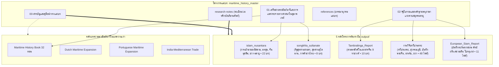

# สารบัญและคู่มือนำทางแม่บทประวัติศาสตร์พาณิชย์นาวีอุษาคเนย์ (Master TOC & Navigation Guide)

> **โครงการแม่บท:** `maritime_history_master`  
> **ฐานข้อมูลปฏิบัติการ:** `d:\01_APP\Research\output\2026-09-03_แม่บทประวัติศาสตร์พาณิชย์นาวี\`  
> **สถานะ:** รายงานวิจัยฉบับสมบูรณ์ (Master Synthesis Edition)  
> **ระบบอ้างอิง:** มาตรฐาน Chicago Manual of Style (17th Edition, Notes-Bibliography System)

---

## 1. แผนผังความสัมพันธ์เชิงสถาปัตยกรรม (System Architecture Diagram)

---

## 2. สารบัญชุดรายงานแม่บท (Master Report Table of Contents)

| ลำดับไฟล์ | ชื่อบทและขอบเขตสาระสำคัญ | จำนวนคำประเมิน | ลิงก์เข้าถึงไฟล์ |
|:---:|:---|:---:|:---:|
| **00** | **สารบัญและคู่มือนำทางแม่บท (Master TOC & Navigation Guide)** • แผนผังบูรณาการ 5 โครงการต้นทางและบทความเก่า • คู่มือนำทางนักวิจัยและการสืบค้นข้ามสายธาร | ~4,500 | [`00-สารบัญและคู่มือนำทางแม่บท.md`](00-สารบัญและคู่มือนำทางแม่บท.md) |
| **01** | **เครือข่ายพาณิชย์นาวีและการแพร่กระจายทางศาสนาในอุษาคเนย์ (Maritime Networks & Religions)** • พลวัตลมมรสุมและเส้นทางสายไหมทางทะเล (Maritime Silk Road) • คลื่นการแพร่กระจายทางศาสนา: จากพุทธ-พราหมณ์สู่การแผ่ขยายของอิสลาม • บทบาทชุมชนจีนมุสลิม กองเรือเจิ้งเหอ และการปรับตัวทางวัฒนธรรมในนูซันตารา | ~15,800 | [`01-เครือข่ายพาณิชย์นาวีและการแพร่กระจายทางศาสนาในอุษาคเนย์.md`](01-เครือข่ายพาณิชย์นาวีและการแพร่กระจายทางศาสนาในอุษาคเนย์.md) |
| **02** | **รัฐโบราณและหลักฐานพหุภาษาแห่งคาบสมุทรมลายู (Ancient Polities & Multilingual Texts)** • วิวัฒนาการรัฐเมืองท่า: พันพัน จื้อถู ตามพรลิงค์ สู่สุลต่านสงขลา • การสอบเทียบพงศาวดารราชวงศ์จีนโบราณ 9 ยุคกับโบราณคดีคาบสมุทร • มโนทัศน์ทวีปานตระ-สุวรรณภูมิ และบันทึกชาวยุโรปต่อกรุงศรีอยุธยา | ~16,200 | [`02-รัฐโบราณและหลักฐานพหุภาษาแห่งคาบสมุทรมลายู.md`](02-รัฐโบราณและหลักฐานพหุภาษาแห่งคาบสมุทรมลายู.md) |
| **Ref** | **บรรณานุกรมแม่บทแบบบูรณาการ (Integrated Master Bibliography)** • ประมวลเอกสารปฐมภูมิพหุภาษาและงานวิชาการประวัติศาสตร์สากล | - | [`references.md`](references.md) |

---

## 3. สารบัญนำทางเชื่อมตรงสู่โครงการต้นทาง (Direct Links to Source Projects)

### 3.1 โครงการอิสลามนูซันตาราและการค้าข้ามสมุทร
- [`output/2026-06-28_อิสลามนูซันตารา/final/00-สารบัญ.md`](file:///d:/01_APP/Research/output/2026-06-28_อิสลามนูซันตารา/final/00-สารบัญ.md)
- [`01-บทนำ.md`](file:///d:/01_APP/Research/output/2026-06-28_อิสลามนูซันตารา/final/01-บทนำ.md)
- [`02-เครือข่ายการค้าทางทะเล.md`](file:///d:/01_APP/Research/output/2026-06-28_อิสลามนูซันตารา/final/02-เครือข่ายการค้าทางทะเล.md)
- [`03-ทฤษฎีจุดกำเนิดและการเผยแผ่อิสลาม.md`](file:///d:/01_APP/Research/output/2026-06-28_อิสลามนูซันตารา/final/03-ทฤษฎีจุดกำเนิดและการเผยแผ่อิสลาม.md)
- [`04-บทบาทของจีนและจีนมุสลิม.md`](file:///d:/01_APP/Research/output/2026-06-28_อิสลามนูซันตารา/final/04-บทบาทของจีนและจีนมุสลิม.md)

### 3.2 โครงการประวัติศาสตร์รัฐสุลต่านสงขลา
- [`output/2026-06-27_รัฐสุลต่านสงขลา/final/00-สารบัญ.md`](file:///d:/01_APP/Research/output/2026-06-27_รัฐสุลต่านสงขลา/final/00-สารบัญ.md)
- [`01-บทนำ.md`](file:///d:/01_APP/Research/output/2026-06-27_รัฐสุลต่านสงขลา/final/01-บทนำ.md)
- [`02-การเข้ามาตะวันตก.md`](file:///d:/01_APP/Research/output/2026-06-27_รัฐสุลต่านสงขลา/final/02-การเข้ามาตะวันตก.md)
- [`03-สุลต่านสุไลมาน.md`](file:///d:/01_APP/Research/output/2026-06-27_รัฐสุลต่านสงขลา/final/03-สุลต่านสุไลมาน.md)

### 3.3 โครงการวิจัยอาณาจักรตามพรลิงค์ในเอกสารจีน
- [`output/2026-06-05_รายงานตามพรลิงค์/Chapter_01_Historiography.md`](file:///d:/01_APP/Research/output/2026-06-05_รายงานตามพรลิงค์/Chapter_01_Historiography.md)
- [`Chapter_02_Liangshu_Panpan.md`](file:///d:/01_APP/Research/output/2026-06-05_รายงานตามพรลิงค์/Chapter_02_Liangshu_Panpan.md)
- [`Chapter_05_LingwaiDaida_Dengliumei.md`](file:///d:/01_APP/Research/output/2026-06-05_รายงานตามพรลิงค์/Chapter_05_LingwaiDaida_Dengliumei.md)
- [`Chapter_06_ZhufanZhi_Danmaling.md`](file:///d:/01_APP/Research/output/2026-06-05_รายงานตามพรลิงค์/Chapter_06_ZhufanZhi_Danmaling.md)

### 3.4 โครงการวิจัยทวีปานตระและสุวรรณภูมิ
- [`output/2026-05-28_งานวิจัยทวีปานตระ/00/01_introduction.md`](file:///d:/01_APP/Research/output/2026-05-28_งานวิจัยทวีปานตระ/00/01_introduction.md)
- [`00/02_classical_sanskrit_sources.md`](file:///d:/01_APP/Research/output/2026-05-28_งานวิจัยทวีปานตระ/00/02_classical_sanskrit_sources.md)
- [`00/04_sino_sanskrit_monk_records.md`](file:///d:/01_APP/Research/output/2026-05-28_งานวิจัยทวีปานตระ/00/04_sino_sanskrit_monk_records.md)

### 3.5 รายงานแหล่งข้อมูลชาวยุโรปเกี่ยวกับสยาม
- [`output/2026-06-05_หลักฐานยุโรปเรื่องสยาม/Master_Timeline_Siam_Sources.md`](file:///d:/01_APP/Research/output/2026-06-05_หลักฐานยุโรปเรื่องสยาม/Master_Timeline_Siam_Sources.md)
- [`Dutch_Siam_Sources.md`](file:///d:/01_APP/Research/output/2026-06-05_หลักฐานยุโรปเรื่องสยาม/Dutch_Siam_Sources.md)
- [`French_Siam_Sources.md`](file:///d:/01_APP/Research/output/2026-06-05_หลักฐานยุโรปเรื่องสยาม/French_Siam_Sources.md)
