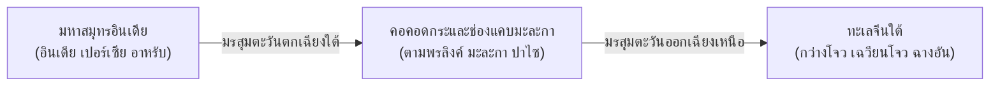

# บทที่ 1: เครือข่ายพาณิชย์นาวีและการแพร่กระจายทางศาสนาในอุษาคเนย์ (Maritime Networks & Religious Dispersal)

## 1. ลมมรสุมและภูมิศาสตร์การเดินเรือข้ามสมุทร (Monsoon Dynamics & the Maritime Silk Road)

เอเชียตะวันออกเฉียงใต้ทำหน้าที่เป็น "สะพานเชื่อมข้ามสมุทร" (Maritime Crossroads) ระหว่างอารยธรรมอินเดีย โลกอาหรับ และอารยธรรมจีน การเคลื่อนไหวของสินค้า ผู้คน และความคิดทางศาสนามิได้เกิดขึ้นอย่างสุ่มสี่สุ่มห้า หากแต่ถูกขับเคลื่อนด้วยพลังธรรมชาติของ "ลมมรสุม" (Monsoon Dynamics)[^1]:

1. **มรสุมตะวันตกเฉียงใต้ (Southwest Monsoon / พฤษภาคม–กันยายน):** พัดพากองเรือสินค้าจากอินเดียและตะวันออกกลางผ่านช่องแคบมะละกาและช่องแคบซุนดา เข้าสู่อ่าวไทยและทะเลจีนใต้ สู่เมืองท่าของจีน
2. **มรสุมตะวันออกเฉียงเหนือ (Northeast Monsoon / พฤศจิกายน–กุมภาพันธ์):** พัดพากองเรือสำเภาจีนและเรือจากอ่าวไทยล่องลงใต้กลับคืนสู่หมู่เกาะมลายูและมหาสมุทรอินเดีย

ความจำเป็นที่เรือสินค้าต้อง "ทอดสมอรอเปลี่ยนฤดูลมมรสุม" (Entrepôt Waiting System) เป็นเวลา 3 ถึง 6 เดือน ได้ผลักดันให้เกิดเมืองท่าศูนย์กลาง (Port-Polities) บริเวณคาบสมุทรและช่องแคบ เช่น ตามพรลิงค์ ไชยา ตรังกานู มะละกา ปาไซ และเมืองท่าตอนเหนือของชวา พ่อค้าชาวต่างชาติจึงตั้งถิ่นฐานชั่วคราว นำมาซึ่งการแต่งงานข้ามวัฒนธรรม การถ่ายทอดเทคโนโลยี และการหยั่งรากของระบบความเชื่อทางศาสนา

---

## 2. คลื่นแห่งศรัทธา: การเปลี่ยนผ่านจากพุทธ-พราหมณ์สู่อิสลามนูซันตารา

ประวัติศาสตร์ความคิดของอุษาคเนย์มิใช่การตัดขาด แต่เป็น "การซ้อนทับและปรับเปลี่ยนความหมาย" (Acculturation & Layering) ในยุคแรกเริ่ม อิทธิพลของศาสนาฮินดู-พุทธมหายานตันตระได้สถาปนามโนทัศน์ "ทวารวดี ศรีวิชัย และมัชฌาปาหิต" กษัตริย์ทรงดำรงสถานะเป็นสมมติเทวราชหรือพระโพธิสัตว์

อย่างไรก็ตาม ในช่วงศตวรรษที่ 13 เป็นต้นมา เครือข่ายพาณิชย์นาวีได้นำพาศาสนาอิสลามเข้ามาสู่ภูมิภาค ดังที่วิเคราะห์ใน [`output/2026-06-28_อิสลามนูซันตารา`](file:///d:/01_APP/Research/output/2026-06-28_อิสลามนูซันตารา/final/03-ทฤษฎีจุดกำเนิดและการเผยแผ่อิสลาม.md):
- **ทฤษฎีพหุสายธาร (Multi-Centric Origin):** อิสลามมิได้เข้ามาจากแหล่งเดียว หากมาจากทั้งพ่อค้ากุจราต (อินเดีย), ซาดาตฮัฎเราะเมาต์ (อาหรับ), และพ่อค้าจีนมุสลิมจากเฉวียนโจวและยูนนาน
- **บทบาทกองเรือเจิ้งเหอ (Zheng He Fleet):** ในช่วงต้นศตวรรษที่ 15 กองเรือมหาสมบัติของราชวงศ์หมิงได้สถาปนาชุมชนมุสลิมจีน (Hui) ในเมืองท่าปาเล็มบัง ชวา และสยาม ซึ่งมีบทบาทสำคัญในการเผยแผ่อิสลามยุคแรก
- **การใช้จารีตซูฟี (Sufi Hermeneutics):** ความสำเร็จของอิสลามในชวาเกิดจากกลุ่ม "วะลีซังงา" (Wali Sanga / นักบุญทั้ง 9) ที่นำคำสอนอิสลามมาประสานกลมกลืนกับศิลปะวายัง (หนังตะลุง) ดนตรีกาเมลัน และปรัชญาจักรวาลวิทยาเดิมของฮินดู-ชวา (Kejawen) ทำให้การเปลี่ยนศาสนาเป็นไปอย่างสันติและลึกซึ้ง

---

## 3. รัฐสุลต่านสงขลา: ภาพสะท้อนเครือข่ายมุสลิมนานาชาติและสงครามอ่าวไทย

กรณีศึกษาของ [`output/2026-06-27_รัฐสุลต่านสงขลา`](file:///d:/01_APP/Research/output/2026-06-27_รัฐสุลต่านสงขลา/final/00-สารบัญ.md) ชี้ให้เห็นถึงความซับซ้อนของรัฐมุสลิมในบริบทการเมืองสยาม:
- สุลต่านสุไลมาน ชาห์ เป็นผู้นำมุสลิมสายเลือดผสมเปอร์เซีย-จาม ที่สถาปนาเมืองท่าเขาแดงให้เป็นศูนย์กลางการค้าเสรีระดับนานาชาติในศตวรรษที่ 17
- สงขลาค้าขายโดยตรงกับบริษัท VOC ดัตช์ และอังกฤษ แลกเปลี่ยนข้าว ดีบุก และไม้ฝาง กับปืนใหญ่และเครื่องแก้วยุโรป
- แม้จะเกิดความขัดแย้งทางทหารกับกรุงศรีอยุธยาในรัชสมัยสมเด็จพระนารายณ์มหาราชจนเมืองถูกทำลายในปี พ.ศ. 2223 แต่ทายาทสายสุลต่านสุไลมานได้รับการยอมรับและเข้ารับราชการในราชสำนักสยาม จนกลายเป็นเสาหลักด้านการทหารและการคลังทางทะเล (เช่น พระยายมราชหมุด) ซึ่งสะท้อนถึงการหลอมรวมเครือข่ายมุสลิมเข้าเป็นเนื้อเดียวกับประวัติศาสตร์สยาม

---

### เชิงอรรถอ้างอิง
[^1]: Anthony Reid, *Southeast Asia in the Age of Commerce, 1450–1680*, Vol. 1–2 (New Haven: Yale University Press, 1988–1993); ดูรายละเอียดใน [`output/2026-06-28_อิสลามนูซันตารา/final/02-เครือข่ายการค้าทางทะเล.md`](file:///d:/01_APP/Research/output/2026-06-28_อิสลามนูซันตารา/final/02-เครือข่ายการค้าทางทะเล.md)
