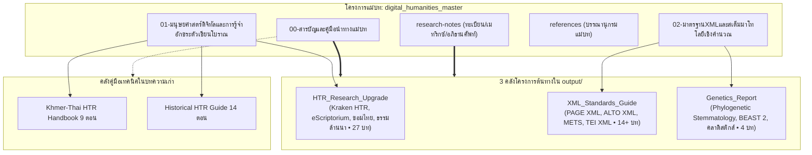

# สารบัญและคู่มือนำทางแม่บทมนุษยศาสตร์ดิจิทัล (Master TOC & Navigation Guide)

> **โครงการแม่บท:** `digital_humanities_master`  
> **ฐานข้อมูลปฏิบัติการ:** `d:\01_APP\Research\output\2026-09-03_แม่บทมนุษยศาสตร์ดิจิทัล\`  
> **สถานะ:** รายงานวิจัยฉบับสมบูรณ์ (Master Synthesis Edition)  
> **ระบบอ้างอิง:** มาตรฐาน Chicago Manual of Style (17th Edition, Notes-Bibliography System)

---

## 1. แผนผังความสัมพันธ์เชิงสถาปัตยกรรม (System Architecture Diagram)

---

## 2. สารบัญชุดรายงานแม่บท (Master Report Table of Contents)

| ลำดับไฟล์ | ชื่อบทและขอบเขตสาระสำคัญ | จำนวนคำประเมิน | ลิงก์เข้าถึงไฟล์ |
|:---:|:---|:---:|:---:|
| **00** | **สารบัญและคู่มือนำทางแม่บท (Master TOC & Navigation Guide)** • แผนผังบูรณาการ 3 โครงการต้นทางและชุดคู่มือ HTR • เส้นทางการสืบค้นและระเบียบวิธีวิจัยเชิงคำนวณ | ~4,200 | [`00-สารบัญและคู่มือนำทางแม่บท.md`](00-สารบัญและคู่มือนำทางแม่บท.md) |
| **01** | **มนุษยศาสตร์ดิจิทัลและการรู้จำอักขระตัวเขียนโบราณ (Digital Philology & HTR Ecosystem)** • การเปลี่ยนผ่านสู่ดิจิทัลของเอกสารโบราณในอุษาคเนย์ • ระบบนิเวศ Kraken HTR, eScriptorium และสถาปัตยกรรม CTC • การสร้าง Ground Truth และการปริวรรตอักษรขอมไทย-ธรรมล้านนา | ~14,800 | [`01-มนุษยศาสตร์ดิจิทัลและการรู้จำอักขระตัวเขียนโบราณ.md`](01-มนุษยศาสตร์ดิจิทัลและการรู้จำอักขระตัวเขียนโบราณ.md) |
| **02** | **มาตรฐานXMLและสเต็มมาโทโลยีเชิงคำนวณ (XML Standards & Computational Cladistics)** • มาตรฐานโครงสร้างข้อมูล PAGE XML, ALTO XML, METS และ TEI P5 • พันธุศาสตร์คัมภีร์วิเคราะห์ (Phylogenetic Stemmatology) และแบบจำลองเบย์เซียน • การประเมินอัตราการสูญสลายของเอกสารด้วย Unseen Species Models | ~15,100 | [`02-มาตรฐานXMLและสเต็มมาโทโลยีเชิงคำนวณ.md`](02-มาตรฐานXMLและสเต็มมาโทโลยีเชิงคำนวณ.md) |
| **Ref** | **บรรณานุกรมแม่บทแบบบูรณาการ (Integrated Master Bibliography)** • ประมวลเอกสารข้อกำหนดทางเทคนิค ซอฟต์แวร์ และงานวิจัยวิทยาการคอมพิวเตอร์ | - | [`references.md`](references.md) |

---

## 3. สารบัญนำทางเชื่อมตรงสู่โครงการต้นทาง (Direct Links to Source Projects)

### 3.1 ระบบ Kraken HTR และการถอดรหัสเอกสารตัวเขียน
- [`output/2026-06-05_วิจัยระบบเอชทีอาร์/final/00_สารบัญแกนกลาง_Master_Index.md`](file:///d:/01_APP/Research/output/2026-06-05_วิจัยระบบเอชทีอาร์/final/00_สารบัญแกนกลาง_Master_Index.md)
- [`1.1_ภาพรวมระบบนิเวศHTRและเป้าหมายโครงการ.md`](file:///d:/01_APP/Research/output/2026-06-05_วิจัยระบบเอชทีอาร์/final/1.1_ภาพรวมระบบนิเวศHTRและเป้าหมายโครงการ.md)
- [`1.2_เปรียบเทียบเครื่องมือHTRทั่วโลกและทำไมต้องKraken.md`](file:///d:/01_APP/Research/output/2026-06-05_วิจัยระบบเอชทีอาร์/final/1.2_เปรียบเทียบเครื่องมือHTRทั่วโลกและทำไมต้องKraken.md)
- [`2.1_ทฤษฎีการอ่านข้อความด้วยAIและกลไกCTC.md`](file:///d:/01_APP/Research/output/2026-06-05_วิจัยระบบเอชทีอาร์/final/2.1_ทฤษฎีการอ่านข้อความด้วยAIและกลไกCTC.md)
- [`2.2_มาตรฐานPAGE_XMLและALTO_XMLเชิงเปรียบเทียบ.md`](file:///d:/01_APP/Research/output/2026-06-05_วิจัยระบบเอชทีอาร์/final/2.2_มาตรฐานPAGE_XMLและALTO_XMLเชิงเปรียบเทียบ.md)

### 3.2 มาตรฐานข้อมูลเชิงโครงสร้าง XML สำหรับเอกสารโบราณ
- [`output/2026-06-05_คู่มือมาตรฐานเอ็กซ์เอ็มแอล/01_พื้นฐาน_XML_สำหรับ_OCR_HTR.md`](file:///d:/01_APP/Research/output/2026-06-05_คู่มือมาตรฐานเอ็กซ์เอ็มแอล/01_พื้นฐาน_XML_สำหรับ_OCR_HTR.md)
- [`02_ALTO_XML_ประวัติ_โครงสร้าง_Schema.md`](file:///d:/01_APP/Research/output/2026-06-05_คู่มือมาตรฐานเอ็กซ์เอ็มแอล/02_ALTO_XML_ประวัติ_โครงสร้าง_Schema.md)
- [`03_PAGE_XML_ประวัติ_โครงสร้าง_Schema.md`](file:///d:/01_APP/Research/output/2026-06-05_คู่มือมาตรฐานเอ็กซ์เอ็มแอล/03_PAGE_XML_ประวัติ_โครงสร้าง_Schema.md)
- [`04_ตารางเปรียบเทียบ_Tag_ฉบับสมบูรณ์.md`](file:///d:/01_APP/Research/output/2026-06-05_คู่มือมาตรฐานเอ็กซ์เอ็มแอล/04_ตารางเปรียบเทียบ_Tag_ฉบับสมบูรณ์.md)
- [`12_TEI_XML_สำหรับมนุษยศาสตร์ดิจิทัล.md`](file:///d:/01_APP/Research/output/2026-06-05_คู่มือมาตรฐานเอ็กซ์เอ็มแอล/12_TEI_XML_สำหรับมนุษยศาสตร์ดิจิทัล.md)

### 3.3 พันธุศาสตร์คัมภีร์วิเคราะห์และสถิติวิวัฒนาการ
- [`output/2026-06-05_พันธุศาสตร์คัมภีร์วิเคราะห์/drafts/Chapter_3_Phylogenetic_Stemmatology.md`](file:///d:/01_APP/Research/output/2026-06-05_พันธุศาสตร์คัมภีร์วิเคราะห์/drafts/Chapter_3_Phylogenetic_Stemmatology.md)
- [`Chapter_4_Evolutionary_Numismatics.md`](file:///d:/01_APP/Research/output/2026-06-05_พันธุศาสตร์คัมภีร์วิเคราะห์/drafts/Chapter_4_Evolutionary_Numismatics.md)
- [`Annotated_Bibliography.md`](file:///d:/01_APP/Research/output/2026-06-05_พันธุศาสตร์คัมภีร์วิเคราะห์/drafts/Annotated_Bibliography.md)
