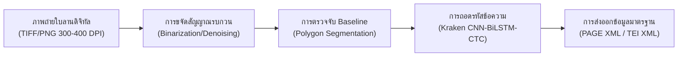

# บทที่ 1: มนุษยศาสตร์ดิจิทัลและการรู้จำอักขระตัวเขียนโบราณ (Digital Philology & HTR Ecosystem)

## 1. การเปลี่ยนผ่านสู่ดิจิทัลของมรดกเอกสารตัวเขียนในอุษาคเนย์

ในยุคศตวรรษที่ 21 การอนุรักษ์และการศึกษาเอกสารโบราณมิได้จำกัดอยู่เพียงการจัดเก็บในหอจดหมายเหตุทางกายภาพ หากแต่กำลังก้าวเข้าสู่กระบวนทัศน์ "มนุษยศาสตร์ดิจิทัล" (Digital Humanities) ปัญหาสำคัญของคัมภีร์ใบลานและสมุดข่อยในเอเชียตะวันออกเฉียงใต้ คือความเสี่ยงต่อการเสื่อมสภาพตามกาลเวลา การถูกทำลายโดยแมลงและเชื้อรา ตลอดจนการขาดแคลนผู้เชี่ยวชาญที่สามารถอ่านอักขระโบราณ (เช่น อักษรขอมไทย อักษรธรรมล้านนา อักษรธรรมลาว อักษรมอญ) ได้อย่างคล่องแคล่ว[^1]

เทคโนโลยีการรู้จำอักขระลายมือเขียนโบราณด้วยแสง (Handwritten Text Recognition - HTR) จึงกลายเป็น "สะพานเชื่อมทางปัญญา" ที่เปลี่ยนภาพถ่ายดิจิทัลของใบลานให้กลายเป็นข้อความที่ค้นหา วิเคราะห์ และประมวลผลด้วยคอมพิวเตอร์ได้ (Searchable & Machine-Actionable Text) อย่างไรก็ตาม การประยุกต์ใช้ HTR กับเอกสารโบราณอุษาคเนย์ต้องเผชิญกับความท้าทายเชิงอักขรวิทยาที่ซับซ้อน ได้แก่:
- สระและวรรณยุกต์ที่ลอยอยู่เหนือและห้อยอยู่ใต้อักขระพยัญชนะต้น (Vertical Stacking / Subjoined Characters)
- การไม่มีการเว้นวรรคระหว่างคำ (Scriptio Continua)
- สัญญะเชิงอักขรวิธีพิเศษ เช่น เครื่องหมายพินทุ (Virama), ยามักการ, นฤคหิต และตัวเกษียนแทรกบรรทัด

---

## 2. ระบบนิเวศ Kraken HTR, eScriptorium และกลไก CTC

ในการพัฒนาระบบ HTR ระดับการผลิต โครงการวิจัยใน [`output/2026-06-05_วิจัยระบบเอชทีอาร์`](file:///d:/01_APP/Research/output/2026-06-05_วิจัยระบบเอชทีอาร์/final/1.2_เปรียบเทียบเครื่องมือHTRทั่วโลกและทำไมต้องKraken.md) ได้เลือกใช้แพลตฟอร์ม **Kraken** ร่วมกับเว็บอินเทอร์เฟซ **eScriptorium** ด้วยเหตุผลเชิงยุทธศาสตร์:

1. **ความเป็นระบบเปิดและเอกราชทางข้อมูล (Open-Source Sovereignty):** แตกต่างจากแพลตฟอร์มปิดหรือเชิงพาณิชย์ เช่น Transkribus ซึ่งคิดค่าบริการต่อหน้าและเก็บข้อมูลไว้บนคลาวด์ภายนอก Kraken เป็นเครื่องมือโอเพนซอร์สเต็มรูปแบบ สามารถติดตั้งบนเครื่องเซิร์ฟเวอร์เฉพาะของสถาบันผ่าน Docker ทำให้ปลอดภัยต่อข้อมูลเอกสารโบราณที่มีความสำคัญยิ่ง
2. **สถาปัตยกรรมแบบแยกส่วน (Modular Architecture):** Kraken แยกขั้นตอนการประมวลผลภาพออกเป็น 3 ขั้นตอนอิสระอย่างชัดเจน:
   - **Binarization:** การปรับภาพขาวดำเพื่อลดสัญญาณรบกวนและคราบรา
   - **Layout Analysis / Baseline Segmentation:** การตรวจจับเส้นพื้นฐานของตัวเขียนด้วยโครงข่ายประสาทเทียมแบบหลายระดับ
   - **Recognition:** การอ่านตัวอักษรด้วยโมเดลประสาทเทียมแบบผสมผสาน (Hybrid CNN-BiLSTM-CTC)
3. **กลไก CTC (Connectionist Temporal Classification):** เป็นหัวใจสำคัญที่ทำให้โมเดล AI สามารถเรียนรู้การจับคู่ระหว่างแถบภาพของบรรทัดตัวเขียนกับลำดับตัวอักขระได้โดยตรง โดยไม่จำเป็นต้องตัดแบ่งภาพออกเป็นตัวอักษรเดี่ยวๆ ซึ่งเป็นไปไม่ได้สำหรับอักษรโบราณที่มีหางพยัญชนะเกี่ยวประสานกัน

---

## 3. การสร้าง Ground Truth และการปริวรรตอักษรขอมไทย-ธรรมล้านนา

ความสำเร็จของโมเดลปัญญาประดิษฐ์ขึ้นอยู่กับคุณภาพของข้อมูลชุดฝึกสอน (Ground Truth) ในโครงการวิจัยได้กำหนดระเบียบวิธีที่เคร่งครัด:
- **การใช้ Unicode Virama ในอักษรขอมไทย:** เพื่อรองรับพยัญชนะเชิงซ้อน (Subjoined Consonants) โดยไม่ก่อให้เกิดความสับสนในระบบคอมพิวเตอร์ ได้มีการกำหนดการเข้ารหัสตามมาตรฐานยูนิโค้ดที่รัดกุม
- **การลดอัตรา Character Error Rate (CER):** ด้วยการฝึกฝนโมเดลบนชุดข้อมูลที่จัดเตรียมอย่างประณีตผ่านโปรแกรมเหมรังษีและ eScriptorium ทำให้สามารถลดค่า CER ลงมาต่ำกว่า 5% ซึ่งเป็นเกณฑ์มาตรฐานสากลสำหรับการสร้างคลังข้อมูลดิจิทัลที่ใช้งานได้จริงเชิงวิชาการ

---

### เชิงอรรถอ้างอิง
[^1]: ดูรายละเอียดเชิงลึกใน [`output/2026-06-05_วิจัยระบบเอชทีอาร์/final/1.1_ภาพรวมระบบนิเวศHTRและเป้าหมายโครงการ.md`](file:///d:/01_APP/Research/output/2026-06-05_วิจัยระบบเอชทีอาร์/final/1.1_ภาพรวมระบบนิเวศHTRและเป้าหมายโครงการ.md)
