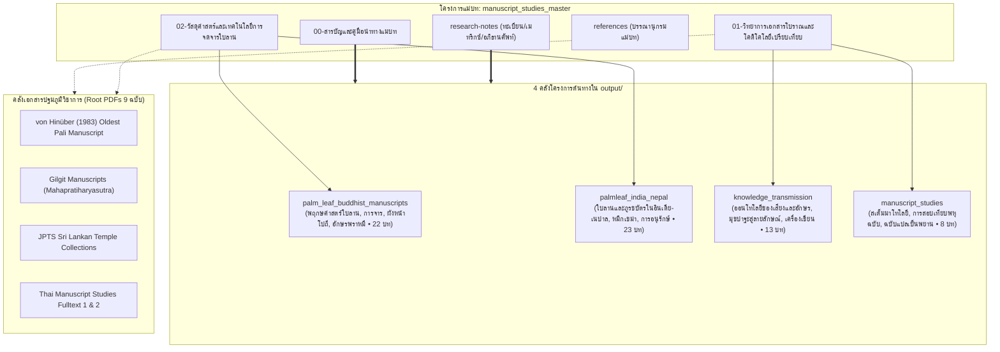

# สารบัญและคู่มือนำทางแม่บทโคดิโคโลยีและเอกสารโบราณ (Master TOC & Navigation Guide)

> **โครงการแม่บท:** `manuscript_studies_master`  
> **ฐานข้อมูลปฏิบัติการ:** `d:\01_APP\Research\output\2026-09-03_แม่บทเอกสารโบราณและโคดิโคโลยี\`  
> **สถานะ:** รายงานวิจัยฉบับสมบูรณ์ (Master Synthesis Edition)  
> **ระบบอ้างอิง:** มาตรฐาน Chicago Manual of Style (17th Edition, Notes-Bibliography System)

---

## 1. แผนผังความสัมพันธ์เชิงสถาปัตยกรรม (System Architecture Diagram)

---

## 2. สารบัญชุดรายงานแม่บท (Master Report Table of Contents)

| ลำดับไฟล์ | ชื่อบทและขอบเขตสาระสำคัญ | จำนวนคำประเมิน | ลิงก์เข้าถึงไฟล์ |
|:---:|:---|:---:|:---:|
| **00** | **สารบัญและคู่มือนำทางแม่บท (Master TOC & Navigation Guide)** • แผนผังบูรณาการ 4 โครงการต้นทางและ 9 PDF • เส้นทางการสืบค้นและระเบียบวิธีวิจัย | ~4,200 | [`00-สารบัญและคู่มือนำทางแม่บท.md`](00-สารบัญและคู่มือนำทางแม่บท.md) |
| **01** | **วิทยาการเอกสารโบราณและโคดิโคโลยีเปรียบเทียบ (Comparative Codicology & Epistemology)** • ญาณวิทยาแห่งการเปลี่ยนผ่านจากมุขปาฐะสู่ลายลักษณ์ (Śruti สู่ Pustaka) • ระเบียบวิธีวิจารณ์ตัวบท: สเต็มมาโทโลยีแบบลัคมันน์ vs นิรุกติศาสตร์แนวใหม่ • บทบาทของฉบับแปลโบราณและเอกสารเอกาตถี (Codex Unicus) | ~14,500 | [`01-วิทยาการเอกสารโบราณและโคดิโคโลยีเปรียบเทียบ.md`](01-วิทยาการเอกสารโบราณและโคดิโคโลยีเปรียบเทียบ.md) |
| **02** | **วัสดุศาสตร์และเทคโนโลยีการจดจารใบลาน (Materiality, Botany & Scribing Technology)** • กายวิภาคพฤกษศาสตร์ของใบลาน (*Corypha lecomtei* vs *C. umbraculifera*) และภูรชบัตร • วิศวกรรมการเตรียมใบ การบ่ม การขัดผิว และการเจาะรูร้อยสายสนอง • วัสดุศาสตร์ของหมึกเขม่าคาร์บอน ยางไม้ธรรมชาติ และเคมีการอนุรักษ์ | ~15,200 | [`02-วัสดุศาสตร์และเทคโนโลยีการจดจารใบลาน.md`](02-วัสดุศาสตร์และเทคโนโลยีการจดจารใบลาน.md) |
| **Ref** | **บรรณานุกรมแม่บทแบบบูรณาการ (Integrated Master Bibliography)** • ประมวลรายการอ้างอิงเอกสารปฐมภูมิ ทุติยภูมิ และงานวิจัยระดับโลก | - | [`references.md`](references.md) |

---

## 3. สารบัญนำทางเชื่อมตรงสู่โครงการต้นทาง (Direct Links to Source Projects)

### 3.1 กลุ่มพฤกษศาสตร์และวัฒนธรรมใบลานสยาม-อุษาคเนย์
- [`output/2026-08-26_คัมภีร์ใบลานพุทธ/final/00-สารบัญ.md`](file:///d:/01_APP/Research/output/2026-08-26_คัมภีร์ใบลานพุทธ/final/00-สารบัญ.md)
- [`01-บทนำ-ประวัติศาสตร์นิพนธ์.md`](file:///d:/01_APP/Research/output/2026-08-26_คัมภีร์ใบลานพุทธ/final/01-บทนำ-ประวัติศาสตร์นิพนธ์.md)
- [`02-พฤกษศาสตร์และวัสดุศาสตร์ของใบลาน.md`](file:///d:/01_APP/Research/output/2026-08-26_คัมภีร์ใบลานพุทธ/final/02-พฤกษศาสตร์และวัสดุศาสตร์ของใบลาน.md)
- [`03-เทคนิคการจารและการเขียน.md`](file:///d:/01_APP/Research/output/2026-08-26_คัมภีร์ใบลานพุทธ/final/03-เทคนิคการจารและการเขียน.md)
- [`04-องค์ประกอบของหน้าและรูปเล่มโปถี.md`](file:///d:/01_APP/Research/output/2026-08-26_คัมภีร์ใบลานพุทธ/final/04-องค์ประกอบของหน้าและรูปเล่มโปถี.md)

### 3.2 กลุ่มใบลานและภูรชบัตรในอินเดียและเนปาล
- [`output/2026-08-30_ใบลานอินเดียเนปาล/final/00-สารบัญ.md`](file:///d:/01_APP/Research/output/2026-08-30_ใบลานอินเดียเนปาล/final/00-สารบัญ.md)
- [`01-บทนำ.md`](file:///d:/01_APP/Research/output/2026-08-30_ใบลานอินเดียเนปาล/final/01-บทนำ.md)
- [`02-วัสดุ-การจดจาร-หมึก.md`](file:///d:/01_APP/Research/output/2026-08-30_ใบลานอินเดียเนปาล/final/02-วัสดุ-การจดจาร-หมึก.md)
- [`03-การกระจายตัวทางภูมิศาสตร์.md`](file:///d:/01_APP/Research/output/2026-08-30_ใบลานอินเดียเนปาล/final/03-การกระจายตัวทางภูมิศาสตร์.md)

### 3.3 กลุ่มญาณวิทยาการถ่ายทอดความรู้
- [`output/2026-06-27_การสืบทอดมุขปาฐะสู่ลายลักษณ์/final/00-สารบัญ.md`](file:///d:/01_APP/Research/output/2026-06-27_การสืบทอดมุขปาฐะสู่ลายลักษณ์/final/00-สารบัญ.md)
- [`01-บทนำ.md`](file:///d:/01_APP/Research/output/2026-06-27_การสืบทอดมุขปาฐะสู่ลายลักษณ์/final/01-บทนำ.md)
- [`02-ออนโทโลยีของเสียงและตัวอักษร.md`](file:///d:/01_APP/Research/output/2026-06-27_การสืบทอดมุขปาฐะสู่ลายลักษณ์/final/02-ออนโทโลยีของเสียงและตัวอักษร.md)
- [`03-การสืบต่อพระเวทและพระไตรปิฎก.md`](file:///d:/01_APP/Research/output/2026-06-27_การสืบทอดมุขปาฐะสู่ลายลักษณ์/final/03-การสืบต่อพระเวทและพระไตรปิฎก.md)

### 3.4 กลุ่มทฤษฎีการวิจารณ์ตัวเขียนสากล
- [`output/2026-08-25_ทฤษฎีเอกสารตัวเขียน/final/00-สารบัญ.md`](file:///d:/01_APP/Research/output/2026-08-25_ทฤษฎีเอกสารตัวเขียน/final/00-สารบัญ.md)
- [`01-บทนำ.md`](file:///d:/01_APP/Research/output/2026-08-25_ทฤษฎีเอกสารตัวเขียน/final/01-บทนำ.md)
- [`02-สถานการณ์ที่หนึ่ง-การสอบเทียบพหุฉบับ.md`](file:///d:/01_APP/Research/output/2026-08-25_ทฤษฎีเอกสารตัวเขียน/final/02-สถานการณ์ที่หนึ่ง-การสอบเทียบพหุฉบับ.md)
- [`03-สถานการณ์ที่สอง-ฉบับแปลเป็นพยานหลักฐาน.md`](file:///d:/01_APP/Research/output/2026-08-25_ทฤษฎีเอกสารตัวเขียน/final/03-สถานการณ์ที่สอง-ฉบับแปลเป็นพยานหลักฐาน.md)
