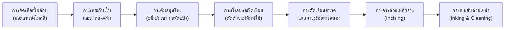

# บทที่ 2: วัสดุศาสตร์และเทคโนโลยีการจดจารใบลาน (Materiality, Botany & Scribing Technology)

## 1. กายวิภาคพฤกษศาสตร์ของใบลานและสื่อบันทึกโบราณในเอเชีย

สื่อบันทึกอินทรีย์หลักที่รองรับภูมิปัญญาของอารยธรรมเอเชียใต้และอุษาคเนย์คือ "ใบลาน" ซึ่งมาจากพืชตระกูลปาล์มสกุล *Corypha* การวิเคราะห์ทางพฤกษศาสตร์และโคดิโคโลยีเปรียบเทียบระหว่างสยาม อินเดีย และเนปาล แสดงให้เห็นความแตกต่างของชนิดพันธุ์อย่างมีนัยสำคัญ[^1]:

1. **ใบลานพันธุ์ลานบ้าน หรือ ทัลลิปอต (*Corypha umbraculifera* L.):** เป็นพันธุ์หลักที่ใช้ในอินเดียใต้ ศรีลังกา และพม่า ใบมีขนาดกว้าง เนื้อหนา แผ่นใบเหนียว ทนทานต่อการขีดเขียนด้วยน้ำหมึกและการจาร ลานชนิดนี้ออกดอกเพียงครั้งเดียวเมื่ออายุ 40–80 ปีแล้วยืนต้นตาย
2. **ใบลานพันธุ์ลานป่า หรือ ลานพร้าว (*Corypha lecomtei* Becc.):** เป็นพันธุ์พื้นถิ่นที่พบมากในลุ่มน้ำเจ้าพระยา ภาคตะวันออก และภาคอีสานของไทย แผ่นใบมีความเหนียวแน่น ทนทานต่อความชื้นสูง และมีไขเคลือบผิวตามธรรมชาติที่เหมาะอย่างยิ่งสำหรับการจารด้วยเหล็กจาร
3. **ภูรชบัตร (*Betula utilis* D. Don):** ในภูมิภาคหิมาลัย แคชเมียร์ และเนปาล สื่อบันทึกหลักคือเปลือกชั้นในของต้นเบิร์ชหิมาลัย ซึ่งมีคุณสมบัติคล้ายกระดาษธรรมชาติ มีสารทาร์ (Betulin) ที่ป้องกันการกัดกินของแมลงและเชื้อราตามธรรมชาติได้อย่างดีเยี่ยม

---

## 2. วิศวกรรมการผลิตและเทคโนโลยีการแปรรูปใบลาน

กระบวนการเปลี่ยนใบไม้สดให้กลายเป็นสื่อบันทึกที่คงทนถาวรนับร้อยปี อาศัยภูมิปัญญาทางเคมีและวิศวกรรมวัสดุดั้งเดิมอย่างน่าทึ่ง ดังที่บันทึกไว้ใน [`output/2026-08-26_คัมภีร์ใบลานพุทธ`](file:///d:/01_APP/Research/output/2026-08-26_คัมภีร์ใบลานพุทธ/final/02-พฤกษศาสตร์และวัสดุศาสตร์ของใบลาน.md):

1. **การต้มขจัดแป้งและน้ำตาล:** นำใบสดมาต้มในน้ำที่ผสมสารสกัดจากธรรมชาติ เช่น ฝักส้มป่อย ขมิ้น หรือน้ำขี้เถ้า เพื่อสลายสารไฮโดรคาร์บอนและแป้งในเซลล์พืช ซึ่งเป็นอาหารของแมลงและเชื้อรา
2. **การรีดและกดทับด้วยแม่พิมพ์ (Pressing):** เมื่อใบแห้งหมาด จะถูกนำมามัดรวมกันเป็นฟ่อนใหญ่และกดทับด้วย "แม่พิมพ์ไม้ประกับคีบ" ขันเกลียวให้แน่นหนาเพื่อป้องกันการบิดงอและทำให้ผิวเรียบเสมอกัน
3. **การตัดเจียนและการเจาะรูร้อยสายสนอง (Puncturing):** การเจาะรูบนใบลานต้องมีความแม่นยำทางเรขาคณิต โดยทั่วไปจะเจาะ 2 รูที่ระยะสมมาตรจากปลายใบ เพื่อร้อย "สายสนอง" (ถักจากด้ายฝ้ายหรือไหม) ให้สามารถพลิกเปิดอ่านได้อย่างสะดวกโดยไม่ทำให้ใบลานฉีกขาด

---

## 3. กายวิภาคของหมึกเขม่าคาร์บอนและเคมีการอนุรักษ์เชิงวิทยาศาสตร์

ความแตกต่างทางเทคโนโลยีการบันทึกระหว่างวัฒนธรรมใบลานอินเดียกับสยามอยู่ที่ "วิธีการสร้างรอยอักษร":
- **ในอินเดียเหนือและเนปาล:** นิยมใช้ "พู่กันหรือปากกาก้านอ้อ" (Kalam) เขียนด้วยหมึกเขม่าคาร์บอนลงบนผิวใบลานหรือภูรชบัตรโดยตรง น้ำหมึกผลิตจากเขม่าควันตะเกียงน้ำมันผสมกับกาวธรรมชาติจากยางกระถิน (Gum Arabic)
- **ในสยามและอุษาคเนย์:** นิยมใช้ "เหล็กจาร" (Iron Stylus) กรีดลงบนผิวหน้าใบลานให้เกิดเป็นร่องลึก จากนั้นจึงเข้าสู่ขั้นตอน "การลบเส้น" (Inking) โดยใช้น้ำมันยาง (Dipterocarpus alatus resin) ผสมกับเขม่าก้นหม้อหรือผงถ่านละเอียด ทาชโลมลงบนผิวใบลานให้น้ำหมึกแทรกตัวเข้าไปฝังแน่นในรอยจาร แล้วจึงใช้ทรายแห้งหรือขี้เลื่อยขัดถูผิวหน้าจนสะอาด ตัวอักษรสีดำขลับจึงปรากฏขึ้นอย่างถาวรและไม่ละลายน้ำ[^2]

ในการอนุรักษ์สมัยใหม่ การทำความเข้าใจองค์ประกอบทางเคมีของน้ำมันยางและไขพืชช่วยให้ผู้เชี่ยวชาญสามารถเลือกสารทำความสะอาดและน้ำมันบำรุง (เช่น สารสกัดน้ำมันสนบริสุทธิ์ หรือ Polyethylene Glycol) เพื่อคืนความยืดหยุ่นให้แก่ใบลานกรอบหักได้อย่างมีประสิทธิภาพสูงสุด

---

### เชิงอรรถอ้างอิง
[^1]: ดูข้อมูลเปรียบเทียบใน [`output/2026-08-30_ใบลานอินเดียเนปาล/final/02-วัสดุ-การจดจาร-หมึก.md`](file:///d:/01_APP/Research/output/2026-08-30_ใบลานอินเดียเนปาล/final/02-วัสดุ-การจดจาร-หมึก.md)
[^2]: กรมศิลปากร, *คู่มือการอนุรักษ์เอกสารโบราณใบลานและสมุดข่อย* (กรุงเทพฯ: สำนักหอสมุดแห่งชาติ, 2554), 25–38.
