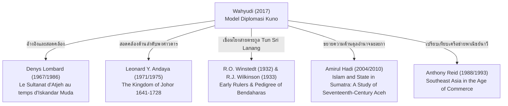

# บันทึกการอ่านและวิเคราะห์เอกสารฉบับสมบูรณ์ (Source Analysis Dossier)
## Model Diplomasi Kuno di Nusantara: Kasus Kesultanan Aceh dan Johor Abad XVI – XVII (2017)

---

### ส่วนที่ 1: ข้อมูลบรรณานุกรมและการอ้างอิงมาตรฐาน (Bibliographic Metadata)

- **Source ID:** `S-2017-wahyudi-01`
- **ชื่อไฟล์ PDF ต้นฉบับ:** `2017-Wahyudi-Model_Diplomasi_Kuno_di_Nusantara_Kasus_Kesultanan_Aceh_dan_.pdf`
- **ชื่อไฟล์ข้อความสกัด:** `S-2017-wahyudi-01.txt`
- **ประเภทเอกสาร:** บทความวิจัยในวารสารวิชาการระดับชาติที่มีผู้ทรงคุณวุฒิประเมิน (Peer-Reviewed Academic Journal Article)
- **ชื่อวารสาร:** *Buletin Al-Turas: Mimbar Sejarah, Sastra, Budaya, dan Agama*
- **ปีที่พิมพ์และฉบับที่:** ปีที่ 23 ฉบับที่ 1 (Vol. 23 No. 1), มกราคม 2017 (Januari 2017), หน้า 37–53
- **สถาบันเจ้าของวารสาร:** คณะอักษรศาสตร์และมนุษยศาสตร์ มหาวิทยาลัยอิสลามแห่งรัฐชารีฟ ฮิดายาตุลลอฮ์ จาการ์ตา (Fakultas Adab dan Humaniora, Universitas Islam Negeri Syarif Hidayatullah Jakarta)
- **เลขมาตรฐานสากลประจำวารสาร:** ISSN 0853-1692 (Print), E-ISSN 2579-3209
- **ผู้เขียน:** โจฮัน วะฮ์ยูดี (Johan Wahyudi)  
  *สังกัดทางวิชาการ:* Fakultas Adab dan Humaniora, Universitas Islam Negeri Syarif Hidayatullah Jakarta, Indonesia
- **ภาษาของเอกสาร:** ภาษาอินโดนีเซียวิชาการ (พร้อมบทคัดย่อภาษาอังกฤษและภาษาอินโดนีเซีย และการอ้างอิงเอกสารตัวบทตัวเขียนโบราณภาษามลายูอักษรยาวีและวรรณกรรมราชสำนัก)
- **รูปแบบการอ้างอิงฉบับเต็มระบบ Chicago/Turabian (17th ed.) Notes-Bibliography:**  
  Wahyudi, Johan. "Model Diplomasi Kuno di Nusantara: Kasus Kesultanan Aceh dan Johor Abad XVI – XVII." *Buletin Al-Turas: Mimbar Sejarah, Sastra, Budaya, dan Agama* 23, no. 1 (2017): 37–53.
- **รูปแบบการอ้างอิงย่อในเชิงอรรถ (Short Note):**  
  Wahyudi, "Model Diplomasi Kuno di Nusantara," 37–53.

---

### ส่วนที่ 2: แผนผังการจัดสรรเข้าสู่บทและหัวข้อย่อยของหนังสือ (Chapter & Section Mapping Matrix)

ข้อมูลเชิงประจักษ์ กรอบแนวคิดเชิงทฤษฎี และหลักฐานประวัติศาสตร์จากบทความของ Johan Wahyudi (2017) ได้รับการประมวลและจัดสรรเข้าสู่โครงสร้างหนังสือวิชาการว่าด้วยราชมนเทียรศึกษานูซันตารา ดังนี้:

#### 1. การจัดสรรสู่บทที่ 2: การทูตและพิธีต้อนรับราชทูตในราชสำนักมลายู-นูซันตารา (Diplomacy and Court Protocol in the Malay-Nusantara World)
- **หัวข้อย่อย 2.1 พลวัตการทูตไตรเส้า มะละกา-ยะโฮร์-อาเจะฮ์-โปรตุเกส (Triangular Geopolitics & Thalassocratic Diplomacy):**  
  ใช้ข้อมูลการแข่งขันเชิงยุทธศาสตร์ระหว่างรัฐสุลต่านอาเจะฮ์ดารุสซาลามและรัฐสุลต่านยะโฮร์ ภายหลังการล่มสลายของมะละกาในปี ค.ศ. 1511 ซึ่งนำไปสู่การก่อตั้งราชธานียะโฮร์ริมแม่น้ำยะโฮร์โดยสุลต่านมะห์มุด ชาห์ และสุลต่านอะลาอุดดิน รีอายัต ชาห์ที่ 2 เพื่อควบคุมเส้นทางพาณิชย์นาวีช่องแคบมะละกา [PAGE: 2–5, น. 38–41]
- **หัวข้อย่อย 2.2 การทูตผ่านการอภิเษกสมรสราชสำนัก (Dynastic Marriages as Ancient Diplomatic Model):**  
  ประยุกต์ทฤษฎีการทูตโบราณว่าด้วยการสมรสทางการเมือง (Harold Nicolson 1942; Samuel A. Meier 2002) ในบริบทราชสำนักมลายู: การขอวิวาห์ของลักษมณานาดินแห่งยะโฮร์ต่อเจ้าหญิงอาเจะฮ์ในสมัยสุลต่านซาลาฮุดดีน (ค.ศ. 1530–1537) ด้วยการถวายสินสอดหมากหลวง "รานุบกงฮาบา" (*ranubkong haba*), การส่งกองทหารเกียรติยศนำโดยปังลีมาบูกิตแห่งลิงกากาโยไปคุ้มกันการตั้งราชธานีเกาะลิงกา, การอภิเษกสมรสเชื่อมไมตรีปี ค.ศ. 1574 ในรัชสมัยสุลต่านฮุเซน อาลี รีอายัต ชาห์, และการอภิเษกสมรสระหว่างสุลต่านอิสกันดาร์ มูดา กับปูตรีปะหัง (ปูตรีกามาลียะฮ์) ภายหลังศึกบูกิตเซอลูยุต ค.ศ. 1613 [PAGE: 1, 7–8, 10–12, น. 37, 43–44, 46–48]
- **หัวข้อย่อย 2.3 พระราชพิธีและการรับรองพระราชอาคันตุกะ ณ พระมณเฑียรสถาน (Royal Reception & Court Spatiality):**  
  การใช้พื้นที่เขตพระราชฐานชั้นในเพื่อรับรองคณะราชทูตและพระบรมวงศานุวงศ์ที่ถูกกวาดต้อนมาในฐานะแขกเมืองกิตติมศักดิ์ มิใช่เชลยศึกธรรมดา การจัดสร้างสวนหลวงและพระตำหนักกูโนงัน (*Gunongan*) กลางพระราชวังดาแลมอาเจะฮ์ เพื่อเป็นสัญลักษณ์แห่งความรักและเกียรติยศของพระมเหสีฝ่ายใน [PAGE: 8, น. 44]
- **หัวข้อย่อย 2.4 พันธมิตรทางทหารข้ามทวีป: อาเจะฮ์กับจักรวรรดิออตโตมัน (The Ottoman-Acehnese Military Alliance):**  
  การทูตเชิงดุลอำนาจทางทะเลของอาเจะฮ์ผ่านการส่งคณะทูตไปยังอิสตันบูลเพื่อเจริญสัมพันธไมตรีกับราชสำนักออตโตมัน การได้รับกองหนุนทางทหาร อาวุธปืนใหญ่ และผู้เชี่ยวชาญการศึกจากตุรกี (*bala bantuan dari Turki*) ในการทำสงครามปิดล้อมป้อมมะละกา ค.ศ. 1568 [PAGE: 7, น. 43]

#### 2. การจัดสรรสู่บทที่ 6: การเปรียบเทียบการทูตราชสำนัก (Comparative Court Diplomacy: Southeast Asia & Beyond)
- **หัวข้อย่อย 6.1 แบบจำลองการทูตเชิงอำนาจและแบบจำลองแห่งความสงบ (Model Penundukkan vs. Model Ketenangan):**  
  นำกรอบมโนทัศน์ของ Harold Nicolson (1942) มาเปรียบเทียบระหว่าง "การทูตแบบใช้อำนาจสยบยอม/แสนยานุภาพทางทหาร" (*diplomasi penundukkan/militer*) ของสุลต่านอิสกันดาร์ มูดา ในการจัดระเบียบรัฐมลายูตามอุดมการณ์รวมกลุ่มมลายู (*Pan-Melayu / Pan-Malayanism*) กับ "การทูตแห่งความสงบ" (*model ketenangan*) ผ่านการสมรสเครือญาติและการแลกเปลี่ยนองค์ความรู้ทางปัญญา [PAGE: 7–10, น. 43–46]
- **หัวข้อย่อย 6.2 การทูตทางปัญญาและการถ่ายทอดวรรณกรรมราชสำนัก (Intellectual Diplomacy & Statecraft Texts):**  
  การวิเคราะห์บทบาทของตำราจริยศาสตร์การปกครอง *Taj al-Salatin* ของ Bukhari al-Jauhari ในฐานะคัมภีร์ธรรมราชาและคู่มือราชสำนักร่วมระหว่างอาเจะฮ์กับยะโฮร์, การส่งผ่านพงศาวดารประวัติศาสตร์ *Sulalatussalatin* โดยตวนศรีลานัง (*Tun Sri Lanang*) สู่ราชสำนักอาเจะฮ์ และการถูกอ้างอิงเป็นรากฐานประวัติศาสตร์มลายูในมหากาพย์สารานุกรม *Bustanussalatin* ของ นูรุดดีน อัร-รานีรี (*Nuruddin ar-Raniri*) [PAGE: 12–14, น. 48–50]
- **หัวข้อย่อย 6.3 ดุลยภาพระหว่างกฎหมายอิสลามกับจารีตประเพณีท้องถิ่น (Syariah/Siyar and Adat Meukuta Alam):**  
  การผสานกฎหมายระหว่างประเทศของอิสลามว่าด้วยสัญญาสันติภาพและการปฏิบัติต่อเชลยเมืองเข้ากับจารีตการปกครองมลายู (*Adat Meukuta Alam / Hadih Maja*) และการจัดตั้งสภาผู้แทนราษฎรโบราณ "บาไลมาเจลิสมะฮ์กามะฮ์รักยัต" (*Balai Majelis Mahkamah Rakyat*) [PAGE: 12, น. 48]

#### 3. การจัดสรรสู่บทที่ 1: บทนำและกรอบทฤษฎีราชมนเทียรศึกษานูซันตารา
- **หัวข้อย่อย 1.3 มโนทัศน์เรื่องศูนย์กลางอำนาจทางทะเลและการสร้างพันธมิตรเครือญาติ:**  
  การวิเคราะห์ทฤษฎีการค้าทางทะเลในมหาสมุทรอินเดีย (K.N. Chaudhuri 1989; Fernand Braudel 1982) ที่ผลักดันให้เกิดการจัดวางระบบการทูตราชสำนักเพื่อปกป้องเส้นทางการค้าเครื่องเทศและสินค้าออกสำคัญ เช่น พริกไทย [PAGE: 3–4, 5–6, น. 39–40, 41–42]

#### 4. การจัดสรรสู่บทที่ 5: กฎมณเฑียรบาล จารีตประเพณี และการบริหารราชสำนัก
- **หัวข้อย่อย 5.3 โครงสร้างการปกครองราชสำนักและขุนนางท้องถิ่น:**  
  การสถาปนาตำแหน่ง "อูเลบาลัง" (*Uleebalang*) หรือเจ้าเมืองผู้ปกครองแคว้นในอาเจะฮ์ กรณีแต่งตั้ง ตวนศรีลานัง เป็นอูเลบาลังคนแรกแห่งซามาลังกา (*Uleebalang pertama di Samalanga*) ผ่านพิธีกรรมเสี่ยงทายทางสัญลักษณ์ "ซาเยมบาราแหวนหลวง" (*Sayembara Cincin Sultan*) [PAGE: 8, 13–14, น. 44, 49–50]

---

### ส่วนที่ 3: ข้อความโควต์อัญพจน์ปฐมภูมิ/ทุติยภูมิแท้พร้อมเลขหน้ากำกับ (Authentic Primary & Secondary Quotes with Page Citations)

การสกัดข้อความยกอ้างโดยตรงจากไฟล์ `S-2017-wahyudi-01.txt` กำกับเลขหน้าภายในระบบเอกสาร (`PAGE: X`) และเลขหน้าจริงในวารสาร *Buletin Al-Turas* (น. 37–53) พร้อมคำแปลภาษาไทยและการวิเคราะห์เชิงบริบท:

#### 1. นิยามของแบบจำลองการทูตโบราณในนูซันตารา (Definition of Ancient Diplomatic Model)
> **ข้อความภาษาอินโดนีเซียต้นฉบับ:**  
> "Studi diplomasi menjadi salah satu alat untuk membedah aneka ragam fenomena-fenomena mengenai bagaimana hubungan antara kerajaan, negeri maupun benua itu terjadi. Langgam dari diplomasi kuno mempunyai bentuk yang bermacam-macam. Modelnya bisa saja umum, namun di beberapa objek lain bersifat khas. Hal ini dikarenakan belum adanya aturan baku perihal penyelenggaraan hubungan diplomatik yang lebih administratif, terstruktur dan disepakati semua negara seperti sekarang ini. Indikator dari terhubungnya komunikasi dua raja atau kepala daerah adalah sejauh mana manfaat yang bisa dirasakan oleh kedua belah pihak."  
> — [PAGE: 2, บรรทัด 66–83; หน้า 38]

- **คำแปลภาษาไทย:**  
  "การศึกษาการทูตเป็นหนึ่งในเครื่องมือสำคัญในการวิเคราะห์ปรากฏการณ์อันหลากหลายว่าด้วยความสัมพันธ์ระหว่างอาณาจักร รัฐ หรือทวีปว่าเกิดขึ้นได้อย่างไร ท่วงทำนองของการทูตโบราณมีรูปแบบที่หลากหลาย แบบจำลองอาจมีลักษณะทั่วไป แต่ในบางกรณีก็มีอัตลักษณ์เฉพาะ ทั้งนี้เนื่องจากในอดีตยังไม่มีกฎเกณฑ์ตายตัวเกี่ยวกับการดำเนินความสัมพันธ์ทางการทูตที่เป็นระบบงานสารบรรณ มีโครงสร้าง และเป็นที่ตกลงร่วมกันของทุกรัฐเฉกเช่นในปัจจุบัน ตัวชี้วัดของการเชื่อมโยงการสื่อสารระหว่างกษัตริย์สองพระองค์หรือประมุขแห่งแว่นแคว้น คือ ระดับของผลประโยชน์ที่ทั้งสองฝ่ายสามารถสัมผัสและได้รับร่วมกัน"
- **การวิเคราะห์เชิงบริบท:**  
  Wahyudi วางรากฐานทฤษฎีการทูตในโลกนูซันตาราว่า การทูตโบราณมิได้ขับเคลื่อนด้วยสนธิสัญญากระดาษแบบรัฐสมัยใหม่ (Westphalian system) แต่ตั้งอยู่บนสัมฤทธิผลเชิงปฏิบัติและผลประโยชน์ต่างตอบแทน (*mutual benefit*) ภายใต้เงื่อนไขความมั่นคงและการค้าทางทะเล

#### 2. แบบจำลองการทูตแห่งความสงบและการสมรสทางการเมือง (Model Ketenangan & Marriage Diplomacy)
> **ข้อความภาษาอินโดนีเซียต้นฉบับ:**  
> "Harold Nicholson mengingatkan bahwa di samping diplomasi heroisme, militer dan perdagangan, ada banyak lagi model diplomasi yang ditemukan pada masa lalu... Tidak setiap upaya diplomatik membutuhkan gerakan - model diplomasi dengan penundukkan atau penanaman pengaruh berdasar pada paradigma penguasa dan yang dikuasai – namun juga membutuhkan model ketenangan (Harold Nicholson: 1942, 55). Model ketenangan yang dimaksud antara lain adalah upaya-upaya yang sifatnya khusus, seperti pernikahan, transmisi ilmu pengetahuan, inspirasi dari tokoh negeri lain dan lain sebagainya."  
> — [PAGE: 9–10, บรรทัด 750–773; หน้า 45]

- **คำแปลภาษาไทย:**  
  "แฮโรลด์ นิโคลสัน เตือนให้ตระหนักว่า นอกเหนือจากการทูตเชิงวีรกรรม การทหาร และการค้าแล้ว ยังมีแบบจำลองการทูตอีกมากมายที่พบในอดีต... มิใช่ว่าความพยายามทางการทูตทุกอย่างจะต้องอาศัยการเคลื่อนไหวเชิงรุก อันเป็นแบบจำลองการทูตด้วยการสยบยอมหรือการแผ่อิทธิพลบนกระบวนทัศน์ของผู้ปกครองกับผู้ถูกปกครอง หากแต่ยังต้องการ 'แบบจำลองแห่งความสงบ' (Nicolson 1942, 55) อีกด้วย แบบจำลองแห่งความสงบที่กล่าวถึงนี้ ได้แก่ ความพยายามในมิติเฉพาะ เช่น การอภิเษกสมรส การถ่ายทอดองค์ความรู้ทางปัญญา การสร้างแรงบันดาลใจจากบุคคลสำคัญของรัฐอื่น และอื่นๆ"
- **การวิเคราะห์เชิงบริบท:**  
  ผู้เขียนจำแนกวิถีการทูตของอาเจะฮ์และยะโฮร์ออกเป็นสองขั้วชัดเจน คือ การใช้แสนยานุภาพทางทหารเข้ากดดัน (Hard Power) กับการใช้จารีตแห่งความสงบ (Soft Power) โดยเน้นย้ำว่าการสมรสทางการเมืองมิใช่เพียงเรื่องส่วนบุคคล แต่เป็นกลไกเชิงสถาบันที่ทำให้เส้นแบ่งระหว่างมหาอำนาจกับรัฐบริวารเลือนหายไป กลายเป็นความผูกพันในฐานะเครือญาติ

#### 3. ขบวนทูตยะโฮร์และการถวายสินสอดหมากหลวง "รานุบกงฮาบา" (Laksamana Nadin & Ranubkong Haba)
> **ข้อความภาษาอินโดนีเซียต้นฉบับ:**  
> "Zainuddin menyampaikan bahwa terbukanya kran diplomasi Aceh-Johor terjadi saat Aceh diperintah oleh Sultan Salahuddin (1530-1537). Suatu hari, seorang pelaut bernama Laksamana Nadin datang ke istana Aceh. Ia mengaku berasal dari Ujung Tanah (Johor). Kedatangannya membawa pesan dari Raja Ali, putra dari Sultan Mahmudsyah, Raja terakhir Malaka yang juga Raja pertama Johor, untuk meminta bantuan Aceh sekaligus meminang putri Aceh menjadi istri Raja Ali... Permintaan Laksamana Nadin diterima, namun untuk masalah pinangan, Sang Laksamana baru bisa meluluskannya asalkan menyerahkan mahar nikah berupa ranubkong haba... Setelah syarat mahar nikah diserahkan, pesta pernikahan pun segera diadakan dengan meriah... Ujung Tanah sepakat, bersama Aceh, mereka akan memerangi Portugis."  
> — [PAGE: 10, บรรทัด 830–870; หน้า 46]

- **คำแปลภาษาไทย:**  
  "ไซนุลดีนระบุว่า การเปิดประตูสู่ความสัมพันธ์ทางการทูตระหว่างอาเจะฮ์กับยะโฮร์เกิดขึ้นในรัชสมัยที่อาเจะฮ์ปกครองโดยสุลต่านซาลาฮุดดีน (ค.ศ. 1530–1537) วันหนึ่ง กะลาสี/แม่ทัพเรือนาม ลักษมณานาดิน ได้เดินทางมายังพระราชวังอาเจะฮ์ โดยแจ้งว่าตนมาจากอูจุงตานะฮ์ (ยะโฮร์) การมาเยือนของเขานำพระราชสาส์นจากราชาอาลี พระราชโอรสในสุลต่านมะห์มุด ชาห์ กษัตริย์องค์สุดท้ายแห่งมะละกาและปฐมกษัตริย์แห่งยะโฮร์ เพื่อทูลขอความช่วยเหลือจากอาเจะฮ์พร้อมทั้งสู่ขอพระราชธิดาแห่งอาเจะฮ์ไปเป็นพระมเหสีของราชาอาลี... คำขอของลักษมณานาดินได้รับการยอมรับ ทว่าในเรื่องการสู่ขอนั้น แม่ทัพเรือจะได้รับความยินยอมก็ต่อเมื่อส่งมอบสินสอดทองหมั้นในรูปของ 'รานุบกงฮาบา' (*ranubkong haba*)... หลังจากเงื่อนไขสินสอดได้รับการส่งมอบ พิธีเฉลิมฉลองการอภิเษกสมรสจึงจัดขึ้นอย่างยิ่งใหญ่สมพระเกียรติ... ฝ่ายอูจุงตานะฮ์ตกลงร่วมมือกับอาเจะฮ์ในการทำสงครามต่อต้านโปรตุเกส"
- **การวิเคราะห์เชิงบริบท:**  
  ศัพท์จารีตประเพณีอาเจะฮ์ "รานุบกงฮาบา" (*ranubkong haba* ในภาษาอาเจะฮ์ หมายถึง เชี่ยนหมากยืนยันสัญญา / หมากผูกวาจาหมั้นหมาย) สะท้อนให้เห็นว่าพิธีการทูตในราชสำนักมลายูโบราณต้องดำเนินผ่าน "สัญญะทางวัฒนธรรม" ที่ได้รับการยอมรับร่วมกัน การแลกเปลี่ยนหมากหมั้นหลวงคือการทำสนธิสัญญาพันธไมตรีทางการเมืองและการทหารที่มีผลผูกพันทางใจและจารีต

#### 4. แสนยานุภาพและการจัดทัพของสุลต่านอิสกันดาร์ มูดา (Iskandar Muda's Military Statecraft)
> **ข้อความภาษาอินโดนีเซียต้นฉบับ:**  
> "Tatkala Sultan Iskandar Muda memimpin (memerintah 1607 – 1636), ia segera mempersiapkan diri untuk melaksanakan cita-cita pendahulunya, merebut Malaka. Kali ini, Aceh jauh lebih kuat, karena bukan hanya ditunjang oleh persenjataan dan seni berperang yang modern di zamannya, namun juga dipimpin oleh raja yang berapi-api dan memiliki visi yang besar, yakni ingin menciptakan persatuan seluruh Sumatera dan dunia Melayu atau Pan-Melayu (Pan Malaynism) (Teuku Iskandar: 2007, 17-18)... Angkatan perang Iskandar Muda terdiri dari angkatan laut, angkatan darat, kavaleri, pasukan gajah dan grup meriam."  
> — [PAGE: 7, บรรทัด 565–594; หน้า 43]

- **คำแปลภาษาไทย:**  
  "เมื่อสุลต่านอิสกันดาร์ มูดา ขึ้นครองราชย์ (ครองราชย์ ค.ศ. 1607–1636) พระองค์ได้ทรงเตรียมความพร้อมทันทีเพื่อสานต่อปณิธานของบูรพกษัตริย์ในการยึดคืนมะละกา ในคราวนี้ อาเจะฮ์มีความเข้มแข็งเกรียงไกรยิ่งกว่าเดิมมาก เพราะมิใช่เพียงได้รับการสนับสนุนด้วยสรรพาวุธและพิชัยสงครามที่ทันสมัยที่สุดในยุคสมัยนั้นเท่านั้น หากแต่ยังนำโดยกษัตริย์ผู้ทรงเปี่ยมด้วยพระปรีชาสามารถอันลุกโชนและมีวิสัยทัศน์อันยิ่งใหญ่ นั่นคือทรงมุ่งหมายที่จะสร้างความเป็นเอกภาพของเกาะสุมาตราทั้งหมดและโลกมลายู หรืออุดมการณ์รวมกลุ่มมลายู (Pan-Malayanism) (Iskandar 2007, 17–18)... กองทัพของสุลต่านอิสกันดาร์ มูดา ประกอบด้วย กองทัพเรือ กองทัพบก กองทหารม้า กองทัพช้างศึก และกองปืนใหญ่หลวง"
- **การวิเคราะห์เชิงบริบท:**  
  โครงสร้างทางการทหารของราชสำนักอาเจะฮ์สะท้อนการผสานเทคโนโลยีการยุทธสมัยใหม่ (ปืนใหญ่สำริดและกองเรือรบขนาดใหญ่) เข้ากับระบบราชสำนักเอเชียโบราณ (กองทัพช้างศึกและทหารม้า) แสนยานุภาพนี้ถูกใช้เป็นอำนาจข่มขู่เชิงการทูต (Diplomatic Deterrence) ต่อรัฐสุลต่านมลายูโดยรอบเพื่อจัดระเบียบโครงสร้างความมั่นคงในช่องแคบมะละกา

#### 5. ศึกบูกิตเซอลูยุต ค.ศ. 1613 และการกวาดต้อนพระบรมวงศานุวงศ์ยะโฮร์ (Capture of Johor Royal Family at Bukit Seluyut)
> **ข้อความภาษาอินโดนีเซียต้นฉบับ:**  
> "Pada 1613, Bukit Seluyut, ibukota Johor, merasakan bagaimana menderitanya diserang Aceh. Tanpa berbilang waktu lama, pasukan Aceh segera melumpuhkan pusat-pusat kerajaan. Tidak hanya itu, para keluarga kerajaan sebagian ada yang diamankan. Mereka yang berhasil ditangkap adalah Sultan Alaiddin Riayatsyah III, Raja Johor saat itu, adik Sultan Raja Abdullah (Raja Seberang), Putri Kamaliah (Putri Pahang), Bendahara Tun Sri Lanang (Tun Muhammad) dan Raja Siak yang kebetulan sedang bertamu ke Johor. Mereka ditangkap beserta pejabat kerajaan dan sebagian rakyat Johor. Semuanya dinaikkan ke kapal dan dilayarkan ke Aceh (Leonard Y. Andaya: 1971, 28 - 29 dan 56). Di istana, Sultan Iskandar Muda memperlakukan para tawanan Johor dengan baik. Bahkan, mereka ditempatkan di lokasi yang biasanya digunakan untuk menjamu tamu kerajaan."  
> — [PAGE: 8, บรรทัด 619–643; หน้า 44]

- **คำแปลภาษาไทย:**  
  "ในปี ค.ศ. 1613 บูกิตเซอลูยุต ราชธานีของยะโฮร์ ต้องเผชิญกับความทุกข์เข็ญจากการโจมตีของอาเจะฮ์ ภายในเวลาไม่นาน กองทัพอาเจะฮ์ได้เข้าทำลายศูนย์กลางอำนาจของอาณาจักรจนเป็นอัมพาต ไม่เพียงเท่านั้น พระบรมวงศานุวงศ์ส่วนหนึ่งยังถูกควบคุมพระองค์ ผู้ที่ถูกจับกุมประกอบด้วย สุลต่านอะลาอุดดิน รีอายัต ชาห์ที่ 3 กษัตริย์ยะโฮร์ในขณะนั้น, ราชาอับดุลลอฮ์ (ราชาเซอบรัง) พระอนุชา, ปูตรีกามาลียะฮ์ (เจ้าหญิงแห่งปะหัง), เบินดาฮารา ตวนศรีลานัง (ตวนมูฮัมหมัด), และราชาแห่งซีอักซึ่งบังเอิญเดินทางมาเยือนยะโฮร์ บุคคลสำคัญเหล่านี้ถูกจับกุมพร้อมด้วยข้าราชบริพารและราษฎรยะโฮร์ส่วนหนึ่ง ทั้งหมดถูกนำขึ้นเรือและแล่นข้ามทะเลสู่อาเจะฮ์ (Andaya 1971, 28–29, 56) ณ ท้องพระโรงพระราชวัง สุลต่านอิสกันดาร์ มูดา ทรงปฏิบัติต่อเชลยเมืองยะโฮร์เป็นอย่างดี ยิ่งไปกว่านั้น ยังโปรดให้พำนักในพื้นที่ซึ่งปกติใช้รับรองแขกเมืองระดับสูงของราชสำนัก"
- **การวิเคราะห์เชิงบริบท:**  
  เหตุการณ์บูกิตเซอลูยุตสะท้อน "จารีตมณเฑียรบาลแห่งการกวาดต้อนชนชั้นนำ" (*Royal Captivity & Court Incorporation*) ในอุษาคเนย์ ซึ่งเชลยระดับกษัตริย์และเสนาบดีมิได้ถูกประหารหรือขังคุกชั้นต่ำ หากแต่ได้รับการยกย่องเป็นพระราชอาคันตุกะในเขตพระราชฐาน เพื่อดึงตัวบุคคลผู้ทรงภูมิปัญญาและสายเลือดขัตติยะเข้ามาเสริมสร้างบารมีและบูรณาการเข้าสู่อำนาจการปกครองของราชสำนักอาเจะฮ์

#### 6. บทบาททางการทูต นิติบัญญัติ และการสร้างพระตำหนักกูโนงันของปูตรีปะหัง (Putri Pahang, Gunongan, and the Court Parliament)
> **ข้อความภาษาอินโดนีเซียต้นฉบับ:**  
> "Dalam Bustanussalatin di jelaskan bahwa Sultan Iskandar Muda amat menyayangi Putri Pahang. Untuk mengobati hatinya yang kerap rindu dengan kampung halamannya di Johor, Iskandar Muda membangun suatu komplek taman yang ditengahnya terdapat bangunan bernama gunongan. Bentuk bangunan ini berupa bangunan seperti gunung yang di dalamnya terdapat tangga-tangga. Di tengah taman mengalir sungai yang menambah teduh dan semarak suasana taman (Hasjmi: 1983, 166)... Keberadaan putri Pahang, rupanya tidak hanya sebagai penghias kamar kerajaan. Dalam beberapa kesempatan, ia turut membantu pemerintahan Aceh Darussalam. Ia kerap memberikan nasehat kepada suaminya. Berkat permintaan Putri Pahang-lah, Sultan Alaiddin Riayatsyah III, Raja Johor yang ditangkap, terbebas dari hukuman mati... Putri Pahang juga ikut terlibat dalam penyususan ratifikasi undang-undang (qanun) kerajaan Aceh Darussalam. Pocut Haslinda dalam bukunya, Perempuan Bercahaya dalam Lintasan Sejarah Aceh, menyebutkan bahwa Putri Pahang juga menyarankan kepada sultan Aceh untuk membentuk semacam Dewan Perwakilan Rakyat yang dinamakan Balai Majelis Mahkamah Rakyat. Komponen ini merupakan kelengkapan sari satuan paket undang-undang Aceh yang bernama Hadih Maja (Pocut Haslinda: 2011, 149-152)."  
> — [PAGE: 8, บรรทัด 654–667; PAGE: 12, บรรทัด 995–1030; หน้า 44, 48]

- **คำแปลภาษาไทย:**  
  "ในคัมภีร์บุสตานุสซาลาติน ได้อธิบายว่า สุลต่านอิสกันดาร์ มูดา ทรงรักและเสน่หาในปูตรีปะหังเป็นอย่างยิ่ง เพื่อปลอบประโลมดวงหทัยของพระนางที่มักคิดถึงบ้านเกิดเมืองนอนในยะโฮร์-ปะหัง สุลต่านอิสกันดาร์ มูดา จึงโปรดให้สร้างหมู่สวนหลวงขึ้น ซึ่งใจกลางสวนมีสิ่งปลูกสร้างนามว่า 'กูโนงัน' (*gunongan*) สถาปัตยกรรมนี้มีลักษณะจำลองดั่งภูเขาผาหินที่มีบันไดเวียนอยู่ภายใน ใจกลางอุทยานมีธารน้ำหลวงไหลผ่านเพิ่มความร่มเย็นและสง่างาม... การดำรงอยู่ของปูตรีปะหังหาได้เป็นเพียงเครื่องประดับห้องพระบรรทมฝ่ายในเท่านั้น หากแต่ในหลายวาระ พระนางได้ทรงมีส่วนร่วมในการบริหารราชการแผ่นดินแห่งอาเจะฮ์ดารุสซาลาม ทรงถวายคำปรึกษาราชการแผ่นดินแด่พระสวามีอยู่เสมอ ด้วยการทูลขอของปูตรีปะหังนี่เอง สุลต่านอะลาอุดดิน รีอายัต ชาห์ที่ 3 กษัตริย์ยะโฮร์ที่ถูกจับกุม จึงรอดพ้นจากโทษประหารชีวิต... ยิ่งไปกว่านั้น ปูตรีปะหังยังมีส่วนร่วมในการยกร่างและให้สัตยาบันกฎหมายราชอาณาจักร (*qanun*) แห่งอาเจะฮ์ โปจุต ฮัสลินดา ระบุว่า ปูตรีปะหังเป็นผู้ถวายคำแนะนำแด่สุลต่านอาเจะฮ์ให้จัดตั้งองค์กรคล้ายสภาผู้แทนราษฎรที่เรียกว่า 'บาไลมาเจลิสมะฮ์กามะฮ์รักยัต' (*Balai Majelis Mahkamah Rakyat*) ซึ่งองค์ประกอบนี้เป็นส่วนเติมเต็มสำคัญในชุดกฎหมายจารีตของอาเจะฮ์ที่มีชื่อว่า 'ฮาดิฮ์มาจา' (*Hadih Maja*)"
- **การวิเคราะห์เชิงบริบท:**  
  ข้อความนี้แสดงให้เห็นมิติอันลึกซึ้งของ "สตรีฝ่ายในกับการทูตราชสำนัก" ปูตรีปะหังมิได้เป็นเพียงผู้ถูกกระทำทางการเมือง แต่ทรงทำหน้าที่เป็นตัวกลางทางการทูต (*diplomatic intermediary*) ที่ช่วยระงับการประหารชีวิตกษัตริย์ยะโฮร์ ป้องกันสงครามกับแคว้นอาซาฮัน และผลักดันการปฏิรูปสถาบันนิติบัญญัติราชสำนักผ่านการตั้งศาลประชาชนบาไลมาเจลิสมะฮ์กามะฮ์รักยัต อีกทั้งสถาปัตยกรรมกูโนงันยังเป็นพยานหลักฐานทางกายภาพชิ้นสำคัญที่หลงเหลืออยู่ในบันดาอาเจะฮ์จนถึงปัจจุบัน

#### 7. การทูตทางปัญญาและการสืบทอดสายตระกูลของตวนศรีลานัง (Intellectual Transmission & Tun Sri Lanang's Pedigree)
> **ข้อความภาษาอินโดนีเซียต้นฉบับ:**  
> "Kedatangan Tun Sri Lanang ke Aceh Darussalam ikut mewarnai geliat intelektual Aceh. Ia adalah sosok negarawan juga ilmuwan. Tun Sri Lanang merupakan penulis kitab Sulalatussalatin. Kitab ini berisi sejarah negeri-negeri Melayu mulai dari masa Iskandar Zulkarnain sampai ke masa kedatangan Faranggi (Portugis) ke Malaka. Bahkan, dengan tegas Nuruddin ar-Raniri mengutip kitab Sulalatussalatin karangan Tun Muhammad (Tun Sri Lanang) ketika menyisipkan bahasan sejarah Melayu di Bustanussalatin-nya (Nuruddin ar-Raniri: Tanpa Tahun, 1)... R. J. Wilkinson mengutip suatu informasi dari R. O. Windstedt tentang genealogi 'Bendaharas dan Tomenggongs' tentang asal-usul Tun Sri Lanang sebagai berikut (R. J. Wilkinson: 1933, 148):  
> '... But Tun Sri Lanang summarizes his ancestry in words on which the light of scholarship has only recently been thrown: Tun Muhammad nama-nya, Tun Seri Lanang timang-timang-nya, Paduka Raja gelaran-nya, Bendahara, anak orang kaya Paduka Raja, chuchu Bendahara Seri Maharaja, chichit Bendahara Seri Narawangsa, piut Bendahara Seri Maharaja, anak Seri Nara Diraja Tun Ali, anak baginda Mani Purindam, kaddasa Allahu sirrahum, Melayu bangsa-nya, dari bukit Si-guntang Mahamiru, [Malakat negeri-nya Batu Sawar daru 's-sallama] ...'"  
> — [PAGE: 13, บรรทัด 1071–1120; หน้า 49]

- **คำแปลภาษาไทย:**  
  "การมาถึงของตวนศรีลานังยังอาเจะฮ์ดารุสซาลามได้ร่วมแต่งแต้มความมีชีวิตชีวาทางปัญญาของอาเจะฮ์ เขาเป็นทั้งรัฐบุรุษและนักปราชญ์ ตวนศรีลานังเป็นผู้ประพันธ์คัมภีร์ซูลาลาตุสซาลาติน (*Sulalatussalatin*) หนังสือเล่มนี้บันทึกประวัติศาสตร์แห่งแว่นแคว้นมลายูตั้งแต่ยุคสมัยของอเล็กซานเดอร์มหาราช (อิสกันดาร์ ซุลก็อรนัยน์) จนถึงการเข้ามาของชาวฟารังคี (โปรตุเกส) สู่มะละกา ยิ่งไปกว่านั้น นูรุดดีน อัร-รานีรี ยังได้อ้างอิงคัมภีร์ซูลาลาตุสซาลาตินผลงานของตวนมูฮัมหมัด (ตวนศรีลานัง) อย่างชัดเจนเมื่อสอดแทรกเนื้อหาประวัติศาสตร์มลายูลงในมหากาพย์บุสตานุสซาลาตินของตน... อาร์. เจ. วิลกินสัน ได้ยกข้อมูลจาก อาร์. โอ. วินสเตดท์ เกี่ยวกับลำดับสาแหรกของเหล่าเบินดาฮาราและเตอมังกุง ถึงชาติกำเนิดของตวนศรีลานังไว้ว่า: '...นามของท่านคือตวนมูฮัมหมัด, มีสมญาเรียกขานว่าตวนศรีลานัง, มีราชทินนามว่าปาดูการาชา, ดำรงตำแหน่งเบินดาฮารา, เป็นบุตรของโอรังคายาปาดูการาชา, เป็นหลานปู่ของเบินดาฮารา ศรีมหาราชา, เป็นเหลนของเบินดาฮารา ศรีนราวังสา, เป็นลื่อของเบินดาฮารา ศรีมหาราชา บุตรแห่งศรีนราดิราชาตวนอาลี บุตรแห่งบะกินดามณีปุรินดัม ขอพระผู้เป็นเจ้าทรงชำระดวงวิญญาณของพวกเขาให้บริสุทธิ์ ชาติพันธุ์มลายู สืบสายมาจากยอดเขาบูกิตสีกุนตัง มหาเมรุ, มีมะละกาเป็นมาตุภูมิ และมีบาตูซาวาร์เป็นนครดารุสซาลามอันร่มเย็น...'"
- **การวิเคราะห์เชิงบริบท:**  
  ข้อความนี้เป็นหลักฐานประวัติศาสตร์นิพนธ์ชั้นเลิศที่แสดงให้เห็นว่า "วรรณกรรมประวัติศาสตร์ราชสำนัก" (*Court Historiography*) ทำหน้าที่เป็นสื่อกลางการทูตทางปัญญา การที่มหาปราชญ์แห่งราชสำนักอาเจะฮ์อย่าง นูรุดดีน อัร-รานีรี นำงานของตวนศรีลานังมาบรรจุไว้ใน *Bustanussalatin* พิสูจน์ว่า อาเจะฮ์ยอมรับและซึมซับมรดกทางวัฒนธรรมและความชอบธรรมแห่งสายเลือดมลายูมะละกา-ยะโฮร์เข้าสู่ศูนย์กลางอำนาจของตน

#### 8. การเสี่ยงทายสวมแหวนหลวงและการแต่งตั้งอูเลบาลังแห่งซามาลังกา (Sayembara Cincin & The First Uleebalang of Samalanga)
> **ข้อความภาษาอินโดนีเซียต้นฉบับ:**  
> "Raja Aceh itu mengadakan sayembara, barang siapa yang jari tangannya cocok mengenakan salah satu cincin yang dimilikinya, maka ia berhak menjadi penguasa Samalanga. Mendengar kabar tersebut, terdapat dua belas orang tokoh masyarakat asal Samalanga yang tergerak untuk mencoba sayembara Sultan Aceh. Mereka pun merencanakan keberangkatannya ke ibukota Aceh. Putri Pahang yang sudah lama mengetahui saudaranya hidup di Samalanga meminta pada Tun Sri Lanang untuk menyertai kedua belas pembesar Samalanga itu sebagai nelayan yang mengantarkan mereka. Sesampainya di istana Aceh, kedua belas tokoh Samalanga segera mencoba cincin Sultan Iskandar Muda, namun tidak ada satupun dari mereka yang ukuran jarinya cocok dengan lubang cincin itu. Tun Sri Lanang berkesempatan pula mencoba sayembara itu... Setelah mencoba cincin itu, rupanya ukurannya cocok dengan jari Tun Sri Lanang. Akhirnya ditetapkanlah Tun Sri Lanang sebagai penguasa Samalanga bergelar uleebalang Samalanga (M. Dien Madjid: 2011, 6)."  
> — [PAGE: 14, บรรทัด 1178–1214; หน้า 50]

- **คำแปลภาษาไทย:**  
  "กษัตริย์แห่งอาเจะฮ์ทรงจัดให้มีการประลองเสี่ยงทายขึ้น โดยประกาศว่า ผู้ใดก็ตามที่นิ้วมือพอดีกับการสวมพระธำมรงค์องค์หนึ่งของพระองค์ ผู้นั้นย่อมมีสิทธิได้เป็นผู้ปกครองเมืองซามาลังกา เมื่อได้ยินข่าวดังกล่าว มีผู้นำชุมชนจากซามาลังกา 12 คน เกิดความกระตือรือร้นที่จะเข้าร่วมการประลองของสุลต่านอาเจะฮ์ พวกเขาจึงวางแผนเดินทางสู่ราชธานีอาเจะฮ์ ปูตรีปะหังซึ่งทรงทราบมานานแล้วว่าพระประยูรญาติของพระนางอาศัยอยู่ในซามาลังกา จึงได้ขอให้ตวนศรีลานังติดตามผู้นำซามาลังกาทั้งสิบสองคนไปในฐานะชาวประมงผู้พายเรือนำส่ง เมื่อมาถึงพระราชวังอาเจะฮ์ ผู้นำซามาลังกาทั้งสิบสองคนได้ทดลองสวมพระธำมรงค์ของสุลต่านอิสกันดาร์ มูดา แต่ไม่มีผู้ใดเลยที่ขนาดนิ้วพอดีกับวงแหวนนั้น ตวนศรีลานังจึงได้รับโอกาสให้ทดลองเสี่ยงทายในครั้งนั้นด้วย... ภายหลังการสวม ปรากฏว่าขนาดพระธำมรงค์พอดีกับนิ้วของตวนศรีลานังอย่างน่าอัศจรรย์ ในท้ายที่สุด ตวนศรีลานังจึงได้รับการสถาปนาให้เป็นผู้ปกครองเมืองซามาลังกา ดำรงตำแหน่งอูเลบาลังแห่งซามาลังกา (Madjid 2011, 6)"
- **การวิเคราะห์เชิงบริบท:**  
  ตำนานมุขปาฐะและการสถาปนานี้สะท้อนกลไก "ความชอบธรรมเชิงเทวสิทธิ์/กฤษดาภินิหาร" (*Charismatic Legitimacy*) ที่สุลต่านอาเจะฮ์ใช้เป็นเครื่องมือทางการเมืองเพื่อแต่งตั้งบุคคลภายนอกที่มีความสามารถสูง ให้ก้าวขึ้นสู่ตำแหน่งเจ้าเมืองอูเลบาลังเพื่อคุมหัวเมืองยุทธศาสตร์ชายฝั่ง โดยมีปูตรีปะหังคอยสนับสนุนอยู่เบื้องหลัง

---

### ส่วนที่ 4: การสกัดสาระสำคัญเชิงวิชาการและการสังเคราะห์เชิงลึก (Thematic Extraction & In-depth Synthesis)

#### 1. การทูตในฐานะเครื่องมือขยายพระบารมีและดุลอำนาจทางทะเล (Diplomacy as Royal Aggrandizement and Maritime Balance of Power)
จากบทความของ Wahyudi ความสัมพันธ์ระหว่างอาเจะฮ์ดารุสซาลาม ยะโฮร์ และโปรตุเกสในช่วงคริสต์ศตวรรษที่ 16–17 มิได้ดำเนินไปในลักษณะความเป็นพันธมิตรหรือศัตรูถาวร หากแต่เป็น **"ดุลอำนาจแบบลื่นไหล" (Fluid Balance of Power)**:
- **มโนทัศน์ Pan-Malayanism ของสุลต่านอิสกันดาร์ มูดา:**  
  อาเจะฮ์มิได้มองตนเองเป็นเพียงรัฐชายฝั่งสุมาตรา แต่สถาปนาตนเองเป็น "ผู้พิทักษ์แห่งโลกมลายู" (*Pengayom Dunia Melayu*) มีภารกิจศักดิ์สิทธิ์ในการขับไล่ชาวคริสต์โปรตุเกส (*Faranggi / Peranggi*) ออกจากมะละกา ดังนั้น การที่รัฐมลายูเพื่อนบ้านอย่างยะโฮร์ เปรัก หรือปะหัง หันไปเจรจาหรือส่งเสบียงให้โปรตุเกส (ดังเช่นในศึก ค.ศ. 1547) จึงถูกอาเจะฮ์ตีความว่าเป็นการทรยศต่อประชาคมมุสลิม การทูตของอาเจะฮ์จึงมีลักษณะ "การบังคับให้เข้าเป็นพันธมิตร" (*coercive diplomacy*) ซึ่งหากการเจรจาด้วยการสมรสล้มเหลว แสนยานุภาพทางทหารจะถูกนำมาใช้ทันที
- **ยุทธศาสตร์การเอาชีวิตรอดของยะโฮร์:**  
  ยะโฮร์ในฐานะทายาทโดยตรงของราชวงศ์มะละกา เผชิญกับภาวะกลืนไม่เข้าคายไม่ออก การจับมือกับอาเจะฮ์มีความเสี่ยงที่จะถูกกลืนเป็นรัฐบริวาร ในขณะที่การผูกมิตรกับโปรตุเกสก็ขัดต่อมโนธรรมและสายตระกูลอิสลาม ยะโฮร์จึงใช้กลยุทธ์ "การทูตถ่วงดุล" (*hedging diplomacy*) สลับไปมาระหว่างสองมหาอำนาจเพื่อรักษาอธิปไตยของตนเองไว้

#### 2. การปรับใช้หลักกฎหมายระหว่างประเทศอิสลาม (Siyar) ร่วมกับจารีตประเพณีมลายู (Adat Meukuta Alam)
แม้บทความของ Wahyudi จะมุ่งเน้นการเล่าเรื่องเชิงประวัติศาสตร์ แต่เมื่อสังเคราะห์เชิงลึกจะพบโครงสร้างทางนิติศาสตร์ราชสำนักที่น่าสนใจ:
- **หลักกฎหมายระหว่างประเทศอิสลามว่าด้วยการทูต (Siyar):**  
  การทูตของอาเจะฮ์ยึดหลักเกณฑ์ความสัมพันธ์ระหว่างประเทศตามทัศนะอิสลาม ได้แก่ การคุ้มครองความปลอดภัยแก่ทูต (*Aman*), การรักษาสัตย์สัญญาตามสนธิสัญญา (*Mu'ahadah*), และการปฏิบัติต่อเชลยเมืองชั้นสูงอย่างมีเกียรติ การที่สุลต่านอิสกันดาร์ มูดา โปรดให้พระบรมวงศานุวงศ์ยะโฮร์พำนักในเขตรับรองแขกเมืองแทนที่จะคุมขังในคุก สอดคล้องกับหลักนิติศาสตร์อิสลามที่ห้ามเหยียดหยามกษัตริย์ที่พ่ายแพ้สงคราม
- **ประมวลจารีตมณเฑียรบาลแห่งอาเจะฮ์ (Adat Meukuta Alam & Hadih Maja):**  
  การปกครองของอาเจะฮ์มิได้ใช้กฎหมายศาสนาบริสุทธิ์ แต่ผสมผสานกับกฎหมายจารีตท้องถิ่น (*Adat*) ดังปรากฏในคติ "ฮาดิฮ์มาจา" (*Hadih Maja*) ซึ่งปูตรีปะหังได้มีบทบาทสำคัญในการผลักดันให้เกิดสถาบัน **"บาไลมาเจลิสมะฮ์กามะฮ์รักยัต" (Balai Majelis Mahkamah Rakyat)** ทำหน้าที่เป็นเวทีปรึกษาหารือระหว่างราชสำนักกับตัวแทนราษฎร ซึ่งสะท้อนหลักการปรึกษาหารือ (*Syura*) ในอิสลามที่ปรับให้เข้ากับโครงสร้างสังคมมลายู

#### 3. สถาปัตยกรรมพระราชวังดาแลมและสวนกูโนงันในฐานะพื้นที่สัญญะทางการทูต (The Spatial Semiotics of Dalam Aceh and Gunongan)
- **พระราชวังหลวงดาแลม (Dalam Aceh):**  
  มิใช่เพียงที่ประทับส่วนพระองค์ แต่เป็น "เวทีจัดแสดงพระบารมี" (*theatre of sovereign majesty*) การรับรองราชทูตและเชลยศึกระดับสูงเกิดขึ้นภายในท้องพระโรงหลวง เพื่อแสดงให้เห็นถึงความมั่งคั่งจากการค้าเครื่องเทศ แสนยานุภาพทางทหาร และการอุปถัมภ์ทางศาสนา
- **สวนหลวงและพระตำหนักกูโนงัน (Gunongan):**  
  การสร้างกูโนงันเพื่อปูตรีปะหังมีความหมายเชิงการทูตที่ลึกซึ้ง:  
  1. *ในมิติส่วนพระองค์:* เป็นสัญลักษณ์แห่งความเสน่หาเพื่อปลอบประโลมมเหสีผู้พลัดพรากจากบ้านเกิด  
  2. *ในมิติการทูตเชิงสัญญะ:* เป็นการยอมรับอัตลักษณ์ภูมิทัศน์ของคาบสมุทรมลายู (เทือกเขาและสายน้ำของปะหัง-ยะโฮร์) ให้อยู่ร่วมในใจกลางศูนย์กลางอำนาจของอาเจะฮ์ สะท้อนการบูรณาการทางวัฒนธรรมระหว่างสองราชสำนักเข้าด้วยกัน

#### 4. การค้าเครื่องเทศ การเก็บภาษีศุลกากร และบทบาทของชาฮ์บันดาร์ (Spice Commerce & Maritime Chokepoints)
- แม้บทความจะมิได้ลงลึกเรื่องชาฮ์บันดาร์รายบุคคล แต่ชี้ให้เห็นชัดเจนว่า การที่สุลต่านมะห์มุด ชาห์ ทรงเลือกตั้งราชธานียะโฮร์ริมแม่น้ำยะโฮร์ ก็เพื่อเชื่อมต่อกับเส้นทางเดินเรือช่องแคบมะละกาโดยตรง ในขณะที่อาเจะฮ์ควบคุมเมืองท่าส่งออกพริกไทย (*lada*) ทางตอนเหนือของสุมาตรา การทูตระหว่างสองรัฐจึงเป็นการเจรจาเพื่อจัดระเบียบเส้นทางเดินเรือและสิทธิการค้ากับพ่อค้ามุสลิมจากอินเดีย อาหรับ และจีน รวมถึงการต่อต้านการผูกขาดของเรือรบโปรตุเกส

---

### ส่วนที่ 5: การตรวจสอบความน่าเชื่อถือและการเชื่อมโยงข้ามแหล่ง (Historiographical Triangulation & Cross-Referencing)

เพื่อยกระดับ Dossier นี้ให้มีมาตรฐานวิชาการสูงสุด จึงทำการตรวจสอบความน่าเชื่อถือและเชื่อมโยงข้ามแหล่งกับงานวิชาการคลาสสิกและงานวิจัยร่วมสมัย:

#### 1. การเชื่อมโยงกับงานของ Denys Lombard (1967, แปลอินโดนีเซีย 1986) *Le Sultanat d'Atjeh au temps d'Iskandar Muda*
- **จุดที่สอดคล้องและเสริมพลัง:**  
  Wahyudi อ้างอิง Lombard โดยตรงในเรื่องบทบาทของสุลต่านอาลี มูฆายัต ชาห์ ว่าเป็น "ปฐมกษัตริย์ที่แท้จริงแห่งอาเจะฮ์" (*raja Aceh yang sebenar-benarnya*) และการจัดโครงสร้างกองทัพของสุลต่านอิสกันดาร์ มูดา ซึ่ง Lombard ได้บรรยายไว้อย่างละเอียดเกี่ยวกับกองทัพเรือ กองทัพช้าง และระบบป้อมปราการรอบพระราชวังดาแลม นอกจากนี้ Lombard ยังเป็นผู้ศึกษาผังโบราณคดีของสวนหลวงและสิ่งปลูกสร้างกูโนงัน (*Gunongan*) อย่างลึกซึ้ง ยืนยันว่าสร้างขึ้นเพื่อเจ้าหญิงแห่งปะหังจริง

#### 2. การเชื่อมโยงกับงานของ Leonard Y. Andaya (1971, 1975) *The Kingdom of Johor*
- **การตรวจสอบความสอดคล้องของเหตุการณ์ ค.ศ. 1613:**  
  Wahyudi อ้างอิงวิทยานิพนธ์ของ Andaya (1971) ในการอธิบายการบุกโจมตีบูกิตเซอลูยุต และการจับกุมสุลต่านอะลาอุดดิน รีอายัต ชาห์ที่ 3 พร้อมด้วยเบินดาฮารา ตวนศรีลานัง งานของ Andaya ให้บริบทเพิ่มเติมว่า ภายหลังถูกจับกุมไปอาเจะฮ์ ราชสำนักอาเจะฮ์ได้ส่งตัวสุลต่านยะโฮร์กลับมาปกครองในฐานะพันธมิตร แต่เมื่อยะโฮร์แอบไปเจรจากับโปรตุเกสอีก สุลต่านอิสกันดาร์ มูดา จึงส่งทัพมาบุกเผาบาตูซาวาร์ซ้ำในปี ค.ศ. 1615 ซึ่งตรงกับข้อมูลในบทความของ Wahyudi

#### 3. การเชื่อมโยงกับงานของ Richard O. Winstedt (1932, 1947) และ R. J. Wilkinson (1933)
- **การตรวจสอบสายตระกูลของตวนศรีลานัง:**  
  Wahyudi ยกข้อความภาษาอังกฤษและมลายูโบราณจากบทความของ Wilkinson (1933) ซึ่งอ้างอิง Winstedt เรื่องลำดับสาแหรกของตวนศรีลานัง (*The Sri Lanang Pedigree*) ข้อความนี้มีความสำคัญยิ่งในการยืนยันสถานะความเป็น "เบินดาฮารา" (อัครมหาเสนาบดี) สายเลือดบริสุทธิ์จากมะละกา การที่ตวนศรีลานังย้ายไปสร้างบทบาทในซามาลังกาจึงเป็นการถ่ายโอนภูมิปัญญาและบารมีราชสำนักมะละกาสู่แผ่นดินอาเจะฮ์

#### 4. การเชื่อมโยงกับงานของ Anthony Reid (1988, 1993) *Southeast Asia in the Age of Commerce*
- Reid อธิบายปรากฏการณ์ของอาเจะฮ์ในศตวรรษที่ 16–17 ในฐานะ "รัฐสมบูรณาญาสิทธิราชย์พาณิชย์นิยม" (*Trade Absolutism*) ซึ่งสุลต่านผูกขาดการค้าพริกไทยเพื่อนำเงินมาซื้ออาวุธปืนใหญ่และสร้างกองเรือรบมหายุทธศาสตร์ การวิเคราะห์ของ Wahyudi เรื่องการทูตที่ผูกพันกับตลาดการค้าและเส้นทางเดินเรือจึงสอดรับกับกรอบทฤษฎี Age of Commerce ของ Reid อย่างแนบแน่น

#### 5. ข้อสังเกตเชิงวิพากษ์ต่อบทความของ Wahyudi (Critical Appraisal)
- **จุดแข็ง:**  
  บทความประสบความสำเร็จอย่างสูงในการผสานแนวคิดเรื่อง "การทูตทางการเมือง" กับ "การทูตทางปัญญา" โดยไม่จำกัดการทูตไว้เฉพาะสงครามและการเจรจารัฐบุรุษ แต่ชี้ให้เห็นบทบาทของสตรี (ปูตรีปะหัง) และนักปราชญ์ (ตวนศรีลานัง) ในการหล่อหลอมวัฒนธรรมการเมือง
- **ข้อจำกัดเชิงวิชาการ:**  
  1. *การใช้หลักฐานมุขปาฐะ:* เรื่องราว "การประลองเสี่ยงทายสวมแหวนหลวง" (*Sayembara Cincin*) ของตวนศรีลานัง มาจากประวัติศาสตร์มุขปาฐะท้องถิ่นที่รวบรวมโดย Dien Madjid (2011) และ Pocut Haslinda (2011) ซึ่งมีลักษณะเป็นนิทานพื้นบ้านสอนใจมากกว่าเอกสารจดหมายเหตุร่วมสมัย นักวิจัยต้องใช้ความระมัดระวังในการอ้างอิง  
  2. *การเปรียบเทียบข้ามบริบท:* การที่ผู้เขียนยกกรณีจักรพรรดิคอนสแตนตินแห่งโรมันมาเปรียบเทียบ แม้จะช่วยอธิบายทฤษฎีการสมรสทางการเมือง แต่บริบทเชิงโครงสร้างอำนาจและศาสนายังมีความแตกต่างจากโลกนูซันตาราอย่างมีนัยสำคัญ

---

### ส่วนที่ 6: ศัพท์เฉพาะทางการทูตและราชสำนักอาเจะฮ์-ยะโฮร์ (Glossary of Diplomatic & Court Terms)

| คำศัพท์ / สำนวน | คำอ่าน / ความหมายตามรากศัพท์ | บริบทการใช้งานในราชสำนักและการทูต |
|:---|:---|:---|
| **Ranubkong Haba** | *รานุบกงฮาบา* (ภาษาอาเจะฮ์: *Ranub* = หมาก, *Kong* = แข็งแกร่ง/มั่นคง, *Haba* = คำพูด/สัญญา) | สินสอดทองหมั้นในรูปของเชี่ยนหมากหลวงเพื่อยืนยันข้อตกลงหมั้นหมายและการทำสัญญาทางการทูตระหว่างสองราชสำนัก (น. 46) |
| **Gunongan** | *กูโนงัน* (รากศัพท์จาก *Gunung* = ภูเขา) | สถาปัตยกรรมจำลองภูเขาผาหินสร้างด้วยปูนปั้นสีขาว มีบันไดเวียน ตั้งอยู่ใจกลางสวนหลวงข้างพระราชวังดาแลม สร้างโดยสุลต่านอิสกันดาร์ มูดา เพื่อปลอบประโลมปูตรีปะหัง (น. 44) |
| **Dalam (Dalam Aceh)** | *ดาแลม* (แปลตรงตัวว่า "ภายใน") | คำเรียกเขตพระราชฐานชั้นในและพระราชวังหลวงของสุลต่านอาเจะฮ์ดารุสซาลาม ซึ่งเป็นศูนย์กลางอำนาจบริหารและที่รับรองพระราชอาคันตุกะระดับสูงสุด |
| **Cap Sikureueng** | *จัป ซีกูเรือง* (ภาษาอาเจะฮ์: ตราประทับเก้าดวง) | ตราประทับพระราชลัญจกรหลวงแปดเหลี่ยม ประกอบด้วยนามของสุลต่านผู้ครองราชย์ตรงกลาง ล้อมรอบด้วยนามของบูรพกษัตริย์ 8 พระองค์ ใช้ประทับบนพระราชสาส์นและสนธิสัญญาทางการทูต |
| **Balai Majelis Mahkamah Rakyat** | *บาไล มาเจลิส มะฮ์กามะฮ์ รักยัต* | สถาบันสภาผู้แทนราษฎรและศาลประชาชนโบราณในราชสำนักอาเจะฮ์ ซึ่งได้รับการสถาปนาขึ้นตามคำแนะนำของปูตรีปะหัง เพื่อพิจารณาข้อร้องเรียนของราษฎร (น. 48) |
| **Hadih Maja** | *ฮาดิฮ์ มาจา* | ประมวลสุภาษิต คำสอนทางศีลธรรม และจารีตประเพณีโบราณของชาวอาเจะฮ์ ที่บูรณาการเข้าเป็นส่วนหนึ่งของระบบกฎหมายราชอาณาจักร (*Qanun*) (น. 48) |
| **Adat Meukuta Alam** | *อาดัต เมวกูตา อาลัม* | ประมวลกฎมณเฑียรบาลและจารีตประเพณีการปกครองราชสำนักที่สถาปนาขึ้นในรัชสมัยสุลต่านอิสกันดาร์ มูดา (ผู้มีสมัญญาว่า เมวกูตา อาลัม - มงกุฎแห่งสากลภพ) |
| **Uleebalang** | *อูเลบาลัง* (เทียบเท่ากับ *Hulubalang* ในภาษามลายู) | เจ้าเมืองผู้ปกครองแคว้นหรือหัวเมืองศักดินาในอาเจะฮ์ ทำหน้าที่บัญชาการกำลังทหาร เก็บภาษี และตัดสินคดีความ เช่น การแต่งตั้งตวนศรีลานังเป็นอูเลบาลังแห่งซามาลังกา (น. 44, 50) |
| **Taj al-Salatin** | *ตัจญ์ อัส-ซะลาตีน* (ภาษาอาหรับ: มงกุฎแห่งกษัตริย์) | ตำราจริยศาสตร์การปกครองและธรรมราชา ประพันธ์โดย Bukhari al-Jauhari ในปี ค.ศ. 1603 ใช้เป็นคู่มือการบริหารบ้านเมืองของราชสำนักอาเจะฮ์และยะโฮร์ (น. 48–49) |
| **Sulalatussalatin** | *ซูลาลาตุสซาลาติน* (ภาษาอาหรับ: สายตระกูลแห่งกษัตริย์ หรือ *Sejarah Melayu*) | พงศาวดารมลายูฉบับสมบูรณ์ ประพันธ์และเรียบเรียงโดย เบินดาฮารา ตวนศรีลานัง ระหว่างพำนักอยู่ในราชสำนักยะโฮร์และอาเจะฮ์ (น. 49) |
| **Bustanussalatin** | *บุสตานุสซาลาติน* (ภาษาอาหรับ: สวนอุทยานแห่งกษัตริย์) | สารานุกรมประวัติศาสตร์ ศาสนา และจริยธรรมราชสำนัก ประพันธ์โดย มหาปราชญ์ นูรุดดีน อัร-รานีรี ในราชสำนักอาเจะฮ์ โดยอ้างอิงงานของตวนศรีลานัง (น. 44, 49) |
| **Siyar** | *สิยัร* (พหูพจน์ของ *Sirah* ในนิติศาสตร์อิสลาม) | สาขาวิชานิติศาสตร์อิสลามที่ว่าด้วยความสัมพันธ์ระหว่างประเทศ กฎเกณฑ์การทำสงคราม สนธิสัญญาสันติภาพ และการปฏิบัติต่อทูตและเชลยศึก |
| **Orang Peranggi / Faranggi** | *โอรัง ปรังคี / ฟารังคี* | คำเรียกชาวโปรตุเกสหรือชาวยุโรปผิวขาวในเอกสารและพงศาวดารโบราณของมลายูและอาเจะฮ์ (รากศัพท์มาจากคำว่า Frank) (น. 40, 49) |
| **Syahbandar** | *ชาฮ์บันดาร์* (เจ้าท่า) | ขุนนางผู้กำกับดูแลกิจการพาณิชย์นาวี การจอดเรือสินค้า การจัดเก็บภาษีปากเรือ และการรับรองพ่อค้าต่างชาติตามเมืองท่าสำคัญ |
| **Surat Ciri** | *สุรัต จีรี* (หรือพระราชสาส์นราชการ) | ตราสารสถาปนาหรือเอกสารพระราชโองการแต่งตั้งขุนนางและเจ้าเมือง พร้อมระบุสิทธิประโยชน์และเขตอำนาจ |
| **Persembahan** | *เปอร์เซิมบาฮัน* (เครื่องราชบรรณาการ) | สิ่งของกำนัล สิ่งมีค่า หรือสินค้าส่งออกหายากที่คณะทูตนำมาทูลเกล้าถวายเพื่อเจริญสัมพันธไมตรีระหว่างราชสำนัก |

---
*จัดทำและสังเคราะห์เชิงวิชาการโดย Sub-Agent นักวิเคราะห์เอกสารวิชาการอาวุโส*  
*วันที่จัดทำ: 5 กันยายน 2026*
