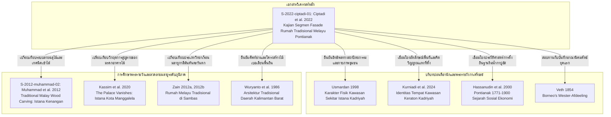

# บันทึกการอ่านและวิเคราะห์เอกสารฉบับสมบูรณ์ (Source Analysis Dossier)
## สัณฐานวิทยาฟาซาดและระบบเชิงช่างเรือนพักอาศัยดั้งเดิมมลายูปอนตีอานัก: กรณีศึกษากัมปงตัมเบลันซัมปิตริมแม่น้ำกาปูอัสในบริบทแวดล้อมพระราชวังกาเดรียะฮ์ (Keraton Kadriyah Pontianak)

---

### ส่วนที่ 1: ข้อมูลบรรณานุกรมและการอ้างอิงมาตรฐาน (Bibliographic Metadata)

- **Source ID:** `S-2022-ciptadi-01`
- **ชื่อไฟล์เอกสารต้นทาง (Source File Name):** `2022-Ciptadi-Kajian_Segmen_Fasade_Rumah_Tinggal_Tradisional_Melayu_di.pdf`
- **ชื่อไฟล์ข้อความสกัด (Extracted Text File):** `d:\01_APP\Research\output\2026-09-04_ราชมนเทียรศึกษานูซันตารา_มลายู_ชวา_ซุนดา_บาหลี\research-notes\extracted-texts\S-2022-ciptadi-01.txt`
- **ประเภทเอกสาร:** บทความวิจัยในวารสารวิชาการผ่านการประเมินโดยผู้ทรงคุณวุฒิ (Peer-Reviewed Academic Journal Article)
- **สาขาวิชา:** สถาปัตยกรรมศาสตร์ (Architecture), สถาปัตยกรรมพื้นถิ่นเขตร้อน (Tropical Vernacular Architecture), สัณฐานวิทยาอาคาร (Building Morphology), และมรดกวัฒนธรรมกายภาพมลายู (Malay Built Heritage)
- **ภาษาของเอกสาร:** ภาษาอินโดนีเซีย (Bahasa Indonesia) พร้อมศัพท์เฉพาะทางสถาปัตยกรรมพื้นถิ่นมลายูปอนตีอานัก (Pontianak Malay Vernacular Terminology)
- **ข้อมูลทางบรรณานุกรมฉบับสมบูรณ์ (Complete Bibliographical Information):**  
  Ciptadi, Wahyudin, Erwin Rizal Hamzah, Muhammad Radhi, and Puspito Harimurti. "Kajian Segmen Fasade Rumah Tinggal Tradisional Melayu di Tepian Sungai Kapuas Kampung Tambelansampit Kota Pontianak." *Vokasi: Jurnal Publikasi Ilmiah* 17, no. 2 (Desember 2022): 82–90. p-ISSN: 1693-9085, e-ISSN: 2621-007X. DOI: https://doi.org/10.26418/lantang.vli2.18801.
- **การอ้างอิงฉบับเต็มระบบ Chicago/Turabian (Notes and Bibliography System, 17th ed.):**  
  `Ciptadi, Wahyudin, Erwin Rizal Hamzah, Muhammad Radhi, and Puspito Harimurti. "Kajian Segmen Fasade Rumah Tinggal Tradisional Melayu di Tepian Sungai Kapuas Kampung Tambelansampit Kota Pontianak." Vokasi: Jurnal Publikasi Ilmiah 17, no. 2 (2022): 82–90.`
- **รูปแบบเชิงอรรถฉบับเต็มครั้งแรก (Full Footnote):**  
  `Wahyudin Ciptadi et al., "Kajian Segmen Fasade Rumah Tinggal Tradisional Melayu di Tepian Sungai Kapuas Kampung Tambelansampit Kota Pontianak," Vokasi: Jurnal Publikasi Ilmiah 17, no. 2 (2022): 82–90.`
- **รูปแบบเชิงอรรถแบบย่อ (Short Footnote):**  
  `Ciptadi et al., "Kajian Segmen Fasade Rumah Tinggal Tradisional Melayu," 83.`
- **บทคัดย่อต้นฉบับ (Original Abstract):**  
  "Keberadaan rumah tinggal tradisional Melayu di tepian sungai Kapuas, Kampung Tambelan Sampit Pontianak memiliki nilai kekhasan fasade rumah tinggal yang berbeda dengan daerah lain. Sehingga di dalam mengidentifikasi tipologi dari fasade sebuah rumah tinggal tradisional melibatkan aspek tolok ukur sistem model (stylistic system) yang berkaitan dengan style atau langgam yang mewujudkan bentuk fasade bangunan. Sistem model (stylistic system) ini meliputi fasade, bentuk pintu dan jendela, serta unsur-unsur lain baik di dalam maupun di luar bangunan dari elemen atas (kepala), elemen tengah (badan), dan elemen bawah (kaki) di rumah tinggal tradisional Melayu dengan melihat nilai kekhasan yang unik dari fasade rumah tinggal rumah tinggal tradisional Melayu. Penelitian ini digolongkan ke dalam skema sosial humaniora, seni budaya, pendidikan dengan tema riset yaitu seni, identitas, kebudayaan, dan karakter bangsa. Penelitian ini menggunakan pendekatan metode rasionalistik-kualitatif dengan mengambil beberapa sampel dari populasi rumah tinggal tradisional Melayu di tepian sungai Kapuas yang masih ada dan bertahan sampai saat ini. Penelitian ini memiliki beberapa tahapan yaitu: tahap pengumpulan data (observasi awal, observasi lanjutan, dan wawancara), tahap analisis data, dan tahap pembahasan hasil. Hasilnya adalah teridentifikasinya tipologi fasade rumah tinggal tradisional Melayu yang berada di tepian sungai Kapuas dengan dokumentasi data gambar (blue print)."
- **บทคัดย่อแปลภาษาไทยเชิงวิชาการ:**  
  "การดำรงอยู่ของเรือนพักอาศัยดั้งเดิมมลายูบริเวณริมฝั่งแม่น้ำกาปูอัส ในชุมชนกัมปงตัมเบลันซัมปิต นครปอนตีอานัก มีคุณค่าความโดดเด่นจำเพาะของรูปลักษณ์ฟาซาด (หน้าบันและเปลือกอาคาร) ที่แตกต่างจากพื้นที่อื่น ดังนั้นในการจำแนกประเภทวิทยาของฟาซาดเรือนดั้งเดิมจึงต้องอาศัยเกณฑ์วัดตามระบบรูปแบบ (stylistic system) ซึ่งสัมพันธ์กับลีลาทางสถาปัตยกรรมที่ประกอบสร้างเป็นรูปทรงฟาซาดของอาคาร ระบบรูปแบบดังกล่าวครอบคลุมถึงองค์ประกอบฟาซาด รูปแบบประตู หน้าต่าง ตลอดจนองค์ประกอบทางสถาปัตยกรรมทั้งภายในและภายนอกอาคาร โดยจำแนกตามโครงสร้างไตรภาคี ได้แก่ องค์ประกอบส่วนบน (หัวเรือน), องค์ประกอบส่วนกลาง (ตัวเรือน), และองค์ประกอบส่วนล่าง (ตีนเรือนหรือฐานราก) งานวิจัยนี้ใช้ระเบียบวิธีวิจัยเชิงคุณภาพ-เหตุผลนิยม โดยคัดเลือกตัวอย่างเรือนดั้งเดิมมลายูริมแม่น้ำกาปูอัสที่ยังคงหลงเหลือและยืนหยัดข้ามกาลเวลากว่าหนึ่งศตวรรษจำนวน 8 หลัง ดำเนินการผ่านการสำรวจภาคสนามเชิงสังเกตการณ์ สัมภาษณ์ช่างไม้และนักวัฒนธรรมท้องถิ่น และสังเคราะห์ข้อมูล ผลการวิจัยได้จำแนกอัตลักษณ์ทางประเภทวิทยาของฟาซาดเรือนมลายูริมน้ำปอนตีอานัก พร้อมทั้งจัดทำเอกสารแบบจำลองพิมพ์เขียวสถาปัตยกรรม (blue print) เพื่อการอนุรักษ์มรดกวัฒนธรรมเชิงช่าง"

---

### ส่วนที่ 2: แผนผังการจัดสรรเข้าสู่บทและหัวข้อย่อย (Chapter & Section Mapping Matrix)

งานวิจัยชิ้นนี้ทำหน้าที่เป็นหลักฐานเชิงประจักษ์ชั้นเยี่ยมในการสังเคราะห์ข้อมูลเข้าสู่โครงสร้างหนังสือราชมนเทียรศึกษา โดยเฉพาะอย่างยิ่งการเชื่อมต่อระหว่างสถาปัตยกรรมพระราชวังหลวง (Keraton) กับสถาปัตยกรรมเรือนบริวารในชุมชนเมืองริมน้ำ (Water Settlements) ดังนี้:

#### 1. บทที่ 2: สถาปัตยกรรมพระราชวังและเรือนบริวารมลายูริมน้ำ (Istana & Vernacular Water Settlements)
- **หัวข้อย่อย 2.1 (บริบทประวัติศาสตร์และกำเนิดราชสำนักมลายูปอนตีอานัก):**  
  การก่อตั้งรัฐสุลต่านปอนตีอานัก (Kesultanan Kadriyah Pontianak) ในปี ค.ศ. 1771 โดยสุลต่านชารีฟ อับดุรเราะฮ์มาน อัลก็อดรี (Sultan Syarif Abdurrahman Al-Qadrie) ณ บริเวณจุดบรรจบของแม่น้ำกาปูอัส (Sungai Kapuas) และแม่น้ำลันดัก (Sungai Landak) ซึ่งเป็นจุดกำเนิดของภูมิทัศน์เมืองริมน้ำ โดยมีพระราชวังกาเดรียะฮ์ (Istana Kadriyah) และมัสยิดญามิอุ (Masjid Jami' Sultan Syarif Abdurrahman) เป็นแกนกลางทางอำนาจและจิตวิญญาณ
- **หัวข้อย่อย 2.4 (ผังบริเวณ สัณฐานวิทยาเมือง และชุมชนบริวารริมน้ำ):**  
  การศึกษาความสัมพันธ์เชิงพื้นที่ระหว่างพระราชวังกาเดรียะฮ์กับชุมชนบริวารแวดล้อม โดยเฉพาะกัมปงตัมเบลันซัมปิต (Kampung Tambelan Sampit) ซึ่งเป็นชุมชนข้าราชบริพารและราษฎรมลายูริมน้ำกาปูอัสที่ตั้งบ้านเรือนเรียงรายตามแนวลำน้ำ สะท้อนการจัดลำดับชั้นเชิงพื้นที่ (Spatial Hierarchy) ในระบบราชมนเทียรศึกษาของนูซันตารา
- **หัวข้อย่อย 2.5 (การออกแบบเชิงช่างมลายูและวิศวกรรมโครงสร้างไม้ริมน้ำ):**  
  - โครงสร้างฐานรากยกพื้นสูงริมน้ำ (Sub-structure): การใช้เสาตอม่อไม้เบอเลียน (Tiang vertical / Tongkat), ไม้หมอนรองรับ (Alas / Galang), และคานรัดตีนเสา (Laci / Kaling) ซึ่งออกแบบมาเพื่อรองรับสภาวะน้ำขึ้นน้ำลง (Tidal fluctuation) และดินเลนริมแม่น้ำกาปูอัส
  - โครงสร้างตัวเรือน (Body structure): การวางตงคาน (Gelegar), โครงรัดเสา (Balok pengaku), และการประกอบผนังกระดานด้วยเทคนิคการเข้าลิ้นร่องไม้แบบโบราณ (Teknik Pian) ที่ยึดด้วยสลักเดือยไม้ (Pasak kayu) ปราศจากตะปูโลหะ
  - โครงสร้างหลังคา (Upper structure): หลังคาทรงโปตงลิมัส (Potong Limas) ความลาดชัน 30–45 องศา มุงด้วยกระเบื้องไม้แป้นเกล็ดเบอเลียน (Sirap Belian)
- **หัวข้อย่อย 2.8 (นายช่างหลวงและระบบภูมิปัญญาช่างสถาปัตยกรรมมลายู):**  
  บทบาทของช่างหลวงและช่างฝีมือพื้นถิ่นที่สืบสายตระกูล โดยเอกสารฉบับนี้ได้สัมภาษณ์และอ้างอิงข้อมูลเชิงลึกจาก ชารีฟ มุสตาฟา อัลอิดรุส (Syarif Mustafa Al-Idrus) นายช่างไม้เรือนมลายูดั้งเดิมในปอนตีอานัก ผู้สืบทอดสายตระกูลซัยยิด/ชารีฟซึ่งสัมพันธ์แนบแน่นกับราชสำนักกาเดรียะฮ์ และมาลิก (Malik) นักวัฒนธรรมท้องถิ่นแห่งกัมปงตัมเบลันซัมปิต
- **หัวข้อย่อย 2.14 (การอนุรักษ์ความแท้ดั้งเดิมและจดหมายเหตุสถาปัตยกรรมไม้หลวง):**  
  การจัดทำแบบสำรวจรังวัดพิมพ์เขียว (Blue print) เพื่อบันทึกกายภาพเรือนไม้โบราณอายุกว่า 100 ปี ที่กำลังสูญหายจากการพัฒนาเมืองสมัยใหม่ การพังทลายของตลิ่งริมแม่น้ำกาปูอัส และการเสื่อมสภาพของไม้

#### 2. บทที่ 7: ประณีตศิลป์และลวดลายประดับฟาซาดนูซันตารา (Nusantara Facade Ornamentation & Woodcarvings)
- **หัวข้อย่อย 7.1 (ทฤษฎี Stylistic System และการแบ่งสัดส่วนไตรภาคีของฟาซาด):**  
  การประยุกต์ทฤษฎีระบบสถาปัตยกรรมของ N. J. Habraken (1978) ในการจำแนกระบบรูปแบบ (Stylistic System) ของฟาซาดเรือนมลายูออกเป็น 3 ส่วนตามแนวตั้ง: ส่วนหัว/บน (Upper side structure - หัวเรือน), ส่วนกลาง/ลำตัว (Bottom side structure - ตัวเรือน), และส่วนล่าง/ตีน (Sub structure - ตีนเรือน/ฐานราก)
- **หัวข้อย่อย 7.2 (องค์ประกอบหลังคา เชิงชาย และช่อประดับยอดฟาซาด):**  
  - แผงเชิงชายฉลุลาย "กิริง-กิริง" (Girring-girring หรือแผ่นลิสต์ปลังก์ฉลุลายฉลุโปร่ง) ที่ติดขนานตามแนวชายคา
  - คันทวยและช่อประดับหัวเสา/มุมจั่ว "ซิมบาร์" (Simbar)
  - ผนังและพื้นห้องใต้หลังคา "ดิงดิง ปารัก" (Dinding Parak) และ "ลันไต ปารัก" (Lantai Parak) ซึ่งทำหน้าที่เป็นฉนวนกันความร้อนและพื้นที่เก็บของใต้จั่ว
- **หัวข้อย่อย 7.3 (ผนัง ช่องเปิด แผงกันแดด และเทคนิคการเข้าไม้):**  
  - ประตูทรงกล่องไม้เบอเลียน (Pintu berbentuk kotak)
  - หน้าต่างบานเกล็ดไม้กระดานเรียงตัว (Jendela papan) ที่ใช้เทคนิคการเข้าลิ้นร่องไม้เปียน (Teknik pian)
  - แผงกันแดดและฝน (Sun shading) ที่ทำจากไม้เตกัม (Kayu tekam) หรือไม้เลิมปง (Kayu lempong)
  - ช่องระบายอากาศฉลุลายโปร่ง (Ventilasi) เหนือกรอบประตูและหน้าต่าง
- **หัวข้อย่อย 7.4 (ปรัชญาสุนทรียศาสตร์อิสลามและสัญญะวิทยาของลวดลายฉลุไม้):**  
  การสลักเสลาลวดลายพรรณพฤกษา (Flora) รูปทรงเรขาคณิต (Geometris) และอักษรวิจิตร (Kaligrafi) ที่ตัดทอนรูปสิ่งมีชีวิต (Aniconism) ตามหลักการศาสนาอิสลาม ผสานความเชื่อดั้งเดิมของมลายูปอนตีอานัก

#### 3. บทที่ 1 & บทที่ 6: ทฤษฎีอำนาจเชิงพื้นที่และมิติเปรียบเทียบสถาปัตยกรรมริมน้ำในนูซันตารา
- **บทที่ 1 (หัวข้อย่อย 1.4):** ทฤษฎีวิวัฒนาการทางสถาปัตยกรรมจากศูนย์กลางอำนาจ (Royal Center) สู่ปริมณฑลบริวาร (Peripheral Kampung) อิทธิพลจาก Istana Kadriyah ที่ส่งผ่านมายังเรือนราษฎรชั้นสูงริมน้ำ
- **บทที่ 6 (การเปรียบเทียบ 4 ภูมิวัฒนธรรม):** การเปรียบเทียบสัณฐานวิทยาเรือนริมน้ำของมลายูปอนตีอานัก (แม่น้ำกาปูอัส) กับเรือนริมน้ำมลายูปาเล็มบัง (แม่น้ำมูซี - Rumah Limas Palembang), เรือนริมน้ำชวา (แม่น้ำเบงกาวันโซโล), และชุมชนแพริมน้ำในเอเชียตะวันออกเฉียงใต้

---

### ส่วนที่ 3: ข้อความโควต์อัญพจน์ปฐมภูมิ/ทุติยภูมิแท้พร้อมเลขหน้ากำกับ (Verbatim Quotes with Exact Page Numbers)

การคัดเลือกข้อความอัญพจน์ภาษาอินโดนีเซียแท้จากเอกสารต้นฉบับ ปราศจากการดัดแปลง พร้อมคำแปลภาษาไทยเชิงวิชาการเพื่อใช้อ้างอิงในเชิงอรรถ:

#### 1. อิทธิพลจากศาสนาอิสลาม ขนบมลายู และพระราชวังกาเดรียะฮ์ต่อฟาซาดเรือนริมน้ำ
> **ข้อความต้นฉบับ (Bahasa Indonesia):**  
> "Perlu diketahui bahwa rumah tinggal tradisional Melayu di tepian sungai Kapuas, Kampung Tambelansampit Pontianak ini adalah sebuah rumah tinggal yang tampilan fasade memiliki kekhasan tersendiri dengan daerah lain karena dipengaruhi oleh ajaran Agama Islam, adat istiadat Melayu Pontianak, dan pengaruh dari Istana Kadriyah Pontianak yang masih bertahan sampai saat ini."  
> — **PAGE: 1–2 (หน้า 82–83 ในวารสาร)**  
>
> **คำแปลเชิงวิชาการ:**  
> "พึงตระหนักว่า เรือนพักอาศัยดั้งเดิมมลายูบริเวณริมฝั่งแม่น้ำกาปูอัส ชุมชนกัมปงตัมเบลันซัมปิต นครปอนตีอานัก เป็นเรือนพักอาศัยที่มีรูปลักษณ์ฟาซาดโดดเด่นเป็นเอกลักษณ์เฉพาะตัวแตกต่างจากภูมิภาคอื่น เนื่องจากได้รับอิทธิพลจากคำสอนแห่งศาสนาอิสลาม ขนบธรรมเนียมจารีตประเพณีมลายูปอนตีอานัก และอิทธิพลทางสถาปัตยกรรมจากพระราชวังอิสตานากาเดรียะฮ์แห่งปอนตีอานัก (Istana Kadriyah Pontianak) ซึ่งยังคงยืนหยัดสืบทอดมาจนถึงปัจจุบัน"

#### 2. คุณค่าฟาซาดในฐานะภาพสะท้อนวัฒนธรรมท้องถิ่นที่ไม่อิงกรอบสถาปัตยกรรมสากล
> **ข้อความต้นฉบับ (Bahasa Indonesia):**  
> "Pada segmen façade rumah tinggal tradisional yang didirikan oleh masyarakat, merupakan perwujudan dari tampilan wajah luar bangunan yang mengandung budaya dan tata kehidupan mayarakat yang lahir dan berkembang dari tata nilai yang tumbuh dalam masyarakat lokal tanpa dipengaruhi oleh norma baku dalam khasanah arsitektur global. Hal ini menyebabkan sebuah rumah tinggal tradisional seringkali menjadi representasi dari suatu suku bangsa dan memiliki peran yang besar di dalam masyarakatnya."  
> — **PAGE: 1 (หน้า 82 ในวารสาร)**  
>
> **คำแปลเชิงวิชาการ:**  
> "ในส่วนขององค์ประกอบฟาซาดเรือนพักอาศัยดั้งเดิมที่สร้างขึ้นโดยชุมชนนั้น นับเป็นรูปธรรมแห่งการแสดงออกทางรูปลักษณ์เปลือกนอกของอาคารที่บรรจุไว้ซึ่งวัฒนธรรมและแบบแผนวิถีชีวิตของชุมชน อันถือกำเนิดและคลี่คลายมาจากค่านิยมที่หยั่งรากในสังคมท้องถิ่น โดยมิได้ตกอยู่ใต้อิทธิพลของบรรทัดฐานสำเร็จรูปในคลังวิทยาการสถาปัตยกรรมระดับสากล ปัจจัยนี้ส่งผลให้เรือนพักอาศัยดั้งเดิมมักทำหน้าที่เป็นตัวแทนเชิงสัญลักษณ์ของกลุ่มชาติพันธุ์และมีบทบาทสำคัญยิ่งภายในชุมชนของตน"

#### 3. อายุขัยของเรือนโบราณริมแม่น้ำกาปูอัสและวิกฤตการสูญหาย
> **ข้อความต้นฉบับ (Bahasa Indonesia):**  
> "Sampai saat ini di Kampung Tembelan Sampit masih kita jumpai rumah tua berupa rumah tinggal tradisional Melayu yang berada di tepian Sungai Kapuas yang usianya diperkirakan di atas 100 tahun yang sekiranya dapat tetap berdiri tegak dengan tetap menjaga dari kerusakan akibat efek alam maupun kerusakan yang bisa ditimbulkan oleh manusia... mengingat keberadaan dari populasi rumah tinggal tradisional Melayu di tepian sungai, Kampung Tambelansampit Pontianak yang semakin tahun makin berkurang jumlahnya serta belum ada 1 (satu) rumah tinggal pun yang memiliki dokumen gambar (blue print) yang menjelaskan tipologi fasade rumah tinggal."  
> — **PAGE: 1, 2 (หน้า 82, 83 ในวารสาร)**  
>
> **คำแปลเชิงวิชาการ:**  
> "จวบจนปัจจุบัน ในชุมชนกัมปงตัมเบลันซัมปิต เรายังคงพบเรือนโบราณในรูปแบบเรือนพักอาศัยดั้งเดิมมลายูตั้งอยู่ริมฝั่งแม่น้ำกาปูอัส ซึ่งมีอายุขัยประเมินว่ามากกว่า 100 ปี ยืนหยัดตระหง่านอยู่ได้ด้วยการรักษาสภาพให้พ้นจากความเสียหายจากภัยธรรมชาติและการทำลายโดยมนุษย์... เมื่อคำนึงว่าประชากรเรือนพักอาศัยดั้งเดิมมลายูริมแม่น้ำในกัมปงตัมเบลันซัมปิตมีจำนวนลดน้อยถอยลงทุกปี และยังไม่เคยมีเรือนแม้แต่หลังเดียวที่มีเอกสารแบบพิมพ์เขียวทางสถาปัตยกรรม (blue print) เพื่ออธิบายประเภทวิทยาของฟาซาดเรือนอย่างเป็นระบบ"

#### 4. กรอบทฤษฎี Stylistic System ของ Habraken กับการแบ่งสัดส่วนไตรภาคี
> **ข้อความต้นฉบับ (Bahasa Indonesia):**  
> "Habraken (1978) mempertegas pernyataan ini dengan menyatakan bahwa arsitektur merupakan suatu kesatuan sistem yang terdiri atas Spatial System, Physical System, dan Stylistic System. Sistem ini meliputi fasade, bentuk pintu dan jendela serta unsur-unsur lain baik di dalam maupun di luar bangunan dari elemen atas (kepala), elemen tengah (badan), dan elemen bawah (kaki) di rumah tinggal tradisional Melayu."  
> — **PAGE: 2 (หน้า 83 ในวารสาร)**  
>
> **คำแปลเชิงวิชาการ:**  
> "ฮาบราเคน (Habraken, 1978) ได้ตอกย้ำข้อความนี้โดยระบุว่า สถาปัตยกรรมคือเอกภาพแห่งระบบอันประกอบด้วย ระบบเชิงพื้นที่ (Spatial System), ระบบทางกายภาพ (Physical System), และระบบรูปแบบหรือลีลา (Stylistic System) ซึ่งระบบรูปแบบนี้ครอบคลุมถึงฟาซาด รูปทรงประตูและหน้าต่าง ตลอดจนองค์ประกอบอื่นๆ ทั้งภายในและภายนอกอาคาร โดยจำแนกตามองค์ประกอบส่วนบน (หัวเรือน), องค์ประกอบส่วนกลาง (ตัวเรือน), และองค์ประกอบส่วนล่าง (ตีนเรือน) ในเรือนพักอาศัยดั้งเดิมมลายู"

#### 5. สาระสำคัญเชิงโครงสร้างและองค์ประกอบเชิงช่างของเรือนทรงโปตงลิมัส (Potong Limas)
> **ข้อความต้นฉบับ (Bahasa Indonesia):**  
> "Berdasarkan dari tabel 1 penjelasan Sistem Model (Stylistic System yaitu bagian kepala/atas/upper side structure meliputi girring-girring, simbar, lantai parak, dinding parak, kuda-kuda dan atap; bagian badan/tengah/bottom side Structure meliputi gelegar, lantai, rangka dan dinding serta balok pengaku; dan bagian kaki/bawah /sub structure berupa pondasi (tiang vertical/tongkat), alas / galang), dan laci/ kaling) dan balok pengaku. di rumah tinggal tradisional Melayu tipe Potong Limas, Pontianak menitikberatkan kepada bangunan yang dominan menggunakan bahan material konstruksi dari kayu mulai dari pondasi, lantai, rangka, sampai atap."  
> — **PAGE: 6 (หน้า 87 ในวารสาร)**  
>
> **คำแปลเชิงวิชาการ:**  
> "จากตารางที่ 1 คำอธิบายระบบรูปแบบ (Stylistic System) ปรากฏดังนี้: ส่วนหัว/บน (upper side structure) ประกอบด้วย กิริง-กิริง (girring-girring - ลิสต์ปลังก์ฉลุลายเชิงชาย), ซิมบาร์ (simbar - ช่อประดับมุม), ลันไตปารัก (lantai parak - พื้นห้องใต้หลังคา), ดิงดิงปารัก (dinding parak - ผนังห้องใต้หลังคา), คูดา-คูดา (kuda-kuda - โครงถักขื่อม้า), และหลังคา; ส่วนตัวเรือน/กลาง (bottom side structure) ประกอบด้วย เกอเลการ์ (gelegar - ตงพื้น), พื้นกระดาน, โครงกรอบอาคาร, ฝาผนัง และคานรัดตรึง (balok pengaku); และส่วนตีนเรือน/ล่าง (sub structure) ประกอบด้วย ฐานราก (เสาตั้ง/เสาตอม่อตงกัต), ไม้หมอนรองรับ (alas/galang), คานรัดตีนเสา (laci/kaling), และคานรัดตรึง สำหรับเรือนพักอาศัยดั้งเดิมมลายูประเภทโปตงลิมัส (Potong Limas) ในปอนตีอานักนั้น มีลักษณะเด่นที่การใช้วัสดุก่อสร้างประเภทไม้เป็นหลักอย่างครอบงำ นับตั้งแต่ฐานราก พื้น โครงสร้าง ไปจนถึงหลังคา"

#### 6. รายละเอียดจำเพาะขององค์ประกอบฟาซาด Model 01 (Potong Limas)
> **ข้อความต้นฉบับ (Bahasa Indonesia):**  
> "MODEL 01 : Rumusan Segmen Fasade Sistem Model (Stylistic System) Rumah Tinggal Tradisional Melayu, Di Kampung Tambelan Sampit Pontianak  
> A. Bagian kepala/atas/upper side structure:  
> 1. Model Atap Teridentifikasi: Model Atap dengan kemiringan 30 – 45 Derajat, bahan penutup Sirap (awal), Seng (saat ini), dan warna silver dan coklat tua. Menggunakan Elemen Kearifan Lokal di Rumah Tinggal Tradisional Melayu Tipe Potong Limas meliputi: girring-girring, simbar, lantai parak, dinding parak, kuda-kuda dan atap sirap.  
> B. Bagian badan/tengah/bottom side Structure:  
> 1. Model Pintu Teridentifikasi: Model Pintu berbentuk kotak yang berukuran; bahan dari kayu Belian, Menggunakan Elemen Kearifan Lokal di Rumah Tinggal Tradisional Melayu Tipe Potong Limas meliputi: gelegar, lantai, rangka dan dinding serta balok pengaku.  
> 2. Model Jendela Teridentifikasi: Model Jendela berbahan papan yang tersusun berbaris secara vertikal dan horizontal, horisontal, dan berbahan kayu belian, kayu tekam. Dengan menggunakan teknik pian.  
> 3. Model Dinding Teridentifikasi: Model Dinding yang tersusun berbaris, dipasang pasak kayu ke tiang pondasi, gelegar dan blandar kayu., bahan dari Kayu Belian dengan menggunakan Teknik pian.  
> 4. Model Sun Shading Teridentifikasi: Model Sun Shading yang berbahan dari papan kayu berbahan kayu tekam/lempong.  
> C. Bagian kaki/bawah/sub structure:  
> 1. Model Tangga dan Tiang /Kaki Teridentifikasi: Model Tangga dan Tiang /Kaki berbentuk kotak dengan bahan dari kayu Belian. Menggunakan Elemen Kearifan Lokal di Rumah Tinggal Tradisional Melayu Tipe Potong Limas meliputi: pondasi (tiang vertical/ tongkat), alas /galang), dan laci/kaling) dan balok pengaku."  
> — **PAGE: 7 (หน้า 88 ในวารสาร)**  
>
> **คำแปลเชิงวิชาการ:**  
> "แบบจำลองที่ 01: การประมวลองค์ประกอบฟาซาดตามระบบรูปแบบ (Stylistic System) ของเรือนพักอาศัยดั้งเดิมมลายู ในกัมปงตัมเบลันซัมปิต นครปอนตีอานัก:  
> ก. ส่วนหัว/บน (upper side structure):  
> 1. รูปแบบหลังคาที่จำแนกได้: หลังคามีความลาดชัน 30–45 องศา วัสดุมุงดั้งเดิมใช้กระเบื้องไม้แป้นเกล็ดซีรับ (ปัจจุบันเปลี่ยนเป็นสังกะสี) โทนสีเงินและน้ำตาลเข้ม มีการใช้องค์ประกอบภูมิปัญญาท้องถิ่นของเรือนทรงโปตงลิมัส ได้แก่ กิริง-กิริง (girring-girring), ซิมบาร์ (simbar), พื้นห้องใต้หลังคา (lantai parak), ผนังห้องใต้หลังคา (dinding parak), โครงถักขื่อม้า (kuda-kuda) และกระเบื้องแป้นเกล็ดไม้ซีรับ  
> ข. ส่วนตัวเรือน/กลาง (bottom side structure):  
> 1. รูปแบบประตูที่จำแนกได้: ประตูทรงกล่องสี่เหลี่ยม ทำจากไม้เบอเลียน (Kayu Belian) ใช้ร่วมกับองค์ประกอบตงพื้น (gelegar), พื้นไม้, โครงกรอบ, ผนัง และคานรัดตรึง  
> 2. รูปแบบหน้าต่างที่จำแนกได้: บานหน้าต่างไม้กระดานวางเรียงแนวตั้งและแนวนอน ทำจากไม้เบอเลียนและไม้เตกัม (kayu tekam) โดยใช้เทคนิคการเข้าลิ้นร่องไม้แบบเปียน (teknik pian)  
> 3. รูปแบบผนังที่จำแนกได้: ฝาผนังไม้กระดานวางเรียงตัว ยึดด้วยสลักเดือยไม้ (pasak kayu) เข้ากับเสาฐานราก ตงพื้น และคานขื่อไม้ ทำจากไม้เบอเลียนด้วยเทคนิคเปียน  
> 4. รูปแบบแผงกันแดดที่จำแนกได้: แผงบังแดดทำจากไม้กระดานเตกัมหรือไม้เลิมปง (kayu tekam/lempong)  
> ค. ส่วนตีนเรือน/ล่าง (sub structure):  
> 1. รูปแบบบันไดและเสาตีนเรือนที่จำแนกได้: บันไดและเสาตอม่อหน้าตัดสี่เหลี่ยมทำจากไม้เบอเลียน ประกอบด้วยฐานรากเสาตั้ง (tiang vertical/tongkat), ไม้หมอนรองรับ (alas/galang), คานรัดตีนเสา (laci/kaling) และคานรัดตรึง"

#### 7. การปรึกษาช่างฝีมือผู้สืบสายตระกูลและนักวัฒนธรรมท้องถิ่น
> **ข้อความต้นฉบับ (Bahasa Indonesia):**  
> "...dengan berkonsultasi dengan Malik selaku budayawan kampung Tambelan Sampit dan Syarif Mustafa Al-Idrus selaku tukang rumah tinggal tradisional Melayu di Pontianak."  
> — **PAGE: 5, 6–7 (หน้า 86, 88 ในวารสาร)**  
>
> **คำแปลเชิงวิชาการ:**  
> "...โดยผ่านการปรึกษาหารือร่วมกับ มาลิก (Malik) ในฐานะนักวัฒนธรรมประจำชุมชนกัมปงตัมเบลันซัมปิต และ ชารีฟ มุสตาฟา อัลอิดรุส (Syarif Mustafa Al-Idrus) ในฐานะนายช่างไม้ผู้เชี่ยวชาญเรือนพักอาศัยดั้งเดิมมลายูในนครปอนตีอานัก"

#### 8. บทสรุปคุณค่าภูมิปัญญาเชิงช่างและการสะท้อนประวัติศาสตร์วัฒนธรรม
> **ข้อความต้นฉบับ (Bahasa Indonesia):**  
> "Hasil segmen fasade rumah tinggal tradisional Melayu di tepian Sungai Kapuas, Kampung Tambelansampit, Kota Pontianak dapat disimpulkan untuk kearifan lokal yang diterapkan adalah menggunakan metode konstruksi, penamaan elemen-elemen bangunan lokal dengan menggunakan sumber daya orisinal lokal untuk memenuhi kebutuhan lokal, merefleksikan lingkungan, budaya, dan sejarah dari suatu daerah tertentu untuk sebuah karya arsitektur tersebut muncul dan berada atau eksis."  
> — **PAGE: 7 (หน้า 88 ในวารสาร)**  
>
> **คำแปลเชิงวิชาการ:**  
> "ผลการศึกษาองค์ประกอบฟาซาดเรือนพักอาศัยดั้งเดิมมลายูริมแม่น้ำกาปูอัส กัมปงตัมเบลันซัมปิต นครปอนตีอานัก สรุปได้ว่า ภูมิปัญญาท้องถิ่นที่นำมาประยุกต์ใช้นั้นสำแดงผ่านระเบียบวิธีทางวิศวกรรมการก่อสร้าง การนิยามศัพท์เรียกขานองค์ประกอบอาคารตามภาษาพื้นถิ่น การนำทรัพยากรธรรมชาติแท้ดั้งเดิมในท้องถิ่นมาตอบสนองอรรถประโยชน์ใช้สอย เพื่อสะท้อนบริบทแวดล้อม วัฒนธรรม และประวัติศาสตร์จำเพาะของพื้นที่ อันเป็นปัจจัยที่ก่อกำเนิดและธำรงการดำรงอยู่ของผลงานสถาปัตยกรรมชิ้นนั้นๆ ให้คงอยู่สืบมา"

---

### ส่วนที่ 4: การสกัดสาระสำคัญเชิงวิชาการและการสังเคราะห์เชิงลึก (In-Depth Academic Synthesis & Thematic Analysis)

จากข้อมูลเชิงประจักษ์ในบทความของ Wahyudin Ciptadi และคณะ (2022) สามารถนำมาสังเคราะห์และขยายผลเชิงทฤษฎีในมิติราชมนเทียรศึกษาและสถาปัตยกรรมพื้นถิ่นมลายูนูซันตาราได้ 4 ประเด็นหลักดังนี้:

#### 1. ความสัมพันธ์เชิงลำดับชั้นทางสถาปัตยกรรมระหว่างพระราชวังกาเดรียะฮ์กับเรือนบริวารในกัมปงโดยรอบ (Spatial and Architectural Hierarchy)
- **การแผ่กระจายอำนาจผ่านรูปแบบสถาปัตยกรรม (Stylistic Diffusion):** พระราชวังอิสตานากาเดรียะฮ์ (Istana Kadriyah) ซึ่งสถาปนาขึ้นในปี ค.ศ. 1771 โดยสุลต่านชารีฟ อับดุรเราะฮ์มาน อัลก็อดรี มิได้ทำหน้าที่เป็นเพียงที่ประทับขององค์อธิปัตย์และศูนย์กลางการบริหารราชการแผ่นดินเท่านั้น หากแต่เป็น "แม่แบบทางสุนทรียศาสตร์และเทคโนโลยีเชิงช่าง" (Aesthetic and Technological Exemplar) ของรัฐสุลต่าน เรือนพักอาศัยของข้าราชบริพาร พ่อค้า และราษฎรในกัมปงตัมเบลันซัมปิต ซึ่งตั้งอยู่ฝั่งตรงข้ามหรือในปริมณฑลริมน้ำใกล้เคียง ได้รับอิทธิพลโดยตรงจากพระราชวังหลวง
- **การจำแนกลำดับชั้น (Stratification) ผ่านสเกลและองค์ประกอบ:**  
  - พระราชวังกาเดรียะฮ์เป็นอาคารไม้ขนาดมหึมาสองชั้น มีมุขด้านหน้า หอสังเกตการณ์ (Belvedere) หลังคาทรงปั้นหยาซ้อนชั้นประดับลวดลายฉลุไม้อันวิจิตรระบายด้วยสีเหลืองทองและเขียวมรกต  
  - ในขณะที่เรือนพักอาศัยของบริวารในกัมปงตัมเบลันซัมปิตใช้ "หลังคาทรงโปตงลิมัส" (Potong Limas) หรือทรงปั้นหยาหักมุม ซึ่งเป็นการจำลองรูปทรงหลังคาของพระราชวังลงมาในสเกลของเรือนเดี่ยวชั้นเดียวหรือยกพื้นสูง  
  - การประดับเชิงชายด้วย "กิริง-กิริง" (Girring-girring) และการติดช่อประดับ "ซิมบาร์" (Simbar) ที่มุมและจั่วเรือนราษฎร เป็นการรับเอาสัญญะทางสถาปัตยกรรมของราชสำนักมาปรับใช้ แต่จำกัดขนาดและความซับซ้อนของลวดลายให้อยู่ในขอบเขตอันสมควรแก่ฐานานุรูป เพื่อไม่ให้เป็นการละเมิดพระเกียรติยศขององค์สุลต่าน
- **สายตระกูลช่างหลวงกับการถ่ายทอดภูมิปัญญา:** การที่ผู้วิจัยได้สัมภาษณ์ ชารีฟ มุสตาฟา อัลอิดรุส (Syarif Mustafa Al-Idrus) นายช่างไม้เรือนมลายูปอนตีอานัก บ่งชี้อย่างมีนัยสำคัญถึงระบบช่างประจำราชสำนักและเครือญาติผู้สืบสายตระกูลซัยยิด (Syarif/Sayyid) ช่างไม้เหล่านี้คือผู้ที่สร้างสรรค์ทั้งอาคารในเขตพระราชฐานกาเดรียะฮ์ และเป็นผู้ถ่ายทอดเทคนิคการก่อสร้างเดียวกันนี้ลงสู่การปลูกสร้างเรือนในกัมปงบริวาร

#### 2. การปรับตัวต่อสภาพภูมิอากาศเขตร้อนชื้นริมแม่น้ำกาปูอัส (Vernacular Climate Adaptation & Riverine Settlement)
- **สถาปัตยกรรมสะเทินน้ำสะเทินบก (Amphibious Vernacular):** ชุมชนกัมปงตัมเบลันซัมปิตตั้งอยู่ริมตลิ่งแม่น้ำกาปูอัส ซึ่งต้องเผชิญกับระดับน้ำขึ้นน้ำลงรายวันตามอิทธิพลของกระแสน้ำในแม่น้ำสายยาวที่สุดในอินโดนีเซีย ตลอดจนมหาอุทกภัยตามฤดูกาล ระบบโครงสร้างส่วนล่าง (Sub-structure) จึงต้องตอบสนองต่อสภาวะแวดล้อมดังกล่าวอย่างชาญฉลาด:
  - การใช้เสาตอม่อไม้เบอเลียน (Tiang vertical / Tongkat) ปักลงในดินเลนริมน้ำ โดยมีระบบไม้หมอนรองรับ (Alas / Galang) และคานรัดตีนเสา (Laci / Kaling) ช่วยกระจายน้ำหนักและยึดโครงสร้างไม่ให้ทรุดเอียงตัว
  - การยกใต้ถุนสูงช่วยให้น้ำหลากไหลผ่านใต้ตัวเรือนได้อย่างอิสระโดยไม่กระทบกระเทือนต่อพื้นที่พักอาศัยชั้นบน
- **การระบายอากาศและการกันความร้อนเชิงรับ (Passive Cooling):**
  - **หลังคาทรงสูงชัน 30–45 องศา:** ช่วยเร่งการระบายน้ำฝนเขตร้อนที่ตกหนักชุกในเกาะบอร์เนียวได้อย่างรวดเร็ว ป้องกันการรั่วซึม และช่วยให้อากาศร้อนลอยตัวขึ้นสู่ที่สูง
  - **พื้นที่ห้องใต้หลังคา (Lantai Parak & Dinding Parak):** โครงสร้างใต้หลังคาไม่ได้เปิดโล่งหรือปิดทึบอย่างไร้ประโยชน์ แต่สร้างเป็น "ปารัก" (Parak) ซึ่งทำหน้าที่เป็นช่องว่างดักอากาศร้อน (Thermal buffer zone) ป้องกันมิให้ความร้อนจากแสงแดดแผ่ลงสู่ตัวเรือนชั้นล่าง พร้อมทั้งใช้เป็นพื้นที่แห้งสำหรับเก็บเสบียงและของใช้มีค่าในยามน้ำท่วมใหญ่
  - **บานหน้าต่างและช่องระบายอากาศฉลุลาย (Ventilasi):** แผงช่องลมฉลุโปร่งเหนือประตูหน้าต่างและหน้าต่างบานเกล็ดไม้กระดานช่วยให้เกิดการระบายอากาศตามธรรมชาติ (Cross-ventilation) รับลมแม่น้ำกาปูอัสพัดผ่านตัวเรือนตลอดทั้งวัน
  - **แผงกันแดด (Sun Shading):** การติดตั้งแผงกันแดดยื่นออกจากระนาบผนังเหนือช่องเปิด ช่วยลดปริมาณรังสีความร้อนจากดวงอาทิตย์ที่จะส่องกระทบตัวเรือนโดยตรง และป้องกันฝนสาดเข้าสู่ภายใน

#### 3. สุนทรียศาสตร์ของลวดลายจำหลักไม้ที่สะท้อนอัตลักษณ์มลายู-อิสลาม (Islamic Aesthetics & Woodcarving Symbolism)
- **หลักการไม่สร้างรูปเคารพ (Aniconism):** ภายใต้อิทธิพลของศาสนาอิสลามนิกายสุหนี่ มัซฮับชาฟิอี ซึ่งเป็นศาสนาประจำราชสำนักปอนตีอานักและประชากรมลายู ลวดลายประดับฟาซาดของเรือนจึงปราศจากการจำลองรูปลักษณ์ของสิ่งมีชีวิต สัตว์ หรือมนุษย์โดยเด็ดขาด แตกต่างจากศิลปะดั้งเดิมของชนเผ่าดายัก (Dayak) ในลุ่มน้ำตอนในหรือศิลปะฮินดู-ชวา
- **การจำแนกแม่ลายประดับฟาซาด 3 กลุ่มหลัก:**
  1. *ลวดลายพรรณพฤกษา (Motif Flora):* การตัดทอนรูปใบไม้ ดอกไม้ เครือเถา (อาทิ Bunga Cengkih, Bunga Cina, Tampuk Pinang) สื่อถึงความอุดมสมบูรณ์ของธรรมชาติและการสรรเสริญความยิ่งใหญ่ของการสร้างสรรค์ของพระผู้เป็นเจ้า
  2. *ลวดลายเรขาคณิต (Motif Geometris):* ลวดลายเส้นตรง เส้นทแยงมุม ตารางขัด สี่เหลี่ยมข้าวหลามตัด (Kelarai/Belah Ketupat) ซึ่งสะท้อนระเบียบ ความสงบ และมิติจักรวาลวิทยาแห่งอิสลาม
  3. *ลวดลายอักษรวิจิตร (Kaligrafi):* อักขระภาษาอาหรับและบทสวดดูอาอ์ที่แฝงอยู่ในงานฉลุช่องลม เพื่อความเป็นสิริมงคลและการปกป้องคุ้มครองเรือน
- **สุนทรียศาสตร์ของแผงเชิงชาย "กิริง-กิริง" และ "ซิมบาร์":** แผ่นไม้ฉลุลายเชิงชายกิริง-กิริง (Girring-girring) ไม่เพียงแต่ช่วยพรางแนวรอยต่อของหลังคา แต่ยังสร้างจังหวะทางสายตา (Visual Rhythm) ที่พลิ้วไหวต่อเนื่องตามแนวขอบชายคาทั้งหมด สะท้อนถึงระเบียบทางสุนทรียะที่เชื่อมโยงกับดนตรีและวรรณศิลป์มลายู

#### 4. วิทยาการงานไม้และเทคโนโลยีการก่อสร้างพื้นถิ่น (Vernacular Timber Technology & Joinery System)
- **การเลือกสรรไม้ตามหน้าที่ใช้สอย (Material Logic):**
  - **ไม้เบอเลียน (Kayu Belian / Eusideroxylon zwageri):** ได้รับการยกย่องเป็น "ไม้เหล็กแห่งบอร์เนียว" (Ironwood) ถูกนำมาใช้กับองค์ประกอบโครงสร้างที่ต้องสัมผัสความชื้น ดินเลน และรับน้ำหนักมหาศาล ได้แก่ เสาตอม่อ (Tongkat), ไม้หมอน (Galang), คานรัด (Kaling/Gelegar), แผ่นกระดานพื้น, กรอบประตู, และกระเบื้องแป้นเกล็ดหลังคา (Sirap) ไม้เบอเลียนมีคุณสมบัติพิเศษคือยิ่งแช่น้ำยิ่งแข็งแกร่ง ปลวกมอดไม่กัดกิน ทำให้อาคารยืนหยัดได้เกินกว่า 100 ปี
  - **ไม้เตกัม (Kayu Tekam) และไม้เลิมปง (Kayu Lempong):** นำมาใช้ในส่วนที่ไม่ได้รับน้ำหนักโครงสร้างหลัก เช่น กรอบบานหน้าต่าง แผงกันแดด และงานฉลุลายตกแต่ง เนื่องจากมีน้ำหนักเบากว่าและง่ายต่อการไส เลื่อย หรือฉลุสลัก
- **เทคนิคการเข้าไม้แบบเปียน (Teknik Pian):** เทคนิคการเข้าลิ้นร่องไม้กระดาน (Tongue-and-groove joint) อันประณีตของช่างไม้มลายู ช่วยให้แผ่นไม้กระดานผนังและหน้าต่างสามารถขยายตัวหรือหดตัวตามความชื้นสัมพัทธ์ของอากาศได้โดยไม่โก่งงอหรือแตกหัก
- **ระบบสลักเดือยไม้ (Pasak Kayu):** การยึดแผ่นผนัง คาน และตงด้วยเดือยไม้แทนการใช้ตะปูโลหะ สะท้อนความเข้าใจในเรื่องการผุกร่อนจากสนิมในสภาพแวดล้อมริมน้ำจืดที่ชื้นสูง และทำให้โครงสร้างสามารถถอดประกอบหรือซ่อมแซมเปลี่ยนชิ้นส่วนเฉพาะจุดได้ง่าย (Modularity & Maintainability)

---

### ส่วนที่ 5: การตรวจสอบความน่าเชื่อถือและการเชื่อมโยงข้ามแหล่ง (Historiographical Cross-Referencing & Source Criticism)

การวิเคราะห์สถานะทางวิชาการและการเชื่อมโยงกับเอกสารสำคัญชิ้นอื่นๆ ในโครงการวิจัยราชมนเทียรศึกษา:

#### 1. การเชื่อมโยงข้ามแหล่งกับงานวิจัยในบริบทปอนตีอานัก
- **Usmardan (1998) *Karakter Fisik Kawasan Permukiman Sekitar Istana Kadriyah Pontianak*:**  
  วิทยานิพนธ์ระดับมหาบัณฑิตของอุสมาร์ดัน (Usmardan, UGM) ถือเป็นเอกสารบุกเบิกในการศึกษาผังเมืองและกายภาพชุมชนรอบพระราชวังกาเดรียะฮ์ บทความของ Ciptadi et al. (2022) ได้รับเอาข้อค้นพบของ Usmardan มาต่อยอดในระดับจุลภาค โดยเจาะจงสำรวจสัณฐานวิทยาฟาซาดของเรือนราษฎรในกัมปงตัมเบลันซัมปิต เพื่อพิสูจน์ให้เห็นว่าลักษณะกายภาพภายนอกของเรือนเหล่านี้ได้รับอิทธิพลจากองค์ประกอบของพระราชวังกาเดรียะฮ์จริง
- **Kurniadi et al. (2024) *Identitas Tempat Kawasan Keraton Kadriyah Pontianak*:**  
  งานวิจัยของ Kurniadi (2024) วิเคราะห์เรื่อง "จิตวิญญาณแห่งที่ตั้งและอัตลักษณ์พื้นที่" (Genius Loci / Place Identity) ของย่านพระราชวังกาเดรียะฮ์ การศึกษาของ Ciptadi et al. (2022) ทำหน้าที่เป็นหลักฐานทางสถาปัตยกรรมเชิงรูปธรรม (Tangible evidence) ที่สนับสนุนว่าอัตลักษณ์ของย่านมิได้ดำรงอยู่เพียงในตัวพระราชวังหลวงเท่านั้น หากแต่ฝังแน่นอยู่ในเรือนไม้ดั้งเดิมของกัมปงบริวารที่เรียงรายริมน้ำ
- **Hassanudin et al. (2000) & Purwana et al. (2004):**  
  เอกสารประวัติศาสตร์สังคมเศรษฐกิจของปอนตีอานักช่วยยืนยันว่า กัมปงตัมเบลันซัมปิตเป็นย่านการค้าและที่อยู่อาศัยที่พัฒนาขึ้นพร้อมกับราชสำนักกาเดรียะฮ์ตั้งแต่ปลายศตวรรษที่ 18 เรือนที่สำรวจพบซึ่งมีอายุเกิน 100 ปีจึงเป็นประจักษ์พยานทางประวัติศาสตร์ของยุคเปลี่ยนผ่านเข้าสู่ศตวรรษที่ 20
- **P. J. Veth (1854) *Borneo’s Wester-Afdeeling: Geographisch, Statistisch, Historisch*:**  
  บันทึกประวัติศาสตร์ภูมิศาสตร์ของเนเธอร์แลนด์ฉบับบุกเบิกของเวต (Veth, 1854) ได้บันทึกสภาพบ้านเรือนริมแม่น้ำกาปูอัสในยุคอาณานิคม ซึ่งสอดรับกับผลการสำรวจของ Ciptadi et al. ว่าเรือนมลายูปอนตีอานักสร้างด้วยไม้เบอเลียนยกพื้นสูงตามแนวลำน้ำมานานนับศตวรรษ

#### 2. การเชื่อมโยงข้ามแหล่งกับงานวิจัยสถาปัตยกรรมราชสำนักและเรือนมลายูระดับภูมิภาค
- **Muhammad et al. (2012) *The Study of Traditional Malay Decorations & Wood Carving: Istana Kenangan, Perak* (`S-2012-muhammad-02`):**  
  การศึกษาเชิงเปรียบเทียบระหว่างศิลปะลายฉลุไม้ของพระราชวังเกอนางัน (เปรัก) กับเรือนในกัมปงตัมเบลันซัมปิต (ปอนตีอานัก) แสดงให้เห็นถึง "ความร่วมมือทางวัฒนธรรมเชิงช่างข้ามช่องแคบมะละกาและทะเลจีนใต้" (Trans-maritime Malay Craftsmanship):
  - การใช้กระเบื้องไม้แป้นเกล็ดเบอเลียน (Belian shingles / Atap sirap) ในการมุงหลังคาชั้นสูง
  - การใช้แผงเชิงชายฉลุลาย (Cucur Atap ในเปรัก เทียบเท่ากับ Girring-girring ในปอนตีอานัก)
  - ปรัชญาการตัดทอนรูปสิ่งมีชีวิต (Aniconism) มุ่งสู่ลายพรรณพฤกษาและเรขาคณิต
- **Kassim et al. (2020) *The Palace Vanishes: Istana Kota Manggalela*:**  
  ประเด็นสำคัญที่ทั้งสองบทความเน้นย้ำคือ "วิกฤตการสูญหายของมรดกอาคารไม้ดั้งเดิม" (Disappearing Wooden Heritage) อันเกิดจากความชื้น การขาดการดูแลรักษา และการเปลี่ยนผ่านสู่อาคารคอนกรีตสมัยใหม่ บทความของ Ciptadi et al. ชี้ให้เห็นว่าเรือนโบราณอายุกว่า 100 ปีในปอนตีอานักลดลงอย่างต่อเนื่อง และการจัดทำแบบพิมพ์เขียวรังวัด (Blue print) ถือเป็นยุทธศาสตร์เร่งด่วนในการกอบกู้ความทรงจำทางสถาปัตยกรรม
- **Zain (2012a, 2012b) *Rumah Melayu Tradisional di Sambas*:**  
  งานวิจัยของ Zairin Zain เรื่องเรือนมลายูในเมืองซัมบัส (Sambas) ซึ่งเป็นอีกหนึ่งรัฐสุลต่านสำคัญในกาลีมันตันตะวันตก ช่วยยืนยันว่าเทคนิคการเข้าไม้เปียน (Teknik pian) และโครงสร้างเสาตอม่อไม้เบอเลียน (Tongkat/Galang) เป็นระบบวิศวกรรมร่วมของชาวมลายูลุ่มน้ำในกาลีมันตันตะวันตกทั้งหมด

#### 3. การประเมินจุดเด่นและข้อจำกัดของเอกสาร (Source Criticism)
- **จุดแข็ง (Strengths):**
  - เป็นงานวิจัยเชิงสำรวจภาคสนามที่ให้ข้อมูลเชิงประจักษ์ (Empirical data) สดใหม่และมีความจำเพาะในพื้นที่กัมปงตัมเบลันซัมปิต
  - มีการบันทึกการจัดทำแบบจำลองพิมพ์เขียวสถาปัตยกรรม (Blue print) และรูปด้าน (Elevations) ของเรือนตัวอย่างจริง 8 หลัง
  - มีการระบุศัพท์ช่างและองค์ประกอบอาคารตามภาษาถิ่นมลายูปอนตีอานักอย่างชัดเจน (อาทิ girring-girring, simbar, lantai parak, teknik pian) ผ่านการปรึกษานายช่างไม้ผู้สืบสายตระกูลโดยตรง
- **ข้อจำกัด (Limitations):**
  - บทความจำกัดขอบเขตการวิเคราะห์เฉพาะระบบรูปแบบ (Stylistic System) ตามทฤษฎีของ Habraken โดยมิได้วิเคราะห์เชิงลึกในระบบเชิงพื้นที่ (Spatial System) หรือระบบทางกายภาพวิศวกรรม (Physical System)
  - ไม่ได้ระบุแผนผังที่ตั้ง (Site plan) พิกัดทางภูมิศาสตร์ หรือภาพถ่ายสถาปัตยกรรมความละเอียดสูงของเรือนทั้ง 8 หลังอย่างครบถ้วนในเล่มบทความ (เนื่องจากข้อจำกัดด้านความยาวของบทความในวารสาร)
  - ขาดการวิเคราะห์ประวัติศาสตร์ความเป็นมาของเจ้าของเรือนดั้งเดิมแต่ละหลังว่ามีตำแหน่งหน้าที่หรือความสัมพันธ์ทางเครือญาติกับราชสำนักกาเดรียะฮ์อย่างไรบ้าง

---

### ส่วนที่ 6: ศัพท์เฉพาะทางสถาปัตยกรรมฟาซาดและเรือนมลายูปอนตีอานัก (Architectural & Vernacular Glossary)

ประมวลคำศัพท์เชิงช่าง สถาปัตยกรรมพื้นถิ่น และภาษาวัฒนธรรมมลายูปอนตีอานักที่ปรากฏในเอกสาร พร้อมคำอธิบายเชิงลึก:

1. **Fasade Rumah Melayu (ฟาซาดเรือนมลายู):**  
   เปลือกภายนอกหรือรูปด้านของเรือนพักอาศัยมลายู ครอบคลุมตั้งแต่องค์ประกอบหลังคา หน้าบัน ผนัง ประตู หน้าต่าง ช่องระบายอากาศ แผงกันแดด และบันได ซึ่งทำหน้าที่เป็นทั้งเครื่องห่อหุ้มทางกายภาพและภาพสะท้อนอัตลักษณ์ทางสังคมวัฒนธรรม
2. **Potong Limas (โปตงลิมัส):**  
   รูปแบบทรงหลังคาเรือนมลายูที่เป็นหลังคาทรงปั้นหยา (Hip roof) หรือปั้นหยาหักมุม มีความลาดชันสูง 30–45 องศา สันหลังคาสอบขึ้นสู่ยอด ถือเป็นทรงหลังคาชั้นสูงที่ได้รับอิทธิพลจากพระราชวังและเรือนขุนนางมลายู แตกต่างจากเรือนทรงจั่วเดี่ยวธรรมดา
3. **Potong Belanchuk / Potong Bumbung / Belah Bubung (โปตงเบอลันชุก / บือละฮ์บูบุง):**  
   รูปแบบทรงหลังคาจั่วพื้นถิ่นดั้งเดิมของมลายู มีหน้าจั่วรูปสามเหลี่ยมสองด้าน นิยมสร้างในเรือนราษฎรทั่วไป มักพบสร้างควบคู่หรือเป็นเรือนต่อขยายของเรือนทรงโปตงลิมัส
4. **Keraton Kadriyah / Istana Kadriyah (เกอราตอน/อิสตานากาเดรียะฮ์):**  
   พระราชวังหลวงของรัฐสุลต่านปอนตีอานัก สถาปนาขึ้นใน ค.ศ. 1771 โดยสุลต่านชารีฟ อับดุรเราะฮ์มาน อัลก็อดรี สร้างด้วยไม้เบอเลียนทั้งหลัง เป็นศูนย์กลางอำนาจทางการเมือง ศาสนา และแม่แบบทางสถาปัตยกรรมของนครปอนตีอานัก
5. **Kampung Tambelan Sampit (กัมปงตัมเบลันซัมปิต):**  
   ชุมชนประวัติศาสตร์มลายูโบราณริมแม่น้ำกาปูอัสในเขตอำเภอปอนตีอานักตะวันออก ตั้งอยู่ใกล้เคียงกับพระราชวังกาเดรียะฮ์ เป็นแหล่งรวมเรือนพักอาศัยไม้ดั้งเดิมอายุกว่าหนึ่งศตวรรษ
6. **Girring-girring (กิริง-กิริง):**  
   แผงไม้ฉลุลายเชิงชาย หรือแผ่นลิสต์ปลังก์ (Listplank berukir) ที่ติดตั้งขนานไปตามแนวขอบชายคาหลังคาเรือน มีลวดลายฉลุโปร่งเพื่อประดับตกแต่งและช่วยพรางโครงสร้างจันทันหลังคา
7. **Simbar (ซิมบาร์):**  
   ช่อประดับยอดจั่ว มุมหลังคา หรือคันทวยไม้ฉลุลายที่ติดตั้งบริเวณหัวเสาและมุมชายคา สลักเป็นลายพรรณพฤกษาเพื่อเสริมความวิจิตรและสร้างจุดเด่นทางสายตา
8. **Parak / Lantai Parak / Dinding Parak (ปารัก / ลันไตปารัก / ดิงดิงปารัก):**  
   ห้องหรือช่องว่างใต้โครงสร้างหลังคา (Attic space) เหนือระดับเพดานเรือน "ลันไตปารัก" คือพื้นไม้กระดานของห้องใต้หลังคา ส่วน "ดิงดิงปารัก" คือฝาผนังไม้ที่ปิดกั้นห้องนี้ ทำหน้าที่เป็นฉนวนหน่วงความร้อนจากหลังคา และใช้เป็นพื้นที่เก็บของหรือเสบียง
9. **Teknik Pian (เทคนิคเปียน):**  
   เทคนิคเชิงช่างไม้พื้นถิ่นในการเข้าลิ้นร่องไม้กระดาน (Tongue-and-groove joint) สำหรับการประกอบฝาผนัง ประตู และหน้าต่าง ช่วยให้แผ่นไม้แนบสนิท แข็งแรง และสามารถขยายตัวตามสภาพความชื้นได้โดยไม่ปริแตก
10. **Gelegar (เกอเลการ์):**  
    ตงไม้ หรือคานรับพื้นตัวรองที่วางพาดบนคานหลัก เพื่อทำหน้าที่รองรับแผ่นกระดานพื้นเรือนโดยตรง
11. **Balok Pengaku (บาโลกเปองากู):**  
    คานรัดตรึง หรือไม้รัดเสาแนวนอน ทำหน้าที่ยึดโยงระหว่างเสาเรือนแต่ละต้นให้ตั้งตรงและมั่นคงแข็งแรง ป้องกันการบิดตัวของโครงสร้างอาคาร
12. **Kayu Belian / Ulin (ไม้เบอเลียน หรือ ไม้อูลิน):**  
    ไม้เนื้อแข็งเขตร้อนตระกูล *Eusideroxylon zwageri* หรือที่รู้จักกันในนาม "บอร์เนียวไอเอิร์นวูด" (Borneo Ironwood) มีความหนาแน่นสูง ทนทานต่อน้ำ ปลวก และมอด นิยมใช้ทำเสาตอม่อแช่น้ำ คาน ฐานราก และกระเบื้องแป้นเกล็ดมุงหลังคา
13. **Kayu Tekam (ไม้เตกัม):**  
    ไม้เนื้อแข็งปานกลางในท้องถิ่น นิยมใช้ทำกรอบบานประตู หน้าต่าง และแผงกันแดด
14. **Kayu Lempong (ไม้เลิมปง):**  
    ไม้เนื้ออ่อนหรือไม้เบาในท้องถิ่น เหมาะสำหรับงานฉลุสลักลวดลาย งานฝ้าเพดาน และแผงบังแดดที่ไม่ต้องรับน้ำหนักโครงสร้าง
15. **Tongkat / Tiang Vertical (ตงกัต / เสาตั้ง):**  
    เสาตอม่อหรือเสาเรือนยกพื้นท่อนล่างที่ปักลงในดินเลนริมน้ำ ทำหน้าที่รับน้ำหนักทั้งหมดของตัวเรือน
16. **Alas / Galang (อาลัซ / กาลัง):**  
    ไม้หมอนรองรับฐานเสา หรือคานชั้นล่างสุดที่วางขนานกับพื้นดินเพื่อกระจายน้ำหนักของเสาเรือนลงสู่ดินเลน
17. **Laci / Kaling (ลาจี / กาลิง):**  
    คานรัดตีนเสา หรือไม้รัดระดับฐานรากที่เชื่อมระหว่างตงกัตแต่ละต้นในแนวระนาบ
18. **Sun Shading / Bidai / Sampir (แผงกันแดด / บีดัย / ซัมปีร์):**  
    แผงกันแดดและฝนยื่นออกจากผนัง หรือแผงระแนงไม้บังตาที่ติดตั้งบริเวณช่องเปิดเพื่อกรองแสงแดดและป้องกันน้ำฝนสาดเข้าสู่ตัวเรือน
19. **Kuda-kuda (คูดา-คูดา):**  
    โครงถักหลังคา หรือโครงขื่อม้าที่ประกอบเป็นโครงสร้างรับน้ำหนักของหลังคาทรงโปตงลิมัส
20. **Atap Sirap (อาตัปซีรับ):**  
    กระเบื้องไม้แป้นเกล็ด ทำจากการผ่าไม้เบอเลียนเป็นแผ่นบาง นำมาซ้อนเกล็ดมุงหลังคา มีคุณสมบัติทนทานแดดฝนได้นับร้อยปีและช่วยให้เรือนเย็นสบาย
21. **Stylistic System (ระบบรูปแบบ/ลีลา):**  
    กรอบมโนทัศน์ตามทฤษฎีของ N. J. Habraken (1978) ที่ใช้ในการวิเคราะห์องค์ประกอบทางกายภาพและลีลาทางสถาปัตยกรรมของอาคาร โดยแบ่งโครงสร้างอาคารออกเป็น 3 ส่วนหลัก ได้แก่ ส่วนหัว (Kepala/Upper), ส่วนลำตัว (Badan/Middle), และส่วนตีน (Kaki/Lower)
22. **Ragam Hias (ลวดลายประดับ):**  
    ลวดลายตกแต่งเชิงประณีตศิลป์ที่ฉลุหรือแกะสลักบนไม้ ประกอบด้วยแม่ลายพรรณพฤกษา (Flora) รูปทรงเรขาคณิต (Geometris) และอักษรวิจิตร (Kaligrafi) ที่สะท้อนคติความเชื่อและสุนทรียศาสตร์ของอิสลามมลายู
