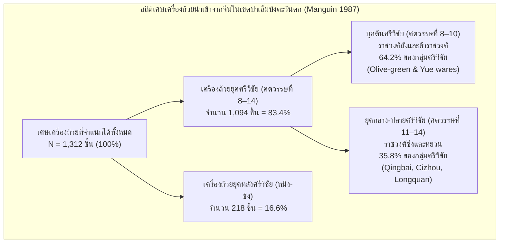
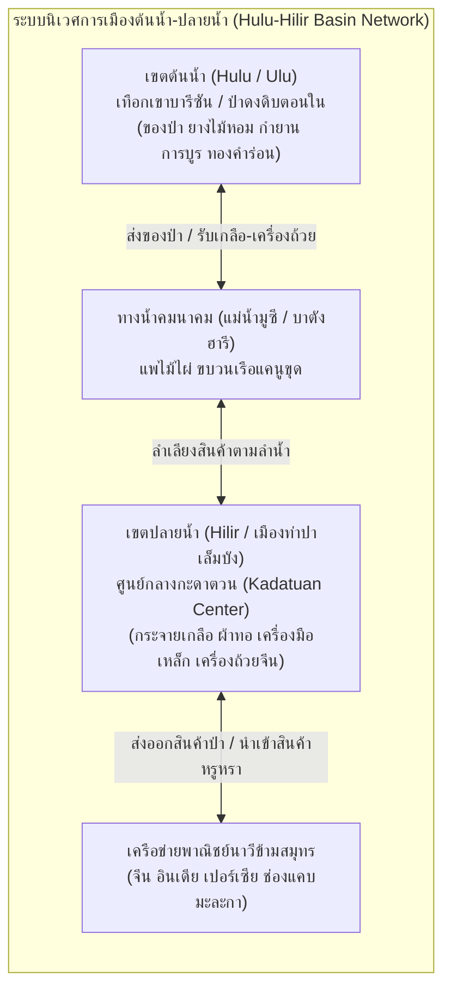
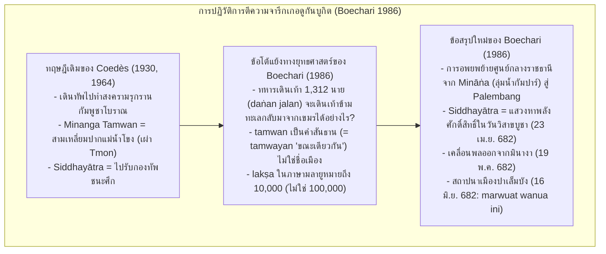
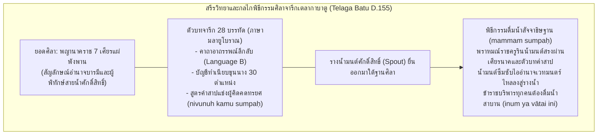
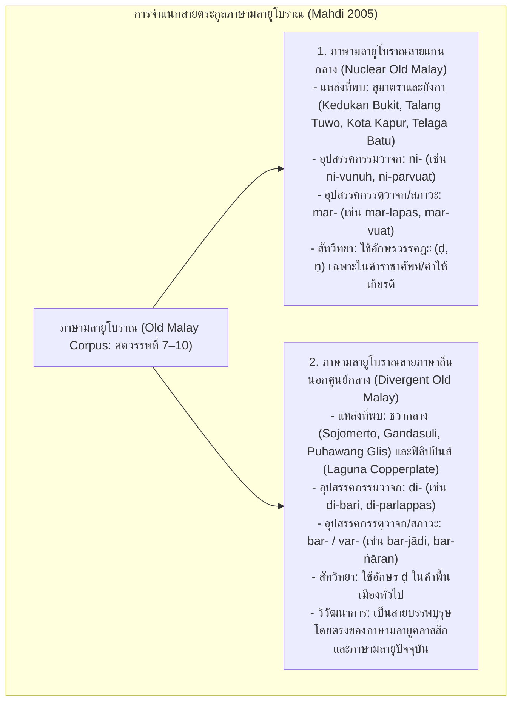

# บทที่ 3: สุมาตรา มหาจักรวรรดิทางทะเลศรีวิชัย และจารึกงมจากลุ่มน้ำ: พลวัตอำนาจ กายวิภาคราชสำนัก และวัฒนธรรมจารึกข้ามสมุทร (คริสต์ศตวรรษที่ 7–14)
*(Sumatra, the Śrīvijaya Maritime Empire, and Riverine Inscriptions: Power Dynamics, Court Anatomy, and Trans-Oceanic Epigraphic Culture, 7th–14th Centuries CE)*

---

## บทนำประจำบทที่ 3: พลวัตของมหาจักรวรรดิทางทะเลศรีวิชัย ภูมินิเวศน์ลุ่มน้ำ และการปรากฏตัวของจารึกภาษามลายูโบราณ

ในประวัติศาสตร์นิพนธ์ว่าด้วยเอเชียตะวันออกเฉียงใต้ภาคพื้นสมุทร การก่อรูปและการดำรงอยู่ของอาณาจักรศรีวิชัย (Śrīvijaya) นับเป็นปรากฏการณ์ทางอารยธรรมที่โดดเด่นและทรงอิทธิพลสูงสุดระหว่างปลายคริสต์ศตวรรษที่ 7 ถึงปลายคริสต์ศตวรรษที่ 13 ศรีวิชัยมิได้สถาปนาอำนาจขึ้นจากฐานรากทางเศรษฐกิจเกษตรกรรมแบบชลประทานในที่ราบลุ่มแผ่นดินใหญ่เฉกเช่นราชอาณาจักรโบราณบนเกาะชวาหรือกัมพูชา หากแต่เป็น "รัฐสมุทรบาลลุ่มน้ำ" (Riverine-Maritime Thalassocracy) อันไพศาล ซึ่งอาศัยทำเลที่ตั้งทางภูมิรัฐศาสตร์อันเป็นเอกเทศ ณ จุดยุทธศาสตร์เชื่อมต่อระหว่างมหาสมุทรอินเดียกับทะเลจีนใต้ ในการควบคุมจุดตัดของเส้นทางพาณิชย์นาวีสากลผ่านช่องแคบมะละกา (Strait of Malacca) และช่องแคบซุนดา (Sunda Strait) โครงสร้างเชิงพื้นที่ของศรีวิชัยมีความสอดคล้องแนบแน่นกับสภาพแวดล้อมทางชลศาสตร์ของเกาะสุมาตราฝั่งตะวันออก โดยเฉพาะอย่างยิ่งระบบลุ่มแม่น้ำมูซี (Musi River Basin) ในสุมาตราใต้ และระบบลุ่มแม่น้ำบาตังฮารี (Batang Hari River Basin) ในแคว้นจัมบี ซึ่งทำหน้าที่เป็นหลอดเลือดใหญ่ในการลำเลียงสินค้าของป่าหายาก เรซิน ยางไม้หอม การบูร และแร่ทองคำจากเทือกเขาสูงตอนในสู่เมืองท่าปลายน้ำ [1]

รุ่งอรุณแห่งประวัติศาสตร์ลายลักษณ์อักษรของโลกมลายูได้เปิดฉากขึ้นอย่างฉับพลันและทรงพลังในคริสต์ทศวรรษ 680 (ราว มหาศักราช 604–608 หรือ ค.ศ. 682–686) ผ่านการปรากฏตัวของกลุ่มศิลาจารึกภาษามลายูโบราณ (Old Malay Inscriptions) รุ่นแรกสุด ซึ่งสลักด้วยอักษรหลังปัลลวะหรืออักษรสุมาตราโบราณ (Later Pallava / Old Sumatran Script) ได้แก่ จารึกเกอดูกันบูกิต (Kedukan Bukit ค.ศ. 682), จารึกตาลังตูโว (Talang Tuwo ค.ศ. 684), จารึกโกตากาปูร์ (Kota Kapur ค.ศ. 686), จารึกการังบราฮี (Karang Brahi ค.ศ. 686), และจารึกเตลากาบาตู (Telaga Batu ปลายคริสต์ศตวรรษที่ 7) การระเบิดขึ้นของวัฒนธรรมการจารึกในเขตปาเล็มบังและปริมณฑลนี้ มิใช่เพียงเครื่องยืนยันการมีอยู่จริงของราชธานีศรีวิชัยเท่านั้น หากแต่ยังเป็นประจักษ์พยานของการนำเอา "เทคโนโลยีแห่งตัวอักษร" ผสานเข้ากับมโนทัศน์ทางพุทธศาสนามหายาน-วัชรยาน และไสยเวทพิธีกรรมดั้งเดิมของชาวออสโตรนีเซียน เพื่อสถาปนาความชอบธรรมทางการเมืองและสร้างเสถียรภาพในการบริหารจักรวรรดิทางทะเล [2]

เนื้อหาในตอนที่ 1 ของบทที่ 3 นี้ มุ่งวิเคราะห์รากฐานทางประวัติศาสตร์ โบราณคดี และจารึกวิทยาของศรีวิชัยยุคเริ่มแรก โดยแบ่งออกเป็นสามหัวข้อย่อยหลัก: ประการแรก การคลี่คลายปริศนาที่ตั้งราชธานีและโบราณคดีเมืองท่าศรีวิชัย ณ เมืองปาเล็มบัง โดยการหักล้างข้อกังขาเชิงประวัติศาสตร์นิพนธ์ของเบนเน็ต บรอนสัน (Bennet Bronson) ด้วยผลการขุดค้นทางโบราณคดีของปิแอร์-อีฟว์ มังแกง (Pierre-Yves Manguin) ว่าด้วยสถิติเครื่องถ้วยราชวงศ์ถัง สถาปัตยกรรมเรือนแพลอยน้ำ ป้อมค่ายไม้ไผ่ และระบบเครือข่ายกะดาตวนต้นน้ำ-ปลายน้ำ (Hulu-Hilir Basin Network); ประการที่สอง การปฏิวัติการอ่านและตีความจารึกเกอดูกันบูกิตโดยบูชารี (Boechari) ซึ่งพิสูจน์การย้ายศูนย์กลางอำนาจจากมินางาสู่ปาเล็มบัง ควบคู่กับการวิเคราะห์จารึกตาลังตูโวในมิติโพธิสัตวมรรคและตันตรยาน ตลอดจนจารึกโกตากาปูร์และการังบราฮีว่าด้วยพระราชโองการปราบกบฏและการศึกกับภูมิชวา; และประการที่สาม การชำระตัวบทศิลาจารึกเตลากาบาตูเพื่อศึกษากายวิภาคระบบราชสำนัก ทำเนียบข้าราชบริพารกว่า 30 ตำแหน่ง พิธีกรรมดื่มน้ำสัจจาธิษฐาน ตลอดจนการวิเคราะห์ภาษาศาสตร์ประวัติศาสตร์เพื่อจำแนกภาษามลายูโบราณสายแกนกลาง (Nuclear Old Malay) และชั้นภาษาซับสตราตัมกลุ่มภาษาบาริโตโบราณ (Language B) ในสูตรคำสาปแช่ง อันจะนำไปสู่ความเข้าใจที่ลึกซึ้งและรอบด้านต่อกลไกอำนาจของศรีวิชัยในฐานะมหาจักรวรรดิทางทะเลแห่งแรกของอุษาคเนย์ [3]

---

## 3.1 ปริศนาราชธานีและโบราณคดีเมืองท่าศรีวิชัย

### 3.1.1 วิกฤตการณ์ทางประวัติศาสตร์นิพนธ์และการหักล้างข้อกังขาของ Bronson & Wisseman (1976)

นับตั้งแต่ยอร์ช เซเดส์ (George Cœdès) ได้สถาปนามโนทัศน์เรื่อง "อาณาจักรศรีวิชัย" ขึ้นในวงวิชาการสากลเมื่อปี ค.ศ. 1918 โดยระบุว่าเมืองปาเล็มบัง (Palembang) ริมแม่น้ำมูซี ในเกาะสุมาตราใต้ คือราชธานีศูนย์กลางของจักรวรรดิทางทะเลแห่งนี้ตามหลักฐานการค้นพบศิลาจารึกภาษามลายูโบราณศตวรรษที่ 7 หลายหลัก [4] ข้อเสนอดังกล่าวได้รับการยอมรับอย่างกว้างขวางในหมู่นักจารึกวิทยาและนักประวัติศาสตร์ ทว่า ในช่วงกลางทศวรรษ 1970 วงวิชาการเอเชียตะวันออกเฉียงใต้ต้องเผชิญกับวิกฤตการณ์ทางประวัติศาสตร์นิพนธ์ครั้งสำคัญ เมื่อคณะนักโบราณคดีชาวอเมริกันนำโดย เบนเน็ต บรอนสัน และแจน วิสเซอมัน (Bennet Bronson and Jan Wisseman) ได้ดำเนินโครงการสำรวจและขุดค้นทางโบราณคดีภาคสนาม ณ เมืองปาเล็มบัง ในปี ค.ศ. 1974 ภายใต้ความร่วมมือกับกรมโบราณคดีอินโดนีเซีย ผลการขุดค้นดังกล่าวได้รับการตีพิมพ์ในปี ค.ศ. 1976 ภายใต้ชื่อบทความอันลือลั่นว่า *"Palembang as Srivijaya: The Lateness of Early Cities in Southern Southeast Asia"* ซึ่งบรอนสันและวิสเซอมันได้สรุปข้อค้นพบในเชิงลบอย่างรุนแรงว่า เมืองปาเล็มบังไม่มีร่องรอยการตั้งถิ่นฐานของมนุษย์ที่มีนัยสำคัญทางประวัติศาสตร์ก่อนคริสต์ศตวรรษที่ 14 เลยแม้แต่น้อย [5]

บรอนสันและวิสเซอมันอ้างว่า จากหลุมขุดค้นทางโบราณคดีรอบเนินเขาบูกิตเซอกุนตัง (Bukit Seguntang) และพื้นที่ใกล้เคียง ไม่พบเศษภาชนะดินเผาหรือเครื่องถ้วยชามเคลือบนำเข้าจากจีนที่สามารถระบุอายุย้อนไปถึงสมัยราชวงศ์ถัง (Tang Dynasty คริสต์ศตวรรษที่ 7–10) หรือราชวงศ์ซ่งเหนือ (Northern Song Dynasty คริสต์ศตวรรษที่ 10–11) ยิ่งไปกว่านั้น บริเวณปาเล็มบังยังขาดแคลนซากสถาปัตยกรรมหินหรืออิฐขนาดมหึมาที่เทียบเคียงได้กับเทวาลัยและพุทธสถานในชวากลางหรือกัมพูชา ด้วยเหตุนี้ บรอนสันจึงเสนอให้ "ตัดสิทธิ์ปาเล็มบัง" ออกจากการเป็นศูนย์กลางราชธานีของศรีวิชัย พร้อมทั้งตั้งข้อสงสัยว่า "ศรีวิชัยในฐานะรัฐรวมศูนย์ที่มีเมืองหลวงถาวรอาจไม่มีอยู่จริง" โดยบรอนสัน (Bronson 1977, 1979) ได้เสนอแบบจำลองเชิงพื้นที่ขึ้นมาทดแทน เรียกว่า **"แบบจำลองเมืองท่าต้นน้ำ-ปลายน้ำ" (Upstream-Downstream Model)** ซึ่งมองว่าศรีวิชัยเป็นเพียงเครือข่ายสหพันธรัฐเมืองท่าหลวมๆ ที่ไร้เมืองหลวงถาวร หรือเป็นเพียง "เมืองท่าเคลื่อนที่" ที่ผู้นำทางการเมืองต้องย้ายศูนย์กลางไปตามปากแม่น้ำสายต่างๆ บนเกาะสุมาตราหรือคาบสมุทรมลายูตามความผันผวนของเส้นทางการค้า [6]

ข้อสรุปในแง่ลบของบรอนสันได้สร้างความสั่นสะเทือนต่อประวัติศาสตร์นิพนธ์ศรีวิชัยอย่างมหาศาล และกลายเป็นช่องว่างที่เปิดโอกาสให้นักวิชาการสายชาตินิยมในประเทศไทยและมาเลเซียพยายามย้ายศูนย์กลางของศรีวิชัยออกจากเกาะสุมาตราไปยังแหล่งโบราณคดีบนคาบสมุทรไทย-มลายู เช่น ไชยา นครศรีธรรมราช หรือเกดะห์ [7] ทว่า ข้อกังขาของบรอนสันได้รับการตรวจสอบ รื้อถอน และหักล้างอย่างเด็ดขาดด้วยระเบียบวิธีวิจัยทางโบราณคดีสมัยใหม่ โดยการศึกษาวิจัยระลอกใหม่ของคณะนักวิจัยร่วมฝรั่งเศส-อินโดนีเซีย นำโดย ปิแอร์-อีฟว์ มังแกง (Pierre-Yves Manguin) แห่งสำนักฝรั่งเศสแห่งปลายบุรพทิศ (École française d'Extrême-Orient: EFEO) ร่วมกับศูนย์วิจัยโบราณคดีแห่งชาติอินโดนีเซีย (Pusat Penelitian Arkeologi Nasional: Puslit Arkenas) ภายใต้การนำของนางสตยาวตี ซูเลยมัน (Satyawati Suleiman) ตั้งแต่ปี ค.ศ. 1979 เป็นต้นมา [8]

ในบทความวิจัยระดับแม่บทเรื่อง *"Palembang et Sriwijaya: anciennes hypothèses, recherches nouvelles"* ตีพิมพ์ในวารสาร BEFEO ค.ศ. 1987 มังแกงได้ชี้ให้เห็นว่า ข้อสรุปที่ผิดพลาดของบรอนสันและวิสเซอมันเกิดขึ้นจากความบกพร่องอย่างร้ายแรงทางระเบียบวิธีวิจัยและการจำแนกประเภทโบราณวัตถุ (Methodological and Typological Flaws):
1. บรอนสันและคณะขาดความรู้ความเชี่ยวชาญในเรื่องเครื่องถ้วยจีนสมัยโบราณ โดยเฉพาะเครื่องถ้วยสโตนแวร์ตระกูลมะกอกเขียว (Olive-green wares / Guangdong stonewares) และเครื่องถ้วยดินเผาเคลือบยุคแรกที่ผลิตจากเตาเผาในมณฑลกวางตุ้งสมัยราชวงศ์ถัง (คริสต์ศตวรรษที่ 8–9)
2. บรอนสันได้นำเอาเศษเครื่องถ้วยตระกูลเยวี่ยโจว (Yue-type wares) สมัยห้าราชวงศ์และราชวงศ์ซ่ง ซึ่งเป็นเครื่องถ้วยชั้นเลิศที่มีอายุระหว่างคริสต์ศตวรรษที่ 9–10 ไปจัดรวมไว้ในกลุ่ม "เศษเครื่องถ้วยที่ไม่สามารถระบุประเภทได้" (Unidentified wares) ซึ่งในรายงานของบรอนสัน กลุ่มเครื่องถ้วยที่ไม่ระบุประเภทนี้มีสัดส่วนสูงผิดปกติถึงร้อยละ 41.6 ถึง 76.7 ของตัวอย่างทั้งหมดในแต่ละหลุมขุดค้น
3. ความบกพร่องดังกล่าวได้สร้าง "ภาพลวงตาทางประวัติศาสตร์" (illusion d'optique) ที่ลบล้างการมีอยู่ของชั้นดินวัฒนธรรมสมัยราชวงศ์ถังและซ่งในปาเล็มบังไปโดยสิ้นเชิง [9]

เมื่อมังแกงและคณะผู้วิจัยได้ดำเนินการสำรวจทางโบราณคดีอย่างเป็นระบบในเขตปาเล็มบังตะวันตก (Palembang Ouest) ครอบคลุมพื้นที่การังอันยาร์ (Karang Anyar), บูกิตเซอกุนตัง, ลอรังจัมบู (Lorong Jambu), กัมบังอุงเล็น (Kambang Unglen), และลาดังซีรัป (Ladang Sirap) โดยใช้ภาพถ่ายทางอากาศและการวิเคราะห์เครื่องถ้วยโดยผู้เชี่ยวชาญระดับสากล ผลการวิจัยได้พิสูจน์อย่างหมดจดว่า ปาเล็มบังเป็นศูนย์กลางการตั้งถิ่นฐานขนาดใหญ่ของมนุษย์ที่มีความต่อเนื่องยาวนานตั้งแต่คริสต์ศตวรรษที่ 7 และเป็นราชธานีศูนย์กลางของศรีวิชัยอย่างแท้จริงตามที่ตัวบทจารึกได้ระบุไว้ [10]

---

### 3.1.2 หลักฐานเชิงประจักษ์ทางโบราณคดี: สถิติเครื่องถ้วยราชวงศ์ถัง 83.4% และชุมชนหัตถกรรม

หลักฐานเชิงประจักษ์ที่หนักแน่นที่สุดในการยืนยันสถานะความเป็นเมืองท่าศูนย์กลางของปาเล็มบังในยุคศรีวิชัย คือข้อมูลสถิติโบราณวัตถุประเภทเครื่องถ้วยชามเซรามิกนำเข้าจากต่างประเทศ จากการสำรวจผิวดินและการขุดค้นทางโบราณคดีอย่างเป็นระบบของ Manguin (1987) ในเขตปาเล็มบังตะวันตก คณะผู้วิจัยได้รวบรวมเศษเครื่องถ้วยที่สามารถจำแนกอายุสมัยได้อย่างชัดเจนจำนวนทั้งสิ้น 1,312 ชิ้น การวิเคราะห์การกระจายตัวของอายุสมัยเครื่องถ้วยได้สร้างข้อค้นพบที่พลิกโฉมหน้าประวัติศาสตร์อย่างสิ้นเชิง:



สัดส่วนของเศษเครื่องถ้วยยุคศรีวิชัย (คริสต์ศตวรรษที่ 8 ถึง 14) มีความหนาแน่นสูงถึง **ร้อยละ 83.4** ของโบราณวัตถุทั้งหมด และในกลุ่มนี้ เป็นเครื่องถ้วยในยุคต้นของศรีวิชัย (คริสต์ศตวรรษที่ 8 ถึง 10 ตรงกับสมัยราชวงศ์ถังและยุคห้าราชวงศ์) มากถึง **ร้อยละ 64.2** โบราณวัตถุเด่นในกลุ่มนี้ประกอบด้วย เครื่องถ้วยสโตนแวร์เคลือบสีเขียวมะกอก (Olive-green stonewares) จากเตาเผากวางตุ้ง, ภาชนะดินเผาเคลือบสามสีสมัยถัง (Tang Sancai), เครื่องถ้วยศิลาดลยุคแรกจากเตาเยวี่ยโจว (Yue-type celadon), และเศษภาชนะเครื่องเคลือบสีน้ำเงินอมเขียวจากเตาฉางซา (Changsha wares) นอกจากนี้ยังพบเศษภาชนะดินเผาเคลือบน้ำยาแลกเกอร์สีฟ้าจากเปอร์เซีย (Persian turquoise-glazed earthenware) ซึ่งยืนยันว่าปาเล็มบังเป็นเมืองท่าปลายทางในเครือข่ายการค้าข้ามสมุทรระยะไกลระหว่างตะวันออกกลางกับจีนตั้งแต่คริสต์ศตวรรษที่ 8 เป็นอย่างน้อย [11]

นอกจากหลักฐานเครื่องถ้วยนำเข้าแล้ว การขุดค้นที่แหล่ง **กัมบังอุงเล็น (Kambang Unglen)** ซึ่งตั้งอยู่ทางทิศใต้ของเนินเขาบูกิตเซอกุนตัง ยังได้เปิดเผยหลักฐานของ "ย่านอุตสาหกรรมหัตถกรรมและโรงงานผลิตลูกปัดโบราณ" (Glass bead manufacturing workshop) โดยคณะนักโบราณคดีได้ค้นพบก้อนวัตถุดิบแก้วดิบนำเข้า กากขี้แร่แก้วหลอม (glass slag) หลอดแก้วสำหรับการดึงเม็ดลูกปัด ตลอดจนลูกปัดแก้วและหินมีค่า (carnelian และ agate) ที่ทำเสร็จสมบูรณ์และชำรุดเสียหายในระหว่างกระบวนการผลิตจำนวนมากกว่า 2,458 ชิ้น การค้นพบนี้ชี้ชัดว่า ปาเล็มบังมิได้เป็นเพียงสถานีขนถ่ายสินค้าผ่าน (Transit port) เท่านั้น แต่มีชุมชนช่างฝีมือผู้เชี่ยวชาญที่แปรรูปสินค้าหรูหราเพื่อป้อนเข้าสู่ระบบการค้าข้ามสมุทร [12]

ในทำนองเดียวกัน การสำรวจที่แหล่ง **ตาลังกีกิมเซอบรัง (Talang Kikim Seberang)** ริมฝั่งแม่น้ำลามีดารอ (Sungai Lamidaro) ได้เผยให้เห็นร่องรอยของ "ท่าเทียบเรือขนถ่ายสินค้าและคลังเสบียงสินค้า" (*débarcadère / transshipment centre*) โดยพบชิ้นส่วนปากและก้นไหกักเก็บสินค้าขนาดใหญ่สมัยราชวงศ์ถัง (Dusun storage jars) ตกกระจุกตัวอยู่อย่างหนาแน่นริมตลิ่ง ไหดินเผาขนาดมหึมาเหล่านี้ใช้สำหรับการบรรจุน้ำจืด เสบียงอาหาร และสินค้าของป่าที่รวบรวมมาจากเขตต้นน้ำเพื่อเตรียมถ่ายลำขึ้นสู่เรือเดินสมุทรขนาดใหญ่ [13]

ลำดับพัฒนาการเชิงพื้นที่ของปาเล็มบังยังสะท้อนถึงการเปลี่ยนแปลงทางประวัติศาสตร์อย่างน่าสนใจ โดย Manguin (1987, 2018) จำแนกการเคลื่อนย้ายศูนย์กลางชุมชนออกเป็น 3 ยุค:
1. *ยุคต้น (ปลายศตวรรษที่ 7 ถึง 10):* ชุมชนเมืองและเขตพระราชฐานกระจุกตัวหนาแน่นในเขตปาเล็มบังตะวันตก บริเวณการังอันยาร์ และเนินเขาบูกิตเซอกุนตัง ซึ่งเป็นยุคที่สร้างจารึกเกอดูกันบูกิตและตาลังตูโว
2. *ยุคกลาง (ศตวรรษที่ 11 ถึง 14):* ศูนย์กลางกิจกรรมทางเศรษฐกิจเคลื่อนย้ายไปสู่บริเวณลอรังจัมบู (Lorong Jambu) ซึ่งพบเครื่องถ้วยสมัยราชวงศ์ซ่งและหยวนอย่างหนาแน่น
3. *ยุคปลายและสมัยอิสลาม (ศตวรรษที่ 15 เป็นต้นมา):* ชุมชนเมืองเคลื่อนย้ายลงสู่เขตปาเล็มบังตะวันออก บริเวณเกอดิงซูโร (Geding Suro) ซึ่งต่อมาได้พัฒนาขึ้นเป็นศูนย์กลางของรัฐสุลต่านปาเล็มบัง [14]

---

### 3.1.3 วิศวกรรมชลศาสตร์และสถาปัตยกรรมไร้ซากหิน: คลองซูอักบูจัง สระน้ำการังอันยาร์ และป้อมค่ายไม้ไผ่โกตาเฮาร์

การคลี่คลายปริศนาสำคัญที่ว่า *"เหตุใดมหาอาณาจักรทางทะเลอันมั่งคั่งอย่างศรีวิชัยจึงไม่หลงเหลือซากปราสาทหินขนาดมหึมาไว้ที่ปาเล็มบังเหมือนในเกาะชวาหรือกัมพูชา"* จำเป็นต้องอาศัยความเข้าใจต่อธรรมชาติของระบบนิเวศและวัฒนธรรมสถาปัตยกรรมของประชากรลุ่มน้ำในเอเชียตะวันออกเฉียงใต้ภาคพื้นสมุทร มังแกง (Manguin 1987, 361–362) ได้อธิบายปรากฏการณ์นี้ผ่านหลักฐานโบราณคดีและชาติพันธุ์วรรณนา 3 ประการหลัก:

ประการแรก รูปแบบการอยู่อาศัยของประชากรศรีวิชัยเป็น **"วัฒนธรรมการอยู่อาศัยบนเรือนแพลอยน้ำ" (*rakit*)** และเรือนไม้ยกใต้ถุนสูงริมฝั่งแม่น้ำและลำคลอง สภาพทางภูมิศาสตร์ของปาเล็มบังตั้งอยู่บนรอยต่อระหว่างลานตะพักหินยุคเทอร์เชียรีกับที่ลุ่มชุ่มน้ำน้ำท่วมถึง (*lebak*) ซึ่งได้รับอิทธิพลจากกระแสน้ำขึ้นน้ำลงรายวัน (*diurnal tide*) ที่หนุนระดับน้ำในแม่น้ำมูซีให้สูงขึ้นได้ถึง 3–4 เมตร การสร้างบ้านเรือนถาวรบนผืนดินในเขตน้ำท่วมถึงจึงเป็นไปได้ยาก ประชากรส่วนใหญ่จึงดำรงชีวิตอยู่บนแพลอยน้ำที่ผูกจอดเรียงรายเลียบสองฝั่งแม่น้ำมูซีและลำน้ำสาขา ดังที่ปรากฏในบันทึกของราชทูตจีนและนักภูมิศาสตร์อาหรับ เช่น บันทึกของเจ้าหยู่กัว (*Zhu Fan Zhi* ค.ศ. 1225) ซึ่งระบุไว้อย่างชัดเจนว่า:

> "ชาวเมืองอาศัยกระจัดกระจายอยู่นอกกำแพงเมือง หรือไม่ก็สร้างเรือนแพลอยน้ำอยู่บนแพไม้ไผ่ผูกโยงด้วยเชือก เมื่อระดับน้ำขึ้น แพก็ลอยสูงขึ้นตามน้ำโดยไม่จมน้ำ หากพวกเขาประสงค์จะย้ายไปอยู่ที่อื่น ก็เพียงแต่แก้เชือกผูกแพแล้วปล่อยให้ลอยไปตามกระแสน้ำได้อย่างง่ายดาย" [15]

วัสดุก่อสร้างทั้งหมดของเรือนแพและที่อยู่อาศัยทำจากอินทรียวัตถุธรรมชาติ ได้แก่ เสาไม้ ลำไม้ไผ่ หวาย และใบจากมุงหลังคา ซึ่งผุพังสลายตัวไปตามกาลเวลาในสภาพภูมิอากาศแบบมรสุมเขตร้อนชื้น จึงไม่ทิ้งร่องรอยโครงสร้างทางสถาปัตยกรรมถาวรไว้ให้เห็นบนผิวดิน [16]

ประการที่สอง สถาปัตยกรรมป้อมปราการของราชสำนักมลายูโบราณ (*kota*) มิได้สร้างขึ้นด้วยการสกัดหินแอนดีไซต์หรือศิลาแลง หากแต่เป็นการขุดคูเมืองที่มีน้ำล้อมรอบ สร้างคันดินสูง ปักเสาไม้ซุง และปลูกแนวรั้วต้นไผ่หนาทึบเป็นแนวป้องกัน ดังปรากฏร่องรอยชื่อโบราณของแหล่งโบราณสถานการังอันยาร์ว่า **"โกตาเฮาร์" (*Kota Haur*)** ซึ่งในภาษามลายูโบราณและมลายูคลาสสิกแปลตรงตัวว่า **"ป้อมปราการไม้ไผ่"** (คำว่า *haur* หมายถึง ไม้ไผ่หนามชนิดหนึ่ง ซึ่งปรากฏชื่ออยู่ในจารึกตาลังตูโว ค.ศ. 684 ด้วย) แนวรั้วไผ่หนามขนาดมหึมาผสานกับคูคลองส่งน้ำทำหน้าที่เป็นปราการธรรมชาติที่สามารถสกัดกั้นการบุกรุกของข้าศึกได้อย่างมีประสิทธิภาพ [17]

ประการที่สาม ผลงานการสำรวจชิ้นเอกของ Manguin (1987) คือการค้นพบ **"โครงข่ายระบบวิศวกรรมชลศาสตร์โบราณ" (Ancient Hydraulic Complex)** ในเขตปาเล็มบังตะวันตก ซึ่งประกอบด้วยคลองขุดและสระน้ำขนาดมหึมาที่จัดวางผังอย่างประณีต:
1. **คลองซูอักบูจัง (Suak Bujang Canal):** คลองขุดตรงความยาวประมาณ 3 กิโลเมตร กว้าง 10–12 เมตร ซึ่งถูกขุดตัดทะลุเนินดินเพื่อควบคุมทิศทางการไหลของน้ำและเชื่อมระหว่างลำน้ำลามีดารอกับแม่น้ำมูซี คลองนี้ทำหน้าที่สำคัญในการระบายน้ำท่วมในฤดูมรสุม และเปิดให้เรือสัญจรทางน้ำสามารถแล่นลัดคุ้งน้ำเพื่อหลีกเลี่ยงกระแสน้ำที่ไหลเชี่ยวกรากตรงจุดคอดของแม่น้ำมูซี [18]
2. **ระบบสระน้ำและเกาะเทียมแห่งการังอันยาร์ (Karang Anyar Hydraulic Basins):** ประกอบด้วยสระน้ำรูปสี่เหลี่ยมผืนผ้าขนาดใหญ่ 3 สระ (Basin A, B, และ C) โดยในสระหลักมีการขุดดินขึ้นมาถมสร้างเป็น "เกาะเทียมรูปสี่เหลี่ยมจัตุรัส" อยู่กลางสระน้ำ ได้แก่ **เกาะเจิมปากา (Pulau Cempaka)** ขนาดประมาณ 40 x 40 เมตร และ **เกาะนังกา (Pulau Nangka)** [19]

มังแกงชี้ให้เห็นว่า ระบบชลศาสตร์ที่การังอันยาร์มิได้สร้างขึ้นเพื่อการชลประทานในนาข้าว (เนื่องจากประชากรลุ่มน้ำมูซีโบราณบริโภคสาคูและข้าวไร่ มิได้ทำนาข้าวทดน้ำในที่ลุ่มเลอบัก) หากแต่สร้างขึ้นเพื่อประโยชน์ในการคมนาคมทางเรือ การเสด็จพระราชดำเนินทางชลมารค และทำหน้าที่เชิงสัญลักษณ์ในฐานะ "อุทยานหลวงจำลองจักรวาลและสวรรค์กลางน้ำ" ของพระมหากษัตริย์ผู้ทรงธรรม โครงสร้างเกาะเทียมกลางสระน้ำนี้มีความสอดคล้องอย่างน่าทึ่งกับข้อความใน **ศิลาจารึกตาลังตูโว (ค.ศ. 684)** ที่ระบุถึงการสร้างสระน้ำ (*talāga*) และคันดินทำนบกั้นน้ำ (*tavad*) ในสวนศรีเกษตร ตลอดจนสอดรับกับความทรงจำทางประวัติศาสตร์ใน *พงศาวดารมลายู* (*Sejarah Melayu*) ที่พรรณนาถึงพระราชวังของบรรพบุรุษกษัตริย์มลายูบนเกาะกลางสระน้ำอันงดงามริมฝั่งแม่น้ำมูซี [20]

ส่วนสถาปัตยกรรมถาวรที่ก่อด้วยอิฐนั้น จำกัดอยู่เฉพาะสถูปเจดีย์ทางพุทธศาสนาและฐานพลับพลาบนเนินเขาศักดิ์สิทธิ์ **บูกิตเซอกุนตัง (Bukit Seguntang)** ซึ่งทำหน้าที่เป็นศูนย์กลางพิธีกรรมทางจิตวิญญาณ โดยบนยอดเขานี้เป็นที่ประดิษฐาน **พระพุทธรูปศิลาขนาดใหญ่แห่งบูกิตเซอกุนตัง (Grand Bouddha de Bukit Seguntang)** พระพุทธรูปหินแกรนิตปางประทานอภัยขนาดมหึมา (ความสูงรวมฐานเกือบ 3 เมตร) รูปแบบศิลปะอมราวดีหรืออนุราธปุระลังกา (คริสต์ศตวรรษที่ 7–8) ซึ่งยืนยันว่าปาเล็มบังเป็นศูนย์กลางการศึกษาพุทธศาสนาที่ยิ่งใหญ่ สอดคล้องกับบันทึกของภิกษุอี้จิง (I-tsing) ในปี ค.ศ. 671 ที่ระบุว่าในศรีวิชัยมีพระสงฆ์มากกว่าหนึ่งพันรูปศึกษาพระธรรมวินัยและภาษาศาสตร์เช่นเดียวกับในประเทศอินเดีย ทว่า ในยุคหลัง อิฐโบราณจากสถูปบนบูกิตเซอกุนตังและเตาเผาโบราณได้ถูกราษฎรท้องถิ่นรื้อถอนไปใช้ประโยชน์ในการก่อสร้างบ้านเรือนจนหมดสิ้น [21]

---

### 3.1.4 ซากเรือเดินสมุทรโบราณและเทคโนโลยีการต่อเรือไร้ตะปูแบบอุษาคเนย์ (Lashed-Lug Shipbuilding Tradition)

แสนยานุภาพทางทะเลและความมั่งคั่งของศรีวิชัยวางอยู่บนวิทยาการต่อเรือเดินสมุทรและทักษะการเดินเรือขั้นสูงของประชากรตระกูลออสโตรนีเซียน หลักฐานทางโบราณคดีใต้น้ำและการขุดค้นในลุ่มน้ำมูซีและพื้นที่ชายฝั่งสุมาตราใต้ ได้เผยให้เห็นซากเรือเดินสมุทรโบราณหลายลำ โดยเฉพาะอย่างยิ่ง **ซากเรือสัมบีเรอโจ (Sambirejo Ship)** ซึ่งขุดพบในเขตอำเภอมูซีบันยูวาซิน (Musi Banyuasin) ทางตะวันตกเฉียงเหนือของปาเล็มบัง กำหนดอายุทางวิทยาศาสตร์ด้วยวิธีคาร์บอน-14 (C-14) อยู่ระหว่างคริสต์ศตวรรษที่ 7 ถึง 9 ร่วมสมัยกับยุคทองของศรีวิชัย [22]

การศึกษาซากเรือโบราณเหล่านี้โดย ปิแอร์-อีฟว์ มังแกง (Manguin 1985, 1996, 2018) ได้พิสูจน์ให้เห็นถึงอัตลักษณ์ทางเทคโนโลยีการต่อเรือที่โดดเด่นของเอเชียตะวันออกเฉียงใต้ ซึ่งแตกต่างจากประเพณีการต่อเรือของจีนและยุโรปอย่างสิ้นเชิง เทคโนโลยีนี้เรียกว่า **"เทคนิคการเข้าไม้ต่อเรือแบบเย็บร้อยเชือกและเดือยไม้" (Lashed-Lug and Sewn-Plank Shipbuilding Technique)** ซึ่งมีลักษณะเฉพาะทางวิศวกรรมดังนี้:
1. **การต่อเรือแบบสร้างเปลือกนอกก่อน (Shell-first Construction):** ช่างต่อเรือชาวมลายูจะเริ่มต้นด้วยการประกอบแผ่นกระดานกราบเรือ (strakes) ขึ้นจากกระดูกงูเรือ โดยเชื่อมแผ่นกระดานแต่ละแผ่นเข้าด้วยกันด้วย "เดือยไม้กลม" (wooden dowels หรือ treenails) ที่ตอกสอดเข้าไปในรูเดือยที่เจาะไว้ตามขอบแผ่นไม้ โดยไม่มีการใช้ตะปูเหล็กหรือสลักโลหะแม้แต่ตัวเดียว
2. **การเจาะหูไม้และการเย็บร้อยเชือก (Lashed-Lug Technique):** ด้านในของแผ่นกระดานเรือแต่ละแผ่น ช่างจะถากเนื้อไม้ให้เหลือปุ่มหูไม้สี่เหลี่ยมที่มีรูเจาะทะลุ (*lugs* หรือ *cleats*) เรียงเป็นแถวตามแนวยาว จากนั้นจะใช้กงเรือไม้ (frames/ribs) มาวางทาบ แล้วใช้ "เชือกเส้นใยธรรมชาติ" เย็บร้อยมัดตรึงระหว่างหูไม้กับกงเรืออย่างแน่นหนา
3. **การใช้เส้นใยต้นชิด/ตาลโตนด (*ijuk*):** เส้นใยที่ใช้ในการเย็บร้อยและยาแนวรอยต่อของเรือ คือเส้นใยสีดำเหนียวทนทานเป็นพิเศษจากโคนกาบใบของต้นชิดหรือตาลโตนด (*Arenga pinnata* ในภาษามลายูเรียกว่า *ijuk* หรือ *handu* ในจารึกตาลังตูโว) ซึ่งมีคุณสมบัติทนทานต่อน้ำเค็ม ปลวกทะเล และการเปื่อยเน่าได้ดีกว่าเชือกป่านทั่วไปอย่างมหาศาล [23]

ความยืดหยุ่นทางวิศวกรรมของเรือแบบ Lashed-Lug ถือเป็นหัวใจของความสำเร็จในการเดินเรือข้ามสมุทร: โครงสร้างเรือที่ยึดโยงด้วยเดือยไม้และเชือกเย็บร้อยมีความยืดหยุ่นตัวสูง (Elastic flexibility) เมื่อเรือต้องเผชิญกับคลื่นลมแรงและแรงบิดตัวของกระแสน้ำในมหาสมุทรเปิด แผ่นกระดานเรือจะสามารถขยับตัวและกระจายแรงกระแทกได้โดยไม่แตกหัก แตกต่างจากเรือโครงสร้างแข็งที่ยึดด้วยตะปูโลหะซึ่งมีโอกาสปริแตกได้ง่ายเมื่อเกิดแรงเค้นมหาศาล ยิ่งไปกว่านั้น ขนาดของเรือเดินสมุทรโบราณที่ต่อด้วยเทคนิคนี้มีความยาวได้มากกว่า 25 ถึง 30 เมตร และสามารถบรรทุกระวางสินค้าได้หลายร้อยตัน [24]

เทคโนโลยีการต่อเรือไร้ตะปูนี้สอดคล้องอย่างสมบูรณ์กับคำศัพท์เฉพาะทางใน **จารึกเกอดูกันบูกิต (ค.ศ. 682)** ซึ่งบันทึกคำว่า **`sāmvau`** (เรือสำเภาเดินสมุทรขนาดใหญ่) ในการลำเลียงกองทัพเรือ 20,000 นาย และสัมภาระเสบียง 200 หีบ ตลอดจนสอดรับกับบันทึกของนักภูมิศาสตร์ชาวอาหรับอย่าง อบู ซัยด์ ฮัสซัน (Abu Zayd Hasan ค.ศ. 916) ที่บรรยายด้วยความอัศจรรย์ใจว่า เรือสินค้าของชาวซาบัก (Zābag / ศรีวิชัย) ต่อขึ้นด้วยแผ่นไม้ที่เย็บร้อยเข้าด้วยกันด้วยเชือกใยมะพร้าวและเส้นใยต้นไม้โดยปราศจากการใช้ตะปูเหล็ก [25]

---

### 3.1.5 ระบบนิเวศการเมืองต้นน้ำ-ปลายน้ำ (Hulu-Hilir Basin Network) และแบบจำลองเครือข่ายกะดาตวน (Kadatuan Network Model)

เพื่อทำความเข้าใจตรรกะการบริหารจัดการอำนาจของศรีวิชัย นักวิชาการในปัจจุบันได้ก้าวพ้นกรอบคิดแบบ "จักรวรรดิรวมศูนย์อำนาจเบ็ดเสร็จ" (Centralized Unitary Empire) ซึ่งเป็นมโนทัศน์ที่นักบูรพคดีศึกษายุคอาณานิคมนำมาจากภาพจำของจักรวรรดิโรมันหรือจักรวรรดิราชวงศ์จีน การศึกษาของ โอ. ดับเบิลยู. วอลเตอร์ส (O.W. Wolters 1967, 1979), แฮร์มันน์ คุลเกอ (Hermann Kulke 1993), และปิแอร์-อีฟว์ มังแกง (Pierre-Yves Manguin 2002, 2018) ได้พิสูจน์ให้เห็นว่า โครงสร้างทางการเมืองของศรีวิชัยดำเนินงานในรูปแบบ **"ระบบนิเวศการเมืองต้นน้ำ-ปลายน้ำ" (Hulu-Hilir Basin Network)** ผสานเข้ากับ **"แบบจำลองเครือข่ายกะดาตวน" (Kadatuan Network Model)** [26]

ในมิติของภูมินิเวศน์ลุ่มน้ำ เกาะสุมาตราประกอบด้วยระบบแม่น้ำสายใหญ่หลายสายที่ไหลขนานกันจากเทือกเขาบารีซัน (Barisan Mountains) ทางทิศตะวันตก ลงสู่ชายฝั่งทะเลฝั่งตะวันออก แม่น้ำแต่ละสายมีพลวัตการแลกเปลี่ยนทางเศรษฐกิจระหว่างสองขั้วนิเวศ:
- **เขตต้นน้ำ (Hulu หรือ Ulu):** ดินแดนที่สูงและป่าดงดิบตอนใน ซึ่งเป็นถิ่นอาศัยของกลุ่มชนเผ่าพื้นเมืองดั้งเดิม (เช่น ชาวโอรังอูซู, ชาวปาเซอมะฮ์, และกลุ่มภาษามาลายิกต้นน้ำ) พื้นที่นี้เป็นแหล่งกำเนิดของสินค้าส่งออกที่มีมูลค่าสูงสุดในโลกโบราณ ได้แก่ ยางไม้กำยาน (benzoin), การบูร (camphor), น้ำมันชัน, ชะมดเช็ด, ขี้ผึ้ง, ไม้กฤษณา, และแร่ทองคำที่ร่อนได้จากแม่น้ำมูซีและแม่น้ำบาตังฮารี
- **เขตปลายน้ำ (Hilir):** เมืองท่าบริเวณปากแม่น้ำหรือจุดที่น้ำทะเลหนุนถึง เช่น ปาเล็มบัง บนแม่น้ำมูซี และ มูอาราจัมบี บนแม่น้ำบาตังฮารี เมืองท่าปลายน้ำทำหน้าที่เป็น "ประตูปิด-เปิดทางเศรษฐกิจ" (gateway port) ที่ควบคุมการเชื่อมต่อไปสู่ตลาดโลกภายนอก โดยทำหน้าที่นำเข้าสินค้าอุตสาหกรรมที่ชุมชนต้นน้ำต้องการ เช่น เกลือทะเล, ผ้าทอนำเข้าจากอินเดีย, เครื่องมือเหล็ก, และเครื่องถ้วยชามเซรามิกจากจีน เพื่อส่งทวนกระแสน้ำกลับขึ้นไปแลกเปลี่ยนกับสินค้าของป่า [27]



ในเชิงการปกครอง ศรีวิชัยมิได้ส่งกองทหารเข้าไปยึดครองดินแดนต้นน้ำอย่างเบ็ดเสร็จ หากแต่บริหารจัดการผ่าน **"แบบจำลองเครือข่ายกะดาตวน" (Kadatuan Network Model)** คำว่า **`kadatuan`** สืบรากศัพท์มาจากคำภาษาออสโตรนีเซียนว่า **`datu`** (ผู้เป็นใหญ่, เจ้าเมือง, ผู้นำชุมชน) เติมคำขนาบหน้า-หลัง `ka-...-an` กลายเป็น `kadatuan` ซึ่งในความหมายเชิงจารึกวิทยา มิได้หมายถึง "จักรวรรดิอาณาเขต" (territorial empire) แต่หมายถึง **"ที่ประทับของดาตูสูงสุด" หรือ "ราชสำนักศูนย์กลาง" (the seat/residence of the datu)** [28]

โครงสร้างอำนาจของศรีวิชัยประกอบด้วยโหนดอำนาจหลายระดับที่ซ้อนทับกัน:
1. *พระมหากษัตริย์ศรีวิชัย (Dapunta Hiyaṅ / Mahārāja):* ทรงประทับอยู่ ณ กะดาตวนศูนย์กลางที่ปาเล็มบัง ทรงควบคุมทรัพยากรหลัก กองเรือพาณิชย์หลวง และการติดต่อทางการทูตกับจีนและอินเดีย
2. *เจ้าเมืองและผู้นำท้องถิ่น (dātu):* ผู้นำชุมชนต้นน้ำและผู้นำเมืองท่าชายฝั่งที่เป็นเครือข่ายพันธมิตร
3. *กลไกการประสานอำนาจ:* ราชสำนักปาเล็มบังผูกมัดความจงรักภักดีของบรรดา *dātu* ท้องถิ่นผ่านการกระจายผลประโยชน์จากการค้าข้ามสมุทร, การอภิเษกสมรสทางการเมือง, การมอบสถานะอันศักดิ์สิทธิ์และเครื่องยศราชสำนัก, และที่สำคัญที่สุดคือการใช้ **"พิธีกรรมทางจิตวิญญาณและคำสาปแช่ง" (Sacred Oaths and Imprecations)** ดังที่ปรากฏในศิลาจารึกโกตากาปูร์ การังบราฮี และเตลากาบาตู ซึ่งขู่เข็ญว่าผู้นำท้องถิ่นใดที่คิดคดทรยศ ไม่ส่งส่วย หรือไม่ยอมมารายงานข้อเท็จจริง จะต้องถูกลงทัณฑ์ด้วยคมดาบและคำแช่งสาปให้ถึงแก่ความตายอย่างสยดสยอง [29]

---

## 3.2 การปฏิวัติการอ่านจารึกเกอดูกันบูกิตและกลุ่มจารึกศตวรรษที่ 7

### 3.2.1 ศิลาจารึกเกอดูกันบูกิต (Kedukan Bukit Inscription 682/683 CE): บริบทการค้นพบ อักขรวิทยา และตัวบทปฐมภูมิ

ในบรรดาหลักฐานลายลักษณ์อักษรทั้งหมดของศรีวิชัย ศิลาจารึกเกอดูกันบูกิต (Kedukan Bukit Inscription) ได้รับการยกย่องให้เป็น "เอกสารประวัติศาสตร์ปฐมบทแห่งการสถาปนาราชอาณาจักร" ศิลาจารึกหลักนี้ค้นพบเมื่อวันที่ 29 พฤศจิกายน ค.ศ. 1920 โดย ซี. เจ. บาเตินบืร์ค (C.J. Batenburg) ผู้ตรวจการอาณานิคมชาวดัตช์ ในบ้านของราษฎรท้องถิ่นริมฝั่งแม่น้ำตาตัง (Sungai Tatang) ซึ่งเป็นลำน้ำสาขาของแม่น้ำมูซี ในหมู่บ้านเกอดูกันบูกิต บริเวณเชิงเขาบูกิตเซอกุนตัง ทางทิศตะวันตกเฉียงใต้ของเมืองปาเล็มบัง ในอดีตชาวบ้านได้นำก้อนหินจารึกนี้ไปใช้เป็น "เครื่องรางนำโชค" (maskot) วางไว้ที่หัวเรือในการแข่งขันพายเรือยาวประจำปีในแม่น้ำมูซี ปัจจุบันเก็บรักษาและจัดแสดงอยู่ที่พิพิธภัณฑสถานแห่งชาติอินโดนีเซีย กรุงจาการ์ตา หมายเลขทะเบียน D.146 [30]

ลักษณะทางกายภาพของวัตถุจารึกเป็น **"ก้อนหินแม่น้ำแอนดีไซต์ธรรมชาติผิวเกลี้ยงรูปทรงกลมรีไม่สม่ำเสมอ" (Ordinary Andesitic River Boulder)** ความยาวสูงสุดประมาณ 45 เซนติเมตร เส้นรอบวง 80 เซนติเมตร ด้านขวาของก้อนหินแตกบิ่นเล็กน้อย ทำให้ตัวอักษรบางตัวในบรรทัดที่ 7 ขาดหายไป 1 ตัว และบรรทัดที่ 8, 9, 10 ขาดหายไปบรรทัดละ 2–4 ตัว อักขรวิทยาของจารึกสลักด้วยอักษรหลังปัลลวะ (Later Pallava) ภาษามลายูโบราณ มีจำนวนทั้งสิ้น 10 บรรทัด [31]

ในมิติของการคำนวณศักราช ในระยะแรก George Cœdès (1930, 33) ได้อ่านศักราชในบรรทัดแรกเป็น *śakavarṣātīta 605* (มหาศักราช 605 ตรงกับ ค.ศ. 683) ทว่า ต่อมา ลุย-ชาร์ลส์ ดาแมส์ (Louis-Charles Damais 1952, 1955) นักคำนวณปฏิทินดาราศาสตร์ชั้นครู ได้ตรวจสอบรูปอักษรเลข "4" อย่างละเอียด และยืนยันร่วมกับ บูชารี (Boechari 1986, 35) และโครงการ DHARMA (Griffiths et al. 2021, `INSIDENK00159`) ว่าตัวเลขศักราชที่ถูกต้องคือ **มหาศักราช 604 (*śakavarṣātīta 604*)** ซึ่งตรงกับ **ค.ศ. 682** [32]

#### ตัวบทจารึกเกอดูกันบูกิต (Kedukan Bukit Inscription) ฉบับปริวรรตอักษรโรมันสากล (IAST)
*(ชำระสอบทานตาม Boechari 1986, 35; Mahdi 2005, 184–196; และ DHARMA `INSIDENK00159`)*

> ```text
> (1) * svasti śrī śaka-varṣātīta 604 ekādaśī śukla-pakṣa
> (2) vulan vaiśākha ḍa punta hiyaṁ nāyik di sāmvau
> (3) maṅalap siddhayātra di saptamī śukla-pakṣa vulan jyeṣṭha
> (4) ḍa punta hiyaṁ marlapas dari mināṅa tāmvan mamāva yaṁ
> (5) vala dua lakṣa daṅan kośa dua ratus cāra di sāmvau
> (6) daṅan jālan sarivu tlu rātus sapuluḥ dua vañakña
> (7) dātaṁ di mukha ... [upaṁ] sukhacitta di pañcamī śukla-pakṣa vula[n āsāḍha]
> (8) laghu mudita dātaṁ marvuat vanua [ini ....]
> (9) śrīvijaya jaya siddhayātra subhikṣa n[ityakāla]
> (10) //
> ```

#### คำแปลภาษาไทยเชิงวิชาการบรรทัดต่อบรรทัด:
> **(บรรทัดที่ 1–2):** ขอความสวัสดีและความรุ่งเรืองจงมี! มหาศักราชล่วงแล้วได้ 604 ปี ในดิถีขึ้น 11 ค่ำ เดือนไวศาขะ (ตรงกับวันพุธที่ 23 เมษายน ค.ศ. 682) องค์ดาปุนตา ฮียัง ได้เสด็จขึ้นประทับบนเรือสำเภา  
> **(บรรทัดที่ 3–4):** เพื่อทรงถือเอาซึ่งสิทธิยาตรา (แสวงหาความสำเร็จอันศักดิ์สิทธิ์และพลังบารมีธรรม) ครั้นถึงดิถีขึ้น 7 ค่ำ เดือนเชษฐะ (ตรงกับวันจันทร์ที่ 19 พฤษภาคม ค.ศ. 682) องค์ดาปุนตา ฮียัง ได้เสด็จยาตราออกจากมินางา  
> **(บรรทัดที่ 4–6):** ในขณะเดียวกัน ได้ทรงนำกองทัพจำนวนสองหมื่นนาย (ทหารเรือ) พร้อมด้วยสัมภาระเสบียงกรังสองร้อยหน่วยเดินทางโดยทางเรือสำเภา ร่วมกับกองกำลังเดินเท้าทางบกจำนวนหนึ่งพันสามร้อยสิบสองนายเป็นยอดกำลังพล  
> **(บรรทัดที่ 7–8):** เสด็จมาถึงยัง มุขะ... [มุกขะอูปัง] ด้วยดวงพระทัยอันเปี่ยมสุข ครั้นถึงดิถีขึ้น 5 ค่ำ เดือน[อาษาฒ] (ตรงกับวันอังคารที่ 16 มิถุนายน ค.ศ. 682)  
> **(บรรทัดที่ 8–9):** ได้เสด็จมาสร้างนิคมเมืองหลวง[แห่งนี้] อย่างราบรื่นแคล่วคล่องและเปี่ยมด้วยความปีติยินดี  
> **(บรรทัดที่ 9–10):** [ส่งผลให้] ศรีวิชัยมีชัยชนะ ถือสิทธิยาตรา มีความอุดมสมบูรณ์ไพบูลย์ตลอดกาลนานเทอญ [33]

---

### 3.2.2 การตีความปฏิวัติของ Boechari (1986): หักล้างทฤษฎีเขมรโบราณของ Coedès และการย้ายศูนย์กลางอำนาจจากมินางาสู่ปาเล็มบัง

การตีความตัวบทจารึกเกอดูกันบูกิตได้ผ่านการเปลี่ยนแปลงกระบวนทัศน์ครั้งประวัติศาสตร์ ในอดีต George Cœdès (1930, 34–37; 1964) ได้เสนอสมมติฐานว่า ข้อความในจารึกนี้เป็นบันทึกการยาตราทัพของกษัตริย์ศรีวิชัยเพื่อไปทำสงครามรุกรานต่างแดน โดยเซเดส์ได้เชื่อมโยงคำว่า `Mināṅa Tāmwan` เข้ากับดินแดนบริเวณสามเหลี่ยมปากแม่น้ำโขงในกัมพูชาโบราณ ซึ่งมีชนเผ่าพื้นเมืองชื่อว่า "ทมอน" (*Tmon*) อาศัยอยู่ เซเดส์จึงสรุปว่าจารึกนี้สร้างขึ้นเพื่อฉลองชัยชนะในการพิชิตกัมพูชา [34]

ทว่า ในปี ค.ศ. 1986 นักจารึกวิทยาชั้นนำชาวอินโดนีเซีย **บูชารี (Boechari)** ได้ตีพิมพ์บทความวิจัยชิ้นประวัติศาสตร์เรื่อง *"New Investigations on the Kedukan Bukit Inscription"* ในหนังสือรวมบทความเกียรติยศศาสตราจารย์ เบอร์เน็ต เคมเปอส์ (Bernet Kempers) ซึ่งได้หักล้างทฤษฎีเขมรโบราณของเซเดส์อย่างราบคาบ โดยอาศัยหลักฐานเชิงประจักษ์ทางยุทธศาสตร์การทหารและนิรุกติศาสตร์ภาษาศาสตร์ [35]:



ประเด็นหักล้างและข้อค้นพบใหม่ของบูชารีมีสาระสำคัญ 5 ประการ:
1. **การมีอยู่ของกองทหารราบเดินเท้า (The Śrīvijayan Infantry):** บูชารีและซาร์การ์ (Sarkar 1985, 334–335) ชี้ให้เห็นว่า เซเดส์มองข้ามข้อความสำคัญในบรรทัดที่ 6–7 ที่ระบุว่ากองทัพมีทหารเดินเท้าทางบกจำนวน 1,312 นาย (`daṅan jālan sarivu tlu rātus sapuluḥ dua`) หากการทำศึกเกิดขึ้นที่ดินดอนปากแม่น้ำโขงในกัมพูชา กองทหารราบเดินเท้าหน่วยนี้จะสามารถเดินเท้าข้ามทะเลจีนใต้กลับมายังศรีวิชัยได้อย่างไร การปรากฏของหน่วยทหารราบเดินเท้ายืนยันอย่างเด็ดขาดว่า ยุทธการทางทหารครั้งนี้เกิดขึ้นบนผืนแผ่นดินใหญ่ของเกาะสุมาตรา [36]
2. **การแยกคำสันธาน `tamwan` ออกจากชื่อสถานที่:** บูชารีพิสูจน์ว่า คำว่า `tamwan` มิใช่ส่วนหนึ่งของชื่อเฉพาะทางภูมิศาสตร์ แต่เป็นคำสันธานเชื่อมประโยคที่ตรงกับคำภาษาชวาโบราณว่า `tamwayan` ซึ่งแปลว่า "ในขณะเดียวกัน / ในระหว่างนั้น" หรือตรงกับคำภาษาอินโดนีเซียว่า `tambahan` ("ยิ่งไปกว่านั้น") ดังนั้น ชื่อสถานที่ต้นทางจึงมีเพียงคำว่า **`Mināṅa` (มินางา)** เท่านั้น [37]
3. **การระบุที่ตั้งศูนย์กลางเดิม "มินางา" ในจังหวัดรีเยา:** บูชารีเสนอว่า มินางา คือบริเวณบ้านมินางาริมแม่น้ำกัมปาร์กานัน (Kampar Kanan River) ใกล้เมืองบังตินัง (Bangkinang) และกลุ่มโบราณสถานมูอาราตากุส (Muara Takus) หรือบริเวณลุ่มแม่น้ำบาตังกวนตัน/อินดรากีรี ในเขตจังหวัดรีเยา (Riau) ซึ่งเป็นชุมทางศูนย์กลางโบราณที่เชื่อมโยงกับรัฐ "กันโตลี" (Kan-t'o-li) ในเอกสารราชวงศ์จีน และ "ขัณฑลปุระ" (*Akhaṇḍalapura*) ในจารึกหะรึลิงคะ (Haralinga Inscription ค.ศ. 856) บนเกาะชวา ที่ตั้งนี้สอดคล้องกับพิกัดเส้นศูนย์สูตรตามบันทึกของพระภิกษุอี้จิง และมีระยะทางเดินเรือประมาณ 26–28 วันมายังปาเล็มบังอย่างสมเหตุสมผล [38]
4. **มโนทัศน์ `siddhayātra` ในมิติพุทธศาสนามหายาน:** คำว่า `maṅalap siddhayātra` ที่นักวิชาการรุ่นก่อนมักแปลว่า "ไปรับความสำเร็จแห่งการเดินทาง" บูชารีชี้ว่าเป็นการมองข้ามมิติทางศาสนา กษัตริย์ดาปุนตา ฮียัง ทรงเสด็จลงเรือในวันขึ้น 11 ค่ำ เดือนไวศาขะ (23 เมษายน ค.ศ. 682) ซึ่งเป็นช่วงเริ่มต้นเทศกาล "ไตรพิสุทธิวิสาขบูชา" (Waisak) พระองค์จึงเสด็จทางเรือไปยังพุทธสถานศักดิ์สิทธิ์ประจำราชอาณาจักรเพื่อบำเพ็ญภาวนาและประกอบพิธีกรรมบวงสรวงขอพรรับ **"สิทธิยาตรา" (การจาริกอันศักดิ์สิทธิ์เพื่อพลังอำนาจและชัยชนะ / spiritual quest for magical power)** ก่อนเปิดฉากมหายุทธการ [39]
5. **การย้ายราชธานีและการสถาปนานครปาเล็มบัง (`marwuat vanua ini`):** ในวันที่ 7 ค่ำ เดือนเชษฐะ (19 พฤษภาคม ค.ศ. 682) ดาปุนตา ฮียัง เสด็จออกจากมินางาโดยจารึกใช้คำว่า `marlapas` (จากไปโดยไม่หวนกลับ) ทรงนำกองทัพเรือ 20,000 นาย (`vala dua lakṣa` คำว่า *lakṣa* ในภาษามลายูโบราณหมายถึง 10,000 มิใช่ 100,000) พร้อมเสบียง 200 หีบ และทหารเดินเท้า 1,312 นาย ยาตราทัพแบบคีมหนีบลงมาทางใต้ จนกระทั่งในวันที่ 5 ค่ำ เดือนอาษาฒ (16 มิถุนายน ค.ศ. 682) ได้เสด็จมาถึงบริเวณเกอดูกันบูกิต เมืองปาเล็มบัง อย่างราบรื่นและเปลาะใจ (`laghu mudita`) แล้วทรงกระทำการ **"สร้างบ้านแปงเมือง/สถาปนาราชธานีขึ้น ณ ที่นี้" (`marvuat vanua ini`)** [40]

ข้อสรุปเชิงปฏิวัติของบูชารีได้พิสูจน์ให้เห็นว่า จารึกเกอดูกันบูกิตคืออนุสรณ์แห่งการย้ายศูนย์กลางอำนาจของศรีวิชัยจากลุ่มน้ำกัมปาร์ในแผ่นดินตอนใน สู่ชัยภูมิยุทธศาสตร์ทางทะเล ณ ปาเล็มบัง ริมแม่น้ำมูซี เพื่อควบคุมเส้นทางการค้าข้ามสมุทร และทำให้ **ปาเล็มบังเป็นนครโบราณเพียงแห่งเดียวในประเทศอินโดนีเซียที่สามารถระบุวันและปีแห่งการสถาปนาก่อตั้งเมืองได้อย่างแน่ชัดระดับวันตามหลักฐานจารึกร่วมสมัยชั้นต้น คือ วันที่ 16 มิถุนายน ค.ศ. 682** [41]

นอกจากนี้ ข้อเสนอนี้ยังช่วยคลี่คลายความลักลั่นกับบันทึกของภิกษุอี้จิง (I-tsing): อี้จิงเดินทางมาถึงศรีวิชัยครั้งแรกในปลาย ค.ศ. 671 (ซึ่งศูนย์กลางศรีวิชัยเดิมยังคงอยู่ที่มินางา) ทว่า บันทึก *หนานไห่จี้กุยเน่ยฝ่าจ้วน* ถูกเขียนขึ้นระหว่าง ค.ศ. 691–692 ที่ปาเล็มบัง ซึ่งเป็นเวลา 20 ปีหลังจากนั้น อี้จิงจึงได้นำสถานะทางการเมืองในยุคหลัง (หลัง ค.ศ. 682) มาบันทึกแทรกไว้ในเชิงอรรถว่า *"มลายู ซึ่งบัดนี้กลายเป็นศรีวิชัยแล้ว"* สะท้อนการที่กองทัพศรีวิชัยได้เข้าควบคุมแคว้นมลายู (จัมบี) และผนวกเข้าเป็นส่วนหนึ่งของเครือข่ายก่อนจะมาสถาปนาปาเล็มบังอย่างสมบูรณ์ [42]

---

### 3.2.3 ศิลาจารึกตาลังตูโว (Talang Tuwo Inscription 684 CE): อุทยานศรีเกษตร โพธิสัตวมรรค และพุทธตันตรยานยุคแรก

เพียงสองปีหลังจากการสถาปนาราชธานีปาเล็มบัง ได้มีการจารึกเอกสารทางประวัติศาสตร์ชิ้นเอกอีกหลักหนึ่ง คือ **ศิลาจารึกตาลังตูโว (Talang Tuwo Inscription)** ซึ่งค้นพบเมื่อวันที่ 17 พฤศจิกายน ค.ศ. 1920 โดย ลุยส์ คอนสตันท์ เวสเตอเนินก์ (L.C. Westenenk) ผู้พำนักอาศัยชาวดัตช์ ในพื้นที่ราบลุ่มชื้นแฉะของหมู่บ้านตาลังตูโว ทางทิศตะวันตกเฉียงเหนือของเนินเขาบูกิตเซอกุนตัง ห่างออกไปประมาณ 8 กิโลเมตร ปัจจุบันเก็บรักษาในพิพิธภัณฑสถานแห่งชาติ กรุงจาการ์ตา หมายเลขทะเบียน D.145 [43]

วัตถุจารึกเป็นแท่งหินทรายสี่เหลี่ยมหน้าเรียบ ขนาด 50 x 80 เซนติเมตร สลักด้วยอักษรหลังปัลลวะ ภาษามลายูโบราณปนภาษาสันสกฤต จำนวน 14 บรรทัด กำหนดศักราชระบุชัดเจนในบรรทัดแรกว่า **มหาศักราช 606 เดือนไจตระ ขึ้น 2 ค่ำ** ซึ่งคำนวณเทียบเคียงได้ตรงกับ **วันพุธที่ 23 มีนาคม ค.ศ. 684** จารึกขึ้นในรัชสมัยของ **ดาปุนตา ฮียัง ศรีชยานาศะ (Dapunta Hiyaṅ Śrī Jayanāśa)** [44]

#### ตัวบทจารึกตาลังตูโว (Talang Tuwo Inscription) ฉบับปริวรรตอักษรโรมันสากล (IAST)
*(ชำระสอบทานตาม Cœdès 1930, 39–40; Mahdi 2005, 186–198; และ DHARMA `INSIDENK00066`)*

> ```text
> (1) svasti śrī śaka-varṣātīta 606 diṁ dvitīya śukla-pakṣa vulan caitra sāna tatkālāña parlak śrīkṣetra
> (2) ini niparvuat parvāṇḍa punta hiyaṁ śrī jayanāśa ini praṇidhānāṇḍa punta hiyaṁ savañakña
> (3) yaṁ nitānaṁ di sini ñīyur pīnaṁ hanāu rumvīya dṅan samiśrāña yaṁ kāyu nimākan vuahña tathāpi hāur vuluḥ pattuṁ ityevamādi puna-
> (4) rapi yaṁ parlak vukan dṅan tavad talāga savañakña yaṁ vuatku sucarita parāvis prayojanākan puṇyāña sarvvasatva sacarācara varo-
> (5) pāyāña tmu sukha di āsannakāla di antara mārgga lai tmu muah ya āhāra dṅan āir niminumña savañakña vuatña huma parla-
> (6) k mañcak muah ya mamhidupi paśu prakāra marhulun tuvi vṛddhi muah ya jaṅan ya niknāi savañakña yaṁ upasargga pīḍānu svapnavighna ...
> (7) ... tathapi savañakña yaṁ bhṛtyāña satyārjjava dṛḍhabhakti muah ya dya yaṁ mitrāña tuvi jaṅan ya kapaṭa ...
> (8) ... punarapi tmu ya kalyāṇamitra marvvanun vodhicitta dṅan maitrī ...
> (11) ... punarapi dhairyyamānt mahāsattva vajraśarīra anupamaśakti jaya tathapi jātismara avikalendriya ...
> (13) ... cintāmaṇinidhāna tmu janmavaśitā karmmavaśitā kleśavaśitā avasāna tmu ya anuttarābhisamyaksambodhi //
> ```

#### คำแปลภาษาไทยเชิงวิชาการ:
> ขอความสวัสดีและความรุ่งเรืองจงมี! มหาศักราชล่วงแล้วได้ 606 ปี ในดิถีขึ้น 2 ค่ำ เดือนไจตระ (23 มีนาคม ค.ศ. 684) ณ กาลเวลานั้น อุทยานแห่งนี้นามว่า **ศรีเกษตร (Śrīkṣetra)** ได้ถูกสร้างขึ้นภายใต้พระบารมีของท่านดาปุนตา ฮียัง ศรีชยานาศะ นี่คือมหาปณิธานของท่านดาปุนตา ฮียัง: พืชพรรณทั้งปวงที่ปลูกไว้ ณ ที่นี้ ได้แก่ มะพร้าว, หมาก, ตาลชิด/ตาลโตนด, สาคู, พร้อมด้วยไม้นานาพรรณที่กินผลได้ ตลอดจนไผ่ฮาอูร์, ไผ่วูลูห์, ไผ่เบอตง และพืชอื่นๆ เป็นอาทิ อีกทั้งสวนแห่งอื่นๆ พร้อมด้วยทำนบกั้นน้ำและสระน้ำ สรรพการกุศลสุจริตทั้งสิ้นที่ข้าพเจ้าได้กระทำขึ้น จงอำนวยผลบุญแก่สรรพสัตว์ทั้งปวงทั้งที่มีชีวิตและไร้วิญญาณ เพื่อเป็นอุบายอันประเสริฐให้พวกเขาทั้งหลายได้ประสบสุข ยามเมื่อหยุดพักแรมหรือในระหว่างการเดินทาง หากหิวโหยจงได้พบอาหารและน้ำดื่มอันบริสุทธิ์ ขอให้ผลผลิตแห่งไร่และสวนจงอุดมสมบูรณ์ ขอให้การเพาะเลี้ยงปศุสัตว์ทุกชนิดจงเจริญงอกงาม ขอให้ทาสบริวารจงทวีจำนวนขึ้น อย่าได้ถูกเบียดเบียนด้วยสรรพอุปสรรค ความทุกข์ทรมาน หรือฝันร้าย... ขอให้ข้ารับใช้ทั้งปวงจงมีความซื่อสัตย์สุจริตและภักดีอย่างมั่นคง ขอให้มิตรสหายอย่าได้คิดทรยศคดโกง... ขอให้พวกเขาได้พบ 'กัลยาณมิตร' ขอให้บังเกิด 'โพธิจิต' และไมตรีจิต... ยิ่งไปกว่านั้น ขอให้พวกเขาเป็นมหาบุรุษผู้มีจิตใจมั่นคง เป็นมหาโพธิสัตว์ มีกายอันแกร่งดังเพชร (**วัชรศรีระ / vajraśarīra**) มีพลังอำนาจหาที่เปรียบมิได้ มีชัยชนะ ระลึกชาติในอดีตได้ มีอินทรีย์บริบูรณ์พร้อมสรรพ... ได้พบขุมทรัพย์แก้วจินดามณี บรรลุซึ่งวศิตา 10 ประการ (อำนาจเหนือการกำเนิด กรรม และกิเลส) และในที่สุด ขอจงได้บรรลุซึ่ง **อนุตตรสัมมาสัมโพธิญาณ** เทอญ! [45]

สารัตถะของจารึกตาลังตูโวเผยให้เห็นมิติอันลึกซึ้ง 3 ประการ:
1. **การอนุรักษ์พืชพรรณและระบบวนเกษตรลุ่มน้ำ (Agro-Forestry & Botanical Ecology):** การระบุรายชื่อพืชพรรณเศรษฐกิจอย่างละเอียด ทั้งมะพร้าว (*ñiyur*), หมาก (*pīnaṅ*), ตาลโตนด (*hāndu*), สาคู (*rumviya*), และไม้ไผ่ 3 ชนิด (*haur*, *vuluh*, *pattum*) สะท้อนให้เห็นว่าราชสำนักศรีวิชัยเข้าใจระบบนิเวศลุ่มน้ำเป็นอย่างดี การปลูกต้นสาคูและมะพร้าวเป็นการสร้าง "คลังอาหารและความมั่นคงทางโภชนาการ" เพื่อรองรับประชากรเมืองท่าและกองทัพเรือ ส่วนไม้ไผ่และตาลโตนดทำหน้าที่เป็นวัสดุจำเป็นสำหรับการต่อเรือแพและสร้างป้อมค่าย [46]
2. **การสงเคราะห์สาธารณะและชลศาสตร์เพื่อการเดินทาง:** การสร้างทำนบกั้นน้ำ (*tavad* / *tebat*) และสระน้ำ (*talāga*) พร้อมโรงทานแจกจ่ายอาหารและน้ำดื่มแก่ผู้เดินทาง (*di āsannakāla di antara mārgga lai*) แสดงให้เห็นว่าอุทยานศรีเกษตรถูกออกแบบให้เป็นจุดแวะพักของกองคาราวานสินค้าและคนเดินทางที่สัญจรเชื่อมต่อระหว่างแม่น้ำมูซีกับพื้นที่ตอนใน [47]
3. **ร่องรอยพุทธศาสนาวัชรยานยุคแรกสุดในอุษาคเนย์ (Earliest Vajrayāna Traces):** George Cœdès (1930, 55–56) ได้ชี้ให้เห็นข้อค้นพบระดับปฏิวัติว่า การปรากฏของคำว่า **`vajraśarīra` (วัชรกาย / กายเพชร)** ควบคู่กับคำว่า `bodhicitta`, `kalyāṇamitra`, และการอธิษฐานจิตตามแนวทางโพธิสัตวมรรค สอดคล้องกับคัมภีร์ *โพธิจรรยาวตาร* (*Bodhicaryāvatāra*) ของพระศานติเทวะ และสะท้อนคติพุทธศาสนาแบบตันตรยาน (Tantric Mahāyāna) ที่เน้นย้ำสภาวะจิตอันบริสุทธิ์แข็งแกร่งประดุจเพชรที่ไม่สามารถถูกทำลายได้ ลัทธินี้แพร่กระจายมาจากมหาวิทยาลัยนาลันทา (Nālandā) และเบงกอล ซึ่งพิสูจน์ว่าในราชสำนักศรีวิชัย พุทธศาสนาวัชรยานชั้นสูงได้ประดิษฐานอย่างมั่นคงแล้วตั้งแต่ปี ค.ศ. 684 ซึ่งเก่าแก่กว่าหลักฐานจารึกวัชรยานในเกาะชวา (เช่น จารึกกาลัสซัน ค.ศ. 778) เกือบหนึ่งศตวรรษ [48]

---

### 3.2.4 ศิลาจารึกโกตากาปูร์ (Kota Kapur 686 CE) และจารึกการังบราฮี (Karang Brahi): พระราชโองการปราบกบฏ สถาบันกะดาตวน และการศึกกับ "ภูมิชวา"

การแผ่ขยายอำนาจของศรีวิชัยเพื่อควบคุมจุดยุทธศาสตร์ทางทะเลรอบเกาะสุมาตราและช่องแคบ ได้รับการบันทึกไว้อย่างชัดเจนในศิลาจารึกแช่งสาปสองหลักที่มีข้อความคู่ขนานกันเกือบทุกตัวอักษร ได้แก่ จารึกโกตากาปูร์ และจารึกการังบราฮี:

1. **ศิลาจารึกโกตากาปูร์ (Kota Kapur Inscription):** ค้นพบเมื่อเดือนธันวาคม ค.ศ. 1892 ใกล้แนวกำแพงคันดินโบราณ ริมฝั่งแม่น้ำเมินดุก (Sungai Menduk) ทางชายฝั่งตะวันตกของเกาะบังกา (Bangka) โดย เจ. เค. ฟาน เดอร์ เมอเลิน (J.K. van der Meulen) สกัดจากหินนอกเกาะ ตัววัตถุมีลักษณะเป็นเสาศิลาทรงสอบยอดแหลมคล้ายโอเบลิสก์ (Obelisk-shaped pillar) สูง 1.77 เมตร ฐานกว้าง 32 เซนติเมตร สลักอักษรหลังปัลลวะ ภาษามลายูโบราณ จำนวน 10 บรรทัด ปัจจุบันเก็บรักษาในพิพิธภัณฑสถานแห่งชาติ กรุงจาการ์ตา หมายเลขทะเบียน D.90 [49]
2. **ศิลาจารึกการังบราฮี (Karang Brahi Inscription):** ค้นพบเมื่อปี ค.ศ. 1904 โดย แอล. เอ็ม. แบร์คเฮาต์ (L.M. Berkhout) ริมฝั่งแม่น้ำเมอรังงิน (Sungai Merangin) สาขาของแม่น้ำบาตังฮารี ในเขตอำเภอบังโก (Bangko) แคว้นจัมบี (สุมาตรากลาง) โดยเดิมตั้งอยู่ ณ เชิงบันไดมัสยิดประจำหมู่บ้าน ตัววัตถุเป็นเสาศิลาหินแอนดีไซต์ สูง 78 เซนติเมตร กว้าง 62 เซนติเมตร สลักด้วยอักษรหลังปัลลวะ ภาษามลายูโบราณ จำนวน 16 บรรทัด [50]

ความคล้ายคลึงกันเกือบสมบูรณ์ของตัวบททั้งสองหลัก ซึ่งต่างกันเพียงคำสะกดเล็กน้อย พิสูจน์ให้เห็นว่า ราชสำนักศรีวิชัย ณ ปาเล็มบัง ได้ผลิต **"แม่แบบพระราชกฤษฎีกามาตรฐาน" (Standard Imperial Edict)** แล้วส่งออกไปจารึกลงบนเสาศิลาตามจุดยุทธศาสตร์สำคัญ: โกตากาปูร์ควบคุมทางออกสู่ช่องแคบเบงกาและทะเลชวา ส่วนการังบราฮีควบคุมชุมทางแม่น้ำบาตังฮารีตอนบนเพื่อปิดล้อมดินแดนมลายูเดิม [51]

#### ตัวบทจารึกโกตากาปูร์ (Kota Kapur Inscription) บรรทัดที่ 1–6 และ 9–10 (IAST)
*(ชำระสอบทานตาม Blagden 1913; Cœdès 1930, 48–50; Mahdi 2005, 184–195; และ DHARMA `INSIDENK00050`)*

> ```text
> (1) * . siddha . titaṁ hamvan vari avai kandra kāyet nipaihumpa-an namuha ulu lavan tandrun luah
> (2) makamatai tandrun luah vinunu paihumpa-an hakairu muah kāyet nihumpa unai tuṅai . umenteṁ bhaktī ni-ulun haraki .
> (3) unai tuṅai . kita savañakta devatā maharddhika sannidhāna maṁrakṣa yaṁ kadātu-an śrīvijaya . kita tuvi tandrun luah
> (4) vañakta devatā mūlāña yaṁ parsumpahan parāvis . kadāci yaṁ uraṁ di dalaṁña bhūmi parāvis drohaka vāṅun . samavuddhi lavan drohaka .
> (5) maṅujāri drohaka . ni-ujāri drohaka tāhu din drohaka . tīda ya marppādaḥ tīda ya bhakti tīda ya tatvārjjava diy āku ...
> (6) ... nivunuḥ ya sumpaḥ ... upuḥ tuba kāsiḥ-an vāśīkaraṇa ...
> ...
> (9) śaka-varṣātīta 608 dīvaśa di pañcamī śukla-pakṣa vulan vaiśākha tatkālāña ya mañjāpā sumpaḥ ini
> (10) nīpahāpaḥ kādraṅ tinaṅka dapuṁta hiyaṁ marvviṣa ya mañcop kā vala śrīvijaya kālīvat mañapik yaṁ bhūmi jāva tīda ya bhakti kā śrīvijaya //
> ```

#### คำแปลภาษาไทยเชิงวิชาการ:
> สัมฤทธิผล! (ข้อความภาษาอาถรรพณ์ลึกลับ: *titam hamvan vari avai...*) ข้าแต่ปวงทวยเทพผู้มีฤทธิ์อำนาจอันยิ่งใหญ่ทั้งหลาย ผู้สถิตอยู่ ณ ที่นี้ และพิทักษ์รักษา **ราชสำนักกะดาตวนแห่งศรีวิชัย (kadātuan śrīvijaya)** ตลอดจนเทพารักษ์แห่งท้องน้ำและสายน้ำทั้งปวง ผู้ทรงเป็นสักขีพยานแห่งพิธีสัตยาบันสาปแช่งนี้ หากผู้ใดในแผ่นดินทั้งสิ้นนี้คิดคดกบฏ ก่อการกำเริบ ร่วมใจกับพวกกบฏ พูดจายุยงกบฏ ได้ยินการคิดกบฏ รู้เห็นการกบฏ แต่ไม่ยอมมารายงานแจ้งความ ไม่ยอมสวามิภักดิ์ ไม่มีความภักดีอย่างซื่อตรงต่อข้าพเจ้า... มันผู้นั้นจงถูกประหารให้ตายตกไปด้วยคำสาปแช่งนี้... ด้วยพิษยางไม้อูปาส, รากไม้เบื่อปลาตูบา, เสน่ห์ยาแฝด, และเวทสะกดจิต... มหาศักราชล่วงแล้วได้ 608 ปี วันขึ้น 5 ค่ำ เดือนไวศาขะ (ตรงกับวันที่ 28 กุมภาพันธ์ ค.ศ. 686) ในกาลเวลานั้น คำสาปแช่งนี้ได้รับการร่ายขึ้น ในขณะเดียวกับที่องค์ดาปุนตา ฮียัง ได้ส่งกองทัพแห่งศรีวิชัยกรีธาทัพข้ามไปเพื่อ **ปราบปรามดินแดนชวา (*bhūmi jāva*) ที่ไม่ยอมสวามิภักดิ์ต่อศรีวิชัย** [52]

ข้อความบรรทัดสุดท้ายของจารึกโกตากาปูร์มีความสำคัญอย่างยิ่งยวดต่อประวัติศาสตร์ภูมิรัฐศาสตร์ของเอเชียตะวันออกเฉียงใต้ภาคพื้นสมุทร โดยยืนยันว่าในปี ค.ศ. 686 ศรีวิชัยได้ส่งกองทัพเรือข้ามช่องแคบไปทำสงครามปราบปราม **"ภูมิชวา" (*bhūmi jāva*)** นักวิชาการได้ถกเถียงกันอย่างกว้างขวางเกี่ยวกับขอบเขตทางภูมิศาสตร์ของคำว่า *bhūmi jāva*:
- **ทัศนะของ George Cœdès (1930, 53–54; 1968):** ยืนยันว่า *bhūmi jāva* หมายถึงเกาะชวาอย่างแท้จริง โดยกองทัพเรือศรีวิชัยน่าจะยกพลขึ้นบกโจมตีอาณาจักรตารูมานคร (Tarumanagara) ในชวาตะวันตกซึ่งกำลังเสื่อมอำนาจลง หรือโจมตีหัวเมืองชายฝั่งชวากลางตอนต้น ยุทธการนี้เป็นจุดเริ่มต้นของการแผ่อิทธิพลทางการเมืองและวัฒนธรรมของศรีวิชัยเข้าสู่เกาะชวา ซึ่งต่อมาได้นำไปสู่การสร้างสายสัมพันธ์ทางเครือญาติและการแต่งงานทางการเมืองกับราชวงศ์ไศเลนทร์ (Śailendra Dynasty) ในชวากลาง
- **ทัศนะของ Boechari (1986, 48):** เสนอข้อคิดเห็นต่างว่า *bhūmi jāva* ในจารึกนี้อาจหมายถึงดินแดนแถบลัมปุง (Lampung) ทางตอนใต้สุดของเกาะสุมาตรา ซึ่งในอดีตเคยอยู่ใต้อิทธิพลของชวา หรือเป็นเขตชนเผ่าที่ไม่ยอมสวามิภักดิ์ต่อศรีวิชัย จนราชสำนักต้องส่งกองทัพไปปราบและปักศิลาจารึกสาปแช่งไว้ที่ปาลัสปาเซอมะฮ์ (Palas Pasemah) และจาบุง (Jabung)
- อย่างไรก็ตาม ข้อเสนอของเซเดส์ได้รับการสนับสนุนอย่างหนักแน่นจากหลักฐานจารึกวิทยาในยุคหลัง เช่น การค้นพบจารึกโซโจเมร์โต (Sojomerto Inscription) และจารึกภาษามลายูโบราณในชวากลาง ซึ่งสะท้อนการแทรกซึมของอำนาจและวัฒนธรรมศรีวิชัยข้ามช่องแคบซุนดาสู่เกาะชวาอย่างชัดเจน [53]

---

## 3.3 จารึกเตลากาบาตู กายวิภาคระบบราชสำนัก และไสยเวทคำสาปแช่ง

### 3.3.1 สรีรวิทยาของศิลาจารึกเตลากาบาตู (Telaga Batu Inscription / Sabokingking D.155) และพิธีดื่มน้ำสัจจาธิษฐาน

หากจารึกเกอดูกันบูกิตคือบันทึกการสถาปนาราชธานี และจารึกตาลังตูโวคือภาพสะท้อนอุดมการณ์ทางศาสนา ศิลาจารึกเตลากาบาตู (Telaga Batu Inscription หรือเป็นที่รู้จักในหมู่นักวิชาการว่า Inscription of Sabokingking) ก็นับเป็น **"เอกสารกายวิภาคแห่งอำนาจรัฐและการบริหารราชการแผ่นดิน"** ที่ละเอียดลออ สมบูรณ์ และน่าเกรงขามที่สุดของอาณาจักรศรีวิชัย ศิลาจารึกหลักนี้ค้นพบในทศวรรษ 1950 ณ บริเวณสระน้ำเตลากาบาตู ตำบล 2 Ilir ชานเมืองปาเล็มบัง ปัจจุบันจัดแสดงเป็นโบราณวัตถุชิ้นเอก ณ พิพิธภัณฑสถานแห่งชาติอินโดนีเซีย กรุงจาการ์ตา หมายเลขทะเบียน D.155 [54]

สรีรวิทยาของศิลาจารึกเตลากาบาตูมีความโดดเด่นเป็นเอกเทศเหนือจารึกใดๆ ในอุษาคเนย์ ตัววัตถุสลักขึ้นจากหินแอนดีไซต์สีเทาดำขนาดใหญ่ ความสูง 158 เซนติเมตร กว้าง 148 เซนติเมตร ส่วนบนสุดจำหลักเป็นรูป **"เศียรพญานาคราช 7 เศียรแผ่พังพาน" (Seven-headed Nāga Hood)** อย่างสง่างามและน่าสะพรึงกลัว ใต้พังพานพญานาคเป็นพื้นที่จารึกข้อความภาษามลายูโบราณจำนวน 28 บรรทัด และที่สำคัญที่สุดคือ ที่ฐานด้านล่างตรงกึ่งกลางของแผ่นศิลา มีการเจาะและแกะสลักเป็น **"รางรองรับน้ำสรงที่มีปากยื่นออกมา" (Spout / Water-drainage spout)** [55]



การออกแบบทางกายภาพเช่นนี้สอดรับโดยตรงกับหน้าที่ในพิธีกรรมทางไสยเวท: แผ่นศิลานี้สร้างขึ้นเพื่อใช้ใน **"พิธีดื่มน้ำสัจจาธิษฐานสาบานตน" (*mammam sumpaḥ* หรือ Drinking the Water Oath)** ในพิธีกรรมดังกล่าว พราหมณ์หรือปุโรหิตหลวงจะนำน้ำมนต์มารินสรงรดลงบนเศียรพญานาคราช ให้น้ำไหลผ่านรอยสลักตัวอักษรแห่งคำสาปแช่งทั้ง 28 บรรทัด โดยเชื่อว่าน้ำมนต์จะดูดซับเอาพลังอำนาจแห่งความศักดิ์สิทธิ์และไอพิษแห่งคำสาปแช่งลงสู่รางน้ำด้านล่าง จากนั้น ข้าราชบริพาร ขุนนาง เจ้านาย และผู้เข้าร่วมพิธีทุกคนจะต้องนำภาชนะมารองรับน้ำนี้ไปดื่มกิน โดยมีข้อความในจารึกบรรทัดที่ 24 สั่งการสำทับไว้อย่างเด็ดขาดว่า:

> **`... inum ya vātai ini!`**  
> *(... จงดื่มน้ำสัตยาธิษฐานนี้เถิด!)* [56]

หากผู้ใดที่ดื่มน้ำสาบานนี้แล้วกระทำการทรยศ คดโกง ก่อกบฏ หรือสมคบคิดกับอริราชศัตรู พลังแห่งคำสาปแช่งที่ไหลเวียนอยู่ในร่างกายจะทำลายล้างอวัยวะภายในให้ถึงแก่ความตายอย่างทรมาน (`nivunuḥ kamu sumpaḥ` = เจ้าจักถูกประหารด้วยคำสาปแช่ง) พิธีกรรมดื่มน้ำสาบานผ่านรางน้ำมนต์นี้ถือเป็น "เทคโนโลยีการควบคุมทางสังคมและการเมือง" (Political and Ideological Technology) ที่มีประสิทธิภาพสูงสุดของกษัตริย์ศรีวิชัยในการหลอมรวมและตรึงความภักดีของเครือข่ายข้าราชการและผู้นำท้องถิ่น [57]

---

### 3.3.2 กายวิภาคทำเนียบขุนนาง เจ้าพนักงาน และโครงสร้างชนชั้นทางสังคมกว่า 30 ตำแหน่ง

คุณค่าทางประวัติศาสตร์ที่โดดเด่นที่สุดของจารึกเตลากาบาตู คือการบันทึก **"ทำเนียบข้าราชการ ขุนนาง เจ้าพนักงาน และชนชั้นทางสังคม"** ไว้อย่างละเอียดพิสดารมากกว่า 30 ตำแหน่ง ซึ่งนับเป็นการแจกแจงโครงสร้างอำนาจรัฐโบราณที่สมบูรณ์ที่สุดในเอเชียตะวันออกเฉียงใต้ภาคพื้นสมุทร จากการชำระตัวบทของ เจ. จี. เด กัสปาริส (J.G. de Casparis 1956), แฮร์มันน์ คุลเกอ (Hermann Kulke 1993), และโครงการ DHARMA (Griffiths et al. `INSIDENK00011`) ทำเนียบขุนนางและลำดับชั้นอำนาจในจารึกเตลากาบาตูสามารถจำแนกออกเป็น 6 กลุ่มหน้าที่หลัก:

| ลำดับชั้นและกลุ่มหน้าที่ | คำศัพท์ในจารึก (IAST) | หน้าที่ ความหมาย และบทบาทในระบบราชการศรีวิชัย |
|:---|:---|:---|
| **1. พระบรมวงศานุวงศ์และเจ้านายฝ่ายหน้า** | `rājaputra`<br/>`yuvarāja`<br/>`pratiyuvarāja`<br/>`rājakumāra` | - **ราชบุตร (rājaputra):** พระราชโอรสของพระมหากษัตริย์<br/>- **ยุวราช (yuvarāja):** มกุฎราชกุมาร พระรัชทายาทลำดับที่หนึ่ง<br/>- **ประติยุวราช (pratiyuvarāja):** พระมหาอุปราช พระรัชทายาทลำดับที่สอง<br/>- **ราชกุมาร (rājakumāra):** เจ้าชายและพระราชนัดดาในราชวงศ์ |
| **2. ฝ่ายบริหาร การปกครองมณฑล และภูมิภาค** | `dātu`<br/>`parvvāṇḍa`<br/>`bhūpati` | - **ดาตู (dātu / datū-a):** เจ้าเมืองประเทศราช, ข้าหลวงต่างพระองค์ผู้ได้รับแต่งตั้งไปครองเมืองท่า<br/>- **ปรรวาณฑะ (parvvāṇḍa):** ข้าหลวงผู้ว่าการมณฑลหรือเขตการปกครองระดับสูง<br/>- **ภูบดี (bhūpati):** เจ้าผู้ครองนครในระดับแว่นแคว้น |
| **3. ฝ่ายตุลาการ ความมั่นคง และการทหาร** | `dāṇḍanāyaka`<br/>`senāpati`<br/>`nāyaka`<br/>`pratyaya` | - **ทัณฑนายก (dāṇḍanāyaka):** ผู้พิพากษาสูงสุด, ผู้บัญชาการการลงทัณฑ์ทางอาญา<br/>- **เสนาบดี (senāpati):** แม่ทัพนายกอง, ผู้บัญชาการทหารบกและทหารเรือ<br/>- **นายก (nāyaka):** ขุนพลผู้นำกำลัง, ผู้บังคับการหน่วยรบ<br/>- **ปรัตยะยะ (pratyaya):** ที่ปรึกษาฝ่ายความมั่นคงผู้ได้รับความไว้วางใจ |
| **4. ฝ่ายคลัง ธุรการ และวิศวกรรมสถาปัตยกรรม** | `tuhān vātukuñ`<br/>`kāyastha`<br/>`sthāpaka` | - **ตู่ฮัน วาตูกุญ (tuhān vātukuñ):** หัวหน้าผู้กำกับดูแลคลังหลวง, ผู้ดูแลแรงงานไพร่ส่วย<br/>- **กายัสถะ (kāyastha):** เจ้าพนักงานอาลักษณ์, เสมียนหลวงผู้บันทึกบัญชีราชการ<br/>- **สถาปกะ (sthāpaka):** สถาปนิกหลวง, หัวหน้านายช่างผู้ควบคุมการก่อสร้างพระราชวังและเทวสถาน |
| **5. ฝ่ายพาณิชย์นาวี กองเรือ และการเดินเรือ** | `puhāvaṅ`<br/>`māṅkatak`<br/>`vāśīkaraṇa` | - **ปูฮาวัง (puhāvaṅ):** กัปตันเรือเดินสมุทร, นายวาณิชนาวีผู้ควบคุมกองเรือพาณิชย์ข้ามสมุทร<br/>- **มังกาตัก (māṅkatak):** นายท้ายเรือ, ผู้ควบคุมหางเสือและเส้นทางเดินเรือทะเลลึก<br/>- **วาศีการณะ (vāśīkaraṇa):** เจ้าพนักงานควบคุมลูกเรือ, ผู้ดูแลการจัดระเบียบกะลาสี |
| **6. ข้าราชบริพารวงใน ช่างฝีมือ และแรงงาน** | `marsīhāji`<br/>`hulun-haji`<br/>`huluntuhā`<br/>`vatak-vuruh` | - **มาร์ซีฮาจี (marsīhāji):** ข้าราชบริพารวงในใกล้ชิดเบื้องพระยุคลบาท, เครือญาติกษัตริย์<br/>- **ฮูลุนฮาจี (hulun-haji):** ข้าหลวงประจำพระองค์, ข้าแผ่นดินในกำกับราชสำนัก<br/>- **ฮูลุนตู่ฮา (huluntuhā):** ขุนนางอาวุโส, หัวหน้าข้าราชบริพารฝ่ายใน<br/>- **วาตักวูรุฮ์ (vatak-vuruh):** กองช่างฝีมือและกลุ่มแรงงานไพร่หลวง |

การจัดลำดับรายชื่อตำแหน่งในจารึกเตลากาบาตูสะท้อนให้เห็นถึง **"กายวิภาคแห่งความหวาดระแวงทางการเมือง" (Anatomy of Political Suspicion)** ของกษัตริย์ศรีวิชัยอย่างลึกซึ้ง: จารึกมิได้เริ่มต้นสาปแช่งราษฎรระดับล่างหรือข้าศึกภายนอกเป็นอันดับแรก แต่เริ่มต้นสาปแช่ง **"พระราชโอรส, มกุฎราชกุมาร, พระมหาอุปราช, และราชกุมาร"** เป็นกลุ่มแรกสุด ตามด้วยเจ้าเมืองและขุนพลทหาร ซึ่งชี้ชัดว่า ภัยคุกคามที่น่าสะพรึงกลัวที่สุดต่อความมั่นคงของราชบัลลังก์ศรีวิชัยคือ **"การก่อกบฏชิงราชสมบัติภายในพระราชวงศ์และการแปรพักตร์ของขุนศึกวงใน"** [58]

นอกจากนี้ การปรากฏของตำแหน่ง **`puhāvaṅ` (ปูฮาวัง / นายวาณิชนาวี)** ในทำเนียบข้าราชการหลวง ถือเป็นหลักฐานสำคัญยิ่งที่สะท้อนถึงการผสมผสานระหว่าง "อำนาจรัฐ" กับ "กลุ่มทุนพาณิชย์นาวี": ปูฮาวังมิได้เป็นเพียงพ่อค้าเอกชนภายนอก แต่ได้รับการแต่งตั้งให้ดำรงตำแหน่งขุนนางราชสำนักที่ขึ้นตรงต่อกษัตริย์ และต้องเข้าร่วมพิธีดื่มน้ำสาบานตน เพื่อประกันว่ากองเรือสินค้าข้ามสมุทรจะไม่ลักลอบค้าขายของหนีภาษี หรือแปรพักตร์ไปสวามิภักดิ์ต่อเมืองท่าคู่แข่ง [59]

---

### 3.3.3 การชำระคำศัพท์และการบริหารราชการแผ่นดินตามแนวคิดของ Adelaar (1992): marsīhāji, marppādah, makalāṅit, manālit

หนึ่งในคุณูปการสำคัญของการศึกษาจารึกวิทยาเอเชียตะวันออกเฉียงใต้ในทศวรรษ 1990 คือการที่ เค. อเล็กซานเดอร์ อะเดลาร์ (K. Alexander Adelaar 1992) ได้นำเอา **ภาษาซาลากอ (Salako / West Malayic Dayak)** แห่งเกาะบอร์เนียวฝั่งตะวันตก ซึ่งเป็นภาษาตระกูลมลายิกที่อนุรักษ์ไวยากรณ์และคำศัพท์โบราณไว้อย่างบริสุทธิ์ มาใช้เป็นเครื่องมือทางภาษาศาสตร์ประวัติศาสตร์ในการตรวจสอบและชำระคำศัพท์สำคัญในจารึกเตลากาบาตู ซึ่งนักวิชาการรุ่นก่อนหน้าอย่าง เด กัสปาริส (De Casparis 1956) ได้ตีความคลาดเคลื่อนไปเนื่องจากการพึ่งพาภาษาชวามากเกินควร [60]

การชำระคำศัพท์ของ Adelaar (1992, 394–399) ได้ปฏิวัติความเข้าใจต่อระบบการบริหารราชการของศรีวิชัยใน 4 คำศัพท์สำคัญ:

#### 1. `marsīhāji` (บรรทัดที่ 5): จาก "คนซักผ้า" สู่ "ข้าราชบริพารวงในใกล้ชิดกษัตริย์"
- *การตีความเดิมของ De Casparis (1956):* เด กัสปาริส อนุมานว่าคำนี้มาจากรากศัพท์มลายูปัจจุบัน `bersih` (สะอาด) ผสมกับ `haji` (กษัตริย์) จึงแปลว่า "คนซักล้างเสื้อผ้าของพระมหากษัตริย์" (washermen of the king)
- *การหักล้างของ Adelaar (1992):* อะเดลาร์ชี้ว่าการตีความของเด กัสปาริส ฝ่าฝืนกฎสัทศาสตร์อย่างร้ายแรง เนื่องจากการสลับคู่เสียง `m-` กับ `b-` เกิดขึ้นเฉพาะในหน่วยคำผูกมัดอย่างอุปสรรค `*mAr-` > `bar-` เท่านั้น มิได้เกิดขึ้นกับรากศัพท์นามทั่วไป และยังไม่สามารถอธิบายการหายไปของเสียง `-h` ท้ายคำใน `bersih` ได้ แท้จริงแล้ว คำว่า `marsīhāji` เกิดจาก:
  $$	ext{อุปสรรคกริยาแสดงภาวะ } mar- + 	ext{อุปสรรคแสดงปฏิสัมพันธ์ } sī- + 	ext{นาม } hāji 	ext{ (กษัตริย์/เจ้านาย)}$$
  มีความหมายทางนิรุกติศาสตร์ว่า **"(พวกท่าน) ผู้ปฏิบัติต่อกันประดุจเจ้านาย/กษัตริย์"** เมื่อพิจารณาในบริบททางการเมือง คำนี้จึงหมายถึง **"ข้าราชบริพารวงในใกล้ชิดเบื้องพระยุคลบาท หรือเหล่าเครือญาติของพระมหากษัตริย์" (the inner circle of the king / relatives of the royal court)** ซึ่งช่วยคลี่คลายบริบทในจารึกได้อย่างสมบูรณ์แบบ เพราะข้าราชบริพารวงในและเครือญาติกษัตริย์ย่อมเป็นกลุ่มบุคคลสำคัญที่กษัตริย์ทรงระแวงว่าจะก่อการกบฏมากที่สุด มิใช่คนซักผ้า [61]

#### 2. `marppādah` (ปรากฏถึง 6 ครั้งในจารึก): "การรายงาน แจ้งความ ฟ้องร้องต่อทางการ"
- *การตีความเดิมของ De Casparis (1956):* เด กัสปาริส แปลว่า "ยอมจำนน / อ่อนน้อมถ่อมตน" (to be submissive)
- *การแก้ไขของ Adelaar (1992):* อะเดลาร์พิสูจน์ว่า คำนี้ตรงกับภาษาซาลากอ `ba-padàh` และภาษามลายูปัจจุบัน `padah` ซึ่งมีความหมายแท้จริงว่า **"การรายงาน, การแจ้งความ, การทูลข้อเท็จจริง หรือการฟ้องร้อง" (to report, relate, inform)** การตีความใหม่นี้ทำให้โครงสร้างประโยคกฎหมายในจารึกมีความเด็ดขาดและสมเหตุสมผล โดยเป็นการกำหนดหน้าที่ทางกฎหมายว่า:
  > บรรดาข้าราชบริพารและเจ้าเมืองทุกคน เมื่อล่วงรู้หรือพบเห็นการสมคบคิดก่อกบฏ จะต้อง **"เดินทางมารายงานแจ้งความต่อพระมหากษัตริย์หรือทางการโดยพลัน" (`marppādah`)** หากผู้ใดละเว้นการรายงาน จะถือว่ามีความผิดฐานเป็นกบฏและต้องถูกประหารชีวิตด้วยคำสาป [62]

#### 3. `makalāṅit` (บรรทัดที่ 8 ในวลี `makalāṅit tāmva`): "การปล้นชิง ลักขโมยโอสถสมุนไพร"
- *การตีความเดิมของ De Casparis (1956):* เด กัสปาริส แปลว่า "ทำให้เป็นบ้า" (make crazy) โดยอาศัยรากศัพท์ภาษาชวา `langit` (เกียจคร้าน/เหม่อลอย)
- *การแก้ไขของ Adelaar (1992):* อะเดลาร์ชี้ว่า คำนี้สืบมาจากรากศัพท์มลายูดั้งเดิมว่า `*laŋit` ซึ่งตรงกับภาษาซาลากอ `agit`, ภาษาเกินดายัน `lagit`, ภาษาชวาโบราณ `laŋit`, และภาษาซุนดา `leŋit` ซึ่งล้วนแปลว่า **"หายไป, สูญหาย" (to disappear)** เมื่อเติมอุปสรรคสกรรมกริยาเชิงกระทำเหตุ `maka-` จึงกลายเป็น `makalāṅit` แปลว่า **"ทำให้สูญหาย, ปล้นชิง, ขโมยเอาไป" (to cause to disappear, to steal)** ดังนั้น วลี `makalāṅit tāmva` จึงหมายถึง **"การลักขโมยพืชสมุนไพรโอสถรักษาโรคของราษฎร"** สะท้อนถึงมาตรการคุ้มครองทรัพยากรทางยาและการแพทย์ในสังคมศรีวิชัย [63]

#### 4. `manālit` (บรรทัดที่ 11 ในวลี `manālit mās maṇi`): "การยักยอก ขโมยทองคำและแก้วมณีแผ่นดิน"
- *การตีความเดิมของ De Casparis (1956):* เด กัสปาริส แปลว่า "ใช้จ่ายเงินทอง" โดยเทียบกับคำภาษาชวา `alit` (เล็ก/แบ่งย่อย)
- *การแก้ไขของ Adelaar (1992):* อะเดลาร์พิสูจน์ว่า คำนี้เกิดจากการลงอุปสรรคนาสิก `maN-` บนรากคำกริยามลายูดั้งเดิมว่า `*kalit` ซึ่งตรงกับภาษาซาลากอ `kait`, ภาษาเกินดายัน `kalit`, และภาษาชวาโบราณ `a-kalit` แปลว่า **"ลักขโมย, ยักยอก, แย่งชิงเอาไป" (to steal, seize)** วลี `manālit mās maṇi` จึงหมายถึงอาชญากรรมร้ายแรงในการ **"ยักยอกหรือลักขโมยทองคำและอัญมณีของหลวง"** เพื่อนำไปใช้เป็นทุนในการจัดตั้งกองกำลังกบฏทำลายพระราชฐานกะดาตวน (`mamruruʔ kadātuanku`) [64]

---

### 3.3.4 ไสยเวทพื้นเมืองและภาษาศาสตร์ประวัติศาสตร์: การจำแนก Nuclear Old Malay และชั้นภาษาซับสตราตัมกลุ่มภาษาบาริโตโบราณ (Mahdi 2005)

นอกเหนือจากมิติทางนิติศาสตร์และการบริหารราชการ ศิลาจารึกเตลากาบาตู โกตากาปูร์ และการังบราฮี ยังเป็นขุมทรัพย์ล้ำค่าสำหรับการศึกษาระบบความเชื่อเรื่องไสยเวทพื้นเมืองออสโตรนีเซียน และภาษาศาสตร์ประวัติศาสตร์เชิงชาติพันธุ์:

#### 1. คลังสรรพวิทยาไสยดำและยาพิษโบราณ
ในตัวบทคำสาปแช่งของจารึกศรีวิชัย ปรากฏบัญชีรายชื่ออาวุธทางไสยศาสตร์ ยาพิษ และคุณไสยมนตร์ดำที่ถูกระบุว่าเป็นภัยคุกคามต่อความมั่นคงของราชสำนัก ได้แก่:
- **`upuh` (อูปุฮ์):** ยาพิษยางไม้ธรรมชาติ ซึ่งสกัดจากยางของต้นน่องหรือต้นอูปาส (*Antiaris toxicaria*) ใช้สำหรับอาบหัวลูกศรและกริชเพื่อปลิดชีพข้าศึกอย่างฉับพลัน
- **`tuba` (ตูบา):** ยาพิษจากรากไม้เบื่อปลา (*Derris elliptica*) ใช้ในการวางยาพิษในแหล่งน้ำหรือผสมอาหาร
- **`kasiḥan` (กาสีฮัน):** เสน่ห์ยาแฝด ยาเสน่ห์ หรือเวทมนตร์ผูกจิต ซึ่งใช้ในการครอบงำจิตใจของกษัตริย์และแม่ทัพนายกอง
- **`vāśīkaraṇa` (วศีการณะ):** มนตร์สะกดจิตและการสะกดจิตให้ลุ่มหลงตามคติไสยเวทสันสกฤต
- **`makalāṅit-prāna` และ `makagīla`:** คุณไสยมนตร์ดำที่กระทำเพื่อให้ผู้อื่นเสียสติปัญญา สิ้นสติสัมปชัญญะ หรือกลายเป็นคนบ้าวิกลจริต [65]

#### 2. การจำแนกสายตระกูลภาษามลายูโบราณโดย Waruno Mahdi (2005)
วารูโน มะฮ์ดี (Waruno Mahdi 2005, 182–185) ได้ยกระดับการศึกษาภาษาศาสตร์ประวัติศาสตร์ภาษามลายูโบราณ โดยการจำแนกคลังจารึกออกเป็นสองสายตระกูลอย่างเด็ดขาดตามเกณฑ์ทางสัณฐานวิทยาและอักขรวิทยา:



การค้นพบของมะฮ์ดีได้ยุติความสับสนที่มีมายาวนานในวงวิชาการ โดยชี้ว่า ภาษาทางการของราชสำนักศรีวิชัยในสุมาตราใช้ระบบ `ni-` และ `mar-` ซึ่งสะท้อนลักษณะทางภาษาของชนชั้นสูงในศูนย์กลาง ขณะที่ภาษามลายูที่แพร่กระจายไปตามเส้นทางการค้าในชวาและฟิลิปปินส์ใช้ระบบ `di-` และ `bar-` ซึ่งเป็นภาษาถิ่นระดับพ่อค้าและชาวบ้าน (Bazaar Malay / Trade Lingua Franca) ซึ่งต่อมาได้กลายมาเป็นแบบแผนหลักของภาษามลายูคลาสสิกในยุคการค้ามะละกา [66]

#### 3. ปริศนาชั้นภาษาซับสตราตัมกลุ่มภาษาบาริโตโบราณ (Language B / Proto-Maanyan)
ข้อค้นพบที่ลึกซึ้งที่สุดประการหนึ่งในจารึกเตลากาบาตู โกตากาปูร์ การังบราฮี และปาลัสปาเซอมะฮ์ คือการปรากฏของ **"สูตรคาถาอาถรรพณ์ลึกลับ"** ในวรรคแรกของจารึก:

> **`siddha || titam hamvan vari avai kandra kāyet nipaihumpa-an namuha ulu lavan tandrun luah makamatai tandrun luah vinunu paihumpa-an hakairu muah kāyet nihumpa unai tuṅai ...`** [67]

นักวิชาการยุคแรกอย่าง George Cœdès (1930, 49) เคยยอมจำนนต่อข้อความนี้ โดยระบุว่าเป็นเพียง "ภาษาลับทางไสยศาสตร์ที่ไม่มีความหมาย" (*langage cabalistique*) ทว่า การศึกษาเปรียบเทียบทางภาษาศาสตร์ของ ออตโต คริสเตียน ดาฮ์ล (Otto Christian Dahl 1991), อเล็กซานเดอร์ อะเดลาร์ (Alexander Adelaar 1989), และวารูโน มะฮ์ดี (Waruno Mahdi 2005, 182, 196) ได้ถอดรหัสข้อความนี้และค้นพบความจริงอันน่าทึ่งว่า:

ข้อความวรรคนี้ **มิใช่ภาษามลายูโบราณ** แต่เป็นภาษาโบราณที่นักภาษาศาสตร์เรียกว่า **"Language B"** ซึ่งมีโครงสร้างทางไวยากรณ์และคลังศัพท์ที่ตรงกับ **"กลุ่มภาษาบาริโตโบราณ" (Proto-Barito / Old Maanyan)** ในกาลีมันตันตะวันออกเฉียงใต้ และมีความสัมพันธ์ทางพันธุกรรมอย่างใกล้ชิดที่สุดกับ **ภาษามาลากาซี (Malagasy)** บนเกาะมาดากัสการ์ในมหาสมุทรอินเดียฝั่งแอฟริกาตะวันออก เช่น คำกริยา `tandrun` (เทียบมาอันยัน `tanron` = พุ่งเข้าใส่), `luah` (เทียบมาลากาซี `losa` / บาริโต `luas` = ทะลัก/ไหลเชี่ยว), และ `kāyet` (เทียบมาลากาซี `kaikitra` = กัด/ขบเคี้ยว) [68]

การดำรงอยู่ของชั้นภาษาซับสตราตัมกลุ่มภาษาบาริโตในจารึกสาปแช่งของศรีวิชัย สะท้อนข้อเท็จจริงทางชาติพันธุ์ประวัติศาสตร์ที่สำคัญยิ่งยวด 2 ประการ:
1. ชี้ให้เห็นว่า ก่อนการแผ่ขยายอำนาจของกลุ่มชนผู้พูดภาษามลายูโบราณ เครือข่ายการเดินเรือข้ามมหาสมุทรและการค้าทางทะเลดั้งเดิมในช่องแคบมะละกาและทะเลชวา เคยถูกควบคุมโดยกลุ่มชนเดินเรือบรรพบุรุษของผู้พูดภาษาตระกูลบาริโต (บรรพบุรุษของชาวมาอันยันและชาวมาลากาซี) ซึ่งเป็นผู้บุกเบิกเส้นทางการเดินเรือข้ามมหาสมุทรอินเดียสู่เกาะมาดากัสการ์ตั้งแต่ช่วงต้นคริสต์ศักราช
2. เมื่อราชสำนักศรีวิชัยสถาปนาอำนาจขึ้นในคริสต์ศตวรรษที่ 7 ชนชั้นนำมลายูได้หลอมรวมกลุ่มชนเดินเรือดั้งเดิมเหล่านี้เข้าเป็นส่วนหนึ่งของจักรวรรดิ โดยยังคงรักษา "สูตรคำสาปแช่งภาษาบาริโตโบราณ" ไว้ในฐานะ **"ภาษาศักดิ์สิทธิ์ประจำพิธีกรรมทางไสยเวท"** เพื่อสร้างความยำเกรงเหนือจิตวิญญาณแก่กะลาสีและชนพื้นเมืองทุกกลุ่มในเครือข่ายจักรวรรดิทางทะเล [69]

---

## สรุปบทวิเคราะห์: การก่อรูปของรัฐสมุทรบาลและมรดกจารึกวิทยาศรีวิชัย

การสังเคราะห์ข้อมูลสหวิทยาการระหว่างจารึกวิทยา ภาษาศาสตร์ประวัติศาสตร์ และโบราณคดีภาคสนามในหัวข้อย่อย 3.1, 3.2, และ 3.3 ได้เผยให้เห็นภาพรวมอันแจ่มชัดของการก่อรูปและการดำเนินงานของอาณาจักรศรีวิชัยในฐานะ "มหาจักรวรรดิทางทะเลแห่งแรกของเอเชียตะวันออกเฉียงใต้":

1. **การคลี่คลายปริศนาราชธานี:** การขุดค้นของ Pierre-Yves Manguin ได้หักล้างข้อกังขาเรื่อง "ศรีวิชัยไร้เมืองหลวง" ของ Bennet Bronson อย่างสิ้นเชิง โดยพิสูจน์ผ่านสถิติเศษเครื่องถ้วยราชวงศ์ถังที่หนาแน่นถึงร้อยละ 83.4 ในชั้นดินปาเล็มบังตะวันตก โครงข่ายคลองชลศาสตร์ซูอักบูจัง สระน้ำและเกาะเทียมการังอันยาร์ แหล่งผลิตลูกปัดกัมบังอุงเล็น และสถาปัตยกรรมเรือนแพลอยน้ำ (*rakit*) ผสานป้อมค่ายไม้ไผ่โกตาเฮาร์ ซึ่งอธิบายความไร้ซากสถาปัตยกรรมหินขนาดใหญ่ได้อย่างกระจ่างชัด
2. **การปฏิวัติความเข้าใจประวัติศาสตร์การทหารและการเมือง:** การชำระตัวบทจารึกเกอดูกันบูกิตโดย Boechari ได้ปฏิเสธทฤษฎีการรุกรานเขมรโบราณ และพิสูจน์ให้เห็นว่า วันที่ 16 มิถุนายน ค.ศ. 682 คือวันแห่งการสถาปนาราชธานีปาเล็มบังอย่างเป็นทางการ ภายหลังการยาตราทัพย้ายศูนย์กลางอำนาจจากมินางา พร้อมไพร่พล 21,312 นาย ขณะที่จารึกตาลังตูโวเผยให้เห็นการใช้อุดมการณ์โพธิสัตวมรรคและตันตรยานในการบริหารจัดการสิ่งแวดล้อม และจารึกโกตากาปูร์ยืนยันการแผ่แสนยานุภาพนาวีเข้าควบคุมจุดยุทธศาสตร์ช่องแคบและการทำสงครามกับภูมิชวา
3. **กายวิภาคราชสำนักและพหุวัฒนธรรมไสยเวท:** ศิลาจารึกเตลากาบาตูได้สะท้อนโครงสร้างการบริหารราชการแผ่นดินอันซับซ้อนผ่านทำเนียบข้าราชบริพารกว่า 30 ตำแหน่ง พิธีกรรมดื่มน้ำสัจจาธิษฐานผ่านรางน้ำมนต์นาคราช 7 เศียร และการชำระคำศัพท์โดย Adelaar (`marsīhāji`, `marppādah`, `makalāṅit`, `manālit`) ได้เปิดเผยมิติการควบคุมความภักดีของข้าราชการวงในและเจ้าเมืองท้องถิ่น ขณะที่การจำแนกภาษามลายูโบราณสายแกนกลาง (*Nuclear Old Malay*) และการค้นพบชั้นภาษาซับสตราตัมกลุ่มภาษาบาริโตโบราณ (*Language B*) โดย Waruno Mahdi ได้ยืนยันว่า ศรีวิชัยคือศูนย์กลางการหลอมรวมทางชาติพันธุ์ วัฒนธรรม และภาษาของชาวสมุทรบาลออสโตรนีเซียนที่ยิ่งใหญ่ที่สุดในประวัติศาสตร์อุษาคเนย์โบราณ [70]

---

---

---

## 3.4 โบราณคดีใต้น้ำและจารึกงมจากแม่น้ำมูซี บาตังฮารี และโรกัน: หินกรวดแม่น้ำ จารึกฐานสำริด และภาชนะทองคำ

### 3.4.1 ปรากฏการณ์การค้นพบโบราณวัตถุจารึกใต้น้ำในแม่น้ำมูซี เมืองปาเล็มบัง

ในประวัติศาสตร์จารึกวิทยาและโบราณคดีของเอเชียตะวันออกเฉียงใต้ภาคพื้นสมุทร เกาะสุมาตราครองสถานะที่มีลักษณะเฉพาะอย่างยิ่งในเชิงนิเวศวัฒนธรรมและภูมิทัศน์การตั้งถิ่นฐาน แตกต่างจากเกาะชวา เกาะบาหลี หรือคาบสมุทรอินโดจีนอย่างมีนัยสำคัญเชิงโครงสร้าง ดังที่ อาร์โล กริฟฟิทส์ (*Arlo Griffiths*) ได้ตั้งข้อสังเกตเชิงเปรียบเทียบไว้อย่างลึกซึ้งว่า บันทึกทางจารึกวิทยาของเกาะสุมาตรามีปริมาณจำกัดอย่างยิ่งเมื่อเทียบเคียงกับคลังจารึกอันมหาศาลของชวา ทั้งนี้เนื่องมาจากเงื่อนไขทางนิเวศวิทยาของสุมาตราไม่เอื้ออำนวยให้เกิดระบบเศรษฐกิจเกษตรกรรมนาข้าวชลประทานแบบเข้มข้น (*wet-rice agricultural economies*) ซึ่งเป็นฉากหลังทางเศรษฐกิจและสังคมที่ก่อให้เกิดการบันทึกเอกสารสิทธิ์การถือครองที่ดินปลอดภาษี (*sīma*) บนแผ่นสำริดหรือแผ่นทองแดง (*tāmraprasasti*) จำนวนนับร้อยนับพันแผ่นดังที่พบในชวากลางและชวาตะวันออก ส่งผลให้ในสุมาตราไม่มีการค้นพบจารึกแผ่นทองแดงประเภทสถาปนาเขตสีมาแม้แต่ชิ้นเดียว [71]

ทว่าความจำกัดของจารึกบนแผ่นหินขนาดใหญ่และแผ่นทองแดงในสุมาตรา กลับได้รับการชดเชยด้วยปรากฏการณ์ทางโบราณคดีที่โดดเด่นและเป็นเอกลักษณ์สูงสุด นั่นคือ "คลังโบราณวัตถุจารึกใต้น้ำ" (*Riverine Epigraphic Assemblages*) ที่กู้คืนได้จากท้องน้ำของเครือข่ายแม่น้ำสายหลัก ได้แก่ แม่น้ำมูซี (*Musi River*) ในจังหวัดสุมาตราใต้, แม่น้ำบาตังฮารี (*Batang Hari River*) ในจังหวัดจัมบีและสุมาตราตะวันตก, และแม่น้ำโรกัน (*Rokan River*) ในจังหวัดเรียว แม่น้ำสายใหญ่เหล่านี้เปรียบประดุจเส้นเลือดใหญ่ทางยุทธศาสตร์ที่เชื่อมร้อยโลกสองใบเข้าด้วยกัน กล่าวคือ เชื่อมโยงทรัพยากรป่าไม้ แร่ธาตุ และทองคำจากเทือกเขาบูกิตบารีซัน (*Bukit Barisan*) ทางทิศตะวันตก ลงสู่ศูนย์กลางอำนาจรัฐเมืองท่าบริเวณที่ราบลุ่มน้ำตอนล่าง และระบายออกสู่เส้นทางพาณิชย์นาวีข้ามสมุทรในช่องแคบมะละกาและช่องแคบซุนดา [72]

แม่น้ำมูซี ณ นครปาเล็มบัง ซึ่งได้รับการยอมรับจากวงวิชาการสากลว่าเป็นราชธานีแห่งแรกของจักรวรรดิทางทะเลศรีวิชัยนับตั้งแต่ ค.ศ. 682 เป็นต้นมา เป็นแม่น้ำที่มีความกว้างหลายร้อยเมตรและมีความลึกในร่องน้ำโบราณ การตั้งถิ่นฐานของชาวศรีวิชัยในอดีตมิได้เน้นการสร้างปราสาทหินขนาดมหึมาบนแผ่นดิน แต่ดำเนินชีวิตผูกพันกับสายน้ำอย่างแนบแน่น โบราณคดีเมืองท่าตามการศึกษาของ ปีแยร์-อีฟว์ ม็องแกง (*Pierre-Yves Manguin*) ได้พิสูจน์ให้เห็นว่า ประชากรส่วนใหญ่ของปาเล็มบังอาศัยอยู่บนเรือ บนแพลอยน้ำที่ผูกจอดเรียงรายเลียบสองฝั่งลำน้ำ และในบ้านเรือนเสาสูงที่สร้างด้วยเครื่องไม้และไม้ไผ่ริมแนวตลิ่ง [73] ด้วยเหตุนี้ กิจกรรมในชีวิตประจำวัน พิธีกรรมทางศาสนา ตลอดจนเหตุการณ์อุทกภัย อัคคีภัย และสงครามการปล้นสะดม จึงส่งผลให้โบราณวัตถุ เครื่องใช้ในพิธีกรรมทางศาสนา รูปเคารพขนาดเล็ก วัตถุอุทิศบรรจุกรุ และภาชนะมีค่า จมดิ่งลงสู่ก้นแม่น้ำมูซีและถูกทับถมฝังตัวอยู่ใต้ชั้นทรายและโคลนเลนก้นแม่น้ำมายาวนานนับพันปี

นับตั้งแต่ช่วงปลายคริสต์ศตวรรษที่ 20 และทวีความรุนแรงขึ้นอย่างยิ่งในคริสต์ทศวรรษที่ 2000 และ 2010 แม่น้ำมูซีกลายเป็นแหล่งขุมทรัพย์โบราณวัตถุใต้น้ำที่ใหญ่ที่สุดแห่งหนึ่งของโลก จากกิจกรรมการขุดดูดทรายเชิงพาณิชย์ (*commercial sand dredging*) และการดำน้ำงมของชาวประมงพื้นเมืองและนักล่าสมบัติท้องถิ่น การดูดทรายก้นแม่น้ำขึ้นมาผ่านตะแกรงร่อนได้เผยให้เห็นโบราณวัตถุจำนวนมหาศาล ตั้งแต่เศษเครื่องถ้วยราชวงศ์ถังและราชวงศ์ซ่งของจีน เครื่องสัมฤทธิ์ เครื่องประดับทองคำ เทวรูปและพระพุทธรูป ไปจนถึงวัตถุจารึกประเภทต่างๆ ปรากฏการณ์นี้ได้นำไปสู่การสำรวจภาคสนามและการศึกษาวิจัยทางจารึกวิทยาอย่างเป็นระบบโดย อาร์โล กริฟฟิทส์ ร่วมกับ ปีแยร์-อีฟว์ ม็องแกง ในเดือนสิงหาคม ค.ศ. 2010 เพื่อตรวจสอบสถานะเชิงประจักษ์ของจารึกที่งมได้จากท้องน้ำ ซึ่งช่วยเพิ่มพูนข้อมูลและเปิดมิติใหม่ให้แก่ประวัติศาสตร์จารึกวิทยาแห่งเกาะสุมาตราอย่างที่ไม่เคยปรากฏมาก่อน [74]

---

### 3.4.2 การสำรวจหินกรวดแม่น้ำจารึกอักษร (Inscribed River Pebbles), ฐานพระพุทธรูปสำริดจารึกคาถา, และแหวนทองคำจารึกนาม

ในบรรดาโบราณวัตถุจารึกที่งมได้จากแม่น้ำมูซี วัตถุที่สร้างความประหลาดใจและก่อให้เกิดข้อถกเถียงเชิงหน้าที่มากที่สุด ได้แก่ กลุ่ม "หินก้อนกรวดแม่น้ำจารึกอักษร" (*Inscribed River Pebbles / River Stones*) ซึ่งเป็นก้อนหินกรวดธรรมชาติขนาดเล็ก กึ่งมนกึ่งแบน มีความยาวเพียงไม่กี่เซนติเมตร ผิวเรียบเนียนจากการเสียดสีของกระแสน้ำ แต่กลับปรากฏรอยสลักตัวอักษรโบราณอย่างประณีต กริฟฟิทส์และโครงการจารึกดิจิทัล DHARMA ได้ทำการสำรวจ รวบรวม และชำระตัวบทหินกรวดแม่น้ำเหล่านี้ โดยสามารถจำแนกออกเป็น 2 แหล่งค้นพบหลักในเขตเมืองปาเล็มบัง ได้แก่:

1. **กลุ่มจารึกหินก้อนกรวดกัมบังปูรุน (*Kambang Purun River Stones*):** ประกอบด้วยจารึกหมายเลข `INSIDENK00024`, `INSIDENK00143`, และ `INSIDENK00153` หินกรวดเหล่านี้จารึกด้วยอักษรปัลลวะตอนปลายหรืออักษรสุมาตราโบราณระยะแรก กำหนดอายุราวพุทธศตวรรษที่ 13–14 (คริสต์ศตวรรษที่ 8) บันทึกข้อความสั้นในภาษามลายูโบราณผสมภาษาสันสกฤต [75]
2. **กลุ่มจารึกหินก้อนกรวดเซโบกิงกิง (*Sebokingking River Stones*):** ประกอบด้วยจารึกหมายเลข `INSIDENK00105` และ `INSIDENK00106` ซึ่งงมขึ้นได้จากลำน้ำโบราณในบริเวณใกล้เคียงกับจุดค้นพบศิลาจารึกเตลากาบาตู [76]

ตัวบทจารึกบนหินก้อนกรวดเหล่านี้ปรากฏข้อความที่เป็นสูตรคำมงคลเฉพาะ ดังตัวอย่างตัวบทปริวรรตอักษรโรมันสากล (IAST) พร้อมคำแปลวิชาการ:

> **ตัวบทจารึกหินก้อนกรวดแม่น้ำกัมบังปูรุน (DHARMA `INSIDENK00024`):**
>
> `jaya siddhayātra`
>
> *(คำแปล: จงมีชัยชนะและความสำเร็จศักดิ์สิทธิ์ในการเดินทาง! / ขอสิทธิยาตราจงสัมฤทธิผล!)* [77]

> **ตัวบทจารึกหินก้อนกรวดแม่น้ำเซโบกิงกิง (DHARMA `INSIDENK00106`):**
>
> `jaya siddhayātra sarvvasatva`
>
> *(คำแปล: ขอชัยชนะและสิทธิยาตราจงมีแด่สรรพสัตว์ทั้งปวง!)* [78]

การตีความหน้าที่การใช้งาน (*functional interpretation*) ของหินก้อนกรวดจารึกเหล่านี้ได้รับการอภิปรายอย่างกว้างขวางในหมู่นักจารึกวิทยา ในเบื้องแรก คำว่า *siddhayātra* (สิทธิยาตรา) เป็นมโนทัศน์หัวใจของจักรวรรดิศรีวิชัย ดังที่ปรากฏในจารึกเกอดูกันบูกิต ค.ศ. 682 บรรทัดที่ 3 และ 10 ซึ่งหมายถึง "การยาตราหรือการเดินทางเพื่อถือเอาซึ่งความสำเร็จอันศักดิ์สิทธิ์และพลังอำนาจเหนือธรรมชาติ" นักวิชาการบางท่านจึงเสนอว่า หินกรวดจารึกเหล่านี้อาจทำหน้าที่เป็น "ใบเบิกทางผ่านด่านภาษีน้ำ" (*toll tokens / riverine passes*) สำหรับเรือพาณิชย์ที่เดินทางผ่านจุดตรวจเก็บภาษีในลำน้ำมูซี หรือเป็น "เหรียญตราสัตยาธิษฐาน" (*tokens of allegiance*) ที่มอบให้แก่ข้าราชบริพารและพ่อค้าที่ถวายคำสัตย์ปฏิญาณต่อองค์ดาตูแห่งศรีวิชัย [79] 

อย่างไรก็ดี เมื่อพิจารณาข้อความ `jaya siddhayātra sarvvasatva` ซึ่งมีการผนวกคำว่า *sarvasattva* (สรรพสัตว์ทั้งปวง) เข้ามาตามคติพระโพธิสัตว์ในพุทธศาสนามหายาน-วัชรยาน ย่อมสะท้อนให้เห็นว่า หินกรวดเหล่านี้มีฟังก์ชันเป็น "วัตถุมงคลหรือเครื่องรางประจำเรือ" (*votive river amulets*) ที่เหล่าวาณิชและกัปตันเรือสำเภาจัดทำขึ้นเพื่อสวดอธิษฐานขอความคุ้มครองในการเดินทางฝ่าภยันตรายกลางคลื่นลม หรืออาจเป็นวัตถุที่ใช้ประกอบพิธีกรรม "ลอยเคราะห์บูชาแม่น้ำ" (*river offering ritual*) โดยการทิ้งหินจารึกคำอธิษฐานลงสู่ก้นแม่น้ำศักดิ์สิทธิ์เพื่อขอพรให้การเดินเรือข้ามสมุทรประสบชัยชนะและความมั่งคั่ง [80]

ความสำคัญของข้อความสั้นบนหินธรรมชาติยังสอดรับกับการศึกษาเปรียบเทียบเชิงระเบียบวิธีวิจัยของ บัสโกโร ดารู จัฮโยโน (*Baskoro Daru Tjahjono*), อาร์โล กริฟฟิทส์, และ เวโรนิก เดอกรูต (*Véronique Degroot*) ในปี ค.ศ. 2014 และ 2018 ว่าด้วยกลุ่มหินทรงกระบอกจารึกแห่งจันทิกูนุงซารีในชวากลาง ซึ่งแสดงให้เห็นว่า วัฒนธรรมการจารึก "ตัวบทขนาดสั้น" (*short inscriptions*) ด้วยอักษรย่อหรือสูตรคำเฉพาะลงบนวัตถุหินขนาดกะทัดรัด เป็นขนบทางจารึกวิทยาที่แพร่หลายในเครือข่ายเอเชียตะวันออกเฉียงใต้ภาคพื้นสมุทร เพื่อกำหนดรหัสหน้าที่เฉพาะในเชิงพิธีกรรมและการจัดระเบียบพื้นที่ศักดิ์สิทธิ์ [81]

นอกจากหินกรวดแม่น้ำแล้ว โบราณวัตถุชิ้นเอกอีกชิ้นหนึ่งที่งมได้จากท้องน้ำมูซี คือ "จารึกฐานพระพุทธรูปสำริดปัทมศรี" (*Padmaśrī Bronze Pedestal*, DHARMA `INSIDENK00138`) ซึ่งเป็นฐานสำริดสี่เหลี่ยมผืนผ้าแบบมีช่องเสียบเดือยสำหรับประดิษฐานพระพุทธรูปสำริดตรีภาค (*triad of statuettes*) สลักด้วยอักษรกวิโบราณแบบชวากลาง กำหนดอายุระหว่าง ค.ศ. 800–1039 (ราวพุทธศตวรรษที่ 14–15) ตัวบทจารึกสลักเป็นภาษามลายูโบราณความยาว 1 บรรทัด ซึ่งกริฟฟิทส์ได้ทำการอ่านชำระและวิเคราะห์ศัพท์ไว้อย่างละเอียด:

> **ตัวบทจารึกฐานสำริดแม่น้ำมูซี (Griffiths 2011: 151, 154; DHARMA `INSIDENK00138`):**
>
> `|| padmaśri ya °a(ṃ)puṇya siliḥ vapuḥ °a(y)ā ṇ(d)a vapa āṇda ||`
>
> *(คำแปลเชิงวิชาการ: ปัทมศรี เป็นเจ้าของรูปเคารพตัวแทน [ภาพจำลองทางกายภาพ] ของมารดาและบิดา)* [82]

กริฟฟิทส์ได้วิเคราะห์ปรากฏการณ์ทางภาษาศาสตร์ประวัติศาสตร์ในจารึกฐานสำริดนี้ไว้อย่างลึกซึ้ง 3 ประการ: ประการแรก วลี `ya °a(ṃ)` คือรูปการสะกดที่ไม่เคยพบมาก่อนสำหรับคำเชื่อมแสดงความสัมพันธ์ในภาษามลายูโบราณคือ */yaŋ/*; ประการที่สอง คำว่า `puṇya` ในที่นี้มิได้ใช้ตามความหมายภาษาสันสกฤตที่แปลว่า "บุญกุศล" หากแต่ใช้ตามความหมายภาษามลายูโบราณที่แปลว่า "เป็นเจ้าของ" (*to own*); ประการที่สาม วลี `siliḥ vapuḥ` ซึ่งประกอบด้วยคำว่า *siliḥ* (มลายู/ชวา: ทดแทน, ตัวแทน) และ *vapuḥ* (สันสกฤต: รูปกาย, ร่างกาย) สอดคล้องกับสำนวนภาษาชวาโบราณว่า *siliḥ ḍiri* ซึ่งหมายถึง "สิ่งแทนตัวบุคคล หรือรูปจำลองทางกายภาพเพื่อการอุทิศส่วนกุศล" (*portrait sculpture / likeness*) และที่สำคัญที่สุด จารึกหลักนี้นับเป็น **"หลักฐานชิ้นแรกในประวัติศาสตร์จารึกวิทยาภาษามลายูโบราณที่มีการค้นพบคำว่า vapa / bapa ที่แปลว่า บิดาหรือพ่อ"** [83] การค้นพบนี้สะท้อนการสร้างรูปเคารพทางพุทธศาสนาเพื่อเป็นอนุสรณ์อุทิศกุศลแด่บุพการีผู้ล่วงลับ ซึ่งสอดคล้องกับค่านิยมกตัญญุตาธรรมในสังคมมลายูโบราณ

ยิ่งไปกว่านั้น การงมแม่น้ำมูซียังพบ "แหวนทองคำจารึกนามและตราประทับ" (*inscribed gold rings and signet rings*) จำนวนมาก แหวนทองคำเหล่านี้มีทั้งที่สลักนามบุคคลด้วยอักษรกวิโบราณ เช่น แหวนสลักคำว่า *śrī*, *subhaga*, *vijaya* และแหวนที่สลักรูปตราสัตว์มงคล เช่น รูปสังข์ ดอกบัว วัชระ และช้าง ซึ่งขุนนาง พ่อค้า และกัปตันเรือสำเภาใช้เป็นตราประทับเอกสารทางการค้า (*signet rings*) และเครื่องรางพกพาประจำตัว ควบคู่กับ "ดวงตราประทับดินเผาและพระพิมพ์ดินเผาขนาดเล็ก" (*clay sealings and stūpikas*) ที่จารึกคาถาเยธรรมา (*Ye Dharmā Hetuprabhavā*) ซึ่งงมได้จากท้องน้ำและริมตลิ่งย่านซารังวาตีและเซโบกิงกิง [84] 

กริฟฟิทส์ได้นำกรอบการวิเคราะห์วัตถุอุทิศคาถาเยธรรมาตามระบบของ ปีเตอร์ สกิลลิง (*Peter Skilling*) และ อิงโก ชเตราค์ (*Ingo Strauch*) มาจัดหมวดหมู่โบราณวัตถุดินเผาและแผ่นทองคำที่พบในปาเล็มบัง โดยชี้ให้เห็นว่า คาถาเยธรรมาทำหน้าที่เป็น "พระบรมสารีริกธาตุธรรม" (*Dharmakāya relic*) ซึ่งพระสงฆ์และอุบาสกสร้างขึ้นนับร้อยนับพันชิ้นเพื่อบรรจุในสถูปิกะหรือโยนลงสู่แม่น้ำเพื่อสร้างสมบุญญาธิการอันบริสุทธิ์ [85]

---

### 3.4.3 ภาชนะสำริด เครื่องใช้ในพิธีกรรม และขันทองคำแห่งแม่น้ำโรกัน

นอกจากโบราณวัตถุขนาดเล็กและรูปเคารพแล้ว แม่น้ำสายต่างๆ ในเกาะสุมาตรายังเป็นแหล่งรองรับโบราณวัตถุประเภทภาชนะโลหะมีค่าที่สะท้อนถึงชีวิตความเป็นอยู่ พิธีกรรมในราชสำนัก และการค้าสินค้าฟุ่มเฟือยระหว่างแคว้นอย่างเด่นชัด

ในแม่น้ำมูซีและแม่น้ำบาตังฮารี นักดูดทรายได้ค้นพบภาชนะสำริดและเครื่องใช้ในพิธีกรรมทางศาสนาเป็นจำนวนมหาศาล ประกอบด้วย ระฆังสำริดมีด้ามจับยอดวัชระ (*vajraghaṇṭā*), คันฉ่องสำริดขัดเงา (*bronze mirrors*), หม้อน้ำกุณฑิกา (*kuṇḍikā*) สำหรับบรรจุน้ำมนต์ศักดิ์สิทธิ์, ตะเกียงน้ำมันสำริดรูปหงส์และช้าง, พานพุ่มและขันสำริดสำหรับใส่เครื่องพลีกรรม ตลอดจนเครื่องประโคมดนตรีสำริด เช่น ฆ้อง กังสดาล และฉิ่งฉาบ ซึ่งใช้ในพิธีกรรมพุทธตันตระและไศวนิกาย โบราณวัตถุเหล่านี้ชี้ให้เห็นว่า บนแพลอยน้ำและริมฝั่งแม่น้ำเคยเป็นที่ตั้งของอารามและศาสนสถานจำนวนมากที่มีการประกอบพิธีกรรมทางศาสนาอย่างต่อเนื่องตลอดพันปี [86]

สำหรับลุ่มน้ำทางตอนกลางของสุมาตรา การค้นพบจารึกบนภาชนะโลหะมีค่าที่สำคัญที่สุดชิ้นหนึ่งเกิดขึ้นในลุ่มแม่น้ำโรกัน (*Rokan River*) จังหวัดเรียว นั่นคือ **"ขันทองคำก้นตื้นจารึกแห่งโรกันฮิลีร์"** (*Inscribed Golden Bowl from Rokan Hilir*) ซึ่งค้นพบที่ตำบลตานะฮ์ปูติฮ์ อำเภอโรกันฮิลีร์ ริมฝั่งแม่น้ำโรกัน และได้รับการส่งมอบให้แก่พิพิธภัณฑ์ประจำภูมิภาคเรียว (*Museum Daerah Riau*) ณ เมืองเปอกันบารู ในช่วงทศวรรษ 1990 โบราณวัตถุชิ้นนี้เป็นขันทองคำแท้ทรงเตี้ยก้นตื้น ขนาดความสูง 5.5 เซนติเมตร เส้นผ่านศูนย์กลางปากขัน 15 เซนติเมตร ความหนา 0.1 เซนติเมตร ขอบปากขันมีการสลักดุนตัวอักษรกวิโบราณ 1 บรรทัดอย่างประณีต [87]

กริฟฟิทส์ได้ทำการศึกษาและชำระตัวบทจารึกขันทองคำแห่งโรกันฮิลีร์ ในบทความชุด *Inscriptions of Sumatra II* (2012) โดยสามารถอ่านตัวบทปริวรรตอักษรโรมันสากล (IAST) และแปลความหมายได้อย่างกระจ่างแจ้ง:

> **ตัวบทจารึกขันทองคำแห่งโรกันฮิลีร์ (Griffiths 2012: 210):**
>
> `saragi da lakhaṇi`
>
> *(คำแปลเชิงวิชาการ: ขันของท่านผู้หญิงลักขณี / ขันทองคำอันเป็นกรรมสิทธิ์ของท่านดา ลักขณี)* [88]

การค้นพบจารึกขันทองคำชิ้นนี้มีความสำคัญอย่างยิ่งยวดใน 3 มิติ:

ประการแรก ในมิติด้านภาษาศาสตร์ประวัติศาสตร์และการปฏิสังขรณ์พจนานุกรม กริฟฟิทส์ได้ใช้หลักฐานนี้ในการแก้ไขนิยามศัพท์คำว่า `saragi` ในพจนานุกรมภาษาชวาโบราณของ เป.เจ. ซุตมุลเดอร์ (*P.J. Zoetmulder's Old Javanese-English Dictionary*, 1982: 1687) ซึ่งเดิมซุตมุลเดอร์แปลคำว่า *saragi* อย่างคลาดเคลื่อนว่าเป็น "หม้อทองแดง" (*copper kettle*) กริฟฟิทส์ได้พิสูจน์เชิงประจักษ์ว่า คำว่า *saragi* ในภาษาชวาโบราณหมายถึง **"ขันหรือชามทรงเตี้ยก้นตื้นที่ทำจากทองคำ"** (*low golden bowl*) โดยเปรียบเทียบกับขันทองคำในกรุมหาสมบัติโวโนโบโย (*Wonoboyo hoard*) อำเภอกลาเต็น จังหวัดชวากลาง ซึ่งมีขันทองคำที่จารึกข้อความคู่ขนานกันว่า `saragi dyaḥ buṅā` ("ขันของเจ้าหญิงบุหงา / ท่านหญิงบุงา") [89]

ประการที่สอง ในมิติด้านอักขรวิทยาและการแพร่กระจายของภาษาชวาโบราณ ตัวอักษรบนขันทองคำจัดเป็นอักษรกวิยุคต้น กำหนดอายุได้ในราวคริสต์ศตวรรษที่ 9–10 ซึ่งเป็นยุคร่วมสมัยกับราชวงศ์มตารามในชวากลาง กริฟฟิทส์ได้ตั้งข้อสังเกตเชิงทฤษฎีว่า ในช่วงศตวรรษที่ 9–10 อักขรวิทยาของอักษรกวิบนเกาะสุมาตราและเกาะชวายังมีสัณฐานวิทยาเหมือนกันจนไม่อาจแยกแยะสำนักช่างได้ การที่พบภาษาชวาโบราณและคำนำหน้านามสตรีชั้นสูง `da` สลักอยู่บนขันทองคำในลุ่มแม่น้ำโรกัน แสดงให้เห็นว่า ภาษาชวาโบราณมิได้จำกัดอยู่เฉพาะบนเกาะชวา แต่ได้แทรกซึมเข้ามาสู่ระบบแม่น้ำของสุมาตรา [90]

ประการที่สาม ในมิติประวัติศาสตร์สตรีและเครือข่ายชนชั้นนำ การระบุกรรมสิทธิ์ของสตรีชนชั้นสูง `da lakhaṇi` (ท่านหญิงลักขณี) บนภาชนะทองคำ สะท้อนให้เห็นถึงสถานะทางสังคมและสิทธิในทรัพย์สินส่วนบุคคลของสตรีชั้นสูง (*noblewomen's property rights*) ในโลกมลายู-ชวาโบราณ วัตถุมีค่าขนาดพกพา (*portable luxury objects*) เช่นนี้ น่าจะหมุนเวียนข้ามทะเลชวาและช่องแคบมะละกาเข้ามาสู่ลุ่มแม่น้ำโรกันผ่าน 3 ช่องทางที่เป็นไปได้ ได้แก่: (1) การอภิเษกสมรสทางการเมืองระหว่างราชสำนักชวากับราชสำนักสุมาตรา, (2) การมอบของขวัญทางการทูตระหว่างผู้นำ, หรือ (3) การค้าสินค้าฟุ่มเฟือยทางทะเลระยะไกล ซึ่งแสดงให้เห็นว่าลุ่มน้ำโรกันเชื่อมต่อโดยตรงกับเครือข่ายพาณิชย์นาวีนานาชาติ [91]

---

### 3.4.4 ปัญหาโบราณคดีกู้ภัย (Salvage Archaeology), การทำลายบริบททางโบราณคดี และตลาดค้าโบราณวัตถุผิดกฎหมาย

แม้ว่าการงมและการดูดทรายในแม่น้ำมูซี บาตังฮารี และโรกัน จะทำให้ค้นพบโบราณวัตถุและจารึกชิ้นเอกจำนวนมาก แต่ในทางโบราณคดีและจริยธรรมมรดกวัฒนธรรม ปรากฏการณ์นี้ได้นำมาซึ่ง "โศกนาฏกรรมครั้งใหญ่หลวงต่อวงการโบราณคดีเอเชียตะวันออกเฉียงใต้"

ปัญหาประการแรกและร้ายแรงที่สุด คือ **การสูญเสียบริบททางโบราณคดีอย่างถาวร (*Total Loss of Archaeological and Stratigraphic Context*)** เรือดูดทรายพาณิชย์ทำงานด้วยการใช้ท่อสูบขนาดใหญ่ดูดทราย โคลน และวัตถุทุกอย่างใต้ท้องน้ำขึ้นมาพ่นลงบนตะแกรงร่อน แรงดันมหาศาลทำให้โบราณวัตถุเครื่องกระเบื้องและประติมากรรมแตกหักเสียหาย ที่สำคัญยิ่งกว่านั้น การดูดทรายได้ทำลาย "ชั้นดินทับถมทางวัฒนธรรม" (*stratigraphy*) ก้นแม่น้ำจนพังทลายลง ทำให้ข้อมูลเรื่องความสัมพันธ์เชิงเวลา ตำแหน่งการทับถม และความเชื่อมโยงระหว่างวัตถุกับซากเรือหรือโครงสร้างชุมชนแพสูญสิ้นไปโดยสิ้นเชิง นักโบราณคดีจึงไม่สามารถระบุอายุสัมบูรณ์หรือเข้าใจบริบทเชิงพื้นที่ที่แท้จริงของวัตถุได้ [92]

ปัญหาประการที่สอง คือ **การเติบโตของตลาดค้าโบราณวัตถุผิดกฎหมาย (*Illicit Antiquities Trade*)** เนื่องจากวัตถุที่งมขึ้นมาส่วนใหญ่ตกอยู่ในมือของคนงานดูดทรายและพ่อค้าคนกลางในท้องถิ่น โบราณวัตถุที่มีมูลค่าสูง เช่น พระพุทธรูปสำริด เครื่องทองคำ แหวนจารึก และแผ่นทองคำ จึงถูกลักลอบนำเข้าสู่ตลาดมืดการค้าโบราณวัตถุในกรุงจาการ์ตา สิงคโปร์ และยุโรปอย่างรวดเร็ว โบราณวัตถุจารึกสำคัญหลายชิ้นตกไปอยู่ในคอลเลกชันส่วนบุคคลของมหาเศรษฐีและนักสะสมเอกชนทั้งในและต่างประเทศ ดังเช่นกรณีของตราประทับดินเผาเยธรรมาแห่งเซโบกิงกิง และฐานสำริดปัทมศรี ซึ่งเคยตกเป็นกรรมสิทธิ์ของนักสะสมเอกชนก่อนที่นักวิชาการจะสามารถเข้าถึงเพื่อบันทึกภาพและทำสำเนาจารึกได้ [93] สภาวการณ์นี้ทำให้นักวิจัยต้องทำงานแข่งกับเวลาในลักษณะ "โบราณคดีกู้ภัย" (*Salvage Archaeology*) เพื่อติดตามบันทึกข้อมูลก่อนที่วัตถุจะสูญหายไปจากวงวิชาการ

ปัญหาประการที่สาม คือ **ช่องว่างและการบังคับใช้กฎหมายมรดกวัฒนธรรม** แม้ว่าประเทศอินโดนีเซียจะมีพระราชบัญญัติมรดกทางวัฒนธรรม ค.ศ. 2010 (*Undang-Undang No. 11 Tahun 2010 tentang Cagar Budaya*) ซึ่งกำหนดให้โบราณวัตถุใต้น้ำเป็นสมบัติของชาติ แต่ในทางปฏิบัติ การควบคุมดูแลพื้นที่แม่น้ำสายใหญ่ที่มีความยาวหลายร้อยกิโลเมตรเป็นเรื่องยากยิ่ง เจ้าหน้าที่ไม่สามารถตรวจตราเรือดูดทรายหลายร้อยลำที่ปฏิบัติการอยู่ทั้งกลางวันและกลางคืนได้ ปัญหานี้เรียกร้องให้รัฐบาลอินโดนีเซียและองค์กรวิชาการระหว่างประเทศร่วมมือกันกำหนดมาตรการเชิงรุก ทั้งการจัดตั้งหน่วยลาดตระเวนโบราณคดีใต้น้ำ การรับซื้อหรือขึ้นทะเบียนวัตถุจากชาวบ้านอย่างเป็นธรรม และการสร้างความตระหนักรู้แก่ชุมชนริมน้ำ เพื่อพิทักษ์รักษามรดกจารึกวิทยาของชาติมิให้ถูกกลืนหายไปในกระแสการค้าเชิงพาณิชย์ [94]

---

## 3.5 จารึกแผ่นดีบุก-ตะกั่วแห่งมูอาราจัมบีและมณฑลพุทธตันตระลุ่มน้ำบาตังฮารี

### 3.5.1 การขุดค้นทางโบราณคดี ณ รูมะฮ์เมอนาโป (Rumah Menapo) แหล่งโบราณสถานมูอาราจัมบี

หากลุ่มน้ำมูซีคือศูนย์กลางอำนาจทางการเมืองและการทหารของศรีวิชัยยุคแรก ลุ่มน้ำบาตังฮารีในจังหวัดจัมบีก็คือ "มณฑลศูนย์กลางแห่งจิตวิญญาณและพุทธศาสนาตันตระระดับนานาชาติ" ของอาณาจักรมลายู-ศรีวิชัยตั้งแต่คริสต์ศตวรรษที่ 11 เป็นต้นมา ริมฝั่งแม่น้ำบาตังฮารีเป็นที่ตั้งของ **"อุทยานประวัติศาสตร์แห่งชาติมูอาราจัมบี"** (*Kawasan Cagar Budaya Nasional [KCBN] Muarajambi*) ซึ่งเป็นกลุ่มพุทธศาสนสถานก่ออิฐ (*menapo*) ขนาดมหึมาครอบคลุมพื้นที่กว่า 3,988 เฮกตาร์ ทอดยาวเลียบแม่น้ำเป็นระยะทางกว่า 12 กิโลเมตร มูอาราจัมบีคือสถานที่ที่นักประวัติศาสตร์เชื่อว่าเป็นมหาวิทยาลัยสงฆ์ที่พระภิกษุชาวจีนอี้จิง (*Yijing*) เคยมาพำนักศึกษาพระธรรมวินัย และเป็นที่พำนักของพระอาจารย์ธรรมกีรติ (*Dharmakīrti / Serlingpa*) พระมหาเถระแห่งสุวรรณทวีป ผู้ประสิทธิ์ประสาทวิชาพุทธปรัชญาและโพธิสัตวมรรคแด่พระอติศะ ทีปังกร ศรีชญานะ (*Atiśa Dīpaṅkara Śrījñāna*) พระปรมาจารย์ผู้ฟื้นฟูพุทธศาสนาในทิเบต ในช่วงต้นคริสต์ศตวรรษที่ 11 [95]

ในบรรดาแหล่งโบราณคดีในมูอาราจัมบี พื้นที่บริเวณ "รูมะฮ์เมอนาโป" (*Rumah Menapo*) ซึ่งดูแลรักษาโดยมูลนิธิปัทมาสนะ (*Yayasan Padmasana*) ได้กลายเป็นจุดศูนย์รวมของการค้นพบโบราณวัตถุจารึกประเภทแผ่นโลหะที่มีความสำคัญระดับประวัติศาสตร์โลก ชาวบ้านในท้องถิ่นได้งมค้นพบแผ่นโลหะจารึกขนาดเล็กจากแม่น้ำบาตังฮารีในเขตโบราณสถานมูอาราจัมบีเป็นจำนวนมากกว่า 103 ชิ้น ซึ่งต่อมาได้รับการบันทึกและขึ้นทะเบียนเบื้องต้นโดยคณะทำงานสำรวจจารึกตะกั่วสุมาตราแห่งศูนย์วิจัยโบราณคดีแห่งชาติ (นำโดย นินนี ซูซันตี, วะฮ์ยู ริซกี อันดิฟานี, เอรี ซูเดโว และคณะ) ในปี ค.ศ. 2018–2019 [96]

อย่างไรก็ดี ในระยะแรกของการสำรวจ คณะผู้วิจัยเดิมของศูนย์วิจัยโบราณคดีแห่งชาติ (Tejowasono et al. 2019) ได้สร้างข้อถกเถียงทางประวัติศาสตร์นิพนธ์ขึ้นมา เมื่อได้ตีความจารึกแผ่นตะกั่วดำชิ้นหนึ่งอย่างผิดพลาดว่าเป็น "กฎหมายหรือระเบียบข้อบังคับทางการเกษตรของรัฐ" (*agrarian / agricultural regulation*) เพียงเพราะพบคำว่า *tanam* (ปลูก) และ *gantas* (เก็บเกี่ยว/เด็ด) ปรากฏซ้ำๆ ในตัวบท ทว่า อาร์โล กริฟฟิทส์ (2018) ได้ตั้งข้อสังเกตแย้งไว้เบื้องต้นว่า จารึกดังกล่าวน่าจะเป็นมนตร์หรือเครื่องรางทางไสยเวทมากกว่า [97]

ข้อถกเถียงทางวิชาการนี้ได้รับการคลี่คลายและยุติลงอย่างเด็ดขาดด้วยงานวิจัยชิ้นเอกของ อัลตาฮิรา วาดะฮ์ (*Altahira Wadhah*), ฮาฟิฟูล ฮาดี ซุนเลียนชาร์ (*Hafiful Hadi Sunliensyar*), และ เอียร์ชยัด เลฮีตู (*Irsyad Leihitu*) แห่งมหาวิทยาลัยจัมบี ซึ่งตีพิมพ์ในวารสารโบราณคดีชั้นนำ *AMERTA* ของสถาบันวิจัยและนวัตกรรมแห่งชาติอินโดนีเซีย (BRIN) ในปี ค.ศ. 2025 โดยคณะผู้วิจัยได้ทำการชำระตัวบท ปริวรรตอักษร ตรวจสอบไวยากรณ์ และวิเคราะห์มิติพิธีกรรมเปรียบเทียบต่อจารึกแผ่นโลหะ 2 ชิ้นหลักของคอลเลกชันรูมะฮ์เมอนาโป จนพิสูจน์ได้ว่า จารึกทั้งสองแผ่นคือ **"มนตราพุทธตันตระและไสยเวทพิธีกรรมชั้นสูง"** ที่สะท้อนการผสานความเชื่อพื้นเมืองเข้ากับพุทธศาสนาตันตระในลุ่มน้ำบาตังฮารี [98]

---

### 3.5.2 การวิเคราะห์จารึกแผ่นตะกั่วดำ (Inscribed Black Lead Sheets): มนตร์ขับเสนียดด้วยใบพลูและพิธีกรรมทางไสยเวทพุทธตันตระ

จารึกแผ่นโลหะชิ้นแรกในคอลเลกชันรูมะฮ์เมอนาโป คือ **"จารึกแผ่นตะกั่วดำ"** หมายเลขทะเบียน `10/PADMA/Pb/VIII/2019` (รหัสเดิม: Padma 10) ตัวแผ่นทำจากตะกั่วดำ (*Plumbum: Pb / Timah Hitam*) รูปสี่เหลี่ยมผืนผ้า ขนาดกว้าง 2.4 เซนติเมตร ยาว 5.0 เซนติเมตร หนาประมาณ 1 มิลลิเมตร น้ำหนัก 6 กรัม สภาพดั้งเดิมถูกม้วนพับ ผิวด้านนอก (recto) ว่างเปล่า ส่วนผิวด้านใน (verso) มีการจารึกตัวอักษรสุมาตราโบราณ (*Old Sumatran / Post-Pallava Script*) จำนวน 7 บรรทัด อักขรวิทยาจัดอยู่ในกลุ่ม Type 2 Varian B ซึ่งมีลักษณะเซริฟม้วนกลมและมีลูปวงกลมตรงจุดตัดเส้นอักษร สอดคล้องกับรูปแบบอักษรในยุคพระเจ้าอาทิตยวรมัน กำหนดอายุได้ในราวคริสต์ศตวรรษที่ 14 [99]

คณะผู้วิจัย (Wadhah, Sunliensyar, & Leihitu 2025) ได้ชำระตัวบทจารึกแผ่นตะกั่วดำฉบับสมบูรณ์ พร้อมทั้งแก้ไขข้อผิดพลาดในการอ่านเดิมของ Griffiths (2018) และ Tejowasono et al. (2019) โดยมีตัวบทปริวรรตอักษรโรมันสากล (IAST) และคำแปลวิชาการภาษาไทย ดังนี้:

> **ตัวบทจารึกแผ่นตะกั่วดำ รูมะฮ์เมอนาโป (Wadhah et al. 2025: 26):**
>
> `(1) // huṃ siriḥ siriḥ si lagas tanam si`  
> `(2) lagas tanam gantas mari tanam si ga-`  
> `(3) lagah tanam gantas mari tanam si bur-`  
> `(4) kat tanam gantas mari tanam si ku-`  
> `(5) du tanam gantas mari tanam si nīrmula`  
> `(6) tanam gantas mari barkayin pati ri di-`  
> `(7) na ci rakṣa rakṣa svāhā //0//`  
>
> *(คำแปลเชิงวิชาการ: หูง! [โอม!] โอ้ใบพลูอันศักดิ์สิทธิ์ เจ้าสิละกัสจงปลูก เจ้าสิละกัสจงปลูกและเด็ดเก็บ จงมาปลูกหญ้าพง [หญ้าเลา] จงปลูกและเด็ดเก็บ จงมาปลูกอ้อยป่า [หญ้าเลา] จงปลูกและเด็ดเก็บ จงมาปลูกต้นยอ จงปลูกและเด็ดเก็บ จงมาปลูกพืชกาฝาก [พืชไร้ราก] จงปลูกและเด็ดเก็บ จงนุ่งห่มผ้างดงามประณีต จงขจัดความทุกข์เข็ญ และรวบรวมการปกป้องคุ้มครองทั้งปวง สวาหา!)* [100]

โครงสร้างของตัวบทข้างต้นยืนยันอย่างปราศจากข้อสงสัยว่า จารึกนี้คือ "มนตราป้องปัดเสนียดจัญไร" (*Tantric Protection Mantra / Penolak Bala*) โดยมีองค์ประกอบของมนตร์ที่สมบูรณ์แบบ:
1. **พยางค์ศักดิ์สิทธิ์เปิดและปิด:** ตัวบทเปิดด้วยพยางค์ศักดิ์สิทธิ์ `huṃ` (ซึ่งแผลงมาจาก *oṃ* หรือเป็นพยางค์พีชมนต์ *bījamantra* ประจำองค์พระอักโษภยะพุทธะในสายวัชรยาน) และปิดท้ายด้วยคำถวายบูชาในกองกูณฑ์กบิลตามคติเวท-ตันตระคือ `svāhā` [101]
2. **ประโยคศักดิ์สิทธิ์ภาษาสันสกฤต:** ในบรรทัดที่ 6–7 ปรากฏข้อความว่า `ri dina ci rakṣa rakṣa` ซึ่งคำว่า *rakṣa rakṣa* เป็นคำกริยาสันสกฤตในรูปปรัสไมบท หมายถึง "จงปกป้อง จงคุ้มครอง!" ส่วนวลี *ri dina ci* สันนิษฐานว่าแผลงมาจากสันสกฤต *hṛt-dina-cī* แปลว่า "จงขจัดความยากแค้นทุกข์เข็ญและรวบรวมความสวัสดี" [102]
3. **การจัดระเบียบสถานะทางสังคมของพืชพรรณและบทบาทของใบพลู (*Sirih*):** สาระสำคัญของมนตร์อยู่ที่การขับเคี่ยวระหว่าง "ใบพลู" (*siriḥ* / *Piper betle*) กับพืชพรรณธรรมชาติชนิดอื่นๆ อีก 4 ชนิด ได้แก่ *galagah* (หญ้าพง/หญ้าเลา), *burkat* (ซึ่งผู้วิจัยพิสูจน์ว่ามิใช่คำยืมอาหรับ *barakah* แต่เป็นคำสะกดคลาดเคลื่อนของ *burak* แปลว่า อ้อยป่าหรือหญ้าเลา *Saccharum spontaneum*), *kudu* (ต้นยอ *Morinda citrifolia*), และ *nīrmula* (พืชกาฝากหรือพืชไร้ราก *Cuscuta*) ผู้วิจัยได้ชี้ให้เห็นว่า พืชทั้งสี่ชนิดนี้เป็นพืชไร้ราคา เป็นวัชพืช หรือเป็นกาฝากที่ไม่มีแก่นสาร การนำพืชเหล่านี้มาเรียงร้อยด้วยสูตรคำสั่ง "จงปลูกและจงเด็ดเก็บ" (*tanam gantas*) คู่กับการใช้คำนำหน้านาม `si` (เช่น *si galagah*, *si kudu*) เป็นเทคนิคทางไสยเวทในการ "ลดทอนสถานะและแปลงพืชเป็นบุคคลชั้นต่ำ" (*personification of marginal plants*) เพื่อขับเน้นให้เห็นถึงความบริสุทธิ์ ศักดิ์สิทธิ์ และมีอำนาจสูงสุดของ "ใบพลู" [103]
4. **ความสำคัญทางมานุษยวิทยาและวัฒนธรรมเครื่องพลีบูชา:** ในวัฒนธรรมของชาวออสโตรนีเซียนดั้งเดิมและชาวมลายูโบราณ ใบพลูและหมาก (*sirih-pinang*) คือเครื่องบูชาชั้นสูงสุดที่ขาดไม่ได้ในพิธีกรรมศักดิ์สิทธิ์ทุกขั้นตอน ไม่ว่าจะเป็นการเซ่นสรวงผีบรรพบุรุษ การสู่ขอแต่งงาน หรือการทำพิธีสะเดาะเคราะห์ ภาพสลักเรื่อง *กรรมวิภังค์* (*Karmavibhaṅga*) ที่ฐานบุโรพุทโธในชวากลางยังปรากฏภาพการถวายพานพลูแด่พระสงฆ์และบุคคลชั้นสูง การนำใบพลูมาผูกโยงกับมนตร์ตันตระและคำสั่งให้ผู้ประกอบพิธี "นุ่งห่มผ้าชั้นเลิศ" (*barkayin pati*) จึงสะท้อนถึงการสังเคราะห์ความเชื่อเรื่องวิญญาณนิยมของพืชเข้ากับมนตราวิทยาพุทธตันตระอย่างกลมกลืน [104]

---

### 3.5.3 การวิเคราะห์จารึกแผ่นดีบุกขาว (Inscribed White Tin Sheets): มนตร์ยมราช (Yamarāja Mantra) และนางฉายาเทวีในพิธีปูชาจารุ (Cāru Pūjā)

จารึกแผ่นโลหะชิ้นที่สองในคอลเลกชันรูมะฮ์เมอนาโป คือ **"จารึกม้วนแผ่นดีบุกขาว"** หมายเลขทะเบียน `17/PADMA/Sn/VIII/2019` (รหัสเดิม: Padma 17) แผ่นจารึกทำจากดีบุกขาวบริสุทธิ์ (*Stannum: Sn / Timah Putih*) มีลักษณะเป็นแถบยาวม้วนเป็นขดกลม (*rolled strip*) ขนาดความกว้าง 1.6 เซนติเมตร แต่มีความยาวถึง 13.9 เซนติเมตร หนา 0.5 มิลลิเมตร น้ำหนัก 11 กรัม สภาพชำรุดมีรอยพับหัก แต่ด้วยเทคนิคการถ่ายภาพดิจิทัลและการประมวลผลความคมชัดขั้นสูง คณะผู้วิจัยสามารถอ่านตัวบทจารึกได้ครบถ้วนทั้งสองด้าน (ด้านหน้า recto 3 บรรทัด และด้านหลัง verso 2 บรรทัด) อักษรเป็นอักษรสุมาตราโบราณ Type 3 Varian C กำหนดอายุในราวคริสต์ศตวรรษที่ 14–15 [105]

ตัวบทจารึกแผ่นดีบุกขาวนับเป็นหลักฐานชิ้นเอกที่บันทึก "มนตราภาษาสันสกฤตผสมมลายูโบราณที่แสดงพิธีกรรมอันน่าสะพรึงกลัวและทรงพลานุภาพสูงสุด" โดยมีตัวบทปริวรรตอักษรโรมันสากล (IAST) และคำแปลวิชาการภาษาไทย ดังนี้:

> **ตัวบทจารึกม้วนแผ่นดีบุกขาว รูมะฮ์เมอนาโป (Wadhah et al. 2025: 30):**
>
> **[ด้านหน้า: Recto]**  
> `(1) // oṃ namaḥ samanta kaya // oṃ yama yama vajrakrodha hana hana daha daha paca`  
> `(2) paca gṛhṇa gṛhṇa bandha bandha māraya māraya vajradhara ājñāpayati svāhā //`  
> `(3) kājabhāra asimusala supāśa caturhastā krodha yamabhūpa yakṣasenāpati sahita`  
>
> **[ด้านหลัง: Verso]**  
> `(1) cāyā sahita krodha yamabhūpa // kwat rut cha caya rut cha caya svāhā //`  
> `(2) śāsanātidrohiṇo vināśāya śapathaṃ karomi //`  
>
> *(คำแปลเชิงวิชาการ:*  
> *[ด้านหน้า:] โอม นอบน้อมแด่พระผู้ทรงกายรอบทิศ [สมันตกาย]! โอม ข้าแต่พระยม พระยม ผู้ทรงความพิโรธดั่งวัชระ [วัชรโกรธ] จงสังหาร จงสังหาร! จงเผาผลาญ จงเผาผลาญ! จงต้มเคี่ยว จงต้มเคี่ยว! จงจับกุม จงจับกุม! จงพันธนาการ จงพันธนาการ! จงปลิดชีพ จงปลิดชีพ! พระผู้ถือวัชระ [วัชรธร] ทรงบัญชา สวาหา!*  
> *พระหัตถ์ทั้งสี่ทรงถือท่อนไม้ ตะบอง ดาบ สาก และบ่วงบาศอันยอดเยี่ยม พระยมราชผู้พิโรธ พร้อมด้วยเสนาบดียักษ์ [ยักษเสนาบดี]*  
> *[ด้านหลัง:] พร้อมด้วยพระนางฉายา พระยมราชผู้พิโรธ... จงเคี่ยวต้ม จงฉีกกระชาก จงเคี่ยวต้มและฉีกกระชากร่างมัน สวาหา!*  
> *ข้าพเจ้าขอประกอบพิธีสาปแช่ง [ศปถัง กโรมิ] เพื่อความพินาศย่อยยับแด่เหล่าผู้ทรยศละเมิดต่อพระราชกำหนดคำสอนนี้เทอญ!)* [106]

การวิเคราะห์ตัวบทจารึกม้วนแผ่นดีบุกขาวเผยให้เห็นมิติทางเทววิทยาและพิธีกรรม 4 ประการที่ลึกซึ้งอย่างยิ่ง:

ประการแรก **ประติมานวิทยาของพระยมราชผู้เกรี้ยวกราด (*Vajrakrodha Yamarāja*):** ตัวบทพรรณนาถึงพระยมราชในภาคดุร้ายตามขนบพุทธตันตระ โดยทรงมีสี่พระหัตถ์ (*caturhastā*) แต่ละพระหัตถ์ถืออาวุธสังหารโบราณครบมือ ได้แก่ ท่อนไม้ (*kāja* แผลงมาจาก *kāṣṭha*), ตะบองถ่วงน้ำหนัก (*bhāra*), ดาบ (*asi*), สากบดหิน (*musala*), และบ่วงบาศก์อันทรงพลัง (*supāśa*) การร่ายคำกริยาคำสั่งซ้ำๆ (*hana hana, daha daha, paca paca, gṛhṇa gṛhṇa, bandha bandha, māraya māraya*) เป็นรูปแบบเฉพาะของคัมภีร์มนตราตันตระสายอภิจาริกะ (*abhicārika mantras*) หรือมนตร์ทำลายล้างศัตรู โดยอ้างโองการของพระวัชรธร (*vajradhara ājñāpayati*) ผู้เป็นปฐมพุทธะในสายวัชรยาน [107]

ประการที่สอง **การปรากฏของเทพบริวารระดับลึก: เสนาบดียักษ์ และพระนางฉายาเทวี:** ข้อความระบุว่าพระยมราชเสด็จมาพร้อมกับ "เสนาบดียักษ์" (*yakṣasenāpati*) ซึ่งในคติพุทธและฮินดูหมายถึง ท้าวเวสสุวรรณหรือพระกุเวร ผู้เป็นจอมทัพแห่งเหล่ายักษ์ และที่น่าตื่นตะลึงที่สุดคือการระบุถึง "พระนางฉายา" (*Cāyā*) ซึ่งตามเทวปกรณัมฮินดูคือร่างเงาของนางสัญญา ชายาแห่งพระสุริยเทพ และเป็นพระมารดาของพระยมราช การปรากฏพระนามของพระนางฉายาในจารึกสุมาตราเป็นหลักฐานที่หาได้ยากยิ่งในเอเชียตะวันออกเฉียงใต้ ซึ่งสะท้อนความรู้เชิงเทววิทยาอินเดียโบราณที่ลึกซึ้งของผู้รจนา [108]

ประการที่สาม **คำสาปแช่งเพื่อพิทักษ์ศาสนธรรม (*Śapatha*):** บรรทัดสุดท้ายของด้านหลังบันทึกภาษาภาษาสันสกฤตแท้ว่า `śāsanātidrohiṇo vināśāya śapathaṃ karomi` ซึ่งแปลว่า "ข้าพเจ้าขอทำคำสาปแช่งเพื่อความพินาศแก่ผู้ทรยศต่อศาสนา/คำสอน" โครงสร้างประโยคนี้สะท้อนว่า จารึกนี้มิใช่เรื่องส่วนบุคคลธรรมดา หากแต่เป็น "คำสาบานศักดิ์สิทธิ์ของสถาบันศาสนาหรือราชสำนัก" เพื่อลงทัณฑ์ผู้คิดคด ทรยศต่อกฎระเบียบของวัด หรือละเมิดต่อทรัพย์สินของสงฆ์ [109]

ประการที่สี่ **ความเชื่อมโยงกับพิธี "ปูชาจารุ" (Pūjā Caru) และพิธี "ศรัทธา" (Śrāddha):** คณะผู้วิจัย (Wadhah et al. 2025) ได้เปรียบเทียบมนตร์ยมราชนี้เข้ากับพิธีกรรมสองรูปแบบ:
1. *พิธีปูชาจารุ (*Pūjā Caru*):* พิธีเซ่นสรวงสังเวยด้วยอาหาร คาวหวาน เลือด และเครื่องพลีกรรมแด่เทพดุร้าย พระยม (Hyang Dharmma), ท้าวโลกบาล, และเหล่าภูติพราย เพื่อปัดเป่าเสนียดจัญไร ดังที่ปรากฏในจารึกไตรโลกยบุรี 2 (*Trailokyapuri II* ค.ศ. 1486) สมัยปลายอาณาจักรมัชปาหิตในชวาตะวันออก [110]
2. *พิธีศรัทธา (*Śrāddha*) และพิธีปิตฤยัชญะ:* ในคัมภีร์ใบลาน *Yama Pūrvāṇa Tattwa* ของบาหลีโบราณ พระยมราชทำหน้าที่เป็นตุลาการผู้พิพากษาดวงวิญญาณ การสวดมนต์อัญเชิญพระยมพร้อมด้วยเสนาบดียักษ์และพระนางฉายา จึงเป็นส่วนหนึ่งของพิธีส่งดวงวิญญาณบรรพบุรุษให้หลุดพ้นจากสภาพเปรต (*preta*) ไปสู่ภพภูมิอันสงบสุข [111]

---

### 3.5.4 ความสัมพันธ์เชิงเศรษฐกิจและพิธีกรรม: แหล่งแร่ดีบุกโบราณในเกาะบังกา-เบลิตุงและสุมาตรา กับการผลิตแผ่นจารึกศักดิ์สิทธิ์

การค้นพบจารึกแผ่นโลหะจำนวนมหาศาลในแม่น้ำบาตังฮารีและมูอาราจัมบี มิใช่ความบังเอิญทางประวัติศาสตร์ หากแต่วางอยู่บนรากฐานทางธรณีวิทยาและเศรษฐกิจการเมืองโบราณของภูมิภาค เกาะสุมาตรา เกาะบังกา และเกาะเบลิตุง ตั้งอยู่ใจกลางของ **"แนวแร่ดีบุกแห่งเอเชียตะวันออกเฉียงใต้"** (*The Southeast Asian Tin Belt*) ซึ่งทอดยาวจากพม่าตอนใต้ คาบสมุทรมลายู ผ่านเกาะสิงคโปร์ หมู่เกาะเรียว บังกา เบลิตุง ไปจนถึงภาคตะวันตกของสุมาตรา (บล็อกธรณีสิบูมาสุ / Sibamasu Block) ดินแดนแถบนี้จึงเป็นแหล่งสะสมของแร่ดีบุกปฐมภูมิและดีบุกพลัดสะสมตัวในธารน้ำ (*placer / alluvial tin deposits*) ที่อุดมสมบูรณ์และมีคุณภาพสูงที่สุดในโลก [112]

ในมิติของเทคโนโลยีโลหกรรมโบราณ ช่างโลหะสุมาตรามีความเชี่ยวชาญในการจำแนกและประยุกต์ใช้คุณสมบัติของโลหะทั้งสองชนิดอย่างชาญฉลาด:
- **ตะกั่วดำ (*Lead: Pb / Timah Hitam*):** มีจุดหลอมเหลวต่ำ (ประมาณ 327.5 °C) มีความเหนียวและอ่อนตัวสูง สามารถนำมาตีแผ่เป็นแผ่นบางขนาด 1 มิลลิเมตร และม้วนพับได้ง่ายโดยไม่หัก จึงเหมาะอย่างยิ่งสำหรับการทำเป็น "แผ่นยันต์ม้วนพับ" (*folded amulets*) แต่มีข้อเสียคือทำปฏิกิริยากับกรดและเกิดคราบออกไซด์ได้ง่าย
- **ดีบุกขาว (*Tin: Sn / Timah Putih*):** มีจุดหลอมเหลวต่ำเช่นกัน (ประมาณ 231.9 °C) แต่มีความมันวาวสีขาวเงิน ไม่เป็นสนิม ทนทานต่อการกัดกร่อนของน้ำและสภาพแวดล้อมได้ดีเยี่ยม จึงเหมาะสำหรับการทำเป็น "ม้วนแผ่นจารึกศักดิ์สิทธิ์ถาวร" (*permanent liturgical tin scrolls*) ที่ต้องสัมผัสกับน้ำหรือบรรจุในที่ชื้น [113]

ความอุดมสมบูรณ์ของแร่ดีบุกในลุ่มน้ำบาตังฮารีและเกาะข้างเคียง ทำให้ดีบุกและตะกั่วกลายเป็น "วัสดุทางเลือกเชิงประชาธิปไตย" สำหรับการบันทึกจารึก ในขณะที่แผ่นทองคำและแผ่นเงินถูกสงวนไว้สำหรับพระมหากษัตริย์และชนชั้นนำระดับสูงสุดในการบรรจุใต้ฐานเจดีย์หลวง (เช่น แผ่นทองคำเยธรรมาแห่งจันทิติงกี และแผ่นประกบทอง-เงินมหาประติสราแห่งจันทิเกอดง 1) แผ่นดีบุกและตะกั่วดำกลับเป็นวัสดุที่เข้าถึงได้ง่ายกว่าสำหรับคณะสงฆ์ วัดระดับรอง และคหบดี ในการผลิตแผ่นมนตราคุ้มครองภัย เครื่องรางส่วนบุคคล (*jimat*) และแผ่นคำสาบาน [114]

ในแง่หน้าที่การใช้งานทางโบราณคดี การที่จารึกแผ่นโลหะเหล่านี้ถูกงมขึ้นมาจากท้องน้ำบาตังฮารีบริเวณหน้าโบราณสถานมูอาราจัมบี สามารถอธิบายได้ผ่าน 2 สมมติฐานหลัก:
1. **การบรรจุกรุฐานรากเจดีย์ (*Consecration / Relic Deposits*):** เดิมแผ่นมนตร์เหล่านี้ถูกบรรจุไว้ใต้ฐานพระสถูป ฐานแท่นบูชา หรือเจดีย์บริวาร (*menapo*) ริมแนวตลิ่ง เพื่อตรึงพื้นที่ศักดิ์สิทธิ์ตามคติมณฑลตันตระ ต่อมาเมื่อกระแสน้ำบาตังฮารีเปลี่ยนทิศทางและกัดเซาะตลิ่งพังทลายลง ฐานเจดีย์อิฐจึงทลายลงสู่แม่น้ำ ทำให้แผ่นจารึกโลหะจมลงสู่ก้นลำน้ำ
2. **พิธีกรรมลอยเคราะห์สะเดาะเคราะห์ (*Water Dissolution & Apotropaic Disposal*):** พิธีกรรมปูชาจารุและมนตร์ขับเสนียด มักมีขั้นตอนสุดท้ายคือการนำแผ่นมนตร์และเครื่องพลีกรรมไปทิ้งลงสู่แม่น้ำสายใหญ่ เพื่อส่งผ่านสิ่งอัปมงคล เสนียดจัญไร และโรคภัยไข้เจ็บ ให้ลอยไหลออกสู่ทะเลลึกตามกระแสน้ำ [115]

หลักฐานจารึกแผ่นดีบุกและตะกั่วแห่งมูอาราจัมบี จึงเป็นประจักษ์พยานอันทรงพลังที่ผสานมิติทางเศรษฐกิจแร่ธาตุ โลหกรรมโบราณ และมนตราวิทยาพุทธตันตระ เข้าเป็นเนื้อเดียวกันในภูมิทัศน์วัฒนธรรมลุ่มน้ำสุมาตรา

---

## 3.6 เมืองท่าบารุส เครือข่ายพาณิชย์ข้ามสมุทร และรอยต่อสู่อิสลาม

### 3.6.1 เมืองท่าบารุส (Barus / Fansūr) ชายฝั่งตะวันตกของสุมาตรา: แหล่งผลิตการบูรและกำยานชั้นเลิศระดับโลกโบราณ

หากลุ่มน้ำมูซีและบาตังฮารีคือตัวแทนของอารยธรรมชายฝั่งตะวันออกที่หันหน้าเข้าสู่ทะเลชวาและช่องแคบมะละกา "เมืองท่าบารุส" (*Barus*) ก็คือ "ประตูด่านหน้าอันเกรียงไกรของเกาะสุมาตราทางชายฝั่งตะวันตก" ที่เผชิญหน้าโดยตรงกับคลื่นลมแห่งมหาสมุทรอินเดีย บารุสตั้งอยู่ในเขตจังหวัดสุมาตราเหนือในปัจจุบัน ในอดีตเป็นที่รู้จักในหมู่นักเดินเรือและพ่อค้านานาชาติภายใต้ชื่อหลากหลายภาษา: ในบันทึกภาษาอาหรับและเปอร์เซียโบราณขนานนามว่า "ฟันซูร์" (*Fansūr* หรือ *Pantsur*), ในเอกสารราชสำนักจีนเรียกว่า *Po-lu-shi* (婆魯師), และในวรรณคดีชวาโบราณ *เดศวรรณนา* (*Deśavarṇana* หรือ *Nāgarakr̥tāgama*, ค.ศ. 1365) บทที่ 13 คาถาที่ 2 ระบุนามว่า *Barus* ในฐานะหนึ่งในเมืองท่าสำคัญแห่งดินแดนมลายู (*bhūmi malayu*) [116]

ชื่อเสียงอันเกริกไกรของบารุสในแผนที่การค้าโลกโบราณ มิได้วางอยู่บนอำนาจทางกองทัพ แต่เกิดจากการเป็นแหล่งส่งออก "ของป่าหายากที่มีมูลค่าสูงยิ่งกว่าทองคำ" สองชนิด นั่นคือ:
1. **การบูรเกล็ดมังกร หรือ การบูรบารุส (*Barus Camphor*):** ได้จากต้นการบูรสุมาตรา (*Dryobalanops aromatica*) ซึ่งเจริญเติบโตเฉพาะในป่าดงดิบชื้นบนที่สูงของทิวเขาบูกิตบารีซันตอนเหนือ การบูรชนิดนี้มีลักษณะเป็นเกล็ดผลึกใส บริสุทธิ์ มีกลิ่นหอมเย็นฉุนรุนแรงและคงทน ต่างจากการบูรจีนหรือญี่ปุ่น พ่อค้าชาวอาหรับยกย่องให้เป็นสินค้าเกรดพรีเมียมสูงสุดในนาม "การบูรแห่งฟันซูร์" (*kāfūr al-Fansūrī*) ซึ่งปรากฏในบันทึกของนักภูมิศาสตร์อาหรับอย่าง อิบน์ คูรดาดเบห์ (*Ibn Khurdādhbih*, ศตวรรษที่ 9), สุลัยมาน อัล-ตาญิร (*Sulaymān al-Tājir*, ค.ศ. 851), และ อัล-มัสอูดี (*Al-Mas'ūdī*, ค.ศ. 943) โดยใช้เป็นส่วนผสมสำคัญในเครื่องหอม โอสถสาร ยาอายุวัฒนะ และน้ำยาดองศพของชนชั้นสูงในตะวันออกกลางและยุโรป [117]
2. **กำยานสุมาตรา หรือ เบนโซอิน (*Sumatran Benzoin / Styrax Benzoin*):** ยางไม้หอมที่ได้จากต้นกำยาน (*Styrax benzoin* หรือที่ภาษามลายูเรียกว่า *kemenyan* / *kamayan*) ซึ่งเป็นที่ต้องการอย่างมหาศาลในอินเดีย จีน และตะวันออกกลาง เพื่อใช้จุดรมควันในพิธีกรรมทางศาสนาทั้งฮินดู พุทธ คริสต์ และอิสลาม [118]

การจัดหาสินค้าป่าทั้งสองชนิดนี้สะท้อนโครงสร้างความสัมพันธ์เชิงพึ่งพาอาศัยระหว่างกลุ่มประชากรสองกลุ่ม: ชนพื้นเมืองดั้งเดิมบนเทือกเขาสูง (บรรพบุรุษของชาวบาตักและชาวมลายูป่า) ผู้มีความเชี่ยวชาญในการปีนป่าย บากเจาะ และเก็บเกี่ยวผลึกการบูรในป่าลึก ได้นำสินค้าลงมาแลกเปลี่ยนกับเกลือ ข้าวสาร เครื่องมือเหล็ก ผ้าทอ และเครื่องถ้วยชาม ณ สถานีการค้าเมืองท่าบารุสริมชายฝั่ง บารุสจึงทำหน้าที่เป็น "ชุมทางพาณิชย์พหุชาติพันธุ์" ที่เชื่อมต่อระบบนิเวศป่าดงดิบบนที่สูงเข้ากับเครือข่ายกองเรือพาณิชย์นาวีข้ามมหาสมุทรอินเดียอย่างแนบแน่น [119]

---

### 3.6.2 จารึกภาษาทมิฬแห่งบารุส (Lobo Tua Inscription 1088 CE / ศก 1010)

หลักฐานจารึกวิทยาชิ้นเอกที่ยืนยันการตั้งถิ่นฐานและการจัดตั้งองค์กรการค้าของพ่อค้านานาชาติ ณ เมืองท่าบารุส คือ **"ศิลาจารึกภาษาทมิฬแห่งโลบูตูวา"** (*Lobu Tua Tamil Inscription*) ซึ่งค้นพบเมื่อปี ค.ศ. 1872 ณ แหล่งโบราณคดีโลบูตูวา ซึ่งเป็นชุมชนโบราณตั้งอยู่ห่างจากตัวเมืองบารุสปัจจุบันไปทางทิศตะวันตกเฉียงเหนือราว 4 กิโลเมตร ศิลาจารึกหลักนี้จารึกด้วยอักษรทมิฬโบราณผสมอักษรครันถะ (*Tamil-Grantha Script*) กำหนดอายุในมหาศักราช 1010 ตรงกับปี **ค.ศ. 1088** (รัชสมัยของราชวงศ์โจฬะในอินเดียใต้) ได้รับการชำระตัวบทโดยนักภารตวิทยาและนักประวัติศาสตร์คนสำคัญ เช่น ฟาน รอนเกิล (*Ph.S. van Ronkel*, 1924), นีลกันตะ ศาสตรี (*K.A. Nilakanta Sastri*, 1932), เย. ซุพพรายาลู (*Y. Subbarayalu*, 2003), และโคลด กิโยต์ (*Claude Guillot*, 2003) [120]

ตัวบทจารึกภาษาทมิฬบรรทัดที่ 1–10 บันทึกข้อตกลงและกฎเกณฑ์ทางการค้าของสมาคมวาณิชทมิฬไว้อย่างน่าประทับใจ:

> **ตัวบทจารึกทมิฬโลบูตูวา เมืองท่าบารุส (Guillot 2003: 17–24; Griffiths 2020: 67):**
>
> `(1) cetikku mañcavarkk-amarattañ ceyt-aruḷā ninṟa śrī-śaka-nāyanār tiruv-irācciyam`  
> `(2) celānāṉṟa sakarānta-kālam 1010 āvatu`  
> `(3) māci-ttiṅkaḷ ...`  
> `(4) patinen-bhūmiya tēci-t-tiyāñci ticaiy-āyiratt-aiññūṟṟuvarōm`  
> `(5) namm-aka-mpaṭi-y-āṉa veḷaikkāraru-m ...`  
> `(6) vāṟaṇavāci-y-āṉa karppūram vilaikku ...`  
>
> *(คำแปลเชิงวิชาการ: ในรัชศกอันศักดิ์สิทธิ์แห่งองค์พระผู้เป็นเจ้าศักราชมหาศักราชที่ดำเนินไป ปีที่ 1010 [ค.ศ. 1088] ในเดือนมาฆะ [กุมภาพันธ์–มีนาคม]... ข้าพเจ้าทั้งหลาย สมาชิกสมาคมไอน์นูรฺรูวาร์ [ห้าร้อยแห่งทิศทั้งพัน] ผู้ทรงเกียรติแห่งดินแดนทั้งสิบแปดแคว้น พร้อมด้วยกองกำลังทหารรักษาการณ์ส่วนตัว [เวไลกการาร์] ของเรา... ได้ร่วมกันกำหนดกฎเกณฑ์ราคาและการจัดเก็บค่าธรรมเนียมภาษีสำหรับการค้าการบูร [กรรปูรัม] ณ เมืองท่าบารุส [วารณวาสี]...)* [121]

สารัตถะในจารึกโลบูตูวาเปิดเผยโครงสร้างเชิงสถาบันของเครือข่ายพาณิชย์นาวีข้ามสมุทร 4 ประการสำคัญ:

ประการแรก **สมาคมพ่อค้าทมิฬข้ามสมุทร "ไอน์นูรฺรูวาร์ 500":** องค์กรที่ออกจารึกคือ "สมาคมไอน์นูรฺรูวาร์" (*Aiññūṟṟuvar* หรือ *Tiśai Āyirattu Aiññūṟṟuvar* แปลว่า "สมาคม 500 แห่งทิศทั้งพัน") หรือเดิมรู้จักกันในชื่อ "สมาคมพ่อค้าอัยยาวาเล 500" (*The Five Hundred of Ayyavole*) ซึ่งเป็นสมาคมวาณิชทมิฬที่มีเครือข่ายสาขาใหญ่ที่สุดในเอเชียใต้และเอเชียอาคเนย์ สมาคมนี้ประกาศตนว่าเป็นตัวแทนของผู้ค้าจาก "ดินแดนทั้ง 18 แคว้น" (*patinen-bhūmi*) ซึ่งสะท้อนขอบเขตการค้าที่ครอบคลุมทั่วชมพูทวีป ลังกา และดินแดนโพ้นทะเล [122]

ประการที่สอง **กองกำลังทหารรักษาการณ์ส่วนตัว (*Veḷaikkārar*):** ข้อความในบรรทัดที่ 5 ระบุชัดเจนถึงการมีกองกำลังทหารรักษาการณ์ (*vēḷaikkārar*) ซึ่งเป็นกองกำลังนักรบรับจ้างติดอาวุธที่ขึ้นตรงต่อสมาคมพ่อค้า ทำหน้าที่คุ้มกันคาราวานสินค้า กองเรือพาณิชย์ และคลังสินค้า ณ เมืองท่าบารุส การมีกองกำลังทหารของตนเองแสดงให้เห็นว่า สมาคมพ่อค้าทมิฬได้รับเอกสิทธิ์และมีสภาพกึ่งปกครองตนเอง (*extra-territorial autonomy*) โดยได้รับความยินยอมจากราชสำนักศรีวิชัยหรือเจ้าผู้ครองดินแดนท้องถิ่น เพื่อสร้างเสถียรภาพและความปลอดภัยให้แก่เส้นทางการค้า [123]

ประการที่สาม **การกำหนดราคาและการจัดเก็บภาษีการบูร (*Karppūram*):** วัตถุประสงค์หลักของจารึกคือการประกาศกฎระเบียบราคากลางและค่าธรรมเนียมภาษีสำหรับการซื้อขาย "การบูร" (*karppūram*) ในเมืองบารุส ซึ่งในจารึกใช้ชื่อภาษาสันสกฤต/ทมิฬเปรียบเปรยว่า "วารณวาสี" (*Vāṟaṇavāci*) เพื่อให้สมาชิกในสมาคมปฏิบัติตามมาตรฐานเดียวกัน ป้องกันการตัดราคา และรักษาผลประโยชน์ผูกขาดของสมาคม [124]

ประการที่สี่ **การเปรียบเทียบเชิงสถาบันกับ "จารึกทมิฬตะกั่วป่า" ภาคใต้ของไทย:** จารึกโลบูตูวามีลักษณะคู่ขนานเชิงประวัติศาสตร์อย่างน่าทึ่งกับ "ศิลาจารึกภาษาทมิฬวัดขอกโคก อำเภอตะกั่วป่า จังหวัดพังงา" (พุทธศตวรรษที่ 14 / คริสต์ศตวรรษที่ 9) ซึ่งออกโดยสมาคมพ่อค้าทมิฬข้ามสมุทรอีกกลุ่มหนึ่งคือ "สมาคมมณิครามัม" (*Maṇigrāmam*) ร่วมกับกองกำลังทหารเสนามุข (*Sēnāmukham*) เพื่อขุดสระน้ำอวเนานารายณัม (*Avani-nāraṇam*) และพิทักษ์เทวสถานพระวิษณุแห่งเขาพระนารายณ์ [125] การเปรียบเทียบระหว่างจารึกตะกั่วป่า (ศตวรรษที่ 9) กับจารึกบารุส (ศตวรรษที่ 11) เผยให้เห็นพัฒนาการอย่างต่อเนื่องของสมาคมพ่อค้าทมิฬในฐานะกลไกขับเคลื่อนหลักของเศรษฐกิจข้ามมหาสมุทรอินเดีย ที่เชื่อมโยงแหล่งแร่ดีบุกในคาบสมุทรมลายู/ภาคใต้ของไทย เข้ากับแหล่งผลิตการบูร-กำยานในเกาะสุมาตรา

---

### 3.6.3 จารึกหลุมศพปานังกาฮัน (Pananggahan Inscription ค.ศ. 1350 / ศก 1272)

หลังจากยุคทองของสมาคมพ่อค้าทมิฬในคริสต์ศตวรรษที่ 11 ภูมิทัศน์ทางประชากรศาสตร์ วัฒนธรรม และศาสนาของเมืองท่าบารุสได้ก้าวเข้าสู่ระลอกคลื่นแห่งการเปลี่ยนแปลงครั้งสำคัญในคริสต์ศตวรรษที่ 14 เมื่อการค้าของพ่อค้าชาวมุสลิม (อาหรับ, เปอร์เซีย, อินเดียคุชราต) และชนชั้นนำมลายูท้องถิ่นเริ่มก้าวขึ้นมามีบทบาทนำ หลักฐานเชิงประจักษ์ชิ้นเอกที่สะท้อนจุดเปลี่ยนผ่านนี้ได้รับการค้นพบในเดือนกันยายน ค.ศ. 2019 โดยคณะสำรวจโบราณคดีร่วมฝรั่งเศส-อินโดนีเซีย นำโดย ดาเนียล แปร์เรต์ (*Daniel Perret*), เฮดดี ซูรัคมัน (*Heddy Surachman*), และ เรเปลิตา วะฮ์ยู อูโตโม (*Repelita Wahyu Oetomo*) ณ บริเวณใกล้สุสานมากัม อัมบาร์ (*Makam Ambar*) ในแหล่งโบราณคดีปานังกาฮัน (*Pananggahan*) ชานเมืองบารุส นั่นคือ **"ศิลาจารึกหลุมศพปานังกาฮัน"** (*Pananggahan Tombstone Inscription*) [126]

ศิลาจารึกปานังกาฮันเป็นแผ่นหินสลักประดับหน้าหลุมศพ จารึกด้วยอักษรตระกูลพราหมี/อักษรสุมาตราโบราณ (*Old Sumatran Kawi Script*) จำนวน 4 บรรทัด ตัวบทเป็นภาษามลายูโบราณ อาร์โล กริฟฟิทส์ ได้ทำการศึกษา ชำระตัวบท และถอดรหัสปฏิทินดาราศาสตร์อย่างละเอียดในบทความ *Inscriptions of Sumatra, IV* ตีพิมพ์ในวารสาร *Archipel* เล่มที่ 100 (2020) โดยมีตัวบทปริวรรตอักษรโรมันสากล (IAST) และคำแปลวิชาการภาษาไทย ดังนี้:

> **ตัวบทจารึกหลุมศพปานังกาฮัน (Griffiths 2020: 56–58):**
>
> `(1) (vars)uri diṁ sākavarṣa 1-`  
> `(2) 272 hi[laṁ] Ā(ṣā)ḍha kr̥-`  
> `(3) ṣṇapakṣa caturdviṁṣat· (m)aṅgala-`  
> `(4) vāra tatkāletu bhagi(n)da hilaṁ`  
>
> *(คำแปลเชิงวิชาการ: [ขอความสวัสดี?] ในมหาศักราช 1272 สิ้นชีพิตักษัย ในเดือนอาษาฒะ ข้างแรม วันที่ยี่สิบสี่ วันอังคาร ในกาลเวลานั้นองค์ผู้เป็นเจ้า [บะคินดา] ได้เสด็จสวรรคต / ถึงแก่อนิจกรรม)* [127]

การชำระตัวบทของกริฟฟิทส์ได้สร้างคุณูปการครั้งสำคัญแก่วงการประวัติศาสตร์และจารึกวิทยาใน 3 ด้านหลัก:

ประการแรก **การถอดรหัสปฏิทินดาราศาสตร์ปัญจางคะและระบบวันทางพลเรือน (*Decipherment of Pañcāṅga Formula & Civil Day Reckoning*):**  
จุดค้นพบที่เฉียบคมที่สุดของกริฟฟิทส์อยู่ที่การตีความคำว่า `caturdviṁṣat·` ในบรรทัดที่ 3 ซึ่งเดิมเป็นปริศนา กริฟฟิทส์พิสูจน์ทางนิรุกติศาสตร์ว่าเป็นรูปเขียนคลาดเคลื่อนหรือรูปภาษาถิ่นของคำภาษาสันสกฤตว่า *caturviṁśati* แปลว่า "ยี่สิบสี่" (24) แต่ในระบบจันทรคติอินเดีย ปักษ์หนึ่งมีเพียง 15 ดิถี ตัวเลข 24 จึงไม่อาจเป็นดิถีของข้างแรมได้ กริฟฟิทส์ได้เสนอทางออกว่า ตัวเลข 24 นี้หมายถึง **"วันที่ 24 ตามวันทางพลเรือนหรือวันทางสุริยคติ (Civil Day) ของเดือนเต็มที่นับเริ่มต้นจากวันเดือนดับ (Amānta system)"** ซึ่งเมื่อนับต่อเนื่องจากข้างขึ้น 15 วัน วันที่ 24 จึงตรงกับ **ดิถีที่ 9 ของข้างแรม (9th tithi of kṛṣṇapakṣa)** ในเดือนอาษาฒะ มหาศักราช 1272 เมื่อนำตัวแปรทั้งหมดเข้าสู่โปรแกรมคำนวณดาราศาสตร์ประวัติศาสตร์ (*Pancanga* และ *HIC*) ปรากฏผลลัพธ์ที่แม่นยำอย่างสมบูรณ์แบบตรงกับ:
> **วันอังคารที่ 29 มิถุนายน ค.ศ. 1350**
ตรงกับคำระบุวันในจารึกว่า `(m)aṅgalavāra` (วันอังคาร) พอดิบพอดี นี่คือหลักฐานที่หาได้ยากยิ่งของการใช้ระบบการนับวันทางพลเรือนเกิน 15 วันในจารึกสุมาตราโบราณ [128]

ประการที่สอง **การชำระไวยากรณ์และภาษาศาสตร์ประวัติศาสตร์ภาษามลายูโบราณ:**  
จารึกปานังกาฮันเผยให้เห็นพัฒนาการทางภาษาศาสตร์ของภาษามลายูโบราณในคริสต์ศตวรรษที่ 14:
- การใช้คำบุพบท `di` สมาสเข้ากับคำชี้เฉพาะนาม (Definite Article) `ṅ` กลายเป็นคำว่า `diṁ` (ออกเสียง */di-ṅ/* แปลว่า "ใน/ณ") ซึ่งเป็นรูปทางภาษาศาสตร์เดียวกับที่ปรากฏในจารึกตันดิฮัต 3 (*Tandihat III*) ณ แหล่งโบราณคดีปาดังลาวัส ซึ่งมีอายุเก่าแก่กว่าจารึกปานังกาฮันถึง 171 ปี [129]
- ปรากฏการณ์การสนธิสระ (Vowel Sandhi) ในคำว่า `tatkāletu` ซึ่งเกิดจากการสมาสคำระหว่าง *tatkāla* (ภาษาสันสกฤต: ในเวลานั้น) + *itu* (ภาษามลายู: นั้น) ซึ่งเป็นแบบแผนวรรณศิลป์เดียวกับที่พบในจารึกบูกิตกอมบัก 1 (*sāsanenan* = *śāsana inan*) และเอกสารตัวเขียนใบลานโบราณเมืองตันจุงตานะฮ์ (*Naskah Tanjung Tanah*) แห่งลุ่มน้ำเกอรินจี [130]
- การใช้คำราชาศัพท์ชั้นสูง `bhagi(n)da` (ตรงกับภาษามลายูปัจจุบันว่า *baginda* หมายถึง พระมหากษัตริย์, องค์ผู้เป็นเจ้า, หรือเจ้านายชั้นสูง) ควบคู่กับคำกริยา `hilaṁ` (ตรงกับมลายูปัจจุบันว่า *hilang* ซึ่งในราชาศัพท์โบราณใช้ในความหมายว่า "สิ้นชีพิตักษัย, สวรรคต, หรือถึงแก่อนิจกรรม") เพื่อระบุการเสียชีวิตของบุคคลระดับประมุขของแว่นแคว้น [131]

---

### 3.6.4 รอยต่อแห่งการเปลี่ยนผ่านทางวัฒนธรรมและศาสนา: จากพุทธ-ฮินดูสู่อิสลามตอนต้น

การค้นพบศิลาจารึกหลุมศพปานังกาฮัน ณ สุสานมากัม อัมบาร์ ได้จุดประกายข้อถกเถียงครั้งสำคัญที่สุดครั้งหนึ่งเกี่ยวกับ "รอยต่อแห่งการเปลี่ยนผ่านทางศาสนาและวัฒนธรรม" (*Religious and Cultural Transition*) ในประวัติศาสตร์เอเชียตะวันออกเฉียงใต้

คณะนักโบราณคดีผู้ขุดค้น (Perret, Surachman, และ Oetomo 2020) ได้เสนอสมมติฐานเบื้องต้นว่า เนื่องจากศิลาจารึกปานังกาฮันค้นพบในสุสานมากัม อัมบาร์ ซึ่งเป็นสุสานโบราณที่มีหลุมศพแบบอิสลาม และตั้งอยู่เคียงข้างกับป้ายหลุมศพหินที่จารึกภาษาอาหรับซึ่งระบุปีสิ้นชีวิตตรงกับ ค.ศ. 1350 เช่นเดียวกัน จารึกปานังกาฮันจึงอาจถือเป็น **"จารึกหลุมศพของชาวมุสลิมในอักษรพราหมีที่เก่าแก่ที่สุดในเกาะสุมาตราและในโลกมลายู"** ซึ่งหากข้อเสนอนี้เป็นจริง ย่อมแสดงให้เห็นว่า ชนชั้นนำมุสลิมยุคแรกในบารุสยังคงใช้อักษรพราหมีและภาษามลายูโบราณในการจารึกอนุสรณ์สถานงานศพ ก่อนที่อักษรอาหรับ-ยาวีจะเข้ามาแทนที่อย่างสมบูรณ์ในเวลาต่อมา [132]

อย่างไรก็ดี อาร์โล กริฟฟิทส์ (2020) ได้ตั้งข้อสังเกตเชิงวิพากษ์ทางจารึกวิทยาและประวัติศาสตร์ศาสนาที่ลุ่มลึกและรัดกุมอย่างยิ่ง กริฟฟิทส์ชี้ให้เห็นว่า ในตัวบทจารึกปานังกาฮันทั้ง 4 บรรทัด **"ปราศจากคำศัพท์ ร่องรอย หรือสัญลักษณ์ทางศาสนาอิสลามและภาษาอาหรับโดยสิ้นเชิง"** ทุกองค์ประกอบในจารึกล้วนดำเนินตามขนบวัฒนธรรมอินเดียโบราณอย่างเคร่งครัด ทั้งการใช้ศักราชมหาศักราช (*sākavarṣa*), การระบุเดือนอาษาฒะและกฤษณปักษ์ตามปฏิทินดาราศาสตร์ฮินดู-พุทธ, และการใช้คำว่า *maṅgalavāra* สำหรับวันอังคาร ดังนั้น ตัวบทนี้จึงอาจเป็นหลุมศพของ "เจ้านายหรือองค์ผู้เป็นเจ้า (*bhaginda*) ของชุมชนท้องถิ่นที่ยังคงนับถือศาสนาพุทธหรือฮินดู" ซึ่งถูกฝังไว้ในพื้นที่สุสานร่วมกัน หรือสะท้อนถึงสภาวะการเปลี่ยนผ่านทางวัฒนธรรมแบบลูกผสม (*liminal / hybrid state*) ที่เส้นแบ่งทางศาสนายังไม่มีความแข็งตัวแบบแยกขาดจากกัน [133]

เพื่อทำความเข้าใจตำแหน่งแห่งที่ของจารึกปานังกาฮันในประวัติศาสตร์ กริฟฟิทส์ได้เปรียบเทียบจารึกนี้เข้ากับจารึกหลุมศพยุคเปลี่ยนผ่านที่สำคัญแห่งอื่นๆ ในภูมิภาค:
1. **สุสานสุลต่านมาลิก อัล-ศอลิห์ (*Malik al-Sâlih*, ค.ศ. 1297):** แห่งอาณาจักรสมุทรปาไซ ทางตอนเหนือของสุมาตรา ซึ่งจารึกด้วยอักษรและภาษาอาหรับล้วนตามแบบแผนอิสลามออร์โธดอกซ์
2. **ศิลาจารึกมินเย ตูโจะฮ์ (*Minye Tujuh Inscription*, ค.ศ. 1380 หรือ 1389):** ในจังหวัดอาเจะห์ ซึ่งเป็นหลักฐานคู่ขนานที่ชัดเจนที่สุด จารึกมินเย ตูโจะฮ์ จารึกด้วยอักษรตระกูลพราหมี (อักษรกวิ/สุมาตราโบราณ) ประพันธ์เป็นกวีนิพนธ์ภาษามลายูโบราณในฉันท์สันสกฤตอุปชาติ เพื่อไว้อาลัยแด่การสิ้นพระชนม์ของเจ้าหญิงมุสลิม (พระราชธิดาในสุลต่านมาลิก อัล-ซอฮิร)
3. **ศิลาจารึกเปิงกาลัน เกมปัส (*Pengkalan Kempas Inscription*, ค.ศ. 1467 หรือ 1471):** ในรัฐเนอเกอรีเซิมบีลัน ประเทศมาเลเซีย ซึ่งปรากฏการจารึกตัวบทสองภาษาและสองระบบอักษรควบคู่กัน คืออักษรกวิโบราณและอักษรยาวี บนเสาหินหลุมศพของชนชั้นนำมุสลิม [134]

เมื่อจัดวางจารึกปานังกาฮัน (ค.ศ. 1350) ลงในลำดับเวลาดังกล่าว จะเห็นได้ชัดเจนว่า จารึกปานังกาฮันทำหน้าที่เป็น "หมุดหมายต้นทางที่เก่าแก่ที่สุด" ในกระบวนการเปลี่ยนผ่านทางจารึกวิทยาของโลกมลายู ก่อนที่จะคลี่คลายไปสู่จารึกมินเย ตูโจะฮ์ และจารึกเปิงกาลัน เกมปัส

ความลุ่มลึกของการเปลี่ยนผ่านทางวัฒนธรรมในสุมาตรายุคคริสต์ศตวรรษที่ 14 ยังได้รับการตอกย้ำด้วยผลงานการค้นพบอีกชิ้นหนึ่งของกริฟฟิทส์ในบทความเดียวกัน นั่นคือการชำระ **"ศิลาจารึกลูบุก ลายัง"** (*Lubuk Layang Stela*) ในอำเภอปาซามัน ชายแดนระหว่างสุมาตราตะวันตกและสุมาตราเหนือ จารึกนี้สลักขึ้นในรัชสมัยของพระเจ้าวิชยวรมัน (*nr̥patibijayavarmman*) และมกุฎราชกุมารชยินทราวรมัน (*yauvarājabijayendrasekharā*) แห่งราชวงศ์วรมัน ซึ่งดำรงอยู่ร่วมสมัยและมีความสัมพันธ์ทางเครือญาติกับพระเจ้าอาทิตยวรมัน กริฟฟิทส์ได้สร้างการค้นพบระดับปฏิวัติวงการวรรณคดี โดยพิสูจน์ได้ว่า **จารึกลูบุก ลายัง เป็นกวีนิพนธ์ภาษามลายูโบราณที่ประพันธ์ตามฉันทลักษณ์สันสกฤตแท้อย่างเคร่งครัดเป็นครั้งแรกในประวัติศาสตร์** (ประพันธ์ด้วยฉันท์มาลินี [Mālinī] 15 พยางค์ และฉันท์รโถทธตา [Rathoddhatā] 11 พยางค์) [135]

> **ตัวบทจารึกลูบุก ลายัง ด้าน A คาถาฉันท์มาลินี (Griffiths 2020: 63, 65):**
>
> `(1) nr̥patibijayavarmmā sugatāyavāso`  
> `(2) dĭ śrīkīlaparvvatāpuri ramye`  
> `(3) biseṣābhakti dĭ mātapĭtā kalyāṇa-`  
> `(4) mitra suhr̥daya dayālu satyavādī`  
>
> *(คำแปลเชิงวิชาการ: พระเจ้าวิชยวรมัน ผู้มีที่ประทับอันบริสุทธิ์แห่งพระสุคตพุทธเจ้า ณ เมืองศรีอินทรคีลบรรพตบุรีอันรื่นรมย์ ทรงมีความจงรักภักดีเป็นพิเศษ [วิเศษภักดี] ต่อบิดามารดา ทรงเป็นกัลยาณมิตร มีพระทัยการุญ และมีวาจาสัตย์...)* [136]

การปรากฏของคำว่า `sugatāyavāso` (ที่ประทับแห่งพระสุคต/พระพุทธเจ้า) ควบคู่กับคำว่า `biseṣābhakti dĭ mātapĭtā` (ความกตัญญูภักดีอย่างยิ่งยวดต่อบิดามารดา) ในจารึกลูบุก ลายัง ชี้ให้เห็นว่า ในขณะที่เมืองท่าชายฝั่งทะเลอย่างบารุสกำลังเปิดรับศาสนาอิสลามในกลางคริสต์ศตวรรษที่ 14 เครือข่ายราชสำนักในเขตหุบเขาตอนในของสุมาตรายังคงธำรงรักษาพุทธศาสนามหายาน-ตันตรยาน และประเพณีวรรณศิลป์ชั้นสูงของจักรวาลวัฒนธรรมสันสกฤต (*Sanskrit Cosmopolis*) ไว้อย่างเหนียวแน่น การศึกษาวิเคราะห์จารึกปานังกาฮันและจารึกร่วมสมัย จึงเผยให้เห็นภาพรวมของเกาะสุมาตราในฐานะ "เบ้าหลอมพหุวัฒนธรรมข้ามสมุทร" ที่มีความหลากหลาย ซับซ้อน และเปี่ยมด้วยพลวัตแห่งการเปลี่ยนผ่านอย่างแท้จริง [137]

---

## สรุปภาพรวมและบทเรียนเชิงระเบียบวิธีวิจัยทางจารึกวิทยา

การสำรวจ สังเคราะห์ และชำระตัวบทจารึกในหัวข้อย่อย 3.4, 3.5, และ 3.6 ได้เปิดพรมแดนความรู้ใหม่และทลายกรอบคิดคับแคบทางประวัติศาสตร์นิพนธ์เดิมในหลายมิติ:

1. **การก้าวพ้นกรอบคิด "จารึกบนแผ่นหินขนาดใหญ่และแผ่นทองแดง":** ประวัติศาสตร์จารึกวิทยาของสุมาตราไม่อาจประเมินผ่านเกณฑ์เชิงปริมาณแบบชวาได้ การขาดหายไปของจารึกสถาปนาเขตสีมาบนแผ่นทองแดงเป็นผลลัพธ์โดยตรงจากเงื่อนไขทางนิเวศวิทยาและระบบเศรษฐกิจลุ่มน้ำ-พาณิชย์นาวี ทว่า จารึกหินก้อนกรวดแม่น้ำ ฐานสำริดปัทมศรี ขันทองคำแห่งโรกันฮิลีร์ และจารึกแผ่นดีบุก-ตะกั่ว ได้พิสูจน์ว่าสุมาตรามีวัฒนธรรมการบันทึกจารึกบนวัตถุขนาดพกพา วัตถุพิธีกรรม และแผ่นโลหะที่มีความหลากหลายและลุ่มลึกอย่างยิ่ง
2. **การบูรณาการสหวิทยาการเพื่อกอบกู้บริบทโบราณคดีใต้น้ำ:** ปัญหาการทำลายชั้นดินทางโบราณคดีจากการดูดทรายเชิงพาณิชย์และตลาดค้าโบราณวัตถุผิดกฎหมาย เรียกร้องให้นักจารึกวิทยาต้องประสานระเบียบวิธีวิจัยทางโบราณคดีกู้ภัย ภาษาศาสตร์ประวัติศาสตร์ และการตรวจพิสูจน์ตัวบททางฟิโลโลยีอย่างเข้มงวด เพื่อกอบกู้ข้อมูลทางประวัติศาสตร์จากวัตถุที่ไร้บริบทดั้งเดิม
3. **การคลี่คลายปริศนาจารึกแผ่นดีบุก-ตะกั่วแห่งมูอาราจัมบี:** การชำระตัวบทจารึกรูมะฮ์เมอนาโป (Wadhah et al. 2025) ได้ยุติความเข้าใจผิดเรื่องกฎหมายเกษตรกรรม และสถาปนาความจริงเชิงประจักษ์ว่า มูอาราจัมบีคือมณฑลพุทธตันตระที่มีการประกอบพิธีขับเสนียดด้วยใบพลู และพิธีบูชายมราชในพิธีกรรมปูชาจารุและพิธีศรัทธา ซึ่งสอดรับกับแนวแร่ดีบุกโบราณของสุมาตราและเกาะบริวาร
4. **ความเข้าใจใหม่ว่าด้วยรอยต่อแห่งการเปลี่ยนผ่านสู่ศาสนาอิสลาม:** จารึกภาษาทมิฬโลบูตูวา (ค.ศ. 1088) และจารึกหลุมศพปานังกาฮัน (ค.ศ. 1350) ณ เมืองท่าบารุส ได้แสดงให้เห็นพัฒนาการระยะยาวจากยุคการค้าการบูรภายใต้การครอบงำของสมาคมพ่อค้าทมิฬ 500 สู่ยุคการเปลี่ยนผ่านทางวัฒนธรรมและศาสนาสู่โลกอิสลามตอนต้น โดยยังคงรักษารูปแบบอักษรพราหมี ภาษามลายูโบราณ และการคำนวณปฏิทินดาราศาสตร์ปัญจางคะตามวันทางพลเรือนของอินเดียโบราณไว้อย่างประณีต

---

---

---

### 3.7 อารยธรรมที่สูงเกอรินจีและปฏิสัมพันธ์ต้นน้ำ-ปลายน้ำ (Ulu-Hilir)
*(The Kerinci Highland Civilization and Upstream-Downstream Dynamics)*

#### 3.7.1 ภูมิวัฒนธรรมที่ราบสูงเกอรินจี (Kerinci Highland) ท่ามกลางแนวเทือกเขาบาริซัน (Barisan Range): ภูมิทัศน์นิเวศวัฒนธรรม เครือข่ายการค้าข้ามขุนเขา และการรักษามรดกสิ่งศักดิ์สิทธิ์ประจำตระกูล (Pusaka)

ภูมิทัศน์ทางวัฒนธรรมของเกาะสุมาตรามิได้จำกัดอยู่เพียงที่ราบลุ่มน้ำท่วมถึงริมชายฝั่งทะเลหรือบริเวณปากแม่น้ำสายใหญ่ที่เป็นที่ตั้งของเมืองท่าการค้านานาชาติเท่านั้น หากแต่ยังโอบล้อมระบบนิเวศเทือกเขาสูงตอนในที่ทอดตัวเป็นแนวยาวขนานไปกับแนวชายฝั่งตะวันตก นั่นคือแนวเทือกเขาบาริซัน (Pegunungan Bukit Barisan) ท่ามกลางหุบเขาสลับซับซ้อนที่ระดับความสูงระหว่าง 700 ถึง 1,500 เมตรเหนือระดับน้ำทะเล มีแอ่งที่ราบสูงรูปไข่ขนาดใหญ่โอบล้อมด้วยยอดเขาภูเขาไฟที่สูงตระหง่านที่สุดในหมู่เกาะมลายู คือภูเขาไฟเกอรินจี (Gunung Kerinci มีความสูง 3,805 เมตร) ควบคู่กับทะเลสาบน้ำจืดขนาดใหญ่คือทะเลสาบเกอรินจี (Danau Kerinci) ภูมิภาคแห่งนี้เป็นที่รู้จักกันในนาม "หุบเขาที่สูงเกอรินจี" (Lembah Kerinci) ซึ่งทำหน้าที่เป็นเบ้าหลอมทางชาติพันธุ์วรรณนาและวัฒนธรรมจารึกที่มีเอกลักษณ์เฉพาะตัวสูงสุดแห่งหนึ่งในเอเชียตะวันออกเฉียงใต้ภาคพื้นสมุทร [138]

ในมิติของภูมิศาสตร์ชลศาสตร์ หุบเขาเกอรินจีทำหน้าที่เป็นต้นธารกำเนิดของแม่น้ำสายยุทธศาสตร์ที่ยาวที่สุดในเกาะสุมาตรา คือแม่น้ำบาตังฮารี (Batang Hari) โดยลำน้ำสาขาตอนบน เช่น แม่น้ำสุไหงเดอรัส (Sungai Deras) แม่น้ำเมอรังงิน (Sungai Merangin) และแม่น้ำตามพีสี (Sungai Tembesi) ได้ไหลรวบรวมมวลน้ำจากเทือกเขาบาริซันพัดพาแร่ธาตุ ความอุดมสมบูรณ์ และทรัพยากรธรรมชาติอันมีค่ามหาศาลไหลลงสู่ที่ราบลุ่มต่ำตอนกลาง อันเป็นที่ตั้งของราชอาณาจักรมลายูโบราณ (มลายูปุระ / ธรรมศรายา) และมณฑลมหาพุทธสถานมูอาราจัมบี (KCBN Muarajambi) ก่อนจะไหลออกสู่ทะเลจีนใต้และช่องแคบมะละกา [139] ยิ่งไปกว่านั้น แนวเทือกเขาบาริซันทางทิศตะวันตกของเกอรินจียังมิได้ทำหน้าที่เป็นกำแพงธรรมชาติที่ตัดขาดประชากรที่สูงออกจากโลกภายนอก หากแต่มีช่องเขาโบราณที่เชื่อมโยงระบบการสัญจรเท้าข้ามขุนเขาลงสู่แนวชายฝั่งทะเลตะวันตกของสุมาตรา (Pesisir Barat) โดยเฉพาะอย่างยิ่งเมืองท่าโบราณลูนัง (Lunang) และอินทราปุระ (Indrapura) ซึ่งเป็นทางออกสู่มหาสมุทรอินเดียและเส้นทางเดินเรือค้าขายระยะไกล [140]

โครงสร้างการตั้งถิ่นฐานดั้งเดิมของชาวเกอรินจีโบราณมีการจัดผังชุมชนเป็นป้อมค่ายคูเมืองที่มีการป้องกันอย่างแน่นหนา ซึ่งในภาษาถิ่นเรียกว่า "โกโต" (*kuta* หรือ *koto*) ตัวอย่างเช่น โกโต เบอรินงิน (*Kuta Baringin* หรือ *Kuta Bingin*), โกโต อารา (*Kuta Ara*), โกโต ระนะฮ์ (*Kuta Ranah*), โกโต กุนยิต (*Kuta Kunyit*), โกโต ลีเมา มานิส (*Kuta Limau Manis*), โกโต ลีเมา ปูรุต (*Kuta Limau Purut*), และโกโต เปอไต (*Kuta Petai*) [141] ภายในชุมชนป้อมค่ายเหล่านี้ มีศูนย์กลางทางอำนาจและพิธีกรรมที่สำคัญคือเคหสถานประธานระดับสูงที่เรียกว่า "เปาเมาะฮ์ ติงกี" (*paumah tinggi* หมายถึง บ้านเรือนยกเสาสูงขนาดใหญ่ หรือเรือนประธานประจำตระกูล) ซึ่งเป็นที่พำนักของผู้นำบรรพชนและเป็นสถานที่ประกอบพิธีกรรมศักดิ์สิทธิ์ประจำสายตระกูล [142]

ความทรงจำร่วมทางประวัติศาสตร์ของชาวเกอรินจีที่ได้รับการถ่ายทอดผ่านประเพณีมุขปาฐะของบรรพชน (*tutur ninik*) และบันทึกลงในเอกสารจารึกโบราณ ชี้ให้เห็นว่าบรรพชนของพวกเขาได้อพยพย้ายถิ่นฐานเข้ามาบุกเบิกพื้นที่ทำกิน (*meneroka kawasan baru* หรือ *barambah*) ในแถบเมินดาโป ราวัง (Mendapo Rawang) ซึ่งเป็นพื้นที่ชุ่มน้ำและที่ราบลุ่มริมแม่น้ำ โดยการอพยพเกิดขึ้นสองระลอกใหญ่ ระลอกแรกเป็นการอพยพข้ามแนวเทือกเขาลงมาจากยอดเขามาราปี เมืองปารียางัน ปาดังปันจัง (Pariangan Padang Panjang) ในแคว้นที่สูงมีนังกาเบา (Minangkabau Highlands) นำโดยบรรพสตรีสองท่านคือ ดาแยง บารานัย (Dayang Baranai) และปูตี อุนดุก ปินัง มาซัก (Puti Unduk Pinang Masak) ซึ่งได้เข้ามาสร้างพันธมิตรทางการสมรสและการรวมสายตระกูลกับผู้นำท้องถิ่น ส่วนระลอกที่สองเป็นการเคลื่อนย้ายประชากรจากหุบเขาเลิมปูร์ (Lempur) ทางตอนใต้ของเกอรินจีขึ้นมาทางตอนเหนือ [143]

ลักษณะเด่นทางมานุษยวิทยาที่ทำให้วัฒนธรรมจารึกวิทยาของเกอรินจีแตกต่างจากอารยธรรมอื่นในนูซันตารา คือการที่วัตถุจารึกทั้งปวงมิได้ถูกประดิษฐานไว้ในที่สาธารณะ เช่น บนลานวัด กลางชุมชน หรือริมทางหลวง หากแต่ถูกจัดเก็บและเคารพบูชาในฐานะ "ปูซากา" (*pusaka sakral*) หรือมรดกสิ่งศักดิ์สิทธิ์ประจำสายตระกูลและสหพันธ์ชุมชนบรรพชน (ลูฮะฮ์ / เมินดาโป) วัตถุเหล่านี้ถูกบรรจุไว้ในกล่องหรือภาชนะสานอย่างมิดชิดและนำขึ้นไปเก็บบนขื่อเพดานบ้านโบราณ (*pagu rumah tinggi*) ซึ่งถือเป็นพื้นที่ศักดิ์สิทธิ์สูงสุดของเคหสถาน ชาวบ้านมีข้อห้ามทางจารีตประเพณี (*pantang larang*) อย่างเข้มงวด มิให้บุคคลภายนอกแตะต้อง เปิดดู หรือเคลื่อนย้ายวัตถุเหล่านี้ออกจากชุมชนโดยเด็ดขาด การนำวัตถุจารึกปูซากาลงมาสู่พื้นล่างจะกระทำได้เฉพาะในวาระพิเศษทางพิธีกรรม เช่น พิธีเซ่นไหว้เทวาอารักษ์และเสนียดจัญไรในงานบุญประเพณีประจำปี (*kenduri adat*) โดยต้องมีการเชือดกระบือเพศผู้สังเวยและประกอบพิธีขอขมาต่อดวงวิญญาณบรรพบุรุษ [144] บริบททางวัฒนธรรมอันลี้ลับและศักดิ์สิทธิ์นี้เองที่ช่วยพิทักษ์รักษาเอกสารจารึกโบราณของเกอรินจีให้รอดพ้นจากการทำลายล้างของสงครามและกาลเวลามาได้นานนับร้อยปี ทว่าในเวลาเดียวกัน ก็กลายเป็นอุปสรรคสำคัญที่ทำให้โลกวิชาการภายนอกแทบไม่สามารถเข้าถึงหลักฐานชั้นต้นเหล่านี้ได้จนกระทั่งเข้าสู่คริสต์ศตวรรษที่ 21 [145]


#### 3.7.2 จารึกบนเขาสัตว์อักษรอินจุงแห่งเกอรินจี (Prasasti Tanduk Kerinci): วัตถุจารึกชาติพันธุ์ บรรพชีวินวิทยาอักษรสุราตอินจุง (Surat Incung) และภาษาศาสตร์เกอรินจีโบราณ

ในบรรดาคลังมรดกสิ่งศักดิ์สิทธิ์ประจำตระกูลของชาวเกอรินจี วัตถุจารึกที่มีคุณค่าและสร้างความตื่นตะลึงให้แก่วงการจารึกวิทยาเอเชียตะวันออกเฉียงใต้มากที่สุด คือ "จารึกบนเขากระบือ" (*Prasasti Tanduk Kerbau*) หรือที่เรียกขานกันในวรรณกรรมวิชาการว่า "จารึกเขาสัตว์แห่งเกอรินจี" (Prasasti Tanduk Kerinci) [146] การสลักข้อความลงบนเขาสัตว์เป็นแบบแผนประเพณีการจารึกที่พบการกระจายตัวจำกัดเฉพาะใน 4 ภูมิภาคทางตอนใต้ของเกาะสุมาตรา ได้แก่ จังหวัดลัมปุง จังหวัดสุมาตราใต้ จังหวัดเบงกูลู และหุบเขาเกอรินจีในจังหวัดจัมบี โดยในเกอรินจีเพียงแห่งเดียว เปตรุส โฟร์ฮูเฟอ (Petrus Voorhoeve) นักภาษาศาสตร์และผู้เชี่ยวชาญด้านเอกสารตัวเขียนชาวดัตช์ ได้เคยบันทึกสำรวจไว้ในบัญชี *Tambo Kerintji* (TK) เมื่อปี ค.ศ. 1941 ว่าพบจารึกบนเขาสัตว์มากถึง 81 ชิ้น และบนกระบอกไม้ไผ่อีก 34 ชิ้น กระจายอยู่ใน 10 เขตจารีตประเพณี (*mendapo*) [147]

อย่างไรก็ตาม ในยุคอาณานิคม การศึกษาจารึกเขาสัตว์ของโฟร์ฮูเฟอต้องเผชิญกับข้อจำกัดทางเทคโนโลยีและภาวะสงครามโลกครั้งที่สอง ภาพถ่ายฟิล์มกระจกขาวดำที่บันทึกไว้มีความพร่ามัว ตัวบทที่ปริวรรตไว้เป็นเพียงฉบับสัมพันธไมตรี (diplomatic edition) ที่มิได้แก้ไขคำผิด ไม่มีการแบ่งวรรคตอน และที่สำคัญคือขาดคำแปลภาษาอินโดนีเซียหรือภาษาสากล ทำให้จารึกเขาสัตว์เหล่านี้ถูกละเลยและประเมินว่าเป็นเพียงคาถาอาคมพื้นบ้านที่อ่านไม่รู้เรื่อง [148] จนกระทั่งในปี ค.ศ. 2007 โครงการพิทักษ์เอกสารโบราณที่ตกอยู่ในภาวะอันตรายของหอสมุดแห่งชาติอังกฤษ (The British Library Endangered Archives Programme: EAP117 ภายใต้ชื่อโครงการ *Digitising "sacred heirloom" in private collections in Kerinci, Sumatra, Indonesia*) ได้ร่วมมือกับชุมชนท้องถิ่นในการบันทึกภาพถ่ายดิจิทัลความละเอียดสูงของวัตถุมรดกศักดิ์สิทธิ์เหล่านี้ [149] นำไปสู่การศึกษาวิจัยและชำระตัวบทครั้งประวัติศาสตร์ของ ฮาฟีฟูล ฮาดี ซุนเลียนชาร์ (Hafiful Hadi Sunliensyar) นักจารึกวิทยาแห่งมหาวิทยาลัยจัมบีและองค์การวิจัยและนวัตกรรมแห่งชาติอินโดนีเซีย (BRIN) ในปี ค.ศ. 2024 ซึ่งตีพิมพ์ในวารสาร *AMERTA* [150]

กระบวนการสร้างสรรค์จารึกเขาสัตว์สะท้อนให้เห็นถึงการผสานเทคโนโลยีวัตถุเข้ากับความเชื่อเชิงพิธีกรรมอย่างลึกซึ้ง เขาสัตว์ที่นำมาใช้ต้องเป็นเขากระบือเพศผู้ขนาดใหญ่ที่ผ่านการเชือดพลีในพิธีบุญทางจารีตประเพณี (*kenduri adat*) พื้นผิวภายนอกที่หยาบขรุขระจะได้รับการไส ขูด และขัดเกลาด้วยหินขัดและใบไม้จนกระทั่งเรียบเนียนเกลี้ยงเกลา จากนั้นช่างจารึกผู้ทรงภูมิความรู้จะใช้ปลายมีดแหลมคม (*ujung pisau*) ทำการกรีดเซาะร่องลึก (*incised technique*) ลงบนผิวเขาสัตว์อย่างประณีต ตัวอักษรจะเรียงตัวจากซ้ายไปขวา โดยจัดวางแถวข้อความล้อไปตามสรีระความโค้งเรียวของเขากระบือ ตั้งแต่ส่วนโคนเขา ส่วนกลางเขา จนถึงปลายเขา โดยปราศจากเครื่องหมายวรรคตอนคั่นประโยค (*scriptura continua*) [151] ในการวิจัยของซุนเลียนชาร์ ได้คัดเลือกจารึกเขาสัตว์หลัก 3 ชิ้นจากเขตเมินดาโป ราวัง มาทำการชำระตัวบทเปรียบเทียบ ได้แก่:

1. **จารึกเดอปาตี อาวัล-เดอปาตี จังกุต (Prasasti Depati Awal-Depati Janggut):** รหัสสากล EAP117/43/1/1 (เดิมบันทึกใน Tambo Kerintji รหัส TK 70) จารึกลงบนเขากระบือยาว 36 เซนติเมตร มีความยาวถึง 87 บรรทัด เก็บรักษา ณ หมู่บ้านสุไหงลียุก (Dusun Sungai Liuk) นับเป็นจารึกเขาสัตว์ที่มีความยาวและมีสารัตถะทางประวัติศาสตร์สมบูรณ์ที่สุดหลักหนึ่ง [152]
2. **จารึกดาตุก กิตัม (Prasasti Datuk Kitam):** รหัสสากล EAP117/12/1/1 (เดิมบันทึกใน Tambo Kerintji รหัส TK 84) จารึกลงบนเขากระบือตัดปลายยาว 15 เซนติเมตร จำนวน 26 บรรทัด เก็บรักษา ณ หมู่บ้านกัมปุงดีอีลีร์ (Dusun Kampung Diilir) [153]
3. **จารึกเดอปาตี สุไหง ลากา (Prasasti Depati Sungai Laga):** รหัสสากล EAP117/2/1/4 จารึกลงบนเขากระบือจำนวน 4 เล่มต่อเนื่องกัน รวมความยาว 125 บรรทัด เก็บรักษา ณ หมู่บ้านโกโต เบอรินงิน (Dusun Koto Beringin) [154]

ในทางอักขรวิทยา อักษรที่ใช้จารึกบนเขาสัตว์เหล่านี้คือ "อักษรอินจุง" (Surat Incung หรือ Aksara Incung) ซึ่งเป็นแขนงหนึ่งของสายตระกูลอักษรเรนจง (Aksara Rencong) หรืออักษรอูลู (Surat Ulu) ในภูมิภาคสุมาตราตอนใต้ อักษรตระกูลนี้สืบเชื้อสายมาจากอักษรพราหมีผ่านสายวิวัฒนาการของอักษรสุมาตราโบราณ (Proto-Sumatran script) มีลักษณะเป็นระบบอักษรสระประกอบ (abugida) ที่พยัญชนะทุกตัวมีเสียงสระอะ /a/ ติดมาด้วยในตัว [155] ระบบอักขรวิธีอินจุงประกอบด้วยพยัญชนะเดี่ยว 17 ตัว ได้แก่ *ka*, *ga*, *nga*, *ta*, *da*, *na*, *pa*, *ba*, *ma*, *ca*, *ja*, *nya*, *sa*, *ra*, *la*, *wa*, *ya*, และ *ha* ควบคู่กับพยัญชนะสังยุกต์ที่มีเสียงนาสิกนำหน้า (*pre-nasalized consonants*) อีก 8 ตัว ได้แก่ *mba*, *mpa*, *nda*, *nta*, *nja*, *ngka*, *ngga*, และ *ngsa* [156] การเปลี่ยนเสียงสระหรือการตัดเสียงสระกระทำผ่านเครื่องหมายเสริมสัทอักษรที่เรียกว่า "ซันดางัน" (*sandangan*) ได้แก่:
- **บูนูฮ์** (*bunuh*): เครื่องหมายกาฬทัณฑฆาตหรือไม้ทัณฑฆาต ใช้ตัดเสียงสระประจำพยัญชนะ เพื่อทำหน้าที่เป็นพยัญชนะสะกดท้ายคำ
- **ลูวัน** (*luan*): เครื่องหมายสระอิ มีสัณฐานเป็นวงกลมหรือรูปสามเหลี่ยมขนาดเล็กวางไว้ชิดด้านขวาของตัวพยัญชนะ
- **กาจินัน** (*kajinan*): เครื่องหมายแทนเสียงสระเอ หรือตัวสะกดเสียงกักเส้นเสียง
- **ตูลัง** (*tulang*): เครื่องหมายนฤคหิต ใช้แทนเสียงพยัญชนะสะกดนาสิกเพดานอ่อน /-ng/ [157]

ในการกำหนดอายุสมัยทางบรรพชีวินวิทยาอักษร (Palaeographical chronometry) ซุนเลียนชาร์ได้เปรียบเทียบสัณฐานอักษรในจารึกเขาสัตว์กับเอกสารใบลานกฎหมายตันจุงตานะฮ์ (Kitab Undang-Undang Tanjung Tanah) ซึ่งเป็นเอกสารตัวเขียนมลายูที่เก่าแก่ที่สุดในโลกจากคริสต์ศตวรรษที่ 14 ในกฎหมายตันจุงตานะฮ์ เครื่องหมายสระลูวัน (*sandangan luan*) ยังคงเขียนเป็นวงกลมวางอยู่เหนือตัวพยัญชนะตามแบบแผนอักษรกวิโบราณ แต่ในจารึกเขาสัตว์ทั้งสามหลัก เครื่องหมายลูวันได้ย้ายลงมาวางอยู่ชิดขอบขวาของตัวพยัญชนะ ซึ่งตรงกับตารางวิวัฒนาการอักษรอินจุงของ หลุยส์ ชาร์ลส์ เวสเตเนงก์ (L.C. Westenenk 1922) เกือบ 100% รูปแบบอักขรวิทยาเช่นนี้สะท้อนให้เห็นว่า จารึกเขาสัตว์แห่งเมินดาโป ราวัง มิได้ถูกสร้างขึ้นในยุคคลาสสิกศตวรรษที่ 14 หากแต่มีอายุสมัยอยู่ในช่วงพุทธศตวรรษที่ 22 ถึง 24 (คริสต์ศตวรรษที่ 17 ถึง 19) ซึ่งร่วมสมัยกับยุคของรัฐสุลต่านจัมบีและตรงกับช่วงเวลาที่ วิลเลียม มาร์สเดน (William Marsden 1834) บันทึกการใช้อักษรนี้ในสุมาตรา [158]

ในมิติของภาษาศาสตร์ประวัติศาสตร์ ภาษาที่ใช้ในจารึกเขาสัตว์คือ "ภาษาเกอรินจีโบราณ/ถิ่น" (Bahasa Kerinci) ที่ผสมผสานคำศัพท์ภาษามลายูคลาสสิก ภาษาชวาโบราณ และคำยืมภาษาสันสกฤต ตัวบทได้สะท้อนปรากฏการณ์ทางสัทวิทยาอันเป็นเอกลักษณ์โดดเด่นของภาษาเกอรินจี นั่นคือ "การละเสียงพยัญชนะสั่นลิ้นต้นคำ" (R-dropping) โดยคำที่ขึ้นต้นด้วยเสียง /r/ ในภาษามลายูมาตรฐานจะถูกตัดทิ้งหรือกลายเสียงเป็นกึ่งสระ /y/ ในภาษาเกอรินจีอย่างสม่ำเสมอ เช่น คำว่า *raja* (กษัตริย์) ปรากฏในจารึกเป็น *aja*, คำว่า *riya* กลายเป็น *iya*, คำว่า *rumah* (บ้าน) กลายเป็น *umah*, และคำว่า *rimba* (ป่าทึบ) กลายเป็น *imba* หรือ *imbo* [159] นอกจากนี้ ยังปรากฏการใช้อุปสรรคเฉพาะถิ่น เช่น อุปสรรค *ba-* (เทียบเท่า *ber-* ในภาษามลายู), *ma-* (เทียบเท่า *me-*), และ *ta-* (เทียบเท่า *ter-*) ตลอดจนการสะกดคำบอกเล่าตามขนบวรรณกรรมมุขปาฐะประเภท "ตูตูร์" (*tutur*) เช่น *"Ih ini surat..."* (ดูรา นี่คือหนังสือ...), *"Ini tutur urang..."* (นี่คือเรื่องเล่าของบรรพชน...), และ *"Suruh surat kata jenang..."* (หนังสือรับสั่งตามถ้อยคำของเจอนัง...) [160]


#### 3.7.3 ระบบการปกครองและการทูตเชิงสัญลักษณ์: สถาบัน "เจอนัง" (Jenang) ตัวแทนอำนาจจากสุลต่านจัมบี และโครงสร้างคณาธิปไตยเดอปาตี-มันตี

เนื้อหาสาระที่ปรากฏในจารึกเขาสัตว์แห่งเมินดาโป ราวัง ได้หักล้างกระบวนทัศน์ทางประวัติศาสตร์นิพนธ์เดิมที่เคยมองว่า ชุมชนที่สูงในแนวเทือกเขาบาริซันเป็นสังคมชนเผ่าที่อยู่อย่างโดดเดี่ยว ป่าเถื่อน และตัดขาดจากระบบรัฐราชสำนักบริเวณที่ราบลุ่มต่ำอย่างสิ้นเชิง ในทางตรงกันข้าม จารึกได้เปิดเผยเครือข่ายความสัมพันธ์เชิงอำนาจและการทูตเชิงสัญลักษณ์อันซับซ้อนระหว่าง "ที่สูงบนภูเขา" (*Ulu*) กับ "เมืองท่าชายฝั่งปลายน้ำ" (*Hilir*) ตามกรอบทฤษฎีปฏิสัมพันธ์ลุ่มน้ำของ บาร์บารา วัตสัน อันดายา (Barbara Watson Andaya) ผ่านสถาบันข้าหลวงผู้แทนพระองค์ที่เรียกว่า **"เจอนัง"** (*Jenang* หรือในรูปโบราณ *Jajanang*) [161]

ในระเบียบการบริหารราชการแผ่นดินของรัฐสุลต่านจัมบี (Kesultanan Jambi) ซึ่งสืบทอดมรดกอำนาจต่อมาจากอาณาจักรศรีวิชัยและมลายูปุระ สุลต่านมิได้ส่งกองทัพเข้ายึดครองหรือสถาปนาการปกครองโดยตรงเหนือหุบเขาเกอรินจี หากแต่ใช้วิธีการควบคุมเชิงสัญลักษณ์ผ่านการส่งข้าหลวงระดับสูงคือ "เจอนัง" ซึ่งมักเป็นข้าราชบริพารวงในหรือเจ้านายในราชวงศ์ (เช่น ปังเงอรัน *Pangeran*) เดินทางทวนกระแสน้ำบาตังฮารีขึ้นสู่ที่สูงในพิธีกรรมทางการเมืองที่เรียกว่า **"ขึ้นเจอนัง"** (*naik janang*) [162] ภารกิจหลักของเจอนังในการขึ้นสู่เกอรินจีประกอบด้วย 3 ประการสำคัญ: ประการแรก คือการเป็นผู้แทนพระองค์ในการประกอบพิธีสถาปนาและรับรองสถานะของผู้นำชุมชนท้องถิ่นขึ้นเป็น **"เดอปาตี"** (*Depati* หรือ *Dipati*); ประการที่สอง คือการทำหน้าที่เป็นศาลอุทธรณ์สูงสุดในการไต่สวนและระงับข้อพิพาทระหว่างผู้นำชุมชน; และประการที่สาม คือการควบคุมการจัดส่งส่วยภาษีราชการ (*serah jajah naik*) จากผลิตผลป่าและแร่ธาตุลงสู่ราชสำนักปลายน้ำ [163]

ในจารึกเดอปาตี อาวัล-เดอปาตี จังกุต (TK 70 / EAP117/43/1/1) บรรทัดที่ 1–17 ได้บันทึกพิธีกรรมการขึ้นเจอนังและการส่งมอบเครื่องยศสัญลักษณ์แห่งอำนาจกษัตริย์ไว้อย่างละเอียดถี่ถ้วน ดังปรากฏในตัวบทจารึกอักษรอินจุงปริวรรตต่อไปนี้ [164]:

> **ตัวบทจารึกอักษรอินจุงปริวรรต (Latin Transliteration - Baris 1–17):**  
> `1. Ih ini surat Pakih Maraja`  
> `2. urang nyurat tutur janang aba-`  
> `3. lima bagalar Acik Sagarit`  
> `4. manapat Mahudun Sati ma(na)lak`  
> `5. anak Sanginda apa tanda raja`  
> `6. talatak kapada Mahudun Sati tu-`  
> `7. mbak saalay karis sabi-`  
> `8. lah bungkan saparunggu itu a-`  
> `9. lah muka pagi nalak anak`  
> `10. Sanginda lalu`  
> `11. ka Kuta Baringin muka a-`  
> `12. da anak Sanginda panakan`  
> `13. Bujang Pandiyam ka disa-`  
> `14. lin alah anak Sanginda ta-`  
> `15. (…..) pati .. …k Padang sapa manti iya ju-`  
> `16. ga Bujang Pandiyam dibari ca-`  
> `17. ndung sabilah diyam bawah dipati.`  
>  
> **คำแปลภาษาไทยเชิงวิชาการ:**  
> "1. อิฮ์ นี่คือหนังสือของฟะกีฮ์ มหาราชา  
> 2. ผู้จารึกเรื่องเล่าของข้าหลวงเจอนังทั้ง  
> 3. ห้าคน มีนามว่า อาจิก ซาการิต  
> 4. เดินทางไปพบมาฮูดุน ซาตี เพื่อค้นหา  
> 5. บุตรของซางินดา สิ่งใดเล่าคือเครื่องหมายแห่งราชา (เครื่องยศกษัตริย์)  
> 6. ที่มอบไว้แก่มาฮูดุน ซาตี? หอก  
> 7. หนึ่งเล่ม กริชหนึ่ง  
> 8. เล่ม ลูกชั่งสำริดหนึ่งอัน เหล่านี้  
> 9. นั่นเอง แล้วจึงเดินทางไปค้นหาบุตรของ  
> 10. ซางินดา มุ่งหน้า  
> 11. ไปยังโกโต เบอรินงิน จึงได้  
> 12. พบกับบุตรของซางินดา ผู้เป็นหลานของ  
> 13. บูจัง ปันดียัม จึงได้ทำพิธีผลัดเปลี่ยน  
> 14. สถาปนาบุตรของซางินดาขึ้นเป็น  
> 15. [เดอ]ปาตี ซาริก ดี ปาดัง ใครเล่าคือมันตีของเขา? ก็คือ  
> 16. บูจัง ปันดียัม นั่นเอง ได้รับมอบมีดจันดุง  
> 17. หนึ่งเล่ม ดำรงตำแหน่งอยู่ใต้บังคับบัญชาของเดอปาตี" [165]

ข้อความจารึกชิ้นนี้มีความสำคัญอย่างยิ่งยวดในทางประวัติศาสตร์สถาบันการเมือง โดยเผยให้เห็นว่าการแต่งตั้งผู้นำชุมชนที่สูงจำเป็นต้องได้รับความชอบธรรมผ่าน "เครื่องหมายแห่งราชา" (*tanda raja*) ซึ่งได้รับพระราชทานมาจากสุลต่านปลายน้ำ เครื่องยศเหล่านี้ประกอบด้วยโบราณวัตถุ 3 ประเภท ได้แก่: หอกใบยาว 1 เล่ม (*tombak saalay*), กริช 1 เล่ม (*karis sabilah*), และลูกชั่งสำริดหรือตุ้มน้ำหนักสำริด 1 อัน (*bungkal saparunggu*) [166] วัตถุสองชิ้นแรกเป็นสัญลักษณ์ของอำนาจในการใช้กำลังอาวุธและการปกป้องคุ้มครองชุมชน ในขณะที่ลูกชั่งสำริดเป็นเครื่องมือทางมาตรวิทยาที่ใช้สำหรับชั่งตวงวัดน้ำหนักทองคำและโลหะมีค่า ซึ่งสะท้อนมิติการค้าและระบบส่วยภาษีที่เชื่อมโยงระหว่างที่สูงกับเมืองท่าชายฝั่งอย่างแยกไม่ออก [167]

นอกจากนี้ จารึกยังเผยให้เห็นว่า โครงสร้างการปกครองภายในของสังคมเกอรินจีมิได้เป็นระบอบกษัตริย์เดี่ยวที่มีการสืบสายโลหิตจากพ่อสู่ลูก หากแต่เป็น **"ระบบคณาธิปไตยตามจารีตประเพณี"** (Non-hereditary Oligarchic Governance) ที่มีการกระจายอำนาจและการถ่วงดุลอย่างประณีต ตำแหน่งเดอปาตีมิได้ผูกขาดอยู่ในตระกูลเดียว จารึกเดอปาตี อาวัล-เดอปาตี จังกุต บันทึกการผลัดเปลี่ยนผู้ดำรงตำแหน่งเดอปาตีถึง 10 วาระต่อเนื่องกัน เช่น เดอปาตี ซาริก ดี ปาดัง, เดอปาตี ซิงกาลากา, เดอปาตี ปุนจุง, เดอปาตี รียา ดากัง, และเดอปาตี มูดา [168] หากเกิดสุญญากาศทางอำนาจและไม่มีผู้ใดในสายตระกูลยอมรับตำแหน่ง ชุมชนสามารถใช้วิธีการลงขันเพื่อ "ว่าจ้าง" (*diupah*) บุคคลที่มีความรู้ความสามารถขึ้นมาดำรงตำแหน่งเดอปาตีแทนได้ ดังเช่นกรณีที่ชุมชนได้ตกลงว่าจ้าง อาจา มูดา ตียัง บาละฮ์ (*Aja Muda Tiang Balah*) ให้ขึ้นดำรงตำแหน่งเดอปาตีเพื่อพิทักษ์ผลประโยชน์ของส่วนรวม [169]

โครงสร้างการบริหารนี้ยังประกอบด้วยสภาขุนนางผู้ช่วยระดับล่าง ซึ่งสะท้อนการสืบทอดคำศัพท์การปกครองโบราณจากภาษาสันสกฤต ได้แก่ ตำแหน่ง **"มันตี"** (*manti* สืบรากศัพท์มาจากสันสกฤต *mantrī* ซึ่งพบมาตั้งแต่ยุคพระเจ้าอาทิตยวรมันและกฎหมายตันจุงตานะฮ์ในศตวรรษที่ 14) และตำแหน่ง **"เปอมังกู"** (*pemangku* ผู้รักษาการจารีตและที่ดิน) [170] ขุนนางเหล่านี้รวมตัวกันเป็นสภาบริหารที่เรียกว่า "สภามันตีเก้าคน" (*manti sambilan*) และ "สภาเปอมังกูห้าคน" (*pemangku balima*) คอยกำกับดูแลความสงบเรียบร้อย โดยมีเจ้าหน้าที่ฝ่ายความมั่นคงคือ "ดูบาลัง" (*dubalang*) ทำหน้าที่บังคับใช้กฎหมาย [171] ยิ่งไปกว่านั้น ระบบศาลจารีตของเกอรินจียังกำหนดให้ศาลระดับล่างของสภามันตีมีอำนาจในการไต่สวนและระงับข้อพิพาทเบื้องต้นระหว่างเดอปาตีด้วยกันเอง หากไม่สามารถตกลงกันได้จึงจะส่งเรื่องขึ้นสู่อำนาจการวินิจฉัยของข้าหลวงเจอนัง ซึ่งสะท้อนระบบการตรวจสอบและถ่วงดุลอำนาจ (checks and balances) อันก้าวหน้าของสังคมที่สูง [172]


#### 3.7.4 สัญญาจารีตโบราณ "การัง ซาติยา" (Karang Satiya): ทฤษฎีบุพสิทธิออสโตรนีเซียน และการควบคุมเส้นทางลำเลียงแร่ทองคำ ไม้หอม และผลิตผลป่าจากเทือกเขาลงสู่แม่น้ำบาตังฮารี

รากฐานความมั่นคงของระเบียบสังคมและการจัดสรรทรัพยากรในหุบเขาเกอรินจีถูกกำกับด้วยสถาบันกฎหมายจารีตประเพณีและการสาบานตน ซึ่งปรากฏในจารึกเขาสัตว์ภายใต้ชื่อพิธีกรรม **"การัง ซาติยา"** (*Karang Satiya* หรือ *Basatiya*) [173] พิธีกรรมนี้เป็นการทำสัญญาพันธมิตรและสัตยาบันอันศักดิ์สิทธิ์ระหว่างผู้นำสายตระกูลต่างๆ โดยมีฟ้า ดิน ขุนเขา แม่น้ำ และดวงวิญญาณบรรพบุรุษเป็นสักขีพยาน การละเมิดสัญญาการัง ซาติยา ถือเป็นความผิดอาญาแผ่นดินและเป็นบาปมหันต์ทางจิตวิญญาณที่จะนำมาซึ่งคำสาปแช่ง ความพินาศย่อยยับ และโรคระบาดสู่ตระกูลของผู้ทรยศ [174]

ในการทำความเข้าใจพลวัตความสัมพันธ์เชิงอำนาจในจารึกเขาสัตว์ ซุนเลียนชาร์ (2024) ได้ประยุกต์ใช้กรอบทฤษฎีมานุษยวิทยาว่าด้วยสังคมออสโตรนีเซียนของ เจมส์ เจ. ฟอกซ์ และ คลิฟฟอร์ด ซาเธอร์ (James J. Fox & Clifford Sather 2006) เรื่อง **"บุพสิทธิออสโตรนีเซียน"** (*Austronesian Precedence*) ซึ่งอธิบายว่า ในวัฒนธรรมออสโตรนีเซียน สถานะทางสังคม สิทธิอำนาจทางการเมือง และกรรมสิทธิ์เหนือดินแดนจะถูกกำหนดโดย "ลำดับการมาถึงก่อน-หลัง" โดยกลุ่มประชากรที่เป็น "ผู้บุกเบิกตั้งถิ่นฐานดั้งเดิม" (First Settlers / *urang tuo*) จะถือครองสถานะและศักดิ์ศรีที่เหนือกว่ากลุ่มที่อพยพเข้ามาภายหลัง (Newcomers) [175]

หลักการบุพสิทธินี้ปรากฏให้เห็นอย่างเด่นชัดที่สุดในจารึกดาตุก กิตัม (TK 84 / EAP117/12/1/1) ซึ่งบันทึกเหตุการณ์ความขัดแย้งเชิงพื้นที่ระหว่าง มังกู อากุง (*Mangku Agung*) ผู้นำกลุ่มใหม่ที่เข้ามาแผ้วถางป่า กับกลุ่มเจ้าของถิ่นเดิมแห่งโกโต เบอรินงิน มังกู อากุง พร้อมด้วยข้าทาส (*amba*) ได้เดินทางโดยเรือยาว (*biduk*) บรรทุกเสบียงอาหารคือข้าวสวย (*nasi*) และกล้วย (*pisang*) เข้าไปบุกเบิกป่าทึบ แต่ถูกลอบขโมยเสบียงจนหมดโดย อุงกุน บาซะฮ์ (*Ungkun Basah*) และดารา อีตัม (*Dara Itam*) ข้าทาสสองคนที่หลบซ่อนอยู่ในป่า เมื่อจับตัวได้ มังกู อากุง มิได้นำตัวไปลงโทษประหารชีวิต แต่กลับต้องนำข้าทาสทั้งสองไปส่งมอบให้แก่เดอปาตี อัมปัต แห่งโกโต เบอรินงิน และจำต้องเข้าสู่พิธีทำสัญญาจารีต (*basatiya*) ยอมรับอำนาจการนำของผู้นำเดิม คือ มังกู มูดา (*Mangku Muda*) และอียา ดีบาลัง (*Iya Dubalang*) ทั้งนี้เนื่องจากกลุ่มโกโต เบอรินงิน เป็นผู้ถือครอง "บุพสิทธิ" ในฐานะผู้ตั้งถิ่นฐานกลุ่มแรกของพื้นที่เมินดาโป ราวัง [176]

นอกจากนี้ จารึกเขาสัตว์ยังทำหน้าที่เป็นเอกสารสิทธิทางนิติศาสตร์ในการกำหนดแนวพรมแดนเมือง (*parabatis* หรือ *watas*) อย่างเป็นทางการ เพื่อป้องกันข้อพิพาทเรื่องที่ดินทำกินระหว่างชุมชน จารึกเดอปาตี อาวัล-เดอปาตี จังกุต ได้ระบุเส้นแนวเขตแดนของเมืองโกโต เบอรินงิน ไว้อย่างชัดเจนโดยอ้างอิงหมุดหมายทางธรรมชาติ ได้แก่ แนวต้นไผ่หวาน (*Aur Manis*), ต้นชมพู่สากา ณ ปากน้ำบาจา (*Jambu Saka Muara Baca*), และสันเนินต้นหมาก (*Pematang Pinang*) [177] หากบุคคลใดละเมิดแนวเขตแดนหรือบังอาจกล่าวความเท็จต่อหน้าผู้แทนราชสำนักสุลต่าน กฎหมายจารีตได้บัญญัติบทลงโทษปรับสินไหมอย่างรุนแรง เช่น การปรับไหมด้วย "ท่อนไม้กลิ้ง" (*denda sagulin batang*) ซึ่งเป็นการปรับริบทรัพย์สินและแรงงานคิดตามสัดส่วนความยาวและน้ำหนักของท่อนไม้ซุงขนาดใหญ่ [178]

ในมิติของภูมิเศรษฐศาสตร์การค้าระหว่างประเทศ หุบเขาเกอรินจีและแนวเทือกเขาบาริซันทำหน้าที่เป็น "คลังทรัพยากรธรรมชาติอันมหาศาล" ที่ค้ำจุนความรุ่งเรืองของเมืองท่าปลายน้ำจัมบีและเครือข่ายศรีวิชัยมาตลอดประวัติศาสตร์ [179] ทรัพยากรสำคัญที่ถูกลำเลียงลงมาจากเทือกเขาประกอบด้วย:
1. **แร่ทองคำ (Gold Deposits):** หุบเขาเกอรินจีเป็นหนึ่งในแหล่งแร่ทองคำแบบลานแร่และสายแร่หินควอตซ์ที่อุดมสมบูรณ์ที่สุดของเกาะสุมาตรา (สอดคล้องกับสมญานาม *Suvarṇadvīpa* หรือเกาะทองคำ) การปรากฏของ "ลูกชั่งสำริด" (*bungkal saparunggu*) ในจารึกเขาสัตว์ ยืนยันว่าทองคำถูกใช้เป็นสื่อกลางการชำระเงินและเป็นส่วยหลักที่ส่งลงสู่ราชสำนักปลายน้ำ [180]
2. **เครื่องหอมและของป่าหายาก:** เทือกเขาบาริซันเป็นแหล่งกำเนิดของกำยานเบนโซอิน (*benzoin* หรือ *kemenyan*), ยางไม้หอมดามาร์ (*damar*), ไม้กฤษณา (*gaharu*), และการบูร (*kapur barus*) ซึ่งเป็นสินค้าเครื่องเทศที่มีมูลค่าสูงลิ่วในตลาดจีน ตะวันออกกลาง และยุโรป [181]
3. **ข้าวและปศุสัตว์:** ที่ราบลุ่มดินภูเขาไฟรอบทะเลสาบเกอรินจีเป็นแหล่งปลูกข้าวนาดำทดน้ำขนาดใหญ่ และเป็นแหล่งเพาะพันธุ์กระบือชั้นเลิศ ซึ่งถูกใช้ทั้งเป็นแรงงาน ยานพาหนะ สินค้าแลกเปลี่ยน และสัตว์บูชายัญในพิธีกรรม [182]

สินค้าเหล่านี้ถูกลำเลียงทวนและล่องตามกระแสน้ำผ่านเครือข่ายแม่น้ำสุไหงเดอรัส สู่แม่น้ำบาตังฮารีตอนบน (ธรรมศรายา) มุ่งตรงสู่เมืองท่าจัมบี หรือถูกหาบหามข้ามช่องเขาบาริซันโดยกองคาราวานคนเดินเท้าลงสู่เมืองท่าลูนัง (Lunang) บนชายฝั่งตะวันตก เพื่อแลกเปลี่ยนกับสินค้าอุตสาหกรรมที่ชุมชนที่สูงไม่สามารถผลิตได้เอง ได้แก่ เกลือสมุทร, ผ้าทอนำเข้าจากอินเดียและจีน, เครื่องถ้วยชามเซรามิก, และเครื่องมือโลหะ โดยเฉพาะอย่างยิ่ง "มีดจันดุง" (*candung* มีดพร้าขนาดใหญ่สำหรับแผ้วถางป่า) ซึ่งในจารึกระบุว่าได้รับการส่งมอบให้แก่มันตีบูจัง ปันดียัม เพื่อใช้ในการขยายพื้นที่กสิกรรม [183] ความสัมพันธ์เชิงพึ่งพาอาศัยกันทางนิเวศและเศรษฐกิจระหว่างต้นน้ำ (Ulu) กับปลายน้ำ (Hilir) นี้เอง คือกลไกขับเคลื่อนที่แท้จริงที่ทำให้มณฑลอำนาจของศรีวิชัย มลายู และสุลต่านจัมบี สามารถดำรงความยิ่งใหญ่และมั่งคั่งอยู่ได้ยาวนานหลายร้อยปี [184]

```
[แผนภูมิโครงสร้างความสัมพันธ์ต้นน้ำ-ปลายน้ำ (Ulu-Hilir) และเครือข่ายจารึกเขาสัตว์]

       [แนวเทือกเขาบาริซัน / หุบเขาที่สูงเกอรินจี (ULU)]
  ┌─────────────────────────────────────────────────────────────┐
  │  - แหล่งทรัพยากร: แร่ทองคำ, กำยาน, ไม้กฤษณา, ข้าว, กระบือ    │
  │  - สถาบันจารีต: สภาเดอปาตี (Depati), มันตี (Manti Sambilan) │
  │  - เอกสารสิทธิ: จารึกเขากระบืออักษรอินจุง (Prasasti Tanduk)  │
  │  - กฎหมายและพันธสัญญา: การัง ซาติยา (Karang Satiya)         │
  └──────────────┬───────────────────────────────┬──────────────┘
                 │                               │
 (ส่วย Serah Jajah Naik)             (เส้นทางข้ามขุนเขา)
 (ทองคำ, ของป่า, กระบือ)             (คาราวานหาบหาม)
                 │                               │
                 ▼                               ▼
  ┌─────────────────────────────┐ ┌─────────────────────────────┐
  │  ลุ่มน้ำบาตังฮารีตอนบน      │ │  ชายฝั่งทะเลตะวันตก         │
  │  (ธรรมศรายา / ปาดังโรโจ)     │ │  (เมืองท่าลูนัง Lunang /    │
  │  - ชุมทางพุทธมหายาน-ตันตระ   │ │   อินทราปุระ Indrapura)     │
  │  - ฐานพระอมฆปาศะ ค.ศ. 1286  │ │  - ทางออกสู่มหาสมุทรอินเดีย │
  └──────────────┬──────────────┘ └─────────────────────────────┘
                 │ (ล่องเรือตามลำน้ำบาตังฮารี)
                 ▼
  ┌─────────────────────────────────────────────────────────────┐
  │         ราชสำนักปลายน้ำ / เมืองท่าชายฝั่ง (HILIR)           │
  │         (มูอาราจัมบี / ราชอาณาจักรสุลต่านจัมบี)             │
  │  - ศูนย์กลางการค้าข้ามสมุทรและอำนาจรัฐมณฑล                    │
  │  - ส่งข้าหลวง "เจอนัง" (Jenang) ขึ้นสู่ที่สูง (Naik Janang)   │
  │  - มอบเครื่องยศกษัตริย์ (Tanda Raja): หอก, กริช, ลูกชั่งสำริด│
  │  - ส่งออกสินค้าสู่ตลาดโลก (จีน, อินเดีย, ตะวันออกกลาง)       │
  └─────────────────────────────────────────────────────────────┘
```


---

### 3.8 ชุมทางพุทธมหายานลุ่มน้ำบาตังฮารีและสุมาตราตอนกลางสู่ปาดังโรโจ
*(The Mahāyāna Buddhist Riverine Nexus of the Batang Hari and Central Sumatra towards Padang Roco)*

#### 3.8.1 ศิลาจารึกฐานพระอมฆปาศะแห่งปาดังโรโจ (Padang Roco Inscription 1286 CE / มหาศักราช 1208): ตัวบท IAST โศลกสันสกฤตและร้อยแก้วชวาโบราณ พร้อมคำแปลวิชาการฉบับสมบูรณ์

เมื่อสายน้ำบาตังฮารีไหลรินลงมาจากเทือกเขาบาริซันผ่านหุบเขาเกอรินจีเข้าสู่เขตที่ราบลุ่มตอนกลางของเกาะสุมาตรา ลำน้ำสายนี้ได้กลายสภาพเป็นเส้นทางคมนาคมยุทธศาสตร์สายหลักที่เชื่อมร้อยชุมชนภายในเกาะเข้ากับเครือข่ายการค้าข้ามสมุทร ณ บริเวณจุดบรรจบของแม่น้ำสาขาตอนบนในเขตอำเภอดาร์มัสรายา (Kabupaten Dharmasraya) จังหวัดสุมาตราตะวันตกในปัจจุบัน คือที่ตั้งของแหล่งโบราณคดีสำคัญยิ่งทางประวัติศาสตร์ ได้แก่ "แหล่งโบราณคดีปาดังโรโจ" (Kompleks Percandian Padang Roco) ซึ่งตั้งอยู่ริมฝั่งขวาของแม่น้ำบาตังฮารี ใกล้กับจันทิปูเลาซาวะฮ์ (Candi Pulau Sawah) [185]

ณ แหล่งโบราณคดีปาดังโรโจแห่งนี้ ในปี ค.ศ. 1911 ได้มีการค้นพบโบราณวัตถุชิ้นเอกของเอเชียตะวันออกเฉียงใต้ นั่นคือ ฐานหินสลักสี่เหลี่ยมขนาดใหญ่ซึ่งเดิมทำหน้าที่เป็นแท่นรองรับประติมากรรมหินทรายรูปพระโพธิสัตว์อวโลกิเตศวรปางอมฆปาศะ (Amoghapāśa Lokeśvara) ที่มีความสูงถึง 1.63 เมตร (ปัจจุบันตัวประติมากรรมและฐานหินได้รับการเก็บรักษาและจัดแสดง ณ พิพิธภัณฑ์สถานแห่งชาติอินโดนีเซีย กรุงจาการ์ตา หมายเลขทะเบียนคลังวัตถุ 246 สำหรับองค์พระ และหมายเลข D.198-6468 สำหรับแท่นฐานจารึก) [186] ฐานศิลาแท่งนี้มีจารึกสลักอยู่โดยรอบทั้ง 4 ด้านอย่างประณีตงดงาม จัดเป็นเอกสารประวัติศาสตร์ชั้นเอกที่รู้จักกันในนาม **"ศิลาจารึกปาดังโรโจ"** (Padang Roco Inscription) หรือในสารบบจารึกดิจิทัลสากลของโครงการ DHARMA รหัส `DHARMA_INSIDENK00007` (Dharmasraya A) [187]

ในมิติของอักขรวิทยาและการจัดวางตัวบท จารึกปาดังโรโจสลักด้วยอักษรชวาโบราณ (Kawi Script) ยุคสิงหัดส่าหรี-มัชปาหิตตอนต้น มีรูปแบบการจัดวางตัวบทที่แปลกเป็นพิเศษ โดยเริ่มต้นสลักข้อความบนพื้นผิวด้านข้างขวาขององค์พระ แล้ววนต่อเนื่องมายังพื้นผิวด้านหน้า และจบบนพื้นผิวด้านข้างซ้าย [188] ตัวบทแบ่งออกเป็นสองส่วนอย่างชัดเจน: ส่วนแรก เป็นร้อยกรองภาษาสันสกฤตจำนวน 4 โศลกในฉันท์อนุษฏุภ (Anuṣṭubh) พรรณนาสดุดีการประดิษฐานรูปเคารพพระอมฆปาศะ และความสัมพันธ์อันรุ่งโรจน์ระหว่างพระมหากษัตริย์ทั้งสองอาณาจักร; ส่วนที่สอง เป็นร้อยแก้วภาษาชวาโบราณ (Old Javanese prose) บันทึกรายละเอียดเชิงนิติศาสตร์ วันเวลาทางดาราศาสตร์ รายนามคณะทูต และบัญชีข้าราชบริพารที่ร่วมขบวนคาราวานอัญเชิญรูปเคารพ [189]

การคำนวณวันเวลาทางดาราศาสตร์ในจารึกปาดังโรโจได้รับการบันทึกไว้อย่างซับซ้อนและแม่นยำตามระบบปฏิทินฮินดู-ชวาโบราณ โดยระบุศักราชตรงกับมหาศักราช 1208 (śaka-varṣātīta 1208) เดือนภัทรบท (Bhādravāda) ดิถีขึ้น 1 ค่ำ (pratipada śukla-pakṣa) วันเมาวูลู (Mavulu ในรอบ 6 วัน) วันวาเก (Vāge ในรอบ 5 วัน) วันพฤหัสบดี (Vṛhaspati-vāra ในรอบ 7 วัน) วูกูมาดังคุงัน (Maḍaṅkuṅan) ฤกษ์วิศาขา (Viśākhā-nakṣatra) ราศีกัญญา (Kanyā-rāśi) ซึ่งคณะนักดาราศาสตร์และนักจารึกวิทยา นำโดย หลุยส์-ชาร์ลส์ ดาแมส์ (L.-C. Damais 1955) และ อาร์โล กริฟฟิทส์ (Arlo Griffiths 2020) ได้คำนวณเทียบเคียงกับปฏิทินเกรกอเรียนสากลได้อย่างแม่นยำตรงกับ **วันพฤหัสบดีที่ 22 สิงหาคม ค.ศ. 1286** [190]

คณะวิจัยโครงการ DHARMA นำโดย อาร์โล กริฟฟิทส์ ได้ทำการชำระตัวบทจารึกปาดังโรโจจากโบราณวัตถุจริงด้วยมาตรฐานดิจิทัล TEI/EpiDoc ซึ่งสามารถนำเสนอตัวบทปริวรรตอักษรโรมัน IAST และคำแปลภาษาไทยเชิงวิชาการฉบับสมบูรณ์ได้ดังนี้ [191]:

> **ตัวบทจารึกปาดังโรโจ (IAST Diplomatic Transliteration - DHARMA `INSIDENK00007`):**  
> `(1) svasti śaka-varṣātīta, 1208, bhādravāda-māsa, tithi pratipada śukla-pakṣa, mavulu, vāge, vr̥haspati-vāra, maḍaṅkuṅan·, grahacāra nairitistha, viśākā-nakṣatra, sakra-devatā, -maṇḍala, śubha-yoga, kuvera-parbeśa, kiṁstughna-muhūrtta, kanyā-rāśi,`  
> `(2) Inan· tatkāla pāduka bharāla Āryyāmoghapāśalokeśvara caturdaśātmikā sapta-ratna-sahita,, diĀntat· dari bhūmi jāva ka svarṇnabhūmi dipratiṣṭa di dharmmāśraya,`  
> `(3) Akan· punya śrī viśvarūpakumāra, prakārandaṁ ditītaḥ pāduka śrī mahārājādhirāja śrī kr̥tanagara vikramadharmmottuṅgadeva maṅiriṅkan· pāduka bharāla,`  
> `(4) rakryān· mahāmantri dyaḥ Advayabrahma, rakryān· sirakan· saṅ maṅgalarāja, saṅ samagatan· patiḥ gavaḥ, tumaṅguṅ· lĕk-yan· patiḥ saṅ suratana, di-hyaṅ· Agrag· dyaḥ dīpaṅkara,`  
> `(5) sakhila prasiddha maṅiriṅkan· pāduka bharāla, tanna paripūrṇṇa sapariwāra, Ātahna ya dāpitumurun· di dharmmāśraya,`  
> `(6) pāduka śrī mahārājādhirāja śrīmat· tribhuvanarāja maulivarmmadeva pramukha, sakhila prajā di bhūmi jāmbi, brāhmaṇa kṣatriya vaiśya śūdra, Āryyāmoghapāśalokeśvara sapariwāra,`  
> `(7) sukha mudita pramudita tarun· tarun· makalambiṅana mudita, svasti śrī bhūmi jāmbi paripūrṇṇa subhikṣa nityakālaḥ ||0||`  
>  
> **คำแปลภาษาไทยเชิงวิชาการ:**  
> "(1) ศุภมัสดุ! มหาศักราชล่วงแล้วได้ 1208 ปี ในเดือนภัทรบท ดิถีขึ้น 1 ค่ำ วันเมาวูลู (รอบ 6 วัน) วันวาเก (รอบ 5 วัน) วันพฤหัสบดี (รอบ 7 วัน) สัปดาห์วูกูมาดังคุงัน ตำแหน่งโคจรของดาวเคราะห์สถิตในทิศหรดี (ตะวันตกเฉียงใต้) ฤกษ์เสวยวิศาขานักษัตร มีพระอินทร์ (ศักระ) เป็นเทวตาประจำฤกษ์ มณฑล... ศุภโยค คุเวรปรเวศ กิงสตุฆนมูหูรตะ ในราศีกัญญา  
> (2) ในกาลเวลานั้นเอง องค์พระผู้เป็นเจ้า (ปาทุกะ ภราละ) พระอารยอโมฆปาศโลเกศวร ผู้ทรงมีสิบสี่พระองค์เป็นอัตมะ (พร้อมด้วยบริวารสิบสามองค์) พร้อมด้วยรัตนะทั้งเจ็ดประการ ได้รับการอัญเชิญนำพามาจากแผ่นดินชวา (ภูมิชวา) สู่เกาะสุวรรณภูมิ เพื่อนำมาประดิษฐานสถาปนาไว้ ณ ธรรมศรายา  
> (3) เพื่อเป็นพระราชกุศล (ปุญญะ) แด่เจ้าชายศรีวิศวรูปกุมาร ตามพระบรมราชโองการของพระบาทสมเด็จพระมหาราชาธิราช ศรีเกียรตินคร วิกรมธรรมโมตตุงคเทวะ ซึ่งทรงมีพระบรมราชโองการโปรดเกล้าฯ ให้ข้าราชบริพารชั้นผู้ใหญ่อัญเชิญติดตามเสด็จองค์พระผู้เป็นเจ้ามา  
> (4) ประกอบด้วย ราเกรียน มหามนตรี ดยัฮ อัทวยพรหม, ราเกรียน สิรกัน สัง มงคลราชา, สัง สมคตัน ปติฮ์ กาวะฮ์, ตุมังกุง เลิกยา ปติฮ์ สัง สุรตนะ, และดิยัง อัครัค ดยัฮ ทิปังกร  
> (5) บรรดาข้าราชสำนักทั้งปวงที่ได้รับมอบหมายให้อัญเชิญเสด็จองค์พระผู้เป็นเจ้า พร้อมด้วยคณะบริวารอันสมบูรณ์พร้อมทั้งหมด ได้เดินทางมาถึงและประดิษฐานลงอย่างสง่างาม ณ เมืองธรรมศรายา  
> (6) นำโดยองค์พระบาทสมเด็จพระมหาราชาธิราช ศรีมัต ตริภูวนราช เมาลิวรรมเทวะ เป็นประมุข พร้อมด้วยประชาราษฎร์ทั้งสิ้นในแผ่นดินจัมบี (ภูมิบหาญะ) ทั้งพราหมณ์ กษัตริย์ ไวศยะ และศูทร ต่างมีความเลื่อมใสต่อพระอารยอโมฆปาศโลเกศวรพร้อมด้วยคณะบริวาร  
> (7) ต่างมีความสุข เบิกบาน ปีติยินดียิ่ง ชนทุกชั้นตั้งแต่เยาวชนจนถึงผู้ใหญ่ต่างสวมอาภรณ์เฉลิมฉลองด้วยความรื่นเริง ขอความสวัสดีมีชัยจงมีแด่แผ่นดินจัมบี ขอจงสมบูรณ์พูนผลและรุ่งเรืองเกษมศานต์ชั่วกาลนานเทอญ! ||0||" [192]


#### 3.8.2 ปฏิบัติการ "ปามลายู" (Pamalayu Expedition) ของพระเจ้าเกียรตินคร (Kertanagara) แห่งสิงหัดส่าหรี: การส่งคาราวานอัญเชิญพระพุทธรูปอมฆปาศะโลเกศวรพร้อมบริวาร 13 องค์ มายังแคว้นมลายูปุระ (Malāyupura)

ข้อความประวัติศาสตร์ในจารึกปาดังโรโจเป็นหลักฐานเชิงประจักษ์ชิ้นสำคัญที่สุดที่ไขปริศนาเหตุการณ์ครั้งประวัติศาสตร์ที่รู้จักกันในวรรณคดีพงศาวดารชวาโบราณเรื่อง *ปาราราตน* (Pararaton) และ *นาการากฤตากมะ* (Nāgarakṛtāgama) ว่าด้วย **"ปฏิบัติการปามลายู"** (*Ekspedisi Pamalayu* ดำเนินการระหว่าง ค.ศ. 1275 ถึง 1292) [193] ในอดีต นักประวัติศาสตร์ยุคอาณานิคมดัตช์ เช่น นิโคลาส โยฮันเนส โครม (N.J. Krom) มักตีความปฏิบัติการปามลายูในลักษณะสงครามจักรวรรดินิยมเชิงรุกราน โดยเชื่อว่าพระเจ้าเกียรตินคร (Kertanagara ครองราชย์ ค.ศ. 1268–1292) พระมหากษัตริย์องค์สุดท้ายแห่งราชอาณาจักรสิงหัดส่าหรี (Singhasari) ในชวาตะวันออก ได้ส่งกองทัพเรือขนาดมหึมาไปทำสงครามรุกรานและปราบปรามอาณาจักรมลายูบนเกาะสุมาตราเพื่อขยายดินแดน [194]

ทว่า การวิเคราะห์ตัวบทจารึกปาดังโรโจด้วยวิธีวิทยาจารึกวิทยาและประวัติศาสตร์วิพากษ์ร่วมสมัย โดยเฉพาะข้อเสนอของ อันเดรีย อาครี (Andrea Acri 2016) และ อาร์โล กริฟฟิทส์ (Arlo Griffiths 2020) ได้นำไปสู่การรื้อถอนกระบวนทัศน์เดิมอย่างสิ้นเชิง [195] ตัวบทจารึกมิได้ปรากฏถ้อยคำที่สะท้อนถึงสงคราม การทำลายล้าง ความพ่ายแพ้ หรือการบังคับข่มเหงแม้แต่น้อย ในทางตรงกันข้าม ภาษาที่ใช้เต็มไปด้วยโวหารแห่งการเฉลิมฉลอง ความเคารพยกย่อง และมิตรภาพอันลึกซึ้ง โดยพระเจ้าเกียรตินครทรงถวายพระเกียรติยศสูงสุดแด่พระเจ้าศรีมัต ตริภูวนราช เมาลิวรรมเทวะ ในฐานะ "ปาทุกะ ศรีมหาราชาธิราช" (*pāduka śrī mahārājādhirāja*) ซึ่งเป็นพระอิสริยยศระดับจักรพรรดิที่เท่าเทียมกัน มิใช่การปฏิบัติต่อกษัตริย์เมืองขึ้นหรือประเทศราช [196]

บริบททางภูมิรัฐศาสตร์ระดับโลกในปลายคริสต์ศตวรรษที่ 13 เผยให้เห็นแรงขับเคลื่อนที่แท้จริงเบื้องหลังปฏิบัติการปามลายู นั่นคือการผงาดขึ้นของมหาจักรวรรดิมองโกลภายใต้การนำของจักรพรรดิกุบไลข่าน (Kublai Khan) แห่งราชวงศ์หยวน ซึ่งได้แผ่แสนยานุภาพพิชิตราชวงศ์ซ่งใต้ของจีน และเริ่มส่งกองเรือและคณะทูตออกมากดดันบังคับให้อาณาจักรต่างๆ ในทะเลจีนใต้และเอเชียตะวันออกเฉียงใต้ส่งเครื่องราชบรรณาการยอมจำนน กองทัพมองโกลได้เข้ารุกรานพม่า อาณาจักรจามปา และไดเวียต (เวียดนาม) และในที่สุดราชสำนักข่านได้ส่งราชทูตชื่อ เมิ่งฉี (Meng Qi) เดินทางมายังเกาะชวาในปี ค.ศ. 1289 เพื่อเรียกร้องให้พระเจ้าเกียรตินครยอมสวามิภักดิ์ ทว่าพระเจ้าเกียรตินครทรงตอบโต้อย่างแข็งกร้าวด้วยการลงทัณฑ์ตัดหูหรือกรีดใบหน้าของราชทูตมองโกลและขับไล่กลับไป [197]

ท่ามกลางภัยคุกคามข้ามทวีปที่กำลังคืบคลานเข้ามา พระเจ้าเกียรตินครทรงตระหนักดีว่า เกาะชวาเพียงลำพังไม่อาจต้านทานแสนยานุภาพของกองทัพเรือมองโกลได้ พระองค์จึงทรงริเริ่มยุทธศาสตร์การสร้าง **"แนวร่วมพันธมิตรทางจิตวิญญาณและศาสนการเมืองข้ามสมุทร"** (Sacred Geopolitical Coalition) โดยมีเป้าหมายเพื่อผนึกกำลังระหว่างสองมหาอำนาจทางทะเลแห่งนูซันตารา คือ ราชอาณาจักรสิงหัดส่าหรี (ผู้ควบคุมชวาและทะเลชวา) และราชอาณาจักรมลายูปุระแห่งสุมาตรา (ผู้ควบคุมช่องแคบมะละกาและช่องแคบซุนดา) [198] ปฏิบัติการปามลายูจึงมิใช่สงครามรุกราน หากแต่เป็น "การยาตราทางการทูตเชิงจิตวิญญาณ" โดยพระเจ้าเกียรตินครทรงส่งขบวนคาราวานเกียรติยศข้ามทะเล เดินทางจากชวาสู่สุวรรณภูมิ เพื่ออัญเชิญรูปเคารพพระอมฆปาศะโลเกศวร ซึ่งเป็นพระพุทธรูปศูนย์กลางแห่งพุทธตันตรยานมหายาน มาพระราชทานถวายแด่ราชสำนักมลายู เพื่อเป็นสัญลักษณ์ของการหลอมรวมมณฑลจักรวาลวิทยาและการสร้างพันธสัญญาทางศาสนาที่จะร่วมกันปกป้องแผ่นดินนูซันตาราจากภัยคุกคามภายนอก [199]

ประติมากรรมพระอมฆปาศะที่ส่งมายังปาดังโรโจมีความโดดเด่นเป็นพิเศษในทางประติมาวิทยา โดยจารึกระบุอย่างชัดเจนว่าเป็นรูปเคารพแบบ "จตุรทศาตมิกา" (*caturdaśātmikā*) หมายถึง พระอมฆปาศะที่มี "สิบสี่พระองค์เป็นอัตมะ" หรือองค์พระประธานแวดล้อมด้วยรูปเคารพพระโพธิสัตว์และเทพบริวารอีก 13 องค์ [200] พระโพธิสัตว์บริวารเหล่านี้ประกอบด้วย พระสัทธนกุมาร (Sudhanakumāra), พระหยครีวะ (Hayagrīva), พระนางภฤกุฏี (Bhṛkuṭī), พระนางตารา (Tārā), และทวยเทพในมณฑลตันตระอีก 9 องค์ ซึ่งได้รับการสลักไว้บนแท่นหินแอนดีไซต์ก้อนเดียวกันอย่างวิจิตรบรรจงตามแบบแผนสกุลช่างสิงหัดส่าหรี ควบคู่กับการนำพา "สัปตรัตนะ" (*sapta-ratna-sahita* รัตนะทั้งเจ็ดแห่งพระเจ้าจักรพรรดิ ได้แก่ จักรรัตนะ, ช้างแก้ว, ม้าแก้ว, มณีรัตนะ, นางแก้ว, คหบดีแก้ว, และขุนพลแก้ว) ร่วมในขบวนอัญเชิญ [201]

ความสำคัญของภารกิจทางการทูตนี้ยังสะท้อนผ่านการคัดเลือกตัวแทนพระองค์ระดับสูงสุดของราชสำนักสิงหัดส่าหรี คณะทูตนำโดย **ราเกรียน มหามนตรี ดยัฮ อัทวยพรหม** (*Rakryān Mahāmantri Dyah Advayabrahma*) ซึ่งดำรงตำแหน่งอัครมหาเสนาบดีและเป็นบุคคลในราชวงศ์สิงหัดส่าหรี ร่วมด้วยขุนนางชั้นผู้ใหญ่อีก 3 ท่าน ได้แก่ ราเกรียน สิรกัน สัง มงคลราชา (*Rakryān Sirakan Saṅ Maṅgalarāja* ผู้ว่าการมณฑล), ตุมังกุง เลิกยา ปติฮ์ สัง สุรตนะ (*Tumaṅguṅ Lĕk-yan Patiḥ Saṅ Suratana* แม่ทัพนายกอง), และดิยัง อัครัค ดยัฮ ทิปังกร (*Di-hyaṅ Agrag Dyah Dīpaṅkara* พระมหาเถระผู้เชี่ยวชาญด้านพิธีกรรมตันตระ) [202] การส่งบุคคลระดับมหามนตรีและพระมหาเถระชั้นผู้ใหญ่เดินทางมาด้วยตนเองยืนยันว่า นี่คือภารกิจทางการทูตและศาสนาที่มีความสำคัญสูงสุดระดับรัฐต่อรัฐ [203]


#### 3.8.3 การถวายแด่มหาราชสุวรรณภูมิ "ศรีมัต ตริภูวนราช เมาลิวรรมเทวะ" (Śrīmat Tribhuvanarāja Maulivarmadeva) และความปีติยินดีของประชาราษฎร์ในภูมิภาคบหาญะ (Bhūmi Jāmbi)

เป้าหมายปลายทางของการเดินทางข้ามสมุทรของคณะทูตสิงหัดส่าหรี คือการนำรูปเคารพพระอมฆปาศะโลเกศวรขึ้นทวนกระแสน้ำบาตังฮารี สู่ศูนย์กลางอำนาจของราชอาณาจักรมลายู ณ นครธรรมศรายา (Dharmāśraya) เพื่อทูลเกล้าฯ ถวายแด่องค์พระประมุขผู้ยิ่งใหญ่แห่งสุวรรณภูมิ นั่นคือ **พระบาทสมเด็จพระมหาราชาธิราช ศรีมัต ตริภูวนราช เมาลิวรรมเทวะ** (*Śrīmat Tribhuvanarāja Maulivarmadeva*) [204]

พระนามของพระมหากษัตริย์พระองค์นี้สะท้อนการสืบทอดสายราชวงศ์ "เมาลิ" (*Mauli Dynasty*) ซึ่งเป็นราชวงศ์มลายูโบราณที่เรืองอำนาจขึ้นมาแทนที่ศูนย์กลางปาเล็มบังภายหลังการล่มสลายของศรีวิชัยยุคแรก พระองค์ทรงเป็นมหาราชผู้ทรงครองอธิปไตยเหนือดินแดนลุ่มน้ำตอนในและระบบการค้าข้ามคาบสมุทร การที่จารึกระบุการประดิษฐานรูปเคารพนี้ไว้ ณ ธรรมศรายา "เพื่อเป็นพระราชกุศล (*puṇya*) แด่เจ้าชายศรีวิศวรูปกุมาร (*Śrī Viśvarūpakumāra*)" ชี้ให้เห็นถึงความสัมพันธ์ทางการเมืองและการเกี่ยวดองทางสายโลหิตอันลึกซึ้ง โดยศรีวิศวรูปกุมารน่าจะเป็นมกุฎราชกุมารแห่งมลายู ซึ่งอาจเป็นบุคคลเดียวกับหรือมีความสัมพันธ์ทางเครือญาติใกล้ชิดกับพระบรมวงศานุวงศ์สิงหัดส่าหรี [205]

บรรยากาศแห่งการสมโภชและเฉลิมฉลองการประดิษฐานพระอมฆปาศะที่ปรากฏในบรรทัดที่ 6–7 ของจารึกปาดังโรโจ นับเป็นหนึ่งในวรรณกรรมพรรณนาทางจารึกวิทยาที่งดงามและเปี่ยมไปด้วยชีวิตชีวาที่สุด ตัวบทบันทึกว่า มหาพิธีกรรมในครั้งนี้มิได้จำกัดอยู่เฉพาะชนชั้นปกครองในรั้วราชสำนัก หากแต่หลอมรวมประชาราษฎร์ทุกหมู่เหล่าใน "แผ่นดินจัมบี" (*bhūmi jāmbi*) เข้ามาร่วมในมณฑลแห่งความปีติยินดี [206]:

> "...นำโดยองค์พระบาทสมเด็จพระมหาราชาธิราช ศรีมัต ตริภูวนราช เมาลิวรรมเทวะ เป็นประธาน พร้อมด้วยประชาราษฎร์ทั้งสิ้นในแผ่นดินจัมบี ทั้งพราหมณ์ (brāhmaṇa) กษัตริย์ (kṣatriya) ไวศยะ (vaiśya) และศูทร (śūdra)... ต่างมีความสุข เบิกบาน ปีติยินดียิ่ง ชนทุกชั้นตั้งแต่เยาวชนจนถึงผู้ใหญ่ต่างสวมใส่อาภรณ์งดงามเฉลิมฉลองด้วยความรื่นเริง..." [207]

การระบุระบบวรรณะทั้งสี่ (วรรณะพราหมณ์, กษัตริย์, ไวศยะ, ศูทร) ยืนยันว่า โครงสร้างทางสังคมของราชอาณาจักรมลายูในลุ่มน้ำบาตังฮารีได้รับอิทธิพลจากระบบปรัชญาสังคมอินเดียโบราณอย่างลึกซึ้ง ทว่าในเวลาเดียวกัน พุทธศาสนามหายาน-ตันตรยานทำหน้าที่เป็นสะพานเชื่อมทางจิตวิญญาณที่ก้าวข้ามกำแพงวรรณะ โดยเปิดโอกาสให้ราษฎรทุกชนชั้นสามารถมีส่วนร่วมในการรับกุศลผลบุญและสัมผัสกับบารมีธรรมของพระโพธิสัตว์ [208]

นอกจากนี้ การปรากฏของคำว่า **"ภูมิบหาญะ"** (*bhūmi jāmbi*) ในจารึกปาดังโรโจ (ค.ศ. 1286) ถือเป็นหมุดหมายทางประวัติศาสตร์และภูมิศาสตร์การเมืองที่สำคัญยิ่งยวด เนื่องจากเป็น "หลักฐานจารึกวิทยาที่เก่าแก่ที่สุดในประวัติศาสตร์" ที่บันทึกคำว่า "จัมบี" (*Jāmbi*) ในฐานะชื่อเรียกดินแดนและแว่นแคว้นอย่างเป็นทางการ [209] คำว่า *bhūmi jāmbi* ในที่นี้ครอบคลุมพื้นที่ลุ่มน้ำบาตังฮารีทั้งหมด ตั้งแต่เขตปาดังโรโจ/ธรรมศรายาในเขตต้นน้ำ ไปจนถึงมูอาราจัมบีและชายฝั่งทะเลปลายน้ำ ยืนยันว่าอัตลักษณ์ทางภูมิศาสตร์และวัฒนธรรมของจัมบีได้สถาปนาขึ้นอย่างมั่นคงสมบูรณ์แล้วตั้งแต่ปลายคริสต์ศตวรรษที่ 13 [210]

ข้อความอำนวยพรปิดท้ายจารึกที่ว่า *"svasti śrī bhūmi jāmbi paripūrṇṇa subhikṣa nityakālaḥ"* (ขอความสวัสดีมีชัยจงมีแด่แผ่นดินจัมบี ขอจงบริบูรณ์พร้อมและรุ่งเรืองเกษมศานต์ชั่วกาลนานเทอญ) มิได้เป็นเพียงสูตรพรตามธรรมเนียม แต่เป็นเครื่องสะท้อนถึงการบรรลุเป้าหมายทางการเมืองและจิตวิญญาณของปฏิบัติการปามลายู ที่สามารถผูกมัดราชสำนักชวากับสุมาตราเข้าเป็นพันธมิตรที่แน่นแฟ้น นำมาซึ่งสันติภาพ เสถียรภาพ และความรุ่งเรืองทางเศรษฐกิจให้แก่เครือข่ายลุ่มน้ำบาตังฮารี ก่อนที่คลื่นลมแห่งความเปลี่ยนแปลงระลอกใหม่ในยุคมัชปาหิตจะพัดพามาถึงในศตวรรษถัดมา [211]


#### 3.8.4 จารึกบนหลังพระพุทธรูปอมฆปาศะแห่งจันทิปาดังโรโจ (ค.ศ. 1347) และจารึกกุบุรราโจ (Kubur Rajo) ของพระเจ้าอาทิตยวรมัน (Ādityavarman): การสถาปนามณฑลตันตรยาน-ไภรวะ (Bhairava Tantra) และการสังเคราะห์พุทธ-ไศวะ

สายสัมพันธ์อันลึกซึ้งระหว่างราชสำนักชวาและสุมาตราที่สถาปนาขึ้นในจารึกปาดังโรโจ ค.ศ. 1286 ได้ผลิดอกออกผลและนำไปสู่การเปลี่ยนแปลงทางวัฒนธรรมครั้งยิ่งใหญ่ที่สุดในประวัติศาสตร์สุมาตราในอีกครึ่งศตวรรษต่อมา ผ่านบทบาทของมหาราชผู้ทรงมีบุคลิกภาพโดดเด่นและลึกลับที่สุดพระองค์หนึ่งในประวัติศาสตร์นูซันตารา นั่นคือ **พระเจ้าอาทิตยวรมัน** (*Ādityavarman* ครองราชย์ราว ค.ศ. 1347–1375) [212]

พระเจ้าอาทิตยวรมันทรงเป็นผลผลิตโดยตรงของการเกี่ยวดองทางการเมืองข้ามสมุทร พระองค์ทรงมีชาติกำเนิดสองสายโลหิต: พระราชบิดาของพระองค์คือ ราเกรียน มหามนตรี ดยัฮ อัทวยพรหม (ขุนนางชั้นผู้ใหญ่แห่งราชสำนักสิงหัดส่าหรีผู้นำคาราวานอัญเชิญพระอมฆปาศะมายังปาดังโรโจใน ค.ศ. 1286) ส่วนพระราชมารดาคือ เจ้าหญิงดาราดิเปตะ (Dara Petak) พระราชธิดาแห่งกษัตริย์มลายูปุระที่เดินทางไปสู่ราชสำนักชวาใน ค.ศ. 1293 ภายหลังเสร็จสิ้นปฏิบัติการปามลายู [213] เจ้าหญิงดาราดิเปตะได้อภิเษกสมรสกับพระเจ้าราเดนวิชัย (Raden Wijaya) ปฐมกษัตริย์แห่งมัชปาหิต ทำให้เจ้าชายอาทิตยวรมันทรงเจริญพระชันษาขึ้นในพระบรมมหาราชวังมัชปาหิต ทรงได้รับการศึกษาทางอักษรศาสตร์ นิติศาสตร์ และเทววิทยาชั้นสูง และก้าวขึ้นสู่ตำแหน่งขุนนางผู้ทรงอิทธิพลสูงสุดในราชสำนักมัชปาหิต ดำรงตำแหน่งเป็น "วฤทธมนตรี" (*Vṛddhamantrī* มหาเสนาบดีอาวุโส) ในรัชสมัยของพระราชินีตรีภูวนาตุงคเทวี (Tribhuvanottuṅgadevī พระมารดาของพระเจ้าฮายัม วูรุก) [214]

จนกระทั่งในราว ค.ศ. 1347 พระเจ้าอาทิตยวรมันได้เสด็จข้ามสมุทรกลับมายังมาตุภูมิของพระราชมารดาบนเกาะสุมาตรา เพื่อสถาปนาพระองค์ขึ้นเป็นกษัตริย์แห่งอาณาจักรมลายู ทรงย้ายศูนย์กลางอำนาจจากที่ราบลุ่มต่ำขึ้นสู่เขตที่สูงสุมาตราตะวันตก (บริเวณปาการูยุง Pagaruyung และเทือกเขาบาริซัน) และสถาปนาราชอาณาจักรขึ้นใหม่ในนาม **"มลายูปุระ"** (*Malāyupura*) [215] 

ปฏิบัติการเชิงสัญลักษณ์ประการแรกที่พระเจ้าอาทิตยวรมันทรงกระทำเพื่อประกาศความชอบธรรมแห่งราชบัลลังก์ คือการเสด็จไปยังแหล่งโบราณคดีปาดังโรโจ และทรงมีพระบรมราชโองการให้บูรณะและสลักข้อความจารึกใหม่ลงบน **"ด้านหลังของประติมากรรมพระอมฆปาศะ"** (Amoghapāśa Inscription on the Back of the Statue 1347 CE) ซึ่งเป็นองค์พระพุทธรูปที่พระราชบิดาของพระองค์เคยอัญเชิญมาจากชวาเมื่อ 61 ปีก่อน [216] จารึกหลังพระอมฆปาศะระบุศักราชตรงกับมหาศักราช 1269 (ค.ศ. 1347) ประพันธ์เป็นภาษาสันสกฤตที่เปี่ยมไปด้วยพลังทางกวีนิพนธ์และมนตราศาสตร์ โดยบันทึกว่า พระองค์ได้ทรงประกอบพิธีบูรณะปฏิสังขรณ์เทวรูปและเทวสถานแห่งนี้ (*jinālaya*) และทรงเฉลิมพระนามตันตระของพระองค์ว่า "อัมเรนทรวรมัน" (*Amarendravarmman*) พร้อมด้วยพระนามอภิเษกศักดิ์สิทธิ์ว่า **"สุตถาคตวัชระ"** (*Sutathāgatavajra*) [217]

การศึกษาวิจัยทางจารึกวิทยาของ อาร์โล กริฟฟิทส์ (2012, 2020) และการวิเคราะห์ทางประติมาวิทยาของคณะวิจัยโครงการ DHARMA ชี้ให้เห็นว่า ในยุคของพระเจ้าอาทิตยวรมัน สุมาตราตอนกลางและตอนบนได้กลายสภาพเป็นศูนย์กลางการปฏิบัติสมาธิภาวนาและการประกอบพิธีกรรมทาง **"พุทธตันตรยานสายไภรวะ"** (Bhairava Tantra / Vajrayāna-Kālacakra) ที่เข้มข้นที่สุดแห่งหนึ่งในเอเชีย [218] ตัวบทจารึกหลังพระอมฆปาศะ จารึกกุบุรราโจ (Kubur Rajo Inscription), จารึกบูกิตกอมบัก 1 และ 2 (Bukit Gombak I & II, DHARMA `INSIDENK00096`), และจารึกสุรัวโซ (Suruaso) ได้เปิดเผยภาพลักษณ์ของพระเจ้าอาทิตยวรมันในฐานะ "พระมหาโยคีไภรวะ" ผู้ทรงบำเพ็ญตบะขั้นสูงสุดในสนามเผาศพศักดิ์สิทธิ์ (*śmaśāna*) [219]

ในศิลาจารึกบูกิตกอมบัก 1 (มหาศักราช 1278 / ค.ศ. 1356, DHARMA `INSIDENK00096`) บรรทัดที่ 1–5 ได้บันทึกการสดุดีพระองค์ในฐานะผู้สืบสายตระกูลอัทวยะ และเป็นอวตารของพระพุทธเจ้าในปางอันศักดิ์สิทธิ์ [220]:

> **ตัวบทจารึกบูกิตกอมบัก 1 (IAST Transliteration - DHARMA `INSIDENK00096`):**  
> `(1) Oṁ subham astu || * || svasty astu prabhu-m-advayādmaja-nr̥pā Ādityavarmmaś śriyā | vaṅśas-srī-Amarāryyabira-pāpād ādi-buddhādhikam· |`  
> `(2) maitritvaṁ karuṇā-m-upekṣa-muditā satvopakārā-guṇā | yat tvaṁ rājasu dharmmarāja kr̥tavat· lekhesibātiṣṭati || 0 ||`  
> `(3) śrī-kāmarāja-Adhimukti-sadā-smr̥tiś ca | nāmnābhiṣeka-sutathāgatabajradheyā | Ajña-pañca ṣaḍ-abhijña-supūrṇṇa-gātrā | Ādityavarmman nr̥pate Adhirāja-rājaḥ || * ||`  
> `(4) svasti || śrīmat· śrī-Udayādityavarmma pratāpa-parākrama rājendra-mauli-maṇivarmmadeva mahārājādhirāja | sakala-loka-jana-priya |`  
> `(5) dharmmarāja-kula-tilaka saraṇāgata-bajra-pañjara...`  
>  
> **คำแปลภาษาไทยเชิงวิชาการ:**  
> "โอม ขอความดีงามจงบังเกิดมี! ขอความสวัสดีจงมีแด่องค์พระผู้เป็นเจ้า พระราชาผู้เป็นบุตรของอัทวยะ (หรืออัทวยา) นามว่า ศรีอาทิตยวรมัน ผู้ทรงรุ่งเรืองด้วยสิริศุภมงคล ทรงถือกำเนิดในสายอัมรอารยวังสะ... ทรงอยู่เหนือความชั่วช้าบาปทั้งปวง ทรงยิ่งใหญ่ยิ่งกว่าพระประถมพุทธะ (Ādi-Buddha)! คุณธรรมอันประกอบด้วยไมตรี กรุณา มุทิตา และอุเบกขา การเกื้อกูลสงเคราะห์แก่สรรพสัตว์ ซึ่งพระองค์ผู้ทรงเป็นธรรมราชาในหมู่ราชาทั้งหลายได้ทรงบำเพ็ญไว้ ได้จารึกปรากฏมั่นคงอยู่ในศิลาจารึกนี้... ทรงมีพระนามอภิเษกว่า สุตถาคตวัชระ... ทรงสมบูรณ์พร้อมด้วยอภิญญาหก ทรงเป็นพระราชาธิราช... ขอความสวัสดีจงมีแด่องค์พระบาทสมเด็จพระมหาราชาธิราช ศรีมัต ศรีอุทัยอาทิตยวรมัน ประตาปปรากรม ราเชนทรเมาลิมณีวรรมเทวะ ผู้เป็นที่รักของประชาราษฎร์ในสกลโลก ผู้เป็นดั่งอุณาโลมประดับตระกูลแห่งธรรมราชา ผู้เป็นดั่งเกราะเพชร (วัชรปัญชระ) ปกป้องผู้เข้ามาพึ่งพาพระบารมี..." [221]

ตัวบทอันทรงพลังนี้สะท้อนให้เห็นถึงการสถาปนามโนทัศน์ **"ประถมพุทธะ"** (*Ādi-Buddha*) และคติ **"ธรรมราชา"** (*Dharmarāja*) ซึ่งพระมหากษัตริย์มิได้เป็นเพียงผู้ปกครองทางโลก หากแต่ทรงมีสถานะทางภววิทยาเป็นพระพุทธเจ้าสูงสุดในจักรวาลวิทยาตันตรยาน ยิ่งไปกว่านั้น โบราณคดีประติมาวิทยายังสนับสนุนข้อเท็จจริงนี้อย่างเด่นชัด โดยมีการค้นพบประติมากรรมหินขนาดมหึมาสูงกว่า 4.41 เมตร ณ แหล่งโบราณคดีปาดังโรโจ นั่นคือ **"ประติมากรรมพระไภรวะมหึมา"** (Colossal Bhairava Statue ปัจจุบันจัดแสดงในพิพิธภัณฑ์สถานแห่งชาติอินโดนีเซีย หมายเลข 6470) ประติมากรรมนี้สลักเป็นรูปบุรุษร่างกำยำเหยียบบนกองซากศพมนุษย์ พระหัตถ์ซ้ายถือถ้วยกะโหลกศีรษะมนุษย์ (*kapāla*) พระหัตถ์ขวาถือกริชสั้นหรือมีดกรรบิด (*kartrikā*) สวมสร้อยสังวาลทำจากหัวกะโหลก และมีภาพสลักพระอมิตาภพุทธะประดับอยู่บนมงกุฎ ซึ่งเป็นภาพตัวแทนของพระเจ้าอาทิตยวรมันในสภาวะการบรรลุธรรมชั้นสูงสุดแห่งลัทธิไภรวะตันตระ [222]

ในพิธีกรรมไภรวะตันตระตามคัมภีร์เหวัชรตันตระ (Hevajra Tantra) และกาลจักรตันตระ (Kālacakra Tantra) การบำเพ็ญภาวนาในสนามเผาศพ การดื่มน้ำจัณฑ์หรือโลหิตจากถ้วยกะโหลก และการเต้นรำท่ามกลางซากศพ มิใช่พฤติกรรมป่าเถื่อนหรือวิปริต หากแต่เป็น "อุบายโกศล" (upāya) ทางจิตวิทยาและจิตวิญญาณขั้นสูง เพื่อทำลายทวิภาวะ (non-duality) ขจัดความรังเกียจและความกลัวความตาย แปลงกิเลสตัณหาอันรุนแรงให้กลายเป็นพลังงานแห่งการตรัสรู้ และสั่งสมพลังอภิมหิทธิฤทธิ์เพื่อนำมาใช้ในการปกป้องอาณาจักรให้รอดพ้นจากศัตรู [223]

การผสานกลืนกลายระหว่างพุทธศาสนามหายาน-ตันตรยาน และลัทธิไศวนิกาย (Śaiva-Buddhist Matrix) ในยุคของพระเจ้าอาทิตยวรมัน ยังสะท้อนผ่านการแทรกซึมของภาษา ข้าราชบริพาร และศิลปวัฒนธรรมจากเกาะชวาเข้าสู่เกาะสุมาตราอย่างต่อเนื่อง [224] หลักฐานเชิงประจักษ์ชิ้นสำคัญได้แก่:
1. **จารึกมกรจันทิเกอดาตน มูอาราจัมบี (Makara Candi Kedaton, DHARMA `INSIDENK00186`):** ประติมากรรมหินรูปมกร ณ วัดเกอดาตน ซึ่งจารึกด้วยภาษาชวาโบราณ กำหนดศักราชตรงกับมหาศักราช 1109 (ค.ศ. 1187) ข้อความระบุว่า *"pamurṣitanira mpu kusuma"* (ผลงานอันเกิดจากการบำเพ็ญภาวนาและสร้างถวายของเอ็มปูกุสุมา) ซึ่งพิสูจน์ว่าช่างศิลป์และนักบวชชวาโบราณได้เข้ามามีบทบาทในมูอาราจัมบีตั้งแต่ปลายศตวรรษที่ 12 [225]
2. **จารึกกาปาโลบูกิตกอมบัก 2 (Kapalo Bukit Gombak II 1368 CE):** จารึกภาษาชวาโบราณที่ออกโดยขุนนางชาวชวา คือ "ตุมังกุง กูดาวีรา" (*Tumaṅguṅ Kudawīra*) ซึ่งเป็นแม่ทัพนายกองระดับสูงจากมัชปาหิตที่เข้ามารับราชการสนองพระเดชพระคุณในราชสำนักมลายูปุระของพระเจ้าอาทิตยวรมัน [226]
3. **ขันทองคำจารึกงมจากแม่น้ำโรกันฮิลีร์ (Rokan Hilir Golden Bowl):** ขันทองคำสลักภาษาชวาโบราณที่งมได้จากแม่น้ำทางตอนเหนือของสุมาตรา บันทึกพระนามและตำแหน่งขุนนางชวา แสดงให้เห็นว่าอิทธิพลของวัฒนธรรมชวาโบราณได้แทรกซึมผ่านระบบแม่น้ำสายต่างๆ ทั่วทั้งเกาะสุมาตราตลอดช่วงคริสต์ศตวรรษที่ 13 ถึง 14 [227]


---

### บทสรุปประจำบทที่ 3 (Chapter 3 Synthesis & Analytical Outlook)
#### สังเคราะห์ภาพรวมมหาจักรวรรดิทางทะเลศรีวิชัยและโลกมลายูโบราณ: ความเชื่อมโยงของระบบลุ่มน้ำ โบราณคดีจารึกแม่น้ำ และสถาบันกะดาตวน สู่การเปลี่ยนผ่านแห่งยุคสมัย

การศึกษาวิเคราะห์จารึกวิทยาเชิงประจักษ์ตลอดทั้งบทที่ 3 นี้ ได้นำไปสู่การรื้อถอนภาพตัวแทนทางประวัติศาสตร์นิพนธ์แบบอาณานิคมดั้งเดิม และสถาปนากรอบมโนทัศน์ใหม่ที่สะท้อนสัจภาวะอันแท้จริงของ **"มหาจักรวรรดิทางทะเลศรีวิชัยและโลกมลายูโบราณ"** (The Śrīvijayan Empire and the Ancient Malay World) อย่างลึกซึ้งและรอบด้าน บทสรุปเชิงทฤษฎีและข้อค้นพบหลักสามารถสังเคราะห์ออกเป็น 4 มิติสำคัญดังต่อไปนี้:

##### 1. การก้าวข้ามภาพตัวแทนรัฐรวมศูนย์สู่ "รัฐสมุทรบาลลุ่มน้ำ" (Riverine-Maritime Thalassocracy)
ประวัติศาสตร์นิพนธ์ว่าด้วยศรีวิชัยนับตั้งแต่การค้นพบของ ยอร์ช เซเดส์ (George Cœdès 1918) มักตกอยู่ในกับดักของการพยายามมองหา "ศูนย์กลางอำนาจแบบราชธานีหินรวมศูนย์" (Monumental Capital) ดังเช่นที่ปรากฏในอารยธรรมนครวัดของกัมพูชา หรือบุโรพุทโธ-ปรัมบานันในชวา ซึ่งนำไปสู่ข้อกังขาที่ไร้ข้อยุติของ เบนเนต บรอนสัน (Bennet Bronson 1979) ทว่าผลการวิจัยทางจารึกวิทยาและโบราณคดีแม่น้ำในรอบสองทศวรรษที่ผ่านมา โดยเฉพาะงานของ ปิแอร์-อีฟ ม็องแกง (Pierre-Yves Manguin 1987, 2018) และ อาร์โล กริฟฟิทส์ (Arlo Griffiths 2011, 2020) ได้พิสูจน์ให้เห็นอย่างเด็ดขาดว่า ศรีวิชัยและอาณาจักรมลายูโบราณมิได้ดำรงอยู่และจัดโครงสร้างอำนาจในรูปแบบของรัฐเกษตรกรรมรวมศูนย์ทางบก หากแต่ดำรงอยู่ได้ด้วยสภาวะ **"รัฐสมุทรบาลลุ่มน้ำ"** (Riverine-Maritime Thalassocracy) [228]

ความมั่นคงของศรีวิชัยวางอยู่บน "เอกภาพเชิงนิเวศวิทยาชลศาสตร์" (Hydrological Ecological Unity) ระหว่างแม่น้ำสายใหญ่ 4 สายของเกาะสุมาตรา ได้แก่ แม่น้ำมูซี (ปาเล็มบัง), แม่น้ำบาตังฮารี (จัมบีและธรรมศรายา), แม่น้ำกัมปาร์ (มินางา/เรียว), และแม่น้ำโรกัน ลำน้ำเหล่านี้ทำหน้าที่เป็นเส้นเลือดใหญ่ที่เชื่อมต่อระหว่าง "แหล่งทรัพยากรบนภูเขาตอนใน" (*Ulu*) อันอุดมไปด้วยทองคำ ไม้หอม การบูร และผลิตผลป่า ผ่านชุมชนป้อมค่ายโกโตของเกอรินจี สู่ "ศูนย์กลางอำนาจและเมืองท่าชายฝั่ง" (*Hilir*) เพื่อส่งออกสินค้ามูลค่าสูงเหล่านี้ออกสู่เครือข่ายพาณิชย์นาวีนานาชาติข้ามช่องแคบมะละกาและช่องแคบซุนดา สถาปัตยกรรมของศรีวิชัยจึงมิได้สร้างขึ้นเพื่อคงทนถาวรด้วยหินผา หากแต่เป็นสถาปัตยกรรมเรือนแพลอยน้ำ โครงสร้างไม้ และค่ายคูไม้ไผ่ (*Kota Haur*) ที่กลมกลืนไปกับพลวัตของกระแสน้ำขึ้น-น้ำลงในระบบนิเวศป่าชายเลนและป่าพรุ [229]

##### 2. นวัตกรรมกระบวนทัศน์ "โบราณคดีจารึกแม่น้ำ" (Riverine Epigraphical Archaeology)
ความก้าวหน้าครั้งสำคัญที่สุดของการศึกษาจารึกวิทยาในสุมาตรา คือการก้าวข้ามการศึกษาเฉพาะจารึกศิลาอนุสาวรีย์ของราชสำนัก สู่การสถาปนากระบวนทัศน์ **"โบราณคดีจารึกแม่น้ำ"** (Riverine Epigraphical Archaeology) การค้นพบจารึกหินก้อนกรวดธรรมชาติงมจากแม่น้ำมูซี (จารึกกัมบังปูรุน และเซโบกิงกิง), จารึกแผ่นดีบุกและแผ่นตะกั่วดำงมจากแม่น้ำบาตังฮารี ณ รูมะฮ์เมอนาโป มูอาราจัมบี (Wadhah, Sunliensyar & Leihitu 2025), จารึกบนเขากระบืออักษรอินจุงแห่งเกอรินจี (Sunliensyar 2024), ตลอดจนขันทองคำงมจากแม่น้ำโรกันฮิลีร์ ได้เปิดพรมแดนความรู้ใหม่ว่า วัฒนธรรมการจารึกในโลกมลายูโบราณมิได้จำกัดอยู่เฉพาะการประกาศพระราชโองการของกษัตริย์ หากแต่แทรกซึมอยู่ในวิถีชีวิตประจำวัน พิธีกรรมไสยเวทส่วนบุคคล การเดินทางของพ่อค้าสำเภา การขับเสนียดจัญไรด้วยใบพลู (*sirih*), การทำพิธีปูชาจารุ (*Pūjā Caru*), และการบูชายมราช (*Yamarāja*) เพื่อคุ้มครองความปลอดภัยในการเดินเรือ [230]

วัตถุจารึกเหล่านี้แสดงให้เห็นถึงการใช้ประโยชน์จากทรัพยากรโลหกรรมในท้องถิ่นอย่างชาญฉลาด โดยเฉพาะอย่างยิ่งแร่ดีบุกและตะกั่วจาก "แนวแร่ดีบุกแห่งเอเชียตะวันออกเฉียงใต้" (The Southeast Asian Tin Belt) ซึ่งมีศูนย์กลางอยู่ ณ เกาะบังกา เบอลีตุง และสุมาตราตอนกลาง แผ่นดีบุกและตะกั่วบางที่มีความอ่อนตัวสูงกลายมาเป็นสื่อกลางจารึกมนตราศักดิ์สิทธิ์ที่สามารถม้วนพกพาหรือนำไปบรรจุกรุใต้ฐานเจดีย์และทิ้งลงสู่ก้นแม่น้ำ เพื่อเป็นเครื่องสักการะบูชาแด่เทพเจ้าแห่งสายน้ำ [231]

##### 3. ภาษาศาสตร์ประวัติศาสตร์: พลวัตแห่งภาษามลายูโบราณและสถาบันกะดาตวน
ในมิติของภาษาศาสตร์ประวัติศาสตร์ออสโตรนีเซียน คลังจารึกสุมาตราได้วางรากฐานการทำความเข้าใจวิวัฒนาการของภาษามลายูอย่างเป็นระบบ การจำแนกสายตระกูลภาษาของ วารูโน มาฮ์ดี (Waruno Mahdi 2005) ระหว่าง **"Nuclear Old Malay"** (ภาษามลายูโบราณสายศูนย์กลางในสุมาตราและบังกา ที่ใช้อุปสรรค *ni-* สำหรับกริยากรรม และ *mar-* สำหรับกริยากรรตุ) กับ **"Divergent / Non-nuclear Old Malay"** (ภาษามลายูโบราณสายนอกศูนย์กลางในชวาและฟิลิปปินส์ ที่ใช้อุปสรรค *di-* และ *bar-*) ได้รับการยืนยันอย่างหนักแน่นผ่านข้อมูลจารึกศตวรรษที่ 7 ถึง 10 [232]

ยิ่งไปกว่านั้น การวิเคราะห์โครงสร้างภาษาในจารึกเตลากาบาตู (Telaga Batu) จารึกโกตากาปูร์ (Kota Kapur) และจารึกการังบราฮี (Karang Brahi) ได้เผยให้เห็นถึง "ชั้นภาษาซับสตราตัม" (Language Substratum / Language B) ของกลุ่มภาษาบาริโตโบราณ (Proto-Maanyan) ที่ปะปนอยู่ในสูตรคำสาปแช่งและไสยเวทพิษยางไม้ (*upuh*, *tuba*) ซึ่งชี้ชัดว่า การก่อรูปของ **สถาบันกะดาตวน** (*Kadātuan* ศูนย์กลางอำนาจแห่งพระมหากษัตริย์) ของศรีวิชัย มิได้เกิดจากการยัดเยียดวัฒนธรรมอินเดียลงมาบนสุญญากาศ หากแต่เกิดจากการประนีประนอมและหลอมรวมความเชื่อเรื่องวิญญาณนิยม ไสยเวท และอำนาจทางชาติพันธุ์ของชนพื้นเมืองดั้งเดิมและกลุ่มคนเดินเรือ (*orang laut*) เข้าเป็นส่วนหนึ่งของกลไกการสร้างความจงรักภักดีต่อพระมหากษัตริย์ [233]

##### 4. การแผ่ขยายมณฑลความเชื่อ: จากโพธิสัตวมรรคสู่ตันตรยาน-ไภรวะ
พัฒนาการทางศาสนาในจารึกสุมาตราได้สะท้อนวิวัฒนาการทางปรัชญาและเทววิทยาที่ปรับเปลี่ยนไปตามบริบททางการเมือง:
- เริ่มต้นจาก **พุทธศาสนามหายาน-วัชรยานยุคแรก** ในคริสต์ศตวรรษที่ 7 (จารึกตาลังตูโว ค.ศ. 684) ซึ่งเน้นย้ำอุดมการณ์โพธิสัตวมรรค การสร้างอุทยานสาธารณะศรีเกษตร การบำเพ็ญทานบารมีเพื่อประโยชน์สุขแก่สรรพสัตว์ และมโนทัศน์กายเพชร (*vajraśarīra*)
- พัฒนาสู่ **เครือข่ายมนตราธานีข้ามสมุทร** ในคริสต์ศตวรรษที่ 8–11 ผ่านการเผยแผ่คาถา *Ye Dharmā Hetuprabhavā* อักษรปราคนาครี (Siddhamātṛkā) สอดรับกับอิทธิพลของมหาวิทยาลัยนาลันทาและสำนักปาละแห่งเบงกอล
- สู่การผสานเป็น **มณฑลตันตรยาน-ไภรวะ** (Bhairava Tantra) ในคริสต์ศตวรรษที่ 13–14 (จารึกปาดังโรโจ ค.ศ. 1286 และจารึกของพระเจ้าอาทิตยวรมัน ค.ศ. 1347–1356) ซึ่งพระมหากษัตริย์ทรงสถาปนาพระองค์เป็น "พระประถมพุทธะ" (Ādi-Buddha) และบำเพ็ญตบะไภรวะในสนามเผาศพ เพื่อสั่งสมพลังอำนาจทางจิตวิญญาณในการรวมศูนย์อำนาจและปกป้องแว่นแคว้นจากภัยคุกคามภายนอก [234]

##### 5. การส่งต่อมรดกประวัติศาสตร์และปูทางเชื่อมโยงสู่บทที่ 4
การคลี่คลายของประวัติศาสตร์ในปลายคริสต์ศตวรรษที่ 14 เผยให้เห็นการเคลื่อนย้ายของดุลอำนาจครั้งยิ่งใหญ่ในเอเชียตะวันออกเฉียงใต้ภาคพื้นสมุทร การส่งรูปเคารพพระอมฆปาศะในปฏิบัติการปามลายู (ค.ศ. 1286) และการก้าวขึ้นสู่อำนาจของพระเจ้าอาทิตยวรมัน มิได้เป็นเพียงเหตุการณ์ระดับท้องถิ่นของสุมาตรา หากแต่เป็นประจักษ์พยานของการเปลี่ยนผ่านศูนย์กลางความเป็นผู้นำทางภูมิรัฐศาสตร์และเศรษฐกิจจาก "จักรวรรดิทางทะเลศรีวิชัยแห่งสุมาตรา" สู่ "จักรวรรดิเกษตรกรรมและการค้าแห่งเกาะชวา" [235]

การถอนตัวของอิทธิพลศรีวิชัยออกจากชวาตะวันตก (ดังสะท้อนในจารึกเกอบนโกปี 2 ค.ศ. 942 สู่จารึกจิบาดัก ค.ศ. 1030) และการแผ่ขยายแสนยานุภาพทางเรือของชวาตะวันออกตั้งแต่รัชสมัยพระเจ้าธรรมวังศา (Dharmawaṅśa ค.ศ. 990) จนถึงพระเจ้าเกียรตินครแห่งสิงหัดส่าหรี ได้ปูทางให้เกาะชวาผงาดขึ้นเป็นมหาอำนาจหลักของภูมิภาค มรดกทางจารึกวิทยา อักขรวิทยา ระบบราชการ และความเชื่อตันตรยานที่บ่มเพาะในสุมาตราและชวา จะถูกถ่ายทอดและยกระดับขึ้นสู่จุดสูงสุดในพื้นที่ลุ่มน้ำอีกสายหนึ่งที่มีความสำคัญไม่แพ้กัน นั่นคือ **ลุ่มน้ำบรันตัส (Brantas River Basin)** ในชวาตะวันออก

ด้วยเหตุนี้ การทำความเข้าใจโครงสร้างรัฐสมุทรบาล เครือข่ายแม่น้ำ และจารึกวิทยาของสุมาตราในบทที่ 3 จึงเป็นสะพานเชื่อมเชิงมโนทัศน์ที่ขาดมิได้ในการนำพาผู้อ่านก้าวเข้าสู่ **"บทที่ 4: จักรวรรดิแห่งลุ่มน้ำบรันตัส: วิวัฒนาการจารึกวิทยา สถาบันรัฐ และเครือข่ายความเชื่อในชวาตะวันออก ตั้งแต่เอ็มปู สินดก สู่ มัชปาหิต (คริสต์ศตวรรษที่ 10–15)"** ซึ่งจะได้ทำการสำรวจลึกซึ้งถึงการก่อรูปของมหารัฐชวา การปฏิวัติทางจารึกวิทยาแผ่นทองแดง และการสร้างระบบชลศาสตร์ที่พลิกโฉมหน้าประวัติศาสตร์เอเชียตะวันออกเฉียงใต้สืบต่อไป [236]


---

---

# เชิงอรรถ


[1] O.W. Wolters, *Early Indonesian Commerce: A Study of the Origins of Śrīvijaya* (Ithaca, NY: Cornell University Press, 1967), 15–28; Pierre-Yves Manguin, "George Cœdès and Śrīvijaya: From Epigraphy to Archeology," *Journal of the Siam Society* 113, no. 2 (2025): 149–151.

[2] George Cœdès, "Les inscriptions malaises de Çrīvijaya," *Bulletin de l'École française d'Extrême-Orient* 30, no. 1 (1930): 29–32; Waruno Mahdi, "Old Malay," in *The Austronesian Languages of Asia and Madagascar*, ed. Alexander Adelaar and Nikolaus P. Himmelmann (London and New York: Routledge, 2005), 182–184.

[3] Hermann Kulke, "‘Kadātuan Śrīvijaya’ — Empire or Kraton of Śrīvijaya? A Reassessment of the Epigraphical Evidence," *Bulletin de l'École française d'Extrême-Orient* 80, no. 1 (1993): 159–165; Boechari, "New Investigations on the Kedukan Bukit Inscription," in *Untuk Bapak Guru: Persembahan Para Murid untuk Memperingati Usia Genap 80 Tahun Prof. Dr. A.J. Bernet Kempers*, ed. Pusat Penelitian Arkeologi Nasional (Jakarta: Proyek Penelitian Purbakala Jakarta, 1986), 33–36.

[4] George Coedès, "Le royaume de Çrīvijaya," *Bulletin de l'École française d'Extrême-Orient* 18, no. 6 (1918): 1–4, 26–28.

[5] Bennet Bronson and Jan Wisseman, "Palembang as Srivijaya: The Lateness of Early Cities in Southern Southeast Asia," *Asian Perspectives* 19, no. 2 (1976): 220–239.

[6] Bennet Bronson, "Exchange at the Upstream and Downstream Ends: Notes Towards a Functional Model of the Coastal State in Southeast Asia," in *Economic Exchange and Social Interaction in Southeast Asia: Perspectives from Prehistory, History, and Ethnography*, ed. Karl L. Hutterer (Ann Arbor: Center for South and Southeast Asian Studies, University of Michigan, 1977), 39–52; Manguin, "George Cœdès and Śrīvijaya," 153–156.

[7] Pierre-Yves Manguin, "Études sumatranaises I: Palembang et Sriwijaya: anciennes hypothèses, recherches nouvelles (Palembang Ouest)," *Bulletin de l'École française d'Extrême-Orient* 76 (1987): 338–340.

[8] Manguin, "Études sumatranaises I," 337–338, 342–343; Manguin, "George Cœdès and Śrīvijaya," 159–161.

[9] Manguin, "Études sumatranaises I," 340–342.

[10] Manguin, "Études sumatranaises I," 343–346, 359–361.

[11] Manguin, "Études sumatranaises I," 359–361, 379–382.

[12] Manguin, "Études sumatranaises I," 354, 363.

[13] Manguin, "Études sumatranaises I," 355–356, 363.

[14] Manguin, "Études sumatranaises I," 361, 363–364; Manguin, "George Cœdès and Śrīvijaya," 160–161.

[15] Chau Ju-kua, *Chau Ju-kua: His Work on the Chinese and Arab Trade in the Twelfth and Thirteenth Centuries, Entitled Chu-fan-chï*, trans. Friedrich Hirth and W.W. Rockhill (St. Petersburg: Imperial Academy of Sciences, 1911), 60; อ้างใน Manguin, "Études sumatranaises I," 361–362.

[16] Manguin, "Études sumatranaises I," 361–362; Manguin, "George Cœdès and Śrīvijaya," 161–162.

[17] Manguin, "Études sumatranaises I," 349, 362.

[18] Manguin, "Études sumatranaises I," 351–352, 365.

[19] Manguin, "Études sumatranaises I," 346–349, 364–366.

[20] Manguin, "Études sumatranaises I," 365, 368–369.

[21] Manguin, "Études sumatranaises I," 340, 356–358, 362–363; J. Takakusu, trans., *A Record of the Buddhist Religion as Practised in India and the Malay Archipelago (A.D. 671–695) by I-Tsing* (Oxford: Clarendon Press, 1896), xxxiv, 10–11.

[22] Pierre-Yves Manguin, "Sewn-Plank Craft of South-East Asia: A Preliminary Survey," in *Sewn Plank Boats: Archaeological and Ethnographic Papers Based on Those Presented to a Conference at Greenwich in November 1984*, ed. Sean McGrail and Eric Kentley, National Maritime Museum, Greenwich, Archaeological Series No. 10 / BAR International Series 276 (Oxford: B.A.R., 1985), 319–343.

[23] Pierre-Yves Manguin, "Southeast Asian Shipping in the Indian Ocean during the First Millennium A.D.," in *Tradition and Archaeology: Early Maritime Contacts in the Indian Ocean*, ed. Himanshu Prabha Ray and Jean-François Salles (New Delhi: Manohar, 1996), 181–198; Manguin, "George Cœdès and Śrīvijaya," 158.

[24] Manguin, "Southeast Asian Shipping," 185–190.

[25] Gabriel Ferrand, *Voyage du marchand arabe Sulaymân en Inde et en Chine rédigé en 851, suivi de remarques par Abû Zayd Hasan (vers 916)* (Paris: Éditions Bossard, 1922), 93; Mahdi, "Old Malay," 188, 192.

[26] Wolters, *Early Indonesian Commerce*, 241–252; Kulke, "‘Kadātuan Śrīvijaya’," 159–175; Manguin, "George Cœdès and Śrīvijaya," 161–163.

[27] Bronson, "Exchange at the Upstream and Downstream Ends," 42–48; Manguin, "George Cœdès and Śrīvijaya," 160.

[28] Kulke, "‘Kadātuan Śrīvijaya’," 161–166; Adelaar, "The Relevance of Salako," 398–399.

[29] Kulke, "‘Kadātuan Śrīvijaya’," 166–172; Mahdi, "Old Malay," 190–195.

[30] Boechari, "New Investigations on the Kedukan Bukit Inscription," 33–34; Boechari, "Prasasti Kedukan Bukit: Tinjauan Baru tentang Asal-Usul Sriwijaya dan Pendirian Kota Palembang," Makalah Diskusi Ilmiah Arkeologi (Jakarta: Fakultas Sastra Universitas Indonesia, 1986/1989), 1–3.

[31] Boechari, "New Investigations," 34–35, 40–41.

[32] Louis-Charles Damais, "Études d'épigraphie indonésienne: III. Liste des principales datations de l'Indonésie," *Bulletin de l'École française d'Extrême-Orient* 46, no. 1 (1952): 1–105; Boechari, "New Investigations," 35; Arlo Griffiths et al., "N. 159. Riverstone from Kedukan Bukit (604 Śaka)," DHARMA Digital Corpus, `INSIDENK00159` (2021).

[33] ตัวบท IAST ปริวรรตตาม Boechari, "New Investigations," 35; DHARMA `INSIDENK00159`; และคำแปลเชิงวิชาการปรับปรุงจาก Boechari, "New Investigations," 35–37; Cœdès, "Les inscriptions malaises de Çrīvijaya," 33–37.

[34] Cœdès, "Les inscriptions malaises de Çrīvijaya," 34–37; George Cœdès, *Les États hindouisés d'Indochine et d'Indonésie*, 3rd ed. (Paris: E. de Boccard, 1964), 147–149.

[35] Boechari, "New Investigations," 33–56.

[36] Boechari, "New Investigations," 38–39; H.B. Sarkar, "The Kings of Śrī Śailam and the Foundation of the Śailendra Dynasty of Indonesia," *Bijdragen tot de Taal-, Land- en Volkenkunde* 141, no. 2/3 (1985): 334–335; Slametmuljana, *Kuntala, Sriwijaya Dan Suwarnabhumi* (Jakarta: Yayasan Idayu, 1981), 60–65.

[37] Boechari, "New Investigations," 37, 51.

[38] Boechari, "New Investigations," 41–45, 52; Boechari, "Prasasti Kedukan Bukit: Tinjauan Baru," 6–8, 10–12.

[39] Boechari, "New Investigations," 36–37; cf. W.F. Stutterheim, "A Javanese Bhīma Cult," in *Studies in Indonesian Archaeology* (The Hague: Martinus Nijhoff, 1956 [1935]), 107–143.

[40] Boechari, "New Investigations," 45, 51; Boechari, "Prasasti Kedukan Bukit: Tinjauan Baru," 13.

[41] Boechari, "New Investigations," 45, 47; Boechari, "Prasasti Kedukan Bukit: Tinjauan Baru," 13.

[42] Boechari, "New Investigations," 46; Boechari, "Prasasti Kedukan Bukit: Tinjauan Baru," 9–10; Takakusu, *A Record of the Buddhist Religion*, xxxiv.

[43] Cœdès, "Les inscriptions malaises de Çrīvijaya," 38–39.

[44] Cœdès, "Les inscriptions malaises de Çrīvijaya," 39; Damais, "Études d'épigraphie indonésienne: III," 24; Arlo Griffiths et al., "Śrīkṣetra Dedication: Slab from Talang Tuwo (N. 66), 606 Śaka," DHARMA Digital Corpus, `INSIDENK00066` (2021).

[45] ตัวบท IAST ปริวรรตตาม Cœdès, "Les inscriptions malaises de Çrīvijaya," 39–40; DHARMA `INSIDENK00066`; และคำแปลเชิงวิชาการเทียบเคียงจาก Cœdès, "Les inscriptions malaises de Çrīvijaya," 40–42; Mahdi, "Old Malay," 190–198.

[46] Cœdès, "Les inscriptions malaises de Çrīvijaya," 39, 68–74; Mahdi, "Old Malay," 188, 192–195.

[47] Cœdès, "Les inscriptions malaises de Çrīvijaya," 41, 66, 69; Manguin, "Études sumatranaises I," 365, 368.

[48] Cœdès, "Les inscriptions malaises de Çrīvijaya," 42–44, 55–56; Mahdi, "Old Malay," 192–195.

[49] C.O. Blagden, "The Inscription of Kota Kapur," in *Épigraphie birmane et malaise*, Bulletin de la Commission archéologique de l'Indochine (Paris, 1913), 377–382; Cœdès, "Les inscriptions malaises de Çrīvijaya," 45–46.

[50] Cœdès, "Les inscriptions malaises de Çrīvijaya," 45.

[51] Cœdès, "Les inscriptions malaises de Çrīvijaya," 45, 47; Kulke, "‘Kadātuan Śrīvijaya’," 166–168.

[52] ตัวบท IAST และคำแปลชำระตาม Blagden, "The Inscription of Kota Kapur," 377–380; Cœdès, "Les inscriptions malaises de Çrīvijaya," 48–50; Mahdi, "Old Malay," 184–195; และ DHARMA `INSIDENK00050`.

[53] Cœdès, "Les inscriptions malaises de Çrīvijaya," 48, 53–54; Boechari, "New Investigations," 48; Mahdi, "Old Malay," 184–185.

[54] J.G. de Casparis, *Prasasti Indonesia II: Selected Inscriptions from the 7th to the 9th Century A.D.* (Bandung: Masa Baru, 1956), 15–18; Kulke, "‘Kadātuan Śrīvijaya’," 159–161.

[55] De Casparis, *Prasasti Indonesia II*, 15–16; Adelaar, "The Relevance of Salako," 394, 404.

[56] De Casparis, *Prasasti Indonesia II*, 32, 43; Mahdi, "Old Malay," 190, 195.

[57] Kulke, "‘Kadātuan Śrīvijaya’," 168–172; Adelaar, "The Relevance of Salako," 394, 404.

[58] Kulke, "‘Kadātuan Śrīvijaya’," 160–165; De Casparis, *Prasasti Indonesia II*, 18–32.

[59] Mahdi, "Old Malay," 184–185; Pierre-Yves Manguin, "The Merchant and the King: Political Culture in the Classical Maritime Realm of Southeast Asia," *Indonesian Circle* 19, no. 56 (1991): 41–54.

[60] K. Alexander Adelaar, "The Relevance of Salako for Proto-Malayic and for Old Malay Epigraphy," *Bijdragen tot de Taal-, Land- en Volkenkunde* 148, no. 3/4 (1992): 381–408.

[61] Adelaar, "The Relevance of Salako," 394–396; cf. De Casparis, *Prasasti Indonesia II*, 19, 38.

[62] Adelaar, "The Relevance of Salako," 396–397; cf. De Casparis, *Prasasti Indonesia II*, 20, 39.

[63] Adelaar, "The Relevance of Salako," 397–398; cf. De Casparis, *Prasasti Indonesia II*, 22, 40.

[64] Adelaar, "The Relevance of Salako," 398–399; cf. De Casparis, *Prasasti Indonesia II*, 24, 41.

[65] Cœdès, "Les inscriptions malaises de Çrīvijaya," 48–49, 79; De Casparis, *Prasasti Indonesia II*, 22, 40; Mahdi, "Old Malay," 190, 197–198.

[66] Mahdi, "Old Malay," 182–185.

[67] Cœdès, "Les inscriptions malaises de Çrīvijaya," 49–50; Mahdi, "Old Malay," 182, 196.

[68] Otto Christian Dahl, *Migration from Kalimantan to Madagascar* (Oslo: Norwegian University Press, 1991), 45–62; K. Alexander Adelaar, "Malay Influence on Malagasy: Linguistic and Culture-Historical Implications," *Oceanic Linguistics* 28, no. 1 (1989): 1–46; Mahdi, "Old Malay," 182, 196.

[69] Mahdi, "Old Malay," 182–184; Adelaar, "The Relevance of Salako," 404–406.

[70] Manguin, "George Cœdès and Śrīvijaya," 161–163; Boechari, "New Investigations," 45–47; Mahdi, "Old Malay," 182–185, 198–199.

[71] Arlo Griffiths, "Inscriptions of Sumatra: Further Data on the Epigraphy of the Musi and Batang Hari Rivers Basins," *Archipel* 81 (Paris, 2011): 139–140.

[72] Pierre-Yves Manguin, "Palembang and Sriwijaya: An Early Harbour-City Rediscovered," *Journal of the Malaysian Branch of the Royal Asiatic Society* 60, no. 1 (1987): 41–76; Griffiths, "Inscriptions of Sumatra," 140–141.

[73] Manguin, "Palembang and Sriwijaya," 52–58; Pierre-Yves Manguin, "The Archaeology of the Early Maritime Polities of Southeast Asia," in *Southeast Asia: From Prehistory to History*, ed. Ian Glover and Peter Bellwood (London: RoutledgeCurzon, 2004), 282–313.

[74] Griffiths, "Inscriptions of Sumatra," 141–142, 171–172.

[75] ดูรายละเอียดในฐานข้อมูลดิจิทัล DHARMA (ERC Synergy Project), ไฟล์เอกสารรหัส `DHARMA_INSIDENK00024.xml`, `DHARMA_INSIDENK00143.xml`, และ `DHARMA_INSIDENK00153.xml` ตรวจสอบและชำระตัวบทโดย Arlo Griffiths; ดูการวิเคราะห์เบื้องต้นใน Bambang Budi Utomo, *Prasasti-Prasasti Sumatra* (Jakarta: Pusat Penelitian dan Pengembangan Arkeologi Nasional, 2007).

[76] ดูฐานข้อมูลดิจิทัล DHARMA, ไฟล์เอกสารรหัส `DHARMA_INSIDENK00105.xml` และ `DHARMA_INSIDENK00106.xml` ชำระตัวบทโดย Arlo Griffiths; ดูบริบทการค้นพบรอบสระเตลากาบาตูใน J.G. de Casparis, *Prasasti Indonesia II: Selected Inscriptions from the 7th to the 9th Century A.D.* (Bandung: Masa Baru, 1956), 15–46.

[77] ตัวบทปริวรรตอักษรและคำแปลภาษาอังกฤษอ้างอิงจาก DHARMA `INSIDENK00024.xml`: "jaya siddhayātra" (May they be victorious and succeed in their journey!).

[78] ตัวบทปริวรรตอักษรและคำแปลภาษาอังกฤษอ้างอิงจาก DHARMA `INSIDENK00106.xml`: "jaya siddhayātra sarvvasatva" (May all creatures be victorious and succeed in their journey!).

[79] George Coedès, "Les inscriptions malaises de Çrīvijaya," *Bulletin de l'École française d'Extrême-Orient* 30 (1930): 34–42; Boechari, "Dapunta Hyaŋ Srī Jayanāśa: Menikmati Perjalanan Suci (Siddhayātra) Mengelilingi Sriwijaya," ใน *Melacak Sejarah Kuno Indonesia Lewat Prasasti* (Jakarta: Kepustakaan Populer Gramedia, 2012), 405–418.

[80] Griffiths, "Inscriptions of Sumatra," 142–144; Peter Skilling, "A Buddhist Inscription from Go Xoai, Southern Vietnam," in *South-East Asian Archaeology 1998*, ed. Wibke Lobo and Stefanie Reimann (Hull: Centre for South-East Asian Studies, University of Hull, 2002), 171–187.

[81] Baskoro Daru Tjahjono, Arlo Griffiths, and Véronique Degroot, "Batu Tabung Berprasasti di Candi Gunung Sari (Jawa Tengah) dan Nama Mata Angin dalam Bahasa Jawa Kuno," *Berkala Arkeologi* 34, no. 2 (2014): 161–182; Véronique Degroot, Arlo Griffiths, and Baskoro Tjahjono, "Les pierres cylindriques inscrites du Candi Gunung Sari (Java Centre, Indonésie) et les noms des directions de l'espace en vieux javanais," *Bulletin de l'École française d'Extrême-Orient* 97–98 (2010–2011 [2013]): 367–390.

[82] Griffiths, "Inscriptions of Sumatra," 151, 154; DHARMA `INSIDENK00138.xml`.

[83] Griffiths, "Inscriptions of Sumatra," 154–156; P.J. Zoetmulder, *Old Javanese-English Dictionary* ('s-Gravenhage: Martinus Nijhoff, 1982), 1774 (นิยามศัพท์ *siliḥ ḍiri*).

[84] Griffiths, "Inscriptions of Sumatra," 144–146; Utomo, *Prasasti-Prasasti Sumatra*, 65–68.

[85] Peter Skilling, "The Advent of Theravāda Buddhism to Mainland South-east Asia," *Journal of the International Association of Buddhist Studies* 20, no. 1 (1997): 93–107; Ingo Strauch, "The 'Miraculous' Variant of the *ye dharmā* Formula: On the Significance of a Peculiar Epigraphical Feature," *Journal of the International Association of Buddhist Studies* 32, no. 1–2 (2009): 185–218; Griffiths, "Inscriptions of Sumatra," 142–143.

[86] Manguin, "Palembang and Sriwijaya," 60–65; Griffiths, "Inscriptions of Sumatra," 156–158.

[87] Arlo Griffiths, "Inscriptions of Sumatra: II. Short Epigraphs in Old Javanese," *Wacana: Journal of the Humanities of Indonesia* 14, no. 2 (2012): 209–210.

[88] Griffiths, "Inscriptions of Sumatra: II," 210.

[89] Zoetmulder, *Old Javanese-English Dictionary*, 1687; Griffiths, "Inscriptions of Sumatra: II," 211–212; Wahyono Martowikrido, "The Gold of Wonoboyo: A Preliminary Note," in *Southeast Asian Archaeology 1998*, ed. Wibke Lobo and Stefanie Reimann (Hull: Centre for South-East Asian Studies, 2002), 143–150.

[90] Griffiths, "Inscriptions of Sumatra: II," 211.

[91] Griffiths, "Inscriptions of Sumatra: II," 210–212; Ann Kumar, *Java and Modern Europe: Ambivalent Partners* (Richmond: Curzon, 1997), 55–60.

[92] Griffiths, "Inscriptions of Sumatra," 146, 151; Baskoro Daru Tjahjono, "Pusaka yang Hilang: Penjarahan Situs Bawah Air di Sungai Musi," *Berkala Arkeologi* 32, no. 1 (2012): 45–58.

[93] Griffiths, "Inscriptions of Sumatra," 146, 151; Tjahjono, "Pusaka yang Hilang," 50–55.

[94] Undang-Undang Republik Indonesia Nomor 11 Tahun 2010 tentang Cagar Budaya, Lembaran Negara Republik Indonesia Tahun 2010 Nomor 130; Griffiths, "Inscriptions of Sumatra," 171–172.

[95] Alaka Chattopadhyaya, *Atīśa and Tibet: Life and Works of Dīpaṃkara Śrījñāna* (Delhi: Motilal Banarsidass, 1967), 84–95; Pierre-Yves Manguin, "The Archaeology of the Early Maritime Polities of Southeast Asia," 290–295; Altahira Wadhah, Hafiful Hadi Sunliensyar, and Irsyad Leihitu, "Mantra dalam Dua Prasasti Timah Koleksi Rumah Menapo Jambi: Indikasi Praktik Ritual Masyarakat Sumatra Kuno," *AMERTA: Jurnal Penelitian dan Pengembangan Arkeologi* 43, no. 1 (2025): 22–23.

[96] Ninny Susanti Tejowasono, Wahyu Rizky Andhifani, Ery Soedewo, dkk., *Laporan Penelitian Arkeologi: Prasasti Timah di Sumatra* (Jakarta: Pusat Penelitian Arkeologi Nasional, 2019); Wadhah et al., "Mantra dalam Dua Prasasti Timah," 21–22, 25.

[97] Arlo Griffiths, "The Corpus of Inscriptions in the Old Malay Language," เอกสารบรรยายวิชาการ (Paris: EFEO, 2018); Tejowasono et al., *Prasasti Timah di Sumatra*, 45–52; Wadhah et al., "Mantra dalam Dua Prasasti Timah," 22–23.

[98] Wadhah et al., "Mantra dalam Dua Prasasti Timah," 21–46.

[99] Wadhah et al., "Mantra dalam Dua Prasasti Timah," 25–26, 35–36.

[100] Wadhah et al., "Mantra dalam Dua Prasasti Timah," 26–27.

[101] Wadhah et al., "Mantra dalam Dua Prasasti Timah," 26, 40–41.

[102] Wadhah et al., "Mantra dalam Dua Prasasti Timah," 27, 41–42.

[103] Wadhah et al., "Mantra dalam Dua Prasasti Timah," 27–29, 41.

[104] Jan Fontein, *The Law of Cause and Effect in Ancient Java* (Amsterdam: Koninklijke Nederlandse Akademie van Wetenschappen, 1989), 42–48; Wadhah et al., "Mantra dalam Dua Prasasti Timah," 41–42.

[105] Wadhah et al., "Mantra dalam Dua Prasasti Timah," 29–30, 36–39.

[106] Wadhah et al., "Mantra dalam Dua Prasasti Timah," 30–31.

[107] Wadhah et al., "Mantra dalam Dua Prasasti Timah," 31–33, 42; Alexis Sanderson, "The Śaiva Age: The Rise and Dominance of Śaivism during the Early Medieval Period," in *Genesis and Development of Tantrism*, ed. Shingo Einoo (Tokyo: Institute of Oriental Culture, University of Tokyo, 2009), 41–350.

[108] Wadhah et al., "Mantra dalam Dua Prasasti Timah," 33–34, 42–43; V.R. Ramachandra Dikshitar, *The Purāṇa Index* (Madras: University of Madras, 1951), vol. 1: 598.

[109] Wadhah et al., "Mantra dalam Dua Prasasti Timah," 34, 43.

[110] Wadhah et al., "Mantra dalam Dua Prasasti Timah," 42; N.J. Krom, *Oud-Javaansche Oorkonden: Nagelaten Transscripties van wijlen Dr. J.L.A. Brandes* (Batavia: Albrecht & Co., 1913), 218–222 (จารึก Trailokyapuri II).

[111] Wadhah et al., "Mantra dalam Dua Prasasti Timah," 43; I Wayan Simpen, *Pasutramen Yama Purwana Tattwa* (Denpasar: Dinas Kebudayaan Propinsi Bali, 1995).

[112] Ian Metcalfe, "Tectonic Framework and Phanerozoic Evolution of Sundaland," *Gondwana Research* 19, no. 1 (2011): 3–21; Wadhah et al., "Mantra dalam Dua Prasasti Timah," 34–35.

[113] Wadhah et al., "Mantra dalam Dua Prasasti Timah," 35; Robert F. Tylecote, *A History of Metallurgy*, 2nd ed. (London: The Institute of Materials, 1992), 65–78.

[114] Griffiths, "Inscriptions of Sumatra," 159–165; Farhan Alnoza, "Amulet Logam di Nusantara: Fungsi Magis dan Ruang Pribadi," *Berkala Arkeologi Sangkhakala* 24, no. 2 (2021): 89–104; Wadhah et al., "Mantra dalam Dua Prasasti Timah," 25, 43–44.

[115] Wadhah et al., "Mantra dalam Dua Prasasti Timah," 34–35, 43–44.

[116] Claude Guillot, ed., *Histoire de Barus: Le site de Lobu Tua. I: Études et Documents* (Paris: Cahiers d'Archipel 30, 1998), 15–38; Stuart Robson, *Deśawarṇana (Nāgarakr̥tāgama) by Mpu Prapañca* (Leiden: KITLV Press, 1995), 33–34; Arlo Griffiths, "Inscriptions of Sumatra, IV: An Epitaph from Pananggahan (Barus, North Sumatra) and a Poem from Lubuk Layang (Pasaman, West Sumatra)," *Archipel* 100 (2020): 55, 57.

[117] Gabriel Ferrand, *Relations de voyages et textes géographiques arabes, persans et turks relatifs à l'Extrême-Orient du VIIIe au XVIIIe siècles* (Paris: Ernest Leroux, 1913), vol. 1: 22–35; O.W. Wolters, *Early Indonesian Commerce: A Study of the Origins of Śrīvijaya* (Ithaca: Cornell University Press, 1967), 111–125; Guillot, *Histoire de Barus I*, 45–62.

[118] Wolters, *Early Indonesian Commerce*, 120–128; Claude Guillot, ed., *Histoire de Barus, II: Le site de Lobu Tua: Étude archéologique et Documents* (Paris: Cahiers d'Archipel 38, 2003), 17–25.

[119] Guillot, *Histoire de Barus I*, 65–80; Griffiths, "Inscriptions of Sumatra, IV," 55, 67.

[120] Ph.S. van Ronkel, "A Tamil Inscription in Sumatra," *Bataviaasch Genootschap van Kunsten en Wetenschappen* (1924); K.A. Nilakanta Sastri, "A Tamil Merchant-Guild in Sumatra," *Tijdschrift voor Indische Taal-, Land- en Volkenkunde* 72 (1932): 314–327; Y. Subbarayalu, "The Tamil Merchant-Guild Inscription at Barus: A Rediscovery," in *Histoire de Barus, II*, ed. Claude Guillot (Paris: Cahiers d'Archipel 38, 2003), 17–24; Griffiths, "Inscriptions of Sumatra, IV," 67.

[121] ตัวบทภาษาทมิฬและคำแปลวิชาการอ้างอิงจาก Subbarayalu, "The Tamil Merchant-Guild Inscription at Barus," 18–21; เทียบเคียงกับ Griffiths, "Inscriptions of Sumatra, IV," 67.

[122] Meera Abraham, *Two Medieval Merchant Guilds of South India* (New Delhi: Manohar, 1988), 45–82; Noboru Karashima, *Ancient to Medieval: South Indian Society in Transition* (New Delhi: Oxford University Press, 2009), 165–180.

[123] Subbarayalu, "The Tamil Merchant-Guild Inscription at Barus," 21–23; Abraham, *Two Medieval Merchant Guilds*, 112–125.

[124] Subbarayalu, "The Tamil Merchant-Guild Inscription at Barus," 22–24; Guillot, *Histoire de Barus II*, 25–30.

[125] K.A. Nilakanta Sastri, "The Takua-pa Tamil Inscription," *Journal of the Malayan Branch of the Royal Asiatic Society* 22, no. 1 (1949): 25–30; Noboru Karashima, ed., *Nagapattinam to Suvarnadwipa: Reflections on the Chola Naval Expeditions to Southeast Asia* (Singapore: ISEAS, 2009), 120–135.

[126] Daniel Perret, Heddy Surachman, and Repelita Wahyu Oetomo, "Rapport préliminaire sur la campagne de fouilles archéologiques de septembre 2019 à Barus (Sumatra Nord)" (Paris/Medan: EFEO/Balai Arkeologi Sumatera Utara, 2020); Griffiths, "Inscriptions of Sumatra, IV," 55–56.

[127] Griffiths, "Inscriptions of Sumatra, IV," 56–58.

[128] Griffiths, "Inscriptions of Sumatra, IV," 57–58; Louis-Charles Damais, "Études d'épigraphie indonésienne: III. Liste des principales dates memurées des inscriptions indonésiennes," *Bulletin de l'École française d'Extrême-Orient* 46, no. 1 (1952): 1–105.

[129] Griffiths, "Inscriptions of Sumatra, IV," 57; Arlo Griffiths, "Inscriptions of Sumatra: III. The Padang Lawas Corpus Studied along with Inscriptions from Sorik Merapi (North Sumatra) and Muara Takus (Riau)," in *History of Padang Lawas, North Sumatra. II: Societies of Padang Lawas (9th c. – 13th c.)*, ed. Daniel Perret (Paris: Association Archipel, 2014), 211–253.

[130] Griffiths, "Inscriptions of Sumatra, IV," 57; Uli Kozok, *Kitab Undang-Undang Tanjung Tanah: Naskah Melayu yang Tertua* (Jakarta: Yayasan Naskah Nusantara, 2006), 34–48.

[131] Griffiths, "Inscriptions of Sumatra, IV," 57–58; Russell Jones, ed., *Loan-Words in Indonesian and Malay* (Leiden: KITLV Press, 2007), 28.

[132] Perret et al., "Rapport préliminaire sur la campagne de fouilles 2019 à Barus," 12–18; Griffiths, "Inscriptions of Sumatra, IV," 55, 59.

[133] Griffiths, "Inscriptions of Sumatra, IV," 59–60.

[134] Griffiths, "Inscriptions of Sumatra, IV," 59–60; J.P. Moquette, "De eerste vorsten van Samudra-Pasé (Noord-Sumatra)," *Rapporten van den Oudheidkundigen Dienst in Nederlandsch-Indië* (1913): 1–12; C. Hooykaas, "A Critical Examination of the Minye Tujoh Inscription," *Journal of the Malayan Branch of the Royal Asiatic Society* (1958); H.S. Paterson, "An Early Malay Inscription from Trengganu," *JMBRAS* 2, no. 3 (1924): 252–258.

[135] Griffiths, "Inscriptions of Sumatra, IV," 60–66; Sheldon Pollock, "The Sanskrit Cosmopolis, 300–1300: Transculturation, Vernacularization, and the Question of Ideology," in *Ideology and Status of Sanskrit*, ed. Jan E.M. Houben (Leiden: Brill, 1996), 197–247.

[136] Griffiths, "Inscriptions of Sumatra, IV," 63, 65.

[137] Griffiths, "Inscriptions of Sumatra, IV," 66–68; Uli Kozok, *A 14th Century Malay Code of Laws: The Tanjung Tanah Manuscript* (Singapore: ISEAS, 2015), 15–30.

[138] Hafiful Hadi Sunliensyar, "Prasasti Tanduk dari Mendapo Rawang Kerinci: Genealogi, Migrasi, dan Relasi Leluhur Orang Kerinci," *AMERTA: Jurnal Penelitian dan Pengembangan Arkeologi* 42, no. 1 (Juni 2024): 19–20; Barbara Watson Andaya, *To Live as Brothers: Southeast Sumatra in the Seventeenth and Eighteenth Centuries* (Honolulu: University of Hawaii Press, 1993), 22–25.

[139] Arlo Griffiths, "Inscriptions of Sumatra: II. Short Epigraphs in Old Javanese," *Wacana: Journal of the Humanities of Indonesia* 14, no. 2 (2012): 197–200; Altahira Wadhah, Hafiful Hadi Sunliensyar, dan Irsyad Leihitu, "Dua Prasasti Beraksara Pasca-Pallawa Koleksi KCBN Muarajambi: Kajian Awal Paleografi dan Konteks Keagamaan," *Berkala Arkeologi Sangkhakala* 28, no. 1 (2025): 42–45.

[140] Sunliensyar, "Prasasti Tanduk dari Mendapo Rawang Kerinci," 21, 25, 35; Uli Kozok, *A 14th Century Malay Code of Laws: The Tanjung Tanah Manuscript* (Singapore: Institute of Southeast Asian Studies, 2006), 33–36.

[141] Sunliensyar, "Prasasti Tanduk dari Mendapo Rawang Kerinci," 24, 27, 31.

[142] Ibid., 24, 28, 30.

[143] Ibid., 20, 31, 35; C. W. Watson, *Kinship, Property and Inheritance in Kerinci, Central Sumatra* (Canterbury: University of Kent, 1992), 45–48.

[144] Sunliensyar, "Prasasti Tanduk dari Mendapo Rawang Kerinci," 20, 22, 29–30; P. Voorhoeve, "Kritische opmerkingen over de Kerintjische geschiedenis," *Tijdschrift voor Indische Taal-, Land- en Volkenkunde* 81 (1941): 208–212.

[145] Sunliensyar, "Prasasti Tanduk dari Mendapo Rawang Kerinci," 29–30.

[146] Ibid., 19–20; L. C. Westenenk, "Rèntjong-schrift II: Beschreven hoorns in het landschap Krintji," *Tijdschrift voor Indische Taal-, Land- en Volkenkunde* 61 (1922): 95–110.

[147] Voorhoeve, "Kritische opmerkingen over de Kerintjische geschiedenis," 208–210; Sunliensyar, "Prasasti Tanduk dari Mendapo Rawang Kerinci," 20.

[148] Sunliensyar, "Prasasti Tanduk dari Mendapo Rawang Kerinci," 20, 22–23; Voorhoeve, *Tambo Kerintji: Disalin dari toelisannja jang aseli* (Batavia: Oudheidkundige Dienst, 1941), naskah TK 70, TK 84.

[149] British Library, "EAP117: Digitising 'Sacred Heirloom' in Private Collections in Kerinci, Sumatra, Indonesia," *Endangered Archives Programme* (London: British Library, 2007), https://eap.bl.uk/project/EAP117; Sunliensyar, "Prasasti Tanduk dari Mendapo Rawang Kerinci," 21–22.

[150] Sunliensyar, "Prasasti Tanduk dari Mendapo Rawang Kerinci: Genealogi, Migrasi, dan Relasi Leluhur Orang Kerinci," *AMERTA: Jurnal Penelitian dan Pengembangan Arkeologi* 42, no. 1 (Juni 2024): 19–40.

[151] Ibid., 22–23, 29.

[152] Ibid., 22, 25–27 (EAP117/43/1/1 / TK 70).

[153] Ibid., 23–24, 27–28 (EAP117/12/1/1 / TK 84).

[154] Ibid., 28–29 (EAP117/2/1/4).

[155] Ibid., 30, 32–34; Westenenk, "Rèntjong-schrift II," 96–101.

[156] Sunliensyar, "Prasasti Tanduk dari Mendapo Rawang Kerinci," 30, 32–33; Kozok, *A 14th Century Malay Code of Laws*, 42–46.

[157] Sunliensyar, "Prasasti Tanduk dari Mendapo Rawang Kerinci," 30, 34; Westenenk, "Rèntjong-schrift II," 98.

[158] Sunliensyar, "Prasasti Tanduk dari Mendapo Rawang Kerinci," 30; William Marsden, *The History of Sumatra*, 3rd ed. (London: Longman, 1811; repr. 1834), 202–205; Kozok, *A 14th Century Malay Code of Laws*, 50–54.

[159] Sunliensyar, "Prasasti Tanduk dari Mendapo Rawang Kerinci," 30–31; D. J. Prentice, "The Kerinci Language," *Oceanic Linguistics Special Publications* 13 (1974): 19–22.

[160] Sunliensyar, "Prasasti Tanduk dari Mendapo Rawang Kerinci," 25, 30–31.

[161] Andaya, *To Live as Brothers*, 24–28; Sunliensyar, "Prasasti Tanduk dari Mendapo Rawang Kerinci," 25, 36–37; Jane Drakard, *A Kingdom of Words: Language and Power in Sumatra* (Oxford: Oxford University Press, 1999), 112–115.

[162] Sunliensyar, "Prasasti Tanduk dari Mendapo Rawang Kerinci," 25, 36; Andaya, *To Live as Brothers*, 88–92.

[163] Sunliensyar, "Prasasti Tanduk dari Mendapo Rawang Kerinci," 25, 36–37.

[164] Ibid., 25 (diplomatic transliteration of TK 70, lines 1–17).

[165] Ibid., 25–26 (คำแปลภาษาไทยปรับปรุงทางวิชาการจากบทแปลภาษาอินโดนีเซียของ Sunliensyar).

[166] Ibid., 25, 36.

[167] Ibid., 25; E. Edwards McKinnon, "Ceramics and the Early Trade of Jambi," *SPAFA Digest* 9, no. 1 (1988): 14–18.

[168] Sunliensyar, "Prasasti Tanduk dari Mendapo Rawang Kerinci," 25–26, 35.

[169] Ibid., 26, 36.

[170] Kozok, *A 14th Century Malay Code of Laws*, 38–41; Sunliensyar, "Prasasti Tanduk dari Mendapo Rawang Kerinci," 25, 35–36.

[171] Sunliensyar, "Prasasti Tanduk dari Mendapo Rawang Kerinci," 26, 35; Watson, *Kinship, Property and Inheritance in Kerinci*, 52–56.

[172] Sunliensyar, "Prasasti Tanduk dari Mendapo Rawang Kerinci," 35–36.

[173] Ibid., 24, 28, 36.

[174] Ibid., 36–37; Drakard, *A Kingdom of Words*, 145–148.

[175] James J. Fox and Clifford Sather, eds., *Origins, Ancestry and Alliance: Explorations in Austronesian Ethnography* (Canberra: ANU E Press, 2006), 1–10; Sunliensyar, "Prasasti Tanduk dari Mendapo Rawang Kerinci," 24, 36.

[176] Sunliensyar, "Prasasti Tanduk dari Mendapo Rawang Kerinci," 24, 27–28, 36.

[177] Ibid., 27.

[178] Ibid., 37.

[179] Andaya, *To Live as Brothers*, 15–20; O. W. Wolters, *Early Indonesian Commerce: A Study of the Origins of Śrīvijaya* (Ithaca: Cornell University Press, 1967), 139–144.

[180] Sunliensyar, "Prasasti Tanduk dari Mendapo Rawang Kerinci," 25; Pierre-Yves Manguin, "The Archaeology of Sumatra: An Overview," in *Sumatran Origins: The Languages and Cultures of the Austronesian Frontier*, ed. Fiona Kerlogue and Karl Anderbeck (Singapore: NUS Press, 2014), 45–52.

[181] Wolters, *Early Indonesian Commerce*, 95–108; Gabriel Ferrand, "Quatre textes épigraphiques malayo-sanskrits de Sumatra et de Banka," *Journal asiatique* 221, no. 2 (1932): 311, 318–320.

[182] Sunliensyar, "Prasasti Tanduk dari Mendapo Rawang Kerinci," 24, 29, 36.

[183] Ibid., 25, 28, 36; Andaya, *To Live as Brothers*, 18–22.

[184] Andaya, *To Live as Brothers*, 25–29; Pierre-Yves Manguin, "Palembang and Sriwijaya: An Early Malay Harbour-City Rediscovered," *Journal of the Malaysian Branch of the Royal Asiatic Society* 66, no. 1 (1993): 23–46.

[185] Arlo Griffiths, "Inscriptions of Sumatra: II. Short Epigraphs in Old Javanese," *Wacana: Journal of the Humanities of Indonesia* 14, no. 2 (2012): 197–201; Bambang Budi Utomo, *Warisan Bahari Indonesia* (Jakarta: Pusat Penelitian Arkeologi Nasional, 2016), 78–82.

[186] N. J. Krom, *Hindoe-Javaansche Geschiedenis*, 2nd ed. ('s-Gravenhage: Martinus Nijhoff, 1931), 335–338; Griffiths, "Inscriptions of Sumatra: II," 198–199.

[187] ERC Synergy Project DHARMA, "Dharmasraya A (Padang Roco Amoghapāśa Base), 1286 CE," ed. Arlo Griffiths, *DHARMA Epigraphic Corpus*, ID: `INSIDENK00007` (Paris: EFEO/CNRS, 2020), text and commentary.

[188] Ibid., critical apparatus; J. L. A. Brandes, "De inscriptie van Padang Rotjo," *Notulen van de Algemeene en Directievergaderingen van het Bataviaasch Genootschap van Kunsten en Wetenschappen* 47 (1909): 161–168.

[189] Griffiths, "Dharmasraya A," `INSIDENK00007`; Krom, *Hindoe-Javaansche Geschiedenis*, 336–337.

[190] Louis-Charles Damais, "Études d'épigraphie indonésienne: IV. Discussion de la date des inscriptions," *Bulletin de l'École française d'Extrême-Orient* 47, no. 1 (1955): 140–143; Griffiths, "Dharmasraya A," `INSIDENK00007`.

[191] Griffiths, "Dharmasraya A (Padang Roco Amoghapāśa Base), 1286 CE," *DHARMA Epigraphic Corpus*, ID: `INSIDENK00007`.

[192] Ibid., แปลความเชิงวิชาการภาษาไทยโดยผู้ประพันธ์ เปรียบเทียบกับคำแปลภาษาอังกฤษของ Arlo Griffiths.

[193] J. L. A. Brandes, *Pararaton (Ken Arok) of het boek der koningen van Tumapel en van Majapahit*, 2nd ed. (Batavia: Albrecht & Co., 1920), 78–82; Slamet Muljana, *Menuju Puncak Kemegahan: Sejarah Kerajaan Majapahit* (Yogyakarta: LKiS, 2005), 112–118.

[194] Krom, *Hindoe-Javaansche Geschiedenis*, 335–340.

[195] Andrea Acri, "The Śaiva-Buddhist Matrix of Ancient Java and Sumatra," in *Esoteric Buddhism in Mediaeval Maritime Asia: Networks of Masters, Texts, Icons*, ed. Andrea Acri (Singapore: ISEAS Publishing, 2016), 163–170; Griffiths, "Dharmasraya A," `INSIDENK00007`.

[196] Acri, "The Śaiva-Buddhist Matrix," 165–168; Boechari, *Melacak Sejarah Kuno Indonesia Lewat Prasasti* (Jakarta: Kepustakaan Populer Gramedia, 2012), 241–245.

[197] Muljana, *Menuju Puncak Kemegahan*, 124–128; David Bade, *Of Rats and Men: The Chinese Expedition to Java in 1293* (Singapore: Institute of Southeast Asian Studies, 2013), 35–42.

[198] Acri, "The Śaiva-Buddhist Matrix," 167–169; C. Hooykaas, *Agama Tirtha: Five Studies in Hindu-Balinese Religion* (Amsterdam: N.V. Noord-Hollandsche Uitgevers Maatschappij, 1964), 188–192.

[199] Griffiths, "Dharmasraya A," `INSIDENK00007`; Acri, "The Śaiva-Buddhist Matrix," 168–170.

[200] Griffiths, "Dharmasraya A," `INSIDENK00007`; Jan Fontein, *The Sculpture of Indonesia* (Washington, D.C.: National Gallery of Art, 1990), 162–165.

[201] Fontein, *The Sculpture of Indonesia*, 164; Griffiths, "Dharmasraya A," `INSIDENK00007`.

[202] Griffiths, "Dharmasraya A," `INSIDENK00007`; Krom, *Hindoe-Javaansche Geschiedenis*, 337.

[203] Boechari, *Melacak Sejarah Kuno Indonesia Lewat Prasasti*, 243–245.

[204] Griffiths, "Dharmasraya A," `INSIDENK00007`; George Cœdès, *The Indianized States of Southeast Asia*, ed. Walter F. Vella, trans. Susan Brown Cowing (Honolulu: University of Hawaii Press, 1968), 201–202.

[205] Krom, *Hindoe-Javaansche Geschiedenis*, 338; Muljana, *Menuju Puncak Kemegahan*, 116–118.

[206] Griffiths, "Dharmasraya A," `INSIDENK00007`.

[207] Ibid., เส้นบรรทัดที่ 6–7.

[208] Acri, "The Śaiva-Buddhist Matrix," 166–167.

[209] Bambang Budi Utomo, *Prasasti-Prasasti Sumatra* (Jakarta: Pusat Penelitian dan Pengembangan Arkeologi Nasional, 2007), 89–92; Griffiths, "Dharmasraya A," `INSIDENK00007`.

[210] Utomo, *Prasasti-Prasasti Sumatra*, 91–92.

[211] Griffiths, "Dharmasraya A," `INSIDENK00007`.

[212] Cœdès, *The Indianized States of Southeast Asia*, 231–233; Uli Kozok, *A 14th Century Malay Code of Laws*, 35–38.

[213] Brandes, *Pararaton*, 81–83; Muljana, *Menuju Puncak Kemegahan*, 132–136.

[214] Boechari, *Melacak Sejarah Kuno Indonesia Lewat Prasasti*, 251–254; Krom, *Hindoe-Javaansche Geschiedenis*, 390–394.

[215] Cœdès, *The Indianized States of Southeast Asia*, 232; Griffiths, "Inscriptions of Sumatra: II," 198–202.

[216] Krom, *Hindoe-Javaansche Geschiedenis*, 392–393; Fontein, *The Sculpture of Indonesia*, 162.

[217] Hendrik Kern, "De Amoghapāça-inscriptie van Padang Tjandi (Batang Hari-districten); 1269 Çāka," *Tijdschrift voor Indische Taal-, Land- en Volkenkunde* 49 (1907): 159–171; Cœdès, *The Indianized States of Southeast Asia*, 232.

[218] Acri, "The Śaiva-Buddhist Matrix," 169–172; Griffiths, "Inscriptions of Sumatra: II," 200–205.

[219] ERC Synergy Project DHARMA, "Stela from Bukit Gombak (N. 96), 1278 Śaka," ed. Arlo Griffiths, *DHARMA Epigraphic Corpus*, ID: `INSIDENK00096` (Paris: EFEO/CNRS, 2020); Hendrik Kern, "Het zoogenaamde rotsschriftschrift van Kubu Rajo (Menangkabau); 1299 Çāka," *Bijdragen tot de Taal-, Land- en Volkenkunde van Nederlandsch-Indië* 67 (1913): 401–406.

[220] Griffiths, "Stela from Bukit Gombak," `INSIDENK00096`.

[221] Ibid., แปลความเชิงวิชาการภาษาไทยโดยผู้ประพันธ์ เปรียบเทียบกับฉบับแปลภาษาอังกฤษของ Arlo Griffiths.

[222] Fontein, *The Sculpture of Indonesia*, 166–168; F. D. K. Bosch, "De inscriptie op het achterstuk van het Amoghapāça-beeld van Padang Tjedik," *Tijdschrift voor Indische Taal-, Land- en Volkenkunde* 70 (1930): 475–480.

[223] Acri, "The Śaiva-Buddhist Matrix," 170–175; Alex Wayman, *The Buddhist Tantras: Light on Indo-Tibetan Esotericism* (New York: Samuel Weiser, 1973), 164–172.

[224] Griffiths, "Inscriptions of Sumatra: II," 197–205.

[225] ERC Synergy Project DHARMA, "Makara of Candi Kedaton at Muara Jambi (N. 186), 10/11th c. CE," ed. Arlo Griffiths, *DHARMA Epigraphic Corpus*, ID: `INSIDENK00186`; Griffiths, "Inscriptions of Sumatra: II," 200–201.

[226] Griffiths, "Inscriptions of Sumatra: II," 203–205.

[227] Ibid., 205–208.

[228] Bennet Bronson, "The Archaeology of Sumatra and the Problem of Srivijaya," in *Early South East Asia: Essays in Archaeology, History and Historical Geography*, ed. R. B. Smith and W. Watson (Oxford: Oxford University Press, 1979), 395–405; Pierre-Yves Manguin, "Palembang and Sriwijaya: An Early Malay Harbour-City Rediscovered," *Journal of the Malaysian Branch of the Royal Asiatic Society* 66, no. 1 (1993): 23–46; Pierre-Yves Manguin, "From Funan to Sriwijaya: Cultural Continuities and Discontinuities in the Early Historical Maritime States of Southeast Asia," in *25 Tahun Kerjasama Pusat Penelitian Arkeologi Nasional dan École française d'Extrême-Orient* (Jakarta: Puslit Arkenas/EFEO, 2002), 59–82.

[229] Manguin, "Palembang and Sriwijaya," 28–35; Wolters, *Early Indonesian Commerce*, 139–145.

[230] Arlo Griffiths, "Inscriptions of Sumatra: I. Further Epigraphical Impressions of the Indonesian Archipelago," *Wacana: Journal of the Humanities of Indonesia* 13, no. 1 (2011): 137–152; Altahira Wadhah, Hafiful Hadi Sunliensyar, dan Irsyad Leihitu, "Dua Prasasti Beraksara Pasca-Pallawa Koleksi KCBN Muarajambi: Kajian Awal Paleografi dan Konteks Keagamaan," *Berkala Arkeologi Sangkhakala* 28, no. 1 (2025): 39–54; Sunliensyar, "Prasasti Tanduk dari Mendapo Rawang Kerinci," 19–40.

[231] Wadhah, Sunliensyar, dan Leihitu, "Dua Prasasti Beraksara Pasca-Pallawa Koleksi KCBN Muarajambi," 45–50.

[232] Waruno Mahdi, "Old Malay," in *The Austronesian Languages of Asia and Madagascar*, ed. K. Alexander Adelaar and Nikolaus P. Himmelmann (London: Routledge, 2005), 182–201; K. Alexander Adelaar, "The Relevance of Salako for Proto-Malayic and for Old Malay Epigraphy," *Bijdragen tot de Taal-, Land- en Volkenkunde* 148, no. 3/4 (1992): 381–408.

[233] J. G. de Casparis, *Prasasti Indonesia II: Selected Inscriptions from the 7th to the 9th Century A.D.* (Bandung: Masa Baru, 1956), 15–46; C. O. Blagden, "The Kota Kapur (Western Bangka) Inscription," *Journal of the Straits Branch of the Royal Asiatic Society*, no. 64 (1913): 69–71; Gabriel Ferrand, "Quatre textes épigraphiques malayo-sanskrits de Sumatra et de Banka," *Journal asiatique* 221, no. 2 (1932): 280–283.

[234] George Cœdès, "Les inscriptions malaises de Çrīvijaya," *Bulletin de l'École française d'Extrême-Orient* 30, no. 1 (1930): 29–80; Acri, "The Śaiva-Buddhist Matrix," 163–175.

[235] Cœdès, *The Indianized States of Southeast Asia*, 201–202, 231–233; Krom, *Hindoe-Javaansche Geschiedenis*, 335–342.

[236] F. D. K. Bosch, "Een Maleische Inscriptie in het Buitenzorgsche," *Bijdragen tot de Taal-, Land- en Volkenkunde van Nederlandsch-Indië* 100, no. 1 (1941): 49–53; Griffiths, "Inscriptions of Sumatra: II," 197–210.
