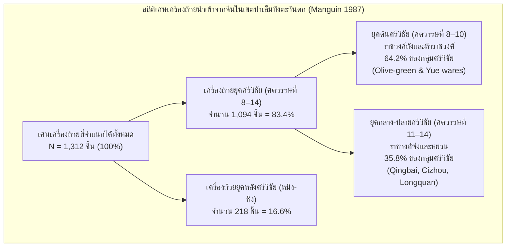
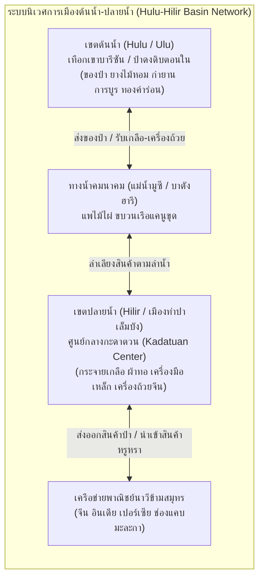
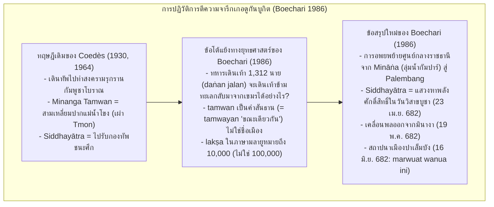
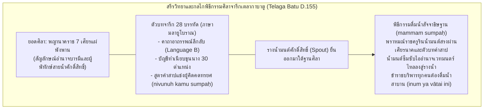
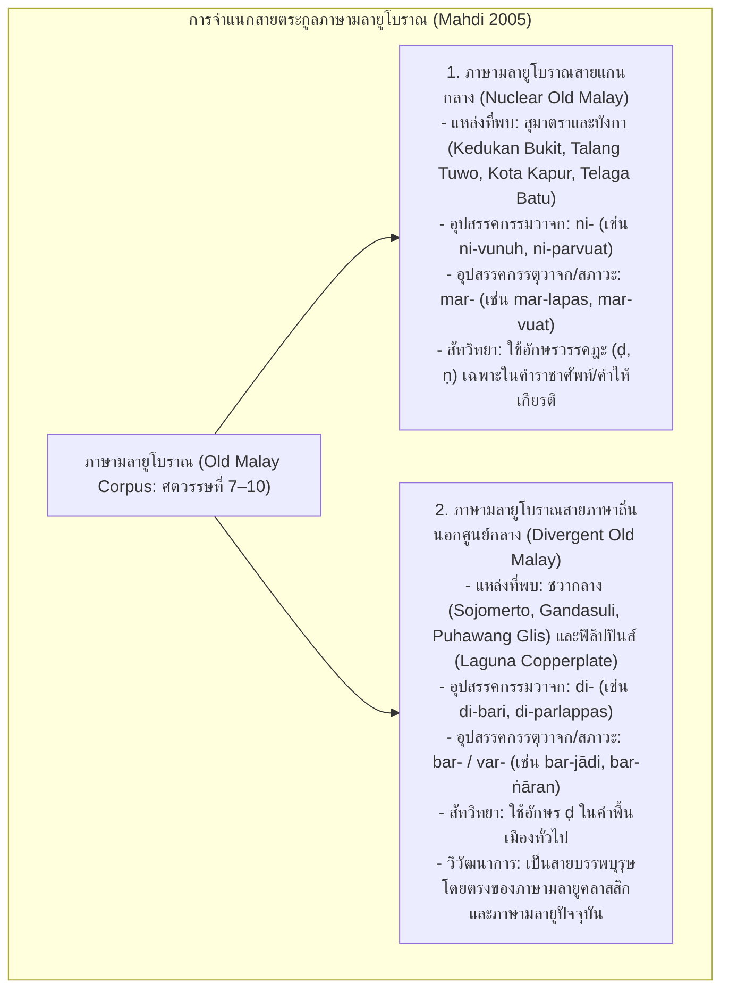

# บทที่ 3: สุมาตรา มหาจักรวรรดิทางทะเลศรีวิชัย และจารึกงมจากลุ่มน้ำ: พลวัตอำนาจ กายวิภาคราชสำนัก และวัฒนธรรมจารึกข้ามสมุทร (คริสต์ศตวรรษที่ 7–14)
*(Sumatra, the Śrīvijaya Maritime Empire, and Riverine Inscriptions: Power Dynamics, Court Anatomy, and Trans-Oceanic Epigraphic Culture, 7th–14th Centuries CE)*

---

## บทนำประจำบทที่ 3: พลวัตของมหาจักรวรรดิทางทะเลศรีวิชัย ภูมินิเวศน์ลุ่มน้ำ และการปรากฏตัวของจารึกภาษามลายูโบราณ

ในประวัติศาสตร์นิพนธ์ว่าด้วยเอเชียตะวันออกเฉียงใต้ภาคพื้นสมุทร การก่อรูปและการดำรงอยู่ของอาณาจักรศรีวิชัย (Śrīvijaya) นับเป็นปรากฏการณ์ทางอารยธรรมที่โดดเด่นและทรงอิทธิพลสูงสุดระหว่างปลายคริสต์ศตวรรษที่ 7 ถึงปลายคริสต์ศตวรรษที่ 13 ศรีวิชัยมิได้สถาปนาอำนาจขึ้นจากฐานรากทางเศรษฐกิจเกษตรกรรมแบบชลประทานในที่ราบลุ่มแผ่นดินใหญ่เฉกเช่นราชอาณาจักรโบราณบนเกาะชวาหรือกัมพูชา หากแต่เป็น "รัฐสมุทรบาลลุ่มน้ำ" (Riverine-Maritime Thalassocracy) อันไพศาล ซึ่งอาศัยทำเลที่ตั้งทางภูมิรัฐศาสตร์อันเป็นเอกเทศ ณ จุดยุทธศาสตร์เชื่อมต่อระหว่างมหาสมุทรอินเดียกับทะเลจีนใต้ ในการควบคุมจุดตัดของเส้นทางพาณิชย์นาวีสากลผ่านช่องแคบมะละกา (Strait of Malacca) และช่องแคบซุนดา (Sunda Strait) โครงสร้างเชิงพื้นที่ของศรีวิชัยมีความสอดคล้องแนบแน่นกับสภาพแวดล้อมทางชลศาสตร์ของเกาะสุมาตราฝั่งตะวันออก โดยเฉพาะอย่างยิ่งระบบลุ่มแม่น้ำมูซี (Musi River Basin) ในสุมาตราใต้ และระบบลุ่มแม่น้ำบาตังฮารี (Batang Hari River Basin) ในแคว้นจัมบี ซึ่งทำหน้าที่เป็นหลอดเลือดใหญ่ในการลำเลียงสินค้าของป่าหายาก เรซิน ยางไม้หอม การบูร และแร่ทองคำจากเทือกเขาสูงตอนในสู่เมืองท่าปลายน้ำ [1]

รุ่งอรุณแห่งประวัติศาสตร์ลายลักษณ์อักษรของโลกมลายูได้เปิดฉากขึ้นอย่างฉับพลันและทรงพลังในคริสต์ทศวรรษ 680 (ราว มหาศักราช 604–608 หรือ ค.ศ. 682–686) ผ่านการปรากฏตัวของกลุ่มศิลาจารึกภาษามลายูโบราณ (Old Malay Inscriptions) รุ่นแรกสุด ซึ่งสลักด้วยอักษรหลังปัลลวะหรืออักษรสุมาตราโบราณ (Later Pallava / Old Sumatran Script) ได้แก่ จารึกเกอดูกันบูกิต (Kedukan Bukit ค.ศ. 682), จารึกตาลังตูโว (Talang Tuwo ค.ศ. 684), จารึกโกตากาปูร์ (Kota Kapur ค.ศ. 686), จารึกการังบราฮี (Karang Brahi ค.ศ. 686), และจารึกเตลากาบาตู (Telaga Batu ปลายคริสต์ศตวรรษที่ 7) การระเบิดขึ้นของวัฒนธรรมการจารึกในเขตปาเล็มบังและปริมณฑลนี้ มิใช่เพียงเครื่องยืนยันการมีอยู่จริงของราชธานีศรีวิชัยเท่านั้น หากแต่ยังเป็นประจักษ์พยานของการนำเอา "เทคโนโลยีแห่งตัวอักษร" ผสานเข้ากับมโนทัศน์ทางพุทธศาสนามหายาน-วัชรยาน และไสยเวทพิธีกรรมดั้งเดิมของชาวออสโตรนีเซียน เพื่อสถาปนาความชอบธรรมทางการเมืองและสร้างเสถียรภาพในการบริหารจักรวรรดิทางทะเล [2]

เนื้อหาในตอนที่ 1 ของบทที่ 3 นี้ มุ่งวิเคราะห์รากฐานทางประวัติศาสตร์ โบราณคดี และจารึกวิทยาของศรีวิชัยยุคเริ่มแรก โดยแบ่งออกเป็นสามหัวข้อย่อยหลัก: ประการแรก การคลี่คลายปริศนาที่ตั้งราชธานีและโบราณคดีเมืองท่าศรีวิชัย ณ เมืองปาเล็มบัง โดยการหักล้างข้อกังขาเชิงประวัติศาสตร์นิพนธ์ของเบนเน็ต บรอนสัน (Bennet Bronson) ด้วยผลการขุดค้นทางโบราณคดีของปิแอร์-อีฟว์ มังแกง (Pierre-Yves Manguin) ว่าด้วยสถิติเครื่องถ้วยราชวงศ์ถัง สถาปัตยกรรมเรือนแพลอยน้ำ ป้อมค่ายไม้ไผ่ และระบบเครือข่ายกะดาตวนต้นน้ำ-ปลายน้ำ (Hulu-Hilir Basin Network); ประการที่สอง การปฏิวัติการอ่านและตีความจารึกเกอดูกันบูกิตโดยบูชารี (Boechari) ซึ่งพิสูจน์การย้ายศูนย์กลางอำนาจจากมินางาสู่ปาเล็มบัง ควบคู่กับการวิเคราะห์จารึกตาลังตูโวในมิติโพธิสัตวมรรคและตันตรยาน ตลอดจนจารึกโกตากาปูร์และการังบราฮีว่าด้วยพระราชโองการปราบกบฏและการศึกกับภูมิชวา; และประการที่สาม การชำระตัวบทศิลาจารึกเตลากาบาตูเพื่อศึกษากายวิภาคระบบราชสำนัก ทำเนียบข้าราชบริพารกว่า 30 ตำแหน่ง พิธีกรรมดื่มน้ำสัจจาธิษฐาน ตลอดจนการวิเคราะห์ภาษาศาสตร์ประวัติศาสตร์เพื่อจำแนกภาษามลายูโบราณสายแกนกลาง (Nuclear Old Malay) และชั้นภาษาซับสตราตัมกลุ่มภาษาบาริโตโบราณ (Language B) ในสูตรคำสาปแช่ง อันจะนำไปสู่ความเข้าใจที่ลึกซึ้งและรอบด้านต่อกลไกอำนาจของศรีวิชัยในฐานะมหาจักรวรรดิทางทะเลแห่งแรกของอุษาคเนย์ [3]

---

## 3.1 ปริศนาราชธานีและโบราณคดีเมืองท่าศรีวิชัย

### 3.1.1 วิกฤตการณ์ทางประวัติศาสตร์นิพนธ์และการหักล้างข้อกังขาของ Bronson & Wisseman (1976)

นับตั้งแต่ยอร์ช เซเดส์ (George Cœdès) ได้สถาปนามโนทัศน์เรื่อง "อาณาจักรศรีวิชัย" ขึ้นในวงวิชาการสากลเมื่อปี ค.ศ. 1918 โดยระบุว่าเมืองปาเล็มบัง (Palembang) ริมแม่น้ำมูซี ในเกาะสุมาตราใต้ คือราชธานีศูนย์กลางของจักรวรรดิทางทะเลแห่งนี้ตามหลักฐานการค้นพบศิลาจารึกภาษามลายูโบราณศตวรรษที่ 7 หลายหลัก [4] ข้อเสนอดังกล่าวได้รับการยอมรับอย่างกว้างขวางในหมู่นักจารึกวิทยาและนักประวัติศาสตร์ ทว่า ในช่วงกลางทศวรรษ 1970 วงวิชาการเอเชียตะวันออกเฉียงใต้ต้องเผชิญกับวิกฤตการณ์ทางประวัติศาสตร์นิพนธ์ครั้งสำคัญ เมื่อคณะนักโบราณคดีชาวอเมริกันนำโดย เบนเน็ต บรอนสัน และแจน วิสเซอมัน (Bennet Bronson and Jan Wisseman) ได้ดำเนินโครงการสำรวจและขุดค้นทางโบราณคดีภาคสนาม ณ เมืองปาเล็มบัง ในปี ค.ศ. 1974 ภายใต้ความร่วมมือกับกรมโบราณคดีอินโดนีเซีย ผลการขุดค้นดังกล่าวได้รับการตีพิมพ์ในปี ค.ศ. 1976 ภายใต้ชื่อบทความอันลือลั่นว่า *"Palembang as Srivijaya: The Lateness of Early Cities in Southern Southeast Asia"* ซึ่งบรอนสันและวิสเซอมันได้สรุปข้อค้นพบในเชิงลบอย่างรุนแรงว่า เมืองปาเล็มบังไม่มีร่องรอยการตั้งถิ่นฐานของมนุษย์ที่มีนัยสำคัญทางประวัติศาสตร์ก่อนคริสต์ศตวรรษที่ 14 เลยแม้แต่น้อย [5]

บรอนสันและวิสเซอมันอ้างว่า จากหลุมขุดค้นทางโบราณคดีรอบเนินเขาบูกิตเซอกุนตัง (Bukit Seguntang) และพื้นที่ใกล้เคียง ไม่พบเศษภาชนะดินเผาหรือเครื่องถ้วยชามเคลือบนำเข้าจากจีนที่สามารถระบุอายุย้อนไปถึงสมัยราชวงศ์ถัง (Tang Dynasty คริสต์ศตวรรษที่ 7–10) หรือราชวงศ์ซ่งเหนือ (Northern Song Dynasty คริสต์ศตวรรษที่ 10–11) ยิ่งไปกว่านั้น บริเวณปาเล็มบังยังขาดแคลนซากสถาปัตยกรรมหินหรืออิฐขนาดมหึมาที่เทียบเคียงได้กับเทวาลัยและพุทธสถานในชวากลางหรือกัมพูชา ด้วยเหตุนี้ บรอนสันจึงเสนอให้ "ตัดสิทธิ์ปาเล็มบัง" ออกจากการเป็นศูนย์กลางราชธานีของศรีวิชัย พร้อมทั้งตั้งข้อสงสัยว่า "ศรีวิชัยในฐานะรัฐรวมศูนย์ที่มีเมืองหลวงถาวรอาจไม่มีอยู่จริง" โดยบรอนสัน (Bronson 1977, 1979) ได้เสนอแบบจำลองเชิงพื้นที่ขึ้นมาทดแทน เรียกว่า **"แบบจำลองเมืองท่าต้นน้ำ-ปลายน้ำ" (Upstream-Downstream Model)** ซึ่งมองว่าศรีวิชัยเป็นเพียงเครือข่ายสหพันธรัฐเมืองท่าหลวมๆ ที่ไร้เมืองหลวงถาวร หรือเป็นเพียง "เมืองท่าเคลื่อนที่" ที่ผู้นำทางการเมืองต้องย้ายศูนย์กลางไปตามปากแม่น้ำสายต่างๆ บนเกาะสุมาตราหรือคาบสมุทรมลายูตามความผันผวนของเส้นทางการค้า [6]

ข้อสรุปในแง่ลบของบรอนสันได้สร้างความสั่นสะเทือนต่อประวัติศาสตร์นิพนธ์ศรีวิชัยอย่างมหาศาล และกลายเป็นช่องว่างที่เปิดโอกาสให้นักวิชาการสายชาตินิยมในประเทศไทยและมาเลเซียพยายามย้ายศูนย์กลางของศรีวิชัยออกจากเกาะสุมาตราไปยังแหล่งโบราณคดีบนคาบสมุทรไทย-มลายู เช่น ไชยา นครศรีธรรมราช หรือเกดะห์ [7] ทว่า ข้อกังขาของบรอนสันได้รับการตรวจสอบ รื้อถอน และหักล้างอย่างเด็ดขาดด้วยระเบียบวิธีวิจัยทางโบราณคดีสมัยใหม่ โดยการศึกษาวิจัยระลอกใหม่ของคณะนักวิจัยร่วมฝรั่งเศส-อินโดนีเซีย นำโดย ปิแอร์-อีฟว์ มังแกง (Pierre-Yves Manguin) แห่งสำนักฝรั่งเศสแห่งปลายบุรพทิศ (École française d'Extrême-Orient: EFEO) ร่วมกับศูนย์วิจัยโบราณคดีแห่งชาติอินโดนีเซีย (Pusat Penelitian Arkeologi Nasional: Puslit Arkenas) ภายใต้การนำของนางสตยาวตี ซูเลยมัน (Satyawati Suleiman) ตั้งแต่ปี ค.ศ. 1979 เป็นต้นมา [8]

ในบทความวิจัยระดับแม่บทเรื่อง *"Palembang et Sriwijaya: anciennes hypothèses, recherches nouvelles"* ตีพิมพ์ในวารสาร BEFEO ค.ศ. 1987 มังแกงได้ชี้ให้เห็นว่า ข้อสรุปที่ผิดพลาดของบรอนสันและวิสเซอมันเกิดขึ้นจากความบกพร่องอย่างร้ายแรงทางระเบียบวิธีวิจัยและการจำแนกประเภทโบราณวัตถุ (Methodological and Typological Flaws):
1. บรอนสันและคณะขาดความรู้ความเชี่ยวชาญในเรื่องเครื่องถ้วยจีนสมัยโบราณ โดยเฉพาะเครื่องถ้วยสโตนแวร์ตระกูลมะกอกเขียว (Olive-green wares / Guangdong stonewares) และเครื่องถ้วยดินเผาเคลือบยุคแรกที่ผลิตจากเตาเผาในมณฑลกวางตุ้งสมัยราชวงศ์ถัง (คริสต์ศตวรรษที่ 8–9)
2. บรอนสันได้นำเอาเศษเครื่องถ้วยตระกูลเยวี่ยโจว (Yue-type wares) สมัยห้าราชวงศ์และราชวงศ์ซ่ง ซึ่งเป็นเครื่องถ้วยชั้นเลิศที่มีอายุระหว่างคริสต์ศตวรรษที่ 9–10 ไปจัดรวมไว้ในกลุ่ม "เศษเครื่องถ้วยที่ไม่สามารถระบุประเภทได้" (Unidentified wares) ซึ่งในรายงานของบรอนสัน กลุ่มเครื่องถ้วยที่ไม่ระบุประเภทนี้มีสัดส่วนสูงผิดปกติถึงร้อยละ 41.6 ถึง 76.7 ของตัวอย่างทั้งหมดในแต่ละหลุมขุดค้น
3. ความบกพร่องดังกล่าวได้สร้าง "ภาพลวงตาทางประวัติศาสตร์" (illusion d'optique) ที่ลบล้างการมีอยู่ของชั้นดินวัฒนธรรมสมัยราชวงศ์ถังและซ่งในปาเล็มบังไปโดยสิ้นเชิง [9]

เมื่อมังแกงและคณะผู้วิจัยได้ดำเนินการสำรวจทางโบราณคดีอย่างเป็นระบบในเขตปาเล็มบังตะวันตก (Palembang Ouest) ครอบคลุมพื้นที่การังอันยาร์ (Karang Anyar), บูกิตเซอกุนตัง, ลอรังจัมบู (Lorong Jambu), กัมบังอุงเล็น (Kambang Unglen), และลาดังซีรัป (Ladang Sirap) โดยใช้ภาพถ่ายทางอากาศและการวิเคราะห์เครื่องถ้วยโดยผู้เชี่ยวชาญระดับสากล ผลการวิจัยได้พิสูจน์อย่างหมดจดว่า ปาเล็มบังเป็นศูนย์กลางการตั้งถิ่นฐานขนาดใหญ่ของมนุษย์ที่มีความต่อเนื่องยาวนานตั้งแต่คริสต์ศตวรรษที่ 7 และเป็นราชธานีศูนย์กลางของศรีวิชัยอย่างแท้จริงตามที่ตัวบทจารึกได้ระบุไว้ [10]

---

### 3.1.2 หลักฐานเชิงประจักษ์ทางโบราณคดี: สถิติเครื่องถ้วยราชวงศ์ถัง 83.4% และชุมชนหัตถกรรม

หลักฐานเชิงประจักษ์ที่หนักแน่นที่สุดในการยืนยันสถานะความเป็นเมืองท่าศูนย์กลางของปาเล็มบังในยุคศรีวิชัย คือข้อมูลสถิติโบราณวัตถุประเภทเครื่องถ้วยชามเซรามิกนำเข้าจากต่างประเทศ จากการสำรวจผิวดินและการขุดค้นทางโบราณคดีอย่างเป็นระบบของ Manguin (1987) ในเขตปาเล็มบังตะวันตก คณะผู้วิจัยได้รวบรวมเศษเครื่องถ้วยที่สามารถจำแนกอายุสมัยได้อย่างชัดเจนจำนวนทั้งสิ้น 1,312 ชิ้น การวิเคราะห์การกระจายตัวของอายุสมัยเครื่องถ้วยได้สร้างข้อค้นพบที่พลิกโฉมหน้าประวัติศาสตร์อย่างสิ้นเชิง:



สัดส่วนของเศษเครื่องถ้วยยุคศรีวิชัย (คริสต์ศตวรรษที่ 8 ถึง 14) มีความหนาแน่นสูงถึง **ร้อยละ 83.4** ของโบราณวัตถุทั้งหมด และในกลุ่มนี้ เป็นเครื่องถ้วยในยุคต้นของศรีวิชัย (คริสต์ศตวรรษที่ 8 ถึง 10 ตรงกับสมัยราชวงศ์ถังและยุคห้าราชวงศ์) มากถึง **ร้อยละ 64.2** โบราณวัตถุเด่นในกลุ่มนี้ประกอบด้วย เครื่องถ้วยสโตนแวร์เคลือบสีเขียวมะกอก (Olive-green stonewares) จากเตาเผากวางตุ้ง, ภาชนะดินเผาเคลือบสามสีสมัยถัง (Tang Sancai), เครื่องถ้วยศิลาดลยุคแรกจากเตาเยวี่ยโจว (Yue-type celadon), และเศษภาชนะเครื่องเคลือบสีน้ำเงินอมเขียวจากเตาฉางซา (Changsha wares) นอกจากนี้ยังพบเศษภาชนะดินเผาเคลือบน้ำยาแลกเกอร์สีฟ้าจากเปอร์เซีย (Persian turquoise-glazed earthenware) ซึ่งยืนยันว่าปาเล็มบังเป็นเมืองท่าปลายทางในเครือข่ายการค้าข้ามสมุทรระยะไกลระหว่างตะวันออกกลางกับจีนตั้งแต่คริสต์ศตวรรษที่ 8 เป็นอย่างน้อย [11]

นอกจากหลักฐานเครื่องถ้วยนำเข้าแล้ว การขุดค้นที่แหล่ง **กัมบังอุงเล็น (Kambang Unglen)** ซึ่งตั้งอยู่ทางทิศใต้ของเนินเขาบูกิตเซอกุนตัง ยังได้เปิดเผยหลักฐานของ "ย่านอุตสาหกรรมหัตถกรรมและโรงงานผลิตลูกปัดโบราณ" (Glass bead manufacturing workshop) โดยคณะนักโบราณคดีได้ค้นพบก้อนวัตถุดิบแก้วดิบนำเข้า กากขี้แร่แก้วหลอม (glass slag) หลอดแก้วสำหรับการดึงเม็ดลูกปัด ตลอดจนลูกปัดแก้วและหินมีค่า (carnelian และ agate) ที่ทำเสร็จสมบูรณ์และชำรุดเสียหายในระหว่างกระบวนการผลิตจำนวนมากกว่า 2,458 ชิ้น การค้นพบนี้ชี้ชัดว่า ปาเล็มบังมิได้เป็นเพียงสถานีขนถ่ายสินค้าผ่าน (Transit port) เท่านั้น แต่มีชุมชนช่างฝีมือผู้เชี่ยวชาญที่แปรรูปสินค้าหรูหราเพื่อป้อนเข้าสู่ระบบการค้าข้ามสมุทร [12]

ในทำนองเดียวกัน การสำรวจที่แหล่ง **ตาลังกีกิมเซอบรัง (Talang Kikim Seberang)** ริมฝั่งแม่น้ำลามีดารอ (Sungai Lamidaro) ได้เผยให้เห็นร่องรอยของ "ท่าเทียบเรือขนถ่ายสินค้าและคลังเสบียงสินค้า" (*débarcadère / transshipment centre*) โดยพบชิ้นส่วนปากและก้นไหกักเก็บสินค้าขนาดใหญ่สมัยราชวงศ์ถัง (Dusun storage jars) ตกกระจุกตัวอยู่อย่างหนาแน่นริมตลิ่ง ไหดินเผาขนาดมหึมาเหล่านี้ใช้สำหรับการบรรจุน้ำจืด เสบียงอาหาร และสินค้าของป่าที่รวบรวมมาจากเขตต้นน้ำเพื่อเตรียมถ่ายลำขึ้นสู่เรือเดินสมุทรขนาดใหญ่ [13]

ลำดับพัฒนาการเชิงพื้นที่ของปาเล็มบังยังสะท้อนถึงการเปลี่ยนแปลงทางประวัติศาสตร์อย่างน่าสนใจ โดย Manguin (1987, 2018) จำแนกการเคลื่อนย้ายศูนย์กลางชุมชนออกเป็น 3 ยุค:
1. *ยุคต้น (ปลายศตวรรษที่ 7 ถึง 10):* ชุมชนเมืองและเขตพระราชฐานกระจุกตัวหนาแน่นในเขตปาเล็มบังตะวันตก บริเวณการังอันยาร์ และเนินเขาบูกิตเซอกุนตัง ซึ่งเป็นยุคที่สร้างจารึกเกอดูกันบูกิตและตาลังตูโว
2. *ยุคกลาง (ศตวรรษที่ 11 ถึง 14):* ศูนย์กลางกิจกรรมทางเศรษฐกิจเคลื่อนย้ายไปสู่บริเวณลอรังจัมบู (Lorong Jambu) ซึ่งพบเครื่องถ้วยสมัยราชวงศ์ซ่งและหยวนอย่างหนาแน่น
3. *ยุคปลายและสมัยอิสลาม (ศตวรรษที่ 15 เป็นต้นมา):* ชุมชนเมืองเคลื่อนย้ายลงสู่เขตปาเล็มบังตะวันออก บริเวณเกอดิงซูโร (Geding Suro) ซึ่งต่อมาได้พัฒนาขึ้นเป็นศูนย์กลางของรัฐสุลต่านปาเล็มบัง [14]

---

### 3.1.3 วิศวกรรมชลศาสตร์และสถาปัตยกรรมไร้ซากหิน: คลองซูอักบูจัง สระน้ำการังอันยาร์ และป้อมค่ายไม้ไผ่โกตาเฮาร์

การคลี่คลายปริศนาสำคัญที่ว่า *"เหตุใดมหาอาณาจักรทางทะเลอันมั่งคั่งอย่างศรีวิชัยจึงไม่หลงเหลือซากปราสาทหินขนาดมหึมาไว้ที่ปาเล็มบังเหมือนในเกาะชวาหรือกัมพูชา"* จำเป็นต้องอาศัยความเข้าใจต่อธรรมชาติของระบบนิเวศและวัฒนธรรมสถาปัตยกรรมของประชากรลุ่มน้ำในเอเชียตะวันออกเฉียงใต้ภาคพื้นสมุทร มังแกง (Manguin 1987, 361–362) ได้อธิบายปรากฏการณ์นี้ผ่านหลักฐานโบราณคดีและชาติพันธุ์วรรณนา 3 ประการหลัก:

ประการแรก รูปแบบการอยู่อาศัยของประชากรศรีวิชัยเป็น **"วัฒนธรรมการอยู่อาศัยบนเรือนแพลอยน้ำ" (*rakit*)** และเรือนไม้ยกใต้ถุนสูงริมฝั่งแม่น้ำและลำคลอง สภาพทางภูมิศาสตร์ของปาเล็มบังตั้งอยู่บนรอยต่อระหว่างลานตะพักหินยุคเทอร์เชียรีกับที่ลุ่มชุ่มน้ำน้ำท่วมถึง (*lebak*) ซึ่งได้รับอิทธิพลจากกระแสน้ำขึ้นน้ำลงรายวัน (*diurnal tide*) ที่หนุนระดับน้ำในแม่น้ำมูซีให้สูงขึ้นได้ถึง 3–4 เมตร การสร้างบ้านเรือนถาวรบนผืนดินในเขตน้ำท่วมถึงจึงเป็นไปได้ยาก ประชากรส่วนใหญ่จึงดำรงชีวิตอยู่บนแพลอยน้ำที่ผูกจอดเรียงรายเลียบสองฝั่งแม่น้ำมูซีและลำน้ำสาขา ดังที่ปรากฏในบันทึกของราชทูตจีนและนักภูมิศาสตร์อาหรับ เช่น บันทึกของเจ้าหยู่กัว (*Zhu Fan Zhi* ค.ศ. 1225) ซึ่งระบุไว้อย่างชัดเจนว่า:

> "ชาวเมืองอาศัยกระจัดกระจายอยู่นอกกำแพงเมือง หรือไม่ก็สร้างเรือนแพลอยน้ำอยู่บนแพไม้ไผ่ผูกโยงด้วยเชือก เมื่อระดับน้ำขึ้น แพก็ลอยสูงขึ้นตามน้ำโดยไม่จมน้ำ หากพวกเขาประสงค์จะย้ายไปอยู่ที่อื่น ก็เพียงแต่แก้เชือกผูกแพแล้วปล่อยให้ลอยไปตามกระแสน้ำได้อย่างง่ายดาย" [15]

วัสดุก่อสร้างทั้งหมดของเรือนแพและที่อยู่อาศัยทำจากอินทรียวัตถุธรรมชาติ ได้แก่ เสาไม้ ลำไม้ไผ่ หวาย และใบจากมุงหลังคา ซึ่งผุพังสลายตัวไปตามกาลเวลาในสภาพภูมิอากาศแบบมรสุมเขตร้อนชื้น จึงไม่ทิ้งร่องรอยโครงสร้างทางสถาปัตยกรรมถาวรไว้ให้เห็นบนผิวดิน [16]

ประการที่สอง สถาปัตยกรรมป้อมปราการของราชสำนักมลายูโบราณ (*kota*) มิได้สร้างขึ้นด้วยการสกัดหินแอนดีไซต์หรือศิลาแลง หากแต่เป็นการขุดคูเมืองที่มีน้ำล้อมรอบ สร้างคันดินสูง ปักเสาไม้ซุง และปลูกแนวรั้วต้นไผ่หนาทึบเป็นแนวป้องกัน ดังปรากฏร่องรอยชื่อโบราณของแหล่งโบราณสถานการังอันยาร์ว่า **"โกตาเฮาร์" (*Kota Haur*)** ซึ่งในภาษามลายูโบราณและมลายูคลาสสิกแปลตรงตัวว่า **"ป้อมปราการไม้ไผ่"** (คำว่า *haur* หมายถึง ไม้ไผ่หนามชนิดหนึ่ง ซึ่งปรากฏชื่ออยู่ในจารึกตาลังตูโว ค.ศ. 684 ด้วย) แนวรั้วไผ่หนามขนาดมหึมาผสานกับคูคลองส่งน้ำทำหน้าที่เป็นปราการธรรมชาติที่สามารถสกัดกั้นการบุกรุกของข้าศึกได้อย่างมีประสิทธิภาพ [17]

ประการที่สาม ผลงานการสำรวจชิ้นเอกของ Manguin (1987) คือการค้นพบ **"โครงข่ายระบบวิศวกรรมชลศาสตร์โบราณ" (Ancient Hydraulic Complex)** ในเขตปาเล็มบังตะวันตก ซึ่งประกอบด้วยคลองขุดและสระน้ำขนาดมหึมาที่จัดวางผังอย่างประณีต:
1. **คลองซูอักบูจัง (Suak Bujang Canal):** คลองขุดตรงความยาวประมาณ 3 กิโลเมตร กว้าง 10–12 เมตร ซึ่งถูกขุดตัดทะลุเนินดินเพื่อควบคุมทิศทางการไหลของน้ำและเชื่อมระหว่างลำน้ำลามีดารอกับแม่น้ำมูซี คลองนี้ทำหน้าที่สำคัญในการระบายน้ำท่วมในฤดูมรสุม และเปิดให้เรือสัญจรทางน้ำสามารถแล่นลัดคุ้งน้ำเพื่อหลีกเลี่ยงกระแสน้ำที่ไหลเชี่ยวกรากตรงจุดคอดของแม่น้ำมูซี [18]
2. **ระบบสระน้ำและเกาะเทียมแห่งการังอันยาร์ (Karang Anyar Hydraulic Basins):** ประกอบด้วยสระน้ำรูปสี่เหลี่ยมผืนผ้าขนาดใหญ่ 3 สระ (Basin A, B, และ C) โดยในสระหลักมีการขุดดินขึ้นมาถมสร้างเป็น "เกาะเทียมรูปสี่เหลี่ยมจัตุรัส" อยู่กลางสระน้ำ ได้แก่ **เกาะเจิมปากา (Pulau Cempaka)** ขนาดประมาณ 40 x 40 เมตร และ **เกาะนังกา (Pulau Nangka)** [19]

มังแกงชี้ให้เห็นว่า ระบบชลศาสตร์ที่การังอันยาร์มิได้สร้างขึ้นเพื่อการชลประทานในนาข้าว (เนื่องจากประชากรลุ่มน้ำมูซีโบราณบริโภคสาคูและข้าวไร่ มิได้ทำนาข้าวทดน้ำในที่ลุ่มเลอบัก) หากแต่สร้างขึ้นเพื่อประโยชน์ในการคมนาคมทางเรือ การเสด็จพระราชดำเนินทางชลมารค และทำหน้าที่เชิงสัญลักษณ์ในฐานะ "อุทยานหลวงจำลองจักรวาลและสวรรค์กลางน้ำ" ของพระมหากษัตริย์ผู้ทรงธรรม โครงสร้างเกาะเทียมกลางสระน้ำนี้มีความสอดคล้องอย่างน่าทึ่งกับข้อความใน **ศิลาจารึกตาลังตูโว (ค.ศ. 684)** ที่ระบุถึงการสร้างสระน้ำ (*talāga*) และคันดินทำนบกั้นน้ำ (*tavad*) ในสวนศรีเกษตร ตลอดจนสอดรับกับความทรงจำทางประวัติศาสตร์ใน *พงศาวดารมลายู* (*Sejarah Melayu*) ที่พรรณนาถึงพระราชวังของบรรพบุรุษกษัตริย์มลายูบนเกาะกลางสระน้ำอันงดงามริมฝั่งแม่น้ำมูซี [20]

ส่วนสถาปัตยกรรมถาวรที่ก่อด้วยอิฐนั้น จำกัดอยู่เฉพาะสถูปเจดีย์ทางพุทธศาสนาและฐานพลับพลาบนเนินเขาศักดิ์สิทธิ์ **บูกิตเซอกุนตัง (Bukit Seguntang)** ซึ่งทำหน้าที่เป็นศูนย์กลางพิธีกรรมทางจิตวิญญาณ โดยบนยอดเขานี้เป็นที่ประดิษฐาน **พระพุทธรูปศิลาขนาดใหญ่แห่งบูกิตเซอกุนตัง (Grand Bouddha de Bukit Seguntang)** พระพุทธรูปหินแกรนิตปางประทานอภัยขนาดมหึมา (ความสูงรวมฐานเกือบ 3 เมตร) รูปแบบศิลปะอมราวดีหรืออนุราธปุระลังกา (คริสต์ศตวรรษที่ 7–8) ซึ่งยืนยันว่าปาเล็มบังเป็นศูนย์กลางการศึกษาพุทธศาสนาที่ยิ่งใหญ่ สอดคล้องกับบันทึกของภิกษุอี้จิง (I-tsing) ในปี ค.ศ. 671 ที่ระบุว่าในศรีวิชัยมีพระสงฆ์มากกว่าหนึ่งพันรูปศึกษาพระธรรมวินัยและภาษาศาสตร์เช่นเดียวกับในประเทศอินเดีย ทว่า ในยุคหลัง อิฐโบราณจากสถูปบนบูกิตเซอกุนตังและเตาเผาโบราณได้ถูกราษฎรท้องถิ่นรื้อถอนไปใช้ประโยชน์ในการก่อสร้างบ้านเรือนจนหมดสิ้น [21]

---

### 3.1.4 ซากเรือเดินสมุทรโบราณและเทคโนโลยีการต่อเรือไร้ตะปูแบบอุษาคเนย์ (Lashed-Lug Shipbuilding Tradition)

แสนยานุภาพทางทะเลและความมั่งคั่งของศรีวิชัยวางอยู่บนวิทยาการต่อเรือเดินสมุทรและทักษะการเดินเรือขั้นสูงของประชากรตระกูลออสโตรนีเซียน หลักฐานทางโบราณคดีใต้น้ำและการขุดค้นในลุ่มน้ำมูซีและพื้นที่ชายฝั่งสุมาตราใต้ ได้เผยให้เห็นซากเรือเดินสมุทรโบราณหลายลำ โดยเฉพาะอย่างยิ่ง **ซากเรือสัมบีเรอโจ (Sambirejo Ship)** ซึ่งขุดพบในเขตอำเภอมูซีบันยูวาซิน (Musi Banyuasin) ทางตะวันตกเฉียงเหนือของปาเล็มบัง กำหนดอายุทางวิทยาศาสตร์ด้วยวิธีคาร์บอน-14 (C-14) อยู่ระหว่างคริสต์ศตวรรษที่ 7 ถึง 9 ร่วมสมัยกับยุคทองของศรีวิชัย [22]

การศึกษาซากเรือโบราณเหล่านี้โดย ปิแอร์-อีฟว์ มังแกง (Manguin 1985, 1996, 2018) ได้พิสูจน์ให้เห็นถึงอัตลักษณ์ทางเทคโนโลยีการต่อเรือที่โดดเด่นของเอเชียตะวันออกเฉียงใต้ ซึ่งแตกต่างจากประเพณีการต่อเรือของจีนและยุโรปอย่างสิ้นเชิง เทคโนโลยีนี้เรียกว่า **"เทคนิคการเข้าไม้ต่อเรือแบบเย็บร้อยเชือกและเดือยไม้" (Lashed-Lug and Sewn-Plank Shipbuilding Technique)** ซึ่งมีลักษณะเฉพาะทางวิศวกรรมดังนี้:
1. **การต่อเรือแบบสร้างเปลือกนอกก่อน (Shell-first Construction):** ช่างต่อเรือชาวมลายูจะเริ่มต้นด้วยการประกอบแผ่นกระดานกราบเรือ (strakes) ขึ้นจากกระดูกงูเรือ โดยเชื่อมแผ่นกระดานแต่ละแผ่นเข้าด้วยกันด้วย "เดือยไม้กลม" (wooden dowels หรือ treenails) ที่ตอกสอดเข้าไปในรูเดือยที่เจาะไว้ตามขอบแผ่นไม้ โดยไม่มีการใช้ตะปูเหล็กหรือสลักโลหะแม้แต่ตัวเดียว
2. **การเจาะหูไม้และการเย็บร้อยเชือก (Lashed-Lug Technique):** ด้านในของแผ่นกระดานเรือแต่ละแผ่น ช่างจะถากเนื้อไม้ให้เหลือปุ่มหูไม้สี่เหลี่ยมที่มีรูเจาะทะลุ (*lugs* หรือ *cleats*) เรียงเป็นแถวตามแนวยาว จากนั้นจะใช้กงเรือไม้ (frames/ribs) มาวางทาบ แล้วใช้ "เชือกเส้นใยธรรมชาติ" เย็บร้อยมัดตรึงระหว่างหูไม้กับกงเรืออย่างแน่นหนา
3. **การใช้เส้นใยต้นชิด/ตาลโตนด (*ijuk*):** เส้นใยที่ใช้ในการเย็บร้อยและยาแนวรอยต่อของเรือ คือเส้นใยสีดำเหนียวทนทานเป็นพิเศษจากโคนกาบใบของต้นชิดหรือตาลโตนด (*Arenga pinnata* ในภาษามลายูเรียกว่า *ijuk* หรือ *handu* ในจารึกตาลังตูโว) ซึ่งมีคุณสมบัติทนทานต่อน้ำเค็ม ปลวกทะเล และการเปื่อยเน่าได้ดีกว่าเชือกป่านทั่วไปอย่างมหาศาล [23]

ความยืดหยุ่นทางวิศวกรรมของเรือแบบ Lashed-Lug ถือเป็นหัวใจของความสำเร็จในการเดินเรือข้ามสมุทร: โครงสร้างเรือที่ยึดโยงด้วยเดือยไม้และเชือกเย็บร้อยมีความยืดหยุ่นตัวสูง (Elastic flexibility) เมื่อเรือต้องเผชิญกับคลื่นลมแรงและแรงบิดตัวของกระแสน้ำในมหาสมุทรเปิด แผ่นกระดานเรือจะสามารถขยับตัวและกระจายแรงกระแทกได้โดยไม่แตกหัก แตกต่างจากเรือโครงสร้างแข็งที่ยึดด้วยตะปูโลหะซึ่งมีโอกาสปริแตกได้ง่ายเมื่อเกิดแรงเค้นมหาศาล ยิ่งไปกว่านั้น ขนาดของเรือเดินสมุทรโบราณที่ต่อด้วยเทคนิคนี้มีความยาวได้มากกว่า 25 ถึง 30 เมตร และสามารถบรรทุกระวางสินค้าได้หลายร้อยตัน [24]

เทคโนโลยีการต่อเรือไร้ตะปูนี้สอดคล้องอย่างสมบูรณ์กับคำศัพท์เฉพาะทางใน **จารึกเกอดูกันบูกิต (ค.ศ. 682)** ซึ่งบันทึกคำว่า **`sāmvau`** (เรือสำเภาเดินสมุทรขนาดใหญ่) ในการลำเลียงกองทัพเรือ 20,000 นาย และสัมภาระเสบียง 200 หีบ ตลอดจนสอดรับกับบันทึกของนักภูมิศาสตร์ชาวอาหรับอย่าง อบู ซัยด์ ฮัสซัน (Abu Zayd Hasan ค.ศ. 916) ที่บรรยายด้วยความอัศจรรย์ใจว่า เรือสินค้าของชาวซาบัก (Zābag / ศรีวิชัย) ต่อขึ้นด้วยแผ่นไม้ที่เย็บร้อยเข้าด้วยกันด้วยเชือกใยมะพร้าวและเส้นใยต้นไม้โดยปราศจากการใช้ตะปูเหล็ก [25]

---

### 3.1.5 ระบบนิเวศการเมืองต้นน้ำ-ปลายน้ำ (Hulu-Hilir Basin Network) และแบบจำลองเครือข่ายกะดาตวน (Kadatuan Network Model)

เพื่อทำความเข้าใจตรรกะการบริหารจัดการอำนาจของศรีวิชัย นักวิชาการในปัจจุบันได้ก้าวพ้นกรอบคิดแบบ "จักรวรรดิรวมศูนย์อำนาจเบ็ดเสร็จ" (Centralized Unitary Empire) ซึ่งเป็นมโนทัศน์ที่นักบูรพคดีศึกษายุคอาณานิคมนำมาจากภาพจำของจักรวรรดิโรมันหรือจักรวรรดิราชวงศ์จีน การศึกษาของ โอ. ดับเบิลยู. วอลเตอร์ส (O.W. Wolters 1967, 1979), แฮร์มันน์ คุลเกอ (Hermann Kulke 1993), และปิแอร์-อีฟว์ มังแกง (Pierre-Yves Manguin 2002, 2018) ได้พิสูจน์ให้เห็นว่า โครงสร้างทางการเมืองของศรีวิชัยดำเนินงานในรูปแบบ **"ระบบนิเวศการเมืองต้นน้ำ-ปลายน้ำ" (Hulu-Hilir Basin Network)** ผสานเข้ากับ **"แบบจำลองเครือข่ายกะดาตวน" (Kadatuan Network Model)** [26]

ในมิติของภูมินิเวศน์ลุ่มน้ำ เกาะสุมาตราประกอบด้วยระบบแม่น้ำสายใหญ่หลายสายที่ไหลขนานกันจากเทือกเขาบารีซัน (Barisan Mountains) ทางทิศตะวันตก ลงสู่ชายฝั่งทะเลฝั่งตะวันออก แม่น้ำแต่ละสายมีพลวัตการแลกเปลี่ยนทางเศรษฐกิจระหว่างสองขั้วนิเวศ:
- **เขตต้นน้ำ (Hulu หรือ Ulu):** ดินแดนที่สูงและป่าดงดิบตอนใน ซึ่งเป็นถิ่นอาศัยของกลุ่มชนเผ่าพื้นเมืองดั้งเดิม (เช่น ชาวโอรังอูซู, ชาวปาเซอมะฮ์, และกลุ่มภาษามาลายิกต้นน้ำ) พื้นที่นี้เป็นแหล่งกำเนิดของสินค้าส่งออกที่มีมูลค่าสูงสุดในโลกโบราณ ได้แก่ ยางไม้กำยาน (benzoin), การบูร (camphor), น้ำมันชัน, ชะมดเช็ด, ขี้ผึ้ง, ไม้กฤษณา, และแร่ทองคำที่ร่อนได้จากแม่น้ำมูซีและแม่น้ำบาตังฮารี
- **เขตปลายน้ำ (Hilir):** เมืองท่าบริเวณปากแม่น้ำหรือจุดที่น้ำทะเลหนุนถึง เช่น ปาเล็มบัง บนแม่น้ำมูซี และ มูอาราจัมบี บนแม่น้ำบาตังฮารี เมืองท่าปลายน้ำทำหน้าที่เป็น "ประตูปิด-เปิดทางเศรษฐกิจ" (gateway port) ที่ควบคุมการเชื่อมต่อไปสู่ตลาดโลกภายนอก โดยทำหน้าที่นำเข้าสินค้าอุตสาหกรรมที่ชุมชนต้นน้ำต้องการ เช่น เกลือทะเล, ผ้าทอนำเข้าจากอินเดีย, เครื่องมือเหล็ก, และเครื่องถ้วยชามเซรามิกจากจีน เพื่อส่งทวนกระแสน้ำกลับขึ้นไปแลกเปลี่ยนกับสินค้าของป่า [27]



ในเชิงการปกครอง ศรีวิชัยมิได้ส่งกองทหารเข้าไปยึดครองดินแดนต้นน้ำอย่างเบ็ดเสร็จ หากแต่บริหารจัดการผ่าน **"แบบจำลองเครือข่ายกะดาตวน" (Kadatuan Network Model)** คำว่า **`kadatuan`** สืบรากศัพท์มาจากคำภาษาออสโตรนีเซียนว่า **`datu`** (ผู้เป็นใหญ่, เจ้าเมือง, ผู้นำชุมชน) เติมคำขนาบหน้า-หลัง `ka-...-an` กลายเป็น `kadatuan` ซึ่งในความหมายเชิงจารึกวิทยา มิได้หมายถึง "จักรวรรดิอาณาเขต" (territorial empire) แต่หมายถึง **"ที่ประทับของดาตูสูงสุด" หรือ "ราชสำนักศูนย์กลาง" (the seat/residence of the datu)** [28]

โครงสร้างอำนาจของศรีวิชัยประกอบด้วยโหนดอำนาจหลายระดับที่ซ้อนทับกัน:
1. *พระมหากษัตริย์ศรีวิชัย (Dapunta Hiyaṅ / Mahārāja):* ทรงประทับอยู่ ณ กะดาตวนศูนย์กลางที่ปาเล็มบัง ทรงควบคุมทรัพยากรหลัก กองเรือพาณิชย์หลวง และการติดต่อทางการทูตกับจีนและอินเดีย
2. *เจ้าเมืองและผู้นำท้องถิ่น (dātu):* ผู้นำชุมชนต้นน้ำและผู้นำเมืองท่าชายฝั่งที่เป็นเครือข่ายพันธมิตร
3. *กลไกการประสานอำนาจ:* ราชสำนักปาเล็มบังผูกมัดความจงรักภักดีของบรรดา *dātu* ท้องถิ่นผ่านการกระจายผลประโยชน์จากการค้าข้ามสมุทร, การอภิเษกสมรสทางการเมือง, การมอบสถานะอันศักดิ์สิทธิ์และเครื่องยศราชสำนัก, และที่สำคัญที่สุดคือการใช้ **"พิธีกรรมทางจิตวิญญาณและคำสาปแช่ง" (Sacred Oaths and Imprecations)** ดังที่ปรากฏในศิลาจารึกโกตากาปูร์ การังบราฮี และเตลากาบาตู ซึ่งขู่เข็ญว่าผู้นำท้องถิ่นใดที่คิดคดทรยศ ไม่ส่งส่วย หรือไม่ยอมมารายงานข้อเท็จจริง จะต้องถูกลงทัณฑ์ด้วยคมดาบและคำแช่งสาปให้ถึงแก่ความตายอย่างสยดสยอง [29]

---

## 3.2 การปฏิวัติการอ่านจารึกเกอดูกันบูกิตและกลุ่มจารึกศตวรรษที่ 7

### 3.2.1 ศิลาจารึกเกอดูกันบูกิต (Kedukan Bukit Inscription 682/683 CE): บริบทการค้นพบ อักขรวิทยา และตัวบทปฐมภูมิ

ในบรรดาหลักฐานลายลักษณ์อักษรทั้งหมดของศรีวิชัย ศิลาจารึกเกอดูกันบูกิต (Kedukan Bukit Inscription) ได้รับการยกย่องให้เป็น "เอกสารประวัติศาสตร์ปฐมบทแห่งการสถาปนาราชอาณาจักร" ศิลาจารึกหลักนี้ค้นพบเมื่อวันที่ 29 พฤศจิกายน ค.ศ. 1920 โดย ซี. เจ. บาเตินบืร์ค (C.J. Batenburg) ผู้ตรวจการอาณานิคมชาวดัตช์ ในบ้านของราษฎรท้องถิ่นริมฝั่งแม่น้ำตาตัง (Sungai Tatang) ซึ่งเป็นลำน้ำสาขาของแม่น้ำมูซี ในหมู่บ้านเกอดูกันบูกิต บริเวณเชิงเขาบูกิตเซอกุนตัง ทางทิศตะวันตกเฉียงใต้ของเมืองปาเล็มบัง ในอดีตชาวบ้านได้นำก้อนหินจารึกนี้ไปใช้เป็น "เครื่องรางนำโชค" (maskot) วางไว้ที่หัวเรือในการแข่งขันพายเรือยาวประจำปีในแม่น้ำมูซี ปัจจุบันเก็บรักษาและจัดแสดงอยู่ที่พิพิธภัณฑสถานแห่งชาติอินโดนีเซีย กรุงจาการ์ตา หมายเลขทะเบียน D.146 [30]

ลักษณะทางกายภาพของวัตถุจารึกเป็น **"ก้อนหินแม่น้ำแอนดีไซต์ธรรมชาติผิวเกลี้ยงรูปทรงกลมรีไม่สม่ำเสมอ" (Ordinary Andesitic River Boulder)** ความยาวสูงสุดประมาณ 45 เซนติเมตร เส้นรอบวง 80 เซนติเมตร ด้านขวาของก้อนหินแตกบิ่นเล็กน้อย ทำให้ตัวอักษรบางตัวในบรรทัดที่ 7 ขาดหายไป 1 ตัว และบรรทัดที่ 8, 9, 10 ขาดหายไปบรรทัดละ 2–4 ตัว อักขรวิทยาของจารึกสลักด้วยอักษรหลังปัลลวะ (Later Pallava) ภาษามลายูโบราณ มีจำนวนทั้งสิ้น 10 บรรทัด [31]

ในมิติของการคำนวณศักราช ในระยะแรก George Cœdès (1930, 33) ได้อ่านศักราชในบรรทัดแรกเป็น *śakavarṣātīta 605* (มหาศักราช 605 ตรงกับ ค.ศ. 683) ทว่า ต่อมา ลุย-ชาร์ลส์ ดาแมส์ (Louis-Charles Damais 1952, 1955) นักคำนวณปฏิทินดาราศาสตร์ชั้นครู ได้ตรวจสอบรูปอักษรเลข "4" อย่างละเอียด และยืนยันร่วมกับ บูชารี (Boechari 1986, 35) และโครงการ DHARMA (Griffiths et al. 2021, `INSIDENK00159`) ว่าตัวเลขศักราชที่ถูกต้องคือ **มหาศักราช 604 (*śakavarṣātīta 604*)** ซึ่งตรงกับ **ค.ศ. 682** [32]

#### ตัวบทจารึกเกอดูกันบูกิต (Kedukan Bukit Inscription) ฉบับปริวรรตอักษรโรมันสากล (IAST)
*(ชำระสอบทานตาม Boechari 1986, 35; Mahdi 2005, 184–196; และ DHARMA `INSIDENK00159`)*

> ```text
> (1) * svasti śrī śaka-varṣātīta 604 ekādaśī śukla-pakṣa
> (2) vulan vaiśākha ḍa punta hiyaṁ nāyik di sāmvau
> (3) maṅalap siddhayātra di saptamī śukla-pakṣa vulan jyeṣṭha
> (4) ḍa punta hiyaṁ marlapas dari mināṅa tāmvan mamāva yaṁ
> (5) vala dua lakṣa daṅan kośa dua ratus cāra di sāmvau
> (6) daṅan jālan sarivu tlu rātus sapuluḥ dua vañakña
> (7) dātaṁ di mukha ... [upaṁ] sukhacitta di pañcamī śukla-pakṣa vula[n āsāḍha]
> (8) laghu mudita dātaṁ marvuat vanua [ini ....]
> (9) śrīvijaya jaya siddhayātra subhikṣa n[ityakāla]
> (10) //
> ```

#### คำแปลภาษาไทยเชิงวิชาการบรรทัดต่อบรรทัด:
> **(บรรทัดที่ 1–2):** ขอความสวัสดีและความรุ่งเรืองจงมี! มหาศักราชล่วงแล้วได้ 604 ปี ในดิถีขึ้น 11 ค่ำ เดือนไวศาขะ (ตรงกับวันพุธที่ 23 เมษายน ค.ศ. 682) องค์ดาปุนตา ฮียัง ได้เสด็จขึ้นประทับบนเรือสำเภา  
> **(บรรทัดที่ 3–4):** เพื่อทรงถือเอาซึ่งสิทธิยาตรา (แสวงหาความสำเร็จอันศักดิ์สิทธิ์และพลังบารมีธรรม) ครั้นถึงดิถีขึ้น 7 ค่ำ เดือนเชษฐะ (ตรงกับวันจันทร์ที่ 19 พฤษภาคม ค.ศ. 682) องค์ดาปุนตา ฮียัง ได้เสด็จยาตราออกจากมินางา  
> **(บรรทัดที่ 4–6):** ในขณะเดียวกัน ได้ทรงนำกองทัพจำนวนสองหมื่นนาย (ทหารเรือ) พร้อมด้วยสัมภาระเสบียงกรังสองร้อยหน่วยเดินทางโดยทางเรือสำเภา ร่วมกับกองกำลังเดินเท้าทางบกจำนวนหนึ่งพันสามร้อยสิบสองนายเป็นยอดกำลังพล  
> **(บรรทัดที่ 7–8):** เสด็จมาถึงยัง มุขะ... [มุกขะอูปัง] ด้วยดวงพระทัยอันเปี่ยมสุข ครั้นถึงดิถีขึ้น 5 ค่ำ เดือน[อาษาฒ] (ตรงกับวันอังคารที่ 16 มิถุนายน ค.ศ. 682)  
> **(บรรทัดที่ 8–9):** ได้เสด็จมาสร้างนิคมเมืองหลวง[แห่งนี้] อย่างราบรื่นแคล่วคล่องและเปี่ยมด้วยความปีติยินดี  
> **(บรรทัดที่ 9–10):** [ส่งผลให้] ศรีวิชัยมีชัยชนะ ถือสิทธิยาตรา มีความอุดมสมบูรณ์ไพบูลย์ตลอดกาลนานเทอญ [33]

---

### 3.2.2 การตีความปฏิวัติของ Boechari (1986): หักล้างทฤษฎีเขมรโบราณของ Coedès และการย้ายศูนย์กลางอำนาจจากมินางาสู่ปาเล็มบัง

การตีความตัวบทจารึกเกอดูกันบูกิตได้ผ่านการเปลี่ยนแปลงกระบวนทัศน์ครั้งประวัติศาสตร์ ในอดีต George Cœdès (1930, 34–37; 1964) ได้เสนอสมมติฐานว่า ข้อความในจารึกนี้เป็นบันทึกการยาตราทัพของกษัตริย์ศรีวิชัยเพื่อไปทำสงครามรุกรานต่างแดน โดยเซเดส์ได้เชื่อมโยงคำว่า `Mināṅa Tāmwan` เข้ากับดินแดนบริเวณสามเหลี่ยมปากแม่น้ำโขงในกัมพูชาโบราณ ซึ่งมีชนเผ่าพื้นเมืองชื่อว่า "ทมอน" (*Tmon*) อาศัยอยู่ เซเดส์จึงสรุปว่าจารึกนี้สร้างขึ้นเพื่อฉลองชัยชนะในการพิชิตกัมพูชา [34]

ทว่า ในปี ค.ศ. 1986 นักจารึกวิทยาชั้นนำชาวอินโดนีเซีย **บูชารี (Boechari)** ได้ตีพิมพ์บทความวิจัยชิ้นประวัติศาสตร์เรื่อง *"New Investigations on the Kedukan Bukit Inscription"* ในหนังสือรวมบทความเกียรติยศศาสตราจารย์ เบอร์เน็ต เคมเปอส์ (Bernet Kempers) ซึ่งได้หักล้างทฤษฎีเขมรโบราณของเซเดส์อย่างราบคาบ โดยอาศัยหลักฐานเชิงประจักษ์ทางยุทธศาสตร์การทหารและนิรุกติศาสตร์ภาษาศาสตร์ [35]:



ประเด็นหักล้างและข้อค้นพบใหม่ของบูชารีมีสาระสำคัญ 5 ประการ:
1. **การมีอยู่ของกองทหารราบเดินเท้า (The Śrīvijayan Infantry):** บูชารีและซาร์การ์ (Sarkar 1985, 334–335) ชี้ให้เห็นว่า เซเดส์มองข้ามข้อความสำคัญในบรรทัดที่ 6–7 ที่ระบุว่ากองทัพมีทหารเดินเท้าทางบกจำนวน 1,312 นาย (`daṅan jālan sarivu tlu rātus sapuluḥ dua`) หากการทำศึกเกิดขึ้นที่ดินดอนปากแม่น้ำโขงในกัมพูชา กองทหารราบเดินเท้าหน่วยนี้จะสามารถเดินเท้าข้ามทะเลจีนใต้กลับมายังศรีวิชัยได้อย่างไร การปรากฏของหน่วยทหารราบเดินเท้ายืนยันอย่างเด็ดขาดว่า ยุทธการทางทหารครั้งนี้เกิดขึ้นบนผืนแผ่นดินใหญ่ของเกาะสุมาตรา [36]
2. **การแยกคำสันธาน `tamwan` ออกจากชื่อสถานที่:** บูชารีพิสูจน์ว่า คำว่า `tamwan` มิใช่ส่วนหนึ่งของชื่อเฉพาะทางภูมิศาสตร์ แต่เป็นคำสันธานเชื่อมประโยคที่ตรงกับคำภาษาชวาโบราณว่า `tamwayan` ซึ่งแปลว่า "ในขณะเดียวกัน / ในระหว่างนั้น" หรือตรงกับคำภาษาอินโดนีเซียว่า `tambahan` ("ยิ่งไปกว่านั้น") ดังนั้น ชื่อสถานที่ต้นทางจึงมีเพียงคำว่า **`Mināṅa` (มินางา)** เท่านั้น [37]
3. **การระบุที่ตั้งศูนย์กลางเดิม "มินางา" ในจังหวัดรีเยา:** บูชารีเสนอว่า มินางา คือบริเวณบ้านมินางาริมแม่น้ำกัมปาร์กานัน (Kampar Kanan River) ใกล้เมืองบังตินัง (Bangkinang) และกลุ่มโบราณสถานมูอาราตากุส (Muara Takus) หรือบริเวณลุ่มแม่น้ำบาตังกวนตัน/อินดรากีรี ในเขตจังหวัดรีเยา (Riau) ซึ่งเป็นชุมทางศูนย์กลางโบราณที่เชื่อมโยงกับรัฐ "กันโตลี" (Kan-t'o-li) ในเอกสารราชวงศ์จีน และ "ขัณฑลปุระ" (*Akhaṇḍalapura*) ในจารึกหะรึลิงคะ (Haralinga Inscription ค.ศ. 856) บนเกาะชวา ที่ตั้งนี้สอดคล้องกับพิกัดเส้นศูนย์สูตรตามบันทึกของพระภิกษุอี้จิง และมีระยะทางเดินเรือประมาณ 26–28 วันมายังปาเล็มบังอย่างสมเหตุสมผล [38]
4. **มโนทัศน์ `siddhayātra` ในมิติพุทธศาสนามหายาน:** คำว่า `maṅalap siddhayātra` ที่นักวิชาการรุ่นก่อนมักแปลว่า "ไปรับความสำเร็จแห่งการเดินทาง" บูชารีชี้ว่าเป็นการมองข้ามมิติทางศาสนา กษัตริย์ดาปุนตา ฮียัง ทรงเสด็จลงเรือในวันขึ้น 11 ค่ำ เดือนไวศาขะ (23 เมษายน ค.ศ. 682) ซึ่งเป็นช่วงเริ่มต้นเทศกาล "ไตรพิสุทธิวิสาขบูชา" (Waisak) พระองค์จึงเสด็จทางเรือไปยังพุทธสถานศักดิ์สิทธิ์ประจำราชอาณาจักรเพื่อบำเพ็ญภาวนาและประกอบพิธีกรรมบวงสรวงขอพรรับ **"สิทธิยาตรา" (การจาริกอันศักดิ์สิทธิ์เพื่อพลังอำนาจและชัยชนะ / spiritual quest for magical power)** ก่อนเปิดฉากมหายุทธการ [39]
5. **การย้ายราชธานีและการสถาปนานครปาเล็มบัง (`marwuat vanua ini`):** ในวันที่ 7 ค่ำ เดือนเชษฐะ (19 พฤษภาคม ค.ศ. 682) ดาปุนตา ฮียัง เสด็จออกจากมินางาโดยจารึกใช้คำว่า `marlapas` (จากไปโดยไม่หวนกลับ) ทรงนำกองทัพเรือ 20,000 นาย (`vala dua lakṣa` คำว่า *lakṣa* ในภาษามลายูโบราณหมายถึง 10,000 มิใช่ 100,000) พร้อมเสบียง 200 หีบ และทหารเดินเท้า 1,312 นาย ยาตราทัพแบบคีมหนีบลงมาทางใต้ จนกระทั่งในวันที่ 5 ค่ำ เดือนอาษาฒ (16 มิถุนายน ค.ศ. 682) ได้เสด็จมาถึงบริเวณเกอดูกันบูกิต เมืองปาเล็มบัง อย่างราบรื่นและเปลาะใจ (`laghu mudita`) แล้วทรงกระทำการ **"สร้างบ้านแปงเมือง/สถาปนาราชธานีขึ้น ณ ที่นี้" (`marvuat vanua ini`)** [40]

ข้อสรุปเชิงปฏิวัติของบูชารีได้พิสูจน์ให้เห็นว่า จารึกเกอดูกันบูกิตคืออนุสรณ์แห่งการย้ายศูนย์กลางอำนาจของศรีวิชัยจากลุ่มน้ำกัมปาร์ในแผ่นดินตอนใน สู่ชัยภูมิยุทธศาสตร์ทางทะเล ณ ปาเล็มบัง ริมแม่น้ำมูซี เพื่อควบคุมเส้นทางการค้าข้ามสมุทร และทำให้ **ปาเล็มบังเป็นนครโบราณเพียงแห่งเดียวในประเทศอินโดนีเซียที่สามารถระบุวันและปีแห่งการสถาปนาก่อตั้งเมืองได้อย่างแน่ชัดระดับวันตามหลักฐานจารึกร่วมสมัยชั้นต้น คือ วันที่ 16 มิถุนายน ค.ศ. 682** [41]

นอกจากนี้ ข้อเสนอนี้ยังช่วยคลี่คลายความลักลั่นกับบันทึกของภิกษุอี้จิง (I-tsing): อี้จิงเดินทางมาถึงศรีวิชัยครั้งแรกในปลาย ค.ศ. 671 (ซึ่งศูนย์กลางศรีวิชัยเดิมยังคงอยู่ที่มินางา) ทว่า บันทึก *หนานไห่จี้กุยเน่ยฝ่าจ้วน* ถูกเขียนขึ้นระหว่าง ค.ศ. 691–692 ที่ปาเล็มบัง ซึ่งเป็นเวลา 20 ปีหลังจากนั้น อี้จิงจึงได้นำสถานะทางการเมืองในยุคหลัง (หลัง ค.ศ. 682) มาบันทึกแทรกไว้ในเชิงอรรถว่า *"มลายู ซึ่งบัดนี้กลายเป็นศรีวิชัยแล้ว"* สะท้อนการที่กองทัพศรีวิชัยได้เข้าควบคุมแคว้นมลายู (จัมบี) และผนวกเข้าเป็นส่วนหนึ่งของเครือข่ายก่อนจะมาสถาปนาปาเล็มบังอย่างสมบูรณ์ [42]

---

### 3.2.3 ศิลาจารึกตาลังตูโว (Talang Tuwo Inscription 684 CE): อุทยานศรีเกษตร โพธิสัตวมรรค และพุทธตันตรยานยุคแรก

เพียงสองปีหลังจากการสถาปนาราชธานีปาเล็มบัง ได้มีการจารึกเอกสารทางประวัติศาสตร์ชิ้นเอกอีกหลักหนึ่ง คือ **ศิลาจารึกตาลังตูโว (Talang Tuwo Inscription)** ซึ่งค้นพบเมื่อวันที่ 17 พฤศจิกายน ค.ศ. 1920 โดย ลุยส์ คอนสตันท์ เวสเตอเนินก์ (L.C. Westenenk) ผู้พำนักอาศัยชาวดัตช์ ในพื้นที่ราบลุ่มชื้นแฉะของหมู่บ้านตาลังตูโว ทางทิศตะวันตกเฉียงเหนือของเนินเขาบูกิตเซอกุนตัง ห่างออกไปประมาณ 8 กิโลเมตร ปัจจุบันเก็บรักษาในพิพิธภัณฑสถานแห่งชาติ กรุงจาการ์ตา หมายเลขทะเบียน D.145 [43]

วัตถุจารึกเป็นแท่งหินทรายสี่เหลี่ยมหน้าเรียบ ขนาด 50 x 80 เซนติเมตร สลักด้วยอักษรหลังปัลลวะ ภาษามลายูโบราณปนภาษาสันสกฤต จำนวน 14 บรรทัด กำหนดศักราชระบุชัดเจนในบรรทัดแรกว่า **มหาศักราช 606 เดือนไจตระ ขึ้น 2 ค่ำ** ซึ่งคำนวณเทียบเคียงได้ตรงกับ **วันพุธที่ 23 มีนาคม ค.ศ. 684** จารึกขึ้นในรัชสมัยของ **ดาปุนตา ฮียัง ศรีชยานาศะ (Dapunta Hiyaṅ Śrī Jayanāśa)** [44]

#### ตัวบทจารึกตาลังตูโว (Talang Tuwo Inscription) ฉบับปริวรรตอักษรโรมันสากล (IAST)
*(ชำระสอบทานตาม Cœdès 1930, 39–40; Mahdi 2005, 186–198; และ DHARMA `INSIDENK00066`)*

> ```text
> (1) svasti śrī śaka-varṣātīta 606 diṁ dvitīya śukla-pakṣa vulan caitra sāna tatkālāña parlak śrīkṣetra
> (2) ini niparvuat parvāṇḍa punta hiyaṁ śrī jayanāśa ini praṇidhānāṇḍa punta hiyaṁ savañakña
> (3) yaṁ nitānaṁ di sini ñīyur pīnaṁ hanāu rumvīya dṅan samiśrāña yaṁ kāyu nimākan vuahña tathāpi hāur vuluḥ pattuṁ ityevamādi puna-
> (4) rapi yaṁ parlak vukan dṅan tavad talāga savañakña yaṁ vuatku sucarita parāvis prayojanākan puṇyāña sarvvasatva sacarācara varo-
> (5) pāyāña tmu sukha di āsannakāla di antara mārgga lai tmu muah ya āhāra dṅan āir niminumña savañakña vuatña huma parla-
> (6) k mañcak muah ya mamhidupi paśu prakāra marhulun tuvi vṛddhi muah ya jaṅan ya niknāi savañakña yaṁ upasargga pīḍānu svapnavighna ...
> (7) ... tathapi savañakña yaṁ bhṛtyāña satyārjjava dṛḍhabhakti muah ya dya yaṁ mitrāña tuvi jaṅan ya kapaṭa ...
> (8) ... punarapi tmu ya kalyāṇamitra marvvanun vodhicitta dṅan maitrī ...
> (11) ... punarapi dhairyyamānt mahāsattva vajraśarīra anupamaśakti jaya tathapi jātismara avikalendriya ...
> (13) ... cintāmaṇinidhāna tmu janmavaśitā karmmavaśitā kleśavaśitā avasāna tmu ya anuttarābhisamyaksambodhi //
> ```

#### คำแปลภาษาไทยเชิงวิชาการ:
> ขอความสวัสดีและความรุ่งเรืองจงมี! มหาศักราชล่วงแล้วได้ 606 ปี ในดิถีขึ้น 2 ค่ำ เดือนไจตระ (23 มีนาคม ค.ศ. 684) ณ กาลเวลานั้น อุทยานแห่งนี้นามว่า **ศรีเกษตร (Śrīkṣetra)** ได้ถูกสร้างขึ้นภายใต้พระบารมีของท่านดาปุนตา ฮียัง ศรีชยานาศะ นี่คือมหาปณิธานของท่านดาปุนตา ฮียัง: พืชพรรณทั้งปวงที่ปลูกไว้ ณ ที่นี้ ได้แก่ มะพร้าว, หมาก, ตาลชิด/ตาลโตนด, สาคู, พร้อมด้วยไม้นานาพรรณที่กินผลได้ ตลอดจนไผ่ฮาอูร์, ไผ่วูลูห์, ไผ่เบอตง และพืชอื่นๆ เป็นอาทิ อีกทั้งสวนแห่งอื่นๆ พร้อมด้วยทำนบกั้นน้ำและสระน้ำ สรรพการกุศลสุจริตทั้งสิ้นที่ข้าพเจ้าได้กระทำขึ้น จงอำนวยผลบุญแก่สรรพสัตว์ทั้งปวงทั้งที่มีชีวิตและไร้วิญญาณ เพื่อเป็นอุบายอันประเสริฐให้พวกเขาทั้งหลายได้ประสบสุข ยามเมื่อหยุดพักแรมหรือในระหว่างการเดินทาง หากหิวโหยจงได้พบอาหารและน้ำดื่มอันบริสุทธิ์ ขอให้ผลผลิตแห่งไร่และสวนจงอุดมสมบูรณ์ ขอให้การเพาะเลี้ยงปศุสัตว์ทุกชนิดจงเจริญงอกงาม ขอให้ทาสบริวารจงทวีจำนวนขึ้น อย่าได้ถูกเบียดเบียนด้วยสรรพอุปสรรค ความทุกข์ทรมาน หรือฝันร้าย... ขอให้ข้ารับใช้ทั้งปวงจงมีความซื่อสัตย์สุจริตและภักดีอย่างมั่นคง ขอให้มิตรสหายอย่าได้คิดทรยศคดโกง... ขอให้พวกเขาได้พบ 'กัลยาณมิตร' ขอให้บังเกิด 'โพธิจิต' และไมตรีจิต... ยิ่งไปกว่านั้น ขอให้พวกเขาเป็นมหาบุรุษผู้มีจิตใจมั่นคง เป็นมหาโพธิสัตว์ มีกายอันแกร่งดังเพชร (**วัชรศรีระ / vajraśarīra**) มีพลังอำนาจหาที่เปรียบมิได้ มีชัยชนะ ระลึกชาติในอดีตได้ มีอินทรีย์บริบูรณ์พร้อมสรรพ... ได้พบขุมทรัพย์แก้วจินดามณี บรรลุซึ่งวศิตา 10 ประการ (อำนาจเหนือการกำเนิด กรรม และกิเลส) และในที่สุด ขอจงได้บรรลุซึ่ง **อนุตตรสัมมาสัมโพธิญาณ** เทอญ! [45]

สารัตถะของจารึกตาลังตูโวเผยให้เห็นมิติอันลึกซึ้ง 3 ประการ:
1. **การอนุรักษ์พืชพรรณและระบบวนเกษตรลุ่มน้ำ (Agro-Forestry & Botanical Ecology):** การระบุรายชื่อพืชพรรณเศรษฐกิจอย่างละเอียด ทั้งมะพร้าว (*ñiyur*), หมาก (*pīnaṅ*), ตาลโตนด (*hāndu*), สาคู (*rumviya*), และไม้ไผ่ 3 ชนิด (*haur*, *vuluh*, *pattum*) สะท้อนให้เห็นว่าราชสำนักศรีวิชัยเข้าใจระบบนิเวศลุ่มน้ำเป็นอย่างดี การปลูกต้นสาคูและมะพร้าวเป็นการสร้าง "คลังอาหารและความมั่นคงทางโภชนาการ" เพื่อรองรับประชากรเมืองท่าและกองทัพเรือ ส่วนไม้ไผ่และตาลโตนดทำหน้าที่เป็นวัสดุจำเป็นสำหรับการต่อเรือแพและสร้างป้อมค่าย [46]
2. **การสงเคราะห์สาธารณะและชลศาสตร์เพื่อการเดินทาง:** การสร้างทำนบกั้นน้ำ (*tavad* / *tebat*) และสระน้ำ (*talāga*) พร้อมโรงทานแจกจ่ายอาหารและน้ำดื่มแก่ผู้เดินทาง (*di āsannakāla di antara mārgga lai*) แสดงให้เห็นว่าอุทยานศรีเกษตรถูกออกแบบให้เป็นจุดแวะพักของกองคาราวานสินค้าและคนเดินทางที่สัญจรเชื่อมต่อระหว่างแม่น้ำมูซีกับพื้นที่ตอนใน [47]
3. **ร่องรอยพุทธศาสนาวัชรยานยุคแรกสุดในอุษาคเนย์ (Earliest Vajrayāna Traces):** George Cœdès (1930, 55–56) ได้ชี้ให้เห็นข้อค้นพบระดับปฏิวัติว่า การปรากฏของคำว่า **`vajraśarīra` (วัชรกาย / กายเพชร)** ควบคู่กับคำว่า `bodhicitta`, `kalyāṇamitra`, และการอธิษฐานจิตตามแนวทางโพธิสัตวมรรค สอดคล้องกับคัมภีร์ *โพธิจรรยาวตาร* (*Bodhicaryāvatāra*) ของพระศานติเทวะ และสะท้อนคติพุทธศาสนาแบบตันตรยาน (Tantric Mahāyāna) ที่เน้นย้ำสภาวะจิตอันบริสุทธิ์แข็งแกร่งประดุจเพชรที่ไม่สามารถถูกทำลายได้ ลัทธินี้แพร่กระจายมาจากมหาวิทยาลัยนาลันทา (Nālandā) และเบงกอล ซึ่งพิสูจน์ว่าในราชสำนักศรีวิชัย พุทธศาสนาวัชรยานชั้นสูงได้ประดิษฐานอย่างมั่นคงแล้วตั้งแต่ปี ค.ศ. 684 ซึ่งเก่าแก่กว่าหลักฐานจารึกวัชรยานในเกาะชวา (เช่น จารึกกาลัสซัน ค.ศ. 778) เกือบหนึ่งศตวรรษ [48]

---

### 3.2.4 ศิลาจารึกโกตากาปูร์ (Kota Kapur 686 CE) และจารึกการังบราฮี (Karang Brahi): พระราชโองการปราบกบฏ สถาบันกะดาตวน และการศึกกับ "ภูมิชวา"

การแผ่ขยายอำนาจของศรีวิชัยเพื่อควบคุมจุดยุทธศาสตร์ทางทะเลรอบเกาะสุมาตราและช่องแคบ ได้รับการบันทึกไว้อย่างชัดเจนในศิลาจารึกแช่งสาปสองหลักที่มีข้อความคู่ขนานกันเกือบทุกตัวอักษร ได้แก่ จารึกโกตากาปูร์ และจารึกการังบราฮี:

1. **ศิลาจารึกโกตากาปูร์ (Kota Kapur Inscription):** ค้นพบเมื่อเดือนธันวาคม ค.ศ. 1892 ใกล้แนวกำแพงคันดินโบราณ ริมฝั่งแม่น้ำเมินดุก (Sungai Menduk) ทางชายฝั่งตะวันตกของเกาะบังกา (Bangka) โดย เจ. เค. ฟาน เดอร์ เมอเลิน (J.K. van der Meulen) สกัดจากหินนอกเกาะ ตัววัตถุมีลักษณะเป็นเสาศิลาทรงสอบยอดแหลมคล้ายโอเบลิสก์ (Obelisk-shaped pillar) สูง 1.77 เมตร ฐานกว้าง 32 เซนติเมตร สลักอักษรหลังปัลลวะ ภาษามลายูโบราณ จำนวน 10 บรรทัด ปัจจุบันเก็บรักษาในพิพิธภัณฑสถานแห่งชาติ กรุงจาการ์ตา หมายเลขทะเบียน D.90 [49]
2. **ศิลาจารึกการังบราฮี (Karang Brahi Inscription):** ค้นพบเมื่อปี ค.ศ. 1904 โดย แอล. เอ็ม. แบร์คเฮาต์ (L.M. Berkhout) ริมฝั่งแม่น้ำเมอรังงิน (Sungai Merangin) สาขาของแม่น้ำบาตังฮารี ในเขตอำเภอบังโก (Bangko) แคว้นจัมบี (สุมาตรากลาง) โดยเดิมตั้งอยู่ ณ เชิงบันไดมัสยิดประจำหมู่บ้าน ตัววัตถุเป็นเสาศิลาหินแอนดีไซต์ สูง 78 เซนติเมตร กว้าง 62 เซนติเมตร สลักด้วยอักษรหลังปัลลวะ ภาษามลายูโบราณ จำนวน 16 บรรทัด [50]

ความคล้ายคลึงกันเกือบสมบูรณ์ของตัวบททั้งสองหลัก ซึ่งต่างกันเพียงคำสะกดเล็กน้อย พิสูจน์ให้เห็นว่า ราชสำนักศรีวิชัย ณ ปาเล็มบัง ได้ผลิต **"แม่แบบพระราชกฤษฎีกามาตรฐาน" (Standard Imperial Edict)** แล้วส่งออกไปจารึกลงบนเสาศิลาตามจุดยุทธศาสตร์สำคัญ: โกตากาปูร์ควบคุมทางออกสู่ช่องแคบเบงกาและทะเลชวา ส่วนการังบราฮีควบคุมชุมทางแม่น้ำบาตังฮารีตอนบนเพื่อปิดล้อมดินแดนมลายูเดิม [51]

#### ตัวบทจารึกโกตากาปูร์ (Kota Kapur Inscription) บรรทัดที่ 1–6 และ 9–10 (IAST)
*(ชำระสอบทานตาม Blagden 1913; Cœdès 1930, 48–50; Mahdi 2005, 184–195; และ DHARMA `INSIDENK00050`)*

> ```text
> (1) * . siddha . titaṁ hamvan vari avai kandra kāyet nipaihumpa-an namuha ulu lavan tandrun luah
> (2) makamatai tandrun luah vinunu paihumpa-an hakairu muah kāyet nihumpa unai tuṅai . umenteṁ bhaktī ni-ulun haraki .
> (3) unai tuṅai . kita savañakta devatā maharddhika sannidhāna maṁrakṣa yaṁ kadātu-an śrīvijaya . kita tuvi tandrun luah
> (4) vañakta devatā mūlāña yaṁ parsumpahan parāvis . kadāci yaṁ uraṁ di dalaṁña bhūmi parāvis drohaka vāṅun . samavuddhi lavan drohaka .
> (5) maṅujāri drohaka . ni-ujāri drohaka tāhu din drohaka . tīda ya marppādaḥ tīda ya bhakti tīda ya tatvārjjava diy āku ...
> (6) ... nivunuḥ ya sumpaḥ ... upuḥ tuba kāsiḥ-an vāśīkaraṇa ...
> ...
> (9) śaka-varṣātīta 608 dīvaśa di pañcamī śukla-pakṣa vulan vaiśākha tatkālāña ya mañjāpā sumpaḥ ini
> (10) nīpahāpaḥ kādraṅ tinaṅka dapuṁta hiyaṁ marvviṣa ya mañcop kā vala śrīvijaya kālīvat mañapik yaṁ bhūmi jāva tīda ya bhakti kā śrīvijaya //
> ```

#### คำแปลภาษาไทยเชิงวิชาการ:
> สัมฤทธิผล! (ข้อความภาษาอาถรรพณ์ลึกลับ: *titam hamvan vari avai...*) ข้าแต่ปวงทวยเทพผู้มีฤทธิ์อำนาจอันยิ่งใหญ่ทั้งหลาย ผู้สถิตอยู่ ณ ที่นี้ และพิทักษ์รักษา **ราชสำนักกะดาตวนแห่งศรีวิชัย (kadātuan śrīvijaya)** ตลอดจนเทพารักษ์แห่งท้องน้ำและสายน้ำทั้งปวง ผู้ทรงเป็นสักขีพยานแห่งพิธีสัตยาบันสาปแช่งนี้ หากผู้ใดในแผ่นดินทั้งสิ้นนี้คิดคดกบฏ ก่อการกำเริบ ร่วมใจกับพวกกบฏ พูดจายุยงกบฏ ได้ยินการคิดกบฏ รู้เห็นการกบฏ แต่ไม่ยอมมารายงานแจ้งความ ไม่ยอมสวามิภักดิ์ ไม่มีความภักดีอย่างซื่อตรงต่อข้าพเจ้า... มันผู้นั้นจงถูกประหารให้ตายตกไปด้วยคำสาปแช่งนี้... ด้วยพิษยางไม้อูปาส, รากไม้เบื่อปลาตูบา, เสน่ห์ยาแฝด, และเวทสะกดจิต... มหาศักราชล่วงแล้วได้ 608 ปี วันขึ้น 5 ค่ำ เดือนไวศาขะ (ตรงกับวันที่ 28 กุมภาพันธ์ ค.ศ. 686) ในกาลเวลานั้น คำสาปแช่งนี้ได้รับการร่ายขึ้น ในขณะเดียวกับที่องค์ดาปุนตา ฮียัง ได้ส่งกองทัพแห่งศรีวิชัยกรีธาทัพข้ามไปเพื่อ **ปราบปรามดินแดนชวา (*bhūmi jāva*) ที่ไม่ยอมสวามิภักดิ์ต่อศรีวิชัย** [52]

ข้อความบรรทัดสุดท้ายของจารึกโกตากาปูร์มีความสำคัญอย่างยิ่งยวดต่อประวัติศาสตร์ภูมิรัฐศาสตร์ของเอเชียตะวันออกเฉียงใต้ภาคพื้นสมุทร โดยยืนยันว่าในปี ค.ศ. 686 ศรีวิชัยได้ส่งกองทัพเรือข้ามช่องแคบไปทำสงครามปราบปราม **"ภูมิชวา" (*bhūmi jāva*)** นักวิชาการได้ถกเถียงกันอย่างกว้างขวางเกี่ยวกับขอบเขตทางภูมิศาสตร์ของคำว่า *bhūmi jāva*:
- **ทัศนะของ George Cœdès (1930, 53–54; 1968):** ยืนยันว่า *bhūmi jāva* หมายถึงเกาะชวาอย่างแท้จริง โดยกองทัพเรือศรีวิชัยน่าจะยกพลขึ้นบกโจมตีอาณาจักรตารูมานคร (Tarumanagara) ในชวาตะวันตกซึ่งกำลังเสื่อมอำนาจลง หรือโจมตีหัวเมืองชายฝั่งชวากลางตอนต้น ยุทธการนี้เป็นจุดเริ่มต้นของการแผ่อิทธิพลทางการเมืองและวัฒนธรรมของศรีวิชัยเข้าสู่เกาะชวา ซึ่งต่อมาได้นำไปสู่การสร้างสายสัมพันธ์ทางเครือญาติและการแต่งงานทางการเมืองกับราชวงศ์ไศเลนทร์ (Śailendra Dynasty) ในชวากลาง
- **ทัศนะของ Boechari (1986, 48):** เสนอข้อคิดเห็นต่างว่า *bhūmi jāva* ในจารึกนี้อาจหมายถึงดินแดนแถบลัมปุง (Lampung) ทางตอนใต้สุดของเกาะสุมาตรา ซึ่งในอดีตเคยอยู่ใต้อิทธิพลของชวา หรือเป็นเขตชนเผ่าที่ไม่ยอมสวามิภักดิ์ต่อศรีวิชัย จนราชสำนักต้องส่งกองทัพไปปราบและปักศิลาจารึกสาปแช่งไว้ที่ปาลัสปาเซอมะฮ์ (Palas Pasemah) และจาบุง (Jabung)
- อย่างไรก็ตาม ข้อเสนอของเซเดส์ได้รับการสนับสนุนอย่างหนักแน่นจากหลักฐานจารึกวิทยาในยุคหลัง เช่น การค้นพบจารึกโซโจเมร์โต (Sojomerto Inscription) และจารึกภาษามลายูโบราณในชวากลาง ซึ่งสะท้อนการแทรกซึมของอำนาจและวัฒนธรรมศรีวิชัยข้ามช่องแคบซุนดาสู่เกาะชวาอย่างชัดเจน [53]

---

## 3.3 จารึกเตลากาบาตู กายวิภาคระบบราชสำนัก และไสยเวทคำสาปแช่ง

### 3.3.1 สรีรวิทยาของศิลาจารึกเตลากาบาตู (Telaga Batu Inscription / Sabokingking D.155) และพิธีดื่มน้ำสัจจาธิษฐาน

หากจารึกเกอดูกันบูกิตคือบันทึกการสถาปนาราชธานี และจารึกตาลังตูโวคือภาพสะท้อนอุดมการณ์ทางศาสนา ศิลาจารึกเตลากาบาตู (Telaga Batu Inscription หรือเป็นที่รู้จักในหมู่นักวิชาการว่า Inscription of Sabokingking) ก็นับเป็น **"เอกสารกายวิภาคแห่งอำนาจรัฐและการบริหารราชการแผ่นดิน"** ที่ละเอียดลออ สมบูรณ์ และน่าเกรงขามที่สุดของอาณาจักรศรีวิชัย ศิลาจารึกหลักนี้ค้นพบในทศวรรษ 1950 ณ บริเวณสระน้ำเตลากาบาตู ตำบล 2 Ilir ชานเมืองปาเล็มบัง ปัจจุบันจัดแสดงเป็นโบราณวัตถุชิ้นเอก ณ พิพิธภัณฑสถานแห่งชาติอินโดนีเซีย กรุงจาการ์ตา หมายเลขทะเบียน D.155 [54]

สรีรวิทยาของศิลาจารึกเตลากาบาตูมีความโดดเด่นเป็นเอกเทศเหนือจารึกใดๆ ในอุษาคเนย์ ตัววัตถุสลักขึ้นจากหินแอนดีไซต์สีเทาดำขนาดใหญ่ ความสูง 158 เซนติเมตร กว้าง 148 เซนติเมตร ส่วนบนสุดจำหลักเป็นรูป **"เศียรพญานาคราช 7 เศียรแผ่พังพาน" (Seven-headed Nāga Hood)** อย่างสง่างามและน่าสะพรึงกลัว ใต้พังพานพญานาคเป็นพื้นที่จารึกข้อความภาษามลายูโบราณจำนวน 28 บรรทัด และที่สำคัญที่สุดคือ ที่ฐานด้านล่างตรงกึ่งกลางของแผ่นศิลา มีการเจาะและแกะสลักเป็น **"รางรองรับน้ำสรงที่มีปากยื่นออกมา" (Spout / Water-drainage spout)** [55]



การออกแบบทางกายภาพเช่นนี้สอดรับโดยตรงกับหน้าที่ในพิธีกรรมทางไสยเวท: แผ่นศิลานี้สร้างขึ้นเพื่อใช้ใน **"พิธีดื่มน้ำสัจจาธิษฐานสาบานตน" (*mammam sumpaḥ* หรือ Drinking the Water Oath)** ในพิธีกรรมดังกล่าว พราหมณ์หรือปุโรหิตหลวงจะนำน้ำมนต์มารินสรงรดลงบนเศียรพญานาคราช ให้น้ำไหลผ่านรอยสลักตัวอักษรแห่งคำสาปแช่งทั้ง 28 บรรทัด โดยเชื่อว่าน้ำมนต์จะดูดซับเอาพลังอำนาจแห่งความศักดิ์สิทธิ์และไอพิษแห่งคำสาปแช่งลงสู่รางน้ำด้านล่าง จากนั้น ข้าราชบริพาร ขุนนาง เจ้านาย และผู้เข้าร่วมพิธีทุกคนจะต้องนำภาชนะมารองรับน้ำนี้ไปดื่มกิน โดยมีข้อความในจารึกบรรทัดที่ 24 สั่งการสำทับไว้อย่างเด็ดขาดว่า:

> **`... inum ya vātai ini!`**  
> *(... จงดื่มน้ำสัตยาธิษฐานนี้เถิด!)* [56]

หากผู้ใดที่ดื่มน้ำสาบานนี้แล้วกระทำการทรยศ คดโกง ก่อกบฏ หรือสมคบคิดกับอริราชศัตรู พลังแห่งคำสาปแช่งที่ไหลเวียนอยู่ในร่างกายจะทำลายล้างอวัยวะภายในให้ถึงแก่ความตายอย่างทรมาน (`nivunuḥ kamu sumpaḥ` = เจ้าจักถูกประหารด้วยคำสาปแช่ง) พิธีกรรมดื่มน้ำสาบานผ่านรางน้ำมนต์นี้ถือเป็น "เทคโนโลยีการควบคุมทางสังคมและการเมือง" (Political and Ideological Technology) ที่มีประสิทธิภาพสูงสุดของกษัตริย์ศรีวิชัยในการหลอมรวมและตรึงความภักดีของเครือข่ายข้าราชการและผู้นำท้องถิ่น [57]

---

### 3.3.2 กายวิภาคทำเนียบขุนนาง เจ้าพนักงาน และโครงสร้างชนชั้นทางสังคมกว่า 30 ตำแหน่ง

คุณค่าทางประวัติศาสตร์ที่โดดเด่นที่สุดของจารึกเตลากาบาตู คือการบันทึก **"ทำเนียบข้าราชการ ขุนนาง เจ้าพนักงาน และชนชั้นทางสังคม"** ไว้อย่างละเอียดพิสดารมากกว่า 30 ตำแหน่ง ซึ่งนับเป็นการแจกแจงโครงสร้างอำนาจรัฐโบราณที่สมบูรณ์ที่สุดในเอเชียตะวันออกเฉียงใต้ภาคพื้นสมุทร จากการชำระตัวบทของ เจ. จี. เด กัสปาริส (J.G. de Casparis 1956), แฮร์มันน์ คุลเกอ (Hermann Kulke 1993), และโครงการ DHARMA (Griffiths et al. `INSIDENK00011`) ทำเนียบขุนนางและลำดับชั้นอำนาจในจารึกเตลากาบาตูสามารถจำแนกออกเป็น 6 กลุ่มหน้าที่หลัก:

| ลำดับชั้นและกลุ่มหน้าที่ | คำศัพท์ในจารึก (IAST) | หน้าที่ ความหมาย และบทบาทในระบบราชการศรีวิชัย |
|:---|:---|:---|
| **1. พระบรมวงศานุวงศ์และเจ้านายฝ่ายหน้า** | `rājaputra`<br/>`yuvarāja`<br/>`pratiyuvarāja`<br/>`rājakumāra` | - **ราชบุตร (rājaputra):** พระราชโอรสของพระมหากษัตริย์<br/>- **ยุวราช (yuvarāja):** มกุฎราชกุมาร พระรัชทายาทลำดับที่หนึ่ง<br/>- **ประติยุวราช (pratiyuvarāja):** พระมหาอุปราช พระรัชทายาทลำดับที่สอง<br/>- **ราชกุมาร (rājakumāra):** เจ้าชายและพระราชนัดดาในราชวงศ์ |
| **2. ฝ่ายบริหาร การปกครองมณฑล และภูมิภาค** | `dātu`<br/>`parvvāṇḍa`<br/>`bhūpati` | - **ดาตู (dātu / datū-a):** เจ้าเมืองประเทศราช, ข้าหลวงต่างพระองค์ผู้ได้รับแต่งตั้งไปครองเมืองท่า<br/>- **ปรรวาณฑะ (parvvāṇḍa):** ข้าหลวงผู้ว่าการมณฑลหรือเขตการปกครองระดับสูง<br/>- **ภูบดี (bhūpati):** เจ้าผู้ครองนครในระดับแว่นแคว้น |
| **3. ฝ่ายตุลาการ ความมั่นคง และการทหาร** | `dāṇḍanāyaka`<br/>`senāpati`<br/>`nāyaka`<br/>`pratyaya` | - **ทัณฑนายก (dāṇḍanāyaka):** ผู้พิพากษาสูงสุด, ผู้บัญชาการการลงทัณฑ์ทางอาญา<br/>- **เสนาบดี (senāpati):** แม่ทัพนายกอง, ผู้บัญชาการทหารบกและทหารเรือ<br/>- **นายก (nāyaka):** ขุนพลผู้นำกำลัง, ผู้บังคับการหน่วยรบ<br/>- **ปรัตยะยะ (pratyaya):** ที่ปรึกษาฝ่ายความมั่นคงผู้ได้รับความไว้วางใจ |
| **4. ฝ่ายคลัง ธุรการ และวิศวกรรมสถาปัตยกรรม** | `tuhān vātukuñ`<br/>`kāyastha`<br/>`sthāpaka` | - **ตู่ฮัน วาตูกุญ (tuhān vātukuñ):** หัวหน้าผู้กำกับดูแลคลังหลวง, ผู้ดูแลแรงงานไพร่ส่วย<br/>- **กายัสถะ (kāyastha):** เจ้าพนักงานอาลักษณ์, เสมียนหลวงผู้บันทึกบัญชีราชการ<br/>- **สถาปกะ (sthāpaka):** สถาปนิกหลวง, หัวหน้านายช่างผู้ควบคุมการก่อสร้างพระราชวังและเทวสถาน |
| **5. ฝ่ายพาณิชย์นาวี กองเรือ และการเดินเรือ** | `puhāvaṅ`<br/>`māṅkatak`<br/>`vāśīkaraṇa` | - **ปูฮาวัง (puhāvaṅ):** กัปตันเรือเดินสมุทร, นายวาณิชนาวีผู้ควบคุมกองเรือพาณิชย์ข้ามสมุทร<br/>- **มังกาตัก (māṅkatak):** นายท้ายเรือ, ผู้ควบคุมหางเสือและเส้นทางเดินเรือทะเลลึก<br/>- **วาศีการณะ (vāśīkaraṇa):** เจ้าพนักงานควบคุมลูกเรือ, ผู้ดูแลการจัดระเบียบกะลาสี |
| **6. ข้าราชบริพารวงใน ช่างฝีมือ และแรงงาน** | `marsīhāji`<br/>`hulun-haji`<br/>`huluntuhā`<br/>`vatak-vuruh` | - **มาร์ซีฮาจี (marsīhāji):** ข้าราชบริพารวงในใกล้ชิดเบื้องพระยุคลบาท, เครือญาติกษัตริย์<br/>- **ฮูลุนฮาจี (hulun-haji):** ข้าหลวงประจำพระองค์, ข้าแผ่นดินในกำกับราชสำนัก<br/>- **ฮูลุนตู่ฮา (huluntuhā):** ขุนนางอาวุโส, หัวหน้าข้าราชบริพารฝ่ายใน<br/>- **วาตักวูรุฮ์ (vatak-vuruh):** กองช่างฝีมือและกลุ่มแรงงานไพร่หลวง |

การจัดลำดับรายชื่อตำแหน่งในจารึกเตลากาบาตูสะท้อนให้เห็นถึง **"กายวิภาคแห่งความหวาดระแวงทางการเมือง" (Anatomy of Political Suspicion)** ของกษัตริย์ศรีวิชัยอย่างลึกซึ้ง: จารึกมิได้เริ่มต้นสาปแช่งราษฎรระดับล่างหรือข้าศึกภายนอกเป็นอันดับแรก แต่เริ่มต้นสาปแช่ง **"พระราชโอรส, มกุฎราชกุมาร, พระมหาอุปราช, และราชกุมาร"** เป็นกลุ่มแรกสุด ตามด้วยเจ้าเมืองและขุนพลทหาร ซึ่งชี้ชัดว่า ภัยคุกคามที่น่าสะพรึงกลัวที่สุดต่อความมั่นคงของราชบัลลังก์ศรีวิชัยคือ **"การก่อกบฏชิงราชสมบัติภายในพระราชวงศ์และการแปรพักตร์ของขุนศึกวงใน"** [58]

นอกจากนี้ การปรากฏของตำแหน่ง **`puhāvaṅ` (ปูฮาวัง / นายวาณิชนาวี)** ในทำเนียบข้าราชการหลวง ถือเป็นหลักฐานสำคัญยิ่งที่สะท้อนถึงการผสมผสานระหว่าง "อำนาจรัฐ" กับ "กลุ่มทุนพาณิชย์นาวี": ปูฮาวังมิได้เป็นเพียงพ่อค้าเอกชนภายนอก แต่ได้รับการแต่งตั้งให้ดำรงตำแหน่งขุนนางราชสำนักที่ขึ้นตรงต่อกษัตริย์ และต้องเข้าร่วมพิธีดื่มน้ำสาบานตน เพื่อประกันว่ากองเรือสินค้าข้ามสมุทรจะไม่ลักลอบค้าขายของหนีภาษี หรือแปรพักตร์ไปสวามิภักดิ์ต่อเมืองท่าคู่แข่ง [59]

---

### 3.3.3 การชำระคำศัพท์และการบริหารราชการแผ่นดินตามแนวคิดของ Adelaar (1992): marsīhāji, marppādah, makalāṅit, manālit

หนึ่งในคุณูปการสำคัญของการศึกษาจารึกวิทยาเอเชียตะวันออกเฉียงใต้ในทศวรรษ 1990 คือการที่ เค. อเล็กซานเดอร์ อะเดลาร์ (K. Alexander Adelaar 1992) ได้นำเอา **ภาษาซาลากอ (Salako / West Malayic Dayak)** แห่งเกาะบอร์เนียวฝั่งตะวันตก ซึ่งเป็นภาษาตระกูลมลายิกที่อนุรักษ์ไวยากรณ์และคำศัพท์โบราณไว้อย่างบริสุทธิ์ มาใช้เป็นเครื่องมือทางภาษาศาสตร์ประวัติศาสตร์ในการตรวจสอบและชำระคำศัพท์สำคัญในจารึกเตลากาบาตู ซึ่งนักวิชาการรุ่นก่อนหน้าอย่าง เด กัสปาริส (De Casparis 1956) ได้ตีความคลาดเคลื่อนไปเนื่องจากการพึ่งพาภาษาชวามากเกินควร [60]

การชำระคำศัพท์ของ Adelaar (1992, 394–399) ได้ปฏิวัติความเข้าใจต่อระบบการบริหารราชการของศรีวิชัยใน 4 คำศัพท์สำคัญ:

#### 1. `marsīhāji` (บรรทัดที่ 5): จาก "คนซักผ้า" สู่ "ข้าราชบริพารวงในใกล้ชิดกษัตริย์"
- *การตีความเดิมของ De Casparis (1956):* เด กัสปาริส อนุมานว่าคำนี้มาจากรากศัพท์มลายูปัจจุบัน `bersih` (สะอาด) ผสมกับ `haji` (กษัตริย์) จึงแปลว่า "คนซักล้างเสื้อผ้าของพระมหากษัตริย์" (washermen of the king)
- *การหักล้างของ Adelaar (1992):* อะเดลาร์ชี้ว่าการตีความของเด กัสปาริส ฝ่าฝืนกฎสัทศาสตร์อย่างร้ายแรง เนื่องจากการสลับคู่เสียง `m-` กับ `b-` เกิดขึ้นเฉพาะในหน่วยคำผูกมัดอย่างอุปสรรค `*mAr-` > `bar-` เท่านั้น มิได้เกิดขึ้นกับรากศัพท์นามทั่วไป และยังไม่สามารถอธิบายการหายไปของเสียง `-h` ท้ายคำใน `bersih` ได้ แท้จริงแล้ว คำว่า `marsīhāji` เกิดจาก:
  $$	ext{อุปสรรคกริยาแสดงภาวะ } mar- + 	ext{อุปสรรคแสดงปฏิสัมพันธ์ } sī- + 	ext{นาม } hāji 	ext{ (กษัตริย์/เจ้านาย)}$$
  มีความหมายทางนิรุกติศาสตร์ว่า **"(พวกท่าน) ผู้ปฏิบัติต่อกันประดุจเจ้านาย/กษัตริย์"** เมื่อพิจารณาในบริบททางการเมือง คำนี้จึงหมายถึง **"ข้าราชบริพารวงในใกล้ชิดเบื้องพระยุคลบาท หรือเหล่าเครือญาติของพระมหากษัตริย์" (the inner circle of the king / relatives of the royal court)** ซึ่งช่วยคลี่คลายบริบทในจารึกได้อย่างสมบูรณ์แบบ เพราะข้าราชบริพารวงในและเครือญาติกษัตริย์ย่อมเป็นกลุ่มบุคคลสำคัญที่กษัตริย์ทรงระแวงว่าจะก่อการกบฏมากที่สุด มิใช่คนซักผ้า [61]

#### 2. `marppādah` (ปรากฏถึง 6 ครั้งในจารึก): "การรายงาน แจ้งความ ฟ้องร้องต่อทางการ"
- *การตีความเดิมของ De Casparis (1956):* เด กัสปาริส แปลว่า "ยอมจำนน / อ่อนน้อมถ่อมตน" (to be submissive)
- *การแก้ไขของ Adelaar (1992):* อะเดลาร์พิสูจน์ว่า คำนี้ตรงกับภาษาซาลากอ `ba-padàh` และภาษามลายูปัจจุบัน `padah` ซึ่งมีความหมายแท้จริงว่า **"การรายงาน, การแจ้งความ, การทูลข้อเท็จจริง หรือการฟ้องร้อง" (to report, relate, inform)** การตีความใหม่นี้ทำให้โครงสร้างประโยคกฎหมายในจารึกมีความเด็ดขาดและสมเหตุสมผล โดยเป็นการกำหนดหน้าที่ทางกฎหมายว่า:
  > บรรดาข้าราชบริพารและเจ้าเมืองทุกคน เมื่อล่วงรู้หรือพบเห็นการสมคบคิดก่อกบฏ จะต้อง **"เดินทางมารายงานแจ้งความต่อพระมหากษัตริย์หรือทางการโดยพลัน" (`marppādah`)** หากผู้ใดละเว้นการรายงาน จะถือว่ามีความผิดฐานเป็นกบฏและต้องถูกประหารชีวิตด้วยคำสาป [62]

#### 3. `makalāṅit` (บรรทัดที่ 8 ในวลี `makalāṅit tāmva`): "การปล้นชิง ลักขโมยโอสถสมุนไพร"
- *การตีความเดิมของ De Casparis (1956):* เด กัสปาริส แปลว่า "ทำให้เป็นบ้า" (make crazy) โดยอาศัยรากศัพท์ภาษาชวา `langit` (เกียจคร้าน/เหม่อลอย)
- *การแก้ไขของ Adelaar (1992):* อะเดลาร์ชี้ว่า คำนี้สืบมาจากรากศัพท์มลายูดั้งเดิมว่า `*laŋit` ซึ่งตรงกับภาษาซาลากอ `agit`, ภาษาเกินดายัน `lagit`, ภาษาชวาโบราณ `laŋit`, และภาษาซุนดา `leŋit` ซึ่งล้วนแปลว่า **"หายไป, สูญหาย" (to disappear)** เมื่อเติมอุปสรรคสกรรมกริยาเชิงกระทำเหตุ `maka-` จึงกลายเป็น `makalāṅit` แปลว่า **"ทำให้สูญหาย, ปล้นชิง, ขโมยเอาไป" (to cause to disappear, to steal)** ดังนั้น วลี `makalāṅit tāmva` จึงหมายถึง **"การลักขโมยพืชสมุนไพรโอสถรักษาโรคของราษฎร"** สะท้อนถึงมาตรการคุ้มครองทรัพยากรทางยาและการแพทย์ในสังคมศรีวิชัย [63]

#### 4. `manālit` (บรรทัดที่ 11 ในวลี `manālit mās maṇi`): "การยักยอก ขโมยทองคำและแก้วมณีแผ่นดิน"
- *การตีความเดิมของ De Casparis (1956):* เด กัสปาริส แปลว่า "ใช้จ่ายเงินทอง" โดยเทียบกับคำภาษาชวา `alit` (เล็ก/แบ่งย่อย)
- *การแก้ไขของ Adelaar (1992):* อะเดลาร์พิสูจน์ว่า คำนี้เกิดจากการลงอุปสรรคนาสิก `maN-` บนรากคำกริยามลายูดั้งเดิมว่า `*kalit` ซึ่งตรงกับภาษาซาลากอ `kait`, ภาษาเกินดายัน `kalit`, และภาษาชวาโบราณ `a-kalit` แปลว่า **"ลักขโมย, ยักยอก, แย่งชิงเอาไป" (to steal, seize)** วลี `manālit mās maṇi` จึงหมายถึงอาชญากรรมร้ายแรงในการ **"ยักยอกหรือลักขโมยทองคำและอัญมณีของหลวง"** เพื่อนำไปใช้เป็นทุนในการจัดตั้งกองกำลังกบฏทำลายพระราชฐานกะดาตวน (`mamruruʔ kadātuanku`) [64]

---

### 3.3.4 ไสยเวทพื้นเมืองและภาษาศาสตร์ประวัติศาสตร์: การจำแนก Nuclear Old Malay และชั้นภาษาซับสตราตัมกลุ่มภาษาบาริโตโบราณ (Mahdi 2005)

นอกเหนือจากมิติทางนิติศาสตร์และการบริหารราชการ ศิลาจารึกเตลากาบาตู โกตากาปูร์ และการังบราฮี ยังเป็นขุมทรัพย์ล้ำค่าสำหรับการศึกษาระบบความเชื่อเรื่องไสยเวทพื้นเมืองออสโตรนีเซียน และภาษาศาสตร์ประวัติศาสตร์เชิงชาติพันธุ์:

#### 1. คลังสรรพวิทยาไสยดำและยาพิษโบราณ
ในตัวบทคำสาปแช่งของจารึกศรีวิชัย ปรากฏบัญชีรายชื่ออาวุธทางไสยศาสตร์ ยาพิษ และคุณไสยมนตร์ดำที่ถูกระบุว่าเป็นภัยคุกคามต่อความมั่นคงของราชสำนัก ได้แก่:
- **`upuh` (อูปุฮ์):** ยาพิษยางไม้ธรรมชาติ ซึ่งสกัดจากยางของต้นน่องหรือต้นอูปาส (*Antiaris toxicaria*) ใช้สำหรับอาบหัวลูกศรและกริชเพื่อปลิดชีพข้าศึกอย่างฉับพลัน
- **`tuba` (ตูบา):** ยาพิษจากรากไม้เบื่อปลา (*Derris elliptica*) ใช้ในการวางยาพิษในแหล่งน้ำหรือผสมอาหาร
- **`kasiḥan` (กาสีฮัน):** เสน่ห์ยาแฝด ยาเสน่ห์ หรือเวทมนตร์ผูกจิต ซึ่งใช้ในการครอบงำจิตใจของกษัตริย์และแม่ทัพนายกอง
- **`vāśīkaraṇa` (วศีการณะ):** มนตร์สะกดจิตและการสะกดจิตให้ลุ่มหลงตามคติไสยเวทสันสกฤต
- **`makalāṅit-prāna` และ `makagīla`:** คุณไสยมนตร์ดำที่กระทำเพื่อให้ผู้อื่นเสียสติปัญญา สิ้นสติสัมปชัญญะ หรือกลายเป็นคนบ้าวิกลจริต [65]

#### 2. การจำแนกสายตระกูลภาษามลายูโบราณโดย Waruno Mahdi (2005)
วารูโน มะฮ์ดี (Waruno Mahdi 2005, 182–185) ได้ยกระดับการศึกษาภาษาศาสตร์ประวัติศาสตร์ภาษามลายูโบราณ โดยการจำแนกคลังจารึกออกเป็นสองสายตระกูลอย่างเด็ดขาดตามเกณฑ์ทางสัณฐานวิทยาและอักขรวิทยา:



การค้นพบของมะฮ์ดีได้ยุติความสับสนที่มีมายาวนานในวงวิชาการ โดยชี้ว่า ภาษาทางการของราชสำนักศรีวิชัยในสุมาตราใช้ระบบ `ni-` และ `mar-` ซึ่งสะท้อนลักษณะทางภาษาของชนชั้นสูงในศูนย์กลาง ขณะที่ภาษามลายูที่แพร่กระจายไปตามเส้นทางการค้าในชวาและฟิลิปปินส์ใช้ระบบ `di-` และ `bar-` ซึ่งเป็นภาษาถิ่นระดับพ่อค้าและชาวบ้าน (Bazaar Malay / Trade Lingua Franca) ซึ่งต่อมาได้กลายมาเป็นแบบแผนหลักของภาษามลายูคลาสสิกในยุคการค้ามะละกา [66]

#### 3. ปริศนาชั้นภาษาซับสตราตัมกลุ่มภาษาบาริโตโบราณ (Language B / Proto-Maanyan)
ข้อค้นพบที่ลึกซึ้งที่สุดประการหนึ่งในจารึกเตลากาบาตู โกตากาปูร์ การังบราฮี และปาลัสปาเซอมะฮ์ คือการปรากฏของ **"สูตรคาถาอาถรรพณ์ลึกลับ"** ในวรรคแรกของจารึก:

> **`siddha || titam hamvan vari avai kandra kāyet nipaihumpa-an namuha ulu lavan tandrun luah makamatai tandrun luah vinunu paihumpa-an hakairu muah kāyet nihumpa unai tuṅai ...`** [67]

นักวิชาการยุคแรกอย่าง George Cœdès (1930, 49) เคยยอมจำนนต่อข้อความนี้ โดยระบุว่าเป็นเพียง "ภาษาลับทางไสยศาสตร์ที่ไม่มีความหมาย" (*langage cabalistique*) ทว่า การศึกษาเปรียบเทียบทางภาษาศาสตร์ของ ออตโต คริสเตียน ดาฮ์ล (Otto Christian Dahl 1991), อเล็กซานเดอร์ อะเดลาร์ (Alexander Adelaar 1989), และวารูโน มะฮ์ดี (Waruno Mahdi 2005, 182, 196) ได้ถอดรหัสข้อความนี้และค้นพบความจริงอันน่าทึ่งว่า:

ข้อความวรรคนี้ **มิใช่ภาษามลายูโบราณ** แต่เป็นภาษาโบราณที่นักภาษาศาสตร์เรียกว่า **"Language B"** ซึ่งมีโครงสร้างทางไวยากรณ์และคลังศัพท์ที่ตรงกับ **"กลุ่มภาษาบาริโตโบราณ" (Proto-Barito / Old Maanyan)** ในกาลีมันตันตะวันออกเฉียงใต้ และมีความสัมพันธ์ทางพันธุกรรมอย่างใกล้ชิดที่สุดกับ **ภาษามาลากาซี (Malagasy)** บนเกาะมาดากัสการ์ในมหาสมุทรอินเดียฝั่งแอฟริกาตะวันออก เช่น คำกริยา `tandrun` (เทียบมาอันยัน `tanron` = พุ่งเข้าใส่), `luah` (เทียบมาลากาซี `losa` / บาริโต `luas` = ทะลัก/ไหลเชี่ยว), และ `kāyet` (เทียบมาลากาซี `kaikitra` = กัด/ขบเคี้ยว) [68]

การดำรงอยู่ของชั้นภาษาซับสตราตัมกลุ่มภาษาบาริโตในจารึกสาปแช่งของศรีวิชัย สะท้อนข้อเท็จจริงทางชาติพันธุ์ประวัติศาสตร์ที่สำคัญยิ่งยวด 2 ประการ:
1. ชี้ให้เห็นว่า ก่อนการแผ่ขยายอำนาจของกลุ่มชนผู้พูดภาษามลายูโบราณ เครือข่ายการเดินเรือข้ามมหาสมุทรและการค้าทางทะเลดั้งเดิมในช่องแคบมะละกาและทะเลชวา เคยถูกควบคุมโดยกลุ่มชนเดินเรือบรรพบุรุษของผู้พูดภาษาตระกูลบาริโต (บรรพบุรุษของชาวมาอันยันและชาวมาลากาซี) ซึ่งเป็นผู้บุกเบิกเส้นทางการเดินเรือข้ามมหาสมุทรอินเดียสู่เกาะมาดากัสการ์ตั้งแต่ช่วงต้นคริสต์ศักราช
2. เมื่อราชสำนักศรีวิชัยสถาปนาอำนาจขึ้นในคริสต์ศตวรรษที่ 7 ชนชั้นนำมลายูได้หลอมรวมกลุ่มชนเดินเรือดั้งเดิมเหล่านี้เข้าเป็นส่วนหนึ่งของจักรวรรดิ โดยยังคงรักษา "สูตรคำสาปแช่งภาษาบาริโตโบราณ" ไว้ในฐานะ **"ภาษาศักดิ์สิทธิ์ประจำพิธีกรรมทางไสยเวท"** เพื่อสร้างความยำเกรงเหนือจิตวิญญาณแก่กะลาสีและชนพื้นเมืองทุกกลุ่มในเครือข่ายจักรวรรดิทางทะเล [69]

---

## สรุปบทวิเคราะห์: การก่อรูปของรัฐสมุทรบาลและมรดกจารึกวิทยาศรีวิชัย

การสังเคราะห์ข้อมูลสหวิทยาการระหว่างจารึกวิทยา ภาษาศาสตร์ประวัติศาสตร์ และโบราณคดีภาคสนามในหัวข้อย่อย 3.1, 3.2, และ 3.3 ได้เผยให้เห็นภาพรวมอันแจ่มชัดของการก่อรูปและการดำเนินงานของอาณาจักรศรีวิชัยในฐานะ "มหาจักรวรรดิทางทะเลแห่งแรกของเอเชียตะวันออกเฉียงใต้":

1. **การคลี่คลายปริศนาราชธานี:** การขุดค้นของ Pierre-Yves Manguin ได้หักล้างข้อกังขาเรื่อง "ศรีวิชัยไร้เมืองหลวง" ของ Bennet Bronson อย่างสิ้นเชิง โดยพิสูจน์ผ่านสถิติเศษเครื่องถ้วยราชวงศ์ถังที่หนาแน่นถึงร้อยละ 83.4 ในชั้นดินปาเล็มบังตะวันตก โครงข่ายคลองชลศาสตร์ซูอักบูจัง สระน้ำและเกาะเทียมการังอันยาร์ แหล่งผลิตลูกปัดกัมบังอุงเล็น และสถาปัตยกรรมเรือนแพลอยน้ำ (*rakit*) ผสานป้อมค่ายไม้ไผ่โกตาเฮาร์ ซึ่งอธิบายความไร้ซากสถาปัตยกรรมหินขนาดใหญ่ได้อย่างกระจ่างชัด
2. **การปฏิวัติความเข้าใจประวัติศาสตร์การทหารและการเมือง:** การชำระตัวบทจารึกเกอดูกันบูกิตโดย Boechari ได้ปฏิเสธทฤษฎีการรุกรานเขมรโบราณ และพิสูจน์ให้เห็นว่า วันที่ 16 มิถุนายน ค.ศ. 682 คือวันแห่งการสถาปนาราชธานีปาเล็มบังอย่างเป็นทางการ ภายหลังการยาตราทัพย้ายศูนย์กลางอำนาจจากมินางา พร้อมไพร่พล 21,312 นาย ขณะที่จารึกตาลังตูโวเผยให้เห็นการใช้อุดมการณ์โพธิสัตวมรรคและตันตรยานในการบริหารจัดการสิ่งแวดล้อม และจารึกโกตากาปูร์ยืนยันการแผ่แสนยานุภาพนาวีเข้าควบคุมจุดยุทธศาสตร์ช่องแคบและการทำสงครามกับภูมิชวา
3. **กายวิภาคราชสำนักและพหุวัฒนธรรมไสยเวท:** ศิลาจารึกเตลากาบาตูได้สะท้อนโครงสร้างการบริหารราชการแผ่นดินอันซับซ้อนผ่านทำเนียบข้าราชบริพารกว่า 30 ตำแหน่ง พิธีกรรมดื่มน้ำสัจจาธิษฐานผ่านรางน้ำมนต์นาคราช 7 เศียร และการชำระคำศัพท์โดย Adelaar (`marsīhāji`, `marppādah`, `makalāṅit`, `manālit`) ได้เปิดเผยมิติการควบคุมความภักดีของข้าราชการวงในและเจ้าเมืองท้องถิ่น ขณะที่การจำแนกภาษามลายูโบราณสายแกนกลาง (*Nuclear Old Malay*) และการค้นพบชั้นภาษาซับสตราตัมกลุ่มภาษาบาริโตโบราณ (*Language B*) โดย Waruno Mahdi ได้ยืนยันว่า ศรีวิชัยคือศูนย์กลางการหลอมรวมทางชาติพันธุ์ วัฒนธรรม และภาษาของชาวสมุทรบาลออสโตรนีเซียนที่ยิ่งใหญ่ที่สุดในประวัติศาสตร์อุษาคเนย์โบราณ [70]

---

## รายการเชิงอรรถอ้างอิง (Footnotes / References)

[1] O.W. Wolters, *Early Indonesian Commerce: A Study of the Origins of Śrīvijaya* (Ithaca, NY: Cornell University Press, 1967), 15–28; Pierre-Yves Manguin, "George Cœdès and Śrīvijaya: From Epigraphy to Archeology," *Journal of the Siam Society* 113, no. 2 (2025): 149–151.

[2] George Cœdès, "Les inscriptions malaises de Çrīvijaya," *Bulletin de l'École française d'Extrême-Orient* 30, no. 1 (1930): 29–32; Waruno Mahdi, "Old Malay," in *The Austronesian Languages of Asia and Madagascar*, ed. Alexander Adelaar and Nikolaus P. Himmelmann (London and New York: Routledge, 2005), 182–184.

[3] Hermann Kulke, "‘Kadātuan Śrīvijaya’ — Empire or Kraton of Śrīvijaya? A Reassessment of the Epigraphical Evidence," *Bulletin de l'École française d'Extrême-Orient* 80, no. 1 (1993): 159–165; Boechari, "New Investigations on the Kedukan Bukit Inscription," in *Untuk Bapak Guru: Persembahan Para Murid untuk Memperingati Usia Genap 80 Tahun Prof. Dr. A.J. Bernet Kempers*, ed. Pusat Penelitian Arkeologi Nasional (Jakarta: Proyek Penelitian Purbakala Jakarta, 1986), 33–36.

[4] George Coedès, "Le royaume de Çrīvijaya," *Bulletin de l'École française d'Extrême-Orient* 18, no. 6 (1918): 1–4, 26–28.

[5] Bennet Bronson and Jan Wisseman, "Palembang as Srivijaya: The Lateness of Early Cities in Southern Southeast Asia," *Asian Perspectives* 19, no. 2 (1976): 220–239.

[6] Bennet Bronson, "Exchange at the Upstream and Downstream Ends: Notes Towards a Functional Model of the Coastal State in Southeast Asia," in *Economic Exchange and Social Interaction in Southeast Asia: Perspectives from Prehistory, History, and Ethnography*, ed. Karl L. Hutterer (Ann Arbor: Center for South and Southeast Asian Studies, University of Michigan, 1977), 39–52; Manguin, "George Cœdès and Śrīvijaya," 153–156.

[7] Pierre-Yves Manguin, "Études sumatranaises I: Palembang et Sriwijaya: anciennes hypothèses, recherches nouvelles (Palembang Ouest)," *Bulletin de l'École française d'Extrême-Orient* 76 (1987): 338–340.

[8] Manguin, "Études sumatranaises I," 337–338, 342–343; Manguin, "George Cœdès and Śrīvijaya," 159–161.

[9] Manguin, "Études sumatranaises I," 340–342.

[10] Manguin, "Études sumatranaises I," 343–346, 359–361.

[11] Manguin, "Études sumatranaises I," 359–361, 379–382.

[12] Manguin, "Études sumatranaises I," 354, 363.

[13] Manguin, "Études sumatranaises I," 355–356, 363.

[14] Manguin, "Études sumatranaises I," 361, 363–364; Manguin, "George Cœdès and Śrīvijaya," 160–161.

[15] Chau Ju-kua, *Chau Ju-kua: His Work on the Chinese and Arab Trade in the Twelfth and Thirteenth Centuries, Entitled Chu-fan-chï*, trans. Friedrich Hirth and W.W. Rockhill (St. Petersburg: Imperial Academy of Sciences, 1911), 60; อ้างใน Manguin, "Études sumatranaises I," 361–362.

[16] Manguin, "Études sumatranaises I," 361–362; Manguin, "George Cœdès and Śrīvijaya," 161–162.

[17] Manguin, "Études sumatranaises I," 349, 362.

[18] Manguin, "Études sumatranaises I," 351–352, 365.

[19] Manguin, "Études sumatranaises I," 346–349, 364–366.

[20] Manguin, "Études sumatranaises I," 365, 368–369.

[21] Manguin, "Études sumatranaises I," 340, 356–358, 362–363; J. Takakusu, trans., *A Record of the Buddhist Religion as Practised in India and the Malay Archipelago (A.D. 671–695) by I-Tsing* (Oxford: Clarendon Press, 1896), xxxiv, 10–11.

[22] Pierre-Yves Manguin, "Sewn-Plank Craft of South-East Asia: A Preliminary Survey," in *Sewn Plank Boats: Archaeological and Ethnographic Papers Based on Those Presented to a Conference at Greenwich in November 1984*, ed. Sean McGrail and Eric Kentley, National Maritime Museum, Greenwich, Archaeological Series No. 10 / BAR International Series 276 (Oxford: B.A.R., 1985), 319–343.

[23] Pierre-Yves Manguin, "Southeast Asian Shipping in the Indian Ocean during the First Millennium A.D.," in *Tradition and Archaeology: Early Maritime Contacts in the Indian Ocean*, ed. Himanshu Prabha Ray and Jean-François Salles (New Delhi: Manohar, 1996), 181–198; Manguin, "George Cœdès and Śrīvijaya," 158.

[24] Manguin, "Southeast Asian Shipping," 185–190.

[25] Gabriel Ferrand, *Voyage du marchand arabe Sulaymân en Inde et en Chine rédigé en 851, suivi de remarques par Abû Zayd Hasan (vers 916)* (Paris: Éditions Bossard, 1922), 93; Mahdi, "Old Malay," 188, 192.

[26] Wolters, *Early Indonesian Commerce*, 241–252; Kulke, "‘Kadātuan Śrīvijaya’," 159–175; Manguin, "George Cœdès and Śrīvijaya," 161–163.

[27] Bronson, "Exchange at the Upstream and Downstream Ends," 42–48; Manguin, "George Cœdès and Śrīvijaya," 160.

[28] Kulke, "‘Kadātuan Śrīvijaya’," 161–166; Adelaar, "The Relevance of Salako," 398–399.

[29] Kulke, "‘Kadātuan Śrīvijaya’," 166–172; Mahdi, "Old Malay," 190–195.

[30] Boechari, "New Investigations on the Kedukan Bukit Inscription," 33–34; Boechari, "Prasasti Kedukan Bukit: Tinjauan Baru tentang Asal-Usul Sriwijaya dan Pendirian Kota Palembang," Makalah Diskusi Ilmiah Arkeologi (Jakarta: Fakultas Sastra Universitas Indonesia, 1986/1989), 1–3.

[31] Boechari, "New Investigations," 34–35, 40–41.

[32] Louis-Charles Damais, "Études d'épigraphie indonésienne: III. Liste des principales datations de l'Indonésie," *Bulletin de l'École française d'Extrême-Orient* 46, no. 1 (1952): 1–105; Boechari, "New Investigations," 35; Arlo Griffiths et al., "N. 159. Riverstone from Kedukan Bukit (604 Śaka)," DHARMA Digital Corpus, `INSIDENK00159` (2021).

[33] ตัวบท IAST ปริวรรตตาม Boechari, "New Investigations," 35; DHARMA `INSIDENK00159`; และคำแปลเชิงวิชาการปรับปรุงจาก Boechari, "New Investigations," 35–37; Cœdès, "Les inscriptions malaises de Çrīvijaya," 33–37.

[34] Cœdès, "Les inscriptions malaises de Çrīvijaya," 34–37; George Cœdès, *Les États hindouisés d'Indochine et d'Indonésie*, 3rd ed. (Paris: E. de Boccard, 1964), 147–149.

[35] Boechari, "New Investigations," 33–56.

[36] Boechari, "New Investigations," 38–39; H.B. Sarkar, "The Kings of Śrī Śailam and the Foundation of the Śailendra Dynasty of Indonesia," *Bijdragen tot de Taal-, Land- en Volkenkunde* 141, no. 2/3 (1985): 334–335; Slametmuljana, *Kuntala, Sriwijaya Dan Suwarnabhumi* (Jakarta: Yayasan Idayu, 1981), 60–65.

[37] Boechari, "New Investigations," 37, 51.

[38] Boechari, "New Investigations," 41–45, 52; Boechari, "Prasasti Kedukan Bukit: Tinjauan Baru," 6–8, 10–12.

[39] Boechari, "New Investigations," 36–37; cf. W.F. Stutterheim, "A Javanese Bhīma Cult," in *Studies in Indonesian Archaeology* (The Hague: Martinus Nijhoff, 1956 [1935]), 107–143.

[40] Boechari, "New Investigations," 45, 51; Boechari, "Prasasti Kedukan Bukit: Tinjauan Baru," 13.

[41] Boechari, "New Investigations," 45, 47; Boechari, "Prasasti Kedukan Bukit: Tinjauan Baru," 13.

[42] Boechari, "New Investigations," 46; Boechari, "Prasasti Kedukan Bukit: Tinjauan Baru," 9–10; Takakusu, *A Record of the Buddhist Religion*, xxxiv.

[43] Cœdès, "Les inscriptions malaises de Çrīvijaya," 38–39.

[44] Cœdès, "Les inscriptions malaises de Çrīvijaya," 39; Damais, "Études d'épigraphie indonésienne: III," 24; Arlo Griffiths et al., "Śrīkṣetra Dedication: Slab from Talang Tuwo (N. 66), 606 Śaka," DHARMA Digital Corpus, `INSIDENK00066` (2021).

[45] ตัวบท IAST ปริวรรตตาม Cœdès, "Les inscriptions malaises de Çrīvijaya," 39–40; DHARMA `INSIDENK00066`; และคำแปลเชิงวิชาการเทียบเคียงจาก Cœdès, "Les inscriptions malaises de Çrīvijaya," 40–42; Mahdi, "Old Malay," 190–198.

[46] Cœdès, "Les inscriptions malaises de Çrīvijaya," 39, 68–74; Mahdi, "Old Malay," 188, 192–195.

[47] Cœdès, "Les inscriptions malaises de Çrīvijaya," 41, 66, 69; Manguin, "Études sumatranaises I," 365, 368.

[48] Cœdès, "Les inscriptions malaises de Çrīvijaya," 42–44, 55–56; Mahdi, "Old Malay," 192–195.

[49] C.O. Blagden, "The Inscription of Kota Kapur," in *Épigraphie birmane et malaise*, Bulletin de la Commission archéologique de l'Indochine (Paris, 1913), 377–382; Cœdès, "Les inscriptions malaises de Çrīvijaya," 45–46.

[50] Cœdès, "Les inscriptions malaises de Çrīvijaya," 45.

[51] Cœdès, "Les inscriptions malaises de Çrīvijaya," 45, 47; Kulke, "‘Kadātuan Śrīvijaya’," 166–168.

[52] ตัวบท IAST และคำแปลชำระตาม Blagden, "The Inscription of Kota Kapur," 377–380; Cœdès, "Les inscriptions malaises de Çrīvijaya," 48–50; Mahdi, "Old Malay," 184–195; และ DHARMA `INSIDENK00050`.

[53] Cœdès, "Les inscriptions malaises de Çrīvijaya," 48, 53–54; Boechari, "New Investigations," 48; Mahdi, "Old Malay," 184–185.

[54] J.G. de Casparis, *Prasasti Indonesia II: Selected Inscriptions from the 7th to the 9th Century A.D.* (Bandung: Masa Baru, 1956), 15–18; Kulke, "‘Kadātuan Śrīvijaya’," 159–161.

[55] De Casparis, *Prasasti Indonesia II*, 15–16; Adelaar, "The Relevance of Salako," 394, 404.

[56] De Casparis, *Prasasti Indonesia II*, 32, 43; Mahdi, "Old Malay," 190, 195.

[57] Kulke, "‘Kadātuan Śrīvijaya’," 168–172; Adelaar, "The Relevance of Salako," 394, 404.

[58] Kulke, "‘Kadātuan Śrīvijaya’," 160–165; De Casparis, *Prasasti Indonesia II*, 18–32.

[59] Mahdi, "Old Malay," 184–185; Pierre-Yves Manguin, "The Merchant and the King: Political Culture in the Classical Maritime Realm of Southeast Asia," *Indonesian Circle* 19, no. 56 (1991): 41–54.

[60] K. Alexander Adelaar, "The Relevance of Salako for Proto-Malayic and for Old Malay Epigraphy," *Bijdragen tot de Taal-, Land- en Volkenkunde* 148, no. 3/4 (1992): 381–408.

[61] Adelaar, "The Relevance of Salako," 394–396; cf. De Casparis, *Prasasti Indonesia II*, 19, 38.

[62] Adelaar, "The Relevance of Salako," 396–397; cf. De Casparis, *Prasasti Indonesia II*, 20, 39.

[63] Adelaar, "The Relevance of Salako," 397–398; cf. De Casparis, *Prasasti Indonesia II*, 22, 40.

[64] Adelaar, "The Relevance of Salako," 398–399; cf. De Casparis, *Prasasti Indonesia II*, 24, 41.

[65] Cœdès, "Les inscriptions malaises de Çrīvijaya," 48–49, 79; De Casparis, *Prasasti Indonesia II*, 22, 40; Mahdi, "Old Malay," 190, 197–198.

[66] Mahdi, "Old Malay," 182–185.

[67] Cœdès, "Les inscriptions malaises de Çrīvijaya," 49–50; Mahdi, "Old Malay," 182, 196.

[68] Otto Christian Dahl, *Migration from Kalimantan to Madagascar* (Oslo: Norwegian University Press, 1991), 45–62; K. Alexander Adelaar, "Malay Influence on Malagasy: Linguistic and Culture-Historical Implications," *Oceanic Linguistics* 28, no. 1 (1989): 1–46; Mahdi, "Old Malay," 182, 196.

[69] Mahdi, "Old Malay," 182–184; Adelaar, "The Relevance of Salako," 404–406.

[70] Manguin, "George Cœdès and Śrīvijaya," 161–163; Boechari, "New Investigations," 45–47; Mahdi, "Old Malay," 182–185, 198–199.
