# บทที่ 4: จักรวรรดิแห่งลุ่มน้ำบรันตัส: วิวัฒนาการจารึกวิทยา สถาบันรัฐ และเครือข่ายความเชื่อในชวาตะวันออก (คริสต์ศตวรรษที่ 10–15)
*(The Brantas River Basin Empires: Epigraphy, Statecraft, and Religious Networks in Eastern Java from Sindok to Majapahit, 10th–15th Centuries CE)*

---

## บทนำประจำบทที่ 4: ภูมิทัศน์ลุ่มน้ำบรันตัสและเบงงาวันโซโล สู่แกนกลางอำนาจใหม่ของชวาตะวันออก

ในประวัติศาสตร์นิพนธ์ว่าด้วยอารยธรรมชวาโบราณ การเคลื่อนย้ายศูนย์กลางอำนาจทางการเมือง เศรษฐกิจ และวัฒนธรรมจากที่ราบลุ่มตอนกลาง (Central Java) สู่ภูมิภาคชวาตะวันออก (Eastern Java) ในช่วงต้นคริสต์ศตวรรษที่ 10 ภายใต้การนำของพระเจ้าเอ็มปู สินดก (Mpu Sindok) นับเป็นจุดเปลี่ยนผ่านเชิงโครงสร้างที่สำคัญที่สุดครั้งหนึ่งของเอเชียตะวันออกเฉียงใต้ภาคพื้นสมุทร การเปลี่ยนผ่านดังกล่าวหาได้เป็นเพียงการอพยพย้ายถิ่นฐานของราชสำนักอันเนื่องมาจากวิกฤตการณ์ทางการเมืองหรือภัยพิบัติทางธรรมชาติเพียงประการเดียว หากแต่สะท้อนถึงการปรับเปลี่ยนกระบวนทัศน์เชิงยุทธศาสตร์ในการจัดระเบียบเชิงพื้นที่ (Spatial Reorganization) เพื่อผนวกรวมฐานรากทางเศรษฐกิจเกษตรกรรมนาดำชลประทานเข้ากับเครือข่ายพาณิชย์นาวีข้ามสมุทรอย่างเป็นระบบ [1] ภูมิศาสตร์กายภาพของชวาตะวันออกมีลักษณะจำเพาะอันโดดเด่นด้วยระบบลุ่มน้ำขนาดใหญ่สองสายหลัก ได้แก่ ลุ่มแม่น้ำบรันตัส (Brantas River Basin) และลุ่มแม่น้ำเบงงาวันโซโล (Bengawan Solo Basin) ซึ่งทำหน้าที่เป็นโครงสร้างพื้นฐานทางธรรมชาติที่โอบอุ้มการก่อรูปของรัฐชวาในยุคคลาสสิกตอนปลายยาวนานกว่าห้าศตวรรษ ตั้งแต่รัชสมัยเอ็มปู สินดก, รัชสมัยพระเจ้าแอร์ลังกา (Airlangga), ยุคอาณาจักรแฝงกาดีรี (Kaḍiri/Pañjalu) และชังกะละ (Janggala), จักรวรรดิสิงหัดส่าหรี (Siṅhasāri), ตราบจนกระทั่งถึงจุดสูงสุดของระเบียบการปกครองแบบสากลนิยมภายใต้จักรวรรดิมัชปาหิต (Majapahit) [2]

แม่น้ำบรันตัสมีลักษณะการไหลที่เป็นเอกลักษณ์ทางอุทกวิทยา โดยมีต้นกำเนิดจากแนวภูเขาไฟสูงชันแถบภูเขาอาร์จุโน-เวลิรัง (Mount Arjuno-Welirang) และภูเขากาวี (Mount Kawi) ไหลวนเป็นรูปเกือกม้าโอบล้อมกลุ่มภูเขาไฟสำคัญทางตอนกลางของชวาตะวันออก ได้แก่ ภูเขาเกอลุด (Mount Kelud) และภูเขาวิลิส (Mount Wilis) ก่อนจะหักเลี้ยวขึ้นไปทางทิศเหนือและไหลวกไปทางทิศตะวันออกสู่ที่ราบต่ำชายฝั่งทะเล กระแสน้ำได้พัดพาเอาตะกอนดินภูเขาไฟอันอุดมสมบูรณ์ด้วยแร่ธาตุมาทับถม ก่อให้เกิดที่ราบลุ่มดินดอนสามเหลี่ยมปากแม่น้ำและหุบเขาเกษตรกรรมนาดำ (*sawah*) ที่มีผลิตภาพสูงยิ่ง สามารถรองรับประชากรหนาแน่นและสร้างผลผลิตข้าวส่วนเกินสำหรับหล่อเลี้ยงราชสำนักและกองทัพ [3] ยิ่งไปกว่านั้น แม่น้ำบรันตัสยังทำหน้าที่เป็นหลอดเลือดใหญ่ในการคมนาคมขนส่งทางน้ำที่เชื่อมโยงผลิตผลทางการเกษตร แร่ธาตุ และของป่าจากเขตหุบเขาตอนใน สู่เมืองท่าหน้าด่านบริเวณปากแม่น้ำ ได้แก่ เมืองท่าฮูจุงกาลูห์ (Hujuṅ Galuh ปัจจุบันคือบริเวณสุราบายา) และเครือข่ายเมืองท่าชายฝั่งทะเลชวาตอนเหนือ เช่น ตูบัน (Tuban/Kambang Putih) และเกรซิก (Gresik) ซึ่งเป็นจุดเชื่อมต่อกับเส้นทางเดินเรือข้ามสมุทรระหว่างประเทศที่เชื่อมโยงจีน อินเดีย อาหรับ และหมู่เกาะเครื่องเทศทางตะวันออก [4] ในทำนองเดียวกัน แม่น้ำเบงงาวันโซโลซึ่งเป็นแม่น้ำสายยาวที่สุดในเกาะชวา ไหลเชื่อมต่อจากที่ราบสูงชวากลางผ่านหุบเขาตอนเหนือของชวาตะวันออกออกสู่ทะเลชวา ได้ทำหน้าที่เป็นเส้นทางคมนาคมทางเลือกที่ช่วยกระจายสินค้าและรักษาเสถียรภาพการควบคุมดินแดนส่วนหลังของราชอาณาจักร [5]

การเปลี่ยนผ่านจากศูนย์กลางภูเขาไฟชวากลาง ซึ่งมีลักษณะเป็นแอ่งที่ราบปิดล้อมด้วยภูเขาไฟสูงชันและขาดแคลนเมืองท่าธรรมชาติขนาดใหญ่ มาสู่เครือข่ายลุ่มน้ำบรันตัสและเบงงาวันโซโล จึงนำไปสู่การก่อกำเนิด "ระบบเศรษฐกิจแบบทวิลักษณ์ที่สมบูรณ์แบบ" (Integrated Dual Economy) อันเป็นการหลอมรวมรัฐเกษตรกรรมตอนใน (Agrarian Inland State) และรัฐพาณิชย์นาวีชายฝั่ง (Maritime Coastal State) เข้าเป็นองคาพยพเดียวกันอย่างแนบแน่น [6] ความมั่งคั่งที่หลั่งไหลเข้ามาจากการค้าทางทะเลในยุคราชวงศ์ซ่งของจีน ควบคู่กับอำนาจการผลิตข้าวชลประทานภายใน ได้กลายเป็นเชื้อเพลิงขับเคลื่อนวิวัฒนาการอันรุ่งโรจน์ของวัฒนธรรมชวาตะวันออก ทั้งในมิติภาษาศาสตร์ วรรณคดีกากาวิน (Kakawin) สถาปัตยกรรมจันทิหินและอิฐ เทววิทยาการเมืองแบบศิวะ-พุทธตันตระ และโดยเฉพาะอย่างยิ่ง ประเพณีการจารึกบนศิลาและแผ่นทองแดง (*tāmraśāsana*) ที่ทวีความซับซ้อน ละเอียดลออ และสะท้อนกลไกทางกฎหมาย การคลัง และสถาบันกัลปนาที่ดินสีมา (*sīma*) อย่างลึกซึ้ง [7]

เนื้อหาในตอนที่ 1 ของบทที่ 4 นี้ มุ่งเจาะลึกการวิเคราะห์หลักฐานจารึกวิทยาปฐมภูมิและประวัติศาสตร์นิพนธ์ในสองช่วงเวลาแห่งการเปลี่ยนผ่านและก่อรูปอำนาจที่สำคัญยิ่ง ได้แก่:
- **หัวข้อ 4.1 การย้ายศูนย์กลางอำนาจสู่ลุ่มน้ำบรันตัสและรัชสมัยเอ็มปู สินดก (Mpu Sindok ca. 929–947 CE):** มุ่งทบทวนและหักล้างทฤษฎีภัยพิบัติภูเขาไฟเมอราปีระเบิด ค.ศ. 1006 ของ ฟาน แบมเมอเลน (Van Bemmelen) ด้วยการคำนวณศักราชดาราศาสตร์อันแม่นยำของ ดาแมส์ (Damais 1952) ซึ่งพิสูจน์ว่าการย้ายราชธานีเกิดขึ้นตั้งแต่ ค.ศ. 929 ควบคู่กับการชี้ให้เห็นปัจจัยดึงดูดทางเศรษฐกิจเกษตรกรรมและพาณิชย์นาวีของแม่น้ำบรันตัสตามข้อเสนอของ บุชารี (Boechari), คริสตี (Christie) และ กริฟฟิทส์ (Griffiths); การวิเคราะห์ศิลาจารึกซังงูรัน (Sangguran / Minto Stone 928 CE) ในฐานะหมุดหมายสุดท้ายก่อนย้ายศูนย์กลางและการสถาปนาสีมาของสมาคมช่างตีเหล็ก; การศึกษาจารึกกูลุง-กูลุง (Gulung-Gulung 929 CE) กับการสถาปนาราชวงศ์อีศานะ (Īśānavāṃśa); การแผ่ขยายเครือข่ายสีมาและพันธมิตรชนชั้นนำท้องถิ่นผ่านจารึกลิงคสุนตัน (Linggasuntan 929 CE), จารึกมาซาฮาร์ (Masahar 929 CE) และจารึกอะลัสอันตัน (Alasantan 939 CE); ตลอดจนการทำความเข้าใจโครงสร้างกฎหมาย สัญญาจำนอง และคำสาปแช่งศักดิ์สิทธิ์ (*śapatha*) [8]
- **หัวข้อ 4.2 มหาราชแอร์ลังกาและการฟื้นฟูเสถียรภาพรัฐ (Airlangga ca. 1019–1049 CE):** นำเสนอการวิเคราะห์ตัวบททวิภาษาในศิลาจารึกกัลกัตตาหรือปูกังงัน (Calcutta Stone / Pucangan 1041 CE) ที่ประพันธ์เป็นภาษาสันสกฤตชั้นสูงโดยเอ็มปู มาโน (Mpu Mano) ควบคู่กับภาษาชวาโบราณ; การชำระประวัติศาสตร์สงคราม "มหาปรลัยยา" (Pralaya 938 Śaka / 1016/1017 CE) อันนำมาโดยฮาจี วุราวารี แห่งลวารัม (Haji Wurawari i Lwaram) จนแอร์ลังกาต้องลี้ภัยสู่วนวาสีก่อนกอบกู้แผ่นดิน; เครือข่ายสายตระกูลวรเทวะแห่งบาหลีที่เชื่อมโยงกับราชวงศ์อีศานะ และบทบาทของเจ้าหญิงสังครามวิชัย (Śrī Saṅgrāmavijaya) ผู้สละราชสมบัติออกผนวช; การฟื้นฟูระเบียบความมั่นคงผ่านจารึกบาฮ์รู (Baru 1030 CE) และจารึกลูเจม (Lucem); และปิดท้ายด้วยการวิเคราะห์ข้อเท็จจริงทางประวัติศาสตร์และหลักฐานจารึกว่าด้วยการแบ่งแยกราชอาณาจักรออกเป็นปัญจาลูและชังกะละโดยมหาฤๅษีภาราดา (Mpu Bharaḍa) อันเป็นรากฐานของยุคทองแห่งวรรณคดีชวาในเวลาต่อมา [9]

---

## 4.1 การย้ายศูนย์กลางอำนาจสู่ลุ่มน้ำบรันตัสและรัชสมัยเอ็มปู สินดก (Mpu Sindok ca. 929–947 CE)

### 4.1.1 ปริศนาการละทิ้งชวากลาง: การหักล้างทฤษฎีภัยพิบัติภูเขาไฟเมอราปี ค.ศ. 1006 สู่ปัจจัยดึงดูดทางเศรษฐกิจ-พาณิชย์นาวี

หนึ่งในปริศนาคลาสสิกที่ถูกถกเถียงอย่างเผ็ดร้อนที่สุดในประวัติศาสตร์นิพนธ์ชวาโบราณ คือคำถามที่ว่า *เหตุใดราชสำนักแห่งอาณาจักรเมดังในภูมิมาตาราม (Kaḍatvan i Mḍaṁ i Bhūmi Matarām) ซึ่งรุ่งเรืองถึงขีดสุดในการสร้างมหาศาสนสถานหินอันวิจิตรตระการตา เช่น บุโรพุทโธและปรัมบานัน จึงละทิ้งที่ราบลุ่มชวากลางไปอย่างฉับพลันในช่วงต้นคริสต์ศตวรรษที่ 10 แล้วย้ายศูนย์กลางอำนาจไปตั้งมั่น ณ ดินแดนห่างไกลในลุ่มแม่น้ำบรันตัส ชวาตะวันออก* ในอดีต ทฤษฎีที่ทรงอิทธิพลและครอบงำวงวิชาการมายาวนานหลายทศวรรษคือ **"แบบจำลองมหันตภัยทางธรรมชาติ" (Catastrophic Natural Disaster Model)** ซึ่งริเริ่มและนำเสนอโดยนักธรณีวิทยาชาวดัตช์ เรย์เนียร์ วิลเลม ฟาน แบมเมอเลน (Reinout Willem van Bemmelen) ในผลงานชิ้นเอก *The Geology of Indonesia* (1949) [10]

ฟาน แบมเมอเลน ได้ตั้งสมมติฐานว่า ภูเขาไฟเมอราปี (Mount Merapi) ซึ่งตั้งตระหง่านอยู่ทางทิศเหนือของที่ราบยอกยาการ์ตาและปรัมบานัน ได้เกิดการระเบิดระดับทำลายล้างครั้งใหญ่ยิ่งยวด (Paroxysmal Volcanic Eruption) ในปี ค.ศ. 1006 แรงระเบิดและแผ่นดินไหวรุนแรงทำให้ยอดภูเขาไฟด้านทิศตะวันตกเฉียงใต้พังทลายลงมา ก่อให้เกิดธารลาวาและเถ้าถ่านภูเขาไฟมหาศาลไหลบ่าเข้าทับถมและทำลายระบบชลศาสตร์ ลำคลอง และพื้นที่เกษตรกรรมอันอุดมสมบูรณ์ในที่ราบเกอดู (Kedu Plain) และที่ราบมาตารามจนราบเป็นหน้ากลอง ฟาน แบมเมอเลน ได้เชื่อมโยงปรากฏการณ์ทางธรณีวิทยานี้เข้ากับคำว่า **"ปรลัยยา" (Pralaya)** ซึ่งแปลว่า "กาลอวสานแห่งโลกหรือความพินาศย่อยยับอย่างสิ้นเชิง" ที่ปรากฏอยู่ในศิลาจารึกปูกังงัน (Pucangan Inscription หรือ Calcutta Stone) โดยตีความว่าภัยพิบัติภูเขาไฟระเบิดในปี ค.ศ. 1006 ได้ทำลายล้างอารยธรรมชวากลางจนหมดสิ้น บีบบังคับให้กษัตริย์และราษฎรต้องละทิ้งแผ่นดินเกิดและอพยพหนีตายไปตั้งรกรากใหม่ในชวาตะวันออก สมมติฐานนี้ได้รับการยอมรับอย่างกว้างขวางจากนักประวัติศาสตร์ชั้นนำในยุคนั้น และต่อมาได้รับการสนับสนุนในเชิงมานุษยวิทยาศาสนาโดย ศาสตราจารย์ เอ็ม. บุชารี (Boechari 1976/2012) ผู้เสนอเพิ่มเติมว่า เถ้าถ่านภูเขาไฟที่ปกคลุมศาสนสถานและบ้านเมืองได้สร้างวิกฤตความชอบธรรมทางจักรวาลวิทยา โดยชนชั้นนำและราษฎรชวาโบราณเชื่อว่าเทพเจ้าได้ทอดทิ้งแผ่นดินมาตารามแล้ว พระมหากษัตริย์จึงต้องเสด็จไปแสวงหาแผ่นดินศักดิ์สิทธิ์แห่งใหม่เพื่อสถาปนาระเบียบจักรวาลขึ้นมาทดแทน [11]

ทว่า ความก้าวหน้าทางศักราชวิทยาและจารึกวิทยาเชิงวิพากษ์ในเวลาต่อมา ได้รื้อถอนและหักล้างสมมติฐานมหันตภัยภูเขาไฟระเบิด ค.ศ. 1006 ของฟาน แบมเมอเลน ลงอย่างสิ้นเชิง หมุดหมายแห่งการปฏิวัติระเบียบวิธีวิจัยครั้งประวัติศาสตร์นี้เกิดขึ้นจากผลงานวิจัยของ หลุยส์-ชาร์ลส์ ดาแมส์ (Louis-Charles Damais) ในบทความวิจัยชิ้นมาสเตอร์พีซ *"Études d'épigraphie indonésienne, III: Liste des principales inscriptions datées de l'Indonésie"* ตีพิมพ์ในวารสาร *Bulletin de l'École française d'Extrême-Orient* (BEFEO) ปี ค.ศ. 1952 [12]

ดาแมส์ได้สถาปนาระเบียบวิธีลดทอนศักราชเชิงคณิตศาสตร์และดาราศาสตร์ (La méthode de réduction) โดยนำเอาชุดพิกัดวันเวลาอันสลับซับซ้อนที่จารึกอินโดนีเซียบันทึกไว้ซ้อนทับกันหลายมิติ—ประกอบด้วย มหาศักราช (Śaka-varṣātīta), เดือนทางจันทรคติ (māsa), ปักษ์ข้างขึ้นหรือข้างแรม (śukla/kṛṣṇa-pakṣa), ดิถี (tithi), สัปดาห์ 7 วันสัตตวาร (ṣaḍvāra-vāra), สัปดาห์ 5 วันปัญจวาร (pañcavāra), สัปดาห์ 6 วันษัฑวาร (ṣaḍvāra), รอบสัปดาห์วูกู 210 วัน (wuku), และตำแหน่งดวงดาวนักษัตร (nakṣatra) กับโยคะ (yoga)—มาทำการคำนวณสอบทานกับปฏิทินดาราศาสตร์สากล ดาแมส์ได้ค้นพบข้อผิดพลาดร้ายแรงของนักบูรพคดีศึกษาชาวดัตช์รุ่นก่อน (อาทิ Hendrik Kern และ N.J. Krom) ในการอ่านถอดรหัสตัวเลขบนจารึกปูกังงัน:

1. ข้อความภาษาสันสกฤตในโศลกที่ 13 ของจารึกปูกังงัน ระบุศักราชของเหตุการณ์ปรลัยยาไว้ด้วยระบบคำแทนตัวเลข (Chronogram / Varṇa-saṅkhyā) ว่า **"รส-ศิขริ-รันธระ" (*rasa-śikhari-randhra-gaṇite*)** ซึ่งคำว่า *rasa* แทนเลข 6, *śikhari* แทนเลข 7, และ *randhra* แทนเลข 9 เมื่อนำมาอ่านเรียงกลับหลังตามหลักไวยากรณ์อินเดียโบราณ (*aṅkānāṁ vāmato gatiḥ*) ศักราชที่ถูกต้องเด็ดขาดคือ **มหาศักราช 938** ซึ่งคำนวณเทียบเคียงได้ตรงกับ **ค.ศ. 1016/1017** หาใช่ มหาศักราช 928 หรือ ค.ศ. 1006 ตามที่ Kern และ ฟาน แบมเมอเลน สันนิษฐานผิดพลาดไม่ [13]
2. ดาแมส์ได้พิสูจน์ผ่านการคำนวณวันเวลาของจารึกปฐมภูมิกลุ่มราชวงศ์อีศานะว่า การย้ายศูนย์กลางอำนาจของพระเจ้าเอ็มปู สินดก มาสู่ชวาตะวันออกนั้น ได้เกิดขึ้นอย่างสมบูรณ์และมั่นคงแล้วตั้งแต่ **มหาศักราช 851 (ตรงกับ ค.ศ. 929)** ดังปรากฏในจารึกกูลุง-กูลุง (Gulung-Gulung, วันที่ 20 เมษายน ค.ศ. 929), จารึกวาฮารูที่ 2 (Waharu II, วันที่ 24 พฤษภาคม ค.ศ. 929), จารึกตูร์ยัน (Turyan, วันที่ 24 กรกฎาคม ค.ศ. 929), จารึกสารังงัน (Sarangan, วันที่ 5 สิงหาคม ค.ศ. 929), และจารึกลิงคสุนตัน (Linggasuntan, วันที่ 3 กันยายน ค.ศ. 929) (Damais 1952, 56–58) [14]

ข้อเท็จจริงทางจารึกวิทยาและดาราศาสตร์นี้พิสูจน์ให้เห็นประจักษ์ชัดว่า การสถาปนาราชธานีในชวาตะวันออกของเอ็มปู สินดก ในปี ค.ศ. 929 เกิดขึ้นล่วงหน้าก่อนเหตุการณ์ "ปรลัยยา" ในปี ค.ศ. 1016/1017 นานถึง **87 ปี (เกือบหนึ่งศตวรรษ)** ดังนั้น เหตุการณ์ปรลัยยาจึงไม่สามารถนำมาใช้อธิบายสาเหตุของการย้ายราชธานีจากชวากลางสู่ชวาตะวันออกในต้นศตวรรษที่ 10 ได้เลยแม้แต่น้อย ยิ่งไปกว่านั้น การสำรวจลำดับชั้นดินทางธรณีวิทยาและการตรวจวัดอายุคาร์บอนกัมมันตรังสีรอบภูเขาไฟเมอราปียุคใหม่ (Newhall et al. 2000) ยังยืนยันว่า ไม่พบหลักฐานการระเบิดรุนแรงระดับทำลายล้างล้างเกาะชวากลางในปี ค.ศ. 1006 ตามแบบจำลองของฟาน แบมเมอเลน แต่เป็นการปะทุเถ้าถ่านตามวัฏจักรธรรมชาติหลายระลอก ซึ่งแม้จะส่งผลกระทบต่อชุมชนบางแห่ง (ดังปรากฏในจารึกรูกัม Rukam 907 CE และกลุ่มจารึกจันทิเกอดูลัน) แต่ก็มิได้รุนแรงถึงขั้นทำลายโครงสร้างประชากรและเกษตรกรรมทั้งหมดของชวากลาง [15]

เมื่อทฤษฎีมหันตภัยทางธรรมชาติถูกหักล้างลง นักประวัติศาสตร์จารึกวิทยาร่วมสมัย อาทิ แจน วิสเซอมัน คริสตี (Jan Wisseman Christie 1998, 2009), บุชารี (Boechari 2012), และ อาร์โล กริฟฟิทส์ (Arlo Griffiths 2020) จึงได้หันมามุ่งเน้นการอธิบายผ่าน **"ทฤษฎีแรงดึงดูดทางภูมิเศรษฐศาสตร์และการพาณิชย์นาวี" (Geopolitical, Agrarian & Commercial Pull Paradigm)** โดยชี้ให้เห็นปัจจัยผลักดันและดึงดูดเชิงโครงสร้าง 4 ประการหลัก:

ประการแรก *ข้อจำกัดทางกายภาพของชวากลาง:* ที่ราบลุ่มชวากลาง (เกอดูและปรัมบานัน) แม้จะมีความอุดมสมบูรณ์สูง แต่มีลักษณะเป็นแอ่งที่ราบปิดล้อมด้วยภูเขาไฟและเทือกเขาหินปูน ชายฝั่งทะเลชวากลางขาดแคลนอ่าวธรรมชาติน้ำลึกและแม่น้ำสายใหญ่ที่เรือเดินสมุทรสามารถแล่นเข้าถึงได้ การคมนาคมขนส่งผลผลิตข้าวส่วนเกินออกสู่ตลาดต่างประเทศต้องเผชิญกับต้นทุนโลจิสติกส์ทางบกที่สูงลิ่ว [16]

ประการที่สอง *ศักยภาพมหาศาลของลุ่มน้ำบรันตัส:* แม่น้ำบรันตัสในชวาตะวันออกมอบความได้เปรียบเชิงยุทธศาสตร์ที่เหนือกว่าชวากลางอย่างเทียบไม่ติด ที่ราบตะกอนน้ำพัดพาของแม่น้ำบรันตัสตอนกลางและตอนล่างมีความกว้างใหญ่ไพศาล สามารถขยายพื้นที่ชลประทานเปิดหน้าดินทำนาข้าวทดน้ำ (*sawah*) ได้มหาศาล ขณะเดียวกัน ตัวแม่น้ำบรันตัสเป็นแม่น้ำสายหลักที่มีความลึกและกว้างเพียงพอให้เรือบรรทุกสินค้าท้องถิ่นแล่นสัญจรจากเขตเกษตรกรรมตอนในลงสู่ปากแม่น้ำได้อย่างราบรื่นตลอดทั้งปี [17]

ประการที่สาม *การระเบิดตัวของการค้าข้ามสมุทรในยุคราชวงศ์ซ่ง:* ในช่วงคริสต์ศตวรรษที่ 10 ราชวงศ์ซ่งของจีนได้ดำเนินนโยบายส่งเสริมการค้าทางทะเลกับเอเชียตะวันออกเฉียงใต้อย่างกว้างขวาง ส่งผลให้ความต้องการสินค้าเครื่องเทศ (กานพลู จันทน์เทศ จากหมู่เกาะโมลุกกะและบันดา) และไม้หอมทวีความต้องการสูงขึ้นอย่างยิ่ง ลุ่มแม่น้ำบรันตัสและแนวชายฝั่งทะเลชวาตะวันออกตั้งอยู่ในทำเลที่ตั้งทางภูมิรัฐศาสตร์อันเป็นเลิศในการเป็น "สะพานเชื่อมต่อทางการค้า" (Commercial Gateway) ระหว่างเส้นทางเดินเรือมหาสมุทรอินเดีย-ทะเลจีนใต้ กับเส้นทางการค้าภายในหมู่เกาะเครื่องเทศทางทิศตะวันออก การย้ายราชธานีมายังลุ่มน้ำบรันตัสจึงเปิดโอกาสให้ราชสำนักชวาสามารถสถาปนาการควบคุมเหนือเมืองท่าปากแม่น้ำฮูจุงกาลูห์ (Hujung Galuh) เพื่อกอบโกยผลประโยชน์จากภาษีศุลกากร ค่าธรรมเนียมท่าเรือ และการผูกขาดการค้าข้าวระหว่างประเทศ [18]

ประการที่สี่ *การแผ่อิทธิพลและเตรียมการล่วงหน้าของราชสำนักชวา:* การย้ายศูนย์กลางอำนาจมิใช่การตัดสินใจที่เกิดขึ้นในชั่วข้ามคืน หากแต่เป็นกระบวนการที่ดำเนินไปอย่างเป็นขั้นเป็นตอน หลักฐานจารึกแสดงให้เห็นว่า ราชสำนักชวากลางได้เริ่มแผ่ขยายเครือข่ายอำนาจและผลประโยชน์ทางเศรษฐกิจเข้ามาฝังตัวในชวาตะวันออกตั้งแต่ปลายคริสต์ศตวรรษที่ 9 ดังปรากฏในจารึกซูกิฮ์มาเน็ก (Sugih Manek 837 Śaka / 915 CE) และจารึกกินแวก (Kinwec 829 Śaka / 907 CE) จนกระทั่งมาถึงจุดสุกงอมสูงสุดในรัชสมัยพระเจ้าดยาห์ วาวา ผ่านศิลาจารึกซังงูรัน (ค.ศ. 928) ซึ่งเป็นประจักษ์พยานชิ้นเอกที่แสดงให้เห็นว่า เอ็มปู สินดก ได้เข้ามาจัดวางเครือข่ายความมั่นคงและเศรษฐกิจในชวาตะวันออกไว้พร้อมสรรพแล้ว ก่อนที่จะทำการสถาปนาราชวงศ์ใหม่อย่างเป็นทางการในปีถัดมา [19]

---

### 4.1.2 ศิลาจารึกซังงูรัน (Sangguran / Minto Stone 850 Śaka / 928 CE): หมุดหมายสุดท้ายก่อนย้ายศูนย์กลาง

ศิลาจารึกซังงูรัน (Sangguran Inscription) หรือที่รู้จักกันอย่างแพร่หลายในโลกตะวันตกในนาม **"ศิลาจารึกมินโต" (The Minto Stone)** นับเป็นเอกสารจารึกประวัติศาสตร์ที่มีความสำคัญสูงสุดหลักหนึ่งในบรรดาจารึกชวาโบราณทั้งหมด เนื่องจากเป็นจารึกศิลาหลักสุดท้ายที่ออกในรัชสมัยของพระมหากษัตริย์แห่งราชธานีมะตะรัม/เมดังในชวากลาง และเป็นหลักฐานเชิงประจักษ์ชิ้นสำคัญที่เผยให้เห็นบทบาทอันทรงอำนาจของเอ็มปู สินดก ในฐานะ "มหาเสนาบดีผู้กุมชะตากรรมของแผ่นดิน" ก่อนการย้ายศูนย์กลางอำนาจถาวร [20]

ในทางกายภาพ ศิลาจารึกซังงูรันเป็นแท่งหินแอนดีไซต์ (Andesite Monolith) ทรงใบเสมาขนาดมหึมา มีความสูงมากกว่า 2 เมตร กว้างประมาณ 1.2 เมตร และมีน้ำหนักมากกว่า 3 ตัน สลักด้วยอักษรชวาโบราณยุคกลาง (Early Classical Kawi Script) ครอบคลุมพื้นที่ทั้ง 4 ด้าน รวมความยาวทั้งสิ้น 113 บรรทัด (ด้านหน้า A 38 บรรทัด, ด้านหลัง B 45 บรรทัด, และขอบข้าง C-D รวม 30 บรรทัด) ศิลาหลักนี้เดิมประดิษฐานอยู่ ณ หมู่บ้านงันดัต (Ngandat) ตำบลโมโจเรโจ (Mojorejo) อำเภอบาตู (Batu) ใกล้เมืองมาลัง (Malang) ในเขตที่ราบสูงชวาตะวันออก ทว่า ในปี ค.ศ. 1812 ระหว่างช่วงเวลาสั้นๆ ที่สหราชอาณาจักรเข้ายึดครองหมู่เกาะอินเดียตะวันออก พันโท โคลิน แมกเคนซี (Colin Mackenzie) ภายใต้คำสั่งของ โธมัส สแตมฟอร์ด แรฟเฟิลส์ (Thomas Stamford Raffles) รองข้าหลวงใหญ่อังกฤษประจำชวา ได้ดำเนินการขุดและเคลื่อนย้ายศิลาจารึกขนาดยักษ์นี้ลงเรือส่งข้ามมหาสมุทรไปถวายเป็นของขวัญส่วนบุคคลแด่ ลอร์ด มินโต (Lord Minto หรือ Gilbert Elliot-Murray-Kynynmound) ข้าหลวงใหญ่อังกฤษประจำอินเดีย ศิลาจารึกซังงูรันจึงถูกนำไปประดิษฐานกลางแจ้ง ณ คฤหาสน์ Minto House มณฑลร็อกซเบิร์กเชียร์ แคว้นสก็อตแลนด์ มาจนถึงปัจจุบัน และกลายเป็นกรณีศึกษาประเด็นจริยธรรมโบราณคดีในการรณรงค์ทวงคืนโบราณวัตถุชิ้นเอก (Repatriation) ของรัฐบาลอินโดนีเซียในเวทีสากล [21]

ในด้านตัวบทและการชำระจารึกวิทยา โครงการวิจัยจารึกดิจิทัล DHARMA (ERC Synergy Grant 809994) นำโดย อาร์โล กริฟฟิทส์, วายัน จาร์ราฮ์ ซัสตราวัน, และ เอโก บัสตียาวัน (Griffiths, Sastrawan, and Bastiawan 2022/2026, DHARMA INSIDENK00722; Griffiths 2020) ได้ทำการอ่านตรวจสอบตัวบทโดยตรงจากโบราณวัตถุจริงที่สก็อตแลนด์ ควบคู่กับการประมวลผลโมเดลภาพถ่าย 3 มิติความละเอียดสูง (3D Photogrammetry) แก้ไขข้อผิดพลาดในการอ่านของ Brandes (1913) และ Krom ได้อย่างสมบูรณ์แบบ [22]

พิกัดวันเวลาที่ระบุในจารึกซังงูรัน ได้รับการคำนวณสอบทานโดย ดาแมส์ (Damais 1952, 56–58; Griffiths 2020, 110) สรุปได้ดังนี้:
> **มหาศักราช 850** เดือนศราพณะ (Śravaṇa-māsa) ขึ้น 14 ค่ำ (caturdaśī śukla-pakṣa), วันวูรูกุง (Vurukuṅ - สัปดาห์ 6 วัน), วันกลิวอน (Kalivon - สัปดาห์ 5 วัน), วันเสาร์ (Śanaiścara-vāra), นักษัตรหัสตะ (Hastā-nakṣatra), เทพประจำฤกษ์คือพระวิษณุ (Viṣṇu-devatā), โศภคยะโยคะ (Saubhāgya-yoga) ซึ่งตรงกับ **วันเสาร์ที่ 2 สิงหาคม ค.ศ. 928 ตามปฏิทินจูเลียน**

จารึกซังงูรันเปิดฉากด้วยบทสรรเสริญภาษาสันสกฤตที่ประพันธ์ด้วยฉันท์อารยา (Āryā metre) อันไพเราะงดงาม ซึ่งเป็นมงคลพจน์บทเดียวกับที่ปรากฏในจารึกซูกิฮ์มาเน็ก (Sugih Manek 837 Śaka / 915 CE) สะท้อนถึงธรรมเนียมนิยมร่วมของราชสำนักชวาในเขตมาลัง:

> **ตัวบทปริวรรตอักษรเดิม (IAST):**
> *"Avighnam astu . śivam astu sarvva-jagataḥ para-hita-nirataāḥ bhavāantu bhūta-gaṇāḥ doṣāḥ prayāntu nāśām· sarvvatra sukhī bhavatu lokaḥ . ma . * . ."* (DHARMA INSIDENK00722, Front A1–2)
>
> **คำแปลภาษาไทยวิชาการ:**
> *"ขอความขัดข้องจงอย่าได้มี! ขอความศานติศุภมงคลจงมีแด่สากลโลก! ขอเหล่าภูตสรรพสัตว์ทั้งปวงจงตั้งมั่นในความเกื้อกูลต่อผู้อื่น! ขอโทษมลทินและความชั่วร้ายทั้งหลายจงถึงความพินาศสูญสิ้น! ขอให้โลกจงเปี่ยมด้วยความสุขเกษมศานต์ในทุกสถานเทอญ!"* [23]

โครงสร้างการใช้อำนาจที่ปรากฏในส่วนพระบรมราชโองการ (Royal Command / *ājñā*) มีความสลักสำคัญยิ่งต่อการทำความเข้าใจสถาบันการเมืองชวาโบราณ ตัวบทระบุว่า:
> *"Irikā divasani Ājñaā śrī mahārāja, rakai paṅkaja dyaḥ vava śrī vijayalokanāmosttuṅga, tinaḍaḥ rakryān· mapatiḥ I hino pu siṇḍok· śrī Īśānavikrama, Umiṅsor· I samgat· momah-umaḥ kāliḥ maḍaṇḍər· pu padma, Aṅgəhan· pu kuṇḍala..."* (Front A2–4)
>
> *"ในวันเวลานั้น มีพระบรมราชโองการขององค์พระศรีมหาราชา ราไก ปังกายา ดยาห์ วาวา ผู้ทรงพระนามอันสูงส่งว่า ศรี วิชยาโลกนามโมตตุงคะ อันได้รับการน้อมรับโดย ราเกรียน มหาปาติฮ์ แห่งหิโน นาม ปู สินดก ผู้ทรงนามว่า ศรี อีศานะวิกรม แล้วจึงถ่ายทอดลงมายังขุนนางสมคัต โมมะฮ์-อูมะฮ์ ทั้งสองนาย คือ มะดันเดอร์ ปู ปัทมะ และ อังเกอฮัน ปู กุณฑละ..."* [24]

ข้อความนี้ยืนยันอย่างแจ้งชัดว่า แม้พระเจ้าแผ่นดินผู้ทรงอำนาจสูงสุดตามกฎหมายจะยังคงเป็น **พระเจ้าราไก ปังกายา ดยาห์ วาวา (Dyah Wawa)** กษัตริย์พระองค์สุดท้ายแห่งชวากลาง ทว่า อำนาจในการบริหารราชการแผ่นดินและการบังคับบัญชาสายงานราชสำนักตกอยู่ในการควบคุมของ **เอ็มปู สินดก (Pu Siṇḍok)** ผู้ดำรงตำแหน่ง **ราเกรียน มหาปาติฮ์ ฮิโน (Rakryān Mapatiḥ i Hino)** ซึ่งเป็นตำแหน่งอัครมหาเสนาบดีสูงสุดรองจากองค์กษัตริย์ และเป็นตำแหน่งขององค์รัชทายาทผู้มีสิทธิธรรมในการสืบราชสมบัติ ยิ่งไปกว่านั้น สร้อยพระนาม "ศรี อีศานะวิกรม" (*Śrī Īśānavikrama*) ที่ปรากฏต่อท้ายนามปู สินดก ยังแสดงให้เห็นว่าพระองค์ทรงสั่งสมเกียรติยศและสถานะกึ่งกษัตริย์ไว้พร้อมแล้ว ก่อนที่จะทรงปราบดาภิเษกเป็นมหาราชาอย่างเป็นทางการในปีถัดมา [25]

สาระสำคัญของการตราพระบรมราชโองการในจารึกซังงูรัน คือการสถาปนาดินแดนชุมชนหมู่บ้านซังงูรัน ในแขวงวาฮารู (*vanua i saṁguran vatak vaharu*) ให้ยกสถานะขึ้นเป็น **"เขตสีมา" (Sīma)** ที่ได้รับข้อยกเว้นภาษี เพื่ออุทิศรายได้และผลประโยชน์ทางเศรษฐกิจไปทำนุบำรุงเทวสถานไศวนิกาย คือ **"พระผู้เป็นเจ้าแห่งมหาปราสาทกภักตยัน" (*bhaṭāra i saṁ hyaṁ prāsāda kabhaktyan*)** ซึ่งตั้งอยู่ในเขตอารามปราบาสวรปุระ (Prābhasvarapura) อันเป็นศาสนสถานของ **สมาคมช่างตีเหล็กและช่างโลหะแห่งมานันจุง (*sīma kajuru-gusalyan i manañjuṁ*)** โดยกำหนดให้ผลประโยชน์จากที่ดินนี้นำไปใช้ในการจัดซื้อและถวายเครื่องสักการะบูชาและเครื่องสังเวยประจำวันแด่พระศิวะ (*śiva-caru-nivedya*) ได้แก่ ข้าวสาร หมากพลู ดอกไม้ น้ำมันประทีป และเครื่องหอม [26]

นัยสำคัญทางเศรษฐกิจและประวัติศาสตร์เทคโนโลยีของจารึกซังงูรัน มีความโดดเด่นเป็นพิเศษด้วยการระบุสิทธิพิเศษและโควตาทางภาษีแก่ชุมชนช่างฝีมือโลหกรรม ตัวบทกำหนดอนุญาตให้สมาคมช่างตีเหล็กสามารถดำเนินการตั้งเตาหลอมช่างเหล็กได้ 1 เตาหลอม (*paṇḍai sobuban*), ช่างไม้ 1 นาย (*uṇḍahagi*), กี่ทอผ้า 4 หลัง (*macadar pataṁ pacadaran*), เลี้ยงสัตว์ใช้งานโดยปลอดภาษี (กระบือ 20 ตัว, โค 40 ตัว, แพะ 80 ตัว, เป็ด 1 เล้า) และที่สำคัญที่สุดคือ ทรงพระราชทานสิทธิ์ในการครอบครอง **"เรือสินค้าขนาดใหญ่ 1 ลำที่มีคานยื่น 3 อัน" (*parahu 1 masuṁhara 3*)** โดยได้รับยกเว้นภาษีการค้าและการจอดเรือ [27] รายการสินค้าและแร่ธาตุที่จารึกระบุไว้ แสดงถึงการเชื่อมโยงเครือข่ายพาณิชย์ข้ามสมุทรอย่างน่าทึ่ง ประกอบด้วย โลหะเหล็ก (*vsi*), เหล็กกล้าทำอาวุธ (*pamaja*), ทองแดง (*tambaga*), สำริด (*gaṅsa*), และ **ดีบุก (*timaḥ*)** ซึ่งเป็นแร่ธาตุยุทธศาสตร์ที่ไม่พบในเกาะชวา แต่ต้องนำเข้าข้ามทะเลมาจากคาบสมุทรมลายูหรือเกาะบังกา-เบลิตุงและสุมาตรา [28]

การที่เอ็มปู สินดก เลือกสถาปนาเขตสีมาคุ้มครองสมาคมช่างตีเหล็ก (*maneges / gusali*) ในเขตมาลัง ชวาตะวันออก เป็นภารกิจสำคัญลำดับต้นๆ ย่อมมิใช่เรื่องบังเอิญในเชิงประวัติศาสตร์ หากแต่เป็น "ยุทธศาสตร์ความมั่นคงและการสะสมกำลังทางทหาร" เนื่องจากช่างตีเหล็กคือกลุ่มบุคคลผู้กุมเทคโนโลยีในการผลิตดาบ หอก กริช เครื่องมือโลหะ ตลอดจนอุปกรณ์ไถคราดสำหรับการเกษตรชลประทาน การดึงสมาคมช่างเหล็กแห่งมานันจุงเข้ามาเป็นพันธมิตรและสถาปนาศาสนสถานถวาย ย่อมเป็นการประกันว่าราชสำนักจะมีฐานทรัพยากรอาวุธยุทธภัณฑ์และเครื่องมือโลหะที่มั่นคงในการรองรับการสถาปนาราชธานีแห่งใหม่ในชวาตะวันออก [29]

นอกจากนี้ ในส่วนบทสาปแช่งศักดิ์สิทธิ์ (*śapatha*) อันยาวเหยียดของจารึกซังงูรัน (Face B19–39) ตัวบทได้ปรากฏข้อความระบุถึงพระราชวังหลวงไว้อย่างน่าสนใจยิ่ง:
> *"prasiddha maṁrakṣa kaḍatvan śrī mahārāja i mḍaṁ iṁ bhūmi matarām"* (Face B26–27)
>
> *"[ขออัญเชิญทวยเทพทั้งหลาย] ผู้พิทักษ์รักษาพระราชวังหลวงแห่งองค์พระศรีมหาราชา ในเมดัง แผ่นดินมาตาราม อันเลื่องลือ..."* [30]

การเอ่ยอ้างถึง "พระราชวังเมดังในแผ่นดินมาตาราม" บนหลักหินที่สลักขึ้นในเขตมาลัง ชวาตะวันออก ในเดือนสิงหาคม ค.ศ. 928 เป็นหลักฐานเชิงประจักษ์ที่ชี้ชัดว่า ณ เวลานั้น ศูนย์กลางอำนาจดั้งเดิมในชวากลางยังคงดำรงอยู่ และราชสำนักยังคงรักษาความผูกพันทางจิตวิญญาณและความชอบธรรมทางการเมืองไว้กับศูนย์กลางเดิม ทว่า ในอีกไม่กี่เดือนต่อมา เมื่อพระเจ้าดยาห์ วาวา สิ้นพระชนม์ (อาจด้วยเหตุสวรรคตตามธรรมชาติ หรือความผันผวนทางการเมือง) เอ็มปู สินดก ก็ได้ก้าวขึ้นสืบทอดอำนาจอย่างเต็มภาคภูมิ และตัดขาดการบริหารออกจากชวากลาง ย้ายราชธานีเมดังมาตั้งมั่นเป็นการถาวรในลุ่มน้ำบรันตัส ชวาตะวันออก [31]

---

### 4.1.3 จารึกกูลุง-กูลุง (Gulung-Gulung 851 Śaka / 929 CE) และการสถาปนาราชวงศ์อีศานะ

ก้าวเข้าสู่ปี มหาศักราช 851 (ค.ศ. 929) แผ่นดินชวาได้ก้าวเข้าสู่ยุคประวัติศาสตร์หน้าใหม่อย่างเป็นทางการ เมื่อเอ็มปู สินดก ได้ประกอบพระราชพิธีบรมราชาภิเษกเถลิงถวัลยราชสมบัติเป็นพระมหากษัตริย์พระองค์ใหม่อย่างสมบูรณ์ พร้อมทั้งทรงสถาปนาราชวงศ์ใหม่ขึ้นปกครองชวาตะวันออก คือ **"ราชวงศ์อีศานะ" (Īśānavāṃśa / Isana Dynasty)** ซึ่งมีชื่อเรียกตามพระนามเฉลิมพระปรมาภิไธยของพระองค์ [32]

หลักฐานจารึกปฐมภูมิที่บันทึกหมุดหมายแรกแห่งการเสวยราชสมบัติของเอ็มปู สินดก คือ **จารึกกูลุง-กูลุง (Gulung-Gulung Inscription)** ซึ่งจารึกลงบนแผ่นหิน ค้นพบที่บริเวณสิงหัดส่าหรี แถบลาดเขาภูเขากาวี ชวาตะวันออก (รหัสจารึกวิทยา OJO XXXVI; DHARMA INSIDENKGulungGulung โดย Arlo Griffiths) [33]

พิกัดวันเวลาทางดาราศาสตร์ในจารึกกูลุง-กูลุง คำนวณสอบทานโดย ดาแมส์ (Damais 1952, 56–58) ระบุไว้ดังนี้:
> **มหาศักราช 851** เดือนไวศาขะ (Vaiśākha-māsa) ขึ้น 9 ค่ำ (navamī śukla-pakṣa), วันมาวะ (Mava - สัปดาห์ 6 วัน), วันอูมานิส (Umanis - สัปดาห์ 5 วัน), วันพุธ (Budha-vāra), นักษัตรปูรพผลคุนี (Pūrvaphālgunī-nakṣatra), เทพประจำฤกษ์คือพระโยนี/ภคะ (Yoni-devatā), อายุษมานโยคะ (Āyuṣmān-yoga) ซึ่งคำนวณตรงกับ **วันพุธที่ 20 เมษายน ค.ศ. 929 ตามปฏิทินจูเลียน**

ตัวบทจารึกเริ่มต้นด้วยบทนมัสการพระคเณศและสูตรวันเวลาอันเป็นมงคล:

> **ตัวบทปริวรรตอักษรเดิม (IAST):**
> *"// Oṃ AvīghnamAvighnam astu gaṇapataye namaḥ // svasti śaka-varṣātīta 851 baiśākha-māsa tithi navamī śukla-pakṣa ma U ca vāra pūrvvaphālguṇī-nakṣatra, yoṇi-devatā, Āyuṣmān-yoga, Irikā divaśa rakryān· hujuṁ pu madhura lokānurāñjanalokānurañjana, manambaḥ I śrī mahārāja rake halu pu siṇḍok· śrī Īśānavikrama dharmmottuṅgadeva, sumīma Ikāṁ dmak ṣavaḥ I guluṅ-guluṁ tapak· su 7, muAṁ Alas· I bantaran· satṅaḥ, paknānya dharmmakṣetrā savahani kuśala rakryān· hujuṁ saṁ hyaṁ prāsāda I himad·, maṅasəA I saṁ hyaṁ kahyaṅan· I paṅavān· mapaṅasəA vḍus· 1 pāda 1 Aṁkən kapūjān· bhaṭāra I paṅavān·..."* (DHARMA INSIDENKGulungGulung, Front 1–6)
>
> **คำแปลภาษาไทยวิชาการ:**
> *"โอม! ขอความขัดข้องจงอย่าได้มี! ขอนอบน้อมแด่พระคณปติ! ความสวัสดีจงมี! มหาศักราชล่วงแล้ว 851 ปี เดือนไวศาขะ ขึ้น 9 ค่ำ วันมาวะ, วันอูมานิส, วันพุธ, นักษัตรปูรพผลคุนี, เทพประจำฤกษ์คือพระโยนี, อายุษมานโยคะ ในวันเวลานั้น ราเกรียน ฮูจุง ปู มธุระ ผู้เป็นที่รื่นรมย์ยินดีของชาวโลก ได้กราบถวายบังคมต่อ องค์พระศรีมหาราชา ราไก เหะลู ปู สินดก ศรี อีศานะวิกรม ธรรโมตตุงคเทวะ ขอพระราชทานสถาปนาดินแดนให้เป็นสีมา ได้แก่ ที่ดินนาพระราชทาน ณ กูลุง-กูลุง วัดขนาดได้ 7 สุวรรณะ และผืนป่า ณ บันตรัน อีกกึ่งหนึ่ง โดยมีวัตถุประสงค์เพื่อเป็น 'ธรรมเกษตร' อันเป็นที่ดินนาแห่งกุศลกรรมของราเกรียน ฮูจุง ค้ำจุนองค์พระมหาปราสาทศักดิ์สิทธิ์ ณ หิมัด และส่งส่วยเครื่องสังเวยแด่เทวาลัยกะฮยังงันศักดิ์สิทธิ์ ณ ปังงาวัน โดยถวายแพะ 1 ตัว พร้อมเงิน 1 ปาทะ ในวาระการบูชาพระผู้เป็นเจ้าแห่งปังงาวันในทุกๆ ปี..."* [34]

จารึกกูลุง-กูลุง สะท้อนพัฒนาการเชิงสถาบันที่สำคัญยิ่งอย่างน้อย 3 ประการ:
1. **การประกาศพระเกียรติยศและสถานะราชาธิราช:** เอ็มปู สินดก ทรงเปลี่ยนพระอิสริยยศจาก "ราเกรียน มหาปาติฮ์ ฮิโน" มาสู่ **"ศรี มหาราชา ราไก เหะลู" (Śrī Mahārāja Rake Halu)** พร้อมทั้งเฉลิมพระปรมาภิไธยเต็มว่า **"ศรี อีศานะวิกรม ธรรโมตตุงคเทวะ" (Śrī Īśānavikrama Dharmmottuṅgadeva)** ซึ่งแปลว่า "องค์อัครเทวราชผู้ทรงธรรมอันสูงส่ง ผู้ทรงมีชัยชนะอันเกรียงไกรดั่งพระอีศวร (พระศิวะ)" พระนามนี้แสดงถึงการสถาปนาราชสกุลใหม่ที่มีความชอบธรรมทางศาสนาและการเมืองอย่างสมบูรณ์ [35]
2. **เครือข่ายพันธมิตรระหว่างกษัตริย์กับขุนนางระดับภูมิภาค:** ผู้ทูลขอพระราชทานสีมาคือ **"ราเกรียน ฮูจุง ปู มธุระ โลกานุรัญชนะ" (Rakryān Hujuṅ Pu Madhura Lokānurañjana)** เจ้าเมืองผู้ครองแคว้นฮูจุง ซึ่งเป็นขุนนางท้องถิ่นชั้นผู้ใหญ่ที่มีอิทธิพลสูงในเขตสิงหัดส่าหรีและมาลัง การที่เอ็มปู สินดก ทรงอนุมัติการสถาปนาสีมาตามคำขอของปู มธุระ แสดงให้เห็นถึงยุทธศาสตร์การสร้างพันธมิตรทางการเมือง โดยกษัตริย์ทรงยอมรับและคุ้มครองผลประโยชน์ทางเศรษฐกิจและศาสนาของชนชั้นนำท้องถิ่นดั้งเดิม เพื่อแลกกับความจงรักภักดีและการสนับสนุนทางการทหารในการตั้งราชธานีใหม่ [36]
3. **มโนทัศน์เรื่อง "ธรรมเกษตร" (Dharmakṣetra):** การเปลี่ยนสภาพที่ดินนา (*sawah*) และผืนป่า (*alas*) ให้กลายเป็นที่ดินศาสนสมบัติปลอดภาษีเพื่อค้ำจุนมหาปราสาทในหิมัด (*prāsāda i himad*) และเทวสถานกะฮยังงันในปังงาวัน (*kahyaṅan i paṅavān*) ชี้ให้เห็นบทบาทของสถาบันสีมาในฐานะกลไกกระจายทรัพยากรเพื่อสร้างความมั่นคงทางสังคมและจิตวิญญาณในเขตลุ่มน้ำบรันตัสตอนบน [37]

---

### 4.1.4 เครือข่ายสีมาและเสถียรภาพสถาบันรัฐ: จารึกลิงคสุนตัน, มาซาฮาร์, และอะลัสอันตัน

เพื่อสร้างเสถียรภาพและความมั่นคงให้แก่ราชธานีแห่งใหม่ในชวาตะวันออก พระเจ้าเอ็มปู สินดก ได้ดำเนินนโยบายสถาปนาเขตสีมาอย่างต่อเนื่องตลอดรัชสมัยของพระองค์ (ค.ศ. 929–947) โดยมีจารึกสำคัญที่สะท้อนถึงการแผ่ขยายเครือข่ายอำนาจ การจัดสรรที่ดินนาชลประทาน และการบริหารราชการแผ่นดิน 3 หลักหลัก ได้แก่:

#### 1. จารึกลิงคสุนตัน (Linggasuntan Inscription 851 Śaka / ค.ศ. 929)
จารึกลิงคสุนตัน จารึกลงบนแผ่นหิน ค้นพบที่ตำบลลาวาง (Lawang) ทางตอนเหนือของเมืองมาลัง (DHARMA INSIDENKLinggasuntan โดย Arlo Griffiths) มีวันเวลาคำนวณสอบทานโดย ดาแมส์ (Damais 1952, 56–58) ตรงกับ **วันพฤหัสบดีที่ 3 กันยายน ค.ศ. 929** (มหาศักราช 851 เดือนภัทรปทะ แรม 12 ค่ำ วันปาริงเกลัน-ปานิรอน, วันปาฮิง, วันพฤหัสบดี ฤกษ์มาฆะ) [38]

> **ตัวบทปริวรรตอักษรเดิม (IAST):**
> *"//Oṃ Avighnam astu// svasti śakavarṣātīta 851 bhadravāda-māsa, tithi dvādaśi kr̥ṣṇa-pakṣa pa, pa, vr̥, vāra, māgha-nakṣatra, pitara-devatā, parigha-yoga, Irikā divaśani Ājña śrī mahārāja rake hino pu siṇḍok· śrī Īśānavikrama dharmmotuṅgadeva, Umiṁsor· I samgat· momaḥh-umaḥ kāliḥ maḍaṇḍər· pu padma, Aṅgəhān· pu kuṇḍala, kumonakan· Ikaṁ vanuA I liṅgasuntan·, vatak· hujuṁ gavay· mā 2 kaṭik· 2 paṅguhan tapak· mas· su 3 Iṁ satahun·-satahun· sīmān· susukan· ArpanāknaArpaṇākna I bhaṭara I valaṇḍit· paknānya sīma punpunana bhaṭāra Umyāpāra Asiṁ samananā I saṁ hyaṁ dharmma muAṁ paṅimbuha ri kapūjān· bhaṭāra..."* (DHARMA INSIDENKLinggasuntan, Front 1–7)
>
> **คำแปลภาษาไทยวิชาการ:**
> *"โอม! ขอความขัดข้องจงอย่าได้มี! ความสวัสดีจงมี! มหาศักราชล่วงแล้ว 851 ปี เดือนภัทรปทะ ดิถี 12 ค่ำแห่งกฤษณปักษ์ (แรม 12 ค่ำ) วันปานิรอน, วันปาฮิง, วันพฤหัสบดี, ฤกษ์มาฆะ, บรรพบุรุษเป็นเทพประจำฤกษ์, ปริฆะโยคะ ในวันเวลานั้น มีพระบรมราชโองการแห่งองค์พระศรีมหาราชา ราไก หิโน ปู สินดก ศรี อีศานะวิกรม ธรรโมตตุงคเทวะ ถ่ายทอดลงมายังขุนนางสมคัต โมมะฮ์-อูมะฮ์ ทั้งสองนาย คือ มะดันเดอร์ ปู ปัทมะ และ อังเกอฮัน ปู กุณฑละ มีพระบรมราชโองการสั่งการให้ ชุมชนหมู่บ้าน ณ ลิงคสุนตัน ในแขวงฮูจุง ซึ่งมีภาระภาษีแรงงาน 2 มาสะ คนทำงาน 2 คน และมีผลผลิตพิกัดภาษีทองคำ 3 สุวรรณะต่อปี ได้รับการสถาปนาปักปันเป็นเขตสีมา เพื่อถวายแด่ พระผู้เป็นเจ้าแห่งวลันดิต (bhaṭāra i valaṇḍit) โดยมีวัตถุประสงค์ให้เป็นสีมาขึ้นตรง (sīma punpunan) อุปถัมภ์บำรุงพระผู้เป็นเจ้า คอยดูแลรักษาความสะอาด ปฏิบัติการในธรรมสถานศักดิ์สิทธิ์ และเพิ่มพูนเครื่องสักการะบูชาแด่องค์พระผู้เป็นเจ้า..."* [39]

ความสำคัญยิ่งยวดของจารึกลิงคสุนตันอยู่ที่การเอ่ยถึง **"พระผู้เป็นเจ้าแห่งวลันดิต" (*bhaṭāra i valaṇḍit*)** ซึ่งนักโบราณคดีสามารถระบุตำแหน่งได้แน่ชัดว่าคือบริเวณตำบลเวอนดิต (Wendit) ใกล้เมืองมาลัง ซึ่งเป็นแหล่งน้ำพุธรรมชาติศักดิ์สิทธิ์และเป็นศูนย์กลางพิธีกรรมโบราณของชาวเติงเกอร์ (Tengger) บนเทือกเขาโบรโม ชุมชนวลันดิตปรากฏในจารึกยุคต่อมาในฐานะ "ชุมชนศักดิ์สิทธิ์ปลอดภาษีที่มีสถานะพิเศษ" (*hulun haji*) การที่เอ็มปู สินดก ทรงสถาปนาหมู่บ้านลิงคสุนตันให้เป็นสีมาขึ้นตรงคอยส่งผลประโยชน์บำรุงเทวสถานแห่งนี้ แสดงถึงพระราชวิเทศบายในการผูกใจกลุ่มชนพื้นเมืองดั้งเดิมที่อาศัยอยู่บนเทือกเขาสูงให้เข้ามาอยู่ภายใต้ร่มเงาแห่งอำนาจของราชธานีใหม่ [40]

#### 2. จารึกมาซาฮาร์ (Masahar Inscription 852 Śaka / ค.ศ. 929/930)
จารึกมาซาฮาร์ สลักบนแผ่นหิน ค้นพบในเขตอำเภอเคดีรี (Kediri) ในลุ่มแม่น้ำบรันตัสตอนกลาง (DHARMA INSIDENKMasahar โดย Arlo Griffiths) วันเวลาคำนวณโดย Damais (1952, 56–58) ระบุปี **มหาศักราช 852** (ตรงกับปลาย ค.ศ. 929 หรือต้น ค.ศ. 930) [41]

> **ตัวบทปริวรรตอักษรเดิม (IAST):**
> *"Front svasti śaka-varṣātīta 852 punaḥ Aśuji-māsa tithi dvādaśī śukla-pakṣa, tu U vr̥, vāra, Uttarabhadravāda-nakṣatra, Ahirbuddhna-devatā, Irikā divasani Ājñaā śrī mahārāja rakai hino pu siṇḍok· śrī Īśānavikrama dharmmottuṅgadeva, Umiṁsor· I samgat· momah-umaḥ kāliḥ maḍaṇḍar· pu padma, Aṅgəhan· pu kuṇḍala, kumonnakan· Ikanaṁ lmaḥ savaḥ tarukān· I masahar·, vatək· paḍaṁ Ataganni vahuta Ukurnya tampaḥ 3 vlin·vinli Iṁ mas· kā 3 su 5 de rakai hañaṅan· lampuran pu vavu, muAṁ saṅ anakbi dyaḥ parhyaṅan· siīmān· susukan· Arpaṇākna I bhaṭāra I saṁ hyaṁ prāsāda kabhaktyan·, I paṅurumbigyannira I masahar..."* (DHARMA INSIDENKMasahar, Front 1–7)
>
> **คำแปลภาษาไทยวิชาการ:**
> *"ความสวัสดีจงมี! มหาศักราชล่วงแล้ว 852 ปี เดือนอัศวินอธิกมาส (เดือนซ้ำ) ดิถี 12 ค่ำแห่งศุกลปักษ์ (ขึ้น 12 ค่ำ) วันตุงไล, วันอูมานิส, วันพฤหัสบดี, ฤกษ์อุตตรภัทรบท, เทพประจำฤกษ์คือพระอหิรพุธนะ ในวันเวลานั้น มีพระบรมราชโองการแห่งองค์พระศรีมหาราชา ราไก หิโน ปู สินดก ศรี อีศานะวิกรม ธรรโมตตุงคเทวะ ถ่ายทอดลงมายังขุนนางสมคัต โมมะฮ์-อูมะฮ์ ทั้งสองนาย คือ มะดันเดอร์ ปู ปัทมะ และ อังเกอฮัน ปู กุณฑละ มีพระบรมราชโองการสั่งการเกี่ยวกับ ที่ดินนาบุกเบิกใหม่ (lmaḥ savaḥ tarukān) ณ มาซาฮาร์ ในแขวงปะดัง ภายใต้การควบคุมของวาฮูตา มีขนาดวัดได้ 3 ตัมปะฮ์ ซึ่งได้รับการซื้อหามาด้วยทองคำเป็นมูลค่า 3 กาฏิ กับ 5 สุวรรณะ โดย ราไก หะญังงัน ลัมปูรัน ปู วาวู พร้อมด้วยภริยานาม ดยาห์ ปัรฮยังงัน เพื่อสถาปนาปักปันเป็นเขตสีมา น้อมถวายแด่ พระผู้เป็นเจ้าแห่งมหาปราสาทกภักตยัน อันเป็นเทวสถานสักการะบูชาของพวกเขา ณ มาซาฮาร์..."* [42]

จารึกมาซาฮาร์เปิดเผยข้อมูลประวัติศาสตร์เศรษฐกิจและสังคมที่ลึกซึ้งยิ่ง 2 ประการ:
1. การใช้คำว่า **"ลมะฮ์ ซาวะฮ์ ตารูกัน" (*lmaḥ savaḥ tarukān*)** ซึ่งหมายถึง "ผืนดินที่เพิ่งถูกบุกเบิกถางพงเป็นนาข้าวชลประทานใหม่" คำว่า *tarukān* มาจากรากศัพท์ชวาโบราณ *taruk* แปลว่า การแตกหน่อ แตกกิ่ง หรือการบุกเบิกตั้งถิ่นฐานใหม่ หลักฐานนี้พิสูจน์ว่า ในรัชสมัยเอ็มปู สินดก ได้เกิดกระบวนการขยายพรมแดนเกษตรกรรม (Agricultural Frontier Expansion) ขนานใหญ่ในเขตลุ่มแม่น้ำบรันตัส โดยมีการเปลี่ยนสภาพป่ารกร้างให้กลายเป็นนาข้าวทดน้ำ [43]
2. กระบวนการได้มาซึ่งที่ดินมิใช่การริบหรือยึดครองโดยพลการ หากแต่เป็น **"นิติกรรมการซื้อขายที่ดินอย่างถูกต้องตามกฎหมาย"** โดยขุนนางราไก หะญังงัน และภริยา ได้นำเงินตราทองคำจำนวนมากถึง 3 กาฏิ 5 สุวรรณะ (ประมาณ 2.4 กิโลกรัมทองคำ) มาจ่ายซื้อที่ดินจากผู้นำชุมชนท้องถิ่น แล้วจึงนำความกราบบังคมทูลขอพระบรมราชานุญาตจากกษัตริย์ในการสถาปนาเป็นสีมาปลอดภาษี สะท้อนถึงการทำงานร่วมกันระหว่างกรรมสิทธิ์ที่ดินเอกชน อำนาจบริหารส่วนกลาง และความมั่นคงทางการคลัง [44]

#### 3. จารึกอะลัสอันตัน (Alasantan Inscription 861 Śaka / ค.ศ. 939)
จารึกอะลัสอันตัน สลักบนหลักศิลา ค้นพบที่ตำบลเบจิโจง (Bejijong) อำเภอโตรวูลัน (Trowulan) จังหวัดโมโจเกอร์โต (Mojokerto) อันเป็นพื้นที่ที่ต่อมาจะกลายเป็นราชธานีมัชปาหิต (DHARMA INSIDENKAlasantan โดย Arlo Griffiths) วันเวลาคำนวณโดย Damais (1952, 56–58) ตรงกับ **วันศุกร์ที่ 6 กันยายน ค.ศ. 939** (มหาศักราช 861 เดือนภัทรปทะ แรม 5 ค่ำ วันวาส, วันปาฮิง, วันศุกร์ ฤกษ์อัศวินี) [45]

> **ตัวบทปริวรรตอักษรเดิม (IAST):**
> *"namo 'stu ṣad-vināyakāya . . . svastī śaka-varṣātīta 861 bhadravāda-māsa, tithi pañcami kr̥ṣṇa-pakṣa, vā, pa, śu, vāra, Aśvinī-nakṣatra, Aśvī-devatā, viṣkambha-yoga, Irikā divasani Ājñā śrī mahārāja rakai halu dyaḥ siṇḍok· śrī Īśānavikrama, tinaḍaḥ rakryān· mapatiḥ I halu dyaḥ sahasra Umiṅsor· I samgat· kanuruhan· pūdā, kumonnakan· Ikaṁ lmaḥ varuk· ryy ālasantan· vatək· bavaṁ mapapan·. sīmān· rakryān· kabayān· Ibu rakryān· mapatiḥ I halu dyaḥ sahasra kvaiḥnya tampaḥ 13 bheda saṅkā riṁ pomahan· kəbuAn·-kəbuAn· pamli Iriya kā 12 dumuAl· Ikaṁ lmaḥ rāma ryy ālasantan· sapasug banuA..."* (DHARMA INSIDENKAlasantan, 1–6)
>
> **คำแปลภาษาไทยวิชาการ:**
> *"ขอนอบน้อมแด่พระวินายกะทั้ง 6 พระองค์! ความสวัสดีจงมี! มหาศักราชล่วงแล้ว 861 ปี เดือนภัทรปทะ ดิถี 5 ค่ำแห่งกฤษณปักษ์ (แรม 5 ค่ำ) วันวาส, วันปาฮิง, วันศุกร์, ฤกษ์อัศวินี, เทพประจำฤกษ์คือพระอัศวิน, วิษกัมภโยคะ ในวันเวลานั้น มีพระบรมราชโองการแห่งองค์พระศรีมหาราชา ราไก เหะลู ดยาห์ สินดก ศรี อีศานะวิกรม อันได้รับการน้อมรับโดย ราเกรียน มหาปาติฮ์ แห่งเหะลู นาม ดยาห์ สะหัสระ แล้วถ่ายทอดลงมายัง ขุนนางสมคัต กานูรูฮัน ปู อูดา มีพระบรมราชโองการสั่งการเกี่ยวกับ ที่ดินวะรุก (lmaḥ varuk) ณ อะลัสอันตัน ในแขวงบาวัง มาปาปัน เพื่อสถาปนาเป็นเขตสีมาของ ราเกรียน กาบายัน มารดาของราเกรียน มหาปาติฮ์ แห่งเหะลู นาม ดยาห์ สะหัสระ มีเนื้อที่จำนวน 13 ตัมปะฮ์ นอกเหนือไปจากที่ดินสิ่งปลูกสร้างบ้านเรือนและสวนผลไม้ โดยได้จ่ายเงินซื้อหาที่ดินนี้เป็นทองคำจำนวน 12 กาฏิ ซึ่งมอบให้แก่คณะผู้อาวุโสรามาแห่งอะลัสอันตันและชาวชุมชนหมู่บ้านทั้งหมด..."* [46]

จารึกอะลัสอันตันหลักนี้มีความสำคัญในฐานะหลักฐานปลายรัชกาลเอ็มปู สินดก (ค.ศ. 939) ซึ่งเผยให้เห็นว่า:
1. การแผ่ขยายเครือข่ายสีมาได้รุกคืบลงมาสู่ **ลุ่มแม่น้ำบรันตัสตอนล่าง (เขตโมโจเกอร์โต)** ซึ่งเป็นจุดยุทธศาสตร์สำคัญในการควบคุมการเดินเรือเชื่อมต่อไปยังปากแม่น้ำ
2. การปรากฏตัวของเสนาบดีรุ่นใหม่ คือ **"ราเกรียน มหาปาติฮ์ เหะลู ดยาห์ สะหัสระ" (Dyah Sahasra)** และขุนนางท้องถิ่น **"สมคัต กานูรูฮัน ปู อูดา" (Samgat Kanuruhan Pu Uda)** ซึ่งชี้ถึงการสถาปนาสายตระกูลขุนนางและการบริหารราชการแผ่นดินที่มีความมั่นคงสืบเนื่อง
3. มีการจ่ายเงินชดเชยที่ดินแก่คณะผู้อาวุโสหมู่บ้าน (*rāma*) ด้วยทองคำมหาศาลถึง 12 กาฏิ (เกือบ 9 กิโลกรัมทองคำ) ยืนยันถึงความมั่งคั่งทางเศรษฐกิจและเสถียรภาพทางการคลังอันมั่นคงสูงสุดของอาณาจักรชวาตะวันออกภายใต้การนำของราชวงศ์อีศานะ [47]

---

### 4.1.5 ภาษิต กฎหมาย นิติกรรมจำนอง และคำสาปแช่ง (Śapatha) ในจารึกยุคอีศานะ

จารึกในยุคราชวงศ์อีศานะมิได้ทำหน้าที่เป็นเพียงบันทึกประวัติศาสตร์การเมือง หากแต่มีสถานะเป็น **"ตราสารกฎหมายแห่งรัฐ" (Legal Charters / Śāsana)** ที่มีผลบังคับใช้จริงในสังคมโบราณ โครงสร้างทางนิติศาสตร์ของจารึกเหล่านี้วางอยู่บนแบบแผน 8 องค์ประกอบมาตรฐานตามแบบจำลองของ Boechari (2012, 16–20) ได้แก่ (1) มงคลพจน์นมัสการเทพเจ้า (2) วันเวลาทางดาราศาสตร์ (3) พระบรมราชโองการ (4) สายการบังคับบัญชาข้าราชการ (5) มูลเหตุและการปักปันเขตแดนสีมา (6) บัญชีข้าราชบริพารต้องห้าม (*maṅilala drawya haji*) (7) พิธีกรรมปักหินสีมาและการจัดเลี้ยง และ (8) โองการสาปแช่ง (*śapatha*) [48]

#### 1. กายวิภาคพิธีกรรมปักหินสีมา (Mānusuk Sīma)
เมื่อพระบรมราชโองการพระราชทานสีมาถูกประกาศ คณะเจ้าพนักงานส่วนกลาง นำโดย **"สมคัต มะกะดูร์" (Samgat Makadūr)** และเจ้าพนักงานรังวัดที่ดิน (*wāna*) จะเดินทางมาร่วมกับขุนนางท้องถิ่นและคณะผู้อาวุโสหมู่บ้าน (*rāma*) เพื่อประกอบพิธีปักหินสีมา (*mānusuk sīma*) พิธีกรรมนี้เป็นพิธีกรรมทางไสยเวทและศาสนาพราหมณ์-ชวาโบราณที่ศักดิ์สิทธิ์ยิ่ง:
- มีการตั้งเครื่องพลีกรรมสังเวยทวยเทพประจำทิศทั้งแปด (ทิศบาล / Aṣṭadikpāla)
- มีการตั้งแท่นหินศักดิ์สิทธิ์ตรงกลาง เรียกว่า **"หินกุลุมปัง" (*kulumpaṅ*)** คู่กับ **"หินสีมา" (*vatu sīma*)**
- พระนักบวชผู้ทำพิธีจะทำพิธีตัดคอไก่ (*manapuk manětěk*) บนแท่นหินกุลุมปัง และนำไข่ไก่ดิบมาทุบให้แตกบนหินสีมา พร้อมทั้งกล่าวคำสัจจาธิษฐานสาปแช่ง เพื่อเป็นสัญลักษณ์เชิงเปรียบเทียบว่า ผู้ใดก็ตามที่คิดคดทรยศหรือละเมิดเขตสีมานี้ ขอให้ชะตากรรมของมันจงขาดสะบั้นเหมือนคอไก่ และขอให้ชีวิตและกะโหลกศีรษะของมันจงแหลกละเอียดประดุจไข่ไก่ใบนี้ [49]

#### 2. บัญชีกลุ่ม "มังงิลาลา ทรัวยะ ฮาจิ" (Mangilāla Drawya Haji)
ในจารึกยุคอีศานะทุกหลัก จะปรากฏบัญชีรายนามตำแหน่งข้าราชบริพารหลวงที่ถูกสั่งห้ามมิให้ย่างกรายเข้าไปในเขตสีมา ซึ่งมีจำนวนตั้งแต่หลายสิบจนถึงมากกว่า 200 ตำแหน่ง เช่น *pande* (ช่างเหล็ก), *undahagi* (ช่างไม้), *tuha dagang* (หัวหน้าพ่อค้า), *juru jalir* (ผู้ควบคุมโสเภณี), *mabañol* (ตัวตลก), *manambul* (นักกายกรรม) เป็นต้น ดั่งที่ ศาสตราจารย์ บุชารี (Boechari 2012, 21–38) ได้ปฏิวัติการตีความไว้ บุคคลกลุ่มนี้หาใช่ "พนักงานสรรพากร" ดังที่นักวิชาการยุคอาณานิคมเข้าใจผิด แต่คือ **"ข้าราชบริพาร ช่างหลวง และผู้พึ่งพิงเงินปีเบี้ยหวัดจากพระราชทรัพย์ของพระมหากษัตริย์" (Recipients/Consumers of Royal Revenue)** การสั่งห้ามคนกลุ่มนี้เข้าเขตสีมา มีเป้าหมายทางกฎหมายเพื่อคุ้มครองราษฎรในเขตสีมามิให้ถูกข้าราชบริพารเหล่านี้เข้าไปเรียกร้องสิทธิ์ เกณฑ์แรงงาน บังคับขออาหาร หรือเก็บเกี่ยวผลประโยชน์ส่วนตัว [50]

#### 3. นิติกรรมการจำนองที่ดินและระบบสินเชื่อโบราณ
การศึกษาวิจัยของ อาร์โล กริฟฟิทส์ (Griffiths 2020, 129–133) ในการวิเคราะห์จารึกแผ่นทองแดงเอ็มปู มาโน (Mpu Mano Copperplate RV-4801-1 ศักราช 888 Śaka / ค.ศ. 966) ซึ่งสืบทอดมาจากยุคราชวงศ์อีศานะ ได้เผยให้เห็นความก้าวหน้าของระบบนิติกรรมการเงินและสัญญาหนี้สินในชวาโบราณ ตัวบทปรากฏการใช้คำศัพท์เฉพาะทางกฎหมายว่า **"ซันดา / สินันดา" (*saṇḍa / sinaṇḍā*)** ซึ่งหมายถึง **"การนำที่ดินนาไปวางเป็นหลักทรัพย์จำนองค้ำประกันหนี้เงินกู้"** และคำว่า **"ติเนอบุส" (*tinǝbus*)** ซึ่งหมายถึง **"การไถ่ถอนทรัพย์จำนองคืนเมื่อชำระหนี้พร้อมดอกเบี้ยครบถ้วน"** กริฟฟิทส์ได้ชี้ให้เห็นว่า ระบบสินเชื่อและการค้ำประกันหนี้ด้วยอสังหาริมทรัพย์ในชวาโบราณมีกฎเกณฑ์ที่รัดกุม มีการคิดดอกเบี้ย (*kalāntara*) ตามระยะเวลา และมีกระบวนการบังคับจำนองหลุดเป็นสิทธิ์อย่างชัดเจนเมื่อลูกหนี้ผิดนัดชำระ ซึ่งท้าทายข้อสมมติฐานเดิมของ Jan Wisseman Christie (2009) ที่เคยมองว่าระบบถือครองที่ดินชวาโบราณขาดความยืดหยุ่นทางเศรษฐกิจ [51]

#### 4. มหากาพย์โองการสาปแช่ง (Śapatha)
บทสาปแช่งในจารึกยุคอีศานะ (เช่น จารึกซังงูรัน ด้าน B19–39) ถือเป็นวรรณกรรมคำสาปที่ยาวเหยียด รุนแรง และทรงพลังอำนาจจิตวิทยาทางสังคมสูงสุด ตัวบทได้อัญเชิญทวยเทพในสากลจักรวาล ตั้งแต่พระศิวะ พระวิษณุ พระพรหม พระอินทร์ พระยม พระวรุณ พระกุเวร พระพาย พระอัคนี ดวงอาทิตย์ ดวงจันทร์ ตลอดจนวิญญาณบรรพบุรุษและภูตผีปีศาจ ให้ลงทัณฑ์ผู้ละเมิดสีมา:
> *"หากพวกมันเดินเข้าป่า ขอให้ถูกเสือกัดขย้ำ ถูกงูพิษฉกกัด ถูกฟ้าผ่าฟาดฟันกลางวันแสกๆ หากพวกมันออกเรือสู่น้ำ ขอให้จระเข้ลากไปกลืนกิน ขอให้เรืออัปปางจมลงสู่ก้นสมุทร ยามมีชีวิตอยู่ขอให้ทนทุกข์ทรมานด้วยโรคร้าย ตาบอด หูหนวก เป็นบ้า เสียจริต ยามตายไปขอให้ตกนรกอเวจีหมกไหม้ชั่วกัปชั่วกัลป์ และอย่าได้พบพานความหลุดพ้นเลย!"* [52]

คำสาปแช่งนี้ทำหน้าที่เป็น "กลไกการบังคับใช้กฎหมายเหนือธรรมชาติ" (Supernatural Law Enforcement Mechanism) ในสังคมที่อำนาจรัฐส่วนกลางยังไม่มีกองกำลังตำรวจหรือระบบราชการสมัยใหม่คอยตรวจตรา การผูกพันคำสาปแช่งเข้ากับพิธีกรรมตัดคอไก่และทุบไข่ ได้สร้างความสะพรึงกลัวทางจิตวิญญาณที่คอยกำกับมิให้ชนชั้นนำ ข้าราชการ หรือโจรผู้ร้าย กล้าละเมิดสิทธิประโยชน์ของเขตสีมา [53]

---

## 4.2 มหาราชแอร์ลังกาและการฟื้นฟูเสถียรภาพรัฐ (Airlangga ca. 1019–1049 CE)

```mermaid
flowchart TD
    subgraph GENEALOGY["สายตระกูลเชื่อมโยงชวา-บาหลี (Griffiths 2020)"]
        SINDOK["พระเจ้าเอ็มปู สินดก<br/>(ปฐมกษัตริย์ราชวงศ์อีศานะ ค.ศ. 929)"]
        SRI_ISANATUNGGA["พระนางศรี อีศานะตุงควิชัย<br/>(พระราชธิดา)"]
        LOKAPALA["พระเจ้าศรี โลกปาละ<br/>(กษัตริย์แห่งชวา)"]
        MAKUTA["พระเจ้ามกุฏวงศ์วรรธนะ<br/>(Makuṭavaṅśavardhana)"]
        MAHENDRADATTA["พระนางมเหนทรทัตตา<br/>(กุณฑลปวิกิตรา แห่งชวา)"]
        UDAYANA["พระเจ้าอุทัยนะ วรเทวะ<br/>(กษัตริย์แห่งบาหลี)"]
        AIRLANGGA["พระเจ้าแอร์ลังกา<br/>(Airlangga ca. 1019–1049)"]
        SANGGRAMA["เจ้าหญิงศรี สังครามวิชัย<br/>(Rakryān Mahāmantrī i Hino / ออกผนวช)"]
        
        SINDOK --> SRI_ISANATUNGGA
        SRI_ISANATUNGGA --- LOKAPALA
        LOKAPALA --> MAKUTA
        MAKUTA --> MAHENDRADATTA
        MAHENDRADATTA --- UDAYANA
        UDAYANA --> AIRLANGGA
        AIRLANGGA --> SANGGRAMA
    end
```

### 4.2.1 ศิลาจารึกกัลกัตตา / ปูกังงัน (Calcutta Stone / Pucangan 1041 CE): มหากาพย์ทวิภาษาแห่งลุ่มน้ำบรันตัส

หากศิลาจารึกซังงูรันคือหมุดหมายแห่งการเริ่มต้นของชวาตะวันออก **ศิลาจารึกปูกังงัน (Pucangan Inscription)** หรือที่รู้จักกันทั่วโลกในนาม **"ศิลาจารึกกัลกัตตา" (The Calcutta Stone)** ย่อมเป็น "จารึกแม่บทแห่งประวัติศาสตร์ชวาโบราณ" (The Master Epigraph of Ancient Javanese History) ที่มีความสำคัญและทรงคุณค่าสูงสุดอย่างมิอาจปฏิเสธได้ จารึกหลักนี้ทำหน้าที่เป็นเสมือนพงศาวดารแห่งชาติที่ประมวลประวัติศาสตร์ ความรุ่งโรจน์ ความล่มสลาย และการกอบกู้แผ่นดินขึ้นใหม่ของราชอาณาจักรชวาตะวันออกในช่วงรอยต่อระหว่างคริสต์ศตวรรษที่ 10 ถึง 11 ไว้อย่างสมบูรณ์แบบ [54]

ในทางกายภาพ จารึกปูกังงันเป็นศิลาหินแอนดีไซต์ทรงยอดแหลมคล้ายยอดกลีบบัวหรือสถูป มีความสูง 1.35 เมตร กว้างประมาณ 0.85 เมตร ค้นพบ ณ บริเวณเขาปูกังงัน (Pucangan) ซึ่งเป็นเนินเขาบริวารของภูเขาศักดิ์สิทธิ์เปอนังกุงงัน (Mount Penanggungan) ในจังหวัดชวาตะวันออก เช่นเดียวกับศิลาจารึกมินโต ในปี ค.ศ. 1813 โธมัส สแตมฟอร์ด แรฟเฟิลส์ ได้มีคำสั่งให้นำศิลาจารึกหลักนี้ลงเรือส่งไปมอบเป็นของกำนัลแด่ ลอร์ด มินโต ณ นครกัลกัตตา (โกลกาตา) ประเทศอินเดีย ปัจจุบันศิลาจารึกปูกังงันเก็บรักษาและจัดแสดงอยู่ ณ พิพิธภัณฑ์อินเดีย (Indian Museum) นครโกลกาตา [55]

ความโดดเด่นทางจารึกวิทยาและอักขรวิทยาที่หาได้ยากยิ่งของจารึกปูกังงัน คือการเป็น **"จารึกสองภาษา" (Bilingual & Digraphic Inscription)** อย่างแท้จริง:
- **ด้าน A (Sanskrit Face):** จารึกด้วยภาษาสันสกฤตล้วน ประพันธ์เป็นร้อยกรองฉันทลักษณ์คลาสสิกชั้นสูงจำนวน **34 โศลก** โดยมหากวีราชสำนักนาม **"เอ็มปู มาโน" (Mpu Mano)** บทกวีภาษาสันสกฤตนี้แสดงถึงอัจฉริยภาพทางวรรณศิลป์ระดับสูงสุด มีการใช้ฉันท์หลากหลายชนิด (เช่น Śārdūlavikrīḍita, Vasantatilakā, Sragdharā, Mālinī, Upajāti, และ Anuṣṭubh) ควบคู่กับการใช้ลูกเล่นโวหารกวีประดับเสียงและคำ เช่น **วิโรธาภาส (*virodhābhāsa*)** หรือการแสดงข้อความที่ดูประหนึ่งขัดแย้งกันในตัวเพื่อขับเน้นสัจธรรม และ **ศเลษะ (*śleṣa*)** หรือการเล่นคำที่มีความหมายสองแง่สองง่ามพร้อมกัน [56]
- **ด้าน B (Old Javanese Face):** จารึกด้วยภาษาชวาโบราณร้อยแก้วยาว **46 บรรทัด** บันทึกรายละเอียดการประกาศพระบรมราชโองการของพระเจ้าแอร์ลังกา การระบุวันเวลาทางดาราศาสตร์อย่างละเอียด การกำหนดขอบเขตที่ดิน การปักปันเขตสีมา และผลประโยชน์ทางเศรษฐกิจในการสถาปนาสำนักสงฆ์และอาศรมดาบสฤๅษี [57]

ในประวัติศาสตร์การศึกษา จารึกปูกังงันได้รับการปริวรรตและแปลเป็นครั้งแรกโดยนักบูรพคดีศึกษาชาวดัตช์ผู้ยิ่งใหญ่ เฮนดริก เคิร์น (Hendrik Kern 1913, 1917) และได้รับการตรวจสอบแก้ไขต่อมาโดย ปูร์บาจารากา (Poerbatjaraka 1941) และ ศ. บุชารี (Boechari 2012) ทว่า ในยุคปัจจุบัน โครงการ DHARMA นำโดย อาร์โล กริฟฟิทส์ ร่วมกับ ชาบา เดซโซ (Griffiths and Dezsö 2011, 2015, DHARMA INSIDENKPucangan) ได้เดินทางไปตรวจสอบศิลาจารึกจริง ณ เมืองโกลกาตา และจัดทำภาพถ่ายดิจิทัลสามมิติความละเอียดสูง ส่งผลให้สามารถชำระคำอ่านที่เคยคลุมเครือและแก้ไขข้อผิดพลาดในการตีความประวัติศาสตร์ได้หลายประการ [58]

วันเวลาทางดาราศาสตร์ของจารึกปูกังงัน ได้รับการระบุไว้อย่างแม่นยำในด้านภาษาชวาโบราณ คำนวณสอบทานโดย ดาแมส์ (Damais 1952, 64–66; Griffiths and Dezsö 2015):
> **มหาศักราช 963** เดือนการติกะ (Kārttika-māsa) ขึ้น 8 ค่ำ (aṣṭamī śukla-pakṣa), วันมาวะ (สัปดาห์ 6 วัน), วันปาฮิง (สัปดาห์ 5 วัน), วันศุกร์ (Śukra-vāra), นักษัตรธนิษฐา (Dhaniṣṭhā-nakṣatra) ซึ่งคำนวณได้ตรงกับ **วันศุกร์ที่ 6 พฤศจิกายน ค.ศ. 1041 ตามปฏิทินจูเลียน**

บทกวีภาษาสันสกฤตของเอ็มปู มาโน ในโศลกเปิด ได้แสดงถึงความเลอเลิศในการประสานปรัชญาตรีมูรติเข้ากับเทววิทยาการเมือง:

> **ตัวบทปริวรรตอักษรเดิม (IAST):**
> *"svasti . tribhir api guṇair upeto nr̥ṇāv vidhāne sthitau tathā pralaye A-guṇa Iti yaḥ prasiddhas tasmai dhātre namas satatam· ⊙ A-gaṇita-vikrama-guruṇā praṇamya-mānas surādhipena sadā Api yas trivikrama Iti prathito loke namas tasmai ⊙ yas sthāṇur apy ati-tarāy yavthepsitārtha-prado guṇair jagatām· kalpa-drumam atanum adhaḥ karoti tasmai śivāya namaḥ ⊙ ||"* (DHARMA INSIDENKPucangan, Stanzas 1–3)
>
> **คำแปลภาษาไทยวิชาการ:**
> *"ความสวัสดีจงมี! ขอนอบน้อมนิรันดร์แด่พระผู้สร้าง (พระพรหม) ผู้ทรงกอปรด้วยคุณลักษณะทั้งสาม (สัตตวะ รชัส ตมัส) ในการสร้าง การธำรงรักษา และการทำลายล้างมนุษยโลก ทว่า พระองค์กลับเลื่องลือว่าเป็นผู้ไร้คุณลักษณะ (อะคุณะ หรือผู้พ้นไปจากคุณสมบัติทางวัตถุทั้งปวง)! ⊙ ขอนอบน้อมแด่พระองค์นั้น (พระวิษณุ) ผู้ซึ่งจอมเทพ (พระอินทร์) ผู้มีเดชานุภาพอันคณนานับมิได้ทรงกราบไหว้เสมอมา ทว่า พระองค์กลับปรากฏนามในโลกาวินาศว่าเป็นเพียง 'ผู้ก้าวย่างสามก้าว' (ตรีวิกรม)! ⊙ ขอนอบน้อมแด่พระศิวะ ผู้แม้ทรงเป็นเสาหินนิ่งสงบ (สถานุ) ทว่าทรงประทานพรอันพึงปรารถนาแก่สรรพโลกอย่างล้นพ้น จนคุณความดีของพระองค์ข่มให้ต้นกัลปพฤกษ์อันยิ่งใหญ่ต้องด้อยค่าลงไป! ⊙"* [59]

และในโศลกที่ 4 เอ็มปู มาโน ได้นำเข้าสู่การเฉลิมพระเกียรติพระเจ้าแอร์ลังกาด้วยโวหารปฏิพากย์ (Virodhābhāsa) อันเฉียบคม:
> *"kīrtyā 'khaṇḍitayā 'tayā karuṇayā yas strī-paratvan dadhac cāpākarṣaṇataś ca yaḥ praṇihitan tībraṅ kalaṅkaṅ kare / yaś cāsac-carite parāṅ-mukhatayā śūro raṇe bhīrutāṁ svair doṣān bhajate guṇais sa jayatād erlaṅga-nāmā nr̥paḥ //"* (Stanza 4)
>
> *"ขอองค์พระราชาผู้ทรงพระนามว่า 'แอร์ลังกา' จงทรงมีชัยชนะชั่วกาลนาน! พระองค์ผู้ทรงยอมรับข้อบกพร่องด้วยคุณธรรมของพระองค์เอง: ผู้ทรงแสดงความคลั่งไคล้ในสตรีเพศผ่านทางพระเกียรติยศและความการุญอันไร้ขอบเขต; ผู้ทรงยอมให้มีมลทินรอยเปื้อนอันเด่นชัดบนพระหัตถ์จากการเหนี่ยวดึงคันศรในสงคราม; และผู้ทรงเป็นวีรบุรุษผู้กล้าที่ยอมรับความขลาดกลัวในสนามรบด้วยการหันหลังปฏิเสธต่อการประพฤติชั่วทั้งปวง!"* [60]

---

### 4.2.2 มหากาพย์ปรลัยยา (Pralaya 938 Śaka / 1016/1017 CE) และการกอบกู้แผ่นดิน

แกนกลางทางประวัติศาสตร์การเมืองที่ทรงพลังที่สุดในจารึกปูกังงัน คือการบันทึกเหตุการณ์อภิมหาวิกฤตการณ์ที่เรียกขานว่า **"มหาปรลัยยา" (Pralaya 938 Śaka / ค.ศ. 1016/1017)** ซึ่งนำไปสู่การล่มสลายลงอย่างฉับพลันของราชอาณาจักรเมดัง/ชวาตะวันออกยุคแรก และการกอบกู้แผ่นดินอันเป็นมหากาพย์ของพระเจ้าแอร์ลังกา [61]

ในโศลกที่ 13–15 ของจารึกปูกังงัน ได้พรรณนาถึงชั่วขณะแห่งหายนะครั้งประวัติศาสตร์ไว้อย่างสะเทือนอารมณ์:

> **ตัวบทปริวรรตอักษรเดิม (IAST):**
> *"gate śrīmac-chake rasa-śikhari-randhra-gaṇite /
> babhūva pralayaṁ nīte haji wurawari-prabhau //
> tadā tad-rājyaṁ vinaṣṭaṁ babhūva dahana-samākulam /
> vanam iva davānala-dahyamānaṁ samantataḥ //"* (DHARMA INSIDENKPucangan, Stanzas 13–14)
>
> **คำแปลภาษาไทยวิชาการ:**
> *"เมื่อมหาศักราชอันรุ่งโรจน์ล่วงไปสู่นวเลขะ ประกอบด้วย รสะ (6) ศิขะรี (7) และรันธระ (9) [มหาศักราช 938 ตรงกับ ค.ศ. 1016/1017] มหาปรลัยยาพลันบังเกิดขึ้น นำพามาโดยอำนาจของเจ้าผู้ครองแคว้นวุราวารี (haji wurawari-prabhau) ในกาลนั้น ราชอาณาจักรได้พินาศสูญสิ้น เต็มไปด้วยเปลวเพลิงที่เผาผลาญ ประดุจดั่งไพรสณฑ์ที่ถูกเพลิงป่าโหมลุกไหม้ไปทั่วสารทิศ!"* [62]

ภูมิหลังของวิกฤตการณ์ปรลัยยา เกิดขึ้นในรัชสมัยของ **พระเจ้าธรรมวังศะ อนันตวิกรม (Śrī Mahārāja Īśāna Dharmmawaṅśa Anantavikramottuṅgadewa)** กษัตริย์ผู้ทรงอิทธิพลแห่งราชวงศ์อีศานะ (พระเชษฐาหรือพระมาตุลาของพระนางมเหนทรทัตตา) ในช่วงปลายคริสต์ศตวรรษที่ 10 พระเจ้าธรรมวังศะได้ดำเนินนโยบายขยายแสนยานุภาพทางทะเลอย่างก้าวร้าวเพื่อท้าทายอำนาจของมหาจักรวรรดิทางทะเลศรีวิชัย โดยพระองค์ได้ส่งกองทัพเรือชวาเข้าโจมตีเกาะสุมาตราและเมืองหลวงปาเล็มบังระหว่าง ค.ศ. 990–992 ก่อให้เกิดสงครามขับเคี่ยวทางทะเลข้ามช่องแคบอย่างยืดเยื้อ [63]

ความพินาศของพระเจ้าธรรมวังศะเกิดขึ้นอย่างไม่คาดฝันในปี ค.ศ. 1016/1017 เมื่อราชสำนักกำลังเฉลิมฉลองพิธีอภิเษกสมรสระหว่าง **เจ้าชายแอร์ลังกา** (ซึ่งขณะนั้นมีพระชนมายุเพียง 16 พรรษา) กับพระราชธิดาของพระเจ้าธรรมวังศะ ณ พระราชวังหลวง **ฮาจี วุราวารี แห่งลวารัม (Haji Wurawari i Lwaram)** ซึ่งเป็นเจ้าเมืองบริวารที่ตั้งมั่นอยู่บริเวณรอยต่อลุ่มน้ำเบงงาวันโซโล (ปัจจุบันคือเขต Ngawi/Blora) ได้แปรพักตร์และก่อการกบฏ โดยร่วมมือกับกองกำลังภายนอก (ซึ่งนักประวัติศาสตร์สันนิษฐานอย่างหนักแน่นว่าได้รับการสนับสนุนด้านยุทธปัจจัยและการประสานงานจากจักรวรรดิศรีวิชัยเพื่อล้างแค้นชวา) ยกกองทัพเข้าจู่โจมพระราชวังอย่างสายฟ้าแลบ พระราชวังถูกเผาทำลายจนราบเป็นหน้ากลอง พระเจ้าธรรมวังศะ พระราชวงศ์ และข้าราชบริพารชั้นสูงถูกสังหารจนสิ้นสูญ ราชอาณาจักรแตกกระจายเป็นก๊กเป็นเหล่า [64]

เจ้าชายแอร์ลังกาพร้อมด้วยมหาดเล็กผู้ภักดีนาม **"นโรตตมะ" (Narottama)** ได้หลบหนีรอดชีวิตออกจากกองเพลิงได้อย่างปาฏิหาริย์ พระองค์ได้เสด็จลี้ภัยเข้าไปในป่าลึกแถบเทือกเขาเปอนังกุงงันและวนอุทยานทางตอนกลาง เข้าสู่ร่มกาสาวพัสตร์และการบำเพ็ญพรตอยู่ร่วมกับเหล่าดาบสฤๅษี (*vānaprastha / ṛṣi*) เป็นเวลาสามปีเต็ม พระองค์ทรงศึกษาคัมภีร์พระเวท ปรัชญาญาณ และฝึกฝนโยคะสมาธิ จนจิตใจหล่อหลอมด้วยธรรมะและความเข้มแข็ง [65]

กระทั่งในปี **มหาศักราช 941 (ค.ศ. 1019)** เมื่อแอร์ลังกามีพระชนมายุได้ 19 พรรษา คณะบุคคลสำคัญของแผ่นดิน ประกอบด้วย พระมหาเถระฝ่ายพุทธ (Saugata), สมณะฝ่ายไศวนิกาย (Śaiva), พราหมณ์ปุโรหิต (Vipra), และบรรดาผู้นำชุมชนราษฎร ได้พร้อมใจกันเดินทางเข้าไปในป่าเพื่อกราบทูลอัญเชิญเจ้าชายแอร์ลังกาให้เสด็จกลับคืนสู่บ้านเมืองและเถลิงถวัลยราชสมบัติเป็นพระมหากษัตริย์ เพื่อฟื้นฟูแผ่นดินและปลดเปลื้องทุกข์เข็ญของราษฎร ทรงเฉลิมพระปรมาภิไธยว่า:
> **"ราไก เหะลู ศรี โลเกศวร ธรรมวังศะ แอร์ลังกา อนันตวิกรมโมตตุงคเทวะ"**
> *(Rakai Halu Śrī Lokeśvara Dharmmavaṅśa Airlaṅgānantavikramottuṅgadeva)* [66]

หลังจากเถลิงราชย์ แอร์ลังกาต้องทรงใช้เวลาเกือบสองทศวรรษ (ค.ศ. 1019–1035) ในการทำสงครามรวบรวมแผ่นดินอย่างไม่หยุดยั้ง พระองค์ทรงปราบปรามขุนศึกท้องถิ่นที่ตั้งตนเป็นใหญ่ อาทิ เจ้าเมืองฮาสิน (Hasin ค.ศ. 1030), เจ้าเมืองวิษณุพลา (Wisnubhala ค.ศ. 1031), ปราบปรามฮาจี วุราวารี ผู้ก่อโศกนาฏกรรมปรลัยยา และมีชัยชนะเหนือ "ราชินีฝ่ายใต้" ผู้มีมนตราอาคมเข้มขลังในปี ค.ศ. 1035 จนสามารถรวมแผ่นดินชวาตะวันออกให้กลับคืนสู่ความเป็นเอกภาพและสันติสุขอันมั่นคงได้สำเร็จ [67]

---

### 4.2.3 สายตระกูลวรเทวะ-อีศานะ และเจ้าหญิงสังครามวิชัย

ความชอบธรรมทางการเมืองอันไร้ข้อโต้แย้งของพระเจ้าแอร์ลังกาในการสืบราชสมบัติชวา วางอยู่บนรากฐานของการเกี่ยวดองทางสายเลือดข้ามเกาะระหว่างสองราชวงศ์มหาอำนาจแห่งนูซันตารา ได้แก่ **ราชวงศ์วรเทวะ (Warmadewa Dynasty) แห่งเกาะบาหลี** และ **ราชวงศ์อีศานะ (Īśāna Dynasty) แห่งเกาะชวา** [68]

ตามหลักฐานจารึกปูกังงัน (โศลกที่ 6–11) และจารึกภาษาบาหลีโบราณหลายหลักในบาหลี (Damais 1952; Griffiths 2020, 133–135):
- พระราชบิดาของแอร์ลังกา คือ **พระเจ้าอุทัยนะ วรเทวะ (Udayana Warmadewa หรือ Dharmasenāpati)** พระมหากษัตริย์ผู้ทรงอิทธิพลแห่งเกาะบาหลี
- พระราชมารดา คือ **พระนางกุณฑลปวิกิตรา มเหนทรทัตตา (Guṇapriyadharmapatnī / Mahendradatta)** เจ้าหญิงแห่งราชสำนักชวา ผู้เป็นพระราชนัดดา (หลานสาว) ของพระเจ้าเอ็มปู สินดก ผ่านทางพระมารดาคือ พระนางศรี อีศานะตุงควิชัย (Śrī Īśānatuṅgavijayā) และพระบิดาคือ พระเจ้าศรี โลกปาละ (Śrī Lokapāla) ผู้สืบสายตระกูลมกุฏวงศ์วรรธนะ (Makuṭavaṅśavardhana) [69]

การอภิเษกสมรสระหว่างพระเจ้าอุทัยนะและพระนางมเหนทรทัตตา มิได้เป็นเพียงการเชื่อมสัมพันธไมตรีทางการเมือง หากแต่นำไปสู่ "การแพร่กระจายวัฒนธรรมชวาโบราณสู่บาหลีขนานใหญ่" เอกสารจารึกบาหลีในรัชสมัยนี้ได้เปลี่ยนจากการใช้ภาษาบาหลีโบราณดั้งเดิมมาเป็นภาษาชวาโบราณ (Kawi) และรับเอาระบบบริหารราชการ ตลอดจนประเพณีกฎหมายแบบชวาเข้าไปเป็นแกนกลาง [70]

ประเด็นที่ค้นพบใหม่อย่างมีนัยสำคัญในรัชสมัยแอร์ลังกา คือบทบาทของสตรีสูงศักดิ์พระองค์หนึ่งที่ปรากฏพระนามเคียงข้างพระองค์ในจารึกสำคัญ ได้แก่ **"ศรี สังครามวิชัย ธรรมประสาโทตตุงคเทวี" (Śrī Saṅgrāmavijaya Dharmmaprasādottuṅgadevī)** ในอดีต นักวิชาการมีความสับสนว่าพระนางทรงเป็นพระมเหสีเอกหรือพระราชธิดา ทว่า การอ่านชำระตัวบทจารึกปูกังงัน จารึกบาฮ์รู (ค.ศ. 1030) และจารึกกมลากยัน (ค.ศ. 1037) โดย Griffiths and Dezsö (2015) และ Griffiths (2020) ได้ยืนยันว่า พระนางทรงดำรงตำแหน่งข้าราชการสูงสุดฝ่ายบริหาร คือ **ราเกรียน มหามนตรี ฮิโน (Rakryān Mahāmantrī i Hino)** ซึ่งเป็นตำแหน่งองค์รัชทายาทผู้มีสิทธิสืบราชบัลลังก์อันดับหนึ่ง [71]

ทว่า ในเวลาต่อมา เจ้าหญิงสังครามวิชัยได้ทรงตัดสินพระทัยสละสิทธิ์ในการสืบราชบัลลังก์ และเสด็จออกผนวชเป็นนักพรตหญิง บำเพ็ญตบะธรรม ณ อารามบนภูเขา ในประวัติศาสตร์บอกเล่าและตำนานพื้นเมืองชวา พระนางทรงเป็นที่รู้จักและเคารพบูชาในพระนาม **"เดวี กิลิซูจี" (Dewi Kilisuci หรือ Sanggramawijaya Kilisuci)** ผู้ทรงสถิตบำเพ็ญพรต ณ ถ้ำเซโลมังเล็ง (Goa Selomangleng) ในเขตเมืองเคดีรีและตูลุงอากุง ซึ่งยังคงปรากฏภาพสลักหินนูนต่ำเล่าเรื่องการออกบวชและปริศนาธรรมทางพุทธศาสนามหายาน-ตันตระมาจนถึงปัจจุบัน [72]

---

### 4.2.4 การฟื้นฟูพระราชอำนาจและบูรณาการแว่นแคว้น: จารึกบาฮ์รู และ จารึกลูเจม

การกอบกู้แผ่นดินและฟื้นฟูเสถียรภาพรัฐของพระเจ้าแอร์ลังกา สะท้อนให้เห็นอย่างชัดเจนผ่านจารึกพระราชโองการที่พระราชทานบำเหน็จแก่ชุมชนที่มีความจงรักภักดี และการปรับปรุงโครงสร้างพื้นฐานทั่วพระราชอาณาจักร:

#### 1. จารึกบาฮ์รู (Baru Inscription 952 Śaka / ค.ศ. 1030)
จารึกบาฮ์รู สลักลงบนแผ่นหิน ค้นพบที่อำเภอบลิทาร์ (Blitar) ทางตอนใต้ของชวาตะวันออก (DHARMA INSIDENKBaru โดย Arlo Griffiths) วันเวลาคำนวณสอบทานโดย Damais (1952, 64) ตรงกับ **วันอาทิตย์ที่ 26 เมษายน ค.ศ. 1030** (มหาศักราช 952 เดือนไวศาขะ แรม 7 ค่ำ วันปานิรอน, วันวาเก, วันอาทิตย์ ฤกษ์ธนิษฐา) [73]

> **ตัวบทปริวรรตอักษรเดิม (IAST):**
> *"svasti śaka-varṣātīta 952 vaiśākha-māsa, tithi saptamī, krar̥ṣṇa-pakṣa, pa, va, Aṁ, vāra vugu-vugu, dhaniṣṭa-nakṣatra, viṣṇu-devatā, brahmā-yoga, vava-kāraṇa, cāra pūrvvasthāna, Irikā divaśany ājñā śrī mahārāja rakai halu śrī lokeśvara dharmmavaṅśa Airlaṅgānantavikramottuṅgadeva, tinaḍaḥ rakryān· mahāmantrī I hino śrī saṅgrāmavijayadharmmaprasādottuṅgadevī, Umiṅsor· I rakryān· kanuruhan· pu dharmmamūrtti narottama dānaśūra, rakryān· hujuṁ pu Amr̥ta, kumonakən· Ikanaṁ karāmān· riṁ baru makabehan·, padamlakna saṁ hyaṅ ājñā haji tāmrapraśāsti tinaṇḍa garuḍamukha..."* (DHARMA INSIDENKBaru, Front 1–6)
>
> **คำแปลภาษาไทยวิชาการ:**
> *"ความสวัสดีจงมี! มหาศักราชล่วงแล้ว 952 ปี เดือนไวศาขะ ดิถี 7 ค่ำแห่งกฤษณปักษ์ (แรม 7 ค่ำ) วันปานิรอน, วันวาเก, วันอาทิตย์, วูกูวูกู-วูกู, ฤกษ์ธนิษฐา, เทพประจำฤกษ์คือพระวิษณุ, พรหมโยคะ, ววะกรณะ ในวันเวลานั้น มีพระบรมราชโองการแห่งองค์พระศรีมหาราชา ราไก เหะลู ศรี โลเกศวร ธรรมวังศะ แอร์ลังกา อนันตวิกรมโมตตุงคเทวะ อันได้รับการน้อมรับโดย เจ้าหญิงราเกรียน มหามนตรี แห่งหิโน นาม ศรี สังครามวิชัย ธรรมประสาโทตตุงคเทวี ถ่ายทอดลงมายัง ราเกรียน กานูรูฮัน ปู ธรรมมูรติ นโรตตมะ ดานะศูระ และ ราเกรียน ฮูจุง ปู อมฤตะ มีพระบรมราชโองการสั่งการให้ คณะผู้อาวุโสการามันแห่งบ้านบาฮ์รูทั้งหมด ได้รับพระราชทานพระบรมราชโองการจารึกบนแผ่นทองแดง (tāmrapraśāsti) ประทับตราลัญจกรพระครุฑพ่าห์ (tinaṇḍa garuḍamukha)..."* [74]

จารึกบาฮ์รูสะท้อนให้เห็นว่า:
- การตราจารึกเกิดขึ้น ณ ค่ายหลวงในระหว่างที่แอร์ลังกากำลังทรงทำสงครามรณรงค์ปราบปรามก๊กศัตรูทางตอนใต้ ชุมชนบ้านบาฮ์รูได้รับบำเหน็จเป็นเขตสีมาเนื่องจากมีความจงรักภักดีอย่างสูง ได้ส่งเสบียงอาหารและกองกำลังสนับสนุนกองทัพหลวงในยามคับขัน
- ขุนนางผู้รับสนองพระบรมราชโองการ คือ **"ปู ธรรมมูรติ นโรตตมะ" (Pu Dharmamūrti Narottama)** มหาดเล็กคู่พระทัยผู้เคยร่วมเป็นร่วมตายในป่า ได้รับการปูนบำเหน็จขึ้นดำรงตำแหน่งสูงสุดฝ่ายบริหารส่วนหน้าคือ **ราเกรียน กานูรูฮัน (Rakryān Kanuruhan)**
- การพระราชทานตราประทับประจำพระองค์คือ **"ครุฑมุขะ" (Garuḍamukha / พระนารายณ์ทรงครุฑ)** ซึ่งเป็นตราลัญจกรศักดิ์สิทธิ์ที่ประทับลงบนจารึกของแอร์ลังกาทุกหลัก แสดงถึงความเชื่อในลัทธิเทวราชาว่าพระองค์คืออวตารของพระวิษณุที่ลงมาปราบยุคเข็ญและกอบกู้โลก [75]

#### 2. จารึกลูเจม (Lucem / Po Gandaki Inscription 924 Śaka / ค.ศ. 1012/1021)
จารึกลูเจม สลักลงบนแผ่นหิน ค้นพบในเขตชวาตะวันออก (DHARMA INSIDENK00579 โดย Arlo Griffiths) เป็นจารึกขนาดสั้น 18 คำ แต่มีนัยสำคัญทางประวัติศาสตร์โครงสร้างพื้นฐาน:

> **ตัวบทปริวรรตอักษรเดิม (IAST):**
> *"// 924 təvəkniṁ hnū binənərakən· daməl· samgat· lucəm pu ghək· saṅ apañji təpət i mananəm· boddhi variṅin· //"* (DHARMA INSIDENK00579, 1–2)
>
> **คำแปลภาษาไทยวิชาการ:**
> *"มหาศักราช 924 [หรือ 943] เป็นช่วงเวลาที่ ถนนหนทางได้รับการบูรณะปรับปรุงให้ถูกต้องตรงแนวทาง เป็นผลงานของขุนนางสมคัต ลูเจม ปู เฆิก ผู้มีราชทินนามอันสง่างามว่า สัง อปัญจิ เตอเปิต ในการปลูกต้นพระศรีมหาโพธิ์และต้นไทรศักดิ์สิทธิ์ [เพื่อให้ร่มเงาแก่นักเดินทาง]..."* [76]

จารึกหลักนี้แสดงให้เห็นถึงการฟื้นฟูระบบคมนาคมทางบก (*hnū binənərakən*) ควบคู่กับการปลูกต้นโพธิ์และต้นไทร (*boddhi variṅin*) ซึ่งมีทั้งมิติทางศาสนาพุทธ-พราหมณ์ และมิติสาธารณูปโภคที่มอบร่มเงาและความร่มเย็นแก่กองคาราวานสินค้าและราษฎรผู้สัญจรไปมา สะท้อนการฟื้นคืนชีพของระบบเศรษฐกิจระดับรากหญ้า [77]

---

### 4.2.5 การแบ่งแยกราชอาณาจักร: มหาฤๅษีภาราดา และกำเนิดปัญจาลู (กาดีรี) - ชังกะละ

ในช่วงปลายรัชสมัยของพระเจ้าแอร์ลังกา (ราว ค.ศ. 1045–1049) พระราชอาณาจักรที่พระองค์ทรงทุ่มเทกอบกู้ขึ้นมาด้วยหยาดเหงื่อและคมดาบต้องเผชิญกับวิกฤตการณ์การสืบราชสมบัติครั้งร้ายแรง เนื่องจากการที่เจ้าหญิงสังครามวิชัย พระราชธิดาองค์โต ได้ทรงตัดสินพระทัยสละสิทธิ์ในราชบัลลังก์เพื่อเสด็จออกผนวช ทำให้พระราชโอรสต่างมารดาอีกสองพระองค์เกิดความขัดแย้งและเตรียมทำสงครามกลางเมืองแย่งชิงอำนาจ พระเจ้าแอร์ลังกาทรงตระหนักดีว่า หากเกิดสงครามนองเลือดขึ้น แผ่นดินชวาจะต้องพินาศย่อยยับเฉกเช่นเหตุการณ์ปรลัยยาอีกครั้ง พระองค์จึงทรงตัดสินพระทัยดำเนินมาตรการทางการทูตและศาสนาครั้งประวัติศาสตร์ คือ **"การแบ่งแยกพระราชอาณาจักรออกเป็นสองส่วน"** เพื่อมอบให้แก่พระราชโอรสทั้งสองพระองค์ [78]

ในวรรณคดีชวาโบราณเรื่อง *เดศวรรณนา* (*Deśavarṇana* หรือ *Nāgarakṛtāgama* ค.ศ. 1365 โศลก 68) และวรรณกรรมพื้นเมือง *จาลอน อารัง* (*Calon Arang*) ได้พรรณนาถึงเหตุการณ์การแบ่งดินแดนนี้ในเชิงปาฏิหาริย์ โดยระบุว่า พระเจ้าแอร์ลังกาทรงอาราธนามหาเถระปุโรหิตผู้บรรลุฌานสมาบัติขั้นสูงสุด นามว่า **"มหาฤๅษีภาราดา" (Mpu Bharaḍa)** ให้ทำหน้าที่เป็นคนกลางในการแบ่งแผ่นดิน มหาฤๅษีภาราดาได้เหาะขึ้นสู่ท้องฟ้า ถือหม้อคนโฑแก้วบรรจุน้ำมนต์ศักดิ์สิทธิ์ (*kumbha*) แล้วบินหลั่งรดน้ำมนต์ลงมากลางเวหา สายน้ำศักดิ์สิทธิ์ได้ตกลงมากลายเป็นแม่น้ำและแนวพรมแดนธรรมชาติที่แบ่งเกาะชวาออกเป็นสองอาณาจักร:
1. **แคว้นปัญจาลู หรือ กาดีรี (Pañjalu / Kaḍiri):** ตั้งอยู่ทางทิศตะวันตกและทิศใต้ ครอบคลุมลุ่มแม่น้ำบรันตัสตอนบนและตอนกลาง มีราชธานีตั้งอยู่ ณ เมืองดหา (Daha) มอบให้แก่พระราชโอรสองค์หนึ่ง
2. **แคว้นชังกะละ (Janggala):** ตั้งอยู่ทางทิศตะวันออกและทิศเหนือ ครอบคลุมลุ่มแม่น้ำบรันตัสตอนล่าง ปากแม่น้ำ และเมืองท่าฮูจุงกาลูห์ มีราชธานีตั้งอยู่ ณ เมืองกาฮูริปัน (Kahuripan) มอบให้แก่พระราชโอรสอีกองค์หนึ่ง [79]

ในอดีต นักประวัติศาสตร์สายอาณานิคมมักมองว่าเรื่องเล่าการแบ่งแผ่นดินของมหาฤๅษีภาราดาเป็นเพียง "นิยายปรัมปรา" (Mythology) ที่กวีราชสำนักแต่งขึ้นในยุคมัชปาหิตเพื่ออธิบายความแตกแยกของชวา ทว่า การค้นพบและชำระหลักฐานจารึกวิทยาเชิงประจักษ์ได้พิสูจน์ว่า **การแบ่งราชอาณาจักรของแอร์ลังกาเป็นข้อเท็จจริงทางประวัติศาสตร์การเมืองที่เกิดขึ้นจริง** [80]

หลักฐานชิ้นเอกที่ยืนยันเรื่องนี้ในศิลาจารึก คือ **ศิลาจารึกวูราเร (Wurāre Inscription ศักราช 1211 Śaka / ค.ศ. 1289)** สลักขึ้นรอบฐานเทวรูปพระมหาอักโษภยะพุทธะ (Joko Dolog) ณ สวนซิมปัง เมืองสุราบายา ในรัชสมัยพระเจ้ากฤตนครแห่งสิงหัดส่าหรี (DHARMA-DOSS-08; Kern 1917; Griffiths 2012) โดยในโศลกที่ 12 ได้บันทึกย้อนหลังถึงเหตุการณ์นี้ไว้อย่างชัดแจ้ง:

> **ตัวบทปริวรรตอักษรเดิม (IAST):**
> *"purā svalpātirekeṇa bharāḍ-dvaimātrir ātmanaḥ /
> śākyamunir mahājñāno yogīndro jñāna-pāragaḥ /
> jagat-saṁrakṣaṇārthāya kumbhena vihitaṁ dvayam //"* (Wurāre Inscription, Stanza 12)
>
> **คำแปลภาษาไทยวิชาการ:**
> *"ในกาลก่อน มหาฤๅษีภาราดา ผู้ประดุจพระศากยมุนีพุทธเจ้าผู้ทรงญาณอันยิ่งใหญ่ เป็นจอมแห่งโยคีผู้ล่วงพ้นฝั่งแห่งปัญญา ได้ใช้หม้อคนโฑน้ำมนต์ (kumbha) แบ่งแผ่นดินนี้ออกเป็นสองส่วน เพื่อคุ้มครองรักษาโลก [ให้พ้นจากสงครามกลางเมือง]..."* [81]

ยิ่งไปกว่านั้น การศึกษาวิจัยจารึกวิทยาของ ศาสตราจารย์ เอ็ม. บุชารี (Boechari 1968, 1990, 2012, 265–310) ในการชำระตัวบท **จารึกศรีมหาราชา มะปัญจิ การาสะกัน (Śrī Mahārāja Mapañji Garasakan ค.ศ. 1042–1052)** และ **จารึกการามัน (Garamān Inscription 975 Śaka / ค.ศ. 1053)** ได้นำเสนอหลักฐานเชิงประจักษ์ขั้นเด็ดขาดที่ยุติข้อถกเถียง บุชารีพิสูจน์ว่า:
1. หลังการสวรรคตหรือการออกผนวชของพระเจ้าแอร์ลังกา (ราว ค.ศ. 1049) กษัตริย์ผู้ครองแคว้นชังกะละ พระนามว่า **ศรีมหาราชา มะปัญจิ การาสะกัน (Mapañji Garasakan)** ได้ตั้งมั่นอยู่ทางตอนเหนือของแม่น้ำลาโมช (Kali Lamong) และได้ทำสงครามขับเคี่ยวอย่างดุเดือดกับ **ฮาจี ปัญจาลู (Haji Pañjalu)** หรือกษัตริย์แห่งกาดีรีทางตอนใต้
2. จารึกการามัน (ค.ศ. 1053) บันทึกการปูนบำเหน็จแก่หมู่บ้านการามันที่ช่วยเหลือกษัตริย์แห่งชังกะละในการต้านทานการรุกรานของกองทัพปัญจาลู
3. การขับเคี่ยวระหว่างสองอาณาจักรแฝงนี้ดำเนินต่อเนื่องยาวนานเกือบหนึ่งศตวรรษ จนกระทั่งในรัชสมัยพระเจ้าชยภยะ (Jayabhaya ca. 1135–1159 CE) แห่งกาดีรี แคว้นปัญจาลูจึงสามารถเอาชนะและผนวกรวมชังกะละกลับเข้ามาได้สำเร็จ ดั่งคำขวัญอันเกรียงไกรที่จารึกบนหลักหินของพระเจ้าชยภยะว่า **"ปัญจาลู ชัยเต!" (*Pañjalu Jayate!* - ปัญจาลูจงมีชัย!)** [82]

การแบ่งแยกแผ่นดินของพระเจ้าแอร์ลังกา แม้จะทำให้เอกภาพทางการเมืองต้องสิ้นสุดลงชั่วคราว ทว่า ในมิติทางวัฒนธรรมและวรรณกรรม การแข่งขันระหว่างราชสำนักกาดีรีและชังกะละได้กลายเป็นดินแดนอันอุดมสมบูรณ์ที่ให้กำเนิด "ยุคทองแห่งวรรณคดีกากาวินภาษาชวาโบราณ" (The Golden Age of Kakawin Literature) และเปิดฉากสู่วิวัฒนาการจารึกวิทยาในยุคถัดไปอย่างงดงามตระการตา [83]

---

## รายการเชิงอรรถและเอกสารอ้างอิงท้ายบท (Notes & References)

[1] Jan Wisseman Christie, "The Medieval Tamil-Language Inscriptions in Southeast Asia and China," *Journal of Southeast Asian Studies* 29, no. 2 (1998): 239–268; Boechari, *Melacak Sejarah Kuno Indonesia Lewat Prasasti / Tracing Ancient Indonesian History Through Inscriptions* (Jakarta: Kepustakaan Populer Gramedia bekerjasama dengan Departemen Arkeologi FIB UI dan EFEO, 2012), 215–244.

[2] Arlo Griffiths, "Rediscovering an Old Javanese Inscription: Mpu Mano’s Donation in Favor of a Buddhist Dignitary in 888 Śaka," *Archipel* 99 (2020): 107–141; J.G. de Casparis, *Selected Inscriptions from the 7th to the 9th Century A.D.* (Bandung: Masa Baru, 1956), 280–305.

[3] Christie, "Patterns of Trade in Early Indonesia: The Asian Connection," *Asian Perspectives* 37, no. 2 (1998): 245–250; Andrea Acri, "The Sanskrit Epigraphical Corpus of Indonesia: An Overview," in *Sanskrit in Southeast Asia: The Harmonizing Factor of Cultures*, ed. Chirapat Prapandvidya (Bangkok: Sanskrit Studies Centre, Silpakorn University, 2015), 185–208.

[4] Boechari, *Melacak Sejarah Kuno Indonesia Lewat Prasasti*, 218–225; Pierre-Yves Manguin, "The Archaeology of Early Maritime Polities of Southeast Asia," in *Southeast Asia: From Prehistory to History*, ed. Ian Glover and Peter Bellwood (London: RoutledgeCurzon, 2004), 282–313.

[5] Christie, "The Medieval Tamil-Language Inscriptions," 255–260; Griffiths, "Rediscovering an Old Javanese Inscription," 134–136.

[6] Boechari, *Melacak Sejarah Kuno Indonesia Lewat Prasasti*, 226–230; Peter Worsley, "Book Review: Boechari, *Melacak Sejarah Kuno Indonesia Lewat Prasasti*," *Wacana, Journal of the Humanities of Indonesia* 15, no. 1 (2013): 200–204.

[7] Arlo Griffiths and D. Christian Lammerts, "Epigraphy: Southeast Asia," in *Brill's Encyclopedia of Buddhism*, Volume I: *Literature and Languages*, ed. Jonathan A. Silk, Oskar von Hinüber, and Vincent Eltschinger (Leiden: Brill, 2015), 988–1009; Andrea Acri, *Dharma Pātañjala: A Śaiva Scripture from Ancient Java Studied in the Light of Translocal and Local Textual Traditions* (Groningen: Egbert Forsten, 2016), 14–28.

[8] Louis-Charles Damais, "Études d'épigraphie indonésienne, III: Liste des principales inscriptions datées de l'Indonésie," *Bulletin de l'École française d'Extrême-Orient* (BEFEO) 46, no. 1 (1952): 1–106; Arlo Griffiths, Wayan Jarrah Sastrawan, and Eko Bastiawan, "The Sangguran Charter (850 Śaka)," Digital Critical Edition and English Translation, DHARMA Corpus INSIDENK00722 (Jakarta: DHARMA Project, 2022/2026).

[9] Hendrik Kern, "De steen van den berg Pĕnanggungan (Surabaya), thans in 't Indian Museum te Calcutta," *Verspreide Geschriften* 7 (1917): 85–114; Arlo Griffiths and Csaba Dezsö, "The Pucangan Inscription: Digital Critical Edition and English Translation," DHARMA Corpus INSIDENKPucangan (Jakarta: DHARMA Project, 2015); Boechari, *Melacak Sejarah Kuno Indonesia Lewat Prasasti*, 265–288.

[10] Reinout Willem van Bemmelen, *The Geology of Indonesia*, Vol. 1A: *General Geology of Indonesia and Adjacent Archipelagos* (The Hague: Government Printing Office, 1949), 550–575.

[11] Boechari, "Some Considerations on the Problem of the Shift of Matarām's Centre of Government from Central to Eastern Java in the 10th Century," in *Melacak Sejarah Kuno Indonesia Lewat Prasasti* (Jakarta: KPG, 2012), 215–244; Worsley, "Book Review: Boechari," 202–203.

[12] Damais, "Études d'épigraphie indonésienne, III: Liste des principales inscriptions datées de l'Indonésie," 1–106, โดยเฉพาะหน้า 56–58 และ 64–66.

[13] Damais, "Études d'épigraphie indonésienne, III," 64–66; Griffiths and Dezsö, "The Pucangan Inscription," apparatus on Stanza 13.

[14] Damais, "Études d'épigraphie indonésienne, III," 56–58; Boechari, *Melacak Sejarah Kuno Indonesia Lewat Prasasti*, 220–222.

[15] C.G. Newhall et al., "10,000 Years of Explosive Eruptions of Merapi Volcano, Central Java: Archaeological and Modern Implications," *Journal of Volcanology and Geothermal Research* 100, no. 1–4 (2000): 9–50; Boechari, *Melacak Sejarah Kuno Indonesia Lewat Prasasti*, 235–240.

[16] Christie, "Patterns of Trade in Early Indonesia," 240–248; Worsley, "Book Review: Boechari," 201–202.

[17] Boechari, *Melacak Sejarah Kuno Indonesia Lewat Prasasti*, 228–235; Christie, "The Medieval Tamil-Language Inscriptions," 250–254.

[18] Christie, "Patterns of Trade in Early Indonesia," 255–262; Griffiths, "Rediscovering an Old Javanese Inscription," 135–137.

[19] Griffiths, "Rediscovering an Old Javanese Inscription," 133–135; Damais, "Études d'épigraphie indonésienne, III," 54–56.

[20] Griffiths, "Rediscovering an Old Javanese Inscription," 107–110; Griffiths, Sastrawan, and Bastiawan, "The Sangguran Charter (850 Śaka)," DHARMA INSIDENK00722.

[21] Thomas Stamford Raffles, *The History of Java*, 2 vols. (London: Black, Parbury, and Allen, 1817); Griffiths, "Rediscovering an Old Javanese Inscription," 108–109.

[22] Griffiths, Sastrawan, and Bastiawan, "The Sangguran Charter (850 Śaka)," Introduction and Philological Apparatus, DHARMA INSIDENK00722; J.L.A. Brandes, *Oud-Javaansche Oorkonden: Nagelaten Transscripties*, ed. N.J. Krom (Batavia: Albrecht & Co. / 's-Gravenhage: Martinus Nijhoff, 1913), 35–42.

[23] ตัวบทปริวรรตจาก DHARMA INSIDENK00722, Front A1–2; คำแปลภาษาไทยเทียบเคียงกับคำแปลภาษาอังกฤษของ Griffiths, Sastrawan, and Bastiawan (2022/2026).

[24] ตัวบทปริวรรตจาก DHARMA INSIDENK00722, Front A2–4; ดูการวิเคราะห์ศัพท์ใน Griffiths, "Rediscovering an Old Javanese Inscription," 110–112.

[25] Boechari, *Melacak Sejarah Kuno Indonesia Lewat Prasasti*, 221–224; Damais, "Études d'épigraphie indonésienne, III," 56–58.

[26] Griffiths, Sastrawan, and Bastiawan, "The Sangguran Charter (850 Śaka)," Front A8–10, B20–22; Griffiths, "Rediscovering an Old Javanese Inscription," 124–126.

[27] DHARMA INSIDENK00722, Front A24–30; Griffiths, "Rediscovering an Old Javanese Inscription," 129–131.

[28] Christie, "The Medieval Tamil-Language Inscriptions," 252–255; Griffiths, Sastrawan, and Bastiawan, "The Sangguran Charter," apparatus on A25–28.

[29] Boechari, *Melacak Sejarah Kuno Indonesia Lewat Prasasti*, 230–234; Griffiths, "Rediscovering an Old Javanese Inscription," 136–137.

[30] DHARMA INSIDENK00722, Face B26–27; Griffiths, "Rediscovering an Old Javanese Inscription," 134–135.

[31] Boechari, *Melacak Sejarah Kuno Indonesia Lewat Prasasti*, 223–225; Damais, "Études d'épigraphie indonésienne, III," 56–58.

[32] Damais, "Études d'épigraphie indonésienne, III," 56–58; Boechari, *Melacak Sejarah Kuno Indonesia Lewat Prasasti*, 224–227.

[33] Brandes, *Oud-Javaansche Oorkonden*, OJO XXXVI, 45–48; Arlo Griffiths, "Digital Edition of the Gulung-Gulung Inscription (851 Śaka)," DHARMA Corpus INSIDENKGulungGulung (2022/2026).

[34] ตัวบทปริวรรตจาก DHARMA INSIDENKGulungGulung, Front 1–6; Damais, "Études d'épigraphie indonésienne, III," 56–58.

[35] Boechari, *Melacak Sejarah Kuno Indonesia Lewat Prasasti*, 224–226; Damais, "Études d'épigraphie indonésienne, III," 56.

[36] DHARMA INSIDENKGulungGulung, Front 2–4; Boechari, *Melacak Sejarah Kuno Indonesia Lewat Prasasti*, 225–227.

[37] Griffiths and Lammerts, "Epigraphy: Southeast Asia," 988–992; Boechari, *Melacak Sejarah Kuno Indonesia Lewat Prasasti*, 16–20.

[38] Brandes, *Oud-Javaansche Oorkonden*, 48–51; Damais, "Études d'épigraphie indonésienne, III," 56–58; Arlo Griffiths, "Digital Edition of the Linggasuntan Inscription (851 Śaka)," DHARMA Corpus INSIDENKLinggasuntan (2022/2026).

[39] ตัวบทปริวรรตจาก DHARMA INSIDENKLinggasuntan, Front 1–7; Damais, "Études d'épigraphie indonésienne, III," 58.

[40] Boechari, *Melacak Sejarah Kuno Indonesia Lewat Prasasti*, 226–228; Griffiths, "Rediscovering an Old Javanese Inscription," 136–137.

[41] Damais, "Études d'épigraphie indonésienne, III," 58; Arlo Griffiths, "Digital Edition of the Masahar Charter (852 Śaka)," DHARMA Corpus INSIDENKMasahar (2022/2026).

[42] ตัวบทปริวรรตจาก DHARMA INSIDENKMasahar, Front 1–7; Damais, "Études d'épigraphie indonésienne, III," 58.

[43] Christie, "Patterns of Trade in Early Indonesia," 246–250; Boechari, *Melacak Sejarah Kuno Indonesia Lewat Prasasti*, 18–22.

[44] Griffiths, "Rediscovering an Old Javanese Inscription," 129–133; Boechari, *Melacak Sejarah Kuno Indonesia Lewat Prasasti*, 39–44.

[45] Damais, "Études d'épigraphie indonésienne, III," 58; Arlo Griffiths, "Digital Edition of the Alasantan Inscription (861 Śaka)," DHARMA Corpus INSIDENKAlasantan (2022/2026).

[46] ตัวบทปริวรรตจาก DHARMA INSIDENKAlasantan, 1–6; Damais, "Études d'épigraphie indonésienne, III," 58.

[47] Boechari, *Melacak Sejarah Kuno Indonesia Lewat Prasasti*, 226–230; Griffiths, "Rediscovering an Old Javanese Inscription," 134–136.

[48] Boechari, *Melacak Sejarah Kuno Indonesia Lewat Prasasti*, 16–20; Worsley, "Book Review: Boechari," 201.

[49] Boechari, *Melacak Sejarah Kuno Indonesia Lewat Prasasti*, 18–20; Griffiths, "Rediscovering an Old Javanese Inscription," 120–123.

[50] Boechari, "Uraian Singkat tentang Mangilala Drawya Haji," dalam *Melacak Sejarah Kuno Indonesia Lewat Prasasti*, 21–38; Worsley, "Book Review: Boechari," 201.

[51] Griffiths, "Rediscovering an Old Javanese Inscription," 129–133; Christie, "Patterns of Trade in Early Indonesia," 250–258.

[52] สรุปความจากบทสาปแช่งในจารึกซังงูรัน (DHARMA INSIDENK00722, B20–39) และจารึกกูลุง-กูลุง; ดู Boechari, *Melacak Sejarah Kuno Indonesia Lewat Prasasti*, 19–20.

[53] Boechari, *Melacak Sejarah Kuno Indonesia Lewat Prasasti*, 19–21; Worsley, "Book Review: Boechari," 201–202.

[54] Kern, "De steen van den berg Pĕnanggungan," 85–114; Griffiths and Dezsö, "The Pucangan Inscription," DHARMA INSIDENKPucangan; Boechari, *Melacak Sejarah Kuno Indonesia Lewat Prasasti*, 265–270.

[55] Raffles, *The History of Java*, Vol. 2; Kern, "De steen van den berg Pĕnanggungan," 85–88.

[56] Griffiths and Dezsö, "The Pucangan Inscription," Introduction and Metric Analysis; Poerbatjaraka, "Stootkussen van den berg Pĕnanggungan," *TBG* (1941).

[57] Griffiths and Dezsö, "The Pucangan Inscription," Text Part B; Damais, "Études d'épigraphie indonésienne, III," 64–66.

[58] Kern, "De steen van den berg Pĕnanggungan," 85–114; Griffiths and Dezsö, "The Pucangan Inscription," Philological Notes to Stanzas 1–34.

[59] ตัวบทปริวรรตจาก DHARMA INSIDENKPucangan, Stanzas 1–3; คำแปลเทียบเคียง Griffiths and Dezsö (2015).

[60] ตัวบทปริวรรตจาก DHARMA INSIDENKPucangan, Stanza 4; ดูบทวิเคราะห์ฉันทลักษณ์ใน Griffiths and Dezsö (2015).

[61] Boechari, *Melacak Sejarah Kuno Indonesia Lewat Prasasti*, 220–225; Damais, "Études d'épigraphie indonésienne, III," 64–66.

[62] ตัวบทปริวรรตจาก DHARMA INSIDENKPucangan, Stanzas 13–14; ดูการคำนวณศักราชใน Damais, "Études d'épigraphie indonésienne, III," 64.

[63] George Coedès, *The Indianized States of Southeast Asia* (Honolulu: East-West Center Press, 1968), 130–132, 144–147; Boechari, *Melacak Sejarah Kuno Indonesia Lewat Prasasti*, 221–224.

[64] Boechari, *Melacak Sejarah Kuno Indonesia Lewat Prasasti*, 222–224; Griffiths and Dezsö, "The Pucangan Inscription," commentary on Stanza 14.

[65] Kern, "De steen van den berg Pĕnanggungan," 95–99; Griffiths and Dezsö, "The Pucangan Inscription," Stanzas 16–20.

[66] Damais, "Études d'épigraphie indonésienne, III," 64–66; Griffiths and Dezsö, "The Pucangan Inscription," Stanzas 21–25.

[67] Boechari, *Melacak Sejarah Kuno Indonesia Lewat Prasasti*, 268–272; Griffiths and Dezsö, "The Pucangan Inscription," Stanzas 26–33.

[68] Damais, "Études d'épigraphie indonésienne, III," 64–66, 82–84; Griffiths, "Rediscovering an Old Javanese Inscription," 133–135.

[69] Griffiths, "Rediscovering an Old Javanese Inscription," 133–135; Griffiths and Dezsö, "The Pucangan Inscription," Stanzas 6–11.

[70] Damais, "Études d'épigraphie indonésienne, III," 82–85; Boechari, *Melacak Sejarah Kuno Indonesia Lewat Prasasti*, 223–226.

[71] Griffiths and Dezsö, "The Pucangan Inscription," apparatus on Part B; Arlo Griffiths, "Digital Edition of the Charter of Baru (952 Śaka)," DHARMA Corpus INSIDENKBaru (2022/2026).

[72] Boechari, *Melacak Sejarah Kuno Indonesia Lewat Prasasti*, 270–274; Griffiths, "Rediscovering an Old Javanese Inscription," 135–137.

[73] Damais, "Études d'épigraphie indonésienne, III," 64; DHARMA INSIDENKBaru.

[74] ตัวบทปริวรรตจาก DHARMA INSIDENKBaru, Front 1–6; Damais, "Études d'épigraphie indonésienne, III," 64.

[75] Boechari, *Melacak Sejarah Kuno Indonesia Lewat Prasasti*, 269–272; Griffiths, "The Charter of Baru," apparatus.

[76] ตัวบทปริวรรตจาก DHARMA INSIDENK00579, 1–2; Arlo Griffiths, "Digital Edition of Lucem Inscription (924 Śaka)," DHARMA Project (2022/2026).

[77] Griffiths, "Digital Edition of Lucem Inscription," commentary; Boechari, *Melacak Sejarah Kuno Indonesia Lewat Prasasti*, 225–228.

[78] Boechari, "Śrī Mahārāja Mapañji Garasakan: New Evidence on the Problem of Airlangga's Partition of His Kingdom," dalam *Melacak Sejarah Kuno Indonesia Lewat Prasasti*, 265–288.

[79] *Nāgarakṛtāgama* (Desawarnana), Canto 68, Stanza 1–5; Boechari, *Melacak Sejarah Kuno Indonesia Lewat Prasasti*, 266–268.

[80] Boechari, *Melacak Sejarah Kuno Indonesia Lewat Prasasti*, 265–288; Worsley, "Book Review: Boechari," 201–202.

[81] ตัวบทปริวรรตจาก Hendrik Kern, "Het Sanskrit-inscriptie op het Mahâksobhya-beeld te Simpang (Soerabaya, 1211 Çaka)," *Verspreide Geschriften* 7 (1917): 187–198; และ Arlo Griffiths, "The Wurare Inscription," DHARMA Corpus (2012/2026).

[82] Boechari, "The Inscription of Garamān Dated 975 Śaka: New Evidence on Airlangga's Partition of His Kingdom," dalam *Melacak Sejarah Kuno Indonesia Lewat Prasasti*, 289–310; Worsley, "Book Review: Boechari," 201–202.

[83] Boechari, *Melacak Sejarah Kuno Indonesia Lewat Prasasti*, 285–288; Acri, *Dharma Pātañjala*, 16–25.
