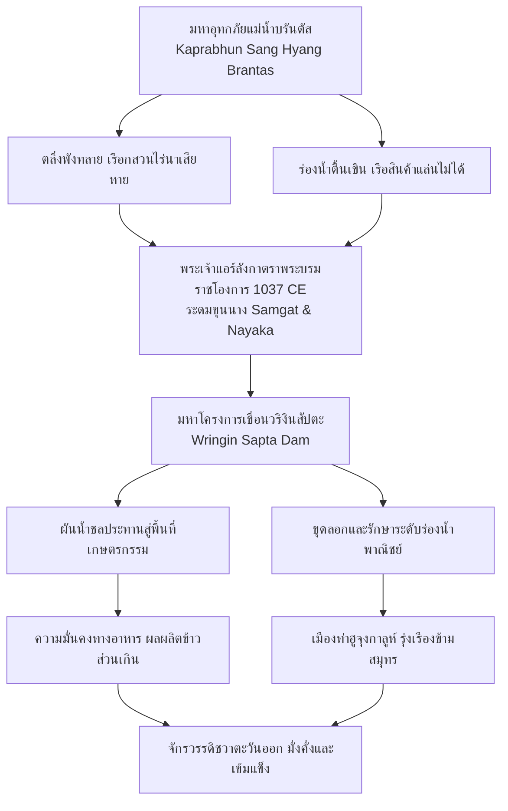

# บทที่ 4 (ตอนที่ 2): วิศวกรรมชลศาสตร์ลุ่มน้ำบรันตัส ยุคกาดีรี และการปฏิวัติประวัติศาสตร์สิงหัดส่าหรีด้วยจารึกมูลา-มาลูรุง

---

## 4.3 วิศวกรรมชลศาสตร์ลุ่มน้ำบรันตัส การค้าข้ามสมุทร และยุคกาดีรี (Hydraulic Engineering, Maritime Trade, and Kadiri Inscriptions ca. 1037–1222 CE)

### 4.3.1 ภูมิศาสตร์ชลศาสตร์แห่งลุ่มน้ำบรันตัส: แม่น้ำแห่งชีวิต อุทกภัย และรากฐานการบริหารจัดการน้ำ

ในประวัติศาสตร์นิพนธ์ว่าด้วยวิวัฒนาการแห่งรัฐและอารยธรรมโบราณบนเกาะชวา การเคลื่อนย้ายศูนย์กลางอำนาจทางการเมือง เศรษฐกิจ และวัฒนธรรมจากที่ราบลุ่มตอนกลาง (Central Java) สู่ภูมิภาคชวาตะวันออก (East Java) ในช่วงต้นคริสต์ศตวรรษที่ 10 ภายใต้การนำของพระเจ้าเอ็มปู สินดก (Mpu Sindok) มิได้เป็นเพียงการย้ายถิ่นฐานของราชสำนักเพื่อหลบหลีกมหันตภัยทางธรรมชาติหรือสงครามความขัดแย้งเท่านั้น หากแต่เป็นการปรับเปลี่ยนกระบวนทัศน์เชิงนิเวศวิทยาและภูมิรัฐศาสตร์ครั้งสำคัญที่สุด [1] สภาพภูมิศาสตร์ของชวากลางวางรากฐานอยู่บนที่ราบระหว่างหุบเขาดินภูเขาไฟอันอุดมสมบูรณ์ เช่น ที่ราบเกอดู (Kedu Plain) และที่ราบปรัมบานัน (Prambanan Plain) ซึ่งหล่อเลี้ยงด้วยแม่น้ำโปรโก (Progo River) และแม่น้ำโอปัก (Opak River) แต่แม่น้ำเหล่านี้มีลักษณะเป็นลำน้ำระยะสั้น ไหลลงสู่มหาสมุทรอินเดียทางทิศใต้ซึ่งคลื่นลมรุนแรงและปราศจากอ่าวจอดเรือกำบังลมธรรมชาติ ส่งผลให้ราชอาณาจักรมาตารามชวากลางดำรงโครงสร้างเศรษฐกิจแบบ "รัฐเกษตรกรรมในหุบเขาปิด" (Inland Agrarian State) ที่ถูกตัดขาดจากเส้นทางพาณิชย์นาวีระหว่างประเทศเกือบโดยสิ้นเชิง [2]

ในทางตรงกันข้าม ชวาตะวันออกถูกโอบล้อมและร้อยรัดด้วยระบบอุทกวิทยาของมหาลำน้ำสองสายหลัก ได้แก่ แม่น้ำเบงงาวันโซโล (Bengawan Solo River) ทางตอนเหนือ และแม่น้ำบรันตัส (Brantas River) ทางตอนใต้และตอนกลาง โดยเฉพาะอย่างยิ่งลุ่มน้ำบรันตัส ซึ่งมีต้นกำเนิดจากแนวภูเขาไฟศักดิ์สิทธิ์รอบภูเขาอาร์จูโน (Mount Arjuno), ภูเขากาวี (Mount Kawi), ภูเขาเกอลุด (Mount Kelud), และภูเขาบราโม (Mount Bromo) ลำน้ำบรันตัสไหลโอบล้อมเทือกเขาเป็นรูปเกือกม้า โดยไหลลงมาทางทิศใต้ผ่านเมืองมาลัง (Malang) เลี้ยวโค้งไปทางทิศตะวันตกผ่านเบลิตาร์ (Blitar) และตูลุงอากุง (Tulungagung) ก่อนจะหักมุมขึ้นสู่ทิศเหนือผ่านเมืองเกอดีรี (Kediri) แล้วไหลวกไปทางทิศตะวันออกผ่านจอมบัง (Jombang) และโมโจเกอร์โต (Mojokerto) จากนั้นจึงแยกตัวออกเป็นสองแควสาขาใหญ่ที่บริเวณสามเหลี่ยมปากแม่น้ำ คือ แม่น้ำกาลีมัส (Kali Mas) ซึ่งไหลออกสู่ทะเลชวาทางทิศเหนือ ณ เมืองสุราบายา (Surabaya) และแม่น้ำกาลีโปรง (Kali Porong) ซึ่งไหลออกสู่ช่องแคบมาดูราทางทิศตะวันออกเฉียงใต้ ณ อำเภอซีโดอาร์โจ (Sidoarjo) [3]

โครงสร้างอุทกวิทยาอันมหัศจรรย์นี้ทำให้แม่น้ำบรันตัสทำหน้าที่เป็น "ทางหลวงสายน้ำธรรมชาติ" ที่เชื่อมโยงแหล่งเกษตรกรรมนาข้าวชลประทานอันกว้างใหญ่ไพศาลในเขตหุบเขาตอนใน เข้ากับเครือข่ายการค้าทางทะเลระดับโลกในทะเลชวา ช่องแคบมะละกา และมหาสมุทรอินเดีย ทว่าความอุดมสมบูรณ์ของลุ่มน้ำบรันตัสต้องแลกมาด้วยความเสี่ยงภัยเชิงภัยพิบัติขั้นรุนแรงสองประการ: ประการแรกคือ ภัยพิบัติตะกอนลาฮาร์ (Lahar) และเถ้าถ่านภูเขาไฟจากการปะทุอย่างสม่ำเสมอของภูเขาไฟเกอลุด ซึ่งพัดพาหินกรวดทรายจำนวนมหาศาลลงมาทับถมลำน้ำบรันตัสและลำน้ำสาขา; ประการที่สองคือ วิกฤตการณ์มหาอุทกภัย (Catastrophic Flooding) ในช่วงฤดูมรสุมตะวันตกเฉียงใต้ เมื่อกระแสน้ำป่าอันเชี่ยวกรากทะลักทลายตลิ่ง พัดพาเอาโคลนตมเข้าท่วมท้นเรือกสวนไร่นา ทำลายบ้านเรือน และเปลี่ยนร่องน้ำโบราณจนเรือสินค้าไม่สามารถสัญจรได้ [4]

ด้วยเหตุนี้ การจัดการชลประทานและการควบคุมน้ำ (Water Control and Hydraulic Engineering) จึงมิใช่เป็นเพียงงานโยธาธิการระดับท้องถิ่น แต่เป็น "ภารกิจแกนกลางแห่งความชอบธรรมของสถาบันกษัตริย์" ในชวาตะวันออก ความมั่นคงของรัฐ การสะสมผลผลิตส่วนเกินจากนาข้าว และการดำรงอยู่ของเส้นทางเดินเรือพาณิชย์นาวี ล้วนขึ้นอยู่กับความสามารถของราชสำนักและชุมชนในการควบคุมความเกรี้ยวกราดของพระคงคาบรันตัส

ร่องรอยทางจารึกวิทยาที่เก่าแก่และสมบูรณ์ที่สุดชิ้นหนึ่งที่สะท้อนภูมิปัญญาการจัดการชลประทานในลุ่มน้ำบรันตัสตอนบน ได้แก่ **"จารึกฮารินจิง"** (Harinjing Charter หรือที่รู้จักในเอกสารยุคอาณานิคมว่า จารึกสุกาบูมี / Sukabumi Inscription, DHARMA `INSIDENKHarinjing.xml`) ซึ่งจารึกลงบนแท่งศิลาขนาดใหญ่ พบที่ตำบลปาเร (Pare) เขตเกอดีรี บนฝั่งแม่น้ำกาลีคอนตง (Kali Konto) ซึ่งเป็นแม่น้ำสาขาสำคัญทางฝั่งขวาของแม่น้ำบรันตัส [5] ศิลาจารึกฮารินจิงบันทึกเหตุการณ์ประวัติศาสตร์ข้ามยุคสมัยถึง 3 รัชกาล ตั้งแต่มหาศักราช 726 (ค.ศ. 804) ในยุคชวากลางตอนปลาย สืบเนื่องมาจนถึงมหาศักราช 782 (ค.ศ. 860) ในรัชสมัยพระเจ้าราไก ปิกาตัน (Rakai Pikatan) และมหาศักราช 843 (ค.ศ. 921) ในรัชสมัยพระเจ้าราไก ลายัง ดยาห์ ตูลอดง (Rakai Layang Dyah Tulodhong) แห่งราชอาณาจักรมาตาราม [6]

ตัวบทจารึกฮารินจิงส่วนต้น (Face A บรรทัดที่ 1–5) บันทึกการสร้างฝายทดน้ำและขุดคลองส่งน้ำประวัติศาสตร์ไว้อย่างชัดเจน ดังความในตัวบทปริวรรตอักษรโรมันสากล (IAST) พร้อมบทแปลภาษาไทยทางวิชาการ:

> **ตัวบทจารึกฮารินจิง (DHARMA `INSIDENKHarinjing.xml`, Face A1–A3):**
>
> `// svasti śaka-varṣātīta 726 caitra-māsa tithi Ekādaśī śukla-pakṣa vāra ha, va, ca, tatkāla bhagavanta bārī I culaṅgi sumaākṣyakan· sīmaniran· muūla ḍavuhan· gavainira kali I hariñjiṁ hana ta L̥maḥ ḍapūbhī saṁṅ apatiḥ Atuha kāmbaḥ deni kali hinəlyan· L̥maḥ satampaḥ de bhagavanta bārī paməgət· saṁ paṅgumulan· parttaya saṁ kamalagyan· ...` [7]
>
> *(คำแปล: ขอความสวัสดีจงมี! มหาศักราชล่วงไปแล้ว 726 ปี เดือนเจตรมาส วันขึ้น 11 ค่ำ รอบวันฮารียัง, วาไก, จันทรวาร [วันจันทร์] ในกาลเวลานั้น องค์ภควังตา บารี แห่งตำบลจูลังกี ได้ทูลขอให้มีพยานรับรองเขตสีมาของท่าน อันเป็นบำเหน็จแต่เดิมมาจากการสร้างฝายทดน้ำ [ḍawuhan] และการขุดคลอง ณ ฮารินจิง [kali i hariñjiṁ] ในการนั้น ที่ดินของดาปูภี ผู้เป็นสมเด็จเจ้าพระยาผู้เฒ่า [saṅ apatih atuha] ได้ถูกคลองน้ำตัดผ่านกัดเซาะ องค์ภควังตา บารี จึงได้มอบที่ดินทดแทนให้จำนวน 1 ตัมปะฮ์ โดยมีปาเมกัตแห่งปังกูมูลัน และปรัตยายะแห่งกมลากยัน เป็นพยานเจ้าหน้าที่...)* [8]

เนื้อความในจารึกฮารินจิงเผยให้เห็นมิติทางสังคม วิศวกรรม และสถาบันกฎหมายที่ก้าวหน้าอย่างยิ่ง 3 ประการ:
ประการแรก ผู้ริเริ่มโครงการชลประทานขนาดใหญ่นี้มิใช่ข้าราชการส่วนกลางจากราชธานี หากแต่เป็นผู้นำทางจิตวิญญาณและปราชญ์ชุมชนท้องถิ่นนามว่า "ภควังตา บารี" (Bhagawanta Bārī) แห่งสำนักสงฆ์จูลังกี (Culaṅgi) ซึ่งมองเห็นภัยพิบัติจากแม่น้ำคอนตงที่พัดพาหินทรายภูเขาไฟจากเทือกเขาเกอลุดลงมาท่วมท้นบ้านเรือน จึงได้ระดมแรงงานศรัทธาของชาวบ้านร่วมกันสร้างฝายทดน้ำ (*ḍawuhan*) ขวางลำน้ำคอนตง และขุดคลองผันน้ำความยาวหลายกิโลเมตรเข้าสู่พื้นที่แห้งแล้ง ซึ่งต่อมาเรียกว่า "คลองฮารินจิง" (*kali i hariñjiṁ*) โครงการดังกล่าวช่วยควบคุมอุทกภัยได้อย่างมีประสิทธิภาพ และเปลี่ยนพื้นที่รกร้างให้กลายเป็นผืนนาชลประทานอันสมบูรณ์ [9]

ประการที่สอง จารึกสะท้อนกระบวนการชดเชยที่ดินและการเวนคืนตามหลักนิติธรรมโบราณ เมื่อแนวคลองขุดใหม่ตัดผ่านที่ดินส่วนบุคคลของเสนาบดีผู้เฒ่า (*saṅ apatih atuha*) ภควังตา บารี มิได้ใช้อำนาจบาตรใหญ่ยึดครอง หากแต่จัดหาที่ดินแปลงใหม่ขนาด 1 ตัมปะฮ์ (tampaḥ: หน่วยรังวัดที่ดินโบราณ) ชดเชยให้อย่างเป็นธรรม โดยมีพนักงานรังวัดและตุลาการของรัฐ (*samgat / pamgat*) ร่วมเป็นสักขีพยาน [10]

ประการที่สาม ความมั่นคงยั่งยืนของระบบสีมา: เมื่อกาลเวลาล่วงเลยไปกว่าหนึ่งศตวรรษ ในปี ค.ศ. 921 ทายาทรุ่นเหลนของภควังตา บารี ได้นำศิลาจารึกเดิมเข้าเฝ้าทูลละอองธุลีพระบาทพระเจ้าราไก ลายัง ดยาห์ ตูลอดง เพื่อขอพระราชทานพระบรมราชานุญาตต่ออายุและยกระดับเขตสีมาฮารินจิงให้เป็น "สีมาสวาตันตระ" (Sīma Swatantra) ปลอดภาษีหลวงตลอดกาล ซึ่งพระมหากษัตริย์ก็ทรงโปรดเกล้าฯ พระราชทานตามคำขอ พร้อมทั้งสั่งให้สลักข้อความเพิ่มเติมลงบนด้าน B ของศิลาหลักเดียวกัน [11] ปรากฏการณ์นี้เป็นประจักษ์พยานยืนยันว่า ราชสำนักชวาโบราณให้ความสำคัญสูงสุดต่อผู้ทรงคุณูปการด้านการจัดการน้ำ และใช้ระบบกัลปนาสีมาเป็นเครื่องมือทางเศรษฐกิจการเมืองในการสร้างแรงจูงใจให้แก่ผู้นำท้องถิ่นในการบำรุงรักษาระบบชลศาสตร์ของชาติอย่างต่อเนื่อง [12]

---

### 4.3.2 จารึกกมลากยัน (ค.ศ. 1037) และมหาโครงการเขื่อนวริงินสัปตะ: การควบคุมมหาอุทกภัยกับการค้าทางทะเล

หากจารึกฮารินจิงคืออนุสรณ์แห่งการจัดการน้ำในลุ่มน้ำบรันตัสตอนบน **"จารึกกมลากยัน"** (Kamalagyan Charter หรือที่ชาวบ้านเรียกว่า Prasasti Klagen, DHARMA `INSIDENK00526.xml`) ก็นับเป็น "มหากาพย์แห่งวิศวกรรมชลศาสตร์ระดับชาติที่ยิ่งใหญ่ที่สุดในประวัติศาสตร์เอเชียตะวันออกเฉียงใต้โบราณ" [13] ศิลาจารึกหลักนี้ค้นพบที่หมู่บ้านกลาเกน (Klagen) ตำบลโตรปักโก (Tropodo) อำเภอซีโดอาร์โจ (Sidoarjo) ใกล้กับจุดบรรจบที่แม่น้ำบรันตัสแยกสาขาออกเป็นแม่น้ำโปรง สลักด้วยอักษรชวาโบราณแบบกวีคลาสสิก ออกในนามของพระบาทสมเด็จพระมหาราชาศรีโลเกศวร ธรรมวังศะ แอร์ลังกานันตวิกรมโมตตุงคเทวะ (Śrī Mahārāja Rakai Halu Śrī Lokeśvara Dharmmavaṅśa Airlaṅgānantavikramottuṅgadeva) กำหนดอายุทางดาราศาสตร์อย่างแม่นยำในมหาศักราช 959 มารคศีรษมาส ศุกลปักษ์ ปรติปัท ตรงกับช่วงปลายปี ค.ศ. 1037 [14]

ปี ค.ศ. 1037 มีความสำคัญยิ่งในเชิงประวัติศาสตร์ เพราะเป็นปีที่พระเจ้าแอร์ลังกาทรงเสร็จสิ้นสงครามกอบกู้และรวบรวมแผ่นดินชวากว่าสองทศวรรษ ภายหลังทรงมีชัยชนะเหนืออริราชศัตรูทั้งปวง ทั้งฮาจี วุราวารี (Haji Wurawari) และกษัตริย์วิชัยวรมันแห่งเวิงเกอร์ (Wengker) พระองค์จึงทรงหันมาทุ่มเทพระวรกายและทรัพยากรของจักรวรรดิเพื่อการฟื้นฟูโครงสร้างพื้นฐานทางเศรษฐกิจที่พังทลาย [15]

ตัวบทจารึกกมลากยันตั้งแต่บรรทัดที่ 8 ถึงบรรทัดที่ 14 บันทึกวิกฤตการณ์อุทกภัยครั้งร้ายแรงและพระบรมราชโองการสร้างมหาเขื่อนวริงินสัปตะไว้อย่างวิจิตรบรรจง ดังความในตัวบทปริวรรตอักษรเดิมและบทแปลวิชาการ:

> **ตัวบทจารึกกมลากยัน (DHARMA `INSIDENK00526.xml`, บรรทัดที่ 8–14):**
>
> `... i rika divasa nikanang tambak i wringin sapta pinasamlara de sri maharaja / apan kaprabhun sang hyang brantas mangidul mangalor / rusak tang lwah sahana nikang desa / matangnyan tinambak ta ya de sri maharaja / kinon ta sang makaryya sakwehing para samgat nayaka / ... yathanyan sida mapageh ikang lwah / sukha ta manah nikang maparahu / mangjawa mangalap bhanda ri hujung galuh //` [16]
>
> *(คำแปล: ณ กาลวันนั้น มหาเขื่อนทำนบกั้นน้ำ ณ วริงินสัปตะ [tambak i wringin sapta] ได้รับการบูรณปฏิสังขรณ์และสร้างเสริมความแข็งแกร่งขึ้นโดยพระบรมราชโองการแห่งสมเด็จพระศรีมหาราชา ด้วยเหตุที่ความเกรี้ยวกราดอันเปี่ยมด้วยเทวฤทธิ์แห่งพระคงคาแม่น้ำบรันตัสอันศักดิ์สิทธิ์ [kaprabhun sang hyang brantas] ได้ไหลบ่าเอ่อท้นทะลักทลายไปทั้งทางทิศใต้และทิศเหนือ ก่อความวินาศฉิบหายแก่ผืนแผ่นดิน ตลิ่งพังทลาย และหมู่บ้านทั้งปวงต้องจมอยู่ใต้อุทกภัย ด้วยเหตุดังนั้น สมเด็จพระศรีมหาราชาจึงมีพระบรมราชโองการให้สร้างเขื่อนทำนบยักษ์ขึ้น ทรงบัญชาให้บรรดาข้าราชการฝ่ายตุลาการสังคัตและนายกะฝ่ายปกครองทั้งหลายร่วมแรงระดมไพร่พลกระทำการก่อสร้าง... เพื่อให้กระแสสายน้ำนิ่งสงบ มั่นคง และยังประโยชน์สุข เมื่อนั้น จิตใจของเหล่าผู้เดินเรือพาณิชย์ทั้งปวง [maparahu] จึงเปี่ยมล้นด้วยความรื่นรมย์ยินดี สามารถแล่นเรือเข้ามายังแผ่นดินชวาเพื่อรับซื้อและแลกเปลี่ยนสินค้า ณ มหาเมืองท่าฮูจุงกาลูห์ [Hujung Galuh]...)* [17]

การวิเคราะห์ตัวบทจารึกกมลากยันร่วมกับการศึกษาด้านธรณีโบราณคดีของคณะวิจัยโครงการ DHARMA (Griffiths 2020) และข้อวินิจฉัยของ ศาสตราจารย์ เอ็ม. บุชารี (Boechari 2012) เผยให้เห็นนัยสำคัญ 4 ประการ:

ประการแรก มโนทัศน์เรื่อง "ความเกรี้ยวกราดแห่งพระคงคาบรันตัส" (*kaprabhun sang hyang brantas*): ชาวชวาโบราณมิได้มองแม่น้ำบรันตัสเป็นเพียงทางน้ำทางกายภาพ แต่มองเป็นสิ่งศักดิ์สิทธิ์ทรงชีวิตที่มีอิทธิฤทธิ์อำนาจดั่งเทพเจ้า คำว่า *kaprabhun* (มาจากรากศัพท์ *prabhu* = กษัตริย์/ผู้มีอำนาจยิ่งใหญ่) สะท้อนว่าแม่น้ำมีอำนาจเสมอด้วยองค์ราชา เมื่อแม่น้ำพิโรธ ตลิ่งและลำน้ำจะพังทลาย (*rusak tang lwah*) ทำลายความอุดมสมบูรณ์ของเรือกสวนไร่นา [18]

ประการที่สอง สถาปัตยกรรมวิศวกรรมเขื่อนวริงินสัปตะ: การสร้างเขื่อน *Wringin Sapta* (ซึ่งมีความหมายตามตัวอักษรว่า "ต้นไทรทั้งเจ็ด") ณ บริเวณรอยต่อระหว่างโมโจเกอร์โตและซีโดอาร์โจ เป็นการสร้างทำนบกั้นน้ำและฝายผันน้ำขนาดมหึมาขวางแม่น้ำบรันตัส เพื่อแบ่งสัดส่วนการไหลของน้ำระหว่างแม่น้ำโปรงและแม่น้ำกาลีมัส การควบคุมระดับน้ำนี้ช่วยป้องกันไม่ให้น้ำท่วมพื้นที่เกษตรกรรมทางตอนล่าง ในขณะเดียวกันก็ช่วยรักษาระดับความลึกของร่องน้ำในแม่น้ำกาลีมัสให้มีความสม่ำเสมอตลอดทั้งปี แม้ในช่วงฤดูแล้ง ทำให้เรือเดินสมุทรขนาดใหญ่สามารถแล่นทวนกระแสน้ำเข้ามาได้ลึกถึงศูนย์กลางราชธานี [19]

ประการที่สาม มิติการบูรณาการทางเศรษฐกิจ: ข้อความในจารึกแสดงให้เห็นอย่างเด่นชัดว่า วิศวกรรมชลศาสตร์ของแอร์ลังกามิได้มุ่งหวังเพียงผลผลิตทางการเกษตรเท่านั้น หากแต่เชื่อมโยงแนบแน่นกับ "ผลประโยชน์ทางการค้าข้ามสมุทร" จารึกระบุอย่างเฉพาะเจาะจงว่า ผลลัพธ์ของการสร้างเขื่อนทำให้จิตใจของเหล่ากัปตันเรือและพ่อค้าสำเภา (*maparahu*) เต็มไปด้วยความสุขเกษมศานต์ เพราะสามารถแล่นเรือเข้ามายังเกาะชวาเพื่อรวบรวมสินค้า (*mangalap bhanda*) ณ เมืองท่าฮูจุงกาลูห์ได้อย่างปลอดภัย [20]

ประการที่สี่ การจัดตั้งเขตสีมาและการปูนบำเหน็จ: พระเจ้าแอร์ลังกาทรงพระราชทานสถานะเขตปลอดภาษี (สีมา) ให้แก่หมู่บ้านกมลากยันและชุมชนโดยรอบ เพื่อแลกกับพันธะหน้าที่ของราษฎรในการทำหน้าที่เป็น "กองช่างพิทักษ์เขื่อน" ที่ต้องคอยตรวจสอบ ซ่อมแซม และดูแลรักษาความมั่นคงของมหาเขื่อนวริงินสัปตะมิให้พังทลายลงมาอีกในอนาคต [21]

---

### 4.3.3 เมืองท่าฮูจุงกาลูห์ เครือข่ายพาณิชย์นาวีข้ามสมุทร และชาวต่างด้าว (Warga Kilalan)

ผลสำเร็จจากมหาโครงการเขื่อนวริงินสัปตะได้ขับเคลื่อนให้ **"ฮูจุงกาลูห์"** (Hujung Galuh ซึ่งตั้งอยู่บริเวณปากแม่น้ำกาลีมัส ใกล้นครสุราบายาในปัจจุบัน) ก้าวขึ้นเป็นหนึ่งในเมืองท่าเอมโพเรียม (Emporium) ที่มั่งคั่งและคึกคักที่สุดในภูมิภาคอุษาคเนย์ภาคพื้นสมุทรในช่วงคริสต์ศตวรรษที่ 11–13 [22] ในขณะที่ราชธานีของพระเจ้าแอร์ลังกา (เช่น ดาฮา หรือ กาฮูรีปัน) ตั้งมั่นอยู่ในเขตลุ่มน้ำตอนในเพื่อควบคุมผลผลิตข้าว ฮูจุงกาลูห์ทำหน้าที่เป็น "ประตูหน้าด่านทางทะเล" ที่ดูดซับสินค้ามีค่าจากโลกภายนอกและระบายผลผลิตทางการเกษตรออกสู่ตลาดโลก

ความรุ่งเรืองของฮูจุงกาลูห์ดึงดูดให้เกิดการหลั่งไหลเข้ามาของพ่อค้า วาณิช และนักเดินเรือจากดินแดนโพ้นทะเล ดังปรากฏหลักฐานทางจารึกวิทยาที่บันทึกรายนามกลุ่มชนต่างชาติที่เข้ามาตั้งถิ่นฐานและดำเนินกิจกรรมทางเศรษฐกิจในชวา ซึ่งจารึกเรียกว่า **"วารกา กิลาลัน"** (Warga Kilalan หรือ *Warga Hiliran*) [23] จารึกในรัชสมัยพระเจ้าแอร์ลังกาและยุคกาดีรีได้ระบุบัญชีรายชื่อกลุ่มชนต่างชาติไว้อย่างละเอียดและเป็นระบบ ซึ่ง ศาสตราจารย์ เอ็ม. บุชารี (Boechari 2012) ได้ทำการสังเคราะห์และวิเคราะห์เชิงชาติพันธุ์วรรณนาประวัติศาสตร์ไว้อย่างลึกซึ้ง ได้แก่:

1. **ชาวกลิงคะ (*Kliṅ*):** ชาวอินเดียจากชายฝั่งโคโรมันเดลและโอริสสา (แคว้นกลิงคะ) ซึ่งเป็นกลุ่มพ่อค้าอินเดียที่มีบทบาทโดดเด่นที่สุด จนกระทั่งในจารึกชวาโบราณมีตำแหน่งขุนนางเฉพาะคือ "จูรูกลิง" (*juru kliṅ*) ทำหน้าที่เป็นหัวหน้าควบคุมดูแลชุมชนชาวอินเดีย [24]
2. **ชาวสิงหล (*Siṅhala*):** พ่อค้าและพระสงฆ์จากเกาะลังกา (ศรีลังกา) ผู้เชื่อมโยงเครือข่ายพุทธศาสนาเถรวาทและมหายาน
3. **ชาวดราวิเดียน/ทมิฬ (*Draviḍa*):** กลุ่มพ่อค้าสมาคมการค้าทมิฬข้ามสมุทร เช่น สมาคมไอนูร์รุวัร (Ayyāvoḷe 500 / Aiññūṟṟuvar) และมะณิครามัม (Maṇigrāmam) ซึ่งมีสาขาเครือข่ายตั้งแต่สุมาตราเหนือจนถึงชวา
4. **ชาวจาม (*Campā*):** กลุ่มพ่อค้าและผู้เชี่ยวชาญการเดินเรือจากอาณาจักรจามปาตามแนวชายฝั่งเวียดนามตอนกลาง
5. **ชาวมอญ (*Rman*):** พ่อค้าจากดินแดนรามัญเทศะในลุ่มน้ำอิรวดีและสะโตง (พม่าตอนล่าง)
6. **ชาวเขมร (*Kmir*):** พ่อค้าจากจักรวรรดิพระนคร (Angkor Empire)
7. **ชาวจีน (*Cīna*):** วาณิชจากราชวงศ์ซ่งของจีนที่นำผ้าไหม เครื่องถ้วยชามสังคโลก และเงินตราเหรียญทองแดงเข้ามาแลกเปลี่ยนกับเครื่องเทศ ไม้หอม และผลผลิตป่าไม้ของนูซันตารา [25]

ในมิติด้านสถาบันกฎหมายและการจัดเก็บภาษี บุชารี (2012) ได้ชี้ให้เห็นว่า กลุ่มชาวต่างด้าว *Warga Kilalan* เหล่านี้มิได้มีสถานะเป็นพลเมืองชั้นสองที่ถูกกดขี่ หากแต่ได้รับการยอมรับในฐานะ "กลุ่มวิชาชีพพิเศษที่มีทักษะเฉพาะด้านการค้าและการพาณิชย์ข้ามสมุทร" ราชสำนักชวาโบราณได้จัดเก็บภาษีเฉพาะจากพ่อค้าต่างด้าวเหล่านี้ เรียกว่า "ทรัวยะ ฮาจิ" (*drawya haji* / ภาษีหลวง) ซึ่งคำนวณจากประเภทสินค้าและขนาดของเรือพาณิชย์ [26]

อย่างไรก็ดี เมื่อพระมหากษัตริย์ทรงสถาปนาดินแดนใดให้เป็นเขตสีมาปลอดส่วยเพื่อศาสนสถาน สิทธิในการจัดเก็บภาษีจากพ่อค้าต่างชาติที่เข้ามาตั้งแผงค้าขายในเขตตลาดนัดชุมชน (*pkĕn / pasar*) จะถูกโอนถ่ายให้แก่คณะผู้บริหารสีมาหรือศาสนสถานนั้นโดยตรง พร้อมทั้งมีข้อกำหนดห้ามมิให้เจ้าพนักงานสรรพากรส่วนกลาง (*saṅ maṅilāla drawya haji*) เข้ามารบกวนหรือเรียกเก็บส่วยซ้ำซ้อน [27] ระบบการบริหารจัดการนี้เปิดโอกาสให้เกิดการสะสมทุนในระดับท้องถิ่น และส่งเสริมให้เมืองท่าริมน้ำอย่างฮูจุงกาลูห์กลายเป็นศูนย์กลางการแลกเปลี่ยนทางวัฒนธรรมและภาษาศาสตร์ ที่ซึ่งภาษาสันสกฤต ภาษาทมิฬ ภาษาจีน และภาษาชวาโบราณ ได้ผสมผสานหล่อหลอมเข้าด้วยกันอย่างมีชีวิตชีวา [28]

---

### 4.3.4 อาณาจักรปัญจาลูหรือกาดีรี: กษัตริย์ ภูมิรัฐศาสตร์ และจารึกหลัก

ภายหลังการสละราชสมบัติของพระเจ้าแอร์ลังกาเพื่อทรงออกผนวชเป็นมหาดาบสในราวปี ค.ศ. 1042 แผ่นดินชวาตะวันออกได้เผชิญกับจุดเปลี่ยนผ่านเชิงโครงสร้างครั้งใหญ่ เมื่อพระราชอาณาจักรถูกแบ่งแยกออกเป็นสองส่วน คือ **"แคว้นจังกะละ"** (Janggala / Kahuripan) บริเวณที่ราบสามเหลี่ยมปากแม่น้ำและชายฝั่งทะเลทางทิศเหนือ และ **"แคว้นปัญจาลู"** (Pañjalu หรือต่อมาเรียกว่า Kaḍiri / Daha) บริเวณลุ่มน้ำบรันตัสตอนในทางทิศใต้ [29] แม้ว่าเอกสารตำนานพื้นเมืองยุคหลังอย่าง *Calon Arang* และ *Pararaton* จะพรรณนาเหตุการณ์นี้เป็นเรื่องปรัมปราเชิงอภินิหารว่าเกิดจากการที่มหาฤๅษีภาราดา (Mpu Bharaḍa) บินขึ้นไปบนท้องฟ้าแล้วหลั่งน้ำมนต์ศักดิ์สิทธิ์จากคนโฑแก้วลงมาแบ่งแผ่นดิน แต่งานวิจัยบุกเบิกของ ศาสตราจารย์ เอ็ม. บุชารี (Boechari 1968, 2012) ได้พิสูจน์อย่างเด็ดขาดผ่านหลักฐานจารึกร่วมสมัย เช่น จารึกมะปัญจิ การาสะกัน (Śrī Mahārāja Mapañji Garasakan 966 Śaka / 1044 CE) และจารึกการามัน (Garamān Charter 975 Śaka / 1053 CE) ว่าการแบ่งแยกแผ่นดินเป็น "ข้อเท็จจริงทางประวัติศาสตร์การเมือง" ที่นำไปสู่สงครามขับเคี่ยวระหว่างสายเลือดวงศ์กษัตริย์ยาวนานกว่า 7 ทศวรรษ [30]

สงครามกลางเมืองระหว่างสองแคว้นดำเนินมาจนกระทั่งถึงจุดสิ้นสุดในรัชสมัยของมหาราชผู้ยิ่งใหญ่ที่สุดแห่งราชวงศ์ปัญจาลู คือ **"พระเจ้าศรีชัยภยะ"** (Śrī Jayabhaya ครองราชย์ระหว่าง ค.ศ. 1135–1157) พระองค์ทรงเป็นจอมทัพผู้ทรงพระปรีชาสามารถที่สามารถกรีธาทัพเข้าบดขยี้กองทัพแห่งจังกะละลงได้อย่างราบคาบ และรวบรวมแผ่นดินชวาตะวันออกให้กลับคืนสู่เอกภาพภายใต้ร่มธงแห่งปัญจาลูได้สำเร็จ [31]

หมุดหมายสำคัญที่สุดแห่งชัยชนะครั้งประวัติศาสตร์นี้ถูกจารึกไว้อย่างอมตะบน **"ศิลาจารึกหงันตัง"** (Ngantang Inscription หรือ Hantang, DHARMA MNI D.9) ซึ่งพบที่ตำบลหงันตัง อำเภอมาลัง สลักขึ้นในมหาศักราช 1057 (ค.ศ. 1135) ในโอกาสที่พระเจ้าชัยภยะเสด็จพระราชดำเนินมาพระราชทานบำเหน็จความชอบแก่ชาวหมู่บ้านหงันตังและหมู่บ้านพันธมิตรโดยรอบ 12 หมู่บ้าน ที่ได้แสดงความจงรักภักดีอย่างแน่วแน่และจับอาวุธขึ้นต่อสู้เคียงบ่าเคียงไหล่กับพระองค์จนสามารถขับไล่และทำลายล้างกองทัพชังกะละที่ยกมารุกรานได้สำเร็จ [32]

สิ่งที่ทำให้จารึกหงันตังมีความโดดเด่นเป็นเอกลักษณ์สูงสุดในประวัติศาสตร์จารึกวิทยาอินโดนีเซีย คือการที่บริเวณส่วนบนสุดของแผ่นศิลา เหนือตัวบทพระบรมราชโองการ ปรากฏอักษรชวาโบราณขนาดใหญ่เป็นพิเศษ สลักข้อความขวัญชัยประจำแผ่นดินอันทรงพลังว่า:

> **คำขวัญจารึกบนยอดศิลาหงันตัง (Ngantang Inscription, 1057 Śaka / 1135 CE):**
>
> `PAÑJALU JAYATI`
>
> *(คำแปล: "ปัญจาลูผู้มีชัย!" / ปัญจาลูจงได้รับชัยชนะตลอดกาล!)* [33]

วลี `PAÑJALU JAYATI` มิได้เป็นเพียงคำสดุดีทั่วไป แต่ทำหน้าที่เป็น "ตราประจำชาติและอุดมการณ์รัฐ" (National Slogan and State Ideology) ที่ประกาศว่า แคว้นปัญจาลูคือกษัตริย์ผู้ชนะโดยเด็ดขาด และความแตกแยกที่ดำรงอยู่มาเกือบหนึ่งศตวรรษได้ถูกลบล้างลงด้วยอำนาจบารมีของพระเจ้าชัยภยะ [34]

ความต่อเนื่องของสถาบันพระมหากษัตริย์กาดีรีและการสืบทอดความชอบธรรมจากบูรพกษัตริย์ยังปรากฏอย่างแจ่มชัดใน **"จารึกตัลลัน"** (Charter of Talan, DHARMA `INSIDENKTalan.xml`) ซึ่งสลักขึ้นในมหาศักราช 1058 (ค.ศ. 1136) เพียงหนึ่งปีหลังจารึกหงันตัง ตัวบทจารึกด้านหน้า (Face Ab บรรทัดที่ 1–7) บันทึกพระนามเต็มตามพระบรมราชโองการของพระเจ้าชัยภยะ และกระบวนการสืบสิทธิ์ในที่ดินสีมาไว้อย่างน่าสนใจยิ่ง:

> **ตัวบทจารึกตัลลัน (DHARMA `INSIDENKTalan.xml`, Face Ab1–Ab7):**
>
> `... svasti śaka-varṣātīta 1058, śravaṇa-māsa, tithi Ekādaśī kr̥ṣṇa-pakṣa, tu, va, ca, vāra, praṁbakat·, grahacāra dakṣiṇastha, punarvvaśū-nakṣatra Aditi-devatā, siddhi-yoga, vava-karaṇa, kuvera-parvveśa, vāyavya-maṇḍala, Irikā divasani Ājñā śrī mahārāja, śrī-varmmeśvara-madhusūdanāvatārānandita-suhr̥t-siṁha-parākrama-digjayottuṅgadeva-nāma, jayabhayalāñchana, tinaḍaḥ rakryān· mahāmantrī I halu kabayan· riṁ sarvvagata Umiṁsor i taṇḍa rakryān· ri pakira-kiran· makabehan· makādi rakryān· kanuruhan· mapañji maṇḍaka, sambandha, Ikaṁ vargga ri talan kabeḥ māmpak-ampak· manambaḥ ri lbuni pāduka śrī mahārāja maka sopāṇa rakryān apatiḥ mpu kesareśvara ... mājar· yan hana kmitanya praśāsti muṅgu riṁ ripta tinaṇḍa garuḍamukha Ātmarakṣanyan inanugrahān makasīmā deśanya ri talan· de bhaṭāra guru ...` [35]
>
> *(คำแปล: ขอความสวัสดีจงมี! มหาศักราชล่วงไปแล้ว 1058 ปี เดือนศราวณมาส วันแรม 11 ค่ำ รอบวันตุงไล, วาไก, จันทรวาร [วันจันทร์] วูกูปรังบากัต... ในกาลวันนั้น พระบรมราชโองการแห่งสมเด็จพระศรีมหาราชา ผู้ทรงพระนามเฉลิมพระปรมาภิไธยว่า ศรีวรรมเนศวร มธุสูทนาวตารานันทิตสุหฤต สิงหปรากรม ดิกชะโยตตุงคเทวะ [Śrī Varmeśvara Madhusūdanāvatārānanditasuhṛt Siṁhaparākrama Digjayottuṅgadeva] ผู้ทรงมีพระราชลัญจกรชัยภยะ [jayabhayalāñchana] ได้รับสนองพระบรมราชโองการโดยราเกรียน มหาเสนาบดีฮิโน กาบายันแห่งสารวกัต ถ่ายทอดลงมายังบรรดาขุนนางในสภามนตรี... มูลเหตุแห่งพระราชโองการ: บรรดาชาวบ้านชาวตัลลันทั้งปวง ได้เข้ามาหมอบกราบถวายบังคมแทบใต้เบื้องพระยุคลบาทผ่านทางราเกรียน มหาปาติฮ์ เอ็มปู เกสเรศวร... เพื่อกราบทูลว่า พวกเขามีเอกสารจารึกโบราณที่เก็บรักษาไว้บนแผ่นลาน [praśāsti muṅgu riṁ ripta] ซึ่งประทับตราพระราชลัญจกรครุฑมุข [tinaṇḍa garuḍamukha] เป็นหลักฐานคุ้มครองตน ซึ่งเดิมได้รับพระราชทานสถานะเขตสีมาสำหรับหมู่บ้านตัลลันจากองค์ภัตตาระ คุรุ [bhaṭāra guru = พระเจ้าแอร์ลังกา]...)* [36]

ข้อความในจารึกตัลลันเปิดเผยความจริงทางประวัติศาสตร์ที่ทรงคุณค่าอย่างยิ่ง: ประการแรก พระนามทางการของพระเจ้าชัยภยะคือ "ศรีวรรมเนศวร" (Śrī Varmeśvara) ผู้ทรงได้รับการยกย่องว่าเป็น "มธุสูทนาวตาร" (Madhusūdanāvatāra) หรือพระนารายณ์/วิษณุอวตารผู้ปราบอสูรมธุ; ประการที่สอง จารึกระบุอย่างชัดเจนว่า พระองค์ทรงใช้พระราชลัญจกรนามว่า "ชัยภยลัญจกร" (*jayabhayalāñchana*); ประการที่สาม ชาวบ้านตัลลันได้นำเอกสารสิทธิ์ดั้งเดิมที่จารึกบนใบลานหรือแผ่นลาน (*ripta*) ซึ่งได้รับพระราชทานมาตั้งแต่สมัย "ภัตตาระ คุรุ" (พระนามหลังสวรรคตของพระเจ้าแอร์ลังกา) ในมหาศักราช 941 (ค.ศ. 1019) และประทับตรา "ครุฑมุข" (*garuḍamukha*) มาแสดง พระเจ้าชัยภยะจึงทรงพระกรุณาโปรดเกล้าฯ ให้ถ่ายทอดข้อความจากแผ่นลานที่ชำรุดง่าย ลงสู่แท่งศิลาถาวร (*liṅgopala*) พร้อมทั้งพระราชทานอภิสิทธิ์เพิ่มเติม [37] เหตุการณ์นี้สะท้อนว่า ราชสำนักกาดีรีถือว่าตนเองคือ "ทายาทผู้สืบทอดความชอบธรรมโดยตรงจากพระเจ้าแอร์ลังกา" และยังคงพิทักษ์รักษาสิทธิ์ของชุมชนที่ได้รับพระราชทานตราครุฑมุขมาแต่เดิมอย่างเคร่งครัด [38]

---

### 4.3.5 สังเคราะห์วรรณกรรมกากาวินกับศิลาจารึก และตราพระราชลัญจกร (Lāñchana)

ยุคอาณาจักรปัญจาลูหรือกาดีรี (คริสต์ศตวรรษที่ 12 ถึงต้นศตวรรษที่ 13) ได้รับการยกย่องจากนักภารตวิทยาและนักวรรณคดีศึกษาว่าเป็น **"ยุคทองแห่งวรรณคดีกาวีคลาสสิก"** (The Golden Age of Classical Kawi Literature) [39] ความโดดเด่นที่สุดของยุคนี้อยู่ที่ "ความสัมพันธ์แบบพึ่งพิงซึ่งกันและกันอย่างสมบูรณ์ระหว่างวรรณกรรมราชสำนักประเภทกากาวิน (Kakawin) กับตัวบทศิลาจารึกร่วมสมัย" วรรณกรรมมิได้ถูกประพันธ์ขึ้นเพื่อความบันเทิงอย่างลอยๆ หากแต่ทำหน้าที่เป็นเครื่องมือโฆษณาชวนเชื่อทางการเมืองและเทววิทยา เพื่อเฉลิมพระเกียรติยศและสร้างความชอบธรรมอันศักดิ์สิทธิ์ให้แก่องค์พระมหากษัตริย์ในจารึก [40]

วรรณคดีชิ้นเอกที่เป็นภาพสะท้อนคู่ขนานของจารึกหงันตังอย่างสมบูรณ์แบบ ได้แก่ **"กากาวิน ภารตยุทธ"** (*Kakawin Bhāratayuddha*) มหากาพย์ร้อยกรองภาษาชวาโบราณที่แต่งขึ้นตามฉันทลักษณ์ภาษาสันสกฤต เริ่มต้นประพันธ์โดยมหากวีราชสำนักนามว่า **เอ็มปู เซดะฮ์** (Mpu Sedah) ในมหาศักราช 1079 (ค.ศ. 1157) และประพันธ์ต่อจนจบโดยกวีเอก **เอ็มปู ปานูลุฮ์** (Mpu Panuluh) ภายใต้การอุปถัมภ์โดยตรงของพระเจ้าศรีชัยภยะ [41]

ในบทกลอนเปิดเรื่อง (Maṅgala) ของภารตยุทธ กวีได้ประกาศอย่างชัดเจนว่า พระมหากษัตริย์ผู้ทรงอุปถัมภ์การแต่งมหากาพย์เรื่องนี้คือพระเจ้าชัยภยะ ผู้เป็นอวตารของพระวิษณุลงมาปราบยุคเข็ญ:

> **บทสดุดีพระเจ้าชัยภยะในกากาวิน ภารตยุทธ (โศลก 1.1–1.2):**
>
> `... śrī pāduka mahārāja jayabhaya / sira ta pinaka mūrtining viṣṇu riṁ jagat / humilaṅakən durjana / gumaway sukhaning prajāmaṇḍala...` [42]
>
> *(คำแปล: สมเด็จพระมหาราชาชัยภยะ พระองค์ผู้ทรงเป็นรูปจำลองทางกายภาพแห่งพระวิษณุในสากลโลก ทรงปราบปรามเหล่าทรชนคนชั่วให้สิ้นสูญ และทรงสร้างสรรค์ความผาสุกร่มเย็นให้แก่ปริมณฑลแห่งประชาราษฎร์...)* [43]

นักวิชาการด้านวรรณคดีชวาโบราณ เช่น ปูร์บาจารากา (Poerbatjaraka) และ ทีอูว์ (A. Teeuw) ได้ชี้ให้เห็นว่า เรื่องราวสงครามมหาภารตะระหว่างฝ่ายปาณฑพและฝ่ายเการพใน *กากาวิน ภารตยุทธ* แท้จริงแล้วคือ **"บุคลาธิษฐานทางการเมือง"** (Political Allegory) ที่จำลองมาจากสงครามขับเคี่ยวจริงระหว่างสองราชวงศ์พี่น้อง คือ ปัญจาลูกับจังกะละ ชัยชนะของฝ่ายปาณฑพในตอนจบของเรื่อง จึงเป็นตัวแทนชัยชนะอย่างเด็ดขาดของพระเจ้าชัยภยะและแคว้นปัญจาลู ที่สอดรับกับคำขวัญ `PAÑJALU JAYATI` ในศิลาจารึกหงันตังอย่างแนบสนิทไร้รอยต่อ [44]

นอกจากภารตยุทธแล้ว ในรัชสมัยของพระเจ้าศรีสเรศวร (Śrī Sarveśvara) และพระเจ้าศรีเสเนศวร (Śrī Kāmēśvara ครองราชย์ ค.ศ. 1182–1194) วรรณกรรมกากาวินยังคงเจริญรุ่งเรืองอย่างต่อเนื่อง โดยเฉพาะอย่างยิ่ง **"กากาวิน สมรดาหนะ"** (*Kakawin Smaradahana* / การเผาผลาญพระกามเทพ) ซึ่งประพันธ์โดย **เอ็มปู ธรรมชะ** (Mpu Dharmaja) [45] มหากาพย์เรื่องนี้เล่าเรื่องเทวตำนานเมื่อพระศิวะทรงเปิดพระเนตรที่สามเผาผลาญพระกามเทพ (Kāmadeva) จนมอดไหม้เป็นเถ้าถ่าน แต่วิญญาณของพระกามเทพและนางรตีได้จุติลงมาเกิดใหม่ในโลกมนุษย์ โดยเอ็มปูธรรมชะได้เปรียบเทียบว่า พระเจ้ากาเมศวรแห่งกาดีรีคือองค์กามเทพอวตาร และพระอัครมเหสีของพระองค์ คือ พระนางศรีสิรณะ (Śrī Kiraṇa) ผู้เป็นเจ้าหญิงแห่งแคว้นจังกะละ คือองค์นางรตีอวตาร การอภิเษกสมรสระหว่างทั้งสองพระองค์จึงมิใช่เพียงความรักของหนุ่มสาว แต่เป็นสัญลักษณ์เชิงเทววิทยาของการหลอมรวมสองอาณาจักร (ปัญจาลูและจังกะละ) ให้กลับกลายเป็นหนึ่งเดียวอย่างสมบูรณ์ผ่านสายใยแห่งความรักและสันติภาพ [46]

ความสอดคล้องระหว่างวรรณกรรมและจารึกวิทยาในยุคกาดีรียังสะท้อนผ่าน **"ตราพระราชลัญจกร"** (Royal Emblems / Lāñchana) ที่ปรากฏสลักอยู่บนยอดศิลาจารึกของแต่ละรัชกาล ซึ่งทำหน้าที่เป็นตราประทับทางราชการและสัญลักษณ์แทนองค์กษัตริย์:

| พระมหากษัตริย์แห่งกาดีรี | ศักราชโดยสังเขป | ตราพระราชลัญจกรประจำพระองค์ (Lāñchana) | หลักฐานจารึกและวรรณกรรมที่รองรับ |
| :--- | :--- | :--- | :--- |
| **พระเจ้าแอร์ลังกา** (ต้นวงศ์) | ค.ศ. 1019–1049 | **นารายณ์ทรงครุฑ (Garuḍamukha)** | จารึกกมลากยัน (1037), จารึกปูกังงัน (1041), รูปสลักเทวรูปเบอลาฮัน |
| **พระเจ้าชัยภยะ** (Śrī Jayabhaya) | ค.ศ. 1135–1157 | **นารายณ์ทรงครุฑ (Garuḍamukha / Jayabhayalāñchana)** | จารึกหงันตัง (1135), จารึกตัลลัน (1136), *Kakawin Bhāratayuddha* |
| **พระเจ้ากาเมศวร** (Śrī Kāmeśvara) | ค.ศ. 1182–1194 | **กวางเหลียวหลัง / กะโหลกเสี้ยวจันทร์ (Candrakapāla / Mṛgalāñchana)** | จารึกเจซิง (Ceker 1185), จารึกอันโกรก (1190), *Kakawin Smaradahana* |
| **พระเจ้าศฤงคะ / เกอรตัชชัย** | ค.ศ. 1194–1222 | **ก้ามปู / กรรเจียกมังกร (Śṛṅgalāñchana)** | จารึกกามูลัน (Kamulan 1194), จารึกปาลาฮ์ (Candi Panataran) |

การใช้ตรา *Garuḍamukha* (นารายณ์ทรงครุฑ) ของพระเจ้าชัยภยะแสดงถึงการสืบทอดสายธารเทวราชาฝ่ายไวษณพนิกายที่ถือว่ากษัตริย์คืออวตารของพระวิษณุที่ลงมาพิทักษ์โลก ขณะที่การเปลี่ยนมาใช้ตรา *Candrakapāla* (หัวกะโหลกประดับเสี้ยวจันทร์) หรือตรากวางเหลียวหลัง (*Mṛgalāñchana*) ในรัชสมัยพระเจ้ากาเมศวร สะท้อนการหันเข้าสู่สายธารไศวนิกายตันตระและการผสานสัญลักษณ์แห่งพระศิวะเข้ากับเสน่ห์อำนาจของพระกามเทพ [47] พัฒนาการทางสัญลักษณ์เหล่านี้แสดงให้เห็นว่า ศิลาจารึกแห่งยุคกาดีรีมิได้บันทึกเพียงตัวบทกฎหมายและที่ดิน หากแต่เป็น "ประติมากรรมแห่งอำนาจ" ที่ผสมผสานอักขรวิทยา ศิลปะประติมาวิทยา และเทววิทยาการเมืองเข้าเป็นเนื้อเดียวกันอย่างประณีตสูงสุด [48]

---

## 4.4 อาณาจักรสิงหัดส่าหรีและการปฏิวัติประวัติศาสตร์ด้วยจารึกมูลา-มาลูรุง (The Singhasari Empire and the Mula-Malurung Epigraphical Revolution ca. 1222–1292 CE)

### 4.4.1 การค้นพบจารึกแผ่นทองแดงมูลา-มาลูรุง (ค.ศ. 1255) และการรื้อสร้างประวัติศาสตร์นิพนธ์

ในประวัติศาสตร์นิพนธ์อินโดนีเซียโบราณ ไม่มีช่วงเวลาใดที่เต็มไปด้วยเรื่องเล่าอันน่าสะพรึงกลัว โศกนาฏกรรมแห่งการลอบสังหาร และตำนานการแย่งชิงราชบัลลังก์อันนองเลือด เท่ากับยุคสมัยแห่ง **"ราชอาณาจักรสิงหัดส่าหรี"** (Singhasari หรือ Tumapel ค.ศ. 1222–1292) ภาพจำทางประวัติศาสตร์กระแสหลักที่ผู้คนและนักวิชาการทั่วโลกยึดถือมานานกว่าศตวรรษ ล้วนมีที่มาจากวรรณกรรมร้อยแก้วภาษาชวาตอนปลายเรื่อง **"ปรารัตน์"** (*Pararaton* หรือ *Katuturanira Kĕn Aṅrok* / พงศาวลีแห่งเคนอังก๊ก) ซึ่งแต่งขึ้นในปลายคริสต์ศตวรรษที่ 15 หรือต้นศตวรรษที่ 16 ภายหลังการล่มสลายของสิงหัดส่าหรีไปแล้วเกือบสามร้อยปี [49]

*Pararaton* ได้สร้างภาพตัวแทนของราชสำนักสิงหัดส่าหรีให้กลายเป็นแดนมิคสัญญีที่ถูกสาปแช่งด้วย **"กริชของเอ็มปู กังดริง"** (Mpu Gandring's Kris) เรื่องเล่าพรรณนาว่า เคนอังก๊ก (Ken Angrok) สามัญชนผู้มีชาติกำเนิดลึกลับ ได้สั่งให้ช่างตีเหล็กผู้มีเวทมนตร์นามว่าเอ็มปูกังดริง ตีกริชวิเศษขึ้นมาเล่มหนึ่ง แต่เนื่องจากเคนอังก๊กรอคอยไม่ไหว จึงบันดาลโทสะใช้กริชเล่มนั้นแทงเอ็มปูกังดริงจนถึงแก่ความตาย ก่อนสิ้นใจ เอ็มปูกังดริงได้เปล่งคำสาปแช่งอันน่าสะพรึงกลัวว่า กริชเล่มนี้จะสังหารกษัตริย์และเจ้านายแห่งราชวงศ์นี้ต่อเนื่องกันไปถึง 7 ชั่วอายุคน [50] ตำนานบรรยายต่อไปว่า เคนอังก๊กได้ใช้กริชนี้ลอบสังหารตุงกุล อาเมตุง (Tunggul Ametung) เจ้าเมืองตูมาเปล แล้วชิงเอาพระนางเกนเดเดส (Ken Dedes) หญิงงามผู้มีบุญญาธิการมาเป็นภรรยา จากนั้นจึงทำสงครามโค่นล้มพระเจ้าเกอรตัชชัยแห่งกาดีรีในสมรภูมิกาเตร์ (Ganter 1222) สถาปนาตนเองเป็นปฐมกษัตริย์ แต่ต่อมาเคนอังก๊กกลับถูกอโนษปติ (Anusapati) บุตรเลี้ยง ลอบสังหารด้วยกริชเล่มเดิม อโนษปติก็ถูกโต๊ะฮ์จายา (Tohjaya) บุตรของเคนอังก๊กที่เกิดจากนางสนม ลอบสังหารแก้แค้นในระหว่างชนไก่ และโต๊ะฮ์จายาก็ถูกรังกาวุนี (Ranggawuni หรือวิษณุวรรธนะ) บุตรของอโนษปติ ก่อการกบฏขับไล่จนเสียชีวิต [51]

ภาพตัวแทนทางลบนี้ทำให้นักบูรพคดีศึกษาชาวดัตช์ในยุคอาณานิคม (เช่น N.J. Krom และ J.L.A. Brandes) ตราหน้าสิงหัดส่าหรีว่าเป็น "อาณาจักรแห่งคนเถื่อน โจรผู้ร้าย และทรราชผู้กระหายเลือด" [52]

ทว่า ในปี ค.ศ. 1975 ได้เกิดเหตุการณ์ที่เป็น **"การปฏิวัติทางจารึกวิทยาครั้งยิ่งใหญ่ที่สุดของอินโดนีเซีย"** เมื่อชาวบ้านได้ขุดพบชุดจารึกแผ่นทองแดงโบราณจำนวน 10 แผ่น (จารึกทั้งสองด้าน รวมเป็น 20 หน้า สลักด้วยอักษรชวาโบราณอย่างประณีตงดงาม) ในเขตอำเภอเกอดีรี ชวาตะวันออก จารึกชุดนี้ได้รับการทำความสะอาด ชำระตัวบท และวิเคราะห์เชิงลึกโดย **ศาสตราจารย์ เอ็ม. บุชารี** (M. Boechari 1975, 2012) ภายใต้ชื่อ **"จารึกมูลา-มาลูรุง"** (Mula-Malurung Inscription, DHARMA `INSIDENKMula-Malurung.xml`) กำหนดศักราชในมหาศักราช 1177 (ตรงกับ ค.ศ. 1255) [53]

จารึกมูลา-มาลูรุงเปรียบเสมือนแสงสว่างที่ส่องทะลวงม่านหมอกแห่งตำนานปรัมปราลงอย่างราบคาบ เพราะเป็น "เอกสารจารึกปฐมภูมิร่วมสมัยเพียงชิ้นเดียว" ที่ออกโดยพระมหากษัตริย์แห่งสิงหัดส่าหรีโดยตรงในช่วงกึ่งกลางของราชวงศ์ ข้อมูลเชิงประจักษ์ในจารึกได้รื้อถอน (deconstruct) เรื่องเล่าใน *Pararaton* ในมิติสำคัญ 3 ประการ:

```mermaid
flowchart TD
    subgraph "ประวัติศาสตร์นิพนธ์เดิม: ตำนาน Pararaton (ศตวรรษที่ 15-16)"
        A1[คำสาปกริชเอ็มปู กังดริง Mpu Gandring] --> B1[การลอบปลงพระชนม์ต่อเนื่อง 7 ชั่วคน]
        B1 --> C1[เคนอังก๊ก ฆ่า ตุงกุลอาเมตุง]
        C1 --> D1[อโนษปติ ฆ่า เคนอังก๊ก]
        D1 --> E1[โต๊ะฮ์จายา ฆ่า อโนษปติ]
        E1 --> F1[วิษณุวรรธนะ ทำสงครามโค่นโต๊ะฮ์จายา]
        F1 --> G1[ภาพลักษณ์: รัฐทรราชกระหายเลือด ไร้ขื่อแป]
    end
    subgraph "การปฏิวัติทางจารึกวิทยา: จารึกมูลา-มาลูรุง ค.ศ. 1255 (Boechari 1975/2012)"
        A2[จารึกแผ่นทองแดงร่วมสมัย 10 แผ่น] --> B2[การสืบราชสันตติวงศ์ตามลำดับอย่างสงบ]
        B2 --> C2[พระเจ้าแผ่นดินเสด็จสวรรคตตามธรรมชาติ]
        C2 --> D2[การประดิษฐานเทวรูปวิษณุอุทิศถวายบรรพบุรุษทุกพระองค์]
        D2 --> E2[ข้าราชบริพาร Saṁ Prāṇarāja รับใช้ต่อเนื่อง 4 รัชกาล]
        E2 --> F2[ระเบียบสหพันธรัฐเครือญาติ Familial Mandala]
        F2 --> G2[ข้อเท็จจริง: รัฐที่มีเสถียรภาพ นิติธรรม และความกตัญญู]
    end
```

ประการแรก ความสืบเนื่องของคณะข้าราชบริพาร: จารึกมูลา-มาลูรุงบันทึกประวัติชีวิตของขุนนางชั้นผู้ใหญ่นามว่า **"ซัง ปราณราชา"** (Saṁ Prāṇarāja) ผู้รับราชการสนองพระเดชพระคุณเป็น "มือและเท้า" (*pinakahastapāda*) ถวายแด่บูรพกษัตริย์สิงหัดส่าหรีต่อเนื่องกันถึง 4 รัชกาล นับตั้งแต่สมัยท่านปู่ (เคนอังก๊ก), สมัยท่านบิดา (อโนษปติ), สมัยท่านลุง (โต๊ะฮ์จายา), จนถึงรัชกาลปัจจุบันของพระเจ้าเซมินิงรัต (วิษณุวรรธนะ) [54] บุชารีตั้งข้อสังเกตเชิงวิพากษ์อย่างแหลมคมว่า หากเกิดการรัฐประหาร นองเลือด และลอบสังหารกษัตริย์อย่างป่าเถื่อนต่อเนื่องกันตามที่ *Pararaton* บรรยายไว้ ข้าราชบริพารระดับสูงที่เป็นคนสนิทของกษัตริย์พระองค์ก่อน ย่อมไม่มีทางที่จะรอดชีวิตและได้รับความไว้วางใจให้ปฏิบัติหน้าที่สำคัญสูงสุดต่อเนื่องมาในทุกรัชกาลเช่นนี้ได้อย่างแน่นอน [55]

ประการที่สอง สัจธรรมเรื่องการเสด็จสวรรคตและการสร้างศาสนสถานอุทิศ: จารึกบันทึกว่า บูรพกษัตริย์ทุกพระองค์ได้รับการประกอบพิธีกรรมทางศาสนาและสร้างเทวาลัยอุทิศถวายอย่างสมพระเกียรติ มิได้ถูกลอบฆ่าเยี่ยงสุนัขข้างถนน โดยระบุว่าท่านปู่ (เคนอังก๊ก) สวรรคตอย่างสงบบนตั่งทองคำ (*līna riṁ ḍāmpa mās*) และได้รับการประดิษฐานเป็นเทวรูปพระวิษณุ ณ นราสิงหนคร ที่กังเงอนัน; ท่านบิดา (อโนษปติ) เสด็จสู่วิมุตติ ณ สวนใหญ่ (*lineṁ kubvan agə̄ṁ*) และได้รับการประดิษฐานเป็นเทวรูปพระวิษณุ ณ จันดีกิดัล (Candi Kidal); ขณะที่นรารยยะ โต๊ะฮ์จายา เสด็จสวรรคตสู่สรวงสวรรค์ (*svarggastha pva narāryya toḥ jaya*) ตามอายุขัย มิได้ถูกแทงตายในคอกไก่ [56]

ประการที่สาม การยืนยันความถูกต้องของ *Nagarakretagama*: ข้อมูลในจารึกมูลา-มาลูรุงสอดคล้องอย่างสมบูรณ์แบบกับวรรณคดีประวัติศาสตร์ร่วมสมัยเรื่อง *เดศวรรณนา* หรือ *นาการะกฤตากะมะ* (*Nāgarakṛtāgama* ค.ศ. 1365) ของ เอ็มปู ประปัญจะ (Mpu Prapañca) ซึ่งบันทึกลำดับกษัตริย์และการสวรรคตอย่างสงบปราศจากเรื่องกริชอาถรรพ์ [57] การค้นพบของบุชารีจึงพลิกโฉมหน้าประวัติศาสตร์นิพนธ์ชวาโบราณ โดยทำให้นักวิชาการสากลปฏิเสธการใช้ *Pararaton* เป็นแกนกลางทางประวัติศาสตร์ และหันมายึดถือศิลาจารึกและวรรณคดีร่วมสมัยเป็นหลักฐานตัดสินชี้ขาด [58]

---

### 4.4.2 โครงสร้างรัฐแบบสหพันธรัฐเครือญาติ (Familial Mandala Federation)

ข้อค้นพบที่ลึกซึ้งที่สุดจากจารึกมูลา-มาลูรุง มิใช่เพียงการแก้ต่างให้แก่ข้อกล่าวหาเรื่องการลอบสังหารเท่านั้น หากแต่เป็นการเปิดเผยให้เห็น **"โครงสร้างสถาบันรัฐแบบสหพันธรัฐเครือญาติ"** (Familial Mandala Federation) ซึ่งเป็นรูปแบบการบริหารราชการแผ่นดินที่ก้าวหน้าและมีเอกลักษณ์สูงสุดของสิงหัดส่าหรี [59]

ตัวบทจารึกแผ่นที่ 1v ถึง 3r และ 6v ถึง 7v ระบุว่า พระมหากษัตริย์ผู้ทรงครองสิงหัดส่าหรีอยู่ในขณะนั้นคือ **"นรารยยะ เซมินิงรัต"** (Narāryya Sminiṅ Rāt) ซึ่งเฉลิมพระปรมาภิไธยอย่างเป็นทางการว่า *Śrī Lokavijaya Puruṣottama Vīrāṣṭabasudevādhipānivāryyavīryyaninditaparakrama Mūrdvajanomottuṅgadeva* หรือที่วรรณกรรมรุ่นหลังรู้จักในพระนาม **"พระเจ้าวิษณุวรรธนะ"** (Viṣṇuvardhana ครองราชย์ ค.ศ. 1248–1268) [60] ทว่า พระองค์มิได้ปกครองอาณาจักรตามลำพัง หากแต่ใช้ระบบ **"ทวิราชาธิปไตย"** (Diarchy / Dual Monarchy) โดยประทับร่วมครองราชสมบัติเคียงคู่กับพระญาติสนิท คือ **"นราสิงหมูรติ"** (Narasiṅhamūrti หรือ มะหิสา จัมปากะ / Mahiṣa Campaka ผู้เป็นบุตรของมะหิสา วงงาเตเลง และเป็นหลานปู่ของเคนอังก๊ก) [61] วรรณกรรมนาการะกฤตากะมะเปรียบเทียบการร่วมครองราชย์ของกษัตริย์ทั้งสองพระองค์นี้ว่า ดุจดั่ง "พระอินทร์กับพระวิษณุที่ร่วมกันคุ้มครองโลก" (*bhaṭāra indra lawan viṣṇu*) หรือดั่ง "พระรามกับพระลักษมณ์" ที่สร้างเสถียรภาพทางการเมืองอย่างที่ไม่เคยปรากฏมาก่อน [62]

เพื่อเสริมสร้างความมั่นคงและป้องกันการแตกแยกของหัวเมืองรอบนอก พระเจ้าเซมินิงรัตทรงวางนโยบายกระจายอำนาจผ่านเครือข่ายพระบรมวงศานุวงศ์ โดยทรงส่งพระราชโอรส พระราชธิดา และพระญาติสนิท ไปสถาปนาขึ้นเป็น "ราชาผู้ครองแคว้น" (Viceroy / Regional Monarch) ตามหัวเมืองยุทธศาสตร์สำคัญทั่วเกาะชวาและเกาะบริวาร ดังปรากฏในตัวบทจารึกมูลา-มาลูรุง แผ่นที่ 7r–7v:

> **ตัวบทจารึกมูลา-มาลูรุง แผ่นที่ 7r บรรทัดที่ 1–7 (DHARMA `INSIDENKMula-Malurung.xml`):**
>
> `... sira narāryya kiraṇa, sākṣāt ātmajanira narāryya sminiṁ rāt·, pinratiṣṭa juru lamajaṁ, pinasaṅakən· jagatpālaka, ṅkāneṁ nagara lamajaṁ, sira narāryya mūrddhaja, Ătmajanira muvaḥ, sira śrī kr̥tānagara nāmaniran inabhiṣeka, pinasaṅakən· ṅkāneṁ maṇikanakasiṅhāsana, riṁ nagara daha, sinevitaniṁ bhūmi kaḍiri, sira turuk bali, putrīnira narāryya sminiṁ rāt·, pinakaparameśvarīnira śrī jayakatyə:ṁ, sākṣāt kapvanakanira narāryya sminiṁ rāt· sira pinratiṣṭa ṅkāneṁ maṇikanakasiṅhāsana, makanagare glaṁglaṁ, sinevita dainikaṁ sakalabhūmi vuravān· ...` [63]
>
> *(คำแปล: ...องค์นรารยยะ กิรณา ผู้เป็นพระราชโอรสแท้ๆ แห่งนรารยยะ เซมินิงรัต ได้รับการสถาปนาให้เป็น จูรู แห่งละมาจัง [juru lamajaṁ] ดำรงตำแหน่งเป็นผู้พิทักษ์พิภพ ณ นครละมาจัง; องค์นรารยยะ มูรธชะ ผู้เป็นพระราชโอรสอีกพระองค์หนึ่ง ทรงได้รับการอภิเษกสถาปนาในพระนามว่า ศรีกฤตนคร [Śrī Kṛtanagara] ให้ประทับเหนือสิงหาสน์ทองคำประดับอัญมณี ณ นครดาฮา แคว้นกาดีรี เพื่อให้แผ่นดินกาดีรีทั้งปวงเข้ามารับใช้สนองพระเดชพระคุณ; องค์เจ้าหญิงตุรุก บาหลี พระราชธิดาแห่งนรารยยะ เซมินิงรัต ทรงเป็นพระอัครมเหสีแห่งพระศรีชยากัตเยง [Śrī Jayakatwang] ผู้เป็นหลานลุงของนรารยยะ เซมินิงรัต ได้รับการสถาปนาขึ้นสู่สิงหาสน์ทองคำประดับอัญมณี ครองนครเกลัง-เกลัง เพื่อให้แผ่นดินวุราวานทั้งปวงเข้ามารับใช้สนองพระเดชพระคุณ...)* [64]

การจัดผังโครงสร้างอำนาจตามจารึกมูลา-มาลูรุง แสดงให้เห็นโครงสร้างสหพันธรัฐเครือญาติอันรัดกุม 5 ศูนย์กลาง:

1. **ศูนย์กลางราชธานีสิงหัดส่าหรี (ตูมาเปล):** ประทับร่วมกันระหว่างพระเจ้าเซมินิงรัต (วิษณุวรรธนะ) และนราสิงหมูรติ ดำรงสถานะเป็น "มหาราชาธิราช" ศูนย์กลางสูงสุดแห่งจักรวาล
2. **แคว้นดาฮา (กาดีรี):** สถาปนาพระราชโอรสองค์โต คือ **"นรารยยะ มูรธชะ"** หรือ **"ศรีกฤตนคร"** (Kertanagara) ขึ้นเป็น "ยุวราช" (Yuvarāja) ประทับบนบัลลังก์ทองคำในปี ค.ศ. 1254 เพื่อควบคุมหัวใจทางเศรษฐกิจและชลประทานของลุ่มน้ำบรันตัสตอนใน และฝึกหัดการบริหารราชการแผ่นดินก่อนขึ้นครองราชย์ใหญ่ [65]
3. **แคว้นละมาจัง (Lamajang):** มอบหมายให้ **"นรารยยะ กิรณา"** พระราชโอรสอีกพระองค์หนึ่งไปปกครอง เพื่อควบคุมเส้นทางยุทธศาสตร์ทางทิศตะวันออกสู่ทะเลบาหลี
4. **แคว้นเกลัง-เกลัง ในดินแดนวุราวาน (Gelang-gelang / Wurawan):** มอบหมายให้ **"พระเจ้าชยากัตเยง"** (Jayakatwang) หลานลุง ผู้สมรสกับเจ้าหญิงตุรุก บาหลี (Turuk Bali) พระราชธิดาของพระองค์ ไปครองราชย์ เพื่อผนึกกำลังและดึงสายตระกูลกาดีรีเดิมเข้ามาเป็นส่วนหนึ่งของเครือญาติราชสำนัก
5. **แคว้นจังกะละและเกาะมาดูรา:** ส่ง **"ศรีหรรษวิชัย"** (Śrī Harṣavijaya) บุตรของนราสิงหมูรติ ไปครองจังกะละ และมอบหมายให้ **"ราเกรียน กุลุป กูดา"** (Rakryan Kulup Kuda) พี่เขย ไปครองเกาะมาดูรา [66]

ระบบสหพันธรัฐเครือญาตินี้ทำให้อาณาจักรสิงหัดส่าหรีมิได้เป็นรัฐรวมศูนย์แบบเบ็ดเสร็จที่ใช้อำนาจปราบปราม หากแต่เป็น "มณฑลแห่งเครือญาติ" (Kinship Mandala) ที่เชื่อมโยงความภักดีผ่านการแต่งงานทางการเมือง การแต่งตั้งทายาท และการกระจายเกียรติยศ ซึ่งช่วยให้อาณาจักรดำรงเสถียรภาพอยู่ได้อย่างยาวนานและปราศจากสงครามกลางเมืองตลอดรัชสมัยของพระเจ้าวิษณุวรรธนะ [67]

---

### 4.4.3 การจัดการสายตระกูลบูรพกษัตริย์และสถาบันเทวราชาในจารึกมูลา-มาลูรุง

มิติที่มีความสำคัญอย่างยิ่งในเชิงเทววิทยาการเมืองและจารึกวิทยาในจารึกมูลา-มาลูรุง คือ **"การจัดการสายตระกูลบูรพกษัตริย์และการสถาปนาศาสนสถานประจำพระองค์"** (Royal Ancestor Worship and Deification) จารึกชุดนี้สะท้อนแบบแผนความเชื่อของชาวชวาโบราณว่า พระมหากษัตริย์ผู้ทรงธรรมเมื่อเสด็จสวรรคตแล้ว มิได้ดับสูญไปตามธรรมชาติ หากแต่พระวิญญาณจะเสด็จกลับคืนสู่ความเป็นเทพเจ้า (*Dewa*) และได้รับการหล่อหลอมรวมเข้ากับองค์พระผู้เป็นเจ้าสูงสุด (มักเป็นพระวิษณุหรือพระศิวะ) โดยราชสำนักจะสร้างศาสนสถานหินที่เรียกว่า "ธรรมะ" (*dharmma*) หรือ "จันดี" (*candi*) ครอบทับเถ้าพระอังคาร พร้อมทั้งสลักพระพุทธรูปหรือเทวรูปจำลองพระพักตร์ของกษัตริย์พระองค์นั้นเพื่อเป็นจุดเชื่อมต่อการบวงสรวงสักการะ [68]

ในจารึกมูลา-มาลูรุง แผ่นที่ 2v ถึง 3r พระเจ้าเซมินิงรัตได้ทรงระบุการสืบสายตระกูลและการสร้างอนุสรณ์สถานถวายแด่บูรพการีไว้อย่างเป็นระเบียบ:

1. **พระราชอัยกา (ท่านปู่ / Kaki):** จารึกระบุพระนามหลังสวรรคตว่า "พระองค์ผู้เสด็จสวรรคตบนตั่งทองคำ" (*sira saṁ līna riṁ ḍāmpa mās*) ซึ่งในแผ่นที่ 9r บรรทัดที่ 6–7 ได้ระบุคาถาบูชาพระองค์อย่างน่าอัศจรรย์ว่า: `namas te sira bhaṭāra namaś śivāya, sira saṁ līna riṁ ḍampa kanaka` (ขอนอบน้อมแด่พระองค์ผู้เป็นภัตตาระ นอบน้อมแด่พระศิวะ พระองค์ผู้เสด็จสู่วิมุตติ ณ ตั่งทองคำ) พระองค์ได้รับการประดิษฐานเป็นรูปเคารพพระวิษณุ (*viṣṇvarccha*) ณ ศาสนสถานนราสิงหนคร ที่กังเงอนัน (*dharmme kagnəṅan makasaṁjñā narasiṅhanagara*) บุชารี (2012) ชี้ชัดว่า พระองค์คือ **"พระเจ้าเคนอังก๊ก"** หรือ ศรีรังคะ ราชาสา (Śrī Raṅga Rājasa) ปฐมกษัตริย์แห่งสิงหัดส่าหรี [69]
2. **พระราชบิดา (ท่านพ่อ / Rāma):** จารึกระบุพระนามว่า "พระองค์ผู้เสด็จสวรรคต ณ สวนใหญ่" (*sira saṁ lineṁ kubvan agə̄ṁ*) พระองค์ได้รับการประดิษฐานเป็นเทวรูปพระวิษณุ ณ ศาสนสถานกิดัล มีนามว่า นราสิงหาสนะ (*dharmma ri kiḍal makanāmadheya narasiṅhāsana*) ซึ่งก็คือ **"พระเจ้าอโนษปติ"** (Anusapati) และศาสนสถานแห่งนี้ก็คือ **"จันดีกิดัล"** (Candi Kidal) โบราณสถานหินทรายอันงดงามที่ยังคงตั้งตระหง่านอยู่ใกล้เมืองมาลังในปัจจุบัน ประดับด้วยลวดลายแกะสลักเรื่องพญาครุฑแบกหม้อน้ำอมฤต เพื่อไถ่บาปและปลดปล่อยมารดา (พระนางเกนเดเดส) ให้พ้นจากความเป็นทาส [70]
3. **พระปิตุลา (ท่านลุง / Paman):** จารึกระบุพระนาม **"นรารยยะ กุงอิงภยะ"** (Narāryya Guṅ iṁ Bhaya) ซึ่งเมื่อเสด็จสวรรคตแล้ว พระเชษฐาคือ **"นรารยยะ โต๊ะฮ์จายา"** (Narāryya Tohjaya) ได้ขึ้นครองราชย์สืบต่อมาในฐานะผู้ปกครองพิภพ (*pramāṇa riṁ jagat*) โดยมีข้าราชบริพารอย่างซังปราณราชารับใช้สนองพระเดชพระคุณอย่างราบรื่น [71]

การที่จารึกมูลา-มาลูรุงระบุว่า บูรพกษัตริย์ทั้งเคนอังก๊กและอโนษปติ ล้วนได้รับการสถาปนาเป็น "เทวรูปพระวิษณุ" (*viṣṇvarccha*) แสดงให้เห็นถึงความต่อเนื่องของลัทธิเทวราชาสายไวษณพนิกายที่ราชสำนักสิงหัดส่าหรีรับสืบทอดมาจากราชวงศ์กาดีรีและพระเจ้าแอร์ลังกา ก่อนที่ในรัชกาลต่อมาของพระเจ้ากฤตนครจะเกิดการเปลี่ยนแปลงครั้งใหญ่ไปสู่การสังเคราะห์ "ลัทธิศิวะ-พุทธตันตระ" (Śiva-Buddha Tantrism) อย่างเต็มรูปแบบ [72]

---

### 4.4.4 การบริหารราชการส่วนภูมิภาคและการจัดเก็บภาษี: จารึกปากิส เวตัน (ค.ศ. 1266)

หลักฐานทางจารึกวิทยาอีกชิ้นหนึ่งที่ช่วยเติมเต็มภาพโครงสร้างการบริหารราชการแผ่นดินและระบบภาษีในปลายยุคการร่วมครองราชย์ของพระเจ้าวิษณุวรรธนะและพระเจ้ากฤตนคร ได้แก่ **"จารึกปากิส เวตัน"** (The Pakis Wetan Charter of Kertanagara, DHARMA `INSIDENKPakisWetan.xml`) ซึ่งจารึกลงบนแผ่นทองแดง ค้นพบที่ตำบลปากิส ทางตะวันออกของเมืองมาลัง สลักขึ้นในมหาศักราช 1188 มาฆมาส ศุกลปักษ์ เตรทศี ตรงกับต้นปี ค.ศ. 1266 [73]

ตัวบทจารึกปากิส เวตัน ด้าน 1v บันทึกโครงสร้างการบังคับใช้พระบรมราชโองการระหว่างสองพระมหากษัตริย์ ไว้อย่างประณีตลึกซึ้ง:

> **ตัวบทจารึกปากิส เวตัน (DHARMA `INSIDENKPakisWetan.xml`, 1v1–1v10):**
>
> `Om̐ namaś śivāya . svasti śaka-varṣātīta, 1188, māgha-māsa, tīthi, trayodaśī śukla-pakṣa, vā, va, Aṁ, vāra, mahatal· ... Irika divaśany ājñā śrī mahārāja, śrī-lauka-vijaya, praśasta-jagad-īśvarānindita-parākramānivāryya-vīryyālaṅghanīya, kr̥tanagara nāma rājābhiṣeka, makamaṅgalyājñā śrī sakala-rājāśraya, samasta-kṣatriya-cūḍāmaṇi-patita-caraṇāravinda, bhaṭāra jaya śrī viṣṇuvarddhana nāma devābhiṣeka, tinaḍaḥ de rakryan mahāmantrī hiṇo, rakryan mahāmantrī sirikan·, rakryan mahāmantrī halu, Umisor i para taṇḍa rakryan riṁ pakira-kirān· makabehan·, rakryan mapatiḥ, rakryan dəmuṁ, rakryan kanuruhan saṁ mantrī nayavid iṅgitajñā, mapasəṅgahan saṁ rāmapati, tan kavuntat· saṁ pamgət i tirvan·, saṁ pamgət iṅ kaṇḍamuhi, saṁ pamgət i maṁhuri ...` [74]
>
> *(คำแปล: โอม! ขอนอบน้อมแด่พระศิวะ! ขอความสวัสดีจงมี! มหาศักราชล่วงไปแล้ว 1188 ปี เดือนมาฆมาส วันขึ้น 13 ค่ำ รอบวันวาส, วาไก, อังคารวาร [วันอังคาร] วูกูมะฮาตัล... ในกาลวันนั้น พระบรมราชโองการแห่งสมเด็จพระศรีมหาราชา ผู้ทรงเป็นปิ่นพิภพ ทรงปรากฏพระเกียรติยศเป็นจอมแห่งโลก ผู้ทรงมีเดชานุภาพอันไร้ผู้ต้านทาน พระนามเฉลิมพระปรมาภิไธยคือ ศรีกฤตนคร [Śrī Kṛtanagara] ภายใต้พระบรมราชโองการอันเป็นมงคลนำแห่งพระองค์ผู้เป็นที่พึ่งของราชาทั้งปวง ผู้มีดอกบัวแห่งพระบาทรองรับมณีมงกุฎของกษัตริย์ทั้งหลาย องค์ภัตตาระ ผู้มีพระนามเทวาภิเษกว่า ชัย ศรีวิษณุวรรธนะ [Jaya Śrī Viṣṇuvardhana] ได้รับสนองพระบรมราชโองการโดยราเกรียน มหาเสนาบดีฮิโน, ราเกรียน มหาเสนาบดีสิริกัน, ราเกรียน มหาเสนาบดีฮาลู ถ่ายทอดลงมายังบรรดาขุนนางทันดะ ราเกรียน ในสภามนตรีปากิระ-กิรันทั้งปวง: ราเกรียน มหาปาติฮ์, ราเกรียน เดอมุง, ราเกรียน คานูรูฮัน ผู้เป็นเสนาบดีผู้รอบรู้ในนโยบายและแจ้งชัดในกิจการลับ ผู้มีบรรดาศักดิ์ว่า ซัง รามาปาติ ตลอดจนขุนนางฝ่ายตุลาการ ได้แก่ ซัง ปัมกัตแห่งติรวัน, ซัง ปัมกัตแห่งกันดามูฮี, ซัง ปัมกัตแห่งมังฮูรี...)* [75]

การวิเคราะห์ตัวบทจารึกปากิส เวตัน ช่วยไขปริศนาโครงสร้างการบริหารราชการแผ่นดินของสิงหัดส่าหรี 3 ประการ:

ประการแรก สภาวะทวิราชาธิปไตยและการเปลี่ยนผ่านอำนาจอย่างสันติ: จารึกหลักนี้แสดงให้เห็นว่า ในปี ค.ศ. 1266 (สองปีก่อนที่พระเจ้าวิษณุวรรธนะจะเสด็จสวรรคตใน ค.ศ. 1268) พระเจ้ากฤตนครได้รับการเฉลิมพระยศขึ้นเป็น "พระศรีมหาราชา" (*Śrī Mahārāja*) เต็มตัวแล้ว และทรงเป็นผู้ออกพระบรมราชโองการบริหารราชการแผ่นดิน โดยมีพระราชบิดาคือพระเจ้าวิษณุวรรธนะประทับเป็นร่มโพธิ์ร่มไทรคอยให้พรและกำกับความชอบธรรมสูงสุดในฐานะ "ภัตตาระ" (*Bhaṭāra*) [76] การถ่ายโอนอำนาจเช่นนี้สะท้อนการสืบราชบัลลังก์ที่ดำเนินไปอย่างราบรื่น สันติ และเป็นระบบ ไร้ร่องรอยแห่งความขัดแย้งระหว่างพ่อกับลูก

ประการที่สอง กายวิภาคแห่งสภาเสนาบดี "ราเกรียน มนตรี ริ ปะกิระ-กิรัน" (*Rakryān Mantri ri Pakira-kiran*): จารึกระบุสายการบังคับบัญชาที่ประกอบด้วยข้าราชการสามระดับอย่างสมบูรณ์:
1. *คณะมหาเสนาบดีชั้นสูงทั้งสาม (Mahāmantri Katrīṇi):* ได้แก่ ฮิโน (Hino), สิริกัน (Sirikan), และฮาลู (Halu) ซึ่งสงวนไว้สำหรับพระราชโอรสและเจ้านายชั้นผู้ใหญ่
2. *คณะเสนาบดีฝ่ายบริหารและการทหาร:* ได้แก่ มหาปาติฮ์ (Mapatih / นายกรัฐมนตรี), เดอมุง (Dəmuṅ / เจ้ากรมคลังและเสบียง), และคานูรูฮัน (Kanuruhan / เจ้ากรมวังและฝ่ายปกครอง) ควบคู่กับราชเลขาธิการผู้เชี่ยวชาญการทูตและข่าวกรองคือ "ซัง รามาปาติ" (*Saṁ Rāmapati*)
3. *คณะตุลาการและศาสนการ (*Samgat / Pamgat*):* ได้แก่ ขุนนางตุลาการจากสามสำนักหลัก คือ ติรวัน (Tirwan), กันดามูฮี (Kaṇḍamuhi), และมังฮูรี (Maṅhuri) ผู้ทำหน้าที่สอบทานกฎหมายและประเมินสิทธิในที่ดิน [77]

ประการที่สาม การจัดระเบียบที่ดินและแรงงานในเขตลุ่มน้ำ: จารึกปากิส เวตัน บันทึกการจัดระเบียบเขตที่ดินปากิส การควบคุมแรงงานข้าทาส และการจัดสรรผลประโยชน์ภาษีระหว่างราชสำนักส่วนกลางสิงหัดส่าหรีกับเจ้าผู้ครองแว่นแคว้นกาดีรี (ชยากัตเยง) ซึ่งสะท้อนให้เห็นว่า เครือข่ายสหพันธรัฐเครือญาติยังคงดำเนินงานอย่างมีประสิทธิภาพผ่านระบบเอกสารทางกฎหมายที่โปร่งใสและตรวจสอบได้ [78]

การปฏิรูปสถาบันรัฐ การจัดโครงสร้างเสนาบดีที่รัดกุม และความมั่นคงทางการคลังและชลศาสตร์ที่สั่งสมมาตั้งแต่ยุคพระเจ้าแอร์ลังกา ราชวงศ์กาดีรี สืบเนื่องมาจนถึงยุคพระเจ้าวิษณุวรรธนะ ได้กลายเป็น "แท่นกระโดดทางยุทธศาสตร์" (Strategic Springboard) อันแข็งแกร่งที่สุด ที่เปิดทางให้พระเจ้ากฤตนครสามารถก้าวขึ้นสู่การดำเนินนโยบายขยายอำนาจทางทะเลข้ามสมุทร การประกาศยุทธการปามลายู (Pamalayu Expedition 1275–1286) และการสถาปนาจักรวรรดินิยมตันตระเพื่อเผชิญหน้ากับมหาอำนาจระดับโลกอย่างจักรวรรดิมองโกล-ราชวงศ์หยวนในเวลาต่อมาอย่างเต็มภาคภูมิ [79]

---

## สรุปภาพรวมและบทสังเคราะห์เชิงโครงสร้าง

การศึกษาวิเคราะห์จารึกวิทยาแห่งลุ่มน้ำบรันตัสในบทที่ 4 ตอนที่ 2 นี้ ได้เปิดเผยให้เห็นพัฒนาการทางประวัติศาสตร์ของชวาตะวันออกในช่วงระหว่าง ค.ศ. 1037 ถึง 1292 ในฐานะ "ยุคแห่งการสังเคราะห์อารยธรรมและนวัตกรรมสถาบันรัฐ" ที่ก้าวพ้นข้อจำกัดเดิมของชวากลางอย่างเด็ดขาด:

1. **วิศวกรรมชลศาสตร์และเศรษฐกิจการเมือง:** จากจารึกฮารินจิง (804–921) สู่จารึกกมลากยัน (1037) แสดงให้เห็นว่า การจัดการน้ำมิใช่เพียงเรื่องเกษตรกรรมยังชีพ แต่เป็น "ยุทธศาสตร์การค้าข้ามสมุทร" มหาเขื่อนวริงินสัปตะของพระเจ้าแอร์ลังกาทำหน้าที่ควบคุมอุทกภัยแม่น้ำบรันตัส ควบคู่กับการรักษาร่องน้ำลึกเพื่อเปิดทางให้เรือพาณิชย์นานาชาติแล่นเข้าสู่เมืองท่าฮูจุงกาลูห์ นำไปสู่การเติบโตของชุมชนพ่อค้าต่างด้าว (*Warga Kilalan*) และสมาคมการค้านานาชาติ
2. **ยุคทองแห่งกาดีรีและอุดมการณ์รัฐในวรรณกรรม:** ภายหลังการรวมแผ่นดินของพระเจ้าชัยภยะ ศิลาจารึกหงันตัง (1135) ได้สถาปนาคำขวัญ `PAÑJALU JAYATI` ซึ่งสอดรับอย่างสมบูรณ์กับวรรณคดี *Kakawin Bhāratayuddha* ของเอ็มปูเซดะฮ์และเอ็มปูปานูลุฮ์ ขณะที่จารึกตัลลัน (1136) ยืนยันการสืบทอดความชอบธรรมและตราพระราชลัญจกรครุฑมุขจากพระเจ้าแอร์ลังกา สะท้อนการบูรณาการระหว่างกวีนิพนธ์ จารึก และสถาบันกษัตริย์
3. **การปฏิวัติประวัติศาสตร์สิงหัดส่าหรีด้วยจารึกมูลา-มาลูรุง:** การค้นพบจารึกแผ่นทองแดงมูลา-มาลูรุง (1255) โดย ศาสตราจารย์ เอ็ม. บุชารี ได้ทำลายมายาคติอาณานิคมและเรื่องเล่าปรัมปราใน *Pararaton* เรื่องคำสาปกริชเอ็มปูกังดริงลงอย่างสิ้นเชิง จารึกพิสูจน์ว่าสิงหัดส่าหรีปกครองด้วย "ระบบสหพันธรัฐเครือญาติ" (Familial Mandala Federation) และทวิราชาธิปไตยระหว่างพระเจ้าวิษณุวรรธนะกับนราสิงหมูรติ โดยแต่งตั้งพระเจ้ากฤตนครเป็นยุวราชครองกาดีรี และส่งเจ้านายไปครองหัวเมืองสำคัญอย่างเป็นระเบียบ
4. **ความสืบเนื่องสู่ยุคจักรวรรดิข้ามสมุทร:** จารึกปากิส เวตัน (1266) ยืนยันการถ่ายโอนอำนาจสู่พระเจ้ากฤตนครอย่างสันติ และแสดงโครงสร้างคณะมนตรีมหาเสนาบดี *Rakryān Mantri ri Pakira-kiran* ที่เข้มแข็ง ซึ่งกลายเป็นรากฐานสถาบันการปกครองที่จักรวรรดิมัชปาหิตจะรับสืบทอดไปใช้อย่างเต็มรูปในศตวรรษถัดมา

---

## เชิงอรรถและเอกสารอ้างอิง (Notes)

[1] Boechari, "Some Considerations on the Problem of the Shift of Matarām's Centre of Government from Central to Eastern Java in the 10th Century," in *Melacak Sejarah Kuno Indonesia Lewat Prasasti / Tracing Ancient Indonesian History Through Inscriptions* (Jakarta: Kepustakaan Populer Gramedia bekerjasama dengan Departemen Arkeologi FIB UI dan EFEO, 2012), 215–222; cf. Peter Worsley, "Book Review: Boechari, *Melacak Sejarah Kuno Indonesia Lewat Prasasti*," *Wacana, Journal of the Humanities of Indonesia* 15, no. 1 (2013): 202.

[2] Jan Wisseman Christie, "Water from the Ancestors: The Sacred Spring in Early Javanese Politics and Culture," *The Newsletter* (International Institute for Asian Studies, IIAS) 30 (2003): 14–16; Boechari, *Melacak Sejarah Kuno Indonesia Lewat Prasasti*, 223–230.

[3] Arlo Griffiths, "The Epigraphical Collection of Museum Mpu Tantular in Sidoarjo, East Java," *Wacana* 21, no. 1 (2020): 1–12; Nigel Bullough and Peter Carey, "The Kolkata (Calcutta) Stone and the Bicentennial of the British Interregnum in Java, 1811–1816," *The Newsletter* (IIAS) 74 (2016): 4–5.

[4] Boechari, *Melacak Sejarah Kuno Indonesia Lewat Prasasti*, 235–244; R.W. van Bemmelen, *The Geology of Indonesia*, vol. 1A (The Hague: Government Printing Office, 1949), 560–565.

[5] Arlo Griffiths, *The Harinjing Charter (726, 782, and 843 Śaka)*, Digital Critical Edition, DHARMA Corpus of Nusantara Epigraphy (DHARMA_INSIDENKHarinjing.xml), European Research Council Synergy Project DHARMA, 2020; Boechari, *Melacak Sejarah Kuno Indonesia Lewat Prasasti*, 371–375.

[6] Louis-Charles Damais, "Études d'épigraphie indonésienne: III. Liste des principales inscriptions datées de l'Indonésie," *Bulletin de l'École française d'Extrême-Orient* (BEFEO) 46, no. 1 (1952): 28–31; Boechari, *Melacak Sejarah Kuno Indonesia Lewat Prasasti*, 376–380.

[7] ตัวบทปริวรรตจากแฟ้มข้อมูลจารึกดิจิทัลโครงการ DHARMA: `DHARMA_INSIDENKHarinjing.xml`, Face A, บรรทัดที่ 1–3; ตรวจทานร่วมกับ Boechari, *Melacak Sejarah Kuno Indonesia Lewat Prasasti*, 372.

[8] บทแปลภาษาไทยทางวิชาการโดยผู้เขียน ถอดความเชิงอรรถศาสตร์ประวัติศาสตร์ตามสำนวนชวาโบราณ เทียบเคียงกับคำอธิบายของ Boechari, *Melacak Sejarah Kuno Indonesia Lewat Prasasti*, 373–375.

[9] Boechari, *Melacak Sejarah Kuno Indonesia Lewat Prasasti*, 375–382; Jan Wisseman Christie, "States without Cities: Demographic Trends in Early Java," *Indonesia* 52 (1991): 23–40.

[10] Boechari, *Melacak Sejarah Kuno Indonesia Lewat Prasasti*, 383–388; cf. Worsley, "Book Review," 203.

[11] Damais, "Études d'épigraphie indonésienne: III," 30–31; Griffiths, *The Harinjing Charter*, lines B1–B15.

[12] Boechari, *Melacak Sejarah Kuno Indonesia Lewat Prasasti*, 389–390; Worsley, "Book Review," 203.

[13] Boechari, *Melacak Sejarah Kuno Indonesia Lewat Prasasti*, 391–395; Arlo Griffiths, "The Epigraphical Collection of Museum Mpu Tantular," 14–18.

[14] Damais, "Études d'épigraphie indonésienne: III," 62–63; Arlo Griffiths, *Kamalagyan Charter (959 Śaka)*, Digital Critical Edition, DHARMA Corpus of Nusantara Epigraphy (DHARMA_INSIDENK00526.xml), 2020.

[15] Nigel Bullough and Peter Carey, "The Kolkata (Calcutta) Stone," 4–5; Griffiths, Dezsö, and Bastiawan, *Charter of Pucangan (1041-11-6)*, DHARMA_INSIDENKPucangan.xml, 2021–2024.

[16] ตัวบทปริวรรตจากแฟ้มข้อมูลจารึกดิจิทัลโครงการ DHARMA: `DHARMA_INSIDENK00526.xml`, บรรทัดที่ 8–12; ตรวจทานกับรายงานผลสำรวจ `survey_domain5_eastern_java_sindok_to_majapahit.md`, ส่วนที่ 5.

[17] บทแปลภาษาไทยทางวิชาการโดยผู้เขียน สังเคราะห์จากตัวบทชวาโบราณและคำแปลภาษาอังกฤษของคณะวิจัย DHARMA (Arlo Griffiths) ร่วมกับ Boechari, *Melacak Sejarah Kuno Indonesia Lewat Prasasti*, 393–394.

[18] Boechari, *Melacak Sejarah Kuno Indonesia Lewat Prasasti*, 394–396; J.G. de Casparis, *Selected Inscriptions from the 7th to the 9th Century A.D.* (Bandung: Masa Baru, 1956), 211–215.

[19] Jan Wisseman Christie, "Javanese Markets and the Asian Sea Trade Boats of the Tenth to Thirteenth Centuries A.D.," *Journal of the Economic and Social History of the Orient* 41, no. 3 (1998): 344–368; Griffiths, "The Epigraphical Collection of Museum Mpu Tantular," 18–21.

[20] Boechari, *Melacak Sejarah Kuno Indonesia Lewat Prasasti*, 396–400; Worsley, "Book Review," 203.

[21] Griffiths, *Kamalagyan Charter*, lines 15–24; Boechari, *Melacak Sejarah Kuno Indonesia Lewat Prasasti*, 401–405.

[22] Pierre-Yves Manguin, "The Merchant Ships of Maritime Southeast Asia: An Overview of the 8th to 14th Centuries," *Bulletin de l'École française d'Extrême-Orient* 70 (1981): 197–215; Christie, "Javanese Markets," 350–355.

[23] Boechari, *Melacak Sejarah Kuno Indonesia Lewat Prasasti*, 406–410; Jan Wisseman Christie, "The Medieval Tamil-Language Inscriptions in Southeast Asia and China," *Journal of Southeast Asian Studies* 29, no. 2 (1998): 239–268.

[24] Boechari, *Melacak Sejarah Kuno Indonesia Lewat Prasasti*, 411–414; Arlo Griffiths, "Inscriptions of Sumatra. III. The Padang Lawas Corpus Studied along with Inscriptions from Sorik Merapi and Muara Takus," in *History of Padang Lawas 2*, ed. Daniel Perret (Paris: Association Archipel, 2014), 220–225.

[25] Boechari, *Melacak Sejarah Kuno Indonesia Lewat Prasasti*, 414–415; Christie, "Javanese Markets," 360–365.

[26] Boechari, *Melacak Sejarah Kuno Indonesia Lewat Prasasti*, 21–38; cf. Worsley, "Book Review," 201.

[27] Boechari, *Melacak Sejarah Kuno Indonesia Lewat Prasasti*, 28–35; Worsley, "Book Review," 201.

[28] Christie, "The Medieval Tamil-Language Inscriptions," 260–265; Boechari, *Melacak Sejarah Kuno Indonesia Lewat Prasasti*, 415.

[29] Boechari, "Śrī Mahārāja Mapañji Garasakan: New Evidence on the Problem of Airlangga's Partition of His Kingdom," in *Melacak Sejarah Kuno Indonesia Lewat Prasasti* (Jakarta: KPG, 2012), 265–278; Worsley, "Book Review," 201–202.

[30] Boechari, "The Inscription of Garamān Dated 975 Śaka: New Evidence on Airlangga's Partition of His Kingdom," in *Melacak Sejarah Kuno Indonesia Lewat Prasasti* (Jakarta: KPG, 2012), 289–310; Worsley, "Book Review," 202.

[31] N.J. Krom, *Hindoe-Javaansche Geschiedenis* (The Hague: Martinus Nijhoff, 1931), 275–285; Boechari, *Melacak Sejarah Kuno Indonesia Lewat Prasasti*, 311–315.

[32] J.L.A. Brandes, *Oud-Javaansche Oorkonden: Nagelaten Transscripties van Wijlen Dr. J.L.A. Brandes*, uitgegeven door N.J. Krom (Batavia: Albrecht & Co. / 's-Hage: Martinus Nijhoff, 1913), 154–158; Damais, "Études d'épigraphie indonésienne: III," 68–69.

[33] ข้อความจารึกบนยอดศิลาหงันตัง (MNI D.9); ตรวจสอบกับหมายเหตุเชิงวิพากษ์ใน Arlo Griffiths, *Wurare Charter*, DHARMA_INSIDENKWurare.xml, โศลกที่ 6 และบันทึกท้ายตัวบท.

[34] Krom, *Hindoe-Javaansche Geschiedenis*, 280–282; Brandes, *Oud-Javaansche Oorkonden*, 156.

[35] ตัวบทปริวรรตจากแฟ้มข้อมูลจารึกดิจิทัลโครงการ DHARMA: `DHARMA_INSIDENKTalan.xml`, Face Ab, บรรทัดที่ 1–7; ชำระตัวบทโดย Eko Bastiawan และ Arlo Griffiths (2024).

[36] บทแปลภาษาไทยทางวิชาการโดยผู้เขียน สังเคราะห์จากตัวบทกวีและคำแปลภาษาอังกฤษของ Eko Bastiawan และ Arlo Griffiths ใน `DHARMA_INSIDENKTalan.xml`.

[37] Eko Bastiawan and Arlo Griffiths, *Charter of Talan (941 and 1058 Śaka)*, Digital Critical Edition and Translation, DHARMA Corpus of Nusantara Epigraphy (DHARMA_INSIDENKTalan.xml), 2024, notes on lines Ab6–Ab7; Brandes, *Oud-Javaansche Oorkonden*, 159–163.

[38] Damais, "Études d'épigraphie indonésienne: III," 69; Bastiawan and Griffiths, *Charter of Talan*, lines Cd5–Cd7.

[39] P.J. Zoetmulder, *Kalangwan: A Survey of Old Javanese Literature* (The Hague: Martinus Nijhoff, 1974), 250–270; R.Ng. Poerbatjaraka, *Kapoestakan Djawi* (Djakarta: Djambatan, 1952), 25–35.

[40] Boechari, "Manfaat Studi Bahasa dan Sastra Jawa Kuna Ditinjau dari Segi Sejarah dan Arkeologi," in *Melacak Sejarah Kuno Indonesia Lewat Prasasti* (Jakarta: KPG, 2012), 21–38; Worsley, "Book Review," 201.

[41] R.Ng. Poerbatjaraka en C. Hooykaas, *Bhāratayuddha: Oud-Javaansche tekst en vertaling* (Batavia: Koninklijk Bataviaasch Genootschap van Kunsten en Wetenschappen, 1934), 1–15; Zoetmulder, *Kalangwan*, 256–262.

[42] ตัวบทภาษากวีจาก *Kakawin Bhāratayuddha*, โศลก 1.1; ตรวจทานกับ Poerbatjaraka en Hooykaas, *Bhāratayuddha*, 1–3.

[43] บทแปลภาษาไทยโดยผู้เขียน เทียบเคียงกับ Zoetmulder, *Kalangwan*, 258.

[44] Poerbatjaraka, *Kapoestakan Djawi*, 28–30; A. Teeuw, *Hariwaṅśa* (The Hague: Martinus Nijhoff, 1950), 70–75; Zoetmulder, *Kalangwan*, 260–265.

[45] R.Ng. Poerbatjaraka, *Smaradahana: Oud-Javaansche tekst met vertaling* (Bandoeng: A.C. Nix & Co., 1931), 1–25; Zoetmulder, *Kalangwan*, 290–298.

[46] Poerbatjaraka, *Smaradahana*, 28–34; Zoetmulder, *Kalangwan*, 295–300; Boechari, *Melacak Sejarah Kuno Indonesia Lewat Prasasti*, 312.

[47] Andrea Acri, "The Śaiva-Bauddha Syncretism in East Javanese Epigraphy and Literature," in *Esoteric Buddhism in Mediaeval Maritime Asia*, ed. Andrea Acri (Singapore: ISEAS Publishing, 2016), 145–160; Brandes, *Oud-Javaansche Oorkonden*, 165–170.

[48] Boechari, *Melacak Sejarah Kuno Indonesia Lewat Prasasti*, 16–20; Worsley, "Book Review," 201.

[49] J.L.A. Brandes, *Pararaton (Ken Arok) of het Boek der Koningen van Tumapěl en van Majapahit* (Batavia: Albrecht & Co. / 's-Gravenhage: Martinus Nijhoff, 1896; 2de druk bewerkt door N.J. Krom, 1920), 1–45; Zoetmulder, *Kalangwan*, 407–415.

[50] Brandes, *Pararaton*, 15–22; Krom, *Hindoe-Javaansche Geschiedenis*, 310–318.

[51] Brandes, *Pararaton*, 23–35; C.C. Berg, "Kertanagara, de miskende koning van Java," *De Orientalist* 1 (1950): 1–20.

[52] Krom, *Hindoe-Javaansche Geschiedenis*, 315–325; Boechari, *Melacak Sejarah Kuno Indonesia Lewat Prasasti*, 450–455.

[53] M. Boechari, "The Mūla-Maluruṅ Inscription: A New Light on the History of Siṅhasāri," *Majalah Arkeologi* 1, no. 1 (1975): 1–25; ตีพิมพ์ซ้ำใน Boechari, *Melacak Sejarah Kuno Indonesia Lewat Prasasti* (Jakarta: KPG, 2012), 484–515; Arlo Griffiths, *Mula-Malurung Charter (1177 Śaka)*, Digital Critical Edition, DHARMA Corpus of Nusantara Epigraphy (DHARMA_INSIDENKMula-Malurung.xml), 2020–2026.

[54] Boechari, *Melacak Sejarah Kuno Indonesia Lewat Prasasti*, 488–492; Griffiths, *Mula-Malurung Charter*, plates 2v–3v.

[55] Boechari, *Melacak Sejarah Kuno Indonesia Lewat Prasasti*, 493–498; cf. Worsley, "Book Review," 201–202.

[56] Boechari, *Melacak Sejarah Kuno Indonesia Lewat Prasasti*, 499–505; Griffiths, *Mula-Malurung Charter*, plates 2v2–2v7 และ 3v1–3v3.

[57] Th. Pigeaud, *Java in the 14th Century: A Study in Cultural History. The Nāgara-Kěrtāgama by Rakawi Prapañca of Majapahit, 1365 A.D.*, vol. 3 (The Hague: Martinus Nijhoff, 1960), cantos 40–44; Boechari, *Melacak Sejarah Kuno Indonesia Lewat Prasasti*, 506–510.

[58] Boechari, *Melacak Sejarah Kuno Indonesia Lewat Prasasti*, 511–515; Worsley, "Book Review," 202.

[59] Boechari, *Melacak Sejarah Kuno Indonesia Lewat Prasasti*, 490–495; O.W. Wolters, *History, Culture, and Region in Southeast Asian Perspectives* (Ithaca: Southeast Asia Program Publications, Cornell University, 1999), 27–40, 126–135.

[60] Griffiths, *Mula-Malurung Charter*, plates 1v4–2r3; Boechari, *Melacak Sejarah Kuno Indonesia Lewat Prasasti*, 486–488.

[61] Boechari, *Melacak Sejarah Kuno Indonesia Lewat Prasasti*, 492–495; Krom, *Hindoe-Javaansche Geschiedenis*, 330–335.

[62] Pigeaud, *Java in the 14th Century*, vol. 3, canto 41.2; Boechari, *Melacak Sejarah Kuno Indonesia Lewat Prasasti*, 495.

[63] ตัวบทปริวรรตจากแฟ้มข้อมูลจารึกดิจิทัลโครงการ DHARMA: `DHARMA_INSIDENKMula-Malurung.xml`, แผ่นที่ 7r, บรรทัดที่ 1–7; ชำระตัวบทโดย Arlo Griffiths (2020–2026).

[64] บทแปลภาษาไทยทางวิชาการโดยผู้เขียน ถอดความจากภาษาชวาโบราณ เทียบเคียงกับคำอธิบายของ Boechari, *Melacak Sejarah Kuno Indonesia Lewat Prasasti*, 488–490.

[65] Boechari, *Melacak Sejarah Kuno Indonesia Lewat Prasasti*, 489–491; Griffiths, *Mula-Malurung Charter*, plate 7r3–7r4.

[66] Griffiths, *Mula-Malurung Charter*, plates 6v5–7v4; Boechari, *Melacak Sejarah Kuno Indonesia Lewat Prasasti*, 491–493.

[67] Boechari, *Melacak Sejarah Kuno Indonesia Lewat Prasasti*, 494–498; Wolters, *History, Culture, and Region*, 130–135.

[68] Boechari, "Candi dan Lingkungannya," in *Melacak Sejarah Kuno Indonesia Lewat Prasasti* (Jakarta: KPG, 2012), 445–466; Worsley, "Book Review," 203; Acri, "The Śaiva-Bauddha Syncretism," 148–152.

[69] Boechari, *Melacak Sejarah Kuno Indonesia Lewat Prasasti*, 498–502; Griffiths, *Mula-Malurung Charter*, plates 2v2–2v4, 9r6–9r7.

[70] Boechari, *Melacak Sejarah Kuno Indonesia Lewat Prasasti*, 502–505; Griffiths, *Mula-Malurung Charter*, plate 2v5–2v7; A.J. Bernet Kempers, *Ancient Indonesian Art* (Amsterdam: C.P.J. van der Peet, 1959), 74–77.

[71] Griffiths, *Mula-Malurung Charter*, plate 3r7–3v3; Boechari, *Melacak Sejarah Kuno Indonesia Lewat Prasasti*, 504–506.

[72] Acri, "The Śaiva-Bauddha Syncretism," 150–155; Arlo Griffiths, "The Inscription on the Base of the Amoghapāśa Image of Padang Roco (1208 Śaka)," *Archipel* 81 (2011): 135–148.

[73] N.J. Krom, "De koperplaten van Pakis Wetan," *Tijdschrift voor Indische Taal-, Land- en Volkenkunde* (TBG) 53 (1911): 117–123; Damais, "Études d'épigraphie indonésienne: III," 78; Boechari, *Prasasti Koleksi Museum Nasional*, jilid 1 (Jakarta: Museum Nasional, 1985–1986), 109–110.

[74] ตัวบทปริวรรตจากแฟ้มข้อมูลจารึกดิจิทัลโครงการ DHARMA: `DHARMA_INSIDENKPakisWetan.xml`, แผ่นที่ 1v, บรรทัดที่ 1–10; ชำระตัวบทโดย Arlo Griffiths และ Eko Bastiawan (2020–2025).

[75] บทแปลภาษาไทยทางวิชาการโดยผู้เขียน สังเคราะห์จากตัวบทชวาโบราณและคำแปลภาษาอังกฤษของ Arlo Griffiths ใน `DHARMA_INSIDENKPakisWetan.xml`.

[76] Arlo Griffiths and Eko Bastiawan, *The Pakis Wetan Charter of Kertanagara (1188 Śaka)*, Digital Critical Edition and Commentary, DHARMA Corpus of Nusantara Epigraphy, 2025, notes on lines 1v5–1v7; Boechari, *Melacak Sejarah Kuno Indonesia Lewat Prasasti*, 508–512.

[77] Boechari, *Melacak Sejarah Kuno Indonesia Lewat Prasasti*, 59–65, 513–515; Griffiths and Bastiawan, *The Pakis Wetan Charter*, notes on lines 1v7–1v10.

[78] Krom, "De koperplaten van Pakis Wetan," 120–123; Boechari, *Melacak Sejarah Kuno Indonesia Lewat Prasasti*, 514–515.

[79] Arlo Griffiths, "The Inscription on the Base of the Amoghapāśa Image," 140–145; Andrea Acri, "More on the Camuṇḍī of Arjuno," *BEFEO* 102 (2016): 189–214.
