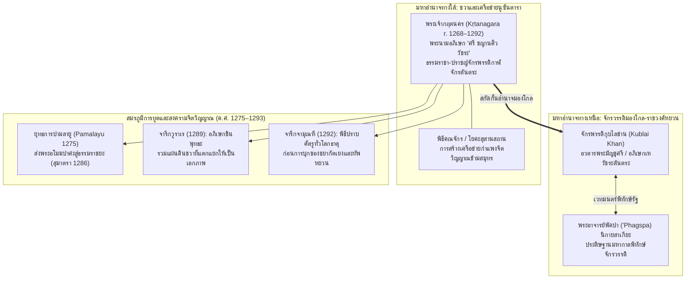
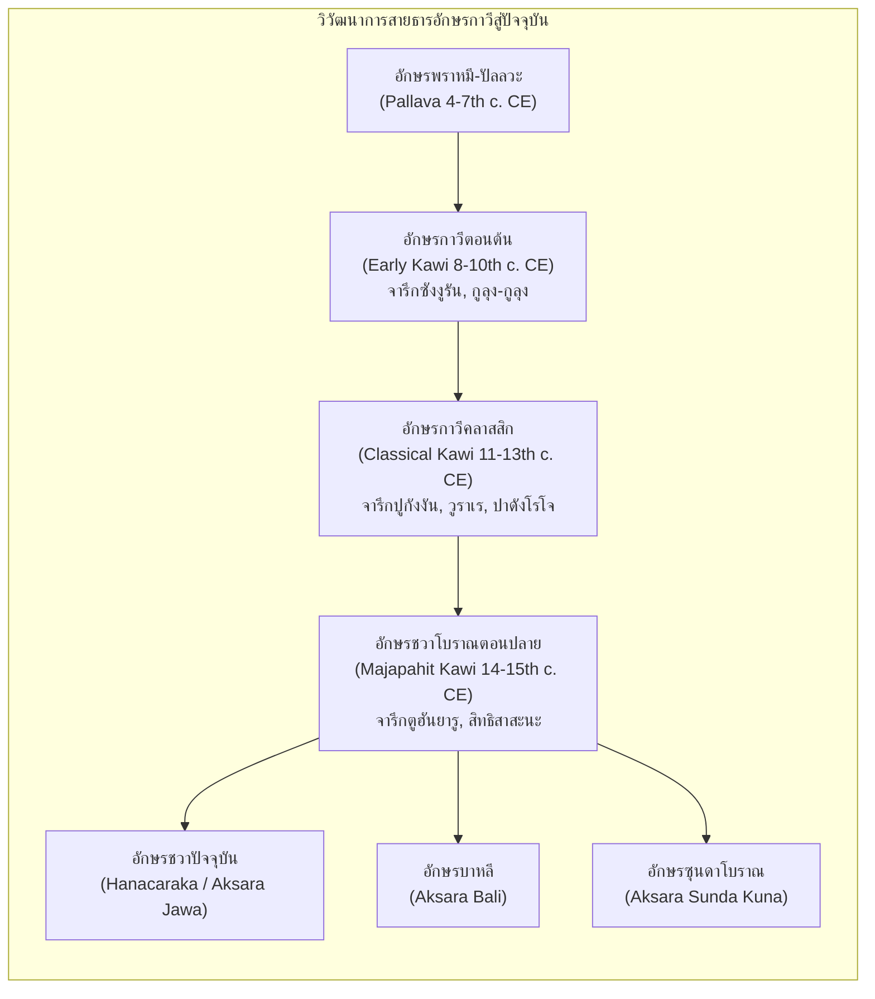

# บทที่ 4 การเปลี่ยนผ่านสู่ชวาตะวันออก: จากราชวงศ์อีศานะสู่มหาจักรวรรดิมัชปาหิต (คริสต์ศตวรรษที่ 10–15)
*(ตอนที่ 3: หัวข้อ 4.5, 4.6 และบทสรุปประจำบท)*

---

## 4.5 ศาสนจักรตันตระ การทูตข้ามสมุทร และสงครามจิตวิญญาณของพระเจ้ากฤตนคร (Kertanagara's Tantric Geopolitics ca. 1268–1292 CE)

### 4.5.1 การรื้อถอนประวัติศาสตร์นิพนธ์อาณานิคม: จากภาพตัวแทน "กษัตริย์มัวเมา" สู่ "ธรรมราชา-ปราชญ์จักรพรรดิ" แห่งลัทธิกาฬจักรตันตระ

การศึกษาประวัติศาสตร์และจารึกวิทยาว่าด้วยรัชสมัยของพระเจ้ากฤตนคร (Kertanagara หรือตามอักขรวิธีจารึกสะกด *Śrī Kṛtanagara* ทรงครองราชย์ ค.ศ. 1268–1292) ถือเป็นสมรภูมิทางประวัติศาสตร์นิพนธ์ (historiographical battleground) ที่สำคัญที่สุดแห่งหนึ่งในวงการอุษาคเนย์ศึกษา ตลอดช่วงคริสต์ศตวรรษที่ 19 ถึงต้นคริสต์ศตวรรษที่ 20 ประวัติศาสตร์นิพนธ์ยุคอาณานิคมของดัตช์ ซึ่งนำโดยนักบูรพคดีศึกษาคนสำคัญ อาทิ ยัน แบรนเดส (J.L.A. Brandes) และ นีกอลัส ยัน ครอม (N.J. Krom) ได้สถาปนาภาพตัวแทนของพระเจ้ากฤตนครในฐานะกษัตริย์ผู้ทรงลุ่มหลงมัวเมาในสุรา นารี และพิธีกรรมทางไสยศาสตร์ที่วิปริตผิดมนุษย์ จนละเลยราชการแผ่นดินและนำพาอาณาจักรสิงหัดส่าหรี (Singhasari) ไปสู่ความล่มสลายภายใต้การก่อกบฏของชยากัตเยง (Jayakatwang) เจ้าผู้ครองแคว้นกาดีรี (Kadiri) และการยกทัพมาของกองเรือจักรวรรดิมองโกล-หยวน [1] ภาพตัวแทนเชิงลบดังกล่าวถูกสร้างขึ้นจากการพึ่งพิงวรรณกรรมพื้นเมืองที่แต่งขึ้นในยุคหลังอย่าง *ปาราราตอน* (*Pararaton*) อย่างผิวเผิน โดยปราศจากการวิพากษ์หลักฐานเชิงเทววิทยาและบริบทแวดล้อมทางศาสนาร่วมสมัย

อย่างไรก็ดี พัฒนาการทางจารึกวิทยาและประวัติศาสตร์ศาสนาเปรียบเทียบตั้งแต่ปลายคริสต์ศตวรรษที่ 20 สืบเนื่องจนถึงทศวรรษ 2010–2020 โดยเฉพาะงานวิจัยบุกเบิกของ อันเดรอา อาครี (Andrea Acri), อาร์โล กริฟฟิทส์ (Arlo Griffiths) และคณะวิจัยโครงการ DHARMA ได้ทำการรื้อถอน (deconstruct) อคติยุคอาณานิคมดังกล่าวอย่างสิ้นเชิง [2] ผลการตรวจสอบหลักฐานจารึกปฐมภูมิร่วมสมัย ไม่ว่าจะเป็นจารึกราเมศวรปุระ (Rameswarapura ค.ศ. 1275), จารึกฐานพระอโมฆปาศะแห่งปาดังโรโจ (Padang Roco ค.ศ. 1286), จารึกวูราเร (Wurare ค.ศ. 1289) และจารึกจามุณฑี (Camundi ค.ศ. 1292) ประกอบกับการสอบทานคัมภีร์พุทธตันตระและวรรณกรรมราชสำนักร่วมสมัยอย่าง *เทศวรรณนา* (*Deśavarṇana* หรือ *Nāgarakṛtāgama*) บ่งชี้อย่างประจักษ์ชัดว่า พระเจ้ากฤตนครมิได้ทรงเป็นทรราชผู้มัวเมาในกามคุณ หากแต่ทรงเป็น "ธรรมราชา-ปราชญ์จักรพรรดิ" (Philosopher-King / *Rājarṣi*) ผู้ทรงรอบรู้ในคัมภีร์พระเวท ธรรมศาสตร์ และปรัชญาตันตรยานขั้นสูงอย่างแตกฉาน [3]

การปฏิบัติพิธีกรรมในสุสานสถาน (śmaśāna) การเสพสุราและอาหารสังเวยในพิธีคณจักร (gaṇacakra) ตลอดจนการประกอบพิธีทางเพศอันเป็นปริศนานั้น แท้จริงแล้วคือการบำเพ็ญ "โยคินีตันตระ" (Yoginītantra) และ "กาฬจักรตันตระ" (Kālacakra Tantra) ซึ่งแพร่หลายอย่างยิ่งในบรรดาศูนย์กลางพุทธศาสนาชั้นนำของเอเชีย เช่น มหาวิทยาลัยวิกรมศิลาในเบงกอล ราชสำนักทิเบต และแคว้นยูนนาน [4] ในโลกทัศน์ตันตรยานขั้นสูง การก้าวข้ามขั้วตรงข้ามแห่งความบริสุทธิ์และความแปดเปื้อนมิใช่การกระทำบาป หากแต่เป็นอุบายโกศล (upāyakauśalya) ในการเปลี่ยนผ่านพลังแห่งกิเลสให้กลายเป็นมหาปัญญาบริสุทธิ์ (jñāna) ยิ่งไปกว่านั้น ในมิติทางการเมือง พิธีกรรมตันตระดุร้ายเหล่านี้ทำหน้าที่เป็น "เทคโนโลยีทางเวทมนตร์คาถาเพื่อการพิทักษ์รัฐ" (Apotropaic War Magic / State-Protection Buddhism) พระองค์ทรงประกอบพิธีกรรมเหล่านี้เพื่อระดมพลังจิตวิญญาณระดับจักรวาลมาสถาปนา "สังสารวัฏจักรวรรดิ" อันเป็นเกราะกำแพงคุ้มครองเกาะชวาและนูซันตาราให้รอดพ้นจากภัยคุกคามข้ามสมุทรของจักรวรรดิมองโกลภายใต้การนำของกุบไลข่าน (Kublai Khan) ซึ่งในเวลาเดียวกันนั้น กุบไลข่านเองก็ทรงได้รับการอภิเษกในลัทธิเหวัชระตันตระ (Hevajra Tantra) และพุทธมหากาล (Mahākāla) จากพระอาจารย์พัคปา ('Phagspa) แห่งนิกายสาเกียะในทิเบตเช่นกัน [5]

---

### 4.5.2 จารึกราเมศวรปุระ (Rameswarapura 1197 Śaka / 1275 CE): อนุสรณ์สถานไจตยะและปรัชญาการผสานศิวะ-พุทธ

ในปีมหาศักราช 1197 (ตรงกับ ค.ศ. 1275) อันเป็นปีสำคัญที่ประวัติศาสตร์ระบุว่าเป็นจุดเริ่มต้นของ "ยุทธการปามลายู" (Pamalayu Expedition) พระเจ้ากฤตนครได้ทรงออกพระบรมราชโองการจารึกลงบนชุดแผ่นทองแดงขนาดใหญ่ที่รู้จักกันในนาม "จารึกราเมศวรปุระ" (Rameswarapura Inscription) ซึ่งได้รับการชำระและศึกษาวิเคราะห์อย่างละเอียดโดย อาร์โล กริฟฟิทส์ [6] จารึกหลักนี้เดิมประกอบด้วยแผ่นทองแดงมากถึง 16 แผ่น แม้ว่าในปัจจุบันบางแผ่นจะสูญหายไป แต่ส่วนบทนำและส่วนท้ายที่หลงเหลืออยู่ให้ข้อมูลเชิงลึกที่ไม่อาจประเมินค่าได้เกี่ยวกับเทววิทยาการเมือง โครงสร้างการปกครอง และการจัดการเขตสีมาของสิงหัดส่าหรี

สาระสำคัญของจารึกราเมศวรปุระเปิดฉากขึ้นด้วยการระบุพระนามเฉลิมพระปรมาภิไธยอย่างเต็มรูปแบบของพระเจ้ากฤตนครในฐานะมหาราชาธิราช (Rājādhirāja) ทรงมีพระนามเดิมว่า "ดยัฮ์ อูรทธวะชะ" (*Dyaḥ Ūrddhaja* หรือ *Mūrdhaja*) ทรงสืบเชื้อสายอันบริสุทธิ์จากพระราชบิดาคือพระเจ้าชัยศรีวิษณุวรรธนะ (Jayaśrī Viṣṇuvardhana) ผู้เปรียบประดุจพระอาทิตย์พันแสง และพระราชมารดาคือพระนางศรีชยวรรธนีเทวี (Śrī Jayavardhanīdevī) ผู้ทรงเปรียบประดุจมหาสมุทรที่ให้กำเนิดน้ำอมฤตจากการกวนเกษียรสมุทร [7] การออกจารึกฉบับนี้มีมูลเหตุประธาน (sambandha) มาจากการสถาปนาศาสนสถานอันศักดิ์สิทธิ์ที่เรียกว่า "สัง ฮยัง ธรรมะ ริ ศรี ราเมศวรปุระ" (*saṁ hyaṁ dharmma riṁ śrī rāmeśvarapura*) เพื่อทำหน้าที่เป็น "ไจตยะ" (caitya) หรืออนุสรณ์สถานอุทิศถวายแด่บูรพกษัตริย์และพระราชบิดาพระราชมารดาผู้ล่วงลับไปสู่เทวโลก

> **ตัวบทจารึกราเมศวรปุระ (แผ่นที่ 1 ด้านหลัง บรรทัด 1v1–1v8):** [8]
> 
> *“... svasti, śaka-varṣātīta, 1197, jyaiṣṭha-māsa, tithi, pañcadaśī śukla-pakṣa, tuṁ, po, ca, vāra gumr̥g·, Uttarastha-grahacāra, mūlā-nakṣatra, toya-devatā, vāyavya-maṇḍala, śukla-yoga, śveta-muhūrtta, viṣṭi-karaṇa, śaśī-parvveśa, mitthuna-rāśi, Irika divaśany ājñā śrī mahārāja rājādhirājā, dyaḥ Ūrddhaja, viṣṇu-kula-kamala-vana-rāja-haṅsa, saśeṣa-namitāri-bhūpāla-maṇi-makuṭa-gharṣita-śrī-pāda-pīṭha, sakala-sujana-hr̥daya-kumuda-vikāsa-karaṇa-sūryya-sadr̥śa, sapta-svarṇa-vasundharādhinātha-śiraḥ-kamala-matta-vāraṇa, An-avarata-rajata-kanaka-ratna-vastra-dāna-gaṅgā-pravāha-sannibha-kara, raṇa-raṅga-madhyāpratihata-bhuja-bala-bhīma, jaya-śrī-viṣṇuvarddhana-sahasra-kiraṇopama-sat-putra, śrīmat·-śrī-jayavarddhanī-devī-samudra-mandarācala-manthāna-mahāmr̥ta-maya, śrī kr̥tanagara-vikramadharmottuṅga-deva nāmarājābhiṣeka...”*
> 
> **คำแปลวิเคราะห์:**
> “ขอความสวัสดีจงมี! มหาศักราชล่วงไปแล้ว 1197 ปี เดือนเชษฐะ ดิถี 15 ค่ำ ศุกลปักษ์ (วันเพ็ญ) รอบวันตุงเล, ปอน, จันทร์, วูกูกุมรึก, พระเคราะห์สถิตทางทิศเหนือ, มูละนักษัตร, มีโตยเทวดา (พระอาโป) เป็นเทพรักษา, วายพยมณฑล, ศุกลโยคะ, เศวตมุหูรตะ, วิษฏิกะรณะ, ศศิบรรพเทศ, เมถุนราศี ในวันนั้น มีพระบรมราชโองการแห่งสมเด็จพระศรีมหาราชาธิราช ดยัฮ์ อูรทธวะชะ ผู้ทรงเป็นดั่งพญาหงส์ในดงบัวแห่งราชสกุลพระวิษณุ, ผู้ทรงมีตั่งรองพระบาทอันประกายแสงระยิบระยับด้วยการเสียดสีจากมงกุฎมณีของกษัตริย์อริราชศัตรูทั้งปวงที่ก้มลงกราบกราน, ผู้ทรงเปรียบประดุจพระอาทิตย์ที่ยังให้ดอกบัวในดวงใจของสัตบุรุษทั้งหลายเบ่งบาน, ผู้ทรงเปรียบประดุจพญาช้างสารตกมันเหนือดอกบัวคือเศียรของกษัตริย์ผู้ครองแผ่นดินทองทั้งเจ็ด, ผู้ทรงมีพระหัตถ์หลั่งพระราชทานเงิน ทองคำ รัตนมณี และผืนผ้าดั่งกระแสน้ำพระคงคาที่ไหลรินไม่ขาดสาย, ผู้ทรงมีพลานุภาพแห่งพระกรอันน่าเกรงขามไร้ผู้ต้านทานกลางสมรภูมิ, พระราชโอรสผู้ประเสริฐประดุจดวงสุริยาพันแสงแห่งพระเจ้าชัยศรีวิษณุวรรธนะ, ผู้ถือกำเนิดขึ้นประหนึ่งมหามฤตย์จากการกวนเกษียรสมุทรด้วยเขามันทระคือพระนางศรีชยวรรธนีเทวี, พระผู้ทรงมีพระนามราชาภิเษกว่า ศรี กฤตนคร วิกรมธรรโมตุงคเทวะ...”

ความโดดเด่นอย่างยิ่งของจารึกราเมศวรปุระในมิติประวัติศาสตร์ศาสนา คือการสะท้อนปรัชญาการสังเคราะห์แบบ "ศิวะ-พุทธ" (Śiva-Buddha Syncretism) อย่างเป็นรูปธรรม ในจารึกแผ่นที่ 11 ได้บันทึกว่าพระเจ้ากฤตนครทรงพระราชทานที่ดินเขตสีมาราเมศวรปุระแก่ผู้นำทางศาสนานามว่า "ศรี พรหมราชา ดัง ฮยัง ธรณีธร" (*śrī brahmarājā ḍaṁ hyaṁ dharaṇidhara*) ซึ่งมีสถานะเป็นทั้งปราชญ์ราชสำนักและประมุขแห่งศาสนสถาน โดยกำหนดให้ผลประโยชน์จากเขตสีมานี้ได้รับการแบ่งปันเพื่ออุปถัมภ์ทั้งนักบวชฝ่ายพราหมณ์-ไศวนิกาย (*para dvija*) และคณะสงฆ์ฝ่ายพุทธมหายาน (*para mpuṅku sogata*) อย่างเท่าเทียมกัน [9] การผสานสองขั้วศรัทธานี้มิใช่การประนีประนอมทางการเมืองเพียงชั่วคราว หากแต่วางอยู่บนฐานภววิทยา (ontology) ที่มองว่าพระศิวะและพระพุทธเจ้าทรงเป็นรูปสำแดงสองด้านของสัจธรรมสูงสุดอันเดียวกัน ซึ่งสอดรับกับข้อความในวรรณกรรม *กากาวิน สุตโสม* (*Kakawin Sutasoma*) ของเอ็มปู ตันตูลาร์ (Mpu Tantular) ในยุคมัชปาหิตที่ประกาศว่า *"ภินเนกา ตุงคัล อิกา"* (*Bhinneka Tunggal Ika* / แม้จะแตกต่างหลากหลายแต่ล้วนเป็นหนึ่งเดียว) [10]

นอกจากนี้ จารึกราเมศวรปุระยังเปิดเผยรายละเอียดอันมีค่ายิ่งเกี่ยวกับระบบเศรษฐกิจ ส่วยสาอากร และวิชาชีพช่างฝีมือในสมัยสิงหัดส่าหรี ตัวบทในแผ่นที่ 9 บันทึกการกำหนดขอบเขตภาษีและประเภทกิจการที่ได้รับอนุญาตให้ดำเนินการในเขตสีมาโดยไม่ต้องเสียส่วยแก่หลวง (*dravya haji*) ได้แก่ กิจการเรือเดินสมุทรและเรือลำเลียง (*parahu tuṅgal, banava tuṅgal*), ร้านค้าเครื่องประดับและสิ่งทอ, โรงช่างตีเหล็กสองเตาสูบ (*apaṇḍe vsi rvaṅ ububan*), ช่างทอง, ช่างเงิน, ช่างทองแดง ตลอดจนช่างวาดภาพเขียน (*alukis rvaṁ pajaran*) และคณะนักแสดงมหรสพ [11] ข้อมูลเหล่านี้พิสูจน์ว่า อาณาจักรสิงหัดส่าหรีในปลายศตวรรษที่ 13 มีระบบเศรษฐกิจการค้าและอุตสาหกรรมหัตถศิลป์ที่เจริญรุ่งเรืองอย่างยิ่ง เป็นฐานค้ำจุนโครงการขยายอำนาจทางทะเลของพระเจ้ากฤตนครในเวลาต่อมา

---

### 4.5.3 ศิลาจารึกวูราเร (Wurare 1211 Śaka / 1289 CE): มหาอักโษภยะ มหาฤๅษีภาราดา และการรวมแผ่นดินชวา

ในบรรดาจารึกทั้งหมดแห่งรัชสมัยพระเจ้ากฤตนคร "ศิลาจารึกวูราเร" (Wurare Inscription ศักราช 1211 มหาศักราช ตรงกับ ค.ศ. 1289) นับเป็นหลักฐานทางจารึกวิทยาและประวัติศาสตร์ความคิดที่ทรงพลังและลึกซึ้งที่สุด จารึกหลักนี้สลักด้วยภาษาสันสกฤตล้วนด้วยฉันทลักษณ์คลาสสิก (Anuṣṭubh) จำนวน 19 โศลก สลักวนรอบฐานหินรองรับประติมากรรมพระพุทธรูปปางมารวิชัยทรงเครื่องอย่างพระชินพุทธะมหาอักโษภยะ (Mahākṣobhya) ขนาดเท่าคนจริง ซึ่งชาวบ้านในท้องถิ่นปัจจุบันเรียกว่า "โจโก โดโลก" (Joko Dolog) ประดิษฐาน ณ ตำบลกันดังกัจจัน ใกล้เมืองสุราบายา เกาะชวาตะวันออก [12]

จารึกวูราเรได้รับการศึกษาและชำระตัวบทครั้งแรกโดยนักบูรพคดีศึกษาชาวดัตช์ เฮนดริก เคิร์น (H. Kern 1910, 1917) ต่อมาได้รับการวิพากษ์แก้ไขโดย ปูร์บาจารากา (Poerbatjaraka 1922), ดี.ซี. สิรการ์ (D.C. Sircar 1983) และได้รับการอ่านตรวจสอบความถูกต้องโดยตรงจากหลักหินจริงด้วยเทคโนโลยีสมัยใหม่โดย อาร์โล กริฟฟิทส์ ในโครงการ DHARMA [13] สาระสำคัญของจารึกนี้ประพันธ์ขึ้นโดยราชปุโรหิตหลวงผู้เชี่ยวชาญพระเวทและธรรมศาสตร์นามว่า "นาดะ" (*Nādajña*) ผู้ดำรงตำแหน่งเป็นธรรมัธยักษ์ (dharmmādhyakṣa) เพื่อเฉลิมฉลองวาระที่พระเจ้ากฤตนครทรงประกอบพิธีราชาภิเษกเป็นพระชินพุทธะ (Jinābhiṣeka) ณ ป่าช้าวูราเร (*śmaśāne vurare-nāmni*) โดยทรงเฉลิมพระนามอันศักดิ์สิทธิ์ว่า **"ศรี ชญานศิววัชระ"** (*Śrī Jñānaśivabajra*) [14]

คุณค่าสูงสุดของจารึกวูราเรในมิติประวัติศาสตร์นิพนธ์ คือการที่ตัวบทได้เชื่อมโยงการเมืองร่วมสมัยของสิงหัดส่าหรีเข้ากับเหตุการณ์ประวัติศาสตร์ครั้งพระเจ้าแอร์ลังกาเมื่อ 250 ปีก่อนหน้า โดยในโศลกที่ 3 ถึง 6 ได้พรรณนาถึงบทบาทของ "มหาฤๅษีภาราดา" (*Ārya Bharāḍa*) มหาเถระผู้บรรลุอภิญญาญาณแห่งพุทธศาสนา ผู้ซึ่งได้ใช้ "น้ำมนต์ศักดิ์สิทธิ์และวัชระจากหม้อน้ำมนต์" (*kumbha-bajrodakena vai*) ผ่าแบ่งแผ่นดินเกาะชวาออกเป็นสองส่วน คือ แคว้นชังกะละ (Jāṅgala) และแคว้นปัญจาลู (Pañjalu หรือกาดีรี) เพื่อยุติสงครามระหว่างพระราชโอรสสองพระองค์ของพระเจ้าแอร์ลังกา [15] จากนั้นในโศลกที่ 7 ถึง 12 จารึกได้ยกย่องสดุดีว่า พระเจ้าชัยศรีวิษณุวรรธนะและพระราชโอรสคือพระเจ้ากฤตนคร ได้ทรงประสานรอยร้าวและ "รวมแผ่นดินชวาทั้งสองส่วนให้กลับคืนเป็นเอกภาพอีกครั้งหนึ่ง" (*ekī-kr̥tya punar bhūmim*) เพื่อคุ้มครองพระธรรมและสร้างความผาสุกแก่มวลมนุษยชาติ

> **ตัวบทจารึกวูราเร (ภาษาสันสกฤต โศลกที่ 3–6 และ 9–13):** [16]
> 
> *“// yaḥ purā paṇḍitaś śreṣṭha, Āryyo bharāḍa-saṁjñakaḥ / jñāna-siddhiṁ samāgamyā, bhijñālābho munīśvaraḥ // 3 //*  
> *mahā-yogīśvaro dhīraḥ, satveṣu karuṇātmakaḥ / siddhācāryyo mahā-vīro, rāgādi-kleśa-varjjitaḥ // 4 //*  
> *ratnākara-pramāṇān tu, dvaidhī-kr̥tya yavāvanīm / kṣiti-bhedana-sāmarthya, kumbha-bajrodakena vai // 5 //*  
> *paraspara-virodhena, nr̥payor yuddha-kāṁkṣiṇoḥ / Etasmāj jāṅgalety eṣā, paṁjalu-viṣayā smr̥tā // 6 //*  
> *... Ekī-kr̥tya punar bhūmim, prīty-arthañ jagatāṁ sadā / dharmma-saṁrakṣaṇārtham vā, pitrādi-sthāpanāya ca // 9 //*  
> *yathaiva kṣiti-rājendraḥ, śrī-harivarddhanātmajaḥ / śrī-jayavarddhanī-putraḥ, catur-dvīpeśvaro muniḥ // 10 //*  
> *Aśeṣa-tatva-sampūrṇno, dharmma-śāstra-vidām varaḥ / jīrṇnoddhāra-kriyodyukto, dharmma-śāsana-deśakaḥ // 11 //*  
> *śrī-jñānaśivabajrākhyaḥ, citta-ratna-vibhūṣaṇaḥ / prajñā-raśmi-viśuddhāṅgas, sambodhi-jñāna-pāragaḥ // 12 //*  
> *subhaktyā tam pratiṣṭhāpya, svayam pūrvvam pratiṣṭhitam / śmaśāne vurare-nāmni, mahākṣobhyānurūpataḥ // 13 //”*
> 
> **คำแปลวิเคราะห์:**
> “(3) ผู้ใดในกาลก่อนคือมหาปราชญ์ผู้ประเสริฐเลิศล้ำ นามว่า พระอารยะภาราดา ผู้บรรลุความสำเร็จแห่งปัญญาญาณ ได้รับอภิญญาญาณ เป็นจอมแห่งมุนีทั้งหลาย (4) ผู้เป็นมหายาคีศวรผู้ทรงปรีชาญาณ เปี่ยมด้วยมหากรุณาในสรรพสัตว์ เป็นสิทธาจารย์ เป็นมหาวีระ ผู้ปราศจากกิเลสเครื่องเศร้าหมองมีราคะเป็นต้น (5) ได้ทำการผ่าแบ่งแผ่นดินชวาอันอุดมด้วยเหมืองรัตนมณีออกเป็นสองส่วน ด้วยอำนาจแห่งการแยกผืนปฐพีของน้ำมนต์วัชระจากหม้อน้ำมนต์ (6) อันเนื่องมาจากความขัดแย้งเป็นปฏิปักษ์ต่อกันของกษัตริย์สองพระองค์ผู้กระหายในสงคราม ด้วยเหตุดังกล่าว แผ่นดินนี้จึงได้ชื่อว่า ชังกะละ และมีแคว้นปัญจาลูเป็นดินแดน...  
> (9) [พระองค์] ทรงหลอมรวมแผ่นดินนี้ให้กลับเป็นหนึ่งเดียวอีกครั้งหนึ่ง เพื่อความรื่นรมย์ยินดีชั่วนิรันดร์ของโลกธาตุ หรือเพื่อการคุ้มครองพิทักษ์รักษาพระธรรม และเพื่อการสถาปนาถวายบูรพกษัตริย์มีพระราชบิดาเป็นต้น (10) สมเด็จพระราชาธิราชแห่งผืนปฐพี พระราชโอรสแห่งพระเจ้าศรีหริวรรธนะ (วิษณุวรรธนะ) พระราชโอรสแห่งพระนางศรีชยวรรธนี จอมมุนีผู้เป็นเจ้าแห่งสี่ทวีป (11) ผู้ทรงสมบูรณ์ด้วยตัตตวะ (หลักธรรม) ทั้งปวงอันหาเศษมิได้ เป็นเลิศในหมู่ผู้รู้ธรรมศาสตร์ ทรงขวนขวายในการปฏิสังขรณ์ศาสนสถาน (ชีรโณทธาระ) ทรงเป็นผู้ประกาศพระธรรมนูญแห่งกฎหมาย (12) ผู้ทรงมีพระนามปรากฏว่า **ศรี ชญานศิววัชระ** ผู้ประดับด้วยมณีแห่งจิต ทรงมีพระวรกายบริสุทธิ์ด้วยรัศมีแห่งปัญญา ทรงล่วงพ้นฝั่งแห่งสัมโพธิญาณ (13) ได้ทรงประดิษฐานรูปเคารพนั้นด้วยความภักดียิ่ง ณ ป่าช้าอันมีนามว่า วูราเร จำลองตามแบบแห่งพระมหาอักโษภยะ...”

ข้อความในจารึกวูราเรยืนยันอย่างชัดแจ้งถึงสถานะ "พุทธตันตระแบบวัชรยาน" ผสานกับ "ไศวนิกาย" ผ่านพระนามอภิเษก *Śrī Jñānaśivabajra* (ชญาน-ศิวะ-วัชระ) คำว่า "ชญานวัชระ" คือสารัตถะแห่งปัญญาในพุทธศาสนาวัชรยาน ขณะที่ "ศิวะ" คือการผนวกรวมพระผู้เป็นเจ้าสูงสุดของฝ่ายพราหมณ์เข้าไว้ในพระองค์ การประดิษฐานเทวรูปพระมหาอักโษภยะ ณ บริเวณป่าช้า (śmaśāna) สอดคล้องอย่างสมบูรณ์กับหลักการปฏิบัติโยคะในสายอนุตตรโยคะตันตระ (Anuttarayogatantra) ซึ่งถือว่าป่าช้าเป็นสถานที่บำเพ็ญเพียรอันประเสริฐที่สุดในการบรรลุสัจธรรมและการสั่งสมพลังเวทมนตร์อันไร้ขีดจำกัดเพื่อพิทักษ์จักรวรรดิ [17]

---

### 4.5.4 ยุทธการปามลายู (Pamalayu Expedition) และจารึกฐานพระอโมฆปาศะแห่งปาดังโรโจ สุมาตรา (Padang Roco 1208 Śaka / 1286 CE)

ในมิติภูมิรัฐศาสตร์ระหว่างประเทศ ปฏิบัติการที่ยิ่งใหญ่และมีผลกระทบข้ามภูมิภาคมากที่สุดในรัชสมัยพระเจ้ากฤตนคร คือ **"ยุทธการปามลายู"** (*Pamalayu Expedition*) ซึ่งเริ่มต้นขึ้นในมหาศักราช 1197 (ค.ศ. 1275) ดังที่ปรากฏใน *ปาราราตอน* และได้รับการยืนยันอย่างเป็นรูปธรรมผ่านหลักฐานจารึกวิทยาชิ้นเอก คือ **"จารึกฐานพระอโมฆปาศะแห่งปาดังโรโจ"** (Padang Roco Amoghapāśa Inscription) ศักราช 1208 มหาศักราช (ตรงกับวันที่ 22 สิงหาคม ค.ศ. 1286) ซึ่งค้นพบ ณ ริมฝั่งแม่น้ำบาตังฮารี (Batang Hari) แคว้นธรรมราชยะ (Dharmāśraya) ในจังหวัดสุมาตราตะวันตก [18]

นักวิชาการยุคอาณานิคมมักตีความยุทธการปามลายูว่าเป็นเพียงสงครามรุกรานทางทหารเพื่อยึดครองดินแดนสุมาตราของจักรวรรดิสิงหัดส่าหรี แต่การศึกษาวิเคราะห์จารึกปาดังโรโจร่วมกับบริบททางประวัติศาสตร์ข้ามภูมิภาคโดย อาร์โล กริฟฟิทส์ (2011, 2014, 2026) และ อันเดรอา อาครี (2016, 2022) ได้เปิดเผยมุมมองใหม่ที่ลึกซึ้งกว่านั้นอย่างมาก [19] ตัวบทจารึกที่สลักอยู่รอบฐานศิลาของประติมากรรมพระอโมฆปาศะโลเกศวร (Amoghapāśa Lokeśvara) ซึ่งจารึกด้วยภาษามลายูโบราณที่มีอิทธิพลภาษาชวาโบราณและมีโศลกภาษาสันสกฤตปิดท้าย มิได้ใช้โวหารแห่งการกดขี่หรือการบังคับสยบยอม หากแต่บันทึกเหตุการณ์การเฉลิมฉลองอันเปี่ยมสุขที่พระเจ้ากฤตนครได้ทรงส่งประติมากรรมพระพุทธตันตระพระอโมฆปาศะพร้อมด้วยคณะเทพบริวาร 14 องค์ (*caturdaśātmikā*) และสัตตรัตนะ (*sapta-ratna*) ข้ามทะเลจากชวาสู่สุวรรณภูมิ (สุมาตรา) เพื่อนำมาประดิษฐาน ณ มหาวิหารธรรมราชยะ

> **ตัวบทจารึกฐานพระอโมฆปาศะแห่งปาดังโรโจ (ภาษามลายูโบราณและสันสกฤต):** [20]
> 
> *“... svasti śaka-varṣātīta, 1208, bhādravāda-māsa, tithi pratipada śukla-pakṣa, mavulu, vāge, vr̥haspati-vāra, maḍaṅkuṅan·, grahacāra nairitistha, viśākā-nakṣatra, sakra-devatā... Inan· tatkāla pāduka bharāla Āryyāmoghapāśalokeśvara caturdaśātmikā sapta-ratna-sahita, diĀntat· dari bhūmi jāva ka svarṇnabhūmi dipratiṣṭa di dharmmāśraya, Akan· punya śrī viśvarūpakumāra, prakārandam ditītaḥ pāduka śrī mahārājādhirāja śrī kr̥tanagara vikramadharmmottuṅgadeva maṅiriṅkan· pāduka bharāla, rakryān· mahāmantri dyaḥ Advayabrahma, rakryān· srīkan· dyaḥ sugatabrahma, mūAṁ, samagat· payānan· haṅ dīpaṅkaradāsa, rakryān· damuṁ pu vīra, kunaṁ punyeni yogya diAnumodanā Oleḥ sakaprajā di bhūmi malāyu, brāhmaṇa kṣatriya vaiśya sūdra, Ācāryyopāddhyāya, śrī mahārāja śrīmat· tribhuvanarājamaulivarmmadeva pramukha, . Anena kuśalenāhaṁ, buddhatvam adhigamya ca, tārayeyañ jagat sarbam, agādhāt· bhava-sāgarāt·, .”*
> 
> **คำแปลวิเคราะห์:**
> “ขอความสวัสดีจงมี! มหาศักราชล่วงไปแล้ว 1208 ปี เดือนภัทรบท ดิถีขึ้น 1 ค่ำ ศุกลปักษ์ รอบวันมาวูลู, วาไก, พฤหัสบดี [ตรงกับวันที่ 22 สิงหาคม ค.ศ. 1286], วูกูมาดังคุงัน, พระเคราะห์สถิตทางทิศหรดี, วิศาขานักษัตร, มีพระอินทร์เป็นเทวรักษ์... ในกาลเวลานั้น องค์พระผู้เป็นเจ้า พระอารยอโมฆปาศโลเกศวร ผู้ทรงมีกายสิบสี่ (พร้อมบริวาร 13 องค์) ร่วมกับสัตตรัตนะ ได้รับการอัญเชิญนำพาจากแผ่นดินชวามาสู่สุวรรณภูมิ เพื่อประดิษฐาน ณ ธรรมราชยะ เพื่อเป็นกุศลสมภารแห่งพระศรีวิศวรูปกุมาร ตามพระบรมราชโองการที่พระบาทสมเด็จพระมหาราชาธิราช ศรีกฤตนคร วิกรมธรรโมตุงคเทวะ ทรงบัญชาให้บรรดาขุนนางชั้นผู้ใหญ่อัญเชิญองค์พระพุทธรูปศักดิ์สิทธิ์มา ได้แก่ ราเกรียน มหามนตรี ดยัฮ์ อัทวยพรหม, ราเกรียน ศรีกาน ดยัฮ์ สุคตพรหม, พร้อมด้วย สังคัต ปยานัน ฮัง ทีปังกรทาส, และ ราเกรียน เดอมุง ปู วีระ และกุศลกิจอันศักดิ์สิทธิ์นี้สมควรได้รับการอนุโมทนายินดีจากพสกนิกรทั้งปวงในแผ่นดินมลายู ทั้งพราหมณ์ กษัตริย์ แพศย์ ศูทร พระอาจารย์และอุปัชฌาย์ โดยมีสมเด็จพระมหาราชา ศรีมัต ตริภูวนราช เมาลิวรรโมเทวะ เป็นประมุข (โศลกสันสกฤต:) ‘ด้วยกุศลผลบุญนี้ ขอข้าพเจ้าจงบรรลุซึ่งพระพุทธภาวะ และช่วยรื้อขนสรรพสัตว์ทั้งปวงให้ข้ามพ้นจากห้วงมหรรณพแห่งสังสารวัฏอันหาที่หยั่งมิได้เทอญ!’”

ข้อความในจารึกนี้เผยให้เห็นโครงสร้างความสัมพันธ์ระหว่างสิงหัดส่าหรีกับมลายู-ธรรมราชยะได้อย่างกระจ่างแจ้ง:
1. **พระเจ้ากฤตนครทรงเฉลิมพระอิสริยยศเป็น "มหาราชาธิราช"** (*Mahārājādhirāja*) ขณะที่กษัตริย์แห่งมลายูคือ "ศรีมัต ตริภูวนราช เมาลิวรรโมเทวะ" (*Śrīmat Tribhuvanarājamaulivarmadeva*) ทรงดำรงพระยศเป็น "มหาราชา" (*Mahārāja*) แสดงถึงสถานะความเป็นเอกอัครพันธมิตรภายใต้ร่มเงาจักรพรรดิเดียวกัน
2. **การส่งขุนนางระดับสูงสุด 4 นายแห่งราชสำนักสิงหัดส่าหรี** นำโดย *Rakryān Mahāmantri Dyaḥ Advayabrahma* (ผู้ซึ่งต่อมาได้รับการยอมรับว่าเป็นบิดาของพระยาอาทิตยวรมัน) สะท้อนถึงการให้เกียรติทางการทูตในระดับสูงสุด มิใช่การส่งข้าหลวงไปปกครองเมืองขึ้น [21]
3. **การสร้างเครือข่ายความมั่นคงทางจิตวิญญาณแห่งหมู่เกาะ (Archipelagic Sacral Alliance):** เป้าหมายที่แท้จริงของยุทธการปามลายูมิใช่การยึดครอง แต่คือการผนึกกำลังระหว่างชวาและสุมาตราเข้าด้วยกันผ่าน "ลัทธิพระอโมฆปาศะ" ซึ่งเป็นพระโพธิสัตว์แห่งความเมตตาและผู้อภิบาลสันติสุข เพื่อปิดล้อมช่องแคบมะละกาและเส้นทางเดินเรือข้ามสมุทร สกัดกั้นมิให้ราชสำนักมองโกล-หยวนสามารถใช้ช่องแคบเป็นฐานรุกราน หรือบีบบังคับให้แคว้นต่างๆ ในคาบสมุทรยอมส่งบรรณาการ [22]

ความสัมพันธ์เชิงจิตวิญญาณนี้ยังทวีความลึกซึ้งยิ่งขึ้นเมื่อพิจารณาการค้นพบ **"ประติมากรรมหินรูปพระพุทธมหากาลขนาดยักษ์สูง 4.4 เมตรแห่งปาดังโรโจ"** (Colossal Mahākāla of Padang Roco / พิพิธภัณฑ์แห่งชาติอินโดนีเซีย หมายเลข 6468) ซึ่ง อันเดรอา อาครี และ อะเล็กซานดรา เวนตา (2022) ได้พิสูจน์ทางประติมานวิทยาว่า มิใช่รูปของพระยาอาทิตยวรมันตามข้อสมมติฐานเดิมของ Schnitger (1937) หากแต่เป็น **"เทวรูปอภิเษกแปลงรูปแทนพระองค์" (Deification Portrait Statue) ของพระเจ้ากฤตนคร** ที่สร้างขึ้นในแบบพระมหากาลปัญชรนาถ (*Pañjaranātha Mahākāla*) แห่งนิกายสาเกียะ ผสานกับฐานบัวหัวกะโหลกและลายผ้าจันทรกปาล (*candrakapāla*) แบบไศวะชวาตะวันออก ซึ่งมีความละม้ายคล้ายคลึงกับเทวรูปศิวะ-พุทธแห่งจันดิจาวี (Candi Jawi) ที่อันตรธานไปอย่างน่าอัศจรรย์ [23] เทวรูปยักษ์นี้คืออนุสรณ์แห่งสงครามจิตวิญญาณที่พระเจ้ากฤตนครทรงประดิษฐานไว้ ณ ปากประตูสู่สุมาตราเพื่อพิทักษ์โลกธาตุจากจักรวรรดิหยวน

---

### 4.5.5 จารึกจามุณฑี (Camundi 1214 Śaka / 1292 CE): พิธีกรรมไภรวะตันตระระดับสูงสุดและวาระสุดท้ายของสิงหัดส่าหรี

หลักฐานชิ้นสุดท้ายที่ปิดฉากรัชสมัยของพระเจ้ากฤตนครคือ **"จารึกจามุณฑี"** (Cāmuṇḍī Inscription ศักราช 1214 มหาศักราช ตรงกับ ค.ศ. 1292) ซึ่งสลักอยู่บนฐานประติมากรรมหินรูปพระแม่จามุณฑี (Cāmuṇḍī เทวีตันตระฝ่ายดุร้ายแห่งลัทธิไภรวะ) ค้นพบ ณ บริเวณไหล่เขาอาร์จูโน (Mount Arjuno) ใกล้กับสิงหัดส่าหรี ปัจจุบันเก็บรักษา ณ พิพิธภัณฑ์ตรอวูลัน [24]

ความโดดเด่นทางอักขรวิทยาของจารึกจามุณฑีอยู่ที่การใช้อักษรสองตระกูล โดยบรรทัดแรกจารึกด้วย **"อักษรนาครี" (Nāgarī script)** ในบทนมัสการภาษาสันสกฤตว่า `namaś cāmuṇḍyai` ("ขอนอบน้อมแด่พระแม่จามุณฑี") ซึ่งสะท้อนธรรมเนียมการใช้อักษรศักดิ์สิทธิ์สายอินเดียเหนือและเบงกอลสำหรับพิธีกรรมพุทธ-ไศวะตันตระ ขณะที่ข้อความส่วนที่เหลือสลักด้วยอักษรชวาโบราณ (Kawi) บันทึกวันเวลาทางดาราศาสตร์ในเดือนไจตรมาส มหาศักราช 1214 (มีนาคม–เมษายน ค.ศ. 1292) [25]

> **ตัวบทจารึกจามุณฑี (IAST):** [26]
> 
> *“0 namaś cāmuṇḍyai . 0 . svasti śaka-varṣātīta, 1214 caitra-māsa, tithi, caturdaśī kr̥ṣṇa-pakṣa, tu, va, vr̥, vāra, juluṁ pujut·, paścimastha grahacāra, Aśviṇī-nakṣatra, Aśvi-devatā, māhendra-maṇḍala, prīti-yoga, vairājya-muhūrtta, śākunī-karaṇa meśa-rāśī, . tatkāla kapratiṣṭān· pāduka bhaṭārī makatəvək· huvus· śrī mahārāja digvijaya riṁ sakala-loka manuyluyi sakala-dvīpāntara . śubham bhavatu .”*
> 
> **คำแปลวิเคราะห์:**
> “ขอนอบน้อมแด่พระแม่จามุณฑี! ขอความสวัสดีจงมี! มหาศักราชล่วงไปแล้ว 1214 ปี เดือนไจตระ ดิถี 14 ค่ำ กฤษณปักษ์ (แรม 14 ค่ำ) รอบวันตุนเกล, วาไก, พฤหัสบดี, วูกูจูลุง ปูจุต, พระเคราะห์สถิตทางทิศประจิม, อัศวินีนักษัตร, มีพระอัศวินเป็นเทวรักษ์, มเหนทรมณฑล, ปรีติโยคะ, ไวราชยมุหูรตะ, ศากุนีกะรณะ, เมษราศี ในกาลเวลานั้น มีการสถาปนาองค์พระแม่เจ้าภัตตารี (จามุณฑี) ขึ้น เพื่อเป็นหมุดหมายแห่งการที่สมเด็จพระศรีมหาราชาได้ทรงมีชัยชนะอันเด็ดขาดเหนือทั่วทั้งสากลโลก (*digvijaya riṅ sakala-loka*) แผ่ไพศาลไปทั่วทั้งดินแดนหมู่เกาะทั้งปวง (*sakala-dvīpāntara*) ขอความดีงามสวัสดีจงบังเกิดมีเทอญ!”

จารึกจามุณฑีถูกสลักขึ้นเพียงไม่กี่สัปดาห์หรือสองสามเดือนก่อนที่พระราชวังของพระเจ้ากฤตนครจะถูกกองทัพของชยากัตเยงแห่งกาดีรีบุกเข้าโจมตีแบบสายฟ้าแลบในเดือนเชษฐะ มหาศักราช 1214 (พฤษภาคม–มิถุนายน ค.ศ. 1292) จนนำไปสู่การสิ้นพระชนม์ของพระองค์ นักประวัติศาสตร์ในอดีตเคยตีความคำว่า *digvijaya riṅ sakala-loka* ในจารึกนี้อย่างเย้ยหยันว่าเป็นความหลงระเริงในชัยชนะจอมปลอมของกษัตริย์ที่กำลังจะสูญสิ้นบัลลังก์ [27]

ทว่าในมุมมองของจารึกวิทยาและเทววิทยาตันตระร่วมสมัย ข้อความดังกล่าวสะท้อนถึงการประกอบพิธี **"วศีกรณะ"** (Vaśīkaraṇa / การสะกดปราบศัตรูให้ยอมสยบ) และ **"อุจจาฏนะ"** (Uccāṭana / การขับไล่ทำลายอริราชศัตรู) ขั้นสูงสุดกลางสมรภูมิวิกฤต [28] พระเจ้ากฤตนครทรงตระหนักดีว่าเกาะชวากำลังเผชิญหน้ากับมหาศึกรอบด้าน ทั้งการเตรียมการยกทัพมาล้างแค้นของกองทัพเรือมองโกล 1,000 ลำที่กุบไลข่านสั่งระดมพลหลังพระองค์ทรงเฉือนหูเมิ่งฉี (Meng Qi) ทูตมองโกลผู้เข้ามาข่มขู่ใน ค.ศ. 1289 และการแปรพักตร์ของพันธมิตรภายในเกาะชวา การสถาปนาพระแม่จามุณฑี ณ ภูเขาศักดิ์สิทธิ์คือความพยายามทางจิตวิญญาณครั้งสุดท้ายในการระดมพลังจักรวาลเพื่อคุ้มครองแผ่นดิน แม้ว่าพระองค์จะสิ้นพระชนม์ในพระราชวัง แต่จิตวิญญาณแห่งการรวมแผ่นดินและเครือข่ายพันธมิตรที่พระองค์ทรงวางรากฐานไว้ ได้กลายเป็นมรดกตกทอดที่ทำให้พระราชบุตรเขยของพระองค์ คือ **ราเดน วิชัย** สามารถขับไล่กองทัพมองโกลและสถาปนามหาจักรวรรดิมัชปาหิตขึ้นสู่ความเกรียงไกรในเวลาต่อมา

---

## 4.6 ยุคทองมหาจักรวรรดิมัชปาหิต สถาบันรัฐ นิติกรรม และความสืบเนื่องทางจารึกวิทยา (The Golden Age of Majapahit, State Institutions, and Legal Epigraphy ca. 1293–ศตวรรษที่ 15)

### 4.6.1 การกอบกู้แผ่นดินของราเดน วิชัย และการสถาปนาราชวงศ์ราชสะ: จารึกกูดาดู (Kudadu 1294 CE) และจารึกอดัน-อดัน (Adan-Adan 1301 CE)

ภายหลังวิกฤตการณ์ปี ค.ศ. 1292 การสิ้นพระชนม์ของพระเจ้ากฤตนครมิได้นำไปสู่การฟื้นคืนอำนาจอย่างถาวรของราชวงศ์กาดีรีภายใต้ชยากัตเยง ทว่ากลับเป็นจุดเริ่มต้นของมหากาพย์การเมืองและการทหารอันแยบยลที่สุดในประวัติศาสตร์เอเชียตะวันออกเฉียงใต้ **ราเดน วิชัย** (*Rāden Wijaya*) หรือตามพระนามทางการในจารึกคือ **นรารยยะ สังครามวิชัย** (*Narāryya Saṅgrāmavijaya*) เจ้าชายผู้สืบสายโลหิตจากราชวงศ์ราชสะ (Rājasavaṃśa) และเป็นพระราชบุตรเขยของพระเจ้ากฤตนคร ได้ดำเนินกลยุทธ์ทางการทหารและการทูตอย่างชาญฉลาด พระองค์ทรงยอมสวามิภักดิ์ต่อชยากัตเยงในเบื้องแรกเพื่อขอพระราชทานที่ดินป่าทาริก (Tarik Forest) มาบุกเบิกเป็นชุมชนใหม่ ซึ่งต่อมาได้รับนามว่า "มัชปาหิต" (Majapahit / Wilwatikta) ตามชื่อของผลมะตูมที่มีรสขม [29]

เมื่อกองทัพเรือผสมมองโกล-จีนแห่งราชวงศ์หยวน นำโดยแม่ทัพซื่อปี้ (Shi-bi), เกาซิง (Gao Xing) และอิ๊กมู่ซือ (Ike Mese) เคลื่อนพลขึ้นฝั่งชวาตะวันออกในต้นปี ค.ศ. 1293 เพื่อลงทัณฑ์พระเจ้ากฤตนคร ราเดน วิชัย ได้ทรงใช้ประโยชน์จากกองทัพมองโกลในการเข้าบดขยี้กองทัพของชยากัตเยงแห่งกาดีรีจนราบคาบ จากนั้นจึงทรงฉวยโอกาสในจังหวะที่กองทัพมองโกลกำลังประมาท เปิดฉากโจมตีตลบหลังอย่างรวดเร็วและเด็ดขาด สังหารทหารมองโกลไปหลายพันนาย จนบีบให้แม่ทัพหยวนต้องถอยร่นลงเรือหนีกลับประเทศจีนไปอย่างอัปยศ [30] ชัยชนะสองชั้นนี้ส่งผลให้ราเดน วิชัย ปราบดาภิเษกขึ้นเป็นปฐมกษัตริย์แห่งมัชปาหิตในปลายปี ค.ศ. 1293 โดยทรงเฉลิมพระปรมาภิไธยว่า **"สมเด็จพระศรีมหาราชา กฤตราชัส ชยวรรธนะ"** (*Śrī Mahārāja Kṛtarājasa Jayawardhana*)

หลักฐานทางจารึกวิทยาปฐมภูมิที่บันทึกเหตุการณ์ประวัติศาสตร์ช่วงหัวเลี้ยวหัวต่อนี้ได้อย่างละเอียดถี่ถ้วนที่สุดคือ **"จารึกกูดาดู"** (Kudadu Inscription มหาศักราช 1216 ตรงกับ ค.ศ. 1294) จารึกบนแผ่นทองแดงฉบับนี้มีมูลเหตุประธาน (sambandha) มาจากการปูนบำเหน็จตอบแทนบุญคุณแก่ข้าราชบริพารและชาวบ้านตำบลกูดาดู (Kudadu) โดยเฉพาะผู้นำชุมชนคือ "รามา กูดาดู" (Rāma i Kudadu) ผู้ซึ่งได้เสี่ยงชีวิตถวายความช่วยเหลือ ที่พักพิง และเสบียงอาหารแก่ราเดน วิชัย ในยามที่พระองค์ต้องหลบหนีการตามล่าของกองทัพกาดีรีข้ามแม่น้ำและป่าเขา พระองค์จึงทรงพระราชทานสถานะ "เขตสีมาสวาตันตระ" (sīma swatantra) ให้แก่หมู่บ้านกูดาดู ยกเว้นภาษีหลวง ส่วยสาอากร และห้ามมิให้ข้าราชการสรรพากรเข้ามารบกวนอย่างเด็ดขาดชั่วลูกชั่วหลาน [31]

ความมั่นคงของราชวงศ์ใหม่ได้รับการตอกย้ำอีกครั้งใน **"จารึกอดัน-อดัน"** (Adan-Adan Inscription ศักราช 1223 มหาศักราช ตรงกับ ค.ศ. 1301) ซึ่งได้รับการตรวจสอบและชำระตัวบทดิจิทัลโดยคณะวิจัย DHARMA [32] จารึกแผ่นทองแดงชุดนี้แสดงให้เห็นความต่อเนื่องทางสายเลือดและสถาบันอำนาจระหว่างสิงหัดส่าหรีและมัชปาหิตอย่างสมบูรณ์แบบ โดยบันทึกว่าพระเจ้ากฤตราชัส ชยวรรธนะ ทรงประกอบพิธีอภิเษกสมรสกับพระราชธิดาทั้ง 4 พระองค์ของพระเจ้ากฤตนคร (*sakala-yava-dvīpa-maṇḍala-samudra-mandārācala-manthānopapanna-mahāmr̥tamaya*) ได้แก่:
1. พระนางศรี ปรเมศวรี ดยัฮ์ เทวี ตริภูวเนศวรี (*Śrī Parameśvarī Dyaḥ Devī Tribhuvaneśvarī*) พระอัครมเหสี
2. พระนางศรี มหาเทวี ดยัฮ์ เทวี นเรนทรทุหิตา (*Śrī Mahādevī Dyaḥ Devī Narendraduhitā*)
3. พระนางศรี ชเยนทรเทวี ดยัฮ์ เทวี ปรัชญาปารมิตา (*Śrī Jayendradevī Dyaḥ Devī Prajñāpāramitā*)
4. พระนางศรี ปาทุกะ ราชปัตนี ดยัฮ์ เทวี คายตรี (*Śrī Pāduka Rājapatnī Dyaḥ Devī Gāyatrī*) พระมเหสีผู้ทรงเสน่ห์และเปี่ยมด้วยปัญญาญาณ

> **ตัวบทจารึกอดัน-อดัน (แผ่นที่ 1v บรรทัด 1v1 ถึง แผ่นที่ 3r บรรทัด 3r4):** [33]
> 
> *“... svasti śaka-varṣātīta, 1223, śrāvaṇa-māsa, tithi pañcadaśī kr̥ṣṇa-pakṣa, ha, U, śa, vāra, maḍaṅkuṅan·, grahacāra bāyabyastha, māgha-nakṣatra, pitr̥-devatā, Āgneya-maṇḍala, śiva-yoga, vairāja-muhūrtta, yama-parvveśa, catuspada-karaṇa, siṅha-rāśī, Irika divaśany ājñā śrī mahārāja, narāryya saṅgrāmavijaya, raṇāṅgātura-para-paraspara-vīroṣadha-mahogravīra, sva-hasta-bala-bhīma-samasta-vairi-vara-vivarṇna-kampita-kāraṇa, saṅhāra-kāla-prajvalitānala-sadr̥śa-śrī-jayakatyaṅ-rājāti-ripu-vijaya, sakala-yava-dvīpa-maṇḍala-samudra-mandārācala-manthānopapanna-mahāmr̥tamaya, gaṅgā-pravāhā-samānānavarata-ratna-vastra-kanakādi-riktha-dāna-śakta, vyapagata-ghana-gagaṇa-tāra-gaṇākīrṇna-pūrṇna-śaśāṅka-nirbhinna-samasta-rāja-śaikhara, śrī kr̥tarājasa jayavarddhanānantavikramottuṅgadeva... catusprakāra-rājadevy-ānurūpa, sākṣāt devadevī śrī mahārāja mvaṁ sira rantən hajinira, rājaputrī paramātiśaya catuṣprakāra, bali-malayu-madhura-tañjuṅpura-prabhr̥ti, para-dvīpa-rāja-śiro-ghaṭita-caraṇāravinda-śrī-kr̥tanagara-mahāprabhu-sad-duhitā, sira ta kapāt· kapva suputrī de bhaṭāra śrīkr̥tanagara, sira saṁ līna ri śivabuddhālaya...”*
> 
> **คำแปลวิเคราะห์:**
> “ขอความสวัสดีจงมี! มหาศักราชล่วงไปแล้ว 1223 ปี เดือนศราวณะ แรม 15 ค่ำ กฤษณปักษ์ รอบวันฮารียัง, อูมานิส, เสาร์, วูกูมาดังคุงัน, พระเคราะห์สถิตทางทิศพายัพ, มาฆนักษัตร, มีปิตฤเทวดาเป็นเทวรักษ์, อาคเนยมณฑล, ศิวโยคะ, ไวราชมุหูรตะ, ยมบรรพเทศ, จตุสปทกะรณะ, สิงหราศี ในวันนั้น มีพระบรมราชโองการแห่งสมเด็จพระศรีมหาราชา นรารยยะ สังครามวิชัย ผู้ทรงเป็นมหาวีรบุรุษผู้น่าเกรงขามดั่งโอสถทิพย์รักษาเหล่านักรบที่บาดเจ็บในสมรภูมิ, ผู้ทรงมีพลังพระกรอันเข้มแข็งน่าสะพรึงกลัวอันเป็นเหตุให้ศัตรูทั้งปวงต้องตัวสั่นและซีดเผือด, ผู้ทรงพิชิตเหนืออริราชศัตรูผู้ยิ่งใหญ่คือเจ้าแคว้นศรีชยากัตเยงผู้ประดุจเปลวเพลิงที่ลุกโชนในกาลอวสานแห่งจักรวาล, ผู้ทรงหลอมรวมแว่นแคว้นทั่วทั้งมณฑลเกาะชวาประหนึ่งการบังเกิดแห่งมหามฤตย์จากการกวนเกษียรสมุทรด้วยเขามันทระ... สมเด็จพระศรี กฤตราชัส ชยวรรธนานันตวิกรมโมตุงคเทวะ... ผู้ทรงสมบูรณ์ด้วยพระราชเทวีทั้งสี่พระองค์ ประดุจเทพและเทวีที่เสด็จร่วมกัน พระราชธิดาอันประเสริฐยิ่งทั้งสี่ ผู้เป็นพระราชธิดาแห่งองค์พระศรีมหาราชกฤตนคร ผู้ทรงมีพระบาทประดุจบัวบานอันเป็นที่กราบไหว้ด้วยเศียรเกล้าของกษัตริย์แห่งเกาะโพ้นทะเลทั้งหลาย มี บาหลี มลายู มาดูรา และตันจุงปุระ เป็นต้น พระราชธิดาทั้งสี่ผู้เป็นหน่อเนื้ออันประเสริฐแห่งองค์ภัตตาระ ศรีกฤตนคร พระผู้เสด็จล่วงลับสู่ศิวพุทธาลัย...”

ข้อความในจารึกอดัน-อดันแสดงให้เห็นอย่างแจ้งชัดว่า การสถาปนามัชปาหิตมิใช่การตัดขาดจากสิงหัดส่าหรี หากแต่เป็นการสืบทอดความชอบธรรม (dynastic continuity) ผ่านการอภิเษกสมรสกับพระราชธิดาทั้งสี่ และการเชิดชูพระเกียรติของพระเจ้ากฤตนครในฐานะ "พระผู้สถิตในศิวพุทธาลัย" (*saṁ līna ri śivabuddhālaya*) ผู้ทรงแผ่พระราชอำนาจครอบคลุมดินแดนโพ้นทะเลทั้งปวง ยิ่งไปกว่านั้น จารึกยังบันทึกการสถาปนาพระราชโอรสองค์โต คือ เจ้าชายชยานคร (*Śrī Jayanagara*) ขึ้นดำรงตำแหน่งยุวราชผู้ครองแคว้นทาหา (*Dahapurapratiṣṭhita*) ซึ่งเป็นรูปแบบการบริหารรัฐแบบสหพันธรัฐเครือญาติที่สืบทอดมาจากสมัยสิงหัดส่าหรี

---

### 4.6.2 สถาบันราเกรียน มนตรี ริ ปะกิระ-กิรัน (Rakryān Mantri ri Pakira-kiran) ในจารึกตูฮันยารู (Tuhanyaru 1323 CE) และจารึกแผ่นทองแดงเบินดาสารี (Bendasari): นิติกรรมสัญญาและจารึกชยากรรม (Jayapatra)

เมื่อมหาจักรวรรดิมัชปาหิตก้าวเข้าสู่คริสต์ศตวรรษที่ 14 ภายใต้รัชสมัยของพระเจ้าชยานคร (ครองราชย์ ค.ศ. 1309–1328) และสมเด็จพระราชินีนาถตริภูวโนตุงคเทวี (ครองราชย์ ค.ศ. 1328–1350) โครงสร้างการบริหารราชการแผ่นดินและระบบกฎหมายได้มีวิวัฒนาการสู่ความเป็นสถาบันที่ซับซ้อนและมีเสถียรภาพสูงสุด สถาบันหลักที่เป็นกลไกขับเคลื่อนพระราชอำนาจและระเบียบกฎหมายคือ **"ราเกรียน มนตรี ริ ปะกิระ-กิรัน"** (*Rakryān Mantri ri Pakira-kiran*) หรือสภาเสนาบดีที่ปรึกษาราชการแผ่นดินสูงสุด ซึ่งทำหน้าที่ร่วมกับพระมหากษัตริย์ในการตราพระบรมราชโองการ การบริหารนโยบายรัฐ และการวินิจฉัยคดีความอรรถคดี [34]

โครงสร้างสายการบังคับบัญชาของสถาบันนี้ปรากฏอย่างชัดเจนที่สุดใน **"จารึกตูฮันยารู"** (Tuhanyaru Inscription ศักราช 1245 มหาศักราช ตรงกับ ค.ศ. 1323) จารึกบนแผ่นทองแดงที่ออกในรัชสมัยพระเจ้าชยานคร [35] ตัวบทจารึกได้จัดลำดับขั้นตอนการถ่ายทอดพระบรมราชโองการ (*ājñā haji*) ออกเป็น 3 ลำดับชั้นอย่างเป็นระบบ:
1. **ราเกรียน มหามนตรี กาตรีณี (*Rakryān Mahāmantri Katrīṇi*):** เสนาบดีผู้ใหญ่สามตำแหน่งชั้นสูงสุด ได้แก่ ราเกรียน มนตรี ฮิโน (*Hino*), ราเกรียน มนตรี ศรีกาน (*Sirikan*), และราเกรียน มนตรี ฮาลู (*Halu*) ซึ่งทำหน้าที่เป็นผู้รับพระบรมราชโองการโดยตรงจากพระมหากษัตริย์
2. **มหาปาติฮ์คู่แห่งสองราชธานี:** ได้แก่ ราเกรียน อปาติฮ์ ริ ทาหา (*Rakryān Apatiḥ riṁ Daha*) และ ราเกรียน อปาติฮ์ ริ มัชปาหิต (*Rakryān Apatiḥ riṁ Majapahit*) ซึ่งทำหน้าที่ประสานงานระหว่างศูนย์กลางมัชปาหิตกับแว่นแคว้นบริวารหลัก
3. **คณะเสนาบดีบริหาร (*Para Taṇḍa Rakryān riṁ Pakirakiran*):** ประกอบด้วยเสนาบดี 5 นาย (*Mantri Amancanagara*) ได้แก่ ราเกรียน เดอมุง (*Demung* - ฝ่ายพระราชวัง), ราเกรียน กานูรูฮัน (*Kanuruhan* - ฝ่ายพิธีการและราชเลขานุการ), ราเกรียน รังกา (*Rangga* - ฝ่ายตรวจการ), ราเกรียน ตูเมิงกุง (*Tumenggung* - ฝ่ายการทหารและความมั่นคง), และเสนาบดีฝ่ายตุลาการ

> **ตัวบทจารึกตูฮันยารู (แผ่นที่ 1r บรรทัด 1r3 ถึง แผ่นที่ 1v บรรทัด 1v6):** [36]
> 
> *“... Irikā divaśanyājñā pāduka śrī mahārāja, rājādhirāja parameśvara, śrī vīrākaṇḍagopāla, Abhaṅgarāhuttarāya... śrī sundarapāṇḍyadevādhīśvara nāma rājābhiṣeka, vikramottuṅgadeva, tinaḍaḥ de saṁ mantrī katriṇi, rakryan mantrī hino dyaḥ śrī raṅganātha, Arātibhayaṅkara, rakryan mantrī sirikan·, dyaḥ kāmeśvara, Aninditalakṣaṇa, rakryan mantrī halu, dyaḥ viśvanātha, avaryyanujabhīma, makapurassara rake tuhan mapatiḥ riṁ daha, dyaḥ puruṣeśvara... sameriṁ mvaṁ rake tuhan mapatiḥ riṁ majhapahit·, dyaḥ halāyudha, Agaṇitaguṇāninditalakṣaṇa, Umiṅsor i para taṇḍa rakryan riṁ pakirakiran makabehan·, rakryan· dmuṁ, pu samaya, raṇāṅgābhīrāma, rakryan kanuruhan·, pv anəkakan·, samarārisenāntaka, rakryan· raṅga, pu jalu, raṇānindyabala...”*
> 
> **คำแปลวิเคราะห์:**
> “ในวันนั้น มีพระบรมราชโองการแห่งสมเด็จพระศรีมหาราชาธิราช ปรเมศวร ผู้ทรงเป็นดั่งศรีวีรกัณฑโคปาล อภังคราหุตตราชา... พระผู้ทรงมีพระนามราชาภิเษกว่า ศรี สุนทรปัณฑยเทวาธีศวร วิกรมโมตุงคเทวะ รับพระบรมราชโองการโดยคณะเสนาบดีทั้งสาม ได้แก่ ราเกรียน มนตรี ฮิโน ดยัฮ์ ศรี รังคนาถ ผู้สร้างความหวาดกลัวแก่อริราชศัตรู, ราเกรียน มนตรี ศรีกาน ดยัฮ์ กาเมศวร ผู้มีคุณลักษณะอันไร้ที่ติ, ราเกรียน มนตรี ฮาลู ดยัฮ์ วิศวนาถ ผู้มีพลานุภาพอันน่าเกรงขาม โดยมีท่านผู้ครองตำแหน่งมหาปาติฮ์แห่งทาหา คือ ดยัฮ์ ปุรุเษศวร... เคียงคู่กับท่านผู้ครองตำแหน่งมหาปาติฮ์แห่งมัชปาหิต คือ ดยัฮ์ หลาอายุธ ผู้มีคุณธรรมอันหาที่สุดมิได้ ถ่ายทอดลงมาสู่เหล่าเสนาบดีขุนนางทั้งปวงในคณะราเกรียน ริ ปะกิระ-กิรัน อันมี ราเกรียน เดอมุง ปู สมัย ผู้สง่างามในสมรภูมิ, ราเกรียน กานูรูฮัน ปู อเนกะกัน ผู้ทำลายล้างกองทัพศัตรู, ราเกรียน รังกา ปู ชาลู ผู้มีกำลังพลอันเป็นเลิศ...”

นอกเหนือจากการบริหารราชการแผ่นดินทั่วไป สถาบันราเกรียน มนตรี ริ ปะกิระ-กิรัน ยังทำหน้าที่เป็น "ศาลหลวงสูงสุด" ในการวินิจฉัยคดีความแพ่งและอาญา ซึ่งก่อให้เกิดจารึกประเภทพิเศษที่เรียกว่า **"ชยากรรม"** (*Jayapatra* หรือ *Jayapatra-praśasti*) อันหมายถึง "หนังสือแสดงชัยชนะในคดีความ" หรือตราสารคำพิพากษาของศาลหลวง จารึกประเภทนี้ได้รับการศึกษาวิเคราะห์อย่างลึกซึ้งโดย ศ. เอ็ม. บุชารี และคณะ [37] ดังปรากฏใน **"จารึกแผ่นทองแดงเบินดาสารี"** (Bendasari Copperplate Inscription) และจารึกคดีความร่วมสมัย เช่น จารึกวูรูดู กีดุล (Wurudu Kidul)

จารึกเบินดาสารีบันทึกกระบวนการยุติธรรมของมัชปาหิตที่ดำเนินไปอย่างเคร่งครัดตามประมวลกฎหมาย **"กูตาระมานวะ"** (*Kūṭāra Mānava Dharmasastra*) ซึ่งดัดแปลงมาจากคัมภีร์มนูธรรมศาสตร์ของอินเดียให้สอดคล้องกับจารีตประเพณีชวา ในคดีความเรื่องการแย่งชิงกรรมสิทธิ์ที่ดิน มรดก และหนี้สิน คณะตุลาการหลวงซึ่งประกอบด้วย "สัง ปาเมกัต" (*Saṁ Pamegat / Samgat*) ผู้เชี่ยวชาญพระธรรมนูญ และ "ปราควิวากะ" (*Prāgvivāka* / ผู้พิพากษาหัวหน้าศาล) จะทำการไต่สวนพยานหลักฐานทั้งสองฝ่าย ตรวจสอบเอกสารสิทธิ์ดั้งเดิม (*prasasti tinuha*) และสอบสวนพยานบุคคลในท้องถิ่น เมื่อผลการพิสูจน์ความจริงปรากฏชัดว่าฝ่ายใดเป็นผู้ชนะ ศาลหลวงจะออกจารึกชยากรรมบนแผ่นทองแดง มอบให้แก่ผู้ชนะคดีเพื่อใช้เป็นหลักฐานทางกฎหมายถาวรที่ไม่อาจโต้แย้งได้ พร้อมทั้งระบุโทษปรับและคำสาปแช่งต่อผู้ที่คิดจะรื้อฟื้นคดีความขึ้นมาใหม่อีก [38] ระบบนิติกรรมสัญญาและจารึกชยากรรมนี้สะท้อนว่า สังคมมัชปาหิตเป็นสังคมที่ขับเคลื่อนด้วยหลักนิติรัฐ (rule of law) ที่มีสถาบันศาลและกระบวนการยุติธรรมอันเป็นระบบแบบแผนสูงยิ่ง

---

### 4.6.3 จารึกไจตยะคชามาดา / จารึกสิงหัดส่าหรี (Gajah Mada Caitya / Singhasari 1273 Śaka / 1351 CE): อนุสรณ์สถานแห่งความกตัญญูกตเวทิตาและความสืบเนื่องทางอุดมการณ์รัฐ

หมุดหมายสำคัญที่สุดแห่งยุคทองของมัชปาหิตในรัชสมัยของพระเจ้าฮายัม วูรุก (Hayam Wuruk หรือพระนามทางการคือ *Śrī Rājasanagara* ทรงครองราชย์ ค.ศ. 1350–1389) คือการปรากฏขึ้นของ **"จารึกไจตยะคชามาดา"** (Gajah Mada Caitya Inscription) หรือที่วงการจารึกวิทยาเรียกว่า "จารึกสิงหัดส่าหรี ค.ศ. 1351" ศักราช 1273 มหาศักราช (ตรงกับวันที่ 27 เมษายน ค.ศ. 1351) จารึกบนแผ่นหินแอนดีไซต์ทรงสี่เหลี่ยมนี้ถูกค้นพบ ณ บริเวณโบราณสถานสิงหัดส่าหรี ได้รับการปริวรรตและชำระตัวบทโดย ยัน แบรนเดส, เอ็น.เจ. ครอม และได้รับการตรวจสอบใหม่อย่างสมบูรณ์โดย อาร์โล กริฟฟิทส์ ในโครงการ DHARMA [39]

จารึกหลักนี้บันทึกเรื่องราวการสร้างอนุสรณ์สถานทางศาสนา (ไจตยะ) โดย **"มหาปาติฮ์ คชามาดา"** (*Rakryān Mapatiḥ Mpu Mada*) อัครมหาเสนาบดีผู้ยิ่งใหญ่ที่สุดในประวัติศาสตร์มัชปาหิต ผู้ซึ่งได้ลั่นคำสัตยาธิษฐานอันลือลั่นที่เรียกว่า "ปาลังกา ปาลาปา" (*Sumpah Palapa*) ว่าจะไม่ยอมเสพสุขส่วนตนจนกว่าจะรวบรวมดินแดนทั่วทั้งนูซันตาราให้อยู่ภายใต้ร่มเงาแห่งมัชปาหิตได้สำเร็จ [40]

ความสำคัญสูงสุดของจารึกไจตยะคชามาดาในเชิงอุดมการณ์รัฐ อยู่ที่การเชื่อมโยงความชอบธรรมของมัชปาหิตกลับไปยังสิงหัดส่าหรีอย่างลึกซึ้ง ตัวบทเริ่มต้นด้วยการระบุศักราชปีมหาศักราช 1214 (ค.ศ. 1292) อันเป็นวันเวลาที่พระเจ้ากฤตนครเสด็จสู่สวรรคาลัย (*kamoktan pāduka bhaṭāra saṁ lumaḥ ri śivabuddha*) จากนั้นจึงระบุศักราชปีมหาศักราช 1273 (ค.ศ. 1351) ซึ่งเป็นเวลา 59 ปีต่อมา บันทึกว่า มหาปาติฮ์ คชามาดา ได้รับพระบรมราชานุญาตผ่านคณะ "ภัตตาระ สัปตปรภู" (*Bhaṭāra Saptaprabhu*) นำโดยสมเด็จพระราชินีนาถตริภูวโนตุงคเทวี ผู้เป็นพระราชนัดดา (*potrikā*) แห่งพระเจ้ากฤตนคร ให้ดำเนินการก่อสร้าง "ไจตยะ" ขึ้น ณ สิงหัดส่าหรี เพื่ออุทิศถวายแด่พระเจ้ากฤตนคร ตลอดจนเหล่ามหาพราหมณ์ พระภิกษุสงฆ์ฝ่ายพุทธและไศวะ (*mahābrāhmāṇa, śeva sogata*) และข้าราชบริพารผู้ภักดี (*mahāvṛddhamantri*) ผู้ยอมสละชีวิตเคียงข้างเบื้องพระบาทของพระองค์ในเหตุการณ์กบฏชยากัตเยงเมื่อปี ค.ศ. 1292 [41]

> **ตัวบทจารึกไจตยะคชามาดา (ค.ศ. 1351 ฉบับชำระโดย Griffiths):** [42]
> 
> *“// 0 // I śaka, 1214, jyeṣṭa-māsa, Irika divaśani kamoktan· pāduka bhaṭāra saṁ lumaḥ ri śivabuddha // : //*  
> *svasti śrī śaka-varṣātīta, 1273, veśāka-māsa, tithi pratipāda śuklapakṣa, ha, po, bu, vara, tolu, niritistha-grahacāra, mr̥gaśira-nakṣatra, śaśi-devatā, bāyabya-maṇḍala, sobhana-yoga, śveta-muhūrtta, brahmā-parvveśa, kistughna-kāraṇa, vr̥ṣabha-rāśi,*  
> *Irika divaśa saṁ mahāmantrimukya, rakryan mapatiḥ mpu mada, sākṣāt· praṇāla kta rāsika de bhaṭāra saptaprabhu, makādi śrī tribhuvanotuṅgadevi mahārājasajayaviṣṇuvārddhani, potra potrikā de pāduka bhaṭāra śrī kr̥tanāgara jñāneśvarabajranāmābhiṣekā, samaṅkana tvək· rakryan mapatiḥ jīrṇnodhāra, makīrtti caitya ri mahābrāhmāṇa, śeva sogata, samāṅdulur i kamoktan· pāduka bhaṭāra, muvaḥ saṁ mahāvr̥ddhamantri līnā ri dagan· bhaṭāra, doniṁ caitya de rakryan· mapatiḥ paṅabhaktyanani santāna pratisantāna saṁ paramasatya ri pādadvaya bhaṭāra, Ika ta kīrtti rakryan mapatiḥ ri yavadvīpamaṇḍala //”*
> 
> **คำแปลวิเคราะห์:**
> “ในปีมหาศักราช 1214 เดือนเชษฐะ ในวันนั้น คือกาลแห่งการสู่อภิมหาโมกษะขององค์พระผู้เป็นเจ้า พระองค์ผู้เสด็จล่วงลับสู่แดนศิวะ-พุทธ (พระเจ้ากฤตนคร)  
> ขอความสวัสดีจงมี! มหาศักราชล่วงไปแล้ว 1273 ปี เดือนไวศาขะ ดิถี 1 ค่ำ ศุกลปักษ์ รอบวันฮารียัง, ปอน, พุธ, วูกูโตลู, พระเคราะห์สถิตทางทิศหรดี, มฤคศิรษนักษัตร, มีพระจันทร์เป็นเทวรักษ์, พายพยมณฑล, โศภนโยคะ, เศวตมุหูรตะ, พรหมบรรพเทศ, กิสตุฆนะกะรณะ, พฤษภราศี  
> ในวันนั้น องค์อัครมหาเสนาบดีชั้นสูงสุด ราเกรียน มหาปาติฮ์ เอ็มปู มาดา ผู้เปรียบประดุจสื่อกลางแห่งพระบรมราชโองการของคณะภัตตาระ สัปตปรภู นำโดย พระศรี ตริภูวโนตุงคเทวี มหาราชสชยวรรธนี ผู้เป็นพระราชนัดดาแห่งองค์พระบาทสมเด็จพระเจ้าอยู่หัว พระศรี กฤตนคร ผู้ทรงเฉลิมพระนามราชาภิเษกว่า ‘ชญาเนศวรวัชระ’ ในเวลานั้น ราเกรียน มหาปาติฮ์ ได้ทำการบูรณปฏิสังขรณ์ (ชีรโณทธาระ) สร้างสรรค์ไจตยะขึ้น เพื่ออุทิศถวายแด่เหล่ามหาพราหมณ์ พระภิกษุสงฆ์ฝ่ายไศวะและพุทธ ผู้ได้ดับขันธ์ล่วงลับไปพร้อมกับการสู่โมกษะขององค์พระผู้เป็นเจ้า และเพื่ออุทิศถวายแด่เหล่าข้าราชบริพารอาวุโสผู้ภักดียิ่ง ผู้ได้สละชีพลง ณ เบื้องพระบาทขององค์พระผู้เป็นเจ้า จุดมุ่งหมายแห่งการสร้างไจตยะโดยราเกรียนมหาปาติฮ์นี้ ก็เพื่อให้เป็นสถานที่แห่งการสักการะบูชาของอนุชนและทายาทสืบสายโลหิต ผู้มีความจงรักภักดีอันสูงสุดต่อเบื้องพระบาทยุคลขององค์พระผู้เป็นเจ้า นี่คือเกียรติประวัติและผลงานอันยิ่งใหญ่ของราเกรียนมหาปาติฮ์ในมณฑลเกาะชวา!”

การวิเคราะห์จารึกไจตยะคชามาดาเผยให้เห็นมิติด้านประวัติศาสตร์นิพนธ์ที่ลึกซึ้ง 3 ประการ:
1. **การเชิดชูพระเกียรติยศของพระเจ้ากฤตนครในฐานะ "พระมหาบรรพบุรุษศักดิ์สิทธิ์"** มหาปาติฮ์ คชามาดาและราชสำนักมัชปาหิตมิได้มองว่าพระเจ้ากฤตนครทรงเป็นกษัตริย์ที่ล้มเหลว หากแต่วางพระองค์ไว้ในฐานะพระมหากษัตริย์ผู้ทรงเสียสละชีวิตในสมรภูมิธรรม และเป็นต้นธารแห่งความชอบธรรมของจักรวรรดิมัชปาหิต
2. **การสถาปนามโนทัศน์เรื่อง "ความกตัญญูกตเวทิตาและความภักดีต่อแผ่นดิน"** การสร้างไจตยะมิได้อุทิศให้แก่พระมหากษัตริย์เพียงพระองค์เดียว แต่ระบุอย่างชัดเจนถึงการอุทิศให้แก่พระสงฆ์ พราหมณ์ และข้าราชบริพารชั้นผู้ใหญ่ที่เสียชีวิตเพื่อชาติ สะท้อนการปลูกฝังอุดมการณ์ความจงรักภักดีระดับชาติ (state loyalty) ในยุคทองของมัชปาหิต
3. **การตอกย้ำอำนาจหน้าที่ของสถาบันมหาปาติฮ์** คชามาดาแสดงบทบาทเป็นทั้ง "ผู้บริหารสูงสุด" และ "ผู้พิทักษ์ศาสนธรรม" (Dharmādhikāra) โดยจารึกระบุอย่างภาคภูมิใจในตอนท้ายว่า นี่คือเกียรติยศอันยิ่งใหญ่ของพระองค์ที่จารึกไว้ในมณฑลเกาะชวา (*kīrtti rakryan mapatiḥ ri yavadvīpamaṇḍala*)

---

### 4.6.4 สถาบันภัตตาระ สัปตปรภู (Bhaṭāra Saptaprabhu) สภาเครือญาติราชสำนัก และจารึกบาตูร์ (Batur 1373 CE)

มโนทัศน์เรื่องโครงสร้างอำนาจรัฐของมัชปาหิตมีความเป็นเอกลักษณ์อย่างยิ่งด้วยการดำรงอยู่ของสถาบัน **"ภัตตาระ สัปตปรภู"** (*Bhaṭāra Saptaprabhu*) หรือสภาเจ้านายผู้ปกครองเจ็ดพระองค์ ซึ่งปรากฏการกล่าวถึงทั้งในจารึกไจตยะคชามาดา (ค.ศ. 1351) และได้รับการยืนยันความต่อเนื่องใน **"จารึกบาตูร์"** (Batur Inscription ศักราช 1295 มหาศักราช ตรงกับ ค.ศ. 1373) ในรัชสมัยพระเจ้าฮายัม วูรุก [43]

สถาบันภัตตาระ สัปตปรภู คือสภาที่ปรึกษาระดับสูงสุดของราชวงศ์ ซึ่งประกอบด้วยสมาชิกราชวงศ์ผู้ใหญ่ที่เป็นสตรีและบุรุษที่มีสิทธิ์ในราชบัลลังก์ ได้แก่ พระราชชนนี (พระนางตริภูวโนตุงคเทวี), พระมาตุจฉา (พระนางราชเทวี มหาราชสา), พระราชบิดา, พระราชสวามี และเจ้านายผู้ครองแคว้นหลัก ภัตตาระ สัปตปรภูทำหน้าที่เป็น "คณะผู้พิทักษ์รัฐธรรมนูญราชวงศ์" (Dynastic Council) ที่คอยกำกับดูแลนโยบายความมั่นคง การสืบราชสมบัติ และการจัดสรรผลประโยชน์ทางเศรษฐกิจระหว่างแว่นแคว้นต่างๆ เพื่อป้องกันมิให้เกิดสงครามกลางเมืองและการแตกแยกของแผ่นดิน [44]

ในจารึกบาตูร์ (ค.ศ. 1373) ซึ่งชำระโดย มารีน เชิตแตล (Marine Schoettel) ได้พรรณนาถึงบทบาทของคณะมนตรีมหาเสนาบดีในยุคหลังอสัญกรรมของคชามาดา (คชามาดาถึงแก่อสัญกรรมใน ค.ศ. 1364) โดยแสดงให้เห็นว่า โครงสร้างการปกครองยังคงรักษาเสถียรภาพไว้ได้อย่างมั่นคง ตัวบทระบุรายนามขุนนางระดับสูงแห่งมัชปาหิต เช่น ราเกรียน อปาติฮ์ ริ กาฮูริปัน เอ็มปู ตันดิง (*Rakryan Apatiḥ riṁ Kahuripan Mpu Taṇḍiṁ*), ราเกรียน เดอมุง เอ็มปู กาปัต (*Pu Kapat*), ราเกรียน กานูรูฮัน เอ็มปู ปากิส (*Pu Pakis*), ราเกรียน รังกา, และราเกรียน ตูเมิงกุง เอ็มปู นาลา (*Mpu Nala* มหาแม่ทัพเรือผู้เลื่องชื่อ) พร้อมทั้งยังคงรำลึกถึงบทบาทในอดีตของ "เอ็มปู มาดา" ในฐานะอัครมหาเสนาบดีแห่งชังกะละและกาดีรี (*rakryan apatiḥ riṁ jaṅgala kaḍiri mpu mada*) ผู้ซึ่งเคยสถาปนาราชบัลลังก์ของพระศรีมหาราชาให้มั่นคงทั่วทั้งมณฑลเกาะชวาและเกาะแก่งโพ้นทะเล (*sayavadviīpa-maṇḍala-dvīpāntara*) [45] จารึกบาตูร์จึงเป็นประจักษ์พยานว่า อุดมการณ์รัฐและระบบการบริหารที่คชามาดาและราชสำนักมัชปาหิตสร้างขึ้น ได้หยั่งรากลึกจนกลายเป็นสถาบันถาวรที่ดำเนินสืบเนื่องต่อมา

---

### 4.6.5 วิวัฒนาการอักขรวิทยาและภาษาศาสตร์: จากอักษรกาวีคลาสสิกสู่อักษรชวาโบราณตอนปลาย (Majapahit Kawi)

ในมิติด้านอักขรวิทยา (palaeography) และภาษาศาสตร์ประวัติศาสตร์ (historical linguistics) การเปลี่ยนผ่านจากยุคสิงหัดส่าหรีสู่ยุคมัชปาหิตถือเป็นจุดหักเหครั้งสำคัญของพัฒนาการระบบตัวเขียนในอุษาคเนย์ภาคพื้นสมุทร ตลอดระยะเวลา 5 ศตวรรษนับแต่สมัยเอ็มปู สินดก ระบบตัวเขียนอักษรกาวีได้มีวิวัฒนาการผ่าน 3 ระยะสำคัญ:
1. **อักษรกาวีตอนต้น (Early Kawi คริสต์ศตวรรษที่ 8–10):** ตัวอักษรมีโครงสร้างสี่เหลี่ยม มน หนา และได้รับอิทธิพลอย่างสูงจากอักษรปัลลวะยุคปลาย
2. **อักษรกาวีคลาสสิก (Classical Kawi / Kadiri-Singhasari คริสต์ศตวรรษที่ 11–13):** เส้นสายมีความเป็นเรขาคณิตชัดเจน มีความประณีตสูง หัวอักษรเป็นรูปเหลี่ยมหรือหยักหนาม (quadratic/kruis-vormig) ดั่งที่ปรากฏในจารึกปูกังงันและจารึกยุคกาดีรี
3. **อักษรชวาโบราณตอนปลาย หรืออักษรมัชปาหิต (Late Old Javanese / Majapahit Kawi คริสต์ศตวรรษที่ 14–15):** มีการเปลี่ยนแปลงสัณฐานวิทยาอย่างก้าวกระโดด [46]

ลักษณะเด่นทางสัณฐานวิทยาของอักษรชวาโบราณยุคมัชปาหิต (Majapahit Kawi) ที่ปรากฏในจารึกแผ่นทองแดงตูฮันยารู, จารึกเบินดาสารี และจารึกหินสิงหัดส่าหรี ได้แก่:
- **การเพิ่มเส้นหางตวัดและการลากเส้นตวัดโค้ง (flourishes and cursive strokes):** ช่างจารึกเริ่มละทิ้งความเหลี่ยมแข็งของอักษรยุคกาดีรี แล้วหันมาใช้เส้นโค้งตวัดที่มีลักษณะคล้ายลวดลายประดับ (decorative calligraphy) โดยเฉพาะหางของสระอา (ālirṅan), สระอี, และพยัญชนะตระกูลที่มีหางลากลง เช่น *ya*, *ra*, *ka*
- **การลดทอนรูปอักษรและการเชื่อมเส้น (ligature simplification):** พยัญชนะซ้อนรูป (saṁyoga) เริ่มมีการลดรูปเพื่อความรวดเร็วในการจารึกบนแผ่นทองแดงและใบลาน (lontar)
- **การปรากฏตัวของรูปอักษรต้นธารของอักษรบาหลีและอักษรชวาปัจจุบัน:** โครงสร้างตัวอักษรของมัชปาหิตมีความใกล้เคียงอย่างยิ่งกับอักษรชวาแบบ "ฮานาจารากา" (*Hanacaraka*) และอักษรบาหลี (*Aksara Bali*) โดยเฉพาะการรักษารูปแบบเชิงพยัญชนะ (gantungan และ pañcetan) ที่ยังคงใช้สืบเนื่องมาจนถึงปัจจุบัน [47]

ในมิติทางภาษา ภาษาชวาโบราณยุคมัชปาหิตได้คลายตัวจากโครงสร้างทางไวยากรณ์ภาษาสันสกฤตที่เคร่งครัด แม้ว่าในส่วนบทสรรเสริญพระเกียรติยศ (praśasti) จะยังคงใช้ศัพท์สมาสสันสกฤตขนาดยาวเพื่อแสดงความโอ่อ่าอลังการ แต่ในส่วนเนื้อความนิติกรรม การกำหนดเขตแดน และคำพิพากษาคดีความ ได้เปลี่ยนมาใช้สำนวนภาษาชวาโบราณแท้ที่มีไวยากรณ์เรียบง่าย ชัดเจน และสอดรับกับวิถีชีวิตจริงของราษฎร สะท้อนถึงการหยั่งรากทางวัฒนธรรมที่มั่นคงของสังคมชวาโบราณที่ไม่จำเป็นต้องพึ่งพิงกรอบภาษาจากอินเดียอีกต่อไป

---

## บทสรุปประจำบทที่ 4 (Conclusion of Chapter 4)

การศึกษาวิวัฒนาการของจารึกวิทยาและสถาบันอำนาจรัฐในชวาตะวันออกตลอดระยะเวลา 5 ศตวรรษ (นับแต่การสถาปนาราชวงศ์อีศานะโดยพระเจ้าเอ็มปู สินดก ในปี ค.ศ. 929 ผ่านยุคกอบกู้แผ่นดินของพระเจ้าแอร์ลังกา ยุคอาณาจักรแฝงกาดีรี-ชังกะละ ยุคจักรวรรดิตันตระสิงหัดส่าหรี จนถึงยุคทองแห่งมหาจักรวรรดิมัชปาหิตในคริสต์ศตวรรษที่ 14–15) เผยให้เห็นประจักษ์พยานแห่งการสังเคราะห์อารยธรรมที่ยิ่งใหญ่และมีความเป็นตัวของตัวเองอย่างเด่นชัดที่สุดในประวัติศาสตร์เอเชียตะวันออกเฉียงใต้ภาคพื้นสมุทร

พัฒนาการอันยาวนานนี้วางอยู่บนเสาหลักสำคัญ 3 ประการ:
1. **การบูรณาการระบบนิเวศเศรษฐกิจแบบทวิลักษณ์:** ชวาตะวันออกประสบความสำเร็จในการเชื่อมโยง "ฐานการผลิตข้าวเกษตรกรรมชลประทานอันมหาศาลในเขตที่ราบลุ่มน้ำบรันตัสและเบงงาวันโซโลตอนใน" เข้ากับ "เครือข่ายการค้าทางทะเลข้ามสมุทรผ่านเมืองท่าปากแม่น้ำ เช่น ฮูจุงกาลูห์ (Hujung Galuh) และสุราบายา" ดังที่จารึกกมลากยัน (ค.ศ. 1037) ได้แสดงให้เห็นผ่านการสร้างเขื่อนวริงินสัปตะเพื่อควบคุมสายน้ำบรันตัสให้เป็นทั้งอู่ข้าวอู่น้ำและทางหลวงน้ำพาณิชย์เชื่อมสู่ทะเลจีนใต้และมหาสมุทรอินเดีย
2. **วิวัฒนาการสถาบันรัฐและระบบนิติธรรม:** รัฐในชวาตะวันออกได้พัฒนาจากระบบราชาธิปไตยแบบดั้งเดิมไปสู่ระบบ "สหพันธรัฐเครือญาติ" (Familial Mandala Federation) ในสมัยสิงหัดส่าหรีและมัชปาหิต มีการกระจายอำนาจให้เจ้านายเครือญาติไปปกครองหัวเมืองสำคัญ พร้อมทั้งสถาปนาสถาบันสภาเสนาบดี "ราเกรียน มนตรี ริ ปะกิระ-กิรัน", สถาบันสภาเครือญาติ "ภัตตาระ สัปตปรภู", และระบบตุลาการที่บังคับใช้ประมวลกฎหมายกูตาระมานวะอย่างเป็นระบบ โดยมีจารึกสิทธิสภาพยกเว้นภาษี (sīma) และจารึกคำพิพากษาคดีความ (jayapatra) ทำหน้าที่เป็นหลักประกันทางกฎหมายแก่ราษฎรและศาสนสถาน
3. **เทววิทยาการเมืองตันตรยานและอุดมการณ์เอกภาพแห่งนูซันตารา:** ปรากฏการณ์ที่โดดเด่นที่สุดคือการหลอมรวมปรัชญา "ศิวะ-พุทธ" (Śiva-Buddha) และการประยุกต์ใช้พุทธตันตระกาฬจักรเป็นอุดมการณ์รัฐสูงสุดของพระเจ้ากฤตนคร ซึ่งมิได้เป็นเพียงความเชื่อส่วนพระองค์ หากแต่ถูกใช้เป็น "ยุทธศาสตร์การเมืองและจิตวิญญาณข้ามสมุทร" ในการรวมแผ่นดินชวาที่แตกแยกให้กลับเป็นหนึ่งเดียว และสร้างเครือข่ายพันธมิตรทางทะเลกับสุมาตราผ่านยุทธการปามลายู เพื่อสกัดกั้นการแผ่อำนาจของมหาอำนาจมองโกล-หยวน อุดมการณ์เอกภาพนี้ได้รับการสืบทอดและต่อยอดโดยมหาปาติฮ์ คชามาดา แห่งมัชปาหิต จนกลายเป็นรากฐานความคิดเรื่อง "เอกภาพแห่งความหลากหลาย" (Bhinneka Tunggal Ika) ที่ยังคงเป็นเสาหลักค้ำจุนอัตลักษณ์ของชาติอินโดนีเซียตราบจนถึงปัจจุบัน

---

## รายการเชิงอรรถอ้างอิง (Notes)

[1] ข้อวิเคราะห์ประวัติศาสตร์นิพนธ์ยุคอาณานิคมที่บิดเบือนภาพลักษณ์พระเจ้ากฤตนคร ดูใน J.L.A. Brandes, *Tjandi Singasari en de Wolkentoneelen van Panataran* (Batavia: Albrecht & Co., 1909), 12–28; N.J. Krom, *Hindoe-Javaansche Geschiedenis*, 2nd ed. ('s-Gravenhage: Martinus Nijhoff, 1931), 325–340.

[2] การรื้อถอนประวัติศาสตร์นิพนธ์อาณานิคมและการพิสูจน์สถานะปราชญ์ตันตระของพระเจ้ากฤตนคร ดูใน Andrea Acri and Aleksandra Wenta, "A Buddhist Bhairava? Kṛtanagara’s Tantric Buddhism in Transregional Perspective," *Entangled Religions* 13, no. 7 (2022): 1–46; Arlo Griffiths, "Inscriptions of Sumatra, II. Short Epigraphs in Old Javanese and Old Malay from Muara Jambi," *Wacana, Journal of the Humanities of Indonesia* 15, no. 2 (2014): 197–215.

[3] ดูข้อวิเคราะห์เปรียบเทียบใน Andrea Acri, "Revisiting the Cult of ‘Śiva-Buddha’ in Java and Bali," in *Buddhist Dynamics in Premodern and Early Modern Southeast Asia*, ed. Christian Lammerts (Singapore: ISEAS–Yusof Ishak Institute, 2015), 261–282.

[4] สารัตถะแห่งคัมภีร์กาฬจักรตันตระและโยคินีตันตระในบริบทชวา ดูใน Acri and Wenta, "A Buddhist Bhairava?," 8–11; cf. Alexis Sanderson, "The Śaiva Age: The Rise and Dominance of Śaivism during the Early Medieval Period," in *Genesis and Development of Tantrism*, ed. Shingo Einoo (Tokyo: Institute of Oriental Culture, University of Tokyo, 2009), 41–350.

[5] บทบาทของพระอาจารย์พัคปาและลัทธิมหากาลในราชสำนักกุบไลข่านเปรียบเทียบกับพระเจ้ากฤตนคร ดูใน Herbert Franke, "From Bātsa to Anton: The Mongol Emperors and Tibetan Buddhism," in *China under Mongol Rule*, ed. John D. Langlois (Princeton: Princeton University Press, 1981), 296–328; อ้างใน Acri and Wenta, "A Buddhist Bhairava?," 29–34.

[6] การชำระตัวบทและวิเคราะห์จารึกราเมศวรปุระ ดูใน Arlo Griffiths, *The Rameswarapura Inscription of Kṛtanagara (1197 Śaka)*, Digital Critical Edition, DHARMA Corpus of Nusantara Epigraphy (INSIDENKRameswarapura.xml), European Research Council Synergy Project DHARMA (ERC no. 809994), 2020–2025.

[7] Griffiths, *The Rameswarapura Inscription*, plate 1v, lines 1v3–1v8.

[8] ตัวบทปริวรรตอักษร IAST ถอดจากไฟล์ดิจิทัลมาตรฐาน DHARMA_INSIDENKRameswarapura.xml, plate 1v, lines 1v1–1v8.

[9] Griffiths, *The Rameswarapura Inscription*, plate 11v, lines 11v1–11v3; cf. Hadi Sidomulyo, "From Antiquity to the Modern Age: Notes on the Toponymy of the Singhasari Inscriptions," *Archipel* 96 (2018): 45–74.

[10] Mpu Tantular, *Kakawin Sutasoma*, ed. and trans. Soewito Santoso (New Delhi: International Academy of Indian Culture, 1975), canto 139, stanza 5.

[11] รายละเอียดทางเศรษฐกิจและรายนามช่างฝีมือ ดูใน DHARMA_INSIDENKRameswarapura.xml, plate 9r–9v, lines 9r4–9v8.

[12] บริบทการค้นพบและลักษณะทางกายภาพของศิลาจารึกวูราเร ดูใน Hendrik Kern, "Het Sanskrit-inschrift op den Mahākṣobhya te Simpang (Soerabaya, 1211 Śāka)," *Bijdragen tot de Taal-, Land- en Volkenkunde van Nederlandsch-Indië* 64 (1910): 171–181; จัดพิมพ์ซ้ำพร้อมแก้ไขใน Hendrik Kern, *Verspreide Geschriften*, vol. 7 ('s-Gravenhage: Martinus Nijhoff, 1917), 187–199.

[13] การตรวจสอบและชำระตัวบทจารึกวูราเรฉบับล่าสุด ดูใน Arlo Griffiths, *Wurare Inscription of King Kṛtanagara (1211 Śaka)*, Digital Critical Edition, DHARMA Corpus of Nusantara Epigraphy (INSIDENKWurare.xml), European Research Council (ERC no. 809994), 2020–2025; Poerbatjaraka, "De inscriptie van het Mahaksobhya-beeld te Simpang (Soerabaia)," *Bijdragen tot de Taal-, Land- en Volkenkunde van Nederlandsch-Indië* 78 (1922): 426–462.

[14] DHARMA_INSIDENKWurare.xml, stanza 12–13 and 18–19.

[15] การวิเคราะห์บทบาทของมหาฤๅษีภาราดาในการแบ่งดินแดน ดูใน Boechari, "Śrī Mahārāja Mapañji Garasakan: New Evidence on the Problem of Airlangga's Partition of His Kingdom," in *Melacak Sejarah Kuno Indonesia Lewat Prasasti* (Jakarta: KPG, 2012), 265–288; cf. Hadi Sidomulyo, "Airlangga’s Island: The Toponymy of East Java in the 11th Century," *Archipel* 79 (2010): 125–158.

[16] ตัวบทภาษาสันสกฤตโศลกที่ 3–6 และ 9–13 ปริวรรตตามระบบ IAST จาก DHARMA_INSIDENKWurare.xml, lines 3–6, 9–13; เทียบเคียงคำแปลภาษาอังกฤษของ Arlo Griffiths.

[17] มิติการบำเพ็ญตันตระในป่าช้า ดูใน Andrea Acri, "More on the Ratu Boko Mantra: Magic, Realpolitik, and Bauddha-Śaiva Dynamics in Ancient Nusantara," in *Esoteric Buddhism in Mediaeval Maritime Asia: Networks of Masters, Texts, Icons*, ed. Andrea Acri (Singapore: ISEAS–Yusof Ishak Institute, 2016), 333–358.

[18] บริบทการค้นพบจารึกปาดังโรโจ ดูใน N.J. Krom, "Een Sumatraansche Inscriptie van Koning Kṛtanagara," *Verslagen en Mededeelingen der Koninklijke Akademie van Wetenschappen, Afdeeling Letterkunde* 5, no. 2 (1917): 306–339; L.-C. Damais, "Études d'épigraphie indonésienne, IV: Discussion de la date des inscriptions," *Bulletin de l'École française d'Extrême-Orient* 47, no. 1 (1955): 99–101.

[19] การประเมินยุทธการปามลายูใหม่ ดูใน Arlo Griffiths, "Inscriptions of Sumatra: II. Further Epigraphical Notes on Muara Jambi and the Hinterland of Batang Hari," in *Dharmasraya: Capital of the Malayu Kingdom in the 13th–14th Centuries*, ed. Bambang Budi Utomo (Jakarta: Ministry of Culture and Tourism, 2011), 115–138; Acri and Wenta, "A Buddhist Bhairava?," 20–26.

[20] ตัวบทภาษามลายูโบราณและสันสกฤต ถอดตามระบบสากล IAST จากไฟล์ชำระดิจิทัล DHARMA_INSIDENK00007.xml (Dharmasraya A - Padang Roco Amoghapāśa base), lines 1–4 and concluding stanza, edited by Arlo Griffiths (2026).

[21] บทบาทของราเกรียน มหามนตรี ดยัฮ์ อัทวยพรหม ดูใน Boechari, "Kerajaan Melayu Dharmasraya dan Tokoh Adityawarman," in *Melacak Sejarah Kuno Indonesia Lewat Prasasti*, 417–444; cf. Griffiths, "Inscriptions of Sumatra: II," 122–125.

[22] ดูการวิเคราะห์เชิงยุทธศาสตร์ภูมิรัฐศาสตร์ใน Jan Wisseman Christie, "Asian Sea Trade between the Tenth and Thirteenth Centuries and Its Impact on the States of Java and Bali," in *Archaeology of Seafaring: The Indian Ocean in the Ancient Period*, ed. Himanshu Prabha Ray (New Delhi: Pragati Publications, 1999), 221–270.

[23] การจำแนกประติมานวิทยาเทวรูปมหากาลปาดังโรโจและการเชื่อมโยงกับจันดิจาวี ดูอย่างละเอียดใน Acri and Wenta, "A Buddhist Bhairava?," 11–25.

[24] การอ่านและบริบทของจารึกจามุณฑี ดูใน J.L.A. Brandes, *Oud-Javaansche Oorkonden: Nagelaten Transscripties*, ed. N.J. Krom, Verhandelingen van het Bataviaasch Genootschap van Kunsten en Wetenschappen 60 (Batavia: Albrecht & Co., 1913), 221 (OJO LXXX); Acri and Wenta, "A Buddhist Bhairava?," 5.

[25] การตรวจสอบอักขรวิทยาอักษรนาครีในจารึกจามุณฑี ดูใน Arlo Griffiths, *Camundi Inscription (1214 Śaka)*, Digital Critical Edition, DHARMA Corpus of Nusantara Epigraphy (INSIDENKCamundi.xml), European Research Council (ERC no. 809994), 2020.

[26] ตัวบทปริวรรต IAST ถอดจาก DHARMA_INSIDENKCamundi.xml, lines 1–2.

[27] ทัศนะเชิงปฏิปักษ์ของนักวิชาการรุ่นเก่า ดูใน Krom, *Hindoe-Javaansche Geschiedenis*, 339–340.

[28] การวิเคราะห์พิธีวศีกรณะและอุจจาตนระในจารึกจามุณฑี ดูใน Acri, "More on the Ratu Boko Mantra," 330–332; cf. Acri and Wenta, "A Buddhist Bhairava?," 5–7.

[29] เหตุการณ์การก่อตั้งมัชปาหิตในป่าทาริกตามวรรณกรรมและจารึก ดูใน Slamet Muljana, *Menuju Puncak Kemegahan: Sejarah Kerajaan Majapahit* (Yogyakarta: LKiS, 2005), 15–35.

[30] การศึกระหว่างราเดน วิชัย กับกองทัพมองโกล ดูใน W.P. Groeneveldt, *Historical Notes on Indonesia and Malaya Compiled from Chinese Sources* (Batavia: W. Bruining, 1880), 20–34; cf. Peter Carey, "The Mongol Invasion of Java (1293) and Its Historical Legacy," *Journal of Southeast Asian Studies* 42, no. 2 (2011): 189–210.

[31] การศึกษาจารึกกูดาดู ดูใน Brandes, *Oud-Javaansche Oorkonden*, 223–236 (OJO LXXXIII); Boechari, *Melacak Sejarah Kuno Indonesia Lewat Prasasti*, 321–330.

[32] การชำระตัวบทจารึกอดัน-อดัน ดูใน Arlo Griffiths and Hedwi Prihatmoko, *Adan-Adan (1223 Śaka)*, Digital Critical Edition and Translation, DHARMA Corpus of Nusantara Epigraphy (INSIDENKAdanAdan.xml), European Research Council (ERC no. 809994), Jakarta and Paris, 2026.

[33] ตัวบทปริวรรต IAST สกัดจาก DHARMA_INSIDENKAdanAdan.xml, plates 1v–3r, lines 1v1–3r2.

[34] โครงสร้างของสภาเสนาบดีราเกรียน มนตรี ริ ปะกิระ-กิรัน ดูใน Boechari, *Melacak Sejarah Kuno Indonesia Lewat Prasasti*, 59–74; Peter Worsley, "Book Review: Boechari, *Melacak Sejarah Kuno Indonesia Lewat Prasasti*," *Wacana* 15, no. 1 (2013): 201.

[35] ข้อมูลจารึกตูฮันยารู ดูใน Damais, "Études d'épigraphie indonésienne, IV," 122–123; Marine Schoettel and Arlo Griffiths, *Tuhanyaru Inscription (1245 Śaka)*, Digital Critical Edition, DHARMA Corpus of Nusantara Epigraphy (INSIDENKTuhanyaru.xml), 2020–2026.

[36] ตัวบทปริวรรต IAST ถอดจาก DHARMA_INSIDENKTuhanyaru.xml, plate 1r, line 1r3 to plate 2r, line 2r1.

[37] ทฤษฎีและระเบียบวิธีว่าด้วยจารึกชยากรรม ดูใน Boechari, "Prasasti Jayapatra: Sumber Hukum Kuno di Indonesia," in *Melacak Sejarah Kuno Indonesia Lewat Prasasti*, 489–512; cf. F.H. van Naerssen, "The Majapahit Court of Justice," *Journal of the American Oriental Society* 89, no. 4 (1969): 615–622.

[38] การศึกษากระบวนการยุติธรรมในจารึกเบินดาสารี ดูใน Brandes, *Oud-Javaansche Oorkonden*, 245–252 (OJO LXXXV); Boechari, *Melacak Sejarah Kuno Indonesia Lewat Prasasti*, 495–503.

[39] ประวัติการอ่านและชำระตัวบทจารึกไจตยะคชามาดา ดูใน J.L.A. Brandes, *Rapporten van de Commissie in Nederlandsch-Indië voor Oudheidkundig Onderzoek op Java en Madoera (ROC)* (Batavia: Albrecht & Co., 1904), 4–5; N.J. Krom, "Epigrafische Bijdragen, III: De Singasari-inscriptie van 1273," *Bijdragen tot de Taal-, Land- en Volkenkunde van Nederlandsch-Indië* 75 (1919): 19–24; Arlo Griffiths, *Gajah Mada's Foundation of a Caitya (1351-04-27)*, Digital Critical Edition, DHARMA Corpus of Nusantara Epigraphy (INSIDENKGajahMada.xml), 2023–2026.

[40] การวิเคราะห์คำสัตยาธิษฐานปาลังกา ปาลาปา และสถานะมหาปาติฮ์ คชามาดา ดูใน Slamet Muljana, *Gajah Mada: Pahlawan Persatuan Nusantara* (Jakarta: Balai Pustaka, 1976), 45–68.

[41] F.D.K. Bosch, "Jîrṇnoddhâra," *Tijdschrift voor Indische Taal-, Land- en Volkenkunde (TBG)* 59 (1919–1921): 326; Griffiths, *Gajah Mada's Foundation of a Caitya*, commentary section.

[42] ตัวบทปริวรรต IAST ถอดจาก DHARMA_INSIDENKGajahMada.xml, lines 1–17.

[43] การวิเคราะห์สถาบันภัตตาระ สัปตปรภู ดูใน Boechari, *Melacak Sejarah Kuno Indonesia Lewat Prasasti*, 65–70; cf. Slamet Muljana, *Menuju Puncak Kemegahan*, 120–135.

[44] ดูมิติอำนาจสตรีและสภาเครือญาติใน Susan Blackburn, *Women and the State in Modern Indonesia* (Cambridge: Cambridge University Press, 2004), 8–12 (บทนำว่าด้วยมรดกสตรีมัชปาหิต).

[45] ตัวบทจารึกบาตูร์ (ค.ศ. 1373) ดูใน Marine Schoettel, *Batur Inscription (1295 Śaka)*, Digital Critical Edition, DHARMA Corpus of Nusantara Epigraphy (INSIDENKBatur.xml), 2020; lines 1–5.

[46] วิวัฒนาการสัณฐานวิทยาของอักษรกาวีสู่มัชปาหิต ดูใน J.G. de Casparis, *Indonesian Palaeography: A History of Writing in Indonesia from the Beginnings to c. A.D. 1500* (Leiden: E.J. Brill, 1975), 47–72.

[47] De Casparis, *Indonesian Palaeography*, 68–73; cf. Boechari, *Melacak Sejarah Kuno Indonesia Lewat Prasasti*, 39–44.
