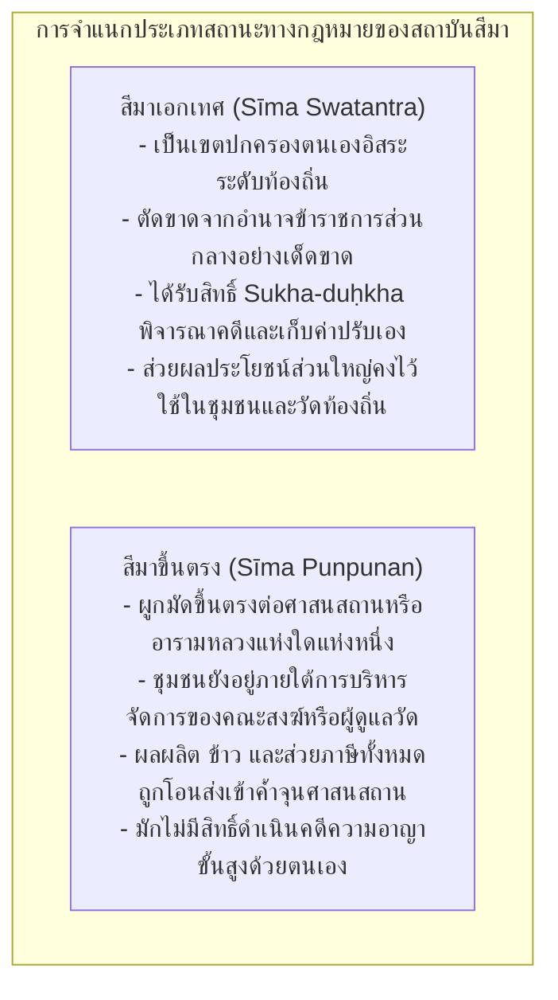
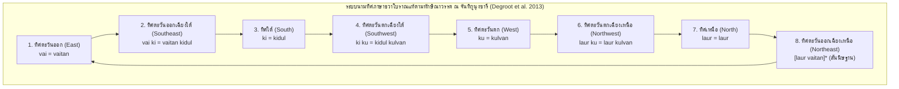
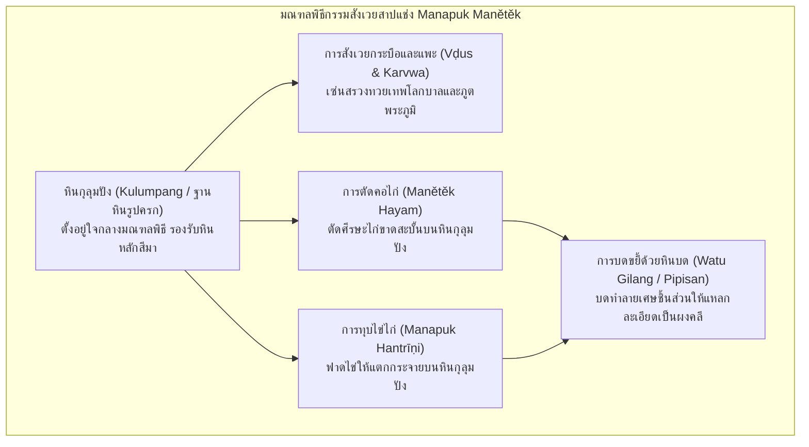
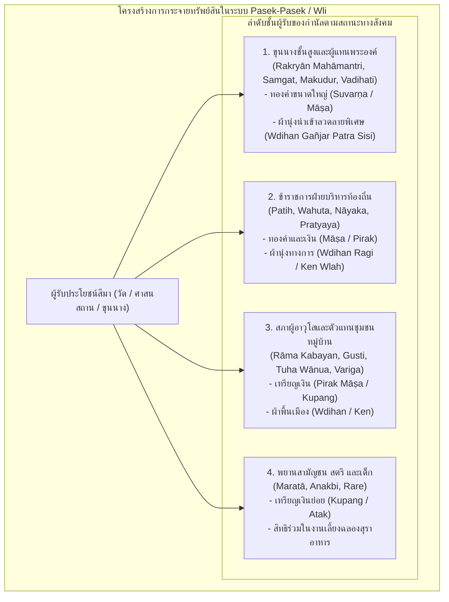

# บทที่ 5: สถาบันกัลปนาสีมา กฎหมาย ภูมิทัศน์ศักดิ์สิทธิ์ และระเบียบสังคมเศรษฐกิจในจารึกชวาโบราณ
*(The Sīma Universe: Sacred Demarcation, Law, Agrarian Institutions, and Socio-Economic Order in Ancient Javanese Charters)*

---

## บทนำประจำบทที่ 5: สถาบันกัลปนาสีมาในฐานะแกนกลางของระเบียบสังคม เศรษฐกิจ และนิติศาสตร์ชวาโบราณ

ในกระบวนการศึกษาอารยธรรมเอเชียตะวันออกเฉียงใต้ภาคพื้นสมุทรยุคโบราณ ไม่มีหมวดหมู่หลักฐานทางประวัติศาสตร์ใดที่จะให้ภาพสะท้อนชีวิตจริง โครงสร้างอำนาจรัฐ กลไกทางเศรษฐกิจการเกษตร และความสัมพันธ์ระหว่างมนุษย์กับสิ่งเหนือธรรมชาติได้อย่างลึกซึ้ง ละเอียดลออ และรอบด้านเท่ากับ "เอกสารจารึกสถาปนาเขตสีมา" (*sīma-śāsana*) จากการสำรวจและจัดหมวดหมู่คลังจารึกดิจิทัลปฐมภูมิตามมาตรฐานสากลของโครงการความร่วมมือยุโรปดีฮาร์มา (ERC Synergy Project DHARMA No. 809994) ร่วมกับข้อมูลการสำรวจของสำนักฝรั่งเศสแห่งปลายบุรพทิศ (EFEO) พบว่า ในบรรดาจารึกภาษาชวาโบราณและภาษาสันสกฤตที่ค้นพบบนเกาะชวากว่าพันหลัก มีจารึกที่เป็นเอกสารสิทธิ์การกัลปนาและปักปันเขตที่ดินสีมาทั้งในชวากลางและชวาตะวันออกจำนวนมากกว่า 180 ฉบับ [1] ตัวเลขทางสถิติดังกล่าวสะท้อนอย่างชัดเจนว่า สถาบันสีมามิใช่เพียงปรากฏการณ์ชายขอบหรือเป็นเพียงพิธีกรรมทางศาสนาที่เกิดขึ้นเป็นครั้งคราว หากแต่เป็น "สถาบันแกนกลาง" (Core Institution) ที่ขับเคลื่อนระเบียบทางสังคม เศรษฐกิจ นิติศาสตร์ และเทคโนโลยีการชลประทานของรัฐชวาโบราณอย่างแท้จริงนับตั้งแต่คริสต์ศตวรรษที่ 8 สืบเนื่องไปจนถึงคริสต์ศตวรรษที่ 15 [2]

คำว่า "สีมา" (*sīma*) แม้จะเป็นคำยืมมาจากภาษาสันสกฤตที่มีความหมายพื้นฐานว่า "เขตแดน, พรมแดน, ขอบเขต หรือหลักหมาย" แต่เมื่อคำนี้ถูกผนวกรวมเข้าสู่บริบทสังคมและนิติศาสตร์ชวาโบราณ ความหมายของสีมาได้ขยายตัวและพัฒนาไปสู่การเป็น "เขตแดนที่ดินที่ได้รับพระราชทานเอกสิทธิ์คุ้มครองพิเศษทางกฎหมายและภาษีอากร" (Privileged or Freehold Land) [3] ผืนดินหรือชุมชนหมู่บ้าน (*wānua*) ที่ได้รับการสถาปนายกสถานะขึ้นเป็นสีมา จะหลุดพ้นจากระบบการส่งส่วยสาอากรและแรงงานเกณฑ์เข้าสู่ท้องพระคลังหลวงของพระมหากษัตริย์โดยตรง แล้วโอนถ่ายผลประโยชน์ทางเศรษฐกิจ ผลผลิตข้าว ตลอดจนสิทธิในการจัดเก็บค่าธรรมเนียมและค่าปรับคดีความ ไปใช้เพื่อการทำนุบำรุงศาสนสถาน (ทั้งเทวสถานฮินดูและพุทธมหาวิหาร), ค้ำจุนเหล่านักบวชและผู้ปฏิบัติธรรม, บำรุงรักษาสุสานบรรพกษัตริย์ (*kamūlān*), หรือเพื่อการสร้างและบำรุงรักษาโครงสร้างพื้นฐานสาธารณะ เช่น การขุดลอกคลองส่งน้ำและการบูรณะฝายทดน้ำชลประทาน [4]

ในประวัติศาสตร์นิพนธ์ยุคอาณานิคมดัตช์ การศึกษาจารึกสีมามักเผชิญกับอคติเชิงวิธีวิทยาอย่างร้ายแรง นักบูรพคดีศึกษาชั้นต้น เช่น เจ.แอล.เอ. บรันเดส (J.L.A. Brandes), เฮนดริก เคิร์น (H. Kern), และ เอ็น.เจ. โครม (N.J. Krom) มักมองจารึกพระราชกฤษฎีกาเหล่านี้เป็นเพียง "โครงกระดูกของประวัติศาสตร์การเมืองราชสำนัก" (The Political Skeleton) โดยมุ่งสนใจสกัดเอาเฉพาะพระนามของพระมหากษัตริย์ ปีมหาศักราชที่ทรงครองราชย์ พระบรมวงศานุวงศ์ และเหตุการณ์สงครามปราบปรามกบฏ ส่วนเนื้อความอันยาวเหยียดที่กินเนื้อที่กว่าร้อยละเก้าสิบของจารึก—ซึ่งประกอบด้วยรายละเอียดทางดาราศาสตร์อย่างพิสดาร, สายการบังคับบัญชาของคณะเสนาบดี, ขอบเขตที่ดินและกรรมสิทธิ์ในแปลงนา, รายการของกำนัลตอบแทนพยานชาวบ้าน, บัญชีอาหารและสุราในงานเลี้ยงฉลอง, และสูตรคำสาปแช่งอันน่าสยดสยอง—กลับถูกมองข้ามว่าเป็นเพียง "ถ้อยคำตามแบบแผนทางพิธีกรรมที่น่าเบื่อหน่ายและซ้ำซาก" (Monotonous Formulaic Clichés) [5]

อย่างไรก็ดี วงวิชาการจารึกวิทยาอินโดนีเซียได้เกิดการเปลี่ยนผ่านกระบวนทัศน์ครั้งสำคัญยิ่ง (Paradigm Shift) จากผลงานวิจัยระดับแม่บทของ ศาสตราจารย์ เอ็ม. บุชารี (M. Boechari, ค.ศ. 1927–1991) ผู้ได้รับการยกย่องเป็น "บิดาแห่งจารึกวิทยาอินโดนีเซียยุคหลังเอกราช" บุชารีได้ตีพิมพ์บทความวิจัยระดับหมุดหมายหลายชิ้น โดยเฉพาะบทความ *"Epigrafi dan Sejarah Indonesia"* (ค.ศ. 1977) ซึ่งต่อมาได้รับการรวบรวมไว้ในผลงานชิ้นเอก *Melacak Sejarah Kuno Indonesia Lewat Prasasti* (ค.ศ. 2012) บุชารีได้สถาปนาระเบียบวิธีวิจัยที่เรียกว่า **"จารึกวิทยาเชิงบริบทสังคม-วัฒนธรรม" (Socio-Cultural Epigraphy)** โดยประกาศอย่างหนักแน่นว่า ศิลาจารึกสีมามิใช่เพียงเอกสารโฆษณาชวนเชื่อยกย่องกษัตริย์ แต่เป็น "คลังข้อมูลนิติกรรมสัญญาและเอกสารสิทธิ์ทางกฎหมายที่แท้จริง" ซึ่งบันทึกปฏิสัมพันธ์ พลวัต และการประนีประนอมผลประโยชน์ระหว่างอำนาจรัฐส่วนกลางกับประชาคมหมู่บ้านดั้งเดิมไว้อย่างซื่อตรงที่สุด [6] การเปลี่ยนกระบวนทัศน์ของบุชารีได้เปิดประตูสู่งานวิจัยสาขาใหม่ๆ ในศตวรรษที่ 21 ทั้งในมิติภาษาศาสตร์ประวัติศาสตร์และพันธะวาทกรรมทางกฎหมาย (Kridalaksana 1991), การสำรวจโบราณคดีจารึกและระบบเรขาคณิตเชิงพื้นที่ศักดิ์สิทธิ์ (Degroot, Griffiths, & Tjahjono 2010–2011/2013), วิศวกรรมชลศาสตร์และการจัดการน้ำ (Arrazaq & Tanudirjo 2021; Pradnyawan 2023), ไปจนถึงประวัติศาสตร์การแพทย์และสุขอนามัยชุมชน (Acri, Bianchini, & Jákl 2026) [7]

เพื่อเป็นการเปิดพรมแดนความรู้และทำความเข้าใจจักรวาลแห่งสถาบันสีมาอย่างรอบด้าน เนื้อหาในตอนที่ 1 ของบทที่ 5 นี้ จะแบ่งการวิเคราะห์ออกเป็นสองหัวข้อหลักอันได้แก่:
- **หัวข้อ 5.1 กายวิภาคและแบบแผนโครงสร้างของจารึกสีมา (Anatomy and Structural Morphology of Sīma Charters):** ทำการชำแหละโครงสร้าง 8 องค์ประกอบมาตรฐานของจารึกพระราชกฤษฎีกาตามโมเดลของ Boechari (2012); การศึกษาวากยสัมพันธ์ประวัติศาสตร์ การใช้อนุภาคบอกเวลา *tatkala* และ *tatkalanya* ในฐานะหมุดหมายทางนิติศาสตร์ และโครงสร้างพันธะวาทกรรมในสูตรคำสาปแช่งตามกรอบของ Kridalaksana (1991); ตลอดจนการจำแนกประเภทสีมาเอกเทศ (*Sīma Swatantra*) ปะทะ สีมาขึ้นตรง (*Sīma Punpunan*) และการกระจายอำนาจตุลาการผ่านสิทธิ์การเก็บค่าปรับคดีความ (*sukha-duḥkha*) [8]
- **หัวข้อ 5.2 ภูมิทัศน์ศักดิ์สิทธิ์และพิธีกรรมปักปันเขตแดน (Sacred Landscapes and Demarcation Rituals):** วิเคราะห์ขั้นตอนพิธีกรรมมานูซุกสีมา (*Mānusuk Sīma*) การเดินวนขวาทักษิณาวรรต (*pradakṣiṇa*) ปักเสาหินหลักเขต (*watu sīma / liṅga patok*) ตามระบบ 8 ทิศ ผ่านการค้นพบทางโบราณคดีจารึก ณ จันทิกูนุงซารี (Degroot 2017); พิธีกรรมสาปแช่งและไสยเวทสังเวย (*manapuk manětěk*) การทุบไข่ตัดคอไก่บนหินกุลุมปัง (*kulumpang*) บดขยี้ด้วยหินบด (*watu gilang / pipisan*); และระบบเศรษฐกิจแห่งการตอบแทนผ่านการถวายของกำนัล (*pasek-pasek / wli*) อันสะท้อนสายสัมพันธ์ทางอำนาจระหว่างราชสำนัก คณะสงฆ์ และสภาผู้อาวุโสหมู่บ้าน (*rāma*) [9]

---

## 5.1 กายวิภาคและแบบแผนโครงสร้างของจารึกสีมา (Anatomy and Structural Morphology of Sīma Charters)

### 5.1.1 โครงสร้าง 8 องค์ประกอบมาตรฐานตามโมเดลของ Boechari (2012)

ในการวิเคราะห์เอกสารสิทธิ์ที่ดินโบราณของชวา ศาสตราจารย์ เอ็ม. บุชารี (Boechari 2012) ได้สร้างแบบจำลองโครงสร้างจารึกพระราชกฤษฎีกา (The Standard Formula of Royal Charters) ขึ้นมาจากการประมวลจารึกสถาปนาสีมานับร้อยฉบับ ทั้งที่จารึกลงบนแผ่นศิลา (*upala-praśasti / prasasti batu*) และจารึกลงบนแผ่นทองแดง (*tāmra-praśasti / prasasti tembaga*) บุชารีได้ชี้ให้เห็นว่า จารึกพระราชโองการกัลปนาสีมาของชวาโบราณมี "แบบแผนทางการทูตและนิติศาสตร์" (Diplomatics and Juridical Formula) ที่เคร่งครัดและเป็นระบบยิ่ง โดยประกอบด้วยโครงสร้างแกนกลางมาตรฐาน 8 หมวดหมู่อย่างเป็นลำดับ ดังต่อไปนี้ [10]

```mermaid
graph TD
    subgraph "โครงสร้าง 8 องค์ประกอบมาตรฐานของจารึกสีมา (Boechari 2012 Model)"
        M1["1. มงคลพจน์ (Maṅgala / Invocatio)<br/>บทสวดบูชา สรรเสริญเทพเจ้า หรือคำอวยพรเริ่มต้น"] --> M2["2. วันเวลาและดาราศาสตร์ (Sambandha / Tithi / Pañcāṅga)<br/>มหาศักราช, เดือน, ปักษ์, ดิถี, ฤกษ์นักษัตร, ระบบรอบวัน 3-5-6-7"]
        M2 --> M3["3. พระบรมราชโองการ (Śrī Mahārāja Umājar / Ājñā)<br/>พระนามกษัตริย์หรือเจ้านายผู้ทรงออกพระบรมราชโองการ"]
        M3 --> M4["4. สายการบังคับบัญชา (Chain of Command / Tinadaḥ)<br/>การถ่ายทอดคำสั่ง: Mahāmantri สู่ Samgat, Nāyaka, และคณะผู้นำ"]
        M4 --> M5["5. มูลเหตุและขอบเขตที่ดิน (Sambandha & Boundary Demarcation)<br/>วัตถุประสงค์การกัลปนา, ศาสนสถานผู้รับประโยชน์, การรังวัดแปลงนา"]
        M5 --> M6["6. บัญชีกลุ่มต้องห้าม (Mangilāla Drawya Haji Lists)<br/>การระบุข้าราชบริพารและช่างฝีมือหลวงที่ห้ามเข้ามารบกวนแดนสีมา"]
        M6 --> M7["7. พิธีสถาปนาและของกำนัล (Mānusuk Sīma, Pasek-pasek & Feast)<br/>พิธีปักหินหลักเขต, การแจกจ่ายทองคำและผ้า, งานเลี้ยงสมโภช"]
        M7 --> M8["8. พันธะคำสาปแช่งและอวยพร (Śapatha / Sapata Formula)<br/>การอัญเชิญทวยเทพและสิ่งศักดิ์สิทธิ์ลงทัณฑ์ผู้คิดคดทำลายสีมา"]
    end
```



#### 1. มงคลพจน์และบทสวดเริ่มต้น (Maṅgala / Invocatio)
จารึกสีมาส่วนใหญ่เริ่มต้นด้วยคำมงคลภาษาสันสกฤต เช่น *Svasti* ("ขอความสุขสวัสดีจงมี"), *Śrīr astu* ("ขอความรุ่งเรืองจงบังเกิด"), หรือ *Avighnam astu* ("ขอความขัดข้องจงอย่าได้มี") ในจารึกบางฉบับที่ออกโดยสถาบันศาสนาชั้นสูงหรือวัดหลวง จะมีการประพันธ์บทกวีนิพนธ์สรรเสริญเทพเจ้าด้วยฉันท์ภาษาสันสกฤตอย่างวิจิตร เช่น คาถาสรรเสริญพระศิวะในจารึกชังคัล (Canggal 732 CE) หรือคาถาสรรเสริญความศานติแห่งสากลโลกในจารึกซังงูรัน (Sangguran 928 CE) ซึ่งทำหน้าที่เป็นทั้งการบวงสรวงต่อทวยเทพและการสร้างความศักดิ์สิทธิ์ทางเทววิทยาให้แก่นิติกรรมสัญญา [11]

#### 2. วันเวลาและพิกัดดาราศาสตร์อย่างละเอียด (Calendrical and Astronomical Data: Tithi / Pañcāṅga)
เอกสารสิทธิ์สีมาจะบันทึกวันเวลาที่ทรงมีพระบรมราชโองการและวันประกอบพิธีอย่างละเอียดถี่ถ้วนยิ่งกว่าเอกสารประวัติศาสตร์ประเภทอื่นใด โดยบันทึกซ้อนทับกันหลายระบบปฏิทิน ได้แก่ ศักราชที่ล่วงไปแล้ว (*śaka-varṣātīta*), ชื่อเดือนตามสุริยจันทรคติ (*māsa* เช่น Caitra, Vaiśākha, Āṣāḍha, Śrāvaṇa), ปักษ์ข้างขึ้น (*śukla-pakṣa*) หรือข้างแรม (*kṛṣṇa-pakṣa*), วันทางจันทรคติหรือดิถี (*tithi* เช่น pratipadā, dvitīyā, daśamī, caturdaśī, pūrṇimā, amāwāsyā) ควบคู่กับระบบการนับรอบวันแบบซ้อนทับกันของชวาโบราณ ได้แก่:
- ระบบสัปดาห์ 6 วัน หรือ ษัฑวาร (*ṣaḍvāra*: Tunglai, Haryang, Wurukung, Paningron, Uwas, Mawulu)
- ระบบสัปดาห์ 5 วัน หรือ ปัญจวาร (*pañcavāra*: Umanis/Legi, Paing, Pon, Wage, Kaliwon)
- ระบบสัปดาห์ 7 วัน หรือ สัตตวาร (*saptavāra*: Āditya, Soma, Aṅgāra, Budha, Bṛhaspati, Śukra, Śanaiścara)
- ตำแหน่งดวงดาวนักษัตร (*nakṣatra*), เทพประจำฤกษ์ (*devatā*), และตำแหน่งการร่วมของดวงดาวหรือโยคะ (*yoga*) [12]

การบันทึกพิกัดดาราศาสตร์อย่างหนาแน่นเช่นนี้ มิใช่เพียงความเชื่อทางโหราศาสตร์เพื่อหาฤกษ์ยามอันเป็นมงคลเท่านั้น หากแต่ในทางนิติศาสตร์โบราณ มันทำหน้าที่เป็น "การประทับเวลาทางกฎหมายที่ไม่อาจปลอมแปลงได้" (Incontestable Legal Timestamp) ซึ่งช่วยให้นักจารึกวิทยาสมัยใหม่ (โดยเฉพาะระเบียบวิธีคำนวณของ L.-C. Damais) สามารถสอบทานและระบุวันเวลาที่แน่นอนตามปฏิทินสากลได้แม่นยำระดับวัน [13] ดังตัวอย่างในจารึกกาสูกีฮัน (Charter of Kasugihan มหาศักราช 829 / ค.ศ. 907):

> **ตัวบทปริวรรตอักษรเดิม (IAST):**
> `"svasti śaka-varṣātīta 829 mārggaśira-māsa tithī daśamī śukla-pakṣa, ma, pa, bu, vāra, aśvinī-nakṣatra, varīyān-yoga, tatkālanikanaṁ vahuta tuṅgu duruṁ makabaihan inanugrahan irikanaṁ vanuan i kasugihan de rakryān kalaṁ buṅkal dyaḥ manukū..."` (DHARMA INSIDENK00361, 1r1–3) [14]
>
> **คำแปลภาษาไทยวิชาการ:**
> *"ขอความสุขสวัสดีจงมี! มหาศักราชล่วงแล้วได้ 829 ปี เดือนมารคศิรษะ ดิถีที่สิบแห่งศุกลปักษ์ (ข้างขึ้นสิบค่ำ), วันมาวูลู (แห่งรอบหกวัน), วันปาอิง (แห่งรอบห้าวัน), วันพุธ (แห่งรอบเจ็ดวัน), นักษัตรอัศวินี, วริยานโยคะ, ในกาลเวลานั้น บรรดาเจ้าพนักงานวาฮูตาและตุงกูดูรุงทั้งปวง ได้รับพระราชทานพระบรมราชานุเคราะห์ในผืนดินหมู่บ้านแห่งคาสูกีฮัน จากราเกรียน กาลัง บุงกัล ดยาห์ มานูกู..."* [15]

#### 3. พระบรมราชโองการ (Royal Command / Śrī Mahārāja Umājar หรือ Ājñā)
เป็นส่วนที่ระบุว่า พระมหากษัตริย์หรือองค์ประมุขผู้ทรงสิทธิ์สูงสุดเหนือแผ่นดิน ทรงมีพระบรมราชกระแสรับสั่ง (*umajar*) หรือพระราชทานพระราชกฤษฎีกา (*ājñā*) พระนามของกษัตริย์มักระบุทั้งพระนามพระยศตำแหน่งในฐานะเจ้าผู้ครองแคว้น (*Rakai* หรือ *Rakryān*) และพระนามทางพิธีบรมราชาภิเษกอันเป็นภาษาสันสกฤตที่แสดงเทวสิทธิ์และบารมีธรรม เช่น *"śrī mahārāja rakai vatu kura dyaḥ balituṁ śrī dharmodaya mahāsambhu"* ในรัชสมัยพระเจ้าบาลิตุง หรือ *"śrī mahārāja rakai halu śrī lokeśvara dharmmavaṅśa airlaṅgānanta vikramottuṅgadeva"* ในรัชสมัยพระเจ้าแอร์ลังกา [16]

#### 4. สายการบังคับบัญชาและการถ่ายทอดพระบรมราชโองการ (Chain of Command / Tinadaḥ)
พระบรมราชโองการของกษัตริย์มิได้ถูกส่งตรงไปยังหมู่บ้านในทันที แต่จะต้องผ่านกระบวนการทางระบบราชการที่เป็นลายลักษณ์อักษรตามลำดับชั้นบังคับบัญชาอย่างเข้มงวด โดยคำสั่งจะ "เสด็จลงมา" (*tumurun*) หรือ "ได้รับการน้อมรับสนอง" (*tinadaḥ*) โดยคณะมหาเสนาบดีชั้นสูงสุดของแผ่นดิน ซึ่งเป็นเจ้านายชั้นผู้ใหญ่และมักสงวนไว้สำหรับพระราชโอรสหรือพระราชวงศ์ ได้แก่ ตำแหน่ง **ราเกรียน มหามานตรี (Rakryān Mahāmantri)** ทั้งห้ากรม (Hino, Halu, Sirikan, Wka, Tiruan) โดยเฉพาะมหาเสนาบดีกรมหิโน (*Rakryān Mahāmantri i Hino*) ซึ่งดำรงสถานะคล้ายอัครมหาเสนาบดีหรือมกุฎราชกุมาร [17]

จากนั้น คณะมหามานตรีจะส่งต่อคำสั่งลงมายังขุนนางระดับบริหารและตุลาการ (*umiṅsor i taṇḍa rakryān*) อันประกอบด้วยกลุ่ม **สมคัต (Samgat / Sang Pamgat)** ซึ่งทำหน้าที่เป็นขุนนางกำกับดูแลเขตแคว้น รักษากฎหมาย และวินิจฉัยอรรถคดี, ขุนนางฝ่ายตรวจการแผ่นดิน (*Pratyaya*), เจ้าพนักงานฝ่ายบริหารท้องถิ่น (*Patih* และ *Wahuta*), ตลอดจนขุนนางระดับปฏิบัติการที่ดูแลกลุ่มหมู่บ้าน (*Nāyaka*) เพื่อดำเนินการรังวัดและเตรียมการสถาปนาในพื้นที่จริง [18]

#### 5. ตำบลที่ตั้ง มูลเหตุแห่งการกัลปนา และขอบเขตที่ดิน (Sambandha & Boundary Demarcation)
ส่วนนี้เริ่มต้นด้วยคำว่า **สัมพันธะ (*sambandha*)** ซึ่งแปลว่า "มูลเหตุ, โอกาส หรือที่มาแห่งการกัลปนา" จารึกจะบันทึกถึงสาเหตุที่พระมหากษัตริย์หรือเจ้านายทรงพระกรุณาโปรดเกล้าฯ พระราชทานสถานะสีมา เช่น:
- เพื่อเป็นการตอบแทนความชอบของขุนนาง ทหาร หรือราษฎร ที่ได้ประกอบคุณงามความดีอย่างใหญ่หลวงต่อราชบัลลังก์ เช่น การช่วยรบชนะศึกสงคราม หรือการช่วยคุ้มครองกษัตริย์ยามลี้ภัย (ดังกรณีจารึกกูบู-กูบู Kubu-Kubu 905 CE)
- เพื่ออุทิศผลบุญถวายแด่บรรพบุรุษ หรือเพื่อการสร้างและอุปถัมภ์วัดและศาสนสถาน (*dharmasīma / vihāra / kuṭi*)
- เพื่อระดมทรัพยากรและแรงงานในการพัฒนาโครงสร้างพื้นฐาน เช่น การสร้างทำนบฝายทดน้ำ (*ḍawuhan*) หรือการบุกเบิกหักล้างถางพงป่าดงดิบเพื่อขยายพื้นที่เกษตรกรรม (ดังกรณีจารึกกะลาดิ Kaladi 909 CE) [19]

นอกจากนี้ ยังมีการระบุรายละเอียดที่ตั้งของหมู่บ้าน ตำบล สังกัดมณฑล (*vatak*), ประเภทของที่ดิน (เช่น นาข้าวทดน้ำ *sawah*, ไร่ที่ดอนแห้งแล้ง *tanah tegalan*, สวนผลไม้ *kbu*), ขนาดเนื้อที่ดินที่คำนวณเป็นหน่วยรังวัดชวาโบราณ (เช่น *tampah*, *blah*, *dpa*), ปริมาณภาษีที่เคยต้องจ่ายให้หลวง, และการระบุแนวเขตแดนทั้งสี่ทิศ (*catur-deśa*) หรือแปดทิศอย่างชัดเจน โดยอ้างอิงหลักธรรมชาติ เช่น แนวสันเขา ลำห้วย ต้นไม้ใหญ่ หรือถนนหลวง [20] ดังตัวอย่างในจารึกวูกายานา (Wukajana / N. 391 มหาศักราช 825 / ค.ศ. 904):

> **ตัวบทปริวรรตอักษรเดิม (IAST):**
> `"[...] tatkāla anugraha śrī mahārāja rakai vatu kura dyaḥ balituṁ śrī dharmodaya-mahāśambhu tumurun i rakryān mapatiḥ i hino pu dakṣottama-bāhubajra-pratipakṣakṣaya kumon samgat kalaṅ vuṅkal pu layaṁ, anak vanua i patapān [...] sumusuka ikanaṁ vanua i vukajana i tumpak i vuru tlu vatak kalaṅ vuṅkal gavai mā 6 savaḥ kahadyanan tampaḥ 8 blaḥ 1 suku 1 [...] samvandhānya kinon sumusuka ikanaṁ vanua vuara kuṭi i dalinan vatak husaḍa [...]"` (DHARMA INSIDENK00391, 1r1–3) [21]
>
> **คำแปลภาษาไทยวิชาการ:**
> *"[...] ในกาลเวลานั้น พระบรมราชานุเคราะห์ขององค์พระศรีมหาราชา ราไก วาตู กูรา ดยาห์ บาลิตุง ศรี ธรรโมทัย-มหาสัมภุ ได้เสด็จลงมายังราเกรียน มหาปาติฮ์ แห่งหิโน นาม ปู ทักษโมตตมะ-พาหุวัชระ-ปรติปักษักษัย ทรงบัญชาให้สมคัต กาลัง วุงกัล นาม ปู ลายัง บุตรแห่งหมู่บ้านปาตาปัน [...] ให้ไปปักปันเขตแดนสถาปนาสีมาในหมู่บ้านวูกายานา, ตุมปัก, และวูรูเตอลู อันสังกัดมณฑลกาลัง วุงกัล ซึ่งมีมูลค่าแรงงานเกณฑ์ 6 มาสะ และมีแปลงนานายหลวงเนื้อที่ 8 ตัมปะฮ์ กับอีก 1 บละฮ์ และ 1 สูกู [...] มูลเหตุแห่งการนี้ (samvandhānya) เนื่องด้วยมีพระบรมราชโองการสั่งให้ปักปันเขตแดนหมู่บ้านเพื่อเป็นประโยชน์แก่อารามสงฆ์ (kuṭi) ณ ดาลินัน สังกัดมณฑลฮูซาดะ [...]"* [22]

#### 6. บัญชีข้าราชบริพารและกลุ่มต้องห้าม (Mangilāla Drawya Haji Lists)
องค์ประกอบที่สำคัญยิ่งและเป็นเอกลักษณ์ของจารึกสีมาชวา คือบัญชีรายนามตำแหน่งบุคคลที่ "ต้องห้ามมิให้เหยียบย่างเข้าสู่เขตแดนสีมา" (*tan katamāna de sang mangilāla drawya haji*) ซึ่งบุชารี (Boechari 2012) ได้ทำการปฏิวัติการตีความจากเดิมที่เคยเข้าใจว่าเป็นเจ้าพนักงานสรรพากร มาสู่การเป็น "ข้าราชบริพารและช่างฝีมือผู้พึ่งพิงเบี้ยหวัดพระราชทรัพย์หลวง" (ดูรายละเอียดการวิเคราะห์เชิงลึกในข้อถกเถียงของ Boechari) การระบุบัญชีต้องห้ามนี้ทำหน้าที่เป็น "ภูมิคุ้มกันทางนิติศาสตร์" ที่รับประกันว่า ผืนดินสีมาจะได้รับการยกเว้นจากการถูกแทรกแซง กอบโกย หรือรีดไถผลประโยชน์จากข้าราชการส่วนกลางอย่างเด็ดขาด [23]

#### 7. พิธีสถาปนาสีมา ของกำนัล และงานเลี้ยงฉลอง (Mānusuk Sīma, Pasek-pasek & Feast)
บันทึกรายละเอียดขั้นตอนพิธีกรรมศักดิ์สิทธิ์ในการปักหินหลักเขต (*watu sīma*) การถวายเครื่องสังเวยแด่ทวยเทพและวิญญาณบรรพบุรุษ, บัญชีการแจกจ่ายสิ่งตอบแทนและของกำนัล (*pasĕk-pasĕk / wli*) ซึ่งประกอบด้วยเงินตราทองคำ เงิน และผ้าทอนานาชนิด ให้แก่บรรดาข้าราชการ พยาน และผู้อาวุโสหมู่บ้าน (*rāma*), ตลอดจนการบรรยายมหกรรมงานเลี้ยงฉลองสุราอาหารและการละเล่นมหรสพสมโภชอย่างยิ่งใหญ่ [24]

#### 8. พันธะคำสาปแช่งและอวยพร (Śapatha / Sapata Formula)
ส่วนปิดท้ายของจารึก ซึ่งเป็นบทสาบานและโองการสาปแช่งอันศักดิ์สิทธิ์ โดยทำพิธีอัญเชิญทวยเทพโลกบาล พระสุริยะ พระจันทร์ พระแม่ธรณี และวิญญาณบรรพบุรุษ มาเป็นประจักษ์พยาน พร้อมทั้งประกาศคำสาปอันรุนแรงสยดสยองต่อบุคคลใดก็ตามที่คิดคดทำลาย ลบล้าง หรือละเมิดสถานะสีมา และปิดท้ายด้วยคำอำนวยพรแก่ผู้ที่ร่วมพิทักษ์รักษาแดนสีมาให้ประสบความสุขสวัสดิ์ชั่วกัลปาวสาน [25]

---

### 5.1.2 วากยสัมพันธ์ประวัติศาสตร์ อนุภาคบอกเวลา tatkala / tatkalanya และพันธะวาทกรรมคำสาปแช่ง (Kridalaksana 1991)

ในมิติทางภาษาศาสตร์จารึกวิทยาและวากยสัมพันธ์ประวัติศาสตร์ ฮาริมูร์ติ กรีดาลักซานา (Harimurti Kridalaksana 1991) ได้นำเสนอบทวิเคราะห์เชิงลึกในผลงานชิ้นสำคัญ *"Peri Hal Konstruksi Sintaktis dalam Bahasa Melayu Kuna"* และข้อศึกษาว่าด้วยพันธะวาทกรรมในจารึกชวาโบราณและมลายูโบราณ โดยชี้ให้เห็นว่า ตัวบทจารึกสถาปนาสีมาหาได้เป็นเพียงการเขียนข้อความบรรยายร้อยแก้วทั่วไปไม่ หากแต่มี "โครงสร้างวากยสัมพันธ์เฉพาะทางนิติศาสตร์" (Juridical Syntax) ที่ถูกออกแบบมาเพื่อสร้าง "พันธะวาทกรรม" (Discourse Obligation) และอำนาจบังคับเด็ดขาดในทางกฎหมาย [26]

#### การใช้อนุภาคบอกเวลา tatkala / tatkalanya ในฐานะ "หมุดหมายทางนิติศาสตร์" (Legal Temporal Anchor)
กรีดาลักซานาได้ชี้ให้เห็นปรากฏการณ์ทางภาษาศาสตร์ที่สำคัญยิ่งเกี่ยวกับการใช้คำว่า **ตัตกาละ (*tatkāla*)** และรูปที่เติมปัจจัยแสดงความเป็นเจ้าของหรือความชี้เฉพาะ **ตัตกาลันยา (*tatkālanya*)** ซึ่งมีรากศัพท์มาจากภาษาสันสกฤต (*tat-kāla* แปลว่า "ในเวลานั้น, ยามนั้น, เมื่อนั้น") คำคำนี้มิได้ทำหน้าที่เป็นเพียงคำเชื่อมบอกเวลา (Temporal Conjunction) ธรรมดาในทางไวยากรณ์ แต่ทำหน้าที่เป็น **"หมุดหมายทางนิติศาสตร์" (Legal Temporal Anchor)** หรือแกนกลางเชิงโครงสร้างที่เชื่อมโยงมิติต่างๆ ของเอกสารสิทธิ์เข้าด้วยกัน [27]

ในเชิงวากยสัมพันธ์ จารึกสีมาจะจัดวางโครงสร้างประโยคแบบสองท่อนขนาดใหญ่ โดยท่อนแรกคือ "มณฑลแห่งเวลาเชิงดาราศาสตร์และจักรวาลวิทยา" (Astronomical-Cosmological Realm) ซึ่งระบุปีมหาศักราช เดือน ดิถี และตำแหน่งดวงดาวอย่างละเอียด จากนั้นคำว่า *tatkāla* หรือ *tatkālanya* จะทำหน้าที่เป็น "สะพานเชื่อมเชิงเวลา" (Temporal Bridge) ดึงเอาเวลาอันศักดิ์สิทธิ์ของจักรวาลให้มาซ้อนทับและประทับตราลงบน "เวลาทางประวัติศาสตร์และนิติศาสตร์" (Historic-Juridical Realm) อันเป็นขณะจิตที่พระบรมราชโองการ (*ājñā*) ของกษัตริย์ได้เสด็จลงมาบังคับใช้จริงในโลกมนุษย์ [28]

```
[พิกัดดาราศาสตร์ Pañcāṅga: ปี + เดือน + ปักษ์ + ดิถี + ษัฑวาร + ปัญจวาร + สัตตวาร + นักษัตร]
                                  │
                       [หมุดหมายทางนิติศาสตร์: tatkāla / tatkalanya]
                                  │
                                  ▼
[การบังคับใช้กฎหมาย: พระบรมราชโองการ Ājñā -> สายการบังคับบัญชา -> การสถาปนาสีมา]
```

กรีดาลักซานาเปรียบเทียบการใช้งาน *tatkāla* ในจารึกชวาโบราณ เข้ากับการใช้ *tatkalanya* ในจารึกมลายูโบราณยุคศรีวิชัย เช่น ในศิลาจารึกตาลังตูโว (Talang Tuwo 684 CE):
> `"[...] tatkālanya parlak śrīkṣetra niparwuat [...]"` ("เมื่อสวนศรีเกษตรนี้ได้ถูกสร้างขึ้น...") [29]

และในศิลาจารึกโกตากาปูร์ (Kota Kapur 686 CE):
> `"[...] tatkālanya yaṁ maṅmaṅ sumpaḥ ini nipāhat di welānya [...]"` ("ในกาลเมื่อคำสัตย์สาบานนี้ได้ถูกจารึกลงบนศิลาหลักเขตของพระนคร...") [30]

ในจารึกสีมาชวาโบราณ คำว่า *tatkāla* มักจะปรากฏซ้ำในหลายจุดสำคัญของตัวบท เพื่อทำหน้าที่เป็น "อนุภาคเปิดฉากนิติกรรมย่อย" (Sub-act Initiator) เช่น ตอนประกาศพระบรมราชโองการ (*tatkāla anugraha śrī mahārāja...*), ตอนนำเครื่องสังเวยมาตั้ง (*tatkāla saṅ hyaṅ kudur sumusuk ikanaṅ sīma...*), หรือตอนแจกจ่ายของกำนัล (*tatkāla maveḥ pasĕk-pasĕk...*) การใช้คำว่า *tatkāla* จึงเป็นการตอกย้ำความมีผลบังคับใช้ตามกฎหมายอย่างต่อเนื่องในทุกอนุภาคของพิธีกรรม [31]

#### โครงสร้างพันธะวาทกรรม (Discourse Obligation) ในสูตรคำสาปแช่ง (Śapatha)
อีกหนึ่งมิติที่กรีดาลักซานา (Kridalaksana 1991, 170–172) ให้การวิเคราะห์อย่างลึกซึ้ง คือลักษณะของ "วาทกรรมคำสาปแช่งศักดิ์สิทธิ์" (Imprecatory Discourse / *Śapatha*) กรีดาลักซานาชี้ว่า วาทกรรมในจารึกโบราณสามารถจำแนกออกเป็นสองประเภทหลัก ได้แก่ "วาทกรรมบอกเล่าเหตุการณ์" (Declarative Narrative Discourse) ซึ่งใช้โครงสร้างประโยคบอกเล่าปรกติ และ **"วาทกรรมผูกมัดทางกฎหมายและพิธีกรรม" (Legal-Ritual Obligatory Discourse)** ซึ่งปรากฏในโองการสาปแช่ง [32]

โครงสร้างของสูตรคำสาปแช่งในจารึกสีมา มีลักษณะทางภาษาศาสตร์ที่พิเศษยิ่ง คือการเปลี่ยนผ่านจากโครงสร้างประโยคบอกเล่า (Declarative) สู่การใช้ **"ประโยคเงื่อนไขและประโยคคำสั่งสาปแช่ง" (Conditional-Imperative Constructions)** ตัวบทจะเริ่มต้นด้วยการอัญเชิญทวยเทพเป็นบุรุษที่สอง (*kamu hyaṅ kabeḥ* "ข้าแต่ทวยเทพทั้งหลาย") เพื่อสถาปนาทวยเทพเป็น "ผู้บังคับใช้กฎหมายสูงสุด" (Supreme Law Enforcers) จากนั้นจึงใช้โครงสร้างเงื่อนไขแบบสันนิษฐาน เช่น *asiṅ umungkal-ungkala ikang sīma* ("ผู้ใดก็ตามที่คิดรื้อถอนทำลายเขตสีมานี้") ตามด้วยประโยคคำสั่งแสดงผลลัพธ์ทางไสยเวทที่ไร้ความปรานี โดยใช้คำกริยาและคำนามที่แสดงความเจ็บปวดและการแตกดับทางกายภาพอย่างชัดแจ้ง [33]

ความน่าสนใจในเชิงวากยสัมพันธ์ คือการใช้ "โครงสร้างประโยครวมกระชับแบบขนาน" (Parallel Condensed Clauses) ที่ตัดคำเชื่อมออกทั้งหมด เพื่อสร้างพลังทางภาษาที่กระชับ รวดเร็ว และน่าสะพรึงกลัว ดังตัวบทคำสาปแช่งในจารึกตาจี (Charter of Taji มหาศักราช 823 / ค.ศ. 901) และประมวลจารึกชวากลาง:

> **ตัวบทปริวรรตอักษรเดิม (IAST):**
> `"[...] hulu nya tĕkĕp, rĕngat kapalanya, wlah wetĕngnya, rantan ususnya, pĕgat hulunya, tampyal i wuri, tibā i hārep, patuk ning ulā, pangan ning mong, sahut ning baya, tĕmahanya nguniweh sang lumābur ikang sīma [...]"` (Boechari 2012, 355; cf. DHARMA INSIDENKCentralJava) [34]
>
> **คำแปลภาษาไทยวิชาการ:**
> *"[...] ขอให้ศีรษะของมันถูกบดขยี้! กะโหลกศีรษะของมันจงแตกแยกเป็นเสี่ยงๆ! ท้องของมันจงแตกกระจาย! ลำไส้ของมันจงขาดวิ่น! คอของมันจงขาดสะบั้น! จงถูกตบตีฟาดฟันจากเบื้องหลัง! ล้มคว่ำฟุบลงไปเบื้องหน้า! จงถูกงูพิษฉกกัด! จงถูกเสือร้ายขย้ำกิน! จงถูกจระเข้คาบกลืน! นั่นคือวิบากกรรมอันสยดสยองของมัน ยิ่งไปกว่านั้นคือผู้ใดก็ตามที่คิดลบล้างทำลายล้างแดนสีมานี้! [...]"* [35]

กรีดาลักซานาชี้ว่า วากยสัมพันธ์ที่เรียงร้อยอวัยวะและภัยพิบัติ (ศีรษะ, กะโหลก, ท้อง, ลำไส้, คอ, งู, เสือ, จระเข้) ในลักษณะนี้ มิใช่เพียงวรรณศิลป์เชิงเปรียบเทียบ แต่ทำหน้าที่เป็น "พันธะทางจิตวิทยาและสังคม" (Psychological & Social Deterrent) ที่สร้างความสะพรึงกลัวแก่ผู้คนในสังคมโบราณ เพื่อป้องกันมิให้เกิดการละเมิดเอกสารสิทธิ์ที่ดิน แม้เวลาจะผ่านพ้นไปหลายชั่วอายุคนหรือกษัตริย์ผู้ทรงออกโองการจะสวรรคตไปแล้วก็ตาม [36]

---

### 5.1.3 การจำแนกประเภทสีมาและสิทธิทางตุลาการ: Sīma Swatantra ปะทะ Sīma Punpunan และสิทธิ์ Sukha-Duḥkha

ในมิติทางนิติศาสตร์และเศรษฐกิจการเมือง การศึกษาของ เอ็ม. บุชารี (Boechari 2012) ได้สร้างคุณูปการอย่างใหญ่หลวงในการจัดระเบียบและจำแนกประเภทของสถาบันสีมาในชวาโบราณ บุชารีชี้ว่า แม้จารึกส่วนใหญ่จะใช้คำว่า *sīma* เหมือนกัน แต่ในทางปฏิบัติ สถานะทางกฎหมาย สิทธิประโยชน์ทางภาษี และการถือครองกรรมสิทธิ์ของสีมามีความแตกต่างกันอย่างมีนัยสำคัญ โดยสามารถจำแนกประเภทหลักออกเป็น **สีมาเอกเทศ (Sīma Swatantra)** และ **สีมาขึ้นตรง (Sīma Punpunan)** ควบคู่กับการพระราชทานสิทธิ์ทางตุลาการที่เรียกว่า **สุขะ-ทุกขะ (*Sukha-duḥkha*)** [37]



#### 1. สีมาขึ้นตรง (Sīma Punpunan / Dharmasīma Punpunan)
คำว่า **ปุนปูนัน (*punpunan*)** ในภาษาชวาโบราณ มาจากรากคำว่า *punpun* ซึ่งหมายถึง "การรวบรวม, สิ่งที่ขึ้นตรงต่อ, หรือทรัพย์สินบริวาร" [38] สีมาประเภทนี้คือ ผืนดิน แปลงนา หรือหมู่บ้านทั้งชุมชน ที่พระมหากษัตริย์หรือเจ้านายทรงประกาศยกสถานะขึ้นเป็นสีมาเพื่อมอบให้เป็น "ทรัพย์สินบริวารที่ขึ้นตรงต่อศาสนสถานหรืออารามสงฆ์แห่งใดแห่งหนึ่งเป็นการเฉพาะ" ผลผลิตทางการเกษตร ส่วยภาษี และแรงงานของราษฎรในเขตปุนปูนัน มิได้หายไปไหน แต่ถูกโอนจากการส่งเข้าท้องพระคลังหลวง ไปเป็นรายได้ประจำเพื่อค้ำจุนการประกอบพิธีกรรมประจำวัน การจัดซื้อน้ำมันตะเกียง เครื่องหอม ดอกไม้บูชา ตลอดจนการบูรณะซ่อมแซมอาคารเทวสถานหรือกุฏิสงฆ์ [39]

ตัวอย่างที่ชัดเจนยิ่งปรากฏในจารึกแผ่นทองแดงนิติศักราชบาลิตุง หรือ จารึกวิหารครุรุง (Garuṅ / N. 404 มหาศักราช 829 / ค.ศ. 907) ซึ่งระบุข้อความว่า:
> `"[...] tatkālani pu tabvəl anag vanua iṁ guntur punpunaniṁ vihāre garuṅ pinariccheda guṇa-doṣanira de samaggat pinapan [...]"` (DHARMA INSIDENK00404, lines 1–3) [40]
>
> *"ในกาลเวลานั้น ข้อพิพาท (guṇa-doṣa) ของปู ตับเวล ชาวหมู่บ้านกุนตูร์ อันเป็นดินแดนขึ้นตรง (punpunan) ต่ออารามวิหารแห่งการุง ได้รับการพิจารณาตัดสินโดยขุนนางสมคัต ปินาปัน [...]"* [41]

และในจารึกคันดางัน (Kandangan Inscription มหาศักราช 828 / ค.ศ. 906):
> `"[...] vanua i kaṇḍaṅan muaṁ anaknya ri vanua i er hijo [...] śīmāni parhyaṅan i prāsāda vatak patapān [...] dadhā 1 makapunpunana ya [...]"` (DHARMA INSIDENKKandangan, lines 2–4) [42]
>
> *"หมู่บ้านแห่งคันดางันและหมู่บ้านบริวารแห่งแอร์ ฮีโจ [...] เป็นสีมาแห่งเทวสถานปราสาท สังกัดมณฑลปาตาปัน [...] เพื่อให้เป็นดินแดนขึ้นตรง (makapunpunana ya) ค้ำจุนเทวสถานนั้น [...]"* [43]

ราษฎรในเขตสีมาปุนปูนัน แม้จะพ้นจากการเกณฑ์แรงงานของราชสำนักส่วนกลาง แต่ยังมีพันธะผูกพันโดยตรงในการรับใช้อารามหรือเทวสถานนั้นๆ

#### 2. สีมาเอกเทศ (Sīma Swatantra)
คำว่า **สวาตันตระ (*swatantra*)** เป็นคำยืมภาษาสันสกฤตที่หมายถึง "อิสรภาพ, การปกครองตนเอง, ความเป็นเอกเทศ" สีมาประเภทนี้ถือเป็นสถานะทางกฎหมายขั้นสูงสุดของที่ดินในชวาโบราณ สีมาสวาตันตระมิได้ขึ้นตรงต่อศาสนสถานภายนอกแห่งใด และตัดขาดจากการแทรกแซงของข้าราชการส่วนกลางอย่างสมบูรณ์ ผู้นำหมู่บ้านและสภาผู้อาวุโส (*rāma*) ได้รับสิทธิ์ในการบริหารจัดการดินแดน การจัดสรรที่ดินทำกิน และการจัดเก็บรายได้ภายในชุมชนของตนเองอย่างเป็นอิสระ [44]

ข้อแตกต่างที่คมชัดระหว่างสีมาสวาตันตระกับสีมาปุนปูนัน ได้รับการบันทึกไว้อย่างแจ่มชัดที่สุดในจารึกฮิหมัด วาลันดิต (Himad Walandit Inscription คริสต์ศตวรรษที่ 14) ซึ่งเป็นจารึกคำพิพากษาคดีความข้อพิพาทเรื่องสถานะที่ดินระหว่างชุมชนฮิหมัดกับชุมชนวาลันดิต โดยตัวบทจารึกระบุอย่างชัดเจนว่า:
> `"[...] gatini mpu rāma-rāme valaṇḍit matuha manvam kabeḥ, mavivāda makalaga para ḍapur iṁ himad, kavivākṣa [...] tan jātaka punpunan saṁke himad tekaṁ valaṇḍit, kevala svatāantra, tan hana viśeṣa heṅūni ri puhun malama [...]"` (DHARMA INSIDENKHimadvalandit, lines 2–5) [45]
>
> *"ข้อความสืบเนื่องจากคณะมปูและผู้อาวุโสแห่งวาลันดิต ทั้งผู้เฒ่าและคนหนุ่ม ได้มีคดีวิวาทโต้เถียงกับบรรดาผู้ปกครองแห่งฮิหมัด ในข้อพิพาทเรื่องสถานะที่ดิน [...] (ศาลจึงมีคำวินิจฉัยว่า) ชุมชนวาลันดิตนี้หาได้มีกำเนิดเป็นดินแดนขึ้นตรง (tan jātaka punpunan) ต่อฮิหมัดไม่ หากแต่เป็น 'สีมาเอกเทศ' (kevala svatāntra) มาแต่โบราณกาล หาได้มีผู้ใดมีอำนาจเหนือกว่าไม่ [...]"* [46]

เช่นเดียวกับในจารึกเยรู-เยรู (Jeru-Jeru Inscription มหาศักราช 852 / ค.ศ. 930) ในรัชสมัยพระเจ้าเอ็มปู สินดก ซึ่งระบุสถานะสีมาเอกเทศไว้ว่า:
> `"[...] paknānya svatantra tan katamāna deniṁ maṅilala dravya haji [...]"` (DHARMA INSIDENKJeruJeru, line 7) [47]
>
> *"โดยมีประโยชน์ให้เป็นแดนอิสระปกครองตนเอง (svatantra) มิให้บรรดาผู้พึ่งพิงทรัพย์หลวงเหยียบย่างเข้ามาได้ [...]"* [48]

#### 3. สิทธิ์การเก็บค่าปรับอรรถคดีและการระงับข้อพิพาท (Sukha-Duḥkha)
ควบคู่กับการยกสถานะเป็นสีมา พระมหากษัตริย์มักจะพระราชทานสิทธิ์ทางกฎหมายและตุลาการที่สำคัญยิ่งประการหนึ่งให้แก่ชุมชนสีมา นั่นคือ สิทธิในการดำเนินคดีและจัดเก็บค่าปรับทางอาญาและแพ่งที่เรียกว่า **สุขะ-ทุกขะ (*sukha-duḥkha*)** [49]

คำว่า *sukha-duḥkha* ในทางภาษาแปลว่า "สุขและทุกข์" แต่ในนิติศาสตร์จารึกวิทยาชวาโบราณ บุชารี (Boechari 2012, 38–44) ชี้ว่า คำนี้เป็นศัพท์เทคนิคทางกฎหมายที่หมายถึง **"อรรถคดี ข้อพิพาท และค่าปรับตามกระบวนการยุติธรรม" (Lawsuits, Fines, and Penal Jurisdiction)** [50] โดยปรกติในสังคมชวาโบราณ หากเกิดคดีอาชญากรรม การวิวาท หรือการกระทำผิดกฎหมายขึ้นในหมู่บ้าน เจ้าพนักงานของรัฐส่วนกลาง (เช่น ปาติฮ์ หรือ วาฮูตา) จะเข้ามาทำการไต่สวน และค่าปรับสินไหมที่เรียกเก็บจากผู้กระทำผิดจะถูกส่งเข้าท้องพระคลังหลวงเป็นส่วนใหญ่ ทว่าเมื่อหมู่บ้านใดได้รับสิทธิ์ *sukha-duḥkha* อำนาจในการพิจารณาคดีและสิทธิ์ในการริบค่าปรับเหล่านั้นจะตกเป็นของคณะผู้ปกครองสีมาหรือศาสนสถาน เพื่อนำเงินค่าปรับมาใช้บำรุงชุมชน [51]

ในจารึกสีมาหลายสิบหลัก มักจะมีการแจกแจงรายการความผิดในหมวด *sukha-duḥkha* ไว้อย่างละเอียดพิสดาร ซึ่งสะท้อนประเภทของคดีความและวิถีชีวิตประจำวันของชาวชวาโบราณอย่างน่าทึ่ง รายการความผิดเหล่านี้จำแนกได้เป็น 4 กลุ่มหลัก ได้แก่:
1. **คดีทำร้ายร่างกายและการวิวาท:** เช่น *wuntang ratun* (การทำลายสิ่งของสาธารณะ), *tutuk* (การชกต่อยทุบตี), *danda* (การวิวาทใช้กำลัง), *hulu wungkal* (การใช้ก้อนหินทุบศีรษะ), *ludān* (การชักอาวุธข่มขู่), *hīwang* (การทำร้ายบาดเจ็บ)
2. **คดีลักขโมยและอาชญากรรมต่อทรัพย์สิน:** เช่น *maling* (การลักขโมยยามค่ำคืน), *mamūka* (การปล้นสะดมกลางวันแสกๆ), *kikil* (การลักเล็กขโมยน้อย)
3. **คดีศีลธรรมและครอบครัว:** เช่น *paradāra* (การเป็นชู้กับภรรยาผู้อื่น), *kambulat* (การข่มขืนกระทำชำเรา), *wakcapala* (การด่าทอดูหมิ่นเหยียดหยาม), *hastacapala* (การลวนลามทางเพศด้วยมือ)
4. **มรณกรรมผิดธรรมชาติและอุบัติเหตุ:** เช่น *mati tibā* (การตกต้นไม้หรือตกหน้าผาตาย), *mati kalbū* (การจมน้ำตาย), *sinahut ring ulā* (การถูกงูพิษกัดตาย), *pangan ning mong* (การถูกเสือขย้ำตาย), *mati tinagalan* (การถูกฟ้าผ่าตายในทุ่งโล่ง) [52]

ในกรณีของมรณกรรมผิดธรรมชาตินั้น กฎหมายชวาโบราณถือว่าเป็นเหตุแห่ง "อุบาทว์และมลทินทางวิญญาณ" (Spiritual Pollution) ชุมชนหมู่บ้านจะต้องจัดพิธีล้างมลทิน (*prāyaścitta*) และหากเกิดขึ้นในเขตพื้นที่ของใคร เจ้าของที่ดินนั้นจะต้องจ่ายค่าปรับสินไหม หากเป็นแดนสีมา ค่าธรรมเนียมและค่าปรับในการชำระมลทินเหล่านี้จะตกเป็นของคณะสงฆ์หรือผู้ปกครองสีมา การพระราชทานสิทธิ์ *sukha-duḥkha* จึงเป็นหลักฐานเชิงประจักษ์ของการกระจายอำนาจตุลาการ (Decentralization of Judiciary Power) จากราชสำนักสู่ชุมชนท้องถิ่นอย่างเป็นรูปธรรม [53]

---

## 5.2 ภูมิทัศน์ศักดิ์สิทธิ์และพิธีกรรมปักปันเขตแดน (Sacred Landscapes and Demarcation Rituals)

### 5.2.1 พิธีมานูซุกสีมา (Mānusuk Sīma) เรขาคณิตเชิงพื้นที่ และระบบ 8 ทิศ: บทเรียนจากจันทิกูนุงซารี

หัวใจสำคัญสูงสุดในการเปลี่ยนสถานะผืนดินธรรมดาให้กลายเป็นดินแดนศักดิ์สิทธิ์ปลอดภาษี คือพิธีกรรมที่เรียกว่า **มานูซุกสีมา (*mānusuk sīma*)** หรือ **ซูซุกสีมา (*susuk sīma*)** คำว่า *susuk* ในภาษาชวาโบราณเป็นคำกริยาที่หมายถึง "การปัก, การแทง, การทิ่ม, หรือการตอกตรึงลงในดิน" พิธีมานูซุกสีมาจึงมีความหมายตามรูปศัพท์ว่า **"พิธีกรรมปักตรึงหมุดศิลาหลักเขตศักดิ์สิทธิ์ลงสู่ผืนแผ่นดิน"** [54]

ในทางจักรวาลวิทยาและเรขาคณิตเชิงพื้นที่ (Spatial Geometry) พิธีมานูซุกสีมามิใช่การปักปันแนวเขตแดนเพื่อประโยชน์ในทางนิติศาสตร์เพียงอย่างเดียว หากแต่เป็นการจัดวางพื้นที่มนุษย์ให้สอดคล้องกับระเบียบจักรวาล (Cosmic Order) ผ่านการสถาปนา "มณฑลศักดิ์สิทธิ์" (Sacred Maṇḍala) โดยอัญเชิญทวยเทพผู้พิทักษ์ทิศทั้งแปดหรือทศโลกบาล (*Dikpāla / Lokapāla*) เสด็จลงมาสถิตเป็นทิพยพยานและปกปักรักษาผืนดินนั้น [55]



#### การค้นพบทางโบราณคดีจารึก ณ จันทิกูนุงซารี (Candi Gunung Sari ca. 850 CE)
หลักฐานทางโบราณคดีและจารึกวิทยาที่ช่วยไขปริศนาเรขาคณิตเชิงพื้นที่และการปักปันเขตแดนตามระบบ 8 ทิศของชวาโบราณได้อย่างกระจ่างแจ้งที่สุด คือผลงานการสำรวจและวิจัยระดับบุกเบิกของ เวโรนิก เดอกรูต, อาร์โล กริฟฟิทส์, และ บัสโกโร จาฮ์โยโน (Véronique Degroot, Arlo Griffiths, and Baskoro Tjahjono 2010–2011/2013; Degroot 2017) เรื่อง *"Les pierres cylindriques inscrites du Candi Gunung Sari (Java Centre, Indonésie) et les noms des directions de l'espace en vieux javanais"* ตีพิมพ์ในวารสาร *BEFEO* [56]

จันทิกูนุงซารีตั้งอยู่บนยอดเนินเขากูนุงซารี อำเภอมาเกลัง จังหวัดชวากลาง รายล้อมด้วยแม่น้ำสามสาย ได้แก่ แม่น้ำบลองเก็ง (Blongkeng) ทางทิศเหนือ, แม่น้ำเจลโกง (Jlegong) ทางทิศตะวันออก, และแม่น้ำปูติฮ์ (Putih) ทางทิศใต้ เชิงภูเขาไฟเมอราปี คณะผู้วิจัยได้ทำการสำรวจโบราณวัตถุหินแอนดีไซต์รูปแบบเฉพาะที่ไม่เคยพบที่ใดมาก่อนจำนวน 29 ชิ้น ประกอบด้วย **หินทรงกระบอกเจาะกลวง (Pierres cylindriques / Batu Tabung)** และฝาปิดทรงกระบอก โดยตัวเรือนมีลักษณะฐานล่างแปดเหลี่ยม ตัวกระบอกกลวงทะลุ ปราศจากก้นหิน และบนหินเหล่านี้มีจารึกอักษรกวิโบราณช่วงกลางคริสต์ศตวรรษที่ 9 (ราว ค.ศ. 850) สลักอักษรย่อนามทิศภาษาชวาโบราณจำนวน 11 ชิ้น [57]

คณะผู้วิจัยได้ปฏิเสธสมมติฐานเดิมที่เคยเชื่อว่าหินเหล่านี้เป็นส่วนยอดเจดีย์หรือฐานเสาไม้ โดยพิสูจน์จากร่องรอยการสกัดหินปูพื้นลานไพที (*dallage de la terrasse*) ที่เว้าโค้งรับกับทรงกระบอกอย่างพอดี และสรุปว่า **หินทรงกระบอกเหล่านี้ถูกติดตั้งโดยฝังจมลงไปสองในสามส่วนใต้พื้นหินของลานประทักษิณรอบครรภคฤหะของวิหารประธาน** เพื่อทำหน้าที่เป็น "ปลอกศิลาครอบทับหลุมกรุเครื่องพลีบูชา/พระธาตุ" (Protective Containers for Consecration Deposits / *Pĕripih*) ประจำทิศต่างๆ รอบมณฑลศาสนสถาน [58]

#### การถอดรหัสระบบนามทิศภาษาชวาโบราณแท้ตามทักษิณาวรรต (Pradakṣiṇa)
ความสำคัญสูงสุดของจารึกสั้น 11 ชิ้นแห่งจันทิกูนุงซารี คือการเป็นหลักฐานทางจารึกวิทยาชิ้นแรกและชิ้นเดียวในประวัติศาสตร์ ที่บันทึก **ระบบนามทิศหลักและทิศเฉียงทั้งแปดด้วยคำศัพท์ภาษาชวาโบราณแท้ (Purely Indigenous Old Javanese Terms)** ซึ่งมีอายุเก่าแก่กว่าวรรณกรรมชวาโบราณฉบับเดียวที่ระบุทิศครบถ้วน คือคัมภีร์ *โกรงวาศรม* (*Koravāśrama*) ยุคมัชปาหิตตอนปลาย ถึงเกือบ 600 ปี [59]

คณะผู้วิจัย (Degroot, Griffiths, and Tjahjono 2013, 373–376) ได้ถอดรหัสอักษรย่อบนศิลาทรงกระบอกและฝาปิด เรียงตามลำดับการเดินเวียนขวาตามเข็มนาฬิกา หรือ **ประทักษิณ / ทักษิณาวรรต (*pradakṣiṇa*)** ได้ดังนี้:
1. **Inscription I (ชิ้นที่ 7):** จารึก `vai` ย่อมาจากคำว่า **ไวตัน (*vaitan*)** แปลว่า **ทิศตะวันออก**
2. **Inscription E (ชิ้นที่ 5) และ G (ชิ้นที่ 13):** จารึก `vai ki` ย่อมาจากคำว่า **ไวตัน กิดุล (*vaitan kidul*)** แปลว่า **ทิศตะวันออกเฉียงใต้**
3. **Inscription F (ชิ้นที่ 6) และ H (ชิ้นที่ 14):** จารึก `ki` ย่อมาจากคำว่า **กิดุล (*kidul*)** แปลว่า **ทิศใต้**
4. **Inscription C (ชิ้นที่ 4), J (ชิ้นที่ 15) และ K (ชิ้นที่ 16):** จารึก `ki ku` ย่อมาจากคำว่า **กิดุล กุลวัน (*kidul kulvan*)** แปลว่า **ทิศตะวันตกเฉียงใต้**
5. **Inscription B (ชิ้นที่ 11):** จารึก `ku` ย่อมาจากคำว่า **กุลวัน (*kulvan*)** แปลว่า **ทิศตะวันตก**
6. **Inscription A (ชิ้นที่ 3):** จารึก `laur· ku` ย่อมาจากคำว่า **โลร์ กุลวัน (*laur kulvan*)** แปลว่า **ทิศตะวันตกเฉียงเหนือ**
7. **Inscription D (ชิ้นที่ 12):** จารึก `laur·` เป็นคำเต็มพยางค์เดียว แปลว่า **ทิศเหนือ**
*(ชิ้นส่วนทิศตะวันออกเฉียงเหนือสูญหายไป แต่ตามระบบโครงสร้างคำย่อมตรงกับคำว่า `laur vaitan` โลร์ ไวตัน)* [60]

การค้นพบนี้เผยให้เห็นไวยากรณ์เชิงพื้นที่อันลึกซึ้งว่า ในคริสต์ศตวรรษที่ 9 ชาวชวาโบราณจัดวางโครงสร้างคำระบุทิศเฉียงโดยเริ่มต้นจากทิศตะวันออกและเวียนขวาตามเข็มนาฬิกา: *vaitan* -> *vaitan kidul* (ออก-ใต้) -> *kidul* -> *kidul kulvan* (ใต้-ตก) -> *kulvan* -> *laur kulvan* (เหนือ-ตก) -> *laur* -> [*laur vaitan*] (เหนือ-ออก) ซึ่งแตกต่างจากภาษาชวาสมัยหลังที่มักใช้ *kidul wetan* (ใต้-ออก) โครงสร้างคำประสมนี้สะท้อนว่า สังคมชวาโบราณได้รับเอา "มโนทัศน์เชิงพื้นที่แบบวงกลมทักษิณาวรรตตามขนบอินเดีย" (Circumambulatory Spatial Model) เข้ามาจัดระเบียบภาษาพื้นเมือง ก่อนที่ระบบแกนขั้วเหนือ-ใต้ดั้งเดิมของออสโตรนีเซียน (*lor-kidul* Axis) จะก้าวขึ้นมามีบทบาทเด่นในยุคหลัง [61]

#### ความเชื่อมโยงสู่การปักเสาหินหลักเขต (Watu Sīma / Liṅga Patok)
ในพิธีมานูซุกสีมาตามจารึกต่างๆ พราหมณ์ผู้ทำพิธีหรือเจ้าพนักงานมากูดุร (*makudur*) จะเดินนำขบวนแห่ของคณะขุนนางและชาวบ้านเวียนขวาทักษิณาวรรตไปตามแนวพรมแดนของหมู่บ้าน เพื่อทำพิธีปัก **หินหลักเขตสีมา (*watu sīma*)** หรือเสาศิวลึงค์จำลองขนาดเล็กที่เรียกว่า **ลิงคะปาตอก (*liṅga patok*)** ลงตามทิศทั้งแปด [62]

การปักเสาศิลาหลักเขตเหล่านี้สอดคล้องกับคัมภีร์วาสตุวิทยาและคัมภีร์ตันตระสิทธานตะของอินเดีย (เช่น *Niśvāsaguhya* และ *Brahmayāmala*) ซึ่งกำหนดให้มีการกำหนดจุดศูนย์กลางที่เรียกว่า **พรหมสถาน (*Brahmasthāna*)** หรือการประดิษฐาน *พรหมศิลา* (*brahmaśilā*) ไว้ใจกลางเทวสถาน แล้วแผ่มณฑลออกไปตามทิศทั้งแปด การปัก *watu sīma* หรือ *liṅga patok* จึงมิใช่เพียงการแบ่งแปลงที่ดินในทางกายภาพ แต่เป็นการตอกตรึง "ตาข่ายอาคมแห่งทวยเทพ" (Divine Grid) เพื่อปิดล้อมพื้นที่มิให้ภูตผีปีศาจ ความอัปมงคล หรืออำนาจมืดใดๆ ก้าวล่วงเข้ามาในเขตพระพุทธศาสนาและเทวสถานได้ [63]

---

### 5.2.2 พิธีกรรมสาปแช่งและการสังเวยเชิงสัญลักษณ์ (Manapuk Manětěk): หินกุลุมปังและหินบด

จุดสูงสุดของพิธีมานูซุกสีมาที่เปี่ยมด้วยความตึงเครียด ศักดิ์สิทธิ์ และน่าสะพรึงกลัวที่สุด คือพิธีกรรมสาปแช่งและไสยเวทสังเวยที่มีชื่อเรียกในภาษาชวาโบราณว่า **มานาปุก มาเนเต็ก (*manapuk manětěk*)** [64]

คำว่า *manapuk* แปลว่า "การทุบ, การฟาด, หรือการตีให้แตกแหลก" ส่วนคำว่า *manětěk* แปลว่า "การตัด, การเฉือน, หรือการตัดคอให้ขาดสะบั้น" พิธีกรรมนี้เป็นพิธีกรรมเชิงสัญลักษณ์ (Sympathetic Magic / Performative Ritual) ที่ใช้ชีวิตของสัตว์และวัตถุสังเวยมาเป็นตัวแทนเชิงประจักษ์ เพื่อสำแดงให้ผู้เข้าร่วมพิธีทุกคนได้เห็นภาพชะตากรรมอันน่าสยดสยองของผู้ใดก็ตามที่บังอาจละเมิดพระราชโองการหรือทำลายแดนสีมาในอนาคต [65]



#### หินกุลุมปัง (Kulumpang) และเครื่องมือประกอบพิธีตามจารึกกิลิกัน (Charter of Gilikan ca. 925 CE)
ศูนย์กลางของลานพิธีคือ **หินกุลุมปัง (*kulumpang*)** ซึ่งมีลักษณะเป็นฐานหินขนาดใหญ่ที่มีหลุมกลวงตรงกลางคล้ายครกตำข้าว หรือเป็นแท่นหินรองรับเสาสีมา หินกุลุมปังนี้ทำหน้าที่เป็น "แท่นบูชายัญและลานประหารเชิงสัญลักษณ์" [66]

รายละเอียดของอุปกรณ์และเครื่องสังเวยในพิธีมานูซุกสีมา ได้รับการบันทึกไว้อย่างสมบูรณ์และละเอียดลออยิ่งในจารึกแผ่นทองแดงกิลิกัน (Charter of Gilikan ca. 925 CE) ในรัชสมัยพระเจ้าทักษะ (King Dakṣa) ตัวบทจารึกระบุรายการสิ่งของที่ต้องจัดเตรียมไว้รอบหินกุลุมปัง ดังนี้:

> **ตัวบทปริวรรตอักษรเดิม (IAST):**
> `"[...] lumpaṁ muaṁ sajiniṁ manusuk vḍihanniṁ kulumpaṁ ragi yu 4 mas mā 4 vaduṁ 1 rimbas 1 tarataraḥ 1 tampilan 2 liṅgis 4 laṇḍuk 1 vaṁkyul 1 kris 1 [...] vḍus prāṇa 1 [...] hayam 4 hantrīṇi 4 gandha dhūpa puspākṣata nāhan muṅgva i tṅahniṁ pasabhān muaṁ saṁ hyaṅ brahmā caturasrakuṇḍa vinoṁ savidhividhāna dadi lumkas saṁ vahuta hyaṅ kudur manapathai [...]"` (DHARMA INSIDENKGilikan, lines 1–4) [67]
>
> **คำแปลภาษาไทยวิชาการ:**
> *"[...] หินกุลุมปังและเครื่องพลีบูชาประกอบพิธีปักปันเขตแดน ได้แก่ ผ้าสำหรับหินกุลุมปังลายลวดรังงี 4 ผืน, ทองคำหนัก 4 มาสะ, ขวาน 1 เล่ม, ผึ่งถากไม้ 1 เล่ม, มีดตาราดาระฮ์ 1 เล่ม, เสียมจอบ 2 เล่ม, ชะแลงเหล็ก 4 เล่ม, พลั่ว 1 เล่ม, มีดขุด 1 เล่ม, กริช 1 เล่ม [...] แพะ 1 ตัว [...] ไก่ 4 ตัว, ไข่ไก่ 4 ฟอง, เครื่องหอม, กำยาน, ดอกไม้บูชา และข้าวสารอักษะ สิ่งเหล่านี้ถูกจัดวางไว้ใจกลางศาลาพิธี พร้อมทั้งกุณฑ์ไฟบูชาพระพรหมรูปสี่เหลี่ยม (brahmā caturasra-kuṇḍa) ที่ลุกโชติช่วงถูกต้องตามพระเวทพิธี จากนั้น เจ้าพนักงานวาฮูตา ฮยัง กูดุร (vahuta hyaṅ kudur) จึงเริ่มดำเนินพิธีร่ายมนตราสาปแช่ง (manapathai) [...]"* [68]

รายการเครื่องมือเหล็กนานาชนิด (ขวาน, ผึ่ง, เสียม, ชะแลง, กริช) แสดงให้เห็นว่า พิธีสีมาเป็นการหลอมรวมเครื่องมือช่างและอาวุธ ซึ่งเป็นสัญลักษณ์ของการหักล้างถางพงเปิดหน้าดินและการคุ้มครองความปลอดภัย เข้าสู่อาณาเขตแห่งพิธีกรรมศักดิ์สิทธิ์ [69]

#### ขั้นตอนการตัดคอไก่ ทุบไข่ และบดขยี้ด้วยหินบด (Watu Gilang / Pipisan)
เมื่อถึงเวลาฤกษ์อันเป็นมงคล พราหมณ์ผู้ประกอบพิธีหรือเจ้าพนักงาน **มากูดุร (*makudur*)** ซึ่งแต่งกายด้วยผ้านุ่งศักดิ์สิทธิ์ จะก้าวขึ้นมาเบื้องหน้าหินกุลุมปังและหินหลักสีมา จากนั้นจะจับไข่ไก่ดิบขึ้นมาแล้วร่ายมนตราอัญเชิญทวยเทพและวิญญาณบรรพบุรุษ แล้วฟาดทุบไข่ไก่นั้นลงบนหินกุลุมปังจนแตกกระจาย พร้อมกับเปล่งวาจาสาปแช่งว่า:
> *"เฉกเช่นเดียวกับไข่ไก่นี้ ที่เมื่อถูกทุบฟาดลงบนศิลาแล้ว ย่อมแตกแหลกละเอียดเป็นน้ำ หาอาจกลับคืนรูปเดิมได้ฉันใด ผู้ใดก็ตามที่บังอาจละเมิดหรือทำลายแดนสีมานี้ ขอให้ศีรษะ ร่างกาย และตระกูลของมัน จงแตกแหลกละเอียดเป็นจุณวิจุณเช่นเดียวกับไข่ไก่นี้ฉันนั้น!"* [70]

ต่อจากนั้น เจ้าพนักงานมากูดุรจะนำไก่เป็นๆ มาวางพาดลงบนหินกุลุมปัง แล้วใช้มีดหรือกริชตัดฟันคอไก่จนศีรษะขาดกระเด็น เลือดไก่สดๆ จะไหลรินชโลมลงบนแท่นหินกุลุมปังและเสาศิลาสีมา เพื่อเป็นเครื่องสังเวยแด่พระแม่ธรณีและเหล่าภูตผี พร้อมทั้งประกาศคำสาปแช่งว่า:
> *"เฉกเช่นเดียวกับไก่นี้ ที่ถูกตัดคอขาดสะบั้น ดิ้นทุรนทุรายจนถึงแก่ความตาย ผู้ใดที่คิดคดทรยศต่อพระบรมราชโองการ ขอให้คอมันจงขาดสะบั้น เลือดของมันจงไหลนองแผ่นดิน และวิญญาณของมันจงดับสูญไปสู่ความพินาศเช่นเดียวกับไก่นี้!"* [71]

ในบางพิธีกรรมที่มีความสำคัญยิ่งยวด ยังมีการนำ **หินบดยา (*pipisan*)** หรือ **แผ่นหินบดศิลา (*watu gilang*)** มาบดขยี้เปลือกไข่ กระดูกไก่ หรือสิ่งของสังเวยบนแท่นหินให้แหลกละเอียดเป็นผงคลีดิน เพื่อตอกย้ำให้เห็นภาพการถูกบดขยี้ทำลายล้างอย่างสิ้นเชิงจนไม่เหลือซาก [72]

#### นัยสะท้อนในจารึกยุคหลัง: ศิลาจารึกเกอดุงวางี (Kedungwangi ca. 1350–1450 CE)
ความเชื่อเรื่องการลงทัณฑ์อันสยดสยองจากพิธีมานูซุกสีมานี้ ได้สืบทอดอย่างต่อเนื่องข้ามยุคสมัยนับร้อยปี แม้ในยุคมัชปาหิตตอนปลาย ดังปรากฏในศิลาจารึกเกอดุงวางี (Stela at Kedungwangi / N. 654 ca. 1350–1450 CE) ซึ่งตัวบทคำสาปแช่งยังคงรักษาถ้อยคำอันทรงพลังไว้ว่า:

> **ตัวบทปริวรรตอักษรเดิม (IAST):**
> `"[...] kunaṁ salvirniṁ maṅulah-ulaḥ panugraha śrī pāduka puṅku, astu salvirniṅ upadrava katmva denya sĕmpalĕn de saṁ hyaṁ pañca-mahābhūta [...] sivak kapālanya, cavuk utĕknya, laṅga rujiranya, uvad-avid ususnya denta kamuṁ hyaṁ pañca-mahābhūta, vigrahan de saṁ kiṅkāra yamabala, tĕtĕlĕn riṁ maharorava, matmahana hiris poḥ [...]"` (DHARMA INSIDENK00654, lines 1–6) [73]
>
> **คำแปลภาษาไทยวิชาการ:**
> *"[...] บัดนี้ ผู้ใดก็ตามที่เข้ามารบกวนทำลายพระบรมราชานุเคราะห์ขององค์พระบาทสมเด็จพระเจ้าอยู่หัว ขอให้มันจงประสบกับอุปัทวันตรายทั้งปวง! ขอให้มันจงถูกตัดคอฉีกร่างโดยองค์ปัญจมหาภูตเทพ! [...] จงผ่ากะโหลกศีรษะของมันให้แยกเป็นสองซีก! จงควักสมองของมันออกมา! จงสูบเลือดของมันให้หมดสิ้น! จงกระชากลากไส้ของมันให้ขาดวิ่นออกเป็นชิ้นๆ โดยพระองค์ผู้เป็นเจ้า ปัญจมหาภูตทั้งปวง! ขอให้มันจงถูกลงทัณฑ์ทรมานโดยเหล่ายมบาลผู้เป็นบริวารแห่งพญายม! ขอให้มันจงถูกเหยียบย่ำจมดิ่งลงสู่นรกมหาโรรุวะ! ขอให้มันจงกลายสภาพไปเป็นหนอนในอาจม [...]"* [74]

พิธีกรรมสังเวยสาปแช่ง *manapuk manětěk* จึงทำหน้าที่เป็น "สถาบันควบคุมพฤติกรรมทางสังคมด้วยไสยเวท" (Magico-Religious Social Control) ที่หลอมรวมกฎหมาย เทววิทยา และสัญศาสตร์แห่งความรุนแรงเข้าเป็นเนื้อเดียวกัน [75]

---

### 5.2.3 สังคมวิทยาแห่งการแลกเปลี่ยน: ของกำนัลและค่าตอบแทนพยาน (Pasek-Pasek / Wli)

ในขณะที่พิธีกรรมสาปแช่งทำหน้าที่สร้างความสะพรึงกลัว กลไกอีกด้านหนึ่งที่ขาดไม่ได้ในการสถาปนาสีมาคือ "มิติทางสังคมวิทยาและเศรษฐกิจแห่งการตอบแทน" ซึ่งขับเคลื่อนผ่านการแจกจ่ายของกำนัล ค่าตอบแทน และสินบนรางวัลอย่างเป็นทางการ ที่เรียกว่า **ปาเสก-ปาเสก (*pasĕk-pasĕk*)** หรือ **วลี (*wli*)** [76]

ในระบบนิติศาสตร์ชวาโบราณ การสถาปนาสีมามิใช่การใช้อำนาจเผด็จการจากเบื้องบนของกษัตริย์แต่ฝ่ายเดียว หากแต่เป็น "นิติกรรมสัญญาแบบมีส่วนร่วม" (Participatory Legal Contract) ระหว่างสามฝ่ายหลัก ได้แก่:
1. พระมหากษัตริย์และราชสำนักส่วนกลาง (ผู้พระราชทานสถานะสีมา)
2. สถาบันศาสนา คณะสงฆ์ หรือขุนนางผู้รับประโยชน์ (ผู้ครอบครองผลประโยชน์สีมา)
3. สภาผู้อาวุโสหมู่บ้าน (*rāma*) ข้าราชการท้องถิ่น และราษฎรเจ้าของที่ดินเดิม [77]

การที่หมู่บ้านเดิมจะต้องสละที่ดิน แปลงนา หรือยอมรับการเปลี่ยนแปลงสถานะทางภาษี ย่อมส่งผลกระทบต่อผลประโยชน์ของผู้นำชุมชนท้องถิ่น ดังนั้น ผู้รับประโยชน์จากการสถาปนาสีมา (ไม่ว่าจะเป็นวัดหรือขุนนาง) จะต้องจัดเตรียมเงินตราและทรัพย์สินมีค่ามาแจกจ่ายเป็น *pasĕk-pasĕk* เพื่อเป็น "ค่าชดเชยที่ดิน" (Compensation) และเป็น "ค่าตอบแทนการเป็นพยานในพิธีกรรม" (Witness Fee) ให้แก่ทุกคนที่มีส่วนเกี่ยวข้อง [78]



#### บัญชีทรัพย์สินและสินค้ามีค่าในระบบ Pasek-Pasek
จากการสำรวจจารึกสีมาในคลัง DHARMA (เช่น จารึกตาจี, จารึกโปฮ์, จารึกกาสูกีฮัน, และจารึกแผ่นทองแดงเปเลเรด N. 467) พบว่า ทรัพย์สินที่ถูกนำมาใช้เป็นของกำนัล *pasĕk-pasĕk* มีการจำแนกตามลำดับชั้นทางสังคมอย่างเคร่งครัด:

1. **เงินตราทองคำและเงิน (Gold and Silver Currency):** มีการชั่งน้ำหนักตามระบบมาตราเงินตรามาตรฐานของชวาโบราณ ได้แก่:
   - **กาฏิ (*kāṭi*)** = หน่วยน้ำหนักสูงสุด (1 กาฏิ = 20 ตาฮิล = ประมาณ 750–768 กรัม)
   - **สุวรรณะ (*suvarṇa*)** หรือ ตาฮิล (*tahil*) = 16 มาสะ (ประมาณ 38–40 กรัม)
   - **มาสะ (*māṣa* หรือย่อว่า *mā*)** = หน่วยเงินตราหลัก (เหรียญทองคำ/เงินพิมพ์ลายดอกจันทน์ น้ำหนักประมาณ 2.4 กรัม)
   - **อาตัก (*atak*)** = ครึ่งมาสะ (ประมาณ 1.2 กรัม)
   - **กูปัง (*kupaṅ* หรือย่อว่า *ku*)** = 1 ใน 4 ของมาสะ (ประมาณ 0.6 กรัม) [79]

2. **ผ้าผืนงามและเครื่องนุ่งห่ม (Textiles and Garments):** ในสังคมชวาโบราณ ผ้ามิได้เป็นเพียงเครื่องนุ่งห่มกันแดดลม แต่เป็น "สัญลักษณ์แห่งสถานะทางสังคม อำนาจ และความมั่งคั่ง" (Status Symbol & Currency) ผ้าที่นำมาแจกจ่ายในพิธีสีมาได้รับการระบุชนิดอย่างละเอียด ได้แก่:
   - **วดิฮัน (*vḍihan / wdihan*)** = ผ้านุ่งสำหรับบุรุษ มีหน่วยนับเป็นคู่ (*yu / yugala*)
   - **เก็น (*ken*)** = ผ้านุ่งสำหรับสตรี มีหน่วยนับเป็นผืน (*vlaḥ / blah*)
   - **ลวดลายและคุณภาพผ้า:** เช่น *vḍihan gañjar patra sisi* (ผ้านุ่งลายพรรณพฤกษามีเชิงขอบหรูหรา สงวนไว้สำหรับเจ้านายชั้นสูง), *vḍihan ragi* (ผ้าทอลายตารางหรือลายริ้ว สำหรับขุนนางฝ่ายพิธีการ), *vḍihan kalyāga* (ผ้าสีแดงสด), และ *ken buat pinilai* (ผ้านุ่งสตรีทอฝีมือประณีต) [80]

ตัวอย่างการกระจายทรัพย์สินตามลำดับชั้น ปรากฏอย่างชัดเจนในจารึกแผ่นทองแดงเปเลเรด (Charter from Plered / N. 467 ต้นคริสต์ศตวรรษที่ 10):
> `"[...] tuha banua si timvun [...] variga si duruṁ, parujar si vuntu [...] vineḥ vḍihan yu 1 pirak mā 2 sovaṁ-sovaṁ. reṇa māgman gusti si skar [...] vineḥ ken vlaḥ 1 pirak mā 2 sovaṁ-sovaṁ [...] reṇa maratā prāṇa 52 vineḥ pirak mā 2 sovaṁ-sovaṁ. pinakānak anakvi prāṇa 15 vineḥ pirak mā 1 [...]"` (DHARMA INSIDENK00467, lines 1–6) [81]
>
> *"หัวหน้าหมู่บ้าน (tuha banua) สี ติมวุน [...] โหรหมู่บ้าน (variga) สี ดูรุง, โฆษกหมู่บ้าน (parujar) สี วุนตู [...] ได้รับพระราชทานผ้านุ่งวดิฮันคนละ 1 คู่ และเงินคนละ 2 มาสะ; ฝ่ายสตรีผู้มีบรรดาศักดิ์ คือ กุสตี สี สการ์ [...] ได้รับพระราชทานผ้านุ่งสตรีเก็นคนละ 1 ผืน และเงินคนละ 2 มาสะ; พยานสามัญชนทั่วไป (maratā) จำนวน 52 คน ได้รับเงินคนละ 2 มาสะ; และเด็กหญิง (pinakānak anakvi) จำนวน 15 คน ได้รับเงินคนละ 1 มาสะ [...]"* [82]

#### นัยทางเศรษฐกิจการเมือง: การกระจายความมั่งคั่งและการสถาปนาฉันทามติ
การวิเคราะห์เชิงปริมาณต่อบัญชี *pasĕk-pasĕk* ในจารึกสีมาชวากลางหลายสิบฉบับ ชี้ให้เห็นว่า ในการสถาปนาสีมาแต่ละครั้ง จะต้องมีการใช้จ่ายทองคำและเงินคิดเป็นมูลค่ารวมมหาศาล (บางจารึกมียอดรวมทองคำหลายสิบสุวรรณะ และผ้าทอนับร้อยคู่) [83]

ในเชิงสังคมวิทยา การกระจายทรัพย์สินนี้ทำหน้าที่สำคัญ 3 ประการ:
ประการแรก **การสร้างความชอบธรรมทางกฎหมาย (Legal Legitimation):** การที่ขุนนาง ผู้แทนพระองค์ และผู้นำหมู่บ้านยอมรับเอาของกำนัลและผ้าทอไปต่อหน้าสาธารณชน ย่อมถือเป็นการ "ลงนามรับรองนิติกรรมสัญญา" โดยปริยาย หากผู้ใดละเมิดสัญญาในภายหลัง ย่อมถือว่าทรยศต่อเกียรติยศและศีลธรรมส่วนบุคคล [84]

ประการที่สอง **การกระจายความมั่งคั่งจากศูนย์กลางสู่ชนบท (Wealth Redistribution):** โลหะมีค่า (ทองคำ เงิน) และผ้าทอเนื้อดีจากราชสำนักหรือเมืองท่า ได้ถูกถ่ายโอนลงสู่ระดับหมู่บ้านชนบทผ่านระบบ *pasĕk-pasĕk* ซึ่งช่วยกระตุ้นระบบเศรษฐกิจการตลาดท้องถิ่น (*pkĕn / pasar*) และส่งเสริมการหมุนเวียนของเงินตราในระดับรากหญ้า [85]

ประการที่สาม **การผูกพันเครือข่ายพันธมิตร (Alliance Formation):** การที่สภาผู้อาวุโสหมู่บ้าน (*rāma*), สตรีชนชั้นนำ (*anakbi*), และแม้กระทั่งเด็กและเยาวชน ได้รับส่วนแบ่งในทรัพย์สินและได้ร่วมดื่มกินสุราอาหารในงานเลี้ยงฉลองสีมา ได้ช่วยสลายความตึงเครียดระหว่างอำนาจรัฐส่วนกลางกับชุมชนท้องถิ่น เปลี่ยนความขัดแย้งให้กลายเป็น "ฉันทามติร่วมกันของชุมชน" (Communal Consensus) ภายใต้ร่มเงาแห่งบารมีธรรมขององค์พระมหากษัตริย์และพระพุทธศาสนา [86]

---

## รายการเชิงอรรถ (Notes)

[1] ตัวเลขสถิติดังกล่าวประมวลจากการสำรวจคลังจารึกดิจิทัลโครงการความร่วมมือยุโรป DHARMA (ERC Synergy Project No. 809994) ในแฟ้ม `DHARMA-DOSS-03-mataram-sima-part1`, `DHARMA-DOSS-04-mataram-sima-part2`, และ `DHARMA-DOSS-05-mataram-sima-part3` ซึ่งรวบรวมจารึกสถาปนาสีมาในชวากลางและชวาตะวันออกรวม 180 ฉบับ ดูรายละเอียดใน Arlo Griffiths et al., "DHARMA Epigraphic Database," accessed September 2026, https://dharma.hypotheses.org.

[2] Jan Wisseman Christie, "Patterns of State-Formation in Early Java," ใน *Southeast Asian Archaeology 1990*, ed. Ian Glover (Hull: Centre for South-East Asian Studies, University of Hull, 1992), 181–194.

[3] F.H. van Naerssen, "The Sīma Inscriptions of Ancient Java," ใน *Studies in Indonesian Epigraphy and History* (Amsterdam: Royal Tropical Institute, 1977), 45–62.

[4] J.G. de Casparis, *Prasasti Indonesia I: Inscripties uit de Çailendra-tijd* (Bandung: A.C. Nix & Co., 1950), 12–25; J.G. de Casparis, *Prasasti Indonesia II: Selected Inscriptions from the 7th to the 9th Century A.D.* (Bandung: Masa Baru, 1956), 311–330.

[5] J.L.A. Brandes, *Oud-Javaansche Oorkonden: Nagelaten Transscripties*, ed. N.J. Krom, Verhandelingen van het Bataviaasch Genootschap van Kunsten en Wetenschappen 60 (Batavia: Albrecht & Co., 1913), 1–15; N.J. Krom, *Hindoe-Javaansche Geschiedenis*, 2nd rev. ed. ('s-Gravenhage: Martinus Nijhoff, 1931), 142–158.

[6] Boechari, "Epigrafi dan Sejarah Indonesia" (1977), ตีพิมพ์ซ้ำใน Boechari, *Melacak Sejarah Kuno Indonesia Lewat Prasasti / Tracing Ancient Indonesian History Through Inscriptions: Kumpulan Tulisan Boechari* (Jakarta: Kepustakaan Populer Gramedia bekerjasama dengan FIB UI dan EFEO, 2012), 3–20.

[7] Peter Worsley, "Book Review: Boechari, *Melacak Sejarah Kuno Indonesia Lewat Prasasti*," *Wacana, Journal of the Humanities of Indonesia* 15, no. 1 (2013): 200–204.

[8] Harimurti Kridalaksana, "Peri Hal Konstruksi Sintaktis dalam Bahasa Melayu Kuna," ใน *Masa Lampau Bahasa Indonesia: Sebuah Bunga Rampai*, ed. Harimurti Kridalaksana, Seri ILDEP (Yogyakarta: Penerbit Kanisius, 1991), 166–174; Boechari, *Melacak Sejarah Kuno Indonesia Lewat Prasasti*, 16–20.

[9] Véronique Degroot, Arlo Griffiths, and Baskoro Tjahjono, "Les pierres cylindriques inscrites du Candi Gunung Sari (Java Centre, Indonésie) et les noms des directions de l’espace en vieux javanais," *Bulletin de l'École française d'Extrême-Orient* 97–98 (2010–2011 [2013]): 367–390.

[10] Boechari, *Melacak Sejarah Kuno Indonesia Lewat Prasasti*, 16–20; Worsley, "Book Review: Boechari," 201.

[11] Boechari, *Melacak Sejarah Kuno Indonesia Lewat Prasasti*, 16–17; Griffiths et al., "The Sangguran Inscription (DHARMA INSIDENK00722)," lines A1–2.

[12] Louis-Charles Damais, "Études d'épigraphie indonésienne, III: Liste des principales inscriptions datées de l'Indonésie," *Bulletin de l'École française d'Extrême-Orient* 46, no. 1 (1952): 1–105; Boechari, *Melacak Sejarah Kuno Indonesia Lewat Prasasti*, 39–44.

[13] Damais, "Études d'épigraphie indonésienne, III," 6–10.

[14] Wayan Jarrah Sastrawan and Arlo Griffiths, eds., "Charter of Kasugihan (DHARMA INSIDENK00361)," DHARMA Corpus, 2022, lines 1r1–3.

[15] ถอดความและแปลเชิงวิชาการโดยผู้เขียน จากตัวบทปริวรรตอักษรเดิมใน DHARMA INSIDENK00361.

[16] Boechari, *Melacak Sejarah Kuno Indonesia Lewat Prasasti*, 17; Damais, "Études d'épigraphie indonésienne, III," 55–60.

[17] Boechari, *Melacak Sejarah Kuno Indonesia Lewat Prasasti*, 17–18, 59–62.

[18] เรื่องเดียวกัน, 18, 467–472; Christie, "Patterns of State-Formation in Early Java," 185–188.

[19] Boechari, *Melacak Sejarah Kuno Indonesia Lewat Prasasti*, 18, 345–350.

[20] เรื่องเดียวกัน, 18–19.

[21] Arlo Griffiths and Wayan Jarrah Sastrawan, eds., "Demarcation of the villages Wukajana, Tumpak & Wuru Telu for the monastery at Dalinan (DHARMA INSIDENK00391)," DHARMA Corpus, 2022, lines 1r1–3.

[22] ถอดความและแปลเชิงวิชาการโดยผู้เขียน จากตัวบทปริวรรตอักษรเดิมใน DHARMA INSIDENK00391.

[23] Boechari, "Manfaat Studi Bahasa dan Sastra Jawa Kuna Ditinjau dari Segi Sejarah dan Arkeologi" (1977), ใน *Melacak Sejarah Kuno Indonesia Lewat Prasasti*, 21–38.

[24] Boechari, *Melacak Sejarah Kuno Indonesia Lewat Prasasti*, 19, 350–365.

[25] เรื่องเดียวกัน, 19–20, 355–358.

[26] Kridalaksana, "Peri Hal Konstruksi Sintaktis dalam Bahasa Melayu Kuna," 166–169.

[27] เรื่องเดียวกัน, 168, 172.

[28] เรื่องเดียวกัน, 170–172.

[29] Coedès, *Les inscriptions malaises de Çrīvijaya*, BEFEO 30 (1930): 29–80; อ้างใน Kridalaksana, "Peri Hal Konstruksi Sintaktis," 168.

[30] Kridalaksana, "Peri Hal Konstruksi Sintaktis dalam Bahasa Melayu Kuna," 172.

[31] เปรียบเทียบกับตัวบทจารึกในคลัง DHARMA INSIDENK00361 (Kasugihan) และ DHARMA INSIDENK00391 (Wukajana).

[32] Kridalaksana, "Peri Hal Konstruksi Sintaktis dalam Bahasa Melayu Kuna," 170–171.

[33] เรื่องเดียวกัน, 171–172.

[34] Boechari, *Melacak Sejarah Kuno Indonesia Lewat Prasasti*, 355; เปรียบเทียบกับ Arlo Griffiths, "Charter of Taji 823 Śaka," DHARMA Corpus, lines 2v1–5.

[35] ถอดความและแปลเชิงวิชาการโดยผู้เขียน จากตัวบทภาษาชวาโบราณใน Boechari 2012, 355.

[36] Kridalaksana, "Peri Hal Konstruksi Sintaktis dalam Bahasa Melayu Kuna," 172.

[37] Boechari, *Melacak Sejarah Kuno Indonesia Lewat Prasasti*, 18–20, 38–44.

[38] P.J. Zoetmulder and S.O. Robson, *Old Javanese-English Dictionary* ('s-Gravenhage: Martinus Nijhoff, 1982), s.v. "punpun", "punpunan", 1445.

[39] Boechari, *Melacak Sejarah Kuno Indonesia Lewat Prasasti*, 18–19.

[40] Arlo Griffiths, ed., "Victory document of Garuṅ (DHARMA INSIDENK00404)," DHARMA Corpus, 2022, lines 1–3.

[41] ถอดความและแปลเชิงวิชาการโดยผู้เขียน จากตัวบทปริวรรตอักษรเดิมใน DHARMA INSIDENK00404.

[42] Wayan Jarrah Sastrawan and Arlo Griffiths, eds., "The Charter of Kandangan (DHARMA INSIDENKKandangan)," DHARMA Corpus, 2022, lines 2–4.

[43] ถอดความและแปลเชิงวิชาการโดยผู้เขียน จากตัวบทปริวรรตอักษรเดิมใน DHARMA INSIDENKKandangan.

[44] Boechari, *Melacak Sejarah Kuno Indonesia Lewat Prasasti*, 19; Zoetmulder and Robson, *Old Javanese-English Dictionary*, s.v. "swatantra", 1876.

[45] Arlo Griffiths and Marine Schoettel, eds., "Himad Walandit (DHARMA INSIDENKHimadvalandit)," DHARMA Corpus, 2022, lines 2–5.

[46] ถอดความและแปลเชิงวิชาการโดยผู้เขียน จากตัวบทปริวรรตอักษรเดิมใน DHARMA INSIDENKHimadvalandit.

[47] Arlo Griffiths, ed., "Jeru-Jeru Inscription (DHARMA INSIDENKJeruJeru)," DHARMA Corpus, 2022, line 7.

[48] ถอดความและแปลเชิงวิชาการโดยผู้เขียน จากตัวบทปริวรรตอักษรเดิมใน DHARMA INSIDENKJeruJeru.

[49] Boechari, *Melacak Sejarah Kuno Indonesia Lewat Prasasti*, 38–44.

[50] เรื่องเดียวกัน, 38–40; Zoetmulder and Robson, *Old Javanese-English Dictionary*, s.v. "sukha-duḥkha", 1845.

[51] Boechari, *Melacak Sejarah Kuno Indonesia Lewat Prasasti*, 40–42.

[52] รายการคดีความและอุบัติเหตุดังกล่าวรวบรวมจากตัวบทจารึก N. 348 (Ganeśa from Ketanen), จารึกปาเลปางัน (Palepangan), และจารึกโปฮ์ (Randusari I) ดู Boechari, *Melacak Sejarah Kuno Indonesia Lewat Prasasti*, 41–43.

[53] Boechari, *Melacak Sejarah Kuno Indonesia Lewat Prasasti*, 43–44.

[54] Zoetmulder and Robson, *Old Javanese-English Dictionary*, s.v. "susuk", "manusuk", 1863; Boechari, *Melacak Sejarah Kuno Indonesia Lewat Prasasti*, 345–347.

[55] Degroot, Griffiths, and Tjahjono, "Les pierres cylindriques inscrites du Candi Gunung Sari," 376–378.

[56] เรื่องเดียวกัน, 367–390; Véronique Degroot, *Candi, Space and Landscape: A Study on the Distribution, Orientation and Spatial Organization of Central Javanese Temple Remains* (Leiden: Sidestone Press, 2009), 125–130.

[57] Degroot, Griffiths, and Tjahjono, "Les pierres cylindriques inscrites du Candi Gunung Sari," 368–373.

[58] เรื่องเดียวกัน, 373, 377–378.

[59] เรื่องเดียวกัน, 374–376.

[60] สรุปและวิเคราะห์จากตัวบทจารึก Inscriptions A–K ใน Degroot, Griffiths, and Tjahjono, "Les pierres cylindriques inscrites du Candi Gunung Sari," 373–374.

[61] Degroot, Griffiths, and Tjahjono, "Les pierres cylindriques inscrites du Candi Gunung Sari," 375–377.

[62] Dwi Pradnyawan, "Arkeologi Arsitektur Candi Kedulan: Analisis Prasasti Pananggaran, Sumundul, dan Tlu Ron," *Berkala Arkeologi* 43, no. 1 (2023): 10–18.

[63] Degroot, Griffiths, and Tjahjono, "Les pierres cylindriques inscrites du Candi Gunung Sari," 378; Hélène Brunner, Gerhard Oberhammer, and André Padoux, eds., *Tāntrikābhidhānakośa: Dictionnaire des termes techniques de la littérature tantrique*, vol. 2 (Wien: Verlag der Österreichischen Akademie der Wissenschaften, 2004), 112–115.

[64] Boechari, *Melacak Sejarah Kuno Indonesia Lewat Prasasti*, 345–348; Zoetmulder and Robson, *Old Javanese-English Dictionary*, s.v. "tapuk", "manapuk", 1941; s.v. "tětěk", "manětěk", 2012.

[65] Boechari, *Melacak Sejarah Kuno Indonesia Lewat Prasasti*, 348–350.

[66] เรื่องเดียวกัน, 347–348; Zoetmulder and Robson, *Old Javanese-English Dictionary*, s.v. "kulumpang", 934.

[67] Arlo Griffiths, ed., "Charter of Gilikan, ca. 925 CE (DHARMA INSIDENKGilikan)," DHARMA Corpus, 2022, lines 1–4.

[68] ถอดความและแปลเชิงวิชาการโดยผู้เขียน จากตัวบทปริวรรตอักษรเดิมใน DHARMA INSIDENKGilikan.

[69] Boechari, *Melacak Sejarah Kuno Indonesia Lewat Prasasti*, 348–349.

[70] ถอดความสรุปจากสูตรคำสาปแช่งในจารึกตาจีและจารึกโปฮ์ ดู Boechari, *Melacak Sejarah Kuno Indonesia Lewat Prasasti*, 355–358.

[71] เรื่องเดียวกัน, 356–357.

[72] เรื่องเดียวกัน, 348; Zoetmulder and Robson, *Old Javanese-English Dictionary*, s.v. "pipisan", 1370.

[73] Arlo Griffiths, ed., "Stela at Kedungwangi (Lawan), ca. 1350–1450 CE (DHARMA INSIDENK00654)," DHARMA Corpus, 2022, lines 1–6.

[74] ถอดความและแปลเชิงวิชาการโดยผู้เขียน จากตัวบทปริวรรตอักษรเดิมใน DHARMA INSIDENK00654.

[75] Boechari, *Melacak Sejarah Kuno Indonesia Lewat Prasasti*, 358.

[76] เรื่องเดียวกัน, 19, 350–355; Zoetmulder and Robson, *Old Javanese-English Dictionary*, s.v. "pasĕk", "pasĕk-pasĕk", 1314; s.v. "wli", 2285.

[77] Jan Wisseman Christie, "Rāma and Demang: The Village Head in Early Java," *Archipel* 40 (1990): 135–154.

[78] Boechari, *Melacak Sejarah Kuno Indonesia Lewat Prasasti*, 350–352.

[79] Robert Wicks, *Money, Markets, and Trade in Early Southeast Asia: The Development of Indigenous Systems to AD 1400* (Ithaca: Cornell Southeast Asia Program Publications, 1992), 245–258; Boechari, *Melacak Sejarah Kuno Indonesia Lewat Prasasti*, 391–405.

[80] J.G. de Casparis, *Prasasti Indonesia II*, 320–325; Boechari, *Melacak Sejarah Kuno Indonesia Lewat Prasasti*, 351–353.

[81] Arlo Griffiths and Wayan Jarrah Sastrawan, eds., "Charter of the early tenth century, said to be from Plered (DHARMA INSIDENK00467)," DHARMA Corpus, 2022, lines 1–6.

[82] ถอดความและแปลเชิงวิชาการโดยผู้เขียน จากตัวบทปริวรรตอักษรเดิมใน DHARMA INSIDENK00467.

[83] Boechari, *Melacak Sejarah Kuno Indonesia Lewat Prasasti*, 352–354.

[84] Christie, "Rāma and Demang," 140–145.

[85] Wicks, *Money, Markets, and Trade in Early Southeast Asia*, 255–258.

[86] Boechari, *Melacak Sejarah Kuno Indonesia Lewat Prasasti*, 353–355.
